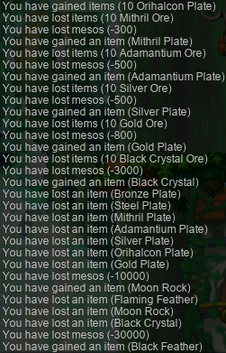
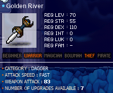
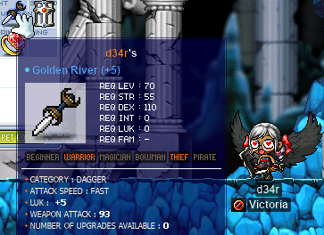

# rangifer’s diary: pt. lxiii

## Massive tangent

In “Taxonomising odd jobs, pt. iii: Exploring the space of possible taxonomies. §4”, I talked about [weak orderings](https://en.wikipedia.org/wiki/Weak_ordering). I mentioned that weak orderings are enumerated by the [ordered Bell numbers (a.k.a. Fubini numbers)](https://en.wikipedia.org/wiki/Ordered_Bell_number), that is to say, the total number of possible weak orderings over a [set][set] of 𝑛 elements is just the 𝑛th ordered Bell number. And I asked what the 45th ordered Bell number is, because at the time of writing, [the list of odd jobs on the **Oddjobs** website](https://oddjobs.codeberg.page/odd-jobs.html) had a length of 45. [The OEIS entry](https://oeis.org/A000670) only lists the ordered Bell numbers up to 𝑛 = 20, so I had to calculate the 45th element in the sequence myself. To do this, I looked at two of the formulae that the relevant English Wikipedia article gives, and wrote some [Python][python] functions based on those formulae. Each of the Python implementations has the same observable behaviour (input a [natural number](https://en.wikipedia.org/wiki/Natural_number) 𝑛, and the function spits out the 𝑛th ordered Bell number as its output), but they differ in their approaches and in their performance characteristics (time spent computing, memory usage). Although it’s obviously not relevant to what the series is trying to do (taxonomise odd jobs), I did some very informal benchmarking to compare the Python implementations of such a `fubini(n)` function, because I’m into that kind of thing, I guess. I dunno, I was just curious.

After finishing that entry, I allowed my curiosity to get the better of me, and I continued looking at implementations of this rather simple mathematical function. Out of the Python implementations that I wrote, the implementation that most programmers would likely reach for (for its familiar use of [for loops](https://en.wikipedia.org/wiki/For_loop) and its predictable performance) would be the straightforward [imperative](https://en.wikipedia.org/wiki/Imperative_programming) implementation, which I called simply `fubini`. Knowing that Python, as a characteristically [interpreted][interpreter] language, does not [optimise](https://en.wikipedia.org/wiki/Optimizing_compiler) programs before executing them (we’re just using [CPython](https://en.wikipedia.org/wiki/CPython) here, sorry for any [PyPy](https://en.wikipedia.org/wiki/PyPy) fans out there\*), I wanted to optimise the `(-1) ** (k - j)` expression that occurs within the definition of `fubini`. I called this new function `fubini_pow`:

```python
def fubini_pow(n):
    """
    ``fubini``, but with some optimisations focussed around calculating
    exponents.
    """

    a = 0
    for k in range(0, n + 1):
        for j in range(0, k + 1):
            #   (-1) ** (k - j)
            # = -1 if (k - j) % 2    else 1
            # = -1 if (k - j) & 0x01 else 1
            # = -1 if (k ^ j) & 0x01 else 1
            a += (-choose(k, j) if (k ^ j) & 0x01 else choose(k, j)) * j ** n

    return a
```

Obviously, taking −1 to an [integer](https://en.wikipedia.org/wiki/Integer) power returns −1 if the power is odd, and +1 if the power is even. So `(-1) ** (k - j)` can be optimised to `-1 if (k - j) % 2 else 1`. But there is actually a better way to check for the [parity][parity] of `k - j`: testing the [least significant bit (LSB)](https://en.wikipedia.org/wiki/Bit_numbering#Least_significant_bit). So we can optimise to `-1 if (k - j) & 0x01 else 1`. But, because we only care about the LSB of `k - j`, we don’t really need to perform the full subtraction of `j` from `k`. A few napkin-scribbles later, and I figured out that taking the [bitwise XOR](https://en.wikipedia.org/wiki/Exclusive_or#Bitwise_operation) of `k` and `j` will have the same effect on the LSB as subtracting them. So we can optimise to `-1 if (k ^ j) & 0x01 else 1`. And, instead of multiplying `choose(k, j)` by this result (which is always either `-1` or `1`), we can avoid multiplication entirely by inlining `choose(k, j)` into each branch of the `if` statement, and using [unary numeric negation](https://en.wikipedia.org/wiki/Additive_inverse) (`-`) instead. As we will see, this series of optimisations does indeed speed up the program, although as you’d expect, the performance gain is modest.

I also changed how `fubini_rec` performs its [memoisation](https://en.wikipedia.org/wiki/Memoization). In the previous diary entry, I (somewhat embarrassingly) immediately reached for a [hash map](https://en.wikipedia.org/wiki/Hash_table), writing `memo = {0: 1}`. This is perfectly correct, and results in neat-looking code as a result of hash maps being built-in objects in Python. However, it’s kind of a dumb idea, because we know exactly what the set of keys in this map is going to be: {`0`, `1`, `2`, …, `n - 1`, `n`}. So what we actually want is an [array](https://en.wikipedia.org/wiki/Array_data_structure)! This changes the code only slightly, resulting in the following implementation:

```python
def fubini_rec(n):
    memo = [None] * (n + 1)
    memo[0] = 1

    def a(m):
        memo_val = memo[m]
        if memo_val is not None:
            return memo_val

        fubini_m = sum((choose(m, i) * a(m - i)) for i in range(1, m + 1))
        memo[m] = fubini_m

        return fubini_m

    return a(n)
```

And I used [`timeit`](https://docs.python.org/3/library/timeit.html) to write up a simple — but still more proper than last time — benchmarking program for these Python implementations.

I was curious to see how these functions might perform if they were written using properly-optimised and [compiled](https://en.wikipedia.org/wiki/Compiler) code, compiled down to some [x86-64](https://en.wikipedia.org/wiki/X86-64) [machine code](https://en.wikipedia.org/wiki/Machine_code) to be run natively by my CPU. I’m no expert in numeric computing, so I’m sure some folks can do better, but in my case I just reached for [Rust][rust] and tried to reasonably translate my Python code into that language. Under my belt, I had the [rug](https://crates.io/crates/rug) crate, allowing me to easily harness the power of [GMP](https://en.wikipedia.org/wiki/GNU_Multiple_Precision_Arithmetic_Library) to work with [arbitrary-precision](https://en.wikipedia.org/wiki/Arbitrary-precision_arithmetic) integers. Arbitrary precision is necessary here, as the ordered Bell numbers are a [combinatorial](https://en.wikipedia.org/wiki/Combinatorics) sequence, so they grow [really quickly](https://en.wikipedia.org/wiki/Large_numbers). In Python, we didn’t have to think about it, because Python will automatically switch to using arbitrary-precision integers under the hood, any time that an integer exceeds the capacity of a single [word][word].

In the end, my Rust implementations looked something like:

<details>
<summary>lib.rs</summary>

```rust
/// `fubini(n)` is the `n`th Fubini number (a.k.a. the `n`th ordered Bell
/// number).
#[inline]
pub fn fubini(n: u32) -> Integer {
    let mut a = Integer::new();
    for k in 0..=n {
        for j in 0..=k {
            a += (-1i32).pow(k - j)
                * Integer::binomial_u(k, j).complete()
                * Integer::u_pow_u(j, n).complete();
        }
    }

    a
}

/// `fubini`, but with some optimisations focussed around calculating
/// exponents.
#[inline]
pub fn fubini_pow(n: u32) -> Integer {
    let mut a = Integer::new();
    for k in 0..=n {
        for j in 0..=k {
            a += if (k ^ j) & 0x01 == 0 {
                Integer::binomial_u(k, j).complete()
            } else {
                -Integer::binomial_u(k, j).complete()
            } * Integer::u_pow_u(j, n).complete();
        }
    }

    a
}

/// `fubini` defined by `sum`ming iterators, instead of using explicit loops.
#[inline]
pub fn fubini_gen(n: u32) -> Integer {
    (0..=n)
        .map(|k| (0..=k).map(move |j| (k, j)))
        .flatten()
        .map(|(k, j)| {
            (-1i32).pow(k - j)
                * Integer::binomial_u(k, j).complete()
                * Integer::u_pow_u(j, n).complete()
        })
        .sum()
}

/// `fubini_gen`, but MOAR THREDZ!!!
#[inline]
pub fn fubini_par(n: u32) -> Integer {
    (0..=n)
        .into_par_iter()
        .map(|k| (0..=k).into_par_iter().map(move |j| (k, j)))
        .flatten()
        .map(|(k, j)| {
            (-1i32).pow(k - j)
                * Integer::binomial_u(k, j).complete()
                * Integer::u_pow_u(j, n).complete()
        })
        .sum()
}

/// `fubini_par`, but I re-implement `sum`?
#[inline]
pub fn fubini_par_hack(n: u32) -> Integer {
    (0..=n)
        .into_par_iter()
        .map(|k| (0..=k).into_par_iter().map(move |j| (k, j)))
        .flatten()
        .map(|(k, j)| {
            (-1i32).pow(k - j)
                * Integer::binomial_u(k, j).complete()
                * Integer::u_pow_u(j, n).complete()
        })
        .reduce(|| Integer::new(), |acc, x| acc + x)
}

/// Do **not** use this function. It is only here for illustrative purposes,
/// and is completely useless for any significantly large values of `n`.
///
/// Implements `fubini` using a naïve recursive method. I think the runtime is
/// Ω(n!).
#[inline]
pub fn fubini_rec_naive(n: u32) -> Integer {
    if n == 0 {
        1.into()
    } else {
        let mut a = Integer::new();
        for i in 1..=n {
            a += Integer::binomial_u(n, i).complete() * fubini_rec_naive(n - i)
        }

        a
    }
}

/// Implements `fubini` using recursion, but memoises, in order to make the
/// performance (read: asymptotic runtime behaviour) reasonable.
///
/// <https://en.wikipedia.org/wiki/Dynamic_programming>
#[inline]
pub fn fubini_rec(n: u32) -> Integer {
    let mut memo = vec![Integer::new(); (n + 1) as usize];
    memo[0].assign(1);

    fn a(m: u32, memo: &mut [Integer]) -> Integer {
        let memo_val = &memo[m as usize];
        if memo_val != &0 {
            return memo_val.clone();
        }

        let mut fubini_m = Integer::new();
        for i in 1..=m {
            fubini_m += Integer::binomial_u(m, i).complete() * a(m - i, memo);
        }

        memo[m as usize] = fubini_m.clone();

        fubini_m
    }

    return a(n, &mut memo);
}
```

</details>

Naturally, the Rust implementations look a good deal noisier than their corresponding Python implementations, as we now have essentially total control over [memory management](https://en.wikipedia.org/wiki/Memory_management). One thing that we can immediately note is that the Rust implementation of `fubini_pow` isn’t very useful. It’s left there for reference, but in reality, optimising “−1 to an integer power” is a trivial task for any optimising compiler ([LLVM](https://en.wikipedia.org/wiki/LLVM), in our case). The manual optimisation that we did with Python is done here for us automatically, making the Rust versions of `fubini` and `fubini_pow` effectively identical, after [code generation][codegen].

Everything else is pretty self-explanatory here, considering that they are more or less one-to-one translations of the Python implementations. I did, however, add the `fubini_par` and `fubini_par_hack` functions, which make use of [rayon](https://crates.io/crates/rayon) to turn `fubini_gen` into a [multithreaded][multithreading] version of the same thing, with very minimal changes to the code. The low effort required to make `fubini_gen` [parallel](https://en.wikipedia.org/wiki/Parallel_computing) by slapping rayon on it was enough to [tempt me to do it](https://en.wikipedia.org/wiki/Impulsivity). So I did. That’s not to say that rayon produces a good and reasonably-close-to-optimal parallel computation of ordered Bell numbers here… again, I was just goofing off. I also realised just now (oops) that the [cloning](https://doc.rust-lang.org/std/clone/trait.Clone.html) occuring in `return memo_val.clone();` (within `fubini_rec`) is probably not necessary. Oh well.

In any case, I benchmarked these functions. As mentioned before, `timeit` was used for benchmarking the Python code, and for the Rust code, [criterion](https://crates.io/crates/criterion) was used. This probably skews the results in favour of Python a bit, as criterion will spit out its best estimation of a “representative” timing (criterion uses fairly rigourous statistical methodology), whereas our Python benchmarking just takes the best time of five trials (each trial being the [arithmetic mean](https://en.wikipedia.org/wiki/Arithmetic_mean) of usually a few hundred iterations). That being said, the results are at least reasonably comparable. The benchmarking was done on an [Intel](https://en.wikipedia.org/wiki/Intel) i7-4510U CPU running at 2\.00 G[Hz](https://en.wikipedia.org/wiki/Hertz); this is a [laptop](https://en.wikipedia.org/wiki/Laptop) processor, although I did not have anything else of significance (not even any [display server](https://en.wikipedia.org/wiki/Windowing_system) whatsoever — completely [headless](https://en.wikipedia.org/wiki/Headless_computer) and accessed only via [SSH](https://en.wikipedia.org/wiki/Secure_Shell)) running concurrently with the benchmarks.

<details>
<summary>Benchmarking results</summary>

The x-axis here is the `n` value, and the y-axis is the runtime (in [ms](https://en.wikipedia.org/wiki/Millisecond)) of `f(n)`, for the given implementation of `f`. All graphs were generated using [gnuplot](https://en.wikipedia.org/wiki/Gnuplot), with the [Qt][qt] backend.

")

Looking at the Python implementations, `fubini` and `fubini_gen` appear to be tied — neither one is consistently faster than the other, and they always are very similar. This may come as no surprise, as they are essentially the same implementation, but it’s good to know that using generators in this way has no overhead in Python! Coming in consistently faster (albeit only mildly faster) is `fubini_pow`, proving that the hand-optimised −1-exponentiation did help a bit. And then, considerably faster is `fubini_rec`, running roughly ≈1\.26 times faster than `fubini_pow` for `n = 250`.

Looking at the Rust implementations, it’s immediately clear that they are (as expected) far faster than the corresponding Python ones. In fact, they’re so much faster that it’s difficult to distinguish the Rust implementations from one another in this graph. For that, we have the same graph, but with the Python implementations removed:

")

Like with Python, `fubini` and `fubini_gen` are tied. Again, not surprising, but it’s good to know that [rustc](https://doc.rust-lang.org/rustc/what-is-rustc.html) & LLVM are collectively smart enough to compile the two functions down to the same thing. And, lo & behold, our parallel rayon-based implementations of `fubini_gen` (viz. `fubini_par` & `fubini_par_hack`) do achieve some measurable speedup compared to their sequential counterparts. The speedup over `fubini_gen` for `n = 250` is a factor of roughly ≈1\.49 for `fubini_par` and ≈1\.57 for `fubini_par_hack`. Keep in mind that the number of CPUs here is four. And, as I kind of suspected, `fubini_par_hack` does seem to be a bit faster than `fubini_par`, even though it just re-implements [`.sum()`](https://docs.rs/rayon/1.5.1/rayon/iter/trait.ParallelIterator.html#method.sum). I would have to actually investigate to see why, but I assume that rug’s implementation of [the `Sum` trait](https://doc.rust-lang.org/std/iter/trait.Sum.html) is not playing nicely with what rayon is trying to do. But, in any case, it seems that just slapping an [`.into_par_iter()`](https://docs.rs/rayon/1.5.1/rayon/iter/trait.IntoParallelIterator.html#tymethod.into_par_iter) or two onto `fubini_gen` is not enough (at least, not with just four CPUs) to beat `fubini_rec`. Like with Python, `fubini_rec` reigns supreme.

</details>

Without comparing all of the numbers here, we can compare the two implementations (Python vs. Rust) of `fubini_rec` (the fastest version within either language) at `n = 250` to get a vague idea of how much time (not to mention memory) we save by switching from Python to Rust: a factor of roughly ≈21\.9. Whew!

Alright, enough useless [software engineering](https://en.wikipedia.org/wiki/Software_engineering) nonsense for now.

<details>
<summary>Footnotes for “Massive tangent”</summary>

\*Testing with PyPy does (as expected) give faster results across the board. Interestingly enough, the performance gains are considerably higher for `fubini_rec` in particular, for smaller values of `n`. It seems PyPy finds some good optimisation that ends up being dominated by the bulk of the arithmetic computation, as `n` gets larger. Maybe some inlining to reduce function call overhead, or better implementation of the cache array. Who knows! As it turns out, PyPy is roughly ≈1\.33 times faster than CPython for `fubini_rec(250)`. For `fubini_rec(50)`, this factor is ≈3\.33!

</details>

## Taxonomising odd jobs, pt. iii: Exploring the space of possible taxonomies. §5

In the previous section (§4) of this part (pt. iii), I talked about weak orderings, and had this to justify it:

> The reason for considering weak orderings is that when we hand-craft our “[phylogenetic tree(s)](https://en.wikipedia.org/wiki/Phylogenetic_tree)”, we may want to start with the most skeletal structure possible: ordering our objects (our odd jobs) in roughly “chronological order” (or rather, some notion of “primitiveness”). This will certainly end up being a weak ordering, as there should be many pairs of objects where we just don’t know if one “came first”, the other one “came first”, or they emerged at “the same time”. If 𝑂 is our set of odd jobs, and we had such a pair of objects (𝑎, 𝑏) [∈][element] 𝑂 [×](https://en.wikipedia.org/wiki/Cartesian_product) 𝑂, then under our weak ordering (𝑂, ≤), it would be true that 𝑎 ≤ 𝑏 [∧](https://en.wikipedia.org/wiki/Logical_conjunction) 𝑏 ≤ 𝑎. We can then impose this ordering, later, onto our [tree][tree]… or whatever it is. We shall investigate this next time, I guess.

Well, it is now “next time”, so I want to cover this, at least somewhat.

### Trees are for treehouses

What is a tree? Well, a [tree](https://en.wikipedia.org/wiki/Tree) is a [perennial plant](https://en.wikipedia.org/wiki/Perennial_plant) with an elongated [stem/trunk][trunk], supporting [branches](https://en.wikipedia.org/wiki/Branch), and — in most species — [leaves](https://en.wikipedia.org/wiki/Leaf).

Just kidding. A tree is actually a [connected][connectivity] a[cyclic][cycle] undirected graph. Unfortunately (or fortunately…?), this means that we are going to end up in “[graph theory](https://en.wikipedia.org/wiki/Graph_theory) 101” territory before we can talk about our leafy friends. So let’s break this down a bit:

A **graph** is, informally, a bunch of _vertices_ (which are basically just… objects) that may or may not be joined to one another. Two vertices are _joined_ when there is an _edge_ joining them. Usually, when we visually represent graphs, we represent a vertex with a circle, and we represent an edge with a line that connects two circles. But graphs are really abstract, so they can represent a lot of things, not just circles and lines. Formally, a graph 𝐺 is a pair 𝐺 = (𝑉, 𝐸), where 𝑉 is a set of objects called _vertices_, and 𝐸 is a set whose members are sets of [cardinality](https://en.wikipedia.org/wiki/Cardinality) exactly 2, where each member of such a 2-set is also a member of 𝑉. These 2-sets are called _edges_.

An **undirected graph** is the same thing as what I defined as a “graph” above. The reason for specifying that a graph is “undirected” is to clearly distinguish from a _directed_ graph, which is a graph whose edges have a specified direction, from one vertex to the other. When we visually represent directed graphs, we usually show the direction of an edge by adding an arrowhead to the corresponding one of its ends (so it looks like “→” or “←”). Formally, a directed graph is defined similarly to an undirected graph, except that instead of defining 𝐸 in terms of 2-sets, 𝐸 [⊆](https://en.wikipedia.org/wiki/Subset) {(𝑥, 𝑦) ∈ 𝑉 × 𝑉 [|](https://en.wikipedia.org/wiki/Set-builder_notation) 𝑥 ≠ 𝑦}.

An **acyclic graph** is a graph that has no cycles. If you have a vertex 𝑥, and you can walk from 𝑥 back to 𝑥 along one or more edges of the graph, without walking along any given edge more than once, that’s called a _cycle_. So if you’re walking along an acyclic graph, then you cannot leave your current vertex, and then return back to that vertex, without re-treading any edges. Formally, a _walk_ on a graph 𝐺 = (𝑉, 𝐸) is a sequence of edges ⟨𝑒₁, 𝑒₂, …, 𝑒ₙ₋₂, 𝑒ₙ₋₁⟩ (where 𝑒ᵢ ∈ 𝐸) such that there exists a sequence of vertices ⟨𝑣₁, 𝑣₂, …, 𝑣ₙ₋₁, 𝑣ₙ⟩ (where 𝑣ᵢ ∈ 𝑉), so that for all 𝑖 \< 𝑛, 𝑒ᵢ = {𝑣ᵢ, 𝑣ᵢ₊₁}. (For directed graphs, we can just change that last equality to 𝑒ᵢ = (𝑣ᵢ, 𝑣ᵢ₊₁).) A _trail_ is a walk where 𝑖 ≠ 𝑗 [→](https://en.wikipedia.org/wiki/Material_conditional) 𝑒ᵢ ≠ 𝑒ⱼ. A _circuit_ is a nonempty trail where 𝑣₁ = 𝑣ₙ. A _cycle_ is a circuit where 𝑣ᵢ = 𝑣ⱼ [iff](https://en.wikipedia.org/wiki/If_and_only_if) 𝑣ᵢ = 𝑣ⱼ = 𝑣₁ = 𝑣ₙ. And, since we’re talking about trails, a _path_ is a trail where 𝑖 ≠ 𝑗 → 𝑣ᵢ ≠ 𝑣ⱼ.

A **connected graph** is a graph in which every vertex is connected to every other vertex. A pair of vertices is _connected_ if you can walk, along edges, from one to the other. If a graph has one or more pairs of vertices that are not connected (that are _disconnected_), then the graph is a _disconnected graph_. Every graph is either connected, or else disconnected. Formally, two vertices (𝑣ᵢ, 𝑣ⱼ) ∈ 𝑉 × 𝑉 of a graph 𝐺 = (𝑉, 𝐸) are _connected_ when there exists a walk on 𝐺 whose vertex sequence is ⟨𝑣ᵢ, …, 𝑣ⱼ⟩. Two vertices (𝑣ᵢ, 𝑣ⱼ) ∈ 𝑉 × 𝑉 of a graph 𝐺 = (𝑉, 𝐸) are _disconnected_ iff they are not connected. A graph 𝐺 = (𝑉, 𝐸) is a _connected graph_ when, for all (𝑣ᵢ, 𝑣ⱼ) ∈ 𝑉 × 𝑉, (𝑣ᵢ, 𝑣ⱼ) is connected. A graph is a _disconnected graph_ iff it is not a connected graph. For directed graphs, we can define a weaker version of connectivity, _weakly connected_, which describes two vertices that would be connected if all edges in the graph became undirected (via a function that maps any edge (𝑣ᵢ, 𝑣ⱼ) [↦][map] {𝑣ᵢ, 𝑣ⱼ}).

When a graph is acyclic, as defined above, there is at most one path between any given pair of vertices. The reason is that, if there were two distinct paths 𝑝₁ ≠ 𝑝₂ between a pair of vertices (𝑣₁, 𝑣₂), we could take 𝑝₁ from 𝑣₁ to 𝑣₂, and then 𝑝₂ to go from 𝑣₂ to 𝑣₁. And in there somewhere, would be a cycle! A (very) informal proof of this might look like: If the two paths share no edges, then chaining (i.e. connecting end-to-end) the paths would form a cycle (or, if it forms a circuit instead, that’s okay — every circuit contains at least one cycle). If the two paths do share edges, then we can manipulate our graph 𝐺 to produce a new graph 𝐺′ in which all of these shared edges have been [contracted](https://en.wikipedia.org/wiki/Edge_contraction). Edge contraction preserves paths in the sense that any path in 𝐺 that connects two of its vertices also exists in 𝐺′, albeit with some edges possibly removed from the sequence — remember that empty (i.e. length 0) paths are perfectly valid. And there are still two distinct paths 𝑝₁′ ≠ 𝑝₂′ that connect our vertices (𝑣₁′, 𝑣₂′), as the paths were distinct before, so they could not possibly have shared all of their edges. But now, thanks to the edge contraction, chaining 𝑝₁′ with 𝑝₂′ definitely forms a cycle — 𝑝₁′ and 𝑝₂′ share no edges. This means that 𝐺′ is cyclic. If 𝐺′ is cyclic, then 𝐺 must be cyclic too, as the only thing that we did to go from 𝐺 to 𝐺′ is contract some edges, which cannot create new cycles, as it does not create new trails (it just shortens them). [By contradiction](https://en.wikipedia.org/wiki/Proof_by_contradiction), any acyclic graph must have at most one path between any given pair of vertices.

If a graph is acyclic _and_ connected (i.e. a tree), then we can strengthen “at most one path between any given pair of vertices” to “_exactly_ one path between any given pair of vertices”. Having less than one (i.e. zero) paths between a pair of vertices is impossible, as all such pairs are connected! This stronger condition is, essentially, what it means for a graph to be a tree.

### Treerarchy

As they are, trees are a tad bit abstract. We can, however, impose some additional structure.

A _rooted tree_ is a tree in which exactly one of the vertices has been designated as the _root_. Every rooted tree 𝐺 = (𝑉, 𝐸) has an associated _tree-order_, which is a [partial order](https://en.wikipedia.org/wiki/Partially_ordered_set) over 𝑉 — call it (𝑉, ≤) — such that (let 𝑣, 𝑤 ∈ 𝑉) 𝑣 ≤ 𝑤 iff the path from the root to 𝑤 passes through 𝑣. This path from the root is guaranteed to exist and to be unique, because of the properties of trees discussed above.

Another ordering that we can impose on a rooted tree is that of depth. The _depth_ of a vertex is the length of the path between it and the root. Naturally, this produces a weak ordering ((𝑉, ≲) such that 𝑣 ≲ 𝑤 iff the depth of 𝑣 is less than or equal to the depth of 𝑤), as depth values are natural numbers, and two distinct vertices can possibly have the same depth. In the special case of phylogenetic trees, this ordering can have a special meaning when paired with a [molecular clock](https://en.wikipedia.org/wiki/Molecular_clock) hypothesis: each depth value (or rather, the [equivalence class](https://en.wikipedia.org/wiki/Equivalence_class) associated with such a depth value) is essentially an evolutionary generation, and larger values correspond to times that are further in the future. However, in our case (taxonomising odd jobs), this depth-order won’t really have a meaning (especially not for our hand-crafted trees).

Although depth-order may not be quite so useful, the tree-order is what we want to combine with the hypothetical weak ordering of our set of odd jobs that was mentioned in §4 (and was quoted above). Let 𝑂 be our set of odd jobs, and let (𝑂, ≲) be our weak ordering of odd jobs by “primitiveness” (or whatever), where 𝑜 ≲ 𝑝 (𝑜, 𝑝 ∈ 𝑂) is interpreted as “𝑜 is more ‘primitive’ than 𝑝”. Suppose that we produce a single rooted tree 𝑇 = (𝑂, 𝐸), which has a tree-order (𝑂, ≤). **Then we want to maintain the following invariant:** 𝑜 ≤ 𝑝 → 𝑜 ≲ 𝑝. I should stress that this is a one-way implication, **not** an iff.

### Forestry

We can lift the connectedness requirement on our definition of trees, resulting in simply an acyclic undirected graph (that is not necessarily connected). This is known as a _forest_, because such a graph can be thought of as the [disjoint union](https://en.wikipedia.org/wiki/Disjoint_union_of_graphs) of zero or more trees. Formally, the _disjoint union_ of two graphs 𝐺₁ = (𝑉₁, 𝐸₁) and 𝐺₂ = (𝑉₂, 𝐸₂) is another graph 𝐺₁ + 𝐺₂ = (𝑉₁ [⊔](https://en.wikipedia.org/wiki/Disjoint_union) 𝑉₂, 𝐸₁ ⊔ 𝐸₂). Taking the disjoint union of two or more nonempty trees necessarily results in a disconnected graph, despite the fact that each tree is itself, by definition, connected.

Forests could be useful for our case, because they allow for two objects to be well and truly unrelated, by simply being disconnected within the graph representation. This would correspond, in the biological case, to two species who have no [common ancestor(s)](https://en.wikipedia.org/wiki/Common_descent) whatsoever. In the biological case, there is, empirically, apparently no such thing — it is commonly understood that all known lifeforms ultimately decend from a [last universal common ancestor](https://en.wikipedia.org/wiki/Last_universal_common_ancestor), which makes every species part of a colossal phylogenetic tree spanning some 3 to 5 [billion years](https://en.wikipedia.org/wiki/Aeon#Astronomy_and_cosmology) or so. In our case, however, it may very well make sense to have a pair of odd jobs be completely unrelated.

Because we want our trees to be rooted, we will end up with a _rooted forest_, which is just a disjoint union of zero or more rooted trees. Let 𝑇₁, 𝑇₂, …, 𝑇ₙ₋₁, 𝑇ₙ be our rooted trees, let ℐ = {𝑖 ∈ ℕ | 1 ≤ 𝑖 ≤ 𝑛} be the [index set](https://en.wikipedia.org/wiki/Index_set) for our collection of trees, and let 𝐹 = [∑](https://en.wikipedia.org/wiki/Disjoint_union_of_graphs)𝑇ᵢ (for each 𝑖 ∈ ℐ) be our rooted forest. Each rooted tree 𝑇ᵢ = (𝑂ᵢ, 𝐸ᵢ) has a vertex set 𝑂ᵢ ⊆ 𝑂, as well as a tree-order (𝑂ᵢ, ≤ᵢ). Then we can generalise the invariant above to: [∀](https://en.wikipedia.org/wiki/Universal_quantification)𝑖 ∈ ℐ ∀(𝑜, 𝑝) ∈ 𝑂ᵢ[²](https://en.wikipedia.org/wiki/Cartesian_product) \[𝑜 ≤ᵢ 𝑝 → 𝑜 ≲ 𝑝\].

## A little card-hunting with capre

As readers of this diary may know, I’ve done the most card-hunting of any of my characters on my [woodsmaster](https://oddjobs.codeberg.page/odd-jobs.html#woodsman), **capreolina**. Well, I went back to a little more card-hunting where I last left off: Orbis.

<details>
<summary>capre in Ossyria, on the card-hunt</summary>

I had to take care of the rest of the big cats: [Lioners](https://maplelegends.com/lib/monster?id=5120002) & [Grupins](https://maplelegends.com/lib/monster?id=5120003).


Once that was over with, I was done with Orbis entirely (minus [Eliza](https://maplelegends.com/lib/monster?id=8220000), as I refuse to card-hunt area bosses that are required for quests). So I headed to the bottom of the respective tower, to farm some more cards at Aqua Road. I have farmed at the upper regions of Aqua Road before, so I already had quite a few of the sets finished (and some partially finished). But I needed some of the ones to the far west, near the base of the Orbis Tower. So I farmed around there (e.g. in [Ocean I.C](https://maplelegends.com/lib/map?id=230010000)):


The [Poison Poopas](https://maplelegends.com/lib/monster?id=4230201) were giving me a bit of a hard time, but all I had to do was complain about it in alliance chat, and suddenly they started spitting out more cards than I even needed. Hooray for 6/5 Poison Poopas~

</details>

And, while I was hunting, **Battlesage** (**Permanovice**, **Dreamscapes**, **Hanger**), an F/P [gish](https://oddjobs.codeberg.page/odd-jobs.html#gish) also of **Oddjobs**, pulled me aside to show me 3 “bois”:


Three fine-looking [gish weapon](https://maplelegends.com/lib/equip?id=01332053)s! And in every colour of the rainbow… that yellow-glowing one is really somethin’ else.

## A little questing with alces

I did some more questing in Victoria Island with my undead [daggermit](https://oddjobs.codeberg.page/odd-jobs.html#dagger-assassin) **alces**! I went to wrap up the [Icarus](https://maplelegends.com/lib/npc?id=1052106) questline, so I had to get some [Alligator Skin Pouch](https://maplelegends.com/lib/etc?id=4031164)es:


…And [Tablecloth](https://maplelegends.com/lib/etc?id=4000035)s:


Oh, and I have to 1v1 some swamp plants to the death, as well. We cant go around making magical flying pills without some swamp leaves with seemingly-too-low drop rates:


And there it is; the magical flying cape of legend:

")

[Nice!](https://maplelegends.com/lib/equip?id=01102055)

Oh, and I prepared the ETC items that I needed for [the Sauna Robe questline](https://bbb.hidden-street.net/quest/victoria-island/mr-wetbottoms-secret-book). I ran around to various NPCs, and lo and behold, a robe of my own:


Stylish.

And I headed to deep Sleepywood to work on [Muirhat](https://maplelegends.com/lib/npc?id=1092007)’s monster-slaying questline. Next up was [Drakes](https://maplelegends.com/lib/monster?id=5130100) and [Ice Drakes](https://maplelegends.com/lib/monster?id=6230600):


NIce Drake card.

And then, I started Muirhat’s last quest, along with concurrently starting the latter half of [A Spell That Seals Up a Critical Danger](https://bbb.hidden-street.net/quest/victoria-island/a-spell-that-seals-up-a-critical-danger) — both of these quests require at least some [Tauromacis](https://maplelegends.com/lib/monster?id=7130100) kills, although the latter quest is clearly considerably more difficult. A tad ironic, considering how much lower-level it is, and how much worse the reward is…


And, as usual, my suspicion that [Taurospears](https://maplelegends.com/lib/monster?id=7130101) have a much higher card drop rate than Tauromacis is confirmed again and again… I’ll have to finish up this quest later, it’s a real doozy.

## Permanovice’s level 100 party~

I was honoured to attend the level 100 party of [STRginner](https://oddjobs.codeberg.page/odd-jobs.html#str-beginner) **Permanovice**! The first part of the party was to engage in ritualistic snail murder, which Permanovice assured us was a very sacred permabeginner ritual that he needed to undergo in order to achieve level 100 beginner. As it happened, by the time that the party’s scheduled date rolled around, the summer event had started. So the bonus event EXP made it so that the sequence [Snail](https://maplelegends.com/lib/monster?id=0100100) → [Blue Snail](https://maplelegends.com/lib/monster?id=0100101) → [Red Snail](https://maplelegends.com/lib/monster?id=0130101) → [Mano](https://maplelegends.com/lib/monster?id=2220000) would level Permanovice prematurely, before getting to the Mano. Oh well, the party was still on and starting in [Lith Harbour](https://maplelegends.com/lib/map?id=104000000):


Although I had to leave early and didn’t experience the omok tourney, the party went as planned, and we even found a Mano :) Congrats again on the big level 100!!! ^^

## capre trawling the Phantom Forest w/ NZPally & Yohichi

I teamed up with **NZPally** again on my [woodsmaster](https://oddjobs.codeberg.page/odd-jobs.html#woodsman) capreolina, to kill some more bosses. We also teamed up with bishop **Yohichi**, an old friend of NZPally’s, who came with us to the Phantom Forest in search of [HH](https://maplelegends.com/lib/monster?id=9400549)’s [head](https://maplelegends.com/lib/etc?id=4031903) and [BF](https://maplelegends.com/lib/monster?id=9400575)’s [toe](https://maplelegends.com/lib/etc?id=4032013).

With some luck, and with NZPally’s relatively extensive knowledge of the Phantom Forest’s geography (I’m no newb to the forest myself, but I admit that I only go to a few places within it, so my knowledge is not very broad), we found an HH (actually, 2 or 3 of them in total):


And we also found some Bigfeet as well! Here I am, confidently standing just far enough away from the thing that will instantly kill me if it touches me:


All in all, I got quite a bit of EXP this session, and capreolina is now level 123~!! Level 9 [SE](https://maplelegends.com/lib/skill?id=3121002) yayy~

## Visiting the Temple of Time for the first… time

Believe it or not, I’ve never actually checked out the ol’ [ToT](https://maplelegends.com/lib/map?id=270000100). I suppose I never really had any reason to go there, and I wasn’t even aware of how to get there… As it turns out (for anyone not already familiar), ToT is accessible via [Leafre](https://maplelegends.com/lib/map?id=240000000) — in particular, you go there by going to [the same map that you would visit if you were headed to Orbis](https://maplelegends.com/lib/map?id=240000110), but instead of talking to the ticketing guy there to board the ship to Orbis, you go wayyy on up to the tippy-top of the map to talk to [Corba](https://maplelegends.com/lib/npc?id=2082003). As it turns out, Corba is a retired dragon trainer. What Corba is doing hanging out at the “cabin” from Leafre to Orbis, I’m not sure, but in any case, Corba’s experience with dragon training proves useful to any intrepid Minar Forest explorer. The reason for this is that Corba can not only train dragons, but can simply turn you into one!:


Wowie. Besides being cute, turning into a dragon means that no ship, or anything like that, is required to fly through the skies — you have your own wings now. While this is generally fun and all, the _real_ purpose is to fly high above the clouds, where among the heavens you can find the apparently [Ancient-Greek](https://en.wikipedia.org/wiki/Ancient_Greek_architecture)-inspired architecture (think Orbis\*, but everything looks bigger and more expensive) of the Temple of Time.


Besides its grandiose & ancient-but-pristine architecture, the Temple of Time attempts to invoke themes of… well, time, obviously. Much like time elsewhere, the time in this region of MapleStory [appears to march unceasingly and in a single direction](https://en.wikipedia.org/wiki/Arrow_of_time) — yet, since we are talking about turning into a dragon to fly into the heavens where there’s an inexplicable giant floating palace, why not mess with time itself, as well?

So, this is our task: for vague and unspecified reasons, something is funky (and not in a good way) with the Temple of Time, and it is our job to investigate. But, in order to do so, we must walk down Memory Lane — and not just anyone can do that. In order to uncover these memories that are apparently too old to be our own (and yet, they are), we need permission. So for that, we must prove our strength to [the keeper of the Temple](https://maplelegends.com/lib/npc?id=2140000). I played as my pure [STR bishop](https://oddjobs.codeberg.page/odd-jobs.html#str-mage) **cervid**, and teamed up with **ducklings**, **Harlez**, **Gruzz**, and **xBowtjuhNL** to do just that:


The ToT quests are simple: kill 999 monsters, thus completing your current quest, and the next map is then opened up for you. The next quest asks to kill 999 monsters in this new map, and we rinse & repeat.


After [Memory Monks](https://maplelegends.com/lib/monster?id=8200001) (which I know as simply “pointy monks”) come [Memory Monk Trainees](https://maplelegends.com/lib/monster?id=8200002) (which I know as simply “pointy monks w/ babies”):


These guys are no joke: the ones with babies are level 94, with a whopping 45k HP a piece. Everpresent are the [Eyes of Time](https://maplelegends.com/lib/monster?id=8200000) (which I know as simply “flappy hourglasses”), which have 24k HP a piece and some nasty magical attacks… although you are never required (at least, not directly) by the quests to kill them.


Next are the [Memory Guardians](https://maplelegends.com/lib/monster?id=8200003) (which I know as simply “gassy armour”), level 98 with 53k HP a piece:


The EXP so far has been fairly decent, which is great for cervid. I suspect that these quests are reasonably doable by cervid when soloing (at least, the first few ones that I’ve seen), although in that case the EPH would be much less useful… and it would make an already tedious questline even more so!


Now, on to complete the [pointy armour](https://maplelegends.com/lib/monster?id=8200004) quest…

<details>
<summary>Footnotes for “Visiting the Temple of Time for the first… time”</summary>

\*Funnily enough, it seems that, like Orbis, the Temple of Time has its own “Goddess” (who is also often referred to simply as “Goddess”) who is, again like the Goddess of Orbis, mysteriously [MIA](https://en.wiktionary.org/wiki/missing_in_action). In the case of Orbis, reviving [Minerva the Goddess](https://maplelegends.com/lib/npc?id=2013002) (and thus, presumably, relieving her from being a broken stone statue for all eternity) is the crux of the [Orbis Party Quest](https://maplelegends.com/lib/map?id=200080101). In the case of ToT, the Goddess’s name is Rhinne, and as the Goddess [of time itself](https://en.wikipedia.org/wiki/Chronos), she exists in an [eternal state of slumber](https://en.wikipedia.org/wiki/Suspended_animation_in_fiction). What exactly this is ultimately supposed to mean, I’m not sure. But, then again, I’m _also_ not sure exactly what else I’d expect the personification of time to be doing.

</details>

## Outland BPQ w/ woosa

I also, with much the same crew, hit up the PQ that comes with the current summer event: Boss (Rush) Party Quest, or BPQ for short. I hopped onto my [darksterity knight](https://oddjobs.codeberg.page/odd-jobs.html#dex-warrior) **rusa** and was transported back to [MPQ](https://maplelegends.com/lib/map?id=261000021), with the same folks with whom I MPQ’d originally ^^:


Although, this time we didn’t have to save [Romeo](https://maplelegends.com/lib/npc?id=2112009), and [Franken Lloyd](https://maplelegends.com/lib/monster?id=9300139) really went down like a chump…

Oh, and also in BPQ, we had the chance to fight [our favourite apocryphal sea lizard](https://en.wikipedia.org/wiki/Leviathan):


And this was about as far as we went, usually. The first time, we tried killing [Papu Clock](https://maplelegends.com/lib/monster?id=8500001) and were able to defeat it, and make it to [Pianus](https://maplelegends.com/lib/monster?id=8510000)… but with only 90 seconds or so on the clock, and with **xBowtjuhNL** having used an [apple](https://maplelegends.com/lib/use?id=2022179) \>w\<

## Vic island questing w/ d34r

I wrapped up what are essentially my last few (sadly) quests on my vicloc [dagger spearwoman](https://oddjobs.codeberg.page/odd-jobs.html#dagger-warrior) **d34r**. The first order of business was two of the same quests mentioned earlier in this entry: [Muirhat](https://maplelegends.com/lib/npc?id=1092007)’s final quest, and [A Spell That Seals Up a Critical Danger](https://bbb.hidden-street.net/quest/victoria-island/a-spell-that-seals-up-a-critical-danger).


Now, doing these quests was really not easy. Tauros have gobs of HP, and [Taurospear](https://maplelegends.com/lib/monster?id=7130101)s in particular pose a problem: level 75, 18k HP, 550 WDEF, 390 MATK, and 30 AVOID… yowza. Combine this with their rather… difficult spawn rates, and yanking the [Spirit Rock](https://maplelegends.com/lib/etc?id=4031215)s out of these fuzzy bull-headed bastards was like pulling teeth.

But, I did get two card sets out of it!


Oh, and I found [this weird book](https://maplelegends.com/lib/etc?id=4001112)?:


I asked [Manji](https://maplelegends.com/lib/npc?id=1022002) about it, but he didn’t seem to know anything about it…

Eventually, the Tauros relented and let me have my Spirit Rocks. So I carried on to do the easier part of that quest: collecting [Wild Kargo’s Spirit Rock](https://maplelegends.com/lib/etc?id=4031213)s.


And with 33 of those also under my belt, I was able to claim my… mildly underwhelming prize:


With that out of the way, I went to do another quest that also involves Tauros (somewhat): [Luke the Security Man’s Wish to Travel](https://bbb.hidden-street.net/quest/victoria-island/luke-the-security-mans-wish-to-travel-warrior-only). This level 50 quest is for warriors only — there are corresponding Victoria Island quests for other archetypes as well, although they differ considerably from one another. This one is a real doozy:


Luke is not kidding about how ridiculous the necessary materials are. In total, I had to collect:

- 3 [Taurospear Horn](https://maplelegends.com/lib/etc?id=4000046)s,
- 50 [Dragon Skin](https://maplelegends.com/lib/etc?id=4000030)s,
- 11 [Orihalcon Plate](https://maplelegends.com/lib/etc?id=4011005)s,
- 1 [Flaming Feather](https://maplelegends.com/lib/etc?id=4001006),
- 1 [Black Crystal](https://maplelegends.com/lib/etc?id=4021008),
- 1 [Bronze Plate](https://maplelegends.com/lib/etc?id=4011000),
- 1 [Steel Plate](https://maplelegends.com/lib/etc?id=4011001),
- 1 [Mithril Plate](https://maplelegends.com/lib/etc?id=4011002),
- 1 [Adamantium Plate](https://maplelegends.com/lib/etc?id=4011003),
- 1 [Silver Plate](https://maplelegends.com/lib/etc?id=4011004),
- 1 [Gold Plate](https://maplelegends.com/lib/etc?id=4011006),
- & 40 [Screw](https://maplelegends.com/lib/etc?id=4003000)s.

Nevertheless, I was determined to complete this quest. So I had to hunt for another Flaming Feather. Readers of this diary will know just how much fun I find it to hunt Flaming Feathers on Victoria Island… Thankfully, after a while of grinding [Red Drake](https://maplelegends.com/lib/monster?id=6130100)s, **xXCrookXx** wished me luck, and it seemed to do the trick!:


Wowee. That could have been a lot worse. Now that I had this rare item out of the way, it was time to do some crafting:



Geez. Thankfully, I was well rewarded for my efforts: an insignificant amount of EXP, and a beat-up warrior helmet that I sold to an NPC within 90 seconds of aquiring it! Thanks Luke.

And I wanted to wrap up just one last quest: [Mrs. Ming Ming’s Second Worry](https://bbb.hidden-street.net/quest/victoria-island/mrs-ming-mings-second-worry). I had this one nearly finished for a long time, and just needed to get around to farming a few more [Pig’s Head](https://maplelegends.com/lib/etc?id=4000017)s. So I did:


And this one, although it may require a whopping 20 Pig’s Heads, does pay pretty well, with none other than our good old friend the [Ribboned Pig Headband](https://maplelegends.com/lib/equip?id=01002441):


50 MAXHP and 12 WDEF! An excellent secondary helmet for the squishier among us~

## d34r & xXCrookXx leave Victoria Island in search of better PQs

Now, being a Victoria Islander is great and all, but there’s just one issue: the PQs. I’m too high level for [KPQ](https://maplelegends.com/lib/map?id=103000800), I’m not a huge fan of [HPQ](https://maplelegends.com/lib/map?id=100000200) (not that the EXP would be very rewarding at level 73), [APQ](https://maplelegends.com/lib/map?id=670010000) sounds great but has some nasty time limits that prevent me from entering my normal state of existence (24/7 PQing), and [SPQ](https://maplelegends.com/lib/map?id=990000000) just ain’t never gonna happen, let’s be real. So it seems that there is only one solution: escaping the island we know as Victoria.

I tried to elope with fellow viclocker **xXCrookXx**, but our first attempt didn’t pan out…:


R.I.P. It seems that Ossyria really _is_ a hoax designed to feed the [crog](https://maplelegends.com/lib/monster?id=8150000)s.

But we didn’t give up. After some effort, we made it all the way to Magatia, where we were just the right level to participate in the Magatia Party Quest:


Just kidding. Both of the above screenshots are actually from BPQ. Speaking of vicloc BPQ, some of the non-boss monsters that are summoned by the bosses in BPQ actually drop cards. Take [Kimera](https://maplelegends.com/lib/monster?id=8220002) for example, who is capable of summoning [Roid](https://maplelegends.com/lib/monster?id=5110301)s that drop [Roid Card](https://maplelegends.com/lib/use?id=2383028)s. We found this out first-hand, when xXCrookXx looted one of these sacred Roid cards:


Of course, these exotic BPQ cards actually are perfectly vicloc-legal, so no one was banned :P

Oh, and also, we went to Mu Lung Gardens to participate in [MLGPQ (Mu Lung Gardens Party Quest)](https://maplelegends.com/lib/map?id=251010404) with [STRginner](https://oddjobs.codeberg.page/odd-jobs.html#str-beginner) **Outside**:


## d34r is stronk!!!

d34r has been using a 6 WATK, 4 STR [Dark Knuckle](https://maplelegends.com/lib/equip?id=01082025) as her main (read: greedy damage) glove for a while now. As I’ve started to accumulate [GFA60](https://maplelegends.com/lib/use?id=2040804)s, I’ve considered scrolling another glove to try to beat that. I struggled for a while, trying to decide on how greedy I should be: be extra greedy and scroll a nice warrior glove that has lots of STR/DEX/WACC/WDEF on it, or be less greedy and scroll a Work Glove of some kind, so that I can give it to a fellow viclocker in need of WATK gloves when I likely fail to make a very good glove? In the end, I decided to be a little less greedy and use some of my scrolls on an [RWG](https://maplelegends.com/lib/equip?id=01082146):


o\_o Holy moly!! The first ≥10 WATK vicloc glove!!! Who ever said I was no good at scrolling????

Now that I had a nice new pair of gloves, I wanted to upgrade my rather sad cape situation. For almost the entirety of d34rs career, she has been using an [ORC](https://maplelegends.com/lib/equip?id=01102053) with 3 DEX and 2 LUK (owie), or more likely, a (+0) [Icarus Cape (2)](https://maplelegends.com/lib/equip?id=01102055) with 4 slots left… for the SPEED…

I had already “boomed” 2 or 3 other nice capes in an attempt to just pass a single [Cape STR 60%](https://maplelegends.com/lib/use?id=2041013), but it seemed that the 60% figure was lying to me. I tried once again on a random [RMC](https://maplelegends.com/lib/equip?id=01102016) that dropped from a [Wild Kargo](https://maplelegends.com/lib/monster?id=6230100) that I killed, and lo and behold, I actually managed to pass a 60% on it. Not just one, either — three in total:


Not bad!

But we’re saving the best for last, here. I have been hunting [Balrog Junior](https://maplelegends.com/lib/monster?id=8130100) for… weeks, months, decades. Millenia. The number of [Mana Elixir](https://maplelegends.com/lib/use?id=2000006)s that I’ve seen this beast drop would be enough to feed a smol village for a year. Eventually, I came to believe that, perhaps, Jr. Rog doesn’t drop [Golden River](https://maplelegends.com/lib/equip?id=1332019)s at all. Perhaps the Golden River is listed in Jr. Rog’s droptable on the MapleLegends library specifically to mess with viclocked dagger warriors. Perhaps, Jr. Rog can read my mind, and knows what I want — and that is why he will not drop it. So, you could almost imagine the sensation that I felt when I saw this happen:


Actually seeing this impossible item flying into the air was enough to make my stomach drop. It took me a minute or two before I actually had the courage to look at the thing and see its WATK value:



Three above average!!!!!!!! That’s eight better than what I was expecting! I admit to taking another few minutes before I had the courage to scroll it, even though I already had 10 [Dagger WATK 60%](https://maplelegends.com/lib/use?id=2043301)s in my inventory. But, again much to my pleasant surprise, it went quite well:



Few times have I ever been so thrilled to have a MapleStory item in my life… My character finally feels complete.

And I got to test out this sleek little dagger when GM buffs were announced, and xXCrookXx and I did an intense 60-minute GM buffs [TfoG](https://maplelegends.com/lib/map?id=105040306) session:


Oh my. GM buffs are wild…

## Getting that T2 before the big day

There are a total of 69 card sets natively available to viclockers, which means that [the tier 2 Monster Book Ring](https://maplelegends.com/lib/equip?id=01119004) is the highest tier that can be achieved. So, it was time for d34r to get to that 60th set and finish off her card-hunting career for good!

The first order of business was actually just to finish off that red tab — I had 5/5 on all of those monsters, except for [Bubbling](https://maplelegends.com/lib/monster?id=1210103)s, of which I had no cards at all:


And, while I was in the Kerning City subway, I went to go the [Stirge](https://maplelegends.com/lib/monster?id=2300100) set:


These slippery batty bois prove to be somewhat difficult to efficiently kill with nothing other than a dagger… Nevertheless, I was able to finish the set and continue on further into the subway:


[Wraith](https://maplelegends.com/lib/monster?id=4230102)s proved to be perhaps the easiest of them all, as I already had two or three of their cards, and they readily gave up the rest that I needed. With that, I moved to the excavation site in Perion:


The [Ghost Stump](https://maplelegends.com/lib/monster?id=1140100)s appear to have more favourable card drop rates than [their](https://maplelegends.com/lib/monster?id=2230110) masked [friends](https://maplelegends.com/lib/monster?id=2230111), but eventually, I was able to squeeze 5/5 out of all of them.

I wasnt quite sure where to go next, but I decided it would be a good idea to take care of the iron-clad swine card sets:


[Iron Boar](https://maplelegends.com/lib/monster?id=4230400)s are kind of similar to [Red Drake](https://maplelegends.com/lib/monster?id=6130100)s: both only spawn in a single map in the entire game, both of their respective maps are relatively hidden, and both of their respective maps are in Perion.

With the armoured pigs out of the way, I headed over to [Dyle’s map](https://maplelegends.com/lib/map?id=107000300) to hunt the [Croco](https://maplelegends.com/lib/monster?id=5130103) cards (and maybe a [Dyle](https://maplelegends.com/lib/monster?id=6220000) or two…):


And now, with 59 full sets done, it was time to get that 60th set. For this, I headed to [Lorang Lorang Lorang (Lorang Lorang…)](https://maplelegends.com/lib/map?id=110020001):


[Lorang](https://maplelegends.com/lib/monster?id=3230102)s are kinda funny-looking. They have a single big claw. Although the six appendages of the Lorang are not necessarily accurate to [real-life crabs (_Brachyura_)](https://en.wikipedia.org/wiki/Crab), which generally have ten appendages, there is a very real family of crabs whose members possess a single oversized claw: [fiddler crabs (_Ocypodidae_)](https://en.wikipedia.org/wiki/Fiddler_crab). Only the males have the strangely large claw, and the crabs themselves are somewhat small (5 cm across at most).

After a while, I got the Lorangs to cough up the last two cards that I needed to finish their set. And there it was: 60 finished sets overall.


Yay!!! Now d34r feels even more complete! And just in time.

## My first mushroom marriage~

Just in time for what? Why, my first MapleStory marriage of course :)

Although vicloc is, in the grand scheme of things, a quite restrictive mode of playing MapleStory, it is not so devoid of content as it might seem at first blush. One aspect of this is the simple fact that [Amoria](https://maplelegends.com/lib/map?id=680000000) is a part of Victoria Island. Amoria opens the door to a number of things, including:

- [Sakura Cellion](https://maplelegends.com/lib/monster?id=9400509)s, which drop some special items that are difficult or impossible to find elsewhere;
- Some extra quests, including [Beauty or Beast!](https://bbb.hidden-street.net/quest/world-tour/beauty-or-beast), [About the Amorian Challenge!](https://bbb.hidden-street.net/quest/victoria-island/about-the-amorian-challenge), and [Red Dahlia](https://bbb.hidden-street.net/quest/world-tour/red-dahlia-warrior-only);
- Some additional grinding/farming maps that are good for parties of ≥2, including [PPI](https://maplelegends.com/lib/map?id=680010000) (for low-level characters and for farming items that drop from any monster), [PWFI](https://maplelegends.com/lib/map?id=670000100) (for medium-level characters), and [PWFII](https://maplelegends.com/lib/map?id=670000200) (also for medium-level characters);
- Some additional hair/face styles that would otherwise be unavailable to viclockers;
- [HP warrior clothing](https://maplelegends.com/lib/equip?id=01051152);
- [APQ](https://maplelegends.com/lib/map?id=670010000);
- and of course, marriage itself, which comes with a large number of its own goodies.

However, so far, no one in vicloc has actually married (or even attended a wedding, for that matter). In order to marry, though, the one who is making the engagement ring has to acquire 20 [Soft Feather](https://maplelegends.com/lib/etc?id=4003005)s (assuming that they are vicloc; outlanders have other options). In GMS, Sakura Cellions dropped Soft Feathers. However, in MapleLegends, for some reason, Sakura Cellions don’t drop them. Indeed, they aren’t available on Victoria Island at all. So we have a special exception in [da roolz](https://codeberg.org/Victoria/resources/src/branch/master/rules.md) that allows for viclockers to acquire Soft Feathers without ever leaving Victoria Island. When **xXCrookXx** (**Level1Crook**, **Lv1Crook**) and I (d34r) were at [The Cursed Sanctuary](https://maplelegends.com/lib/map?id=105090900) killing [jrogs](https://maplelegends.com/lib/monster?id=8130100) together, and we had killed the last of the eight channels, xXCrookXx told me that he had gathered up 20 Soft Feathers. He asked if I wanted to marry him, and I said yes.

Although the proposal was not exactly supposed to be theatrical, it was at least in an appropriate place: Jr. Balrog’s lair (plus, Sleepywood maps are some of the most beautiful maps in the game, in my opinion). Now, it was time to put together an engagement ring so that we could get engaged, in preparation for marrying on the next day!

We decided on the most expensive of the four engagement ring types: [the Moonstone ring](https://maplelegends.com/lib/etc?id=4031358). So we paid a visit to [Chris](https://maplelegends.com/lib/npc?id=1052003) in Kerning City to refine some ores:


And I gave xXCrookXx the rest of the ETCs necessary for all four [Proofs of Love](https://maplelegends.com/lib/etc?id=4031367):


And now, with a fully-crafted Moonstone Engagement Ring, we got engaged:


Now we had to figure out our outfits for the wedding, so we paid a visit to [Vivian Boutique](https://maplelegends.com/lib/npc?id=9201020):


In the end, I went with the [Red Bridesmaid’s Dress](https://maplelegends.com/lib/equip?id=1051152) combined with my usual long boots (Antique Demon Long Boots). And we collectively decided on both wielding [Field Dagger](https://maplelegends.com/lib/equip?id=01332006)s.

As the planned time for our wedding approached, xXCrookXx was at the [Sanctuary Entrance](https://maplelegends.com/lib/map?id=105090800) fighting Tauro[spear](https://maplelegends.com/lib/monster?id=7130101)s/[macis](https://maplelegends.com/lib/monster?id=7130100) for their associated quests, and I asked him to check for jrog. As it happened, all of the jrogs were up at that time, so I zoomed over there and we hurriedly tried to kill all of them before the wedding:


We were able to make it to the cathedral just about on time — at least, certainly before anyone else got there. And luckily for us, many people were able to attend: viclockers **Thinks** (**OmokTeacher**, **Slime**, **Slimu**), **LoveIslander** (**NZPally**, **NZIslander**), **SeaThief**, and **xXcorticalXx**/**SussyBaka** (**Phoneme**, **Cortical**, **moonchild47**), as well as **Permanovice** and **kookiechan**, who brought with them a whole host of other lovely people, including (but not limited to) **Buqaneer** (**IceGrinder**), **kleene**, and **Bretticuss** (**xBrett**).


Unfortunately for us, however, xXCrookXx and I were both total wedding newbs. Because xXCrookXx had already purchased [the wedding ticket](https://maplelegends.com/lib/cash?id=5251003) from the Cash Shop, and we had already made the engagement ring and gotten engaged, I thought that all we had to do was go inside. As it turns out, this is not sufficient.

When he tried to go inside the cathedral, xXCrookXx informed me that I needed to get permission from [my parents](https://maplelegends.com/lib/npc?id=9201003). So I headed through [HHGII](https://maplelegends.com/lib/map?id=104040001) to [Meet the Parents](https://maplelegends.com/lib/map?id=680000004). Much to our collective dismay, Mom & Dad had nothing to say to me, other than to tell me to see [High Priest John](https://maplelegends.com/lib/npc?id=9201002)… So back to Amoria I went. But again, no dice. High Priest John had nothing useful to say to me. After an embarrassingly long string of running back and forth between Meet the Parents and Amoria proper, we found out that I needed two Proofs of Love, which I would give to my parents in exchange for wedding permission. So I made [haste](https://maplelegends.com/lib/skill?id=4201003) to [Perion](https://maplelegends.com/lib/map?id=102000000) and [Kerning City](https://maplelegends.com/lib/map?id=103000000), to turn in some [Firewood](https://maplelegends.com/lib/etc?id=4000018) and [Horny Mushroom Cap](https://maplelegends.com/lib/etc?id=4000015)s, respectively. Then back to Meet the Parents… then back to Amoria…

And finally, after a little more scrambling about with the NPCs in Amoria, and some more flustered apologies to our guests, we managed to get into the damn cathedral.

It took two tries, as not everyone was actually ready to go in yet — we sent out a bunch of invitations, but not everyone joined within the first ten minutes, so we got kicked out. But, eventually, everyone was in, and we could actually begin the wedding:


Beautiful. Who needs the [Smoochies](https://maplelegends.com/lib/cash?id=5160003) emote when you have the [Queasy](https://maplelegends.com/lib/cash?id=5160000) emote?

And Phoneme, as the vicloc “boss” (read: non-vicloc guild leader mule), took this opportunity to give a classic drunken-wedding-speech. Phoneme let everyone in attendance know that **Victoria** is a Victoria-Island-based crime syndicate (of which, Phoneme presumably assumes the role of [kingpin](https://en.wikipedia.org/wiki/Crime_boss)), and that Victoria Islanders own the island and all area bosses within it.


And with that, it was time for the cake photos:


This entire time, we had been hoping that someone would get a [Heart Wand](https://maplelegends.com/lib/equip?id=01372033) or [Heart Staff](https://maplelegends.com/lib/equip?id=01372031) so that my vicloc [clericlet](https://oddjobs.codeberg.page/odd-jobs.html#magelet) **d33r** would have something to look forward to at level 54 (Heart Wand/Staff is endgame for vicloc magelets). I even put it on my wedding gift wishlist! And much to my pleasant surprise, LoveIslander was lucky enough to get a Heart Wand from his Onyx Chest, for which I exchanged a perfect (29 WATK, 5 LUK, 4 AVOID, 7 slot) [Dark Slain](https://maplelegends.com/lib/equip?id=01472021)!!:


Yayy!! And from my Onyx Chests, I received a [Yellow Chair](https://maplelegends.com/lib/setup?id=3010006) (on d34r) and a [Moon Rock](https://maplelegends.com/lib/etc?id=4011007) (on d33r). xXCrookXx got, from his Onyx Chest, the sacred [Amorian Relaxer](https://maplelegends.com/lib/setup?id=3010011).

Later, xXCrookXx and I went to [TfoG](https://maplelegends.com/lib/map?id=105040306) for some honeymoon grinding, and on a whim, he gave me a single [Helm DEX 10%](https://maplelegends.com/lib/use?id=2040031) (only available from [Dyle](https://maplelegends.com/lib/monster?id=6220000)) to try on [my helmet](https://maplelegends.com/lib/equip?id=01002029):


Holy moly!!! It looks like this helmet is never leaving my head; it doesn’t get much better than that. :D

Looking forward to some APQ in the future, hehe~

## Hunting jrog w/ KaleBeer

xXCrookXx and I also went back to the Cursed Sanctuary to kill some more jrogs. After killing them, we sat in the sanctuary to chit-chat, and a little oever two hours later, **KaleBeer** came along looking for some jrogs. We told KaleBeer that none of them could be up right now, as we have timers for all eight channels. After xXCrookXx said goodnight, I chatted with KaleBeer and explained why I was there at the Cursed Sanctuary. KaleBeer was intrigued, and I agreed to help him get jrog cards (as I, of course, got 5/5 cards long ago)! KaleBeer buddied me, and we went on a jrog hunt as my timers came around.

We were able to finish KaleBeer’s jrog card set!:


And KaleBeer even helped me out with some other area bosses that he needed cards from ([Faust](https://maplelegends.com/lib/monster?id=5220002), [ZMM](https://maplelegends.com/lib/monster?id=6300005)), letting me kill them! Unfortunately, no [Shield STR 60%](https://maplelegends.com/lib/use?id=2040931)s to be found x)

\<3

[set]: https://en.wikipedia.org/wiki/Set_(mathematics)
[python]: https://en.wikipedia.org/wiki/Python_(programming_language)
[interpreter]: https://en.wikipedia.org/wiki/Interpreter_(computing)
[parity]: https://en.wikipedia.org/wiki/Parity_(mathematics)
[rust]: https://en.wikipedia.org/wiki/Rust_(programming_language)
[word]: https://en.wikipedia.org/wiki/Word_(computer_architecture)
[multithreading]: https://en.wikipedia.org/wiki/Multithreading_(computer_architecture)
[codegen]: https://en.wikipedia.org/wiki/Code_generation_(compiler)
[qt]: https://en.wikipedia.org/wiki/Qt_(software)
[element]: https://en.wikipedia.org/wiki/Element_(mathematics)
[tree]: https://en.wikipedia.org/wiki/Tree_(graph_theory)
[connectivity]: https://en.wikipedia.org/wiki/Connectivity_(graph_theory)
[cycle]: https://en.wikipedia.org/wiki/Cycle_(graph_theory)
[trunk]: https://en.wikipedia.org/wiki/Trunk_(botany)
[intersection]: https://en.wikipedia.org/wiki/Intersection_(set_theory)
[map]: https://en.wikipedia.org/wiki/Map_(mathematics)
