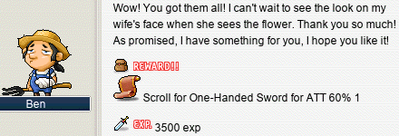
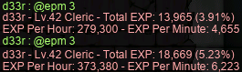

# rangifer’s diary: pt. lxiv

## Ape-y queue

Now that my vicloc [dagger spearwoman](https://oddjobs.codeberg.page/odd-jobs.html#dagger-warrior) **d34r** is happily married, it’s time to do some quests that are only available to married folk :)

First on the list are two quests that showed up in my quest journal as soon as I tied the knot with **xXCrookXx**: [Circle of Trust](https://bbb.hidden-street.net/quest/world-tour/circle-of-trust) and [Red Dahlia](https://bbb.hidden-street.net/quest/world-tour/red-dahlia-warrior-only). I was really excited to see these show up in my journal — I had no idea that there were married-specific quests other than [APQ](https://maplelegends.com/lib/map?id=670010000), and at that point I had run out of other vicloc quests to complete. Unfortunately, it turned out that Circle of Trust is not a vicloc quest at all; it requires recovering a special quest item from [Tweeter](https://maplelegends.com/lib/monster?id=3230308)s, which regrettably can only be [found in the Eos Tower](https://maplelegends.com/lib/map?id=221020500), which isn’t a real thing that exists.

On the other hand, Red Dahlia is a perfectly good vicloc quest. The quest is different depending on which first job advancement you’ve taken, and it seems (regrettably) that [those who have not taken the first job advancement](https://oddjobs.codeberg.page/odd-jobs.html#str-beginner) can’t do this quest. For better or worse, though, the quest is pretty trivial — I already had the necessary ETC items laying around in my inventory, so completing the quest was just a matter of talking to [Ben](https://maplelegends.com/lib/npc?id=9201034) twice:

Meh. A frankly useless scroll and an insignificant amount of EXP for my level…

But that’s okay, because there’s just one other quest that marriage unlocks. You already know what it is: the Amorian Party Quest.

While collecting [Lip Lock Key](https://maplelegends.com/lib/etc?id=4031593)s to gain entrance to the PQ, I accidentally fell off of [the map](https://maplelegends.com/lib/map?id=670000100). I mean, like, all the way through the bottom of the screen, only to be magically teleported back to the map proper after falling far enough. I showed xXCrookXx how to do it:

After we made ourselves dizzy by trying it a few times, we went back to farming keys.

The first APQ was a really cool experience for the both of us; neither of us had ever APQed in MapleStory before, so everything was totally new. For our first APQ we were joined by… not one, but two level 200 characters (lol). I had a guide to APQ open in a web browser tab, but by the time that xXCrookXx had gotten us into a full party of 6, I didn’t have time to read very thoroughly, so thankfully our party members were nice and guided us through the uncertain bits.

The first stage was pretty straightforward. This appears to be the only stage that places constraints on the genders of the members of the party; one half of the map is only accessible to female characters, and the other only to male characters. Basically, though, you just kill stuff:

Stage 2 excited me a bit because it’s actually identical to the [Sealed Room](https://maplelegends.com/lib/map?id=920010500) stage in [OPQ](https://maplelegends.com/lib/map?id=200080101), which is one of my favourite PQ stages. The only difference, of course, are the visuals. Instead of three ordinary platforms, there are three ropes suspended high in the sky from giant floating sculptures. To climb the ropes, special teleporters may be used to assist the intrepid APQer in getting yeeted into the sky — just make sure that you hold the up arrow key so that you actually land on the rope:

The next stage is also a puzzle, and much to my delight, it appears to be a mixture of the OPQ Sealed Room puzzle and the [LPQ stage 8](https://maplelegends.com/lib/map?id=922010800) puzzle. Like the Sealed Room, stage 3 of APQ indicates to the players (in this case, all players — not just the leader, which is cool) how many of the platforms are correct\*. And like LPQ stage 8, at most one character can stand on each platform, and there are exactly 9 platforms. Also like LPQ stage 8, the platforms are given meaningless labels so that players can easily reference individual platforms. With LPQ stage 8, regrettably, the (1, 2, 3, 4, 5, 6, 7, 8, 9) labels of the platforms often confuse players who think that the stage has something to do with numbers — in reality, like with APQ stage 3, the labels are meaningless identifiers (they could instead be colours, or shapes, or…).

Stage 4 is a pretty straightforward ETC collection, much like collectively completing a quest by collecting 50 of… these things:

I was only mildly surprised to see that the items we were collecting were, you know, sex toys. But I guess it is the Amorian Party Quest, after all — celebrating love and, apparently, also sexuality! One of our party members referred to these as butt plugs, although I don’t recommend using them that way — they appear to have no base! Wouldn’t want to lose one in an unfortunate place :)

The next stage is kinda goofy, as it consists entirely of running as fast as you can towards the right-hand side, breaking through gates (with basic attacks) as you go:

The entire time, there are various [spoopy creature](https://maplelegends.com/lib/monster?id=4230102)s creeping up behind you, as well as lava constantly spewing out of the ground. In fact, the stage almost has a halloween-y vibe to it. Well, it would, if it weren’t for the background music being the same as everywhere else in the PQ: more upbeat, cheesy vibes.

And of course, it wouldn’t be a PQ without the big bad end guy, would it? Meet [grog](https://maplelegends.com/lib/monster?id=9400514):

As it turns out, while grog’s stats are not all that impressive (not all that much hp, doesn’t hit very hard, etc.), it is quite the pain in the ass just because of its tendency to weapon cancel, fly around everywhere, and disappear entirely…

With that done, it was time for the bonus stage. Normally, folks are out here looking for [apple](https://maplelegends.com/lib/use?id=2022179)s, but xXCrookXx and I have something slightly different in mind. Much to my amazement, in my first ever APQ, I got the item that I was perhaps most looking forward to from this stage:

That’s right — [Cecelia’s Earrings](https://maplelegends.com/lib/equip?id=01032043)! The most powerful earrings in all of vicloc!! These ones that I got first were kinda crappy (10 WDEF and 50 MDEF), but still a lot better than the 0 WDEF & 42 MDEF [Pink-Flowered Earrings](https://maplelegends.com/lib/equip?id=01032014) that I was using before!

I’ve now done some nine APQs or so, over the course of which I’ve racked up three apples, as well as two or three [basket](https://maplelegends.com/lib/use?id=2022181)s, a number of joocy [cape](https://maplelegends.com/lib/equip?id=01102100)s, and lots of joocy [cape 30% scroll](https://maplelegends.com/lib/use?id=2041035)s :D

Footnotes for “Ape-y queue”

\*This value is actually just Dim(ℋ) − _d_(**g**, **s**), where ℋ is our [Hamming space](https://en.wikipedia.org/wiki/Hamming_space), Dim(ℋ) is the number of [dimension](https://en.wikipedia.org/wiki/Dimension)s of ℋ, _d_ is the [Hamming distance](https://en.wikipedia.org/wiki/Hamming_distance) that makes (ℋ, _d_) a [metric space][metric], **g** ∈ ℋ is the guess that we made, and **s** ∈ ℋ is the correct string (**s** is selected [randomly](https://en.wikipedia.org/wiki/Discrete_uniform_distribution) by the game, and originally a complete mystery to the players). In our case, ℋ is defined over [GF(2)][gf2], because each platform either has a player on it, or doesn’t (either 1 or 0). And the length of the [words][word] in ℋ is Dim(ℋ) = 9 for stage 3 of APQ and stage 8 of LPQ. In the case of the Sealed Room and stage 2 of APQ, ℋ is no longer a [vector space](https://en.wikipedia.org/wiki/Vector_space) (lol), because the [alphabet][alphabet] is {0, 1, 2, 3, 4, 5}, which has a [cardinality](https://en.wikipedia.org/wiki/Cardinality) of 6 (not a [prime power](https://en.wikipedia.org/wiki/Prime_power), womp womp…). And in this latter case, Dim(ℋ) = 3.

## d33r lays waste to thousands, nay millions, of napkins

I started playing more actively on my vicloc [clericlet](https://oddjobs.codeberg.page/odd-jobs.html#magelet) **d33r**! For better or worse, the only thing on d33r’s table at the moment is tireless solo grinding… Thankfully, with just a little bit of gear (especially the [Yellow Umbrella](https://maplelegends.com/lib/equip?id=01302016) that **xXCrookXx** kindly traded me ^^), d33r is more than capable of killing a [smol napkin](https://maplelegends.com/lib/monster?id=3230101) or two, albeit much more slowly and painfully than you might expect…

The main suspect for a grinding map for d33r was [Line 2 \<Area 1\>](https://maplelegends.com/lib/map?id=103000200), in the Kerning City subway. This map is pretty large, but makes up for it with a massive number (83) of Jr. Wraith spawns. The [Jr. Necki](https://maplelegends.com/lib/monster?id=2130103)s are a bit annoying, but I can kill them with three [Magic Claw](https://maplelegends.com/lib/skill?id=2001005)s or so each, and d33r is not yet 5/5 on Jr. Necki cards, so it works out. But **Slime** (**Thinks**, **OmokTeacher**, **Slimu**) told me that I could find an even better grinding map at the end of the Kerning City jump quests (JQs). In particular, [the Subway Depot at the end of the B2 JQ](https://maplelegends.com/lib/map?id=103000905) spawns almost entirely Jr. Wraiths (and a single lone [Jr. Booger](https://maplelegends.com/lib/monster?id=3230300)). Now, I am the absolute last person on this Earth to come to for JQ expertise, but I had successfully completed the B2 JQ at least twice before, Slime said it was the fastest JQ in the game, and it’s mostly just red and blue lasers, so just being patient should hopefully be enough for me to make it through.

So I tested the two maps side by side, with one `@epm 3` test each:

Wowza! Slime was right — that’s just about a 90k EPH increase, which is very significant in this case. So I guess it’s time to get good at the B2 JQ… My times so far (not timed properly, just looking at my system clock):

1. 12.5 minutes
2. 9.2 minutes
3. 7.5 minutes
4. 5.5 minutes

Getting better ^^

Very nice!! d33r is level 46 now :3

Here’s a collection of loot that I got during my first grind session (at both Line 2 \<Area 1\> and the B2 Subway Depot):

Wowza, that’s a lot of [napkin](https://maplelegends.com/lib/etc?id=4000035)s lmfao.

My next milestones for d33r are:

- Level 49, for max [Bless](https://maplelegends.com/lib/skill?id=2301004) (thus completing my main arsenal);
- Level 50, so I can wear [a better cape](https://maplelegends.com/lib/equip?id=01102099) that I’ve been scrolling while APQing;
- and finally, level 54, so that I may wield the almighty [Heart Wand](https://maplelegends.com/lib/equip?id=01372033).

And yes, for now I do really mean “finally”. There is, unfortunately, little motivation to level up d33r past level 54, unless I have some other viclockers to play alongside with\*.

Footnotes for “d33r lays waste to thousands, nay millions, of napkins”

\*This is a cry for help. Come play vicloc, xXCrookXx and I are very lonely v\_v

## Stab, stab.

I did lots of questing on my undead [daggermit](https://oddjobs.codeberg.page/odd-jobs.html#dagger-assassin), **alces**!

ssttaabb

First on the list was finishing off the Victoria Island quests that I wanted to do. For some god forsaken reason, one of the Vic Island quests that I decided to do (if you’ll remember from the previous diary entry) was [A Spell That Seals Up a Critical Danger](https://bbb.hidden-street.net/quest/victoria-island/a-spell-that-seals-up-a-critical-danger). So I got back to killing these bipedal ungulate weirdos:

Having completed the questline, I made off with my crumb of EXP and handful of [PE](https://maplelegends.com/lib/use?id=2000005)s, and killed a [ZMM](https://maplelegends.com/lib/monster?id=6300005) or two along the way:

I took a brief detour to BPQ with whoever happened to be standing in [the training centre](https://maplelegends.com/lib/map?id=970030000):

")

[Franken Lloyd](https://maplelegends.com/lib/monster?id=9300139), we meet again…

One of my party members gave me a name, due to my tendency to [fly](https://maplelegends.com/lib/skill?id=4111006) towards the boss each time that we entered a new map:

And with that, before leaving Victoria Island to quest elsewhere, I wanted to start off my card-hunting journey with the [T1 ring](https://maplelegends.com/lib/equip?id=01119003). So I hunted some snails, mushrooms, and the like:

Et voilà ! alces has her very own monster book ring now :)

With the T1 ring on my finger, I headed to [Orbis](https://maplelegends.com/lib/map?id=200000000) for moar quest. First, [Goddess’ Pet](https://bbb.hidden-street.net/quest/el-nath-mt-aquaroad/goddess-pet)!:

And, to my pleasant surprise, there was an [Eliza](https://maplelegends.com/lib/monster?id=8220000) already there when I went looking!

I farmed this Eliza for her [Jr. Lucida](https://maplelegends.com/lib/monster?id=6230401)s, and when she refused to spawn any more, I killed her to finish the quest. I went around all eight channels and found three or four other Elizas as well, which I did not kill. Instead, I kept each one below 50% HP and exhausted them of all of their Jr. Lucida spawns. All in all, over the course of an hour or so… this was enough to get me to 1/5 Jr. Lucida:

Well… I suppose that’s better than 0/5, innit?

Apparently, the “Eliza” that I killed was not Eliza at all — merely her shadow:

I guess that explains the freaky all-white eyes of the “Eliza” that I killed. With this quest complete (including the joocy fame at the end), and with [Fairy’s Horn Flute](https://bbb.hidden-street.net/quest/el-nath-mt-aquaroad/fairys-horn-flute) complete:

…alces was now level 90!!:

Finally, I can put on the proper rogue gear that I’ve been waiting for :D

- [Dark Pirate Blouse](https://maplelegends.com/lib/equip?id=01041107)
- [Dark Pirate Skirt](https://maplelegends.com/lib/equip?id=01061106)
- [Cursayer](https://maplelegends.com/lib/equip?id=01332026)

Time to test it out!!:

\>4k lines with [Double Stab](https://maplelegends.com/lib/skill?id=4001334)… w h e w .

I did just two more quests in Orbis: [Lisa’s Special Medicine](https://bbb.hidden-street.net/quest/el-nath-mt-aquaroad/lisas-special-medicine) and [Delivering Food to Spiruna](https://bbb.hidden-street.net/quest/el-nath-mt-aquaroad/delivering-food-to-spiruna), which are basically just potion-ferrying quests. And with that, I started the [Scadur’s New Fur Coat](https://bbb.hidden-street.net/quest/el-nath-mt-aquaroad/scadurs-new-fur-coat) quest and headed to El Nath:

While farming for [these](https://maplelegends.com/lib/etc?id=4000051) wolven [tail](https://maplelegends.com/lib/etc?id=4000052)s, I stumbled across an old friend:

Terrible. Seeing a [Serpent’s Coil](https://maplelegends.com/lib/equip?id=01332017) drop to the ground induces [Camp 3](https://maplelegends.com/lib/map?id=101030112) flashbacks. And, of course, _this_ coil was 4 WATK above average…

I stumbled upon [the Snow Witch’s map](https://maplelegends.com/lib/map?id=211050000) and found there [Sergeant Bravo](https://maplelegends.com/lib/npc?id=2030001), who struck me as strangely (perhaps, unjustifiably) confident:

If I were recovering from an “emergency landing”, and was not able to find any of my fellow crew members… well, I’d likely be less optimistic. But anyways, I did run into the Snow Witch herself:

And got a few cards!

And, to finish off Scadur’s New Fur Coat, I hunted for 100 [Yeti Horn](https://maplelegends.com/lib/etc?id=4000049)s:

And with that (and some [Garnet](https://maplelegends.com/lib/etc?id=4021000)s and [Sapphire Ore](https://maplelegends.com/lib/etc?id=4020005)s that I bought on the [FM](https://maplelegends.com/lib/map?id=910000000), lol), I completed [Alcaster’s Cape](https://bbb.hidden-street.net/quest/el-nath-mt-aquaroad/alcasters-cape) and got my very own [Cape of Warmness](https://maplelegends.com/lib/equip?id=01102109):

…and Scadur’s New Fur Coat:

Cozy!

And, of course, I was doing the [Snowfield Giant](https://bbb.hidden-street.net/quest/el-nath-mt-aquaroad/snowfield-giant) quest as well. It took me a little while to find a [Snowman](https://maplelegends.com/lib/monster?id=8220001), but I did eventually!:

And, while I was there, I also completed [Master Sergeant Fox’s Secret](https://bbb.hidden-street.net/quest/el-nath-mt-aquaroad/master-sergeant-foxs-secret).

I then moved just slightly further down the Orbis Tower, to start doing some Aqua Road quests. I started the [Lost in the Ocean](https://bbb.hidden-street.net/quest/el-nath-mt-aquaroad/lost-in-the-ocean) quest, and headed into deep aqua to find [a small shipwreck on the seabed](https://maplelegends.com/lib/map?id=230040400):

After overcoming my not-entirely-irrational fear of dozens of oversized cartoon sharks biting me to pieces, I took a peek inside of the wreckage:

How convenient. Inside was none other than [Taeng the Explorer](https://maplelegends.com/lib/npc?id=2060101), who had [a quest](https://bbb.hidden-street.net/quest/el-nath-mt-aquaroad/the-blocked-path-of-the-ocean) for me: find the artefacts left behind by Taeng’s MIA crew members, which artefacts Taeng assumes must have been eaten by the sharks. So I started indiscriminately stabbing the sharks just outside:

These [Cold Shark](https://maplelegends.com/lib/monster?id=8150101)s are no joke, and were constantly threatening to kill me. Thankfully, I never actually died (although I got quite close a number of times), and recovering the artefacts was not quite as tedious as I expected:

Having collected a no-longer-functional camera, a no-longer-functional flashlight/torch, and a ripped piece of a spiral notebook, I returned to Taeng, who rewarded me for my efforts.

I then set out to complete some of [Hughes the Fuse](https://maplelegends.com/lib/npc?id=2012017)’s quests, including [Hughes’ New Research](https://bbb.hidden-street.net/quest/el-nath-mt-aquaroad/hughes-new-research), which calls for 100 [Poison Poopa’s Poisonous Spikes](https://maplelegends.com/lib/etc?id=4000159), and 100 [Poopa Egg](https://maplelegends.com/lib/etc?id=4000158)s:

I also needed some [Toy Baby Seal](https://maplelegends.com/lib/etc?id=4000154)s for [Hughes’ Hobby](https://bbb.hidden-street.net/quest/el-nath-mt-aquaroad/hughes-hobby):

And, some [Snorkle](https://maplelegends.com/lib/etc?id=4000153)s \[sic\] for [Hughes’ Weird Invention](https://bbb.hidden-street.net/quest/el-nath-mt-aquaroad/hughes-weird-invention):

The latter quest awarded me with [this stylish cape](https://maplelegends.com/lib/equip?id=01102061):

And, finally, I went on to complete [Hughes’ Research Material](https://bbb.hidden-street.net/quest/el-nath-mt-aquaroad/hughes-research-material) before leaving for Ludus Lake. A [nearest town scroll](https://maplelegends.com/lib/use?id=2030000) took me to the [Aquarium](https://maplelegends.com/lib/map?id=230000000), and a brief chat with the local [bottlenose dolphin](https://en.wikipedia.org/wiki/Bottlenose_dolphin) took me to [The Sharp Unknown](https://maplelegends.com/lib/map?id=230030200), from which I climbed the rope in the [KFT](https://maplelegends.com/lib/map?id=222000000) well (yay for rope speed!) to arrive in the Ludus Lake region.

So, then I climbed the entire Helios Tower (or rather, took the elevator…) only to fall all the way back down a different tower: the clocktower.

It was time to do [Ghosthunter Bob](https://maplelegends.com/lib/npc?id=2041026)’s quests, including [Free Spirit](https://bbb.hidden-street.net/quest/ludus-lake/free-spirit), [The Binding](https://bbb.hidden-street.net/quest/ludus-lake/the-binding), and [The Soul Collector](https://bbb.hidden-street.net/quest/ludus-lake/the-soul-collector)! Unfortunately, [Clock Tower Monster Wipe-Out](https://bbb.hidden-street.net/quest/ludus-lake/clock-tower-monster-wipe-out) doesn’t exist in MapleLegends. But I set out to do the other Ghosthunter Bob quests, as well as teh first part of the [Papulatus](https://maplelegends.com/lib/monster?id=8500001) pre-quests (lol):

A deep ludi card! Oooo~

The harder of the Ghosthunter Bob quests require fighting [MDT](https://maplelegends.com/lib/monster?id=7130300)s:

…and [Spirit Viking](https://maplelegends.com/lib/monster?id=8141000)s:

And so I returned the [Ghostbusters can](https://maplelegends.com/lib/etc?id=4031193) to Bob:

I went to see [Assistant Cheng](https://maplelegends.com/lib/npc?id=2040003) in the Ludibrium toy factory, to retrieve from him some robot parts that [Dr. Kim](https://maplelegends.com/lib/npc?id=2050001) asked for. While I was there, Cheng took me to a surprise JQ:

I was really not in the mood for an annoying JQ, so I tried to leave. It took a bit of fumbling around… to be honest, I thought for a minute that I might be stuck! But I found the way out.

I headed down the Eos Tower to the [Omega Sector](https://maplelegends.com/lib/map?id=221000000), delivered these robot parts to Dr. Kim, and went to retrieve even moar robot parts from some giant metal boxes lying around the Omega Sector:

While I was there, I did the [Eliminating Aliens](https://bbb.hidden-street.net/quest/ludus-lake/eliminating-aliens) quest:

If you’ll remember, many diary entries ago, I featured alces also fighting this same [MT-09](https://maplelegends.com/lib/monster?id=5120100). The main difference here (besides doing it for a different quest) is in alces’s damage! They grow up so fast!!

And I completed [The Effort to Make-Up](https://bbb.hidden-street.net/quest/ludus-lake/the-effort-to-make-up), as well as [Artificial Combatant Zeno](https://bbb.hidden-street.net/quest/ludus-lake/artificial-combatant-zeno):

I only completed Artificial Combatant Zeno up to (but not including) the point of actually killing [Zeno](https://maplelegends.com/lib/monster?id=6220001) itself, as there were no Zenos to be found at that time. I did, however, get lucky with the first Wave Translator that I obtained being the real one.

I also did the follow-up quest for The Effort to Make-Up, [Collecting Meteorite Samples](https://bbb.hidden-street.net/quest/ludus-lake/collecting-meteorite-samples), although that quest basically just consists of walking around and talking to a few NPCs. Similarly, I completed [Hoony’s Toothache](https://bbb.hidden-street.net/quest/ludus-lake/hoonys-toothache), which is a simple delivery quest.

As there were no Zenos to be found for the time being, I headed to KFT. While I was there, I completed(!) the [Scholar Ghost](https://maplelegends.com/lib/monster?id=6090003) card set:

And I hunted some [three-tailed foxes](https://maplelegends.com/lib/monster?id=5100004) for [a clue](https://maplelegends.com/lib/etc?id=4031790) and some [tails](https://maplelegends.com/lib/etc?id=4000172):

To finish off the [Legends of Hometown](https://bbb.hidden-street.net/quest/ludus-lake/legends-of-hometown) questline, I needed to take on the [구미호](https://en.wikipedia.org/wiki/Kumiho) itself:

At the end of the questline, [Chil Nam](https://maplelegends.com/lib/npc?id=2071003) says this:

> Ah… I remember helping a [beautiful young woman](https://en.wikipedia.org/wiki/Succubus) while looking for wood in [Kamak Mountain][gamaksan]. And I can’t remember anything else after that. So she was [the Old Fox](https://en.wikipedia.org/wiki/Kumiho)! Ahhh… Just the thought of losing my [soul](https://en.wikipedia.org/wiki/Soul) to an Old Fox… it gives me the [goose bumps](https://en.wikipedia.org/wiki/Goose_bumps)!

The English Wikipedia article on _kumiho_ claims that _kumiho_ are, traditionally, capable of transforming into beautiful women for the purpose of seducing men and then eating them. The MapleStory version is a little less gruesome, instead taking Chil Nam’s soul (rather than his physical heart, or liver). So we can achieve a happy ending by slaying the _kumiho_ and recovering Chil Nam’s soul.

And, with the rest of the fox tails that I needed, I completed [The Fox Hunt](https://bbb.hidden-street.net/quest/ludus-lake/the-fox-hunt). [Chumji](https://maplelegends.com/lib/npc?id=2071000) explained to me, in very simple terms, how [ACP](https://maplelegends.com/lib/use?id=2022178)s work:

I also used some of the [Seal Meat](https://maplelegends.com/lib/etc?id=4000157) that I had gathered while completing [Hughes’ Research Material](https://bbb.hidden-street.net/quest/el-nath-mt-aquaroad/hughes-research-material) to complete [Secret Love Affair With Seal Meat](https://bbb.hidden-street.net/quest/world-tour/her-secret-craving-for-seal-meat) (Hidden Street calls this quest “Her Secret Craving for Seal Meat”).

I then headed back to Aqua Road to finish the Lost in the Ocean quest:

From there, my bottlenose friend took me to the Mu Lung Gardens region, where I completed [The Forgotten Master](https://bbb.hidden-street.net/quest/mu-lung-nihal-desert/the-forgotten-master):

…And [Eliminating King Sage Cat](https://bbb.hidden-street.net/quest/mu-lung-nihal-desert/eliminating-king-sage-cat); I ran into a fellow by the name of **jotdu** who was card-hunting [King Sage Cat](https://maplelegends.com/lib/monster?id=7220002), and agreed to kill one of them with me so that I could complete my quest:

To finish up The Forgotten Master, I dropped a single [peach](https://maplelegends.com/lib/etc?id=4031794) onto the bench in [Wild Bear Area 1](https://maplelegends.com/lib/map?id=250010301):

Poof. [A magical note](https://maplelegends.com/lib/use?id=2022252)!

While I was in Mu Lung Gardens, I snagged a [Master Dummy](https://maplelegends.com/lib/monster?id=5090001) card or two:

And completed the [Operation Eliminate Red-Nosed Pirates](https://bbb.hidden-street.net/quest/mu-lung-nihal-desert/operation-eliminate-red-nosed-pirates) quest:

I headed back to the Omega Sector to check again for [Zeno](https://maplelegends.com/lib/monster?id=6220001), and thankfully, it was there this time. So I finished Artificial Combatant Zeno!:

It’s true; neon orange really isn’t alces’s colour…

And with that, I traveled to the Nihal Desert to do some [Ariant](https://maplelegends.com/lib/map?id=260000000) quests.

I used to do the main Ariant questline on every one of my characters, once I graduated from [KPQ](https://maplelegends.com/lib/map?id=103000800). Some time ago, I changed that, and I’ve gotten used to skipping it entirely; alces is no exception. So I still had those quests to do, as well as some others in Ariant as well:

I could tell this was made for level 30-ish characters when I killed poor [Ardin](https://maplelegends.com/lib/monster?id=9100013) with just a pair of swift attacks:

More cards popped out as I continued collecting ETCs (and some USE items) for the main Ariant questline:

I also completed [The Bounty Hunt](https://bbb.hidden-street.net/quest/mu-lung-nihal-desert/the-bounty-hunt) for the first time in my Maple career, after waiting just a few minutes for a [Deo](https://maplelegends.com/lib/monster?id=3220001) to spawn:

Being a rogue, alces is a master of disguise, which helped immensely in completing [First Mission of the Sand Bandits](https://bbb.hidden-street.net/quest/mu-lung-nihal-desert/first-mission-of-the-sand-bandits) and thus wrapping up the main Ariant questline:

I also completed the [For the Little Prince](https://bbb.hidden-street.net/quest/mu-lung-nihal-desert/for-the-little-prince) (_Pour [Le Petit Prince](https://en.wikipedia.org/wiki/The_Little_Prince)_) questline, as well as [Queen’s New Make-Up Kit](https://bbb.hidden-street.net/quest/mu-lung-nihal-desert/queens-new-make-up-kit), [In Search for His Sister](https://global.hidden-street.net/quest/mu-lung-nihal-desert/in-search-for-his-sister), and [Sejan’s Good Habit](https://bbb.hidden-street.net/quest/mu-lung-nihal-desert/sejans-good-habit).

Now that I had done essentially all Ariant quests, I headed to [Magatia](https://maplelegends.com/lib/map?id=261000000) to get started on some of those quests — including the main Magatia questline, which is one of my favourite questlines in the game! :)

More questing to come~

## All-odd beepy cue

## Diversifying the sadsadgrind

At CDs:

- 9926280
- 10822140
- 11172420

At Dreamy Ghosts:

- 8830080
- 8951040
- 9878400
- 8830080

## capre LF\>cardz

## panolia attempts moar MPQing

## Moar be peekyooz

[gf2]: https://en.wikipedia.org/wiki/GF(2)
[word]: https://en.wikipedia.org/wiki/Word_(group_theory)
[metric]: https://en.wikipedia.org/wiki/Metric_(mathematics)
[alphabet]: https://en.wikipedia.org/wiki/Alphabet_(formal_languages)
[gamaksan]: https://en.wikipedia.org/wiki/Gamaksan_%28Gyeonggi%29
