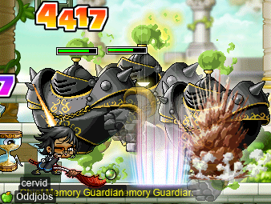
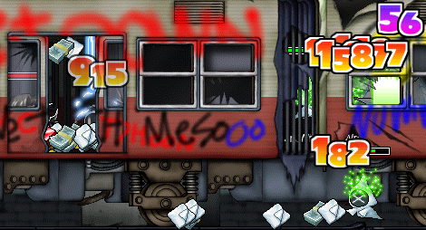
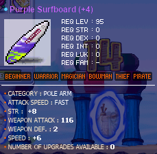
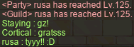

# rangifer’s diary: pt. lxv

## Taxonomising odd jobs, pt. iv: Microtaxonomy & encodings. §1

In the previous part of this series (“Taxonomising odd jobs, pt. iii: Exploring the space of possible taxonomies”), I considered what the structure of an odd job taxonomy could look like, and also investigated some formal (and semi-formal) methods that we might want to use for creating such taxonomies. However, throughout that entire part, I assumed that we already have a notion of discrete odd jobs, i.e. some [finite](https://en.wikipedia.org/wiki/Finite_set) [set][set] consisting of objects called “odd jobs”, each one of which has a distinct encoding\* into some [metric space](https://en.wikipedia.org/wiki/Metric_space) (which, if we’re lucky, is also a [vector space](https://en.wikipedia.org/wiki/Vector_space)). For certain strategies (viz. explicitly constructing a [tree][tree] by hand), the [metric][metric] is not so important, so _formalising_ an encoding is not necessary _per se_. However, even in this seemingly simpler case, we are still imposing the restrictions that our finite set of odd jobs is indeed finite, has a [cardinality](https://en.wikipedia.org/wiki/Cardinality) of at least two, and that — importantly — each member of the set is a well-defined “odd job” that exists on the same conceptual level as, but is distinct from, every other member of the set, in a way that is more or less analogous to [the biological notion of “species”](https://en.wikipedia.org/wiki/Species).

This more general, looser set of requirements doesn’t have anything to do with metrics or any fancy stuff like that, so it might look like an ordinary, structureless set from the outside. But be not fooled: such a set has a vast amount of structure tucked away within it, and this inner [ontology](https://en.wikipedia.org/wiki/Ontology) is, arguably, just as important as the outer structure that we ultimately want to impose with our taxonomies. Again referring to the biological case for the purpose of analogy, this “inner ontology” is known in biology as the [species concept](https://en.wikipedia.org/wiki/Species_concept). Briefly, a species concept defines what a biological “species” even _is_. The study of species concepts, and how to organise real biological organisms into them, is known as _microtaxonomy_ — hence the title of this part. Microtaxonomy is perhaps lesser known than its macrotaxonomy counterpart, because for many practical purposes, a handful of practical guidelines for delineating species tends to do the trick, making the boundaries between species “obvious”… [except](https://en.wikipedia.org/wiki/Species_complex) when they’re [not](https://en.wikipedia.org/wiki/Subspecies). Nevertheless, microtaxonomy is deeply contentious, with there being one understanding of species concepts for each biologist/philosopher who has ever studied the subject. Quoting a 2003 paper by **Massimo Pigliucci**† ([hyperlinks](https://en.wikipedia.org/wiki/Hyperlink) mine):

> The so-called “species problem” is one of those topics of discussion among [evolutionary biologists](https://en.wikipedia.org/wiki/Evolutionary_biology) that has been present since before [Darwin](https://en.wikipedia.org/wiki/Charles_Darwin)’s publication of the aptly titled [_Origin of Species_](https://en.wikipedia.org/wiki/On_the_Origin_of_Species) (Darwin himself referred to it as an already old problem), and will probably never go away. Furthermore, biologists have a schizophrenic attitude toward the whole issue: on the one hand, they tend to turn away in disgust when species concepts are brought up by colleagues, are the subject of papers, or are discussed at conferences. On the other hand, they simply cannot resist the temptation to offer [graduate](https://en.wikipedia.org/wiki/Graduate_school) seminars on the topic and avidly reading anything that is [published](https://en.wikipedia.org/wiki/Academic_publishing) on the subject.
>
> \[…\]
>
> \[T\]he reason why the species problem has not gone away is because it is not as much an [empirical](https://en.wikipedia.org/wiki/Empirical_evidence) problem \[…\], but rather one that has strong philosophical overtones. Indeed, the philosophical literature on the definition of species is as extensive as the biological one, with some biologists contributing to both. This does not mean that empirical information is not relevant here, but rather that the problem represents a paradigmatic example of a philosophical question that requires empirical information (provided by science) to be settled, not of a scientific problem with unwelcome philosophical characteristics.

In our case, the subjects (odd jobs) are not — and are not composed of, nor intended to represent — natural physical entities, unlike in the biological case. The closest thing that we have to “empirical evidence” falls, roughly, into two categories:

- Concrete [game-mechanical](https://en.wikipedia.org/wiki/Game_mechanics) distinctions that are either:
    - explicitly put forward by the game,
    - or tacitly (i.e. never explicitly explained, nor even named, in a way that the player is exposed to) enforced by the game’s [programming](https://en.wikipedia.org/wiki/Computer_program).
- Historical distinctions, as explored in a previous part of this series: “Taxonomising odd jobs, pt. ii: Building up a modern perspective”. These distinctions, should we choose to respect them in one way or another, count as “empirical evidence” in a kind of [anthropological](https://en.wikipedia.org/wiki/Anthropology) sense.

And, much like in the biological case, the [union][union] of these things still leaves many gaping holes. Simply _having_ the evidence does not magically produce a microtaxonomy, and likewise, we will need to put in the philosophical hard work to arrive at the kind of finite set mentioned in the first paragraph of this section.

Luckily, we at least have _some_ starting points for this task. One obvious point of reference is [the list of odd jobs on the **Oddjobs** website](https://oddjobs.codeberg.page/odd-jobs.html), which I created and curate. Another comes from a previous part (pt. ii) of this series, in which we considered some of the earliest recorded evidence of odd jobs — to quote from the conclusion of said part:

> Well, let’s take a look at some of the odd jobs that have been explored, or at least mentioned, in the archive entries that we’ve looked over in this part:
>
> - [HP warrior](https://oddjobs.codeberg.page/odd-jobs.html#hp-warrior)
> - [LUK warrior](https://oddjobs.codeberg.page/odd-jobs.html#luk-warrior)
> - [DEX warrior](https://oddjobs.codeberg.page/odd-jobs.html#dex-warrior)
> - [STR mage](https://oddjobs.codeberg.page/odd-jobs.html#str-mage)
> - [Gish](https://oddjobs.codeberg.page/odd-jobs.html#gish)([let](https://oddjobs.codeberg.page/odd-jobs.html#gishlet)?)
> - [Woods(wo)man](https://oddjobs.codeberg.page/odd-jobs.html#woodsman)
> - [Islander](https://oddjobs.codeberg.page/odd-jobs.html#islander)
> - [STRginner](https://oddjobs.codeberg.page/odd-jobs.html#str-beginner)
>
> This would seem to outline some of the most primitive odd jobs: we have our permabeginners (both on-island and off), our weird-statted mages, our “jobbed beginners”, our weird-statted warriors, and last but not least, our blood warriors.

As another few points of reference, we have yet more lists of odd jobs. Both predate the Oddjobs one:

- “[General List of Experimental Classes](https://web.archive.org/web/20200217044826/http://www.basilmarket.com/Other-General-List-of-Experimental-Classes-Wiki-2993)”, posted on 2010-01-13 by [BasilMarket](https://basilmarket.com/) user **GunDelHel**.
- “[Alyssaur’s Kind of Unnecessary Compilation of Unusual Builds](https://mapleroyals.com/forum/threads/alyssaurs-kind-of-unnecessary-compilation-of-unusual-builds.32333/)” ([archived](https://web.archive.org/web/20210101092152/https://mapleroyals.com/forum/threads/alyssaurs-kind-of-unnecessary-compilation-of-unusual-builds.32333/)), posted on 2015-07-17 by [MapleRoyals](https://mapleroyals.com/) user **Alyssaur**.

And, in the end, we will need to come up with one or more encodings of these odd jobs (with a metric, and all that jazz) so that we can apply our [numerical/statistical methods](https://en.wikipedia.org/wiki/Data_analysis) as well.

Footnotes for “Taxonomising odd jobs, pt. iv: Microtaxonomy & encodings. §1”

\*In this context, an “encoding” doesn’t necessarily refer to [coding](https://en.wikipedia.org/wiki/Code) in the technological sense (although it could), but rather, it just has to be a formalisation of some kind.

†M. Pigliucci, “Species as family resemblance concepts: The (dis-)solution of the species problem?”, _BioEssays_, vol. 25, no. 6, pp. 596–602, May 2003, doi: [10.1002/bies.10284](https://doi.org/10.1002%2Fbies.10284). \| [PhilPapers](https://philpapers.org/rec/PIGSAF)

[set]: https://en.wikipedia.org/wiki/Set_(mathematics)
[tree]: https://en.wikipedia.org/wiki/Tree_(graph_theory)
[metric]: https://en.wikipedia.org/wiki/Metric_(mathematics)
[union]: https://en.wikipedia.org/wiki/Union_(set_theory)

## More ToT w/ cervid, xBowtjuhNL, & Gruzz

In pt. lxiii of this diary, I talked about going to the [Temple of Time](https://maplelegends.com/lib/map?id=270000100) (ToT) for the first time, alongside **Gruzz**, **xBowtjuhNL**, **ducklings**, and **Harlez**. I played as my pure [STR bishop](https://oddjobs.codeberg.page/odd-jobs.html#str-mage) **cervid**, and we did the first handful of quests in the ToT questline to unlock the first few maps. Well, this time, I continued along that same questline with Gruzz and xBowtjuhNL:

Moar ToT~

We had to finish massacring — I mean, subduing — 999 [Chief Memory Guardian](https://maplelegends.com/lib/monster?id=8200004)s:

With yet another 999-kill quest done, we got a new kind of quest: to kill an area boss, viz. [Dodo](https://maplelegends.com/lib/monster?id=8220004). This Dodo is not [a bird](https://en.wikipedia.org/wiki/Dodo), but rather a [whale](https://en.wikipedia.org/wiki/Whale):

This airfaring (as opposed to seafaring…) whale wears a spiked helm atop its cranium, has 5.9M MAXHP, and a fairly hefty magical attack that can hit for over 4k damage. In fact, after being hit by the thing several times, I was so surprised by an attack that was suddenly stronger, that I died (oops!). I rushed back to the map to take on this thing for real, with my party members:

With Dodo slain, in order to continue the questline, we had to meet up with the [Memory Keeper](https://maplelegends.com/lib/npc?id=2140001):

The Memory Keeper wears a blindfold and has what is, apparently, a [prehensile](https://en.wikipedia.org/wiki/Prehensility) beard… although I’m not sure exactly what it’s holding. A [telescope](https://en.wikipedia.org/wiki/Telescope)? Surely not with a blindfold… Maybe a [loudhailer](https://en.wikipedia.org/wiki/Megaphone)? After all, it is pointed at his mouth, not at his eyes (or rather, his blindfold)…

In any case, the Memory Keeper instructed us to go back to the beginning, where it all began. I suggested reinstalling the game, but instead, we went back to our first job instructors to talk:

I was relieved to hear that [Grendel](https://maplelegends.com/lib/npc?id=1032001) was happy to see what I had become. I had come to fear that maybe Grendel would be disappointed at how much time I had spent at the gym, instead of studying magical spells. I have some bad news about my ability to effectively use the [Energy Bolt](https://maplelegends.com/lib/skill?id=2001004) spell, however…

With that, we unlocked a whole new frozen area of the Temple of Time, and resumed business as usual. Time to kill 999 [Qualm Monk](https://maplelegends.com/lib/monster?id=8200005)s!

And, just as we were finishing up those 999, cervid hit level 124!!:

:D

## A lil viclockin’

My vicloc [dagger spearwoman](https://oddjobs.codeberg.page/odd-jobs.html#dagger-warrior), **d34r**, and her vicloc bandit husband **xXCrookXx** (**Sangatsu**, **Level1Crook**, **Lv1Crook**) have developed somewhat of a ritual of [APQ](https://maplelegends.com/lib/map?id=670010100)ing once daily, and [BPQ](https://maplelegends.com/lib/map?id=970030000)ing afterwards. Of course, this can only last for the duration of the current summer event, as BPQ is a summer event exclusive. But APQ is forever…

And, after completing such a ritual one day, we headed to [TfoG](https://maplelegends.com/lib/map?id=105040306) to duo grind 23% or so EXP for xXCrookXx, so he could level up. With no special buffs whatsoever (no GM buffs, no [Echo](https://maplelegends.com/lib/skill?id=0001005)), I tried an `@epm 4`, and was pleasantly surprised to see the result!:

I also took a snapshot of d34r’s ETC inventory — this is slightly outdated at the time of writing, but gives an idea of what it’s like to be a Victoria islander who has a penchant for keeping anything that might… be useful… for someone… eventually:

The non-vicloc items ([Flask](https://maplelegends.com/lib/etc?id=4000356), [Yellow Belt](https://maplelegends.com/lib/etc?id=4000284), [Wires](https://maplelegends.com/lib/etc?id=4000364)) were obtained legitimately via BPQ, and are kept as a keepsake from this event :)

And I’ve continued training my vicloc [clericlet](https://oddjobs.codeberg.page/odd-jobs.html#magelet), **d33r**. As detailed in the previous diary entry, I have been training at [Line 3 Construction Site: B2 \<Subway Depot\>](https://maplelegends.com/lib/map?id=103000905), which requires completing the entire B2 jumpquest (JQ) each time that I want to train there. I kept track of my approximate completion times for the JQ, and I can now add to that list with some more times. Below is the new list:

1. 12.5 minutes
2. 9.2 minutes
3. 7.5 minutes
4. 5.5 minutes
5. 6.0 minutes
6. 8.0 minutes
7. 5.3 minutes
8. 5.5 minutes
9. 5.7 minutes

Which does somewhat improve my best time so far, from 5.5 minutes to 5.3 minutes.

The [Jr. Wraith](https://maplelegends.com/lib/monster?id=3230101)s that spawn there drop three kinds of ores: [Power Crystal Ore](https://maplelegends.com/lib/etc?id=4004000)s, [Adamantium Ore](https://maplelegends.com/lib/etc?id=4010003)s, and [Opal Ore](https://maplelegends.com/lib/etc?id=4020004)s. Again, this is a little outdated at the time of writing, but even after NPCing a number of Power Crystal Ores (as this is their only use in vicloc; they cannot be used for crafting), I had a rather impressive stash:

Most recently, I duoed the B2 Subway Depot for the first time; previously, I had always grinded there solo. xXCrookXx’s I/L [LPQ](https://maplelegends.com/lib/map?id=221024500) mule **Sangatsu** joined me there:

Although Sangatsu deals far more damage than d33r (using [Thunderbolt](https://maplelegends.com/lib/skill?id=2201005)), an `@epm` test ironically revealed that I was actually getting worse EPH there than I would get solo… But oh well, the EPH was still pretty good, and it was great to have company in my lonely napkin dungeon!

## alces & xX17Xx doing the main Magatia questline~

I invited [permarogue](https://oddjobs.codeberg.page/odd-jobs.html#permarogue) extraordinaire **xX17Xx** (**drainer**, **partyrock**, **attackattack**, **strainer**, **technopagan**) to do the main [Magatia](https://maplelegends.com/lib/map?id=261000000) questline (the one that begins with [A Deal with the Broker](https://bbb.hidden-street.net/quest/mu-lung-nihal-desert/a-deal-with-the-broker) and culminates in [For Phyllia](https://bbb.hidden-street.net/quest/mu-lung-nihal-desert/for-phyllia)\*) with me, as xX17Xx has been trying to do quests for EXP (as an alternative to killing [Fancy Amplifiers](https://maplelegends.com/lib/monster?id=9410029) all day…), and was not previously aware of the main Magatia questline. I mentioned that I had only just barely started it on my [daggermit](https://oddjobs.codeberg.page/odd-jobs.html#dagger-assassin), but I had done the questline multiple times before, and commented that it’s one of my favourite (if not my favourite) questlines in the game. xX17Xx was intrigued, and so she came to Magatia to start the questline.

As it turned out, she had (sort of) already started the questline some time ago (level 3*X* or so), at least far enough to get the level 35 [Alcadno’s Cape](https://maplelegends.com/lib/equip?id=01102136) and [Zenumist’s Cape](https://maplelegends.com/lib/equip?id=01102135). But, for better or worse, the level requirements for this questline are quite spread out — the initial quest is level ≥30, whereas finishing the final quest requires level ≥75. So xX17Xx didn’t realise, at the time, that the questline continues, and threw away the level 35 capes. So we had to get those back, which required doing [Re-acquiring Zenumist Cape](https://bbb.hidden-street.net/quest/mu-lung-nihal-desert/re-acquiring-zenumist-cape) and [Re-acquiring Alcadno Cape](https://bbb.hidden-street.net/quest/mu-lung-nihal-desert/re-acquiring-alcadno-cape), more or less entailing a run to the [Free Market](https://maplelegends.com/lib/map?id=910000000) for some jewels.

Then we started the questline in earnest:

Magatia questline w/ xX17Xx

First was [Russellon’s Items for Experiment](https://bbb.hidden-street.net/quest/mu-lung-nihal-desert/russellons-items-for-experiment), which meant killing [Triple Rumo](https://maplelegends.com/lib/monster?id=3110303)s for [their leaves](https://maplelegends.com/lib/etc?id=4031694):

And [Helping Out Bedin](https://bbb.hidden-street.net/quest/mu-lung-nihal-desert/helping-out-bedin), which entails killing [Dark Sand Dwarves](https://maplelegends.com/lib/monster?id=3110301) for their [Flaming Desert](https://maplelegends.com/lib/etc?id=4000352)s.

Then, [Destroy the Roid](https://bbb.hidden-street.net/quest/mu-lung-nihal-desert/destroy-the-roid)!:

And likewise, for the Zenumist side, we completed [Getting in the Way of Alcadno](https://bbb.hidden-street.net/quest/mu-lung-nihal-desert/getting-in-the-way-of-alcadno), which requires killing not [Roid](https://maplelegends.com/lib/monster?id=5110301)s, but rather, [Reinforced Mithril Mutae](https://maplelegends.com/lib/monster?id=5110300). These things are a slight oddity, as they only spawn in one map — [area A-1 of the Alcadno Research Institute](https://maplelegends.com/lib/map?id=261020100)), which is a dead end — their ETCs ([Hardened Piece of Mithril](https://maplelegends.com/lib/etc?id=4000360)) are not used for anything in the game†, and their only other appearance in the game besides this quest is another Magatia quest ([Yulete’s Request](https://bbb.hidden-street.net/quest/mu-lung-nihal-desert/yuletes-request)), in which they are stronger and have a different name: [Obstacle Mutae](https://maplelegends.com/lib/monster?id=9300153).

Then, [An Incident, and the Missing Alchemist](https://bbb.hidden-street.net/quest/mu-lung-nihal-desert/an-incident-and-the-missing-alchemist), which required us to seek [a secret document](https://maplelegends.com/lib/etc?id=4031708) within a very dark room:

This is followed immediately by [Zenumist and the Missing Alchemist](https://bbb.hidden-street.net/quest/mu-lung-nihal-desert/zenumist-and-the-missing-alchemist), in which [Carson](https://maplelegends.com/lib/npc?id=2111000) transported us into the [Closed Lab](https://maplelegends.com/lib/map?id=926120100) (unfortunately, it’s instanced, so we were in different copies of the same map) where we were stuck until we could recover a [Magic Device](https://maplelegends.com/lib/etc?id=4031698) from [the special Homun that spawn in there](https://maplelegends.com/lib/monster?id=9300141):

I had, in the past, had rather poor luck with getting this thing to drop. Luckily for us, we both had pretty good luck and were not in there for very long. The Closed Lab also has a facility for sucking the light out of these devices, producing the [Lightless Magic Device](https://maplelegends.com/lib/etc?id=4031709) that we needed for the quest.

Then, [Alcadno and the Missing Alchemist](https://bbb.hidden-street.net/quest/mu-lung-nihal-desert/alcadno-and-the-missing-alchemist), which involves paying a visit to [Eurek](https://maplelegends.com/lib/npc?id=2040050), the wandering alchemist. Being a wanderer, Eurek can be found variously in [Sleepywood](https://maplelegends.com/lib/map?id=105040300), [Ludibrium](https://maplelegends.com/lib/map?id=220000000), [Leafre](https://maplelegends.com/lib/map?id=240000000), and [El Nath](https://maplelegends.com/lib/map?id=211000000). It was this last location in which we met Eurek, as we also wanted to see [Alcaster](https://maplelegends.com/lib/npc?id=2020005) to complete [Acquiring the Seed for the Snowfield Rose](https://bbb.hidden-street.net/quest/el-nath-mt-aquaroad/acquiring-the-seed-for-the-snowfield-rose) for the purpose of completing the [Humanoid Just Wants to be Human](https://bbb.hidden-street.net/quest/mu-lung-nihal-desert/humanoid-just-wants-to-be-human) questline. Acquiring the Seed for the Snowfield Rose requires cleaning up some [Leatties](https://maplelegends.com/lib/monster?id=5300000), so that’s what we did:

And we [headed](https://maplelegends.com/lib/cash?id=5041000) back to Magatia to visit [Parwen](https://maplelegends.com/lib/npc?id=2111006) in [Authorized Personnel Only](https://maplelegends.com/lib/map?id=261020401). There was a [Security Camera](https://maplelegends.com/lib/monster?id=7090000) there, which we quickly dispatched, and which was kind enough to gift us a card:

In the process of visiting Parwen, we completed [Parwen’s Lab](https://bbb.hidden-street.net/quest/mu-lung-nihal-desert/parwens-lab) by killing 200 [Site](https://maplelegends.com/lib/monster?id=6110301)s‡, and also did the [The Secret, Quiet Passage](https://bbb.hidden-street.net/quest/mu-lung-nihal-desert/the-secret-quiet-passage) questline to gain access to [Secret Basement Path](https://maplelegends.com/lib/map?id=261030000) (and the maps that it leads to).

We talked with the wife of the missing alchemist, [Phyllia](https://maplelegends.com/lib/npc?id=2111004), who didn’t believe us when we said that we had talked to Dr. De Lang via re-living the disembodied memories of a ghost that we found in a corner of the Alcadno laboratories. Frankly, I don’t blame her. So we broke into Dr. De Lang’s house and started indiscriminately rummaging around in search of something that would make Phyllia believe us, and hopefully make her less mad about the fact that we burgled her husband’s house for no apparent reason. Thankfully, we found that something: [Phyllia’s Pendant](https://bbb.hidden-street.net/quest/mu-lung-nihal-desert/phyllias-pendant).

With this, we had earned Phyllia’s trust, and she sent us back to the house with a special password (`my love Phyllia`), which we used to uncover [Dr. De Lang’s Secret Book](https://maplelegends.com/lib/npc?id=2111016) and place the pendant inside:

This caused the book to unlock itself, revealing itself to be a short manuscript, which we had to travel back to El Nath to decipher. Alcaster told us that parts of this manuscript had writing in a kind of [invisible ink](https://en.wikipedia.org/wiki/Invisible_ink) that could only be revealed through the use of highly advanced alchemy. Unfortunately, neither I nor xX17Xx as master alchemists, so it looked like we were out of luck.

But Alcaster then went on to mention that there was another, easier way to read the writing: just pour a bunch of blood on it. Ah, but not just any blood: [Homunsculer’s Blood](https://maplelegends.com/lib/etc?id=4031737). So we went back to Magatia to find [these blood-filled beasts](https://maplelegends.com/lib/monster?id=8110300):

While we were there, I came across a stray [Deet & Roi](https://maplelegends.com/lib/monster?id=8090000):

And we went back to Alcaster, who demonstrated the dousing of the manuscript in Homunsculer blood, thus revealing the manuscript’s full contents. The manuscript is a personal log/diary that Dr. De Lang kept, and contains some juicy details. As it turns out, all of Magatia is founded on the dark alchemy of The Black Magician: Zenumist, Alcadno, everything. As usual, this is some very evil, but very powerful, stuff. So when Dr. De Lang wanted to [extend his own life](https://en.wikipedia.org/wiki/Immortality_in_fiction) so that he would never have to leave behind Phyllia (who is a fairy, or something like that, and never dies, or lives for a long time, or whatever — you get the idea) and their half-fairy(?)-half-human child, the whole [black magic](https://en.wikipedia.org/wiki/Black_magic) thing seemed kinda sweet. Unfortunately, this led De Lang to [blow everything up](https://en.wikipedia.org/wiki/Laboratory_safety) and ruin the town of Magatia.

Luckily, Alcaster had an idea to fix up Magatia. By collecting a bespoke triad of magical stones associated, respectively, with three [virtue](https://en.wikipedia.org/wiki/Virtue)s ([humility](https://maplelegends.com/lib/etc?id=4031739), [honesty](https://maplelegends.com/lib/etc?id=4031740), and [trust](https://maplelegends.com/lib/etc?id=4031741)), we could… uhm… ameliorate(?) the [trigram](https://en.wikipedia.org/wiki/Equilateral_triangle) (presumably used for nefarious alchemical purposes) located in The Black Magician’s laboratory and restore Magatia to its former glory. Alcaster was kind enough to provide us with the stone of humility, which meant that we only had to retrieve a stone of honesty from [Homunculus](https://maplelegends.com/lib/monster?id=7110301)es, and a stone of trust from [D. Roy](https://maplelegends.com/lib/monster?id=7110300).

I actually had already gotten a stone of honesty earlier, when we fought some Homunculus for an earlier quest in the questline. But xX17Xx still needed one, so we went back to [unit 203 of the Zenumist Research Institute](https://maplelegends.com/lib/map?id=261010103) and got her one:

…Which leaves only the issue of _actually finding_ D. Roy and getting two Magic Stones of Trust from them… Stay tuned for the end of this questline~ :)

Footnotes for “alces & xX17Xx doing the main Magatia questline~”

\*The questline can also, alternatively, cultimate in either [For Zenumist](https://bbb.hidden-street.net/quest/mu-lung-nihal-desert/for-zenumist) or [For Alcadno](https://bbb.hidden-street.net/quest/mu-lung-nihal-desert/for-alcadno). But these other two endings are… less desirable. The [level](https://maplelegends.com/lib/equip?id=01102139) 80 [capes](https://maplelegends.com/lib/equip?id=01102140) are actually not _terribly_ bad (although none of their benefits go towards DPS; no STR/DEX/INT/LUK, no WATK/MATK, and just the usual 5 slots), but the much lower EXP reward and the lack of fame reward just isn’t worth it. Plus, are you really gonna do my homegirl [Phyllia](https://maplelegends.com/lib/npc?id=2111004) dirty like that?

†Later versions of MapleStory have a special ETC item called [Shovel](https://bbb.hidden-street.net/items/leftover/shovel) which is used for the [Keol’s Order #3](https://bbb.hidden-street.net/quest/job/keols-order-3) quest, and requires 30 Hardened Pieces of Mithril to craft using [the Maker skill](https://bbb.hidden-street.net/character/skill/maker). Also, I found a quest called [Stability in Magatia](https://maplestorym.fandom.com/wiki/Stability_in_Magatia) that requires 90 Hardened Pieces of Mithril, and is part of a game called “[MapleStory M](https://maplestorym.nexon.com/)”, which I guess is a [mobile](https://en.wikipedia.org/wiki/Mobile_phone) version of MapleStory? News to me.

‡[In MPQ](https://maplelegends.com/lib/map?id=926110001), these are called [Cyti](https://maplelegends.com/lib/monster?id=9300146)s.

## capre… hunts… more… you guessed it: cards

c a r d

## Bepeak yous

Beapeak yooz~

