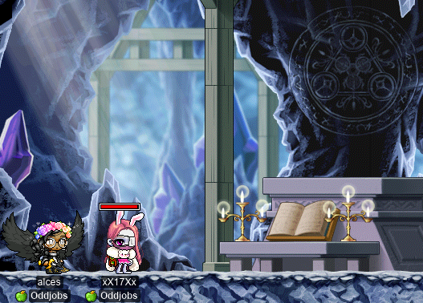
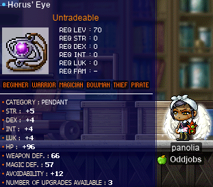
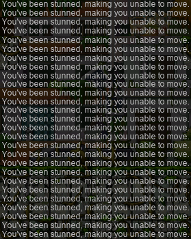
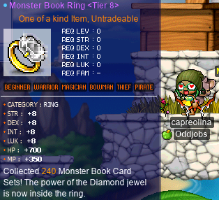
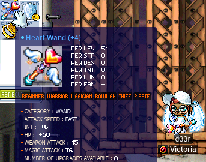
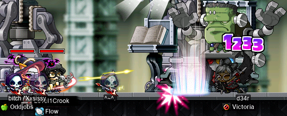

# rangifer’s diary: pt. lxvi

## Taxonomising odd jobs, pt. iv: Microtaxonomy & encodings. §2

In the previous section (§1) of this part, I introduced the notion of “microtaxonomy”, comparing our situation of determining exactly what makes up our “set of all odd jobs” with [the biological problem of determining what a “species” is](https://en.wikipedia.org/wiki/Species_concept). I also suggested the following three lists as points of reference for this task:

- The [list of odd jobs on the **Oddjobs** website](https://oddjobs.codeberg.page/odd-jobs.html), which I created and curate.
- “[General List of Experimental Classes](https://web.archive.org/web/20200217044826/http://www.basilmarket.com/Other-General-List-of-Experimental-Classes-Wiki-2993)”, posted on 2010-01-13 by [BasilMarket](https://basilmarket.com/) user **GunDelHel**.
- “[Alyssaur’s Kind of Unnecessary Compilation of Unusual Builds](https://mapleroyals.com/forum/threads/alyssaurs-kind-of-unnecessary-compilation-of-unusual-builds.32333/)” ([archived](https://web.archive.org/web/20210101092152/https://mapleroyals.com/forum/threads/alyssaurs-kind-of-unnecessary-compilation-of-unusual-builds.32333/)), posted on 2015-07-17 by [MapleRoyals](https://mapleroyals.com/) user **Alyssaur**.

Using my own list as the baseline, I want to outline the exact differences between my list (at the time of writing) and the other two linked above. I then also want to compare my list with the findings from pt. ii of this series (“Taxonomising odd jobs, pt. ii: Building up a modern perspective”).

### Comparing to “General List of Experimental Classes”

So, the first and most obvious difference here is that GunDelHel actually produces two lists here: a list of post-[Big-Bang](https://maplestory.fandom.com/wiki/MapleStory:_Big_Bang) (henceforth “post-BB”) odd jobs, and a list of pre-Big-Bang (henceforth “pre-BB”) odd jobs. My list only includes pre-BB odd jobs — and, admittedly, is biased towards classes that are available in MapleLegends (read: v62 of GMS). As mentioned above, this list actually dates back to 2010-01-13, which is prior to Big Bang; Big Bang was originally released in KMS during 2010-07\*, and wasn’t released in GMS until 2010-12-07†. However, GunDelHel continued to update the list through Big Bang (up until sometime during 2012, I think), so the final revision is what we have now. We’re going to restrict our view to pre-BB, but it’s worth noting that although Big Bang did change the game mechanics a lot, which made many odd jobs no longer appealing or simply impossible to make, Big Bang still offered the ability to make odd jobs, even including a few new ones!

When it comes to permabeginners, GunDelHel recognises the following jobs:

- Camper
- Islander
- Perma-beginner
- Perma-noblesse
- Perma-legend
- Evan-ginner
- Wand-ginner

This last one (“wand-ginner”) is listed separately, although its description indicates that it is merely a variant of any given one of the other permabeginner jobs. Comparing this to my own list (again, at the time of writing):

| GunDelHel’s    | Oddjobs’s                                                                                                                                        |
| :------------- | :----------------------------------------------------------------------------------------------------------------------------------------------- |
| Camper         | [Camper](https://oddjobs.codeberg.page/odd-jobs.html#camper)                                                                                     |
| Islander       | [Islander](https://oddjobs.codeberg.page/odd-jobs.html#islander)                                                                                 |
| Perma-beginner | [STR beginner](https://oddjobs.codeberg.page/odd-jobs.html#str-beginner)                                                                         |
| Perma-noblesse | [STR beginner](https://oddjobs.codeberg.page/odd-jobs.html#str-beginner)                                                                         |
| Perma-legend   | [STR beginner](https://oddjobs.codeberg.page/odd-jobs.html#str-beginner)                                                                         |
| Evan-ginner    | [STR beginner](https://oddjobs.codeberg.page/odd-jobs.html#str-beginner)                                                                         |
| Wand-ginner    | [Wand beginner](https://oddjobs.codeberg.page/odd-jobs.html#wand-beginner), [Magelander](https://oddjobs.codeberg.page/odd-jobs.html#magelander) |
| \[none\]       | [Besinner](https://oddjobs.codeberg.page/odd-jobs.html#besinner)                                                                                 |
| \[none\]       | [DEX beginner](https://oddjobs.codeberg.page/odd-jobs.html#dex-beginner)                                                                         |

Campers and islanders translate nicely here. GunDelHel’s “perma-beginner” is, in contrast to campers & islanders, off-island — but it excludes off-island variants like [besinner](https://oddjobs.codeberg.page/odd-jobs.html#besinner) and [DEX beginner](https://oddjobs.codeberg.page/odd-jobs.html#dex-beginner), settling instead on what my list calls “STR beginner” (usually “STRginner” for short). Perma-noblesse and perma-legend are covered by the “STR beginner” entry on my list, which lists aliases like “Permanoblesse” and “STR Permalegend”, and notes:

> Pre-BB versions of MapleStory that are recent enough to have Cygnus Knights (e.g. Blaze Wizard) and/or Legends (e.g. Aran) will have some extra variants on the usual permabeginners: permanoblesses and permalegends. Permanoblesses are the most unusual variety, as they are considerably more powerful (due to getting 6 AP per level until level 70), but cannot surpass level 120, thus making them theoretically less powerful than ordinary permabeginners at extremely high levels.

Evan-ginners are not interesting; they could only be created as the result of a short-lived exploit/bug, and they are essentailly identical to off-island explorer permabeginners, besides showing up as “Evan” instead of “Beginner” in-game.

When it comes to warriors, we have:

| GunDelHel’s             | Oddjobs’s                                                                                                                                            |
| :---------------------- | :--------------------------------------------------------------------------------------------------------------------------------------------------- |
| Perma-first job warrior | [Permawarrior](https://oddjobs.codeberg.page/odd-jobs.html#permawarrior)                                                                             |
| STRless DEX warrior     | [DEX warrior](https://oddjobs.codeberg.page/odd-jobs.html#dex-warrior)                                                                               |
| HP warrior              | [HP warrior](https://oddjobs.codeberg.page/odd-jobs.html#hp-warrior)                                                                                 |
| LUK warrior             | [LUK warrior](https://oddjobs.codeberg.page/odd-jobs.html#luk-warrior)??                                                                             |
| Dagger fighter          | [Dagger warrior](https://oddjobs.codeberg.page/odd-jobs.html#dagger-warrior) [∖][complement] dagger page ∖ dagger spear(wo)man ∖ dagger permawarrior |
| STRless aran            | [DEX warrior](https://oddjobs.codeberg.page/odd-jobs.html#dex-warrior)                                                                               |
| Wand warrior            | [Wand warrior](https://oddjobs.codeberg.page/odd-jobs.html#wand-warrior)                                                                             |

The warriors translate pretty well, for the most part. LUK warriors are a bit of a pain here — GunDelHel appears to be using the definition of “LUK warrior” that we investigated in pt. ii of this series (see “[LUK Warrior](https://www.hidden-street.net/forum/threads/13250-LUK-Warrior)” ([archived](https://web.archive.org/web/20210103200552/https://www.hidden-street.net/forum/threads/13250-LUK-Warrior))). This definition assumes that the LUK warrior is mostly STR-based (like an ordinary warrior), but stays DEXless, and adds some AP into LUK as necessary for WACC (and AVOID). According to my view, STR-based warriors are non-odd unless they have something else about them that is odd (e.g. a STR-based _permawarrior_). So the definition of “LUK warrior” on the Oddjobs website defines them as being DEXless _and_ STRless (analogous to DEX warrior). GunDelHel excludes dagger pages/WKs/paladins, dagger spear(wo)men/DKs, as well as dagger permawarriors from their definition of “dagger fighter”. And GunDelHel lists “STRless aran” separately from “STRless DEX warrior”, similarly to the situation with “perma-legend” above.

When it comes to mages, we have:

| GunDelHel’s          | Oddjobs’s                                                                                                                       |
| :------------------- | :------------------------------------------------------------------------------------------------------------------------------ |
| STR mage             | [STR mage](https://oddjobs.codeberg.page/odd-jobs.html#str-mage)                                                                |
| INTless mage         | [Magelet](https://oddjobs.codeberg.page/odd-jobs.html#magelet)                                                                  |
| Pure LUK F/P mage    | [Magelet](https://oddjobs.codeberg.page/odd-jobs.html#magelet) ∖ clericlet/priestlet/bishoplet ∖ I/L magelet ∖ permamagicianlet |
| Pure one-element     | \[none\]                                                                                                                        |
| Perma first job mage | [Permamagician](https://oddjobs.codeberg.page/odd-jobs.html#permamagician)                                                      |
| STR evan             | [STR mage](https://oddjobs.codeberg.page/odd-jobs.html#str-mage)                                                                |
| \[none\]             | [DEX mage](https://oddjobs.codeberg.page/odd-jobs.html#dex-mage)                                                                |
| \[none\]             | [Gish](https://oddjobs.codeberg.page/odd-jobs.html#gish)                                                                        |
| STR mage??           | [Gishlet](https://oddjobs.codeberg.page/odd-jobs.html#gishlet)                                                                  |

For some reason, GunDelHel separates out F/P magelets from other types of magelets. We also have the similarly suspicious “pure one-element” job, which is just any mage that restricts themselves to a single element (e.g. only using ice spells & elementless spells). This is a cute idea for a mild challenge run, but I’m going to ignore this one going forward — I don’t think there’s any way to make this into an “odd job” in our sense. “Experimental class” sounds fine to me. GunDelHel splits out STR evans from the rest of the STR mages, like “STRless aran” and “perma-legend” above. And finally, DEX mage, gish, and gishlet have no real analogues in GunDelHel’s list. The closest that we get is when GunDelHel says:

> F/P and BW used to be great in 3rd thanks to Poison Mist and Flame Gear, however since October 09, the accuracy formula was changed. If you do decide to substitute your Dex for Luk, you might have a tiny shred of luck, but it won't be near as good as it once was.

This suggestion seems to imply base stats of _x_/4/20/_y_ (STR/DEX/INT/LUK), with LUK lending some WACC and MACC, which would meet my definition of “gishlet”. However, it seems that GunDelHel would not make any such distinction, lumping such mixed mages together in the “STR mage” pile. As we saw in pt. ii of this series, this is not uncommon.

When it comes to archers, we have:

| GunDelHel’s            | Oddjobs’s                                                              |
| :--------------------- | :--------------------------------------------------------------------- |
| Woodsman               | [Woodsman](https://oddjobs.codeberg.page/odd-jobs.html#woodsman)       |
| Bowginner              | [Bowginner](https://oddjobs.codeberg.page/odd-jobs.html#bowginner)?    |
| Perma first job archer | [Permarcher](https://oddjobs.codeberg.page/odd-jobs.html#permarcher)   |
| Bow-whacker            | [Bow-whacker](https://oddjobs.codeberg.page/odd-jobs.html#bow-whacker) |

Archers are where my list and GunDelHel’s agree most clearly. The only slight discrepancy is with bowginners. GunDelHel’s description is a little underspecified for our purposes (and for the purposes of my own list). GunDelHel’s description gives us the usual intuitive notion of what a bowginner is:

> Bowginners use no skills, but use bows--to see what it would be like if Beginners could use Bows.

Unfortunately, the phrase “use no skills” is doing a lot of heavy-lifting here. Many people understand this to mean “use no attacking skills”, meaning that active skills which are just buffs ([Focus](https://maplelegends.com/lib/skill?id=3001003), [Booster](https://maplelegends.com/lib/skill?id=3101002), [Soul Arrow](https://maplelegends.com/lib/skill?id=3101004), [SE](https://maplelegends.com/lib/skill?id=3121002), [MW](https://maplelegends.com/lib/skill?id=3121000), [Concentrate](https://maplelegends.com/lib/skill?id=3121008)) are fair game, and so are passive skills ([The Blessing of Amazon](https://maplelegends.com/lib/skill?id=3000000), [The Eye of Amazon](https://maplelegends.com/lib/skill?id=3000002), [Critical Shot](https://maplelegends.com/lib/skill?id=3000001), [Mastery](https://maplelegends.com/lib/skill?id=3100000), [Final Attack](https://maplelegends.com/lib/skill?id=3100001), [Thrust](https://maplelegends.com/lib/skill?id=3110000), [Mortal Blow](https://maplelegends.com/lib/skill?id=3110001)‽, [Expert](https://maplelegends.com/lib/skill?id=3120005)). Others would understand the word “use” to refer to active skills in general, thus excluding the buffs. And yet, even when excluding all active skills entirely, we are left with a “beginner who can use bows” that somehow has access to passive WACC bonuses that stack with everything, passive critical hits on 50% of attacks, 60% (or more) mastery, Final Attack, passive SPEED bonuses that stack with everything, etc. Perhaps most worrying is Mortal Blow, which passively causes some (70% of) close-range attacks to deal 250% damage, including a chance to instakill its target. So, when adding bowginner to the list of odd jobs on the Oddjobs website, I thought a lot about how to add it (and consulted with **Cortical**), and settled on a definition that bans all skills (passive or not), with the sole exception of The Eye of Amazon. This (in my opinion) retains the spirit of “what if beginners could use bows?”, because the only ≥1st grade skill that doesn’t give a weird advantage compared to beginners is just The Eye of Amazon — all it does is increase reach (not to be confused with “range” as in “damage range”), which was kinda the whole point of equipping a bow/crossbow in the first place. Of course, bowginners don’t _have_ to put SP into The Eye of Amazon; we categorised those bowginners who are truly SPless as “pure bowginners”, a subjob of the bowginner. Because all SP accumulated from level 10 to level 30 (viz. 61 first-grade SP) must be spent in order to take second grade advancement, and because second grade advancement gives a MAXHP boost, we decided to define bowginners as necessarily being permarchers as well. However, I would consider loosening this restriction; it is possible to simply spend excess SP on active skills and just never use them, and while the extra MAXHP does push bowginners further away from true permabeginners, even permarchers already have a MAXHP advantage over permabeginners anyways.

When it comes to thieves, we have:

| GunDelHel’s              | Oddjobs’s                                                                        |
| :----------------------- | :------------------------------------------------------------------------------- |
| LUKless STR bandit       | [LUKless bandit](https://oddjobs.codeberg.page/odd-jobs.html#lukless-bandit)     |
| Brigand                  | [Brigand](https://oddjobs.codeberg.page/odd-jobs.html#brigand)                   |
| HP chief dit             | [Blood bandit](https://oddjobs.codeberg.page/odd-jobs.html#blood-bandit)         |
| LUKless sin              | [LUKless assassin](https://oddjobs.codeberg.page/odd-jobs.html#lukless-assassin) |
| LUKless night walker     | [LUKless assassin](https://oddjobs.codeberg.page/odd-jobs.html#lukless-assassin) |
| Perma first job thief    | [Permarogue](https://oddjobs.codeberg.page/odd-jobs.html#permarogue)             |
| Clawginner               | [Clawginner](https://oddjobs.codeberg.page/odd-jobs.html#clawginner)?            |
| Brigand??, LUKless sin?? | [Grim reaper](https://oddjobs.codeberg.page/odd-jobs.html#grim-reaper)           |
| Brigand??, LUKless sin?? | [Carpenter](https://oddjobs.codeberg.page/odd-jobs.html#carpenter)               |
| \[none\]                 | [Dagger assassin](https://oddjobs.codeberg.page/odd-jobs.html#dagger-assassin)   |
| \[none\]                 | [Claw-puncher](https://oddjobs.codeberg.page/odd-jobs.html#claw-puncher)         |

The thief jobs that GunDelHel lists translate quite well to my list — as before, some post-Cygnus variants are split out (“LUKless night walker”, in this case). Clawginners have the same issues, for the most part, as bowginners. However, there are four items on my list that have no clear analogues in GunDelHel’s. Grim reaper and carpenter are each defined in terms of a single weapon (the [Scythe](https://maplelegends.com/lib/equip?id=01312002) and the [Saw](https://maplelegends.com/lib/equip?id=01302001), respectively), meaning that some of the requirements of brigand (e.g. going the Rogue → Bandit → Chief Bandit → Shadower route) don’t necessarily apply, even though these jobs seem to look a lot like highly-weapon-restricted brigands. They could just as easily be LUKless assassins, for example. And dagger assassins and claw-punchers have no representation in GunDelHel’s list whatsoever.

And finally, when it comes to pirates, we have:

| GunDelHel’s            | Oddjobs’s                                                                    |
| :--------------------- | :--------------------------------------------------------------------------- |
| Fist fighter           | [Pugilist](https://oddjobs.codeberg.page/odd-jobs.html#pugilist)?            |
| Non-knuckle brawler    | [Armed brawler](https://oddjobs.codeberg.page/odd-jobs.html#armed-brawler)   |
| STRless DEX brawler    | [DEX brawler](https://oddjobs.codeberg.page/odd-jobs.html#dex-brawler)       |
| DEXless STR gunslinger | [Swashbuckler](https://oddjobs.codeberg.page/odd-jobs.html#swashbuckler)     |
| Perma first job pirate | [Permapirate](https://oddjobs.codeberg.page/odd-jobs.html#permapirate)       |
| Summoner               | [Summoner](https://oddjobs.codeberg.page/odd-jobs.html#summoner)?            |
| BegGunner              | [Begunner](https://oddjobs.codeberg.page/odd-jobs.html#begunner)?            |
| \[none\]               | [LUK bucc](https://oddjobs.codeberg.page/odd-jobs.html#luk-bucc)             |
| \[none\]               | [Bullet bucc](https://oddjobs.codeberg.page/odd-jobs.html#bullet-bucc)       |
| \[none\]               | [Bombadier](https://oddjobs.codeberg.page/odd-jobs.html#bombadier)           |
| \[none\]               | [Pistol-whipper](https://oddjobs.codeberg.page/odd-jobs.html#pistol-whipper) |
| \[none\]               | [Punch slinger](https://oddjobs.codeberg.page/odd-jobs.html#punch-slinger)   |

Pirates turn out to be remarkably diverse. Five(!) of the entries in my list have no representation in GunDelHel’s list whatsoever. The others translate reasonably well, with just a handful of hiccups. GunDelHel’s “fist fighter” obviously translates to my “pugilist”, although GunDelHel adds — despite referring to fist fighters as “unarmed FOREVER” — that fist fighters may equip shields. [Usual definitions of the English word “unarmed”](https://en.wiktionary.org/wiki/unarmed) would seem to disagree with the use of a shield, but this is simply a difference in definition. My version is “bare-handed/empty-handed brawler”, whereas GunDelHel’s is more generally “weaponless brawler” (unless you [count a shield as a kind of weapon](https://tvtropes.org/pmwiki/pmwiki.php/Main/ShieldBash)). While I disagree with GunDelHel’s version conceptually (and I never used a shield when playing **rangifer**), I actually want to use GunDelHel’s version (or at least, a version closer to GunDelHel’s than to mine) because it is more general. I also want to lift the “Pirate → Brawler → Marauder → Buccaneer” class restriction. But we’ll get to that later.

The spirit of GunDelHel’s “summoner” is definitely the same as my “summoner”. But the details are a little fuzzy; GunDelHel says:

> They also use non-guns as their weapons as a prevention of weapon-using. Dex is still the primary stat in this build--making it quite hard to explain without pictures.

This would seem to imply that summoners are disallowed from using guns — or perhaps they “also use non-guns” in addition to guns…? In any case, my version of “summoner” places no restrictions on equipment (which I think is probably a good thing). We agree on DEX being the primary stat (for obvious reasons), although I’m not sure what that has to do with summoners being “quite hard to explain without pictures”. My version of “summoner”, rather than disallowing(?) guns, disallows attacking skills, relegating the summoner to basic-attacking only, unless assisted by their summons. This could, potentially (depending on how you want to play it), make the summoner-sans-summons look a lot like a begunner. And, speaking of begunners, they have some of the same issues as bowginners and clawginners discussed above.

Footnotes for “Comparing to ‘General List of Experimental Classes’”

\*Source: <https://maplestory.fandom.com/wiki/MapleStory:_Big_Bang>

†Source: <https://web.archive.org/web/20101206025232/http://maplestory.nexon.net/FunStuff/Articles.aspx?boardNo=400&contentNo=00AK9&pageIndex=1>

[complement]: https://en.wikipedia.org/wiki/Complement_(set_theory)

### Comparing to “Alyssaur’s Kind of Unnecessary Compilation of Unusual Builds”

Alyssaur’s list is more recent than GunDelHel’s, being more similar to my list in that it targets the players of pre-BB MapleStory private servers.

Starting out with the permabeginners, Alyssaur (somewhat humourously) collectively refers to these as “tutorial classes”, presumably so that she can reserve terms like “beginner”, “permanent beginner”, “permabeginner”, etc. for off-island permabeginners only. Alyssaur only observes differences on the basis of location; hence, we have the trio:

- Camper
- Islander
- Beginner

…Where “beginner” seems to specifically mean [STRginner](https://oddjobs.codeberg.page/odd-jobs.html#str-beginner), based on the references to the [level 20 Frozen Tuna](https://maplelegends.com/lib/equip?id=01442018) and the [Maroon Mop](https://maplelegends.com/lib/equip?id=01442023) (both of which have considerable STR requirements).

The rest of the entries in this list coincide pretty heavily with GunDelHel’s list, as Alyssaur’s list is more brief. Without going over the jobs that are _missing_ from Alyssaur’s list, let’s consider the stuff that is more unique to this list:

- Alyssaur’s “dagger warrior” does include all types of warriors, unlike GunDelHel’s (and like mine).
- Alyssaur’s “LUK mage” does coincide mostly with my “[magelet](https://oddjobs.codeberg.page/odd-jobs.html#magelet)”, except that it says: “There are two builds available for these Mages, one where you pump all AP points into LUK and one where you cap your INT to meet equipment requirements and then pump everything else into LUK”. This latter version is considered (for our purposes) to be a “LUK mage” in the ordinary sense (i.e. still INT-based), albeit a rather extreme one. So we won’t consider this latter definition.
- Alyssaur’s list actually does provide a direct analogue to my “[gish](https://oddjobs.codeberg.page/odd-jobs.html#gish)” (and possibly also “[gishlet](https://oddjobs.codeberg.page/odd-jobs.html#gishlet)”, although no such distinction is made by Alyssaur): “melee mage”!
- Alyssaur confuses brigands and LUKless assassins. She uses the term “brigand” as a catch-all term (and also insists that they are always STR-based, which they aren’t necessarily, in our case), and says: “Go Bandit in Second job and you'll get Steal, go Hermit and you'll get nothing!”. This is mistaken, as assassins/hermits/NLs do get plenty of good skills as well.

### Comparing to the summarised findings of pt. ii

Towards the end of pt. ii of this series, I said this:

> Along the way, we learned some interesting things that might be surprising when coming from a more rigid modern perspective:
>
> - Unlike our modern notion of HP warrior only including fighters/crusaders/heroes and pages/WKs/paladins, HP spear(wo)men actually used to be a thing.
> - The idea of a LUK-based warrior is actually older than you might think, although our evidence for that suggests a much looser definition, that still has a sizable amount of base STR. Similarly, pure DEX warriors are also older than you might think.
> - The term “STR mage” has historically been used to collectively refer to any mage job that uses STR, including very different jobs like gish and gishlet.
> - The distinction between “woods(wo)man” and a mostly-STR archer has historically been a bit wishy-washy.
> - The colourful classification of various varieties of islanders has been with us for a very long time.
> - STRginners are about as old as MapleStory itself.

Doing a similar list-item-by-list-item analysis here:

- The list of odd jobs on the Oddjobs website currently limits [HP warrior](https://oddjobs.codeberg.page/odd-jobs.html#hp-warrior) to the fighter and page routes. In light of this ancient HP spear(wo)man finding, and for the sake of generality, I want to expand this to include any class progression that includes warrior.
- Although we can find at least two pieces of historical evidence of this kind of “LUK warrior”, unfortunately we just can’t square it with our definition of “odd job”. This one has to go in the bin with “LUK mage” (in the more usual sense) and all the others.
- We have now encountered a lot of examples of this, but we will maintain the much less ambiguous and much less confusing terminology, including terms like [DEX mage](https://oddjobs.codeberg.page/odd-jobs.html#dex-mage), [gish](https://oddjobs.codeberg.page/odd-jobs.html#gish), and [gishlet](https://oddjobs.codeberg.page/odd-jobs.html#gishlet).
- Ditto on the comments on “LUK warrior”.
- These colourful distinctions will, for better or for worse, be a pain point when trying to come up with our microtaxonomy. The problem of subjobs, and of overlapping job definitions in general, is something that I think I want to struggle with in the next entry in the series (§3 of this part).
- This makes STRginners one of our most “core” odd jobs, and if we come up with an ordering, it will thus be first (or close to first).

## More questing with xX17Xx

In the previous diary entry (pt. lxv), I joined [permarogue](https://oddjobs.codeberg.page/odd-jobs.html#permarogue) extraordinaire **xX17Xx** (**drainer**, **attackattack**, **maebee**, **partyrock**, **technopagan**) on a journey to finish the main [Magatia](https://maplelegends.com/lib/map?id=261000000) questline. We last left off somewhere within the latter half of [Dr. De Lang’s Notes](https://bbb.hidden-street.net/quest/mu-lung-nihal-desert/dr-de-langs-notes). In particular, we had already each gotten our [Magic Stones of Honesty](https://maplelegends.com/lib/etc?id=4031740) from [Homunculus](https://maplelegends.com/lib/monster?id=7110301)es, and just needed to get those pesky [Magic Stones of Trust](https://maplelegends.com/lib/etc?id=4031741) from the elusive [D. Roy](https://maplelegends.com/lib/monster?id=7110300). I casually logged onto my [daggermit](https://oddjobs.codeberg.page/odd-jobs.html#dagger-assassin) **alces** a few times, and each time checked if there was a D. Roy already spawned there, but to no avail as of yet. xX17Xx logged on, and so I thought I would check again (and more thoroughly this time). To my dismay, it seemed that D. Roy was already being hunted by someone… however, that quickly turned around when I found a Magic Stone of Trust that they left behind! And another one, for xX17Xx!:

xX17Xx is crying in this image because she was unable to pick up the rock, for at least a handful of seconds. I have out my [Liu Bei](https://maplelegends.com/lib/equip?id=01332029) because I had yet to properly transfer my gear over from other characters, so I couldn’t equip [my normal dagger](https://maplelegends.com/lib/equip?id=01332026).

With that settled, it was time to take each of our Magic Stone trios into the laboratory of the Black Magician. Of course, that means getting to the laboratory in the first place…

There is a bit of a jump quest (JQ) on the way to the lab, and although it’s really not all that difficult, I always find it disorienting, thanks to the near-complete darkness and the confusingly-placed sewer grate teleporters. But we persevered, and made our way to the lab:

All that remained was to put each Magic Stone in its proper place within the [trigram](https://en.wikipedia.org/wiki/Equilateral_triangle), in the correct order, so that we might restore Magatia to its former glory… somehow… I think. In any case, this was enough to please [Alcaster](https://maplelegends.com/lib/npc?id=2020005), who gave [the notebook](https://maplelegends.com/lib/etc?id=4161034) back to us, telling us that we must choose whose hands to ultimately place the notebook in. So, naturally enough, we chose [Phyllia](https://maplelegends.com/lib/npc?id=2111004), the widowed wife of De Lang:

This concludes the main Magatia storyline. Giving the notebook to Phyllia yields the “happy” ending — or, at least, as happy as it gets. In some ways, this questline’s story resembles the [Romeo & Juliet](https://en.wikipedia.org/wiki/Romeo_and_Juliet) adaptation that also takes place in Magatia (see: MPQ): both centre around a pair of lovers, both stories are propelled by a alchemist/wizard character (one of the lovers, in the case of the main Magatia questline, and [a separate character](https://maplelegends.com/lib/npc?id=2112000) in the case of MPQ) who is mad with power, and both play off of the “[Zenumist](https://en.wikipedia.org/wiki/Characters_in_Romeo_and_Juliet#House_of_Montague) vs. [Alcadno](https://en.wikipedia.org/wiki/Characters_in_Romeo_and_Juliet#House_of_Capulet)” rivalry to heighten the drama. The main Magatia questline is not afraid to come to an unhappy ending, although somewhat confusingly, MPQ _does_ have a happy ending, despite the rather gruesomely unhappy ending of [Shakespeare](https://en.wikipedia.org/wiki/William_Shakespeare)’s original play.

Having finished the Magatia questline, we decided that we wanted to do the questline for the [Hog](https://maplelegends.com/lib/equip?id=1902000)! The Hog is the first of the three mounts (available at levels ≥70, ≥120, and 200, respectively) that can be obtained in the game. As this implies, the Hog is the weakest (read: slowest), but still moves strictly faster than an unmounted character moving at max SPEED (140% SPEED). I particularly wanted to get a Hog for my [darksterity knight](https://oddjobs.codeberg.page/odd-jobs.html#dex-warrior) **rusa** and my [woodsmaster](https://oddjobs.codeberg.page/odd-jobs.html#woodsman) **capreolina**, as they tend to be in the most need of mobility. Unfortunately, up to this point, I had never gotten a mount at all (in my entire Maple career…) due to its rather steep price (20M mesos for the Hog alone, not to mention the mounts that come after it!). As a result, I was frankly completely unaware of how to do the quest, so xX17Xx guided me along hte questline as she did the questline herself, to get xX17Xx a mount as well. With rusa lacking mobility skills entirely (she carries around a stack of [Speed Pill](https://maplelegends.com/lib/use?id=2002010)s…), unlike capreolina, who at least has [Thrust](https://maplelegends.com/lib/skill?id=3110000) to keep her at 140% SPEED at all times, I decided to do the quest as rusa:

Why are there [Barnard Gray](https://maplelegends.com/lib/monster?id=4230116)s coming down deep within the oceans of Ossyria to attack a pig that’s trapped inside of an aquarium? God only knows. In any case, I did successfully protect the piggo, so things were looking good so far.

Now it was time to pony up:

And with our perfumes in hand, xX17Xx and I headed to [KFT](https://maplelegends.com/lib/map?id=222000000) to tame ourselves some [hog](https://maplelegends.com/lib/monster?id=9300101)s!:

Cool!! My very own hoggo!!! And next, xX17Xx got hers as well:

The hog is pretty cute, I admit, but maybe a little basic-looking, considering that that’s what it looks like by default. So it was time to investigate NX mount covers. I had a look through [this very helpful thread on the MapleLegends forums](https://forum.maplelegends.com/index.php?threads/guide-to-pimpin-out-your-mount.9564/), which has an [animated GIF](https://en.wikipedia.org/wiki/GIF#Animated_GIF) displaying each mount cover. I liked the look of a few of them, including the Owl, which would match rusa’s NX weapon cover quite nicely. But I ended up going for, at least at first, the Nightmare, to match rusa’s flaming look and the “dark knight” aesthetic:

It is, admittedly, pretty goofy. The mount is absolutely huge, and looks even more ridiculous if I happen to be [zerk](https://maplelegends.com/lib/skill?id=1320006)ed at the time, as the zerk animation sits in the empty space underneath the horse’s barrel. Also, it looks very silly when operating a rope/ladder… But I love it!! Especially the crouching (lying down) animation looks almost adorable… if it didn’t still look terrifying.

## panolia does some MPQin’

## The card-hunt intensifies

## Levelling up the magelets

## d34rventures

