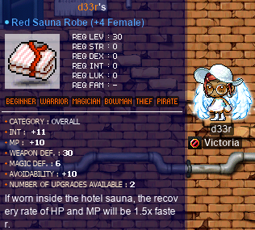

# rangifer’s diary: pt. lxvii

## Taxonomising odd jobs, pt. iv: Microtaxonomy & encodings. §3

In the previous section (§2) of this part, I compared and contrasted [the list of odd jobs on the **Oddjobs** website](https://oddjobs.codeberg.page/odd-jobs.html) with two other similar lists:

- “[General List of Experimental Classes](https://web.archive.org/web/20200217044826/http://www.basilmarket.com/Other-General-List-of-Experimental-Classes-Wiki-2993)”, posted on 2010-01-13 by [BasilMarket](https://basilmarket.com/) user **GunDelHel**.
- “[Alyssaur’s Kind of Unnecessary Compilation of Unusual Builds](https://mapleroyals.com/forum/threads/alyssaurs-kind-of-unnecessary-compilation-of-unusual-builds.32333/)” ([archived](https://web.archive.org/web/20210101092152/https://mapleroyals.com/forum/threads/alyssaurs-kind-of-unnecessary-compilation-of-unusual-builds.32333/)), posted on 2015-07-17 by [MapleRoyals](https://mapleroyals.com/) user **Alyssaur**.

And we also compared the Oddjobs list to the findings of pt. ii of this series, as well.

I came across a few adjustments that I wanted to make to the Oddjobs list (at the very least, for the purpose of this series):

- More carefully include post-v62-but-pre-BB (“v62” as in version 62 of GMS; “pre-BB” as in pre-Big-Bang) classes, i.e. Cygnus Knights and Legends. The Oddjobs list (at the time of writing) does mention some of these, but only in the aliases and notes for a few jobs like [STR beginner](https://oddjobs.codeberg.page/odd-jobs.html#str-beginner). GunDelHel’s list splits out some of the Cygnus-based and Legend-based odd jobs into their own jobs, but none of them are radically different enough from their pre-v63 counterparts to fall outside of their counterparts’ original definitions. That being said, in the interest of generality, I want to ensure that these later versions are incorporated explicitly into the odd jobs’ definitions.
- Although there are some good reasons why the Oddjobs list currently defines [bowginners](https://oddjobs.codeberg.page/odd-jobs.html#bowginner) (and the other jobbed rangeginners, i.e. [clawginners](https://oddjobs.codeberg.page/odd-jobs.html#clawginner) and [begunners](https://oddjobs.codeberg.page/odd-jobs.html#begunner)) as being perma-firsts (permanently first grade), I want to loosen this restriction on all three of them. Again, this is in the interest of generality, and to make their definitions sit more comfortably with historical definitions.
- Similarly in the interest of generality and historicity, I want to loosen the restriction on [pugilists](https://oddjobs.codeberg.page/odd-jobs.html#pugilist) that they must be totally bare-handed, instead stipulating that they _mustn’t use a main weapon, but may still equip shields_. This still means no knucklers, no spears, etc.; the only difference is that pugilists can now wear shields by definition, making “shieldless pugilist” a subjob of pugilist.
- We have at least two pirate odd jobs that have unclear definitions (well, their definitions are basically clear — it’s just unclear whether these are spiritually the “correct” or “natural” definitions), which we are going to handwavingly gloss over for now:
    - [Summoner](https://oddjobs.codeberg.page/odd-jobs.html#summoner),
    - [Pistol-whipper](https://oddjobs.codeberg.page/odd-jobs.html#pistol-whipper).
- The definition of [HP warrior](https://oddjobs.codeberg.page/odd-jobs.html#hp-warrior) is to be expanded to include HP spear(wo)men/DKs, although HP [permawarriors](https://oddjobs.codeberg.page/odd-jobs.html#permawarrior) will still be excluded. Again, this is for generality and historicity purposes.

Otherwise, there are other difficult issues that don’t arise (at least, not directly) from comparing historical lists side by side.

### Toe-stepping

The fundamental problem of perhaps all taxonomy is, in some ways, very simple: how do we make things (conceptually) separate from one other? In [The Real World™](https://en.wikipedia.org/wiki/Universe) (whatever that is), things are very messy, and nothing is separate from anything else. In some ways, the fact that we are dealing with a [video game](https://en.wikipedia.org/wiki/Video_game) can simplify things — if we want to know what class my character is, we can unambiguously consult the [bit](https://en.wikipedia.org/wiki/Bit)-level representation of my class. Something like `0000 0000 1110 1000`\* (in [decimal](https://en.wikipedia.org/wiki/Decimal): [232][232]) is known as “bishop”. This is because [computer programs](https://en.wikipedia.org/wiki/Computer_program), intentionally or tacitly, and for better or for worse, must formalise things to some degree — in the most basic case, by merely encoding them at the bit level.

Also for better or for worse, this kind of formalisation doesn’t actually take us very far. We bear in mind with seriousness the mechanical details as we go, but when it comes to something like defining “odd jobs”, we are left with an essentially _[anthropological](https://en.wikipedia.org/wiki/Anthropology)_ subject. In Actual Reality™ (again, whatever that is), we are dealing with a _body of practice_ surrounding an unusually specific way of playing a particular [MMORPG](https://en.wikipedia.org/wiki/Massively_multiplayer_online_role-playing_game) from [2003](https://en.wikipedia.org/wiki/2003). [Cultural approaches](https://en.wikipedia.org/wiki/Cultural_anthropology) are useful here, but limited, as the traces of such “culture” are largely lost to the ages, and many players (or groups of players) have decided to play odd jobs _independently_ of one another.

In any case, this leaves us with the task of hardening the definitions on our list of odd jobs. The fundamental problem of taxonomy is one of separation, so that is what we’ll do: get rid of as much toe-stepping as we can. We have a few issues with “odd job” definitions stepping on one another’s toes:

#### “Permabeginner”

In §2 of pt. i of this series, I tried to define “odd job” in a way that is parsimonious, and keeps things simple & pure. I said that “\[d\]efining a particular odd job (e.g. [permawarrior](https://oddjobs.codeberg.page/odd-jobs.html#permawarrior)) is **simple**”, and also that “\[e\]ach particular odd job satisfies some intuitive notion of **natural**”. The simplest definition of the classic “permabeginner” defines it as “the job that never takes first grade advancement”. However, permabeginners are very diverse, and as such, this definition technically encompasses our [campers](https://oddjobs.codeberg.page/odd-jobs.html#camper), [islanders](https://oddjobs.codeberg.page/odd-jobs.html#islander), and even non-locative distinctions like our [STRginners](https://oddjobs.codeberg.page/odd-jobs.html#str-beginner), [besinners](https://oddjobs.codeberg.page/odd-jobs.html#besinner), etc. It is possible to pave over these distinctions as all being subjobs (and subsubjobs, and so on), but at least to me, that would seem to be doing an immense disservice if this results in “hiding” them all within the umbrella of “permabeginner”. If our intent really is that stated in §1 of this part:

> \[W\]e are still imposing the restrictions that our finite set of odd jobs is indeed finite, has a [cardinality](https://en.wikipedia.org/wiki/Cardinality) of at least two, and that — importantly — each member of the set is a well-defined “odd job” that exists on the same conceptual level as, but is distinct from, every other member of the set, in a way that is more or less analogous to [the biological notion of “species”](https://en.wikipedia.org/wiki/Species).

…Then we need a way to chop down our ontology into a single conceptual level, with the understanding that there can always be “subjobs, subsubjobs, etc.” below that level, and possibly even “superjobs” above it. Ultimately, we want our taxonomical structure to co-occupy this upper level alongside where the “superjobs” (c/w)ould be, because we don’t want to organise odd jobs based on their definition (and therefore simply on which definitions are strictly more general, or less general, than some others) and nothing else. It’s pretty clear to me (and should become even more clear when we really start nailing down (a) taxonom(y/ies)) that defining a taxonomy based on the subjob relation is certainly _possible_, but pretty much misses the point, and leaves a lot (most?) of odd jobs stranded, somehow completely unrelated to every other job. So flattening things out gives us a simple and easy starting point (again, as elaborated in §1 of this part), and in doing so, we don’t want to flatten out our beginners to the point of asphyxiation.

If we — to use just one example — wanted to separate besinners from STRginners, it seems that we could easily float out some arguments that justify doing so, even given our definition of “odd job” expounded in pt. i of this series. A [natural-language](https://en.wikipedia.org/wiki/Natural_language) definition of these two jobs can still, arguably, satisfy our “simplicity” and “naturalness” requirements. For example:

- A STRginner is a **STR-based beginner**.
- A besinner is a **beginner that uses claws**.

Unfortunately, we’ve already run into a problem here. “STR-based beginner” still encompasses STRlanders, and “beginner that uses claws” still encompasses sinlanders. So, for better or for worse, we’re going to introduce the term “off-island” into these kinds of definitions, so we would have (for example):

- A STRginner is a **STR-based off-island beginner**.
- A besinner is an **off-island beginner that uses claws**.
- A STRlander is a **STR-based islander**.
- A sinlander is an **islander that uses claws**.

Other ways of phrasing “off-island” would be “outlander” or “mainlander”. The justification here is basically that locative distinctions form such a fundamental part of a job, that we cannot reasonably lump STRginners with STRlanders (although their names and corresponding naïve definitions might have you believe otherwise).

Likewise, distinctions of AP allocation, and of weaponry, form fundamental parts of jobs as well. Some odd jobs seem to (at least, definitionally) differ from non-odd ones simply by AP allocation alone: the [magelet](https://oddjobs.codeberg.page/odd-jobs.html#magelet) is a mage that is LUK-based rather than INT-based. And we can say similar things about weaponry distinctions: the [dagger warrior](https://oddjobs.codeberg.page/odd-jobs.html#dagger-warrior) is a warrior that uses daggers rather than ordinary warrior weapons (e.g. blunt weapons for warriors/pages/WKs/paladins). So this provides a strong argument for separating — reusing the same example — besinners from STRginners.

And furthermore, we have to simply realise the obvious: beginners are, by design, inherently unspecialised. This is why [every character is born a beginner](https://en.wikipedia.org/wiki/Tabula_rasa) (or whatever it may be called, e.g. noblesse; I’m using “beginner” as the catch-all term). And because all characters are _expected_ to leave Maple Island forever, and _expected_ to take first grade advancement at level 10 (or 8), these assumptions can be sneakily implicit in our definitions/names, and also causes “\[any\] job that never takes first grade advancement” to necessarily be odd already.

So, with that, we can expand “permabeginner” (or the list of permabeginner odd jobs on the Oddjobs list) into:

- Camp:
    - Camper (a.k.a. applelander)
- Maple Island:
    - STRlander (a.k.a. STR islander, stronglander)
    - DEXlander (a.k.a. DEX islander)
    - Magelander (a.k.a. wand islander, wandlander)
    - LUKlander (a.k.a. LUK islander, sinlander)
    - Hybridlander (a.k.a. hybrid islander) (this includes “perfectlanders”, and other related concepts)
- Outland:
    - STRginner (a.k.a. STR beginner)
    - DEXginner (a.k.a. DEX beginner, permadexer)
    - Wand beginner (a.k.a. wandginner, permawander)
    - LUKginner (a.k.a. besinner, singinner, LUK beginner)

…for a total of _ten_ odd jobs which necessarily can never take first grade advancement.

#### Thieves with a healthy disrespect for AP allocation

While this doesn’t cover _all_ thieves with a healthy disrespect for AP allocation (others are less problematic), the following are five such odd jobs that can sometimes be difficult to pry apart:

- [Grim reaper](https://oddjobs.codeberg.page/odd-jobs.html#grim-reaper)
- [Carpenter](https://oddjobs.codeberg.page/odd-jobs.html#carpenter)
- [LUKless assassin](https://oddjobs.codeberg.page/odd-jobs.html#lukless-assassin)
- [Brigand](https://oddjobs.codeberg.page/odd-jobs.html#brigand)
- [LUKless bandit](https://oddjobs.codeberg.page/odd-jobs.html#lukless-bandit)

See §3 of pt. i of this series for the arguments as to why grim reaper, carpenter, and brigand count as authentic odd jobs by our definitions, even though this might not be obvious.

First of all, we want to pry grim reaper and carpenter out of the grips of LUKless sin and brigand. Because grim reapers & carpenters are, by definition, restricted to using a one-handed axe & a one-handed sword, respectively, they tend to look like highly-weapon-restricted brigands. Or was it highly-weapon-restricted LUKless sins? Well, obviously, it depends on how they take their second grade advancement. But what if they just don’t take second grade advancement? Well, then they would overlap with [permarogue](https://oddjobs.codeberg.page/odd-jobs.html#permarogue) instead then, wouldn’t they? The point that I want to make is: just because two jobs can easily overlap with one another (“overlap” in the sense of a single character having both jobs), that doesn’t necessarily mean that they conflict, or step on each other’s toes. In particular, as long as the two jobs are defined distinctly enough that neither one encompasses the other (neither is a subjob of the other), and as long as each definition satisfies our requirements to be an “odd job”, there is no real issue. A given carpenter _could_ be a permarogue, or they could just take second grade advancement. A given carpenter _could_ be a brigand, or they could just never take second grade advancement to bandit. A given carpenter _could_ be a LUKless sin, or they could just never take second grade advancement to assassin. The key thing is that the carpenter, as a job, is defined only by the exclusive use of the [Saw](https://maplelegends.com/lib/equip?id=01302001). This happens to imply that they take first grade advancement to rogue (otherwise, they obviously couldn’t use the Saw at all), but there is no particular suggestion of what to do beyond that point. This means that our odd job definitions, when properly formalised/encoded/whatever, will need to include information about weaponry — at the very least, the set of all possible weapons that the job is capable of using. This information is already reflected in the Oddjobs list. I also want to, in addition, include the set of all “canonical” weapons (or rather, weapon types) for each job — so, hopefully I remember to do that!

Second of all, we want to pry apart LUKless sin and brigand from one another. The issue here is essentially that both of these odd jobs are rogues at their core, but don’t differ in any notable way while they are still first grade. Again, upon closer inspection, this isn’t a real issue; many pairs of jobs (when played/built “canonically”, if you will) are more or less indistinguishable from one another at _some_ point. Sometimes this happens within the first grade — take, as another example, a [permawarrior](https://oddjobs.codeberg.page/odd-jobs.html#permawarrior) versus any normal warrior. For obvious reasons, this is even more likely to happen within the zeroth grade… The point is, only diverging from second grade advancement and onwards is not really an issue for us, thanks to our definition of “atemporality” in pt. i of this series (see §4 and §5 in particular). Furthermore, LUKless sins and brigands actually do differ in a subtle way during even first grade, which I will get into below.

More to the point, we need to fix up how we represent the relationship between classes (“class” meaning in-game class name, like beginner, rogue, gunslinger, white knight, marksman, etc.; see §1 of pt. i of this series) and our odd jobs. Right now, on the Oddjobs list, each entry in the list has an associated list of “possible job progressions”. Each such “possible job progression” is full and complete; it always starts with “beginner” and proceeds to the highest possible grade, including everything in between. For many purposes, this works well enough. It’s supposed to be implied that some characters with a given odd job — and a given “job progression” thereof — may not make it to the highest possible grade listed, either because they simply never make it that far, or because they exist within a version of the game that lacks the fourth grade (and possibly also lower grades), or because they are self-imposing a grade restriction. And it’s also supposed to be implied that — while it’s obviously impossible to “skip” lower grades to get to higher ones more quickly — a character with a given job may not differentiate itself immediately, especially not while still a beginner. So lower grades might be irrelevant in some cases as well. When producing our own formalisation/encoding of odd jobs for the purpose of this series, “possible job progressions” just won’t do. Instead, we need to encode classes into our odd jobs by associating each odd job with a corresponding set of classes. This set would only contain exactly those classes _c_ such that it’s possible for a character whose class is _c_ to be a genuine specimen of the given odd job. In this example, a first grade brigand would not be considered a “genuine specimen” yet, as we are intentionally making a three-way distinction between kinds of non-dagger-using melee thieves: permarogues, brigands, and LUKless sins. None of these can be truly differentiated until level \>30, so before that point, they are in kind of a weird state where we consider them to be odd (as they are non-dagger-using melee thieves), but we don’t yet conclusively assign a job to them.

Third of all, we want to pry apart brigand and LUKless dit from one another. Both are LUKless dits/CBs/shads by definition, which makes the nomenclature somewhat confusing, as only one of them is actually _called_ “LUKless dit”. Furthermore, they are both melee combatants — barring the possible use of claws, which neither are very good at using anyways, although claws can still be useful in niche circumstances. What separates them is purely a matter of weaponry. Brigands are defined such that they can use essentially any weapon type, except for the canonical weapon type of their class (dit/CB/shad): daggers. On the other hand, LUKless dits are essentially limited to only ordinary thief weapons: daggers (and claws…). This gives them a playstyle very different from brigands, as there are many daggers (read: warrior-thief daggers, e.g. [Dragon Kanzir](https://maplelegends.com/lib/equip?id=01332049)) which don’t have LUK requirements, and their damage with daggers still scales reasonably well with STR+DEX (read: non-LUK stats) in all of their attacking skills. This also means that their AP allocation strategies tend to _usually_ be quite different in practice, although this is not part of their definitions _per se_. In line with the weaponry sets discussed above, this might look like:

- **Brigand**
    - Possible weapons:
        - {one-handed swords} [∪][union]
        - {one-handed axes} ∪
        - {one-handed blunt weapons} ∪
        - {wands} ∪
        - {staves} ∪
        - {two-handed swords} ∪
        - {two-handed axes} ∪
        - {two-handed blunt weapons} ∪
        - {spears} ∪
        - {polearms} ∪
        - {claws}.
    - Canonical weapons:
        - {one-handed swords} ∪
        - {one-handed axes} ∪
        - {one-handed blunt weapons} ∪
        - {two-handed swords} ∪
        - {two-handed axes} ∪
        - {two-handed blunt weapons} ∪
        - {polearms}.
- **LUKless dit**
    - Possible weapons:
        - {daggers} ∪
        - {claws}.
    - Canonical weapons:
        - {daggers}.

Footnotes for “Toe-stepping”

\*I’m using 16 bits here because, in general, these numbers can be as large as 999, thus requiring at least two [bytes](https://en.wikipedia.org/wiki/Byte). At best, [DPD](https://en.wikipedia.org/wiki/Densely_packed_decimal) gets you down to ten bits :)

[232]: https://en.wikipedia.org/wiki/232_(number)
[union]: https://en.wikipedia.org/wiki/Union_(set_theory)

## Adventures on Victoria Island

As it turns out, [Jr. Wraith](https://maplelegends.com/lib/monster?id=3230101)s drop [helm HP 10%](https://maplelegends.com/lib/use?id=2040005)s. And as you already know, my vicloc [clericlet](https://oddjobs.codeberg.page/odd-jobs.html#magelet) **d33r** is MapleLegends’s foremost Jr. Wraith murderer. Well, okay, maybe except some Jr. Wraith leechers out there… but that doesn’t count! They’re [cheating](https://maplelegends.com/lib/skill?id=2321008)!! In any case, this meant that I had a lot of these scrolls to give to vicloc bandit **xXCrookXx**:

ur welcome. Good luck with those. :)

Speaking of which, xXCrookXx was kind enough to help me towards finishing d33r’s [Sauna Robe](https://maplelegends.com/lib/equip?id=01051017) and [cape](https://maplelegends.com/lib/equip?id=01102099)! This included two more [OA INT 60%](https://maplelegends.com/lib/use?id=2040513)s from [casey](https://maplelegends.com/lib/monster?id=5220000), both of which I passed!!:

That brings the ratio of OA INT 60%s that I’ve passed on this god forsaken thing from 1/5 = 20%(!!) to 3/7 = 42.86%… Still not great, obviously, but what can you do. I’m just glad to have passed more of these damned things to get d33r that joocy INT.

The cape, on the other hand, was finished wonderfully with the aid of one more [cape INT 60%](https://maplelegends.com/lib/use?id=2041016)! Look at this thing!!:

12 INT… o\_o That brings d33r a long way towards being able to quest on her own, hehe.

And on my vicloc spear(wo)man **d34r**, I did some more [APQ](https://maplelegends.com/lib/map?id=670010000)s, as usual. I got to kill [the special fierry](https://maplelegends.com/lib/monster?id=9400518) that spawns when you have killed all of the original monsters in the first stage, and then talk to the [Glimmerman](https://maplelegends.com/lib/npc?id=9201047). This is nothing special — you have to kill it in order to get [the hammer](https://maplelegends.com/lib/etc?id=4031596) that lets you proceed — but I had actually never seen this thing up until this point. There was always someone else lined up to kill it, and often times I would be the leader, meaning that I was above the region where the monsters spawn, in order to talk to the Glimmerman. Turns out, this thing is just a [scaled](https://en.wikipedia.org/wiki/Image_scaling)-up version of [the ordinary Magik Fierries](https://maplelegends.com/lib/monster?id=9400517) that spawn when the stage first begins…

Kinda goofy-lookin’, but I respect the vibe. Unfortunately, I was also the leader during this APQ… I only had to kill the special fierry because I was the only female in the party.

## The big levelup party

I was honoured (and, unfortunately, exhausted, as it took place during an awkward time for me…) to attend the party for [STRginner](https://oddjobs.codeberg.page/odd-jobs.html#str-beginner) **ducklings**’s level 100, as well as I/L mage **Gruzz**’s, chief bandit (now shadower) **Harlez**’s, and sniper (now marksman) **xBowtjuhNL**’s level 120~! Long-time readers of this diary may remember that these are the folks with whom I [MPQ](https://maplelegends.com/lib/map?id=261000021)ed on my [darksterity knight](https://oddjobs.codeberg.page/odd-jobs.html#dex-warrior) **rusa**!

The party took place at the [Pet-Walking Road](https://maplelegends.com/lib/map?id=100000202) in Henesys, where partygoers were required to climb the pet-walking jump quest (JQ) in order for the party to start… unfortunately, I’m not exactly a JQ pro. But there were other non-pro JQers present, so it wasn’t so bad, even if I was feeling a bit zombified at the time. As I was attempting the JQ, xBowtjuhNL threw a [Bridesmaid’s Dress](https://maplelegends.com/lib/equip?id=01051152) at me and asked me to put it on for the party. So you’ll see rusa looking a little different in the image below…

Grats!!! That’s not one, not two, not three, but four huge levelup milestones in one image!! Unfortunately, I was such a zombie at this point that I couldn’t continue on with the rest of the party, so I missed out on the job advancements and [Silver Mane](https://maplelegends.com/lib/equip?id=1902001) quests and such. But I was happy to at least make it to the party and witness the levelups~!

## Moar MPQ w/ panolia

I did a few more [MPQ](https://maplelegends.com/lib/map?id=261000021)s on my [permarogue](https://oddjobs.codeberg.page/odd-jobs.html#permarogue) **panolia**~ I’ve been casually MPQing whenever the opportunity arises; I’m not really in a huge rush to level up panolia and get her out of MPQ, so taking it a bit slow is my current approach.

Here’s panolia, facing off against [normal Franky](https://maplelegends.com/lib/monster?id=9300139) alongside I/L mage **Espontanea**, DK **tootle**, and hermit **AppleBao**:

Emp E. Queue

I also did some trio MPQs (with me largely AFKing on my MPQ mule **potpan** in order to fill a slot and do the mage portal in stage 4) with the lovely **PengXiang** and **stink3r**!:

At this point, I have pretty much cemented my approach to MPQing on panolia: I use my dagger for the first three stages, and then largely use my claw for the rest, with the exception of doing the thief portal (if I do do it) during stage 4.

And finally, I also did some MPQs in a party with Espontanea, hermit **xChouri**, and white [knight of the **RoundTable**](https://en.wikipedia.org/wiki/Knights_of_the_Round_Table) guild **SirAmik**:

Unfortunately, this last string of runs was cursed. It was quite a long and continuous session of MPQing, and during that single session alone, we botched not one, not two, not three, but _four_ of the MPQs after having completed the large majority of the PQ!!! One was due to Espontanea dying in the mage portal as we were finishing up stage 4, and the others were due to MPQ bugs/crashes (as usual). One such crash even occured after we had gotten [Angy Fanky](https://maplelegends.com/lib/monster?id=9300140) down to 10% HP or so :(

Usually, these bugs occur swiftly and with violence — but one of them, we were able to see from a mile away:

R.I.P. SirAmik. This is as he was frozen in place, and we all cheerlessly waited for the server to finally time out and boot us all from the PQ. After the fourth failed PQ, we all went our separate ways, our souls having been wrested from our physical bodies by MPQ and its bugginess…

## Cards on cards on cards

Guess what time it is. That’s right, it’s time for Card-Hunting With capreolina™!!

Cards on cards on cards

With the [Buffy](https://maplelegends.com/lib/monster?id=6130200) and [Lazy Buffy](https://maplelegends.com/lib/monster?id=6230300) cards all wrapped up, I headed to [WPoT3](https://maplelegends.com/lib/map?id=220060200) to get the [Ghost Pirate](https://maplelegends.com/lib/monster?id=7140000) set:

While I was there, I accidentally stumbled across two [Buffoon](https://maplelegends.com/lib/monster?id=6300100) cards, as they spawn (albeit rarely) in this map as well:

…So I decided I would go back for the Buffoon card set later.

From there, a hidden portal took me to [Unbalanced Time](https://maplelegends.com/lib/map?id=220060201), where I hunted for the card set of [Dual Ghost Pirates](https://maplelegends.com/lib/monster?id=7160000), which largely differ from Ghost Pirates in the colour of their hats (green instead of blue):

Somewhat surprisingly given their name, Dual Ghost Pirates are not really the “dual” of Ghost Pirates in any discernable way, unless you count green as the “dual” of blue… Ghost Pirates are weak to fire and strong to ice, so you might expect Dual Ghost Pirates to be the opposite. But nope, their elemental interactions are identical. But, while I was at Dual Ghost Pirates, I came across something unusual:

Huh, weird. An [Unknown Letter](https://maplelegends.com/lib/etc?id=4001110). I guess it’s used in some quest for [a nightlord skill](https://maplelegends.com/lib/skill?id=4121008)!

With the Dual Ghost Pirate set complete, I headed to [Lost Time](https://maplelegends.com/lib/map?id=220070201) for the [MDT](https://maplelegends.com/lib/monster?id=7130300) set. I already had the [Death Teddy](https://maplelegends.com/lib/monster?id=7130010) set completed, which I completed while helping **Gruzz** farm at [FPoT3](https://maplelegends.com/lib/map?id=220070200) (see pt. xlvi).

Then I headed to [WPoT4](https://maplelegends.com/lib/map?id=220060300) to finish the [Spirit Viking](https://maplelegends.com/lib/monster?id=8141000) set, which I had already started as a result of training here for EXP:

I had never found the EXP to be that amazing. Back when I tried out this training spot, it was largely to take a break from the [Male Mannequins](https://maplelegends.com/lib/monster?id=9410034) that I was hunting at the time (I think this was during the [x-mas](https://en.wikipedia.org/wiki/Christmas) event). Mannequins hit hard, and I found myself dying a lot and using a lot of potions. Unfortunately, Spirit Vikings never really matched up to the kind of EPM that I was capable of getting at [Taipei 101](https://maplelegends.com/lib/map?id=742000000). That being said, I wanted to test my EPM now, with [SE](https://maplelegends.com/lib/skill?id=3121002) and all that. So I did:

Yeah, not so good. Obviously a lot better than many other _card-hunting_ locations, but for EPM alone, this is pretty bad. And that’s saying something, as I miraculously didn’t mess up almost at all during the EPM recording. Usually I’m getting hit by stray cannonballs and falling off the platforms every 15 seconds.

Anyways, with that set eventually finished up, I went to [Forbidden Time](https://maplelegends.com/lib/map?id=220070301) to get the [GPW](https://maplelegends.com/lib/monster?id=8143000) set:

And then, to the bottom of the clocktower for [Thanatos](https://maplelegends.com/lib/monster?id=8170000):

…As well as the significantly more annoying (but kinda cool-looking) [Gatekeeper](https://maplelegends.com/lib/monster?id=8160000):

And with that, I headed back up to [the top of Deep Ludi](https://maplelegends.com/lib/map?id=220050300) and up one map further for [Timer](https://maplelegends.com/lib/monster?id=5220003). Unfortunately, [Clock Tower Monster Wipe-Out](https://bbb.hidden-street.net/quest/ludus-lake/clock-tower-monster-wipe-out) (a.k.a. “the Timer quest”) doesn’t exist in MapleLegends — on the bright side, this means that I can hunt for the Timer card set without breaking my vow x)

I got a bit lucky here, and the Timer hunter who I ran into seemed to be leaving behind the cards! I guess they just wanted [the chair](https://maplelegends.com/lib/setup?id=3010024)? In any case, I only had to return back to Timer once in order to finish the set~

Whilst I was waiting for my Timer timer, I headed down just a bit to [FPoT1](https://maplelegends.com/lib/map?id=220070000) for a little more card-hunting. This map is the only map on which [Soul Teddies](https://maplelegends.com/lib/monster?id=6230400) spawn, and also the only map on which [MST](https://maplelegends.com/lib/monster?id=6230500)s spawn. The first card that I got was an MST one:

I had been warned (by the card-hunting guides that I read) that the MST set is a “probably just skip this one”, but things were looking good already. And I got some Soul Teddy cards as well:

Eventually, I finished the Soul Teddy card set. By that point, I was still only 3/5 MST. But that’s more than halfway there, right? So I decided to just keep farming there until I finished the MST set as well.

Oh, how foolish I was… By the time that I (finally, thank god) got my fifth MST card, I had not five, not six, not seven, but **15** Soul Teddy cards. At some point, I was no longer even hunting there for the MST set; a card set is just a card set. What I really wanted was to declare victory over MSTs once and for all, to show them that their trickery and stinginess was nothing to me!! By the time I finished, I had… a few [MST ETC](https://maplelegends.com/lib/etc?id=4000144)s:

Not bad, really. These ETCs are kind of a pain to farm for most of my characters, and they are required for the [Free Spirit](https://bbb.hidden-street.net/quest/ludus-lake/free-spirit) quest, as well as [Soul in the Dark](https://bbb.hidden-street.net/quest/victoria-island/soul-in-the-dark), which are both quests that I like to do.

With that, I was very prepared to leave Deep Ludi behind (for now, at least). So I headed down the [Helios Tower](https://maplelegends.com/lib/map?id=222020300) towards [KFT](https://maplelegends.com/lib/map?id=222000000). At this point, there were only two KFT card sets that I didn’t already have: [Old Fox](https://maplelegends.com/lib/monster?id=7220001) and [Scholar Ghost](https://maplelegends.com/lib/monster?id=6090003). The former is off limits for me, for [obvious reasons](https://bbb.hidden-street.net/quest/ludus-lake/legends-of-hometown), but I was also 0/5 on the latter, so I decided to try my hand at the Scholar Ghost set:

The first sweep of all eight channels that I did yielded three cards, so I was 3/5. Great! Just one more sweep, three hours later, and I could finish up this set. Unfortunately, three hours later, the second series of eight Scholar Ghost kills yielded just one card… 4/5. Thankfully, coming back a third time did yield the last card that I needed.

While I was there, I headed to the nearby [Seaweed Tower](https://maplelegends.com/lib/map?id=230020100) to attempt the only Upper Aqua Road set that I didn’t yet have completed: [Seruf](https://maplelegends.com/lib/monster?id=4220000). After some 45 minutes of busy-waiting, I did eventually manage to find one:

But it wasn’t enough to finish the set yet, so I came back just one more time some 65 minutes later to complete it! Again, while waiting, I headed to [Authorised Personnel Only](https://maplelegends.com/lib/map?id=261020401) in Magatia, to finish up a set that I had started but never completed: [Security Camera](https://maplelegends.com/lib/monster?id=7090000).

Very nice! This set was much easier to finish than it was to start, back when I was actually doing Magatia cards…

And now, it was time to move back to where I wanted to card-hunt next: Victoria Island. There, I harrassed the only area bosses / anti-bot monsters that I could hunt on my own:

[Shade](https://maplelegends.com/lib/monster?id=5090000) set done!

[ZMM](https://maplelegends.com/lib/monster?id=6300005) set: also done!! And while I was completing it, I had a rather interesting string of luck:

[o\.o](https://maplelegends.com/lib/use?id=2070007)

## rusa does the Rush quest (again)

While I was card-hunting on capre, I responded to a [smega](https://maplelegends.com/lib/cash?id=5072000) from nascent hero **Jcrry**, who was looking for another fourth-job warrior to do the [Rush](https://maplelegends.com/lib/skill?id=1121006) quest with. I showed up to [Ant Tunnel Park](https://maplelegends.com/lib/map?id=105070001) as my [darksterity knight](https://oddjobs.codeberg.page/odd-jobs.html#dex-warrior) **rusa**, and we headed to [Sanctuary Entrance III](https://maplelegends.com/lib/map?id=105090700) together on [hog](https://maplelegends.com/lib/equip?id=1902000)back. Along the way, Jcrry asked me about **Southperry**, wondering if they really were in the same alliance (**Suboptimal**) with me, as he suspected. I said that there were indeed a few Southperry members online at the moment, and Jcrry said that he had played as a member of Southperry (an [islander](https://oddjobs.codeberg.page/odd-jobs.html#islander)) for a while, some time back.

So, as we were killing [Charging Taurospear](https://maplelegends.com/lib/monster?id=9300087)s in the [Secret Shrine](https://maplelegends.com/lib/map?id=910500100):

…We talked a little bit about the island (vs. outland), as well as Victoria Islanding (vicloc)! And grats again to Jcrry on unlocking the Rush skill :)

## rusa slays the Leviathan

The 2021 MapleLegends summer event brought us several things. Among them was [B(R)PQ (Boss (Rush) Party Quest)](https://maplelegends.com/lib/map?id=970030000). Because I previously made [a video of rusa soloing bosses throughout her career](https://www.youtube.com/watch?v=RjBKefilPgs), I thought it would be a fun thing to take advantage of the event to do something similar — but all at once. I may or may not have procrastinated on this until the last day of the event, but I’m nevertheless pleased with how it came out!

I was able to solo the entirety of the first five (out of six) stages of BPQ, including a special area boss that I’ve never had the chance to solo (or even to fight at all, outside of BPQ): the [Leviathan](https://maplelegends.com/lib/monster?id=8220003). If you’re interested, you can watch the resulting video here!:

**[rusa solos BPQ (but not the last stage) \[YouTube\]](https://www.youtube.com/watch?v=mLUgdPFxYYw)**

And I’ve broken the video up into chunks for ease of viewing :)

Timestamps (in case you’re not watching on youtube.com)

- 00:00 rusa solos BPQ (but not the last stage)
- 00:16 Part I: The Easy Part™.
- 04:59 Part II: Manon & Griffey.
- 07:17 Part III: The Leviathan.
- 11:30 outro
- 11:40 outtakes

## cervine hits the big 110

As seen in the previous diary entry, I’ve been doing a bit of grinding [at CDs](https://maplelegends.com/lib/map?id=742010203) on my I/L [magelet](https://oddjobs.codeberg.page/odd-jobs.html#magelet) **cervine**, accompanied by sniper **Level1Crook** (**xXCrookXx**, **Sangatsu**)! Well, the grind has continued, and now cervine has hit a big milestone: level 110!!!

:D

Being level 110, besides looking cool, is a milestone because it enables me to equip the [Mark of Naricain](https://maplelegends.com/lib/equip?id=01122059) (MoN)! Poor cervine has been using a [Silver Deputy Star](https://maplelegends.com/lib/equip?id=01122014) for 60 levels, thanks to the fact that she graduated [MPQ](https://maplelegends.com/lib/map?id=261000021) long before MapleLegends massively buffed the [Horus’ Eye](https://maplelegends.com/lib/equip?id=01122010). Ironically, cervine’s Horus’ eye is actually “perfect” (by the old standards) — I managed to somehow pass all three [Rocks of Wisdom](https://maplelegends.com/lib/use?id=2041212) on it…

In any case, I was on the lookout for MoN sellers. I responded to a [smega](https://maplelegends.com/lib/cash?id=5072000) from **MuscleUncle** (**GuoYuUncle**, **XiWinieUncle**, **PorhubUncle**, **JinpingUncle**), but the first two times that I tried to buy from them, I was not fast enough (I’m not quick enough on the draw, I guess). Eventually, I did manage to sneak myself in as a buyer. So I was accompanied through a CWKPQ (or at least, 90% of one) by the **{U}ncle** crew and **YUrain00** (**YUrain02**):

Obviously, I didn’t actually participate in any of the PQ, so this was the only screenshot I took, from my hidey spot at the far left side of the boss stage. I can’t see much of what’s going on from here (lots of… hitting bosses very fast, I take it), but I did see this poor pirate fellow getting absolutely blasted off of a ledge by someone’s [Hurricane](https://maplelegends.com/lib/skill?id=3121004).

The first MoN that I looted was under average (9 MATK + 5 INT = 14 TMA \< 15 TMA), so I relooted and got this one:

Not bad! _Ever_ so slightly above average, as the TMA is exactly average, but the INT is above average by 1. No more dep stars for cervine :D

That being said, as you can see, the MAXHP and MAXMP are both the minimum possible (the range for each is 290–310)… oh well :P

## A special little LPQ session

Now that Level1Crook’s [LPQ](https://maplelegends.com/lib/map?id=221024500) mule **Sangatsu** was all grown up (i.e. level 50), Sangatsu invited me to LPQ on my own LPQ mule, my [DEX brawler](https://oddjobs.codeberg.page/odd-jobs.html#dex-brawler) **sorts**. I was happy to do so, and fortunately for us, **Bipp** (**Celim**, **Copo**, **Sommer**, **Fino**) and **xX17Xx** (**drainer**, **attackattack**, **partyrock**, **maebee**, **strainer**) happened to be online as well! So Bipp joined us on his claw [clericlet](https://oddjobs.codeberg.page/odd-jobs.html#magelet) **Cassandro**, and xX17Xx on her gunslinger **partyrock**!! Together, we formed **Suboptimal** Krew™ (& **best5**):

Somewhat ironically, partyrock is the only one actually representing Suboptimal here — both Sangatsu and Cassandro are guildless, and my LPQ mule is in **Pals**. :P

After an excellent, if short (partly due to Sangatsu & I absolutely laying waste to LPQ), LPQ session, it was time for Sangatsu and I to do the PQ mule thing: suicide. So we formed a suicide pact and died together in [FPoT1](https://maplelegends.com/lib/map?id=220070000):

Very sad. But ya gotta do it — for the LPQs.
