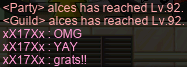
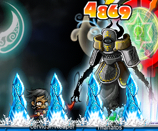
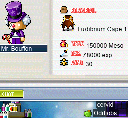
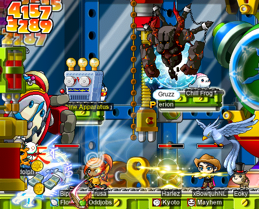
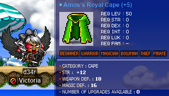
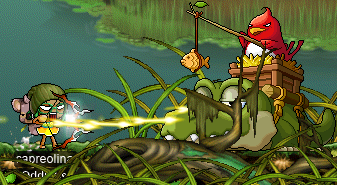
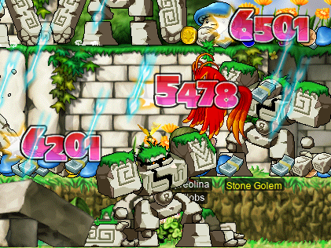
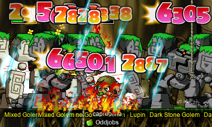
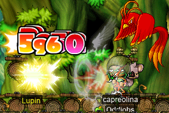
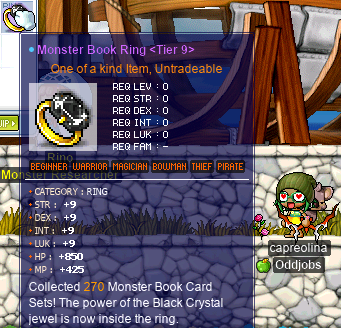

# rangifer’s diary: pt. lxviii

## Taxonomising odd jobs, pt. iv: Microtaxonomy & encodings. §4

In the previous section (§3) of this part (pt. iv), I tried to narrow down some refinements to [the list of odd jobs on the Oddjobs website](https://oddjobs.codeberg.page/odd-jobs.html). The purpose of these refinements is mostly to iron out the kinks that we come across when trying to flatten out our “[universe][universe]” of odd jobs into a single structureless [set][set] of objects. We want each one of these objects (i.e. each odd job) to essentially follow the principles laid out in pt. i of this series, and also fit nicely with our historical/anthropological perspective as explored in pt. ii of this series. Furthermore, we want to ensure that these objects don’t overlap in undesirable ways — for example, we don’t want one of the odd jobs to be a subjob (strict or otherwise) of another.

With that in mind, and with some of the kinks having already been ironed out in the previous section, I want to start explicitly constructing the set that we’re after, element by element. Unfortunately, it seems that we need _even more_ prelude here — we need to decide how to describe each odd job. This is already a kind of “encoding”, as we’re using “encoding” loosely to include formalisations in general, in addition to actual concrete [codes](https://en.wikipedia.org/wiki/Code). As before, I’m going to be using the list of odd jobs on the Oddjobs website (at the time of writing) as a starting point here.

### Names

The name of an odd job is only used to identify the odd job. Although obviously these names tend to actually mean something(s), and have some [etymology](https://en.wikipedia.org/wiki/Etymology), we don’t actually care for our purposes here. Thus, a name is just an arbitrary nonempty [string][string], with the constraint that that string is not used as a name for any other odd job.

We _could_ encode names by associating with each odd job a nonempty set of nonempty strings, subject to the constraint that the collection of all such sets is pairwise [disjoint](https://en.wikipedia.org/wiki/Disjoint_sets). This would allow for a given odd job to have multiple names (as they often do, in practice). But, again, we are really only using the names for identification purposes, so it suffices to just pick one.

### Classes

In §3 of this part, I said:

> \[W\]e need to encode classes into our odd jobs by associating each odd job with a corresponding set of classes. This set would only contain exactly those classes _c_ such that it’s possible for a character whose class is _c_ to be a genuine specimen of the given odd job. In this example, a first grade brigand would not be considered a “genuine specimen” yet, as we are intentionally making a three-way distinction between kinds of non-dagger-using melee thieves: permarogues, brigands, and LUKless sins. None of these can be truly differentiated until level \>30, so before that point, they are in kind of a weird state where we consider them to be odd (as they are non-dagger-using melee thieves), but we don’t yet conclusively assign a job to them.

This notion of “genuine specimen” is a kind of… “nonlocal” property, if you will. What I mean is that, when determining whether or not a character is a “genuine specimen” of a particular odd job, it doesn’t always suffice to just look at the character & at the basic definition of the odd job. We might _also_ need to know how _other_ odd jobs are defined, because the notion of “genuine specimen” is tied up with our need to keep the odd jobs separate from one another. We’re perfectly okay with a single character fitting the definition of more than one odd job at the same time: for example, a [permarcher](https://oddjobs.codeberg.page/odd-jobs.html#permarcher) who is also a [woods(wo)man](https://oddjobs.codeberg.page/odd-jobs.html#woodsman) is perfectly conceivable (in fact, I wouldn’t mind playing one myself…). What we’re _not_ okay with is when a pair of odd jobs _necessarily collide_ at some point. Using the example above: if we allowed a rogue (first grade thief) to be considered a [brigand](https://oddjobs.codeberg.page/odd-jobs.html#brigand), and also allowed them to be considered a [LUKless sin](https://oddjobs.codeberg.page/odd-jobs.html#lukless-assassin), then any level 27 rogue who aspires to advance to second grade brigand (with a class of “bandit”) _or_ to second grade LUKless sin (with a class of “assassin”) is somehow considered to be _both_, at least for the time being. And worse yet, if they instead went the [permarogue](https://oddjobs.codeberg.page/odd-jobs.html#permarogue) route — while still being a non-dagger-using melee thief — they would presumably be a brigand, a LUKless sin, and a permarogue all at once. These collisions are not the product of the player’s choice (as was the case with the permarcher-woods(wo)man), but rather, are a product of sloppy definitions.

So, with that in mind, the above quotation summarises how we wish to formalise classes as part of our odd job definitions. The basic structure is thus: a single nonempty set of classes being associated with each odd job. And the constraint is: each set contains all classes _c_ such that it’s possible for a character whose class is _c_ to be a “genuine specimen” (in the above sense) of the associated odd job.

Oh, and also, we will only be considering classes up to, and including, grade two. This is for generality; classes that have a grade higher than two can simply be collapsed into the lowest-grade class that is a member of their throughclass. For example, we can conflate “chief bandit” and “shadower” with bandit, thus eliminating the need to use the terms “chief bandit” and “shadower” entirely.

### Locations

Every odd job is associated with a location of some kind, in order to accommodate our [islanders](https://oddjobs.codeberg.page/odd-jobs.html#islander) and our [campers](https://oddjobs.codeberg.page/odd-jobs.html#camper) (and their exact analogues from later pre-BB versions, e.g. roadies and snowlanders). There are plenty of interesting locations that can be associated with a given character build, but our focus is narrow: we only want to define some odd jobs. So, for that purpose, there are only three possible values for the location of a particular odd job:

- Camp
- Maple Island
- Outland

…Which should be self-explanatory. The only slight caveat is that we are using these terms broadly:

- “Camp” refers to _any_ camp from _any_ pre-BB version of MapleStory. This includes, for example:
    - The “classic camp”, which looks visually similar to Maple Island (grass, dirt, mushrooms, sky, etc.), with the exception of being populated by [Tutorial Jr. Sentinels](https://maplelegends.com/lib/monster?id=9300018).
    - Later versions of the same camp, which are visually indoors (featuring [conveyor belts](https://en.wikipedia.org/wiki/Conveyor_belt), [image projectors](https://en.wikipedia.org/wiki/Projector), etc.) and force the player to wear a full-body green apple suit (whence “applelander”).
    - Empress’ Road (whence “roadie”).
    - The tutorial region of Snow Island (populated by Tutorial Murus), whence “snowlander”.
- “Maple Island” refers to _any_ version of Maple Island, as well as _any_ Maple-Island-equivalent region from _any_ pre-BB version of MapleStory.
- “Outland” refers to the [union][union] of all regions that aren’t already included within the above.

### Stats

Within the list of odd jobs on the Oddjobs website, the stats used by a given odd job are addressed in two ways:

- A list of “primary” stats, and a list of “secondary” stats.
- A list of stat constraints.

And, in particular, the stats in question are:

- STR
- DEX
- INT
- LUK
- MAXHP
- MAXMP

#### Primary stats, secondary stats

Defining what “primary” and “secondary” mean above can be a little tricky. But this should suffice:

- A stat _s_ is “primary” for a job _j_ when one or more of the following are true:
    - _j_ requires, by definition, having a base _s_ that is significantly more than the minimum amount of _s_. The minimum amount of _s_ might depend on _j_’s classes, e.g. 4 is usually the minimum for INT, but that’s raised to 20 in the case that _j_ enforces being a mage. The minimum amount of _s_ also might depend on _j_’s required equipment, in the case that _j_ requires some particular equipment item that has stat requirements. For example, [magelanders](https://oddjobs.codeberg.page/odd-jobs.html#magelander) are forced to use the [Metal Wand](https://maplelegends.com/lib/equip?id=01372002), which has a minimum total INT requirement of 55.
    - _m_ is a mode of attacking that is a primary method of dealing damage for _j_ (many odd jobs have multiple such modes), and _s_ is the stat (out of all six stats) that contributes the most positively to _m_’s [expected][expectation] damage output. In the case of a tie (multiple stats contribute the most positively to _m_’s expected damage output), all stats _s_ that are tied and would otherwise qualify as secondary stats (if they weren’t primary stats) are considered primary stats. Other stats _s_ that are tied are considered to be secondary (unless they are already primary anyways!).
- A stat _s_ is “secondary” for a job _j_ when _s_ is not primary for _j_, and one or more of the following are true:
    - Nontrivial amounts of total _s_ are required to equip one or more of the items that are idiomatic equipment for _j_.
    - _m_ is a mode of attacking that is a primary method of dealing damage for _j_ (many odd jobs have multiple such modes), and _s_ is a stat that contributes positively to _m_’s expected damage output.
- A stat _s_ is “tertiary” for a job _j_ when _s_ is neither primary nor secondary for _j_. It is rare to explicitly name tertiary stats for a job, as knowing the primary and secondary stats is enough to know that all other stats are tertiary.

Slightly wonky, but MapleStory has some rather strange mechanics and weird corner cases that force us to word this very carefully. This is also, obviously, far from the only possible way to reasonably define these terms — but it should be good enough for our purposes.

With that in mind, we can formalise the primary and secondary stats of a given odd job as simply being two sets (each possibly empty) of stats, selected from the universe {STR, DEX, INT, LUK, MAXHP, MAXMP}. We don’t necessarily have to specify that this pair of sets is disjoint, but because of our definitions of “primary” and “secondary” above, they will end up being disjoint anyways.

#### Stat constraints

Within the list of odd jobs on the Oddjobs website, stat constraints are given as a list of constraints, and the implication is that we take the [conjunction](https://en.wikipedia.org/wiki/Logical_conjunction) of these constraints. Each item in the list is generally written as *a*ℛ*b*, where ℛ is one of the following [binary relations](https://en.wikipedia.org/wiki/Binary_relation):

- [=][equality]
- [\>][inequality]
- ≫

This latter symbol means “is much greater than”, and is used to denote that the left-hand side has to be _considerably_ larger than the right-hand side, not merely mathematically larger. And _a_ and _b_ are usually(!) either a constant [natural number](https://en.wikipedia.org/wiki/Natural_number) (e.g. 4), or some stat (e.g. DEX). It gets a little hairier with, for example, the stat constraints of [gish](https://oddjobs.codeberg.page/odd-jobs.html#gish) and of [gishlet](https://oddjobs.codeberg.page/odd-jobs.html#gishlet) — but we can gloss over that, because I don’t want to actually define our stat constraints in that way for our purposes.

Rather than adopting this method, I want to do something fundamentally different, albeit loosely inspired by the way that I’ve done it for the list on the Oddjobs website. Like the aforementioned method, I want to express stat constraints as a conjunction of zero or more (but still a finite number, of course) constraints. But, instead of framing each individual constraint in terms of a binary relation, I want to break the constraints into a few possible cases. Each possible case is formalised as a [higher-order function](https://en.wikipedia.org/wiki/Higher-order_function) that [takes in](https://en.wikipedia.org/wiki/Domain_of_a_function) a stat (i.e. an element of the set **Stat** = {STR, DEX, INT, LUK, MAXHP, MAXMP}), and [yields](https://en.wikipedia.org/wiki/Codomain) a [predicate][predicate]. The predicate’s sole [argument](https://en.wikipedia.org/wiki/Argument_of_a_function) is a natural number representing the value of the corresponding base (i.e. _without_ any equipment/buffs) stat of the character. In other words, each case is some [function][function] ℱ [:](https://en.wikipedia.org/wiki/Type_theory) **Stat** [→][function] ([ℕ](https://en.wikipedia.org/wiki/Natural_number) → [{0, 1}](https://en.wikipedia.org/wiki/Boolean_domain)).\* Each concrete constraint, then, is the result of [applying](https://en.wikipedia.org/wiki/Function_application) such a higher-order function, and the constraint is satisfied [iff](https://en.wikipedia.org/wiki/If_and_only_if) it yields true (or 1, or whatever you wanna call it) for the given character. In the following list of cases, _s_ is any arbitrary stat:

- **Less**(_s_)

  This function gets its name from the [English](https://en.wikipedia.org/wiki/English_language) [suffix](https://en.wikipedia.org/wiki/Suffix) “[-less](https://en.wiktionary.org/wiki/-less#English)”, which is commonly used to describe character builds in MapleStory: “DEXless”, “LUKless”, etc. This expresses constraints that are, in the Oddjobs list, expressed by using equality (“=”) to equate the stat (e.g. STR) with its minimum (e.g. 4 for most classes, 35 for warriors). The constraint is simply that the character cannot have a base _s_ that is significantly higher than the minimum value of their _s_.
- **Ful**(_s_)

  This function gets its name from the English suffix “[-ful](https://en.wiktionary.org/wiki/-ful#English)”, which is the opposite of “-less” in some sense. If **Less**(_s_) expresses that the character mustn’t have any base _s_, then **Ful**(_s_) expresses that the character must have some significant amount (above the minimum) of base _s_. This expresses constraints that are, in the Oddjobs list, expressed by using “≫” to constrain the stat (e.g. STR) to be considerably larger its minimum (e.g. 4 for most classes, 35 for warriors).
- **Pure**(_s_)

  This function is a stronger version of **Ful**(_s_). Rather than expressing that the character has a significantly high base _s_, **Pure**(_s_) expresses that the character has put all of their AP into _s_ (at least, as much as possible). The term “pure” is also in common parlance: a “pure LUK thief” is understood to be a thief that is STRless and DEXless. We can allow some special exceptions to the constraint that the character has “put all of their AP into _s_”, for the purpose of HP/MP washing (if such a mechanic exists in the game implementation), and/or for the purpose of “bloodwashing”/“bluewashing” to some degree†.

A smol, but significant, addition here is that we actually want each constraint not to be just one predicate, but rather, to be the [disjunction](https://en.wikipedia.org/wiki/Logical_disjunction) of one of more predicates.‡ This lets us easily cover a few edge cases (e.g. gishes), but is usually unnecessary (i.e. it will usually be the disjunction of just one predicate, which is the same as just the predicate itself).

Footnotes for “Stat constraints”

\*This is somewhat simplified; “ℕ” should really be “**Char**”, or something like that. We need to know more about the character than just a single number in order to evaluate these predicates, but the main thing that we are looking at is their base _s_ (for whatever _s_ [∈][element] **Stat** was passed in as an argument).

†I say “to some degree” because we can’t allow _purely_ washed characters to qualify for this exception. Characters that spend all of their AP to further some combination of HP/MP washing, “bloodwashing”, and “bluewashing” would then be able to satisfy **Pure**(_s_) and **Less**(_s_) at the same time, which we obviously want to disallow.

‡We’re getting what is called a “[product](https://en.wikipedia.org/wiki/Logical_conjunction) of [sums](https://en.wikipedia.org/wiki/Logical_disjunction) form” in [digital](https://en.wikipedia.org/wiki/Digital_electronics) logic.

### Equipment

Because we are going to allow [pugilists](https://oddjobs.codeberg.page/odd-jobs.html#pugilist) to wear shields (see §2 and §3 of this part), the only constraints that we need to place on equipment is on weapons. So, to specify the equipment that is allowed for a given odd job, we can simply specify the set of all weapons that they are “allowed” to use. The key word here is “allow” — this still includes weapons that the odd job is _spiritually_ allowed to use, but that the odd job is actually incapable of wielding in practice. For example, [brigands](https://oddjobs.codeberg.page/odd-jobs.html#brigand) are allowed to use any polearm; nevertheless, they can never wield the [Eclipse](https://maplelegends.com/lib/equip?id=01442019) — despite it being a polearm — due to it being a warrior-only equipment item. This makes equipment constraints more comparable, easier to define, and more general.

There are basically three ways that we might define weapon constraints. For any given odd job, we will pick exactly one of them:

- No constraints. This is just [the set of all weapons in the game][universe].
- A nonempty set of weapon types. Each such weapon type is the set of all weapons that are of that type, and we simply take the [union][union] of all of these sets. The types that exist are as follows:
    - One-handed sword (item [ID](https://en.wikipedia.org/wiki/Identifier)s: 130*dddd*\*)
    - One-handed axe (item IDs: 131*dddd*)
    - One-handed BW† (item IDs: 132*dddd*)
    - Dagger (item IDs: 133*dddd*)
    - Wand (item IDs: 137*dddd*)
    - Staff (item IDs: 138*dddd*)
    - Two-handed sword (item IDs: 140*dddd*)
    - Two-handed axe (item IDs: 141*dddd*)
    - Two-handed BW (item IDs: 142*dddd*)
    - Spear (item IDs: 143*dddd*)
    - Polearm (item IDs: 144*dddd*)
    - Bow (item IDs: 145*dddd*)
    - Crossbow (item IDs: 146*dddd*)
    - Claw (item IDs: 147*dddd*)
    - Knuckler (item IDs: 148*dddd*‡)
    - Gun (item IDs: 149*dddd*)
- A nonempty set of individual weapons (i.e. individual item IDs).

There is just one weird corner case here: attacking with no weapon equipped. Attacking with no weapon is similar enough to using a knuckler that we consider “no weapon at all” to be a member of the set of all knucklers. Obviously, it has no item ID, but we can just pretend that it has an ID of 0. Thus, the weapon constraints for [pugilist](https://oddjobs.codeberg.page/odd-jobs.html#pugilist) are expressed as the [singleton][singleton] set {0}.

Beyond just constraints, we also (as per §3 of this part) want to accommodate “canonical” weapons as part of each odd job’s definition. While the weapon constraints tell us the set of all weapons that the odd job is spiritually _allowed_ to use, the set of canonical weapons tells us which weapons the odd job _idiomatically_ uses. The set of canonical weapons is always a [subset](https://en.wikipedia.org/wiki/Subset) (although, not necessarily a strict one) of the set of allowed weapons. Otherwise, the set of canonical weapons is defined very similarly to the set of allowed weapons. One caveat is that we want to disallow defining the canonical weapons in terms of individual IDs, unless the allowed weapons are also defined in terms of individual IDs. Again, this makes things more comparable, easier to define, and more general.

Footnotes for “Equipment”

\*Here, _dddd_ is any string of four [decimal](https://en.wikipedia.org/wiki/Decimal) digits.

†Here, “BW” stands for “blunt weapon”, and is synonymous with “mace”.

‡We make an exception for fighting with no weapon equipped, which has an ID of 0 despite being considered a knuckler. See the main text.

### Skills & attacks

Weapon constraints (and class constraints, obviously) naturally put limitations on the abilities (active or passive) that a job can make use of. For example, despite the fact that most definitions of brigand don’t explicitly disallow the use of [Savage Blow](https://maplelegends.com/lib/skill?id=4201005), brigands cannot use Savage Blow. Using Savage Blow requires that the user be wielding a dagger, and brigands cannot wield daggers. That being said, some odd jobs feature constraints on the abilities that they can use which _cannot_ be captured simply by a combination of class constraints & equipment constraints. We can express these skill/attack constraints with the use of just one predicate, in addition to associating yet another set with each odd job. Our new predicate is (in the definition of this predicate, _j_ is any arbitrary job):

- **Ammo**(_j_)

  This predicate is satisfied iff _j_ is allowed to use ammunition. Like with weapon constraints, the word “allowed” here is spiritual — even a job that would likely never want to use ammunition (e.g. [DEX warrior](https://oddjobs.codeberg.page/odd-jobs.html#dex-warrior)), or a job that is _de facto_ incapable of using ammunition (e.g. [dagger warrior](https://oddjobs.codeberg.page/odd-jobs.html#dagger-warrior)), can still satisfy this predicate.

And the set that we want to associate with each job is the set of all non-zeroth-grade skills that that job is allowed to make use of. We ignore zeroth-grade skills because none of our odd job definitions disallow any particular zeroth-grade skills. For jobs that have no skill constraints, it is immaterial to our definition whether the corresponding set of skills contains all skills that are possibly available to that job (based solely on the job’s possible classes), or just all skills in general. For jobs that _do_ have explicit skill constraints, we consider all and only those skills that are possibly available to the job in question (again, based solely on the job’s possible classes). We also consider skills from grades one, two, three, and four, for maximum generality. Furthermore, we collapse multiple skills that only really differ in what class and/or weapon type they are available to, into a single skill with a single ID. An extreme example of this kind of collapsing is [Maple Warrior (MW)](https://maplelegends.com/lib/skill?id=1121000); there is (internally) a different MW skill for every fourth-grade class in the game, but we simply take the smallest skill ID out of all of them (1121000, in the MW case; heroes just happen to have the smallest class ID of any fourth-grade class) and conflate the rest with it. This same logic applies to masteries, boosters, final attack skills, etc.

[universe]: https://en.wikipedia.org/wiki/Universe_%28mathematics%29
[set]: https://en.wikipedia.org/wiki/Set_(mathematics)
[string]: https://en.wikipedia.org/wiki/String_(computer_science)
[union]: https://en.wikipedia.org/wiki/Union_(set_theory)
[expectation]: https://en.wikipedia.org/wiki/Expected_value
[equality]: https://en.wikipedia.org/wiki/Equality_(mathematics)
[inequality]: https://en.wikipedia.org/wiki/Inequality_(mathematics)
[function]: https://en.wikipedia.org/wiki/Function_(mathematics)
[predicate]: https://en.wikipedia.org/wiki/Predicate_(mathematical_logic)
[relation]: https://en.wikipedia.org/wiki/Relation_(mathematics)
[singleton]: https://en.wikipedia.org/wiki/Singleton_%28mathematics%29
[element]: https://en.wikipedia.org/wiki/Element_(mathematics)

## Fancy Amps w/ xX17Xx

I joined [permarogue](https://oddjobs.codeberg.page/odd-jobs.html#permarogue) extraordinaire **xX17Xx** in her [Fancy Amp](https://maplelegends.com/lib/monster?id=9410029)s grind, on the last stretch before the big level 90. She and my undead [daggermit](https://oddjobs.codeberg.page/odd-jobs.html#dagger-assassin) **alces** make a pretty good Fancy Amps duo, with both of us tearing up the amps with our respective first-job rogue skills:

I was already fairly close to levelling up, so I hit level 92(!):

…Which was just enough to max out [Alchemist](https://maplelegends.com/lib/skill?id=4110000)! Now my [Barbarian Elixir](https://maplelegends.com/lib/use?id=2002025)s really over-heal me… Next up is maxing [SW](https://maplelegends.com/lib/skill?id=4111003) (that should be interesting…)!

And with some more grinding, we hit the glorious moment that xX17Xx has been waiting for:

At long last, xX17Xx can wield the ultimate permarogue weapon: the [NRC](https://maplelegends.com/lib/equip?id=01472073)!!! Congrats again :D

## Bossing with friends

I was invited to do some more bossing with some of [**rusa**](https://oddjobs.codeberg.page/odd-jobs.html#dex-warrior)’s [MPQ](https://maplelegends.com/lib/map?id=261000021) buddies: **Eoka**, **Gruzz**, **Harlez**, and **xBowtjuhNL**! And this time, I invited along brand-new shadower of **Flow**, **Bipp** (**Celim**, **Sommer**, **Cassandro**, **Copo**, **Fino**, **Sabitrama**)!

bossin’ wif fwendz

I hopped onto my pure [STR bishop](https://oddjobs.codeberg.page/odd-jobs.html#str-mage) **cervid** to join the crew for a full six-man [Ravana](https://maplelegends.com/lib/monster?id=9420014) fight!:

It was fun to see the occasional big red number pop up on Ravana’s head as a result of me whacking it with xBowtjuhNL’s [SE](https://maplelegends.com/lib/skill?id=3221002) crits x)

And, after killing Rav, we headed to [Deep Ludibrium](https://maplelegends.com/lib/map?id=220050300) for some [Papu](https://maplelegends.com/lib/monster?id=8500001) action. I had never actually fought Papu on cervid, despite having done the prequests a while ago. So I had to pick up a [Ludibrium Medal](https://maplelegends.com/lib/etc?id=4031172) from the [scary guys](https://maplelegends.com/lib/monster?id=8170000) at the bottom of the tower:

I realised that fighting the Papulatus Clock was going to be a bit of a doozy, considering that its frequent dispels would eliminate all of my many buffs, including [MG](https://maplelegends.com/lib/skill?id=2001002) and [Invincible](https://maplelegends.com/lib/skill?id=2301003). Because I would, obviously, be meleeing the beast, and I don’t have [Power Stance](https://maplelegends.com/lib/skill?id=1321002), I was forced to sit on the bottom and be subjected to dispels and 1/1s whenever Papu felt like it. But I figured I might as well give it my best shot, so I did. Much buff-icon staring ensued:

But, unfortunately, it wasn’t long before I got hit immediately after being dispelled:

Very sad. I seriously considered switching characters for the next run, but someone suggested that I try actually taking on a [Heal](https://maplelegends.com/lib/skill?id=2301002)ing role (lol) instead. So, I pulled out [my healing stick](https://maplelegends.com/lib/equip?id=01372035) and gave it a go. With just a little bit of caution, this worked well enough to make it through a Papulatus run and finish the associated questline!:

After that, we went [BF](https://maplelegends.com/lib/monster?id=9400575) hunting! So I swapped over to my [darksterity knight](https://oddjobs.codeberg.page/odd-jobs.html#dex-warrior) **rusa** and proceeded to die at least twice to this absurd monster as a result of being bad at the game:

And, the next day, we returned to Papu, with me taking rusa this time — to avoid the pain of trying to STR mage in the presence of Papulatus.

…And I still have yet to see this clocktower freak drop [a teddy bear](https://maplelegends.com/lib/setup?id=3010026)! Come on!!

## Doing Shaolin Temple quests for the first time

I was informed — by the same folks with whom I had just been bossing — that the [Shaolin Temple](https://en.wikipedia.org/wiki/Shaolin_Monastery) region has a certain very rewarding questline within it: “The Secret of the Sutra Depository”. This is a level ≥120 quest, which is kind of neat, although unfortunately it appears to require the player to take fourth job advancement (sorry perma-thirds, perma-seconds, perma-firsts, and [perma-zeroths](https://oddjobs.codeberg.page/odd-jobs.html#str-beginner)!). Luckily for rusa, she is a full-blown darksterity knight, so she was able to start the questline. The quest largely asks you to go through the Sutra Depository and kill stuff, collecting some ETCs along the way. Here is rusa, on [floors 1–2 of the Sutra Depository](https://maplelegends.com/lib/map?id=702070100), fighting [Mini Bronze Martial Artist](https://maplelegends.com/lib/monster?id=9600020)s for [their hearts](https://maplelegends.com/lib/etc?id=4000407):

The hearts (the ETCs) are the most important part, as the speed at which you finish the required kills outpaces their drop-rate pretty quickly. Plus, the last quest in the questline asks for an extra 30 [of](https://maplelegends.com/lib/etc?id=4000407) each [type](https://maplelegends.com/lib/etc?id=4000402) of [heart](https://maplelegends.com/lib/etc?id=4000406). For [the golden martial artist](https://maplelegends.com/lib/monster?id=9600019)s, we headed outside to [The Forest of Towers](https://maplelegends.com/lib/map?id=702080000):

The “**MISS**”es that you see in the image above are, needless to say, not coming from rusa’s attacks…

In any case, we eventually got all of the hearts that we needed for me and xBowtjuhNL to finish the questline. From the front to the back of this questline, a grand total of 4.05M base EXP is handed out — after MapleLegends’s 3× quest EXP multiplier, that comes out to **12.15M** EXP!! Very nice!!! I’ll have to come back and do this questline on **cervid** and **capreolina**…

Oh, and now that we had all finished this questline, we were eligible to fight the big bad master martial artist of the Shaolin Temple: [Jiaoceng](https://maplelegends.com/lib/monster?id=9600025)\* (sometimes referred to as simply “JC”)! Of course, we aren’t exactly badass enough to actually beat this guy, but that wasn’t going to stop us from trying it out. Although Jiaoceng’s other stats are not really all that impressive for a level 150 boss, he _does_ have 80M MAXHP, which proves to be a bit of an issue, given that you only have ten minutes to kill him…

We bailed out after three or four minutes, but it was pretty fun to check it out for the first time!

Footnotes for “Doing Shaolin Temple quests for the first time”

\*Other versions of the game [romanise](https://en.wikipedia.org/wiki/Romanization) this name as “Wulin Yaoseng”, which appears to be the [pinyin](https://en.wikipedia.org/wiki/Pinyin) (without tone marks; the actual pinyin would be “_Wǔlín Yāosēng_”) for “武林妖僧”. [Google Translate](https://translate.google.com/) translates this into [English](https://en.wikipedia.org/wiki/English_language) as simply “martial arts monk”.

## capreolina takes a vacation in Victoria Island

Now that my [woodsmaster](https://oddjobs.codeberg.page/odd-jobs.html#woodsman) **capreolina** has decided to head to Victoria Island for the time being (maybe I’ll go back to Deep Ludi for cards another time), it was time for a little questing, and a special edition of Card-Hunting With capre™:

Quests on cards on quests~

As readers of this diary already know, I don’t hunt area bosses that are used for quests… unless I need them for a quest. Or, unless I’m a viclocker! Being a viclocker means that Victoria Island area bosses are an extremely valuable resource, so I hopped onto my vicloc [dagger spearwoman](https://oddjobs.codeberg.page/odd-jobs.html#dagger-warrior) **d34r** to hunt some area bosses, and get cards for capre along the way! This proved to be more than a little bit annoying, due to capre and d34r being on the same account. But it worked out.

First up were some easy ones: [Mano](https://maplelegends.com/lib/monster?id=2220000)…

…and [Stumpy](https://maplelegends.com/lib/monster?id=3220000):

Not bad. I managed to get roughly ten [Saps of Ancient Tree](https://maplelegends.com/lib/use?id=2012002) for my vicloc [clericlet](https://oddjobs.codeberg.page/odd-jobs.html#magelet) **d33r**, plus a good scroll or two, along the way.

I hunted down my arch nemesis, the [Golden-River](https://maplelegends.com/lib/equip?id=01332019)-withholding demon: [jrog](https://maplelegends.com/lib/monster?id=8130100).

I even got capre her very own [Balrog Chair](https://maplelegends.com/lib/setup?id=3010126) o\_o:

Oh, and the beast decided to taunt me by dropping another [Golden River](https://maplelegends.com/lib/equip?id=1332019) at my feet:

It was only 77 WATK (3 below average), and fellow viclocker **xXCrookXx** scrolled it, passing some four or five [60%](https://maplelegends.com/lib/use?id=2043301)s on it. Not bad, at that point, but certainly worse than the Golden River that d34r already uses.

capre headed over to [Florina Beach](https://maplelegends.com/lib/map?id=110000000) to complete [the King Clang questline](https://bbb.hidden-street.net/quest/victoria-island/defeat-king-clang), hunt a few cards, and loot some [Casey](https://maplelegends.com/lib/monster?id=5220000) cards:

It seems that, despite being probably the hardest to kill out of these three species, [Tortie](https://maplelegends.com/lib/monster?id=4130101)s have by far the highest card drop rate. Just from hunting in [the best map](https://maplelegends.com/lib/map?id=110030001) for [Clang](https://maplelegends.com/lib/monster?id=4230104)s, I ended up with way too many of these dumb Tortie cards without even finishing either of the other two sets…

And I did find a Casey to kill for my quest:

…And polished off the Casey card set as well. While I was hunting Casey, I got a [cape STR 60%](https://maplelegends.com/lib/use?id=2041013), which was exactly what I needed to finish my cape! d34r had been using a 10 STR (passed two [30%](https://maplelegends.com/lib/use?id=2041035)s and two 60%s), 1 slot cape for a while, and I was blessed with another 60% passing to finish it off!:

12 STR!! That’s gonna be real hard to beat…

I also did the [Dyle](https://maplelegends.com/lib/monster?id=6220000) questline on capre:

…And hunting just one more Dyle card after that was enough to polish off capre’s Dyle card set.

Likewise, even though I had already finished [Faust](https://maplelegends.com/lib/monster?id=5220002)’s card set by this point, I wanted to do the Faust questline as well. So I found big monke:

The Faust questline was enough to bring capre to the 300 fame mark!:

Not too shabby for someone who never buys fame.

And, last but certainly not least, I wanted to finish off the area bosses/anti-bot monsters of Victoria Island by completing the [Mushmom](https://maplelegends.com/lib/monster?id=6130101) card set. Easier said than done:

But, along the way, d34r got a [Mushmom chair](https://maplelegends.com/lib/setup?id=3010094)!!:

d34r now has essentially all of the vicloc-native chairs (i.e. excluding event-only chairs)! At least, all of the ones that you can get without divorcing and remarrying all day…

With the area boss hunting finally over (phewf…), I went to hunt some non-boss monsters of Victoria Island, and do even more quests along the way. I got a random [Echo of Hero](https://maplelegends.com/lib/skill?id=0001005), so I decided to take that opportunity to do the [Dark Drake](https://maplelegends.com/lib/monster?id=6230601) and [Ice Drake](https://maplelegends.com/lib/monster?id=6230600) sets. As I was walking to [Cold Cradle](https://maplelegends.com/lib/map?id=105090311), a couple of normal [Drake](https://maplelegends.com/lib/monster?id=5130100)s started indiscriminately throwing cards at me:

And I went and did the aforementioned two sets:

These turned out to be a lot easier than I thought they would be. At one point, I went to [Drake’s Nest](https://maplelegends.com/lib/map?id=105090312) in order to get the Dark Drake cards more quickly — but that turned out to be a mistake, as by the time I got my last Ice Drake card, I already had a few excess Dark Drake cards. While I was there, I stumbled across a rare and legendary item:

That’s right — [Wild Kargo](https://maplelegends.com/lib/monster?id=6230100)s _do_ drop cards. Crazy, I know. In fact, I tried my luck, and got so lucky that I was able to get more cards (3) than I had ever gotten in my career (across all of my characters combined) of doing the [Ellin Ring](https://maplelegends.com/lib/equip?id=01119001) questline and the [A Spell That Seals Up a Critical Danger](https://bbb.hidden-street.net/quest/victoria-island/a-spell-that-seals-up-a-critical-danger) questline. Will I get those last two cards and finish the set? Only time can tell whether or not I’m able to produce another smol miracle.

I went to do [Muirhat](https://maplelegends.com/lib/npc?id=1092007)’s questline, which meant starting with [The Half-written Letter](https://maplelegends.com/lib/quest?id=2162). This quest is just some back-and-forth between a few NPCs (one of which is hidden, and starts off the questline). I noticed that, in the dialogue of this quest, [Athena Pierce](https://maplelegends.com/lib/npc?id=1012100) mentions a few interesting tidbits of Maple history. In particular:

- Victoria Island (previously simply “Victoria”) and Ossyria used to be a single contiguous [landmass](https://en.wikipedia.org/wiki/Landmass).
- [Kyrin](https://maplelegends.com/lib/npc?id=1090000) (the leader of the Pirates, and the primary pirate job instructor) grew up in [Henesys](https://maplelegends.com/lib/map?id=100000000) as a result of her father going off to fight the Black Magician when Kyrin was still a newborn child. Kyrin’s father, Destonen\*, left his newborn daughter in Athena Pierce’s hands.
- Kyrin overheard what happened to her father at some point, and as a result, left without notice. Athena Pierce searched high and low (including the breadth of Victoria Island, Maple Island, and Ossyria†, among possibly other places) for Kyrin and could not find her.
- Kyrin eventually returned to Victoria Island, settling [Nautilus Harbour](https://maplelegends.com/lib/map?id=120000000) with her crew of pirates, thus founding the Pirates as we know them.

I admit that I don’t know much about the Black Magician (they seem to be a mysterious “bad guy who does all of the bad things” character), but I was curious about this Destonen guy. So I did a brief [WWW](https://en.wikipedia.org/wiki/World_Wide_Web) search, and found [this very helpful thread on Reddit](https://old.reddit.com/r/Maplestorylore/comments/hr8u2e/confusion_about_location_of_elluel/) ([archived](https://web.archive.org/web/20211011112936/https://old.reddit.com/r/Maplestorylore/comments/hr8u2e/confusion_about_location_of_elluel/)). In the thread, Reddit user **Omgitsnothing1** asks about the history and geography of [Elluel](https://maplestory.fandom.com/wiki/Elluel) (which, despite technically being a part of Victoria Island, does not exist in MapleLegends, so I’ve linked to the relevant [MapleWiki](https://maplestory.fandom.com/wiki/MapleStory_Wiki) page). Reddit user **Saught**’s response gives a detailed assessment of the known history of Elluel, spanning from the GMS version that MapleLegends is based on (v62) up to v209, which was released in December of 2019. GMS v62 is of importance here because it’s the version in which pirates were released, and thus the version in which this quest (The Half-written Letter) first appeared.

I found out that [Yuris](https://maplelegends.com/lib/npc?id=2131002), who can be found in the [Altaire Camp](https://maplelegends.com/lib/map?id=300000000) and is involved in the Ellin Ring questline in MapleLegends, is Kyrin’s mother. Furthermore, [Tess](https://maplelegends.com/lib/npc?id=2131007) (found in the same location, and involved in “[Lazy Tess](https://maplelegends.com/lib/quest?id=31203)” and “[Lazy, Lazy Tess](https://maplelegends.com/lib/quest?id=31210)”) is Kyrin’s older brother. MapleWiki mentions that Yuris is an elf (similar to Athena Pierce, who is one of the last remaining elves in the “present day” timeline, alongside the fairies of Ellinia and of Orbis), and Destonen is a human, thus making Kyrin and Tess both half-elves.

But anyways, Muirhat didn’t give a rat’s ass about any of that. He just wanted me to kill some [Stone Golem](https://maplelegends.com/lib/monster?id=5130101)s:

…And some [Dark Stone Golem](https://maplelegends.com/lib/monster?id=5130102)s, and some [Mixed Golem](https://maplelegends.com/lib/monster?id=5150000)s:

…And it was here that I stopped the questline, for now, before delving into the Excavation Site region of Perion.

Instead, I went and did [the Sauna Robe questline](https://bbb.hidden-street.net/quest/victoria-island/mr-wetbottoms-secret-book). I had almost everything I needed, except for those pesky 50 [banan](https://maplelegends.com/lib/etc?id=4000029). I didn’t feel like politely asking the [monke](https://maplelegends.com/lib/monster?id=3210800)s for their banan, so instead I ruthlessly murdered them and took the banan off of their lifeless bodies:

Does that make me a bad person? Yes. But it _also_ makes me the proud owner of a clean [Sauna Robe](https://maplelegends.com/lib/equip?id=01051017):

Stylish.

With that, I started card-hunting the aforementioned Excavation Site region. I started with [Rocky Mask](https://maplelegends.com/lib/monster?id=2230111)s first, but on the way [there](https://maplelegends.com/lib/map?id=101030103), the [Ghost Stump](https://maplelegends.com/lib/monster?id=1140100)s started throwing cards at me without being prompted at all:

And so I worked on the [Wooden Mask](https://maplelegends.com/lib/monster?id=2230110) and Rocky Mask cards:

Stone Masks turned out to be, by far, the most difficult out of Ghost Stumps, Wooden Masks, and Stone Masks. Just by hunting in [the Rocky Mask map](https://maplelegends.com/lib/map?id=101030103), I ended up with many excess Wooden Mask cards — and going [back](https://maplelegends.com/lib/map?id=101030101) to get the Ghost Stump cards, they were far easier to finish than Rocky Masks were. And with that, an almighty [ring upgrade](https://maplelegends.com/lib/equip?id=01119011):

Wowie~!! Just One More To Go™ for the ultimate prize: [T10](https://maplelegends.com/lib/equip?id=01119012)! :D

So I got back to work right away, continuing the Excavation Site region by getting the [Skeledog](https://maplelegends.com/lib/monster?id=4230125):

…and [Mummydog](https://maplelegends.com/lib/monster?id=4230126):

…card sets. These turned out to be (thankfully) a good bit easier than they were when I got these two sets on d34r. So I headed to d34r’s favourite map to hunt for [dagger](https://maplelegends.com/lib/equip?id=1332017)s on: [Camp 3](https://maplelegends.com/lib/map?id=101030112).

And I headed back to [Camp 1](https://maplelegends.com/lib/map?id=101030110) in order to finish off the [Skeleton Soldier](https://maplelegends.com/lib/monster?id=5150001) set, once I got to 5/5 [Officer Skeleton](https://maplelegends.com/lib/monster?id=6230602).

And finally, I did start the most difficult card set of the region: [Commander Skele](https://maplelegends.com/lib/monster?id=7130103)s.

I think I’m 2/5 now, but this one is not so forgiving. And I think I’ve fallen off of [the map](https://maplelegends.com/lib/map?id=101030109) at least a dozen times now…

Footnotes for “capreolina takes a vacation in Victoria Island”

\*In MapleLegends, Destonen is spelled as “Testonen”. This is accurate to the original version of the quest, but he is generally referred to as “Destonen” elsewhere, so I use the latter spelling here.

†Just so that no one makes the same mistake that I did for a long time: the continent of Ossyria might be bigger than you think. Ossyria includes, as you probably already know, the El Nath Mountains region:

- [Orbis](https://maplelegends.com/lib/map?id=200000000),
- [Orbis Tower](https://maplelegends.com/lib/map?id=200080200),
- [El Nath](https://maplelegends.com/lib/map?id=211000000),
- [Dead Mine](https://maplelegends.com/lib/map?id=211040300)…

…as well as the Aqua Road region:

- [Upper Aqua Road](https://maplelegends.com/lib/map?id=230000000),
- [Deep Aqua Road](https://maplelegends.com/lib/map?id=230040000).

But you might not know that Ossyria _also_ includes the entire Ludus Lake region:

- [Ludibrium](https://maplelegends.com/lib/map?id=220000000),
- [Deep Ludibrium](https://maplelegends.com/lib/map?id=220050300),
- [Helios Tower](https://maplelegends.com/lib/map?id=222020300),
- [Korean Folk Town](https://maplelegends.com/lib/map?id=222000000),
- [Eos Tower](https://maplelegends.com/lib/map?id=221024500),
- [Omega Sector](https://maplelegends.com/lib/map?id=221000000)…

…as well as the Minar Forest region:

- [Leafre](https://maplelegends.com/lib/map?id=240000000),
- [Dragon Nest](https://maplelegends.com/lib/map?id=240030000)…

…as well as the [Temple of Time](https://maplelegends.com/lib/map?id=270000100) region, as well as the Mu Lung Garden region:

- [Mu Lung](https://maplelegends.com/lib/map?id=250000000),
- [Herb Town](https://maplelegends.com/lib/map?id=251000000)…

…as well as the Nihal Desert region:

- [Ariant](https://maplelegends.com/lib/map?id=260000000),
- [Magatia](https://maplelegends.com/lib/map?id=261000000).

## A crumb of the PPQ

As a brief break from my Victoria Island card-hunt on capreolina, I was called upon by **Cortical** (**SussyBaka**, **CokeZeroPill**, **GishGallop**, **moonchild47**) to help them with some [peepy queues](https://maplelegends.com/lib/map?id=251010404). So I logged onto my [swashbuckler](https://oddjobs.codeberg.page/odd-jobs.html#swashbuckler) **hydropotina** to do a handful of PPQs with Cortical and **Brvh**:

Although the session was short, we were able to get two(!) [Lord Pirate](https://maplelegends.com/lib/monster?id=9300119) cards for Cortical, which goes a long way towards freeing them from the terrible clutches of PPQ…

## A crumb of the LPQ

I did some more [LPQ](https://maplelegends.com/lib/map?id=221024500)s as my [DEX brawler](https://oddjobs.codeberg.page/odd-jobs.html#dex-brawler) LPQ mule **sorts**, alongside fellow LPQ mule **Sangatsu** (**xXCrookXx**, **Level1Crook**, **Lvl1Crook**), claw [clericlet](https://oddjobs.codeberg.page/odd-jobs.html#magelet) **Cassandro** (**Bipp**, **Celim**, **Copo**, **Sommer**, **Fino**, **Sabitrama**), and [DEX page](https://oddjobs.codeberg.page/odd-jobs.html#dex-warrior) **attackattack** (**xX17Xx**, **partyrock**, **drainer**), who also played as her [woodswoman](https://oddjobs.codeberg.page/odd-jobs.html#woodsman) **maebee** :)

Elp E. Cue

Here, we can observe the [golem](https://maplelegends.com/lib/monster?id=9300013)s\* in the [LPQ stage 5 thief portal](https://maplelegends.com/lib/map?id=922010506) misbehaving:

Not shown above is that, when I first entered the map, one of the golems from the lowest golem-spawning platform quickly flew from its normal position, to the bottom of the map, where you can see the very top of it in the image above. Obviously, anyone who has been in this thief portal before knows that there aren’t supposed to be golem(s) down there! Why would there be? You can’t get down there anyways, even if you wanted to [give it a “hug”](https://en.wikipedia.org/wiki/Suicide). Fortunately, I was not affected by this.

But I have been killed by this bug before. In [the main LPQ stage 5 map](https://maplelegends.com/lib/map?id=922010500), there are six portals which must be completed, in order to get the tickets needed to clear the stage. The topmost one is the mage portal, which can only be completed by characters who have at least level 1 [Teleport](https://maplelegends.com/lib/skill?id=2101002). The bottom-most one (which is very far below all five other portals) is the “thief” portal, which can be completed by thieves thanks to [Dark Sight](https://maplelegends.com/lib/skill?id=4001003), by brawlers (like sorts) thanks to [Oak Barrel](https://maplelegends.com/lib/skill?id=5101007), and by some warriors who have enough MAXHP to take hits from the golems. The other four portals can be completed by any character. I once (when playing my [swashbuckler](https://oddjobs.codeberg.page/odd-jobs.html#swashbuckler) **hydropotina**) did the second-to-bottom portal, which is quite far above the golems in the map. When I finished the portal and exited back into the main stage 5 map, I was instantly killed by a golem that rapidly flew past me, towards the bottom where it normally should be. This resulted in me dying directly on top of one of the normal (i.e. neither mage nor “thief”) portals… I sent out an `@gm` ticket, and before long, a GM appeared and asked me how in the god damned hell I managed to die there. Still bewildered, I said that I had no idea, and that there must have been some kind of bug, for the golems to fly all the way up here. Thankfully, the GM revived me and I was able to continue through the rest of the PQ normally. To this day, I have no idea why this happens, and I’m just thankful that it didn’t manage to kill sorts this time…

Here I am, with Sangatsu, Cassandro, and attackattack on the front lines, killing [the nippled clockhat whalemonster](https://maplelegends.com/lib/monster?id=9300012):

And later, Sangatsu encouraged attackattack to switch to her woodswoman maebee, so we got to do an LPQ with her!:

And even later, Sangatsu & I killed Alişar alone, as an LPQ mule duo:

Easily done! :)

Footnotes for “A crumb of the LPQ”

\*As of this writing (2021-10-11), [the MapleLegends library page for King Block Golem from Another Dimension](https://maplelegends.com/lib/monster?id=9300013) claims that there is a single spawn for this monster in [the main Night Market map](https://maplelegends.com/lib/map?id=741000000). The MapleLegends library page for that map, however, claims that it has no monster spawns whatsoever — which appears to be much more accurate, as I’ve never seen any monsters there myself, in-game. It doesn’t really matter, but still, kinda a weird library bug…

## cervine refrigerates more optical discs

And finally, it just wouldn’t be another entry in my diary without at least a few [CD](https://maplelegends.com/lib/monster?id=9410031)s.\* After even _MOAR_ CD grinding with **Level1Crook** (**xXCrookXx**, **Lvl1Crook**, **Sangatsu**), my I/L [magelet](https://oddjobs.codeberg.page/odd-jobs.html#magelet) **cervine** has managed to worm her way into being level 111~!:

My power waxes! Muahahaha~!! Soon, I will be the LUcKiest mage of all time!!! AHAHAHAHA

Not pictured: spending hours hoeing in [the CDs map](https://maplelegends.com/lib/map?id=742010203) with Level1Crook instead of actually grinding.

Footnotes for “cervine refrigerates more optical discs”

\*[I love CDs!](https://en.wikipedia.org/wiki/Stockholm_syndrome)

