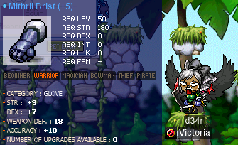

# rangifer’s diary: pt. lxix (nice)

## Taxonomising odd jobs, pt. iv: Microtaxonomy & encodings. §5

In the previous section (§4) of this part (pt. iv), I said:

> With that in mind, and with some of the kinks having already been ironed out
> in the previous section, I want to start explicitly constructing the set that
> we’re after, element by element. Unfortunately, it seems that we need _even
> more_ prelude here — we need to decide how to describe each odd job.

And so, the previous section was dedicated to _one way_(!) of formalising the
answer to the question: “How do we give a description of an odd job?”. Putting
aside the fact that we may (read: will) have to bend/modify that formalisation
as we go forward, we can take that formalisation and indeed try to “explicitly
construc\[t\] the [set][set] that we’re after, element by element”. But first,
some modifications are in order (booooo!! I know, I know…):

### Errata

#### “Primary stats, secondary stats”

Corrected version:

---

\[…\]

- A stat _s_ is “primary” for a job _j_ when one or more of the following are
  true:
    - _j_ requires, by definition, \[…\]
    - _j_ has a location of “outland”, and _m_ is a mode of attacking that is a
      primary method of dealing damage for _j_ (many odd jobs have multiple
      such modes), and _s_ is the stat (out of all six stats) that contributes
      the most positively to _m_’s
      [expected](https://en.wikipedia.org/wiki/Expected_value) damage output.
      (In the case of a tie, all stats that are tied for first are considered
      primary stats.)
    - _j_ does not have a location of “outland”, and _m_ is a mode of attacking
      that is a primary method of dealing damage for _j_ (many odd jobs have
      multiple such modes), and _s_ is the stat (out of all six stats) that
      contributes the most positively to _m_’s
      [minimum](https://en.wikipedia.org/wiki/Maxima_and_minima) per-attack
      damage output. (In the case of a tie, all stats that are tied for first
      are considered primary stats.)
- A stat _s_ is “secondary” for \[…\]

\[…\]

---

There are two main differences between this version of the list found within
“Primary stats, secondary stats”, and the original. One difference is the
addition of “_j_ has a location of ‘outland’, and” to the beginning of the
second item of the first sublist. And the other difference is the addition of a
third item to the first sublist. The reason for these additions is that, when
considering outlanders,
[expected](https://en.wikipedia.org/wiki/Expected_value) damage output is an
appropriate single magnitude to look at when considering the magnitude of
damage outputs in general. But, for non-outlanders (campers and islanders),
this is no longer appropriate. These additions ensure that, instead, minimum
per-attack damage is taken into consideration for non-outlanders.

In addition, within the second item of the first sublist, the wording related
to ties is cleaned up, so as not to be unnecessarily complicated.

#### “Skills & attacks”

Corrected version:

---

\[…\]

- **Ammo**(_j_)

  This predicate is satisfied iff _j_ is allowed to use ammunition. In this
  context, “ammunition” includes both physical items used as ammunition
  (arrows, stars, etc.) _and_ virtual ammunition provided by skills like [Soul
  Arrow](https://maplelegends.com/lib/skill?id=3101004), [Shadow
  Stars](https://maplelegends.com/lib/skill?id=4121006), etc. Like with weapon
  constraints, the word “allowed” here is spiritual \[…\]

\[…\]

---

This change clarifies the role that skills like Soul Arrow have in the
**Ammo**(_j_) predicate.

### The odd job universe (version 1.0.0)

I’ve taken what’s been discussed and worked on so far, and used it to write a
single [RON (Rusty Object Notation)](https://github.com/ron-rs/ron) file that
defines/enumerates the [universe][universe] of odd jobs that we want to
consider. You can find said RON file [**here**](./odd_job_universe.ron).

#### RON

For those not familiar with RON — which is probably most readers, as it doesn’t
enjoy extreme popularity — it’s kind of like
[JSON](https://en.wikipedia.org/wiki/JSON), but modelled after the
[semantics][semantics] (and [syntax][syntax]) of the [Rust][rust] programming
language, rather than those of the
[JavaScript](https://en.wikipedia.org/wiki/JavaScript) programming language.
RON is somewhat more complex than JSON, but not by much, and (in my highly
biased opinion) fixes most, or all, of the issues of JSON as a format. For our
purposes, RON allows us to:

- Cleanly express [algebraic data
  types](https://en.wikipedia.org/wiki/Algebraic_data_type) (viz. combinations
  of [products](https://en.wikipedia.org/wiki/Product_type) and
  [sums](https://en.wikipedia.org/wiki/Tagged_union)). This also includes using
  proper [option types](https://en.wikipedia.org/wiki/Option_type) instead of
  arbitrary use of [`null`](https://en.wikipedia.org/wiki/Null_pointer).
- Express proper [lists][list], which are actually homogeneous. In JSON, for
  example, lists are
  [_heterogeneous_](https://wiki.haskell.org/Heterogenous_collections), meaning
  that a single list can contain zero or more of any values whatsoever, even if
  those values are of mixed [types](https://en.wikipedia.org/wiki/Type_theory).
  This makes JSON lists more like
  [tuples](https://en.wikipedia.org/wiki/Tuple)… except that they don’t have a
  particular number nor ordering of their types… so they’re not really like
  tuples, either. This lack of structure is solved by RON’s homogeneous lists,
  combined with its algebraic data types.
- Get some syntactical niceties, like optional trailing commas,
  [comments][comment], etc.

If you wanna know more about RON, you can check out [the associated GitHub
repository](https://github.com/ron-rs/ron).

#### Reading RON (visually)

Besides knowing the actual syntax of RON itself, you might want [syntax
highlighting](https://en.wikipedia.org/wiki/Syntax_highlighting) to help read
RON data with your eyeballs. Unfortunately, RON is not super widely-supported.
However, you still have some options:

- Get tooling for your [editor](https://en.wikipedia.org/wiki/Text_editor) of
  choice:
    - [Vim](https://github.com/ron-rs/ron.vim)
    - [Emacs](https://chiselapp.com/user/Hutzdog/repository/ron-mode/home)
    - [VSCodium / VS Code](https://open-vsx.org/extension/a5huynh/vscode-ron)
    - [Atom](https://atom.io/packages/language-ron)
    - [IntelliJ](https://github.com/ron-rs/intellij-ron)
    - [Sublime Text](https://packagecontrol.io/packages/RON)
- Use something that can already syntax highlight
  [Rust](https://www.rust-lang.org/) code, as a shitty hack.

#### Option types

If you’re reading the raw RON, be sure not to get confused by the use of option
types. In Rust, `Option` is defined like so:

```rust
enum Option<T> {
    None,
    Some(T),
}
```

If you’re more comfortable with the syntax of
[functional](https://en.wikipedia.org/wiki/Functional_programming) languages,
this would instead look like (using [Haskell][haskell]-style notation):

```haskell
data Option a = None | Some a
```

Which means that, when expressing the allowed non-zeroth-grade skills for a
given job, we either want:

- a list of [natural numbers](https://en.wikipedia.org/wiki/Natural_number)
  representing a [set][set] of allowed skill IDs;
- or nothing at all, to represent “all skills”, i.e. no restrictions.

So, in the former case we have a value that looks like `Some([ ... ])`, and in
the latter case we have a value that looks like `None`. So if you see something
like:

```rust
skills: None,
```

This does **not** mean that the job is not allowed to use skills at all. Quite
the opposite; it can use any skills. If we wanted to express the inability to
use non-zeroth-grade skills whatsoever (which is true for
[begunner](https://oddjobs.codeberg.page/odd-jobs.html#begunner)), we would
instead want:

```rust
skills: Some([]),
```

#### Product-of-sums

As per the previous section of this part, we are using a
[product](https://en.wikipedia.org/wiki/Logical_conjunction) of
[sums](https://en.wikipedia.org/wiki/Logical_disjunction) form to represent
stat constraints. In the RON data, we represent this as a list of lists. We
take the [logical
disjunction](https://en.wikipedia.org/wiki/Logical_disjunction) of each inner
list, and then the [logical
conjunction](https://en.wikipedia.org/wiki/Logical_conjunction) of the outer
list. Take [gishlet](https://oddjobs.codeberg.page/odd-jobs.html#gishlet) for
example, within whose definition we have:

```rust
constraints: [
    [Ful(STR), Ful(DEX)],
    [Ful(LUK)],
    [Less(INT)],
],
```

Formally, this represents:

**HasGishletStats**(_c_) ≝ \[**Ful**(STR)(_c_)
[∨](https://en.wikipedia.org/wiki/Logical_disjunction) **Ful**(DEX)(_c_)\]
[∧](https://en.wikipedia.org/wiki/Logical_conjunction) **Ful**(LUK)(_c_) ∧
**Less**(INT)(_c_)

…which defines a [predicate][predicate] **HasGishletStats** that takes as its
sole [argument](https://en.wikipedia.org/wiki/Argument_of_a_function) a
[PC](https://en.wikipedia.org/wiki/Player_character) named _c_, and is
satisfied [iff](https://en.wikipedia.org/wiki/If_and_only_if) _c_ meets the
stat requirements to be a gishlet.

#### Using the RON data

I made a smol library to handle this weirdly specific RON schema. You can find
it [here](https://codeberg.org/deer/maple_jobs), but it’s probably not all that
useful to look at or use. Instead, I intend to use the library to handle the
odd-job-definition data within this diary. For starters, I spent absolutely way
too long\* writing [a program](./src/) that just spits out a
[Markdown](https://en.wikipedia.org/wiki/Markdown) table so that I could throw
it in here. So here it is:

<details>
<summary>
The odd job universe version 1.0.0, as an unreadably large table
</summary>

| name               | classes                                                                                                   | location     | primary stats | secondary stats | stat constraints                                                                                    | allowed weapons                                                                                                                                                                  | canonical weapons                                                                                                         | ammo? | allowed skills                                                                                                                                           |
| ------------------ | --------------------------------------------------------------------------------------------------------- | ------------ | ------------- | --------------- | --------------------------------------------------------------------------------------------------- | -------------------------------------------------------------------------------------------------------------------------------------------------------------------------------- | ------------------------------------------------------------------------------------------------------------------------- | ----- | -------------------------------------------------------------------------------------------------------------------------------------------------------- |
| **camper**         | beginner, noblesse, aran (beginner)                                                                       | Camp         | DEX           | STR             |                                                                                                     | \[all\]                                                                                                                                                                          | one-handed swords, one-handed axes, one-handed BWs                                                                        | yes   | \[all\]                                                                                                                                                  |
| **LUKlander**      | beginner                                                                                                  | Maple Island | LUK, DEX, STR |                 | **Pure**(LUK)                                                                                       | claws                                                                                                                                                                            | claws                                                                                                                     | yes   | \[all\]                                                                                                                                                  |
| **DEXlander**      | beginner                                                                                                  | Maple Island | DEX           | STR             | **Pure**(DEX)                                                                                       | \[all\]                                                                                                                                                                          | one-handed swords, one-handed axes, one-handed BWs, daggers, polearms                                                     | yes   | \[all\]                                                                                                                                                  |
| **STRlander**      | beginner                                                                                                  | Maple Island | STR, DEX      |                 | **Pure**(STR)                                                                                       | \[all\]                                                                                                                                                                          | one-handed swords, one-handed axes, one-handed BWs, daggers, polearms                                                     | yes   | \[all\]                                                                                                                                                  |
| **hybridlander**   | beginner                                                                                                  | Maple Island | DEX, STR, LUK |                 | \[**Ful**(STR) ∨ **Ful**(DEX)\] ∧ \[**Ful**(DEX) ∨ **Ful**(LUK)\] ∧ \[**Ful**(LUK) ∨ **Ful**(STR)\] | \[all\]                                                                                                                                                                          | one-handed swords, one-handed axes, one-handed BWs, daggers, polearms, claws                                              | yes   | \[all\]                                                                                                                                                  |
| **magelander**     | beginner                                                                                                  | Maple Island | DEX           | INT, LUK, STR   |                                                                                                     | wands, staves                                                                                                                                                                    | wands                                                                                                                     | yes   | \[all\]                                                                                                                                                  |
| **LUKginner**      | beginner, noblesse, aran (beginner)                                                                       | outland      | LUK           | DEX, STR        | **Ful**(LUK)                                                                                        | claws                                                                                                                                                                            | claws                                                                                                                     | yes   | \[all\]                                                                                                                                                  |
| **DEXginner**      | beginner, noblesse, aran (beginner)                                                                       | outland      | DEX, STR      |                 | **Pure**(DEX)                                                                                       | \[all\]                                                                                                                                                                          | one-handed swords, one-handed BWs, daggers, two-handed swords, polearms                                                   | yes   | \[all\]                                                                                                                                                  |
| **STRginner**      | beginner, noblesse, aran (beginner)                                                                       | outland      | STR           | DEX             | **Ful**(STR)                                                                                        | \[all\]                                                                                                                                                                          | one-handed swords, one-handed BWs, daggers, two-handed swords, polearms                                                   | yes   | \[all\]                                                                                                                                                  |
| **wandginner**     | beginner, noblesse, aran (beginner)                                                                       | outland      | STR           | DEX, INT, LUK   |                                                                                                     | wands, staves                                                                                                                                                                    | wands                                                                                                                     | yes   | \[all\]                                                                                                                                                  |
| **HP warrior**     | sword(wo)man, fighter, page, spear(wo)man                                                                 | outland      | MAXHP         |                 | **Pure**(MAXHP)                                                                                     | \[all\]                                                                                                                                                                          | \[all\]                                                                                                                   | yes   | \[all\]                                                                                                                                                  |
| **DEX warrior**    | sword(wo)man, fighter, page, spear(wo)man, dawn warrior (1st grade), dawn warrior, aran (1st grade), aran | outland      | DEX, STR      |                 | **Pure**(DEX)                                                                                       | \[all\]                                                                                                                                                                          | one-handed swords, one-handed axes, one-handed BWs, two-handed swords, two-handed axes, two-handed BWs, spears, polearms  | yes   | \[all\]                                                                                                                                                  |
| **LUK warrior**    | sword(wo)man, fighter, page, spear(wo)man, dawn warrior (1st grade), dawn warrior, aran (1st grade), aran | outland      | LUK, STR      | DEX             | **Pure**(LUK)                                                                                       | \[all\]                                                                                                                                                                          | one-handed swords, one-handed axes, one-handed BWs, two-handed swords, two-handed axes, two-handed BWs, spears, polearms  | yes   | \[all\]                                                                                                                                                  |
| **dagger warrior** | sword(wo)man, fighter, page, spear(wo)man, dawn warrior (1st grade), dawn warrior, aran (1st grade), aran | outland      | STR           | DEX             |                                                                                                     | daggers                                                                                                                                                                          | daggers                                                                                                                   | yes   | \[all\]                                                                                                                                                  |
| **wand warrior**   | sword(wo)man, fighter, page, spear(wo)man, dawn warrior (1st grade), dawn warrior, aran (1st grade), aran | outland      | STR           | DEX, INT, LUK   |                                                                                                     | wands, staves                                                                                                                                                                    | wands                                                                                                                     | yes   | \[all\]                                                                                                                                                  |
| **permawarrior**   | sword(wo)man, dawn warrior (1st grade)                                                                    | outland      | STR           | DEX             |                                                                                                     | \[all\]                                                                                                                                                                          | one-handed swords, one-handed axes, one-handed BWs, daggers, two-handed swords, two-handed axes, two-handed BWs, polearms | yes   | \[all\]                                                                                                                                                  |
| **DEX mage**       | magician, F/P, I/L, cleric, blaze wizard (1st grade), blaze wizard, evan (1st grade), evan                | outland      | DEX, STR      |                 | **Pure**(DEX)                                                                                       | \[all\]                                                                                                                                                                          | one-handed swords, one-handed BWs, daggers, two-handed swords, polearms                                                   | yes   | \[all\]                                                                                                                                                  |
| **STR mage**       | magician, F/P, I/L, cleric, blaze wizard (1st grade), blaze wizard, evan (1st grade), evan                | outland      | STR           | DEX             | **Ful**(STR) ∧ **Less**(INT) ∧ **Less**(LUK)                                                        | \[all\]                                                                                                                                                                          | one-handed swords, one-handed BWs, daggers, two-handed swords, polearms                                                   | yes   | \[all\]                                                                                                                                                  |
| **gish**           | magician, F/P, I/L, cleric, blaze wizard (1st grade), blaze wizard, evan (1st grade), evan                | outland      | STR, INT      | DEX, LUK        | \[**Ful**(STR) ∨ **Ful**(DEX)\] ∧ **Ful**(INT)                                                      | \[all\]                                                                                                                                                                          | one-handed swords, one-handed BWs, daggers, wands, staves, two-handed swords, polearms                                    | yes   | \[all\]                                                                                                                                                  |
| **gishlet**        | magician, F/P, I/L, cleric, blaze wizard (1st grade), blaze wizard, evan (1st grade), evan                | outland      | STR, LUK, INT | DEX             | \[**Ful**(STR) ∨ **Ful**(DEX)\] ∧ **Ful**(LUK) ∧ **Less**(INT)                                      | \[all\]                                                                                                                                                                          | one-handed swords, one-handed BWs, daggers, wands, staves, two-handed swords, polearms                                    | yes   | \[all\]                                                                                                                                                  |
| **magelet**        | magician, F/P, I/L, cleric, blaze wizard (1st grade), blaze wizard, evan (1st grade), evan                | outland      | LUK, INT      |                 | **Pure**(LUK)                                                                                       | \[all\]                                                                                                                                                                          | wands, staves, claws                                                                                                      | yes   | \[all\]                                                                                                                                                  |
| **permamagician**  | magician, blaze wizard (1st grade), evan (1st grade)                                                      | outland      | INT           | LUK             |                                                                                                     | \[all\]                                                                                                                                                                          | wands, staves                                                                                                             | yes   | \[all\]                                                                                                                                                  |
| **woods(wo)man**   | archer, hunter, crossbow(o)man, wind archer (1st grade), wind archer                                      | outland      | STR, DEX      |                 | **Pure**(STR)                                                                                       | \[all\]                                                                                                                                                                          | one-handed swords, one-handed BWs, daggers, two-handed swords, two-handed axes, two-handed BWs, polearms, bows, crossbows | yes   | \[all\]                                                                                                                                                  |
| **bow-whacker**    | archer, hunter, crossbow(o)man, wind archer (1st grade), wind archer                                      | outland      | DEX           | STR             |                                                                                                     | bows, crossbows                                                                                                                                                                  | bows, crossbows                                                                                                           | no    | \[all\]                                                                                                                                                  |
| **bowginner**      | archer, hunter, crossbow(o)man, wind archer (1st grade), wind archer                                      | outland      | DEX           | STR             |                                                                                                     | \[all\]                                                                                                                                                                          | bows, crossbows                                                                                                           | yes   | The Eye of Amazon                                                                                                                                        |
| **permarcher**     | archer, wind archer (1st grade)                                                                           | outland      | DEX           | STR             |                                                                                                     | \[all\]                                                                                                                                                                          | bows, crossbows                                                                                                           | yes   | \[all\]                                                                                                                                                  |
| **claw-puncher**   | rogue, assassin, bandit, dual blade, night walker (1st grade), night walker                               | outland      | DEX, STR      | LUK             |                                                                                                     | claws                                                                                                                                                                            | claws                                                                                                                     | no    | \[all\]                                                                                                                                                  |
| **carpenter**      | rogue, assassin, bandit, dual blade, night walker (1st grade), night walker                               | outland      | STR           | DEX             |                                                                                                     | Saw                                                                                                                                                                              | Saw                                                                                                                       | yes   | \[all\]                                                                                                                                                  |
| **grim reaper**    | rogue, assassin, bandit, dual blade, night walker (1st grade), night walker                               | outland      | STR           | DEX, LUK        |                                                                                                     | Scythe                                                                                                                                                                           | Scythe                                                                                                                    | yes   | \[all\]                                                                                                                                                  |
| **clawginner**     | rogue, assassin, bandit, dual blade, night walker (1st grade), night walker                               | outland      | LUK           | DEX, STR        |                                                                                                     | \[all\]                                                                                                                                                                          | claws                                                                                                                     | yes   | Keen Eyes                                                                                                                                                |
| **permarogue**     | rogue, night walker (1st grade)                                                                           | outland      | LUK           | DEX, STR        |                                                                                                     | \[all\]                                                                                                                                                                          | daggers, claws                                                                                                            | yes   | \[all\]                                                                                                                                                  |
| **LUKless sin**    | assassin, night walker (1st grade), night walker                                                          | outland      | STR, LUK      | DEX             | **Less**(LUK)                                                                                       | \[all\]                                                                                                                                                                          | one-handed swords, one-handed BWs, daggers, two-handed swords, polearms, claws                                            | yes   | \[all\]                                                                                                                                                  |
| **dagger sin**     | assassin, night walker (1st grade), night walker                                                          | outland      | LUK           | DEX, STR        |                                                                                                     | daggers                                                                                                                                                                          | daggers                                                                                                                   | yes   | \[all\]                                                                                                                                                  |
| **brigand**        | bandit                                                                                                    | outland      | STR           | DEX             | **Less**(LUK)                                                                                       | one-handed swords, one-handed axes, one-handed BWs, wands, staves, two-handed swords, two-handed axes, two-handed BWs, spears, polearms, bows, crossbows, claws, knucklers, guns | one-handed swords, one-handed BWs, two-handed swords, two-handed axes, two-handed BWs, polearms                           | yes   | \[all\]                                                                                                                                                  |
| **LUKless dit**    | bandit                                                                                                    | outland      | LUK           | DEX, STR        | **Less**(LUK)                                                                                       | \[all\]                                                                                                                                                                          | daggers                                                                                                                   | yes   | \[all\]                                                                                                                                                  |
| **blood dit**      | bandit                                                                                                    | outland      | MAXHP, LUK    | DEX, STR        | **Pure**(MAXHP)                                                                                     | \[all\]                                                                                                                                                                          | daggers                                                                                                                   | yes   | \[all\]                                                                                                                                                  |
| **pistol-whipper** | pirate, brawler, gunslinger, thunder breaker (1st grade), thunder breaker                                 | outland      | DEX           | STR             |                                                                                                     | guns                                                                                                                                                                             | guns                                                                                                                      | no    | \[all\]                                                                                                                                                  |
| **pugilist**       | pirate, brawler, gunslinger, thunder breaker (1st grade), thunder breaker                                 | outland      | STR           | DEX             |                                                                                                     | \[unarmed\]                                                                                                                                                                      | \[unarmed\]                                                                                                               | yes   | \[all\]                                                                                                                                                  |
| **begunner**       | pirate, brawler, gunslinger, thunder breaker (1st grade), thunder breaker                                 | outland      | DEX           | STR             |                                                                                                     | \[all\]                                                                                                                                                                          | guns                                                                                                                      | yes   |                                                                                                                                                          |
| **permapirate**    | pirate, thunder breaker (1st grade)                                                                       | outland      | STR, DEX      |                 |                                                                                                     | \[all\]                                                                                                                                                                          | knucklers, guns                                                                                                           | yes   | \[all\]                                                                                                                                                  |
| **DEX brawler**    | brawler, thunder breaker (1st grade), thunder breaker                                                     | outland      | DEX, STR      |                 | **Pure**(DEX)                                                                                       | \[all\]                                                                                                                                                                          | knucklers, guns                                                                                                           | yes   | \[all\]                                                                                                                                                  |
| **LUK bucc**       | brawler, thunder breaker (1st grade), thunder breaker                                                     | outland      | LUK, STR      | DEX             | **Pure**(LUK)                                                                                       | \[all\]                                                                                                                                                                          | knucklers                                                                                                                 | yes   | \[all\]                                                                                                                                                  |
| **armed brawler**  | brawler, thunder breaker (1st grade), thunder breaker                                                     | outland      | STR           | DEX             |                                                                                                     | one-handed swords, one-handed axes, one-handed BWs, daggers, wands, staves, two-handed swords, two-handed axes, two-handed BWs, spears, polearms                                 | one-handed swords, daggers, two-handed swords, spears                                                                     | yes   | \[all\]                                                                                                                                                  |
| **bullet bucc**    | brawler, thunder breaker (1st grade), thunder breaker                                                     | outland      | DEX           | STR             |                                                                                                     | guns                                                                                                                                                                             | guns                                                                                                                      | yes   | \[all\]                                                                                                                                                  |
| **swashbuckler**   | gunslinger                                                                                                | outland      | STR, DEX      |                 | **Pure**(STR)                                                                                       | \[all\]                                                                                                                                                                          | one-handed swords, daggers, two-handed swords, spears, knucklers, guns                                                    | yes   | \[all\]                                                                                                                                                  |
| **punch slinger**  | gunslinger                                                                                                | outland      | STR           | DEX             |                                                                                                     | knucklers                                                                                                                                                                        | knucklers                                                                                                                 | yes   | \[all\]                                                                                                                                                  |
| **bombadier**      | gunslinger                                                                                                | outland      | DEX           | STR             |                                                                                                     | \[all\]                                                                                                                                                                          | guns                                                                                                                      | yes   | Bullet Time, Dash, Gun Mastery, Grenade, Gun Booster, Wings, Octopus, Gaviota, Maple Warrior, Wrath of the Octopi, Aerial Strike, Hypnotize, Hero’s Will |
| **summoner**       | gunslinger                                                                                                | outland      | DEX           | STR             |                                                                                                     | \[all\]                                                                                                                                                                          | guns                                                                                                                      | yes   | Bullet Time, Dash, Gun Mastery, Gun Booster, Wings, Octopus, Gaviota, Maple Warrior, Wrath of the Octopi, Hypnotize, Hero’s Will                         |

</details>

I was going to comment on the various entries within this table, but mayhaps I
shall save that for next time…

<details>
<summary>Footnotes for “Using the RON data”</summary>

\*Why can I not stop myself for pre-maturely optimising the hell out of a
single script that I really only intend to run once, and that will definitely
finish executing in under a second even without compiler optimisations enabled?
Not even I know the answer to this question.

</details>

[universe]: https://en.wikipedia.org/wiki/Universe_%28mathematics%29
[semantics]: https://en.wikipedia.org/wiki/Semantics_(computer_science)
[syntax]: https://en.wikipedia.org/wiki/Syntax_(programming_languages)
[rust]: http://en.wikipedia.org/wiki/Rust_%28programming_language%29
[list]: https://en.wikipedia.org/wiki/List_(abstract_data_type)
[comment]: https://en.wikipedia.org/wiki/Comment_(computer_programming)
[set]: https://en.wikipedia.org/wiki/Set_(mathematics)
[haskell]: https://en.wikipedia.org/wiki/Haskell_(programming_language)
[predicate]: https://en.wikipedia.org/wiki/Predicate_(mathematical_logic)

## Some more MPQ, with your host, pan oiler

I responded to a [smega](https://maplelegends.com/lib/cash?id=5072000) from an
[MPQ](https://maplelegends.com/lib/map?id=261000021) party who needed an
additional member, and brought my
[permarogue](https://oddjobs.codeberg.page/odd-jobs.html#permarogue)
**panolia**. I prefer to do the first three stages with [my
dagger](https://maplelegends.com/lib/equip?id=01332030) and some [Double
Stab](https://maplelegends.com/lib/skill?id=4001334), so my party members
realised that I was still a rogue pretty quickly:


But, once we got to the fourth stage and I switched to [my
claw](https://maplelegends.com/lib/equip?id=01472055), **Cortical**’s
[MTK](https://maplelegends.com/lib/use?id=2070019)s came out, and their
opinions quickly changed…:


Later, we were joined by crusader **zaxuwu**, who I had trained with before at
[TfoG](https://maplelegends.com/lib/map?id=105040306) on my vicloc [dagger
spearwoman](https://oddjobs.codeberg.page/odd-jobs.html#dagger-warrior)
**d34r**:


And I was able to achieve levels of poor luck scarcely seen before, during a
particular stage 6 in which I got a combo of `444 444 434 4d`:


(The above screenshot includes in-game chat, as well as a screenshot of the
[Google Sheets](https://en.wikipedia.org/wiki/Google_Sheets) spreadsheet that
we were using to make stage 6 easier.)

Even later, we we joined by Actual Hermit™ **TruffleFri3s**, which left me on
[Romeo](https://maplelegends.com/lib/npc?id=2112009)-protecting duty:


And, after all that, I had enough
[marble](https://maplelegends.com/lib/etc?id=4001159)s to get a second [Horus’
Eye 𓂀](https://maplelegends.com/lib/equip?id=01122010):


Not so good… looks like I’ll be NPCing this one.

## Just a lil bit o’ viclockin’

As per usual, I’ve been [APQ](https://maplelegends.com/lib/map?id=670010100)ing
on my vicloc [dagger
spearwoman](https://oddjobs.codeberg.page/odd-jobs.html#dagger-warrior)
**d34r**, alongside fellow viclocker **xXCrookXx**. We were fortunate enough to
be joined by **xBowtjuhNL**, so I exploited my party-leader powers to take this
pristine screenshot of us at the beginning of stage 3:


Would you look at that! No pesky [Crystal
Boar](https://maplelegends.com/lib/monster?id=9400534)s nor [Devil
Slime](https://maplelegends.com/lib/monster?id=9400522)s mucking everything up.
I do like me some APQ, albeit with the exception of [the sixth and final
stage](https://maplelegends.com/lib/map?id=670010700), which I confess is
probably my least favourite boss fight in the game. Yes, even counting
[Papu](https://maplelegends.com/lib/monster?id=8500001)… In any case — speaking
of Crystal Boars — d34r levelled up as a result of killing one of them during
[key](https://maplelegends.com/lib/etc?id=4031593) farming!:


Nice~ d34r continues to passively and slowly level up as a result of hunting
keys, and APQing, regularly…

Oh, and I’ve been saving up
[GFD60](https://maplelegends.com/lib/use?id=2040801)s to try to scroll myself a
new pair of WACC gloves. For quite a long time (since level 35), d34r has been
using a pair of [Dark Briggon](https://maplelegends.com/lib/equip?id=01082036)s
obtained from [the second Sleepywood
JQ](https://bbb.hidden-street.net/quest/victoria-island/johns-present), which I
was fortunate enough to pass four GFD60s on — enough to put them at 2 STR, 4
DEX, and 8 WACC. This is a bit tough to beat; but I figured that, as long as I
start with something better than an average Dark Briggon, and manage to pass
four or five out of the five slots, it’ll be an upgrade. Well, much to my (and
xXCrookXx’s) extreme surprise, I managed to do exactly that… passing all five
slots!!:



Holy smokes. Now those are some mighty fine WACC gloves.

## Oversized villains

I had the privilege of fighting two bosses who I had never seen before in my
Maple career. First up was the [Black
Crow](https://maplelegends.com/lib/monster?id=9400014), which exclusively
spawns at [Encounter with the
Buddha](https://maplelegends.com/lib/map?id=800020130), a place that I had
otherwise only known for hunting [Dreamy
Ghost](https://maplelegends.com/lib/monster?id=9400013)s. Black Crow is no
joke; with 35M HP and some very hard-hitting attacks, I brought along my
[darksterity knight](https://oddjobs.codeberg.page/odd-jobs.html#dex-warrior)
**rusa** to help out the party with buffs:


This is a bit of a chaotic fight, as Black Crow can move fairly swiftly, has
quite the chaotic appearance itself, and there are constantly Dreamy Ghosts
running around willy-nilly amidst all of the attack animations and damage
numbers flying all over the place. But it’s worth it. For the
[Sabots](https://maplelegends.com/lib/etc?id=4000224).

Second up was [Pianus (R)](https://maplelegends.com/lib/monster?id=8510000), a
rare — but apparently extant — oversized fishy who loves to cancel weapon
attacks, cancel magic attacks, 1/1 all the time, dispel, and summon
[not-so-friendly spiky guys](https://maplelegends.com/lib/monster?id=8510100).
One catch is that these spiky guys can deal around 10k(!) damage when they go
boom-boom. Getting hit by one of these boom-booms immediately after being
dispelled is an excellent method for finding your way to the grave.

I may have guzzled many more
[Honster](https://maplelegends.com/lib/use?id=2002021)s than I care to admit
during the course of fighting this oversized piscine jerkass (or rather, during
the course of fighting several such jerkasses), thanks to my persistent fear of
spiky guys showing up and killing me. Even so, I still died at least two or
three times…

")

It seems that fighting Pianus can be rather annoying, especially with all the
weapon-attack cancellation going on… But, after fighting two of three of them
alongside **Harlez**, rusa got enough EXP to hit level 126~!


…Which meant that it was time to pass a [Berserk 30
book](https://maplelegends.com/lib/use?id=2290023) in preparation for next
levelup!


Very nice. I still haven’t actually failed one of these “master book” things
yet…

Later, we were joined by **xBowtjuhNL**, **Gruzz**, and **Bipp**, and we found
a [Pianus (L)](https://maplelegends.com/lib/monster?id=8520000) to fight. This
one is less annoying, as it doesn’t dispel, and has a bit less HP:

")

Annoying as Pianus may be, it was overall a very positive experience to see
Pianus in the flesh, and to fight a few for myself. As a wee fawn, I had only
heard tale of the colossal fish hiding in the deepest reaches of Aqua Road, and
was never even close to strong enough to face the beast myself…

## Voodoos w/ LoneW0lf1600

I also had the distinct privilege of grinding with
[STRginner](https://oddjobs.codeberg.page/odd-jobs.html#str-beginner) legend
**LoneW0lf1600** [at Voodoos](https://maplelegends.com/lib/map?id=682000501) on
my pure [STR bishop](https://oddjobs.codeberg.page/odd-jobs.html#str-mage)
**cervid**:


LoneWolf had started streaming himself playing, in the MapleLegends Discord
(thanks to MapleStory private server stuff being largely eradicated from
[twitch\.tv][twitch] due to [bogus takedowns][dmca]), and I offered to come
along and do some duo
[Heartstopper](https://maplelegends.com/lib/use?id=2022245) farming.

We chatted throughout, and I was quite pleased to see LoneWolf playing his
’ginner again — I had always known him as the mythical \#1 on the ’ginner
rankings (ignoring leechers, at least), although I had never really seen him in
action.

Plus, this marked the first time in a while that I’d come here… last time I was
at Voodoos, if I recall correctly, it was to duo there with another
high-ranking ’ginner, **Taima** (**Boymoder**, **Tacgnol**, **Hanyou**,
**Numidium**, **Gambolpuddy**)!

[twitch]: https://en.wikipedia.org/wiki/Twitch_(service)
[dmca]: https://en.wikipedia.org/wiki/Digital_Millennium_Copyright_Act#Abuse_of_takedown_notice

## HTPQ (not affiliated with Herb Town)

I was invited to HTPQ (**H**orn**t**ail **P**arty **Q**uest; not to be confused
with [PPQ](https://maplelegends.com/lib/map?id=251010404), which was originally
known as “Herb Town Party Quest”) by **Gruzz**, **Harlez**, and **xBowtjuhNL**.
They needed more bodies, in order to enter the PQ (as it requires a full party
of six), so that they could complete one or two associated quests. We managed
to also round up **Bipp** (**Celim**, **Copo**, **Sommer**, **Fino**,
**Cassandro**) of **Flow**, as well as **Qubert** of **GangGang**, to fill the
party up.

But I didn’t have a [Dragon
Elixir](https://maplelegends.com/lib/use?id=2210003) ready, so we had to work
on that first:

<details>
<summary>HTPQ‽</summary>

I managed to get a [Manon](https://maplelegends.com/lib/monster?id=8180000)
“poke” without to much trouble, thanks to a friendly
[hero](https://maplelegends.com/lib/skill?id=1121008) who was hunting Manon at
the time. So we went to fight some [Dark
Cornians](https://maplelegends.com/lib/monster?id=8150201) for the classic
[Busted Dagger](https://maplelegends.com/lib/etc?id=4001079), as well as some
[Cornian’s Marrow](https://maplelegends.com/lib/etc?id=4001075):


Our luck was extremely good; by the time that we had the required marrow, some
three or four daggers had already dropped! So we headed to [Dark
Wyvern](https://maplelegends.com/lib/monster?id=8150302)s then, for the [Tough
Dragon Skin](https://maplelegends.com/lib/etc?id=4001077)s:


And, after not too long, we had fully assembled our HTPQ krew:


We got all cornian’d up, looking very handsome and lacertian:


Phewf. Glad I don’t have to worry about human ’s invasion…

Just kidding — ’twas merely a ruse! We’re here to kill you!!


As it turns out, HTPQ is pretty straightforward. Little more is involved than
killing some cornians, and then killing [some
Skelegon](https://maplelegends.com/lib/monster?id=9300075)s… But before we got
to the Skelegon bit, we had to make a certain bulb go all shiny-like:


Oooh… pretty…

Once we were all collectively done being mesmerised by the bulb, we had some
dragon skeletons to crumble:


It was here that we finished up farming the special ETCs necessary to complete
the quest that grants the [Certificate of the Dragon
Squad](https://maplelegends.com/lib/etc?id=4001086). I now have these special
ETCs on rusa, along with the [Pianus
Certificate](https://maplelegends.com/lib/etc?id=4001085), but have yet to
obtain the [Papulatus Certificate](https://maplelegends.com/lib/etc?id=4001084)
or [Zakum Certificate](https://maplelegends.com/lib/etc?id=4001083).

Once we were done with HTPQ, we found ourselves in the proper entrance to
Horntail’s cave… so we decided to go into the cave, just for funsies:


Take that, first Horntail prehead!! That’s 3% of your HP that you’ll never get
back~! Admittedly, I wasn’t doing very much damage here; with the huge level
gap (it’s level 160) and huge WDEF of this first prehead, each one of my
[Crusher](https://maplelegends.com/lib/skill?id=1311001)s was barely doing over
1.5k damage total. Yes, total — not per-line. But I _did_ get to poke the head
— many times, in fact. And that’s what matters…

</details>

## The final instalment of “card-hunting with capre”

’Tis time for a very special edition of “Card-Hunting With deer’s
[Woodswoman](https://oddjobs.codeberg.page/odd-jobs.html#woodsman),
**capreolina**”:

<details>
<summary>The final instalment of “card-hunting with capre”</summary>

I started off where I left off last: [Commander
Skele](https://maplelegends.com/lib/monster?id=7130103)s.


Not a particularly easy set, but finishing this set was enough to finish the
Excavation Site region of
[Perion](https://maplelegends.com/lib/map?id=102000000). So, with that, I went
back to [Florina Beach](https://maplelegends.com/lib/map?id=110000000) to pick
up the remaining bits of the
[Lorang](https://maplelegends.com/lib/monster?id=3230102) set:


…and of the [Clang](https://maplelegends.com/lib/monster?id=4230104) set:


And then back to Perion for my dear [copper-coloured dino
friends](https://maplelegends.com/lib/monster?id=4130100), who have a far
higher card droprate than anyone seems to give them credit for:


…And for [their ruddy
friends](https://maplelegends.com/lib/monster?id=6130100):


As usual, however juicy the Red Drake’s droptable may be, they refuse to give
up the goods, so I took my five cards and left.

I tried my luck at finishing the [Wild
Kargo](https://maplelegends.com/lib/monster?id=6230100) set, and was pleasantly
surprised to actually finish it!:


At that point, Vic Island was really finished for capre. The only Vic Island
sets that I didn’t have at that point were those of [King
Slime](https://maplelegends.com/lib/monster?id=9300003) (lol) and of
[Ergoth](https://maplelegends.com/lib/monster?id=9300028). So I boarded the
ship to [Orbis](https://maplelegends.com/lib/map?id=200000000), and flew… and
then flew back to [Ellinia](https://maplelegends.com/lib/map?id=101000000)… and
then back to Orbis… and then Ellinia… and then Orbis…

Okay, you get the idea. Some 75 minutes or so of flying, and I had no
[crog](https://maplelegends.com/lib/monster?id=8150000) cards to show for it,
besides two such cards that I had obtained long before. It wasn’t until later,
when I flew again to get back to Vic Island, that I did eventually get that
third card:


…and proceeded to never finish the set. Because no. Just, no.

Instead, I headed to Masteria in search of the relatively newly-added
[NLC](https://maplelegends.com/lib/map?id=600000000) cards! The first one that
popped out for me was a [Street
Slime](https://maplelegends.com/lib/monster?id=9400538) card:


I found the [Urban Fungus](https://maplelegends.com/lib/monster?id=9400539) set
to be pretty easy:


And I got a [Boomer](https://maplelegends.com/lib/monster?id=9400547) card
early on, but this one proved to actually be quite difficult to finish:


I hunted in [the Boomers map](https://maplelegends.com/lib/map?id=600010300)
for quite a long time, in search of these mythical teary-eyed-bomb cards, and
ended up with probably a dozen each of Urban Fungus and [Mighty Maple
Eater](https://maplelegends.com/lib/monster?id=9400548) cards:


It was at this point that I remembered to actually do the [Urban
Warrior](https://bbb.hidden-street.net/quest/masteria/urban-warrior) questline.
In capreolina’s case, this just meant doing
[Featherweights](https://bbb.hidden-street.net/quest/masteria/featherweights)
and [Cleaning Up the
Streets](https://bbb.hidden-street.net/quest/masteria/cleaning-up-the-streets),
as I had previously completed all of the other quests in the questline. So,
ultimately, this meant that I was going to have to fight some
[Gryphon](https://maplelegends.com/lib/monster?id=9400544)s:


These winged bastards are certainly the least pleasant NLC monsters to fight,
as they are wont to fly about willy-nilly, and both maps that they can be found
on can only be described as “ass”. After killing the requisite number for the
Urban Warrior questline, I was at 1/5 Gryphon cards.

Cleaning Up the Streets required some
[Electrophant](https://maplelegends.com/lib/monster?id=9400543) (somewhat
ironically, icier than they are electrical) kills, so I headed into the [Ice
Chamber](https://maplelegends.com/lib/map?id=600020500) for those:


And with that, I could claim my
[throne](https://maplelegends.com/lib/setup?id=3010012):


While I was in NLC, I was using [VIP TP
rox](https://maplelegends.com/lib/cash?id=5041000) to check up on my old friend
[Master Dummy](https://maplelegends.com/lib/monster?id=5090001). I have been
3/5 Master Dummy for a very long time now, so I figured that now was the time
to finally polish it off. Well, with just three or so visits, I was able to get
the last two cards that I needed:


And, back in NLC, I headed to the [Fire
Chamber](https://maplelegends.com/lib/map?id=600020400) to do the [Fire
Tusk](https://maplelegends.com/lib/monster?id=9400542) set:


And also to the [Soul Corridor](https://maplelegends.com/lib/map?id=600020200)
to get the [Killa Bee](https://maplelegends.com/lib/monster?id=9400540) set
(again, a bit annoying… flying monsters…):


At this point, I had all of the NLC card sets that I thought might be more or
less “easy”. But I figured I would try my hand at the
[I.AM.ROBOT](https://maplelegends.com/lib/monster?id=9400546) set…


It took me a while to get the first I\.AM\.ROBOT card, but after that, it
wasn’t terrible. So I did finish the set. I also considered getting four more
Gryphon cards to finish that set, but after some amount of unpleasant
Gryphon-murdering, I was still 1/5, so I decided to leave Gryphons where they
belong (viz. high in the sky, where I cannot hear nor see them).

I also tried the one NLC card set that I have yet to mention: that of [Wolf
Spider](https://maplelegends.com/lib/monster?id=9400545)s. The story here is
that I was farming for a little while, and before I could actually get my first
card, a couple of pet auto-HP failures caused my untimely demise. I prefer that
[my marsupial friend](https://maplelegends.com/lib/cash?id=5000273) not
repeatedly attempt to murder me, but that’s okay — I still have a [Safety
Charm](https://maplelegends.com/lib/cash?id=5130000), right? Oh wait…

So, yeah. I may or may not have lost all of the EXP that I had earned that day
and the day before, in that one moment. I was a bit discouraged by this, and I
wasn’t exactly expecting Wolf Spiders to be an easy card set anyways, so I
decided to depart from NLC in favour of icier pastures…

That’s right; back at [El Nath](https://maplelegends.com/lib/map?id=211000000)
again. This time, I would be venturing further up the mountain, in search of
[Yeti](https://maplelegends.com/lib/monster?id=6300000):


…and [Yeti and Pepe](https://maplelegends.com/lib/monster?id=7130102) cards:


I started out hunting these within the [Valley of
Snowman](https://maplelegends.com/lib/map?id=211040101), and later transitioned
to [Ice Valley II](https://maplelegends.com/lib/map?id=211040200) so that I
might actually get Yeti & Pepe cards reasonably efficiently.

Then, I was off to [Sharp Cliff
II](https://maplelegends.com/lib/map?id=211040400) in search of [Dark
Pepe](https://maplelegends.com/lib/monster?id=6230200) cards:


And, along the way, I got the [Dark Jr.
Yeti](https://maplelegends.com/lib/monster?id=5130105) card set, which proved
to be about as easy as the [Jr.
Yeti](https://maplelegends.com/lib/monster?id=5100000) set (viz. very easy):


I went to [Dangerous Cliff](https://maplelegends.com/lib/map?id=211040700) in
an attempt to farm [Dark Yeti and
Pepe](https://maplelegends.com/lib/monster?id=8140100) cards:


…alongside [Dark Yeti](https://maplelegends.com/lib/monster?id=6400000) cards,
at the same time:


…But I soon realised that I was getting Dark Yeti cards very slowly (I am still
1/5 to this day). I then realised that there actually does not exist any map
that is good for farming Dark Yetis. Really, the highest spawn count is a
measly five, at [Sharp Cliff I](https://maplelegends.com/lib/map?id=211040300),
and even there, it’s swamped with other garbage that vastly out-populates it.

So, instead, I headed to [Wolf Territory
II](https://maplelegends.com/lib/map?id=211040600) (which ironically has no
wolves whatsoever) to finish the Dark Yeti & Pepe set. And, with that done, I
decided not to mess with the
[Lycanthrope](https://maplelegends.com/lib/monster?id=8140000)s and
[Werewolves](https://maplelegends.com/lib/monster?id=7130200), as the guides
that I was looking at cautioned against them. So, rather than stay in Alnath
any longer, I headed to [Leafre](https://maplelegends.com/lib/map?id=240000000)
in anticipation of my 300th set…

Just [a single map west of Leafre
proper](https://maplelegends.com/lib/map?id=240010000), I found
[Rash](https://maplelegends.com/lib/monster?id=7130500)es:


…and [Dark Rash](https://maplelegends.com/lib/monster?id=7130501)es:


And these puffballs just so happened to push my EXP bar into the next level!
Level 126~!! So, like rusa with
[zerk](https://maplelegends.com/lib/skill?id=1320006), it was time for capre to
eat an [SE30](https://maplelegends.com/lib/use?id=2290053) book:


Oh… ouf. Well, at least now I know what it looks like when you fail one of
these things. I used another and failed that one as well… but the third time
was indeed the charm, so capre now has a master level of 30 on
[SE](https://maplelegends.com/lib/skill?id=3121002) x)

Anyways, back to card-hunting. I headed to the [Cranky
Forest](https://maplelegends.com/lib/map?id=240010200) in search of
[Hobi](https://maplelegends.com/lib/monster?id=7130600):


…and [Hankie](https://maplelegends.com/lib/monster?id=7130004) cards:


And, after finishing up the Hobi set (and getting to 2/5 Hankie), I was at 299
sets. I took a break, and when I came back, **Bipp** (**Celim**, **Copo**,
**Sommer**, **Fino**, **Cassandro**) was excited to come to Leafre to hunt that
final set with me:


As you can see, we were at [Steep
Hill](https://maplelegends.com/lib/map?id=240010300) to finish up those Hankie
cards. But I also nabbed a [Green
Hobi](https://maplelegends.com/lib/monster?id=7130601) card as well, just in
case that one managed to finish first:


In the end — as expected — I finished the Hankie card set first. And that
Hankie card set was capreolina’s 300th completed card set. So, it was time to
receive the highest honour in the world of card-hunting: [the tier 10
ring](https://maplelegends.com/lib/equip?id=01119012)!!!!:


You can see capreolina here, crying tears of joy… I frankly never would have
expected to make it all the way to T10. It seems that my decision to focus
almost entirely on just one character (capreolina) has paid off. And so, I can
proudly say that I got the highest tier of ring, all by myself, all for myself
— however long it may have taken.

You can see in the screenshot above that **xEggNog** is asking me how long it
took for me to get the T10 ring. I don’t have a good answer to that question.
Partly, this is because I did a lot of other stuff along the way — on
capreolina, and on other characters, of course — so I didn’t just grind cards
all day, every day, until I got to T10. That being said, the entirety (or at
least, almost the entirety) of capreolina’s card-hunting journey is in fact
documented in this diary. So the process certainly didn’t go undocumented.

So, in the future, any card-hunting that I do will, obviously, be on other
characters. In particular, I want to try my hand at card-hunting with my
[darksterity knight](https://oddjobs.codeberg.page/odd-jobs.html#dex-warrior)
**rusa**, my
[daggermit](https://oddjobs.codeberg.page/odd-jobs.html#dagger-assassin)
**alces**, my I/L
[magelet](https://oddjobs.codeberg.page/odd-jobs.html#magelet) **cervine**, and
many other characters, as well~ These monster book rings can be just as
important for my other characters as well, and as any reader of this diary
knows, I have no shortage of characters… But, for now, I am just proud to say
that I Beat The Game™ (well, unless we consider monster book completionism…),
at least once, when it comes to the monster book. :D

\<3

</details>
