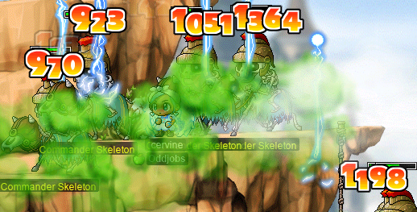

# rangifer’s diary: pt. lxx

## Taxonomising odd jobs, pt. iv: Microtaxonomy & encodings. §6

In the previous section (§5) of this part (pt. iv), I finally fleshed out a [set][set] of all odd jobs, i.e. the odd job [universe][universe] (version 1.0.0). The universe was expressed using a particular [RON](https://github.com/ron-rs/ron) schema, and I also presented those same data in the form of a giant table. For now, I want to wrap up this part (pt. iv) of the series by commenting on the data that I essentially dumped in the previous section, with only comments on the format of the data, and not on the data themselves. And then, I want to do a little speculation on what can be done next.

But first, an erratum or two…

### Errata (odd job universe, version 1.1.0)

#### STRginner

Version 1.0.0:

```rust
[…]
    "STRginner": Job(
        […]
        weaponry: Weaponry(
            allowed: All,
            canonical: WepTypes([
                OneHandedSword, OneHandedMace, Dagger, TwoHandedSword, Polearm,
            ]),
        ),
        […]
    ),
[…]
```

Version 1.1.0:

```rust
[…]
    "STRginner": Job(
        […]
        weaponry: Weaponry(
            allowed: All,
            canonical: WepTypes([
                OneHandedSword,
                OneHandedMace,
                Dagger,
                TwoHandedSword,
                TwoHandedMace,
                Polearm,
            ]),
        ),
        […]
    ),
[…]
```

STRginners (and only STRginners) get access to the [Sake Bottle](https://maplelegends.com/lib/equip?id=01422011), so we add two-handed BW to their list of canonical weapon types. I probably forgot about this because, you know, MapleLegends doesn’t have Sake Bottles.

#### LUKless sin

Version 1.0.0:

```rust
[…]
    "LUKless sin": Job(
        […]
        weaponry: Weaponry(
            allowed: All,
            canonical: WepTypes([
                OneHandedSword,
                OneHandedMace,
                Dagger,
                TwoHandedSword,
                Polearm,
                Claw,
            ]),
        ),
        […]
    ),
[…]
```

Version 1.1.0:

```rust
[…]
    "LUKless sin": Job(
        […]
        weaponry: Weaponry(
            allowed: All,
            canonical: WepTypes([
                OneHandedSword,
                OneHandedMace,
                TwoHandedSword,
                TwoHandedAxe,
                TwoHandedMace,
                Polearm,
                Claw,
            ]),
        ),
        […]
    ),
[…]
```

Daggers were included in the LUKless sin’s canonical weapons, probably because I copy-and-pasted the canonical weapons for STRginner and then added claws. Daggers should not be included, as a result of LUKless sins being LUKless and not getting any dagger skills (besides [Double Stab](https://maplelegends.com/lib/skill?id=4001334)).

And, I forgot two-handed axes and BWs, which should be included for the same reason that they’re included for woods(wo)men and brigands.

### Comments on the odd job universe, version 1.1.0

#### General comments

- You may have noticed the inclusion of many classes that are pre-Big-Bang (pre-BB) but were added after version 62 of GMS (post-v62):
    - “Cygnus Knights”:
        - Noblesse
        - Dawn warrior
        - Blaze wizard
        - Wind archer
        - Night walker
        - Thunder breaker
    - Dual blade
    - “Legends”:
        - Aran (beginner)
        - Aran
        - Evan (beginner)
        - Evan

  This is in line with what I said in §3 of this part:

  > I came across a few adjustments that I wanted to make to the Oddjobs list (at the very least, for the purpose of this series):
  >
  > - More carefully include post-v62-but-pre-BB (“v62” as in version 62 of GMS; “pre-BB” as in pre-Big-Bang) classes, i.e. Cygnus Knights and Legends. The Oddjobs list (at the time of writing) does mention some of these, but only in the aliases and notes for a few jobs like [STR beginner](https://oddjobs.codeberg.page/odd-jobs.html#str-beginner). GunDelHel’s list splits out some of the Cygnus-based and Legend-based odd jobs into their own jobs, but none of them are radically different enough from their pre-v63 counterparts to fall outside of their counterparts’ original definitions. That being said, in the interest of generality, I want to ensure that these later versions are incorporated explicitly into the odd jobs’ definitions.

- The “Evan (beginner)” (a.k.a. evanginner) class is not actually used in any of the odd job definitions. This class has its own ID (2001), but isn’t actually materially different from an ordinary (explorer) beginner in any way other than being called an “Evan” in-game. Furthermore, perma-evanginners were only able to be created for a very short amount of time due to a bug in GMS’s implementation of Evan. I also couldn’t find any evidence of Evan equivalents of islanders nor of campers. If you know more about evanginner-based jobs, please let me know.
- It should be noted that dual blades are explorers; they have a second-grade ID of 430 (compare to 400 for rogues, 410 for assassins, and 420 for bandits), and can only be created by initially advancing to rogue (as an ordinary explorer rogue would) and then advancing to dual blade for second-grade advancement. The main twist of this dual blade advancement is that it’s done at level 20, and not at level 30 as you would expect.
- You also may have noticed that some class names end in “`1st`”. This is because the names of Cygnus Knight classes do not distinguish between grades, from first grade onwards. “Noblesse” is zeroth grade (i.e. a Cygnus Knight beginner) for all Cygnus Knights, but there are no grade distinctions reflected in class names beyond that point. Nevertheless, each of the first grade classes (all five of them: dawn warrior, blaze wizard, etc.) is pretty clearly analogous to the corresponding first-grade explorer class, with the addition of those little summon skills (Soul, Flame, etc.).

  Nevertheless, although we do the same for legends as well (`AranBeginner` → `Aran1st` → `Aran`; `EvanBeginner` → `Evan1st` → `Evan`), the situation there is somewhat different. We consider first-grade Arans to effectively be second grade or higher. The reason is that, although Aran class grades seem to correspond nicely to their explorer counterparts (0th, 1st, 2nd, 3rd, and finally 4th), Arans already have all of the following at first grade:
    - A multi-target attack that hits up to 12(!) monsters at once,
    - A [Flash-Jump](https://maplelegends.com/lib/skill?id=4111006)-like skill,
    - [Polearm Booster](https://maplelegends.com/lib/skill?id=1301005),
    - and a WATK/WDEF/MDEF buff.

  Although this leaves them [mastery](https://maplelegends.com/lib/skill?id=1300001)less until second grade (like their explorer counterparts), I think it’s fair to say that this should at least disqualify them from being “[permawarriors](https://oddjobs.codeberg.page/odd-jobs.html#permawarrior)” _per se_. That’s not to say that perma-1st Aran can’t be an odd job — rather, it’s just that if they can be considered odd, it’s not because they are permawarriors.

  On the other hand, perma-1st Evans play more like stripped-down [permamagicians](https://oddjobs.codeberg.page/odd-jobs.html#permamagician), as a result of Evan grades being less spread out (they go all the way up to 10th(!) grade). They only get [Magic Claw](https://maplelegends.com/lib/skill?id=2001005) (although it’s called “Magic Missile” for them, the spell is otherwise identical), and a passive +20 MATK. Perhaps most interesting is that perma-1st Evans never get [Magic Guard](https://maplelegends.com/lib/skill?id=2001002)!

  And, when it comes to dual blades, there is no such thing as “`DualBlade1st`”. A “first-grade dual blade” is the same class as a “first-grade assassin” or “first-grade bandit” — namely, rogue (ID 400).

#### Comments on specific odd jobs

Not all of the entries are covered below; the others should be self-explanatory.

- **Camper**
    - As you can see by the inclusion of noblesses and aranginners, this definition includes roadies and snowlanders (respectively) as well.
- **STRlander**
    - As you can see from the class set being {beginner}, only explorers can be islanders, as Maple Island is the only geographical region of its kind.
    - Like all `STAT`landers, STRlanders are pure in their respective `STAT` (STR, in this case). Islanders are, naturally enough, difficult to categorise, as their builds are naturally more flexible than those of outlanders. So, although we define a STRlander as “**Pure**(STR)”, this constraint should be taken more impressionistically than it is for outlander builds that use the same [predicate][predicate]. For islander builds that are truly mixed, we have the “hybridlander”.
    - Although one-handed swords and polearms are obviously canonical weapon types for non-magelander melee islanders (one-handed swords being a common weapon type for islander-friendly event-only weapons like [Maplemas Lights](https://maplelegends.com/lib/equip?id=01302080), [The Stars and Stripes](https://maplelegends.com/lib/equip?id=01302057), [Lifeguard Saver](https://maplelegends.com/lib/equip?id=01302095), [Maple Sword](https://maplelegends.com/lib/equip?id=01302020), etc., and polearms including our old friend the [Gold Surfboard](https://maplelegends.com/lib/equip?id=01442029), as well as Valentine Roses (e.g. [White](https://maplelegends.com/lib/equip?id=01442050)), etc.), the others here might require some justification. The existence of the [Razor](https://maplelegends.com/lib/equip?id=01332066) and, particularly, the [Fruit Knife](https://maplelegends.com/lib/equip?id=01332007) on-island is, in my opinion, enough to justify the inclusion of daggers. The [Wooden Club](https://maplelegends.com/lib/equip?id=01322005) and [Leather Purse](https://maplelegends.com/lib/equip?id=01322007) justify the inclusion of one-handed BWs, and while we’re at it, I added one-handed axes as well, so that all starter weapons ([Sword](https://maplelegends.com/lib/equip?id=01302000), [Hand Axe](https://maplelegends.com/lib/equip?id=01312004), and Wooden Club) are represented. Although representing starter weapons might seem a little weird, I think it’s justified, even if the only justification is being general enough to reflect any & all pre-BB versions of the game — even ones that have more or less limited availability of islander weapons.
- **DEXlander**
    - See the comments on STRlander.
- **Magelander**
    - It might seem a bit strange that we allow magelanders to use staves, but remember that the “allowed” things are merely spiritual — even those who cannot _de facto_ use the thing may still be allowed to use it. In this case, staves don’t generally exist in any form on Maple Island; but we like to group wands and staves together, so that any job capable of using one may use the other. A magelander (hypothetically) using a staff still maintains the “mage” in “magelander”.
- **LUKlander**
    - See the comments on STRlander.
- **Hybridlander**
    - Hybridlanders have, somewhat ironically, perhaps the most verbose stat constraints of all odd jobs in our universe. But the idea is simple: out of {STR, DEX, LUK}, the hybridlander picks at least two. This is what makes them “hybrid”. This definition thus includes (but is not limited to) so-called “perfectlanders”.
    - Hybridlanders don’t have wands as part of their canonical weapons. Instead, we consider wands to be the exclusive domain of magelanders; adding wands to the canonical weapon set here would result in complicating the primary/secondary stats of hybridlander even further.
- **STRginner**
    - Notice that the stat constraint for STRginner is **Ful**(STR), and not **Pure**(STR). While **Pure**(STR) might be expected by analogy to STRlander, the situation for outland beginners is different. Because outlanders care so much about [expected](https://en.wikipedia.org/wiki/Expected_value) damage, STR is quite a bit… well… STRonger than DEX. For the STRginner, DEX is still useful; it adds more to their WACC than any other stat (certainly more than STR, which gives no WACC whatsoever), and contributes to their damage as well. But besides the need for WACC to hit their targets, the STRginner is trying to pour as much AP into STR as possible. This means that STRginners may have varying levels of base DEX, depending on their needs. Nevertheless, what unites STRginners is being STR-_based_, even if not necessarily being _pure_ STR. Instead, we define _DEXginners_ as being **Pure**(DEX) so that they can be totally distinguished from STRginners.
- **DEXginner**
    - See the comments on STRginner.
- **Wandginner**
    - See the comments on magelander.
- **LUKginner**
    - Because LUKginners are given a weapon constraint (they can only use claws), and because outlanders care so much more about expected damage, we don’t need to characterise the LUKginner’s stat constraint as “**Pure**(LUK)” (as we did for LUKlanders), and instead opt for the looser “**Ful**(LUK)”.
- **Permawarrior**
    - As mentioned above, we consider first-grade Cygnus Knights to be essentially equivalent to their explorer counterparts, so perma-1st dawn warriors are included here. And, also as mentioned above, we do _not_ consider first-grade Arans to be essentially equivalent to their explorer counterparts, so they are excluded here.
    - The canonical weapons should look pretty straightforward here, with two minor exceptions:
        - Daggers are considered canonical weapons for permawarriors. Although this may seem unusual (as they are not canonical for non-odd warriors), the reality is that, _ceteris paribus_, daggers and one-handed swords are (for non-rogues) identical. The only reason that this isn’t true for ordinary warriors is that ordinary warriors get access to weapon-type-specific skills, e.g. booster and mastery skills. Obviously, permawarriors never get any such skills, so daggers and one-handed swords are equivalent to them.
        - Spears are not considered canonical weapons for permawarriors. The reasoning here is that spears are not canonical weapons for ordinary warriors either, with the exception of 3rd-grade-or-higher spear(wo)men (i.e. dragon knights and dark knights). In the absence of DK skills, spears simply have an unusually low average PSM (primary stat multiplier) when using attacks that animate like basic-attacks (e.g. [Power Strike](https://maplelegends.com/lib/skill?id=1001004) and [Slash Blast](https://maplelegends.com/lib/skill?id=1001005)), thus making them undesirable for permawarriors.
- **HP warrior**
    - Defining blood warriors and blood dits in this format proves to be difficult. I decided to take two different routes for these two different jobs, on the basis that blood dits don’t get their “killer skill(s)” until third grade, whereas HP warriors already have them by second. So, for HP warriors, I’ve de-emphasised traditional warrior fighting methods (i.e. melee), considering them to only be “secondary”. So, their ability to melee is not reflected in their primary/secondary stats, and not reflected in their canonical weapons either. Having all weapons as canonical is meant to imply that they don’t use their weapons to fight, so what weapon they have equipped is incidental (they might choose, for example, weapons that look cooler, or that grant MAXHP).
- **Wand warrior**
    - See the comments on magelander.
- **DEX warrior**
    - See the comments on permawarrior.
- **LUK warrior**
    - See the comments on permawarrior.
- **Permamagician**
    - As mentioned above, first-grade blaze wizards and Evans are considered to be close enough to magicians (or restricted versions thereof) to qualify for being permamagicians.
- **STR mage**
    - Analogously to STRginners, STR mages have the **Ful**(STR) stat constraint. Because of this, we also need to specify **Less**(INT) and **Less**(LUK) in order to distinguish them from gish(let)s.
- **DEX mage**
    - Analogously to DEXginners, DEX mages have the **Pure**(DEX) stat constraint. Because of this, we don’t need to specify **Less**(INT) and **Less**(LUK) to distinguish them from gish(let)s — these constraints are implied by **Pure**(DEX).
- **Magelet**
    - You’ll notice that claws are included as a canonical weapon type for magelets. This is a result of magelets being defined by their class and stat constraints alone. With no weapon constraints, they can use claws just as well as LUKginners can. A magelet that only uses claws is a subjob of magelet called a “claw magelet”, or sometimes just “claw mage”.
- **Gish**
    - For the physical-attacking side of gishes, we only constrain them to be **Ful** of STR or DEX ([or both](https://en.wikipedia.org/wiki/Logical_disjunction)), by analogy with STR mages or DEX mages (or both).
    - Gishes, unlike STR mages and DEX mages, have wands and staves as part of their canonical weaponry. This reflects their (half-)proficiency with magical damage-dealing spells.
- **Gishlet**
    - See the comments on gish.
- **Woods(wo)man**
    - The woods(wo)man’s canonical weapons include two-handed axes and BWs, as a result of classic woods(wo)man weapons like the [Metal Axe](https://maplelegends.com/lib/equip?id=01412001), [Wooden Mallet](https://maplelegends.com/lib/equip?id=01422000), and [Monkey Wrench](https://maplelegends.com/lib/equip?id=01422004).
- **Blood dit**
    - See the comments on HP warrior. Unlike the HP warrior, we do emphasise the role of daggers in the blood dit’s functionality. This is, again, a result of blood dits getting their “killer skill(s)” so much later than blood warriors do.
- **Brigand**
    - See the comments on woods(wo)man.
    - The allowed weapons for brigands are just “all weapons that aren’t daggers”.
- **LUKless sin**
    - See the comments on woods(wo)man.
    - Daggers are not canonical for LUKless sins, as a result of being LUKless and not getting any dagger skills (besides [Double Stab](https://maplelegends.com/lib/skill?id=4001334)).
- **Dagger sin**
    - We consider night walkers to be closely analogous to assassins/hermits, so they can be dagger sins too.
- **Claw-puncher**
    - Although technically any class can be a claw-puncher (in the presence of claws without class requirements, i.e. [Magical Mitten](https://maplelegends.com/lib/equip?id=01472063)), claw-punchers are specifically the _rogue_ version of this concept, which we consider to be conceptually primitive (especially when claws without class requirements are unavailable). Other claw-punching odd jobs can be classified as subjobs of other odd jobs.
- **DEX brawler**
    - We consider thunder breakers to be closely analogous to brawlers/marauders, so they can be DEX brawlers too.
    - Guns are considered canonical weapons for DEX brawlers, as they are pure DEX and have access to the [Double Shot](https://maplelegends.com/lib/skill?id=5001003) skill.
- **LUK bucc**
    - See the comments on DEX brawler.
- **Swashbuckler**
    - Besides guns, the only canonical weapons for swashbucklers are those that play nicely with [SSK](https://maplelegends.com/lib/skill?id=5001002).
- **Pugilist**
    - It should be noted that our definition of pugilist here includes _all_ pirates who restrict themselves from ever using weapons, not just brawlers and closely related classes.
- **Armed brawler**
    - The allowed weaponry for armed brawlers is just “any melee weapon that isn’t a knuckler”. Somewhat counterintuitively, this includes wands and staves. But the canonical weaponry only includes those weapons that play nice with SSK.
- **Pistol-whipper**
    - See the comments on pugilist.
- **Bombadier**
    - One unfortunate side-effect of how we define jobs here is that bombadier requires us to list quite a few skills.
    - Two of the skills listed ([MW](https://maplelegends.com/lib/skill?id=1121000) and [Hero’s Will](https://maplelegends.com/lib/skill?id=1121011)) use the skill IDs of their hero (i.e. fourth-grade fighter) versions. This is in line with the following sentence, from §4 of this part:

      > Furthermore, we collapse multiple skills that only really differ in what class and/or weapon type they are available to, into a single skill with a single ID.

      The hero versions just so happen to have the lowest (i.e. lowest numerical value) IDs.
- **Summoner**
    - See the comments on bombadier.
    - Notice that the only difference between our definitions of summoner and bombadier is that the summoner can only use a strict subset of the skills that bombadiers can use. This is a result of us allowing bombadiers to freely use summons (even [Octopus](https://maplelegends.com/lib/skill?id=5211001)), on the basis that these are not “attacking skills” _per se_.
- **Begunner**
    - See the comments on pugilist.
    - As pointed out in §5, `Some([])` is our way of representing that a job cannot use any first-grade-or-higher skills.

### Looking ahead

This essentially concludes pt. iv of this series. In pt. v (and beyond), we have some things to look forward to — particularly, actually getting some taxonomies fleshed out! Hopefully!! Even more particularly, here are some things that I have floating around in the back of my mind:

- We can try imposing a [weak ordering](https://en.wikipedia.org/wiki/Weak_ordering) onto this universe that we’ve enumerated, as discussed in §4 and §5 of pt. iii. Or, rather, we might end up with more than one ordering to “try on for size”, considering that determining an ordering is tricky business and, ultimately, just depends on what you want to get out of it.

  From here, it would then be possible to construct, by hand, (a) [rooted forest](https://en.wikipedia.org/wiki/Tree_%28graph_theory%29)(s) of our odd jobs that satisfy the condition laid out in §4–5 of pt. iii:

  > \[…\] [∀](https://en.wikipedia.org/wiki/Universal_quantification)𝑖 [∈][element] [ℐ](https://en.wikipedia.org/wiki/Index_set) ∀(𝑜, 𝑝) ∈ 𝑂ᵢ[²](https://en.wikipedia.org/wiki/Cartesian_product) \[𝑜 [≤](https://en.wikipedia.org/wiki/Topological_sorting)ᵢ 𝑝 [→](https://en.wikipedia.org/wiki/Material_conditional) 𝑜 [≲](https://en.wikipedia.org/wiki/Weak_ordering) 𝑝\].
- We can try to come up with encodings of our odd jobs, based on their definitions from this part (pt. iv) of the series, so that the [clustering](https://en.wikipedia.org/wiki/Cluster_analysis)-oriented techniques discussed in pt. iii of this series can be applied. Again, as mentioned in pt. iii, such an encoding is ideally a [metric space](https://en.wikipedia.org/wiki/Metric_space), or even better, a [vector space](https://en.wikipedia.org/wiki/Vector_space). But it remains to be seen if we can reasonably satisfy these kinds of constraints without throwing away too much information, and without warping the information into an encoding that misrepresents which aspects of each job are relevant. I already have a few things in mind here, but it’s a long way from anything actually usable.
- Another kind of classification that could reasonably be considered a “taxonomy” — but that was not discussed in pt. iii of this series — is closely related to the notion of a [hypergraph](https://en.wikipedia.org/wiki/Hypergraph). You may remember that, in §5 of pt. iii of this series, I talked a bit about the basics of [graph theory](https://en.wikipedia.org/wiki/Graph_theory) in order to introduce [trees][tree]. Hypergraphs are like graphs where we don’t restrict each edge to be a set of [cardinality](https://en.wikipedia.org/wiki/Cardinality) exactly 2. Instead, we just require that each edge is nonempty. This makes a hypergraph basically just a set _S_, combined with a collection of (nonempty) subsets of _S_. We can impose a hypergraph onto our universe of odd jobs (with each odd job in the universe being a vertex) by grouping odd jobs into relevant categories. Because we aren’t trying to impose any restrictions on this hypergraph (other than that it’s nonempty and simple\*), these categories can be of varying sizes, and can freely overlap with one another. Some hyperedges that might be included:
    - “Jobbed beginners”: {STR mage, DEX mage, woods(wo)man, brigand, LUKless sin}
    - “Mixed attackers”: {gish, gishlet}
    - “Perma-firsts”: {permawarrior, permamagician, permarcher, permarogue, permapirate}
    - “Islanders”: {STRlander, DEXlander, magelander, LUKlander, hybridlander}
    - etc.

  As I said, this is already a kind of taxonomy itself, which means that such a hypergraph already offers an answer to the question that motivates this entire series: “what (w/sh)ould a taxonomy of odd jobs look like?”. Furthermore, hypergraphs offer some of their own benefits:
    - A [hypergraph matching](https://en.wikipedia.org/wiki/Matching_in_hypergraphs) generalises [the notion of a “matching” in a graph][graph-matching]. In our case, we can think of a hypergraph matching as a kind of practical generalisation of a [partition of a set](https://en.wikipedia.org/wiki/Partition_of_a_set) (indeed, a hypergraph matching that is a partition of the vertex set is called a “perfect” matching), in which we don’t necessarily have to include every element of the vertex set.
    - Assuming that every vertex in our hypergraph has a nonzero [degree][degree], the notion of [set cover](https://en.wikipedia.org/wiki/Set_cover_problem) provides another kind of practical generalisation of a partition of a set, but going in the other direction: instead of not necessarily including every element of the set, we don’t necessarily require that the “partitions” are pairwise [disjoint](https://en.wikipedia.org/wiki/Disjoint_sets). The set cover _problem_, then, asks what is the smallest collection of hyperedges whose [union][union] equals the universe. A set cover that solves this problem can, for some purposes, be a practical substitute for an actual partition (if it isn’t already a partition itself).
    - If our hypergraph ends up being [disconnected][connectivity], then its [connected components][component] give us a natural partition of the universe, where we interpret two vertices being in different components as the two vertices being “unrelated” in our taxonomy.
    - Our hypergraph would naturally induce a [line graph](https://en.wikipedia.org/wiki/Line_graph_of_a_hypergraph), which, because we’re working with hypergraphs, is just the same thing as an [intersection graph](https://en.wikipedia.org/wiki/Intersection_graph).
    - Hypergraphs come with their own handy-dandy visualisation method (much like clustering comes with [dendrograms](https://en.wikipedia.org/wiki/Dendrogram)): [Euler diagrams](https://en.wikipedia.org/wiki/Euler_diagram) (it should be noted that [Venn diagrams](https://en.wikipedia.org/wiki/Venn_diagram) are a special kind of Euler diagram). Also, [rainbow boxes](https://en.wikipedia.org/wiki/Rainbow_box)!
    - The edges of our hypergraph can also be used as a tool to produce some distances between odd jobs (e.g. [Hamming distance](https://en.wikipedia.org/wiki/Hamming_distance) between the [bit vectors][gf2] that represent which hyperedges the job is, and is not, [incident][incident] to), as well as to generally inform the encodings that we give our odd jobs before trying to feed them into (a) clustering algorithm(s).

<details>
<summary>Footnotes for “Looking ahead”</summary>

\*A hypergraph is called “simple” [iff](https://en.wikipedia.org/wiki/If_and_only_if) it has no loops and has no repeated edges. Loops in hypergraphs are analogous to [loops in graphs][loop], viz. a hypergraph loop is an edge of cardinality exactly 1. And repeated edges in hypergraphs are analogous to [multi-edges in graphs](https://en.wikipedia.org/wiki/Multiple_edges), viz. multiple edges that are the same set.

</details>

[set]: https://en.wikipedia.org/wiki/Set_(mathematics)
[universe]: https://en.wikipedia.org/wiki/Universe_%28mathematics%29
[predicate]: https://en.wikipedia.org/wiki/Predicate_(mathematical_logic)
[element]: https://en.wikipedia.org/wiki/Element_(mathematics)
[tree]: https://en.wikipedia.org/wiki/Tree_%28graph_theory%29
[graph-matching]: https://en.wikipedia.org/wiki/Matching_(graph_theory)
[loop]: https://en.wikipedia.org/wiki/Loop_%28graph_theory%29
[degree]: https://en.wikipedia.org/wiki/Degree_%28graph_theory%29
[union]: https://en.wikipedia.org/wiki/Union_(set_theory)
[connectivity]: https://en.wikipedia.org/wiki/Connectivity_(graph_theory)
[component]: https://en.wikipedia.org/wiki/Component_%28graph_theory%29
[gf2]: https://en.wikipedia.org/wiki/GF(2)
[incident]: https://en.wikipedia.org/wiki/Incidence_(graph)

## A little light LPQing

I hopped onto my [DEX brawler](https://oddjobs.codeberg.page/odd-jobs.html#dex-brawler) [LPQ](https://maplelegends.com/lib/map?id=221024500) mule **sorts** to do some LPQs with **Flow** neophyte **trishaa**, fellow LPQ mule **Sangatsu** (**Lvl1Crook**, **xXCrookXx**, **Level1Crook**), and [DEX page](https://oddjobs.codeberg.page/odd-jobs.html#dex-warrior) **attackattack** (**xX17Xx**, **partyrock**, **breakcore**, **drainer**, **strainer**, **maebee**)! We were able to do some all-**Suboptimal** (again, ignoring that some of the characters we’re playing here are not actually in the alliance…) runs thanks to attackattack also bringing along her gunslinger, partyrock. Here we are, embattled with [glowy-eyed whale guy](https://maplelegends.com/lib/monster?id=9300012):


And, these LPQs made great [stage 8](https://maplelegends.com/lib/map?id=922010800) JMS method practice for trishaa. Once mastered, the JMS method is the mark of a true LPQer!

## panolia @ Magatia

I did an [MPQ](https://maplelegends.com/lib/map?id=261000021) or two on my [permarogue](https://oddjobs.codeberg.page/odd-jobs.html#permarogue) **panolia**, alongside chief dit **asdsaou** and outlaw **bigolebarry**:


Afterwards, I remembered that I wanted to try [Keeny’s Research on Frankenroid](https://bbb.hidden-street.net/quest/mu-lung-nihal-desert/keenys-research-on-frankenroid), a quest that acts as the culmination of the “Keeny’s Research” questline, but is not available to characters who are outside of the MPQ level range (71–85). I’d never done it before, so I went ahead and did the earlier, more familiar quests in the questline. First up was [Keeny’s Research on Roid](https://bbb.hidden-street.net/quest/mu-lung-nihal-desert/keenys-research-on-roid):


Followed by [Keeny’s Research on Neo Huroid!](https://bbb.hidden-street.net/quest/mu-lung-nihal-desert/keenys-research-on-neo-huroid):


Followed by [Keeny’s Research on D.Roid!!](https://bbb.hidden-street.net/quest/mu-lung-nihal-desert/keenys-research-on-droid), during which I was fortunate enough to stumble across a [D. Roy](https://maplelegends.com/lib/monster?id=7110300):


Again lucky for me, this D. Roy dropped not only the [Broken Mechanical Heart](https://maplelegends.com/lib/etc?id=4000362) that I needed for my quest, but also a [Magic Stone of Trust](https://maplelegends.com/lib/etc?id=4031741) that panolia will need later when she does the main Magatia questline! And, turning in the heart, I got a pair of [Mechanical Gloves](https://maplelegends.com/lib/equip?id=01082222) in exchange:


They look less like mechanical gloves, and more like the black cat paws from the Cash Shop to me, but whatever.

Keeny’s Research on Frankenroid is basically an MPQ check; it just requires that you’ve successfully (meaning also saving [Romeo](https://maplelegends.com/lib/npc?id=2112009)/[Juliet](https://maplelegends.com/lib/npc?id=2112008)) defeated [Angy Fanky](https://maplelegends.com/lib/monster?id=9300140). In exchange, you get… an [OA DEX 10%](https://maplelegends.com/lib/use?id=2040502) scroll. Could be worse, I suppose…

## Wild [animals][animals] in the forest

My [woodsmaster](https://oddjobs.codeberg.page/odd-jobs.html#woodsman), **capreolina**, now has a diverse assemblage of [creatures](https://en.wikipedia.org/wiki/Amniote) following her at all times, as befits a forester.

<details>
<summary>capreolina & her woodland friends</summary>

For contrast, here we have capreolina followed by merely two [koalas](https://en.wikipedia.org/wiki/Koala), helping **Permanovice** (**Dreamscapes**, **Battlesage**) & **kookiechan** kill a [Papulatus](https://maplelegends.com/lib/monster?id=8500001), alongside two DKs, **FearNoPain** and **Orsaris**:


As a result of being [HB](https://maplelegends.com/lib/skill?id=1301007)’d the entire time, I didn’t have to worry about [the second body](https://maplelegends.com/lib/monster?id=8500002) touching me and, as a result, yeeting my lifeless body to the grave. But, I wanted to have this reassurance even in the absence of HB. So, now that capre [has no more ring tiers to attain](https://maplelegends.com/lib/equip?id=01119012), it was time to shape up with some pet equips instead. To exploit the rather bizarre mechanic of getting stat increases from your pet’s equipment, I would need more than just one pet — after all, just one pet can only equip one equipment item at best. Instead, I need _three_ HP-holders — I mean, pets. So for that, I need to acquire [the special-sauce skill](https://maplelegends.com/lib/skill?id=0000008) by completing the [Pet-Walking Road](https://maplelegends.com/lib/map?id=100000202) JQ:


Very nice. But in order to actually _have_ three pets that I could put out at once, I thought I’d try reviving some [Nerdy Koala](https://maplelegends.com/lib/cash?id=5000273)s. You see, I’m a bit new to the whole “pet” thing, relatively speaking. I started playing MapleStory some time in [2005](https://en.wikipedia.org/wiki/2005), and it wasn’t until recently (around when my pure [STR priest](https://oddjobs.codeberg.page/odd-jobs.html#str-mage) **cervid** was level 10X or so) that I actually tried using pets. As ridiculous as it may sound, yes, I had been looting and potting manually for all these years. I just thought it was part of the game, okay?? It’s not like Nekksyn would ever let me use pets without absconding with my money, and I mentally transferred this state of affairs to private servers as well, when I started playing those. In any case, I found out the hard way that pets “expire” after 90 days, and I didn’t know how to revive them, nor did I care to find out when I tried to pull one out, only to find it in an inanimate doll state. At this point, I’m already about to Do A Thing™, so I need that pet right now. Thus, I adapted to simply re-buying the pet (as the Cash Shop is generally accessible from almost any map) any time the life of a pet dried up.

Is that pet abuse? Maybe… But I decided to rectify my lack of pet knowledge on this day, and revive some of the Nerdy Koala dolls that I had shamefully sitting in my Cash Shop inventory:


That’s not one, not two, but _four_ koalas! Three of them are bright pink, and one is seated on my back. I actually bought pet equips for all three of these pets. I had never looked at pet equips, and now that I looked at them for the first time, I realised that most pet equips are specific to a particular pet species. So, I searched for “koala” and found the baby koala equip, which is a bright yellow baby koala that sits on top of the Nerdy Koala pet. At this point, I had _seven_ koalas following me at all times, three of which were bright pink, three of which were bright yellow, and the other of which was seated on my back. Although capre has been using the Nerdy Koala pet (primarily to match the koala on my back) since she started using pets for the first time, I realised now that six koala pets was too much. The colours are just awful, which is why I don’t have a screenshot of that here, to spare your eyes. So, in the end, I swapped out two of the Nerdy Koalas for other pets:


As you can see, all three have their pet equips on: the [Brown Kitty](https://maplelegends.com/lib/cash?id=5000000) with their aviation gear on, and the [Monkey](https://maplelegends.com/lib/cash?id=5000011) with a little red bow on their head! And still, a Nerdy Koala with the bright yellow baby koala on top. This is an improvement, but I might just [boom](https://maplelegends.com/lib/use?id=2048017) the koala equip (I already passed two [30%](https://maplelegends.com/lib/use?id=2048018)s on it…) and switch to another pet x)

In any case, I passed two 30%s on all three of these pet equips. Two of them still have five slots left(!), and the other has four slots left. So, this is a pretty good start (if only I could get my hands on some [60%](https://maplelegends.com/lib/use?id=2048015)s…), and that means that capre now has enough MAXHP (without HB) to take hits from [Ravana](https://maplelegends.com/lib/monster?id=9420014)!:


Cool :D You can see capre fighting Rav here, alongside **Bipp** (**Celim**, **Copo**, **Sommer**, **Fino**, **Cassandro**) and **Snel** (**LawdHeComin**) of **Flow** — and my pure [STR bishop](https://oddjobs.codeberg.page/odd-jobs.html#str-mage) **cervid**. I tried bringing along cervid for the [HS](https://maplelegends.com/lib/skill?id=2311003), simply disconnecting her client before the boss died, so that she didn’t leech any EXP. It worked quite well, although for some reason I feel a bit dirty doing it…

But, anyways, I decided that being followed around at all times by three koalas, a [monkey](https://en.wikipedia.org/wiki/Simian), and a [cat](https://en.wikipedia.org/wiki/Felidae), wasn’t enough for me. So I went to the [Aquarium](https://maplelegends.com/lib/map?id=230000000) to protect [a certain hoggo](https://maplelegends.com/lib/monster?id=9300102):


I proceeded to force my vicloc [dagger spearwoman](https://oddjobs.codeberg.page/odd-jobs.html#dagger-warrior) **d34r** to pay for the [Pheromone Perfume](https://maplelegends.com/lib/use?id=2270000) (a significant sum of 20M mesos), and headed to [The Area of Wild Hog](https://maplelegends.com/lib/map?id=922200000) to catch a [wild hog](https://maplelegends.com/lib/monster?id=9300101) of my own:


And my mount cover of choice: the [owl](https://en.wikipedia.org/wiki/Owl)!!


Very nice :D Oh, and how could I forget? In addition to the three koalas, the monkey, the cat, and the owl, I also have my lovely [Phoenix](https://maplelegends.com/lib/skill?id=3121006):


Fuck ’em up, birdy!!! And by “them”, I of course mean the [Black Bear Swordsmen](https://maplelegends.com/lib/monster?id=9600012) that I was fighting — along with many other [Mt. Song Town](https://maplelegends.com/lib/map?id=702000000) monsters — in an attempt to check out some of the quests that this region had in store. While I was there, the game decided to tease me by giving me a few cards:


(Above is a [Male Thief](https://maplelegends.com/lib/monster?id=9600015) card.)


(Above is an [Eagle Swordsman](https://maplelegends.com/lib/monster?id=9600014) card.)

I completed three or four quests here, including “The Door to Bai Shan”, which was the most difficult, and gave perhaps the best reward: 150k base EXP (450k EXP after multipliers) — not too shabby — and a fame.

</details>

[animals]: https://en.wikipedia.org/wiki/Animals_%28This_Town_Needs_Guns_album%29

## cervine @ CDs

You already know _who_ it is: my I/L [magelet](https://oddjobs.codeberg.page/odd-jobs.html#magelet) **cervine**. You already know _where_ it is: [Star Avenue South Section](https://maplelegends.com/lib/map?id=742010203). And you already know _what_ it is: [cryopreserving](https://maplelegends.com/lib/skill?id=2211002) [optical disc](https://maplelegends.com/lib/monster?id=9410031)s!!

I managed to catch some GM buffs (and [Echo](https://maplelegends.com/lib/skill?id=0001005)), and used them to sadgrind for 60 minutes:


Nearly 4.5M EPH! Not bad at all!! However, significantly higher EPH is attainable with the aid of not just [HS](https://maplelegends.com/lib/skill?id=2311003), but also, you know, actually partying:


Niceee~ One step closer to I/L archmagelet, haha!

## Helping Permanovice with the main Taipei 101 questline

Speaking of [Taipei 101](https://maplelegends.com/lib/map?id=742000000), I went to Taipei 101 as my [darksterity knight](https://oddjobs.codeberg.page/odd-jobs.html#dex-warrior) **rusa** to help **Permanovice** (**Battlesage**, **Dreamscapes**) complete the main Taipei 101 questline (“[Dreamy Park Concert](https://maplelegends.com/lib/quest?id=8683)”, followed by “[The Missing Sheet Music](https://maplelegends.com/lib/quest?id=8687)”). As some readers may already know, this quest essentially entails collecting the ETCs from most of the species of monster found in Taipei 101 (with the exception of CDs, which are strangely not part of the questline at all). In particular, this means:

- collecting 200 [Blue Perfume](https://maplelegends.com/lib/etc?id=4000314)s from ([Transformed](https://maplelegends.com/lib/monster?id=9410023)) [Blue Perfume](https://maplelegends.com/lib/monster?id=9410022)s,
- collecting 200 [Pink Perfume](https://maplelegends.com/lib/etc?id=4000316)s from ([Transformed](https://maplelegends.com/lib/monster?id=9410027)) [Pink Perfume](https://maplelegends.com/lib/monster?id=9410026)s,
- collecting 200 [Yellow Perfume](https://maplelegends.com/lib/etc?id=4000315)s from ([Transformed](https://maplelegends.com/lib/monster?id=9410025)) [Yellow Perfume](https://maplelegends.com/lib/monster?id=9410024)s,
- collecting 150 [Cheap Speaker](https://maplelegends.com/lib/etc?id=4000317)s from [Cheap Amp](https://maplelegends.com/lib/monster?id=9410028)s,
- collecting 150 [Fancy Amplifier Cable](https://maplelegends.com/lib/etc?id=4000318)s from [Fancy Amp](https://maplelegends.com/lib/monster?id=9410029)s,
- collecting 100 [Kid Mannequin’s Bunny Suit](https://maplelegends.com/lib/etc?id=4000322)s from [Kid Mannequin](https://maplelegends.com/lib/monster?id=9410032)s,
- collecting 100 [Female Mannequin’s Wig](https://maplelegends.com/lib/etc?id=4000321)s from [Female Mannequin](https://maplelegends.com/lib/monster?id=9410033)s,
- and collecting 100 [Male Mannequin’s Fedora](https://maplelegends.com/lib/etc?id=4000320)s from [Male Mannequin](https://maplelegends.com/lib/monster?id=9410034)s.

Whew. That’s a lot of ETCs. And unfortunately for our prospective quester, CDs — the only species not represented here — are the only popular training spot in all of Taipei 101\*, and there are no Taipei 101 monsters that drop cards, either. So you won’t have any luck trying to buy these ETCs on the [FM](https://maplelegends.com/lib/map?id=910000000). And that truly is unfortunate, as the perfumes in particular are a supreme pain in the arse to collect ETCs from. Collecting 600 perfumes is a frankly ridiculous chore — unless, of course, you can [rawr](https://maplelegends.com/lib/skill?id=1311006):


So, I collected with Permanovice (and, as you can see above, also **Level1Crook** at times) 1&nbsp;200 perfumes, 600 mannequin ETCs, and 150 Cheap Speakers. Why so many perfumes and mannequin ETCs? Well, we gathered up enough ETCs for _both_ of us to complete the quest. And Permanovice already had the amplifier ETCs, and I had a bunch of Fancy Amplifier Cables on my undead [daggermit](https://oddjobs.codeberg.page/odd-jobs.html#dagger-assassin) **alces**, so we didn’t collect quite as many of those. Anyways, I completed Dreamy Park Concert, and all I got was this lousy [Red Umbrella](https://maplelegends.com/lib/equip?id=01302025):


Ouf. But Permanovice was kind enough to buy two [Spirit of Rock’s Music Score](https://maplelegends.com/lib/etc?id=4000323)s, one for each of us, so we both completed the entire questline. Which makes us both proud owners of the super sweet [Electric Guitar Necklace](https://maplelegends.com/lib/equip?id=01122008)…

<details>
<summary>Footnotes for “Helping Permanovice with the main Taipei 101 questline”</summary>

\*This is not _entirely_ true; [Kid Mannequin](https://maplelegends.com/lib/monster?id=9410032)s used to be popular when they had full-map-range auto-aggro behaviour (which was a long time ago). And nowadays, [Fancy Amp](https://maplelegends.com/lib/monster?id=9410029)s are a popular spot for single-target-only attackers, with [Cheap Amp](https://maplelegends.com/lib/monster?id=9410028)s being (as their names imply) a cheaper alternative. Of course, these are level \>70 training spots, so the only characters who are still single-target-only by this point are odd-jobbers…

</details>

## Hangin’ out at the Training Zone

As I was online and playing rusa, **OmokTeacher** (**Slime**, **Thinks**, **Slimu**) logged on to say hi and see what’s up. He got into a conversation with **Permanovice** in buddy chat, and we went to HQ\* to chat there. We were comparing the various “pogginners” (“[pog](https://www.urbandictionary.com/define.php?term=Pog)” + “[beginner](https://bbb.hidden-street.net/character/class/beginner)”) of MapleLegends, such as OmokTeacher and Permanovice themselves, as well as **Taima** (**Tacgnol**, **Boymoder**, **Hanyou**, **Numidium**, **Gambolpuddy**), **Gumby**, **Cortical** (**GishGallop**, **Medulla**, **BowerStrike**, **xXcorticalXx**, **SussyBaka**, **CokeZeroPill**), **LoneW0lf1600** (**LoneWolf1600**), **Outside**, etc. And, naturally, this resulted in OmokTeacher and Permanovice wanting to test their DPH on the spot… So, to the [Training Zone](https://maplelegends.com/lib/map?id=702000001) we went…


I took along my pure [STR bishop](https://oddjobs.codeberg.page/odd-jobs.html#str-mage) **cervid** so that I could participate side-by-side with these [STRginner](https://oddjobs.codeberg.page/odd-jobs.html#str-beginner)s. In the end, of course, the results are not exactly fair (as my various magician/cleric/priest/bishop skills have given me the EXP advantage…), but we compared anyways, with the focus being on OmokTeacher’s and Permanovice’s numbers. As usual, these tests were just with typical self-buffs and [Cider](https://maplelegends.com/lib/use?id=2022002)s:


Permanovice initially clocked 10.5M DPH, and so OmokTeacher (with 10.6M DPH) thought that he had won the contest. But Permanovice realised that he was using some DEX gear, so after switching to a STR [robe](https://maplelegends.com/lib/equip?id=01050100), he instead clocked a whopping 11.4M DPH! Also, both OmokTeacher and I have our [Crimson Arcglaive](https://maplelegends.com/lib/equip?id=01442068)s exposed in the screenshot above, but Permanovice has an NX weapon cover equipped, so for anyone who’s wondering, Permanovice is holding a [Fan](https://maplelegends.com/lib/equip?id=01332030) and a [Stolen Fence](https://maplelegends.com/lib/equip?id=01092003).

<details>
<summary>Footnotes for “Hangin’ out at the Training Zone”</summary>

\*We have a joint alliance headquarters between the **Suboptimal** alliance and the **GangGang** guild at FM 7-[7](https://maplelegends.com/lib/map?id=910000007) (channel 7, room 7). You should check it out and BUY MY SHIT @@@@@@@@@@@@@@@@@@@@@@@@@@@

</details>

## Card-hunting (and a little questing along the way): Because apparently, I have nothing better to do

Now that my [woodsmaster](https://oddjobs.codeberg.page/odd-jobs.html#woodsman) **capreolina** got [the T10 ring](https://maplelegends.com/lib/equip?id=01119012), I have been wandering around, a lost deer, trying to figure out what to do now. The rest of my attempts are catalogued in the [`<details>` element](https://developer.mozilla.org/docs/Web/HTML/Element/details) below:

<details>
<summary>General nonsense</summary>

I was invited to do some card-hunting with intslinger **Lvl1Crook** (**Level1Crook**, **xXCrookXx**) and page **vvvv** (of **Tunas**). So, after some futzing about with my characters, I decided to bring my I/L [magelet](https://oddjobs.codeberg.page/odd-jobs.html#magelet) **cervine** to help these two hunt some [Wild Boar](https://maplelegends.com/lib/monster?id=2230102) cards:


They were having a lot of trouble getting the Wild Boards to cough up some cards, but cervine fixed that right up:


Once we all had our respective 5/5 Wild Boar cards, we headed to [The Swamp of Despair III](https://maplelegends.com/lib/map?id=107000200) to hunt some [Ligator](https://maplelegends.com/lib/monster?id=3110100)s:


I suggested that we go [one map to the right](https://maplelegends.com/lib/map?id=107000300), as The Swamp of Despair III is basically _just_ Ligators (with the occasional [Jr. Necki](https://maplelegends.com/lib/monster?id=2130103) sliding around the bottom), whereas Dangerous Croko I has both Ligators _and_ [Croco](https://maplelegends.com/lib/monster?id=5130103)s. Then, once we get 5/5 Croco, we could go back to The Swamp of Despair III to finish up Ligator sets as necessary. But the main motivation for staying in The Swamp of Despair III was that Lvl1Crook was too smart. And too many smarticle particles made him not so good at shooty-shooting, so the Crocos were a bit too much of a challenge. But, just to see how bad it really was, we went there anyways to test it out. Plus, I needed at least 50 [Croco Skin](https://maplelegends.com/lib/etc?id=4000033)s for the [Dyle](https://maplelegends.com/lib/monster?id=6220000) questline:


Later, once Lvl1Crook and vvvv had left, I continued on card-hunting in Victoria Island, because… why not, I guess. So I headed to the [Ant Tunnel](https://maplelegends.com/lib/map?id=105050200) for some [Zombie Mushroom](https://maplelegends.com/lib/monster?id=2230101)s:


…and some [Horny Mushroom](https://maplelegends.com/lib/monster?id=2110200)s\*:


…and some [oversized Zombie Mushroom](https://maplelegends.com/lib/monster?id=6300005)s:


…and some [Evil Eye](https://maplelegends.com/lib/monster?id=2230100)s (a particularly easy set):


I hit up [my favourite tree dungeon](https://maplelegends.com/lib/map?id=101020010) for the [Curse Eye](https://maplelegends.com/lib/monster?id=3230100) set:


And then, I headed to [Florina Beach](https://maplelegends.com/lib/map?id=110000000) for some of the card sets there, as well as for the [Defeat King Clang!](https://bbb.hidden-street.net/quest/victoria-island/defeat-king-clang) questline:


I was fortunate enough to stumble across a [Casey](https://maplelegends.com/lib/monster?id=5220000) and complete my quest:


And I finished up the [Lorang](https://maplelegends.com/lib/monster?id=3230102) set, thus finishing all three main sets on Florina Beach:


I went to [Ellinia](https://maplelegends.com/lib/map?id=101000000) to do the [Defeat Faust](https://maplelegends.com/lib/quest?id=2227) questline, and while I was there in [The Forest of Evil I](https://maplelegends.com/lib/map?id=100040105), I went ahead and did the [Malady](https://maplelegends.com/lib/monster?id=5300100) set:


I also got a start on my [Zombie Lupin](https://maplelegends.com/lib/monster?id=4230101) set, which I later finished at [Monkey Swamp III](https://maplelegends.com/lib/map?id=107000403):


I did the [Iron Hog](https://maplelegends.com/lib/monster?id=4230103) set between [Pig Park](https://maplelegends.com/lib/map?id=100000003) and [Pig Park II](https://maplelegends.com/lib/map?id=100000004):


And moved on to [Perion](https://maplelegends.com/lib/map?id=102000000) to get the Perion Drake sets: [Copper Drake](https://maplelegends.com/lib/monster?id=4130100)s…


…and those gosh darned [Red Drakes](https://maplelegends.com/lib/monster?id=6130100):


It was at this point that I finally found a [Faust](https://maplelegends.com/lib/monster?id=5220002):


Cool! I finished the questline _and_ got a card! Anyways, back to Perion for those [Iron Boar](https://maplelegends.com/lib/monster?id=4230400)s…


And I headed to [the top floor of the Nautilus](https://maplelegends.com/lib/map?id=120000100) to ask [Muirhat](https://maplelegends.com/lib/npc?id=1092007) about his questline that follows [The Half-written Letter](https://maplelegends.com/lib/quest?id=2162). After taking down some [Stone Golem](https://maplelegends.com/lib/monster?id=5130101)s, I headed to [TfoG](https://maplelegends.com/lib/map?id=105040306) for some [Dark Stone Golem](https://maplelegends.com/lib/monster?id=5130102)s and some [Mixed Golem](https://maplelegends.com/lib/monster?id=5150000)s:


And then, again, back to Perion for some Excavation Site monsters. Like [Officer Skele](https://maplelegends.com/lib/monster?id=6230602)s:


…and [Skeleton Soldier](https://maplelegends.com/lib/monster?id=5150001)s:


…and everyone’s favourite: [Commander Skeleton](https://maplelegends.com/lib/monster?id=7130103)s! These lovely lads are strong against ice, so I had to take out the ol’ [Thunderbolt](https://maplelegends.com/lib/skill?id=2201005):



Not very swift at killing them, but good enough for the quest at least…

And, finally, to [Deep Sleepywood](https://maplelegends.com/lib/map?id=105090000) for the last critters of the questline. Again with the resistance to ice, we have [Ice Drake](https://maplelegends.com/lib/monster?id=6230600)s:


Terrible. You’re not allowed to be ice ­— I’m ice!! Stop being so icy so that my ice ices you better!!!

And just your ordinary, average [Drake](https://maplelegends.com/lib/monster?id=5130100)s:


And last but not least, the [Tauromacis](https://maplelegends.com/lib/monster?id=7130100) and [Taurospear](https://maplelegends.com/lib/monster?id=7130101)s. As usual, only the Taurospears are willing to part with their cards:


I also did [Mr. Wetbottom’s Secret Book](https://bbb.hidden-street.net/quest/victoria-island/mr-wetbottoms-secret-book), and got myself another snazzy [Sauna Robe](https://maplelegends.com/lib/equip?id=01051017):


And I finished up my Mixed Golem set and my [Shade](https://maplelegends.com/lib/monster?id=5090000) set…


…just in time to get a snazzy [T2 ring](https://maplelegends.com/lib/equip?id=01119004)~!


And, for want of something else to do, I headed to the [Orbis Tower](https://maplelegends.com/lib/map?id=200080200) for more monsters to card-hunt:


None of these card sets pose any threat to our intrepid card-hunter cervine, who is armed with not one, but two multi-target magic spells.


Of course, there is the [Ice Sentinel](https://maplelegends.com/lib/monster?id=5200001), formidable as it is with its rimy exterior.


But, to balance it out, we have the Ice Sentinel’s evil, but tender, twin: the [Fire Sentinel](https://maplelegends.com/lib/monster?id=5200002).


Warm and fuzzy as it appears, the [Leatty](https://maplelegends.com/lib/monster?id=5300000) is nevertheless cold at heart as well.


But, like the Ice Sentinel, the Leatty has a tender evil twin, more reddish in hue.


And we can’t forget our miniature spheniscid friends, the [Jr. Pepe](https://maplelegends.com/lib/monster?id=5400000)s. Adapted to harsh Antarctic winters, they too would shrug at my [Ice Strike](https://maplelegends.com/lib/skill?id=2211002)s.


And I would have ventured further, to [the Jr. Pepe’s aquatic cousins](https://maplelegends.com/lib/monster?id=3210450) (also adapted to harsh winters…), but they also share habitat with some of our Upper Aqua Road friends, so they can be saved for later.

Having gotten the Shade set for cervine, I stumbled across one and decided to get the set for my [daggermit](https://oddjobs.codeberg.page/odd-jobs.html#dagger-assassin) **alces** and my [darksterity knight](https://oddjobs.codeberg.page/odd-jobs.html#dex-warrior) **rusa**. Shade is [a spooky guy](https://en.wikipedia.org/wiki/Ghost), and it’s [spooky season](https://en.wikipedia.org/wiki/Halloween), but there’s no spooky event, so that meant it was time to say goodbye to last year’s spooky event cosmetics… which I had been using on alces…


F4

But, no matter — I did finish both of these sets:


And got the stray [Wraith](https://maplelegends.com/lib/monster?id=4230102) card here and there:


I did a bit of browsing for cards as rusa, too. I accidentally stumbled on a [Jr. Booger](https://maplelegends.com/lib/monster?id=3230301) card or two:


As I was headed to [The Cave of Evil Eye](https://maplelegends.com/lib/map?id=105070200) for the [Evil Eye](https://maplelegends.com/lib/monster?id=2230100) set:


I also said hi to [the reanimated mother of all mushrooms](https://maplelegends.com/lib/monster?id=6300005), but did not finish her set:


Later, I got bored and browsed for cards on my pure [STR bishop](https://oddjobs.codeberg.page/odd-jobs.html#str-mage) **cervid**. cervid had partially done the Orbis Tower, but never actually finished. So I went back for the Dark Leatties:


…and the Jr. Pepes:


And I headed back to Victoria Island for some of the quests there, including more of those pesky area boss quests. To that end, I beat up some [flying old ladies](https://maplelegends.com/lib/monster?id=5300100):


And I hung around The Swamp of Despair III and Dangerous Croko I for a while, not even for quests. I just wanted some cards. But these silly crocodilian fellows refused to give up their precious rectangles, so I had to make do with the surfboards that they kept giving me:


Oh, well. Better luck next time!

</details>

<details>
<summary>Footnotes for “Card-hunting (and a little questing along the way): Because apparently, I have nothing better to do”</summary>

\*Any readers who play(ed) MapleLegends are already familiar with the in-game “\[MapleTip\]” that reads something like: “‘Horny Mushroom’ is actually called Horned Mushroom”. If I made a joke about how silly this MapleTip was, it would not be the first — many have pointed out the humour. Reading the MapleTip literally, it’s plainly false; Horny Mushrooms are not only named as such in the String\.wz, but that is _de facto_ what they are actually called by [anglophone](https://en.wiktionary.org/wiki/Anglophone#English) players of the game. But, presumably, the MapleTip is just very poorly worded. Perhaps the MapleTip’s author meant to say that “Horny Mushroom” was merely a [poor translation](https://en.wikipedia.org/wiki/Humour_in_translation) of the original [Korean](https://en.wikipedia.org/wiki/Korean_language) name for the monster, and that Wizet presumably meant to translate it as “Horned Mushroom” or similar. This is very plausible, even obvious — _horny_ is occasionally used in [English](https://en.wikipedia.org/wiki/English_language) in the sense of “horned” (i.e. having horns). But the original sense in English is neither this “horned” sense (for which _horned_ is, by far, the more popular of the two terms), nor the usual sense in contemporary English of “sexually aroused”. _Horny_ was in English as early as the late [1300s](https://en.wikipedia.org/wiki/14th_century), meaning “made of horn”, and by the [1690s](https://en.wikipedia.org/wiki/1690s) it had evolved a slightly more abstract sense of “bony, callous; as if made of horn”. It wasn’t until the latter half of the [1800s](https://en.wikipedia.org/wiki/19th_century) that the “sexually aroused” sense emerged. And, if you were wondering, the “sexually aroused” sense is from the _horn_ in _horn_ + _-y_ as a euphemism for an erect penis. Later, it was generalised to the sexual excitement of anyone, regardless of whether or not they have a penis.

</details>
