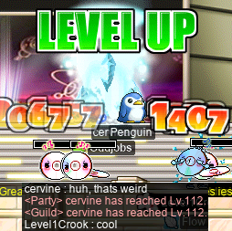
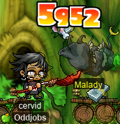

# rangifer’s diary: pt. lxx

## Taxonomising odd jobs, pt. iv: Microtaxonomy & encodings. §6

## A little light LPQing

I hopped onto my [DEX brawler](https://oddjobs.codeberg.page/odd-jobs.html#dex-brawler) [LPQ](https://maplelegends.com/lib/map?id=221024500) mule **sorts** to do some LPQs with **Flow** neophyte **trishaa**, fellow LPQ mule **Sangatsu** (**Lvl1Crook**, **xXCrookXx**, **Level1Crook**), and [DEX page](https://oddjobs.codeberg.page/odd-jobs.html#dex-warrior) **attackattack** (**xX17Xx**, **partyrock**, **breakcore**, **drainer**, **strainer**, **maebee**)! We were able to do some all-**Suboptimal** (again, ignoring that some of the characters we’re playing here are not actually in the alliance…) runs thanks to attackattack also bringing along her gunslinger, partyrock. Here we are, embattled with [glowy-eyed whale guy](https://maplelegends.com/lib/monster?id=9300012):

And, these LPQs made great [stage 8](https://maplelegends.com/lib/map?id=922010800) JMS method practice for trishaa. Once mastered, the JMS method is the mark of a true LPQer!

## panolia @ Magatia

I did an [MPQ](https://maplelegends.com/lib/map?id=261000021) or two on my [permarogue](https://oddjobs.codeberg.page/odd-jobs.html#permarogue) **panolia**, alongside chief dit **asdsaou** and outlaw **bigolebarry**:

Afterwards, I remembered that I wanted to try [Keeny’s Research on Frankenroid](https://bbb.hidden-street.net/quest/mu-lung-nihal-desert/keenys-research-on-frankenroid), a quest that acts as the culmination of the “Keeny’s Research” questline, but is not available to characters who are outside of the MPQ level range (71–85). I’d never done it before, so I went ahead and did the earlier, more familiar quests in the questline. First up was [Keeny’s Research on Roid](https://bbb.hidden-street.net/quest/mu-lung-nihal-desert/keenys-research-on-roid):

Followed by [Keeny’s Research on Neo Huroid!](https://bbb.hidden-street.net/quest/mu-lung-nihal-desert/keenys-research-on-neo-huroid):

Followed by [Keeny’s Research on D.Roid!!](https://bbb.hidden-street.net/quest/mu-lung-nihal-desert/keenys-research-on-droid), during which I was fortunate enough to stumble across a [D. Roy](https://maplelegends.com/lib/monster?id=7110300):

Again lucky for me, this D. Roy dropped not only the [Broken Mechanical Heart](https://maplelegends.com/lib/etc?id=4000362) that I needed for my quest, but also a [Magic Stone of Trust](https://maplelegends.com/lib/etc?id=4031741) that panolia will need later when she does the main Magatia questline! And, turning in the heart, I got a pair of [Mechanical Gloves](https://maplelegends.com/lib/equip?id=01082222) in exchange:

They look less like mechanical gloves, and more like the black cat paws from the Cash Shop to me, but whatever.

Keeny’s Research on Frankenroid is basically an MPQ check; it just requires that you’ve successfully (meaning also saving [Romeo](https://maplelegends.com/lib/npc?id=2112009)/[Juliet](https://maplelegends.com/lib/npc?id=2112008)) defeated [Angy Fanky](https://maplelegends.com/lib/monster?id=9300140). In exchange, you get… an [OA DEX 10%](https://maplelegends.com/lib/use?id=2040502) scroll. Could be worse, I suppose…

## Wild [animals][animals] in the forest

My [woodsmaster](https://oddjobs.codeberg.page/odd-jobs.html#woodsman), **capreolina**, now has a diverse assemblage of [creatures](https://en.wikipedia.org/wiki/Amniote) following her at all times, as befits a forester.

capreolina & her woodland friends

For contrast, here we have capreolina followed by merely two [koalas](https://en.wikipedia.org/wiki/Koala), helping **Permanovice** (**Dreamscapes**, **Battlesage**) & **kookiechan** kill a [Papulatus](https://maplelegends.com/lib/monster?id=8500001), alongside two DKs, **FearNoPain** and **Orsaris**:

As a result of being [HB](https://maplelegends.com/lib/skill?id=1301007)’d the entire time, I didn’t have to worry about [the second body](https://maplelegends.com/lib/monster?id=8500002) touching me and, as a result, yeeting my lifeless body to the grave. But, I wanted to have this reassurance even in the absence of HB. So, now that capre [has no more ring tiers to attain](https://maplelegends.com/lib/equip?id=01119012), it was time to shape up with some pet equips instead. To exploit the rather bizarre mechanic of getting stat increases from your pet’s equipment, I would need more than just one pet — after all, just one pet can only equip one equipment item at best. Instead, I need _three_ HP-holders — I mean, pets. So for that, I need to acquire [the special-sauce skill](https://maplelegends.com/lib/skill?id=0000008) by completing the [Pet-Walking Road](https://maplelegends.com/lib/map?id=100000202) JQ:

Very nice. But in order to actually _have_ three pets that I could put out at once, I thought I’d try reviving some [Nerdy Koala](https://maplelegends.com/lib/cash?id=5000273)s. You see, I’m a bit new to the whole “pet” thing, relatively speaking. I started playing MapleStory some time in [2005](https://en.wikipedia.org/wiki/2005), and it wasn’t until recently (around when my pure [STR priest](https://oddjobs.codeberg.page/odd-jobs.html#str-mage) **cervid** was level 10X or so) that I actually tried using pets. As ridiculous as it may sound, yes, I had been looting and potting manually for all these years. I just thought it was part of the game, okay?? It’s not like Nekksyn would ever let me use pets without absconding with my money, and I mentally transferred this state of affairs to private servers as well, when I started playing those. In any case, I found out the hard way that pets “expire” after 90 days, and I didn’t know how to revive them, nor did I care to find out when I tried to pull one out, only to find it in an inanimate doll state. At this point, I’m already about to Do A Thing™, so I need that pet right now. Thus, I adapted to simply re-buying the pet (as the Cash Shop is generally accessible from almost any map) any time the life of a pet dried up.

Is that pet abuse? Maybe… But I decided to rectify my lack of pet knowledge on this day, and revive some of the Nerdy Koala dolls that I had shamefully sitting in my Cash Shop inventory:

That’s not one, not two, but _four_ koalas! Three of them are bright pink, and one is seated on my back. I actually bought pet equips for all three of these pets. I had never looked at pet equips, and now that I looked at them for the first time, I realised that most pet equips are specific to a particular pet species. So, I searched for “koala” and found the baby koala equip, which is a bright yellow baby koala that sits on top of the Nerdy Koala pet. At this point, I had _seven_ koalas following me at all times, three of which were bright pink, three of which were bright yellow, and the other of which was seated on my back. Although capre has been using the Nerdy Koala pet (primarily to match the koala on my back) since she started using pets for the first time, I realised now that six koala pets was too much. The colours are just awful, which is why I don’t have a screenshot of that here, to spare your eyes. So, in the end, I swapped out two of the Nerdy Koalas for other pets:

As you can see, all three have their pet equips on: the [Brown Kitty](https://maplelegends.com/lib/cash?id=5000000) with their aviation gear on, and the [Monkey](https://maplelegends.com/lib/cash?id=5000011) with a little red bow on their head! And still, a Nerdy Koala with the bright yellow baby koala on top. This is an improvement, but I might just [boom](https://maplelegends.com/lib/use?id=2048017) the koala equip (I already passed two [30%](https://maplelegends.com/lib/use?id=2048018)s on it…) and switch to another pet x)

In any case, I passed two 30%s on all three of these pet equips. Two of them still have five slots left(!), and the other has four slots left. So, this is a pretty good start (if only I could get my hands on some [60%](https://maplelegends.com/lib/use?id=2048015)s…), and that means that capre now has enough MAXHP (without HB) to take hits from [Ravana](https://maplelegends.com/lib/monster?id=9420014)!:

Cool :D You can see capre fighting Rav here, alongside **Bipp** (**Celim**, **Copo**, **Sommer**, **Fino**, **Cassandro**) and **Snel** (**LawdHeComin**) of **Flow** — and my pure [STR bishop](https://oddjobs.codeberg.page/odd-jobs.html#str-mage) **cervid**. I tried bringing along cervid for the [HS](https://maplelegends.com/lib/skill?id=2311003), simply disconnecting her client before the boss died, so that she didn’t leech any EXP. It worked quite well, although for some reason I feel a bit dirty doing it…

But, anyways, I decided that being followed around at all times by three koalas, a [monkey](https://en.wikipedia.org/wiki/Simian), and a [cat](https://en.wikipedia.org/wiki/Felidae), wasn’t enough for me. So I went to the [Aquarium](https://maplelegends.com/lib/map?id=230000000) to protect [a certain hoggo](https://maplelegends.com/lib/monster?id=9300102):

I proceeded to force my vicloc [dagger spearwoman](https://oddjobs.codeberg.page/odd-jobs.html#dagger-warrior) **d34r** to pay for the [Pheromone Perfume](https://maplelegends.com/lib/use?id=2270000) (a significant sum of 20M mesos), and headed to [The Area of Wild Hog](https://maplelegends.com/lib/map?id=922200000) to catch a [wild hog](https://maplelegends.com/lib/monster?id=9300101) of my own:

And my mount cover of choice: the [owl](https://en.wikipedia.org/wiki/Owl)!!

Very nice :D Oh, and how could I forget? In addition to the three koalas, the monkey, the cat, and the owl, I also have my lovely [Phoenix](https://maplelegends.com/lib/skill?id=3121006):

Fuck ’em up, birdy!!! And by “them”, I of course mean the [Black Bear Swordsmen](https://maplelegends.com/lib/monster?id=9600012) that I was fighting — along with many other [Mt. Song Town](https://maplelegends.com/lib/map?id=702000000) monsters — in an attempt to check out some of the quests that this region had in store. While I was there, the game decided to tease me by giving me a few cards:

(Above is a [Male Thief](https://maplelegends.com/lib/monster?id=9600015) card.)

(Above is an [Eagle Swordsman](https://maplelegends.com/lib/monster?id=9600014) card.)

I completed three or four quests here, including “The Door to Bai Shan”, which was the most difficult, and gave perhaps the best reward: 150k base EXP (450k EXP after multipliers) — not too shabby — and a fame.

[animals]: https://en.wikipedia.org/wiki/Animals_%28This_Town_Needs_Guns_album%29

## cervine @ CDs

You already know _who_ it is: my I/L [magelet](https://oddjobs.codeberg.page/odd-jobs.html#magelet) **cervine**. You already know _where_ it is: [Star Avenue South Section](https://maplelegends.com/lib/map?id=742010203). And you already know _what_ it is: [cryopreserving](https://maplelegends.com/lib/skill?id=2211002) [optical disc](https://maplelegends.com/lib/monster?id=9410031)s!!

I managed to catch some GM buffs (and [Echo](https://maplelegends.com/lib/skill?id=0001005)), and used them to sadgrind for 60 minutes:

Nearly 4.5M EPH! Not bad at all!! However, significantly higher EPH is attainable with the aid of not just [HS](https://maplelegends.com/lib/skill?id=2311003), but also, you know, actually partying:

Niceee~ One step closer to I/L archmagelet, haha!

## Helping Permanovice with the main Taipei 101 questline

Speaking of [Taipei 101](https://maplelegends.com/lib/map?id=742000000), I went to Taipei 101 as my [darksterity knight](https://oddjobs.codeberg.page/odd-jobs.html#dex-warrior) **rusa** to help **Permanovice** (**Battlesage**, **Dreamscapes**) complete the main Taipei 101 questline (“[Dreamy Park Concert](https://maplelegends.com/lib/quest?id=8683)”, followed by “[The Missing Sheet Music](https://maplelegends.com/lib/quest?id=8687)”). As some readers may already know, this quest essentially entails collecting the ETCs from most of the species of monster found in Taipei 101 (with the exception of CDs, which are strangely not part of the questline at all). In particular, this means:

- collecting 200 [Blue Perfume](https://maplelegends.com/lib/etc?id=4000314)s from ([Transformed](https://maplelegends.com/lib/monster?id=9410023)) [Blue Perfume](https://maplelegends.com/lib/monster?id=9410022)s,
- collecting 200 [Pink Perfume](https://maplelegends.com/lib/etc?id=4000316)s from ([Transformed](https://maplelegends.com/lib/monster?id=9410027)) [Pink Perfume](https://maplelegends.com/lib/monster?id=9410026)s,
- collecting 200 [Yellow Perfume](https://maplelegends.com/lib/etc?id=4000315)s from ([Transformed](https://maplelegends.com/lib/monster?id=9410025)) [Yellow Perfume](https://maplelegends.com/lib/monster?id=9410024)s,
- collecting 150 [Cheap Speaker](https://maplelegends.com/lib/etc?id=4000317)s from [Cheap Amp](https://maplelegends.com/lib/monster?id=9410028)s,
- collecting 150 [Fancy Amplifier Cable](https://maplelegends.com/lib/etc?id=4000318)s from [Fancy Amp](https://maplelegends.com/lib/monster?id=9410029)s,
- collecting 100 [Kid Mannequin’s Bunny Suit](https://maplelegends.com/lib/etc?id=4000322)s from [Kid Mannequin](https://maplelegends.com/lib/monster?id=9410032)s,
- collecting 100 [Female Mannequin’s Wig](https://maplelegends.com/lib/etc?id=4000321)s from [Female Mannequin](https://maplelegends.com/lib/monster?id=9410033)s,
- and collecting 100 [Male Mannequin’s Fedora](https://maplelegends.com/lib/etc?id=4000320)s from [Male Mannequin](https://maplelegends.com/lib/monster?id=9410034)s.

Whew. That’s a lot of ETCs. And unfortunately for our prospective quester, CDs — the only species not represented here — are the only popular training spot in all of Taipei 101\*, and there are no Taipei 101 monsters that drop cards, either. So you won’t have any luck trying to buy these ETCs on the [FM](https://maplelegends.com/lib/map?id=910000000). And that truly is unfortunate, as the perfumes in particular are a supreme pain in the arse to collect ETCs from. Collecting 600 perfumes is a frankly ridiculous chore — unless, of course, you can [rawr](https://maplelegends.com/lib/skill?id=1311006):

So, I collected with Permanovice (and, as you can see above, also **Level1Crook** at times) 1&nbsp;200 perfumes, 600 mannequin ETCs, and 150 Cheap Speakers. Why so many perfumes and mannequin ETCs? Well, we gathered up enough ETCs for _both_ of us to complete the quest. And Permanovice already had the amplifier ETCs, and I had a bunch of Fancy Amplifier Cables on my undead [daggermit](https://oddjobs.codeberg.page/odd-jobs.html#dagger-assassin) **alces**, so we didn’t collect quite as many of those. Anyways, I completed Dreamy Park Concert, and all I got was this lousy [Red Umbrella](https://maplelegends.com/lib/equip?id=01302025):

Ouf. But Permanovice was kind enough to buy two [Spirit of Rock’s Music Score](https://maplelegends.com/lib/etc?id=4000323)s, one for each of us, so we both completed the entire questline. Which makes us both proud owners of the super sweet [Electric Guitar Necklace](https://maplelegends.com/lib/equip?id=01122008)…

Footnotes for “Helping Permanovice with the main Taipei 101 questline”

\*This is not _entirely_ true; [Kid Mannequin](https://maplelegends.com/lib/monster?id=9410032)s used to be popular when they had full-map-range auto-aggro behaviour (which was a long time ago). And nowadays, [Fancy Amp](https://maplelegends.com/lib/monster?id=9410029)s are a popular spot for single-target-only attackers, with [Cheap Amp](https://maplelegends.com/lib/monster?id=9410028)s being (as their names imply) a cheaper alternative. Of course, these are level \>70 training spots, so the only characters who are still single-target-only by this point are odd-jobbers…

## Hangin’ out at the Training Zone

As I was online and playing rusa, **OmokTeacher** (**Slime**, **Thinks**, **Slimu**) logged on to say hi and see what’s up. He got into a conversation with **Permanovice** in buddy chat, and we went to HQ\* to chat there. We were comparing the various “pogginners” (“[pog](https://www.urbandictionary.com/define.php?term=Pog)” + “[beginner](https://bbb.hidden-street.net/character/class/beginner)”) of MapleLegends, such as OmokTeacher and Permanovice themselves, as well as **Taima** (**Tacgnol**, **Boymoder**, **Hanyou**, **Numidium**, **Gambolpuddy**), **Gumby**, **Cortical** (**GishGallop**, **Medulla**, **BowerStrike**, **xXcorticalXx**, **SussyBaka**, **CokeZeroPill**), **LoneW0lf1600** (**LoneWolf1600**), **Outside**, etc. And, naturally, this resulted in OmokTeacher and Permanovice wanting to test their DPH on the spot… So, to the [Training Zone](https://maplelegends.com/lib/map?id=702000001) we went…

I took along my pure [STR bishop](https://oddjobs.codeberg.page/odd-jobs.html#str-mage) **cervid** so that I could participate side-by-side with these [STRginner](https://oddjobs.codeberg.page/odd-jobs.html#str-beginner)s. In the end, of course, the results are not exactly fair (as my various magician/cleric/priest/bishop skills have given me the EXP advantage…), but we compared anyways, with the focus being on OmokTeacher’s and Permanovice’s numbers. As usual, these tests were just with typical self-buffs and [Cider](https://maplelegends.com/lib/use?id=2022002)s:

Permanovice initially clocked 10.5M DPH, and so OmokTeacher (with 10.6M DPH) thought that he had won the contest. But Permanovice realised that he was using some DEX gear, so after switching to a STR [robe](https://maplelegends.com/lib/equip?id=01050100), he instead clocked a whopping 11.4M DPH! Also, both OmokTeacher and I have our [Crimson Arcglaive](https://maplelegends.com/lib/equip?id=01442068)s exposed in the screenshot above, but Permanovice has an NX weapon cover equipped, so for anyone who’s wondering, Permanovice is holding a [Fan](https://maplelegends.com/lib/equip?id=01332030) and a [Stolen Fence](https://maplelegends.com/lib/equip?id=01092003).

Footnotes for “Hangin’ out at the Training Zone”

\*We have a joint alliance headquarters between the **Suboptimal** alliance and the **GangGang** guild at FM 7-[7](https://maplelegends.com/lib/map?id=910000007) (channel 7, room 7). You should check it out and BUY MY SHIT @@@@@@@@@@@@@@@@@@@@@@@@@@@

## Card-hunting (and a little questing along the way): Because apparently, I have nothing better to do

Now that my [woodsmaster](https://oddjobs.codeberg.page/odd-jobs.html#woodsman) **capreolina** got [the T10 ring](https://maplelegends.com/lib/equip?id=01119012), I have been wandering around, a lost deer, trying to figure out what to do now. The rest of my attempts are catalogued in the [`
` element](https://developer.mozilla.org/docs/Web/HTML/Element/details) below:

General nonsense

I was invited to do some card-hunting with intslinger **Lvl1Crook** (**Level1Crook**, **xXCrookXx**) and page **vvvv** (of **Tunas**). So, after some futzing about with my characters, I decided to bring my I/L [magelet](https://oddjobs.codeberg.page/odd-jobs.html#magelet) **cervine** to help these two hunt some [Wild Boar](https://maplelegends.com/lib/monster?id=2230102) cards:

They were having a lot of trouble getting the Wild Boards to cough up some cards, but cervine fixed that right up:

Once we all had our respective 5/5 Wild Boar cards, we headed to [The Swamp of Despair III](https://maplelegends.com/lib/map?id=107000200) to hunt some [Ligator](https://maplelegends.com/lib/monster?id=3110100)s:

I suggested that we go [one map to the right](https://maplelegends.com/lib/map?id=107000300), as The Swamp of Despair III is basically _just_ Ligators (with the occasional [Jr. Necki](https://maplelegends.com/lib/monster?id=2130103) sliding around the bottom), whereas Dangerous Croko I has both Ligators _and_ [Croco](https://maplelegends.com/lib/monster?id=5130103)s. Then, once we get 5/5 Croco, we could go back to The Swamp of Despair III to finish up Ligator sets as necessary. But the main motivation for staying in The Swamp of Despair III was that Lvl1Crook was too smart. And too many smarticle particles made him not so good at shooty-shooting, so the Crocos were a bit too much of a challenge. But, just to see how bad it really was, we went there anyways to test it out. Plus, I needed at least 50 [Croco Skin](https://maplelegends.com/lib/etc?id=4000033)s for the [Dyle](https://maplelegends.com/lib/monster?id=6220000) questline:

Later, once Lvl1Crook and vvvv had left, I continued on card-hunting in Victoria Island, because… why not, I guess. So I headed to the [Ant Tunnel](https://maplelegends.com/lib/map?id=105050200) for some [Zombie Mushroom](https://maplelegends.com/lib/monster?id=2230101)s:

…and some [Horny Mushroom](https://maplelegends.com/lib/monster?id=2110200)s\*:

…and some [oversized Zombie Mushroom](https://maplelegends.com/lib/monster?id=6300005)s:

…and some [Evil Eye](https://maplelegends.com/lib/monster?id=2230100)s (a particularly easy set):

I hit up [my favourite tree dungeon](https://maplelegends.com/lib/map?id=101020010) for the [Curse Eye](https://maplelegends.com/lib/monster?id=3230100) set:

And then, I headed to [Florina Beach](https://maplelegends.com/lib/map?id=110000000) for some of the card sets there, as well as for the [Defeat King Clang!](https://bbb.hidden-street.net/quest/victoria-island/defeat-king-clang) questline:

I was fortunate enough to stumble across a [Casey](https://maplelegends.com/lib/monster?id=5220000) and complete my quest:

And I finished up the [Lorang](https://maplelegends.com/lib/monster?id=3230102) set, thus finishing all three main sets on Florina Beach:

I went to [Ellinia](https://maplelegends.com/lib/map?id=101000000) to do the [Defeat Faust](https://maplelegends.com/lib/quest?id=2227) questline, and while I was there in [The Forest of Evil I](https://maplelegends.com/lib/map?id=100040105), I went ahead and did the [Malady](https://maplelegends.com/lib/monster?id=5300100) set:

I also got a start on my [Zombie Lupin](https://maplelegends.com/lib/monster?id=4230101) set, which I later finished at [Monkey Swamp III](https://maplelegends.com/lib/map?id=107000403):

I did the [Iron Hog](https://maplelegends.com/lib/monster?id=4230103) set between [Pig Park](https://maplelegends.com/lib/map?id=100000003) and [Pig Park II](https://maplelegends.com/lib/map?id=100000004):

And moved on to [Perion](https://maplelegends.com/lib/map?id=102000000) to get the Perion Drake sets: [Copper Drake](https://maplelegends.com/lib/monster?id=4130100)s…

…and those gosh darned [Red Drakes](https://maplelegends.com/lib/monster?id=6130100):

It was at this point that I finally found a [Faust](https://maplelegends.com/lib/monster?id=5220002):

Cool! I finished the questline _and_ got a card! Anyways, back to Perion for those [Iron Boar](https://maplelegends.com/lib/monster?id=4230400)s…

And I headed to [the top floor of the Nautilus](https://maplelegends.com/lib/map?id=120000100) to ask [Muirhat](https://maplelegends.com/lib/npc?id=1092007) about his questline that follows [The Half-written Letter](https://maplelegends.com/lib/quest?id=2162). After taking down some [Stone Golem](https://maplelegends.com/lib/monster?id=5130101)s, I headed to [TfoG](https://maplelegends.com/lib/map?id=105040306) for some [Dark Stone Golem](https://maplelegends.com/lib/monster?id=5130102)s and some [Mixed Golem](https://maplelegends.com/lib/monster?id=5150000)s:

And then, again, back to Perion for some Excavation Site monsters. Like [Officer Skele](https://maplelegends.com/lib/monster?id=6230602)s:

…and [Skeleton Soldier](https://maplelegends.com/lib/monster?id=5150001)s:

…and everyone’s favourite: [Commander Skeleton](https://maplelegends.com/lib/monster?id=7130103)s! These lovely lads are strong against ice, so I had to take out the ol’ [Thunderbolt](https://maplelegends.com/lib/skill?id=2201005):

Not very swift at killing them, but good enough for the quest at least…

And, finally, to [Deep Sleepywood](https://maplelegends.com/lib/map?id=105090000) for the last critters of the questline. Again with the resistance to ice, we have [Ice Drake](https://maplelegends.com/lib/monster?id=6230600)s:

Terrible. You’re not allowed to be ice ­— I’m ice!! Stop being so icy so that my ice ices you better!!!

And just your ordinary, average [Drake](https://maplelegends.com/lib/monster?id=5130100)s:

And last but not least, the [Tauromacis](https://maplelegends.com/lib/monster?id=7130100) and [Taurospear](https://maplelegends.com/lib/monster?id=7130101)s. As usual, only the Taurospears are willing to part with their cards:

I also did [Mr. Wetbottom’s Secret Book](https://bbb.hidden-street.net/quest/victoria-island/mr-wetbottoms-secret-book), and got myself another snazzy [Sauna Robe](https://maplelegends.com/lib/equip?id=01051017):

And I finished up my Mixed Golem set and my [Shade](https://maplelegends.com/lib/monster?id=5090000) set…

…just in time to get a snazzy [T2 ring](https://maplelegends.com/lib/equip?id=01119004)~!

And, for want of something else to do, I headed to the [Orbis Tower](https://maplelegends.com/lib/map?id=200080200) for more monsters to card-hunt:

None of these card sets pose any threat to our intrepid card-hunter cervine, who is armed with not one, but two multi-target magic spells.

Of course, there is the [Ice Sentinel](https://maplelegends.com/lib/monster?id=5200001), formidable as it is with its rimy exterior.

But, to balance it out, we have the Ice Sentinel’s evil, but tender, twin: the [Fire Sentinel](https://maplelegends.com/lib/monster?id=5200002).

Warm and fuzzy as it appears, the [Leatty](https://maplelegends.com/lib/monster?id=5300000) is nevertheless cold at heart as well.

But, like the Ice Sentinel, the Leatty has a tender evil twin, more reddish in hue.

And we can’t forget our miniature spheniscid friends, the [Jr. Pepe](https://maplelegends.com/lib/monster?id=5400000)s. Adapted to harsh Antarctic winters, they too would shrug at my [Ice Strike](https://maplelegends.com/lib/skill?id=2211002)s.

And I would have ventured further, to [the Jr. Pepe’s aquatic cousins](https://maplelegends.com/lib/monster?id=3210450) (also adapted to harsh winters…), but they also share habitat with some of our Upper Aqua Road friends, so they can be saved for later.

Having gotten the Shade set for cervine, I stumbled across one and decided to get the set for my [daggermit](https://oddjobs.codeberg.page/odd-jobs.html#dagger-assassin) **alces** and my [darksterity knight](https://oddjobs.codeberg.page/odd-jobs.html#dex-warrior) **rusa**. Shade is [a spooky guy](https://en.wikipedia.org/wiki/Ghost), and it’s [spooky season](https://en.wikipedia.org/wiki/Halloween), but there’s no spooky event, so that meant it was time to say goodbye to last year’s spooky event cosmetics… which I had been using on alces…

F4

But, no matter — I did finish both of these sets:

And got the stray [Wraith](https://maplelegends.com/lib/monster?id=4230102) card here and there:

I did a bit of browsing for cards as rusa, too. I accidentally stumbled on a [Jr. Booger](https://maplelegends.com/lib/monster?id=3230301) card or two:

As I was headed to [The Cave of Evil Eye](https://maplelegends.com/lib/map?id=105070200) for the [Evil Eye](https://maplelegends.com/lib/monster?id=2230100) set:

I also said hi to [the reanimated mother of all mushrooms](https://maplelegends.com/lib/monster?id=6300005), but did not finish her set:

Later, I got bored and browsed for cards on my pure [STR bishop](https://oddjobs.codeberg.page/odd-jobs.html#str-mage) **cervid**. cervid had partially done the Orbis Tower, but never actually finished. So I went back for the Dark Leatties:

…and the Jr. Pepes:

And I headed back to Victoria Island for some of the quests there, including more of those pesky area boss quests. To that end, I beat up some [flying old ladies](https://maplelegends.com/lib/monster?id=5300100):

And I hung around The Swamp of Despair III and Dangerous Croko I for a while, not even for quests. I just wanted some cards. But these silly crocodilian fellows refused to give up their precious rectangles, so I had to make do with the surfboards that they kept giving me:

Oh, well. Better luck next time!

Footnotes for “Card-hunting (and a little questing along the way): Because apparently, I have nothing better to do”

\*Any readers who play(ed) MapleLegends are already familiar with the in-game “\[MapleTip\]” that reads something like: “‘Horny Mushroom’ is actually called Horned Mushroom”. If I made a joke about how silly this MapleTip was, it would not be the first — many have pointed out the humour. Reading the MapleTip literally, it’s plainly false; Horny Mushrooms are not only named as such in the String\.wz, but that is _de facto_ what they are actually called by [anglophone](https://en.wiktionary.org/wiki/Anglophone#English) players of the game. But, presumably, the MapleTip is just very poorly worded. Perhaps the MapleTip’s author meant to say that “Horny Mushroom” was merely a [poor translation](https://en.wikipedia.org/wiki/Humour_in_translation) of the original [Korean](https://en.wikipedia.org/wiki/Korean_language) name for the monster, and that Wizet presumably meant to translate it as “Horned Mushroom” or similar. This is very plausible, even obvious — _horny_ is occasionally used in [English](https://en.wikipedia.org/wiki/English_language) in the sense of “horned” (i.e. having horns). But the original sense in English is neither this “horned” sense (for which _horned_ is, by far, the more popular of the two terms), nor the usual sense in contemporary English of “sexually aroused”. _Horny_ was in English as early as the late [1300s](https://en.wikipedia.org/wiki/14th_century), meaning “made of horn”, and by the [1690s](https://en.wikipedia.org/wiki/1690s) it had evolved a slightly more abstract sense of “bony, callous; as if made of horn”. It wasn’t until the latter half of the [1800s](https://en.wikipedia.org/wiki/19th_century) that the “sexually aroused” sense emerged. And, if you were wondering, the “sexually aroused” sense is from the _horn_ in _horn_ + _-y_ as a euphemism for an erect penis. Later, it was generalised to the sexual excitement of anyone, regardless of whether or not they have a penis.

