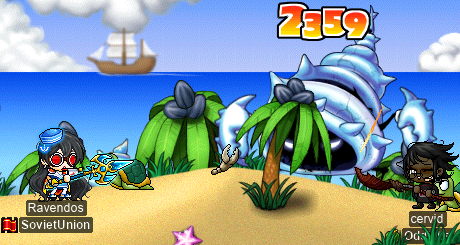

# rangifer’s diary: pt. lxxi

## Taxonomising odd jobs, pt. v: Hypergraphing. §1

In the previous part (pt. iv) of this series — “Microtaxonomy & encodings” — I tried to enumerate a [set][set] of all odd jobs that we want to consider. As usual, we have to give the caveat that such a set can never be virtually exhaustive; with odd jobs, the only actual limit _per se_ is your imagination. But this set will nevertheless serve as our [universe][universe] of [discourse](https://en.wikipedia.org/wiki/Domain_of_discourse). Part of enumerating such a set is defining each [element][element] of the set, which means having a systematic definition for each job — hence the “encodings”. Ultimately, this resulted in one big [RON](https://github.com/ron-rs/ron) file, which you can find [here](../068/odd_job_universe.ron).

Bearing with us the collective wisdom (or lack thereof…) of the previous four parts of this series, this part (and those after it) will — hopefully — put it all to the test. As outlined in the final bit of the previous part, there are essentially three routes that we want to explore:

- Imposing a (simple) [hypergraph](https://en.wikipedia.org/wiki/Hypergraph) onto our universe, with the universe being the vertex set. The hyperedges then represent relevant categories of odd jobs. These hyperedges are essentially arbitrary; the idea is the select them by hand, based on our systematic and historical understandings of the odd jobs.
- Imposing a [weak ordering](https://en.wikipedia.org/wiki/Weak_ordering) onto our universe, as discussed in §4 and §5 of pt. iii, and then using this weak ordering to constrain the by-hand construction of a [rooted forest][tree] of odd jobs. The vertex set of such a forest would, again, by the universe of odd jobs. When, in this forest, one odd job is a child of another, we interpret that to mean that it somehow “descends from” the other one. The result is intended to have an effect similar to the [disjoint union](https://en.wikipedia.org/wiki/Disjoint_union_of_graphs) of one or more [phylogenetic trees](https://en.wikipedia.org/wiki/Phylogenetic_tree).
- Using [clustering](https://en.wikipedia.org/wiki/Cluster_analysis) methods, as explored in pt. iii of this series. Applying a clustering method requires encoding each odd job into a form that is amenable to said method. This route also requires nontrivial [computational resources](https://en.wikipedia.org/wiki/Computational_complexity), as the resulting [tree][tree] is generated by the clustering algorithm, not constructed by hand.

[set]: https://en.wikipedia.org/wiki/Set_(mathematics)
[universe]: https://en.wikipedia.org/wiki/Universe_%28mathematics%29
[element]: https://en.wikipedia.org/wiki/Element_(mathematics)
[tree]: https://en.wikipedia.org/wiki/Tree_(graph_theory)

## cervid roams the land of Victoria Island

I’ve been roaming Victoria Island with some of my non-vicloc characters, with a focus on certain quests that I like to do, as well as certain card sets. The sets that I focus on in my first pass over Victoria are anything except: bosses (but including [ZMM](https://maplelegends.com/lib/monster?id=6300005) and [Shade](https://maplelegends.com/lib/monster?id=5090000) if convenient), Excavation Site monsters, and Deep Sleepywood monsters (viz. anything in [The Tunnel That Lost Light I](https://maplelegends.com/lib/map?id=105090000) or deeper).

As for quests, well, one among them is “[The Monster and the Evil Scheme](https://www.hidden-street.net/gms/quest/the-monster-and-the-evil-scheme)”, which requires killing our old friend [Dyle](https://maplelegends.com/lib/monster?id=6220000). It also, however, requires talking to a certain NPC during an alarmingly narrow three-hour time-of-day window from 17:00 to 20:00 [UTC](https://en.wikipedia.org/wiki/Coordinated_Universal_Time). If you are generally asleep, at work, or otherwise not in a position to play MapleStory during this time, then tough luck. This quest isn’t for you. Eventually, I did talk to this NPC myself, and at the right time, so at that point, all I needed to do was actually find a Dyle… Which I did! Here, we see my pure [STR bishop](https://oddjobs.codeberg.page/odd-jobs.html#str-mage) **cervid** taking on this oversized [Ligator](https://maplelegends.com/lib/monster?id=3110100):

cervid roaming Vic

I stayed around to finish my Ligator set, and get the [Croco](https://maplelegends.com/lib/monster?id=5130103) set as well. Little did I know, these rather easy cards would generally refuse to drop for cervid:

…Eventually (after multiple sessions), I did get that Croco set. This seems to exemplify a problem that I often have when trying to card-hunt as cervid: even when taking into account the fact that cervid has a rather low KPM (**k**ills **p**er **m**inute; cervid is generally limited to basic-attacking, which yields poor KPM even though her basic-attacks are quite strong), generating just one card often takes an unusually large number of kills. The received understanding of card droprates would predict the opposite: basic-attacks are supposedly the attacks that cause droprates to be the highest. I did — completely accidentally — cast [Genesis](https://maplelegends.com/lib/skill?id=2321008) exactly once during the entire time spent hunting Croco cards, which naturally “**MISS**”ed the majority of its targets, as would be expected of a STR bishop wearing full damage gear. However, it did hit and kill one or two Crocos, and rather infuriatingly, one of them dropped a card. Scarcely have I been so humiliated in the presence of absolutely no one else…

In any case, I also completed a similar questline, “[The Forest of Evil](https://global.hidden-street.net/quest/victoria-island/the-forest-of-evil)”, which had me kill [big monke](https://maplelegends.com/lib/monster?id=5220002):

And, likewise, I went to [Florina Beach](https://maplelegends.com/lib/map?id=110000000) to complete “[Defeat King Clang!](https://global.hidden-street.net/quest/victoria-island/defeat-king-clang)”, which required me to kill some of the critters around the beach:

…and then, of course, kill [Casey](https://maplelegends.com/lib/monster?id=5220000) itself. I just so happened to get to [Hot Sand](https://maplelegends.com/lib/map?id=110040000) just in time to snag a Casey from a card-hunter who perplexedly watched me basic-attack it to death:

I continued [Muirhat](https://maplelegends.com/lib/npc?id=1092007)’s “[Eliminate the…](https://maplelegends.com/lib/quest?search=eliminate+the)” questline, which was convenient, as I needed [Mixed](https://maplelegends.com/lib/monster?id=5150000)/[Dark Stone](https://maplelegends.com/lib/monster?id=5130102) Golem cards anyways, so I headed to [TfoG](https://maplelegends.com/lib/map?id=105040306) for some hunting:

In the end, I only got one card from this, and it wasn’t even a golem one…

With that, it was time to head to the Excavation Site for the next Muirhat quest, as well as “[Notice from the Excavation Team](https://bbb.hidden-street.net/quest/victoria-island/notice-from-the-excavation-team)”:

The [Commander Skele](https://maplelegends.com/lib/monster?id=7130103)s gave me a weirdly hard time at first; the first 18 or so that I killed yielded only two [Horse Skull](https://maplelegends.com/lib/etc?id=4000208)s in total. But after that, they started picking up the slack, and I was able to finish the quest:

For the next part, I was tasked with killing [Drake](https://maplelegends.com/lib/monster?id=5130100)s (and [their icy cousins](https://maplelegends.com/lib/monster?id=6230600)):

And, finally, the bovine finale: [Taurospears](https://maplelegends.com/lib/monster?id=7130101) and [Tauromacis](https://maplelegends.com/lib/monster?id=7130100):

A Tauromacis card! A rare sight indeed!!

Oh, and also I did [the Sauna Robe questline](https://bbb.hidden-street.net/quest/victoria-island/mr-wetbottoms-secret-book):

I have come to dread the day that the [2020](https://en.wikipedia.org/wiki/2020) winter event cosmetics expire… The, uhm, overall — [smock](https://en.wikipedia.org/wiki/Smock-frock), maybe? — that cervid wears oddly contributes a lot to how strong she _looks_. The smock was intentionally designed to be oversized, as evidenced by the total disappearance of the hands and arms of any character that wears it while standing and holding a one-handed melee weapon (or claw, or knuckler, etc.). Usually, this appears to have the opposite effect, making the character look relatively smaller (in comparison to the giant smock), perhaps even neotenising them. With the long [combat boots](https://en.wikipedia.org/wiki/Combat_boot), combined with the [Crimson Arcglaive](https://maplelegends.com/lib/equip?id=01442068) (held upright, as a proper two-handed melee weapon), I adopted the smock as part of cervid’s look when I realised that it actually tends to make her look physically larger, and otherwise matches her look pretty well. cervid is nearly my only character which I didn’t design a look for before playing them; this is because she was originally IGN **deer** on JoblessMS, which didn’t feature many NX equips at all (encouraging a more NXless, gear-first look). So her outfit fluctuated several times, over the weeks and months, and I only managed to settle on a look once I tried the winter smock on for size (after not expecting it to look very good). See pt. xxxi of this diary for my interpretation of this outfit. Being so accustomed to the smock, seeing her in the [Sauna Robe](https://maplelegends.com/lib/equip?id=01051017) in the image above makes her look almost comically thin…

## rusa does the Zakum prequests

I was invited to do the [Zakum](https://maplelegends.com/lib/monster?id=8800000) prequests as a group, with **Lvl1Crook** (**Level1Crook**, **xXCrookXx**, **Sangatsu**) and **partyrock** (**attackattack**, **xX17Xx**, **breakcore**, **drainer**, **strainer**, **technopagan**, **raving**). Readers of this diary may recall that I gave my poor [darksterity knight](https://oddjobs.codeberg.page/odd-jobs.html#dex-warrior) **rusa** some amount of brain trauma by not getting her [a helmet](https://maplelegends.com/lib/equip?id=01003068) until she was level 90 or so. Partly, this was because I knew that I ultimately wanted the Ravana Helmet; partly, this was also because I was avoiding the Zakum prequests…

But the time is now. I didn’t have any characters who really needed a [zhelm](https://maplelegends.com/lib/equip?id=01002357) and hadn’t done the prequests already. rusa certainly doesn’t need a zhelm, but I thought it appropriate to finally do the prequests as her, in case I ever need to step foot into Zakum’s altar for some other reason… Like a [Zakum Certificate](https://maplelegends.com/lib/etc?id=4001083)! Or even to poke [an arm](https://maplelegends.com/lib/monster?id=8800003)!!

So, for starters, we went to [Dead Mine II](https://maplelegends.com/lib/map?id=211041600) to farm up some [gold teeth](https://maplelegends.com/lib/etc?id=4000082):

As you can see, both others hopped onto some more powerful characters for this part, to make things go faster. Fortunately for me, I had no need to do the same, as rusa is more than capable of shredding some [Miner Zombies](https://maplelegends.com/lib/monster?id=5130108) en masse. The prequests require 30 gold teeth, so between the three of us, we needed 90(!) total, not even counting the additional 30 that mae would inevitably need for attackattack as well (in addition to partyrock).

Along the way, we each got our 5/5 Miner Zombie cards and our 5/5 [Flyeye](https://maplelegends.com/lib/monster?id=4230107) cards. I actually already had 5/5 of both — I had gotten these sets on several of my characters while taking turns farming gold teeth for myself. These two species actually have rather high card drop rates, making the Dead Mine a premier card-hunting destination.

Once we’d each our teeth, it was time to do the real first part of the prequests: running through the labyrinthine Dead Mine tunnels, in search of rocks and chests to shatter, in hopes of a few keys. But Lvl1Crook had the idea to try getting not only the keys, but also all 32 documents scattered throughout the tunnels, so that we would additionally be awarded with [Dead Mine return scrolls](https://maplelegends.com/lib/use?id=2030007). None of us had ever tried to collect the documents before, so we figured we may as well give it a go:

With a lot of communication through party chat, and a lot of getting teleported back to the beginning by rogue chests and rocks, we managed to clear just about the entire tunnel system within 28 minutes or so. The catch, of course, was that we only had 30 minutes to do the whole thing. So we breathlessly hurried to [Area 16-5](https://maplelegends.com/lib/map?id=280011005) to get the crucial fire ore from the giant chest:\*

Luckily, we made it in time — and each got five Dead Mine return scrolls, to boot!

That leaves just one last part of the Zakum prequests: the dreaded jump quest… I actually did remarkably well with the first stage of the JQ; I didn’t fall into the lava even once! Things were looking similarly favourable for the second stage. Well, they were, until I got to about this point:

And believe me, I took my sweet time to really do this final bit of the JQ correctly. Or, at the very least, to not fall into the lava. Naturally, I fell into the lava anyways, after no small amount of agonising over this last section. So, I walked the full walk of shame across the entire length of the lava pit, to try stage II again. Thankfully, after eventually getting back to this final section again, and after even more agonising over it, I did finally complete the JQ:

Nice~!!

Footnotes for “rusa does the Zakum prequests”

\*The blue “**60**” that you see above rusa’s head, in this image, is indeed a massive flex on anyone who doesn’t have max [Endure](https://maplelegends.com/lib/skill?id=1000002). If you play a warrior or thief without maxed Endure, get absolutely flexed on. Do not @ me.

## Vicloc questing with d33r

I did some joocy Vic Island quests not just on my outlanders, but also on my vicloc [clericlet](https://oddjobs.codeberg.page/odd-jobs.html#magelet) **d33r**! My goal was to do these quests totally unassisted; now that d33r has quite stronk gear (at least, for a vicloc magelet…), I wanted to really put her to the test. So, as part of the [Faust](https://maplelegends.com/lib/monster?id=5220002) questline, I was tasked with killing [Maladies](https://maplelegends.com/lib/monster?id=5300100) for their [Cursing Nail](https://maplelegends.com/lib/etc?id=4031925)s (ten of them, in particular). It must be that these nails line the gums of Maladies, because extracting them was much like pulling teeth:

With some patience and concerted effort whittling these Maladies down one by one, I did manage to extract some nails:

And, eventually, I did accumulate ten of them. But there were no Fausts to be found, so I took a detour to do another quest instead: “[The Alligators at the Swamp](https://bbb.hidden-street.net/quest/victoria-island/the-alligators-at-the-swamp)”. The task was simple. Kill 250 [Ligator](https://maplelegends.com/lib/monster?id=3110100)s:

And, while we’re at it, 40 [Jr. Necki](https://maplelegends.com/lib/monster?id=2130103)s as well. And then, 120 [Croco](https://maplelegends.com/lib/monster?id=5130103)s:

One might reasonably ask how exactly I killed 250 Ligators and 120 Crocos. The answer, of course, is equal parts [Magic Claw](https://maplelegends.com/lib/skill?id=2001005) and sheer patience. Oh, and [drugs](https://maplelegends.com/lib/use?id=2012002). Lots of [drugs](https://maplelegends.com/lib/use?id=2002002).

Speaking of things that vicloc magelets are definitely not designed to do, I did find a Faust! And killed it myself!!:

F555555555555

## rusa also roams the land of Victoria Island

I know, I know. Even _moar_ of the same Vic Island stuff?? If only I didn’t insist on starting in Victoria Island, the place where it all begins (or ends, from the Maple Island perspective)…

Thankfully(?), I only have a finite number of characters, which means that I’ll likely be roaming various other, more exotic lands, in the near future. It remains to be seen exactly where I shall wander off to… For now, let’s see what my [darksterity knight](https://oddjobs.codeberg.page/odd-jobs.html#dex-warrior) **rusa** has been up to on the island:

rusa roams Vic

I was doing the [large monke](https://maplelegends.com/lib/monster?id=5220002) questline, as usual, so while waiting for a large monke to spawn, I killed some [Maladies](https://maplelegends.com/lib/monster?id=5300100) (and [zombie monke](https://maplelegends.com/lib/monster?id=4230101)):

The Maladies were, perhaps surprisingly, rather generous with their cards:

By the time that I got to 5/5 Malady, there was still no sign of large monke, so I headed over to another classic Ellinia map: [Tree Dungeon, Forest Up North IX](https://maplelegends.com/lib/map?id=101020010).

With the [Curse Eye](https://maplelegends.com/lib/monster?id=3230100) set done, I headed back to check for large monke, and was fortunate enough to find one:

Next up was finishing [the Sauna Robe quest](https://bbb.hidden-street.net/quest/victoria-island/mr-wetbottoms-secret-book), which required some [banan](https://maplelegends.com/lib/etc?id=4000029):

Very snazzy — another [Sauna Robe](https://maplelegends.com/lib/equip?id=01051017) down:

Next up was [Muirhat](https://maplelegends.com/lib/npc?id=1092007)’s questline, and hunting the cards associated with it. For rusa, I decided to avoid [TfoG](https://maplelegends.com/lib/map?id=105040306) entirely, in favour of hunting all three Stone Golem species within [The Golem’s Temple](https://maplelegends.com/lib/map?id=106010102) in Henesys:

That’s an easy [Fairy](https://maplelegends.com/lib/monster?id=3000004) set right there — and then some:

And finally, wrapping up the golems with [Mixed Golem](https://maplelegends.com/lib/monster?id=5150000)s in [Golem’s Temple IV](https://maplelegends.com/lib/map?id=106010106):

After that, I was off to [Florina Beach](https://maplelegends.com/lib/map?id=110000000) for [the King Clang questline](https://global.hidden-street.net/quest/victoria-island/defeat-king-clang) and the [Lorang](https://maplelegends.com/lib/monster?id=3230102):

…[Clang](https://maplelegends.com/lib/monster?id=4230104):

…and [Tortie](https://maplelegends.com/lib/monster?id=4130101) sets:

And, thankfully, I found a [Casey](https://maplelegends.com/lib/monster?id=5220000) without too much trouble:

I headed back to [KC](https://maplelegends.com/lib/map?id=103000000) (not to be confused with [KC](https://maplelegends.com/lib/monster?id=5220000)) to do the swamp sets:

As usual, I headed to [the Excavation Site](https://maplelegends.com/lib/map?id=101030104) in Perion for “[Notice from the Excavation Team](https://bbb.hidden-street.net/quest/victoria-island/notice-from-the-excavation-team)” and “[Eliminate the Skeletons](https://maplelegends.com/lib/quest?id=2201)”, which were done without any trouble (I got no cards, except a random [Mummydog](https://maplelegends.com/lib/monster?id=4230126) card from a Mummydog that I accidentally killed in passing). And, for [the next part of Muirhat’s questline](https://maplelegends.com/lib/quest?id=2202), I headed to Deep Sleepy:

And finally, for [the final bit](https://maplelegends.com/lib/quest?id=2203), off to [Sanctuary Entrance IV](https://maplelegends.com/lib/map?id=105090800):

Wow, another [Tauromacis](https://maplelegends.com/lib/monster?id=7130100) card!!

The problem with Tauromacis — and to a slightly lesser extent, [Taurospear](https://maplelegends.com/lib/monster?id=7130101)s — is that they just don’t spawn. They are a bit tough (being level 70 and 75, respectively), but even if they are a piece of cake for you, you’re going to have a hell of a time just waiting for them to spawn in any significant quantity…

With nearly all of the important Vic Island quests completed, I headed to [Pig Park](https://maplelegends.com/lib/map?id=100000003) (and [Pig Park II](https://maplelegends.com/lib/map?id=100000004)) for some joocy [Iron Hog](https://maplelegends.com/lib/monster?id=4230103) cards:

Finishing that set right up was enough to get me to 60 total sets completed!!:

Yey for [T2](https://maplelegends.com/lib/equip?id=01119004) :3

The T2 ring gave me the motivation that I needed to do a little bit of sadsadgrinding along with my pure [STR bishop](https://oddjobs.codeberg.page/odd-jobs.html#str-mage) **cervid**, so I got some EXP for cervid and levelled up rusa to level 127~!! Wowow!!!

But still, there was one more Vic Island quest to finish up, but that would require finding a [big gator](https://maplelegends.com/lib/monster?id=6220000)…

Ok, phewf. Got that one out of the way. I guess it’s time for more card-hunting…?

Off to [East Rocky Mountain VII](https://maplelegends.com/lib/map?id=101030406)~!

Nice. Also in [Perion](https://maplelegends.com/lib/map?id=102000000) are the [Iron Boar](https://maplelegends.com/lib/monster?id=4230400)s, only to be found in the appropriately-named [Iron Boar Land](https://maplelegends.com/lib/map?id=101040003). One quirk of Iron Boar Land is that the bottom-left and bottom-right corners of the map have little pits that automatically teleport you to the top of the map (where there are no monsters). This is a bit of a pain when cardhunting, as the Iron Boars like to sit in the pits, so it’s not terribly unlikely that a card falls into one of them. I’ve had at least one or two Iron Boar cards call into the bottom-left pit before, and was able to get them out with the assistance of a pet, but for the first time, I managed to get one in the bottom-right pit:

Trying as hard as I did, and with my pet equipping the Item Pouch, Binoculars, and Wing Boots, I could not loot this card. I had no choice but to watch it fade into the void before my very eyes, after some three minutes or so of desperate attempts to loot it… It’s okay though. I did finish the set anyways. :P

## panolia empy queues again

Das rite. ’Tis time once again for an episode of A Little Bit Of [MPQ](https://maplelegends.com/lib/map?id=261000011) With **panolia**™ (my [permarogue](https://oddjobs.codeberg.page/odd-jobs.html#permarogue)). This time, featuring [F/P mage](https://maplelegends.com/lib/skill?id=2111003) **HeartNetNing**, [sader](https://maplelegends.com/lib/skill?id=1111002) **iAxel**, and [priest](https://maplelegends.com/lib/skill?id=2311004) **BrownThunder**:

I was actually invited to this party as a result of responding to a [smega](https://maplelegends.com/lib/cash?id=5072000) requesting a “protector” for MPQ. HeartNetNing asked if I was capable of protecting [Romeo](https://maplelegends.com/lib/npc?id=2112009)/[Juliet](https://maplelegends.com/lib/npc?id=2112008), and I said that I didn’t have any stuns/freezes, but I had some experience using the aggro of the [diaper robot](https://maplelegends.com/lib/monster?id=9300150)s. We figured that was good enough, so I was on Romeo/Juliet protecting duty in each PQ. In honesty, it would have likely been better if BrownThunder was on protecting duty, as panolia does no smol quantity of single-target DPS to [Franky](https://maplelegends.com/lib/monster?id=9300139) with [her claw](https://maplelegends.com/lib/equip?id=1472055), but whatever. We were able to get in a few [Zenumist-side](https://maplelegends.com/lib/map?id=261000011) MPQs, bringing panolia closer to graduation (i.e. level ≥86) and to her next [Horus’ Eye](https://maplelegends.com/lib/equip?id=1122010) attempt!

Oh, and panolia is level 83 now :)

## Some bossing with capre

I was invited to do some bosses with **Harlez**, **Gruzz**, and **xBowtjuhNL**, so I hopped onto my [woodsmaster](https://oddjobs.codeberg.page/odd-jobs.html#woodsman) **capreolina** — as you may recall from the previous diary entry, capre is all set up for bossing now! At least, any boss that doesn’t hit significantly harder than [Ravana](https://maplelegends.com/lib/monster?id=9420014)…

Speaking of Rav, I did an `@dpm` test while we were fighting it. The results are a bit optimistic, as I had Gruzz’s [MW](https://maplelegends.com/lib/skill?id=2221000), as well as xBowtjuhNL’s [SE](https://maplelegends.com/lib/skill?id=3221002) (which is higher level than mine), but here it is:

65.3M DPH… _y i k e s_. I’ve had people assume, or tell me, that my [darksterity knight](https://oddjobs.codeberg.page/odd-jobs.html#dex-warrior) **rusa** is my “strongest” or “most powerful” character. But this brings such loose, nearly meaningless, terminology to its breaking point: rusa might be much more survivable, and might be far better when it comes to killing a lot of monsters at once, but capre is certainly capable of more sheer single-target DPS than any of my other characters. And, for that matter, capre’s pure STR is certainly “STRonger” than rusa’s STRlessness…

We moved to kill some [Papu](https://maplelegends.com/lib/monster?id=8500001)s next, so I decided to replicate this same test with Papu as well:

As you’d expect, of course, the result is smaller here. Papulatus just loves to go invincible — what can I say? But even with Papulatus Clock’s love of going invincible, 38.5M EPH is no slouch number either! Oh, and for the first time, I saw Papu actually drop [a chair](https://maplelegends.com/lib/setup?id=3010026)! And I won the `@roll`, so I got to loot it!!!:

Okay, you can’t see it very well here, as a result of me getting simultaneously photobombed by Gruzz and by [my birdy](https://maplelegends.com/lib/skill?id=3121006), but just trust me. It looks really cool. And cozy, too!

## Meet ozotoceros

Yep, das rite. It’s time for me to do what I do best: making _even moar_ peepee poopoo garbo odd-jobbed characters. And this time, two forces have colluded to decide this character’s job:

- I’ve had a lot of fun playing my Victoria Islanders: my [clericlet](https://oddjobs.codeberg.page/odd-jobs.html#magelet) **d33r**, and my [dagger spearwoman](https://oddjobs.codeberg.page/odd-jobs.html#dagger-warrior) **d34r**. Although vicloc is not so active anymore, I continue to enjoy playing around with them, even if it’s only to do some brief questing, grinding, hunting, and/or often [APQ](https://maplelegends.com/lib/map?id=670010000) (and [the hunting associated with it](https://maplelegends.com/lib/etc?id=4031593)).
- Back in the day™, the first character that I ever truly enjoyed playing (that is, excluding the one crappy normal-jobbed character that I started out with, who I believe never even made it to level 35…) was an [outland STRginner](https://oddjobs.codeberg.page/odd-jobs.html#str-beginner). It was not long before I decided it would be at least as fun to do something very similar, but [without ever leaving Maple Island](https://oddjobs.codeberg.page/odd-jobs.html#islander). So, as a result, I was Maple Islanding relatively early on; somewhere around [2006](https://en.wikipedia.org/wiki/2006) or so. Of course, at this point I was likely barely large enough to operate a [keyboard](https://en.wikipedia.org/wiki/Computer_keyboard), so my memory is more than a bit fuzzy, but I definitely do remember being excited to get event items like the [White Valentine Rose](https://maplelegends.com/lib/equip?id=1442050) and such.

So, as a result, my new peepee poopoo garbo odd-jobbed character will not be talking to the traitorous [Shanks](https://maplelegends.com/lib/npc?id=22000)! Bugger off, you well-dressed con artist!! Instead, I will be playing the venerable DEXlander. Meet **ozotoceros**:

Meet ozotoceros~

My first real find was a [Red-Striped T-Shirt](https://maplelegends.com/lib/equip?id=1041012). And not just any shirt, but a perfect one! 13 WDEF!! Very nice start, although I was already nearing level 16 by this point…

My strategy here was to first finish all of the usual Maple Island quests (of course), and then head to [Hunting Ground Middle of the Forest I](https://maplelegends.com/lib/map?id=1000005) to hunt [Slime](https://maplelegends.com/lib/monster?id=210100)s for a [Gold Surfboard](https://maplelegends.com/lib/equip?id=1442029). Of course, this map also has significant populations of [Red Snail](https://maplelegends.com/lib/monster?id=130101)s and [Blue Snail](https://maplelegends.com/lib/monster?id=100101)s, so I actually ended up with two [Leather Purse](https://maplelegends.com/lib/equip?id=1322007)s quite early on, although both were miserable (32 and 31 WATK, respectively). When I hit level 15, I was excited to switch to the 32 WATK purse… only to find out that I needed 13 more STR to equip it. See, ozotoceros’s base stats are 6/_x_/4/4 — as a result of being a DEXlander who happened to roll 6 STR at character creation — and although I did get an [RWG](https://maplelegends.com/lib/equip?id=1082146) when completing the Maple Island quests, that only brings my total STR up to 6 + 1 = 7; 13 shy of the ≥20 STR necessary to hold a Leather Purse. So it was time to suck it up, and keep using my 22 WATK [Fruit Knife](https://maplelegends.com/lib/equip?id=1332007)…

After some more levels of painstakingly fruit-knifing Slimes to death, I did find something else: a [White Bandana](https://maplelegends.com/lib/equip?id=1002019). I was so happy to see something drop that I cried tears of joy, as you can see above. But then, I saw that it had the worst possible stats:

Ouf. Well, still better than the [Red Headband](https://maplelegends.com/lib/equip?id=1002014) that I was using before…

At level 20 (and some ≈92% of the way to 21), I paid a visit to perfectlander\* **Dreamscapes** (**Permanovice**, **Battlesage**, **Hanger**), who was kind enough to give me a [Broomstick](https://maplelegends.com/lib/equip?id=1302131)!:

The Broomstick would be a considerable upgrade over my Fruit Knife; it’s only one speed category slower (4 \> 3), has considerably more WATK, and +5 SPEED, to boot! Dreamscapes pointed out that, with the Broomstick (and my choice of NX equipment to cover up my White Bandana), I had some serious [housemaid](https://en.wikipedia.org/wiki/Maid) vibes going on:

If ozotoceros is a maid, then her only job is to tidy up Maple Island. Unfortunately, the Slimes just keep respawning as soon as I’ve cleaned them up…

Oh, and speaking of name changes, what the heck does “ozotoceros” mean, anyways? Well, as usual, [_Ozotoceros_](https://en.wikipedia.org/wiki/Pampas_deer) is a [taxon](https://en.wikipedia.org/wiki/Taxon) of [deer](https://en.wikipedia.org/wiki/Deer). In particular, _Ozotoceros_ is a [monotypic](https://en.wikipedia.org/wiki/Monotypic_taxon) (meaning that it contains only one [species](https://en.wikipedia.org/wiki/Species)) [genus](https://en.wikipedia.org/wiki/Genus) of deer commonly refered to in [English](https://en.wikipedia.org/wiki/English_language) as the “Pampas” deer. _Ozotoceros_’s single species is _O. bezoarticus_, and you’ll see that my pet’s name is, appropriately, **bezoarticus**. The [Spanish](https://en.wikipedia.org/wiki/Spanish_language) sound of _Ozotoceros_ is a good hint as to where these deer live — not in [Iberia](https://en.wikipedia.org/wiki/Iberian_Peninsula), but still, in [South America](https://en.wikipedia.org/wiki/South_America). The common name in [Brazilian Portuguese](https://en.wikipedia.org/wiki/Brazilian_Portuguese) for this genus is _veado-campeiro_, and in Spanish the equivalent common name is _venado pampero_, although it’s known by other names as well (partly because Spanish has a variety of words that basically mean “deer”). Although _Ozotoceros_ is monotypic, _O. bezoarticus_ is not — it is commonly carved up into three [subspecies](https://en.wikipedia.org/wiki/Subspecies), as a result of its several populations being geographically discontiguous, and the species being highly [polymorphic][polymorphism] overall. Members of _Ozotoceros_ live at low elevations across certain parts of South America, in regions with grasses that tend to be at least as tall as these relatively small deer. By surface area (and by population), [Brazil](https://en.wikipedia.org/wiki/Brazil) contains the majority of its range, but their range also extends to parts of [Paraguay](https://en.wikipedia.org/wiki/Paraguay), [Bolivia](https://en.wikipedia.org/wiki/Bolivia), [Uruguay](https://en.wikipedia.org/wiki/Uruguay), and [Argentina](https://en.wikipedia.org/wiki/Argentina). One unique quirk of _O. bezoarticus_ is that a 1998 study† found that it is one of the most polymorphic species of [mammal](https://en.wikipedia.org/wiki/Mammal) in the world. From the abstract of said study:

> Our results suggest that the control region of the Pampas deer is one of the most polymorphic of any mammal. This remarkably high variability probably reflects large historic population sizes of millions of individuals in contrast to numbers of fewer than 80 000 today. Gene flow between populations is generally close to one migrant per generation and, with the exception of two populations from Argentina, all populations are significantly differentiated.

_O. bezoarticus_ is considered [“near threatened” (NT)](https://en.wikipedia.org/wiki/Near-threatened_species) by the [IUCN](https://en.wikipedia.org/wiki/International_Union_for_Conservation_of_Nature) as a result of [human (_H. sapiens_)](https://en.wikipedia.org/wiki/Human) activity.

Dreamscapes also kindly gave me a pair of [Ice Jeans](https://maplelegends.com/lib/equip?id=1062000), and a pair of [White Gomushin](https://maplelegends.com/lib/equip?id=01072004), to wear!! And we `/trade`’d so that Dreamscapes could show me the rest of his stuff:

I had been slightly hesitant to accept the items that Dreamscapes gave me, as my initial plan was to virtually play solo until I got myself a respectable amount of gear and levels. But Dreamscapes insisted that “not everything has to be a challenge run”, and that no one should have to suffer slicing Slimes with a Fruit Knife for so long…

We did some training together at [Hunting Ground Middle of the Forest II](https://maplelegends.com/lib/map?id=1000006) (a.k.a. “[Pig](https://maplelegends.com/lib/monster?id=1210100)s”), and after lamenting the dearth of [Gachapon Ticket](https://maplelegends.com/lib/cash?id=5220000)s that we had both been experiencing, Dreamscapes decided that it was time to pray to a very special someone for gacha luck:

That’s right; uwu jesus himself. I admit, I was a bit skeptical at first. But, after 20 levels and just a single gacha ticket, uwu jesus showed me his power:

I’ve been converted to uwustianity.

After Dreamscapes levelled up (grats!), we headed to the Slimes map next door to try to hunt me a Gold Surfboard. We were joined by Dreamscapes’s partner, **kurisuwu**. After a while of grinding Slimes, with no Gold Surfboards in sight, kurisuwu realised that she had a spare Gold Surfboard this entire time:

Yay!!! Even if my original plan was to hunt one myself, I must say that after many hours of Slime murder, I’m just glad to have a surfboard at all — thanks kurisuwu!! And it’s a very good one too: the JUMP is perfect (6 JUMP), and the WATK is just one below perfect (42 WATK)!

At this point, I had used (and failed) a few [bottom DEF 10%](https://maplelegends.com/lib/use?id=2040602)s. I got another one from one of the Slimes, and gave that one a whirl as well:

Nice~!! ozotoceros’s first passed scroll!:

As uwu jesus continued to treat us with bounties, we decided to pronounce our devotion to uwu jesus publickly:

And, in the pursuit of SPEED, I had my [permarogue](https://oddjobs.codeberg.page/odd-jobs.html#permarogue) **panolia** scroll a pet equip for ozotoceros, using some [pet SPEED 60%](https://maplelegends.com/lib/use?id=2048001)s that my vicloc [clericlet](https://oddjobs.codeberg.page/odd-jobs.html#magelet) **d33r** had farmed from [Jr. Wraith](https://maplelegends.com/lib/monster?id=3230101)s:

12 SPEED! Very nice!! Zoom zoom~

Now that I was level ≥20, I could do [the islander quest](https://maplelegends.com/lib/quest?id=30034). The main purpose of this quest is to get random faces and/or hairstyles, so that islanders can have faces/hairs that aren’t available from character creation (or events, for that matter), but I just wanted to do it. I’m satisfied with ozotoceros’s hair and face, so the smol boost of EXP was my reward of choice. It’s well-known (and obvious to anyone who has completed the islander quest and taken the EXP reward) that you can get considerably more EPH by simply training in your map of choice (typically Hunting Ground Middle of the Forest II), but I figured it would be more fun to do this, and plus, I’d never completed the quest before:

The premise of this quest is that all islanders are stinky. There are no showers on Maple Island, so it’s understandable. [Mai](https://maplelegends.com/lib/npc?id=12100), however, possesses the power to clean up the filthy islanders, and give them a new look. But to earn such a treatment, you must help clean up the island, first. That means killing 300 of each species of monster on the island. The quest is, of course, repeatable, so I started a repetition:

Th—thanks Mai. I’m glad you think so…

Footnotes for “Meet ozotoceros”

\*The term “perfectlander” has been used to mean at least two different things, as far as I know. To the best of my knowledge, the original sense is “islander who has the ideal AP build for island EPH”, which generally pans out as “DEXlander until you can one-shot everything 100% of the time, and then only add LUK after that, for the AVOID”. But the sense that I’m using here is “islander who can equip any weapon”, which means adding enough LUK and INT to equip the [Metal Wand](https://maplelegends.com/lib/equip?id=01372002), as well as enough STR to equip the [Leather Purse](https://maplelegends.com/lib/equip?id=1322007), among possibly other things. So, the latter sense is “perfect” insofar as it is [proficient in all arts](https://en.wikipedia.org/wiki/Jack_of_all_trades,_master_of_none), whereas the former sense is “perfect” insofar as it perfects the art of levelling up on Maple Island.

†S. González, J. E. Maldonado, J. A. Leonard, C. Vilà, J. M. Barbanti Duarte, M. Merino, N. Brum-Zorrilla, and R. K. Wayne, “Conservation genetics of the endangered Pampas deer (_Ozotoceros bezoarticus_),” _Mol. Ecol._, vol. 7, no. 1, pp. 47–56, Jan. 1998, [doi: 10.1046/j.1365-294x.1998.00303.x](https://doi.org/10.1046%2Fj.1365-294x.1998.00303.x).

[polymorphism]: https://en.wikipedia.org/wiki/Polymorphism_%28biology%29
