# rangifer’s diary: pt. lxxii

## Taxonomising odd jobs, pt. v: Hypergraphing. §2

In the previous section (§1) of this part (pt. v), I discussed a bit about what [hypergraphs](https://en.wikipedia.org/wiki/Hypergraph) are, and how they could be useful for taxonomising odd jobs. I also explicitly constructed a hypergraph by hand, by listing some 37 or so hyperedges (and commenting on their inclusion). Then, bearing in mind that we want to use our hypergraph [programmatically](https://en.wikipedia.org/wiki/Computer_program), I gave some of my initial thoughts about representing hypergraphs using [data structures](https://en.wikipedia.org/wiki/Data_structure).

One of the things that I mentioned when talking about how hypergraphs might be useful — if we think of each odd job in our [universe][universe] as a vertex — is the possibility of visualisation. In particular, we have — to my knowledge — essentially two options: [Euler diagrams](https://en.wikipedia.org/wiki/Euler_diagram) and [rainbow boxes](https://en.wikipedia.org/wiki/Rainbow_box). I was leaning more towards the rainbow box approach. With so many vertices and hyperedges, an Euler diagram would probably take a lot of clever hand-picked placements. On the other hand, rainbow boxes are at least _systematic_; Euler diagrams can be made systematic by restricting them to be [Venn diagrams](https://en.wikipedia.org/wiki/Venn_diagram) (which are just a special kind of Euler diagram), but that requires essentially 2*ⁿ* distinct spatial regions, where _n_ is the number of hyperedges. So yeah, not really doable for _n_ \> 6 (and it’s already pretty gnarly once you get to _n_ \> 3).

Rainbow boxes have some of their own issues (as we’ll see here), but, inspired by the [example rainbow box](https://upload.wikimedia.org/wikipedia/commons/6/68/Rainbow_boxes_displaying_the_properties_of_amino_acids.png) given by [Wikimedia Commons](https://commons.wikimedia.org/), I set out to write a program that would generate these rainbow boxes for me. Software already exists for programmatically generating diagrams, of course — but making a rainbow box of this kind, in a reproducible way, was going to mean more than some lines of [Mermaid](https://mermaid-js.github.io/) or throwing around a couple rectangles in [Inkscape](https://inkscape.org/). But I did it anyways, because trying absolutely way too hard is definitely in the spirit of this series. So I want to talk a little about how I wrote a program to do this, before showing some of the results.

### The program is very bad

I wanted to get this done really [quick and dirty](https://en.wikipedia.org/wiki/Kludge), so that’s what I did. As a result, the code is [smelly](https://en.wikipedia.org/wiki/Code_smell) and bad. If I ever feel like it, I might go back and clean it up so that it’s not a pile of hot [garbage](https://en.wikipedia.org/wiki/Municipal_solid_waste), but the time is not now.

So, you know, if you get eye cancer from reading the source code, don’t say that I didn’t warn you.

### Data structures

I did decide to construct an [adjacency matrix](https://en.wikipedia.org/wiki/Adjacency_matrix), as mentioned in the previous section (§1), to represent the hypergraph. It comes along with a hyperedge list, which I lazily [deserialise](https://en.wikipedia.org/wiki/Serialization) (from the input [RON](https://github.com/ron-rs/ron) file) as a `HashMap<String, HashSet<String>>` and then pretty much keep it like that, with the exception of duplicating it as a `Vec<(String, HashSet<String>)>`. It works well enough, I guess, although I didn’t bother to actually optimise… almost anything. So it’s all implemented _very_ poorly, with the only hard limitation being that I make sure never to do anything that could induce [superpolynomial](https://en.wikipedia.org/wiki/Time_complexity#Superpolynomial_time) behaviour, for [obvious reasons](https://en.wikipedia.org/wiki/Cobham%27s_thesis).

I sometimes represent vertices by their [ID](https://en.wikipedia.org/wiki/Identifier)s, and sometimes by their [names][string], and I don’t really keep them very separate. Again, not very optimised. But, in order to go between these two representations, I actually just use an [array](https://en.wikipedia.org/wiki/Array_data_structure) — the array simply holds a single copy of each vertex name, in ascending [lexicographic order](https://en.wikipedia.org/wiki/Lexicographic_order). Then, to get from an ID to a name, you just index into the array with the ID as the index. To get from a name to an ID, you perform a [binary search](https://en.wikipedia.org/wiki/Binary_search_algorithm). This makes going in either direction take sublinear\* time ([Θ](https://en.wikipedia.org/wiki/Big_O_notation#Family_of_Bachmann%E2%80%93Landau_notations)(1) and Θ([log](https://en.wikipedia.org/wiki/Logarithm) [|](https://en.wikipedia.org/wiki/Cardinality)𝑉[|](https://en.wikipedia.org/wiki/Cardinality)), respectively), which is Good Enough™.

<details>
<summary>Footnotes for “Data structures”</summary>

\*“Sublinear” as in: [o](https://en.wikipedia.org/wiki/Big_O_notation#Family_of_Bachmann%E2%80%93Landau_notations)(𝑛).

</details>

### Ordering the vertices

One thing about rainbow boxes is that each vertex gets its own column, and the order of those columns makes a big difference in how the diagram looks. If you put the columns in any arbitrary order, chances are you’ll have a bunch of unnecessary gaps in your hyperedges (rows). In fact, we can define this as an [optimisation](https://en.wikipedia.org/wiki/Mathematical_optimization) problem:

Given a hypergraph 𝐻 ≝ (𝑉, 𝐸), find the [permutation](https://en.wikipedia.org/wiki/Permutation) 𝑃 of 𝑉 that minimises, over all 𝑒ᵢ [∈][element] 𝐸, [∑](https://en.wikipedia.org/wiki/Summation)𝓒(𝑃, 𝑒ᵢ).

𝓒(𝑃, 𝑋) is defined for any permutation 𝑃 of a [set][set] 𝑆, and any 𝑋 [⊆](https://en.wikipedia.org/wiki/Subset) 𝑆. 𝓒(𝑃, 𝑋) counts the minimum number of [substrings](https://en.wikipedia.org/wiki/Substring) of 𝑃 necessary to make every [element][element] of 𝑋 also an element of one of the substrings, while also making each substring _only_ contain elements of 𝑋. For example, given 𝑃 = ⟨a, b, c, d, e⟩ and 𝑋 = {a, b, d, e}, 𝓒(𝑃, 𝑋) = 2, because 𝑃 becomes ⟨1, 1, 0, 1, 1⟩ when checking for membership in 𝑋 — “1” indicates that the element is a member of 𝑋, and “0” otherwise. ⟨1, 1, 0, 1, 1⟩ can, at best, be split up into ⟨⟨1, 1⟩, ⟨0⟩, ⟨1, 1⟩⟩, so we need at least 2 substrings of contiguous “1”s, if we want to cover all “1”s with our substrings while not covering any “0”s.

Actually, because our rainbow box “wraps around”, we’re looking at [cyclic orders](https://en.wikipedia.org/wiki/Cyclic_order), not permutations. Think of it like this: we could define four seasons of the [Northern](https://en.wikipedia.org/wiki/Northern_Hemisphere) year like so:

- “winter” = {December, January, February}.
- “spring” = {March, April, May}.
- “summer” = {June, July, August}.
- “autumn” = {September, October, November}.

The nice thing about each of these four sets is that they can be made totally contiguous; you can go through an entire season without any “gaps”. If “winter” were instead defined as {January, November, February}, you would have no choice but to start winter in November, then stop winter so that you could have December (which is now, presumably, not a part of any season at all), and then start winter again for the next two months of January and February. That’s no good. If someone scrambles up the definitions of the seasons (who would do such a horrible thing?), the optimisation problem asks how we can reorder the months (e.g. swapping November and December — making them the 12th and 11th months, respectively — might help in this case) so that we minimise the number of annoying gaps we get that break up the seasons.

The issue is that I, uhm, have literally no clue how to solve this problem. The naïve approach, obviously, is to [brute force](https://en.wikipedia.org/wiki/Brute-force_search) it. There’s just one slight issue with that: the number of possible values of 𝑃 is |𝑉|[!](https://en.wikipedia.org/wiki/Factorial), which is — to use a highly technical phrase ­— very extremely bad. More specifically, I think a straight-ahead brute-force method ends up taking [O](https://en.wikipedia.org/wiki/Big_O_notation)(|𝐸|⋅|𝑉|⋅|𝑉|!) time, or something like that. The point is that it’s definitely [Ω](https://en.wikipedia.org/wiki/Big_O_notation#Family_of_Bachmann%E2%80%93Landau_notations)(|𝑉|!). So instead, I used a [heuristic][heuristic] method…

The idea here is to rank each pair of vertices (all [½|𝑉|(|𝑉| − 1)](https://en.wikipedia.org/wiki/Triangular_number) of them) by their “shared [degree][degree]”, that is, the number of hyperedges that are [incident][incidence] to both vertices. We start with the empty sequence ⟨⟩, then go through the ranking (in descending order of shared degree), adding the pairs to the sequence as we go. Each time we “add a pair”, we don’t necessarily add two new elements to the sequence; we do that only if both elements of the pair aren’t already elements of the sequence. If one is already in the sequence, but the other one isn’t, we add the latter one to the sequence, either directly preceding the former, or directly succeeding it (so that they are adjacent to each other). If both are already in the sequence, we do nothing. If neither are already in the sequence, then we append both to the end of the sequence (again, so that they are adjacent to each other).

You can see my crappy implementation of this algorithm in [order\.rs](src/order.rs), but here’s some nifty [pseudocode](https://en.wikipedia.org/wiki/Pseudocode) anyways:

```txt
define heuristic_permutation(M : adjacency matrix) → permutation of V:
    pair_ranking := ⟨⟩

    for each i of ⟨0, 1, …, Dim(M) - 1⟩:
        for each j of ⟨i + 1, i + 2, …, Dim(M) - 1⟩:
            pair_ranking ← (i, j, |M[i, j]|)

    sort pair_ranking in descending order by the last element of each triple

    P := ⟨⟩
    for each i, j, _ of pair_ranking:
        if |P| = Dim(M):
            break

        if i ∈ P and j ∉ P:
            insert j into P, immediately after i’s position
        else if i ∉ P and j ∈ P:
            insert i into P, immediately before j’s position
        else if i ∉ P and j ∉ P:
            P ← i
            P ← j

    return P
```

Does this actually produce good results? I mean, it’s _probably_ better, on average, than picking a permutation [at random](https://en.wikipedia.org/wiki/Discrete_uniform_distribution). Maybe…? Aaaand that’s about as far as we’re gonna go here.

### Colours

We are making a **rainbow** box here, after all. We’re going to need a lot of colours. What _is_ a colour, anyways? As it turns out, you can write (and many have written) nearly countless tomes on such a subject — it’s quite complicated! But I’m no expert, so I did a little bit of digging around the [WWW](https://en.wikipedia.org/wiki/World_Wide_Web) for a cheap hack that would let me generate a rainbow of some kind.

I found one suggestion that seemed appealing, although the author didn’t go into any detail, merely suggesting that the [sine](https://en.wikipedia.org/wiki/Sine) function be used to modulate colour channels. So, I thought about it a little bit, and tested the first thing that came to mind. First, I would map the index of each column (each column _on the diagram_, that is; each corresponding to a single element of 𝑉) to the [unit interval](https://en.wikipedia.org/wiki/Unit_interval) by dividing it by |𝑉|. Call it 𝑥 ∈ \[0, 1\]. Then, I would map 𝑥 into an [RGB colour](https://en.wikipedia.org/wiki/RGB_color_model) space like so:

Rainbow(𝑥) [:](https://en.wikipedia.org/wiki/Type_theory) [ℝ](https://en.wikipedia.org/wiki/Real_number) [→][function] ℝ𝔾𝔹 ≝ RGB(½sin(𝑥) + ½, ½sin(𝑥 + ⅔π) + ½, ½sin(𝑥 + ⁴⁄₃π) + ½)

The purpose of the “½”s is to scale each component (red, green, blue) to the unit interval. The [image][image] of the sine function is [\[−1, 1\]][interval-notation], so multiplying by ½ brings that to \[−½, ½\], and then adding ½ takes it to the desired \[0, 1\]. In order to have the components spread out from one another, their angles (the [arguments](https://en.wikipedia.org/wiki/Argument_of_a_function) to the sine functions) are separated by ⅔π [radians](https://en.wikipedia.org/wiki/Radian) — in other words, one third of a rotation. So they’re nice and evenly spaced, since we have three components.

This achieved the desired effect, although of course “rainbow” is a bit of a misnomer — [actual rainbows](https://en.wikipedia.org/wiki/Rainbow) display some section of the [visible spectrum](https://en.wikipedia.org/wiki/Visible_spectrum), which only includes colours that can be produced by a single [wavelength](https://en.wikipedia.org/wiki/Wavelength) of [light](https://en.wikipedia.org/wiki/Electromagnetic_radiation). Our Rainbow(𝑥) function, on the other hand, produces plenty of colours that require multiple wavelengths of light, and thus are “not part of the rainbow”. But that’s okay; it looks just fine. We didn’t really want a rainbow _per se_ anyways.

But then, there comes a time when we must put overlay text onto our coloured [polygons](https://en.wikipedia.org/wiki/Polygon). I want to either put black text, or white text, but the issue is that [some colours are brighter than others](https://en.wikipedia.org/wiki/Luminous_efficiency_function). Like I said, I am no colour expert. But it seems that luminance-related terminology looks roughly something like:

- **[Luminous flux](https://en.wikipedia.org/wiki/Luminous_flux):** The electromagnetic [energy](https://en.wikipedia.org/wiki/Energy) emitted by an object — weighted by a [luminous efficiency function](https://en.wikipedia.org/wiki/Luminous_efficiency_function) that attempts to capture the sensitivity of [the human eye](https://en.wikipedia.org/wiki/Human_eye) to various wavelengths — per unit time. That is, indeed, energy per unit time, so you would expect this to be measured in units of [J](https://en.wikipedia.org/wiki/Joule)/[s](https://en.wikipedia.org/wiki/Second), a.k.a. [W](https://en.wikipedia.org/wiki/Watt). But the [SI](https://en.wikipedia.org/wiki/International_System_of_Units) defines the [candela (cd)](https://en.wikipedia.org/wiki/Candela) as a base unit, giving it its own [dimension](https://en.wikipedia.org/wiki/Dimensional_analysis). So luminous flux is measured in units of cd⋅[sr](https://en.wikipedia.org/wiki/Steradian), a.k.a. [lm][lm].
- **[Luminous intensity](https://en.wikipedia.org/wiki/Luminous_intensity):** The luminous flux of a source, per unit [solid angle](https://en.wikipedia.org/wiki/Solid_angle). Thus, it is measured in units of cd, a.k.a. lm/sr. This attempts to capture the fact that a light source with a higher measured luminous flux might be “less intense” than a light source with a lower measured luminous flux, and only has a higher flux because it’s so close to the measuring device (e.g. your eyeball) that it takes up a large portion of the measuring device’s “field of view”.
- **[Luminance](https://en.wikipedia.org/wiki/Luminance):** The luminous intensity of a source, per unit of projected area. The “projection” could be because you aren’t thinking of your measuring device as a kind of “[point][point]-like” device, but rather, as a _surface_ that the light projects onto — like an [image sensor](https://en.wikipedia.org/wiki/Image_sensor) or [retina](https://en.wikipedia.org/wiki/Retina). Or, it could be that the surface itself is reflecting/emitting the light, like the surface of an object reflecting ambient light, or an [image projector](https://en.wikipedia.org/wiki/Projector), or even a [computer monitor](https://en.wikipedia.org/wiki/Computer_monitor). Either way essentially amounts to the same thing. In any case, luminance is measured using the units that you’d expect: cd/[m²](https://en.wikipedia.org/wiki/Square_metre).
- **[Relative luminance](https://en.wikipedia.org/wiki/Relative_luminance):** This is luminance, but defined relative to [a perfectly white, 100% reflective reference colour/material](https://en.wikipedia.org/wiki/White_point). Whereas luminance is measured in cd/m², relative luminance is [dimensionless](https://en.wikipedia.org/wiki/Dimensionless_quantity), and is generally defined to lie within the unit interval — 1 corresponds to the white reference point, whereas 0 corresponds to no light at all.
- **[Luma][luma]:** Similar to relative luminance, but defined in terms of a [linear combination](https://en.wikipedia.org/wiki/Linear_combination) of _[gamma-compressed](https://en.wikipedia.org/wiki/Gamma_correction)_ RGB values, rather than of raw (uncompressed) values. Whereas relative luminance is largely a [colourimetric](https://en.wikipedia.org/wiki/Colorimetry) term, luma applies specifically to ([digital](https://en.wikipedia.org/wiki/Digital_media)) images, like [video](https://en.wikipedia.org/wiki/Video) and [still images](https://en.wikipedia.org/wiki/Image). The reason for this is that gamma compression is important to efficiently make use of [bits](https://en.wikipedia.org/wiki/Bit) when encoding images, due to the way that humans perceive brightness/darkness. Gamma compression simply takes each component of a colour and takes it [to a power](https://en.wikipedia.org/wiki/Exponentiation) — called γ, hence the name — such that 0 \< γ \< 1 and when decompressing, the values can simply be taken to the γ⁻¹ power. This use of a [logarithmic scale](https://en.wikipedia.org/wiki/Logarithmic_scale) is similar to the use of [decibels (dB)](https://en.wikipedia.org/wiki/Decibel) for [sound pressure](https://en.wikipedia.org/wiki/Sound_pressure), and follows a general trend theorised by [psychologists](https://en.wikipedia.org/wiki/Psychology) as [Weber’s law, Fechner’s law](https://en.wikipedia.org/wiki/Weber%E2%80%93Fechner_law), and [Stevens’s power law](https://en.wikipedia.org/wiki/Stevens%27s_power_law).

Because we’re working with digital media here, this last term (luma) is what we’re looking for. That being said, I wasn’t really sure how gamma compression interacts with colours that we specify (e.g. in [CSS](https://en.wikipedia.org/wiki/CSS), or in our case, [SVG](https://en.wikipedia.org/wiki/Scalable_Vector_Graphics)) using [simple RGB values like `#FF0000` for red](https://en.wikipedia.org/wiki/Web_colors). So, instead, I took the easy way out and just pretended that gamma compression isn’t even real. If I get it wrong, the worst thing that can happen is that I get a relative luminance value, right? Seems fine…?

So I took [the W3C’s advice](https://www.w3.org/TR/AERT/#color-contrast) and used the coefficients defined by [ITU-R Recommendation BT\.601](https://en.wikipedia.org/wiki/Rec._601):

[𝑌′][luma]₆₀₁ ≝ 0.299𝑅′ + 0.587𝐺′ + 0.114𝐵′

A [prime symbol (′)][prime] means that the value is gamma-compressed.

Then, to determine whether to use white or black text, I checked whether or not the background colour was “dark”. I simply defined “dark” as 𝑌′ \< ½ (or is it 𝑌 \< ½…?). And it looks just fine!

Oh, and then I had to figure out how to colour the hyperedges, as well. I decided to [mix](https://en.wikipedia.org/wiki/Color_mixing) together the colours of all vertices that are in the hyperedge, to come up with the colour for the hyperedge. So, great. Now I have to figure out how colour mixing works… Luckily for me, [additive colour mixing](https://en.wikipedia.org/wiki/Additive_color) is relatively simple to implement in a basic way. To get one of the colour components of the result (e.g. green), you simply take the [root mean square (rms)](https://en.wikipedia.org/wiki/Root_mean_square) of the same component (green) from the colours that you’re mixing.

### Dealing with plotters

As I mentioned in the previous section, my first instinct was to reach for [plotters](https://lib.rs/crates/plotters) as my [library][lib] of choice to power my program. Not because I had any experience with plotters, or really with much data visualisation software at all, but rather because I _don’t_ have experience with such things. So, because [Rust](https://www.rust-lang.org/) tends to be my language of choice these days (largely just so that I can satisfy my unhealthy compulsion to optimise, or at least be _capable_ of optimising, the living shite out of anything that I write), plotters became the natural choice. As the name implies, plotters is focused on plotting data, and features built-in facilities for two-dimensional and three-dimensional data plotting, including usual [function](https://en.wikipedia.org/wiki/Graph_of_a_function) and [scatter plots](https://en.wikipedia.org/wiki/Scatter_plot), as well as [candlestick charts](https://en.wikipedia.org/wiki/Candlestick_chart), [histograms](https://en.wikipedia.org/wiki/Histogram), etc.

Unfortunately, none of the built-in functionality was actually going to help here. So in reality, I was just using plotters to render a few polygons (almost entirely rectangles) and some text to an SVG output. If I knew that I was going to be rendering to SVG anyways, was this really going to be faster than just hand-writing it? I’m not sure, although I didn’t know my way around [the SVG (1.1) specification](https://www.w3.org/TR/SVG11/), so I just went with using plotters anyways… Plus, if I use plotters, I get a bunch of backends for free: not just SVG, but also [bitmap images](https://en.wikipedia.org/wiki/Raster_graphics), the [HTML5 `<canvas>` element](https://developer.mozilla.org/en-US/docs/Web/HTML/Element/canvas), and [cairo][cairo] (which means [GTK](https://en.wikipedia.org/wiki/GTK) and [FLTK](https://en.wikipedia.org/wiki/FLTK) support). Not too shabby, I guess.

In the end, as I said, my code is obviously not representative of what good plotters code should look like, at all. I just got it to the point where it works. The one real pain point is text, where I knew I was going to have some trouble writing text into the main bit of the image, where the hyperedges are displayed. This is necessary for labelling the hyperedges with their names, but there are some cases where text overflow is unavoidable. In the end, I did kind of a hacky workaround that doesn’t look amazing, but makes it (hopefully) readable enough. The end result is a bunch of rectangles and some text, with the occasional triangle here and there (to make the gaps look nicer and a bit easier to read).

### Optimising with SVGO

The resulting SVG files were a bit large (doable, but still large), so I thought I’d have a go at optimising them. Luckily for me, there’s a program that will just do this for me: [SVGO (**SVG O**ptimiser)](https://github.com/svg/svgo). I optimised each image with the following [command-line](https://en.wikipedia.org/wiki/Command-line_interface) options:

- `--multipass`
- `--eol lf`
- `--final-newline`
- `--pretty`
- `--indent 2`

…And ended up shrinking each file by a factor of about five, on average! Very nice!! The last two arguments are not really necessary, but I figured that it may as well be _somewhat_ readable if someone looks at the [plain text](https://en.wikipedia.org/wiki/Plain_text).

### The results

Like with the odd job universe, I encoded each hypergraph as a [RON](https://github.com/ron-rs/ron) file. I put together three such hypergraphs:

- a “large” one, which you can find as [odd\_job\_hypergraph-large\.ron](odd_job_hypergraph-large.ron), and which includes all 37 hyperedges enumerated in the previous section;
- a “medium” one, which you can find as [odd\_job\_hypergraph\.ron](odd_job_hypergraph.ron), and which cherry-picks an arbitrary handful of the hyperedges from the “large” version;
- and a “small” one, which you can find as [odd\_job\_hypergraph-small\.ron](odd_job_hypergraph-small.ron), and which cherry-picks an arbitrary handful of hyperedges from the “medium” version.

Below, you can see the rainbow boxes that are generated by my program for each one. Bear in mind that **these are [vector graphics](https://en.wikipedia.org/wiki/Vector_graphics)**, so you can view them at full fidelity from any zoom level; if you need to zoom in, try opening one in its own [browser](https://en.wikipedia.org/wiki/Web_browser) tab and inspecting it from there:

<details>
<summary>Small hypergraph rainbow box</summary>

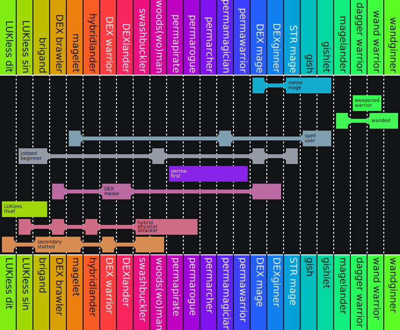

</details>

<details>
<summary>Medium hypergraph rainbow box</summary>

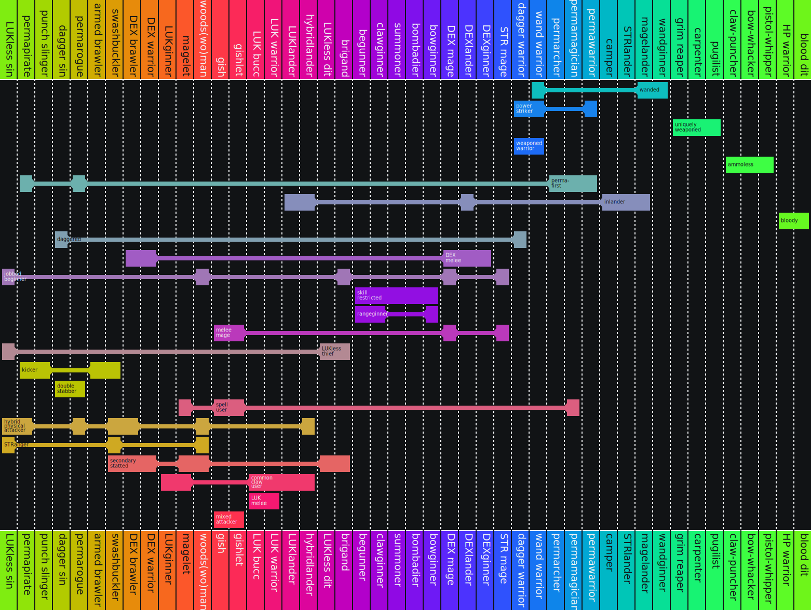

</details>

<details>
<summary>Large hypergraph rainbow box</summary>

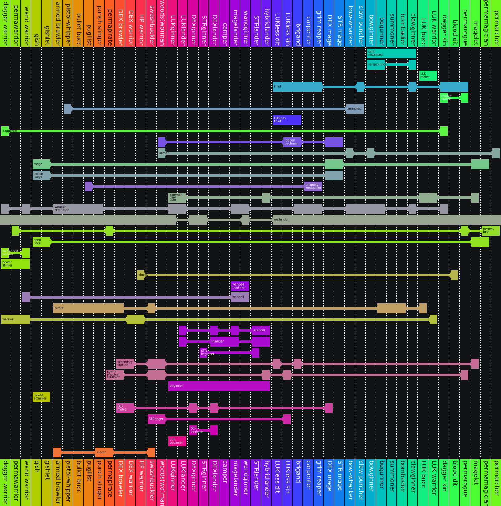

</details>

Cool, right? Maybe?? Please say yes…

[universe]: https://en.wikipedia.org/wiki/Universe_%28mathematics%29
[string]: https://en.wikipedia.org/wiki/String_(computer_science)
[element]: https://en.wikipedia.org/wiki/Element_(mathematics)
[set]: https://en.wikipedia.org/wiki/Set_(mathematics)
[heuristic]: https://en.wikipedia.org/wiki/Heuristic_(computer_science)
[degree]: https://en.wikipedia.org/wiki/Degree_%28graph_theory%29
[incidence]: https://en.wikipedia.org/wiki/Incidence_(graph)
[image]: https://en.wikipedia.org/wiki/Image_(mathematics)
[interval-notation]: https://en.wikipedia.org/wiki/Interval_(mathematics)#Notations_for_intervals
[function]: https://en.wikipedia.org/wiki/Function_(mathematics)
[lm]: https://en.wikipedia.org/wiki/Lumen_(unit)
[point]: https://en.wikipedia.org/wiki/Point_(geometry)
[luma]: https://en.wikipedia.org/wiki/Luma_(video)
[prime]: https://en.wikipedia.org/wiki/Prime_%28symbol%29
[lib]: https://en.wikipedia.org/wiki/Library_(computing)
[cairo]: https://en.wikipedia.org/wiki/Cairo_(graphics)

## woosa finishing up (almost) all of her 4th job quests

My [darksterity knight](https://oddjobs.codeberg.page/odd-jobs.html#dex-warrior) **rusa** has had just a few fourth job skill quests lingering, waiting to be completed.

One of these is the [Power Stance](https://maplelegends.com/lib/skill?id=1321002) quest, which I largely haven’t completed because the party quest (PQ) that you do to complete it, [El Nath Party Quest (ENPQ)](https://maplelegends.com/lib/map?id=921100300), is also the source of numerous skillbooks that cannot be obtained elsewhere. But, if you complete the PQ and get Power Stance, you can never enter the PQ ever again. So a “stanceless 4th job warrior” is required to even obtain such skills. I’ve already gotten two such skills for myself: [Dragon’s Breath](https://maplelegends.com/lib/skill?id=3121003) for my [woodsmaster](https://oddjobs.codeberg.page/odd-jobs.html#woodsman) **capreolina**, and [Infinity](https://maplelegends.com/lib/skill?id=2321004) for my pure [STR bishop](https://oddjobs.codeberg.page/odd-jobs.html#str-mage) **cervid**. But there are some other people who I want to get skillbooks for, as well.

On the other hand, I still had some skill quests that I _could_ complete: to raise the maximum (master) level of [Aura of the Beholder](https://maplelegends.com/lib/skill?id=1320008), and to do the same for [Hex of the Beholder](https://maplelegends.com/lib/skill?id=1320009). I hadn’t finished these earlier because, well, these skills just aren’t important; it’s unlikely that I’ll ever even spend SP on either of them, and I at least got access to them by doing the initial quests to defeat [Thanatos](https://maplelegends.com/lib/monster?id=8170000) and [Gatekeeper](https://maplelegends.com/lib/monster?id=8160000). Plus, the quests are a tad unexciting; they’re just ETC collection quests. But, I figured I’d complete them at some point, and that point was now.

So, I headed to Deep Ludi to fight some [MDT](https://maplelegends.com/lib/monster?id=7130300)s in [Lost Time](https://maplelegends.com/lib/map?id=220070201):


Ooooh, snazzy… a card…


Once I had collected enough [Binding Bridles](https://maplelegends.com/lib/etc?id=4000148) to finish off the 500 that I needed for the final part of the questline, I maxed out my master level for Aura of the Beholder:


The EXP for these quests is… okay. I mean, the monsters that you’re fighting are reasonably high-level and give some halfway-decent EXP, so it’s not too horrible, EPH-wise.

With that, I started the questline to improve the master level of Hex of the Beholder, which meant heading to [WPoT4](https://maplelegends.com/lib/map?id=220060300) for [Spirit Vikings](https://maplelegends.com/lib/monster?id=8141000):

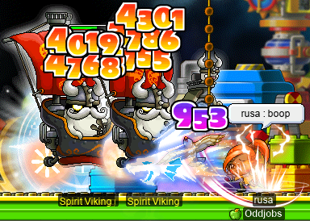

And this time, I was here long enough to actually finish the card set! Nice!!:


I also found [a mastery book](https://maplelegends.com/lib/use?id=2290097) for [Dragon Strike](https://maplelegends.com/lib/skill?id=5121001) level 20. As it turns out, Spirit Vikings are one of only two sources of this mastery book, the other being [Pianus (L)](https://maplelegends.com/lib/monster?id=8520000)!:


I later responded to a [smega](https://maplelegends.com/lib/cash?id=5072000) from an extremely unfortunate buccaneer who had already managed to fail a preposterous number of these exact mastery books (like 8 or 9? Maybe more?? I don’t remember…), and was looking for another one to try. I gave them my book, and it passed!! Yay!!! Congrats ^^

With 200 [Viking Sail](https://maplelegends.com/lib/etc?id=4000134)s collected, I finished the first mastery increase:


And I went back to Spirit Vikings for the 500 sails, as well. But, once I had 5/5 Spirit Viking cards, and was over halfway to 500 sails, I stopped there and simply transferred some sails from capreolina to rusa, to finish the last bit. So that’s done!

## Some special OPQs

I was invited to [OPQ](https://maplelegends.com/lib/map?id=200080101) with fellow **Suboptimal** members **Battlesage** (**Permanovice**, **Dreamscapes**, **Hanger**) the [gish](https://oddjobs.codeberg.page/odd-jobs.html#gish), **kookietann** (**kookiechan**, **kurisuwu**; not actually a member of Suboptimal, anyways, but Battlesage’s partner and a member of **GangGang**), **partyrock** (**xX17Xx**, **drainer**, **attackattack**, **breakcore**, **maebee**, **strainer**, **raving**, **technopagan**), **trishaa**, and **Lvl1Crook** (**xXCrookXx**, **Sangatsu**, **Level1Crook**)! Together, we made a fearsome party of six… I didn’t have any characters that were capable of OPQing, so I took my OPQ mule (and DEXless assassin) **sets**, who is one of only two of my characters not in Suboptimal — she’s in GangGang as well. Here we are, fighting [Father Pixel](https://maplelegends.com/lib/monster?id=9300039) himself:


We had a lot of fun in these PQs!! It took us a few PQs to, uhm, get the whole “do [the lounge](https://maplelegends.com/lib/map?id=920010600) and [the storage](https://maplelegends.com/lib/map?id=920010300) concurrently” thing quite right, but otherwise the runs were quite smooth. I admit, I don’t play my OPQ mule much (I continually regret not making her a [swashbuckler](https://oddjobs.codeberg.page/odd-jobs.html#swashbuckler)…), but these PQs were a ton of fun! sets already does pretty ridiculously high damage (being rather optimally built as she is), but even so, I am a bit excited to see just how quickly she could mow down Father Pixel as a fully mature (i.e. level 70) OPQ mule…

## A lil bossin’

I was fortunate enough to log on just in time for a chance to fight [Ravana](https://maplelegends.com/lib/monster?id=9420014) on my [woodsmaster](https://oddjobs.codeberg.page/odd-jobs.html#woodsman) **capreolina**! I’ve mostly only been logging on to capre for the purpose of boss-fighting (and to fail more [pet HP 60%](https://maplelegends.com/lib/use?id=2048015)s — maybe one day, I will manage to pass one…), as I suppose I’ve found it more productive and inspiring to grind on other characters, leaving capre’s EXP gain up to the bosses. I’ll probably get around to grinding on capre sooner or later, even if only to test various training spots and compare them to [CDs](https://maplelegends.com/lib/map?id=742010203). In any case, I joined a party with **xBowtjuhNL**, **Gruzz**, **Harlez**, and **Bipp** to fight this Hindu villain:


Later, while I was doing the Deep Ludi skill quests on my [darksterity knight](https://oddjobs.codeberg.page/odd-jobs.html#dex-warrior) **rusa**, I was invited to do some [Papu](https://maplelegends.com/lib/monster?id=8500001)s by xBowtjuhNL, so we decided to duo it:


These Papu fights were pretty exciting for me, not just because they got me the [Papulatus Certificate](https://maplelegends.com/lib/etc?id=4001084) that I needed for the [Certificate of the Dragon Squad](https://maplelegends.com/lib/etc?id=4001086) quest (which I now just need the [Zakum Certificate](https://maplelegends.com/lib/etc?id=4001083) for), but because I was actually able to [zerk](https://maplelegends.com/lib/skill?id=1320006) throughout the entirety of both Papulatus Clock fights!! Unfortunately, I was not set up to zerk efficiently through the fights with [Papulatus proper](https://maplelegends.com/lib/monster?id=8500002), but that’s okay; it barely has any HP anyways, and I was probably still zerked like 40% of the time there. It was really cool to be able to zerk against A Real Boss™, without really worrying about dying, even with all of the dispels and 1/1s! Here’s an `@dpm` test that I did during one of these fights, with my usual buffs (including [Cider](https://maplelegends.com/lib/use?id=2022002)), plus xBowtjuhNL’s [SE](https://maplelegends.com/lib/skill?id=3221002) (which helps a lot, thanks to [Crusher](https://maplelegends.com/lib/skill?id=1311001) dealing damage across three 170% damage lines, and thanks to zerk’s damage bonus being an aftermodifier):

")

22.5M DPH against Papulatus Clock! Cool!! Not as much as capre is capable of, but still extremely impressive.

Oh, and we were so fortunate as to get [Soul Teddy Chair](https://maplelegends.com/lib/setup?id=3010026) drops from _both_ runs!!:


Cozy!!!

## More MPQ, with panolia

That’s right — it’s time for more [em peek “U”s](https://maplelegends.com/lib/map?id=261000021) with my [permarogue](https://oddjobs.codeberg.page/odd-jobs.html#permarogue), **panolia**! Speaking of panolia, did you know that _Panolia_ isn’t even a real [genus](https://en.wikipedia.org/wiki/Genus)?? [Eld’s deer (_Rucervus eldii_)](https://en.wikipedia.org/wiki/Eld's_deer) was named _Panolia eldii_ by [English](https://en.wikipedia.org/wiki/England) [zoologist](https://en.wikipedia.org/wiki/Zoology) [John Edward Gray](https://en.wikipedia.org/wiki/John_Edward_Gray) at least as early as [1850](https://en.wikipedia.org/wiki/1850)\*, but at the time (and for over a century to come), the genus [_Cervus_](https://en.wikipedia.org/wiki/Cervus) would include members of what are now considered to be other genera, including [_Axis_][axis], [_Dama_][dama], [_Rusa_][rusa], etc., and most importantly, [_Rucervus_](https://en.wikipedia.org/wiki/Rucervus). Even today, these genera are somewhat controversial, but part of the consensus (that there is) seems to basically be that _Panolia_ and _Rucervus_ are **not** distinct, but _Cervus_ and _Rucervus_ are. Searching for “Panolia” within the [ITIS](https://www.itis.gov/) yields no results whatsoever; the species in question [can be found there as _Rucervus eldii_](https://www.itis.gov/servlet/SingleRpt/SingleRpt?search_topic=TSN&search_value=898210). It can also be found on the ITIS as an “invalid name” under _Cervus eldi_ and _Cervus eldii_, with the former as a “misspelling” and the latter as the “original name/combination” (dating from [1842](https://en.wikipedia.org/wiki/1842)).

Oh, right. MPQ. Well, I was joined by I/L mage **StormSpirit** and F/P mage **HeartNetNing** (with whom I also MPQ’d in a previous entry), as well as [STRginner](https://oddjobs.codeberg.page/odd-jobs.html#str-beginner) **Daddyo**! Here we are, fighting [Fanky](https://maplelegends.com/lib/monster?id=9300139):

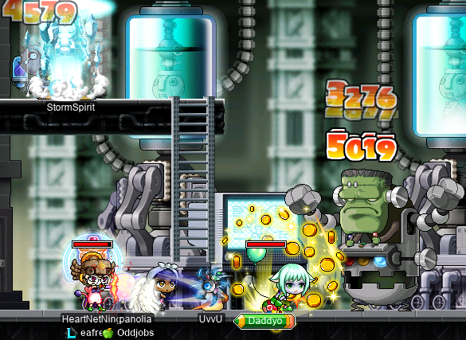

Our PQs went smoothly, with the exception of one where poor HeartNetNing got disconnected before making it to the boss stage :( On the bright side, Daddyo seemed to be having a pretty fun time of it, which contrasts favourably with the experiences I’ve been told of by other permabeginners…

And, at long last, I finished enough MPQs to get panolia’s not first, not second, but _third_ [Horus’ Eye](https://maplelegends.com/lib/equip?id=01122010)! Here’s hoping I can finally get that fabled 5 LUK clean one:

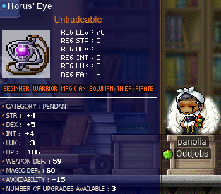

Alright, well, I don’t know what I expected. I’ll just have to [scroll](https://maplelegends.com/lib/use?id=2041212) one of my below-average ones…

<details>
<summary>Footnotes for “More MPQ, with panolia”</summary>

\*J. E. Gray, “Panolia, _Gray_,” in _Catalogue of the specimens of Mammalia in the collection of the British Museum_, vol. 3. London, England: British Museum Nat. Hist. order of the Trustees, 1850, pp. 202–203. Available: <https://archive.org/details/cataloguemammalia03britrich/page/202/mode/2up>

</details>

[axis]: https://en.wikipedia.org/wiki/Axis_(genus)
[dama]: https://en.wikipedia.org/wiki/Dama_(genus)
[rusa]: https://en.wikipedia.org/wiki/Rusa_(genus)

<!-- markdownlint-disable MD026 -->
## I’m back on my old shit. The sadsadgrind.
<!-- markdownlint-enable MD026 -->

Indeed, ’tis time for the grind — but not just any old grind: the sadsadgrind. The grind in which my pure [STR bishop](https://oddjobs.codeberg.page/odd-jobs.html#str-mage) **cervid** and my [darksterity knight](https://oddjobs.codeberg.page/odd-jobs.html#dex-warrior) **rusa** join forces to lay waste to countless [C](https://maplelegends.com/lib/monster?id=9410031)[D](https://maplelegends.com/lib/monster?id=9410030)s. Because the only thing more sad than solo grinding, is duo grinding with yourself.

<details>
<summary>Sadsadgrind</summary>

cervid was reasonably close to the next level, so she was actually the first to level up — to level 125!!:


But, if you think that’s all, you’d be deeply mistaken. I did lots of sadsadgrinding. _L o t s ._ rusa got to level 128~!:


Oh, and cervid levelled up again‽ I wasn’t lying when I said that I did a whole lot of grinding:


And, finally, rusa is now level 129 o\_o:


Only one more level for that sweet, sweet maxed [zerk](https://maplelegends.com/lib/skill?id=1320006)… :)

</details>

## The adventures of ozotoceros

Alright, enough of that outlander nonsense. Let’s get back to the real shit: mucking about on Maple Island. With my [DEXlander](https://oddjobs.codeberg.page/odd-jobs.html#islander), **ozotoceros**!:

<details>
<summary>The adventures of ozotoceros~</summary>

To start, I found myself a nice hat (finally):


That’s right: a perfect clean [White Bandana](https://maplelegends.com/lib/equip?id=01002019). I found a [helm WDEF 60%](https://maplelegends.com/lib/use?id=2040001), as well, so I passed that on the first slot!:

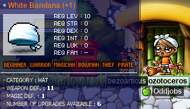

Nice. 11 WDEF is pretty killer, although I noticed that the item description for the scroll falsely claims that it grants +2 MDEF when it passes. Not that it matters for a Maple Islander, of course. I managed to find another three of these scrolls, actually, and failed them all! Wow. Fantastic.

For the first time, I had a chat with [Casey](https://maplelegends.com/lib/npc?id=1012008) (master of [minigames](https://en.wikipedia.org/wiki/Minigame); not to be confused with [Casey](https://maplelegends.com/lib/monster?id=5220000)) of [Amherst](https://maplelegends.com/lib/map?id=1010000) to try my hand at a little minigame crafting. Along with [a set of match cards](https://maplelegends.com/lib/etc?id=4080100), I also made an [omok set](https://maplelegends.com/lib/etc?id=4080000)!:


And, in other news, I completed the entire Monster Book!:


Nice. As it turns out, [Stump](https://maplelegends.com/lib/monster?id=0130100)s tend to be the hardest set to get here. There’s just no good map for them (I got all of mine at [Dangerous Forest](https://maplelegends.com/lib/map?id=1000002); [The Field East of Amherst](https://maplelegends.com/lib/map?id=1020000) technically has slightly more spawns, but that map just kinda sucks in general), and their card drop rate is nothing to write home about.

I also made my most epic item so far:

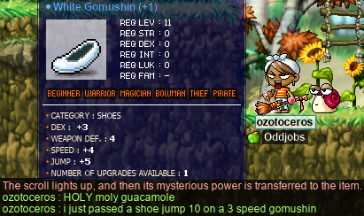

That’s right. I passed a [shoe JUMP 10%](https://maplelegends.com/lib/use?id=2040705) on a 3 SPEED [White Gomushin](https://maplelegends.com/lib/equip?id=01072004)!!! Definitely the coolest item that I have, hands down.

And I met a fellow islander: **tewoo**!:


We met at [the Pigs map](https://maplelegends.com/lib/map?id=1000006), and decided to do the islander quest together. Here we are, grinding some [piggo](https://maplelegends.com/lib/monster?id=1210100)s:


And, after we finished off the rest of the species that we needed, and finished the quest, we had a bit of a chat and played a friendly game of [omok](https://en.wikipedia.org/wiki/Gomoku#Omok):

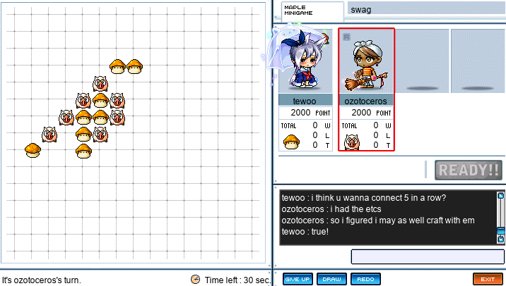

While I was doing the islander quest, I was hunting some [Slime](https://maplelegends.com/lib/monster?id=0210100)s and, after literally thousands of Slime kills, I found my first [GSB](https://maplelegends.com/lib/equip?id=1442029) (at least, the first GSB that I’ve actually seen drop; the one that **kurisuwu** gifted to me notwithstanding):


Wow. Aaaand it’s trash:

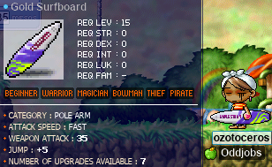

Ouf. Well, not to worry — I found another after just a few hundred more Slime kills! Just kidding, that one’s 35 WATK as well. Heh.

And, at long last, ozotoceros hit the bit level 30!!!:


Yayyy~! Second-job islander!! :D

Not too long after, I encountered the dreaded moment in which my ETC inventory filled up for good:


;~; Well, it seems that my true hoarding days are over…

Speaking of hoarding, let’s take a look at ozotoceros’s stuff. Like the equipment items that I’ve kept:


I NPC any equipment that isn’t equippable by beginners, but I try to keep around at least one of everything else. Some things that I deem more worthwhile, I keep multiple copies of (as you can see, I have quite a few [Amethyst Earrings](https://maplelegends.com/lib/equip?id=01032003), as they are the only earrings available on-island, barring events). Obviously, although these things are equippable by beginners, not all of them are actually useful, _per se_. But, you know, you never know when you might need to help someone complete their stylish outfit, or something.

My USE inventory, on the other hand, I have refused to expand at all. It filled up quite early on, with [Red Potion](https://maplelegends.com/lib/use?id=2000000)s. You’ll see 1.3k such potions below, but I would have much more than that if I actually looted them all:


And, of course, the ETC inventory:

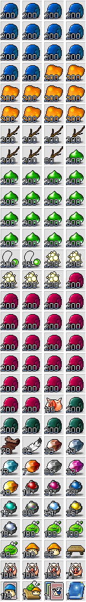

So, you know, if you ever need some ETCs on Maple Island… You know who to pay a visit to…

I’m filthy rich, too:


All of that is pet food money. All of it. **[bezoarticus](https://maplelegends.com/lib/cash?id=5000014)** is gonna be eatin’ good.

And, while we’re at it, let’s take a look at ozotoceros’s character stats. Here they are, with the [Broomstick](https://maplelegends.com/lib/equip?id=01302131) and [Stolen Fence](https://maplelegends.com/lib/equip?id=01092003) equipped:

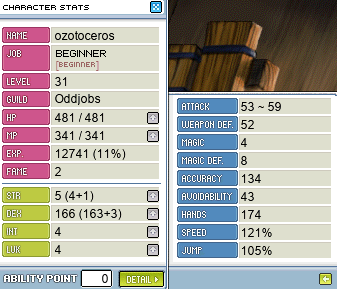

Aaaand with the GSB:

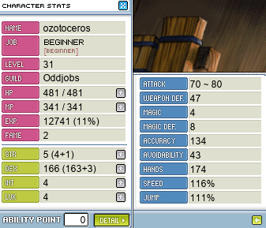

Of course, you can see that my minimum and maximum range are quite a bit higher with the GSB; but my SPEED and my WDEF suffer, so — particularly for the SPEED — I actually use my Broomstick more often. That should change in later levels, when I start to be capable of one-shotting higher-level monsters ([Pig](https://maplelegends.com/lib/monster?id=1210100)s, [Orange Mushroom](https://maplelegends.com/lib/monster?id=1210102)s) with the GSB.

\<3

</details>
