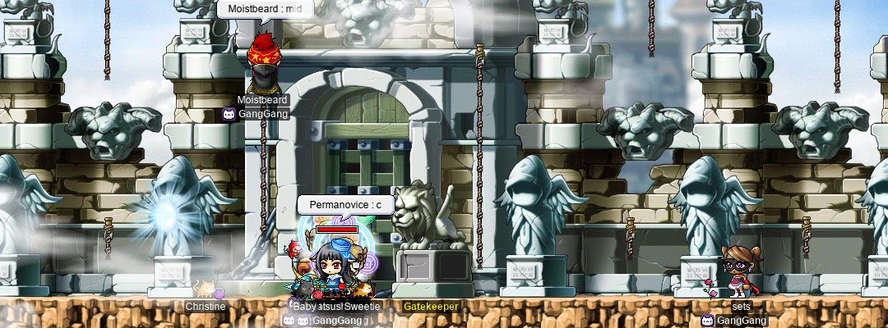
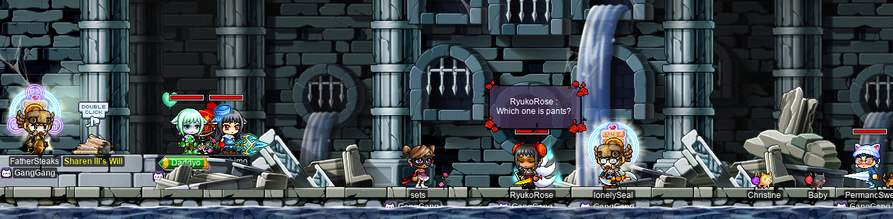

# rangifer’s diary: pt. lxxiii

**NOTE:** Although almost all of my diary entries are rather image-heavy, this one is particularly so. This entry has just over 5 [MiB](https://en.wikipedia.org/wiki/Byte#Units_based_on_powers_of_2) of image data, so, you know, sit back and relax while you wait for the images to load :)

## Taxonomising odd jobs, pt. vi: Forestry. §1

In the previous part (pt. v) of this series, I constructed (by hand) a [hypergraph](https://en.wikipedia.org/wiki/Hypergraph) that groups the members of our odd job [universe][universe] into categories that I thought were relevant. In this [model](https://en.wikipedia.org/wiki/Mathematical_model), the [vertex][vertex] [set][set] is the odd job universe, and the [edge set](https://en.wikipedia.org/wiki/Glossary_of_graph_theory#edge_set) is the set of categories that we are grouping the odd jobs into. Then, I wrote a [program](https://en.wikipedia.org/wiki/Computer_program) that was capable of taking such a hypergraph as its input, and outputting a colourful [SVG](https://en.wikipedia.org/wiki/Scalable_Vector_Graphics) of a [rainbow box](https://en.wikipedia.org/wiki/Rainbow_box) representing said input.

Although we could go further in studying our hypergraph(s) directly — including, but not limited to, trying a different visual aid like [Euler diagrams](https://en.wikipedia.org/wiki/Euler_diagram) — I want to leave pt. v as it is. This part, and parts after it, might (or might not) still make use of the hypergraphs constructed in pt. v, and pt. v already did essentially what it set out to do. So, with that, we can move on to [forestry][tree].

As you might remember from past entries in this series, the idea here is to construct (by hand) a [weak ordering](https://en.wikipedia.org/wiki/Weak_ordering) on our odd job universe, ordering by some suitable notion of “primitiveness”. Then, we can use this weak ordering to constrain the construction (again, by hand) of a rooted forest that _imitates_ a [phylogenetic tree](https://en.wikipedia.org/wiki/Phylogenetic_tree) — or [disjoint union](https://en.wikipedia.org/wiki/Disjoint_union_of_graphs) of phylogenetic trees, as the case may be. I _also_ want to explore the use of a slightly different structure (different from this rooted forest model), but that can come later.

Just as a little refresher on what a “weak ordering” is, it’s intuitively the kind of ordering that you get when you rank things. The ranks themselves are [totally ordered](https://en.wikipedia.org/wiki/Total_order), meaning that if you have any two distinct ranks, then one rank is higher than the other. But the things that we’re (weakly) ordering might occupy the same rank. If two things are of the same rank, then they are “tied” (in the sense of a “dead heat”) within the weak ordering. We will use “≲” to symbolise weak orderings: “_a_ ≲ _b_” means that _a_ is less than _b_, [or](https://en.wikipedia.org/wiki/Logical_disjunction) _a_ is tied with _b_. We say that _a_ is “tied with” (or “equivalent to”) _b_ [iff](https://en.wikipedia.org/wiki/If_and_only_if) _a_ ≲ _b_ [and](https://en.wikipedia.org/wiki/Logical_conjunction) _b_ ≲ _a_. Each “rank” is an [equivalence class](https://en.wikipedia.org/wiki/Equivalence_class). Any [strict partial order](https://en.wikipedia.org/wiki/Partially_ordered_set) whose incomparability ([¬](https://en.wikipedia.org/wiki/Negation)(_a_ [\<](https://en.wikipedia.org/wiki/Partially_ordered_set) _b_ [∨](https://en.wikipedia.org/wiki/Logical_disjunction) _b_ \< _a_)) [relation](https://en.wikipedia.org/wiki/Binary_relation) is [transitive](https://en.wikipedia.org/wiki/Transitive_relation) induces a weak ordering, where [equivalence](https://en.wikipedia.org/wiki/Equivalence_relation) is defined as incomparability. Alternatively, a weak ordering is just a total ordering in which we remove the [antisymmetry](https://en.wikipedia.org/wiki/Antisymmetric_relation) requirement; i.e. it’s **not necessarily** true that _a_ = _b_ just because _a_ ≲ _b_ [∧](https://en.wikipedia.org/wiki/Logical_conjunction) _b_ ≲ _a_.

To write out the weak ordering that we want, we must first decide how to write it. As usual, I’ll be using [RON](https://github.com/ron-rs/ron) as a human-readable [serialisation](https://en.wikipedia.org/wiki/Serialization) format, to keep the format computer-readable, human-readable, and unambiguous. Because a weak ordering can be thought of as a total ordering over zero or more equivalence classes, we can write our weak ordering as a list ([delimited](https://en.wikipedia.org/wiki/Delimiter) by square brackets: `[`…`]`) of equivalence classes. RON only has one kind of homogeneous collection: the list. There exists no dedicated [syntax][syntax] for [sets][set] (if you were so inclined, you could technically use a [map](https://en.wikipedia.org/wiki/Associative_array) where all values are of the [unit type](https://en.wikipedia.org/wiki/Unit_type)…), nor for [unordered lists](https://en.wikipedia.org/wiki/Multiset) (if you were so inclined, you could technically use a map where all values are positive [integers](https://en.wikipedia.org/wiki/Integer)…). So each equivalence class will be represented by a list, as well. Then, we can just refer to each odd job by name, so each odd job is just a [string][string] (delimited by double quotation marks: `"`…`"`). The result is something manifestly of [type](https://en.wikipedia.org/wiki/Type_theory) `[[String]]`, or `List<List<String>>` (better yet: `List<NonemptyList<String>>`), or whatever you wanna call it. Oh, and the list will proceed in _descending_ order of “primitiveness” (i.e. it will be more or less chronological).

I started writing out the ordering from the beginning, i.e. the most primitive jobs. I started with just three equivalence classes:

1. Pre-historic jobs.
2. The other OGs, i.e. any odd job that is one of the most primitive, but we can’t necessarily conclude that it’s old enough to be “pre-historic”.
3. Other jobs that we know are very old, but probably came later. Or, jobs that were directly induced by items/jobs that existed from the beginning.

Some interesting picks here are:

- Gish is included in the second equivalence class listed above, because historical notions of “STR mage” included any mage with a significant amount of STR. Also, gishes are easy to stumble upon, e.g. if you add some STR to make early levels easier.
- Grim reaper and carpenter are placed into the third equivalence class listed above, due to being directly induced by weapons that have existed in the game since [pre-beta development versions](https://en.wikipedia.org/wiki/Software_release_life_cycle). It’s unclear where to put these, as one could argue that the odd job has to actually be _played_ (or, at the very least, explicitly theorised) at the time of its supposed origin. I have no concrete evidence that anyone ever played a “grim-reaper-type-job” or “carpenter-type-job” before Big Bang. _However_, because these odd jobs are directly induced by their weapons, anyone who _seriously uses_ the [Scythe](https://maplelegends.com/lib/equip?id=1312002) is effectively a grim reaper, by our definition of “grim reaper”.
- LUKless sin is placed into the third equivalence class listed above, due to brigand being placed into the equivalence class before it.
- Magelander is placed into the third equivalence class listed above, due to being induced by the [Metal Wand](https://maplelegends.com/lib/equip?id=1372002) being in the droptable of the [Red Snail](https://maplelegends.com/lib/monster?id=130101).

From there, I added a fourth equivalence class after all of these. It corresponds to odd jobs that don’t fit into one of the prior equivalence classes, but have isolated historical attestation (that I know of). By “isolated”, I just mean any documents that exist outside of odd job lists (e.g. [**GunDelHel**’s][gundelhel]), and outside of compilations of older material.

Then, I took a look at the two major compilations that I’ve been referencing throughout this series: GunDelHel’s “[General List of Experimental Classes][gundelhel]”, and **Alyssaur**’s “[Alyssaur’s Kind of Unnecessary Compilation of Unusual Builds](https://mapleroyals.com/forum/threads/alyssaurs-kind-of-unnecessary-compilation-of-unusual-builds.32333/)” ([archived][alyssaur-archived]). I took the remaining odd jobs that were not already in one of the four equivalence classes mentioned above, and split them into three groups:

- Present in both GunDelHel’s and Alyssaur’s lists:
    - permawarrior
    - permamagician
    - permarcher
    - permarogue
    - permapirate
    - LUKless dit
    - swashbuckler
    - wand warrior
    - magelet
    - DEX brawler
- Present in GunDelHel’s list, but not Alyssaur’s:
    - wandginner
    - pugilist
    - armed brawler
    - clawginner
    - summoner
    - begunner
    - bowginner
- Present in neither GunDelHel’s nor Alyssaur’s lists:
    - LUKginner
    - dagger sin
    - bullet bucc
    - LUK bucc
    - DEX mage
    - DEXginner
    - gishlet
    - LUKlander
    - pistol-whipper
    - claw-puncher
    - bombadier
    - punch slinger

I broke these three groups down into a small number of equivalence classes each, and extracted some to put elsewhere. Several of the jobs are present in neither GunDelHel’s nor Alyssaur’s lists, simply due to issues of definition. I placed three of these — DEX mage, DEXginner, and gishlet — into their own “definition-wrangling” equivalence class because they all have very primitive analogues (STR mage, STRginner, and gish, respectively), but technically aren’t included explicitly in GunDelHel’s nor Alyssaur’s lists, just because their lists are not as fine-grained. I placed two more of these — LUKginner and LUKlander — into their own “rely on common claws” equivalence class, because they have pre-historical analogues (permabeginners and islanders, respectively), and just need common claws to exist in the game in order to become their own jobs.

The final (least primitive) equivalence class contains:

- dagger sin,
- bullet bucc,
- LUK bucc,
- pistol-whipper,
- bombadier,
- and punch slinger…

…These are the odd jobs that I suspect were genuinely concocted by **Oddjobs**.

You can find the resulting RON file at [weak\_ordering\.ron](weak_ordering.ron), and I’ve also reproduced a copy of it below:

```rust
[
    // Pre-historic ’ginners
    ["STRginner", "STRlander", "DEXlander", "hybridlander"],
    // The other original odd jobs
    ["camper", "HP warrior", "STR mage", "gish", "brigand", "woods(wo)man"],
    // Induced or slightly-later-than-original jobs
    [
        "dagger warrior",
        "grim reaper",
        "carpenter",
        "LUKless sin",
        "magelander",
        "DEX warrior",
    ],
    // Jobs with isolated (non-compiled) historical evidence AFAIK
    ["blood dit", "LUK warrior", "bow-whacker"],
    // Jobs that rely on common claws
    ["LUKginner", "LUKlander"],
    // Present in both GunDelHel’s and Alyssaur’s lists
    [
        "permawarrior",
        "permamagician",
        "permarcher",
        "permarogue",
        "permapirate",
    ],
    ["LUKless dit", "swashbuckler", "wand warrior", "magelet", "DEX brawler"],
    // Definition-wrangling jobs
    ["DEX mage", "DEXginner", "gishlet"],
    // Present in GunDelHel’s list, but not Alyssaur’s
    ["wandginner", "pugilist", "armed brawler"],
    ["clawginner", "begunner", "bowginner"],
    ["summoner"],
    // Present in neither GunDelHel’s nor Alyssaur’s lists
    ["claw-puncher"],
    [
        "dagger sin",
        "bullet bucc",
        "LUK bucc",
        "pistol-whipper",
        "bombadier",
        "punch slinger",
    ],
]
```

[universe]: https://en.wikipedia.org/wiki/Universe_%28mathematics%29
[vertex]: https://en.wikipedia.org/wiki/Vertex_(graph_theory)
[set]: https://en.wikipedia.org/wiki/Set_(mathematics)
[tree]: https://en.wikipedia.org/wiki/Tree_(graph_theory)
[syntax]: https://en.wikipedia.org/wiki/Syntax_(programming_languages)
[gundelhel]: https://web.archive.org/web/20200217044826/http://www.basilmarket.com/Other-General-List-of-Experimental-Classes-Wiki-2993
[alyssaur-archived]: https://web.archive.org/web/20210101092152/https://mapleroyals.com/forum/threads/alyssaurs-kind-of-unnecessary-compilation-of-unusual-builds.32333/

## panolia @ MPQ: the final chapter

It is time, once again, for the adventures of my [permarogue](https://oddjobs.codeberg.page/odd-jobs.html#permarogue) **panolia**… at [MPQ](https://maplelegends.com/lib/map?id=261000021)!! This time, featuring **Hanger** (the WK [PPQ](https://maplelegends.com/lib/map?id=251010404) mule of **Permanovice**, **Dreamscapes**, **Battlesage**) and **pengwing** of **GangGang**!


We did a lot of MPQs. A lot. In fact, within a single unbroken session (with only a few bathroom/snack breaks here and there), we completed _14_(!) MPQs… For me, it was more like 13\.5 MPQs, as the game crashed during one of them, thanks to everyone’s favourite stage (stage 5)…

Some of these PQs, we did with **Pearlx**:


And that was enough to shoot panolia up to level 85 and some ≈70% EXP or so! o\_o

So, just one session later, I did three more MPQs with the krew — and so, panolia is now level 86!!! Finally graduated from MPQ~ :)


I made a promise to myself a while ago — before panolia was even featured in this diary for the first time — that I would wash out all of my base INT as soon as I hit level 86. Now, that’s not a lot of base INT — panolia has always had 40 base INT — but I was pleased to bankrupt the NX on this account to get myself a healthy 36 extra base LUK ^^


(Those [gach ticket](https://maplelegends.com/lib/cash?id=5220000)s are just a few of the ones that my DEXlander **ozotoceros** has generated!)


Stronk!!!! I had to test it out, at least a little. Here’s panolia with just a [Cider](https://maplelegends.com/lib/use?id=2022002), fighting some [Neo Huroid](https://maplelegends.com/lib/monster?id=5110302)s:


_Y i k e s_ … That is indeed a \>4\.3k damage line in that image, meaning that panolia is realistically capable of dealing ≥8\.6k damage with a single [L7](https://maplelegends.com/lib/skill?id=4001344)… Wowie.

## GPQing for the first time ever!

I noticed in the **GangGang** [Discord](https://medium.com/tenable-techblog/lets-reverse-engineer-discord-1976773f4626) that **Permanovice** (**Hanger**, **Dreamscapes**, **Battlesage**) was recruiting for the [Sharenian Party Quest (SPQ)](https://maplelegends.com/lib/map?id=990000000) (a.k.a. Guild Party Quest, or GPQ). I have a character in GangGang — **sets**, my pure LUK assassin [OPQ](https://maplelegends.com/lib/map?id=200080101) mule — so I tentatively signed up, with the understanding that I’d join if I was online at the time (whenever they did schedule a time). Fortunately for me, when the day came, I was online at the time — so I took sets to Perion to try this PQ out for the first time in my Maple career! I wasn’t sure exactly what to expect, obviously, but I was excited to try it out, and I read a little guide beforehand so that I might understand some of what was going on.

Here’s the SPQ gang, all ready to PQ it up:

<details>
<summary>SPQ~</summary>


The first part was just getting some [Protector Rock](https://maplelegends.com/lib/equip?id=1032033)s to protect us from being instantly killed by the, uhm, terrible smell that permeates all of SPQ… or something like that. I’m not sure how it works, but just trust me when I say that you want these earrings on at all times, unless you have a death wish.


Stage 1 is a bit of a puzzle — really, it’s just a game of [Simon Says](https://en.wikipedia.org/wiki/Simon_Says). There’s a bunch of statues, and they light up in some sequence. The job of the players, then, is to echo that sequence, by hitting the statues in the same sequence. One thing that makes this more difficult is how large the map is. You can’t have all of the statues on your screen at once, so this requires at least some teamwork:



The first time we tried this… was suffering. It was pretty embarrassing. Just generally confused communication, and people who weren’t sure how the stage was supposed to work, and all that. Eventually, you know, we managed to do it. Eventually.

Having drained a lot of time off the clock, we headed to stage 2. This stage requires getting four giant red spears, and placing them in their proper places. Their proper places, of course, are each at the top of a JQ. Oh, and getting the spears isn’t trivial, either. One requires both [Teleport](https://maplelegends.com/lib/skill?id=2201002) and [Dark Sight](https://maplelegends.com/lib/skill?id=4001003)/[Oak Barrel](https://maplelegends.com/lib/skill?id=5101007):


The rock guys that you see above are invincible, and deal like 35k touch damage, or something like that. I had to bypass them in order to open the door at the end of the hallway. The key to that door, though, can only be obtained by a mage with Teleport. So, once **Flai** handed the keys to me, I headed into that thief portal. Inside is nothing special; you just take the spear and get out.

The other three spears are, as you might expect, at the top of some JQs. I tried one of these JQs myself:


In order to get into the room that has the thief portal, you actually have to kill some not-so-invincible rock guys for yet another key. On another GPQ attempt, without Flai [Blizzard](https://maplelegends.com/lib/skill?id=2221007)ing the rock guys into smithereens, I had a go at killing some of these myself:


[The Room of Justice](https://maplelegends.com/lib/map?id=990000440) harbours all four pedestals onto which the spears must be placed. So I climbed one of the JQs (one that “requires [Haste](https://maplelegends.com/lib/skill?id=4101004)”, i.e. max-ish SPEED and JUMP), and tried placing a spear:


The next stage is the “[Mastermind][mastermind]” stage, which is based on the game of [Bulls & Cows](https://en.wikipedia.org/wiki/Bulls_and_Cows). There are wines, foods, badges, and scrolls, which can be obtained by killing some black cloth ghosts:


…as well as by completing some JQs and breaking some boxes. This one really is a puzzle stage, and it’s pretty fun. Somewhat in the spirit of the [Sealed Room](https://maplelegends.com/lib/map?id=920010500) stage in OPQ, or stages [2](https://maplelegends.com/lib/map?id=670010300) and [3](https://maplelegends.com/lib/map?id=670010400) of APQ, this puzzle involves guessing a [string][string] that is [randomly](https://en.wikipedia.org/wiki/Discrete_uniform_distribution) & [secretly][key] generated by the game, wherein each guess reveals information about how close your guess is to the correct string. In this case, the [alphabet][alphabet] is {wine, food, badge, scroll}, and the string always has a length of exactly 4. Each time that we make a guess, the game reports two numbers:

- How many positions in the string are correct ([Hamming distance](https://en.wikipedia.org/wiki/Hamming_distance)),
- and how many positions in the guess string are guessed incorrectly, but nevertheless correspond to a [character][char] somewhere in the correct string.

The latter is something like the number of characters that are just “misplaced” — other incorrect positions in the guess string are just totally wrong. If a guessed character is in the correct string, but is in the “wrong position”, it only counts towards the number of “misplaced” characters if it can be placed in correspondence with a position in the original that isn’t already accounted for. By “accounted for”, I mean that it’s already in correspondence with some other position within the guessed string. For example, if the correct string is `WWSB`, and the guessed string is `WFWW`, then we have:

- 1 correct position (Hamming distance of 3),
- and 1 misplaced character.

Even though we guessed a `W` the final position (which should be a `B`), and the correct string does indeed have \>0 `W`s in it, it doesn’t count towards the number of misplaced characters. This is because both `W`s in the correct string are already accounted for — they correspond to the first and third characters in the guessed string, respectively.

sets was already really close to level 63, so I accidentally levelled up during this stage:


Next up, we had to venture into the sewers of SPQ:



This stage is basically a couple more JQs (four, to be exact) that must be completed to obtain each piece of [Sharen III](https://maplelegends.com/lib/npc?id=9040003)’s clothing. That is, in order:

1. [shoes](https://maplelegends.com/lib/etc?id=4001032),
2. [pants](https://maplelegends.com/lib/etc?id=4001031),
3. [top](https://maplelegends.com/lib/etc?id=4001033),
4. [crown](https://maplelegends.com/lib/etc?id=4001034).

It was my job to get the shoes, as this JQ requires Haste. Luckily for me, I was very used to jumping through conveyor belts at high speeds, thanks to the “thief” portal in MPQ…


And with that, we could fully clothe our guy Sharen:


At this point, we had to do the infamous sacrificing. In order to open the gate to fight our big bad guy [Ergoth](https://maplelegends.com/lib/monster?id=9300028), a Protector Rock must be placed onto the doorstep. But Protector Rocks are OOAK\*, so the only way to satisfy this requirement is to [kermit sewer slide][le-suicide]… Luckily, **Daddyo** (**Dexual**) brought along a [KPQ](https://maplelegends.com/lib/map?id=103000800) mule (which is also necessary to get one of the pieces of Sharen III’s clothing, as that JQ requires a level ≤30 character), so he simply sacrificed the mule:


Oh, oops. Turns out, you can’t just take the earrings off, and then drop them. Because by the time you go to drop them, you’re already dead. You have to drag them directly out of your “EQUIPMENT” window. Luckily, when you die in SPQ, you just get respawned at the beginning. So we waited for him to walk back, and after the success of the second sacrificing, we stepped in to the throne room:


As you can see, I am up on the balcony, safe from any Ergoths or [statue](https://maplelegends.com/lib/monster?id=9300031)s. You can enter the throne room in one of two ways: through the big gate, or through a crack in the wall. Those (like sets, who has a measly 2k MAXHP) who can’t take the heat, can simply not enter the kitchen, by going in through the crack, and ending up on the balcony, safely above the fight. Although, if you go too far to the right side of the balcony, you do get hit for a little over 1k damage by the spikes…


R\.I\.P. Permanovice & **lonelySeal**…

The bonus stage is kind of like [the OPQ bonus stage](https://maplelegends.com/lib/map?id=920011100), but horizontal. That is to say, it’s bad. I didn’t do a very good job scrambling around and hitting crates, but I think I got like 100 NX or something. In any case, it really didn’t matter. I may have gotten a trivial barely-nonzero amount of EXP, and hardly any other rewards, but I got to do SPQ for the first time! And I thought it was a lot of fun!! I was talking to Permanovice afterwards, and we agreed that we’d have to reconsider our personal rankings of the MapleStory PQs. Clearly, SPQ is the best of them all. I will continue to do the occasional SPQ, even if just for the fun of it, and I really hope that **Oddjobs** can start SPQing as well!! :D

</details>

<details>
<summary>Footnotes for “GPQing for the first time ever!”</summary>

\*One of a kind.

</details>

[mastermind]: https://en.wikipedia.org/wiki/Mastermind_%28board_game%29
[string]: https://en.wikipedia.org/wiki/String_(computer_science)
[key]: https://en.wikipedia.org/wiki/Key_(cryptography)
[alphabet]: https://en.wikipedia.org/wiki/Alphabet_(formal_languages)
[char]: https://en.wikipedia.org/wiki/Character_(computing)
[le-suicide]: https://en.wikipedia.org/wiki/Suicide_(Durkheim_book)

## Grrrrrrrrrrrrrrrrrrrrrrrrrrrrrrrrind

It’s time for more outlander g—g—g—grind. First up, I hit level 130 on my [darksterity knight](https://oddjobs.codeberg.page/odd-jobs.html#dex-warrior) **rusa**!!:


Yay!!! That means max [zerk](https://maplelegends.com/lib/skill?id=1320006)! :O The moment I’ve been waiting for… So stronk…

Oh, and I figured that as long as I was spending some SP on [MR](https://maplelegends.com/lib/skill?id=2321002) on my pure [STR bishop](https://oddjobs.codeberg.page/odd-jobs.html#str-mage) **cervid**, I may as well try passing an [MR20](https://maplelegends.com/lib/use?id=2290024)…


Ouf. That was my only one!! Oh wait, turns out they’re worthless. Time to buy one for 3k mesos on the [FM](https://maplelegends.com/lib/map?id=910000000)…


Very nice.

Now that rusa had maxed zerk, I felt comfortable trying out [7 F of the Sutra Depository](https://maplelegends.com/lib/map?id=702070400) for the first time, accompanied by **Harlez**, **xBowtjuhNL**, and **Gruzz**!


Whew. That’s a lot of numbers. And they still won’t die!! I did a quick `@epm` test while we were… erm… quartet-ing 7 F, and got results roughly a factor of 1\.5 higher than my usual EPH [at CDs](https://maplelegends.com/lib/map?id=742010203)!:


rusa has been sadsadgrinding CDs as her main source of EXP since what… level 90? I mean, sheesh. That’s a lot of very sad grinding. So trying out a totally new location was a very welcome change of pace. Here’s a better image of the kind of damage rusa was capable of dishing out with some [SE](https://maplelegends.com/lib/skill?id=3221002) and [Cider](https://maplelegends.com/lib/use?id=2022002):


Wowie… The occasional ≥10k critical damage line that I’d land on a [Wooden Fish](https://maplelegends.com/lib/monster?id=9600018) was exhilarating. I tried using my [PSB](https://maplelegends.com/lib/equip?id=1442057) with [Fury](https://maplelegends.com/lib/skill?id=1311004), but especially with the SE being so favourable for [Crusher](https://maplelegends.com/lib/skill?id=1311001), and with so many people on the map, I went with my [Sky Ski](https://maplelegends.com/lib/equip?id=01432018)s instead.

We took a break to attend a wedding between **poop** and **Missgalaxy**:


…After which, we all turned in our [Onyx Chest](https://maplelegends.com/lib/etc?id=4031423)s for the same exact reward: [Pink Bandana](https://maplelegends.com/lib/equip?id=1002393)s!!:


\#pinkdanagang

Later, I went back to ye olde CDs, and rusa hit level 131 o\_o:


I was invited to try out some grinding [at Petrifighters](https://maplelegends.com/lib/map?id=541020500) with Gruzz, who trains there as his main training spot. I figured I’d give it a go, and see if my Fury could stand up to Gruzz’s [Blizzard](https://maplelegends.com/lib/skill?id=2221007):


I found myself mostly staying along the lower-left “L” shape of the map, i.e. the bottom row and left wall. An `@epm` test revealed that this was quite impressive EXP-wise, if perhaps a bit spendy meso-wise…:


21M EPH… _whew_.

## ozotoceros vs. the entire population of Maple Island

It’s time for more Maple Island adventures, with your host, **ozotoceros**! :)

<details>
<summary>Maple Islandventures~</summary>

I met **Daddyo**’s islander, **Dexual**!:


Dexual is, as the name implies, a DEXlander. Although I think he’s adding STR up to 20 base STR, in order to equip the [Leather Purse](https://maplelegends.com/lib/equip?id=01322007), he should be able to one-shot [Orange Mushrooms](https://maplelegends.com/lib/monster?id=1210102) 100% of the time soon enough. And don’t treat the above image as representative of Dexual’s appearance — Dexual and I have now done the islander quest quite a few times, so I’ve seen him go through many faces (and hairs)…

Speaking of the islander quest, perhaps the most annoying bit is going all the way to [Snail Hunting Ground II](https://maplelegends.com/lib/map?id=40001) for those pesky [Snail](https://maplelegends.com/lib/monster?id=100100)s\*…


I can’t see the Snails, with all of their cards in the way!!

I met another islander, **yotta**, who was kind enough to gift me a 43 WATK [GSB](https://maplelegends.com/lib/equip?id=1442029)!!!:


:D So I gifted yotta something, as well: some 4 or 5 (I can’t remember exactly) [Blue One-lined T-Shirt](https://maplelegends.com/lib/equip?id=1040013)s!:


These were some pretty good shirts; the one that wasn’t 1 below perfect was perfect.

As I was exiting the [Amherst Department Store](https://maplelegends.com/lib/map?id=1010003), I ran into someone by the name of **wgfarmer30**, who asked me about the [Protect Lucas’s Farm](https://www.hidden-street.net/gms/quest/protect-lucass-farm) quest. wgfarmer30 had this name because he was the 30th(!) attempt at getting a [YWG](https://maplelegends.com/lib/equip?id=1082145) from said quest, and as he saw me exit the department store, he stopped me to ask if the quest even gave YWGs at all. Luckily for him, I have a bit of experience with this quest… As some readers may remember from pt. lx of this diary, I was doing the exact same thing to get a YWG for my vicloc [clericlet](https://oddjobs.codeberg.page/odd-jobs.html#magelet) **d33r**. After 15 unsuccessful tries, I changed my tactic, ensuring that my INT was always my highest base stat by the time that I finished the quest, instead of just going pure STR. After just three more tries, I got the YWG that I wanted. This wasn’t enough data to reasonably believe that the INT+STR tactic was actually having an effect, but I didn’t care that much, because I got what I wanted. So, I told wgfarmer30 about this, and he said that he’d give it a go, as he was running out of hope anyways, and was just glad to hear from me that it _is_ in fact possible to get a YWG from this quest:


Some 15 minutes or so later, I received a whisper from a mysterious individual by the name of **wgfarmer31**:


Wow. It took just one try, after changing the tactic. Congrats! As it turned out, wgfarmer was trying to get a YWG so that they could use it for their perfectlander **Leozinho**!:


Oh, and I levelled up to level 32 c:


I figured that now was the time to finally try out the mythical [Myo Myo the Travelling Salesman](https://maplelegends.com/lib/cash?id=5450000). I’d never used a Myo Myo before, but I was vaguely aware of Myo Myo selling some juicy things for islanders. So I took a look:


As it turns out, the real juicy stuff comes in [test tubes](https://en.wikipedia.org/wiki/Test_tube):

- [Dexterity Potion](https://maplelegends.com/lib/use?id=2002000)s give +5 AVOID for 3 minutes,
- [Warrior Potion](https://maplelegends.com/lib/use?id=2002004)s give +5 WATK for 3 minutes,
- and [Speed Potion](https://maplelegends.com/lib/use?id=2002001)s give +8 SPEED for 3 minutes!

Oh ho ho… it looks like ozotoceros is about to be moving faster, and one-shotting everything two or three levels earlier! In fact, with the Warrior Potions, I was already able to one-shot everything on the island 100% of the time, at just level 32! And a +8 SPEED buff really doesn’t hurt…

I did some fun trio grinding/questing with Dexual and **Dreamscapes** (**Permanovice**, **Battlesage**, **Hanger**):


We had the usual islander chit-chat, talking about equipment and stuff…


And I hit level 33~!:


We also met up with **Subcortical** (**Cortical**, **Aphasia**, **GishGallop**, **xXcorticalXx**, **SussyBaka**, **CokeZeroPill**), who had some setup items left over from last [Xmas](https://en.wikipedia.org/wiki/Christmas) event:


And, together, we formed The Maple Island Greeting & Onboarding Committee™, tasked with ambushing new players by going to their map and then changing to their channel all at once:


Unfortunately for us, none of the new players whom we ambushed were islanders. But we did our job: they felt welcomed, greeted, startled, and we gave them ETCs to send them on their way :)

I also got to train with Leozinho, once they got to a high enough level to start using the GSB, and start dealing some serious hurt:


And, finally, ozotoceros is now level 35 :3


</details>

<details>
<summary>Footnotes for “ozotoceros vs. the entire population of Maple Island”</summary>

\*Not to be confused with “snails”, which can be used to refer collectively to [Snail](https://maplelegends.com/lib/monster?id=100100)s, [Blue Snail](https://maplelegends.com/lib/monster?id=100101)s, [Red Snail](https://maplelegends.com/lib/monster?id=0130101)s, and sometimes even more exotic monsters like [Mossy Snail](https://maplelegends.com/lib/monster?id=4250000)s. Sometimes (if I can remember), I like to refer to Snails as “green snails”, to avoid confusion…

</details>

## stab stab

In a [Ravana](https://maplelegends.com/lib/monster?id=9420014) run that I did with **Harlez** and **xBowtjuhNL**, a perfect clean [Cursayer (’Sayer)](https://maplelegends.com/lib/equip?id=1332026) dropped. I said that I could try scrolling it for my [daggermit](https://oddjobs.codeberg.page/odd-jobs.html#dagger-assassin) **alces**, to attempt to beat the 109 WATK ’Sayer that she’s been using for a while. So I did just that!:


Sick :3

I used this new ’Sayer to fight some [Fancy Amplifier](https://maplelegends.com/lib/monster?id=9410029)s, grinding with [permarogue](https://oddjobs.codeberg.page/odd-jobs.html#permarogue) extraordinaire **xX17Xx** (**drainer**, **partyrock**, **attackattack**, **maebee**, **strainer**, **raving**)!:


As you can see, I tried doing the whole “buffs in the [FM](https://maplelegends.com/lib/map?id=910000000)” thing, but not just with my [STR bishop](https://oddjobs.codeberg.page/odd-jobs.html#str-mage) **cervid** this time. I also had my [woodsmaster](https://oddjobs.codeberg.page/odd-jobs.html#woodsman) **capreolina** tag along in the FM as well, so we got [SE](https://maplelegends.com/lib/skill?id=3121002)… I think the biggest damage line that I managed with my [Double Stab](https://maplelegends.com/lib/skill?id=4001334) was somewhere in the 9\.2k range O\_O

That means I could technically (if I were ever so lucky) deal \>18k damage to a [Fancy Amp](https://maplelegends.com/lib/monster?id=9410029) with a single Double Stab with SE… _Yikes._

## ENPQ: the final chapter

Now that my [darksterity knight](https://oddjobs.codeberg.page/odd-jobs.html#dex-warrior) **rusa** is getting higher up in level, the time is approaching where I will have nothing better to spend my SP on than [Power Stance](https://maplelegends.com/lib/skill?id=1321002) — certainly amongst the most important tools in any fourth-job warrior’s arsenal. The funky thing about Stance, though, is that it can only be obtained through a questline, and the end of said questline is a PQ ([El Nath](https://maplelegends.com/lib/map?id=211000000) Party Quest, or ENPQ) that any fourth-jobber can join, so long as the Stance-less warrior is present as well. Well, that’s not even the really funky part — the _really_ funky part is that the monsters in ENPQ are _the only source_ of the following skillbooks, each of which is absolutely required for anyone who wants to learn the corresponding skill:

- [Taunt](https://maplelegends.com/lib/use?id=2280006),
- [Infinity](https://maplelegends.com/lib/use?id=2280004),
- and [Dragon’s Breath](https://maplelegends.com/lib/use?id=2280005).

There were still some folks who I wanted to get these skillbooks for, so I had some ENPQing to do:

<details>
<summary>ENPQing</summary>

First up was getting Taunt for **Harlez**, and Dragon’s Breath for **xBowtjuhNL**:


And then, Infinity for F/P [archgish](https://oddjobs.codeberg.page/odd-jobs.html#gish) **LawdHeComin**:


And, finally, Infinity for **Gruzz** as well!:


With that, I decided that we should go into ENPQ just one last time, and finally get rusa her Stance, thus graduating her from the title of “Stance-less warrior”. I had actually never seen the end of ENPQ, so I wasn’t really sure what to expect. Every time that I had entered ENPQ before (which was many times), I always let [Tylus](https://maplelegends.com/lib/npc?id=2020008) die, either unintentionally… or intentionally…


Oh, okay. Right. Well, that’s the whole PQ, I guess. You just protect Tylus from some [Lycanthropes](https://maplelegends.com/lib/monster?id=9300095) and [crogs](https://maplelegends.com/lib/monster?id=9300094) until the timer gets down to 3:00 or less… and then you leave!


After all this time, with Tylus dying… repeatedly… under my “protection”… he still had it in his heart to trust me. Some would say that this crosses the line from forgiveness to stupidity, but I’m flattered. Oh, and I get Power Stance!! Well, I’ve not spent any SP in it _quite_ yet, but soon~!

</details>

## sorts, reporting for duty

I hopped onto my [DEX brawler](https://oddjobs.codeberg.page/odd-jobs.html#dex-brawler) [LPQ](https://maplelegends.com/lib/map?id=221024500) mule **sorts** to help out fellow **Oddjobs** member **Suzuran**, the [blood dit](https://oddjobs.codeberg.page/odd-jobs.html#blood-bandit)! While in LPQ, I once again encountered the bug that I talked about in pt. lxviii of this diary. But this time, both [golem](https://maplelegends.com/lib/monster?id=9300013)s on the bottom-most platform of [the “thief” portal map](https://maplelegends.com/lib/map?id=922010506) did this…


Truly perplexing o\.0 But hey, now I can walk past the first platform unobstructed, I guess…

And, here we are at the final stage:


Unfortunately, blood dits don’t do terribly well in this stage — [Alishar](https://maplelegends.com/lib/monster?id=9300012) just has too much AVOID and too high of a level, it seems. But that didn’t stop Suzuran from trying ^^

## Who would win?: Ravana vs. Papulatus

I did a [Ravana](https://maplelegends.com/lib/monster?id=9420014) run with **Harlez** and **xBowtjuhNL**, as my [darksterity knight](https://oddjobs.codeberg.page/odd-jobs.html#dex-warrior) **rusa**! Normally, I do these kinds of runs as my [woodsmaster](https://oddjobs.codeberg.page/odd-jobs.html#woodsman) **capreolina**, but it was getting _really_ close to reset time (00:00:00 [UTC](https://en.wikipedia.org/wiki/Coordinated_Universal_Time)), and I was already playing rusa, so I scrambled over to the [Evil Cave](https://maplelegends.com/lib/map?id=501030105):


This Rav run was, like the [Papulatus](https://maplelegends.com/lib/monster?id=8500001) run that I mentioned in the previous entry, special to rusa, as I was able to [zerk](https://maplelegends.com/lib/skill?id=1320006) essentially the entire time — no smol feat, considering how hard Rav hits!

Speaking of how hard Rav hits, the answer to the question posed by the title of this section is “Ravana”. Ravana would win. I know this because, although Papu has never managed to kill capreolina, Rav certainly has… In fact, now that capre has her [T10 ring](https://maplelegends.com/lib/equip?id=1119012) and some decent pet gear scrolled for MAXHP, I thought that I was now immune to Ravana one-shotting me. Provided that my pets are out, even with full damage gear equipped, capre sits at a healthy 5 277 MAXHP. Normally, when the question of “how hard does Ravana hit?” arises, I quote figures like “somewhere around the 5\.1k–5\.2k range”. So, that would put 5 277 MAXHP fairly firmly in the “safe” range. But, as it turned out, I was forced to pay for my crime of not actually doing the maths for my particular character…


I didn’t keep track of every single hit, but I did see a magic damage from Rav that hit me for 5 322 damage! And that was _after_ the time that I died as a result of getting one-shot by a magical attack. xBowtjuhNL lent me some HP gear, and with that, Ravana’s magical attacks were only capable of getting me as low as 20 HP remaining… \>.o

More annoying as it may be, Papu is at least gentler…


