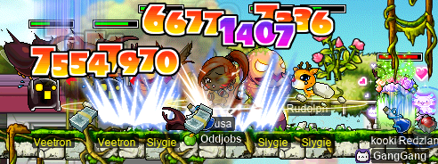
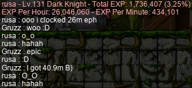

# rangifer’s diary: pt. lxxiv

## The Odd Job Initiative

This diary entry’s regularly scheduled odd job taxonomy nerdfest has been displaced! Oh no!! There must be something equally unreadable to replace it…

Well, this diary entry itself has been a bit delayed, as a result of another project that I’m working on. I call it the “Odd Job Initiative”, because I didn’t bother coming up with a better name. To help explain what the Odd Job Initiative is, I’ve adapted a message that I had already composed for another purpose:

> I’m reaching out to as many MapleStory odd-jobbed & oddball communities as I possibly can, in the hopes of finding anyone interested in working with me to revitalise & rejuvenate the oddball MapleStory community, and create a unified place for folks to play MapleStory in unorthodox ways!
>
> In MapleLegends, I helped to found a guild by the name of **Oddjobs**. Oddjobs has since expanded to include a number of MapleLegends players, and has founded an alliance called **Suboptimal** specifically for oddball MapleStory, including guilds like **Flow** (the main off-island permabeginner guild of MapleLegends), **Victoria** (a guild for Victoria-Island-locked characters), and **Southperry** (the main islander guild of MapleLegends)! The oddball MapleStory community suffers from its sparsity, and Suboptimal is no exception — because I (and some others in Suboptimal) are so deeply invested in oddball MapleStory, we genuinely want to revitalise said community.
>
> I hope that some people out there are willing to try MapleLegends on for size — it’s actually quite hospitable to all manner of odd jobs (and generally oddball playstyles), and it’s quite fun!! Of course, no MapleStory server is perfect — MapleLegends, as a server, has its own share of problems, including the usual issues with HP washing and leeching. That being said, it has a solid and friendly playerbase, and has _lots_ of content, while still staying quite true to the O.G. pre-Big-Bang vibe!
>
> Some of you probably already play (or have played) MapleLegends, and others may already be invested in other servers. It may be presumptuous to expect the latter folks to just uproot themselves and move to another server. That being said, I really do hope to somehow reconnect the oddball MapleStory community with each other again, and I hope that y’all would consider taking a chance on MapleLegends, because I truly think it would be awesome to see oddball Maplers thrive once again!!
>
> If you have any questions, please don’t hesitate to DM me on Discord at `@deer#1028`!! Also, Oddjobs has a dedicated website that you can find at <https://oddjobs.codeberg.page/> — [the “Join On Up” section](https://oddjobs.codeberg.page/join-on-up.html) has some info relevant to joining the guild, including rules, and some ways to contact me in-game.

The Odd Job Initiative is my genuine attempt to put the oddball MapleStory community in as concentrated of a space as possible, so that it may live — and ideally, thrive. Although the Odd Job Initiative is focused on my own guild/alliance, my motivation is not selfish. I genuinely believe that MapleLegends has the best chance of being a popular middle ground for oddball Maplers from all corners of the Mapleverse, and the Odd Job Initiative seeks to unify rather than divide. There are no concrete criteria for what it would mean for the Odd Job Initiative to “succeed” or to “fail”. Ultimately, at some point I will feel that it “succeeded”, or “failed”, or perhaps more likely, that it did something in between.

I’ve had a lot of help from **Red** (**Permanovice**, **Battlesage**, **Dreamscapes**, **Hanger**), who helped me put a lot of the ideas together, gave feedback & advice on my writing, is doing some of his own recruiting/advertising, and even helped me `@everyone` when I was too scared to do it! :P

[You can find a to-do list — and some other materials — relating to the Odd Job Initiative here](https://codeberg.org/deer/gists/src/branch/master/what-s-next-for-oddjobs/odd-job-initiative/README.md). The thing that I’m working on the most actively at the moment is the “Introduction To Odd Jobs”, which is intended to be a gentler & briefer introduction to odd jobs than the one offered by [the list of odd jobs on the Oddjobs website](https://oddjobs.codeberg.page/odd-jobs.html). It covers only the essential odd jobs (noting the existence of some others in passing), and only attempts to describe how each odd job basically works, in plain language. [You can find the guide here](https://codeberg.org/oddjobs/odd_job_guides/src/branch/master/introduction-to-odd-jobs/README.md), but keep in mind that at the time of writing, it is still very much a work in progress.

## A little adventuring, with capreolina

I was invited to do a casual [Ravana](https://maplelegends.com/lib/monster?id=9420014) or two with some folks from **GangGang** & **Chroma**: **Permanovice** (**Battlesage**, **Dreamscapes**), **kookiechan** (**kookietann**, **kurisuwu**), **Moistbeard**, and **Flai** (**FIai**, **NotFlai**)! I wanted to get some Rav runs in on my [woodswoman](https://oddjobs.codeberg.page/odd-jobs.html#woodsman) **capreolina**, so I joined the party to help take down the Ravana of legend:

Permanovice was feeling brave, and like he _really_ wanted to boop Ravana, so he did just that:

Oops. R.I.P.…

Speaking of resting in peace, my [Rings of Passion](https://maplelegends.com/lib/equip?id=1112962) are starting to expire…

Welp, at least I have [Thrust](https://maplelegends.com/lib/skill?id=3110000) to keep me going. It seems that each Ring of Passion is assigned its own expiry at the moment of item creation, so several of my characters are still holding on to theirs.

After some more bossing (read: Ravanas and [Papu](https://maplelegends.com/lib/monster?id=8500001)s), capre was inching closer to levelling up. At the end of the last Papulatus run one day, **xBowtjuhNL** and **Harlez** decided to let me solo (or at least, mostly solo) [the second body](https://maplelegends.com/lib/monster?id=8500002). It wasn’t pretty; I didn’t have time to take out my melee weapon before Papu was all up in my grill, so I gradually [Strafe](https://maplelegends.com/lib/skill?id=3111006)d it to death… But it was worth it — that was all that capre needed to hit level 127!:

Cool!! I knew I’d level up eventually, if I just kept, you know, going to every Rav/Papu that I was invited to ^^;

## Krexel prequests, with rusa

Speaking of killing Ravana: After two such Ravanas, I was invited to do the [Krexel](https://maplelegends.com/lib/monster?id=9420521) prequests with Permanovice, kookiechan, Moistbeard, and **CtrlNoble** (**NobIe**, **xNoble**, **1122**). Since I was already trying to get my [darksterity knight](https://oddjobs.codeberg.page/odd-jobs.html#dex-warrior) **rusa** to level 135 anyways — in order to do some fancy-dancy boss runs with some friends, like Krex, but also [Zakum](https://maplelegends.com/lib/monster?id=8800000) and [Scar](https://maplelegends.com/lib/monster?id=9420549)/[Tar](https://maplelegends.com/lib/monster?id=9420544), I suppose — I came along as rusa.

I’d never actually completed the Krex prequests before, but I understood that they were mostly just collecting ETCs from the monsters around Ulu City. But first, we killed some [Capt. Lat](https://maplelegends.com/lib/monster?id=9420513)s — I think we got a little bit confused and (mistakenly) believed that the Capt. Lat questline was a pre-requisite for the Krex questline. But, in any case, we knew that we needed [Soul Lantern](https://maplelegends.com/lib/etc?id=4000385)s for the Krex questline, so it still made sense:

Unfortunately, Capt. Lat was being stingy with the lanterns, so we left the Ghost Ship lanternless, and headed to Ulu City to start the questline in earnest:

The first order of business was slaying some [Veetron](https://maplelegends.com/lib/monster?id=9420515)s, and the significantly more annoying [Berserkie](https://maplelegends.com/lib/monster?id=9420514)s:

Then, our favourite dilapidated French automobiles, the [Montrecer](https://maplelegends.com/lib/monster?id=9420518)s:

Right, so, it turns out rusa can’t actually fight these. If you can’t one-shot these things, and can’t disable them in some way (stun/freeze/seal), good luck getting out of their permastuns. Thankfully, my party members were able to pick up the slack and donate some excess [Oil Canister](https://maplelegends.com/lib/etc?id=4000433)s to me. \<3

Then, we headed back to [Ulu Estate II](https://maplelegends.com/lib/map?id=541020200) to kill even _moar_ Veetrons. But really, we were there for the [Slygie](https://maplelegends.com/lib/monster?id=9420516)s:

It’s hard to know what these things look like, if you’re just looking at the MapleLegends Library entry. They aren’t a small collection of grass clippings. At least, they aren’t _just_ that. You can see one of their pink wormy bodies in the image above. Pretty gross, right?

Anyways, once we had enough [severed worm tails](https://maplelegends.com/lib/etc?id=4000431) to please [Commando Jim](https://maplelegends.com/lib/npc?id=9270044) and his masked friend, we only had one more part to go: killing [Duku](https://maplelegends.com/lib/monster?id=9420519)s for their [Rafflesia](https://maplelegends.com/lib/etc?id=4000434)s, and getting that pesky Soul Lantern. We were able to finish up the former bit by hunting in [Destroyed Park II](https://maplelegends.com/lib/map?id=541020610), but the Soul Lanterns remained elusive… There weren’t even any on the [FM](https://maplelegends.com/lib/map?id=910000000)! Drat.

## cervine steps closer to the big 120

**Level1Crook** (**Lvl1Crook**, **xXCrookXx**, **Sangatsu**) and I were fortunate enough to catch some surprise GM buffs just as we were headed to [a certain Taiwanese shopping mall](https://maplelegends.com/lib/map?id=742010203) to summarily destroy some [optical](https://maplelegends.com/lib/monster?id=9410031) [discs](https://maplelegends.com/lib/monster?id=9410030)! Needless to say, it was a very productive 60 minutes:

_WHEW_… 8M EPH is probably the most I’ve ever clocked at CDs on my I/L [magelet](https://oddjobs.codeberg.page/odd-jobs.html#magelet) **cervine**! And, I was already reasonably close to levelling, sooo…

Yey!! Would you look at that! J…ust… seven… more… l… le… levels………

As part of the Odd Job Initiative™, I’ve been sending out goofy recruitment [smega](https://maplelegends.com/lib/cash?id=5072000)s like “i’m an I/L with 567 base LUK. ask me anything! \\\\\\ R\>Oddjobs”. Well, I sent an [item smega](https://maplelegends.com/lib/cash?id=5076000) with my [tag](https://maplelegends.com/lib/cash?id=5060000)ged [Elemental Staff 3](https://maplelegends.com/lib/equip?id=01382047) and that message, after we were done grinding CDs. I got a few bemused whispers from concerned citizens of the Maple World, but I _also_ got a surprise gift from someone by the name of **SketchySus**, who appeared in [Taipei 101 proper](https://maplelegends.com/lib/map?id=742000000), where I was NPCing some of my CD goodies, dropped a single [Elemental Staff 7](https://maplelegends.com/lib/equip?id=01382051), and left before I could even say anything (I tried whispering, but I guess they immediately logged out)!:

Thanks, Sketchy!! Now, all I have to do is level up 50 more times…

## Meeting Oahu

Speaking of the Odd Job Initiative, I was fortunate enough to attract the attention of the player behind **Oahu** (and **Cleft**). Oahu is a level 62 STRlander of **Southperry**, one of the original top-ranking islanders of MapleLegends, and the owner of the MapleLegends islander Discord server. Because of Oahu’s deep connections with the MapleLegends islanding scene, and his origins from, and connections with, the same scene in MapleRoyals, I was thrilled that he was so interested in the Odd Job Initiative! I met him in-game, on my DEXlander **ozotoceros**:

Meeting Oahu

When suddenly, Oahu surprised me with a trade request:

I was flattered that Oahu would offer these kinds of special items to me, especially considering that I had no chairs to speak of yet — well, unless you count ye olde [Relaxer](https://maplelegends.com/lib/setup?id=3010000). I admit, I was a bit nervous to pick one, as I knew that I had to choose wisely! In the end, I went with the flashy [Pearl Shell Chair](https://maplelegends.com/lib/setup?id=3010288) :3

Once I had picked a chair, Oahu did a showcase for me of the chairs he’d collected over the years:

Which is a lot of chairs. A lot.

Before we could talk about anything else, though, Oahu directed me to [Southperry](https://maplelegends.com/lib/map?id=60000), where he keeps his islander mules. I already felt more than flattered by the chair, but I didn’t want to be rude and say “no” to some other goodies…

Many of the mules were, erm, BandanaBoys:

**BandanaBoy5** brought a very special item:

A [Lifeguard Saver](https://maplelegends.com/lib/equip?id=1302095) is no joke for an islander — the WATK is decent (the same as ye olde [GSB](https://maplelegends.com/lib/equip?id=1442029)), but the SPEED is where it’s at. 10 SPEED (although this one was below average, with just 9 SPEED) is just about as good as it gets, and the fact that it’s a one-handed weapon is a nice bonus, for those who like to sport a cute shield ([Maple Shield](https://maplelegends.com/lib/equip?id=1092030)s, in particular, give a bit of AVOID)!!

Oahu also handed me a [Miracle Cube](https://maplelegends.com/lib/use?id=2029100). I wasn’t familiar with this particular [April Fools’](https://en.wikipedia.org/wiki/April_Fools%27_Day) prank item, so when he instructed me to double-click it, I wasn’t keen enough to get a screenshot (I regret this deeply). Turns out, using it makes your character [rip ass](https://en.wikipedia.org/wiki/Flatulence):

(Why did I hoard so many [Amethyst Earrings](https://maplelegends.com/lib/equip?id=1032003)? Iunno.) When I realised what happened, I was… bizarrely flattered to have passed gas. ’Tis an honour:

And with that, Oahu reminded me of the venerable tradition of islander hand-me-downs:

So, share I did. With some of the active islanders I’ve played with! A [Maple Bandana Yellow](https://maplelegends.com/lib/equip?id=1002516) for **Leozinho**:

…And, because Oahu had also found a [Red Flowery Tube](https://maplelegends.com/lib/equip?id=1322022) for me, the Lifeguard Saver went to an islander yet without a good weapon, **Izlander**!:

## More adventures of ozotoceros~

But wait — there’s more! The adventures of my DEXlander **ozotoceros** don’t end there. I grinded to level 36 ^^:

More adventures of ozotoceros~

Did a few rounds of the islander quest with **Leozinho** and **Dexual**:

…Which propelled me to level 37 :o

At which point, I met up with **Subcortical** (**Cortical**, **GishGallop**, **SussyBaka**, **CokeZeroPill**, **WizetWizard**) whilst grinding. We played a friendly match of anti-omok:

Which turned into what is probably the only omok win I’ve ever had (ok, technically a loss, in some sense — a losswin?):

So, basically, I’m… kind of an omok expert now. No big deal.

I met **Izlander**, as well as veteran islander **1sme** (**Ismezin**), who just sat there lookin’ cool with The Legendary Gold Poop Hat™ on:

I also met up with some other islanders, including **Christopher** and **Kimberly**, together representing almost all of the guilds in **Suboptimal** (all except **Victoria**)!:

(The above screenshot is courtesy of **Oahu**.)

Aaaand I hit level 38! :)

I was also deeply pleased to pass the very first(!) (and so far, only) [top WDEF 10%](https://maplelegends.com/lib/use?id=2040402) that I’ve ever found!!:

 shirt!")

On a perfect clean [Red-Striped T-Shirt](https://maplelegends.com/lib/equip?id=1041012), no less! This shirt will likely never leave my body…\*

Oh, and even with my reckless [Myo Myo](https://maplelegends.com/lib/cash?id=5450000) expenditures, I’ve managed to hit the 1M meso mark :P

I was also able to get those GM buffs (the same ones that my I/L [magelet](https://oddjobs.codeberg.page/odd-jobs.html#magelet) **cervine** got) on ozotoceros! While I was in [the FM entrance](https://maplelegends.com/lib/map?id=910000000) on cervine, waiting for GM buffs, I asked GM **Mirror** if there would be any islander buffs. It seemed that this was the only thing reminding her to do islander buffs, so in effect, I ended up requesting personal buffs for myself…

I was a bit harried at this point — as I was operating four(!) clients at this point, for maximum GM buffage — but I made sure to thank Mirror, as I felt a tad guilty for making her come to the island to just buff me…

In any case, I used the GM buffs to their maximum potential, [at Pigs](https://maplelegends.com/lib/map?id=1000006)! I even got up onto that top bit where those two pesky [Shroom](https://maplelegends.com/lib/monster?id=120100)s spawn!!:

Wowie. I can see all of Maple Island from up here!

Needless to say, I did some `@epm` testing:

66.1k EPH, whew. Those are some _phat_ numbers right there.

Footnotes for “More adventures of ozotoceros~”

\*Cue the jokes about islanders never showering. Har, har…

## The seventh floor of the Sutra Depository

In the previous diary entry, my [darksterity knight](https://oddjobs.codeberg.page/odd-jobs.html#dex-warrior) **rusa** tried out [7F](https://maplelegends.com/lib/map?id=702070400) for the first time, alongside **xBowtjuhNL**, **Gruzz**, and **Harlez**. This section documents some more experiments in grinding that rusa has done since then.

I tried duoing [at Petrifighters](https://maplelegends.com/lib/map?id=541020500) with Gruzz, which yielded some pretty crazy results:

…The seventh floor of the Sutra Depository…

I did head back to 7F again to trio with Harlez and xBowtjuhNL, which got me less EPH (18.2M or so), but is a more suitable map for rusa:

However, what perhaps surprised me the most was when I did my first `@epm` test while _soloing_ 7F:

Churning out a whole 15.2M EPH all by my lonesome is _no_ joke. In fact, this sort of (we’ll get to that in a second) means that rusa has graduated from [CDs](https://maplelegends.com/lib/map?id=742010203)!! As recorded in a previous diary entry, rusa tends to get roughly ≈10M EPH (not to mention my pure [STR bishop](https://oddjobs.codeberg.page/odd-jobs.html#str-mage) **cervid**’s EPH) while sadsadgrinding at CDs. So 7F actually represents a pretty big step up, which is exciting (and doesn’t hurt my eyes nearly as much as Taipei 101)!

That being said, the MPH (mesos per hour) situation is a little different. CDs are just consistently good money; grinding there is pretty much a guaranteed payout, even if there are some minor fluctuations in that payout due to random chance. 7F, on the other hand, I have to _pay_ money to train at. Every additional hour that I train at 7F bleeds more mesos from my purse, mostly in the form of [Satay](https://maplelegends.com/lib/use?id=2022207)s. So, inevitably, it seems that the grinding strategy here is just “sadgrind at 7F, and then sadsadgrind at CDs to make back the money”. So, you know, maybe that doesn’t truly count as “graduating from CDs”, but hey — I take what I can get.

Oh, and that was enough to take rusa to level 132 c:

I figured that I should directly compare against [Petris](https://maplelegends.com/lib/monster?id=9420517), just in case soloing Petris actually was better EPH than soloing 7F. Turns out, it’s not:

I did some 7F trioing with Harlez and a bishop by the name of **RUSSOSKY**, which… well… I got a lot of EXP. Like, a lot:

As I was doing some solo grinding there, I finished up the [Silver Giant](https://maplelegends.com/lib/monster?id=9600022) set (I had already finished the [Wooden Fish](https://maplelegends.com/lib/monster?id=9600018) set, as it’s basically trivial):

…And hit level 133~!:

I was joined by F/P mage **2sus4u** of **Flow**:

Unfortunately, 7F is kind of a hostile map — it’s a bit hectic, the Wooden Fishes auto-aggro, and there are no safe spots. There’s _kinda_ a safe spot (I like to call these “semi-safe spots”) if you stand exactly on the left edge of the portal into the dungeon, because at that point you aren’t in range of any of the Wooden Fishes, and the giants can’t touch attack you. But, as soon as a giant uses a magic attack in your general vicinity, it’s all over. So, 2sus4u decided that we should try [mist](https://maplelegends.com/lib/skill?id=2111003) training at her usual spot: [FoT](https://maplelegends.com/lib/map?id=702080000).

Training this way is less dangerous, although it’s a bit fast-paced (at least, for me). We were dual-channel training, which meant that I had to follow 2sus4u into the left side of the map, sweep from left to right (hitting anything along the way), then exit the map on its right side, change channels, and repeat. This is a nonstop, continuous process, and considering that 2sus4u has [Teleport](https://maplelegends.com/lib/skill?id=2101002), whereas I do not, I have to do a fair amount of huffing & puffing to keep up.

After getting some EXP from mist training, I headed back to solo 7F and get rusa her level 134!:

Also while soloing 7F, I found a legendary item only spoken of in whispers: a [Golden Giant](https://maplelegends.com/lib/monster?id=9600021) card:

One down, four more to go…

With the GM buffs that I mentioned in earlier sections of this diary entry, I tried some more solo 7F, and tested how much the GM buffs would increase my EPH:

Wowzers. 19.7M solo EPH ain’t half bad… And partway through the GM buffs, I was joined by Harlez, which put my EPH into the sky:

Later, I conveniently found a [Power Stance 20 mastery book](https://maplelegends.com/lib/use?id=2290006) in one of the Wooden Fishes — I was just one SP away from being able to use the book myself:

I was joined briefly by a level 169 shadower by the name of **Jrmyy**, who was close to levelling and wanted to get ≈3% more EXP. I agreed to duo, and we grinded until I levelled up!:

Ah, and there it is. Level 135!!!! :D Some more grinding, and we were able to get Jrmyy his level 170!!! Grats!

And so, I did use that mastery book. And it failed. Amen.

Now that rusa is level 135, will we see some new bosses in the future…? Only time will tell :)

## hashishi @ LMPQ

[Permapirate](https://oddjobs.codeberg.page/odd-jobs.html#permapirate) **Copo** (**Bipp**, **Celim**, **Sommer**, **Fino**) was trying to put together an [LMPQ (Ludibrium Maze Party Quest)](https://maplelegends.com/lib/map?id=220000000) party. Naturally, finding members is quite difficult, as no one actually regularly does LMPQ on MapleLegends. I was down to do some LMPQs myself, but because it’s only available to level 51–70 characters, I was short on options. Normally, I don’t consider PQing with my [besinner](https://oddjobs.codeberg.page/odd-jobs.html#besinner) **hashishi**, because of my experience of doing a few [OPQ](https://maplelegends.com/lib/map?id=200080101)s and feeling disproportionately useless. However, I had never tried LMPQ, so I figured I may as well give it a go. Copo recruited two others by the names of **cutiewizard** and **DarkClover**, and we set off to maze some party quests:

Some readers are doubtless at least somewhat familiar with LMPQ, but for those who are not, the basic idea is this: LMPQ has 16 rooms, and you start in a random room that isn’t room 16. Then, you go around the rooms, breaking the boxes until monsters come out. Killing the monsters yields tickets. You take the tickets to room 16, and once everyone is in room 16, you can finish the PQ. The amount of EXP that you get directly depends on how many tickets the leader was holding when you ended the PQ. The trick is that only rooms 6 and 7 are actually worth doing; the monsters in these rooms drop _WAY_ more tickets than any other monsters in the PQ:

The other twist is that going from room to room is not entirely trivial. Each room has three portals, and they increase the room number by ⟨+4, +7, −3⟩, respectively. If you go above 15, or below 1, the numbers simply [wrap around](https://en.wikipedia.org/wiki/Modular_arithmetic) at those points, like: …, 14, 15, 1, 2, …\*

I’ve actually done quite a few LMPQs in my Maple career, but nowadays they are so infrequent that I have to relearn how the portals work (at the very least, relearning ⟨+4, +7, −3⟩) every time. And, because the only monsters that we were fighting were [Tauromacis](https://maplelegends.com/lib/monster?id=9400218) and the occasional [Flyeye](https://maplelegends.com/lib/monster?id=9400217), I wasn’t all that effective at killing the monsters (although I definitely could kill them myself, if we were willing to do PQs eight times more slowly…). Nevertheless, I got the hang of navigating the rooms quickly enough that I could help break boxes to start the combat before other people got there.

I found out that LMPQ has a few interesting reward items here and there. I remembered it being mostly a lot of potions, which is true. When doing other things (e.g. other PQs), eventually you have to go and repot. With LMPQ, the only thing that you have to do is “unpot”, if you will. There’s no way to run out of pots, given that LMPQ shoves massive quantities of them into your inventory. The only issue is making sure that your inventory has some space remaining… That being said, we got some other interesting loot, including [Emergency Rescue Tube](https://maplelegends.com/lib/equip?id=1322025)s, [Yellow Umbrella](https://maplelegends.com/lib/equip?id=1302016)s, [Green Strap Shoe](https://maplelegends.com/lib/equip?id=1072263)s, [Blood Snowboard](https://maplelegends.com/lib/equip?id=1442017)s, and a nifty scroll or two like [cape INT 10%](https://maplelegends.com/lib/use?id=2041017)! Perhaps a tad disappointing is the fact that all the equipment is exactly average. None of the stats are random. But hey, still pretty neato.

Footnotes for “hashishi @ LMPQ”

\*Well, sort of. If you go into the middle portal of room 9, you don’t end up in room 1, like you’d expect. You end up in room 16. In fact, this is the only way to get to room 16. Room 16 only has _one_ portal, which leads back to room 9. So much for [a nice structure](https://en.wikipedia.org/wiki/Abelian_group)…

