# rangifer’s diary: pt. lxxv

## “Introduction To Odd Jobs”

At the beginning of the previous diary entry, I mentioned the “Introduction To Odd Jobs” guide that I was working on. Well, it’s now complete!! You can [**find the guide here**](https://oddjobs.codeberg.page/guides/introduction-to-odd-jobs/); I’ve also [posted a version of the guide to the MapleLegends forums](https://forum.maplelegends.com/index.php?threads/introduction-to-odd-jobs.43515/), and you can [find the relevant source here](https://codeberg.org/oddjobs/odd_job_guides/src/branch/master/introduction-to-odd-jobs). Any issues/[PR](https://www.git-scm.com/docs/git-request-pull)s can be directed to [the odd\_job\_guides repo on Codeberg](https://codeberg.org/oddjobs/odd_job_guides) :)

I’ve (just barely) started translating the guide into [Spanish](https://en.wikipedia.org/wiki/Spanish_language), which you can find at [README\.spa-Latn-419\.md](https://codeberg.org/oddjobs/odd_job_guides/src/branch/master/introduction-to-odd-jobs/README.spa-Latn-419.md) (the original [English](https://en.wikipedia.org/wiki/English_language) version is at [README\.md](https://codeberg.org/oddjobs/odd_job_guides/src/branch/master/introduction-to-odd-jobs/README.md)). I’ve decided to just name the translated versions “README\.`x`\.md”, where `x` is an appropriate [IETF language tag](https://en.wikipedia.org/wiki/IETF_language_tag) for the [language variety (a\.k\.a. lect)][variety]\* used in that translation. IETF language tags are quite flexible, and can contain one or more “subtags” separated by [hyphen-minus](https://en.wikipedia.org/wiki/Hyphen-minus) characters (“`-`”; [U](https://en.wikipedia.org/wiki/Unicode)+002d); furthermore, each subtag can often take on one of several different forms. In the case of the Spanish translation, it would _probably_ be sufficient to use “[es](https://en.wikipedia.org/wiki/ISO_639-1)” as the language tag. But, in order to handle more general cases if need be, and to maintain consistency, I decided to only use language tags of the form `xxx`-`Zzzz`-`nnn`, where `xxx` is an [ISO 639-3](https://en.wikipedia.org/wiki/ISO_639-3) language code (all lowercase), `Zzzz` is an [ISO 15924](https://en.wikipedia.org/wiki/ISO_15924) script code (first letter uppercase, all other letters lowercase), and `nnn` is a [UN M49](https://en.wikipedia.org/wiki/UN_M49) area code.

In the case of spa-Latn-419, “spa” is the language code for Spanish, “Latn” is the script code for a [Latin script](https://en.wikipedia.org/wiki/Latin_script), and “419” is the area code for “[Latin America](https://en.wikipedia.org/wiki/Latin_America) and the [Caribbean](https://en.wikipedia.org/wiki/Caribbean)”. In this particular case, the “Latn” may be a bit redundant — Spanish is, after all, a [Romance language](https://en.wikipedia.org/wiki/Romance_languages), so it’s hardly ever been written in a non-Latin script. Technically, Spanish (and closely related lects, e.g. [Ladino](https://en.wikipedia.org/wiki/Judaeo-Spanish)) has been written using the [Arabic script](https://en.wikipedia.org/wiki/Arabic_script) (see [Aljamiado](https://en.wikipedia.org/wiki/Aljamiado); [Al-Andalus](https://en.wikipedia.org/wiki/Al-Andalus)) and the [Hebrew alphabet](https://en.wikipedia.org/wiki/Hebrew_alphabet). But Al-Andalus is no more, and Ladino is (regrettably) highly endangered. The use of the 419 area code is a bit nebulous (and Spanish speakers outside of Latinoamérica should be able to read it just fine), but I mostly chose it to indicate the lack of [dedicated informal second-person plural pronoun](https://en.wikipedia.org/wiki/Spanish_personal_pronouns#Use_of_vosotros) and the bias towards vocabulary more common in Latinoamérica, some of which may sound foreign to [Iberian Spanish](https://en.wikipedia.org/wiki/Peninsular_Spanish) speakers. However, I don’t write with any [_voseo_](https://en.wikipedia.org/wiki/Voseo) whatsoever, even though several regions of Latinoamérica do use it (fully and/or verbally).

That being said, the script can be more significant in other languages. [Malay](https://en.wikipedia.org/wiki/Malay_language) is primarily written using a Latin script, but [Jawi](https://en.wikipedia.org/wiki/Jawi_alphabet) is also used, and it has historically been written in some other scripts as well. For languages that make use of [_hànzì_](https://en.wikipedia.org/wiki/Chinese_characters), the split between [traditional](https://en.wikipedia.org/wiki/Traditional_Chinese_characters) and [simplified](https://en.wikipedia.org/wiki/Simplified_Chinese_characters) characters is significant on a geographical, lectal, and cultural basis. MapleStory has a significant population from [Hong Kong](https://en.wikipedia.org/wiki/Hong_Kong), [Taiwan](https://en.wikipedia.org/wiki/Taiwan), [Macau](https://en.wikipedia.org/wiki/Macau), and many [overseas Chinese](https://en.wikipedia.org/wiki/Overseas_Chinese) communities (e.g. in [North America](https://en.wikipedia.org/wiki/North_America)), where traditional characters predominate; as well as a significant population from (or originated from) [Mainland China](https://en.wikipedia.org/wiki/Mainland_China), [Malaysia](https://en.wikipedia.org/wiki/Malaysia), and [Singapore](https://en.wikipedia.org/wiki/Singapore), where simplified characters predominate. These differences are often along lectal lines; [Cantonese](https://en.wikipedia.org/wiki/Cantonese), [Standard Chinese (Beijing Mandarin)](https://en.wikipedia.org/wiki/Standard_Chinese), [Taiwanese Mandarin](https://en.wikipedia.org/wiki/Taiwanese_Mandarin), and [Taishanese](https://en.wikipedia.org/wiki/Taishanese) (common among [U\.S.](https://en.wikipedia.org/wiki/United_States) speakers) differ in their preference for script, and these lects are usually [mutually unintelligible](https://en.wikipedia.org/wiki/Mutual_intelligibility). The aforementioned geographical differences also highlight the usefulness of area codes.

I’ve had three people graciously offer to help with translating the guide into other languages, including Spanish, [Brazilian Portuguese](https://en.wikipedia.org/wiki/Brazilian_Portuguese) (por-Latn-[076](https://en.wikipedia.org/wiki/Brazil)), [German](https://en.wikipedia.org/wiki/German_language) (deu-Latn-[276](https://en.wikipedia.org/wiki/Germany), deu-Latn-[040](https://en.wikipedia.org/wiki/Austria), or deu-Latn-[756](https://en.wikipedia.org/wiki/Switzerland), I’m not sure; I didn’t ask), and [Malaysian](https://en.wikipedia.org/wiki/Malaysian_language) (zsm-Latn-[458](https://en.wikipedia.org/wiki/Malaysia))! Any contributions are welcome! ^^

[variety]: https://en.wikipedia.org/wiki/Variety_(linguistics)

Footnotes for “‘Introduction To Odd Jobs’”

\*A “lect” is distinct from a “dialect”. The term “dialect” is a purely [political](https://en.wikipedia.org/wiki/Politics) term that ultimately [has no actual linguistic meaning](https://en.wikipedia.org/wiki/Nonsense). A lect is a more generic term for any language variety whatsoever (anything from what might be considered a “[macrolanguage](https://en.wikipedia.org/wiki/ISO_639_macrolanguage)”, to an [idiolect](https://en.wikipedia.org/wiki/Idiolect), or anything in between), regardless of its “size” (in any number of dimensions) or social status.

## capreolina tries whacking Papulatus’s second body to death

I was doing some of the usual [Rav](https://maplelegends.com/lib/monster?id=9420014)/[Papu](https://maplelegends.com/lib/monster?id=8500001) runs with friends, on my [woodsmaster](https://oddjobs.codeberg.page/guides/introduction-to-odd-jobs/#woodswoman) **capreolina**, when something unusual happened during a Papu run. At about the time when the first body of Papu got down to ≈¼ HP, **Harlez** (with whom I was duoing) accidentally NPC-chat-button’d his way out of the map, leaving me alone with Papu…

At first, I wasn’t sure whether or not I should just leave as well — Papulatus has no timer, so it was certainly possible for me to finish, but I wasn’t sure if I should keep Harlez waiting for run two. But Harlez assured me that I should finish, so I gave it my best shot:

Killing the last ¼ of the first body wasn’t terribly difficult, but the real challenge was going to begin as soon as that flying second body popped out. I decided in advance that I was going to switch to my [Crimson Arcglaive](https://maplelegends.com/lib/equip?id=1442068) ASAP, once the first body was dead. This way, I would avoid the troubles of trying to [Strafe](https://maplelegends.com/lib/skill?id=3111006) (read: mostly bow-whack) to death a rapidly flying Papu second body that was aggro’d on me the entire time. And, it worked pretty well:

I was happy with how it was working out, but of course, the entire thing was extremely dangerous. Each time that this menacingly fast boss touches me, I take 95%+ of my MAXHP worth of damage… so a single slip-up, pet auto-HP failure, or eaten button-press, is enough to spell my demise. So I was in full concentration mode. Unfortunately, I only managed to shave off ≈40% or so of the second body’s HP before one of these things happened, and I met my grave…

Oh well, maybe next time :3

## A sneak peek of hydropotina before the next event…

My poor [swashbuckler](https://oddjobs.codeberg.page/guides/introduction-to-odd-jobs/#swashbuckler) **hydropotina** has been in a state of neglect for a while now. At the moment, I have a variety of untradeable (mostly anniversary) event equipment on some of my other characters — some readers will remember how hard I worked for those… I’ve been trying to make use of these hard-won equipment items, which has only perpetuated hydropotina’s neglect.

But, I found a short occasion on which to play hydropotina, and with some luck, I can revive her in a future event!

I was already in Mu Lung Gardens (MLG) for the [Herb Town Party Quest](https://maplelegends.com/lib/map?id=251010404), so I started off by killing some ([Ginseng](https://maplelegends.com/lib/monster?id=4230506)) [Jar](https://maplelegends.com/lib/monster?id=4230505)s for [Eliminating the Escaped Pot](https://bbb.hidden-street.net/quest/mu-lung-nihal-desert/eliminating-the-escaped-pot):

And I headed to the ([Sr.](https://maplelegends.com/lib/monster?id=5120502)) [Bellflower Root](https://maplelegends.com/lib/monster?id=5120501)s for [Intruder — The Herb Farm](https://bbb.hidden-street.net/quest/mu-lung-nihal-desert/intruder-the-herb-farm):

I went to slay some [Peach Monke](https://maplelegends.com/lib/monster?id=6130207)\* for [Protecting the Peach Farm](https://bbb.hidden-street.net/quest/mu-lung-nihal-desert/protecting-the-peach-farm), and hit level 92 in the process!:

And snagged a Peach Monke card on the way out:

While I was in Mu Lung, I did [No Gong’s Teaching](https://bbb.hidden-street.net/quest/mu-lung-nihal-desert/no-gongs-teaching):

And, after gathering up some of my spare [Concentrates](https://maplelegends.com/lib/use?id=2022132) for [Finding the Ingredients for Tae Sang](https://bbb.hidden-street.net/quest/mu-lung-nihal-desert/finding-the-ingredients-for-tae-sang), I went out to gather up the ETCs necessary to craft [Mr. Do](https://maplelegends.com/lib/npc?id=2090004)’s book on herbal medicines:

While I was here at [Bellflower Valley](https://maplelegends.com/lib/map?id=251010300), I naturally got 5/5 Bellflower Root quite quickly, as they are notorious for their high card drop rate. But I also had pretty good luck with the Sr. Bellflower Root cards, so I decided to stay there just a little longer to get that last card and go from 4/5 to 5/5. Unfortunately for me, the game decided to withhold all such cards from me until which point I could not muster the energy to kill more elderly campanula…

Footnotes for “A sneak peek of hydropotina before the next event…”

\*While looking up Peach Monkeys, I found [this entry](https://maplelegends.com/lib/monster?id=9300165) in the MapleLegends Library of a seemingly identical Peach Monke that is much more powerful (level 120), but gives no EXP and has nothing in its droptable. If you look, you’ll see that these naturally spawn in a hidden map called “[Save Delli!](https://maplelegends.com/lib/map?id=925010300)”. I wasn’t sure what to think of this at first — maybe it’s some unused content, like a PQ or something like that. Well… sort of. It’s actually not unused at all: [Hypnotize](https://maplelegends.com/lib/skill?id=5221009) is not a default skill for corsairs, so it must be unlocked via a quest that involves this map. Talking to [Shulynch](https://maplelegends.com/lib/npc?id=1092008) transports the corsair to [Looking for Delli 1](https://maplelegends.com/lib/map?id=925010000), which is a short JQ map which leads to [Looking for Delli 2](https://maplelegends.com/lib/map?id=925010100), another short JQ map which leads to [Looking for Delli 3](https://maplelegends.com/lib/map?id=925010200), another short JQ map which leads to the aforementioned Save Delli! [Delli](https://maplelegends.com/lib/npc?id=2095000) is an NPC who looks kind of like a hairless pink version of [Rolonay](https://maplelegends.com/lib/npc?id=1092012), an ordinary NPC in [the Nautilus’s mid floor hallway](https://maplelegends.com/lib/map?id=120000200), who is in turn styled after an ordinary MLG monster called [The Book Ghost](https://maplelegends.com/lib/monster?id=5120506). As a result, the “Save Delli!” PQ is styled to look like this region of MLG, complete with visually identical monsters. The “PQ” (if it can be called that) itself is similar in spirit to [HPQ](https://maplelegends.com/lib/map?id=100000200) or [ENPQ](https://maplelegends.com/lib/map?id=921100300), in that it involves protecting Delli from the MLG monsters that spawn in the map.

## Fighting Zakum for the first time in my Maple career!!!

In the previous diary entry, my [darksterity knight](https://oddjobs.codeberg.page/guides/introduction-to-odd-jobs/#dex-warrior) **rusa** hit level 135~! And, as some readers may be aware, several of the major bosses in MapleLegends are level 140 — including [Krexel](https://maplelegends.com/lib/monster?id=9420521), the final body of [Scarlion](https://maplelegends.com/lib/monster?id=9420549) and of [Targa](https://maplelegends.com/lib/monster?id=9420544), and [Zakum](https://maplelegends.com/lib/monster?id=8800000) — making level ≥135 the crucial threshold for participating normally. So I was invited to fight the almighty Zakum with **Gruzz**, **Harlez**, **xBowtjuhNL**, and **SmallMight**/**SiriusPlaque**!!

Heh… I admit, before this point, my only experience with Zakum was dying repeatedly to it and giving other people my mesos in exchange for the chance to loot some [zhelm](https://maplelegends.com/lib/equip?id=1002357)(s). Well, and occasionally trying very hard not to die, while cowering in the bottom-left corner… in exchange for the chance to loot some zhelm(s). So, this was a whole new experience for me. Just like [Papulatus](https://maplelegends.com/lib/monster?id=8500001) was always a boss that was legendary in my mind, as a wee fawn playing MapleStory so long ago, Zakum was the ultimate bad guy. I’ve fought Papulatus a number of times now, but I know now that Zakum is on a whole nother level. To keep a good record of my first true encounter with this crumbly statue guy, I recorded some video. You can watch the edited version on the **Oddjobs** YouTube channel!:

**[rusa fights Zakum for the first time!! \[YouTube\]](https://www.youtube.com/watch?v=xWgubC7g9nM)**

In this video, I refer to Zakum as “the big bad [Aztec](https://en.wikipedia.org/wiki/Aztecs) rock man”. Shortly after posting it (lol), I started to wonder if I had maybe gotten this wrong, and that Zakum was not intentionally modelled after Aztec culture by Wizet. Zakum definitely has some pretty strong [Mesoamerican](https://en.wikipedia.org/wiki/Mesoamerica) vibes going on, visually, including with the monsters that it spawns in battle. But upon closer inspection, I got some [Mayan](https://en.wikipedia.org/wiki/Maya_civilization) vibes as well… I asked Gruzz about it, and he pointed me to an old video from the prolific MapleStory YouTuber **coppersan**:

**[MapleStory Mythology Monday - Zakum \[YouTube\]](https://www.youtube.com/watch?v=xFabHpVah3Y)**

In this video, coppersan breaks down a number of the visual motifs associated with Zakum (I recommend watching the video yourself, it’s very short — perhaps too short). Among them are, indeed, a few Aztec things… at least, supposedly — and a bunch of other stuff:

- **Zaqqum tree:** Zakum itself is named after a tree called _[Zaqqum](https://en.wikipedia.org/wiki/Zaqqum)_ (زقوم) mentioned by the [Qur'an](https://en.wikipedia.org/wiki/Quran). The fruits of this tree are shaped like the heads of devils, and those who are damned to hell are forced to eat these fruits as a form of punishment (as the fruits do terrible, terrible things to those who consume them).
- **Monumento a la Patria:** coppersan calls this the “Merida Monument”, and refers to it as “an Aztec monument from the Mayas”. This monument is indeed in [Mérida](https://en.wikipedia.org/wiki/M%C3%A9rida,_Yucat%C3%A1n), in [Yucatán](https://en.wikipedia.org/wiki/Yucat%C3%A1n) (one of the [Mexican](https://en.wikipedia.org/wiki/Mexico) states), but coppersan’s description conflates the Aztecs with the Mayans. This monument is somewhat recent (completed [1956](https://en.wikipedia.org/wiki/1956)), and almost certainly celebrates Mayan culture, not so much Aztec culture. The reaches of Maya civilisation that overlapped with modern-day Mexico are all within the [Yucatán Peninsula](https://en.wikipedia.org/wiki/Yucat%C3%A1n_Peninsula), notably [Chichén Itzá](https://en.wikipedia.org/wiki/Chichen_Itza), which was in present-day Yucatán. The Aztecs, on the other hand, never occupied this peninsula.
- **Chaac/Tlāloc masks:** The face at the bottom of Zakum’s altar kind of(?) looks like a mask of [Chaac](https://en.wikipedia.org/wiki/Chaac), or maybe of [Tlāloc](https://en.wikipedia.org/wiki/Tl%C4%81loc)\*, the Mayan and Aztec rain deities, respectively. These two deities are actually connected, and it’s possible that they both descend from some [Olmec](https://en.wikipedia.org/wiki/Olmecs) deity. It seems that both Chaac and Tlāloc masks exist(ed), although if you ask me, the descriptions of Tlāloc’s features match Zakum’s altar more closely than Chaac’s features. But whatever, it seems unlikely to me that Wizet had any particular deity in mind here — the features are pretty generic. Later, coppersan claims that the Zakum Helmet is a Tlāloc mask, which at least seems more likely, as it does have goggle eyes and some fangs. coppersan also correctly identifies Tlāloc as an Aztec deity.
- **[Wedjat eye](https://en.wikipedia.org/wiki/Eye_of_Horus):** The eye of [Horus](https://en.wikipedia.org/wiki/Horus) is used in one of Zakum’s animations. This finds its origin in [ancient Egyptian mythology](https://en.wikipedia.org/wiki/Ancient_Egyptian_religion), and can also be found [elsewhere in MapleStory](https://maplelegends.com/lib/equip?id=1122010).
- **“Solomon seal”:** One of Zakum’s animations features a circle divided into four quadrants, each with their own symbol inside. The circle is accompanied by a larger concentric circle, and between the two circles are arranged nine evenly-spaced glyphs. This seal is one of three corners of a larger triangle. coppersan refers to these symbol(s) as “the Solomon seal” (not to be confused with [Solomon’s seal](https://en.wikipedia.org/wiki/Polygonatum), which is a genus of [angiosperms](https://en.wikipedia.org/wiki/Flowering_plant)). The [Seal of Solomon](https://en.wikipedia.org/wiki/Seal_of_Solomon) is actually a hexagram (sometimes pentagram), and is the predecessor of the [Star of David](https://en.wikipedia.org/wiki/Star_of_David). coppersan shows some examples on screen for comparison, but I’m having trouble seeing any similarities beyond them all being “Western-[occultism](https://en.wikipedia.org/wiki/Occult)-looking” drawings. One of the examples at least contains a hexagram, but for that matter, I don’t see any hexagrams nor pentagrams on Zakum itself. Oh well.

So, there you have it. Zakum is an incoherent mishmash of some kind of Aztec-Maya hybrid mythology, pre-Abrahamic Egyptian mythology, Qur'anic flora, and Western occultism. Thanks, Wizet.

By the end of it, rusa finally had a zhelm of her very own:

As some readers might remember, I deprived rusa of a helmet for many levels, because I was dead set on getting a [Ravana Helmet](https://maplelegends.com/lib/equip?id=1003068), and was doing everything I could to avoid doing the Zakum prequests (which I, obviously, ended up doing anyways…). She was wearing [a level 10 hat](https://maplelegends.com/lib/equip?id=1002728) until level ≈90(!) or so, and I’m pretty sure she has lasting brain trauma from that… So let this be avengement!

Footnotes for “Fighting Zakum for the first time in my Maple career!!!”

\*Fun fact: when you see ⟨tl⟩ in a [Nahuatl](https://en.wikipedia.org/wiki/Nahuatl) word like “Tlāloc”, that’s a [voiceless alveolar lateral affricate](https://en.wikipedia.org/wiki/Voiceless_alveolar_lateral_affricate) (in [IPA](https://en.wikipedia.org/wiki/International_Phonetic_Alphabet): ⟨t͡ɬ⟩), which is kind of a rare [consonant](https://en.wikipedia.org/wiki/Consonant). It sounds _kinda_ like /tʃ/ — which is usually written in [English](https://en.wikipedia.org/wiki/English_language) as ⟨ch⟩, ⟨tch⟩, or ⟨tsch⟩ — but it’s [lateral](https://en.wikipedia.org/wiki/Lateral_consonant), meaning that the air flows _around_ the tongue, rather than being allowed to flow through the middle of the mouth. Fun!

## A bit of sadsadgrind…

Womp womp. ’Tis time for the saddest of all grinds: the sadsadgrind™. Featuring your favourite duo: my pure [STR bishop](https://oddjobs.codeberg.page/guides/introduction-to-odd-jobs/#str-mage) **cervid** with my [darksterity knight](https://oddjobs.codeberg.page/guides/introduction-to-odd-jobs/#dex-warrior) **rusa**, in everyone’s favourite grinding spot: [CDs](https://maplelegends.com/lib/map?id=742010203)!

Wowowow!! cervid hit level 127 c:

Aaaand rusa is level 136 now!!!

Very cool. Thanks, CDs. To celebrate, I send out another one of my patented **Oddjobs** recruitment [smega](https://maplelegends.com/lib/cash?id=5072000)s:

Right, I forgot that [washing](https://maplelegends.com/lib/cash?id=5050000) exists. And shoutout to **RungeKutte** for my first hate comment!

## All-Oddjobs LPQ!

I hopped onto my [DEX brawler](https://oddjobs.codeberg.page/guides/introduction-to-odd-jobs/#dex-brawler) [LPQ](https://maplelegends.com/lib/map?id=221024500) mule **sorts** to do some LPQing with some fellow guildmates: [DEXdit](https://oddjobs.codeberg.page/guides/introduction-to-odd-jobs/#lukless-bandit) **breakcore** (**xX17Xx**, **attackattack**, **partyrock**, **drainer**, **strainer**, **raving**, **technopagan**), cleric [gish](https://oddjobs.codeberg.page/guides/introduction-to-odd-jobs/#gish) **tb303** (**2sus4u**), and [HP fighter](https://oddjobs.codeberg.page/guides/introduction-to-odd-jobs/#hp-warrior) **Cerebellum** (**Cortical**, **Subcortical**, **SussyBaka**, **CokeZeroPill**, **Medulla**, **GishGallop**, **xXcorticalXx**):

In the image above, you can see us struggling in [stage 8](https://maplelegends.com/lib/map?id=922010800) alongside unwitting random player **CardcaptorSC**. Cerebellum likes to make sure that everyone knows just how much they hate stage 8.

Later, we were joined by another **Oddjobs** member: **Cassandro** the claw [clericlet](https://oddjobs.codeberg.page/guides/introduction-to-odd-jobs/#magelet) (**Celim**, **Bipp**, **Sommer**, **Copo**, **Fino**)! This brought the number of Oddjobs members in our party up to five, so I had the idea to try some all-Oddjobs LPQ runs. We had to say goodbye to CardcaptorSC for this, although we left him with a parting gift or two. We almost managed to put together an all-Oddjobs LPQ a while back, but we had some internet issues that prevented it from actually happening. So this would be the first time ever. For the occasion, I recorded it, and you can find the edited version on the Oddjobs YouTube channel!:

**[All-Oddjobs LPQ! (You WON’T BELIEVE what happens to the “invincible” golems…) \[YouTube\]](https://www.youtube.com/watch?v=SIBwshHHe3A)**

## Vicloc status update

Welcome back to [vicloc](https://codeberg.org/Victoria), with your host, vicloc [dagger spearwoman](https://oddjobs.codeberg.page/guides/introduction-to-odd-jobs/#dagger-warrior) **d34r**.

Conveniently, [APQ](https://maplelegends.com/lib/map?id=670010100)’s bonus stage gives not only [cape](https://maplelegends.com/lib/equip?id=1102099)s, but also 30% scrolls to boom them with. I’ve already made a number of capes, several of which are quite useful (including not one, but _two_ 12 STR capes, the better-defence of which is my main cape), but APQ won’t stop giving me these things. So I threw around some more scrolls:

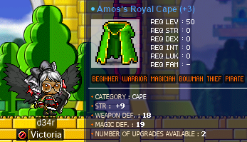

Oh. Well, the first three slots of this cape passed [cape STR 30%](https://maplelegends.com/lib/use?id=2041035)s on ’em. Sooo… originally, I posted this in the **Victoria** Discord server in case anyone wanted it before I recklessly threw more 30%s at it. But then I realised that I already had too many capes, so I just went for it:

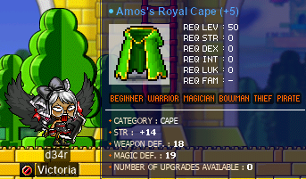

_Wowza._ Luckily for me, after passing 30%s on the first four slots, I had one (1) spare [60%](https://maplelegends.com/lib/use?id=2041013) lying around in my inventory… and passed that as well. A 14-stat vicloc cape!!! :D

Oh, and while farming for some [APQ key](https://maplelegends.com/lib/etc?id=4031593)s, I accidentally levelled up:

Nice~

## Trying Krexel for the first time…‽

Besides fighting [Zakum](https://maplelegends.com/lib/monster?id=8800000) for the first time (see above), I also got the chance to fight another big bad boss for the first time: [Krexel](https://maplelegends.com/lib/monster?id=9420521)! I was invited to do Krexel with **Bipp**, **xBowtjuhNL**, **Harlez**, and **Gruzz**. As seen in the previous diary entry, my [darksterity knight](https://oddjobs.codeberg.page/guides/introduction-to-odd-jobs/#dex-warrior) **rusa** had already done the Krexel prequests (at least, everything except for the [Soul Lantern](https://maplelegends.com/lib/etc?id=4000385)). But we wanted [HS](https://maplelegends.com/lib/skill?id=2311003), and since my pure [STR bishop](https://oddjobs.codeberg.page/guides/introduction-to-odd-jobs/#str-mage) **cervid** was level 127 (not high enough level to get EXP from Krexel normally), I could theoretically multiclient both rusa & cervid inside of the fight to provide HS, without cervid getting any EXP. So we get the prequests done for cervid as well…

Krexed!

I was requested to show off everyone’s favourite STR mage party trick, “‘**MISS**’ing absolutely everything with your mage ult”:

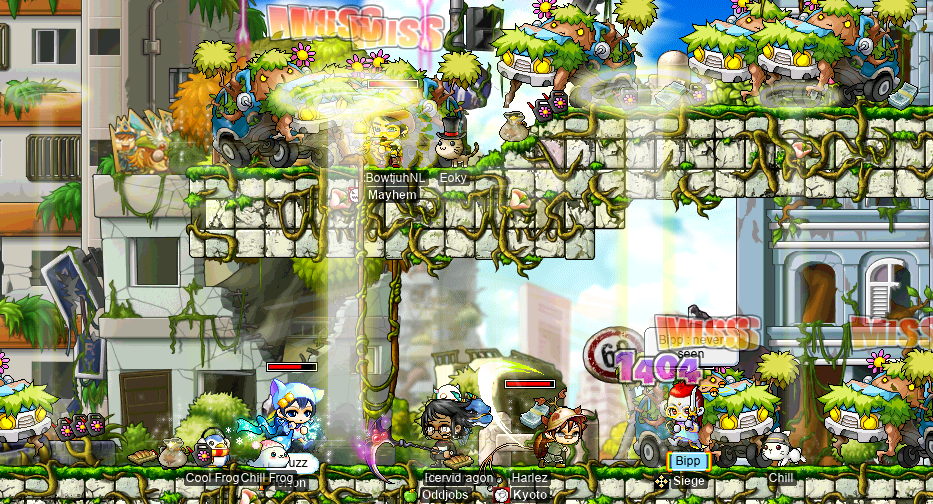

A real crowd-pleaser, that one.

And, eventually, with a lot of running around and exchanging ETCs, we were off to fight the oversized tree guy:

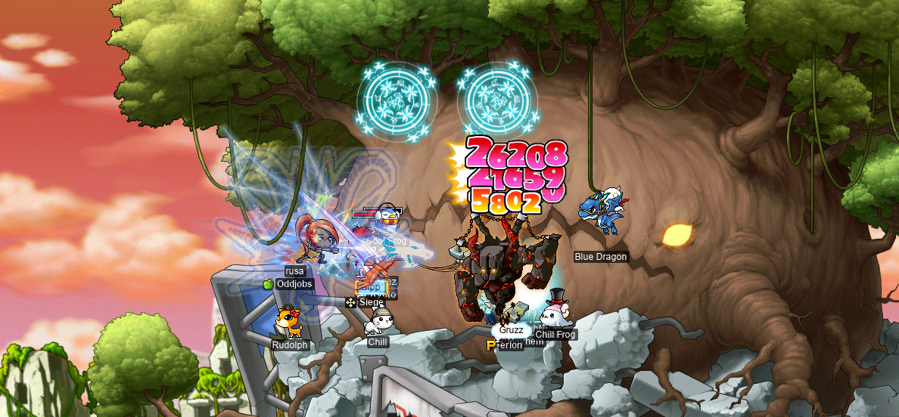

I was told that Krex doesn’t hit very hard, and found out the hard way that that’s not exactly true, when I accidentally touched the left eye and died whilst [’zerk](https://maplelegends.com/lib/skill?id=1320006)ing. Luckily, another upshot of having cervid with us was that I could just… [Resurrect](https://maplelegends.com/lib/skill?id=2321006) myself. Once, at least.

So, then I died while under the protection of [Smokescreen](https://maplelegends.com/lib/skill?id=4221006) and was kinda screwed (Resurrection has a large cooldown):

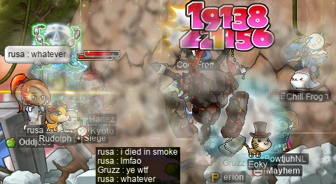

Then xBowtjuhNL died…

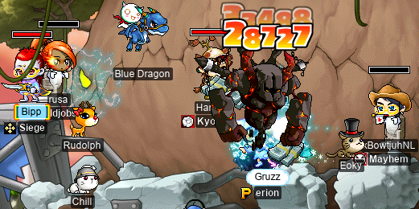

And then I died for the third time (but this time, on cervid). It wasn’t a great run. Maybe one day, I’ll be less sleep-deprived and actually kill this giant tree thing. For now, Krexel & I are on poor terms…

## alces takes down a few more quests~

It’s time for some more questing, with my [daggermit](https://oddjobs.codeberg.page/odd-jobs.html#dagger-assassin) **alces**~! To start things off, I wanted to finish up the rest of the Nihal Desert quests. One such quest was The Fairy in Despair questline, which starts with [The Fairy in Despair 1](https://bbb.hidden-street.net/quest/mu-lung-nihal-desert/the-fairy-in-despair-1). For this, I needed some [Lunar Pixie’s Moonpiece](https://maplelegends.com/lib/etc?id=4000060)s and (way too many) [Fierry’s Tentacle](https://maplelegends.com/lib/etc?id=4000068)s. Luckily, I had some of the tentacles hoarded on my [woodsmaster](https://oddjobs.codeberg.page/guides/introduction-to-odd-jobs/#woodswoman) **capreolina**, so I only had to hunt like two of them.

Questing w/ alces

With this, [Ericsson](https://maplelegends.com/lib/npc?id=2012018) was able to brew up some [Drop of Moon](https://maplelegends.com/lib/etc?id=4031700):

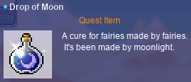

I guess that means that Ericsson is a fairy…? Anyways, [The Fairy in Despair 2](https://bbb.hidden-street.net/quest/mu-lung-nihal-desert/the-fairy-in-despair-2) is very similar, but meant that I had to go back to [Orbis](https://maplelegends.com/lib/map?id=200000000) and hunt some [Luster Pixie’s Sunpiece](https://maplelegends.com/lib/etc?id=4000061)s for Ericsson to make the corresponding [Drop of Sun](https://maplelegends.com/lib/etc?id=4031699). These quests are the source (indeed, the _only_ source) of [Phylia’s Warp Powder](https://maplelegends.com/lib/use?id=2030016), which is essentially a return scroll to [Magatia](https://maplelegends.com/lib/map?id=261000000) that only works from within the Nihal Desert region. Because the Nihal Desert consists only of Magatia and Ariant, the Warp Powder is only superior to a [nearest town return scroll](https://maplelegends.com/lib/use?id=2030000) when you’re in the Ariant region. And, even then, it’s usually similarly convenient to just use the [Camel Taxi](https://maplelegends.com/lib/npc?id=2110005). So, it’s not great. Even so, I wish it were more like [Warp Card](https://maplelegends.com/lib/etc?id=4031890)s — if you finish The Fairy in Despair 2, it would make more sense if you could purchase Phylia’s Warp Powders for a fixed meso price, from Phyllia (in addition to the Warp Powders that you already got from doing the questline).

I also completed [Humanoid Just Wants to be Human](https://bbb.hidden-street.net/quest/mu-lung-nihal-desert/humanoid-just-wants-to-be-human). I had already completed [Acquiring the Seed for the Snowfield Rose](https://bbb.hidden-street.net/quest/el-nath-mt-aquaroad/acquiring-the-seed-for-the-snowfield-rose), so I had to hunt down some [Pieces of Mithril](https://maplelegends.com/lib/etc?id=4000359) and [Gelatin](https://maplelegends.com/lib/etc?id=4000353)s. On my way to hunt down the mithril pieces, I encountered this familiar bug, wherein [Russellon](https://maplelegends.com/lib/npc?id=2111009) mysteriously takes flight as soon as I enter the room:

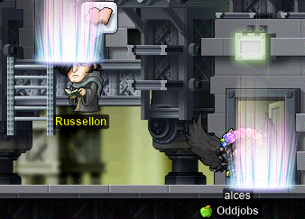

Having run there, Russy?

As part of this quest, I was sent to a special-sauce map where I had to temporarily play the role of horticulturist and grow some [Snow Rose](https://maplelegends.com/lib/etc?id=4031695)s:

I then went to do [A Present for Keeny](https://bbb.hidden-street.net/quest/mu-lung-nihal-desert/a-present-for-keeny), which called for [Pieces of Steel](https://maplelegends.com/lib/etc?id=4000357):

…and [Hardened Pieces of Steel](https://maplelegends.com/lib/etc?id=4000358):

With which, [Humanoid A](https://maplelegends.com/lib/npc?id=2111003) crafted [Mute’s Model](https://maplelegends.com/lib/etc?id=4031693):

At first, I wondered why it was called “Mute”’s Model. I guess I thought that the _mutae_ of Magatia had something to do with the [English](https://en.wikipedia.org/wiki/English_language) _mutate_, ultimately from the [Latin](https://en.wikipedia.org/wiki/Latin) [_mūtō_](https://en.wiktionary.org/wiki/muto#Latin) (which I guess meant a lot of things in Latin, but conferred onto [French](https://en.wikipedia.org/wiki/French_language) and English the sense of “alter, change”). Clearly, I don’t know any Latin, because _mutae_ (or rather, _mūtae_) is actually [declined](https://en.wikipedia.org/wiki/Declension) from [_mūtus_](https://en.wiktionary.org/wiki/mutus#Latin), an [adjective](https://en.wikipedia.org/wiki/Adjective) meaning “[mute](https://en.wikipedia.org/wiki/Muteness); silent, unspeaking”. The sense evolution is probably similar to the English [_dumbwaiter_](https://en.wiktionary.org/wiki/dumbwaiter#English) (see [_dumb_](https://en.wiktionary.org/wiki/dumb#English) as in “mute”), i.e. a machine (incapable of speech) doing the job of a human (ordinarily capable of speech).

I also did [Keeny’s Research on Roid](https://bbb.hidden-street.net/quest/mu-lung-nihal-desert/keenys-research-on-roid), [Keeny’s Research on Neo Huroid!](https://bbb.hidden-street.net/quest/mu-lung-nihal-desert/keenys-research-on-neo-huroid), and [Keeny’s Research on D\.Roid!!](https://bbb.hidden-street.net/quest/mu-lung-nihal-desert/keenys-research-on-droid), the latter of which required me to extract a [Broken Mechanical Heart](https://maplelegends.com/lib/etc?id=4000362) from our favourite undead robot [D. Roy](https://maplelegends.com/lib/monster?id=7110300):

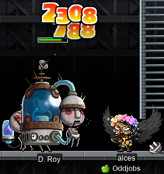

I took a break to try my hand at scrolling a [Khanjar](https://maplelegends.com/lib/equip?id=1092050). Khanjars are virtually worthless, it seems, as no one bothers to spend the money to scroll one, when they could “just” wait 40 levels for the [Dragon Khanjar](https://maplelegends.com/lib/equip?id=1092049) instead. For alces, getting to level 120 is a lot more daunting, so I threw some [shield WATK 70%](https://maplelegends.com/lib/use?id=2040916)s at a perfect clean Khanjar:

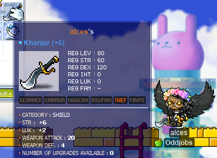

Holy moly!! Very nice :3 This is _basically_ alces’s endgame shield…

With that, I tidied up [The Importance of Life Alchemy](https://bbb.hidden-street.net/quest/mu-lung-nihal-desert/the-importance-of-life-alchemy) and [The Problems with Life Alchemy](https://bbb.hidden-street.net/quest/mu-lung-nihal-desert/the-problems-with-life-alchemy):

And that just about did it, for all the Nihal Desert quests.

So, I headed to Shanghai to do those quests…

The Shanghai quests are pretty simple. There’s basically just [Photographer Cho’s Request](https://maplelegends.com/lib/quest?id=4104), and the [Enraged Livestock](https://maplelegends.com/lib/quest?id=4100) questline. I’m not counting the [Owner Yeo](https://maplelegends.com/lib/npc?id=9310011) quests, because those quests are stupid (don’t @ me).

The Photographer Cho quest essentially amounts to 100 [Plow](https://maplelegends.com/lib/etc?id=4000193)s, so I went to hunt some bovines:

The main questline requires ETCs from a handful of species around the area. Along the way, I ran into a [fake Giant Centipede](https://maplelegends.com/lib/monster?id=9600009):

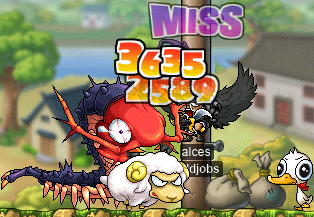

…And some [Sheepies](https://maplelegends.com/lib/monster?id=9600003) and [Goaties](https://maplelegends.com/lib/monster?id=9600004) (not to be confused with goatees, nor with “Greatest Of All Time In Every Sense”):

…Which led me to the dreaded [Black Sheep](https://maplelegends.com/lib/monster?id=9600008) map — well, maybe not so dreaded anymore:

It used to be impossible to get the Black Sheep card set after finishing the questline. The only map that spawns them is a quest-only map, so I went ahead and camped out here until I got my 5/5. I think that [Tienk](https://maplelegends.com/lib/npc?id=2006) now sells Black Sheep cards(?), and I noticed that I didn’t lose the [Shanghai Permit](https://maplelegends.com/lib/etc?id=4031289) after finishing the questline (although I’m not sure if it would actually work to get me back into that map — I didn’t test it).

In any case, this questline culminates in killing the big bad boss of Shanghai: [the _real_ Giant Centipede](https://maplelegends.com/lib/monster?id=9600010):

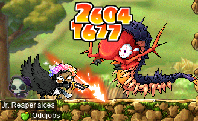

Fantastic. Now Shanghai is saved. Forever. At least, until I come back here to do the quests on another character…

## Las aventuras de ozotoceros

Aaaand we’re back on Maple Island, with my [DEXlander](https://oddjobs.codeberg.page/guides/introduction-to-odd-jobs/#islander) **ozotoceros** and her sidekick **bezoarticus**. In [the Pigs map](https://maplelegends.com/lib/map?id=1000006), as per usual. But this time, [_Ice Jeans_](https://maplelegends.com/lib/equip?id=1062000) are stuck at the top of the map…:

Las aventuras de ozotoceros…

But, I finally figured out that with a 6 JUMP [GSB](https://maplelegends.com/lib/equip?id=1442029), my 5 JUMP [White Gomushin](https://maplelegends.com/lib/equip?id=1072004), and a handy-dandy [Myo Myo Speed Potion](https://maplelegends.com/lib/use?id=2002001), it’s actually possible for me to get up there!:

Oh, and I hit level 39 :)

With this, I had even more unspent AP pent up in my CHARACTER STATS window:

I’ve been agonising over how I should spend my AP, now that I comfortably one-shot anything on the island 100% of the time with my [toob](https://maplelegends.com/lib/equip?id=1322022). STR has the advantage of sweet flex damage, which is great, but it otherwise offers nothing. DEX gives a little bit of damage, but is not nearly as flex-friendly as STR. But it does give AVOID, and better minimum damage, in case I use other weapons that have less WATK than my toob. LUK doesn’t contribute to damage at all, but gives twice as much AVOID as DEX. LUK is, in my humble opinion, the “sweaty” option — none of the other stats actually help with grinding speed (read: EPH), except for DEX, which only gives half as much AVOID as LUK. So LUK is simply the best option EPH-wise. And being… maybe not **un**touchable, but at least less-touchable, is pretty cool. Especially with that pesky giant ramp that they put in the Pigs map…

\[\[\[MAXIMUM SWEAT MODE ENGAGED\]\]\]

ozotoceros is officially a DEX/LUK hybridlander now :P

I ran into sinlander **ForkMaster**, who was hunting cards for his new main character **WaxiIlium**, and decided to help along the way (it’s nice to sometimes have something else to do, other than circle the Pigs map repeatedly):

For my help, ForkMaster bestowed upon me a triple gift of [sacred cake](https://maplelegends.com/lib/use?id=2020020)s:

Later, I was honoured to meet top islander **jung1e**, as well as a new islander by the name of **Contagion** (also pictured is **Kimberly**, a.k.a. **Gumby**):

jung1e asked me about the possibility of joining the **Suboptimal** alliance — jung1e’s guild, **Newbology**, is a [camper](https://oddjobs.codeberg.page/guides/introduction-to-odd-jobs/#camper)/islander-only guild. This makes Newbology similar to **Southperry**, which is already a member of Suboptimal; and indeed, the two used to be allied. jung1e created, and continues to maintain, Newbology as a continuation of a guild with the same name from official MapleStory, but generally redirects new islanders towards Southperry, because Newbology is not considered “active”. I was happy to add Newbology to Suboptimal, but I had to bear in mind that adding Newbology to the alliance would fill the alliance entirely — the maximum number of guilds in an alliance is five, and Suboptimal already had **Oddjobs**, **Flow**, Southperry, and **Victoria**. There were some other ideas floated around for other guilds that could join the alliance, so I made sure to let jung1e know that our only issue was space in the alliance, and he assured me that it wouldn’t be an issue if push came to shove and we had to make space in the alliance. So we allied!:

While I was doing the islander quest, I came across my first actually _good_ GSB that I’ve ever farmed myself…

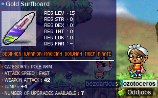

The WATK isn’t _quite_ perfect (just one shy), and the JUMP is the minimum possible, but hey… New personal best…

Many (many) [piggo](https://maplelegends.com/lib/monster?id=1210100)s later, and ozotoceros hit the big four-oh!!!:

Wowie! :D

## Meet kinds

Part of the Odd Job Initiative (see the beginning of the previous diary entry) is focused more inwardly, on the members **Oddjobs** (and generally, of **Suboptimal**) themselves. More specifically, focusing on stuff that we can do together — you know, PQs, bosses, and so on (even just grinding together is great). To that end, [SPQ (Sharenian Party Quest, a\.k\.a. Guild Party Quest)](https://maplelegends.com/lib/map?id=990000000) is something that I really wanna do, and that other people seem to be interested in, based on a survey that I put out. The great thing about SPQ (besides the fact that it’s fun) is how inclusive it is: basically anyone can participate.

But, there are still a few requirements expected of your guild’s expedition squad, when SPQing. One of those requirements is having a level ≤30 character who can do the [hat](https://maplelegends.com/lib/etc?id=4001034) room. And, furthermore, at some point you have to sacrifice someone to open the door to the final stage. Anyone can be sacrificed there (you can actually just walk back, after dying), but it’s common to have a single mule to fulfil both of the aforementioned roles. Because the hat room requires you to be level ≤30, SPQ mules coincide with [KPQ](https://maplelegends.com/lib/map?id=103000800) mules, which is nice. So, in order to have one at the ready for when we do eventually SPQ as a guild, I made an SPQ/KPQ mule of my own:

It takes all kinds

I thought about what job I wanted to make **[kinds][kind]**, and after considering various possibilities like [armed brawler](https://oddjobs.codeberg.page/odd-jobs.html#armed-brawler) and [dagger warrior](https://oddjobs.codeberg.page/guides/introduction-to-odd-jobs/#dagger-warrior), I settled on good ol’ [DEX warrior](https://oddjobs.codeberg.page/guides/introduction-to-odd-jobs/#dex-warrior)! In particular, DEX page; but the only real difference between page, fighter, and spearwoman here would be which weapon masteries I get access to (and even then, I only get one SP to spend on them…).

By pure coincidence, **Lv1Crook** (**Level1Crook**, **xXCrookXx**, **Sangatsu**) just so happened to make a KPQ mule, by the name of **[Ichigatsu](https://en.wikipedia.org/wiki/January)**, on the same day that I made [kinds][natural-kind]! Here we are, doing some [Nautilus](https://maplelegends.com/lib/map?id=120000000) quests at [the Piggos map in Henesys](https://maplelegends.com/lib/map?id=100020100):

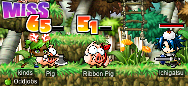

We also did the [Mano](https://maplelegends.com/lib/monster?id=2220000) quest ([Legend of the Snail](https://bbb.hidden-street.net/quest/victoria-island/legend-of-the-snail)):

Ichigatsu found a level 20 sword that effectively has the stats of a level **40** sword: the — well, not “the”, but _a_ — [Gladius](https://maplelegends.com/lib/equip?id=1302038)! For some god forsaken reason, [Chan](https://maplelegends.com/lib/npc?id=9270019) in the [Singapore CBD](https://maplelegends.com/lib/map?id=540000000) sells OoaK (one of a kind), untradeable, level 20 “Gladius”es for the eminently reasonable price of 40k mesos a pop. Ichigatsu asked if I had any [one-handed sword WATK 10%](https://maplelegends.com/lib/use?id=2043002)s… of course, I had hoarded over 200 of them (they drop from [CD](https://maplelegends.com/lib/monster?id=9410030)s). I watched as Ichigatsu failed many scrolls on these Gladiuses:

I had a go at scrolling these, as well. My original plan was to use an [Aluminum Baseball Bat](https://maplelegends.com/lib/equip?id=1402010), or something. But this sword is just too good. I went through… probably like ≈180 of my 10%s, probably ≈20M or so mesos (including the prices of the Gladiuses and of the [30%](https://maplelegends.com/lib/use?id=2043005)s), and had statistically unreasonably poor luck. I probably passed like 3% of the 10%s that I used, and more like 35% of the [60%](https://maplelegends.com/lib/use?id=2043001)s that I used… In the end, I was forced to just settle with an okay one. After failing 42 10%s in a row, I sHOuLd hAVe KnOwN To SToP, but I wanted to be brave and keep going until I got the sword that I wanted. Well…

Anywho, now that I had a sword and was level 21, it was time to give kinds a look of her own:

Nice! I found out that you can get this face at [Mt. Song Town](https://maplelegends.com/lib/map?id=702000000) — there’s no need to go all the way out to the [Night Market](https://maplelegends.com/lib/map?id=741000000). The description on the coupon that you buy in the Cash Shop is just weirdly misleading, for some reason.

I did some KPQs with **WaxiIlium**, the same WaxiIlium who I helped with card-hunting on Maple Island earlier!:

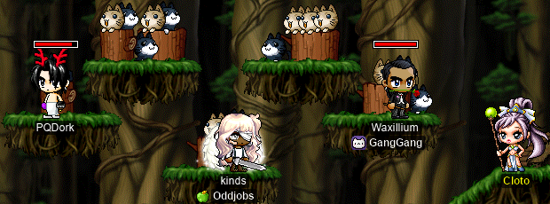

Had my first encounter with [the slime of slimes himself](https://maplelegends.com/lib/monster?id=9300003):

And did some KPQs with Ichigatsu, in which we pretended to be new to the game:

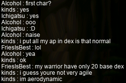

And collectively popped the King Slime, bringing his Slime Kingdom to mere ruins:

:)

[kind]: https://en.wikipedia.org/wiki/Kind_(type_theory)
[natural-kind]: https://en.wikipedia.org/wiki/Natural_kind

