# rangifer’s diary: pt. lxxvi

## Taxonomising odd jobs, pt. vi: Forestry. §2

In the previous section (§1) of this part (pt. vi), the idea was to construct (by hand) a [weak ordering](https://en.wikipedia.org/wiki/Weak_ordering) on our odd job [universe][universe], ordering by some suitable notion of “primitiveness”. The result of that effort can be found at [../072/weak\_ordering\.ron](../072/weak_ordering.ron). Now, we can use this weak ordering to constrain the construction (again, by hand) of a [rooted forest][tree] that _imitates_ a [phylogenetic tree](https://en.wikipedia.org/wiki/Phylogenetic_tree) — or [disjoint union](https://en.wikipedia.org/wiki/Disjoint_union_of_graphs) of phylogenetic trees, as the case may be. I _also_ want to explore the use of a slightly different structure (different from this rooted forest model), but that can come later.

In order to construct tree(s) by hand, we need some format to represent trees in! We’re going to use perhaps the most common format for representing trees for generic [phylogenetic](https://en.wikipedia.org/wiki/Phylogenetics) purposes: the [Newick format](https://en.wikipedia.org/wiki/Newick_format) (a simpler introduction can be found [here](https://evolution.genetics.washington.edu/phylip/newicktree.html) ([archived](https://web.archive.org/web/20211128055424/https://evolution.genetics.washington.edu/phylip/newicktree.html))). Newick format is really very simple, which is nice. It basically just uses nested round [brackets](https://en.wikipedia.org/wiki/Bracket) to represent the hierarchy of the tree — each pair of brackets represents an array of children that share a common parent. The [length/distance/weight](metric) of any given edge can optionally be specified by using the [colon][colon] notation (e\.g. `:4.2` for an edge with a length of 4\.2). A tree ends in a [semicolon](https://en.wikipedia.org/wiki/Semicolon). Newick format trees are stored in [files](https://en.wikipedia.org/wiki/Computer_file) with [filenames](https://en.wikipedia.org/wiki/Filename) that [end in](https://en.wikipedia.org/wiki/Filename_extension) `.tree` (or [sometimes, `.tre`](https://en.wikipedia.org/wiki/8.3_filename)).

Newick format is great for representing the tree data themselves, but not all that pretty to look at. For visuals, we need some kind of [plotting][plot] [library][lib] that is accustomed to handling tree data. I’m going to go with [toytree](https://github.com/eaton-lab/toytree), because it aims to be minimalist and provide a relatively simple [Python][py] interface (hence the “toy” in “toytree”).

To warm myself up and get myself used to all of these tools, I’m going to make a quite simple tree that _is_ labelled, but is _not_ weighted, and excludes all non-permabeginners. This sample tree can be found at [sample\.tree](./sample.tree), but I’ve also reproduced it here, for convenience:

```tree
(((LUKginner, DEXginner, wandginner), STRginner), ((((magelander, LUKlander, hybridlander), DEXlander), STRlander), camper));
```

To give a basic rendering of this, we can do something like:

```python
import toytree
import toyplot.svg

tree = toytree.tree("./sample.tree")
canvas, _, _ = tree.draw(ts="n", tip_labels_align=False)
toyplot.svg.render(canvas, "./sample.svg")
```

(The above listing can be found as [sample\.py](./sample.py).)

Which gets us this [SVG](https://en.wikipedia.org/wiki/Scalable_Vector_Graphics):

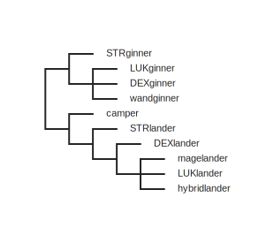

As you can see, it’s pretty basic; we just label the leaf nodes, and all edges are displayed with the same length. I’ve intentionally configured it to not align the labels along a vertical axis; [if we change to `tip_labels_align=True`](./sample1.py), we get:

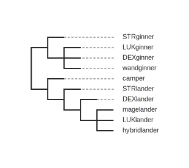

This latter style is somewhat more typical of phylogenetic tree diagrams, but I prefer the former here, because in our case, having the more “primitive” (read: [basal][basal]) jobs show up further to the left is visually nice (in my opinion).

We’re not assigning weights to the edges, because we don’t _really_ have a sense of time scale here. In principle, we could have a timescale based on the first genuine appearance of the odd job in question, but… that would imply actually having such information. Which, we don’t. As far as the graph structure itself goes, I want to quickly justify the sample tree that I showed above.

The tree starts by bifurcating into outland permabeginners and inland permabeginners. We then bifurcate the inlanders into campers and islanders. Of the outlanders, we consider STRginners to be the most basal. And of the islanders, we consider STRlanders to be the most basal. This is mostly pretty self-explanatory, except that you might ask why STRlanders in particular have been chosen as the sole most-basal islander job. My reasoning is that, at lower levels, STR tends to help islanders train faster. And putting into STR is just more obvious, much like it is for STRginners — after all, STR increases your [expected](https://en.wikipedia.org/wiki/Expected_value) damage output the most, out of all four main stats. DEXlander naturally pops out immediately after, as we realise that DEX is effectively the “main stat” for most islanders. And then we have the other islanders — magelander, LUKlander, and hybridlander — in no particular order. Similarly, the LUKginners, DEXginners, and wandginners are in no particular order, other than being less basal than STRginners.

In this kind of structure (as shown above, and the only kind of structure handled by toytree), the “inner nodes” (non-leaf vertices) are opaque. They don’t get names, but instead act merely as splitting points, with a presumed — but anonymous/opaque — [MRCA](https://en.wikipedia.org/wiki/Most_recent_common_ancestor). This is characteristic of phylogenetic trees, but not exactly what I had in mind when I wrote §5 of pt. iii of this series:

> Let 𝑂 be our set of odd jobs, and let (𝑂, ≲) be our [weak ordering](https://en.wikipedia.org/wiki/Weak_ordering) of odd jobs by “primitiveness” (or whatever), where 𝑜 ≲ 𝑝 (𝑜, 𝑝 [∈][element] 𝑂) is interpreted as “𝑜 is more ‘primitive’ than 𝑝”. Suppose that we produce a single rooted tree 𝑇 = (𝑂, 𝐸), which has a tree-order (𝑂, ≤). **Then we want to maintain the following invariant:** 𝑜 ≤ 𝑝 [→](https://en.wikipedia.org/wiki/Material_conditional) 𝑜 ≲ 𝑝. I should stress that this is a one-way implication, **not** an [iff](https://en.wikipedia.org/wiki/If_and_only_if).

If all of the inner nodes are opaque, and only the leaves actually represent our odd jobs, then “𝑜 ≤ 𝑝” never actually holds when 𝑜 ≠ 𝑝, making the [implication](https://en.wikipedia.org/wiki/Material_conditional) above always [vacuously true](https://en.wikipedia.org/wiki/Vacuous_truth). “𝑜 ≤ 𝑝” never actually holds because the tree-order is defined as: 𝑜 ≤ 𝑝 iff the unique path from the root to 𝑝 contains 𝑜. But all 𝑜 and all 𝑝 are leaves, so this is only true when 𝑜 = 𝑝. In our true phylogenetic tree case, tree-order is just not going to cut it. Instead, we need “≤” to be defined as something like: 𝑜 ≤ 𝑝 iff the unique path from the root to 𝑜 is not longer than the unique path from the root to 𝑝. Then, defining “length” here requires that we actually assign a weight to each edge, or else consider each edge to have a weight of 1.

Note that “≤” is technically a _weak_ ordering now, not so much a [partial](https://en.wikipedia.org/wiki/Partially_ordered_set) one. Two distinct leaves might have the same distance from the root. And, every leaf has a distance from the root, so they are all [comparable](https://en.wikipedia.org/wiki/Connected_relation). So, we no longer want to phrase our constraint as “𝑜 ≤ 𝑝 → 𝑜 ≲ 𝑝” — the whole point of insisting on a one-way implication before was because “≤” was not [connected](https://en.wikipedia.org/wiki/Connected_relation), but “≲” _was_. So making the implication two-way would force “≤” to be not so partial anymore, and our rooted forest would be [very boring indeed](https://en.wikipedia.org/wiki/Path_graph). _Now_, however, we have something very different going on. Let’s name the new version of “≤” as “≾” to reflect the fact that it’s now (technically) a weak ordering, and write our hand-constructed weak ordering in terms of its [**strict** weak ordering](https://en.wikipedia.org/wiki/Weak_ordering#Strict_weak_orderings) “≺”. **Then we want to maintain the following invariant:** 𝑜 ≺ 𝑝 → 𝑜 ≾ 𝑝. Again, this is a **one-way** implication, so that “≺” can remain truly partial (as in, unconnected).

So, let’s try doing something very similar to the sample trees above, but weight the edges this time, and then ensure that our new constraint of “𝑜 ≺ 𝑝 → 𝑜 ≾ 𝑝” holds. You can find this weighted tree at [sample\_weighted\.tree](./sample_weighted.tree), and I’ve also reproduced it below, for convenience:

```tree
(((LUKginner:1, DEXginner:1, wandginner:1):5, STRginner:0.5):1, (((((magelander:1, LUKlander:2):2, DEXlander:0.5):1, hybridlander:1):0.5, STRlander:1):0.5, camper:3):1);
```

I’ve actually changed the structure of the tree here, not just the weights. It’s just slightly more complicated now, with hybridlander being split off from the LUKlander and magelander, and actually put in a more basal position than the DEXlander. The reasoning is basically just to consider hybridlanders as possibly STR/DEX hybrids (in addition to their more general, experimental nature: any combination of two or more of STR, DEX, and/or LUK), which justifies their position at the very beginning of our hand-constructed weak ordering. Then, pure-DEX or close-to-pure-DEX islanders (a\.k\.a DEXlanders) can come just a bit later than the STRlanders and STR/DEX hybrids.

Running [sample\_weighted\.py](sample_weighted.py) gets us the following diagram:

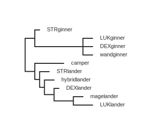

As you can see, we’ve had to distend the edge onto which the camper is directly connected, and the edge onto which the LUKginner/DEXginner/wandginner [clade](https://en.wikipedia.org/wiki/Clade) is directly connected. This is a result of our 𝑜 ≺ 𝑝 → 𝑜 ≾ 𝑝 constraint. Campers come strictly later than STRlanders, DEXlanders, and hybridlanders in our hand-constructed weak ordering.

Okay, I think that’s about enough of that stuff. For funsies, let’s use the sample\_weighted\.tree graph data to [mess around with just a few of toytree’s settings](./sample_funsies.py):

<details>
<summary>Just goofin’…</summary>

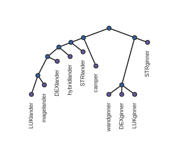

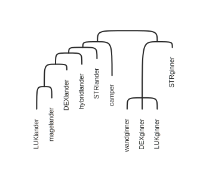

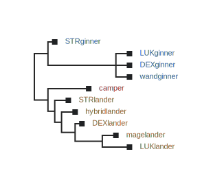

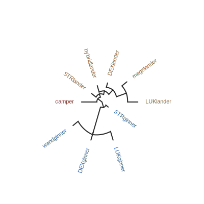

</details>

[universe]: https://en.wikipedia.org/wiki/Universe_%28mathematics%29
[tree]: https://en.wikipedia.org/wiki/Tree_(graph_theory)
[metric]: https://en.wikipedia.org/wiki/Metric_(mathematics)
[colon]: https://en.wikipedia.org/wiki/Colon_(punctuation)
[plot]: https://en.wikipedia.org/wiki/Plot_(graphics)
[lib]: https://en.wikipedia.org/wiki/Library_(computing)
[py]: https://en.wikipedia.org/wiki/Python_(programming_language)
[basal]: https://en.wikipedia.org/wiki/Basal_(phylogenetics)
[element]: https://en.wikipedia.org/wiki/Element_(mathematics)

## All-odd bossing!

We’ve managed to put together a few spontaneous all-odd boss runs, featuring mostly members of the **Suboptimal** alliance, but also of our wider Suboptimal-**Dream** meta-alliance, and even level 151 [permabeginner](https://oddjobs.codeberg.page/guides/introduction-to-odd-jobs/#permabeginner-outland) **Without** of **Spirit**!

First up was \#[glaive](https://maplelegends.com/lib/equip?id=1442068)gang — featuring **OmokTeacher** (**Slime**), **Taima** (**Nyanners**, **Tacgnol**, **Boymoder**, **Hanyou**), **Gumby** (**Kimberly**; actually the only one not using a [Crimson Arcglaive](https://maplelegends.com/lib/equip?id=1442068), but you can’t tell because of the NX weapon cover), **LawdHeComin** (**Snel**), and my [STR bishop](https://oddjobs.codeberg.page/guides/introduction-to-odd-jobs/#str-mage) **cervid** — taking on [Captain Latanica](https://maplelegends.com/lib/monster?id=9420513)!

<details>
<summary>All-odd-jobbed bossing~</summary>


During our second run, all three of the ’ginners in our party met an unfortunate demise. Dying to Capt. Latanica is a comfortable classic, as Capt. Lat is capable of dishing up as much as 4k damage with a single magic attack. The strategy here was essentially to hug Capt. Lat and try to only take touch damage from him and from the smaller monsters that he spawns. When that failed, and I had already used my [Resurrection](https://maplelegends.com/lib/skill?id=2321006) during the previous run (pesky 57-minute cooldown…), only the goofy-AP mages (LawdHeComin is an F/P [gish](https://oddjobs.codeberg.page/guides/introduction-to-odd-jobs/#gish)) remained:


A card dropped from this second run, and unfortunately Gumby couldn’t be alive to loot it — he’s been 4/5 Capt. Lat for a while now, and could really use the set. But cervid was also 4/5, so it was time to finish that set!:


Later, I set up a [Headless Horseman (HH)](https://maplelegends.com/lib/monster?id=9400549) run with STRginners **Daddyo** (**Dexual**) and **Without** (**Contagion**). Without is somewhat of a “leechginner” (levelled via leech, usually high base INT for washing purposes), but only has 175 base INT (not that much for a level 151 character), so they were able to fight competently alongside Daddyo and I:


Notice Without’s unusual choice of weaponry here: the [Sky Ski](https://maplelegends.com/lib/equip?id=1432018). I asked Without if they used it for aesthetic purposes, and they said yes. For those not aware, spears and polearms have a 60% chance of swinging (and thus 40% chance of stabbing) when basic-attacking (or using any attack that animates like a basic-attack, e\.g. [Power Strike](https://maplelegends.com/lib/skill?id=1001004) or [Slash Blast](https://maplelegends.com/lib/skill?id=1001005)), so spears have a pretty clear disadvantage that makes them practically unusable for permabeginners (and for some other jobs as well).


And, down goes the horse with their horseman…

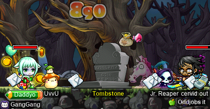

We killed not one, but _two_ HHs, both at [Hollowed \[_sic_\] Ground](https://maplelegends.com/lib/map?id=682000001)! Each fight took us somewhere around 22–25 minutes.

Not too long afterwards, I ran into [permapirate](https://oddjobs.codeberg.page/guides/introduction-to-odd-jobs/#permapirate) **Copo**, who actually went hunting for a HH as well, in search of… you know, somethin’ to shoot at. Unfortunately, HH is level 101, which was like 37 levels higher than Copo. So accuracy was a real issue (even being pure DEX), and the −37% damage penalty doesn’t exactly help either… But I helped Copo calculate exactly how much WACC was necessary for him to hit HH 100% of the time, and gave him some of the [Maple Pop](https://maplelegends.com/lib/use?id=2022251)s that I had on hand. And, in order to ensure Copo’s survival (as he didn’t have enough MAXHP to actually handle a magic attack from HH), I took my [darksterity knight](https://oddjobs.codeberg.page/guides/introduction-to-odd-jobs/#dex-warrior) **rusa** to duo with him:


rusa kills HH pretty quickly now, so these fights (we killed two HHs) probably only took around ≈3 minutes each. Because Copo was not in level range (i.e. not even close to being level ≥96), the EXP that he got was purely from the damage that he actually did on his own. But, still pretty decent experience at such a low level!

</details>

## alces tries out Kid Mannequins

My [daggermit](https://oddjobs.codeberg.page/odd-jobs.html#dagger-assassin) **alces** has mostly been questin’ it up — although I do quite enjoy doing various quests on my various characters, alces has been my dedicated “quester” character ever since she was level ≈56 or so. Of course, I took some breaks from doing quests in order to get some much-needed PQs in (read: [OPQ](https://maplelegends.com/lib/map?id=200080101)s and very many [MPQ](https://maplelegends.com/lib/map?id=261000021)s), but the point is that I’ve not really been grinding other than the occasional [Fancy Amplifier (FA)](https://maplelegends.com/lib/monster?id=9410029) grind sesh with [permarogue](https://oddjobs.codeberg.page/guides/introduction-to-odd-jobs/#permarogue) **xX17Xx**. Well, that recently changed a bit.

I tried some duo grinding with [STRginner](https://oddjobs.codeberg.page/guides/introduction-to-odd-jobs/#permabeginner-outland) **Permanovice** (**Battlesage**, **Dreamscapes**, **Paean**, **Hanger**), and we decided to go to [Kid Mannequins (KMs)](https://maplelegends.com/lib/monster?id=9410032) for that purpose:


It’s commonly understood (amongst those who play odd jobs where this actually matters) that [Taipei 101](https://maplelegends.com/lib/map?id=742000000) is the go-to place — essentially the “endgame spot” — for grinding amongst those who never get access to multi-target attacking skills (and also no access to special attacks like [Meso Explosion](https://maplelegends.com/lib/skill?id=4211006)). The EXP/HP ratios, and the map layouts, are just too favourable to be beaten out by anything else in the game. Of course, other locations still make sense for other reasons — particularly, training at TP101 can be quite expensive due to the sheer amount of damage that TP101 monsters deal. So other locations, like e\.g. [GS2](https://maplelegends.com/lib/map?id=541010010), [Voodoos](https://maplelegends.com/lib/map?id=682000501), and [TfoG](https://maplelegends.com/lib/map?id=105040306), still have their uses. But TP101 is the place to go for EPH…


Woohoo~! I went back and did some solo grinding in the same location, after Permanovice and I finished duoing. A little `@epm 3` test revealed about how much EXP I was capable of churning out here on my own:


3\.1M EPH… Very solid!! The auto-aggro that KMs have is quite useful for short-ranged attackers like permabeginners and daggermits.

Later, I had the pleasure of duoing KMs with fellow daggermit **Keppet** (**Rapskal**)! With this, we were getting quite impressive EPH numbers o\_o:


4M EPH!! And with that, alces is now level 94… :)


## Avenging myself against Krexel

In the previous diary entry, I talked about how I suffered multiple deaths at the hands of (at the branches of…?) [Krexel](https://maplelegends.com/lib/monster?id=9420521) while dual-clienting there with my [darksterity knight](https://oddjobs.codeberg.page/guides/introduction-to-odd-jobs/#dex-warrior) **rusa** (doing the attacking) and my pure [STR bishop](https://oddjobs.codeberg.page/guides/introduction-to-odd-jobs/#str-mage) **cervid** (AFKing at the bottom and casting [HS](https://maplelegends.com/lib/skill?id=2311003) because she’s not high enough level to get EXP :( ). Well, ’tis time to enact avengement…

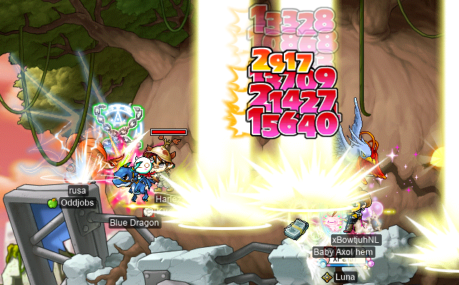

I did something very similar this time, running Krex with **Harlez**, **xBowtjuhNL**, and **xFaith**! And this time, I actually lived through it!! Here we are, killing the second eye, which conveniently has a kind of “pocket” of footholds that you can sit in and attack from, without getting pushed out of the pocket by Krex’s attacks:

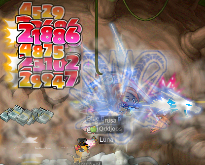

Somewhat annoyingly, you still suffer from the effect wherein repeated attacks without moving stop producing _actual attacks_ after 60–90 seconds or so. And moving enough to actually count as “moving” for the purpose of this effect is somewhat tricky while you’re in the pocket.

Our second run (which I survived as well, by the way!!) featured a level 200(!) buccaneer by the name of **TTKirnk**! With all of the buffs that I was getting, and my newfound love for The Pocket™, I tried a `@dpm` test to see how my damage was doing:


85\.3M DPH… _Y I K E S_ .


Cool-looking [card](https://maplelegends.com/lib/use?id=2388060)! And I’m now the saviour of Ulu City!! Very nice. I’m sure they have a very nice reward in store for me…

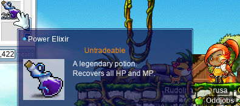

Twenty (20) _untradeable_ [Power Elixir](https://maplelegends.com/lib/use?id=2000005)s that don’t even stack with normal Power Elixirs? Okay… I see how it is… It’s because I died the first time, isn’t it?

## Doing my first-ever couples-only APQ!

I got together with my usual [APQ](https://maplelegends.com/lib/map?id=670010100) partner **xXCrookXx** (**Lvl1Crook**, **Level1Crook**, **Sangatsu**, **Ichigatsu**), as well as **TerakadoTsuu** & **FatherSteaks**, and **kookiechan** (**kookietann**, **kurisuwu**) & **Permanovice** (**Dreamscapes**, **Battlesage**, **Paean**, **Hanger**)… for an all-couples APQ!! That’s right… the all-couples APQ party that we have collectively been dreaming of, as viclockers, since day one. The dream, of course, is winning one of those [fancy seven-slotted cape](https://maplelegends.com/lib/equip?id=1102104)s! So many slots with which to [boom](https://maplelegends.com/lib/use?id=2041035) it!!

Anyways, the APQ went great. The [Grog](https://maplelegends.com/lib/monster?id=9400514) fight was a bit interesting, as none of us were particularly good at boss-fighting…

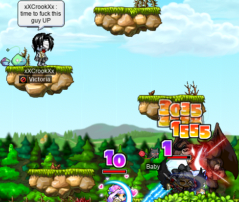

xXCrookXx popped an [apple](https://maplelegends.com/lib/use?id=2022179) or two…

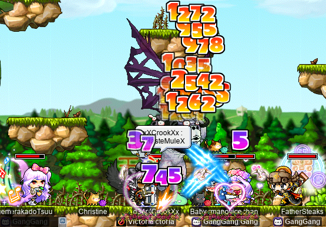

And, after a thoroughly satisfying Grog fight, we were very excited to try out the couples-only bonus stage of APQ. Not sure what to expect, I started the bonus stage, causing each couple to be teleported to their own JQ:

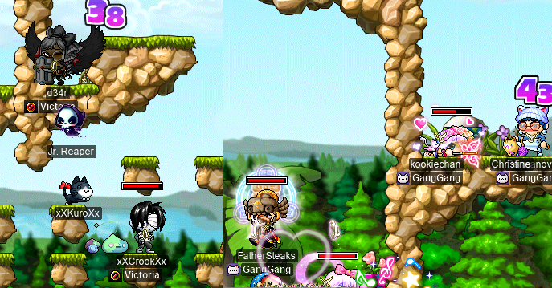

These “JQ”s are a little strange; none of them really require much “jumping” skill _per se_, but there are a number of bizarrely-placed teleporters that you just kind of have to stumble upon by… hitting a certain corner of a rock at the right angle, or whatever. Along the way, we broke some boxes, which didn’t immediately appear to do anything when broken. Once we got to the top of our JQs, we confirmed that all boxes in all of the JQs had been broken… but [Amos](https://maplelegends.com/lib/npc?id=9201045) was still looking for some [code piece](https://maplelegends.com/lib/etc?id=4031597)s?

Turns out, the all-couples bonus stage of APQ is just broken .\_.


We researched it afterwards, and found out that the boxes are supposed to spawn monsters when broken (instead of, you know, doing nothing). I [reported this bug on the MapleLegends forums](https://forum.maplelegends.com/index.php?threads/apq-bonus-stage-couples-only-doesn%E2%80%99t-work-at-all.43598/), and Kimmy confirmed that the bug is known, and was a regression caused by some rework of the [scripts][nashorn] used by APQ.

Soooo… R\.I\.P. the dream. ;~; Maybe someday…!

[nashorn]: https://en.wikipedia.org/wiki/Nashorn_(JavaScript_engine)

## sorts @ LPQ

I’ve been doing the odd [LPQ](https://maplelegends.com/lib/map?id=221024500) here and there on my [DEX brawler](https://oddjobs.codeberg.page/guides/introduction-to-odd-jobs/#dex-brawler) LPQ mule **sorts**, to help out some of my guildies! I did a handful of LPQs with the honourable steelwoman\* [permawarrior](https://oddjobs.codeberg.page/guides/introduction-to-odd-jobs/#permawarrior) **Nyanners** (**Taima**, **Boymoder**, **Tacgnol**, **Hanyou**, **Gambolpuddy**, **Numidium**), and [clerish](https://oddjobs.codeberg.page/guides/introduction-to-odd-jobs/#gish) **tb303** (**2sus4u**)!:

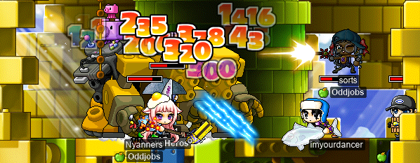

During our LPQscapades, a curious party member asked Nyanners why she was still a first-job warrior:


It’s understandable, really. One person can only take so much punishment.

Later, I joined [clericlet](https://oddjobs.codeberg.page/guides/introduction-to-odd-jobs/#magelet) **Cassandro** in some LPQing, as well!:


We had some good “fun” with [stage 8](https://maplelegends.com/lib/map?id=922010800) with this party… :))

<details>
<summary>Footnotes for “sorts @ LPQ”</summary>

\*Steel(wo)man is a variation on iron(wo)man that lifts the restriction on partying. *Un*like iron(wo)men, steel(wo)men _can_ be in parties of size greater than one; but _like_ iron(wo)men, steel(wo)men cannot trade with, nor receive any items/mesos from, other characters. Steel(wo)men are so called because [steels](https://en.wikipedia.org/wiki/Steel) are the most common [alloys](https://en.wikipedia.org/wiki/Alloy) that are derived from [iron](https://en.wikipedia.org/wiki/Iron). In Nyanners’s case, the purpose of adding the [carbon](https://en.wikipedia.org/wiki/Carbon) is to allow PQing, especially for those PQ boss cards, and those PQ-only equipment items!

</details>

## Zakum~

In the previous diary entry, my [darksterity knight](https://oddjobs.codeberg.page/guides/introduction-to-odd-jobs/#dex-warrior) **rusa** fought [big bad lava rock guy](https://maplelegends.com/lib/monster?id=8800000) for the first time (you can even [watch a video of it here](https://www.youtube.com/watch?v=xWgubC7g9nM))! Well, I’ve been doing a little more igneous rock stabbing, to hone my skills…

<details>
<summary>Zaqqum…</summary>

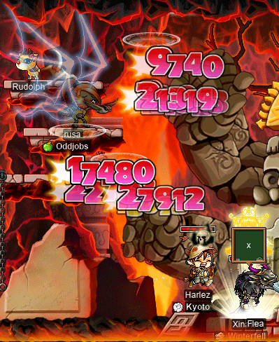

And when I say “hone my skills”, I don’t just mean gaining EXP so that I can gain more SP (although that is a big part of it); I also mean _actually [zerk](https://maplelegends.com/lib/skill?id=1320006)ing_, without dying by getting bodychecked by a crumbly [Mayan](https://en.wikipedia.org/wiki/Maya_civilization) statue…

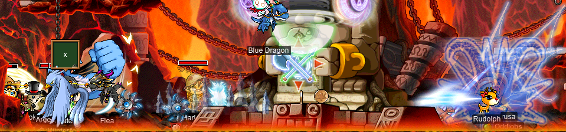

I call this “Bravery Mode™” (or “Hubris Mode™”, if I die…), in which I turn to the bishop(s) and declare that I don’t need their filthy green [Heal](https://maplelegends.com/lib/skill?id=2301002)ing, because I prefer to die alone. On the right-hand side of Zakum. Thank you _very_ much.

Thankfully, I didn’t actually do any dying. This was particularly good, because I had the distinct honour of selling my very first handful of [zhelm](https://maplelegends.com/lib/equip?id=1002357)s!! That’s right; not _buying_ them, but actually being one of the “sellers”. All of my experiences with Zakum in the past have been, well, mostly just letting Zakum murder me repeatedly, so that People Who Are Very Strong™ could [resurrect](https://maplelegends.com/lib/skill?id=2321006) me at the end, so that I could (hopefully) loot some zhelm(s). Once or twice, I actually fearpotted\* my way through a Zakum, while People Who Are Very Strong™ killed it, so that I could (hopefully) loot some zhelm(s) when they were finished. Well, this time I got to be (or pretend to be‽) a Person Who Is Very Strong™!!!!:


:D

Oh, and I did a `@dpm` test during that run…


OOOF — 89.9M DPH, wot da hecc… [SI](https://maplelegends.com/lib/skill?id=5121009)+[SE](https://maplelegends.com/lib/skill?id=3221002) is too powerful…

We did another AFK Zakum run after that, but it didn’t go quite so well… \>.\< **Harlez**’s (**Hucc**, **VigiI**) internet went out before we were even done with the arms, which was a terrible start. Then, one of our bishops had some ’net issues too, and the lag caused them to die. The run took longer to start, and longer to finish, than expected, so **CtrlNoble** (**NobIe**, **xNoble**, **Romilles**, **1122**) was unexpectedly forced to AFK during a chunk of the fight. With all of this, it got to the point where we were seriously running low on resurrections, and we had no choice but to put me into the buyers’ party so that I could furiously spam [HB](https://maplelegends.com/lib/skill?id=1301007) as we used our final resurrection to bring the buyers back from the grave. We instructed the buyers that they would have to fearpot, for the remainder of the fight (aided by some Healing), in order to survive. But, by that point, it was all falling apart anyways. The same bishop was still having massive lag spike issues, and died again to another spike. And the buyers fared no better. So CtrlNoble, **xBowtjuhNL**, and myself finished off the run by ourselves… and went to apologise to the buyers. We even chatted with one of the buyers and answered some of their questions about the Zakum-fighting process. Hopefully they did get their helm that next day, as promised (I wasn’t there)!

In the meantime, I did a little sadsadgrinding at [ye olde CDs](https://maplelegends.com/lib/map?id=742010203)…


[137](https://en.wikipedia.org/wiki/Fine-structure_constant)~ Wowie~!!

And I got a new [poky sticc](https://maplelegends.com/lib/equip?id=1432018) for rusa and my [swashbuckler](https://oddjobs.codeberg.page/guides/introduction-to-odd-jobs/#swashbuckler) **hydropotina**!!!:

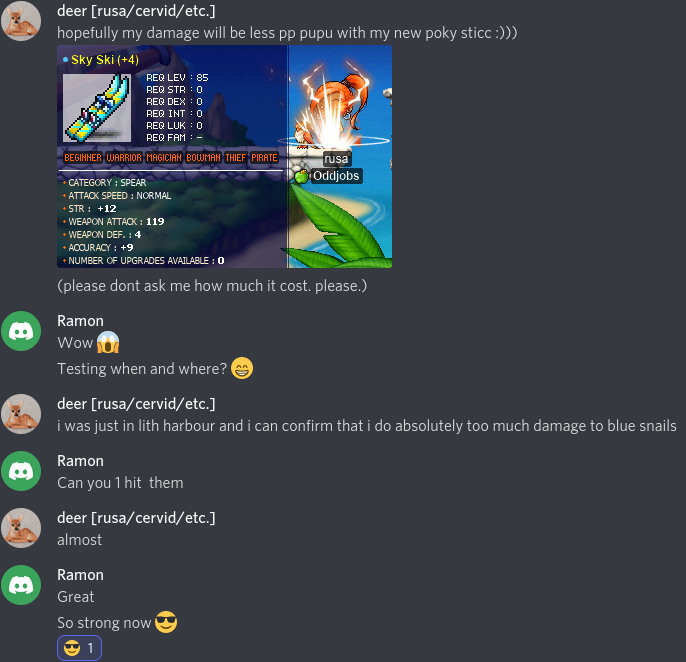

That’s a mighty fine pokin’ sticc. Farewell, mesos~

And I did some more “SLAP, SLAP, SLAP, SLAP, SLAP, …” at [7F](https://maplelegends.com/lib/map?id=702070400) to get to level 138!!! o\_o:


Little did I know, I was going to need more than just a levelup to handle this next Zakum fight. As xBowtjuhNL was recruiting for another fight, he was having a real hard time finding any bishops. But technically, all we _really_ needed was some [HS](https://maplelegends.com/lib/skill?id=2311003)… soooo… xBowtjuhNL asked me to bring my pure [STR bishop](https://oddjobs.codeberg.page/guides/introduction-to-odd-jobs/#str-mage) **cervid** along \>\.o

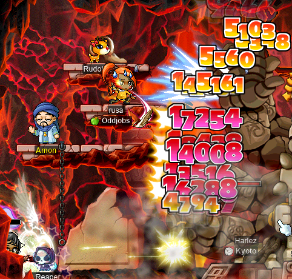

EXP wouldn’t be an issue; because cervid was level \<135, she wouldn’t be able to get any shared EXP anyways. Of course, I still had to survive on both characters! This proved to be a bit tricky when Zakum started 1/1ing, and cervid’s auto-HP failed to trigger at all after a 1/1, more often than not. Luckily, I was quick enough to catch this, and prevent any deaths, by manually potting for a bit, until xBowtjuhNL dropped me some [Ginger Ales](https://maplelegends.com/lib/use?id=2002023). I was taught (in the middle of battle) of a technique wherein you bind a potion that heals some HP _and_ some MP to both your auto-HP _and_ your auto-MP pouches. Assuming no autopot failures, this would cause the potion to be consumed _twice_ any time that you get 1/1’d. And it’s obviously more resistant to autopot failures, due to the potion being consumed _at least_ once per 1/1, unless both autopot pouches simultaneously fail (possible, I guess, but very unlikely). Unfortunately, this meant that I was draining xBowtjuhNL of his Ginger Ales, because I didn’t have any HP-and-MP potions of my own… But we had just _barely_ enough to make it work. If I ever have to do this again, I’ll be more prepared, armed with this knowledge… But hopefully, I don’t have to do this again LMAO

</details>

<details>
<summary>Footnotes for “Zakum~”</summary>

## \*fearpot

### Pronunciation

/ˈfɪəpɒt/, /ˈfɪɹpɑt/

### Etymology

From _fear_ + _pot_ (verb; orthographic clipping of “\[to use a\] potion”).

### Verb

**fearpot** (_third-person singular simple present_ **fearpots**, _present participle_ **fearpotting**, _simple past & past participle_ **fearpotted**)

1. (_intransitive_, _colloquial_, _MapleStory_) To attempt to survive in dire combat — particularly, wherein the player could be killed by any two incoming attacks not separated by some form of healing — by the excruciatingly precise consumption of HP (and possibly also MP) potions.

</details>

## Chillin’ w/ panolia

I was invited to [a certain Ninja Castle Hallway](https://maplelegends.com/lib/map?id=800040203) (there are, confusingly, [many maps with that same name](https://maplelegends.com/lib/map?search=ninja+castle+hallway)) by INTlaw **Lvl1Crook** (**xXCrookXx**, **Level1Crook**, **Sangatsu**, **Ichigatsu**), who was card-hunting in Japan and assured me that this was a quite good map to train on. This map is populated by [Kunoichi](https://maplelegends.com/lib/monster?id=9400406) (notable for dropping [Diamond Dagger](https://maplelegends.com/lib/equip?id=1332054), [Daiwa Sword](https://maplelegends.com/lib/equip?id=1402017), [Aluminum Bat](https://maplelegends.com/lib/equip?id=1402029), [face AVOID 70%](https://maplelegends.com/lib/use?id=2040109), and [shield WATK 60%](https://maplelegends.com/lib/use?id=2040914)) and [Chunin](https://maplelegends.com/lib/monster?id=9400401) (notable for dropping [Thermometer](https://maplelegends.com/lib/equip?id=1402014), [Dark Snowboard](https://maplelegends.com/lib/equip?id=1442016), [shield WATK 30%](https://maplelegends.com/lib/use?id=2040917), and [face HP 60%](https://maplelegends.com/lib/use?id=2040101)). The map can be easily duoed by having one party member go back & forth along the top of the map, while the other member goes back & forth along the bottom. We were able to scrape some pretty decent EPH out of it, so it’s likely a pretty good grinding map for those in the 55–70 level range or so.

Oh, and the cards:

<details>
<summary>Chilled pan oiling</summary>


We were joined by **Taima** (**Hanyou**, **Nyanners**, **Boymoder**, **Tacgnol**, **Gambolpuddy**, **Numidium**), with whom we casually trioed the map:

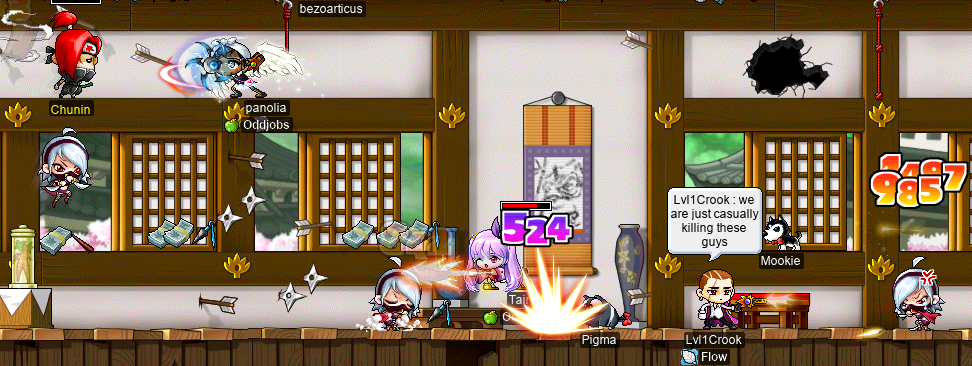

After a while, we were lucky enough to find some Aluminum Bats, so I tried my hand at scrolling one with a [30%](https://maplelegends.com/lib/use?id=2044005). It failed but didn’t blow the thing up. Then, I tried again with another clean bat that was even better:


Nice!! Because of my past misfortune with Aluminum Bats (see pt. lv of this diary), and because none of us were aware of any other actually good Aluminum Bats out there, we decided that this bat was deserving of just some [60%](https://maplelegends.com/lib/use?id=2044001)s. And it turned out very well!!:

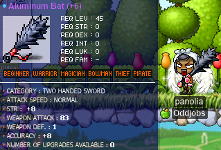

We had Hanyou, our resident [DEX WK](https://oddjobs.codeberg.page/guides/introduction-to-odd-jobs/#dex-warrior), test the thing out:


And we stopped our Ninja Castle romp in order to attend the wedding of **trishaa** (ex-**Flow**) and **TheUnholy** (of Flow)! As is typical of the unnecessarily confusing MapleStory implementation of weddings, the first wedding attempt was unintentionally prematurely ended. But, during this first attempt, those of us in the audience were goading the couple to give a wedding speech, which they had not actually prepared. So, starting the wedding over gave TheUnholy some time to prepare one. So we were all glad to have started over:


The speech was very sweet, and I think there were a few “I’m not crying, _you’re_ crying”s from the audience. :')

And then, we had cake…:


And we all got our respective single [Elixir](https://maplelegends.com/lib/use?id=2000004)s from the [Onyx Chest](https://maplelegends.com/lib/etc?id=4031423)s! Fantastic.

</details>

## Quests, wif woosa

I had a few quests lying around that I wanted to do on my [darksterity knight](https://oddjobs.codeberg.page/guides/introduction-to-odd-jobs/#dex-warrior) **rusa**, including the [Badge of a Squad Member](https://global.hidden-street.net/quest/leafre/badge-of-a-squad-member) and [Savior Of Ulu City](https://bbb.hidden-street.net/quest/singapore/savior-of-ulu-city) quests, both of which I had essentially already finished. As detailed above, I managed to kill [Krexel](https://maplelegends.com/lib/monster?id=9420521) for the first time, which was all that I needed to finish up Savior Of Ulu City.

But I also had the ETCs required for Badge of a Squad Member! This quest requires [all](https://maplelegends.com/lib/etc?id=4001080) three [Marks](https://maplelegends.com/lib/etc?id=4001081) of the [Squad](https://maplelegends.com/lib/etc?id=4001082), which can only be obtained from the various stages of HTPQ (**H**orn**t**ail **P**arty **Q**uest). I did HTPQ already (see pt. lxix of this diary), and got the Marks from there. The Certificates, on the other hand, must be obtained from three different bosses: [Pianus](https://maplelegends.com/lib/monster?id=8510000) (see pt. lxix of this diary), [Papulatus](https://maplelegends.com/lib/monster?id=8500001), and [Zakum](https://maplelegends.com/lib/monster?id=8800000) (see the previous diary entry):


Killing Zakum was the last piece of the puzzle, and with that, [Moira](https://maplelegends.com/lib/npc?id=2081006) was happy to present to me the [Certificate of the Dragon Squad](https://maplelegends.com/lib/etc?id=4001086)!:

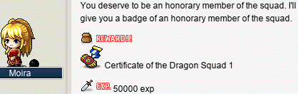

Incredible EXP reward. Oh, and while I’m in [Leafre](https://maplelegends.com/lib/map?id=240000000), I should finally just do the [Silver Mane](https://maplelegends.com/lib/equip?id=1902001) quest! [This quest](https://bbb.hidden-street.net/quest/el-nath-mt-aquaroad/silver-mane) requires 400 [Wooden Shoulder Pad](https://maplelegends.com/lib/etc?id=4000266)s, 400 [Skull Shoulder Pad](https://maplelegends.com/lib/etc?id=4000267)s, and 600 [Rexton Leather](https://maplelegends.com/lib/etc?id=4000264)s! That’s right: a combined total of **1\.4k ETCs from high-level Leafre monsters**. To start out, I headed to [The Hidden Dragon Tomb II](https://maplelegends.com/lib/map?id=240030104) to collect some shoulder pads:


I actually ended up _finishing_ the [Green Cornian](https://maplelegends.com/lib/monster?id=8150200) set here! I was here grinding Cornians for a while, and I started to get hungry as I ran out of my [Satay](https://maplelegends.com/lib/use?id=2022207) supply. But, while I was at Ninja Castle on my [permarogue](https://oddjobs.codeberg.page/guides/introduction-to-odd-jobs/#permarogue) **panolia**, I noticed that the local grocer, [Ishirasu](https://maplelegends.com/lib/npc?id=9110102), sells some handy-dandy [Triangular Sushi (plum)](https://maplelegends.com/lib/use?id=2022007)s that heal 20% HP and 20% MP for the price of 3k mesos a pop. Because rusa had just hit the 15k MAXHP mark, these sushis would actually be worth the price now, even if only used for their HP. So, rusa is a sushi addict now…:


I’ve been informed that these “sushi”, so called by GMS (Global MapleStory), are actually not [sushi](https://en.wikipedia.org/wiki/Sushi) at all — they’re [onigiri](https://en.wikipedia.org/wiki/Onigiri). [English](https://en.wikipedia.org/wiki/English_language) Wikipedia makes the distinction like so:

> Despite common misconceptions, onigiri is not a form of sushi and should not be confused with the type of sushi called _[nigirizushi](https://en.wikipedia.org/wiki/Sushi#Nigirizushi)_ or simply _nigiri_. Onigiri is made with plain rice (sometimes lightly salted), while sushi is made of rice with [vinegar](https://en.wikipedia.org/wiki/Vinegar), sugar and salt. Onigiri makes rice portable and easy to eat as well as preserving it, while sushi originated as a way of preserving fish.

Indeed, many forms of onigiri look nothing like sushi. Just another [l10n](https://en.wikipedia.org/wiki/Internationalization_and_localization) failure from Necksawn/Wizet…

Anyways, once I got to 400 Skull Shoulder Pads, I headed to [Dragon Forest II](https://maplelegends.com/lib/map?id=240030200), the only map in the game that spawns [Rexton](https://maplelegends.com/lib/monster?id=8140702)s. Conveniently, this map also spawns Green Cornians, so I could finish up my 400 Wooden Shoulder Pads as well:


And, eventually, after many Leafre monsters slain, I finally got my very first Silver Mane!!!:


_Z O O O O O M_ ~ _!_

## cervine ventures forth, to do something that _isn’t_ staring at CDs

As readers of this diary may already know, I have mostly been playing my I/L [magelet](https://oddjobs.codeberg.page/guides/introduction-to-odd-jobs/#magelet) in the capacity of repeatedly [Ice Strik](https://maplelegends.com/lib/skill?id=2211002)ing [CDs](https://maplelegends.com/lib/map?id=742010203), grinding my way slowly but surely to the big 120. I wanted to take a break from the compact disc grind, and look at something that isn’t a brightly-coloured [Taipei 101](https://maplelegends.com/lib/map?id=742000000) background. So, I ventured forth to the [Omega Sector](https://maplelegends.com/lib/map?id=221000000) to do [the Zeno quest](https://bbb.hidden-street.net/quest/ludus-lake/artificial-combatant-zeno):

<details>
<summary>Questing with cervine!</summary>


This quest is somewhat unusual, because gathering up the materials required to make a [Wave Translator](https://maplelegends.com/lib/etc?id=4031927) doesn’t necessarily progress you through the quest. Every time that you make a Wave Translator, there is a random chance that it will be a nonfunctional, or “false” Wave Translator. So you actually have to _repeat_ that portion of the quest over and over, until you get a good one:


Luckily for me, the second Wave Translator that I made was a good one. So now, all I had to do was find a [Zeno](https://maplelegends.com/lib/monster?id=6220001), and fight it to the death!! So I headed to [Gray’s Prairie](https://maplelegends.com/lib/map?id=221040301)…


Hmmm. It was being camped, so I had no luck finding any Zenos. But, as you can see above, I did a few quests from around the Omega Sector region in the meantime. The [Chief Gray’s Cell](https://maplelegends.com/lib/etc?id=4031106) that you see above is part of [The History of Zeta Lenticulan](https://bbb.hidden-street.net/quest/ludus-lake/the-history-of-zeta-leticulan). I also did [Trading with Alien Gray](https://bbb.hidden-street.net/quest/ludus-lake/trading-with-alien-gray), which also involves [Alien Gray](https://maplelegends.com/lib/npc?id=2050002), but unfortunately does not award any [Alien Sack](https://bbb.hidden-street.net/items/etc/alien-sack)s on completion. BBB Hidden Street says that it does, but it seems that MapleLegends has removed that quest reward. I also did [Eliminating Grays](https://bbb.hidden-street.net/quest/ludus-lake/eliminating-grays) and [Eliminating Chief Gray](https://bbb.hidden-street.net/quest/ludus-lake/eliminating-chief-gray).

Unfortunately, I still had no luck with Zeno spawns, so I took a trip to the Aqua Road, in search of some more interesting quests to do. Two of these quests, [The Blocked Path of the Ocean](https://bbb.hidden-street.net/quest/el-nath-mt-aquaroad/the-blocked-path-of-the-ocean) and [Nanuke’s Ingredients](https://bbb.hidden-street.net/quest/el-nath-mt-aquaroad/nanukes-ingredients), required me to kill [Cold Shark](https://maplelegends.com/lib/monster?id=8150101)s. Unfortunately, in addition to obviously being strong to ice, Cold Sharks are particularly a pain in the ass for cervine because they frequently dispel. Without [MG](https://maplelegends.com/lib/skill?id=2001002), these vicious beasts can basically just instantly shred me. So, you know, I used like three or four [Safety Charm](https://maplelegends.com/lib/cash?id=5130000)s attempting to kill these things…


I realised there were one or two safe-ish spots around the map, where I could (slowly) kill the sharks without fear of death:


The Blocked Path of the Ocean is a cute little quest that I enjoy doing. Nanuke’s Ingredients is grindier, and unfortunately requires more [Frozen Shark’s Fin](https://maplelegends.com/lib/etc?id=4000181)s than I was willing to farm alone. So I finished The Blocked Path of the Ocean, and went over the Mu Lung Garden (MLG) to do some quests there.

I really like the MLG quests, except for two of the [PPQ/MLGPQ](https://maplelegends.com/lib/map?id=251010404) quests: [Eliminating the Pirates](https://bbb.hidden-street.net/quest/mu-lung-nihal-desert/eliminating-the-pirates) and [Finding the Ingredients for Tae Sang](https://bbb.hidden-street.net/quest/mu-lung-nihal-desert/finding-the-ingredients-for-tae-sang). The former requires killing a total of 400 [Devoted Kru](https://maplelegends.com/lib/monster?id=9300117) and [Devoted Captain](https://maplelegends.com/lib/monster?id=9300118), which is seriously a massive pain in the ass that you have to drag your PPQ party through many times, if you ever want to complete the quest. And the latter is at least a little better, because the Concentrates are tradeable items, which is nice. But I still don’t like it, and gathering the [Bellflower Concentrate](https://maplelegends.com/lib/use?id=2022132)s in the first place _again_ requires dragging down your PPQ party. Other than those two quests, the MLG quests are pretty cool, in my opinion, so I just decided to do all of them. Well, except the PPQ ones. I actually never PPQ’d on cervine, and now I’m too high of a level to ever try…

For starters, I hunted down 16 [Snake Leather](https://maplelegends.com/lib/etc?id=4000281)s from the Flower Serpents in the [Snake Area](https://maplelegends.com/lib/map?id=250010300), for use in [Making Mastery Medicine](https://bbb.hidden-street.net/quest/mu-lung-nihal-desert/making-mastery-medicine) and [Making the Body and Physics Medicine](https://bbb.hidden-street.net/quest/mu-lung-nihal-desert/making-the-body-and-physics-medicine):


For [The Forgotten Master](https://bbb.hidden-street.net/quest/mu-lung-nihal-desert/the-forgotten-master) and [Protecting the Peach Farm](https://bbb.hidden-street.net/quest/mu-lung-nihal-desert/protecting-the-peach-farm), I had to kill some [Peach Monkey](https://maplelegends.com/lib/monster?id=6130207)s and collect some of their [Peach Seed](https://maplelegends.com/lib/etc?id=4000282)s:


To hunt for [The Legendary Being’s Scroll](https://bbb.hidden-street.net/quest/mu-lung-nihal-desert/the-legendary-beings-scroll) \<[Advanced](https://maplelegends.com/lib/etc?id=4031432)\>, some [The Book Ghost’s Sheets of Paper](https://maplelegends.com/lib/etc?id=4000299) for [Do Gong’s Teaching](https://bbb.hidden-street.net/quest/mu-lung-nihal-desert/do-gongs-teaching), and some [Old Paper](https://maplelegends.com/lib/etc?id=4000298)s for The Forgotten Master, I took a detour to the [Foggy Forest](https://maplelegends.com/lib/map?id=250010501) for some [The Book Ghost](https://maplelegends.com/lib/monster?id=5120506) kills:


I then headed towards [Herb Town](https://maplelegends.com/lib/map?id=251000000) to hunt for some [100-Year-Old Bellflower](https://maplelegends.com/lib/etc?id=4000294)s from [Sr. Bellflower Root](https://maplelegends.com/lib/monster?id=5120502)s for Making Mastery Medicine:


Also for Making Mastery Medicine, I would need some [Ginseng-Boiled Water](https://maplelegends.com/lib/etc?id=4000292) from [Ginseng Jar](https://maplelegends.com/lib/monster?id=4230506)s:


And, for [Intruder — The Herb Farm](https://bbb.hidden-street.net/quest/mu-lung-nihal-desert/intruder-the-herb-farm), I needed 100 [Bellflower Root](https://maplelegends.com/lib/monster?id=5120501) kills. Naturally, I pretty much instantly got 5/5 on this set:


For The Forgotten Master (and for Making Mastery Medicine), I would need some [Broken Deer Horn](https://maplelegends.com/lib/etc?id=4000288)s…


…and a [Tae Roon](https://maplelegends.com/lib/monster?id=7220000) kill!:


For [Eliminating King Sage Cat](https://bbb.hidden-street.net/quest/mu-lung-nihal-desert/eliminating-king-sage-cat) and [Eliminating the Spirited Cats](https://bbb.hidden-street.net/quest/mu-lung-nihal-desert/do-gongs-teaching), I headed to [Goblin Forest 2](https://maplelegends.com/lib/map?id=250010504) to fight some [Sage Cat](https://maplelegends.com/lib/monster?id=6130209)s:


And, to finish off the Forgotten Master, a special bench in [Wild Bear Area 1](https://maplelegends.com/lib/map?id=250010301) would turn a peach into a paper note for me:


While I was in the Wild Bear Area, I hunted 14 [Bear Feet](https://maplelegends.com/lib/etc?id=4000283) for [Making Mind and Heart Medicine](https://bbb.hidden-street.net/quest/mu-lung-nihal-desert/making-mind-and-heart-medicine) and Making Mastery Medicine.

I went to [10-Year-Old Herb Garden](https://maplelegends.com/lib/map?id=251010000) to kill 400 [Jar](https://maplelegends.com/lib/monster?id=4230505)s for [Eliminating the Escaped Pot](https://bbb.hidden-street.net/quest/mu-lung-nihal-desert/eliminating-the-escaped-pot):


And, for part II of Intruder — The Herb Farm and for [Operation Eliminate Red-Nosed Pirates](https://bbb.hidden-street.net/quest/mu-lung-nihal-desert/operation-eliminate-red-nosed-pirates), I went to [Red-Nose Pirate Den 2](https://maplelegends.com/lib/map?id=251010402) and [Red-Nose Pirate Den 3](https://maplelegends.com/lib/map?id=251010403) to kill some [Captain](https://maplelegends.com/lib/monster?id=7130104) and [Kru](https://maplelegends.com/lib/monster?id=6130208):


I went back to Gray’s Prairie in the Omega Sector once again, to check if Zeno was back, and indeed he was!:


That concludes that questline!

While I was on my way back to MLG, I stopped around [KFT](https://maplelegends.com/lib/map?id=222000000) to do the only quest that I had remaining in that region: [Mr. Shim’s Request](https://bbb.hidden-street.net/quest/ludus-lake/mr-shims-request) (and [its associated Wiz the Librarian quest](https://bbb.hidden-street.net/quest/ludus-lake/retrieving-the-storybook-mr-shim-chung)):

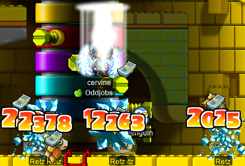

I headed back to MLG and checked again for the [King Sage Cat](https://maplelegends.com/lib/monster?id=7220002). I ran into **Helene**, who was hunting for King Sage Cats, and kindly let me kill one so long as I gave her the card (if one dropped)!:

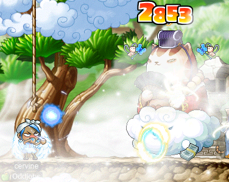

This got me the [Antidote Marble](https://maplelegends.com/lib/etc?id=4031789) that I needed to conclude the Eliminating King Sage Cat questline. I also did the entire [Do Gong Searching for the Swallow](https://sea.hidden-street.net/quest/mu-lung-nihal-desert/do-gong-searching-for-the-swallow)/[Do Gong Seeking Swallow](https://sea.hidden-street.net/quest/mu-lung-nihal-desert/do-gong-seeking-swallow) questline, which meant that I had to go back and kill some more [Red Flower Serpent](https://maplelegends.com/lib/monster?id=4230504)s for [their flowers](https://maplelegends.com/lib/etc?id=4000279), and some [Chipmunk](https://maplelegends.com/lib/monster?id=4230500)s for their [Acorn](https://maplelegends.com/lib/etc?id=4000276)s. I ended up getting a [Red Porky](https://maplelegends.com/lib/monster?id=4230501) card in the process…


I also did the [No Gong’s Teaching](https://bbb.hidden-street.net/quest/mu-lung-nihal-desert/no-gongs-teaching) questline, and with that, I was done in MLG. So I went off to [Magatia](https://maplelegends.com/lib/map?id=261000000) to do the quests there! Magatia is another favourite of mine; the quests there are great, and most of them are part of “_the_ Magatia questline”, which is perhaps my favourite questline in the entire game.

To start off the real questing, I did [Helping Out Bedin](https://bbb.hidden-street.net/quest/mu-lung-nihal-desert/helping-out-bedin) (part of the main questline) and [The Importance of Life Alchemy](https://bbb.hidden-street.net/quest/mu-lung-nihal-desert/the-importance-of-life-alchemy) (not part of the main questline):

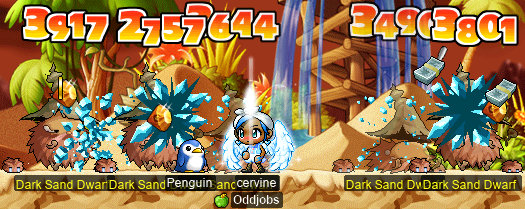

Woohoo for [Dark Sand Dwarves](https://maplelegends.com/lib/monster?id=3110301) being weak to ice! And, [The Problems with Life Alchemy](https://bbb.hidden-street.net/quest/mu-lung-nihal-desert/the-problems-with-life-alchemy), another quest from [Bedin](https://maplelegends.com/lib/npc?id=2111008):


For the Alcadno side, I did [Russellon’s Items for Experiment](https://bbb.hidden-street.net/quest/mu-lung-nihal-desert/russellons-items-for-experiment):

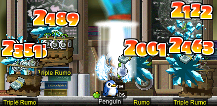

And again for Bedin, [Getting in the Way of Alcadno](https://bbb.hidden-street.net/quest/mu-lung-nihal-desert/getting-in-the-way-of-alcadno) had me kill 200 [Reinforced Mithril Mutae](https://maplelegends.com/lib/monster?id=5110300)s:


For [Russellon](https://maplelegends.com/lib/npc?id=2111009), I [Destroyed the Roid](https://bbb.hidden-street.net/quest/mu-lung-nihal-desert/destroy-the-roid):


And when I went back to turn in Getting in the Way of Alcadno, I levelled up to 114~!!:


When was the last time I levelled up outside of [Star Avenue South Section](https://maplelegends.com/lib/map?id=742010203)…?

For [Zenumist and the Missing Alchemist](https://bbb.hidden-street.net/quest/mu-lung-nihal-desert/zenumist-and-the-missing-alchemist), I was banished to the [Closed Lab](https://maplelegends.com/lib/map?id=926120100) to search for the [Magic Device](https://maplelegends.com/lib/etc?id=4031698):


…so that I could make it [Lightless](https://maplelegends.com/lib/etc?id=4031709)…


For [Alcadno and the Missing Alchemist](https://bbb.hidden-street.net/quest/mu-lung-nihal-desert/alcadno-and-the-missing-alchemist), I had to kill 100 [Homunculus](https://maplelegends.com/lib/monster?id=7110301)es, and I was very fortunate to get one of [their card](https://maplelegends.com/lib/use?id=2384031)s, _and_ a [Magic Stone of Honesty](https://maplelegends.com/lib/etc?id=4031740) (which I’ll need later on in the questline) from the same kill!:


For [Humanoid Just Wants to be Human](https://bbb.hidden-street.net/quest/mu-lung-nihal-desert/humanoid-just-wants-to-be-human) (not part of the main questline), I started gathering up some [Gelatin](https://maplelegends.com/lib/etc?id=4000353) from the [Cube Slime](https://maplelegends.com/lib/monster?id=3110300)s in [Unit 101 of the Zenumist Laboratories](https://maplelegends.com/lib/map?id=261010001):


And I figured that that’s enough questing for the time being. :P More later~!

</details>

## kinds levels up one last time

I did some more [KPQ](https://maplelegends.com/lib/map?id=103000800)ing on my [DEX warrior](https://oddjobs.codeberg.page/guides/introduction-to-odd-jobs/#dex-warrior) KPQ/[SPQ](https://maplelegends.com/lib/map?id=990000000) mule **kinds**… and got to level 30~! :)

That’s the last levelup kinds will ever get, and also time for her to take the second job advancement~


Naturally, I would only ever get a single second-job SP to use, so masteries are the only second-job skills that are actually usable. With that in mind, I thought that page would be the natural choice, as they get access to both [Sword Mastery](https://maplelegends.com/lib/skill?id=1200000) and [BW Mastery](https://maplelegends.com/lib/skill?id=1200001). I mostly want the sword mastery (as kinds uses [the level 20 Gladius](https://maplelegends.com/lib/equip?id=1302038)), but BW is just a single [second-job SP reset](https://maplelegends.com/lib/cash?id=5050002) away, in case I want to use something like a [Red Flowery Tube](https://maplelegends.com/lib/equip?id=1322022) (for the SPEED), a [Monkey Wrench](https://maplelegends.com/lib/equip?id=1422004) (for the swag), or a [Frying Pan](https://maplelegends.com/lib/equip?id=1322027) (for the memes). And so it is:


kinds is looking forward to some SPQing now!! :3

## \[bloopers\]

<details>
<summary>[bloopers]</summary>


</details>
