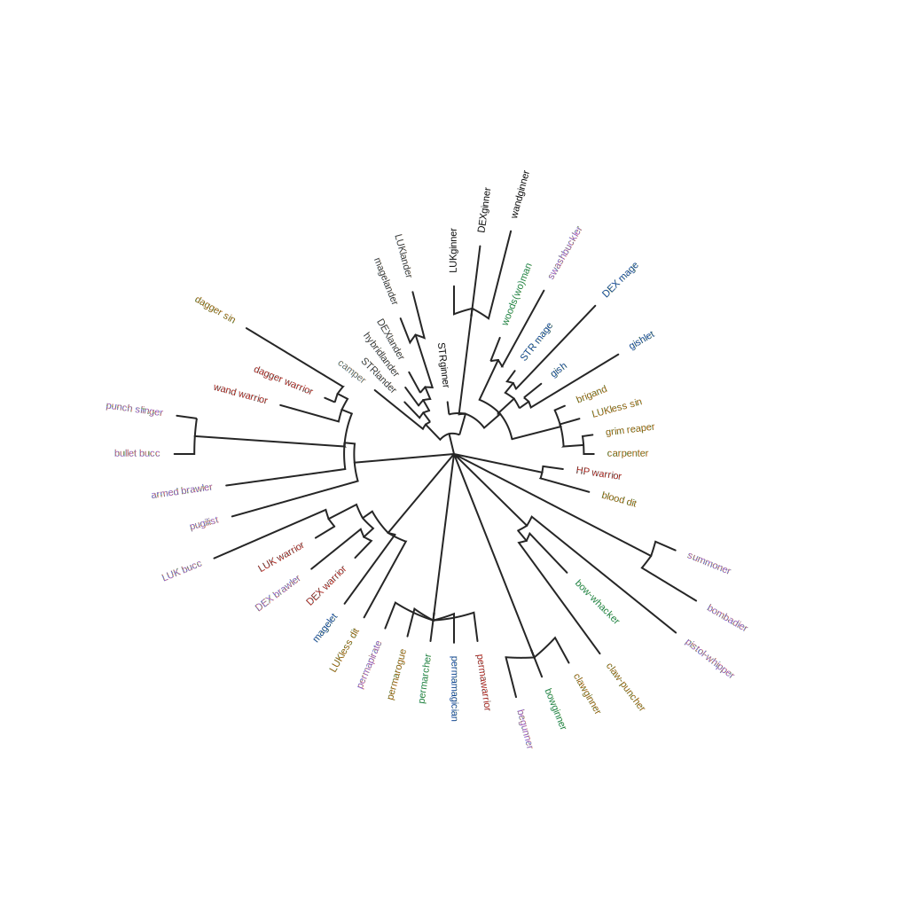
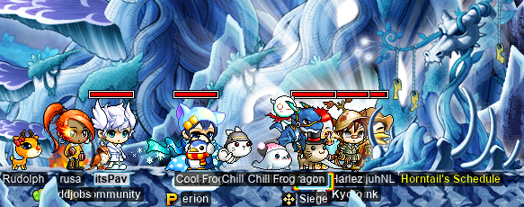
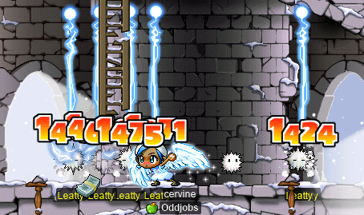

# rangifer’s diary: pt. lxxvii

## Taxonomising odd jobs, pt. vi: Forestry. §3

In the previous section (§2) of this part (pt. vi), we considered the problem of representing the hand-constructed [rooted forest][tree] that we want to make. We considered two levels of representation: a [serialised](https://en.wikipedia.org/wiki/Serialization) format, and a graphical/visual format. I decided to represent the trees serially by using [Newick format](https://en.wikipedia.org/wiki/Newick_format), and graphically by feeding the Newick data into the [toytree](https://github.com/eaton-lab/toytree) library. Along the way, I switched to a different theoretical representation, in which the inner nodes (i\.e. the [vertices][vertex] that aren’t [leaves][rooted-tree]) are left _anonymous_ (rather than each vertex being an odd job), and the [members][element] of our odd job [universe][universe] are all leaves — and vice versa. This is more similar to typical [phylogenetic trees](https://en.wikipedia.org/wiki/Phylogenetic_tree), but also meant that we had to change how we constrain the rooted forest’s construction. Nevertheless, the new constraint is similar to the old one: it’s a simple [one-way implication](https://en.wikipedia.org/wiki/Material_conditional) between two [orderings](https://en.wikipedia.org/wiki/Order_theory), one of the orderings being our hand-constructed [weak ordering](https://en.wikipedia.org/wiki/Weak_ordering) of the odd job universe, and the other ordering being some ordering defined over the vertex [set][set] of our rooted forest.

In the previous section, we did put together some actual tree data, and rendered it into various visual diagrams. But we didn’t include every element of our odd job universe — only the [permabeginner](https://oddjobs.codeberg.page/guides/introduction-to-odd-jobs/#-beginners) ones. So, the task remains to put together at least one satisfactory rooted forest that includes every member of our universe. So I did that. The tree data can be found in [00-00\.tree](./00-00.tree), and the script used to render the diagrams seen below can be found at [render\.py](./render.py).

Odd job phylogeny v0.0

I wrote the Newick data by hand, starting from the data used in the previous section. From there, I basically just went through the hand-constructed weak ordering as found in [../072/weak\_ordering\.ron](../072/weak_ordering.ron), from top to bottom, and inserted each job into the tree by hand. There were a few exceptions here and there, and I had to go back and tweak the tree numerous times, but that was basically the idea. In order to keep things more human-readable, I used indentation in a consistent way, throughout the Newick data, to make the hierarchical structure more clear. This turned out to be a slight issue, because toytree’s Newick [parser](https://en.wikipedia.org/wiki/Parsing) can’t [handle](https://en.wikipedia.org/wiki/Exception_handling#In_software) any [newlines](https://en.wikipedia.org/wiki/Newline) within the Newick data itself (i\.e. it’s after the [semicolon](https://en.wikipedia.org/wiki/Semicolon), or before the beginning of the data). This is _technically_ incorrect, as Newick parsers are supposed to ignore [whitespace](https://en.wikipedia.org/wiki/Whitespace_character) (unless perhaps it’s found within a name). Indeed, toytree’s parser does correctly ignore some [ASCII](https://en.wikipedia.org/wiki/ASCII) whitespace that isn’t an [LF](https://en.wikipedia.org/wiki/Newline#Unicode) (viz. [U](https://en.wikipedia.org/wiki/Unicode)+00[20][space-char], [U+000D](https://en.wikipedia.org/wiki/Carriage_return#Computers), and [U+0009](https://en.wikipedia.org/wiki/Tab_key#Tab_characters)), but sees an LF as a separator of multiple trees. So having an LF within the tree data unexpectedly truncates it, which generally leaves you with ungrammatical garbage. The offending line of code [can be found here](https://github.com/eaton-lab/toytree/blob/930d455964221a86db82623e79965441da6b6e99/toytree/TreeParser.py#L141). However, this admits a simple workaround, which I implement in render\.py as removing all whitespace from the Newick data before handing it over to toytree.

Another thing that I had to work around was the fact that Newick data doesn’t allow certain characters to be part of names. The important ones are whitespace and round [brackets](https://en.wikipedia.org/wiki/Bracket), which appear in several of the odd job names (e\.g. “HP warrior” contains whitespace, “woods(wo)man” contains round brackets). So the `rename_nodes` function in render\.py performs a [depth-first](https://en.wikipedia.org/wiki/Depth-first_search) traversal of the tree, renaming leaf nodes as it goes (e\.g. “HP\_warrior” ↦ “HP warrior”).

There are some issues with determining the structure of the tree (even if we ignore the [weights][weight] of the edges), which arise naturally due to the fact that we are shoehorning our universe into a [phylogenetic tree](https://en.wikipedia.org/wiki/Phylogenetic_tree). But, before I get to that, I want to check that my tree actually satisfies the constraint given in the previous section: 𝑜 ≺ 𝑝 → 𝑜 ≾ 𝑝. Of course, I had this constraint in mind while putting the tree together, but it’s a little difficult to _really_ tell whether or not it’s fully satisfied by just looking at the Newick data and/or the resulting diagrams. Better is to have a [program](https://en.wikipedia.org/wiki/Computer_program) that can ensure this satisfaction automatically…

The script found in [constraint\_check\.py](./constraint_check.py) does exactly this, by leveraging the in-[memory](https://en.wikipedia.org/wiki/Dynamic_random-access_memory) tree representation that is part of toytree’s [API](https://en.wikipedia.org/wiki/API). This program does a depth-first traversal of the tree, building up an [associative array](https://en.wikipedia.org/wiki/Associative_array) that maps each node’s name to its distance from the root. The program also keeps an in-memory representation of the weak ordering that was constructed by hand in [../072/weak\_ordering\.ron](../072/weak_ordering.ron). This information is then used to compare every possible pair of odd jobs, ensuring that the desired constraint is satisfied for all such pairs. Much to my relief, the program doesn’t find any discrepancies.

With that taken care of, I’d like to talk about the actual structure of the tree that I constructed, and the issues and difficulties that arise along the way. But I think I’ll save that for next time. :)

[tree]: https://en.wikipedia.org/wiki/Tree_%28graph_theory%29
[vertex]: https://en.wikipedia.org/wiki/Vertex_(graph_theory)
[rooted-tree]: https://en.wikipedia.org/wiki/Tree_%28graph_theory%29#Rooted_tree
[element]: https://en.wikipedia.org/wiki/Element_(mathematics)
[universe]: https://en.wikipedia.org/wiki/Universe_%28mathematics%29
[set]: https://en.wikipedia.org/wiki/Set_(mathematics)
[space-char]: https://en.wikipedia.org/wiki/Space_(punctuation)#Encoding
[weight]: https://en.wikipedia.org/wiki/Graph_(discrete_mathematics)#Weighted_graph

## Horntail (1ˢᵗ-)prehead run!!

**Gruzz**, **xBowtjuhNL**, **Harlez** (**VigiI**), **Bipp** (**Cassandro**, **Copo**, **Sommer**, **Celim**, **Fino**), **ItsPav**, and I (as my [darksterity knight](https://oddjobs.codeberg.page/guides/introduction-to-odd-jobs/#dex-warrior) **rusa**) planned to do some kind of Horntail (HT) run, but just with the [prehead](https://maplelegends.com/lib/monster?id=8810000)(s). For those not familiar, HT runs proceed in a series of three stages:

1. Fight the first prehead, which pops out of the right side of the first map, pointing towards the left.
2. Fight the second prehead, which pops out of the left side of the second map, pointing towards the right.
3. Summon HT itself in the third & final map, which is the main fight. This HT has multiple body parts, all of which must be slain in order to get the huge loot and EXP at the end.

Our plan was to only do (1.) & (2.), or possibly only (1.). This is a lot easier than actually fighting HT itself, but still _not_ for the faint of heart:

- Each prehead has 330M HP, 1 760 WDEF, 1 840 MDEF, and can heal itself for 100k HP at a time.
- Each prehead hits for roughly ≈15k damage if you touch it, although its magic attacks generally only deal slightly more than ≈5k damage each.
- Both preheads are capable of seducing, which renders a seduced character unable to attack, use potions(!) (including pet autopot), use skills, move voluntarily, etc. The seduce effect causes the character to be forced to walk leftwards, or walk rightwards, or jump in place. Indeed, the only voluntary actions that can be taken by a seduced character are: using [Hero’s Will](https://maplelegends.com/lib/skill?id=1121011) (a kind of “get out of jail free card” for any debuff, including seduce, although it has a ten-minute cooldown), and chatting.
- Both preheads are capable of summoning Wyverns, which are generally harmless unless they are [Dark Wyvern](https://maplelegends.com/lib/monster?id=8150302)s. Dark Wyverns are capable of dispelling [PC](https://en.wikipedia.org/wiki/Player_character)s, which is a big deal for those who rely on buffs like [Magic Guard](https://maplelegends.com/lib/skill?id=2001002), [HB](https://maplelegends.com/lib/skill?id=1301007), [Meso Guard](https://maplelegends.com/lib/skill?id=4211005), etc. to survive. This makes Dark Wyverns particularly terrifying for mages.

That being said, between the six of us, we thought we’d be capable of taking down at least one prehead, so we wanted to do it for the big achievement. And maybe some EXP? Who knows. One thing pushing us to do this run earlier, rather than later, was that we wanted to do it before Harlez hit level 155. Because HT (and its preheads) are level 160, any level ≥155 character gets party EXP normally. But other characters _cannot_ get party EXP normally, effectively meaning that higher-level characters rob the lower-level characters of their EXP. The solution is, then, to make sure that everyone is on the same side of the threshold — either all level ≥155, or all level \<155.

We got everyone together, made sure that everyone had their [Dragon Elixir](https://maplelegends.com/lib/use?id=2210003)s — and helping those who didn’t have one to do [the quest](https://bbb.hidden-street.net/quest/leafre/wars-of-the-dragons) — and headed into the cave:

Most of us — myself included — already had a [Certificate of the Dragon Squad](https://maplelegends.com/lib/etc?id=4001086), so we were able to warp the entire party past HTPQ (Horntail Party Quest), and into the proper Cave of Life.

Our first attempt, unfortunately, was a failure. We chipped off some of the first prehead’s HP, but then xBowtjuhNL met an unfortunate demise:

Harlez (who is a shadower) acted as effectively our “sed\[uce\] mule”, which meant that he was always the first character to enter any map. Seduce always targets the first PC who entered the map (unless it’s a “mass” sed), so Harlez was the natural choice, as his AVOID is very high, and he has [Shadow Shifter](https://maplelegends.com/lib/skill?id=4220002), plenty of MAXHP, and [Meso Guard](https://maplelegends.com/lib/skill?id=4211005). This meant that ItsPav, a bishop and our only party member with [Heal](https://maplelegends.com/lib/skill?id=2301002), was on babysitting duty any time that Harlez got seduced. While we were talking about this, xBowtjuhNL accidentally died…

But the second run was much better! Here we are, fighting the first prehead for the second time:

The preheads do this really annoying attack that launches you backwards (i\.e. to the left wall) and briefly stuns. It seems that even if you jump, this attack can’t be dodged. However, you can still avoid it using normal AVOID mechanics, as well as with Shadow Shifter. And [Power Stance](https://maplelegends.com/lib/skill?id=1321002) will prevent the pushback and stun, even if you do get hit and take the damage. So here is a screenshot that I snagged when I happened to be the only one (besides Bipp) who didn’t get launched backwards:

This screenshot let me pretty clearly see at least two of my damage lines; you can see me doing a 3 216 damage line, and a 6 170 critical damage line. The critical one would have been 3 383, had it not been a crit. These are pretty small damage lines for rusa, considering that she is [zerk](https://maplelegends.com/lib/skill?id=1320006)ing here, and is buffed by a [Cider](https://maplelegends.com/lib/use?id=2022002) and some level of [MW](https://maplelegends.com/lib/skill?id=2321000) (I think MW20, although it was definitely at least MW10). The reason for this is simply that the head has 1 760(!) WDEF, and rusa is 21(!) levels below the head in this image. Being a DEX warrior (particularly as a DEX DK, meaning no pre-WDEF damage multipliers like [Combo Attack](https://maplelegends.com/lib/skill?id=1111002) or [elemental charge](https://maplelegends.com/lib/skill?id=1211004)s), WDEF impacts my damage a lot — my **raw** damage range is quite low and stable.

We did, eventually, slay the beast:

Hurrah! The first prehead is dead!! And we got… well, _some_ EXP, at least. The effective EPH here was pretty bad for everyone involved, and rusa was no exception. But it was cool~!!

We knew, at this point, that we didn’t have enough time to kill the second prehead. But we thought we’d at least go and check it out. Turns out, although the direction of the second prehead is reversed in comparison to the first prehead (it comes out of the left wall instead of the right wall, and faces rightwards instead of leftwards), they both knock PCs in the same direction (leftwards) when dealing damage. This was Bad News™ for rusa, as my ability to consistently zerk whilst fighting the first prehead was predicated on the fact that I could not be knocked rightwards (unless by a stray Wyvern). This meant that I effectively never had to worry about taking touch damage. Now, with the second prehead, the situation was reversed…:

Stupid meme…

## All-Oddjobs EPQ~!

I had the pleasure of doing some all-**Oddjobs** [EPQ](https://maplelegends.com/lib/map?id=300030100)s on my [DEX brawler](https://oddjobs.codeberg.page/guides/introduction-to-odd-jobs/#dex-brawler) EPQ/[LPQ](https://maplelegends.com/lib/map?id=221024500) mule **sorts**!! I filmed the first one, featuring **Cassandro** (**Bipp**, **Sommer**, **Copo**, **Fino**, **Celim**) the claw [clericlet](https://oddjobs.codeberg.page/guides/introduction-to-odd-jobs/#magelet), **Nyanners** (**Taima**, **Hanyou**, **Boymoder**, **Tacgnol**, **Numidium**, **Gambolpuddy**, **Inugami**) the steelwoman [permawarrior](https://oddjobs.codeberg.page/guides/introduction-to-odd-jobs/#permawarrior), and **Suzuran** (**xAme**, **AmeAme**) the [blood dit](https://oddjobs.codeberg.page/guides/introduction-to-odd-jobs/#blood-bandit)! You can watch an edited version of the footage on the official Oddjobs YouTube channel!!:

**[All-Oddjobs EPQ! \[YouTube\]](https://www.youtube.com/watch?v=pv4yYFpb51k)**

## The evil bunny children diaries

Have you ever mercilessly murdered any [evil bunny children](https://maplelegends.com/lib/monster?id=9410032) (a\.k\.a. “Kid Mannequins” (“[KMs](https://maplelegends.com/lib/map?id=742010100)”\*))? If not, believe me when I say that you _would_, if only you had met them. They are vicious and murderous creatures who will do immense damage do you without even being provoked! You can’t even get near then without being chased by them!! I, personally, have died many times to Kid Mannequins, and have witnessed many deaths of my comrades at their tiny, fuzzy, evil hands. [STRginner](https://oddjobs.codeberg.page/guides/introduction-to-odd-jobs/#permabeginner-outland) queen **Taima** (**Nyanners**, **Hanyou**, **Boymoder**, **Tacgnol**, **Numidium**, **Gambolpuddy**, **Inugami**) and I (as my undead [daggermit](https://oddjobs.codeberg.page/odd-jobs.html#dagger-assassin) **alces**) were determined to put a stop to this madness, so we set out to eliminate them once and for all:

Evil bunny child murder lies within…

On the bright side, they grant no small quantity of EXP upon being killed…

I came back to KMs on my I/L [magelet](https://oddjobs.codeberg.page/guides/introduction-to-odd-jobs/#magelet) **cervine** when I grabbed some GM buffs on her:

Okay, I admit — the EXP is pretty good for alces:

…But they just won’t stay dead!! On another set of GM boofs, I joined both Taima, and a fellow STRginner **Permanovice** (**Battlesage**, **Dreamscapes**, **Paean**), as cervine:

When training here — particularly when duoing/trioing — I like to have my pure [STR bishop](https://oddjobs.codeberg.page/guides/introduction-to-odd-jobs/#str-mage) **cervid** parked in the [FM entrance](https://maplelegends.com/lib/map?id=910000000) to give us buffs: mostly [HS](https://maplelegends.com/lib/skill?id=2311003), but also [Bless](https://maplelegends.com/lib/skill?id=2301004) & [MW](https://maplelegends.com/lib/skill?id=2321000)9. This increases EPH by quite a bit, and also increases MPH significantly.

[Permarogue](https://oddjobs.codeberg.page/guides/introduction-to-odd-jobs/#permarogue) extraordinaire **xX17Xx** (**breakcore**, **attackattack**, **drainer**, **strainer**, **raving**) was passing us on the way to train at [Fancy Amp](https://maplelegends.com/lib/monster?id=9410029)s, so she stopped to train with Taima & I!:

Things get a little chaotic with three people at KMs, as the map is divided exactly in half by the two map-wide platforms. There’s no obvious way to distribute people across the platforms, but we made it work.

And, I was fortunate enough to be there when Taima hit the big 110!!!!:

Gratz again! ^^

And, alces is level 99 now…

Tune in next time, where alces will hopefully hit the big triple digits and hold that fancy [GDK](https://maplelegends.com/lib/equip?id=1332051)!!

Footnotes for “The evil bunny children diaries”

\*Not to be confused with one of its [capitonyms](https://en.wikipedia.org/wiki/Capitonym), _KMS_, which stands for “Korean MapleStory”.

## More adventures with alces

I thought it was about time for me to get alces some pet equips, to boost her relatively fragile MAXHP. For that, though, I would need enough pets to equip all that MAXHP gear. So I headed over to the [Pet-Walking Road](https://maplelegends.com/lib/map?id=100000202) in Henesys to do the JQ:

")

You can see how surprised [Trainer Frod](https://maplelegends.com/lib/npc?id=1012007) is to see that I’ve completed the JQ, without using [FJ](https://maplelegends.com/lib/skill?id=4111006) even once!

Now that I had [Follow the Lead](https://maplelegends.com/lib/skill?id=0000008), it was time to buy two more pets, in addition to the [Jr. Reaper](https://maplelegends.com/lib/cash?id=5000036) that I already had:

That’s right, two more Jr. Reapers! I guess they come with a “[set effect](https://forum.maplelegends.com/index.php?threads/guide-set-effects-pet-sets.9003/)” that makes them aggressively spout chat/thought bubbles with random images and colours…

During [our usual scheduled area-bossing time](https://codeberg.org/deer/gists/src/branch/master/what-s-next-for-oddjobs/odd-job-initiative/runs.md), I met up with fellow **Oddjobs** member **LawdHeComin** (**Snel**), the F/P arch[gish](https://oddjobs.codeberg.page/guides/introduction-to-odd-jobs/#gish), to kill some [HH](https://maplelegends.com/lib/monster?id=9400549)s! We were fortunate enough to find half a dozen of them at [Hollowed \[_sic_\] Ground](https://maplelegends.com/lib/map?id=682000001)!:

And after killing just two or three of them, alces hit level 97~!:

## capre stares down some bosses

On my [woodsmaster](https://oddjobs.codeberg.page/guides/introduction-to-odd-jobs/#woodswoman) **capreolina**, I did some of the usual [Ravana](https://maplelegends.com/lib/monster?id=9420014)s and [Papulatus](https://maplelegends.com/lib/monster?id=8500001)es with marksman **xBowtjuhNL**. I rarely have the occasion to use my [Puppet](https://maplelegends.com/lib/skill?id=3111002) — although that’s probably partially because I’m so averse to using it, as it used to be extremely buggy — but these runs gave me some chance to use it. Like when Rav gets unpinned from the left wall and starts waltzing around like a big six-armed dummy:

Or when xBowtjuhNL switches to a clean [PSB](https://maplelegends.com/lib/equip?id=1442057) and lets me solo [Papu’s second body](https://maplelegends.com/lib/monster?id=8500002):

And, later on, **Harlez** introduced me to an area boss called [Kacchuu Musha](https://maplelegends.com/lib/monster?id=9400405)\*. This heavily-armoured [samurai](https://en.wikipedia.org/wiki/Samurai) zombie is no joke, with a whopping 78M HP, and a magic attack that deals over 9k damage. Now, even with [HB](https://maplelegends.com/lib/skill?id=1301007), capreolina doesn’t have quite enough MAXHP to take a hit from this magical attack. The trick is, though, that the magic attack only hits those who are within a certain distance of Kacchuu Musha. And, as an archer wielding a (cross)bow, it’s possible to hit Kacchuu Musha from outside of this range:

It’s a bit tough to do, and pretty much relies on being able to pin the Kacchuu Musha, but luckily it only has a knockback threshold of 250. That being said, I did die a number of times. Getting back to [the map that spawns Kacchuu Musha](https://maplelegends.com/lib/map?id=800040208) is difficult, just because of how confusing the Ninja Castle is. All of the maps have the same name (“Ninja Castle Hallway”), and there are no explicit portals — only cracks in the wall, holes in the floor, etc. I still have troubles walking there myself (remembering the exact route is a bit tough for me), but I was sort of able to get around that by having my pure [STR bishop](https://oddjobs.codeberg.page/guides/introduction-to-odd-jobs/#str-mage) **cervid** walk there, and then [door](https://maplelegends.com/lib/skill?id=2311002) capreolina whenever she needed it.

In the end, we did kill this thing, and boy does it give some EXP. Its base EXP is 3\.68M, which means that killing it solo and unbuffed (and not during an event) would grant a whopping **7\.36M** EXP!

Footnotes for “capre stares down some bosses”

\*It appears that _Kacchuu_ comes from 「甲冑」 (_katchū_), meaning “helmet & armour”. And _Musha_ from 「武者」 (_musha_), meaning “warrior”.

## cervine does a lil more questing~

In the previous diary entry, my I/L [magelet](https://oddjobs.codeberg.page/guides/introduction-to-odd-jobs/#magelet) **cervine** went out and did a bunch of questing. Well, she has since continued a bit of that…

I was in [Taipei 101](https://maplelegends.com/lib/map?id=742000000) for [CD refrigeration](https://maplelegends.com/lib/map?id=742010203) purposes, so I headed back to Victoria Island. I then needed to head to Ossyria for the quests that I was doing, so I took the (flying) boat from [Ellinia](https://maplelegends.com/lib/map?id=101000000) to [Orbis](https://maplelegends.com/lib/map?id=200000000):

Questing With cervine™

From there, I headed down the [Orbis Tower](https://maplelegends.com/lib/map?id=200080200) towards [El Nath](https://maplelegends.com/lib/map?id=211000000) for [Dr. De Lang’s Notes](https://bbb.hidden-street.net/quest/mu-lung-nihal-desert/dr-de-langs-notes), and to kill 100 [Leatties](https://maplelegends.com/lib/monster?id=5300000) for [Acquiring the Seed for the Snowfield Rose](https://bbb.hidden-street.net/quest/el-nath-mt-aquaroad/acquiring-the-seed-for-the-snowfield-rose):

And then, I headed back up the tower to Orbis, to kill some [Lunar Pixie](https://maplelegends.com/lib/monster?id=4230106)s for [The Fairy in Despair 1](https://bbb.hidden-street.net/quest/mu-lung-nihal-desert/the-fairy-in-despair-1):

I actually finished the Lunar Pixie card set by this point, and I even got a courtesy [Star Pixie](https://maplelegends.com/lib/monster?id=3230200) card as well!:

With the [Snow Rose Seed](https://maplelegends.com/lib/etc?id=4031696) in hand, it was time to head back to [Magatia](https://maplelegends.com/lib/map?id=261000000) and [get a Snow Rose for Humanoid A](https://bbb.hidden-street.net/quest/mu-lung-nihal-desert/humanoid-just-wants-to-be-human):

I then headed to [Area A-3 of the Alcadno Research Institute](https://maplelegends.com/lib/map?id=261020700) to kill some [Reinforced Iron Mutae](https://maplelegends.com/lib/monster?id=4110301)s for [a present, for Keeny](https://bbb.hidden-street.net/quest/mu-lung-nihal-desert/a-present-for-keeny):

I killed [D. Roy](https://maplelegends.com/lib/monster?id=7110300)s until one finally dropped a [Broken Mechanical Heart](https://maplelegends.com/lib/etc?id=4000362), also as [a present, for Keeny](https://bbb.hidden-street.net/quest/mu-lung-nihal-desert/keenys-research-on-droid):

Now, it was time to get started on the latter leg of the main Magatia questline. Starting this second leg is a bit tricky, as the game gives very few hints about how to proceed — these quests can only be started by entering [a hidden map](https://maplelegends.com/lib/map?id=261020401), at which point a lightbulb pops above your character’s head. Before that, there’s nothing in the quest journal about any available quests, or anything like that.

For [Parwen’s Lab](https://bbb.hidden-street.net/quest/mu-lung-nihal-desert/parwens-lab), I killed a bunch of these [Site](https://maplelegends.com/lib/monster?id=6110301)\* things:

I got really lucky with the cards here — I think I had 3/5 or 4/5 by the time that I finished the associated quests. Also associated with the Sites is [The Secret, Quiet Passage](https://bbb.hidden-street.net/quest/mu-lung-nihal-desert/the-secret-quiet-passage), which I did concurrently as well. This latter quest is the one that gives you access to the passage directly between the Alcadno laboratories and the Zenumist laboratories, which is where [Kimera](https://maplelegends.com/lib/monster?id=8220002) spawns.

With that, [Parwen](https://maplelegends.com/lib/npc?id=2111006) took me [to see Dr. De Lang himself](https://bbb.hidden-street.net/quest/mu-lung-nihal-desert/who-is-de-lang):

This is, apparently, not _actually_ Dr. De Lang. The wording is a bit vague, but Parwen says:

> **Parwen:** Where? Hmm… there’s no such place where he resides. It’s just a\[n\] afterimage from the past.
>
> **cervine:** Can you tell me where he is right now?
>
> **Parwen:** There’s no way you can tell. Like I said, it’s just a\[n\] afterimage. It’s nothing important, so just forget about it.

Hmmm… Well, it looks like cervine is going to have to do some more investigation, in the next episode of Questing With cervine™!

Footnotes for “cervine does a lil more questing~”

\*These are called [Cyti](https://maplelegends.com/lib/monster?id=9300146), when inside of [MPQ](https://maplelegends.com/lib/map?id=261000021).

## Dodging snails, avoiding mushrooms

**NOTE:** A previous version of this essay used the dodge-rate clamping figures from “[Nise’s Formula Compilation](https://forum.maplelegends.com/index.php?threads/nises-formula-compilation.36234/)”. These figures were incorrect, so the calculations that you see here have since been adjusted to use the correct figures.

The highest-ACC monster species on Maple Island is the [Orange Mushroom](https://maplelegends.com/lib/monster?id=1210102). Orange Mushrooms have 42 ACC. The dodge rate (𝑑) against monsters’ physical attacks is:

> 𝑑 = 𝖠𝖵𝖮𝖨𝖣 ÷ (4\.5 ⋅ 𝖠𝖢𝖢)

Well, not quite. The result of this arithmetic gets clamped between two values. For thieves, the result gets clamped to the [interval][interval] \[0\.05, 0\.95\]. For everyone else (including beginners), the result gets clamped to the interval \[0\.02, 0\.80\]. So, the _ultimate_ goal is to achieve a dodge rate of 0\.80 versus Orange Mushrooms.

As mentioned before, Orange Mushrooms have 42 ACC. So the above formula simplifies to:

> 𝑑 = 𝖠𝖵𝖮𝖨𝖣 ÷ 189

Then, we can set 𝑑 = 0\.80 and solve for 𝖠𝖵𝖮𝖨𝖣. Doing that, we obtain 𝖠𝖵𝖮𝖨𝖣 = 0\.80 ⋅ 189 = 151\.2. Because we only care about beginners, we know that actual AVOID values are always [integer](https://en.wikipedia.org/wiki/Integer) multiples of 0\.25 (in other words, 𝑛 ÷ 4 for some integer 𝑛). So effectively, the ultimate goal is 𝖠𝖵𝖮𝖨𝖣 ≥ 151\.25.

Naturally, this leads to the question of “what’s the earliest level at which I can achieve this amount of AVOID?”. Unfortunately for us, this is highly situational, as there are other reasons to allocate AP other than improving AVOID (otherwise all islanders would have 4/4/4/𝑥 base stats). And, worse yet, it depends not just on base stats, but also on items and buffs (e\.g. [White Gomushins](https://maplelegends.com/lib/use?id=2040702), the [Dexterity Potions](https://maplelegends.com/lib/use?id=2002000) from [Myo Myo](https://maplelegends.com/lib/cash?id=5450000), etc.). So we’ll look at a simplified case.

One (over)simplified case is a naked (no equipment) & unbuffed islander with 4/4/4/𝑥 base stats (and no AP spent on MAXHP nor MAXMP). This (over)simplification allows us to easily calculate the level at which our hypothetical islander reaches the ultimate goal.

The 4 total DEX grants 4 ⋅ 0\.25 = 1 AVOID. At level 1, our islander has 13 LUK, which grants 13 ⋅ 0\.5 = 6\.5 AVOID. So, at level 1, our islander has 1 + 6\.5 = 7\.5 AVOID. Each level gets them 5 AP, which becomes 5 additional LUK, which grants 5 ⋅ 0\.5 = 2\.5 AVOID. So their AVOID is then given by the formula:

> 𝖠𝖵𝖮𝖨𝖣 = 2\.5𝖫𝖵𝖫 + 5

…where 𝖫𝖵𝖫 is the character’s level.

Setting 𝖠𝖵𝖮𝖨𝖣 = 151\.25, we get 𝖫𝖵𝖫 = (151\.25 − 5) ÷ 2\.5 = level 58\.5. Rounding towards [positive infinity](https://en.wikipedia.org/wiki/Extended_real_number_line), we get level 59.

Of course, this is a slightly idealised case, so for most practical purposes, islanders who want this kind of avoidability will likely end up adding LUK beyond level 59.

Or, you can just get GM boofs…:

I’ve been asked, on _multiple_ occasions, about AVOID in the context of [islanders](https://oddjobs.codeberg.page/guides/introduction-to-odd-jobs/#islander). So, this is here as something that I can direct people to, so that they can get a basic rundown. To make things a little more complete, here’s a table of every monster species on Maple Island, along with their ACC values, and the associated AVOID thresholds required to maximise the islander’s dodge rate (𝑑 = 0\.80) against them:

| species                                                            | ACC | AVOID threshold |
| :----------------------------------------------------------------- | --: | --------------: |
| [Orange Mushroom](https://maplelegends.com/lib/monster?id=1210102) |  42 |         151\.25 |
| [Pig](https://maplelegends.com/lib/monster?id=1210100)             |  40 |         144\.00 |
| [Slime](https://maplelegends.com/lib/monster?id=0210100)           |  35 |         126\.00 |
| [Red Snail](https://maplelegends.com/lib/monster?id=0130101)       |  35 |         126\.00 |
| [Stump](https://maplelegends.com/lib/monster?id=0130100)           |  30 |         108\.00 |
| [Shroom](https://maplelegends.com/lib/monster?id=0120100)          |  30 |         108\.00 |
| [Blue Snail](https://maplelegends.com/lib/monster?id=0100101)      |  20 |          72\.00 |
| [Snail](https://maplelegends.com/lib/monster?id=0100100)           |  20 |          72\.00 |

[interval]: https://en.wikipedia.org/wiki/Interval_(mathematics)

## Levelling up with rusa

I duoed [7F](https://maplelegends.com/lib/map?id=702070400) — as my [darksterity knight](https://oddjobs.codeberg.page/guides/introduction-to-odd-jobs/#dex-warrior) **rusa** — with shadower **Harlez** (**VigiI**), when we both had GM buffs. And boy, is the EXP absolutely bonkers:

Levelling up wif woosa

[HS](https://maplelegends.com/lib/skill?id=2311003) really is _ridiculously_ powerful, innit. Powerful enough to get rusa to level 139, at least!:

Later, rusa did a number of [Krex](https://maplelegends.com/lib/monster?id=9420521) runs, joined by Harlez, **xBowtjuhNL**, and others. In fact, in one session we did not one, not two, not t(h)ree, but _four_ Krexel runs:

Pictured above is the first Krex run out of this series of four. Doing the usual two Krexes (as it can only be entered twice daily, at most) is already enough mind-numbing punishment for most people. But we were, apparently, not satisfied. Because the number of possible entries resets at midnight (server time, which is just [UTC](https://en.wikipedia.org/wiki/Coordinated_Universal_Time)), we did two a bit before midnight, and then two immediately after midnight.

The first two were done with dark knight **Jatizso** and hero **WarSeven**, who asked me about rusa’s build. One thing that I never even really considered before this point was that rusa doesn’t have to worry about “**MISS**”ing the [Golden Giant](https://maplelegends.com/lib/monster?id=9600021)s at 7F. Those guys have a whopping 75(!) AVOID, meaning that a level ≥130 physical attacker needs ≥276 total WACC to be capable of hitting them 100% of the time. For rusa, that’s basically nothing. But for ordinary warriors, it’s quite the challenge.

Also, I was reminded that my [Power Stance](https://maplelegends.com/lib/skill?id=1321002) was level 19, and I still had yet to pass a [Stance 30 book](https://maplelegends.com/lib/use?id=2290007). So I went ahead and did that:

Luckily for me, I passed it on the first try. These books seem to be a bit inconsistently priced, where they are rare enough to be worth _something_, but the demand isn’t quite high enough to keep the prices consistent. This one was 1\.5M mesos, so it was a decent deal.

Oh, and rusa is on the same account as my undead [daggermit](https://oddjobs.codeberg.page/odd-jobs.html#dagger-assassin) **alces**. The plan was to make a set of three pet equips scrolled for MAXHP, and then share them between the characters on that account (via the Cash Shop inventory). This meant that I also had to get three pets for rusa:

Well, I got two more [Rudolph](https://maplelegends.com/lib/cash?id=5000014)s (in addition to the one that rusa already had), and it turns out that these get a set effect too, if you have three of them:

Appropriately for [the winter holidays](https://en.wikipedia.org/wiki/Christmas_and_holiday_season) (albeit less so for [the summer holidays](https://en.wikipedia.org/wiki/Southern_Hemisphere)), this set effect is an [igloo](https://en.wikipedia.org/wiki/Igloo) with some [snow](https://en.wikipedia.org/wiki/Snow)-covered [conifers](https://en.wikipedia.org/wiki/Conifer), a [snowman](https://en.wikipedia.org/wiki/Snowman), and a [penguin](https://en.wikipedia.org/wiki/Penguin). Unfortunately, I hate it. So, I may get rid of one of the Rudolphs at some point, and replace it with… some other pet.

In any case, rusa hit level _140_ at 7F!:

And, I got to do a [Zakum](https://maplelegends.com/lib/monster?id=8800000) run alongside fellow **Oddjobs** member **LawdHeComin** (**Snel**), the F/P arch[gish](https://oddjobs.codeberg.page/guides/introduction-to-odd-jobs/#gish)!!:

Also, in the bottom-left corner there, you can see **Cassandro** (**Bipp**, **Copo**, **Sommer**, **Celim**, **Fino**), the claw [clericlet](https://oddjobs.codeberg.page/guides/introduction-to-odd-jobs/#magelet)! He tagged along in hopes of a [zhelm](https://maplelegends.com/lib/equip?id=1002357), but unfortunately wasn’t able to survive until the end (I could only [Resurrect](https://maplelegends.com/lib/skill?id=2321006) him once, so he had to mostly survive on his own).

And, finally, rusa is now level 141 :3

## My first-ever CWKPQ~!

As seen in past entries of this diary, I’ve been inside of [CWKPQ (**C**rimson**w**ood **K**eep **P**arty **Q**uest)](https://maplelegends.com/lib/map?id=610030100) before. But only as a [MoN](https://maplelegends.com/lib/equip?id=1122059) buyer — I have a MoN on my pure [STR bishop](https://oddjobs.codeberg.page/guides/introduction-to-odd-jobs/#str-mage) **cervid**, on my [woodsmaster](https://oddjobs.codeberg.page/guides/introduction-to-odd-jobs/#woodswoman) **capreolina**, and on my I/L [magelet](https://oddjobs.codeberg.page/guides/introduction-to-odd-jobs/#magelet) **cervine**. But I’ve never actually _done_ the PQ! Well, that has since changed!! I got the privilege of doing a CWKPQ on my [darksterity knight](https://oddjobs.codeberg.page/guides/introduction-to-odd-jobs/#dex-warrior) **rusa**, hosted by nightlord **Keirilius** of **Vandals**, and featuring members of the **Funk** guild, as well as other guilds like **Beaters**, **Kyoto**, and **Athena**. I tried filming this PQ — unfortunately, doing the boss fight _and_ screen recording at the same time proved to be too much for my poor [CPU](https://en.wikipedia.org/wiki/Central_processing_unit) to handle, so the footage stops about 10% of the way into the boss stage — but you can watch some clips from the run on the **Oddjobs** YouTube channel!:

**[clips from rusa’s first CWKPQ~ \[YouTube\]](https://www.youtube.com/watch?v=zIYkiVuIH_g)**

Some time after the point at which I was forced to stop recording, the ranged folks (in this case, bowmasters, marksmen, and nightlords) came down to the floor, where the three bosses are that are typically handled by the melee folks:

The [mage](https://maplelegends.com/lib/monster?id=9400590) and [pirate](https://maplelegends.com/lib/monster?id=9400589)\* bosses spawn on the platforms above, but at this point they had already been slain, so the ranged folks came down and got a taste of how annoying the floor bosses can be ([warrior](https://maplelegends.com/lib/monster?id=9400591), [archer](https://maplelegends.com/lib/monster?id=9400592), [thief](https://maplelegends.com/lib/monster?id=9400593)). Basically, these bosses constantly spam stuns and seals, and also have an attack that pushes you backwards and briefly stuns (similar to the HT preheads). This makes it impossible to effectively fight these guys, unless you have [Holy Shield](https://maplelegends.com/lib/skill?id=2321005) active, or [Smokescreen](https://maplelegends.com/lib/skill?id=4221006) active, or… you’re hugging the bosses and constantly taking touch attacks from them, instead. So, as a ranged attacker, this is kind of a shit deal. But for melee folks, constantly receiving touch attacks from the bosses is much more doable.

In any case, being able to CWKPQ was super fun, and I hope that I get to do it again in the future. By the end of it all, I got to break some (viz. three) boxes in the bonus stage, and got some nifty loot!:

The items here that aren’t 30% scrolls are [Sugar-Coated Olives](https://maplelegends.com/lib/use?id=2022274) and [Sunblock](https://maplelegends.com/lib/use?id=2022277). The former is basically just [Haste](https://maplelegends.com/lib/skill?id=4101004) for five minutes, in an item! And Sunblock is a mighty MDEF buff (+200 MDEF!!), which is great for when you need to squeeze out that extra bit of defence to avoid getting one-shotted by bosses like [Capt. Latanica](https://maplelegends.com/lib/monster?id=9420513)!

Footnotes for “My first-ever CWKPQ~!”

\*The pirate boss is usually called “Nagrom” (“Morgan” spelled in reverse) — [the CWKPQ guide on the MapleLegends forums](https://forum.maplelegends.com/index.php?threads/guide-crimsonwood-keep-party-quest.24194/) even names it as such — but it is actually called “Heron” in MapleLegends, including within [the MapleLegends library](https://maplelegends.com/lib/).

