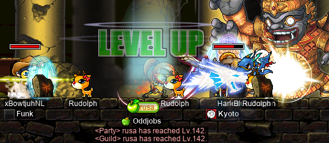
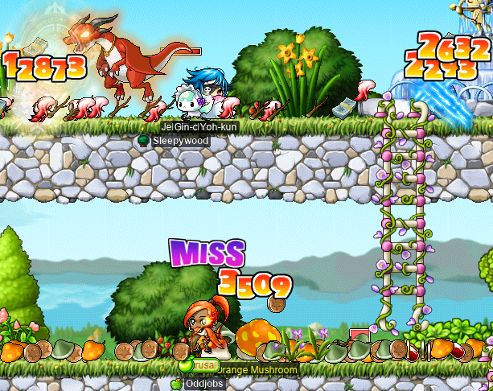
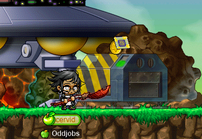

# rangifer’s diary: pt. lxxviii

## Taxonomising odd jobs, pt. vi: Forestry. §4

In the previous section (§3) of this part (pt. vi), I put together (by hand) one big [Newick](https://en.wikipedia.org/wiki/Newick_format)-formatted, weighted, rooted [tree][tree] that contains, as its [set][set] of leaves, our entire [universe][universe] of odd jobs. I then used [toytree](https://github.com/eaton-lab/toytree) to make some nice-looking diagrams that allow us to properly visualise the tree. I also wrote [a little script](../076/constraint_check.py) to check that the tree conforms to our “𝑜 ≺ 𝑝 → 𝑜 ≾ 𝑝” constraint.

I did _not_, however, talk about how exactly I constructed the tree, other than to say:

> I wrote the Newick data by hand, starting from the data used in the previous section. From there, I basically just went through the hand-constructed weak ordering as found in [../072/weak\_ordering\.ron](../072/weak_ordering.ron), from top to bottom, and inserted each job into the tree by hand. There were a few exceptions here and there, and I had to go back and tweak the tree numerous times, but that was basically the idea.

In order to explain the logic behind this tree, I’m going to use a diagram of the tree in which all “inner” (read: non-leaf) [vertices][vertex] have been [numbered](https://en.wikipedia.org/wiki/Natural_number). Then, I can step through every inner vertex, one by one, and give it a name — plus (perhaps) some accompanying commentary. I currently believe that giving a name to each inner node is an important part of justifying the tree’s structure, and of giving the tree meaning.

Each inner node virtually — by our rather… _questionable_… analogy — represents some “[common ancestor](https://en.wikipedia.org/wiki/Most_recent_common_ancestor)” within our “[phylogenetic tree](https://en.wikipedia.org/wiki/Phylogenetic_tree)”. We should be able to **characterise** each of these “[MRCA](https://en.wikipedia.org/wiki/Most_recent_common_ancestor)s”, and in doing so, collectively characterise (in one way or another) [all of its child vertices](https://en.wikipedia.org/wiki/Clade).

But first, an update to the tree itself! When I constructed the tree by hand, I used the example data from the initial experimentation with toytree (q\.v. §2) — which contained all & only permabeginner odd jobs — as a starting point. I should have revised this starting point more, as its structure was ultimately not going to work (although it was plenty enough for a simple demonstration). I’ve since revised the tree to fix this portion of it. Furthermore, I’ve moved the “rangeginners” (clawginner, bowginner, begunner) to be siblings of the “jobbed beginners” (woods(wo)man, STR mage, brigand, etc.), instead of being their own [basal][basal] clade. You can find the new tree data at [00-01\.tree](00-01.tree). So, here are the same diagrams from the previous section, but with the newly-updated tree data:

<details>
<summary>Odd job phylogeny v0.1</summary>


</details>

### Naming the inner vertices


- **0: “odd”.**
    - **1: “pure HP”.** An alternative name would be “statless”, as these pure-HP odd jobs are the only jobs in our universe that are statless by definition.
    - **2: “skill-specialised”.** These jobs are defined solely by their specialised skillsets.
    - **3: “ammoless”.**
        - **8: “pre-pirate ammoless”.** I split out the pre-pirate ammoless jobs — to the exclusion of the pistol-whipper — for basically two reasons. One, I believe that the pistol-whipper is much less “primitive” (only partly because it’s a pirate) and has almost no literature behind it. Two, I believe that the pistol-whipper plays differently than the claw-puncher & the bow-whacker at some fundamental level, because it rarely actually resorts to smacking monsters with its weapon.
    - **4: “perma-first”.** This is the first point at which we really have to contend with multiple characterisations of a job being in conflict with one another. Perma-first-jobs are fairly diverse in their playstyles, so when taxonomising odd jobs, it’s tempting — and sometimes appropriate — to put perma-firsts alongside other odd jobs based on playstyle, skills, weaponry, stats, etc. But here, I want to express that all five perma-first-jobs _originate_ in the same way: from the simple refusal of advancement to second grade. As a result, the perma-firsts form a basal clade within this tree, and there are no subclades (other than the individual jobs themselves).
    - **5: “statted”.** These jobs are entirely, or almost entirely, characterised by their goofy stats.
        - **9: “statted warrioroid”.** The term “warrioroid” here is from “warrior” + “[-oid](https://en.wiktionary.org/wiki/-oid#English)”, in order to indicate the [union][union] of all warriors with the brawler throughclass. Like warriors, brawlers are intended to only use melee weapons (viz. knucklers) whose primary stat is STR, and whose secondary stat is DEX. Also like warriors, brawlers are intended to be more durable than average, and get [their own “Improved MaxHP Increase” skill](https://maplelegends.com/lib/skill?id=5100000). Still like warriors, brawlers make prominent use of their single-target attack ([Power Strike](https://maplelegends.com/lib/skill?id=1001004); [Flash Fist](https://maplelegends.com/lib/skill?id=5001001)) and their six-target attack ([Slash Blast](https://maplelegends.com/lib/skill?id=1001005); [Somersault Kick](https://maplelegends.com/lib/skill?id=5001002)) from first grade.
            - **13: “DEX warrioroids”.**
            - **14: “LUK warrioroids”.**
    - **6: “weaponed”.** These jobs are defined by their weapon restrictions.
        - **10: “armed”.** This clade splits off the “weaponed” jobs that actually use weapons from those that don’t (read: pugilist). This split is done on the basis of essentially two things. One is the simple, literal distinction between “necessarily using a certain kind of weapon” versus “necessarily not using weapons at all”. And the other is mechanical uniqueness: the pugilist exists, and is necessarily a pirate, due to the somewhat surprising fact that pirates — and only pirates — can attack without a weapon equipped. This special-sauce game mechanic makes the origin of the pugilist special.
            - **15: “inverted weapon”.** These jobs use weapons that are appropriate given their first-grade class, but are _inverted_ w\.r\.t. their choice of throughclass. I seriously considered making the dagger sin a member of this clade, but ultimately decided against it, in favour of making them members of the “daggered” clade. See the “daggered” clade for an explanation.
            - **16: “one-handed melee”.** These weapon-restricted jobs are, more specifically, restricted to using particular types of one-handed melee weapon. Particularly, daggers and wands(/staves). Daggers and wands are somewhat special as one-handed melee weapons. Daggers are normally considered thief weapons (not warrior weapons), and have a special game mechanic that causes their damage calculation to fundamentally change depending on the class of their wielder. And wands are, despite being one-handed melee weapons, not normally thought of as such — they are thought of as a mage’s weapon, existing only to increase the MATK, INT, and possibly also LUK, of their mage wielder.
                - **21: “daggered”.** This clade groups together the dagger warrior with the dagger sin. Although it’s certainly true that both of these jobs are defined by their inability to use weapons other than daggers, this clade might seem like an odd choice, considering that dagger sins could fit comfortably within the “inverted weapon” clade. And furthermore, we usually think of warriors as being generally quite dissimilar to thieves. Nevertheless, both the dagger warrior and the dagger sin are essentially stuck with their first-grade attacking skill(s) for life (Power Strike/Slash Blast; [Double Stab](https://maplelegends.com/lib/skill?id=4001334)), and both are locked out of a similar set of their skills as a result of their weapon choice.
    - **7: “beginneroid”.** This is a tough one. Similarly to the “warrioroid” term, “beginneroid” is from “beginner” + “-oid”, and unifies literal permabeginners with other jobs that are not actually permabeginners. Beginneroids that aren’t strictly permabeginners are almost always characterised by their adherence to basic-attacking. I considered naming this clade “basic-attacker”, or even “whacker” — the latter is not a common term, but I’ve personally used it a lot to refer loosely to jobs that like to basic-attack. The reason why I went with “beginneroid” instead is _mostly_ because of one particular odd job that sticks out like a sore thumb: the swashbuckler. There’s other good reasons, too: for example, jobs like gish and woods(wo)man have alternate modes of attacking that are very different from basic-attacking (magical spells; active archery skills). But the swashbuckler poses a special problem: they are, in my mind at least, clearly “phylogenetically” closely related to woods(wo)men — yet, their style of melee combat almost never includes basic-attacking. Nevertheless, their style of melee is like the woods(wo)man’s insofar as it is STR-based (they are pure STR by definition, just like woods(wo)men) and uses melee weapons that are normally inappropriate for their throughclass.
        - **11: “inland”.**
            - **17: “islander”.**
                - **22: “meleelander”.** This clade includes the islanders that pretty much only use melee attacks to deal damage. Although many hybridlanders are like this (e\.g. my islander **ozotoceros** is a DEX/LUK hybridlander who only uses melee), hybridlander is basically a [wastebasket taxon](https://en.wikipedia.org/wiki/Wastebasket_taxon). So hybridlander gets effectively its own clade, due to that diversity & ambiguity. And magelanders _can_ melee as well, but their “primary mode of combat” is [Three Snails](https://maplelegends.com/lib/skill?id=0001000).
                - **23: “weirdlander”.** This clade is just the islanders with “weird” specialisations: the magelander uses Three Snails and can only use wands, and the LUKlander is a claw user.
        - **12: “outland beginneroid”.**
            - **18: “rangeginner”.** This clade used to be its own basal clade within this tree, but I moved it here, mostly on the basis that rangeginners are restricted to basic-attacking by definition. Also, they are intentionally modelled after permabeginners (even though they are not themselves permabeginners). Rangeginners are not, however, closely related to any other outland beginneroids, so they form a separate clade within the outland beginneroids.
            - **19: “outlandginner”.** These are our outland beginneroids that are actually proper permabeginners.
                - **24: “weirdginner”.** The influence of STRginners is so strong (and so primal) that all other outlandginners are grouped into this separate clade.
            - **20: “jobbed beginneroid”.** Classically, this clade is referred to as the “jobbed beginners” (among a few other names that are similar in spirit). Of course, I use the term “jobbed beginner**oid**” instead, for reasons explained above.
                - **25: “archeroid beginneroid”.** This one has kind of a funny name, owing to the two “-oid”s in there. The term “archeroid” here is _very_ similar to “warrioroid”: it unites the literal archers with their pirate counterparts (those of the gunslinger throughclass). As mentioned above, swashbucklers are the sore thumb sticking out here; they almost never use basic-attacks. However, they are _very_ clearly “the pirate version of woods(wo)man”, so this deep connection of these two jobs’ origins (and their melee-and-ranged playstyle, etc.) is directly reflected in our phylogeny.
                - **26: “mage beginneroid”.**
                    - **28: “physical attacker mage”.** These are our mage beginneroids that don’t have enough MACC to actually use spells offensively (barring Poison Mist).
                    - **29: “mixed attacker mage”.** These mage beginneroids are “mixed” attackers in the sense of mixing physical attacks with magical attacks.
                - **27: “thief beginneroid”.**
                    - **30: “unique weapon beginneroid”.** The phrase “unique weapon” here is in reference to an actual individual weapon _ID_. These thief beginneroids are not just restricted to a certain weapon type(s), but rather to a specific weapon ID, e\.g. the [Scythe (ID 1312002)](https://maplelegends.com/lib/equip?id=1312002). These jobs are beginneroids simply because they can’t be anything else, given the weapon that they are restricted to.

### Reflecting on the tree’s structure

As you can see, there are a number of places where we’d like one job to be closely related to another, but it’s not possible to make that happen without breaking some other strong relationship(s). Possible biological analogues include [hybridisation][hybrid] and [HGT](https://en.wikipedia.org/wiki/Horizontal_gene_transfer), although in our case it’s really mostly a product of how we can characterise a single job in multiple distinct ways. For example, within the “jobbed beginneroid” clade, I opted to divide these jobs up largely across _class_ boundaries. This is because class boundaries are often conceptually significant due to shared skill selections (and other class distinctions like MAXHP gain, damage formula for daggers, etc.). Beginneroid mages get [Teleport](https://maplelegends.com/lib/skill?id=2101002), [Magic Guard](https://maplelegends.com/lib/skill?id=2001002), various offensive spells at their disposal, etc. Archer(oid) beginneroids always have the option to be ranged physical attackers, and benefit from WACC buffs\* and summons ([Silver Hawk](https://maplelegends.com/lib/skill?id=3111005)/[Frostprey](https://maplelegends.com/lib/skill?id=3221005)/etc.; [Octopus](https://maplelegends.com/lib/skill?id=5211001)/[Gaviota](https://maplelegends.com/lib/skill?id=5211002)/etc.), while also being defensively disadvantaged.

On the other hand, there are roughly equally strong conceptual links on different bases: for example, the “STRanger” is a powerful archetype that includes any STR-based ranged physical attacker, viz. the woods(wo)man, the swashbuckler, and the LUKless sin. All of these STRangers are proficient in ranged attacking (with (cross)bows; guns; claws, respectively), but _also_ canonically use melee weapons to fight, as well. Yet here, we separate LUKless sins from the other STRangers on a largely class basis. Similarly, the armed brawler is placed within the “armed” clade; although it’s convenient that I named the clade similarly to the job in question, the reality is that the armed brawler is conceptually closely related to the swashbuckler, as well. Both the armed brawler and the swashbuckler rely on [SSK](https://maplelegends.com/lib/skill?id=5001002) (and the fact that SSK always “stabs”) in melee, and melee combat is essentially the only mode of combat for the armed brawler, and an important primary mode for the swashbuckler. Furthermore, these two jobs share a first-grade class, viz. pirate. And, as discussed above, we want to think of the dagger sin as conceptually closely related to both the dagger warrior _and_ to the “inverted weapon” jobs.

And of course, there are other issues, too. The LUKginner’s exclusive use of claws arguably makes them more closely related to the clawginner and to the LUKlander, than the STRginner is related to either of these two jobs. Yet, if such a relation exists, it is not reflected in this tree. There is pretty clear [parallelism](https://en.wikipedia.org/wiki/Parallel_evolution) between the various islanders and the various outland permabeginner jobs… or is it not parallelism, but actually [homology][homology]? STRginner is to STRlander, as DEXginner is to DEXlander, as wandginner is to magelander, as LUKginner is to LUKlander! There are some pretty deep-seated differences between Maple Island and the post-Lith-Harbour Maple World that induce some fundamental differences between our islander and our outlander permabeginner species — yet, the analogies between them are still quite clear. And we could go on: where in the tree can we see the relation between all mixed melee-ranged physical attackers, like the permarogue, the permapirate, the LUKless sin, the swashbuckler, etc.? Where in the tree can we see that the LUKless sin and the LUKless dit are defined nearly identically, even if their playstyles differ considerably?

<details>
<summary>Footnotes for “Reflecting on the tree’s structure”</summary>

\*The WACC buffs (passive and/or active) might seem like a minor feature, but have historically been very important (as we observed in pt. ii of this series) in characterising the archeroid beginneroids. That being said, the brigand and the LUKless sin are other beginneroids who also benefit from the same thing, so this isn’t a _unique_ feature.

</details>

### Moving forward

Although, in the text above, there are a lot of questions raised about this phylogenetic-tree-like rooted tree of odd jobs, I think that this basically concludes the original purpose of pt. vi of this series. I set out to construct such a tree by hand, and based on certain principles that I can (at least, personally) be satisfied with, I did exactly that. Again, as mentioned above, these are not the _only_ possible principles that one could use to organise such a tree. But I think that this should work just fine, at least for now.

I mentioned within some earlier sections of this part (pt. vi) that I had another construct in mind, that could be used in much the same way as we’ve used the phylogenetic-tree-like model here:

> I _also_ want to explore the use of a slightly different structure (different from this rooted forest model), but that can come later.

The structure that I had in mind was some kind of [DAG](https://en.wikipedia.org/wiki/Directed_acyclic_graph). Strictly speaking, a DAG doesn’t generalise the rooted forest that we’ve used here — the rooted forest doesn’t have to give a direction to any of its edges, so long as each [component][component] is a rooted tree. But we can think of a rooted forest as being kind of “implicitly directed” because we can very naturally make each edge directed away from (or equivalently, each edge directed towards) the root of the tree that the edge is a part of. If we think of rooted forests in this way, then a DAG is a generalisation of a rooted forest that allows for [induced subgraphs](https://en.wikipedia.org/wiki/Induced_subgraph) whose underlying undirected graph is a [cycle graph](https://en.wikipedia.org/wiki/Cycle_graph). This is because a “**d**irected **a**cyclic **g**raph” is “acyclic” because it contains no [**directed** cycles](https://en.wikipedia.org/wiki/Cycle_graph#Directed_cycle_graph). To illustrate this, here’s a very simple DAG:


<details>
<summary>Command used to generate the figure above</summary>

```bash
dot -Tsvg -Kneato -Gbgcolor='#00000000' -Nshape=plain -o./example_dag.svg ./example_dag.gv
```

</details>

As you can see, this DAG _would_ be [𝐶](https://en.wikipedia.org/wiki/Cycle_graph)₃, if only all of its edges lost their directions. Yet there is no directed cycle within this graph: you can see for yourself that if you start at any vertex (e\.g. 𝑎) and “leave” it at all (by following some edge away from it), you can’t get back to that vertex ever again. From 𝑎, for example, we can get to either 𝑏 or 𝑐; but from 𝑐, we have nowhere to go, and from 𝑏, we can only get to 𝑐! So there’s no way back to 𝑎 once you leave it, and this also applies to the other vertices.

This property allows us to possibly express multiple influences on a single odd job without creating a directed cycle — this is a considerable amount of extra power. As you’ll recall, the primary property that makes a graph a tree is that it’s **a**[cyclic][cycle]. So now, we are _generalising the underlying undirected graph to allow cycles_, so long as the graph is still acyclic when taking edge directions into account.

And adjusting our “𝑜 ≺ 𝑝 [→](https://en.wikipedia.org/wiki/Material_conditional) 𝑜 ≾ 𝑝” constraint to this new structure is fairly straightforward, as well. A defining feature of DAGs is that they admit at least one [topological ordering](https://en.wikipedia.org/wiki/Topological_sorting). A topological ordering (here denoted by “≤”) is just a [total ordering](https://en.wikipedia.org/wiki/Total_order) of the DAG’s vertices, such that each edge of the DAG is directed from some vertex 𝑎 to some vertex 𝑏, where 𝑎 ≤ 𝑏. We can then easily see that a topological ordering is just a [linear extension](https://en.wikipedia.org/wiki/Linear_extension) of an underlying [non-strict partial ordering](https://en.wikipedia.org/wiki/Partially_ordered_set#Non-strict_partial_order) (here denoted by “≼”), where 𝑎 ≼ 𝑏 [iff](https://en.wikipedia.org/wiki/If_and_only_if) there is a directed [path][path]\* from 𝑎 to 𝑏. With this in mind, and again denoting our hand-made [weak ordering](https://en.wikipedia.org/wiki/Weak_ordering) by “≾”, **we want to maintain the following invariant:** 𝑜 ≼ 𝑝 → 𝑜 ≾ 𝑝. Notice that this is essentially the same invariant that I _originally_ came up with — where “≤” was used to denote [the tree-order of a rooted tree][rooted-tree] — but generalised to DAGs in general, not just to rooted trees. The final version of this _original_ invariant was laid out in §4–5 of pt. iii of this series (ℐ is the [index set](https://en.wikipedia.org/wiki/Index_set) of the collection of rooted trees that makes up the rooted forest):

> [∀](https://en.wikipedia.org/wiki/Universal_quantification)𝑖 [∈][element] [ℐ](https://en.wikipedia.org/wiki/Index_set) ∀(𝑜, 𝑝) ∈ 𝑂ᵢ[²](https://en.wikipedia.org/wiki/Cartesian_product) \[𝑜 [≤](https://en.wikipedia.org/wiki/Topological_sorting)ᵢ 𝑝 [→](https://en.wikipedia.org/wiki/Material_conditional) 𝑜 [≲](https://en.wikipedia.org/wiki/Weak_ordering) 𝑝\]

The new invariant (generalised to arbitrary DAGs) has an intuitive interpretation. If we think of a directed edge from 𝑜 to 𝑝 as the application of a [binary relation](https://en.wikipedia.org/wiki/Binary_relation) that [means](https://en.wikipedia.org/wiki/Semantics) “𝑜 influenced (the creation of) 𝑝” (or something like that), then we want this relation to be [transitive](https://en.wikipedia.org/wiki/Transitive_relation). That is, if 𝑜 influenced 𝑝, and 𝑝 influenced 𝑞, then 𝑜 must have influenced 𝑞 — even if only indirectly via 𝑝. Then this relation thus corresponds exactly to our non-strict partial ordering “≼”, as defined above. And of course, [our (non-strict) weak ordering](../072/weak_ordering.ron) “≾” is supposed to mean some binary relation like “is at least as primitive as”. So the “𝑜 ≼ 𝑝 → 𝑜 ≾ 𝑝” invariant shown above can be interpreted to mean “if 𝑜 influenced (the creation of) 𝑝, then 𝑜 is at least as primitive as 𝑝”. Which is basically just [causality](https://en.wikipedia.org/wiki/Causality), right? Of course, **this is merely a [one-way implication](https://en.wikipedia.org/wiki/Material_conditional)** — the [converse][converse], “if 𝑜 is at least as primitive as 𝑝, then 𝑜 influenced (the creation of) 𝑝”, simply does not hold. Odd jobs that are sufficiently unrelated will not have any influence on one another, regardless of their relative primitivenesses.

With all of that said, it remains to be seen if such a DAG actually has any merit for our purposes. It also remains to be seen whether or not I bother trying… In any case, regardless of whether or not the DAG concept becomes a part of this part (pt. vi) of this series, the next part (pt. vii) of this series is intended to cover the use of [clustering](https://en.wikipedia.org/wiki/Cluster_analysis) methodologies. I went into great detail about these kinds of [algorithmic](https://en.wikipedia.org/wiki/Algorithm) methods for constructing trees within pt. iii of this series, but we have yet to really see it in action. There are a lot of approaches to take — lots of algorithms, [linkage criteria](https://en.wikipedia.org/wiki/Hierarchical_clustering), ways of [encoding](https://en.wikipedia.org/wiki/Code) the odd jobs, [distance functions][metric], parameters, etc., etc. — all of which can be tweaked, perhaps endlessly. So the next part of this series may take any amount of time and any number of entries… That being said, it should™ be the final part of the series, as it encompasses the final category of approaches that I wanted to take to taxonomising odd jobs.

<details>
<summary>Footnotes for “Moving forward”</summary>

\*The path’s edge [sequence](https://en.wikipedia.org/wiki/Sequence) may be empty, in which case it’s also true that 𝑎 = 𝑏.

</details>

[tree]: https://en.wikipedia.org/wiki/Tree_(graph_theory)
[set]: https://en.wikipedia.org/wiki/Set_(mathematics)
[universe]: https://en.wikipedia.org/wiki/Universe_%28mathematics%29
[vertex]: https://en.wikipedia.org/wiki/Vertex_(graph_theory)
[basal]: https://en.wikipedia.org/wiki/Basal_(phylogenetics)
[union]: https://en.wikipedia.org/wiki/Union_(set_theory)
[hybrid]: https://en.wikipedia.org/wiki/Hybrid_(biology)
[homology]: https://en.wikipedia.org/wiki/Homology_(biology)
[component]: https://en.wikipedia.org/wiki/Component_(graph_theory)
[path]: https://en.wikipedia.org/wiki/Path_(graph_theory)
[cycle]: https://en.wikipedia.org/wiki/Cycle_(graph_theory)
[rooted-tree]: https://en.wikipedia.org/wiki/Tree_(graph_theory)#Rooted_tree
[element]: https://en.wikipedia.org/wiki/Element_(mathematics)
[metric]: https://en.wikipedia.org/wiki/Metric_(mathematics)
[converse]: https://en.wikipedia.org/wiki/Converse_(logic)

## Suboptimal bossing~!

I had the distinct privilege of doing some bossing with the members of my alliance, **Suboptimal**! Some of these boss runs were planned in advance; we host weekly activities, which include things like area bossing, [Rav](https://maplelegends.com/lib/monster?id=9420014)/[Papu](https://maplelegends.com/lib/monster?id=8500001), PQs, and special PQs like [SPQ (a\.k\.a. GPQ)](https://maplelegends.com/lib/map?id=990000000) and [APQ](https://maplelegends.com/lib/map?id=670010100). If you’re curious, [this document](https://codeberg.org/deer/gists/src/branch/master/what-s-next-for-oddjobs/odd-job-initiative/runs.md) contains all of the relevant information about organised **Oddjobs**/Suboptimal activities!

We did some area bossing by hunting down a number of [Headless Horsemen](https://maplelegends.com/lib/monster?id=9400549). Below, you can see me (as my [daggermit](https://oddjobs.codeberg.page/odd-jobs.html#dagger-assassin) **alces**), F/P arch[gish](https://oddjobs.codeberg.page/guides/introduction-to-odd-jobs/#gish) **LawdHeComin**, fellow daggermit **Keppet**, and [STRginner](https://oddjobs.codeberg.page/guides/introduction-to-odd-jobs/#permabeginner-outland) **OmokTeacher** (**Slime**, **Ginner**) waging war against this headless caballero:

<details>
<summary>Bossing w/ Suboptimal</summary>


(The above image is a wide shot in which I took the liberty of editing out the [Tombstone](https://maplelegends.com/lib/npc?id=9201084) NPC’s nametag, because I think that the Crimsonwood Forest is really pretty.)

Below, you can see me (as my [darksterity knight](https://oddjobs.codeberg.page/guides/introduction-to-odd-jobs/#dex-warrior) **rusa**), LawdHeComin, Keppet, STRginner **Taima** (**Boymoder**, **Tacgnol**, **Hanyou**), and F/P archmage **2sus4u** (**shadowban**, **tb303**) tearing up Ravana. Readers of this diary may know that [we’ve attempted all-odd-jobbed Ravana runs before](https://www.youtube.com/watch?v=fGvKFvZdZhg), albeit unsuccessfully. This was, for better or worse, not another attempt, as 2sus4u is a non-odd F/P mage. But it was still a lot of fun!!:


Hah! Take that, Ravvy boy!! Suboptimal can do “2x Rav”s too… We even got two of those Prestigious Coin thingies~!

If you’re wondering whether or not I whited, I did not (in either run). I’m pretty sure 2sus4u did.

And finally, I did some low-key [Capt. Latanica](https://maplelegends.com/lib/monster?id=9420513)s with Taima as well, as my pure [STR bishop](https://oddjobs.codeberg.page/guides/introduction-to-odd-jobs/#str-mage) **cervid**!:


(#glaivegang)

c:

</details>

## Grindy

In the previous diary entry, I did a lot of grinding at [KM](https://maplelegends.com/lib/monster?id=9410032)s with various friends, mostly [STRginner](https://oddjobs.codeberg.page/guides/introduction-to-odd-jobs/#permabeginner-outland) **Taima** (**Boymoder**, **Hanyou**, **Tacgnol**). At this point, my [daggermit](https://oddjobs.codeberg.page/odd-jobs.html#dagger-assassin) **alces** was getting very close to the big triple-digit levels!! I was invited to do some duo grinding with STRginner **Permanovice** (**Battlesage**, **Dreamscapes**, **Paean**, **Hanger**) at [GS2](https://maplelegends.com/lib/map?id=541010010):


GS2 is not the kind of EPH powerhouse that [KMs](https://maplelegends.com/lib/map?id=742010100) is for (odd-jobbed) characters of our level. GS2 is _certainly_ no slouch for its level — it’s widely understood that the Ghost Ship is a premier grinding destination for pre-Big-Bang versions of MapleStory that have [Singapore](https://en.wikipedia.org/wiki/Singapore) as an in-game region, and GS2 is perhaps the crown jewel (although [GS1](https://maplelegends.com/lib/map?id=541010000) and [MP3](https://maplelegends.com/lib/map?id=541000300) are also quite notable). GS2 is a fairly compact map with high monster spawn density, and has a map layout (just a top platform and a bottom platform) that is easily exploited, especially by a duo.

But in terms of raw EPH output, a duo that is high-level enough to be capable of KM grinding will easily beat the EPH that they would get at GS2 (although KMs are — unlike [Slimy](https://maplelegends.com/lib/monster?id=9420510)s — not undead, so [Heal](https://maplelegends.com/lib/skill?id=2301002) trainers have little choice). The reality is that each KM kill gives 770 ÷ 250 = **3\.08** times as much EXP as each Slimy kill does, and yet the KM has just 8 500 ÷ 5 800 ≈ 1\.47 times more HP. And the KMs map layout is favourable in many of the same ways that GS2 is, with the added bonus that KMs will auto-aggro any [PC](https://en.wikipedia.org/wiki/Player_character) who gets close enough to them, making KMs particularly favourable for melee attackers (and some area-of-effect attackers as well).

That being said, although GS2 may not be the raw EPH powerhouse that KMs is, GS2 is virtually gratis to train at. Where the KM has a whopping **430** WATK, the Slimy has a mere 200 WATK. Because touch damage scales [quadratically](https://en.wikipedia.org/wiki/Quadratic_function) with WATK, this means that the KM hits roughly 430² ÷ 200² ≈ **4\.62** times as hard as the Slimy — and this disparity only gets far greater when we take WDEF effects into account. Especially as a permabeginner, whose PDD\* is extremely low, the PC ends up taking virtually no damage at all while training at GS2. On the other hand, training at KMs is a bit of a luxury… which must be paid for.

In any case, after a while at GS2 (long enough for alces to go from 0/5 Slimy cards to 5/5), we decided to head back to [Victoria Island](https://maplelegends.com/lib/map?id=103000000) and to [Taipei 101](https://maplelegends.com/lib/map?id=742000000) to spend a little more money on KM grinding…


Yayayay!!!! alces is in the triple digits now :3 This has been kind of my end goal for alces for a while now, because I just really wanted to use a [GDK](https://maplelegends.com/lib/equip?id=1332051) (a\.k\.a. the kewlest dagger in the game):

")

:D!!!

And, as a daggermit (a job that never gets any multi-target attacks), I don’t really expect to get all that far beyond level 100. But that’s not going to stop me from trying…!


You’ll notice that alces is looking a little… “washy” in this image, toting a [Heart Staff](https://maplelegends.com/lib/equip?id=1372031) and a [Maple Shield](https://maplelegends.com/lib/equip?id=1092030) (the [Khanjar](https://maplelegends.com/lib/equip?id=1092050) being her usual shield of choice)… Well, this is the first time that I actually remembered (lol) to wear some INT gear upon levelup for alces. I somewhat recently decided to totally loosen the restrictions on washing for members of **Oddjobs**; [see here for more details](https://oddjobs.flarum.cloud/d/25-update-to-the-no-washing-rule). And so, for my characters who I never really planned to wash, I’m doing some ultra-casual “late washing” where I keep my base INT at 4 (or at 20, for my mages) and just try to remember to wear some INT gear when I level up. Then I can wash any excess MAXMP out into MAXHP, as it becomes available. With my [darksterity knight](https://oddjobs.codeberg.page/guides/introduction-to-odd-jobs/#dex-warrior) **rusa**, this is even less invasive; she has so much excess MAXMP as it is, that wearing INT gear is nigh pointless. And in the case of mages — like my I/L [magelet](https://oddjobs.codeberg.page/guides/introduction-to-odd-jobs/#magelet) **cervine** and my pure [STR bishop](https://oddjobs.codeberg.page/guides/introduction-to-odd-jobs/#str-mage) **cervid** — I just do some boring [mage-style MP washing](https://forum.maplelegends.com/index.php?threads/comprehensive-guide-to-hp-mp-washing-on-mages.35025/) to increase the MAXMP that I get per level by a factor of two or so (still a very smol amount of MAXMP, but it’s aight).

In other news, I did some sadsadgrinding with cervid & rusa, and got cervid to the big level [2⁷](https://en.wikipedia.org/wiki/ASCII#Bit_width)~!!:


(Didn’t have to worry about INT gear here, since I wear it anyways to make my [Heal](https://maplelegends.com/lib/skill?id=2301002)s more effective :P)

And, now that cervid’s [Mana Reflection](https://maplelegends.com/lib/skill?id=2321002) was level 16, I went to the [FM](https://maplelegends.com/lib/map?id=910000000) in search of an [MR30 book](https://maplelegends.com/lib/use?id=2290025) to pass:


Nice!!! …And then I realised that I actually had one in my inventory the whole time…

Oh, and I had the pleasure of doing some grinding [at FAs](https://maplelegends.com/lib/map?id=742010201) (again as cervid) with STRginners Permanovice, **OmokTeacher** (**Slime**, **Ginner**), and **LoneW0lf1600** (**LoneWolf1600**)!:


:3

<details>
<summary>Footnotes for “Grindy”</summary>

\*Without getting into the nitty-gritty details, a lower PDD is better. You can kind of think of your PDD as a number that gets subtracted from your WDEF (although, again, it’s a good bit more complicated than that).

</details>

## Comparing some weapons, feat. Scarecrow for Training

To make a long story short, **Lv1Crook** (**Lvl1Crook**, **xXCrookXx**, **Level1Crook**, **Sangatsu**, **Ichigatsu**) spotted a yellow-glowing [SSB](https://maplelegends.com/lib/equip?id=1442046) in the [FM](https://maplelegends.com/lib/map?id=910000000) that had been [scrolled for WATK](https://maplelegends.com/lib/use?id=2044405), and that was listed for a fairly reasonable price. After some lengthy discussion in the **Flow** Discord server, we decided to all pitch in to help buy the SSB, under the condition that it be nametagged for the alliance (**Suboptimal**) and kept for use by anyone in the alliance (or any odd-jobber on the server) who had a use for it at the time. You know, a simple borrowing system.

I headed over to the FM on my pure [STR bishop](https://oddjobs.codeberg.page/guides/introduction-to-odd-jobs/#str-mage) **cervid** and bought the SSB. Over the course of a few days, some people (including Lv1Crook, **cecilia** (**tb303**, **shadowban**, **2sus4u**), **LawdHeComin**, and **Marcelo** (**Cassandro**, **Celim**, **Bipp**, **Copo**, **Sommer**, **Fino**)) helped to buy it by pitching in their portions to me. I made a new character called **Superoptimal** whose sole purpose is to act as a kind of “cache” for the alliance that any allies can donate to, borrow from, and take from. The SSB (which you can see below) was then nametagged with Superoptimal’s name. And some DPM tests were requested, so I headed over to [Training Zone](https://maplelegends.com/lib/map?id=702000001) (again, on cervid) to test my weapons (and the SSB) against some [Scarecrows for Training](https://maplelegends.com/lib/monster?id=9001007):


All tests were done with only self-buffs (the relevant buff being [MW](https://maplelegends.com/lib/skill?id=2321000)9) and [Cider](https://maplelegends.com/lib/use?id=2022002). For the details of the weapons used, see the image below:

<details>
<summary>Details of the weapons used during the test</summary>


</details>

This is an impressive display for **OmokTeacher**’s [Arcglaive](https://maplelegends.com/lib/equip?id=1442068)! And my [PSB](https://maplelegends.com/lib/equip?id=1442057) and [Toy of 101](https://maplelegends.com/lib/equip?id=1402038) follow not too far behind. The SSB, naturally, is only a level 50 weapon — but that makes its results here all the more impressive! Plus, it gives some nifty MATK and SPEED~! An _excellent_ [gish(let)](https://oddjobs.codeberg.page/guides/introduction-to-odd-jobs/#gish) weapon…

## Bossy

I’ve been doing some more [Rav](https://maplelegends.com/lib/monster?id=9420014)ving, [Pap](https://maplelegends.com/lib/monster?id=8500001)ping, and [Krex](https://maplelegends.com/lib/monster?id=9420521)ing on my [darksterity knight](https://oddjobs.codeberg.page/guides/introduction-to-odd-jobs/#dex-warrior) **rusa** and my [woodsmaster](https://oddjobs.codeberg.page/guides/introduction-to-odd-jobs/#woodswoman) **capreolina**, so you’ll be pleased to see that rusa levelled up (to 142~!!) somewhere that isn’t either [CDs](https://maplelegends.com/lib/map?id=742010203) or [7F](https://maplelegends.com/lib/map?id=702070400)…!

<details>
<summary>Bossed around</summary>



And I did a special little 2× Papu with the **Dream** gang (featuring members of both **GangGang** and **Chroma**):


It kind of looks like capre is using [Hurricane](https://maplelegends.com/lib/skill?id=3121004) in this image, but that’s actually **Flai** (**FIai**). capre is still a member of #[strafe](https://maplelegends.com/lib/skill?id=3111006)gang… Also pictured are **GuildMaster** (**Robb**) and **DarkCookie** (**SolidState**, **IceGrinder**), both of whom have odd-jobbed character(s) of their own.

Oh, and **cervid** was not my only character to hit the big 2⁷ here! Below, we can see capre and **Harlez** (**VigiI**) lookin’ kinda washy:


Krexel [might not be the most engaging boss in the game to fight](https://en.wikipedia.org/wiki/Boredom), but I did get [the coolest-looking monster card in the game](https://maplelegends.com/lib/use?id=2388060):


Just… four… more… to go… :P

(The card itself looks like this:)


</details>

## Zakky

[Krexel](https://maplelegends.com/lib/monster?id=9420521) might be hypnagogic, but on the other hand, another level 140 boss that I actually quite _like_ is ye olde [Zakum](https://maplelegends.com/lib/monster?id=8800000). Luckily for me, I got to do a few of ’em on my [darksterity knight](https://oddjobs.codeberg.page/guides/introduction-to-odd-jobs/#dex-warrior) **rusa**! Below, you can see me doing an EXP run alongside marksman **xBowtjuhNL**, nightlord **Liad**, bishop **atsumoo**, shadower **Harlez** (**VigiI**), and hero **Vijou**:

<details>
<summary>All Zakked up</summary>


And I got my first Zakky card, too :D


Wow, _another_ levelup somewhere that isn’t either [CDs](https://maplelegends.com/lib/map?id=742010203) or [7F](https://maplelegends.com/lib/map?id=702070400)??:


The background in the screenshot above looks kinda like ass because I had my graphics settings all the way down. Unfortunately, this didn’t seem to significantly affect the slideshow-like consistency of my framerate while dual-clienting in Zakum… Why does it have to be so hard to find a bishop? And when will [**cervid**](https://oddjobs.codeberg.page/guides/introduction-to-odd-jobs/#str-mage) get her ass to level ≥135 so that I can play as an Actual Bishop™ (not an AFK one) in Zakum?? I’ve got it all!: [Heal](https://maplelegends.com/lib/skill?id=2301002), [Dispel](https://maplelegends.com/lib/skill?id=2311001), [Resurrection](https://maplelegends.com/lib/skill?id=2321006), [Mana Reflection](https://maplelegends.com/lib/skill?id=2321002), [Holy Symbol](https://maplelegends.com/lib/skill?id=2311003), [Bless](https://maplelegends.com/lib/skill?id=2301004), [Mystic Door](https://maplelegends.com/lib/skill?id=2311002)…! I even have [Doom](https://maplelegends.com/lib/skill?id=2311005) to take care of those pesky summons, and I can do some pretty mean damage with [a poke-y stick](https://maplelegends.com/lib/equip?id=1442068)!!

Anywho, I took some loot screenshots of two Zakum runs that I did in immediate succession:


Welp… that’s [unfortunate](https://en.wikipedia.org/wiki/Poverty), but at least I’m diligent about looting (and then NPCing for 500k mesos) a [zhelm](https://maplelegends.com/lib/equip?id=1002357) any time that there’s some left over…

After these two runs, I went with two other attackers (xBowtjuhNL and **Corletta**) to do some very awkward [7F](https://maplelegends.com/lib/map?id=702070400) trioing:


Turns out, 7F is very much designed for parties of exactly two… But hey, EXP is EXP!

</details>

## EPH testing

[STRginner](https://oddjobs.codeberg.page/guides/introduction-to-odd-jobs/#permabeginner-outland) **Permanovice** (**Battlesage**, **Dreamscapes**, **Hanger**, **Paean**) has been doing some EPH testing for a very special guide ([TBA](https://en.wikipedia.org/wiki/To_be_announced)). While he was at [FAs](https://maplelegends.com/lib/map?id=742010201) with fellow STRginner **OmokTeacher** (**Slime**, **Ginner**) trying to learn the ways of grinding every last drop of EPH out of the map, I dropped by on my pure [STR bishop](https://oddjobs.codeberg.page/guides/introduction-to-odd-jobs/#str-mage) **cervid**! Permanovice was curious about how much solo EPH I normally get from the FAs map, so I showed them how STR bishops do it:


The first test here was done with my [HS](https://maplelegends.com/lib/skill?id=2311003) active the entire time, and the second test was done without any HS at all. The third test was then done with HS, and the fourth without. As it turns out, a little extra raw damage range and a few tricks up my sleeve (particularly [Teleport](https://maplelegends.com/lib/skill?id=2301001)) was enough to put my EPH numbers significantly above those that Permanovice and OmokTeacher were capable of.

I’ve now also been in the process of doing _duo_ EPH tests at the same maps that Permanovice has painstakingly doing solo EPH tests on, so you’ll be able to see those figures when the guide is released!

## Anatomy of a flying bandit — I mean, _daggermit_

Now that my [daggermit](https://oddjobs.codeberg.page/odd-jobs.html#dagger-assassin) **alces** has since passed the point of maxing all of her skills (at least, “all” of them pre-level-120…), I want to talk a little about daggermits.

When writing “[Introduction To Odd Jobs](https://oddjobs.codeberg.page/guides/introduction-to-odd-jobs/)”, daggermit (a\.k\.a. dagger assassin, dagger sin, daggerlord, stab sin, ditsin) was one of the odd jobs that I chose to omit from the guide. The guide was intended to cover only the “classic” and “essential” odd jobs, and daggermit appears to be (somewhat surprisingly, in my opinion) not so classic at all. That being said, they feel very natural — in some ways, they act almost like an inverted counterpart of the classic sindit (hence the “ditsin” epithet). Of course, unlike most(!) sindits, the daggermit is uncompromising: they never attack with a weapon that isn’t a dagger, for their entire career. One of the major upshots of this job is that they mix the use of [FJ](https://maplelegends.com/lib/skill?id=4111006) with [their melee attacks](https://maplelegends.com/lib/skill?id=4001334), which has often been remarked as a more “natural” combination than the combination of FJ with the usual hermit/nightlord attacks ([L7](https://maplelegends.com/lib/skill?id=4001344), [TT](https://maplelegends.com/lib/skill?id=4121007), [Avenger](https://maplelegends.com/lib/skill?id=4111005)).

But, as a result of their devotion to the dagger, daggermits find themselves with some “extra” skillpoints. In the image below, you can see how I’ve allocated my SP on alces. Because you need to have spent all SP from prior jobs in order to job advance, you’ll see some unusual allocations within my first- and second-job skills:


I still have some SP left (as you can see from the orange arrows), but I’m preferring to simply not spend it until I absolutely have to (read: level 120). With first- and second-job SP, I’ve purposely allocated the excess SP in the way that is least favourable to using a claw as a weapon. I’ve left [KE](https://maplelegends.com/lib/skill?id=4000001) and L7 completely unskilled, leaving the reach of throwing stars at a pitiful length (hardly “ranged” at all), and removing the main attacking skill of the non-odd hermit. I’ve also left [Claw Booster](https://maplelegends.com/lib/skill?id=4101003) unskilled, making star-throwing that much slower. Instead, I’ve maxed out [Drain](https://maplelegends.com/lib/skill?id=4101005) (hardly used by non-odd assassins/hermits/nightlords, other than for the occasional small heal) and put a few (just 12) SP into [Critical Throw](https://maplelegends.com/lib/skill?id=4100001).

The other apparently claw-oriented skills that I’ve spent SP on are [Claw Mastery](https://maplelegends.com/lib/skill?id=4100000), [Shadow Partner](https://maplelegends.com/lib/skill?id=4111002), and Avenger. Claw Mastery is one that I maxed somewhat early on, in order to refill throwing stars for my masteriless homies ([besinners](https://oddjobs.codeberg.page/guides/introduction-to-odd-jobs/#permabeginner-outland), [permarogues](https://oddjobs.codeberg.page/guides/introduction-to-odd-jobs/#permarogue), etc.). I put a single “meme point” into Shadow Partner because it looks cool, and because I can use it as a party trick — “you’ve seen me Double Stab, but do you wanna see me _quadruple stab_…?”. Unfortunately, Shadow Partner only works with throwing stars. And finally, I have Avenger at level 5 simply because you need level ≥5 Avenger as a pre-requisite to putting points into FJ.

You’ll also notice that I’ve maxed [Shadow Web](https://maplelegends.com/lib/skill?id=4111003). SW is supposed to be a cool part of the daggermit arsenal, but unfortunately it is totally bugged in MapleLegends. So it just… doesn’t work. :(

## HGitDFII, PP1, HHGII, BLV, and all that, and the rest, and so on and so forth…

Oh, right. The MapleLegends [X-mas](https://en.wikipedia.org/wiki/Christmas_and_holiday_season) event! And only a few days late, this year. This time, the X-mas event asks us to please grind [Orange Mushroom](https://maplelegends.com/lib/monster?id=1210102)s for points. And I think that’s about it, so let’s get started.

Wait, [this](https://maplelegends.com/lib/monster?id=7130020) isn’t an Orange Mushroom…:

<details>
<summary>For the points!</summary>


These _also_ aren’t Orange Mushrooms, but who can pass up some good old-fashioned [HGitDFII](https://maplelegends.com/lib/map?id=105040200) grind? I farmed some points at HGitDFII on my [vicloc](https://codeberg.org/Victoria) [dagger spearwoman](https://oddjobs.codeberg.page/guides/introduction-to-odd-jobs/#dagger-warrior) **d34r**, alongside vicloc bandit **xXCrookXx** (**Lvl1Crook**, **Level1Crook**, **Sangatsu**, **Ichigatsu**), vicloc crossbowoman **BigTittyGoth** (**gabagool**), and brand-new hermit **trishaa**!:


This map is honestly pretty legit. The spawns are varied, quite dense, and the map layout is a bit interesting and does well with party grinding. Oh, and it’s got that O\.G. Vic Island drip. The only possible downside is if you _really_ don’t like [Lupin](https://maplelegends.com/lib/monster?id=3210800)s\*.

You know, I never quite understood the obsession with event-point farming at the usual high-monster-density low-level maps like [PP1](https://maplelegends.com/lib/map?id=680010000), [HHGII](https://maplelegends.com/lib/map?id=104040001), and [BLV](https://maplelegends.com/lib/map?id=106000140). Surely, if the points can come from _any_ monster kill, you could just keep grinding at the usual places…? Alas, no. This kind of system only incentivises basic-attacking (or [Magic Claw](https://maplelegends.com/lib/skill?id=2001005)ing, as the case may be) at these same old maps, no matter what level you are (yes, even level 200). Considering how many points can possibly be racked up to get serious event prizes, it’s hard to resist the temptation. So I tried a little of this myself, for the first time:




(Not pictured: me also basic-attacking PP1 monsters, but on my [woodsmaster](https://oddjobs.codeberg.page/guides/introduction-to-odd-jobs/#woodswoman) **capreolina**.)

Alright, well, I admit: it’s pretty damn fast. If you can get a party of 3–4 folks in the same level range going at PP1, getting those 50 daily party points goes by pretty quick-like…

</details>

<details>
<summary>Footnotes for “HGitDFII, PP1, HHGII, BLV, and all that, and the rest, and so on and so forth…”</summary>

\*Why are they even called “Lupins”? They’re clearly [monkey](https://en.wikipedia.org/wiki/Monkey)s — what exactly is so [wolf-like](https://en.wiktionary.org/wiki/lupinus#Latin) about them‽

</details>

## Just a smol itty bit of questing, with cervid

As the event had just started, I was wandering around looking for something to do, so I headed to the [Omega Sector](https://maplelegends.com/lib/map?id=221000000) to do a boss quest that my pure [STR bishop](https://oddjobs.codeberg.page/guides/introduction-to-odd-jobs/#str-mage) **cervid** hadn’t already completed: [Artificial Combatant Zeno](https://bbb.hidden-street.net/quest/ludus-lake/artificial-combatant-zeno)! In all likelihood, the reason I had never bothered to complete this questline was because of the [RNG](https://en.wikipedia.org/wiki/Pseudorandom_number_generator)-based nature of the first half. The questline forces you to collect (and re-collect, and re-re-collect, …) the quest items necessary for the construction of a [Wave Translator](https://maplelegends.com/lib/etc?id=4031927), until you get one that randomly happens to actually function. So it was time to kill some [Grey aliens](https://en.wikipedia.org/wiki/Grey_alien)…

<details>
<summary>To the Omega Sector!</summary>


Oh, and while I was at it, I did the [Eliminating Grays](https://bbb.hidden-street.net/quest/ludus-lake/eliminating-grays) → [Eliminating Chief Gray](https://bbb.hidden-street.net/quest/ludus-lake/eliminating-chief-gray) → [The History of Zeta Lenticulan](https://bbb.hidden-street.net/quest/ludus-lake/the-history-of-zeta-leticulan) questline as well:


And, I did a quest that I’ve actually never done before (nor even heard of, as far as I can recall): “[Where is Dogon’s HQ?](https://bbb.hidden-street.net/quest/ludus-lake/where-is-dogons-hq)”. This quest starts with [Chury](https://maplelegends.com/lib/npc?id=2050005), a Mesoranger-looking fellow tucked away within [the Omega Sector Silo](https://maplelegends.com/lib/map?id=221000200). Chury reports that some terrestrial folks have begun to support the invasion of the extraterrestrials (Greys), and they’ve made a headquarters somewhere hidden within the forests of the Omega Sector. Supposedly, these alien-supporters are supplying classified information to the Greys, and it’s my job to find the HQ — the titular “Dogon’s HQ”\* — and capture such an informational report, to be brought back to Chury for examination.

Tucked away in [Kulan Field V](https://maplelegends.com/lib/map?id=221040400), I found [the Entrance to Dogon’s HQ](https://maplelegends.com/lib/map?id=221040401):


Looks pretty normal, right? Just the usual Omega Sector stuff…

But what’s that? I can see some kind of [flying saucer](https://en.wikipedia.org/wiki/Flying_saucer) landed back there… Some further investigation reveals that there are some teleporters on top of the tall metal poles placed along the western half of this map. One of these teleporters (if you can get to it) takes you to [Dogon’s HQ](https://maplelegends.com/lib/map?id=221040402)!

In Dogon’s HQ is a bit of a “JQ” (jump quest), at least in the same sense that [stage 6 of LPQ](https://maplelegends.com/lib/map?id=922010600) is a “JQ”. The combination to get through is baked into the map, so after some guesswork & fiddling, I was able to get to the top. And up there, where a flying saucer was parked, a single metal container:



Well I’ll be damned. There’s a report right there! Chury will be very pleased~

Oh, and I _did_ make a functional Wave Translator. But, as usual, I wasn’t able to find an actual [Zeno](https://maplelegends.com/lib/monster?id=6220001)… Maybe next time…!

</details>

<details>
<summary>Footnotes for “Just a smol itty bit of questing, with cervid”</summary>

\*I’m not sure where the name “Dogon” comes from, but I know that MapleStory [is no stranger](https://maplelegends.com/lib/npc?id=9201055) to [anadrome](https://en.wikipedia.org/wiki/Anadrome). So maybe it’s “no god” backwards? _Bit_ of a stretch, but maybe this is intended to portray the unnamed people behind Dogon’s HQ as godless alien-worshippers…?

</details>
