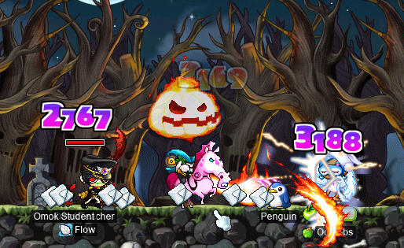

# rangifer’s diary: pt. lxxix

Welcome to _the biggest entry of rangifer’s diary_ yet! Not only are there a _lot_ of things going on in this entry, but it’s also simply the largest [byte](https://en.wikipedia.org/wiki/Byte)-for-byte! Hope you enjoy :)

## scroll\_strategist

There’s been another unscheduled interruption to our usually-scheduled “Taxonomising odd jobs” series…

In pt. l of this diary, I introduced (among other things) a little program that I wrote, called [scroll\_strategist](https://codeberg.org/deer/scroll_strategist) ([mirror](https://github.com/capreolina/scroll_strategist)). In short, scroll\_strategist is a small [library][lib] that is capable of generating optimal scrolling strategies for MapleStory equipment items. As of this writing, the scroll\_strategist has only one frontend: [scroll\_strategist\_cli](https://codeberg.org/deer/scroll_strategist_cli) ([mirror](https://github.com/capreolina/scroll_strategist_cli)). And, it only has one optimisation mode: optimising **solely** to maximise the probability of meeting (or exceeding) a user-specified goal.

However, before I possibly do more work on this library (and [CLI](https://en.wikipedia.org/wiki/Command-line_interface)), I wanted to give more detailed documentation of scroll\_strategist’s current philosophy and inner workings. When I originally wrote the library, I put in some decently detailed [doc comments](https://doc.rust-lang.org/rust-by-example/meta/doc.html#doc-comments) that do a lot of the work of explaining the logic. But I only now took the time to fill out the [README](https://en.wikipedia.org/wiki/README), which you can find at:

**<https://codeberg.org/deer/scroll_strategist/src/branch/master/README.md>** ([mirror](https://github.com/capreolina/scroll_strategist/blob/master/README.md)).

As you can see, I may have gotten a little carried away with the “footnotes”…

[lib]: https://en.wikipedia.org/wiki/Library_(computing)

## Embossed

I’ve been doing the occasional Big Bad Boss Run™ with my [darksterity knight](https://oddjobs.codeberg.page/guides/introduction-to-odd-jobs/#dex-warrior) **rusa**’s [MPQ](https://maplelegends.com/lib/map?id=261000021) krew, including **Harlez**, **xBowtjuhNL**, and **Gruzz**. Along the way, I had to quickly throw on some INT pyjamas (as one must feel scholarly when levelling up!) partway through [the second body of Papulatus](https://maplelegends.com/lib/monster?id=8500002):

Nice. Just one more level to max out [Sharp Eyes](https://maplelegends.com/lib/skill?id=3121002)!!

And, I got to do a [Zak](https://maplelegends.com/lib/monster?id=8800000) run or two. Here’s a screenshot that I captured of a particularly chaotic fight against [Zakum’s last arm](https://maplelegends.com/lib/monster?id=8800010):

I did a `@dpm 30` test during this run, and equipped with [SE](https://maplelegends.com/lib/skill?id=3221002) and [SI](https://maplelegends.com/lib/skill?id=5121009), I managed to clock some pretty impressive (in my opinion…) numbers!!:

84\.5M DPH at Zakum! Roooooooooaaaar~!!!

…Also note that I insist on having either an [Archer Elixir](https://maplelegends.com/lib/use?id=2002019), or [Bless](https://maplelegends.com/lib/skill?id=2301004), active at all times. The extra +20 AVOID really helps!

## The continuing bunny-child murder saga

You already know how it goes… It’s time for some more [bunny-child](https://maplelegends.com/lib/monster?id=9410032) murderification, in our favourite [hellhole](https://maplelegends.com/lib/map?id=742010100) — I mean, uhm, relaxation station.

I joined [STRginner](https://oddjobs.codeberg.page/guides/introduction-to-odd-jobs/#permabeginner-outland) **Taima** (**Nyanners**, **Tacgnol**, **Boymoder**, **Hanyou**) as my [daggermit](https://oddjobs.codeberg.page/odd-jobs.html#dagger-assassin) **alces**, to vanquish these creepy plastic dolls forever… Along the way, I found something a bit curious:

In addition to being MapleLegends’s foremost producer of [Big(ginner) Poop](https://maplelegends.com/lib/etc?id=4000378)s, my grinding partner Timer is also capable of laying Big(ginner) Eggs! Legend has it that [Timer’s Egg](https://maplelegends.com/lib/etc?id=4031991) has the power to grant experience. So I looted it, to find out…

Wow!!! I sure hope Timer lays more eggs in the future…

Sheeeesh… alces is level 104 now! How did that happen? Where did all of the plastic bunny suits go??

## PartyQuest III

Another PartyQuest was hosted by IGN **zkgui** (a\.k\.a. [**osmanthus**, **dj hotpot**](https://www.instagram.com/zkgui/)) — this time, at Santa’s house! I’ve included PartyQuest in my diary twice before, and the basic gist of it is that it’s an online rave, held in MapleLegends and streamed (this time on [Twitch\.tv][twitch]; formerly on [datafruits\.fm](https://datafruits.fm/)) over the internet for anyone to view/listen live.

**technopagan** (**drainer**, **xX17Xx**, **breakcore**, **attackattack**, **partyrock**, **strainer**) was, as usual, one of the DJs for the event, and put on an amazing set!:

(You can spot me as my I/L [magelet](https://oddjobs.codeberg.page/guides/introduction-to-odd-jobs/#magelet) **cervine** along the bottom, towards the right.)

As you can see above, this PartyQuest was also raising money for donations; in particular, donations to [Red Canary Song](https://www.redcanarysong.net/). RCS is an organisation that fights for justice and the rights of Asian and migrant sex workers. RCS originally formed to provide legal support for the family of Yang Song, who was killed during a police raid in [Flushing, Queens, NYC](https://en.wikipedia.org/wiki/Flushing%2C_Queens) in November of 2017.

[twitch]: https://en.wikipedia.org/wiki/Twitch_(service)

## All odd, all the time~

I had the _distinct_ pleasure of doing a whole lot of really cool stuff with all-odd parties!

### All-Oddjobs EPQs

First up, I did a few all-odd [EPQ](https://maplelegends.com/lib/map?id=300030100)s (after working around some rather unfortunately-timed issues with my [router](https://en.wikipedia.org/wiki/Wireless_router)… 🙄), with [DEXdit](https://oddjobs.codeberg.page/guides/introduction-to-odd-jobs/#lukless-bandit) **shadowban** (**tb303**, **2sus4u**), steelwoman [permawarrior](https://oddjobs.codeberg.page/guides/introduction-to-odd-jobs/#permawarrior) **Nyanners** (**Taima**, **Boymoder**, **Tacgnol**, **Hanyou**), and [bow-whacker](https://oddjobs.codeberg.page/guides/introduction-to-odd-jobs/#bow-whacker) **BowerStrike** (**Cortical**, **GishGallop**, **SussyBaka**, **CokeZeroPill**, **Aphasia**)! You can see me below, EPQing as my [DEX brawler](https://oddjobs.codeberg.page/guides/introduction-to-odd-jobs/#dex-brawler) EPQ/[LPQ](https://maplelegends.com/lib/map?id=221024500) mule **sorts**:

And here we all are, fighting the Big Bad Rock Guy™ (BBRG):

### Lattin’ w/ Taima & LoneW0lf1600

I also got to do a [Capt. Lat](https://maplelegends.com/lib/monster?id=9420513) run with [STRginners](https://oddjobs.codeberg.page/guides/introduction-to-odd-jobs/#permabeginner-outland) **Taima** and **LoneW0lf1600** (**LoneWolf1600**)! LoneWolf was new to the Lattin’ game, so Taima showed him the ropes of the ancient art of “hugging Capt. Lat and praying to the Maple gods that you don’t get hit by a magic attack”. Unfortunately, this didn’t work out so well the first time. I joined the during their second run, ready to provide some [Resurrection](https://maplelegends.com/lib/skill?id=2321006):

But again, this is an extremely delicate — and often simply chance-based — art, so we were unfortunately not able to get LoneWolf through this run alive, either. But soon! Anon we will prevail!!

During a Capt. Lat run with Taima, I popped a few of my [Heartstopper](https://maplelegends.com/lib/use?id=2022245)s to test how they would affect my damage output. Here, you can see my raw damage range with self-buffs & a ’stopper:

A maximum raw range of 7 845 — juicy!! Just ignore the 580 at the bottom there…

### KPQ’d

And I also got to do a few all-**Oddjobs** [KPQ](https://maplelegends.com/lib/map?id=103000800)s as my [SPQ](https://maplelegends.com/lib/map?id=990000000)/KPQ [DEX page](https://oddjobs.codeberg.page/guides/introduction-to-odd-jobs/#dex-warrior) mule **kinds**, alongside [permapirate](https://oddjobs.codeberg.page/guides/introduction-to-odd-jobs/#permapirate) **ratty** (**mase**) and [DEX](https://oddjobs.codeberg.page/guides/introduction-to-odd-jobs/#dex-warrior) [dagger warrior](https://oddjobs.codeberg.page/guides/introduction-to-odd-jobs/#dagger-warrior) **DexDagger**!:

### Oddjobs _KILLS DEAD_ the Ravana‽‽‽

We finally managed to get an all-odd crew together to fight [Rāvaṇa](https://maplelegends.com/lib/monster?id=9420014) again (for the third time now)… in hopes of being the first all-odd party to kill this [Hindu](https://en.wikipedia.org/wiki/Hinduism) beast!! Our party was:

- Myself, as my [darksterity knight](https://oddjobs.codeberg.page/guides/introduction-to-odd-jobs/#dex-warrior) **rusa** (and AFK as my pure [STR bishop](https://oddjobs.codeberg.page/guides/introduction-to-odd-jobs/#str-mage) **cervid**, largely for [Resurrection](https://maplelegends.com/lib/skill?id=2321006) purposes);
- **Cortical** (**GishGallop**, **BowerStrike**, **SussyBaka**, **CokeZeroPill**), the [STRginner](https://oddjobs.codeberg.page/guides/introduction-to-odd-jobs/#permabeginner-outland);
- **LawdHeComin**, the F/P arch[gish](https://oddjobs.codeberg.page/guides/introduction-to-odd-jobs/#gish);
- and **Taima** (**Nyanners**, **Boymoder**, **Tacgnol**, **Hanyou**), the STRginner!

Will our intrepid odd-jobbers survive? Can they defeat this oversized six-armed jerkass?? At what cost??? Watch the video on the **Oddjobs** YouTube channel to find out!!!:

[![All-odd-jobbed Ravana, attempt #3 \[YouTube\]](all-odd-rav-splash.webp "All-odd-jobbed Ravana, attempt #3 [YouTube]")](https://www.youtube.com/watch?v=u1Gw9PxSMCk)

(<https://www.youtube.com/watch?v=u1Gw9PxSMCk>)

### The Headless Horseman…!

During one of our [regularly scheduled oddie activities](https://codeberg.org/deer/gists/src/branch/master/what-s-next-for-oddjobs/odd-job-initiative/runs.md), I set out to slay some [Headless Horsemen](https://maplelegends.com/lib/monster?id=9400549) — as my I/L [magelet](https://oddjobs.codeberg.page/guides/introduction-to-odd-jobs/#magelet) **cervine** — alongside [STRginner](https://oddjobs.codeberg.page/guides/introduction-to-odd-jobs/#permabeginner-outland) **OmokTeacher** (**Slime**, **Ginner**, **Thinks**)!:

Action shots~

Would you look at that! The Headless Horseman’s “head” chopped clean off by [the blade of the Crimsonwood Forest](https://maplelegends.com/lib/equip?id=1442068)!!

### Even _moar_ Capt. Lattin’!

I also did a pair of Captain Latanicas with Taima, as well as STRginner **Cortical**, and [permarogue](https://oddjobs.codeberg.page/guides/introduction-to-odd-jobs/#permarogue) **xX17Xx** (**technopagan**, **drainer**, **attackattack**, **breakcore**, **strainer**, **partyrock**)! During our first attempt, we decided to try doing it without [HB](https://maplelegends.com/lib/skill?id=1301007). For xX17Xx, this would mean using [a dagger](https://maplelegends.com/lib/equip?id=1332030) in combination with [Double Stab](https://maplelegends.com/lib/skill?id=4001334), rather than her usual arsenal of [claw](https://maplelegends.com/lib/equip?id=1472073) & [L7](https://maplelegends.com/lib/skill?id=4001344). She was worried that her damage would be much lower, as she has intentionally designed her character around claw usage (including being STRless & DEXless), but she ended up whiting anyways… :P

Captain Latanica is DEAD to me

xX17Xx did actually end up dying during this run, but a quick Resurrection from me did the trick to put her back into the fight. Unfortunately, this meant that when Cortical died…

…there was nothing that we could do.

Ouf! Well, I suppose that was bound to happen. With not one, but two folks hugging Capt. Lat for dear life, chances of permanent fatality are quite high…

Luckily, we did avenge Cort! And we set out to do the Capt. Lat prequests with xX17Xx:

For our second run, we decided to drag my [darksterity knight](https://oddjobs.codeberg.page/guides/introduction-to-odd-jobs/#dex-warrior) **rusa** along for the ride, as an HB mule. Then, when Capt. Lat was at low HP, I would just send her out so that she wouldn’t leech any of the EXP:

")

As you can see, this meant that xX17Xx was able to switch to her native claw. And we cleared out the monsters that Latanica summons, including via [Doom](https://maplelegends.com/lib/skill?id=2311005):

~")

~!")

### First-ever Oddjobs SPQ!

That’s right — not only were we able to put together an all-odd crew for [Rav](https://maplelegends.com/lib/monster?id=9420014)ving, but we got to do an [SPQ](https://maplelegends.com/lib/map?id=990000000) (a\.k\.a. GPQ) as well!!!

SPQ is super fun, and also designed to be very inclusive — just about anyone in the 10–200 level range can participate. Of course, you still have to be able to kill [big bad skeleton man (BBSM)](https://maplelegends.com/lib/monster?id=9300028), but those who can’t survive the fight can watch from the balcony above in safety.

Our lineup was:

- Myself, as my [darksterity knight](https://oddjobs.codeberg.page/guides/introduction-to-odd-jobs/#dex-warrior) **rusa**;
- also myself, as my [DEX page](https://oddjobs.codeberg.page/guides/introduction-to-odd-jobs/#dex-warrior) SPQ/[KPQ](https://maplelegends.com/lib/map?id=103000800) mule **kinds**;
- **xX17Xx** (**technopagan**, **drainer**, **attackattack**, **breakcore**, **strainer**, **partyrock**), the [permarogue](https://oddjobs.codeberg.page/guides/introduction-to-odd-jobs/#permarogue);
- **Taima** (**Nyanners**, **Boymoder**, **Hanyou**, **Tacgnol**), the [STRginner](https://oddjobs.codeberg.page/guides/introduction-to-odd-jobs/#permabeginner-outland);
- **doiob**, the [STR cleric](https://oddjobs.codeberg.page/guides/introduction-to-odd-jobs/#str-mage);
- **shadowban** (**tb303**, **2sus4u**), the [DEXdit](https://oddjobs.codeberg.page/guides/introduction-to-odd-jobs/#lukless-bandit);
- and **GishGallop** (**Cortical**, **BowerStrike**, **CokeZeroPill**, **SussyBaka**), the I/L [gish](https://oddjobs.codeberg.page/guides/introduction-to-odd-jobs/#gish)!

You can watch a video of this SPQ on the **Oddjobs** YouTube channel!:

[!!")](https://www.youtube.com/watch?v=ia2J__uVj4Y)

(<https://www.youtube.com/watch?v=ia2J__uVj4Y>)

This PQ was a lot of fun, even if it did take a long-ass time. Now that we’re more familiar with SPQ (and hopefully I can get better at the JQs…), I hope to see some more cool Oddjobs SPQ runs in the future!!

This also marks the first time that my SPQ/KPQ mule kinds was able to fulfil her destiny…

:')

## The continuing compact-disc freezing saga

I did some more [compact disc](https://maplelegends.com/lib/monster?id=9410031) [refrigeration](https://maplelegends.com/lib/skill?id=2211002) on my I/L [magelet](https://oddjobs.codeberg.page/guides/introduction-to-odd-jobs/#magelet) **cervine**! Yeet haw!

…Refrigerating CD-Rs…

Looks like we’re Getting There™!! Just four (4) more levels!!! ;~;

I did some more optical disc freezing joined by not just **Level1Crook** (**Lvl1Crook**, **xXCrookXx**, **Sangatsu**), but also [STRginner](https://oddjobs.codeberg.page/guides/introduction-to-odd-jobs/#permabeginner-outland) **Taima** (**Tacgnol**, **Nyanners**, **Boymoder**, **Hanyou**)!:

(Don’t mind the bunched-up gravestones…)

And, during a certain CD-grind session with Level1Crook, he surprised me with [an engagement ring](https://maplelegends.com/lib/etc?id=4031358)!:

:3 You know what that means…

## Mawwiage…!

### Level1Crook × cervine

And it wouldn’t be a real Maple marriage without some improvised speeches:

Level1Crook × cervine

:'))))) \<3

And the customary kiss:

And, of course, the customary vomiting…:

When we got to the wedding cake photography stage, our wedding was promptly hijacked by **Permanovice** (**Battlesage**, **Dreamscapes**, **Paean**) and **kookiechan** (**kookietann**, **kurisuwu**):

I guess this made some folks angry & confused, because a full-blown brawl erupted at the end of the wedding!:

No serious injuries were reported.

### Cortical × xX17Xx

Not long after my wedding with Level1Crook, [STRginner](https://oddjobs.codeberg.page/guides/introduction-to-odd-jobs/#permabeginner-outland) **Cortical** (**GishGallop**, **BowerStrike**, **SussyBaka**, **CokeZeroPill**) and [permarogue](https://oddjobs.codeberg.page/guides/introduction-to-odd-jobs/#permarogue) extraordinaire **xX17Xx** (**technopagan**, **attackattack**, **drainer**, **breakcore**, **partyrock**, **strainer**) were getting married, as well! I needed something to bless their marriage with, so I rounded up all of my [Black Crystal](https://maplelegends.com/lib/etc?id=4021008)s and [Black Crystal Ore](https://maplelegends.com/lib/etc?id=4020008)s:

Cortical × xX17Xx

Yeah, so… I farmed every single one of these ores/crystals myself, by hand. And this doesn’t include the 100 crystals’ (1k ores’) worth that I used to craft a set of [bfuries](https://maplelegends.com/lib/use?id=2070018) many diary entries ago! However, since then, there has been a big change to the CWK exchange & CWK crafting in MapleLegends. The recipe to craft a single set of bfury is still the same:

- 100 Black Crystals,
- 30 [Typhon Feather](https://maplelegends.com/lib/etc?id=4032005)s,
- 1 [Tao of Shadows](https://maplelegends.com/lib/etc?id=4032015),
- 1 [Tao of Sight](https://maplelegends.com/lib/etc?id=4032016),
- 1 [Tao of Harmony](https://maplelegends.com/lib/etc?id=4032017),
- and 150k mesos.

But now, taos are _much_ more difficult to obtain, and bfury creation is no longer exclusive to crafting. A new exchange was bolted onto the [DMG](https://maplelegends.com/lib/map?id=610010004) NPCs, designed to entice players to try their luck at this raffle. This new raffle can award already-crafted bfuries (among other things), but is separate from the old CWK exchange. Because taos were removed from the CWKPQ bonus stage, the only way to obtain taos is now from the old CWK exchanges. This means that taos are virtually nonexistent; they used to come almost exclusively from the CWKPQ bonus stage, and now people have _even less_ incentive to do the old CWK exchanges due to the existence of the new CWK exchange. And yet, the taos can only be used to craft things (notably bfury and [Crimson Arcglaive](https://maplelegends.com/lib/equip?id=1442068)) that you would get pre-crafted from the new CWK exchange anyways. So, CWK crafting is effectively dead — it’s almost always a stupid idea to do.

But I did it anyways, because what else am I gonna do with all of these black crystals that I farmed?? And plus, that just makes my wedding gift that much more special! But that means I have to do the worst part of bfury crafting… farming the Typhon Feathers:

-\_\_\_-

I’m sorry, but farming for feathers [at Typhons](https://maplelegends.com/lib/map?id=610020004) is pure, distilled pain. Initially, I considered farming 60 feathers so that I could make two bfury sets, but after paying 25M mesos for three taos (enough to craft a single set of bfury), and actually going to Typhons to collect the feathers, I thought better of it…

In any case, with 30 feathers farmed, a bfury set was all ready for the wedding:

(Being LGBTQ+ is… recommended, but not strictly required, for members of **Oddjobs**.)

\#zhelmgang rise up

### cervid × Taima

**Taima** and I had already decided, roughly a week prior, that we should marry! Particularly, with my pure [STR bishop](https://oddjobs.codeberg.page/guides/introduction-to-odd-jobs/#str-mage) **cervid**. It just felt right; both of us have been good friends, and early proponents of the **Oddjobs** guild. We both deal damage almost exclusively by basic-attacking…

So it was time to make [an engagement ring](https://maplelegends.com/lib/etc?id=4031358)! I had some of the ETCs already prepared, so I set out to farm the rest of them, including some [Horny Mushroom Cap](https://maplelegends.com/lib/etc?id=4000015)s:

cervid × Taima

With the engagement ring crafted, I wanted to wait for the right time to actually propose & get engaged to Taima. So I thought the cleaned Ghost Ship (the version of the Ghost Ship that you only get to see if you defeat [Capt. Latanica](https://maplelegends.com/lib/monster?id=9420513) and all of his minions) would be a cool place to do it :P

So, I waited for the chance to do two Capt. Lat runs as a duo:

:D \<3

**Cortical** (**GishGallop**, **BowerStrike**, **SussyBaka**, **CokeZeroPill**) had the idea to hold a “level 120 party” for Taima, even though she was still level 115 (a far cry from level 120, especially for a permabeginner!). The purpose of holding such a party was largely as a prank on **Permanovice** (**Battlesage**, **Dreamscapes**, **Paean**), who was level 119 (and 99\.9% EXP) at the time, just waiting for the weekend to arrive so that his level 120 party could commence. Permanovice had been a bit anxious about getting “passed” by Taima as she started to do [KMs](https://maplelegends.com/lib/map?id=742010100) grinding on a regular basis. So, if Taima could just schedule her “120 party” a bit earlier… _eventually_ she’d get to 120, and her party would be first! Take that, Permanovice!! :P

Later, but still before Permanovice’s level 120 party, I was duo grinding [at Pigs (HGMotFII)](https://maplelegends.com/lib/map?id=1000006) with Permanovice’s [islander](https://oddjobs.codeberg.page/guides/introduction-to-odd-jobs/#islander), Dreamscapes, as my islander **ozotoceros**. And it was there that I told him about the “party” (which he unfortunately couldn’t attend):

We gave up on the “level 120 party” once it came time to hold the wedding~

Neither of us had the kissy face emote (largely because I had already spent 40k NX just for the wedding ticket…), but that was okay — the F3 kiss is a crowd favourite, and also a nice throwback to the MapleStory of yore:

You can **[watch an edited video of the wedding on the Oddjobs YouTube channel](https://www.youtube.com/watch?v=HXGz3t8u9U4)**!:

[![cervid × Taima \[YouTube\]](taima-x-cervid.webp "cervid × Taima [YouTube]")](https://www.youtube.com/watch?v=HXGz3t8u9U4)

We had also planned something else for the wedding. The “level 120 party” was planned to take place before the wedding, but afterwards, we had a [Ravana](https://maplelegends.com/lib/monster?id=9420014) run or two planned, to celebrate Taima hitting level 115 (and thus being high enough level to get EXP normally from Ravana)! For our Ravana party, we were joined by sniper **Level1Crook** (who insisted on crossbow-whacking Ravana the entire time), [STRginner](https://oddjobs.codeberg.page/guides/introduction-to-odd-jobs/#permabeginner-outland) **Cortical**, crusader **Kerchak**, and dark knight **DarkCookie** (**SolidState**, **IceGrinder**). DarkCookie’s presence was most fortunate, as it prevented me from having to drag along my [darksterity knight](https://oddjobs.codeberg.page/guides/introduction-to-odd-jobs/#dex-warrior) **rusa** for the [HB](https://maplelegends.com/lib/skill?id=1301007) :P

After the majority of the fight was complete, DarkCookie unfortunately forgot to refresh HB, and this resulted in Level1Crook, Cortical, and my wife Taima all dying nearly instantly:

Oop… Fortunately, they did all die in more or less the same spot, so I knew exactly what to do: lure Ravana to the other side of the map, and then [resurrect](https://maplelegends.com/lib/skill?id=2321006) them all at once, with DarkCookie nearby to HB them ASAP. Actually doing the luring part took a while (as monster movement/aggro/etc. was still horribly broken in this MapleLegends patch), but we managed to pull it off. With Ravana safely on the other side of the map, and DarkCookie in the midst of this grave of three, I resurrected them. Unfortunately, DarkCookie had gotten his keyboard focus stuck in the chatbar, so a few seconds went by as Taima & I cried out for HB, and then another Ravana attack came crashing down, killing all three of them again… Well actually, Level1Crook jumped when the attack hit, and somehow survived. Dunno how that works.

But it was alright — we had another run that we could do. **Noble** (**NobIe**, **CtrlNoble**, **xNoble**, **1122**, **Amaging**) was kind enough to [TL](https://maplelegends.com/lib/skill?id=5121010) my Resurrection, so that I would have one ready for the next run. So we went again, this time with a slightly different crew (Level1Crook stepped out, in order to let [permarogue](https://oddjobs.codeberg.page/guides/introduction-to-odd-jobs/#permarogue) **xX17Xx** try Ravana for the first time!):

Cortical died during this run, as well, but this time we were really prepared:

Unfortunately, even with Ravana on the other side of the map and DarkCookie truly ready this time to HB, Cortical died nearly instantly after being revived, thanks to Ravana’s impeccable sense of timing…

But Taima did survive this time!! Hooray!!! :3

## APQ…

With all of those weddings, you know what’s coming… time for some [apple farming](https://maplelegends.com/lib/map?id=670010100)!! With me playing my [vicloc](https://codeberg.org/Victoria) [dagger spearwoman](https://oddjobs.codeberg.page/guides/introduction-to-odd-jobs/#dagger-warrior) **d34r**, and Lv1Crook on his vicloc bandit **xXCrookXx**, we helped **Cortical** and **xX17Xx** through the first-ever APQ for both of them!:

Apey queue…

And of course, **Taima** & I (as my pure [STR bishop](https://oddjobs.codeberg.page/guides/introduction-to-odd-jobs/#str-mage) **cervid**) did our first APQ together (and Taima’s first APQ in general!):

In [the first stage](https://maplelegends.com/lib/map?id=670010200), someone told me to use [Genesis](https://maplelegends.com/lib/skill?id=2321008) to kill the [Magik Fierry B](https://maplelegends.com/lib/monster?id=9400518)… I frustratedly said “I can’t”, and Taima had a good laugh as I rolled my eyes and walked over to demonstrate that my Genesis only “**MISS**”es the Fierry (and then promptly one-shot’d it with my [glaive](https://maplelegends.com/lib/equip?id=1442068)). It’s typical for fourth-job mages (such as cervid…) to use their ultimates during [stage 3](https://maplelegends.com/lib/map?id=670010400) to help clear the monsters that clutter up the map and knock people off of their platforms. So that’s what you can see me _trying_ to do above…

And then we got to fight da [Grog](https://maplelegends.com/lib/monster?id=9400514) together!:

c:

## A little peek at Maple Island

While playing my [islander](https://oddjobs.codeberg.page/guides/introduction-to-odd-jobs/#islander) **ozotoceros**, I ran into a new (or seemingly new, as they were just level 14 at the time) islander by the name of **Tacts**. Tacts also had another islander by the name of **Mesa** (a level 40 islander of **Southperry**), but decided to start over, for aesthetic reasons. I asked if they wanted an invite to **Oddjobs**, or Southperry (or perhaps **Newbology** or **Flow**…), so they are now a member of Oddjobs:

They also started a new [outland STRginner](https://oddjobs.codeberg.page/guides/introduction-to-odd-jobs/#permabeginner-outland) by the name of **Palfrey**, who joined as well! We did some [Pigs](https://maplelegends.com/lib/map?id=1000006) grinding together until Tacts was level 16 :)

The MapleLegends staff, although they seem to be repeatedly forgetting to lower the level requirement for event raffles to ≥30 on-island (instead of ≥70 everywhere!!), at least went back and added a [Little Suzy](https://maplelegends.com/lib/npc?id=9201093) NPC to [Amherst](https://maplelegends.com/lib/map?id=1010000). So I was able to get me [some antlers](https://maplelegends.com/lib/equip?id=1002717)…:

And I did some duo grinding with **Dreamscapes** (**Permanovice**, **Battlesage**, **Paean**, **Hanger**) of **Flow**, also at pigs. And we did some trioing as well, with **1sme** (**Ismezin**) of **Southperry**!:

…During which, I levelled up :D

## Permanovice’s level 120 party!!!

And of course, as mentioned earlier, the level 120 party of MapleStory’s poggest grind[ginner](https://oddjobs.codeberg.page/guides/introduction-to-odd-jobs/#permabeginner-outland) to date: **Permanovice**!! I was able to make it to the beginning of the party:

Permanovice’s level 120 party

(You can spot me somewhat right of centre, as my pure [STR bishop](https://oddjobs.codeberg.page/guides/introduction-to-odd-jobs/#str-mage) **cervid**.)

The second event of the party, after the initial photo op, was a kind of game of [keepaway](https://en.wikipedia.org/wiki/Keep_away), where we all went to [Lorang and Clang](https://maplelegends.com/lib/map?id=110030000) (the map where Permanovice trained his original permabeginner back in MapleSEA), and tried to prevent Permanovice from levelling up, by killing everything on the map before he could get to it:

Needless to say, considering how many people attended the party, this was pure chaos. Indeed, it really only took a few minutes before Permanovice had racked up enough kills to hit the big one-twenty!!!!!:

There were a lot of other really cool activities and events that were meticulously planned by Permanovice (with help from **Nekokoro**, who you can see in the [Lith Harbour](https://maplelegends.com/lib/map?id=104000000) image above) for this party. Unfortunately, by this point, I was so deprived of sleep that I [died IRL][syncope]. Temporarily. But I missed the rest of the party, regrettably :(((

But congrats again to Permanovice on this incredible achievement!!! I may have doubted you at first, but I’ve now seen the kind of intense dedication and grind that you’re capable of, and also how much of a friend you’ve been to me, and to others in the odd-jobbed community. \<3 I look forward to seeing you online as part of the **Oddjobs** crew on your [gish](https://oddjobs.codeberg.page/guides/introduction-to-odd-jobs/#gish) :D

[syncope]: https://en.wikipedia.org/wiki/Syncope_(medicine)

## (…concluding nonverbal postscript to diurnal fragments…)

cnvpstdf

