# rangifer’s diary: pt. lxxx

Welcome to the 80th entry of rangifer’s diary!! Like the previous entry, this is a special entry, albeit for different reasons…

This is… the **biggest entry of rangifer’s diary ever**, and this took me [approximately](https://en.wikipedia.org/wiki/Exaggeration) one [æon](https://en.wikipedia.org/wiki/Aeon) to complete from start to finish!!!

## Getting cervid a new helm

My pure [STR bishop](https://oddjobs.codeberg.page/guides/introduction-to-odd-jobs/#str-mage) **cervid** has been using the same 13 STR, 31 DEX [zhelm](https://maplelegends.com/lib/equip?id=1002357) since… well… she was about level ≈55. Now, 31 DEX is pretty respectable, and the main reason that I’ve been using the same zhelm for so long is the rather… personal story behind it. That being said, 13 STR is the worst possible STR (discounting the possibility of [Chaos Scroll](https://maplelegends.com/lib/use?id=2049100)ing), so I’ve been wanting a replacement for a while now. The choice is obvious: a [Scarlion Hat](https://maplelegends.com/lib/equip?id=1003026)! Trouble is, I gotta do the Scarga prequests first.

Luckily for me, I already had most of the ETC items necessary for the various quests in this questline. But I still had to do all of the killing, so I headed to the Fantasy Theme Park to whack some [Vikerola](https://maplelegends.com/lib/monster?id=9420539)s:


…And some ([Doom](https://maplelegends.com/lib/skill?id=2311005)’d) [Booper Scarlion](https://maplelegends.com/lib/monster?id=9420538)s:


…Some [Gallopera](https://maplelegends.com/lib/monster?id=9420540)s (better known as “Gallos”; not to be confused with the [Latin](https://en.wikipedia.org/wiki/Latin)/[Romance](https://en.wikipedia.org/wiki/Romance_languages) term meaning “[rooster](https://en.wiktionary.org/wiki/gallo#Latin)”):


And after all of that whacking — quite a bit of whacking, I must say! — it was time to finish things by recovering [those little thingumabobs](https://maplelegends.com/lib/etc?id=4000471) riding on the backs of the [Rodeo](https://maplelegends.com/lib/monster?id=9420533)s:


Thankfully, Rodeos are not quite as tough as the other monsters that I’d been fighting, so this didn’t take too long. Plus, [the Rodeo map](https://maplelegends.com/lib/map?id=550000300) isn’t part of the Fantasy Theme Park region, so I didn’t have to put my graphics settings all the way to the minimum \>.\<

Just after I had finished up the prequests, I saw a [smega](https://maplelegends.com/lib/cash?id=5072000) from **MuscleUncle** (**[\*][glob]Uncle**) announcing the sale of some Scarlion Hats, so I jumped on the opportunity:


Ah, yeah. So, no, I did _not_ get Scarlion Hats and [Targa Hats](https://maplelegends.com/lib/equip?id=1003023) mixed up. The more STR/DEX, the merrier…

I was fortunate enough to come away from this Scarga run with a perfect (i\.e. 19/17/x/y main stats) Scarlion Hat (STR). My luck with the [helm DEX 60%s](https://maplelegends.com/lib/use?id=2040029) (which, I might add, are a bit pricey…) was a bit mixed at first, and eventually it got to the point where I was at 19 STR, 29 DEX, and 1 slot. I just needed to pass the last slot to make this new helm have the same DEX as my old one (and 6 extra STR, of course), but I wasn’t sure if I had the courage to throw a [70%](https://maplelegends.com/lib/use?id=2040028) at it. I vented about my predicament to **Taima** (**Boymoder**, **Hanyou**, **Nyanners**), and eventually decided to channel my inner not-a-coward and throw a damn 70% at it:


Yay!! Getting stronker!!!

[glob]: https://en.wikipedia.org/wiki/Glob_(programming)

## Visiting Neo Tokyo for the first time

For those not already familiar, Neo [Tokyo](https://en.wikipedia.org/wiki/Tokyo) is the collective name for a collection of maps found in the far future of [Zipangu](https://en.wikipedia.org/wiki/Japan). The way that the maps are organised is a tad bizarre, and my understanding is that the GMS (Global MapleStory) version of this region went by a different name: [Neo City](https://bbb.hidden-street.net/map/ossyria/neo-city). In fact, Neo City was apparently part of Ossyria\*, divorced from Zipangu entirely. Instead of entering Neo City through the [Mushroom Shrine](https://maplelegends.com/lib/map?id=800000000), Neo City was entered via [Leafre](https://maplelegends.com/lib/map?id=240010900).

In this version (MapleLegends), you can enter Neo Tokyo by completing a quest given by [Asia](https://maplelegends.com/lib/npc?id=9120025) (who can be found tucked away in [Kamuna](https://maplelegends.com/lib/map?id=802000101)), who weaves an _extremely_ long-winded and largely incoherent tale about… uhm… I don’t know, something about how there’s a book that has the entire history of Zipangu written in it, down to the level of every movement ever made by every person (in Zipangu) in history, except that Asia is somehow not in the book (despite being a resident of Zipangu). And she finds out that because(?) she’s not mentioned in the book, she’s the only one who has the power to change the history written in the book, and to communicate with outsiders. She somehow finds out that Zipangu is going to be ruined by some kind of [robot uprising](https://en.wikipedia.org/wiki/AI_takeover) in the distant future, and she’s the only one who can salvage Zipangu’s future by altering the history written in That One Book™. Of course, altering the contents of That One Book™ is tantamount to [rewriting history](https://tvtropes.org/pmwiki/pmwiki.php/Main/YouCantFightFate), and that means [the usual trouble with time travel](https://tvtropes.org/pmwiki/pmwiki.php/Main/TimeyWimeyBall) and all that mess. So all of this means that you, the adventurer — and outsider who is conveniently not mixed up with all of this destiny book stuff — are tasked with… something. That’s the gist of it. But Asia isn’t convinced that you’re tough enough to handle Neo Tokyo (what with the scary robots and all that), so you have to gather up some ETCs to show that you are indeed capable of fighting big bad guys.

In any case, I’d never been to any version of Neo Tokyo, and I didn’t have those ETCs (certainly not [the oil dropped by the big bad Toad](https://maplelegends.com/lib/etc?id=4000343)). But I was assisted by **Gruzz** (**Furca**) and **Harlez**, plus the [Kacchuu Musha fragment](https://maplelegends.com/lib/etc?id=4000342) that I already had from killing [Kacchuu Musha](https://maplelegends.com/lib/monster?id=9400405)! So, I was able to enter the place we call NT for the first time:


What in the got damn hell, indeed. I’ve never fought monsters quite this annoying, nor have I had the distinct displeasure of being “zombified”!? Now all healing (including from potions) is reduced to half of its usual efficacy??? How am I supposed to be [zerk](https://maplelegends.com/lib/skill?id=1320006)ed when I’m randomly zombified half of the time? In any case, I talked to the guy in this first map, and did his quests:

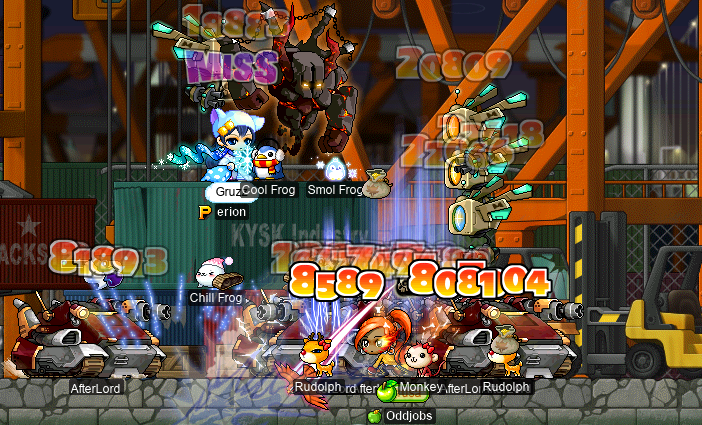

Naturally, the quests ask for bespoke quest-only ETCs, so you can’t buy your way out of this nonsense. Also, just like Asia’s dialogue, this [Ponicher](https://maplelegends.com/lib/npc?id=9120027) guy _loves_ to blab on, with endless dialogue boxes. The problem is, this map _actually has monsters on it_ (and they fly, too), so I didn’t get to read any of it. Instead, I just furiously mashed my keyboard to get through the dialogue as quickly as possible, while Gruzz tried to protect my now-defenceless (as you can’t use potions while NPC chatting) body. Eventually, and with a lot of help from Gruzz, I collected all of these bespoke ETC items, and I was brought to the next map in this subregion of NT (which is, by the way, “[2100 Odaiba](https://maplelegends.com/lib/map?id=802000200)”, i\.e. [Odaiba](https://en.wikipedia.org/wiki/Odaiba) in the year 2100 [AD](https://en.wikipedia.org/wiki/Anno_Domini)):


It is fun (if you can call being in the same map as [OverLord](https://maplelegends.com/lib/monster?id=9400254)s and [AfterLord](https://maplelegends.com/lib/monster?id=9400253)s “fun”) to romp around in a [post-apocalyptic](https://en.wikipedia.org/wiki/Apocalyptic_and_post-apocalyptic_fiction) Japanese [artificial island](https://en.wikipedia.org/wiki/Artificial_island), but this is actually where my NT journey ends — just as quickly as it started. At this point, the only way to progress (AFAIK) is to fight a superbig superbad guy ([Bergamot](https://maplelegends.com/lib/monster?id=9400263) or something? I don’t know), so I’m gonna need to come back in like… 30 levels. -\_- NT is, after all, the highest-level content in MapleLegends, I think. Except [Pink Bean](https://maplelegends.com/lib/monster?id=8820001), or something. I’m not really sure.

<details>
<summary>Footnotes for “Visiting Neo Tokyo for the first time”</summary>

\*See pt. lxviii of this diary, where I talk about what is included in the massive continent that is Ossyria.

</details>

## cervine on the home stretch

My I/L [magelet](https://oddjobs.codeberg.page/guides/introduction-to-odd-jobs/#magelet) **cervine** has been closing in on level 120, so I’ve been paying special attention to grinding and questing on her. Speaking of questing, in past diary entries, I did some of the [Magatia](https://maplelegends.com/lib/map?id=261000000) questline (my favourite questline) on cervine. Welp, it’s time to polish that questline off:

<details>
<summary>cervine on the home stretch~</summary>


That’s right. Take that, [Homunsculler](https://maplelegends.com/lib/monster?id=8110300)! Gimme yr [blood](https://maplelegends.com/lib/etc?id=4031737)!! Once I took the Homunsculler Blood to [Alcaster](https://maplelegends.com/lib/npc?id=2020005), he had me hunt down those other three stones and put them into the Black Magician’s special-sauce trigram.

For the [Magic Stone of Trust](https://maplelegends.com/lib/etc?id=4031741), I needed to hunt down some [D. Roy](https://maplelegends.com/lib/monster?id=7110300):


And, lucky for me, I already had a [Magic Stone of Honesty](https://maplelegends.com/lib/etc?id=4031740) from the [Homunculi](https://maplelegends.com/lib/monster?id=7110301) that I’d killed earlier in the questline. So I just had to put the stones into said trigram. Of course, doing so means actually walking to the trigram… through treacherous, unlit jumpquests…


This was not the only time that I fell while trying to get to the Black Magician’s Lab -\_-

Okay, there we are: the lab. Just gotta put the stones into the trigram in the correct order…


And huzzah! Magatia is saved!! Again!!! I don’t know why I keep having to save Magatia over and over again, but it’s pretty fun, so I won’t complain.

Anywho, now that I’m done with all the quests that have decent rewards, I guess I’ll head back to [CDs](https://maplelegends.com/lib/map?id=742010203)…


I did some CD grinding with **Taima** (**Nyanners**, **Hanyou**, **Boymoder**)\*:


Including an incident in which I got to 99\.99% EXP and waited for Taima to return (so that I could make another dumb “chicken butt” joke), only to look over a little too late, after Taima had already killed a few CDs and unwittingly levelled me up:


And with not only Taima, but also INTlaw **Lvl1Crook** (**Level1Crook**, **xXCrookXx**, **Macer**, **Lanius**, **Sangatsu**, **Ichigatsu**):


Level 119!!! So close…

So, I came back to CDs later on, to grind my way to 99\.98% EXP. Partway through my sadgrinding session, a mysterious man came along, B\>Leech…


So, yeah, I did in fact sell one (1) hour of CDs leech to a stranger, as a level 119 I/L magelet. It truly is a bizarre world that we live in…

</details>

<details>
<summary>Footnotes for “cervine on the home stretch”</summary>

\*_¿Adivina qué?_ is a [literal translation](https://en.wikipedia.org/wiki/Literal_translation) into [Spanish](https://en.wikipedia.org/wiki/Spanish_language) of the [English](https://en.wikipedia.org/wiki/English_language) [_guess what?_](https://www.urbandictionary.com/define.php?term=chicken%20butt), so don’t take it too seriously. Also, _culo_ is probably a bit more [vulgar](https://en.wikipedia.org/wiki/Profanity) than the English _butt_ (cf. English _ass_), but whatever, it [means](https://en.wikipedia.org/wiki/Denotation) the same thing anyways.

</details>

<!-- markdownlint-disable-next-line no-trailing-punctuation -->
## cervine is an archmagelet.

And now, for the moment you’ve all been waiting for… :)

**cervine**’s level 120 party!!! You can watch a video of the party (including the speech that I gave) on the **Oddjobs** YouTube channel!:

[![cervine is an archmagelet. \[YouTube\]](deerblizzard.webp "cervine is an archmagelet. \[YouTube\]")](https://www.youtube.com/watch?v=2dLmk0ERy0g)

(<https://www.youtube.com/watch?v=2dLmk0ERy0g>)

The music heard in the video is _cervine’s Theme_ \[[CC BY-SA 4\.0](https://creativecommons.org/licenses/by-sa/4.0/)+\]. You can download a recording of _cervine’s Theme_ [here, on my bandcamp page](https://capreolina.bandcamp.com/album/cervine-s-theme). You can also obtain the [score](https://en.wikipedia.org/wiki/Sheet_music) (as a [MuseScore](https://musescore.org/) 3 file) [here](https://codeberg.org/deer/gists/src/branch/master/cervine-s_Theme.mscz). I also talk about _cervine’s Theme_ at length, at the end of this diary entry.

There was also a bit of an afterparty in [Pianus’s cave](https://maplelegends.com/lib/map?id=230040420), where **Taima** (**Nyanners**, **Boymoder**, **Hanyou**), **Harlez**, **Level1Crook** (**Lvl1Crook**, **xXCrookXx**), and I fought this oversized fishy:


…And were later joined by **Gruzz** and **2sus4u**, at which point everyone decided to beat me up and loot my corpse. Kind of a weird (and, I might add, rude) “congratulations on level 120” present, but alright…


(The three frames making up the image above ended up being stitched together the wrong way for an [LTR](https://en.wikipedia.org/wiki/Writing_system#Directionality) language; they should be viewed from the right to the left. I can’t be arsed to fix it.)

Well, at least it’s comforting to know that I drop [something shiny and valuable-looking](https://maplelegends.com/lib/etc?id=4000038) when I die…

## Getting a Horntail Necklace for cervine

Now that cervine is level 120, it’s time to get her the ultimate [magelet](https://oddjobs.codeberg.page/guides/introduction-to-odd-jobs/#magelet) item: a [Horntail Necklace (HTP)](https://maplelegends.com/lib/equip?id=1122000)!! Not only does the HTP pack a real punch when it comes to TMA (which is greatly appreciated!), but it also makes a huge addition to the magelet’s already quite high AVOID.

Of course, it’s not quite so easy as “just buying” one. I need a way to get into the Cave of Life (CoL), _and_ a way to sign for the Horntail (HT) expedition. After all, I do have to, you know, actually attend the HT run — even if I’m not doing any of the HT-fighting work. To get into CoL, I need a [Dragon Elixir](https://maplelegends.com/lib/use?id=2210003) that can turn me into a cornian, so that I can sneak past security. And to sign for the HT expedition, I will need a [Certificate of the Dragon Squad (CotDS)](https://maplelegends.com/lib/etc?id=4001086)! MapleLegends somewhat recently changed both of these things. The Dragon Elixir quest is significantly easier; it doesn’t require finding one of those pesky [Manon](https://maplelegends.com/lib/monster?id=8180000)s, nor even the [Cornian’s Marrow](https://maplelegends.com/lib/etc?id=4001075) or the infamous [Busted Dagger](https://maplelegends.com/lib/etc?id=4001079). I do have to farm some [Tough Dragon Skin](https://maplelegends.com/lib/etc?id=4001077)s though:

<details>
<summary>In pursuit of the ultimate magelet item!!</summary>

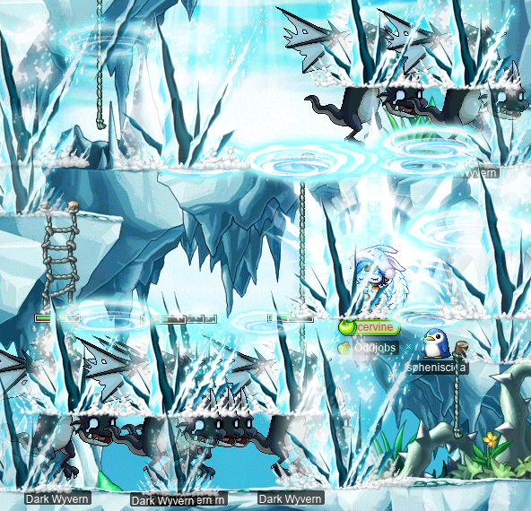

On the other hand, actually signing up for an HT expedition has an additional barrier now: _everyone_ has to have the CotDS, or they can’t even sign. Fortunately, the CotDS quest (which I had already completed before, on my [darksterity knight](https://oddjobs.codeberg.page/guides/introduction-to-odd-jobs/#dex-warrior) **rusa**, just for the heck of it) has been made somewhat easier as well. In particular, you don’t have to do HTPQ (Horntail Party Quest) anymore, which is great. Needing a team of six people inside of CoL just to do HTPQ and scrounge around for those coloured stone thingies was a real pain in the ass. But I still need those pesky certifications, which means killing:

- [Papulatus](https://maplelegends.com/lib/monster?id=8500001),
- [Zakum](https://maplelegends.com/lib/monster?id=8800002),
- and [Pianus](https://maplelegends.com/lib/monster?id=8510000).

Damn, if only I had already started this quest before having my level 120 afterparty…

Well, in order to do the first two, I have some prequests to do. Both Papulatus and Zakum have prequests, and I had yet to do _any_ such prequests. **Cortical** (**SussyBaka**, **CokeZeroPill**) also wanted to do the Papulatus prequests, so I headed to Deep Ludi with Cortical and **Taima** (**Nyanners**, **Boymoder**, **Hanyou**) to start killing some [Buffies](https://maplelegends.com/lib/monster?id=6130200):


…And some [Lazy Buffies](https://maplelegends.com/lib/monster?id=6230300):


Once we had enough [Mysterious Powder](https://maplelegends.com/lib/etc?id=4031171) from the Buffies to satisfy everyone, it was time to head to [Lost Time](https://maplelegends.com/lib/map?id=220070201) and collect some mysterious ETCs from the [MDT](https://maplelegends.com/lib/monster?id=7130300)s there. In so doing, I found out something very unsavoury about MDTs…:


I AM epic — so there!!

After a sufficient quantity of MDT-themed torture, we headed to [Forbidden Time](https://maplelegends.com/lib/map?id=220070301) to hunt for pieces of crack from [GPW](https://maplelegends.com/lib/monster?id=8143000)s. I somehow forgot how the Papu prequests work, and mistakenly believed that we had to fight _both_ GPWs and [GSV](https://maplelegends.com/lib/monster?id=8141100)s to get the pieces of crack. We really could have just gone to GSVs, which are weak to lightning and neutral to ice, unlike GPWs, which are neutral to lightning and immune to ice -\_-


But we got all of the cracks anyways~


And, finally, those [Ludibrium Medals](https://maplelegends.com/lib/etc?id=4031172)!


And I fought the Papulatus and took its certification!! But that was actually during Taima’s level 120 party, which is covered in a section below this one.

With the Papulatus prequests out of the way, I also had to do the dreaded Zakum prequests. I figured I’d just do ’em in order, and get it out of the way. So that meant hunting for some keys in some randomly annoying chests (And sometimes, randomly annoying rocks) inside of an [active volcano](https://en.wikipedia.org/wiki/Active_volcano):


Excellent! A piece of molten lava rock! I’ll just keep that in my pocket. Sounds safe.

And now, for the part that I truly dread: the Zakum jump quest. Now, at this point, I’ve successfully completed the Zakum jump quest many times, over the course of many characters. So you’d think that I’d be pretty good at it by now. And you know what? By my own standards, I think that I _have_ gotten a lot better at it. _And yet_, I still dread it every… single… time.

So I’ll spare you the images of me sobbing whilst standing upon a tiny rock inexplicably suspended above a bed of [magma](https://en.wikipedia.org/wiki/Magma) and surrounded by countless deadly booby traps. Suffice it to say that I did it. Again. And still yet, [Lira](https://maplelegends.com/lib/npc?id=2032003) refuses to take her smug eyes off of that piece of parchment that she’s holding and acknowledge my achievements!:


Ugh.

I guess I’ll take out my angst on some [Miner Zombie](https://maplelegends.com/lib/monster?id=5130108)s. And maybe they’ll give me the [gold teef](https://maplelegends.com/lib/etc?id=4000082)s that I need to complete the final leg of the Zakum prequests:


And, at last, with 30 golden teefies farmed: the Zakum prequests are complete.


Almost immediately after I finished the prequests, I saw a [smega](https://maplelegends.com/lib/cash?id=5072000) from a Zakum expedition who were offering to sell a Zakum certificate (amongst other things), so I decided to buy:

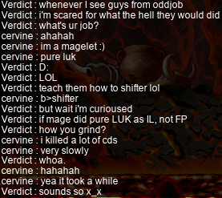

**Verdict** was the bishop of the party, which otherwise consisted of **Matsuri** members. I didn’t have an issue with buying the cert, because I know that in order to get the cert to drop, you have to not only “poke” (read: deal \>0 total damage to) the boss before it dies, but you also have to be in the same party (the “killing party”) as the character who whited. This is unfortunate for someone like me who wants to get a cert without actually contributing, because Zakum parties are customarily six people… and yet, six is the maximum size of a party.

In any case, I did get the cert, as promised:


Oh, right — and the Pianus cert! I guess it’s time to head back to the afterparty cave. Thankfully, I was assisted by marksman **xBowtjuhNL**, who helped me by dealing much less pathetic DPM than me…:

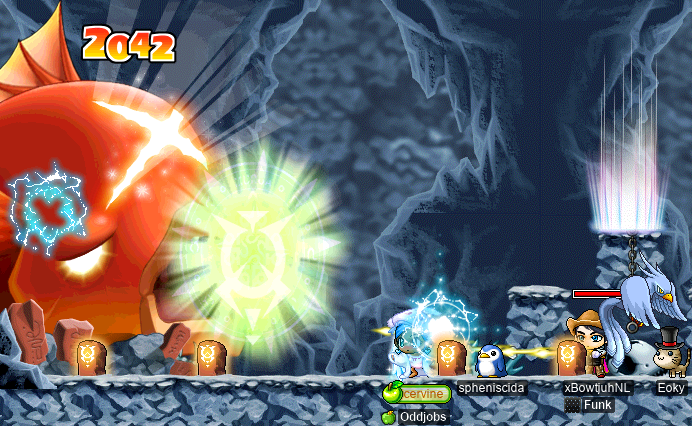

And with that, my very own CotDS!!!:


Now with the CotDS and a Dragon Elixir (actually two Dragon Elixirs, as the quest awards two of them now) in hand, I could finally buy an HTP. The question remains of whether I should buy it AFK or not. With cervine’s pitiful MAXHP pool, and even more pitiful MAXMP pool (thanks to being INTless for life), I had to guess that I wouldn’t survive HT’s most powerful attacks. And even more so, Horntail is a big fan of dispelling everyone on the map, which would mean that I have to be quick enough to re-cast my buffs (especially [MG](https://maplelegends.com/lib/skill?id=2001002)) in order to survive. So… yeah, nah. I’m buying AFK.

As it turned out, that AFK HTP run was going to cost me a smol fortune: about 90[M](https://en.wikipedia.org/wiki/Mega-) mesos. Believe it or not, the same person who sold me that Zakum cert also sold me the AFK HTP!:


(You can see Verdict in the image above, although she’s largely obscured by a single [MTK](https://maplelegends.com/lib/use?id=2070019)… god, those things are truly ugly as sin.)

Here I am, nearing the end of the run, getting mass seduced~ Wowee~


And I decided to take a screenshot of the drops from the run — looks like they got a [MW20](https://maplelegends.com/lib/use?id=2290096)!!:


You can also see that exactly two HTPs dropped. I picked up the rightmost one, and it had average INT (7) and average LUK (7), but below average on just about everything else. So, I figured that that was a good excuse to reloot, and dropped it to take the other one instead. The other one turned out to be really good, amazing stats on all counts… except for the INT… which was the minimum possible INT (6):

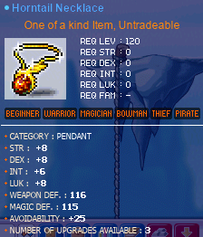

Ouf. They asked me, as we were leaving the run, for the stats on the HTP. One runner commented that “2 INT is nothing to sweat about”, and Verdict commented that “well, we know what your _real_ main stat is ;)”. All true, but I can’t help but feel a _little_ betrayed by [RNG](https://en.wikipedia.org/wiki/Pseudorandom_number_generator)sus here. I need that damage!! Aaaaa!!! Well, it certainly beats a [MoN](https://maplelegends.com/lib/equip?id=1122059), so I won’t cry about it.

In any case, time to [egg](https://maplelegends.com/lib/use?id=2041200) it!:


Still _very_ joocy. :)

</details>

## Victoria-Island-locked

It’s time for a little bit of [vicloc](https://codeberg.org/Victoria) adventures~ Nearing the end of the [X-mas](https://en.wikipedia.org/wiki/Christmas_and_holiday_season) event, I started actually doing some points-grinding on my vicloc [dagger spearwoman](https://oddjobs.codeberg.page/guides/introduction-to-odd-jobs/#dagger-warrior) **d34r**. After all, she is high enough level to raffle (level ≥70), and having special-sauce event raffle prizes as a viclocker is pretty exciting stuff. At the end of one such points-grinding sesh, I was so close to levelling that I decided to head back to the ol’ [TfoG](https://maplelegends.com/lib/map?id=105040306) to cap off the level:


Level 78~ Very kewl~

Speaking of X-mas event raffling, I did four such raffles on d34r. And this is what I got:

- [Rudolph’s Shiny Nose](https://maplelegends.com/lib/equip?id=1012161)
- 10 [Heartstopper](https://maplelegends.com/lib/use?id=2022245)s
- 10 Heartstoppers
- [Purple Christmas Sock](https://maplelegends.com/lib/equip?id=1072432) (2 DEX)

Honestly some really nice pulls! 20 Heartstoppers is _insane_ for vicloc — normally, the most powerful WATK buff is [Drake’s Blood](https://maplelegends.com/lib/use?id=2012000)\* (+8 WATK), not to even mention the AVOID that Heartstoppers give! And the Rudolph’s Shiny Nose, as usual, is completely broken for WACC-starved jobs, with +2 allstat and +50 WACC on average; and d34r is the epitome of WACC-starved… a vicloc dagger warrior!

And on my vicloc [clericlet](https://oddjobs.codeberg.page/guides/introduction-to-odd-jobs/#magelet) **d33r**, I decided to do some more [napkin murder dungeon](https://maplelegends.com/lib/map?id=103000905)eering? For some reason?? d33r already reached her goal level of 54, so you might think she’s retired now… but think again!


Look at that GM boofs EPH!! 603k!!!

And would you look at that: a level up for d33r :)

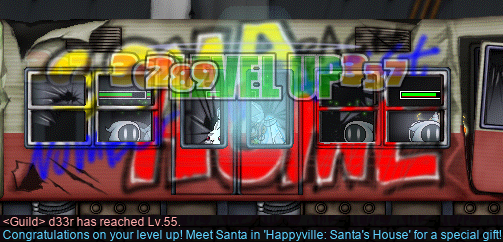

As you can see, [Santa](https://maplelegends.com/lib/npc?id=9209101) has some lovely gifts (read: **⚠️ FREE SHIT ⚠️**) for viclockers who aren’t on his naughty list (read: viclockers who actually log in!!).

I decided to try killing [Wraith](https://maplelegends.com/lib/monster?id=4230102)s (a\.k\.a. big napkins), to test out if I have what it takes to train in [big napkin murder dungeon](https://maplelegends.com/lib/map?id=103000909). And the results are pretty promising!:


Wait — what’s with [that black napkin with a lock on its head](https://maplelegends.com/lib/monster?id=5090000)? I tried [Heal](https://maplelegends.com/lib/skill?id=2301002)ing it to death (napkins have a well-known [weakness](https://en.wikipedia.org/wiki/Achilles'_heel) to healing), to find out:


Gee whizz. A card _and_ [a stylish cap with the **Victoria** emblem on it](https://maplelegends.com/lib/etc?id=4000413)? Pretty neato.

Oops! Accidentally levelled up again…

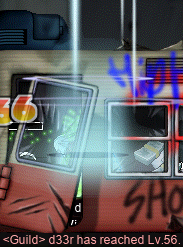

<details>
<summary>Footnotes for “Victoria-Island-locked”</summary>

\*Of course, [APQ](https://maplelegends.com/lib/map?id=670010100) is available in vicloc, which means [Onyx Apple](https://maplelegends.com/lib/use?id=2022179)s. But we’ve always had a [rule (rule 10)](https://codeberg.org/Victoria/resources/src/branch/master/rules.md#vicloc-rules) that prohibits the use of Onyx Apples (and [Victoria’s Amorian Basket](https://maplelegends.com/lib/use?id=2022181)s) that originate from APQs that aren’t all-vicloc. So… yeah, we might still have to “lovingly ignore” that rule if we ever hope to do a vicloc [SPQ](https://maplelegends.com/lib/map?id=990000000) \>.\<

</details>

## The marriage of tb303 &amp; Cassandro

I was honoured to attend the wedding of two odd priests: [gish](https://oddjobs.codeberg.page/guides/introduction-to-odd-jobs/#gish) priest **tb303** (**2sus4u**, **shadowban**) and [claw priestlet](https://oddjobs.codeberg.page/guides/introduction-to-odd-jobs/#magelet) **Cassandro** (**Copo**, **Bipp**, **Celim**, **Fino**, **Sommer**)!


During which, tb303 had to come to terms with the fact that she’d just married a snail:


Scandalous.

To help assuage tb303’s newfound gastropodophobia, we decorated the wedding cake real nice-like:


Admittedly, the snail thing made it a bit awkward. But, you know, snails gotta farm [them apples](https://maplelegends.com/lib/use?id=2022179) too, right…?

## Scarlion &amp; Targa, sittin’ in a tree, K-I-S-S-I-N-G

I did a whole bunch of [Scarlion](https://maplelegends.com/lib/monster?id=9420549) and [Targa](https://maplelegends.com/lib/monster?id=9420544) runs on my [darksterity knight](https://oddjobs.codeberg.page/guides/introduction-to-odd-jobs/#dex-warrior) **rusa**, alongside **xBowtjuhNL** and **Harlez**, amongst others. I may have had a rocky start when it comes to Scarga (I was super tired and died during my first two Scarlion run attempts…), but I had more luck avenging myself during later runs.

I did a Scarlion run with **Gruzz** (**Furca**) and **ToasTea**, during which we were visited by GA **Nightzy**:

<details>
<summary>Scarga</summary>


During which, I got my first Scarlion card :P


I had my first-ever encounter with Targa, alongside #mpqcrew. I was told that Targa is a lot more annoying and deadly than Scarlion, so I had to be sure to stay alive to keep everyone [HB](https://maplelegends.com/lib/skill?id=1301007)’d…

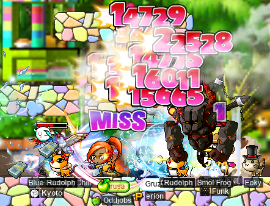

As it turns out, Targa _is_ indeed far more annoying than Scarlion. As with Scarlion, the [first](https://maplelegends.com/lib/monster?id=9420542) two [bodies](https://maplelegends.com/lib/monster?id=9420543) can barely do any damage. But the third body hits just about as hard as the third body of Scarlion, but hits more frequently. And it does these insane animations where its hitbox gets yeeted across the map:

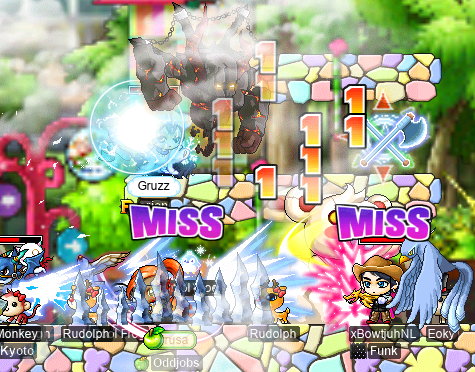

And it can cast control reversal (the debuff with the greenish chomping skull icon with the whirling eyeballs that makes your [arrow keys](https://en.wikipedia.org/wiki/Arrow_keys)’ effects reversed). And… it sux. Strictly speaking, I don’t think that Targa is actually capable of more per-hit damage than Scarlion is (if it is, the difference is minute), but its deadliness (and annoyingness) comes from its much more aggressive behaviour.


Worse yet, the items that Targa drops are generally a bit worse than those dropped by Scarlion. Except that Targa has something special: [Targa](https://maplelegends.com/lib/equip?id=1003023) [Hats](https://maplelegends.com/lib/equip?id=1003024)! [Targa Hats (INT)](https://maplelegends.com/lib/equip?id=1003023) are important for mages, because they have two more INT than [zhelm](https://maplelegends.com/lib/equip?id=1002357)s on average, but the same number of slots. And [Targa Hats (LUK)](https://maplelegends.com/lib/equip?id=1003024) can be useful too, although they are probably the most marginal out of the four types of Scarga hats (including [Scarlion Hats (STR)](https://maplelegends.com/lib/equip?id=01003026) and [Scarlion Hats (DEX)](https://maplelegends.com/lib/equip?id=01003025)). This is because non-odd mages are the only non-odd jobs that use LUK as a secondary stat, and yet, many such mages opt to eschew LUK entirely (“LUKless”). The emphasis on _secondary_ stats is important, because of the existence of [Maple Warrior (MW)](https://maplelegends.com/lib/skill?id=1121000), which grants additional STR/DEX/INT/LUK to the [PC](https://en.wikipedia.org/wiki/Player_character) based on their _base_ stats, thus encouraging the player to optimise for their secondary stats on their _equipment_, so that they can spend more AP on their primary stat(s). Nevertheless, Targa Hats (LUK) can still be optimal for:

- INT-based mages who wear equipment that requires some nontrivial amount of LUK,
- Thieves that are pure LUK or close to pure LUK (see especially: [permarogues](https://oddjobs.codeberg.page/guides/introduction-to-odd-jobs/#permarogue)),
- Claw-wielding non-thieves, e\.g. [besinners](https://oddjobs.codeberg.page/guides/introduction-to-odd-jobs/#permabeginner-outland),
- [Certain](https://oddjobs.codeberg.page/guides/introduction-to-odd-jobs/#lukless-assassin) varieties [of](https://oddjobs.codeberg.page/guides/introduction-to-odd-jobs/#lukless-bandit) LUKless [thieves](https://oddjobs.codeberg.page/guides/introduction-to-odd-jobs/#blood-bandit), when wielding a claw or a dagger.

And, they’re certainly not bad at all for ordinary thieves, either.


We did another Targa run. But this time, we were doing Targa for the only reason that really makes sense (other than to try it for the first time): selling the hats! Given that Targa gives the same amount of EXP as Scarlion, and that it has somewhat worse drops, and that it’s considerably more difficult/annoying to fight, and that it drains more of your potions and time, and that it drops Targa Hats (INT) — INT being the most valuable out of the four main stats — it’s no wonder that buying Targa Hat service on the market is significantly more expensive than buying Scarlion Hat service.

This time, we were joined by nightlord **BeMyRavebae**:


As I mentioned before, Targa isn’t really capable of higher per-hit damage than Scarlion, but it does behave much more aggressively. This makes it a lot harder for me to [zerk](https://maplelegends.com/lib/skill?id=1320006) against the third body of Targa (compared to the third body of Scarlion): whereas I can, at this point, zerk probably ≈90%–95% of the time against the third body of Scarlion, I probably can do like ≈30%–40% at absolute best against Targa. And even then, that’s pushing it (a\.k\.a. a deathwish).

Here, you can see our half-naked buyer looting some hats:


And I did some more fun Scar runs, with **Odyssea** and Gruzz:

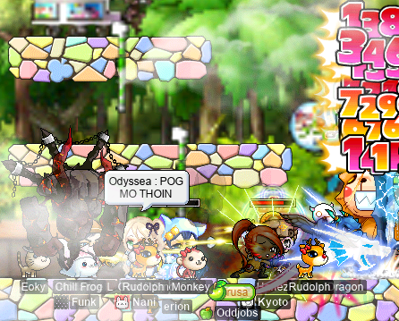

And with xBowtjuhNL’s guildies **Kiarath** and **doujiang**:

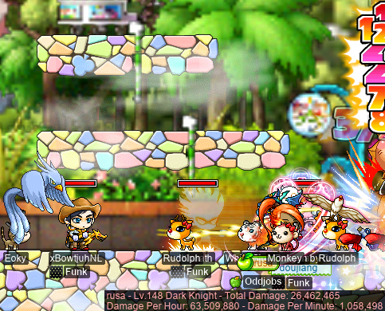

As you can see in the image above, I did a `@dpm 25` to capture exactly how much I was actually contributing, damage-wise, to the fight. Note that the “Total Damage” is what we’re looking at here — the “Damage Per Hour” and “Damage Per Minute” are spurious, as I wasn’t actually fighting for the entire duration of the capture. Looking at how much HP Scarlion has:

- 60M in [first body](https://maplelegends.com/lib/monster?id=9420547) +
- 90M in [second body](https://maplelegends.com/lib/monster?id=9420548) +
- 150M in [third body](https://maplelegends.com/lib/monster?id=9420549)

…is 300M HP total. That means that I did one damage out of roughly every ≈11\.3 damage dealt to the beast (ignoring healing, which is very slow for Scarlion anyways). That’s obviously less damage than you would expect if we were all contributing an equal amount of average DPM; in the ideal case, I would be dealing one damage out of every **5** damage dealt to the beastie, as we were a party of five. So, in the end, I dealt a factor of roughly ≈2\.267 less than the ideal case. That’s honestly not even bad!! Obviously, I don’t expect to be keeping up with my party members — who are not-so-odd-jobbed, and also higher level than me — in terms of sheer DPM. That being said, this _is_ somewhat optimistic, as I did have [SE](https://maplelegends.com/lib/skill?id=3221002) and [SI](https://maplelegends.com/lib/skill?id=5121009) the entire time…

And, finally, I had the interesting experience of participating in a Scarga (**Scar**lion + T**arga**) run with the same crew, during which we summoned _both_ of these terrifyingly adorable doll-bosses at about the same time:


During which, I died, because I’m bad:


Fortunately, someone had their bishop tagging along, so they were able to [Resurrect](https://maplelegends.com/lib/skill?id=2321006) me. And we got Targa Hat buyer **Mater** the hats that he was promised:


</details>

## Pqrti qvqsts

I did some [KPQ](https://maplelegends.com/lib/map?id=103000800)ing, on my [DEX page](https://oddjobs.codeberg.page/guides/introduction-to-odd-jobs/#dex-warrior) KPQ/[SPQ](https://maplelegends.com/lib/map?id=990000000) mule **kinds**, with some interesting characters. Below, you can see me battling [King Slime](https://maplelegends.com/lib/monster?id=9300003) alongside **LvXV** (**Copo**, **Bipp**, **Cassandro**, **Sommer**, **Fino**, **Celim**) — a “perma-level-15” archer who retains the same equipment &amp; skills of a level 15 archer, for life — and **Furca** (**Gruzz**), a claw pirate (and later, clawslinger)!:


And also with [HP page](https://oddjobs.codeberg.page/guides/introduction-to-odd-jobs/#hp-warrior) **AychPea**:


And later, I did some [LPQ](https://maplelegends.com/lib/map?id=221024500)s on my [DEX brawler](https://oddjobs.codeberg.page/guides/introduction-to-odd-jobs/#dex-brawler) LPQ mule **sorts** with Furca, [STR cleric](https://oddjobs.codeberg.page/guides/introduction-to-odd-jobs/#str-mage) **Godswood**, and fellow LPQ mule **Sangatsu** (**Lvl1Crook**, **Level1Crook**, **xXCrookXx**, **Ichigatsu**, **Macer**, **Lanius**). During which, clawslinger Furca attempted to recreate [“rangifer is ranged” \[YouTube\]](https://www.youtube.com/watch?v=6Aj18ZFaxOU) during [stage 7](https://maplelegends.com/lib/map?id=922010700)…

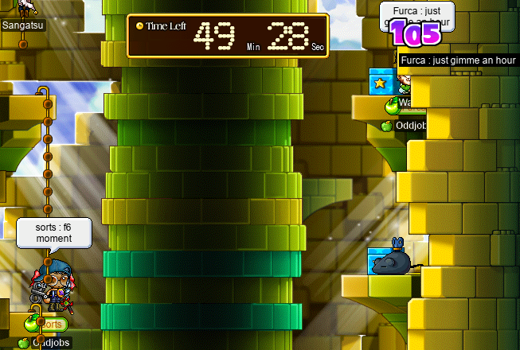

Here, you can see all of us, fighting [the nipple whale](https://maplelegends.com/lib/monster?id=9300012):


Later, we even did some [EPQ](https://maplelegends.com/lib/map?id=300030100)s, joined by [swashbuckler](https://oddjobs.codeberg.page/guides/introduction-to-odd-jobs/#swashbuckler) **Sommer** and again by Furca and AychPea:


Here, we can see a particularly chaotic snapshot of one fight that we had against [BBRG (Big Bad Rock Guy)](https://maplelegends.com/lib/monster?id=9300182):


Later, when AychPea left, it was down to just me (a DEX brawler), Sommer (a swashbuckler), and Furca (a clawslinger)…:


And later, we were instead joined again by STR cleric Godswood:


As you can see above, I’m either getting shot directly in the eye by BBRG, or I’m about to laser-eye the shit out of BBRG. I guess we’ll never know.

And, finally, I did some [PPQ](https://maplelegends.com/lib/map?id=251010404)s on my [permarogue](https://oddjobs.codeberg.page/guides/introduction-to-odd-jobs/#permarogue) **panolia**, with steelwoman [permawarrior](https://oddjobs.codeberg.page/guides/introduction-to-odd-jobs/#permawarrior) **Nyanners** (**Taima**, **Boymoder**, **Hanyou**, **deerhunter**, **Tacgnol**):


During which, I got a [Lord Pirate Chair](https://maplelegends.com/lib/setup?id=3010028)! For my [islander](https://oddjobs.codeberg.page/guides/introduction-to-odd-jobs/#islander), **ozotoceros**!! Hooray for chairs that are also Cash Shop items…!

## Helping Taima farm Leafre ETCs for the Silver Mane

As [STRginner](https://oddjobs.codeberg.page/guides/introduction-to-odd-jobs/#permabeginner-outland) **Taima** was nearing level 120(!), I asked her if she planned on doing the [Silver Mane](https://maplelegends.com/lib/equip?id=1902001) (level 120 mount) quest, or if she’d already done it. She hadn’t thought about it before, but naturally, it’s a worthwhile investment. It is _quite_ the investment:

- 400 [Wooden Shoulder Pad](https://maplelegends.com/lib/etc?id=4000266)s,
- 400 [Skull Shoulder Pad](https://maplelegends.com/lib/etc?id=4000267)s,
- 600 [Rexton Leather](https://maplelegends.com/lib/etc?id=4000264)s,
- and 50M mesos!

But, as a permabeginner, this is as close as it gets to 4th job advancement — plus, the Silver Mane is damn fast! So I set out to help Taima collect the necessary ETC items. First, on my [woodswoman](https://oddjobs.codeberg.page/guides/introduction-to-odd-jobs/#woodswoman) **capreolina**:

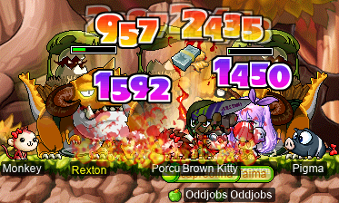

Then, remembering that I had to do the [Dragon Elixir](https://maplelegends.com/lib/use?id=2210003) quest anyways, on my I/L [archmagelet](https://oddjobs.codeberg.page/guides/introduction-to-odd-jobs/#magelet) **cervine**:


This didn’t last very long — as you can see in the image above, I wasn’t actually knocking out very much of the [Cornian](https://maplelegends.com/lib/monster?id=8150201)s’ HP pools per [Blizzard](https://maplelegends.com/lib/skill?id=2221007), and casting Blizzard is quite expensive when you have like 7\.3k MAXMP! Plus, I realised that, as mentioned previously, the Dragon Elixir quest doesn’t require [Cornian’s Marrow](https://maplelegends.com/lib/etc?id=4001075)/[Busted Dagger](https://maplelegends.com/lib/etc?id=4001079) anymore…

So I logged onto my [darksterity knight](https://oddjobs.codeberg.page/guides/introduction-to-odd-jobs/#dex-warrior) **rusa** to cheaply dispatch the Cornians:

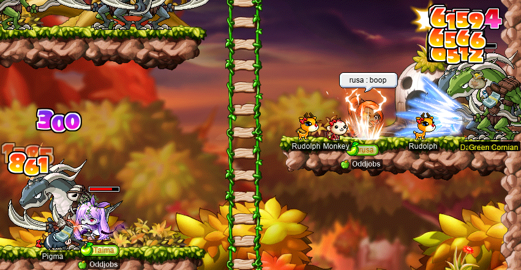

After we collected all 1\.4k(!) ETCs, and after Taima hit level 120 during her 120 party (see below), we found out that the Silver Mane quest is unavailable to beginners -\_\_\_\_- #silvermaneforginners

## woosa~

I decided to do a little card-hunting on my [darksterity knight](https://oddjobs.codeberg.page/guides/introduction-to-odd-jobs/#dex-warrior) **rusa**, finishing off the last easy Victoria Island set and moving on to the [Orbis Tower](https://maplelegends.com/lib/map?id=200080100). The last remaining Vic Island one was the humble [Dark Axe Stump](https://maplelegends.com/lib/monster?id=2130100):

<details>
<summary>woosers</summary>


And I had already done some Orbis Tower cards, so I finished off the [Ice Sentinel](https://maplelegends.com/lib/monster?id=5200001) set:


…And the [Fire Sentinel](https://maplelegends.com/lib/monster?id=5200002) set:


Did the [Leatty](https://maplelegends.com/lib/monster?id=5300000) set:


…And the [Dark Leatty](https://maplelegends.com/lib/monster?id=5300001) set!:


…And then stopped there. Because I realised that I still benefited more from grinding EXP (at bosses, or at ye olde [7F](https://maplelegends.com/lib/map?id=702070400)) than from getting Monster Book Ring tiers, which kinda killed my motivation. But I will have to grind out those tiers at some point! :P

In other news, I made a new [cape](https://maplelegends.com/lib/equip?id=1102205)!:


This cape is an improvement on my old Crimsonheart Cloak, which was essentially the same, but with 17 STR instead. This cape is not just for rusa, though; I also use it on my [daggermit](https://oddjobs.codeberg.page/odd-jobs.html#dagger-assassin) **alces**.

I still had like five [V-day basket](https://maplelegends.com/lib/use?id=2020024)s left sitting on various characters, including rusa, so I made a plan to use one with I/L archmage **Gruzz** (**Furca**). Unfortunately, my grinding spot of choice is 7F, whereas Gruzz’s would be more like [Petris](https://maplelegends.com/lib/map?id=541020500). But Gruzz decided that 7F was the more balanced choice, so away we went:


38\.6M EPH! 😬 S H E E S H . That one hour of basket was enough to get me just over ⅓ of a level!!

Later, I finished off that level by doing some 7F duoing with shadower **Harlez**, where I was able to put up some very impressive EPH numbers even without [HS](https://maplelegends.com/lib/skill?id=2311003)!:


And, I finished off the next level also at 7F, but this time just sadgrinding:


I promise rusa doesn’t just get all of her EXP from 7F, though. Here she is, testing her damage range with an [Unripe Apple](https://maplelegends.com/lib/use?id=2012008) during a [Zakum](https://maplelegends.com/lib/monster?id=8800002) run:

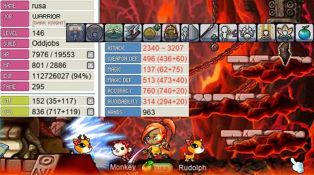

2340〜3207! Spicy!!

And… again… I finished off another level by sadgrinding at 7F:


But then, I had the distinct privilege of doing some 7F duo with a hero by the name of **Hidesake**, who brought an HS mule along:


Yeah… 44\.2M EPH… who knows if I’ll ever see an EPH number larger than that LOL

To finish off this level, I painstakingly tried to whack [7F mobs](https://maplelegends.com/lib/monster?id=9600022) with a [Red Umbrella](https://maplelegends.com/lib/equip?id=1302025) while wearing my INT pyjamas:


**Harlez** and **xBowtjuhNL** were already trying to recruit me for [Jiaoceng](https://maplelegends.com/lib/monster?id=9600025), so I was getting a little impatient — thankfully, Gruzz came along and helped me get that last 0\.005%:


And, finally, I levelled up again — but this time, while sadsadgrinding [at CDs](https://maplelegends.com/lib/map?id=742010203)…:


Levelling up with INT pyjamas equipped is a lil easier at CDs. Speaking of CDs…

</details>

## Back on the TP101 grind

I did a lil bit of CD grinding on my I/L [archmagelet](https://oddjobs.codeberg.page/guides/introduction-to-odd-jobs/#magelet) **cervine**, alongside **Lvl1Crook** (**Level1Crook**, **xXCrookXx**, **Sangatsu**, **Ichigatsu**, **Macer**, **Lanius**) and **Taima** (**Nyanners**, **Boymoder**, **Hanyou**)…:

<details>
<summary>Taiwanese shopping mall hell</summary>


So yeah, [Blizzard](https://maplelegends.com/lib/skill?id=2221007) is pretty broken [at CDs](https://maplelegends.com/lib/map?id=742010203)! Mine not so much, since I can’t even consistently 1-shot the damn things, but still!!

In other news, my [daggermit](https://oddjobs.codeberg.page/odd-jobs.html#dagger-assassin) **alces** is still at it with the [bunny child](https://maplelegends.com/lib/monster?id=9410032) murder!!:


I started doing some KM grinding with [DEX WK](https://oddjobs.codeberg.page/guides/introduction-to-odd-jobs/#dex-warrior) (a\.k\.a. “sex WK”) **Hanyou**, and we were briefly joined by INTlaw Lvl1Crook:


And after a lot of bunny-child slaying with my new DEX warrior friend, I hit level 106~!:


I did some CD grinding on my [swashbuckler](https://oddjobs.codeberg.page/guides/introduction-to-odd-jobs/#swashbuckler) **hydropotina**, as well. Here I am at CDs, with Taima and **LoneWolf1600**:


And there’s level 93!!:


I even did CD grinding on my pure [STR bishop](https://oddjobs.codeberg.page/guides/introduction-to-odd-jobs/#str-mage) **cervid**, and not even the sadsadgrind kind!:


While we were there, Taima switched over to her [STRmit](https://oddjobs.codeberg.page/guides/introduction-to-odd-jobs/#lukless-assassin) **Boymoder** to grind some more CDs, and also to show off some fancy level 1 [SM](https://maplelegends.com/lib/skill?id=4111004)~!:


These shadowy mesos lie in wait, to be used for boss-shredding one day…

And, once everyone fled the scene, I was left to do some sadsadgrinding with these same CDs… and level up cervid to 129~!!:


Again with the hoarded [V-day basket](https://maplelegends.com/lib/use?id=2020024)s: I decided to finally use hydropotina’s, alongside Lvl1Crook, who was nice enough to grind out my basket without the benefit of [HS](https://maplelegends.com/lib/skill?id=2311003):


After some ¾ or so of my basket was elapsed, Boymoder also came to CDs with us, and used her own basket. So I kept grinding with her to finish off her basket as well, and ended up getting very close to levelling. Boymoder was hiding in the Cash Shop to save the rest of her basket while she was AFK for a bit, so I decided to finish off my level before she came back. That way, I didn’t have to fiddle around with INT pyjamas and all that while Boymoder was trying to use a basket. I got all of my PJs all nice and ready, and went [to KMs](https://maplelegends.com/lib/map?id=742010100) to finish the level off solo. As I was close to levelling, I decided to kill just _one_ more KM before switching to my PJs, so I did a basic-attack with my [spear](https://maplelegends.com/lib/equip?id=1432018)… and it levelled me \>w\<


</details>

## 武林妖僧

<details>
<summary>武林妖僧</summary>

I had the distinct privilege of doing my first-ever [Jiaoceng (武林妖僧)](https://maplelegends.com/lib/monster?id=9600025) runs — on my [darksterity knight](https://oddjobs.codeberg.page/guides/introduction-to-odd-jobs/#dex-warrior), **rusa**! Back in pt. lxviii of this diary, I did what was _technically_ my actual first-ever Jiaoceng run. But it wasn’t a real run; we were just goofing around and wanted to see what JC’s lair was like. This time, I was joined (many levels later) by shadower **Harlez**, marksman **xBowtjuhNL**, I/L archmage **Gruzz** (**Furca**), and shadower **Bipp** (**Copo**, **Cassandro**, **Sommer**, **Celim**, **Fino**):


And, between the five of us, we killed JC in less than 6\.5 minutes!!:


Huzzah!

As it turns out, Jiaoceng isn’t actually so bad for me, from a… [zerk](https://maplelegends.com/lib/skill?id=1320006)ing-and-also-not-dying-and-also-not-passing-out-from-exhaustion standpoint. Passing out from exhaustion is somewhat less likely, given that Jiaoceng is defined by the very tight 10-minute timer. Actually having to kill the guy in less than 10 minutes is what makes Jiaoceng so challenging. And although JC is capable of something around the ≈8k damage range per attack, he doesn’t actually manage to hit me with such attacks all that often; some of the attacks do considerably less damage, and my avoidability is enough to dodge a decent number of the attacks entirely, as well. So I can actually maintain a zerk for about ≈98% or so of the time that I’m fighting, which I’m quite satisfied with.

Later, we tried the same thing, but with a reduced party: just me, Harlez, and xBowtjuhNL. I snuck probably half a dozen [Heartstopper](https://maplelegends.com/lib/use?id=2022245)s in my mouth during the first run, and nearly as many the second run, and we were just **_so_** close:

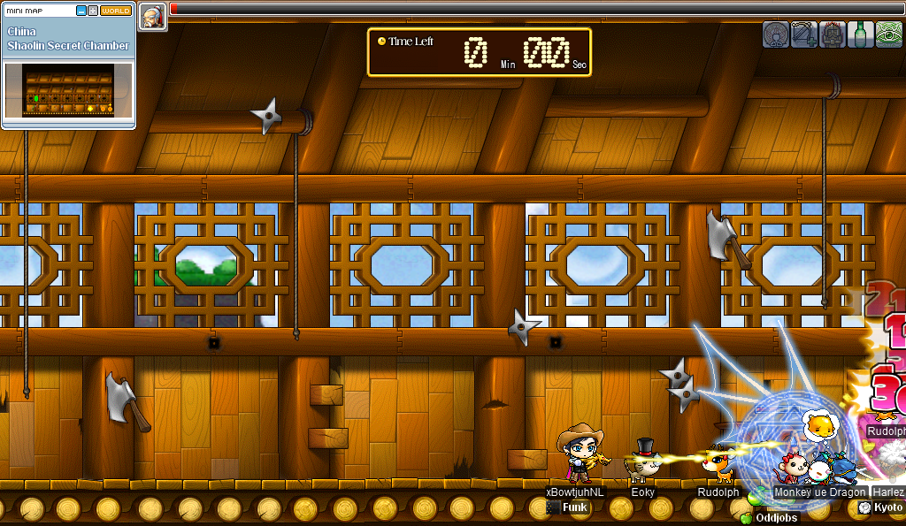

(The above screenshot is courtesy of xBowtjuhNL; I couldn’t capture one in time.)

_SO_ close. v\_v

I did another trio with Harlez and axe hero **5nortin5peed**, in which we barely squeezed through one run! The image that you see below has been edited to crank up the [brightness](https://en.wikipedia.org/wiki/Brightness) and [contrast][contrast] to ridiculously high levels in comparison to the original image, which was taken as the screen was fading to black as we got kicked out of JC’s lair.

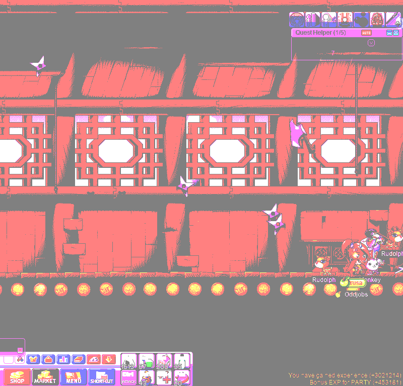

If you look closely, you can see that the only thing that JC dropped was a single [Elixir](https://maplelegends.com/lib/use?id=2000004)… so I guess we weren’t missing out on anything by finishing so late. In our other run, we unfortunately had no chance of making it, due to the untimely death of 5nortin5peed…:


R\.I\.P.

In more optimistic news, I did some quartet runs with Gruzz, Harlez, and xBowtjuhNL, which allowed us to finish with plenty of time to spare, thanks to Gruzz’s [extra DPM](https://maplelegends.com/lib/skill?id=2221006)!:


</details>

[contrast]: https://en.wikipedia.org/wiki/Contrast_(vision)

## Getting some EXP w/ capre~

I haven’t been doing much, if any, [CDs](https://maplelegends.com/lib/map?id=742010203) grinding on my [woodsmaster](https://oddjobs.codeberg.page/guides/introduction-to-odd-jobs/#woodswoman) **capreolina**. Once I grinded my last CD and hit the big 120, I kinda said “peace out cya laters” to compact discs. But as capre inches closer to the big 135, it’s time to get back on that grind again. As many readers will know, the big 135 is “big” because it’s the lowest level at which a fledgling archer may competently [SE](https://maplelegends.com/lib/skill?id=3121002) in the general direction of [everyone’s favourite crumbly rock villain](https://maplelegends.com/lib/monster?id=8800000). At level 135, capre will acquire the power to make people regret [smega](https://maplelegends.com/lib/cash?id=5072000)’ing “R\>SE” by showing up to Zak with max SE and [a whole lot of STR](https://oddjobs.codeberg.page/guides/introduction-to-odd-jobs/#woodswoman). Is this a noble goal to aspire to? Maybe. Do I at least _like_ crumbly rock villain guy? Yes, it’s my favourite boss. Will people stop asking me “135 when?” if I get to level 135? Yes. Do I really just want to level up so that I can put more SP into [Hurricane](https://maplelegends.com/lib/skill?id=3121004) because it’s a funny skill and literally goes “brrrrr”? _Also_ yes.

In any case, I’m still leaving CDs behind. Now that I have Big Crits™ (read: SE), I think I’m ready to repeatedly &amp; tirelessly whack a different, more powerful breed of monster: [Gallopera](https://maplelegends.com/lib/monster?id=9420540)s (Gallos)! Sniper **Level1Crook** (**Lvl1Crook**, **xXCrookXx**) had already planned to grind alongside capreolina once my I/L [magelet](https://oddjobs.codeberg.page/guides/introduction-to-odd-jobs/#magelet) **cervine** made it to the honourable ranking of archmagelet. So the time is now, and the SE is making Level1Crook’s damage even more impossibly high:


Unfortunately I didn’t get any screenshots of Level1Crook goofing off with an [Onyx Apple](https://maplelegends.com/lib/use?id=2022179) while enjoying capre’s SE. It was galling to see someone 20 levels below me do 60k damage with a single [Strafe](https://maplelegends.com/lib/skill?id=3211006)…

After some Gallopera-slaying, capreolina has broken into the 13X levels!!:


Now that capre is level ≥130, she has finally maxed SE. By coincidence — well, only partially coincidence, as channel 6 [FM 9](https://maplelegends.com/lib/map?id=910000009) (6-9) is the HQ for the entire **Suboptimal**/**Dream** meta-alliance, so we tend to be in channel 6 most of the time — some of the folks from the Dream alliance headed to our Gallos map for a different reason: to fight [Scarlion](https://maplelegends.com/lib/monster?id=9420549)! As it just so happened, they were looking for an archer to SE them… and I had just maxed SE! Of course, capre is still not technically high enough level to to Scarlion/[Targa](https://maplelegends.com/lib/monster?id=9420544) yet: the third and final body of these bosses is level 140 (similar to [Zakum](https://maplelegends.com/lib/monster?id=8800002) or [Krexel](https://maplelegends.com/lib/monster?id=9420521)), so you have to be level ≥135 to get EXP normally. That being said, the first two bodies are lower in level, and in any case, I was excited to try out a Scarlion run for the first time on capre! So I obliged:


It was pretty cool! And I actually got decent EXP — somewhere around ≈4%, I think? I’d definitely do it again, and the Dream folks were grateful for my SE :P

## Taima’s level 120 party!!!

I was honoured to attend the epic level 120 party of my good friend and Maple wife **Taima** (**Nyanners**, **Hanyou**, **Boymoder**, **Tacgnol**, **deerhunter**, **Numidium**, **Gambolpuddy**, **Naganohara**, **Spagonia**, **Inugami**), the [STRginner](https://oddjobs.codeberg.page/guides/introduction-to-odd-jobs/#permabeginner-outland)!!! Taima has been an extremely important person and good friend of mine since almost as long as **Oddjobs** has been a public guild (see: [“cervid × Taima” \[YouTube\]](https://www.youtube.com/watch?v=HXGz3t8u9U4)), and she is as “legitginner” as it gets!! For her big level 120 party, we headed to the [Whirlpool of Time](https://maplelegends.com/lib/map?id=220050100) to watch Taima level up to a [Timer](https://maplelegends.com/lib/monster?id=5220003) kill. The use of _time_, _timer_, etc. here is a pun on [the pronunciation of _Taima_ (/ˈtaɪmə/) vs. _Timer_ (virtually /ˈtaɪməɹ/, but non-rhotically /ˈtaɪmə/ in the absence of a linking R) in English](https://en.wikipedia.org/wiki/Rhoticity_in_English). For the occasion of the party, Taima put together a collection of screenshots of herself throughout the ages, from level 0 (literally character creation) onwards! At the end, there are some photos of her freshly-opened Global MapleStory iTCG cards! Fancy!! You can find the images at [TaimaStory](https://taimastory.neocities.org/) ([archived](https://web.archive.org/web/20220206044621/https://taimastory.neocities.org/)).

Here’s Taima, at the Whirlpool of Taima, killing Taima and levelling up to level 120~!!!!:


Once she hit level 120, it was time to fulfil her destiny as a true pigginner~:


For the occasion (as level 120 is the minimum level to get EXP normally from [Papulatus](https://maplelegends.com/lib/monster?id=8500001)), and because we were nearby anyways, we did two Papu runs to celebrate!:


While we were waiting to do a second run, we made an inexplicable bench stack and started [uncontrollably vomiting](https://maplelegends.com/lib/cash?id=5160000):


And although it was quite early in the morning, **OmokTeacher** (**Slime**, **Thinks**) was able to make it in time for the second run~:


As a corollary, I was able to get my [Papu cert](https://maplelegends.com/lib/etc?id=4001084) for my I/L [archmagelet](https://oddjobs.codeberg.page/guides/introduction-to-odd-jobs/#magelet) **cervine** :3

Congratulations again to Taima on the big 120~ Your legendary journey &amp; determination is an inspiration!! 🤩

## Bosslike

Speaking of Taima, I’ve started doing somewhat regular bossing with Taima and **Level1Crook** (**Lvl1Crook**, **xXCrookXx**), each weekend around [the scheduled time(s)](https://codeberg.org/deer/gists/src/branch/master/what-s-next-for-oddjobs/odd-job-initiative/runs.md). Here we are, fighting [Rāvaṇa](https://maplelegends.com/lib/monster?id=9420014) (with me on my [darksterity knight](https://oddjobs.codeberg.page/guides/introduction-to-odd-jobs/#dex-warrior) **rusa**)!:

<details>
<summary>Matando jefes</summary>


A single Rav run tends to run for roughly ≈25 minutes, so when we get some nifty loot, we really earned it :P


Unfortunately, although I have opened quite a few MP1s (Mysterious Pouches 1), I have yet to receive more than one Prestigious Coin from the same pouch… -\_-

We were joined by [STRginner](https://oddjobs.codeberg.page/guides/introduction-to-odd-jobs/#permabeginner-outland) **Cortical** for one run:


(It’s hard to really see Cortical in the above image, but at least you can see the cape balloon with sharp teeth.)

Here’s a screenshot of Ravana dying during another run that I did as a trio (if you look closely, you can spot a [Vifennis](https://maplelegends.com/lib/equip?id=1312015) and a [Devil’s Sunrise](https://maplelegends.com/lib/equip?id=1402016) in flight):


After this run, we did another — and we were still thirsty for more, so we went and did [Papu](https://maplelegends.com/lib/monster?id=8500001) as well!:


During another regularly-scheduled event (the low-level/area bosses event), I joined forces with [permapirate](https://oddjobs.codeberg.page/guides/introduction-to-odd-jobs/#permapirate) **Copo** (**Cassandro**, **Bipp**, **Sommer**, **Celim**, **Fino**) and Cortical to fight some [Headless Horsemen](https://maplelegends.com/lib/monster?id=9400549), as my fresh new I/L [archmagelet](https://oddjobs.codeberg.page/guides/introduction-to-odd-jobs/#magelet) **cervine**~:


Look at that [CL](https://maplelegends.com/lib/skill?id=2221006) go!!


Ahhh… Another headless caballero and his fuchsia mare, vanquished!

I’ve also been doing [Capt. Lat](https://maplelegends.com/lib/monster?id=9420513)s with Taima, on my pure [STR bishop](https://oddjobs.codeberg.page/guides/introduction-to-odd-jobs/#str-mage) **cervid** — below, you can see a screenshot from one such run, for which we were joined by Cortical:


I noticed that every time that I go to [Resurrect](https://maplelegends.com/lib/skill?id=2321006) someone, it’s usually too nervewracking for me to remember (or consider) to take a screenshot. It’s very easy to screw up Resurrections, as the resurrected(s) are often in a position to die immediately after being brought back to the realm of the living. But I remembered this time, during a Capt. Lat duo with Taima:


During the same session, we went to do the repeatables for Capt. Latanica (i\.e. the [White Essence](https://maplelegends.com/lib/etc?id=4000381) quest), and I happened to have my INT gear on hand. So partway through the quest, I decided to try using my INT gear for shits &amp; giggles. Behold, the fabled deer[genesis](https://maplelegends.com/lib/skill?id=2321008):


Not bad at all!! The damage looks impressive thanks to [Slimy](https://maplelegends.com/lib/monster?id=9420510)s being weak to holy, and I actually was getting a roughly ≈80% hit rate against them! We went to [GS6](https://maplelegends.com/lib/map?id=541010050) to kill [Mr. Anchor](https://maplelegends.com/lib/monster?id=9420512)s, and I tried my Genesis there. Not so impressive; probably more like ≈40% hit rate…

Although my [woodsmaster](https://oddjobs.codeberg.page/guides/introduction-to-odd-jobs/#woodswoman) **capreolina** has had her [T10 ring](https://maplelegends.com/lib/equip?id=1119012) for a while now, I was still pleased to finish her Papu set…


…And even more pleased to get a [Papulatus chair](https://maplelegends.com/lib/setup?id=3010026) for cervid!:


I kind of refuse to fight Papu on cervid, after a traumatising experience of getting instakilled by a dispel (DP) at the same time as a touch attack… Papulatus just wasn’t made for melee mages, who rely on [Magic Guard](https://maplelegends.com/lib/skill?id=2001002) and/or [Invincible](https://maplelegends.com/lib/skill?id=2301003) to survive touch attacks, and yet must straddle the Papulatus Clock just to hit it! But I had cervid tag along for [HS](https://maplelegends.com/lib/skill?id=2311003) purposes (leaving and rejoining the party as necessary to avoid leeching EXP), so she managed to get a Papu chair anyways :P

During a low-level/area boss event, I stumbled across a [BF](https://maplelegends.com/lib/monster?id=9400575) at [FP](https://maplelegends.com/lib/map?id=610010005), and Copo decided to hop onto their non-odd shadower **Bipp** to come kill it! I took capreolina, so that I could stand back with my bow like a coward and never actually touch the beast:


In between BFs, I fought an HH alongside Bipp as cervid. You can see my [MR](https://maplelegends.com/lib/skill?id=2321002) going off:


And I got to fight Rav on cervid, as well!:


I like using [Doom](https://maplelegends.com/lib/skill?id=2311005) when Rav starts summoning so that I can turn [those scary goblins](https://maplelegends.com/lib/monster?id=9420013) into [less scary snails](https://maplelegends.com/lib/monster?id=0100101)! Does it actually help? Yes. I just lied… maybe. It’s debatable.

Also with Bipp (but this time as rusa), I got to do some [Krexel](https://maplelegends.com/lib/monster?id=9420521)ling with the crew (this time, as rusa):


It’s always nice to do a big boss just with people whom I know :P While I was there, I did a little `@dpm 1` on [stopper](https://maplelegends.com/lib/use?id=2022245)s:


114[M](https://en.wikipedia.org/wiki/Mega-) DPH ain’t half bad~ Also on rusa, I did a pair of Papu runs with Harlez, xBowtjuhNL, and **Bulgoki**, a shadower whom I met back in [OPQ](https://maplelegends.com/lib/map?id=200080101), and who I haven’t had the chance to play alongside in quite a while!:


Bulgoki is actually invisible in this screenshot, thanks to [Boomerang Step](https://maplelegends.com/lib/skill?id=4221007)… But you can see that he’s now a member of **Chroma**, and thus of **Dream** (and thus of the **Suboptimal**–Dream meta-alliance). :)

</details>

## Contagion’s level 50 party!!

I was fortunate enough to attend the level 50 party of [islander](https://oddjobs.codeberg.page/guides/introduction-to-odd-jobs/#islander) **Contagion** (**Without**):


Hitting level 50 is a pretty huge achievement for any islander, and for Contagion, there was something a little extra special. Although it was very unclear if it was even possible to redeem the level-based (level ≤70) rewards from [Santa](https://maplelegends.com/lib/npc?id=9209101) even after the [X-mas](https://en.wikipedia.org/wiki/Christmas_and_holiday_season) event officially ended (but [Happyville](https://maplelegends.com/lib/map?id=209000000) was still temporarily open), Contagion gave it a shot, and was pleasantly surprised! They were able to get another upgrade to their [Rudolph’s Toy Hat](https://maplelegends.com/lib/equip?id=1002850), which means another +2 to all stats!! While we were there in [Santa’s House](https://maplelegends.com/lib/map?id=209080100) celebrating, we were paid a visit by GA **Nightzy**, who came to congratulate Contagion on their achievement:


## Cortical’s T10 ring party~!

I was also fortunate enough to attend the [T10 ring](https://maplelegends.com/lib/equip?id=1119012) party of [STRginner](https://oddjobs.codeberg.page/guides/introduction-to-odd-jobs/#permabeginner-outland) **Cortical**, who has — as you’d expect for a permabeginner who farmed their own T10 ring — been impressively dedicated to farming cards for quite a while now! Cort decided on their last (300th) set being the [crog](https://maplelegends.com/lib/monster?id=8150000) set. So, with 299 completed sets, and 4⧸5 crog cards, we flew back &amp; forth between [Ellinia](https://maplelegends.com/lib/map?id=101000300) and [Orbis](https://maplelegends.com/lib/map?id=200000100) in search of crogs &amp; their cards:


It took just a few tries before the moment of truth…


Congratulations again to Cortical, the first-ever T10 ring permabeginner who’s never been banned!\*

<details>
<summary>Footnotes for “Cortical’s T10 ring party~!”</summary>

\***Permanovice** (**Battlesage**, **Dreamscapes**, **Paean**, **Hanger**) was the actual first permabeginner to T10, but was briefly banned due to a false autoban…

</details>

## (…cnvpstdf…)

<details>
<summary>cnvpstdf</summary>


</details>

## cervine’s theme

This entry has covered my I/L [magelet](https://oddjobs.codeberg.page/guides/introduction-to-odd-jobs/#magelet) **cervine**’s level 120 party. In the past, I’ve done a video (see [the **Oddjobs** YouTube channel](https://www.youtube.com/channel/UC-K6sM-AXGVQjVCEKgU1tGA/)) for each 120 party that I’ve had, musically accompanied by a piece written specifically for that character:

| character      | job                                                                                              | video                                                                          | soundtrack                                                                       | score                                                                                             |
| -------------- | ------------------------------------------------------------------------------------------------ | ------------------------------------------------------------------------------ | -------------------------------------------------------------------------------- | ------------------------------------------------------------------------------------------------- |
| **cervid**     | [STR bishop](https://oddjobs.codeberg.page/guides/introduction-to-odd-jobs/#str-mage)            | “[cervid’s level 120 party](https://www.youtube.com/watch?v=Pcfzg6Yd2Ag)”      | [_cervid’s Theme_](https://capreolina.bandcamp.com/album/cervid-s-theme)         | [_cervid’s Theme_](https://codeberg.org/deer/gists/src/branch/master/cervid-s_Theme.mscz)         |
| **rusa**       | [darksterity knight](https://oddjobs.codeberg.page/guides/introduction-to-odd-jobs/#dex-warrior) | “[rusa is a darksterity knight.](https://www.youtube.com/watch?v=mcilYstZgYU)” | [_rusa’s Theme_](https://capreolina.bandcamp.com/album/rusa-s-theme)             | [_rusa’s Theme_](https://codeberg.org/deer/gists/src/branch/master/rusa-s_Theme.mscz)             |
| **capreolina** | [woodsmaster](https://oddjobs.codeberg.page/guides/introduction-to-odd-jobs/#woodswoman)         | “[capreolina’s level 120 party](https://www.youtube.com/watch?v=yhiDKaDJNJI)”  | [_capreolina’s Theme_](https://capreolina.bandcamp.com/album/capreolina-s-theme) | [_capreolina’s Theme_](https://codeberg.org/deer/gists/src/branch/master/capreolina-s_Theme.mscz) |

…So the time has come to do the same for cervine! While I did of course have each character in mind when I wrote their respective themes, the influence is only on general “feel” of the music. With cervine’s theme, I’m taking the connection a little bit more seriously.

On the one hand, cervine is an I/L mage — as a result, she uses a lot of ice attacks (and lightning attacks). Frigidity and ice are often [portrayed musically](https://en.wikipedia.org/wiki/Symphonic_poem) with the use of high-pitched and crisp sounds, presumably because of the brittle nature of ice, and the association of low and low-mid [frequencies](https://en.wikipedia.org/wiki/Frequency) (e\.g. 50–500 [Hz](https://en.wikipedia.org/wiki/Hertz)) with “warmth”. For this reason, I’ve chosen a [glockenspiel](https://en.wikipedia.org/wiki/Glockenspiel) — known for having a clear and high-pitched timbre — as the primary voice of the piece. Furthermore, lightning has an even more obvious acoustic association: [thunder](https://en.wikipedia.org/wiki/Thunder). At a moderate distance, thunder tends to sound like low-pitched, violent rumbling; as a result, thunder has occasionally been portrayed in [Western classical music](https://en.wikipedia.org/wiki/Classical_music) with the use of [timpani](https://en.wikipedia.org/wiki/Timpani), particularly [rolls](https://en.wikipedia.org/wiki/Drum_roll) on said timpani.

On the other hand, cervine is also pure LUK (and thus a magelet). The notion of [**lu**c**k**](https://en.wikipedia.org/wiki/Luck) is intimately tied up with the notion of [randomness](https://en.wikipedia.org/wiki/Randomness); if the [outcome][outcome] of some situation/[experiment][experiment]/etc. is known in advance, we can’t reasonably say that the outcome is “lucky” or “unlucky”. Therefore, for a situation to have some element of “luck”, it has to have some element of randomness, even if we nevertheless have some information about the likelihood of some (or all) of the outcomes. For example, if a person who passes a 30% scroll is “lucky”, then the person who passes a 10% scroll is “even luckier”; both outcomes are good, and we happen to know that the latter person had only ⅓ of the chance to get their good outcome.

### Lucky music

Music that makes use of [indeterminacy][indeterminacy] is called [aleatoric (or, aleatory) music](https://en.wikipedia.org/wiki/Aleatoric_music). Aleatoric music can be categorised into three kinds:

1. Music composed of determinate elements, wherein the elements are to be performed in a way (e\.g. their order; this is called a “mobile” form) that substantially depends on the choices made by the performer(s). A well-known example is [Terry Riley](https://en.wikipedia.org/wiki/Terry_Riley)’s [_In C_](https://en.wikipedia.org/wiki/In_C) (1964).
2. Music composed using indeterminate notation (and/or other communication methods that are indeterminate). [Freely improvised music](https://en.wikipedia.org/wiki/Free_improvisation) is one example of this kind. In the context of classical musics, this usually implies the use of abstract [graphic notation][graphic-notation], and/or the prominent use of [text](https://en.wikipedia.org/wiki/Writing). An example of abstract graphic notation is [John Cage](https://en.wikipedia.org/wiki/John_Cage)’s _Water Walk_ (1959); you can see an excerpt of the score here: ")
3. Music that is _written_ in a determinate form, but _composed_ with the aid of indeterminate processes (i\.e. processes that are not fully within the composer’s control). Usually, this is _stochastic music_, which makes use of [stochastic processes](https://en.wikipedia.org/wiki/Stochastic_process) to compose music — although, do note that some stochastic music uses stochasticity _at performance time_, which puts such music somewhat closer to (1.). Stochastic music was essentially pioneered by John Cage, who used the [_I Ching_ \[易經\]](https://en.wikipedia.org/wiki/I_Ching) as a kind of source of [pseudorandomness](https://en.wikipedia.org/wiki/Pseudorandom_number_generator). Although he was originally critical of it, stochastic music is also often associated with [Iannis Xenakis](https://en.wikipedia.org/wiki/Iannis_Xenakis), who used [mathematical](https://en.wikipedia.org/wiki/Mathematics) and [physical](https://en.wikipedia.org/wiki/Physics) principles like [Brownian motion](https://en.wikipedia.org/wiki/Brownian_motion), [game theory](https://en.wikipedia.org/wiki/Game_theory), [statistical mechanics](https://en.wikipedia.org/wiki/Statistical_mechanics), [set theory](https://en.wikipedia.org/wiki/Set_theory), etc. at the core of his compositions.

There’s room for overlap here (some music might satisfy more than one of these definitions), but the cores of these three approaches, respectively, are:

1. Letting go of the details. Works in this style retain ordinary determinate composition, but _don’t_ attempt to determine every detail of the entire piece. The “missing bits” of the composition can be filled in _ad hoc_. This is “letting the music be itself”.
2. Shift entirely (or almost entirely) away from the composer writing the music, and focus on the performers and their creativity, mood, personal interpretations, etc. Pre-composed pieces in this style are hard to think of as truly being “pre-composed” in any sense, because the composition as written has no clear musical content. And freely improvised music is not pre-composed at all, of course. In some sense, (2.) is perhaps a more extreme version of (1.).
3. Indeterminacy can be used to _generate_ music. In some ways, this pushes the job of the composer “up a level”: instead of always writing the music note-for-note, the composer dictates the structure of the music (typically in a well-defined way), and then lets the indeterminate process do the actual note-for-note composing. Once the music is “generated” in this way, it can then be crystallised into a totally determinate form, e\.g. ordinary [musical notation](https://en.wikipedia.org/wiki/Musical_notation), [magnetic tape](https://en.wikipedia.org/wiki/Magnetic_tape), etc.

The approach that I want to take is, unsurprisingly, (3.). Both (1.) and (2.) rely on performers with some level of agency (e\.g. human performers), but I ultimately want to produce a single [digital audio](https://en.wikipedia.org/wiki/Digital_audio) recording. This doesn’t actually preclude the use of (1.) or (2.) — it suffices to take a recording of a single performance, and even though _playback_ of such a recording may be totally deterministic, the _performance_ that was recorded was still indeterminate. But the other themes that I recorded for my other level ≥120 characters were written in [MuseScore](https://musescore.org/), and then recorded simply using MuseScore’s built-in [MIDI](https://en.wikipedia.org/wiki/MIDI)-based playback. This is, I think, a pretty appropriate “recording technique” (if you can call it that…) for MapleStory music, and in this case it implies writing music in a way that a [computer](https://en.wikipedia.org/wiki/Computer) can read… and computers have no agency!\* Plus, I think that (3.) captures the notion of “luck” most appropriately — the indeterminate elements (viz. [random number generation](https://en.wikipedia.org/wiki/Random_number_generation), for our purposes) are so far removed from purposeful choice, that we can really call them “pure **lu**c**k**”.

Originally, I considered composing cervine’s theme almost entirely with stochastic elements, taking heavy influence from [serialist](https://en.wikipedia.org/wiki/Serialism) techniques. This would likely have resulted in something pretty abstruse and alien-sounding, and probably something [not quite tonal](https://en.wikipedia.org/wiki/Post-tonal_music_theory). Instead, I want cervine’s theme to not be so far removed from the other themes, which have all been [tonal](https://en.wikipedia.org/wiki/Tonality), and written using no particularly “advanced” musical techniques other than an understanding of [jazz harmony](https://en.wikipedia.org/wiki/Jazz_harmony), some unusually intricate [rhythms](https://en.wikipedia.org/wiki/Rhythm), and some unusual [orchestration](https://en.wikipedia.org/wiki/Orchestration) choices. At the same time, I want to retain a strong sense of stochasticity. With these things in mind — and keeping in mind the writing about “ice/lightning”-themed orchestration above — we can talk about composing _cervine’s Theme_.

<details>
<summary>Footnotes for “Lucky music”</summary>

\*Okay, so, technically we can circumvent this limitation with the use of [MIDI controllers](https://en.wikipedia.org/wiki/MIDI_controller) to capture live performances. But whatever; I’m not going to do that anyways…

</details>

### A note (pun intended) on music theory

[Music theory](https://en.wikipedia.org/wiki/Music_theory) is a pretty broad subject, and even casual music listeners will know (or at the very least, intuitively understand) a large number of music-theoretical concepts and principles. However, because we are approaching the subject of composing _cervine’s Theme_ from a Western classical music angle — the perspective of the archetypal “[composer](https://en.wikipedia.org/wiki/Composer)” — we’re going to get a little into the weeds with some slightly more esoteric notions originating from Western music theory.

Lamentably, music theory is not taken as seriously as some other subjects; in particular, subjects that are commonly studied in [academia](https://en.wikipedia.org/wiki/Academy) with the hope (or promise) of practical application, e\.g. mathematics, [computer science](https://en.wikipedia.org/wiki/Computer_science), [anthropology](https://en.wikipedia.org/wiki/Anthropology), physics, etc. Presumably as a result of this, the literature on music theory/criticism (of which there is actually quite a bit) is difficult to find, obscure, and usually out of print. Furthermore, apart from the most primitive music-theoretical notions, there tends to be far less consensus on terminology, notation, conventions, and even the nature of entire theoretical constructs, than there is in a more widely-studied subject like [category theory](https://en.wikipedia.org/wiki/Category_theory)\*. As a result of both of these things, my footnotes will mostly be clarifications of terminology, and not so much [citations](https://en.wikipedia.org/wiki/Citation) to relevant literature…

I’d also like to clarify a common misconception about music theory. On the whole, music theory is _much more commonly [descriptive](https://en.wikipedia.org/wiki/Linguistic_description)_ than it is [prescriptive](https://en.wikipedia.org/wiki/Linguistic_prescription); while prescriptive music theory certainly exists, it’s largely confined to the actual act of music composition (you can’t “describe” a piece that you haven’t actually written yet!), and occasionally to music [criticism](https://en.wikipedia.org/wiki/Literary_criticism). Furthermore, many of the texts on music theory that _are_ written prescriptively (outside of the aforementioned compositional concerns and concrete music criticism) can be interpreted in a descriptive way, by simply rephrasing charged wording. This puts music theory in an awkward position somewhere between [aesthetics](https://en.wikipedia.org/wiki/Aesthetics) and [linguistics](https://en.wikipedia.org/wiki/Linguistics) (where the “language” of study is _musical_ language).

<details>
<summary>Footnotes for “A note (pun intended) on music theory”</summary>

\*You know that your subject is borderline _occult_ when it’s less widely-studied than category theory…

</details>

### Composing _cervine’s Theme_

#### The big picture

The basic idea here is to have a [melody](https://en.wikipedia.org/wiki/Melody) that appears in successive mutations (mutated forms; I’m not using the term “[permutations](https://en.wikipedia.org/wiki/Permutation)”, in order to avoid confusion with the strict sense thereof), with only the first variation being composed, and the mutations being randomly generated from it. Then, the rest of the piece will be composed _around_ this sequence of mutations, to accommodate it, [harmonise](https://en.wikipedia.org/wiki/Harmony) with it, justify it, etc.

#### The subject

Composing the theme starts with composing the [subject][subject] (in the [music-theoretical](https://en.wikipedia.org/wiki/Music_theory) sense of “main theme”). As mentioned above, I want the “leading” instrument in this orchestration to be a glockenspiel, so the prime form\* of the subject will be a single melody written for glockenspiel. The melody should appear tonal in nature — no [tone rows](https://en.wikipedia.org/wiki/Tone_row) here! In fact, keeping the melody completely [diatonic](https://en.wikipedia.org/wiki/Diatonic_and_chromatic) (restricted to a particular [diatonic scale](https://en.wikipedia.org/wiki/Diatonic_scale)) is potentially a strong choice here, but a not-strictly-diatonic melody is okay too, as long as the non-diatonic (read: outside of the [key][key]) [notes](https://en.wikipedia.org/wiki/Musical_note) reinforce the tonality. The stochastic techniques that we apply will naturally spice it up, so we don’t need to go wild with the [pitch][pitch] choices here. Also, the subject should be relatively short (viz. just a [measure][bar] or two); randomly mutating the subject will provide further melodic material, so a long-winded melody will likely only cause problems.

Of course, because we want this to be tonal, we need to pick a key! I expect the piece as a whole to visit multiple tonal regions†, but we are _starting_ somewhere, and that “somewhere” is the key that the prime form of our subject resides in. For no particular reason, I think that a key with a lot of [sharps][sharp] would be suitable. I’m not experienced in writing for glockenspiel, but it’s laid out and tuned like a [piano](https://en.wikipedia.org/wiki/Piano) anyways, so whatever key I choose shouldn’t be an obstacle. And anyways, this will all be played by a MIDI-controlled [softsynth](https://en.wikipedia.org/wiki/Software_synthesizer), not actual performers with real instruments… So [B major](https://en.wikipedia.org/wiki/B_major) (or [G♯ minor](https://en.wikipedia.org/wiki/G-sharp_minor), etc.) it is! That’s five sharps.

We’re not going to get fancy with the [time signatures](https://en.wikipedia.org/wiki/Time_signature) (at least, not yet…?), so 4⁄4 (a\.k\.a. “common time”) should do the trick.

Oh, and it should be catchy! Memorable! I suppose that’s the hard part…

Here’s what I came up with:


<details>
<summary>In ABC notation</summary>

```abc
%abc-2.2
X:0
T:Prime form of the subject of “cervine’s Theme”
C:deer
M:4/4
L:1/8
Q:1/4=108
I:linebreak $
K:G#m
B/dG/- Gc/B/- B/A/F BG | B/AG/ A/d^B/- BA/G/- G/A/=B/A/
```

</details>

(Note that this is written for [glockenspiel](https://en.wikipedia.org/wiki/Glockenspiel), so it [sounds two octaves higher than written](https://en.wikipedia.org/wiki/Transposing_instrument).)

As you can see, I just couldn’t help myself… So there is a non-diatonic note (just one!): the B♯ in the second measure. When I started writing the melody, I didn’t want to restrict myself to any particular [mode][mode] (and as just a bare melody, there is little [harmonic](https://en.wikipedia.org/wiki/Harmony) context anyways), so long as the mode (or modes…?) was [relative](https://en.wikipedia.org/wiki/Relative_key) to B major — that is, sticking with the five-sharp key signature. It ended up being basically [G♯ minor](https://en.wikipedia.org/wiki/G-sharp_minor) (or G♯ [aeolian](https://en.wikipedia.org/wiki/Aeolian_mode), if you prefer; again, scant harmonic context), and so that rogue B♯ in the second measure was simply [borrowed](https://en.wikipedia.org/wiki/Borrowed_chord) (see also: [Picardy third](https://en.wikipedia.org/wiki/Picardy_third)) from the [parallel](https://en.wikipedia.org/wiki/Parallel_key) major: [G♯ major](https://en.wikipedia.org/wiki/G-sharp_major), a [theoretical key](https://en.wikipedia.org/wiki/Theoretical_key) that would be explicitly spelled as [A♭ major](https://en.wikipedia.org/wiki/A-flat_major). The mode is very nearly spelled out by the first three notes of the melody: B, D♯, G♯; the [third, fifth, and root][triad] of a G♯ [minor chord](https://en.wikipedia.org/wiki/Minor_chord), respectively.

##### Choosing a tempo

Also note that the [tempo](https://en.wikipedia.org/wiki/Tempo) is specified as “♩ = 108”, a\.k\.a. 108 [quarter notes](https://en.wikipedia.org/wiki/Quarter_note) per [minute](https://en.wikipedia.org/wiki/Minute), a\.k\.a. 108 BPM (counting a quarter note as the [beat][beat]). Originally, I considered using 120 BPM, which tends to be the default tempo in most [music software](https://en.wikipedia.org/wiki/Music_software) due to having exactly two beats per [second](https://en.wikipedia.org/wiki/Second). Furthermore, 120 is just a really convenient number — it’s about as far away as you can get from being [prime](https://en.wikipedia.org/wiki/Prime_number):

- 120 has a prime [factorisation](https://en.wikipedia.org/wiki/Integer_factorization) of 2<sup>3</sup> ⋅ 3 ⋅ 5.
- 120 is a [superior highly composite number](https://en.wikipedia.org/wiki/Superior_highly_composite_number) (and therefore also a [highly composite number](https://en.wikipedia.org/wiki/Highly_composite_number)).
- 120 is a [colossally abundant number](https://en.wikipedia.org/wiki/Colossally_abundant_number) (and therefore also a [superabundant number](https://en.wikipedia.org/wiki/Superabundant_number)).
- 120 is a [regular number](https://en.wikipedia.org/wiki/Regular_number), a\.k\.a. 5-[smooth](https://en.wikipedia.org/wiki/Smooth_number) number. 5-smooth numbers (sometimes “harmonic whole numbers”) are [frequently used for musical tuning](https://en.wikipedia.org/wiki/Just_intonation).
- 120 is a [doubly triangular number](https://en.wikipedia.org/wiki/Doubly_triangular_number) (and therefore also a [triangular number](https://en.wikipedia.org/wiki/Triangular_number)).
- 120 is a [tetrahedral number](https://en.wikipedia.org/wiki/Tetrahedral_number).
- 120 is a [hexagonal number](https://en.wikipedia.org/wiki/Hexagonal_number).
- 120 is a [factorial](https://en.wikipedia.org/wiki/Factorial), viz. 5[!](https://en.wikipedia.org/wiki/Factorial).
- 120 is a [semiperfect number](https://en.wikipedia.org/wiki/Semiperfect_number).

However, I decided to go with 108, because it still retains some of these nice properties:

- 108 is still an [abundant number](https://en.wikipedia.org/wiki/Abundant_number).
- 108 is still a semiperfect number.

And, it has some other nice properties that 120 lacks:

- 108 is 3-smooth, which is more strict than 5-smoothness. This is the most important property.
- 108 is a [Fibonacci number of order 4](https://en.wikipedia.org/wiki/Generalizations_of_Fibonacci_numbers#Fibonacci_numbers_of_higher_order), a\.k\.a. [tetranacci number](https://en.wikipedia.org/wiki/Generalizations_of_Fibonacci_numbers#Tetranacci_numbers), viz. the 11th tetranacci number.
- 108 is a [hyperfactorial](https://en.wikipedia.org/wiki/Hyperfactorial), viz. [𝐻](https://en.wikipedia.org/wiki/Hyperfactorial)(3).

3-smoothness is really closer to what I care about, because as we’ll see below, some of our random mutations will mutate [note durations](https://en.wikipedia.org/wiki/Note_value) by multiplying them by [integer](https://en.wikipedia.org/wiki/Integer) multiples of ½ and/or ⅓. The fact that 120 is [divisible](https://en.wikipedia.org/wiki/Divisor) by 5 is nice, but ultimately unrelated to what I’m looking for. Ideally, we cram as many “2”s and “3”s into the number’s prime factorisation as possible — for example, 2<sup>2</sup> ⋅ 3<sup>2</sup> = 36. Unfortunately, 36 is too small — anything below ≈50 BPM is (in my opinion) too slow for a pulse that you can get a really good “feel” of. On the other hand, if we increment both of these [exponents](https://en.wikipedia.org/wiki/Exponentiation) by 1 (to 3), we get 2<sup>3</sup> ⋅ 3<sup>3</sup> = 216. That’s… _more_ reasonable, but it’s a pretty “up”‡ tempo that I generally only hear in [bebop](https://en.wikipedia.org/wiki/Bebop) (and [hard bop](https://en.wikipedia.org/wiki/Hard_bop)) tunes. If we allow the exponents to be unequal (but still within 1 of each other), we can get 2<sup>3</sup> ⋅ 3<sup>2</sup> = 72, or 2<sup>2</sup> ⋅ 3<sup>3</sup> = 108. These are more reasonable tempi, and I went with the faster of the two, as 72 BPM is a little too [_adagio_](https://en.wiktionary.org/wiki/adagio#Italian) for my taste.

##### Picking apart the melody

It’s worth taking a close look at the prime form of the subject, as written, before I start mangling it.

###### Melodic contour

Concerning the pitches that are used, the [ambitus][ambitus] is a [major sixth](https://en.wikipedia.org/wiki/Major_sixth), and the [register][register]/[range][range] is \[[F♯<sub>6</sub>](https://en.wikipedia.org/wiki/Scientific_pitch_notation), D♯<sub>7</sub>\]. This is a pretty modest and reasonable ambitus; typical ambiti for [vocal](https://en.wikipedia.org/wiki/Singing)-like lines tends to be within an octave or so, so we’re all good here. And I wrote everything within the five lines of the [stave][stave], so that bodes well for keeping things within a reasonable register for the glockenspiel.

Also, I haven’t really worked with [Parsons codes](https://en.wikipedia.org/wiki/Parsons_code) before, so let’s do a simple gloss of the [melodic contour](https://en.wikipedia.org/wiki/Melodic_motion) by writing a Parsons code:

```parsons
*ududddududduuddduud(u)
```

The use of [round brackets](https://en.wikipedia.org/wiki/Bracket) here is nonstandard; I put in the `(u)` at the end because the melody starts a [repeat](https://en.wikipedia.org/wiki/Repeat_sign) by ascending in pitch (from A♯<sub>6</sub> to B<sub>6</sub>).

Below, you can see an [ASCII art](https://en.wikipedia.org/wiki/ASCII_art) visualisation of the contour given by the above Parsons code:

```text
  *   *
 / \ / \
*   *   *
         \
          *   *   *       *
           \ / \ / \     / \
            *   *   *   *   *       *  (*)
                     \ /     \     / \(/)
                      *       *   *   *
                               \ /
                                *
```

Parsons codes were originally developed to classify themes (musical subjects), for [_A Dictionary of Tunes and Musical Themes_ (1975)](https://en.wikipedia.org/wiki/A_Dictionary_of_Musical_Themes), by its author **Denys Parsons**. Parsons supposedly⸸ found that `*uu` was the most common three-[character][character] [prefix](https://en.wikipedia.org/wiki/Substring#Prefix) of the Parsons codes of all themes studied, showing up in 23% of all themes (regardless of [genre](https://en.wikipedia.org/wiki/Music_genre)), significantly more than the ⅑ = 11\.111…% that you’d expect if [all possibilities appeared equally often](https://en.wikipedia.org/wiki/Discrete_uniform_distribution). The melody that I’ve written here doesn’t fall into that category of 23% (it falls into the `*ud` category), but I found out that a Parsons code search engine actually exists on the Internet: [musipedia\.org](https://www.musipedia.org/)!

I searched for the Parsons code that you see above (but with the `(u)` omitted) on musipedia. As expected, there are no exact matches for the full code (the code is just too long), but I _did_ get two exact matches with _prefixes_ of my code: a theme from [**Shostakovich**](https://en.wikipedia.org/wiki/Dmitri_Shostakovich)’s “[24 Preludes and Fugues][sho-87]” ([Op.](https://en.wikipedia.org/wiki/Opus_number) 87; 1950–1951), which matches the prefix `*ududdd`; and the beginning of the [refrain](https://en.wikipedia.org/wiki/Refrain) of [**David Bowie**](https://en.wikipedia.org/wiki/David_Bowie)’s “[Starman][bowie-starman]” (1972), which matches the prefix `*ududddud`. The Shostakovich melody appears within the 13th piece of the set, which is in [F♯ major](https://en.wikipedia.org/wiki/F-sharp_major) (the set as a whole [covers all 24 major and minor keys](https://en.wikipedia.org/wiki/Music_written_in_all_major_and/or_minor_keys)). The Bowie melody is sung to the lyrics “There’s a starman waiting in the sky”. Kind of a weird pair of musical pieces, but hey — that’s what I get for throwing a random Parsons code into the æther…

In any case, the subject I’ve written has more downs than ups, but not by much: 11 `d`s, and 9 `u`s (only 8 `u`s if you don’t count the bracketed one). And the melody is very… “fluid”, if you will, in the sense that there are no [rests][rest], and no `r`s (no two adjacent notes are of the same pitch).

Looking a little more closely at the contour, we can see that the melody that I wrote is actually reasonably well-behaved (in a classical sense). Instead of just writing the contour in terms of going up, going down, or staying at the same pitch, we can write it in terms of [interval][interval-mus] sizes. If we do this by writing each interval as an integer number of [semitones](https://en.wikipedia.org/wiki/Semitone) (see also: [integer notation](https://en.wikipedia.org/wiki/Pitch_class#Integer_notation)), we get:

⟨4, −7, 5, −2, −1, −4, 5, −3, 3, −1, −2, 2, 5, −3, −2, −2, 2, 1, −1(, 1)⟩.

We can simplify a little bit by categorising these into [steps and leaps](https://en.wikipedia.org/wiki/Steps_and_skips), while retaining the [signs][sign]:

⟨L, −L, L, −S, −S, −L, L, −L, L, −S, −S, S, L, −L, −S, −S, S, S, −S(, S)⟩.

We can compare this to what [**Johann Joseph Fux**](https://en.wikipedia.org/wiki/Johann_Joseph_Fux) wrote in his seminal _[Gradus ad Parnassum](https://en.wikipedia.org/wiki/Gradus_ad_Parnassum#Music_and_art)_ (1725) (I know, a little old, but his teachings are still widely reproduced!) about melody writing in the context of [species counterpoint](https://en.wikipedia.org/wiki/Counterpoint#Species_counterpoint):

- **The final note must be approached by step:** ✅
- **Melodic intervals must be limited to [P1](https://en.wikipedia.org/wiki/Unison), [m2](https://en.wikipedia.org/wiki/Semitone), [M2](https://en.wikipedia.org/wiki/Major_second), [m3](https://en.wikipedia.org/wiki/Minor_third), [M3](https://en.wikipedia.org/wiki/Major_third), [P4](https://en.wikipedia.org/wiki/Perfect_fourth), [P5](https://en.wikipedia.org/wiki/Perfect_fifth), [P8](https://en.wikipedia.org/wiki/Octave) (and ascending [m6](https://en.wikipedia.org/wiki/Minor_sixth), so long as it’s immediately followed by downward motion):** ✅ The only melodic intervals present are m2, M2, m3, M3, P4, and P5.
- **If writing two leaps in the same direction, the first must be larger than the second, and the interval between the first and third notes must be [consonant](https://en.wikipedia.org/wiki/Consonance_and_dissonance) and no larger than a P8:** ✅ There’s never more than one leap in the same direction.
- **Do not write three or more leaps in the same direction:** ✅ There’s never more than one leap in the same direction.
- **If writing a leap, it’s preferable to proceed with a step in the opposite direction:** &#x1f937;&#x200d;&#x2640;&#xfe0f; Although I never write more than one leap in the same direction, out of the nine leaps in the melody, only two are immediately followed by a step in the opposite direction. But, this isn’t a hard \& fast rule (even according to Fux), so it’s chill, I guess.
- **Avoid an interval of a [TT](https://en.wikipedia.org/wiki/Tritone), or any kind of seventh, between any pair of notes that are separated by only one note:** ✅
- **Do not outline an interval of a seventh by melodic motion in a single uninterrupted direction:** ✅ The entire range of the melody is just a M6, so this definitely isn’t a problem.

Not bad! My melody could almost pass for a musical exercise… Do note that these are indeed rules for musical exercises — I doubt that anyone seriously expects rules like this to be [prescriptive](https://en.wikipedia.org/wiki/Linguistic_prescription) for music in general. The rules reflect an easily articulated set of constraints that tends to limit melodies to what is conventionally “musically pleasing” (although not necessarily “musically _good_”) for the [style](https://en.wikipedia.org/wiki/Music_genre) in question. Fux’s writing (including, of course, the [polyphony](https://en.wikipedia.org/wiki/Polyphony) guidelines, not just the melody-writing guidelines) could also be helpful when writing the other parts by hand, although at this point I’ve probably written enough polyphony to intuitively understand what I’m doing anyways.

###### Tonality

As mentioned previously, the [key][key] that seems to be implied by this melody is [G♯ minor](https://en.wikipedia.org/wiki/G-sharp_minor). Indeed, the first three notes trace out a G♯ [minor chord](https://en.wikipedia.org/wiki/Minor_chord). With this in mind, here’s yet another useful way that we can gloss the melody: we can consider only how each note’s [pitch-class](https://en.wikipedia.org/wiki/Pitch_class) relates to the tonal region†. In particular, we can replace each note with [an integer](https://en.wikipedia.org/wiki/Pitch_class#Integer_notation) that represents how many [semitones](https://en.wikipedia.org/wiki/Semitone) the note is above the [tonic][tonic] (G♯), ignoring the octave that the note is in — so the integers all end up being within the [interval][interval] \[0, 11\]:

⟨3, 7, 0, 5, 3, 2, 10, 3, 0, 3, 2, 0, 2, 7, 4, 2, 0, 2, 3, 2⟩.

But, of course, the fact that G♯ is the tonic isn’t the only feature of the tonal region of the key of G♯ minor. We can reflect the structure of G♯ minor, as a key, by replacing these integers with actual [scale degrees][degree] (all [accidentals][accidental] are [w\.r\.t.](https://en.wiktionary.org/wiki/with_respect_to#English) G♯ minor):

⟨3, 5, 1, 4, 3, 2, 7, 3, 1, 3, 2, 1, 2, 5, ♯3, 2, 1, 2, 3, 2⟩.

This allows us to count up how many times the 12 possible pitch-classes appear, through the lens of the key of G♯ minor:

| degree | count |
| -----: | ----: |
| 1      | 4     |
| ♭2    | 0     |
| 2      | 6     |
| 3      | 5     |
| ♯3    | 1     |
| 4      | 1     |
| ♭5    | 0     |
| 5      | 2     |
| 6      | 0     |
| ♯6    | 0     |
| 7      | 1     |
| ♯7    | 0     |

Or, [sorted](https://en.wikipedia.org/wiki/Sorting) (breaking ties by putting longer durations first):

| degree  | count |
| ------: | ----: |
| 2       | 6     |
| 3       | 5     |
| 1       | 4     |
| 5       | 2     |
| ♯3     | 1     |
| 7       | 1     |
| 4       | 1     |
| _other_ | 0     |

Interestingly, the melody centres very strongly around the first three scale degrees: 1, 2, and 3. This kind of melody writing is typical of melodies based around a [pentatonic scale](https://en.wikipedia.org/wiki/Pentatonic_scale) of some kind, but that doesn’t seem to be the case at all here.

Another interesting thing to note is that the sixth degree is the only degree (counting all [alterations](https://en.wikipedia.org/wiki/Altered_chord) of a given degree as [equivalent](https://en.wikipedia.org/wiki/Equivalence_class)) that doesn’t appear at all. I would probably attribute this to my attempts to keep the [ambitus][ambitus] small. However, what makes this interesting is that it leaves open the possibility of both G♯ [Aeolian](https://en.wikipedia.org/wiki/Aeolian_mode) (G♯ minor, in the usual sense) _and_ G♯ [Dorian](https://en.wikipedia.org/wiki/Dorian_mode). Aeolian and Dorian are essentially adjacent to one another within the [circle of fifths](https://en.wikipedia.org/wiki/Circle_of_fifths), which results in their scales being identical, excepting a single scale degree. You can think of Dorian as being like Aeolian with a [major sixth](https://en.wikipedia.org/wiki/Major_sixth) degree (instead of a [minor one](https://en.wikipedia.org/wiki/Minor_sixth)). In [jazz theory](https://en.wikipedia.org/wiki/Jazz_harmony), this — combined with the fact that Dorian is the mode associated with [the ii chord](https://en.wikipedia.org/wiki/Ii%E2%80%93V%E2%80%93I_progression) — results in Dorian being thought of as “the” minor scale, in a way (rather than the usual choice of Aeolian). Constructing a [seventh chord](https://en.wikipedia.org/wiki/Seventh_chord) on the tonic of Dorian results in a [minor seventh chord](https://en.wikipedia.org/wiki/Minor_seventh_chord), just like it does in Aeolian; _but_, Dorian has the added benefit of a more consonant [thirteenth](https://en.wikipedia.org/wiki/Thirteenth) that doesn’t clash as much with the [fifth](https://en.wikipedia.org/wiki/Perfect_fifth) of the chord (in Aeolian, the thirteenth is _minor_, so its pitch-class is separated from the fifth of the chord by a narrow \& dissonant [minor second](https://en.wikipedia.org/wiki/Semitone)). If “the” minor scale is to be Dorian, then in the place where [Ionian](https://en.wikipedia.org/wiki/Ionian_mode) (the usual major scale) used to be relative to Aeolian (viz. a [minor third](https://en.wikipedia.org/wiki/Minor_third) higher), there is now [Lydian](https://en.wikipedia.org/wiki/Lydian_mode). This should come as no surprise at all to those who are even vaguely aware of the [Lydian Chromatic Concept](https://en.wikipedia.org/wiki/Lydian_Chromatic_Concept_of_Tonal_Organization)¶, which was highly influential on [jazz](https://en.wikipedia.org/wiki/Jazz) from the 1950s onward.

The reason that I’ve gone off on a tangent about Dorian and Lydian is because it offers an alternative explanation for the ♯3 scale degree (B♯) that features prominently in the melody. Before, I said:

> \[T\]hat rogue B♯ in the second measure was simply [borrowed](https://en.wikipedia.org/wiki/Borrowed_chord) (see also: [Picardy third](https://en.wikipedia.org/wiki/Picardy_third)) from the [parallel](https://en.wikipedia.org/wiki/Parallel_key) major: [G♯ major](https://en.wikipedia.org/wiki/G-sharp_major), a [theoretical key](https://en.wikipedia.org/wiki/Theoretical_key) that would be explicitly spelled as [A♭ major](https://en.wikipedia.org/wiki/A-flat_major).

However, we can also imagine that instead of being in the key of G♯ minor, we’re in the mode of G♯ Dorian (as neither E nor E♯/F appear in the melody). In this context, raising the B to a B♯ raises the fourth scale degree of F♯ Ionian/major (which is the [relative](https://en.wikipedia.org/wiki/Relative_key) Ionian to G♯ Dorian) from a [perfect fourth](https://en.wikipedia.org/wiki/Perfect_fourth) to an [augmented fourth](https://en.wikipedia.org/wiki/Tritone), thus borrowing from F♯ _Lydian_ instead. Maybe a bit of a stretch, I dunno. But my brain has been rotted by jazz music, so it’s not terribly unlikely.

###### Rhythm

Although the tempo is a modest 108 [quarter notes](https://en.wikipedia.org/wiki/Quarter_note) per minute, the melody comes off as a bit swift due to the heavy use of [sixteenth notes](https://en.wikipedia.org/wiki/Sixteenth_note) and [eighth notes](https://en.wikipedia.org/wiki/Eighth_note). Furthermore, it comes off as a little “funky” thanks to the jagged rhythms and ambivalence towards the [beat][beat]: out of the eight beats that make up these two [measures][bar], only half of them actually appear in the music; if we only look at the four on-beats, only half of those appear, as well. Each beat tends to be broken up strangely — often, the second and/or fourth 16th notes of the beat get emphasised. The general word for this kind of rhythmic trickery is [syncopation](https://en.wikipedia.org/wiki/Syncopation). This results in the subject of _cervine’s Theme_ being fairly rhythmically complex, despite being nothing more than two bars of 4⁄4, and despite not containing any unusual note values.

Also note that the shortest note duration is a sixteenth note, and that the melody _begins_ with a sixteenth note. I did this intentionally, and it may (or may not) pay off later on…

<details>
<summary>Footnotes for “The subject”</summary>

\*The term “prime form” is often used in the context of [dodecaphonic techniques](https://en.wikipedia.org/wiki/Twelve-tone_technique); the “prime form” of a [tone row](https://en.wikipedia.org/wiki/Tone_row) (often simply “prime row”) is the _original_ form of a tone row, before it has been transformed by [inversion][inversion], [retrogradation][retrograde], or whatever. My usage here is from music theory more broadly (although usually in the context of [counterpoint](https://en.wikipedia.org/wiki/Counterpoint)), where the prime form can be of a _melody_ instead. Tone rows lack much of the information that melodies possess: rhythm (i\.e. note/rest durations), [rests][rest], and [octaves](https://en.wikipedia.org/wiki/Octave) (a tone row is a [sequence](https://en.wikipedia.org/wiki/Sequence) of [pitch-classes](https://en.wikipedia.org/wiki/Pitch_class), and pitch-classes treat pitches separated by an [integer](https://en.wikipedia.org/wiki/Integer) number of octaves as equivalent). Also, the “prime form” of a pitch-class [set][set] is sometimes used to mean the normal form of said set (see: [Forte number](https://en.wikipedia.org/wiki/Forte_number)).

†“Tonal region” is a bit of a tough term to throw around. The concept is reasonably simple, but only _some_ authors use “tonal region” to refer to it — there’s no clear consensus on what to call such a thing, and many theories will lack the idea of tonal regions entirely. But I like the term. A tonal region is, at its core, a [set][set] of [pitch-classes](https://en.wikipedia.org/wiki/Pitch_class). This set is usually (but not always) endowed with an additional structure — which may be called the “[tonic][tonic]” or the “[root][root]” depending on the context — that simply picks out one member of the set as special. A tonal region generally encompasses a (spatio)temporal region; that is, a starting point and ending point within a piece of music (or within a part in a piece of music; it’s possible to have more than one tonal region going on simultaneously). Then, all pitches that occur during a tonal region are judged relative to the tonal region. For example, a pitch may be “in key” or may be “out of key”. A pitch may be a “[chord][chord] tone” or a “[non-chord tone](https://en.wikipedia.org/wiki/Nonchord_tone)”, an “[extension](https://en.wikipedia.org/wiki/Extended_chord)” or a “[triadic][triad] tone”, etc., etc.

‡The use of the word “up” in isolation to refer to tempi in the roughly 180⁓300 BPM range is standard in [jazz](https://en.wikipedia.org/wiki/Jazz) music, including within [fake sheets](https://en.wikipedia.org/wiki/Lead_sheet).

⸸This [factoid](https://en.wikipedia.org/wiki/Factoid) is given by two separate Wikipedia articles, and both reference the same source: [A. L. Uitdenbogerd & Y. W. Yap’s “Was Parsons right? An experiment in usability of music representations for melody-based music retrieval” (2003)](https://ismir2003.ismir.net/papers/Uitdenbogerd.pdf) ([archived](https://web.archive.org/web/20220106120804/https://ismir2003.ismir.net/papers/Uitdenbogerd.pdf)). Unfortunately, nothing resembling this factoid is to be found within the brief paper. The paper _is_ related to Parsons codes, and _does_ mention Parsons’s 1975 book; however, the subject of the paper is an experiment in getting non-musicians to formulate melody [search](https://en.wikipedia.org/wiki/Search_engine) queries. I can’t find any mention of anything resembling “23%” (the closest thing that I found was that 23 participants responded “good” when asked about how [user-friendly](https://en.wikipedia.org/wiki/Usability) the search engine was…), nor even of the [case-insensitive](https://en.wikipedia.org/wiki/Case_sensitivity) [substring](https://en.wikipedia.org/wiki/Substring) “uu”. I don’t have a copy of Parsons’s 1975 book, so I can’t [fact-check](https://en.wikipedia.org/wiki/Fact-checking) this one. That being said, it’s not very far-fetched: if I had to guess, starting with `*d` or `*rr` is unlikely, and that covers four out of the nine possible prefixes of length three.

¶See [**George Russell**][russell]’s _Lydian Chromatic Concept of Tonal Organization_ (1953). LCC is highly notable for its profound effect on jazz music, and for being some of the first [music theory](https://en.wikipedia.org/wiki/Music_theory) that was applied to jazz without coming from a traditional [Western classical](https://en.wikipedia.org/wiki/Classical_music) standpoint.

</details>

#### The stochastic bits

**Important preface to this section:** I am not a mathematician, and I have little mathematical training (more or less just at a [secondary school](https://en.wikipedia.org/wiki/Secondary_school) level). Ordinarily, when I bring out something mathematical in a diary entry, I try to do my due diligence and make sure that I don’t present [pseudomathematics](https://en.wikipedia.org/wiki/Pseudomathematics) as fact. Although I’ve done exactly this due diligence with the following section, so much ground is covered here that I can’t be certain that I’ve not missed anything. Furthermore, the treatment that I give the mathematical subjects here might be seen as anæmic by those with more expertise — unfortunately, I just don’t know as much about the maths stuff as I do the music stuff. That being said, this is written from the perspective of my own attempts to grapple with these subjects, so those who are less familiar with the mathematics might still find it useful. Also, this section has a [TL;DR](https://en.wiktionary.org/wiki/tl;dr#English) at the end: “[In summary… (TL;DR)](#in-summary-tl-dr)”.

Now that we have a subject, we can do terrible stochastic things to it. The question is, of course: “_what_ stochastic things?”. We need some mutations, each of which can be applied to a given melody, to yield yet another melody. So, broadly, we want some [functions][function] that [map][map] melodies to melodies.

We’ll consider the set of pitches 𝒫, and the set of durations 𝒟. We’ll encode each melody as a pair of sequences, both of the same length; the first sequence will be a sequence of pitches (an element of 𝒫<sup>𝑛</sup>), and the second sequence will be a sequence of durations (an element of 𝒟<sup>𝑛</sup>). In short, the space of melodies of a given note-length 𝑛 is ℳ<sup>𝑛</sup> ≝ 𝒫<sup>𝑛</sup> [×](https://en.wikipedia.org/wiki/Cartesian_product) 𝒟<sup>𝑛</sup>.

Each element of 𝒫 is actually going to be a [_pitch-class_](https://en.wikipedia.org/wiki/Pitch_class), not so much a “pitch” _per se_. This means that 𝒫 is effectively [ℤ⧸12ℤ](https://en.wikipedia.org/wiki/Modular_arithmetic#Integers_modulo_n) (as we are assuming the use of [12-TET](https://en.wikipedia.org/wiki/12_equal_temperament)) with a little extra structure, where each pitch is encoded as an element of ℤ⧸12ℤ that measures the number of [semitones](https://en.wikipedia.org/wiki/Semitone) away from an arbitrary “origin” pitch-class, modulo 12. Usually, we’ll pick some significant pitch-class to be the origin, e\.g. the pitch-class of the first note of the prime form of the subject. If necessary, the origin pitch-class can be specified as a [subscript](https://en.wikipedia.org/wiki/Subscript_and_superscript) of 𝒫, e\.g. 𝒫<sub>C♯</sub>. In 𝒫<sub>C♯</sub>, a pitch whose pitch-class is D would be encoded as 1 (𝗆𝗈𝖽 12), because a D is one semitone higher than a C♯. Likewise, the pitch-class C would be encoded as 11 (𝗆𝗈𝖽 12)… or −1 (𝗆𝗈𝖽 12), or 23 (𝗆𝗈𝖽 12), etc. For mathematicians, this is a particular instance of a [quotient ring](https://en.wikipedia.org/wiki/Quotient_ring); treating pitches in this way amounts to forgetting certain information about the underlying set (the underlying set being all 12-TET pitches in general, without reference to [octave equivalence](https://en.wikipedia.org/wiki/Octave#Equivalence)), instead treating pitches as the same when they belong to the same [equivalence class](https://en.wikipedia.org/wiki/Equivalence_class), i\.e. the same [congruence class](https://en.wikipedia.org/wiki/Modular_arithmetic#Congruence_classes), i\.e. the same pitch-class.

Each element of 𝒟 is encoded as a [rational number](https://en.wikipedia.org/wiki/Rational_number); we allow a duration of zero, and even durations below zero, for mathematical reasons. Zero duration is easy to interpret (no note is played at all), but negative durations are a little trickier. One way to think of a note that has a duration of −𝑞, for some 𝑞 [∈][element] [ℚ](https://en.wikipedia.org/wiki/Rational_number)<sup>+</sup>, is as a note with a duration of 𝑞 that’s played in some special way (while still retaining the same pitch information), like with [vibrato](https://en.wikipedia.org/wiki/Vibrato) or something. The exact interpretation that you choose isn’t important (so long as it’s invertible), as it’s just there for mathematical convenience. For simplicity, we won’t encode rests as notes; instead, we pave over rests by treating every pitched note as if its duration extends from its onset until the onset of the next pitched note. Again, like the use of pitch-classes (instead of pitches) for 𝒫, this loses some musical information. But in exchange, we get something that’s easier to use mathematically; and as the composer, we can handle the “lost” information as we see fit.

We want to impose some reasonably nice mathematical structure onto 𝒫<sup>𝑛</sup>, 𝒟<sup>𝑛</sup>, and ultimately ℳ<sup>𝑛</sup>, so that we know what structure we’re trying to _preserve_ with our mutation functions. We already have a little bit of structure: the “𝑛” in 𝒫<sup>𝑛</sup>, 𝒟<sup>𝑛</sup>, and ℳ<sup>𝑛</sup> is some constant [natural number](https://en.wikipedia.org/wiki/Natural_number), which means that our mutation functions cannot change the number of pitches/durations in our melody if we want said functions to be [endomorphisms](https://en.wikipedia.org/wiki/Endomorphism) (which was sorta kinda implied when I said “we want some [functions][function] that [map][map] melodies to melodies”). It also means that we can never have a different number of pitches than we have durations. And if we want the mutation functions to be [invertible](https://en.wikipedia.org/wiki/Inverse_function) (it would be nice if one mutation function could “cancel out” another), then changing 𝑛 is a no-go: if we delete a note, we can’t “remember” how to get it back, and if we add a new note, we can’t “remember” which particular one was newly added! If our mutation functions are indeed invertible, and they [preserve the mathematical structure](https://en.wikipedia.org/wiki/Morphism) that we endowed ℳ<sup>𝑛</sup> with, then they are [isomorphisms](https://en.wikipedia.org/wiki/Isomorphism). An endomorphism that is also an isomorphism is called an [automorphism](https://en.wikipedia.org/wiki/Automorphism), and this is ultimately what we’re after.

Now for the “imposing structure” part: First, we can make 𝒟<sup>𝑛</sup> a [vector space](https://en.wikipedia.org/wiki/Vector_space). We equip 𝒟<sup>𝑛</sup> with a [field][field] of [scalars][scalar] ℚ. Then, we define [vector][vector] addition component-wise; durations are rational numbers, and can be added in the usual way. We also define [scalar multiplication](https://en.wikipedia.org/wiki/Scalar_multiplication) component-wise, as you’d expect. So, for example, scalar-multiplying an element of 𝒟<sup>𝑛</sup> by 2 effectively yields the same element, but at a halved [tempo](https://en.wikipedia.org/wiki/Tempo). And scalar-multiplying by 0 yields a vector of total (cumulative) duration 0; the [zero vector](https://en.wikipedia.org/wiki/Zero_element) 𝟎. A melody whose duration component is 𝟎 (that is, some (𝐩, 𝟎) ∈ ℳ<sup>𝑛</sup>) ends as soon as it begins, and is silent. Now we can show that these two sets and two operations combine to form a vector space:

- **Vector addition commutes:** This can be seen from the fact that vector addition is defined component-wise, and that addition of rational numbers commutes.
- **Vector addition associates:** Addition of rational numbers also associates.
- **Vector addition has an identity:** There is a unique element of 𝒟<sup>𝑛</sup>, called 𝟎, that acts as the additive identity: it is the vector where every element of the sequence is 0.
- **Vector addition is invertible:** Follows from the invertibility of the addition of rational numbers: 𝑞 + (−𝑞) = 0.
- **Scalar multiplication is compatible with field multiplication** (𝑞 ⋅ (𝑟 ⋅ 𝐝) = (𝑞𝑟) ⋅ 𝐝)**:** Because durations are just rational numbers, and the field in question is also ℚ, this follows from the fact that multiplication of rational numbers associates.
- **Scalar multiplication distributes over field addition** ((𝑞 + 𝑟) ⋅ 𝐝 = 𝑞 ⋅ 𝐝 + 𝑟 ⋅ 𝐝)**:** Follows from the fact that rational number multiplication distributes over rational number addition.
- **Scalar multiplication distributes over vector addition** (𝑞 ⋅ (𝐝 + 𝐜) = 𝑞 ⋅ 𝐝 + 𝑞 ⋅ 𝐜)**:** Also follows from the fact that rational number multiplication distributes over rational number addition. Vector addition simply adds the durations.
- **Scalar multiplication has an identity:** 1 acts as the identity for scalar multiplication, as it is the multiplicative identity of the rational numbers.

Well then, what about 𝒫<sup>𝑛</sup>? If we want endow 𝒫<sup>𝑛</sup> with the structure of a vector space, then we have to consider what its field is, and consider how to implement scalar multiplication. ℚ isn’t going to work here, as our pitches can only be integers (specifically, elements of ℤ⧸12ℤ), so there’s apparently nothing that we can reasonably do when “scalar multiplying” a sequence of integers by an arbitrary rational number. In fact, because we’re working with integers, and because we’re working in 12-TET — which is important because 12 is [composite](https://en.wikipedia.org/wiki/Composite_number) — 𝒫<sup>𝑛</sup> is actually not going to be a vector space at all (_gasp!_). It’s okay though, because it _will_ be a [module][module], over which [linearity](https://en.wikipedia.org/wiki/Linear_map) is defined in the same way anyways.

Because we can settle on 𝒫<sup>𝑛</sup> having a module structure, we no longer _need_ a field; a [ring][ring] will do just fine. Just like the field of scalars for 𝒟<sup>𝑛</sup> has the same underlying set (ℚ) as the elements of its vectors, so the ring of scalars for 𝒫<sup>𝑛</sup> will have the same underlying set (ℤ⧸12ℤ) as the elements of its vectors. Defining module addition and scalar multiplication also proceeds like with 𝒟<sup>𝑛</sup>, as ℤ⧸12ℤ is a perfectly well-behaved [commutative ring](https://en.wikipedia.org/wiki/Commutative_ring).

As mentioned above, we define ℳ<sup>𝑛</sup> ≝ 𝒫<sup>𝑛</sup> × 𝒟<sup>𝑛</sup>. Because this a [Cartesian product](https://en.wikipedia.org/wiki/Cartesian_product) in which we want to preserve the structure of the operands, ℳ<sup>𝑛</sup> is more specifically a [direct product](https://en.wikipedia.org/wiki/Direct_product), or [direct sum](https://en.wikipedia.org/wiki/Direct_sum). So, we can instead write ℳ<sup>𝑛</sup> ≝ 𝒫<sup>𝑛</sup> ⊕ 𝒟<sup>𝑛</sup>. Of course, we defined 𝒫<sup>𝑛</sup> as a module and 𝒟<sup>𝑛</sup> as a vector space, but a module is a strict generalisation of a vector space, so we can just as easily think of 𝒟<sup>𝑛</sup> as being a module as well. When we take the Cartesian product of these two modules, a natural component-wise module structure on ℳ<sup>𝑛</sup> arises.

The ring that this module is built on has ℤ⧸12ℤ × ℚ as its underlying set. We can define module addition component-wise:

(𝐩, 𝐝) + (𝐨, 𝐜) ≝ (𝐩 + 𝐨, 𝐝 + 𝐜).

Scalar multiplication is just as simple:

(𝑧, 𝑞) ⋅ (𝐩, 𝐝) ≝ (𝑧 ⋅ 𝐩, 𝑞 ⋅ 𝐝).

Ring addition…:

(𝑧, 𝑞) + (𝑎, 𝑟) ≝ (𝑧 + 𝑎, 𝑞 + 𝑟).

And finally, ring multiplication:

(𝑧, 𝑞)&#x2062;(𝑎, 𝑟) ≝ (𝑧𝑎, 𝑞𝑟).

To show that the “ring” is indeed a commutative ring, we can observe that ring addition is an [abelian group](https://en.wikipedia.org/wiki/Abelian_group): it associates because both (ℤ⧸12ℤ, +) and (ℚ, +) do, it commutes because both (ℤ⧸12ℤ, +) and (ℚ, +) do, (0, 0) is its identity element, and the inverse of (𝑧, 𝑞) is simply (−𝑧, −𝑞). Then we observe that ring multiplication is an [abelian monoid](https://en.wikipedia.org/wiki/Monoid#Commutative_monoid): it associates because both (ℤ⧸12ℤ, ⋅) and (ℚ, ⋅) do, it commutes because both (ℤ⧸12ℤ, ⋅) and (ℚ, ⋅) do, and (1, 1) is its identity element. Then, we just need to show that ring multiplication distributes over ring addition:

(𝑧, 𝑞)&#x2062;((𝑎, 𝑟) + (𝑏, 𝑠)) = (𝑧, 𝑞)&#x2062;(𝑎, 𝑟) + (𝑧, 𝑞)&#x2062;(𝑏, 𝑠)

(𝑧, 𝑞)&#x2062;(𝑎 + 𝑏, 𝑟 + 𝑠) = (𝑧𝑎, 𝑞𝑟) + (𝑧𝑏, 𝑞𝑠)

(𝑧&#x2062;(𝑎 + 𝑏), 𝑞&#x2062;(𝑟 + 𝑠)) = (𝑧𝑎 + 𝑧𝑏, 𝑞𝑟 + 𝑞𝑠)

(𝑧𝑎 + 𝑧𝑏, 𝑞𝑟 + 𝑞𝑠) = (𝑧𝑎 + 𝑧𝑏, 𝑞𝑟 + 𝑞𝑠).

Module addition is an abelian group for the same reasons that ring addition is, so we just need to show:

- **Scalar multiplication is compatible with ring multiplication:**

  (𝑧, 𝑞) ⋅ ((𝑎, 𝑟) ⋅ (𝐩, 𝐝)) = ((𝑧, 𝑞)&#x2062;(𝑎, 𝑟)) ⋅ (𝐩, 𝐝)

  (𝑧, 𝑞) ⋅ (𝑎 ⋅ 𝐩, 𝑟 ⋅ 𝐝) = (𝑧𝑎, 𝑞𝑟) ⋅ (𝐩, 𝐝)

  (𝑧𝑎 ⋅ 𝐩, 𝑞𝑟 ⋅ 𝐝) = (𝑧𝑎 ⋅ 𝐩, 𝑞𝑟 ⋅ 𝐝). │ Left-side manipulation is justified by 𝒫<sup>𝑛</sup> and 𝒟<sup>𝑛</sup> both being modules.
- **Scalar multiplication distributes over ring addition:**

  ((𝑧, 𝑞) + (𝑎, 𝑟)) ⋅ (𝐩, 𝐝) = (𝑧, 𝑞) ⋅ (𝐩, 𝐝) + (𝑎, 𝑟) ⋅ (𝐩, 𝐝)

  (𝑧 + 𝑎, 𝑞 + 𝑟) ⋅ (𝐩, 𝐝) = (𝑧 ⋅ 𝐩, 𝑞 ⋅ 𝐝) + (𝑎 ⋅ 𝐩, 𝑟 ⋅ 𝐝)

  ((𝑧 + 𝑎) ⋅ 𝐩, (𝑞 + 𝑟) ⋅ 𝐝) = (𝑧 ⋅ 𝐩 + 𝑎 ⋅ 𝐩, 𝑞 ⋅ 𝐝 + 𝑟 ⋅ 𝐝)

  (𝑧 ⋅ 𝐩 + 𝑎 ⋅ 𝐩, 𝑞 ⋅ 𝐝 + 𝑟 ⋅ 𝐝) = (𝑧 ⋅ 𝐩 + 𝑎 ⋅ 𝐩, 𝑞 ⋅ 𝐝 + 𝑟 ⋅ 𝐝). │ Left-side manipulation is justified by 𝒫<sup>𝑛</sup> and 𝒟<sup>𝑛</sup> both being modules.
- **Scalar multiplication distributes over module addition:**

  (𝑧, 𝑞) ⋅ ((𝐩, 𝐝) + (𝐨, 𝐜)) = (𝑧, 𝑞) ⋅ (𝐩, 𝐝) + (𝑧, 𝑞) ⋅ (𝐨, 𝐜)

  (𝑧, 𝑞) ⋅ (𝐩 + 𝐨, 𝐝 + 𝐜) = (𝑧 ⋅ 𝐩, 𝑞 ⋅ 𝐝) + (𝑧 ⋅ 𝐨, 𝑞 ⋅ 𝐜)

  (𝑧 ⋅ (𝐩 + 𝐨), 𝑞 ⋅ (𝐝 + 𝐜)) = (𝑧 ⋅ 𝐩 + 𝑧 ⋅ 𝐨, 𝑞 ⋅ 𝐝 + 𝑞 ⋅ 𝐜)

  (𝑧 ⋅ 𝐩 + 𝑧 ⋅ 𝐨, 𝑞 ⋅ 𝐝 + 𝑞 ⋅ 𝐜) = (𝑧 ⋅ 𝐩 + 𝑧 ⋅ 𝐨, 𝑞 ⋅ 𝐝 + 𝑞 ⋅ 𝐜). │ Left-side manipulation is justified by 𝒫<sup>𝑛</sup> and 𝒟<sup>𝑛</sup> both being modules.
- **Scalar multiplication has an identity:** (1, 1).

Whew, okay. So ℳ<sup>𝑛</sup> is a direct product of modules! Which means that ℳ<sup>𝑛</sup> is itself a module!! Great.

With this module in mind, we can check if our “mutation” functions satisfy some nice properties. In particular, the notion of [linear mapping](https://en.wikipedia.org/wiki/Linear_map) is now well-defined. As mentioned before, ultimately we will be looking at [automorphisms](https://en.wikipedia.org/wiki/Automorphism) as the ideal kind of mutation function. These automorphisms are members of a [group][group] (specifically an [automorphism group](https://en.wikipedia.org/wiki/Automorphism_group)). This is certainly not the first time that someone applied group theory to music; [transformational theory](https://en.wikipedia.org/wiki/Transformational_theory) has been around since the late 1980s! But the “system” (if you can call it that) that I’m using here is not exactly transformational theory — I’m frankly just making it up as I go…

With all of that said, we don’t want to just throw every possible element of this automorphism group into a pile and then pick randomly… whatever that would mean! There are certain mutations that come to mind as “obvious”, “musically meaningful”, or just “useful”. And I want to weed out any of them that I suspect are likely to do horrible, unmusical things to our melodies.

I’ll be using [matrix][matrix]-style notation for these mutation functions, which is pretty standard. So each mutation function is represented as an boldface uppercase [Latin letter](https://en.wikipedia.org/wiki/Latin_script), and [function composition](https://en.wikipedia.org/wiki/Function_composition) is represented by juxtaposition (e\.g. 𝑓𝑔 instead of 𝑓 [∘](https://en.wikipedia.org/wiki/Function_composition) 𝑔 or 𝑓(𝑔(⋯))). One issue with this is that 𝐈 is commonly used to mean “inversion” (in the music-theoretical sense), but in mathematics this would be used for the [identity](https://en.wikipedia.org/wiki/Identity_matrix). So, instead, I’ll be using this character: 𝓘 ([U](https://en.wikipedia.org/wiki/Unicode)+1D4D8; “mathematical bold script capital I”) for the identity, and retaining the use of 𝐈 (U+1D408; “mathematical bold capital I”) for inversion.

So, let’s meet some of the mutation functions…

- 𝐑<sub>t</sub>: Temporal [retrograde][retrograde]. Ordinarily, we would treat retrogradation as a single operation that simply reverses the order of the notes (reversing the sequence of pitches _and_ the sequence of durations). However, to make things a little more interesting, and to decompose larger mutations into smaller ones, this function _only_ retrogrades the durations, while leaving the pitches untouched. Also note that this can make proofs easier, as we can prove that some smaller functions are automorphisms, and then rely on the fact that the composition of two automorphisms is itself an automorphism. So we have: 𝐑<sub>p</sub>&#x2062;𝐑<sub>t</sub> = 𝐑<sub>t</sub>&#x2062;𝐑<sub>p</sub> = 𝐑.

  Proving that this is indeed an automorphism is left as an exercise for the reader :)
- 𝐑<sub>p</sub>: Pitch retrograde. Similar to 𝐑<sub>t</sub>, but only retrogrades the pitches (instead of only retrograding the durations). So we have: 𝐑<sub>p</sub>&#x2062;𝐑<sub>t</sub> = 𝐑<sub>t</sub>&#x2062;𝐑<sub>p</sub> = 𝐑.
- 𝐈<sub>p</sub> or 𝐌<sub>11</sub>: Pitch [inversion][inversion]. We’re modelling pitch inversion (which is a _very_ common operation in music in general) as scalar multiplication, using 𝐌<sub>𝑘</sub>𝐦 to mean scalar multiplication of the melody 𝐦 (𝐦 ∈ ℳ<sup>𝑛</sup>) by (𝑘, 1). Note that this means only multiplying the pitches, which is [the usual use of the term “multiplication” in music][mul]. Pitch multiplication only really makes sense for pitch-_classes_, which is one of the reasons why we encoded the pitches of a melody as a sequence of pitch-classes. On the other hand, pitch inversion makes sense for pitches in general, and in the usual case (i\.e. outside of [musical set theory][set-theory]), octave information is preserved, viz. the pitches are merely reflected about some pitch axis (_not_ a pitch-class axis). For this reason, this transformation gets two “names” 𝐈<sub>p</sub> and 𝐌<sub>11</sub>. We call it “𝐈<sub>p</sub>” when what we _really_ want is ordinary inversion, and “𝐌<sub>11</sub>” when we’re talking only about pitch-classes and our fancy-dancy module encoding.

  You might reasonably wonder why one of the names is “𝐈<sub>p</sub>”, rather than simply “𝐈” — after all, we never consider any function called “𝐈<sub>t</sub>” (“temporal inversion”, presumably). The name “𝐈<sub>p</sub>” makes it clear that this function leaves durations untouched, and also leaves open the possibility of defining something called “𝐈<sub>t</sub>” (or whatever), although I’m not sure exactly what such a function would be. I considered defining a “𝐈<sub>t</sub>” that took the “difference” between two durations to be their [ratio](https://en.wikipedia.org/wiki/Ratio), and then performed inversion by taking the [reciprocal](https://en.wikipedia.org/wiki/Multiplicative_inverse) of that difference. For example, consider a [quarter note](https://en.wikipedia.org/wiki/Quarter_note) followed by a [dotted](https://en.wikipedia.org/wiki/Dotted_note) quarter note. The quarter note remains the same, and the note immediately succeeding it is changed from a dotted quarter note (3⁄2 the duration of the previous note) to a [triplet](https://en.wikipedia.org/wiki/Tuplet#Triplet) quarter note ((3⁄2)<sup>−1</sup> = ⅔ the duration of the previous note). Unfortunately, this function is nonlinear\* because we define module addition by component-wise addition. If you do this but with [_differences_](https://en.wikipedia.org/wiki/Subtraction) instead of ratios, I’m pretty sure it ends up being linear(?), but it’s not so useful anymore — you easily end up with notes that have negative duration. Negative duration isn’t an issue if you actually want to deal with how it’s implemented, but I don’t.

  The fact that 𝐌<sub>11</sub> is an automorphism is more or less evident, because it’s really just scalar multiplication by (11, 1), and 11 is [coprime](https://en.wikipedia.org/wiki/Coprime_integers) with 12. That being said, the intuition here is really for ordinary inversion — i\.e. 𝐈<sub>p</sub> — so we can separately prove that 𝐈<sub>p</sub> is at least an [additive](https://en.wikipedia.org/wiki/Additive_map) invertible mapping, even if we pretend that 𝒫 is a set of pitches (instead of pitch-classes). To prove this, consider two sequences of pitches 𝐩 and 𝐨. Let 𝐩 ≔ ⟨𝑝<sub>0</sub>, 𝑝<sub>1</sub>, 𝑝<sub>2</sub>, ⋯⟩, and let 𝐨 ≔ ⟨𝑜<sub>0</sub>, 𝑜<sub>1</sub>, 𝑜<sub>2</sub>, ⋯⟩. To show that 𝐈<sub>p</sub> is additive, we just need to show that

  𝐈<sub>p</sub>&#x2062;(⟨𝑝<sub>0</sub>, 𝑝<sub>1</sub>, 𝑝<sub>2</sub>, ⋯⟩ + ⟨𝑜<sub>0</sub>, 𝑜<sub>1</sub>, 𝑜<sub>2</sub>, ⋯⟩) = 𝐈<sub>p</sub>&#x2062;⟨𝑝<sub>0</sub>, 𝑝<sub>1</sub>, 𝑝<sub>2</sub>, ⋯⟩ + 𝐈<sub>p</sub>&#x2062;⟨𝑜<sub>0</sub>, 𝑜<sub>1</sub>, 𝑜<sub>2</sub>, ⋯⟩.

  So, if we do some algebraic manipulations…:

  𝐈<sub>p</sub>&#x2062;(⟨𝑝<sub>0</sub> + 𝑜<sub>0</sub>, 𝑝<sub>1</sub> + 𝑜<sub>1</sub>, 𝑝<sub>2</sub> + 𝑜<sub>2</sub>, ⋯⟩) = ⟨𝑝<sub>0</sub>, 2𝑝<sub>0</sub> − 𝑝<sub>1</sub>, 2𝑝<sub>0</sub> − 𝑝<sub>2</sub>, ⋯⟩ + ⟨𝑜<sub>0</sub>, 2𝑜<sub>0</sub> − 𝑜<sub>1</sub>, 2𝑜<sub>0</sub> − 𝑜<sub>2</sub>, ⋯⟩

  ⟨𝑝<sub>0</sub> + 𝑜<sub>0</sub>, 2&#x2062;(𝑝<sub>0</sub> + 𝑜<sub>0</sub>) − (𝑝<sub>1</sub> + 𝑜<sub>1</sub>), 2&#x2062;(𝑝<sub>0</sub> + 𝑜<sub>0</sub>) − (𝑝<sub>2</sub> + 𝑜<sub>2</sub>), ⋯⟩ = ⟨𝑝<sub>0</sub> + 𝑜<sub>0</sub>, 2𝑝<sub>0</sub> − 𝑝<sub>1</sub> + 2𝑜<sub>0</sub> − 𝑜<sub>1</sub>, 2𝑝<sub>0</sub> − 𝑝<sub>2</sub> + 2𝑜<sub>0</sub> − 𝑜<sub>2</sub>, ⋯⟩

  ⟨𝑝<sub>0</sub> + 𝑜<sub>0</sub>, 2𝑝<sub>0</sub> + 2𝑜<sub>0</sub> − 𝑝<sub>1</sub> − 𝑜<sub>1</sub>, 2𝑝<sub>0</sub> + 2𝑜<sub>0</sub> − 𝑝<sub>2</sub> − 𝑜<sub>2</sub>, ⋯⟩ = ⟨𝑝<sub>0</sub> + 𝑜<sub>0</sub>, 2𝑝<sub>0</sub> + 2𝑜<sub>0</sub> − 𝑝<sub>1</sub> − 𝑜<sub>1</sub>, 2𝑝<sub>0</sub> + 2𝑜<sub>0</sub> − 𝑝<sub>2</sub> − 𝑜<sub>2</sub>, ⋯⟩.

  Cool. And ordinary pitch inversion is a well-known [involution][involution], so _a fortiori_, it’s invertible.
- 𝐌<sub>5</sub>: [Pitch multiplication][mul] by 5 (a\.k\.a. “circle of fourths transformation”). It just so happens that 5 is also coprime with 12, so 𝐌<sub>5</sub> — like 𝐌<sub>11</sub> — is an automorphism right away.¶ But unlike 𝐌<sub>11</sub>, 𝐌<sub>5</sub> doesn’t correspond to any common musical transformations — at least, not directly. In fact, however, this transformation is more familiar than you might think. Consider the sequence of elements of 𝒫 that contains every element of 𝒫 exactly once, in order: ⟨0, 1, 2, 3, 4, 5, 6, 7, 8, 9, 10, 11⟩. Then we have:

  𝐌<sub>5</sub>&#x2062;⟨0, 1, 2, 3, 4, 5, 6, 7, 8, 9, 10, 11⟩ = ⟨0, 5, 10, 3, 8, 1, 6, 11, 4, 9, 2, 7⟩.

  So we could call this the “[circle of fourths](https://en.wikipedia.org/wiki/Circle_of_fifths)†” transformation, because it transforms the [chromatic scale](https://en.wikipedia.org/wiki/Chromatic_scale) into a full tour of the circle of fourths.

  As you can see, the [even][parity] elements get mapped to their inverses (e\.g. 2 ↦ 10). And the rest get expanded by an [augmented triad](https://en.wikipedia.org/wiki/Augmented_triad), viz. each one is [transposed][transpose] by ⟨4, 0, −4, 4, 0, −4⟩, respectively. This makes 𝐌<sub>5</sub> closely related to the [Coltrane substitution](https://en.wikipedia.org/wiki/Coltrane_changes), well-known in [jazz theory](https://en.wikipedia.org/wiki/Jazz_harmony). The Coltrane substitution is, at its core, a transformation of a [ii–V–I progression](https://en.wikipedia.org/wiki/Ii%E2%80%93V%E2%80%93I_progression). The ii–V–I is fundamental to jazz harmony, and is based on the circle of fourths/fifths (as you can see, the [roots][root] descend by a [perfect fifth](https://en.wikipedia.org/wiki/Perfect_fifth) each time) — it’s common to extend ii–V–I even further, to [vi–ii–V–I](https://en.wikipedia.org/wiki/Vi%E2%80%93ii%E2%80%93V%E2%80%93I). The Coltrane substitution takes the ii–V–I progression, and substitutes multiple chords in place of each chord of said progression. The result briefly [tonicises](https://en.wikipedia.org/wiki/Tonicization) both pitch-classes that are a [major third](https://en.wikipedia.org/wiki/Major_third) apart from the “overall”/“final” tonic. The final tonic and the two pitch-classes that are a major third apart from it, of course, collectively form an augmented triad.
- 𝐌<sub>7</sub>: Pitch multiplication by 7 (a\.k\.a. “circle of fifths transformation”). Like with 𝐌<sub>5</sub>, 7 is also coprime with 12, so 𝐌<sub>7</sub> is an automorphism right away. Consider the sequence of elements of 𝒫 that contains every element of 𝒫 exactly once, in order: ⟨0, 1, 2, 3, 4, 5, 6, 7, 8, 9, 10, 11⟩. Then we have:

  𝐌<sub>7</sub>&#x2062;⟨0, 1, 2, 3, 4, 5, 6, 7, 8, 9, 10, 11⟩ = ⟨0, 7, 2, 9, 4, 11, 6, 1, 8, 3, 10, 5⟩.

  Just like 𝐌<sub>5</sub> is the “circle of fourths” transformation, we can call this the “circle of fifths” transformation, because it transforms the [chromatic scale](https://en.wikipedia.org/wiki/Chromatic_scale) into a full tour of the circle of fifths.

  As you’d expect, because the circle of fifths is just the circle of fourths backwards (and vice versa), the result of mutating the chromatic scale with 𝐌<sub>7</sub> is just the retrograde of doing the same with 𝐌<sub>5</sub>. This time, the even elements are unchanged (e\.g. 2 ↦ 2). And the rest get transposed by a [tritone](https://en.wikipedia.org/wiki/Tritone). Just like the augmented triad implicit in 𝐌<sub>5</sub> is reminiscent of the Coltrane substitution, the tritone transposition implicit in 𝐌<sub>7</sub> is reminiscent of [tritone substitution](https://en.wikipedia.org/wiki/Tritone_substitution), a simpler and more widespread transformation in jazz harmony that is also used within the Coltrane substitution. Again, a tritone substitution is used in the context of a ii–V–I (more broadly: circle of fifths) progression.

  Note that 11, 5, and 7 are the only values of 𝑘 that we consider for 𝐌<sub>𝑘</sub>. This is because the only other value of 𝑘 that yields an automorphism is 1, but we are purposely discarding mutation functions that are equal to 𝓘 (because they do nothing!). Values of 𝑘 like 9, for example, are _not_ coprime with 12 (9 and 12 are both integer multiples of 3), and thus do not yield invertible functions.
- 𝐓<sup>𝑘</sup>: [Transposition][transpose] by 𝑘. I’m going to limit 𝑘 so that 𝑘 ≠ 0, because 𝐓<sup>0</sup> is just 𝓘. And — not that it matters for our encoding here, as we are encoding pitches as pitch-classes — I want to also limit 𝑘 so that [|](https://en.wikipedia.org/wiki/Absolute_value)𝑘[|](https://en.wikipedia.org/wiki/Absolute_value) ≤ 6, because larger absolute values of 𝑘 (e\.g. 𝑘 = −19) can be inverted and/or have [octaves](https://en.wikipedia.org/wiki/Octave#Equivalence) removed (−19 ↦ 5).

  Transposition only affects pitches, leaving durations untouched. If we have some 𝐩 ∈ 𝒫<sup>𝑛</sup>, then 𝐓<sup>𝑘</sup>𝐩 = 𝐩 + ⟨𝑘, 𝑘, 𝑘, 𝑘, ⋯⟩. This is actually _not_ an automorphism, at least not if we are considering automorphisms strictly in the sense of “linear [bijection](https://en.wikipedia.org/wiki/Bijection) of [type](https://en.wikipedia.org/wiki/Type_theory) ℳ<sup>𝑛</sup> → ℳ<sup>𝑛</sup>”! One of the most basic operations — mere transposition — doesn’t preserve the structure that we want! How embarrassing!!

  It’s okay, though. We can actually generalise a little bit by going from _linear_ mappings over our module, to [_affine_ transformations](https://en.wikipedia.org/wiki/Affine_transformation) over our module. There are, I suppose, a few ways in which you can think about affine spaces/transformations. In our case, it’s probably best to think of an affine transformation as “a linear mapping followed by a [translation][translation]”. Transposition (a musical transformation of pitches or of pitch-classes) is the equivalent of the geometric notion of translation, so 𝐓<sup>𝑘</sup> is an affine transformation because it’s a linear mapping (viz. 𝓘) followed by a translation (by +⟨𝑘, 𝑘, 𝑘, 𝑘, ⋯⟩). Another way to think about it is with the “forgetting the [origin][origin]” metaphor: we encode pitch-classes as elements of ℤ⧸12ℤ, but the origin (a\.k\.a. 0, a\.k\.a. 12, a\.k\.a. −12, …) doesn’t have to be any pitch in particular. It could be C♯, it could be F, it could be B♭, it could be any pitch-class. A related concept is the [torsor](https://en.wikipedia.org/wiki/Principal_homogeneous_space): consider the [Celsius](https://en.wikipedia.org/wiki/Celsius) temperature scale, which arbitrarily defines 0 °C to be the [freezing](https://en.wikipedia.org/wiki/Freezing) point of water at 1 [atm][atm] of [pressure](https://en.wikipedia.org/wiki/Pressure). It doesn’t make sense to say something like “15 °C + 33 °C = 48 °C”, unless we take “33 °C” to mean a [difference](https://en.wikipedia.org/wiki/Subtraction) (or [displacement][displacement]) between two temperature points, rather than a particular temperature. Likewise, if we add two pitch-class sequences together, each pair of pitch-classes being added together might be asking a question like: “what is C♯ + E♭?”. Clearly, this doesn’t have an answer without — at the very least — some more context. If there’s some _origin_ that we’re adding them _relative to_, then sure. But in general, there need not be any particular origin. Thus, pitch-class addition (much like pitch addition) is essentially an affine (or torsor) operation: we’re never really asking anything like “what is C♯ + E♭?”, but rather, something more like “what is C♯ + 3 [semitones](https://en.wikipedia.org/wiki/Semitone)?”.

  So, defining what makes a function an automorphism for our purposes as “linear bijection from ℳ<sup>𝑛</sup> to ℳ<sup>𝑛</sup>” was kind of a lie this whole time. Sort of. We just have to accommodate the fact that ℳ<sup>𝑛</sup> is secretly affine, on the inside… So change that to “affinity of ℳ<sup>𝑛</sup>”! And then forget about it!! Just like we forgot about the origin!!!
- 𝐂<sub>t</sub><sup>𝑘</sup>: Temporal [circular shift](https://en.wikipedia.org/wiki/Circular_shift) by 𝑘 positions. This operation amounts to shifting the elements of the duration sequence to the right by 𝑘 positions (𝑘 is possibly negative, which would change the direction to leftwards), “wrapping around” so that elements shifted off of one side cycle around to the other. We restrict 𝑘 so that 𝑘 ∈ [ℤ](https://en.wikipedia.org/wiki/Integer) [∖][complement] {0}, because 𝐂<sub>t</sub><sup>0</sup> = 𝓘.

  Like with 𝐑<sub>t</sub> and 𝐑<sub>p</sub>, we take the operation 𝐂<sup>𝑘</sup> (circular shift by 𝑘 positions) and split it out into a temporal version (𝐂<sub>t</sub><sup>𝑘</sup>) and a pitch version (𝐂<sub>p</sub><sup>𝑘</sup>). So we have: 𝐂<sub>t</sub><sup>𝑘</sup>&#x2062;𝐂<sub>p</sub><sup>𝑘</sup> = 𝐂<sub>p</sub><sup>𝑘</sup>&#x2062;𝐂<sub>t</sub><sup>𝑘</sup> = 𝐂<sup>𝑘</sup>.

  It’s reasonably easy to see that 𝐂<sub>t</sub><sup>𝑘</sup> is linear. Consider two sequences of durations 𝐝 and 𝐜, both of length 𝑛. Let 𝐝 ≔ ⟨𝑑<sub>0</sub>, 𝑑<sub>1</sub>, 𝑑<sub>2</sub>, ⋯⟩, and let 𝐜 ≔ ⟨𝑐<sub>0</sub>, 𝑐<sub>1</sub>, 𝑐<sub>2</sub>, ⋯⟩. We can use 𝐝 and 𝐜 as representative of members of ℳ<sup>𝑛</sup>, because 𝐂<sub>t</sub><sup>𝑘</sup> only affects durations, and leaves pitches untouched. Then, to show that 𝐂<sub>t</sub><sup>𝑘</sup> is [additive](https://en.wikipedia.org/wiki/Additive_map), we just need to show that

  𝐂<sub>t</sub><sup>𝑘</sup>&#x2062;(𝐝 + 𝐜) = 𝐂<sub>t</sub><sup>𝑘</sup>&#x2062;𝐝 + 𝐂<sub>t</sub><sup>𝑘</sup>&#x2062;𝐜.

  Considering the left-hand side of the above equality: [For any given](https://en.wikipedia.org/wiki/Universal_quantification) index 𝑖 such that 0 ≤ 𝑖 \< 𝑛, 𝐝 + 𝐜 computes the [sum](https://en.wikipedia.org/wiki/Addition) 𝑑<sub>𝑖</sub> + 𝑐<sub>𝑖</sub>, and this sum becomes the 𝑖[th](https://en.wikipedia.org/wiki/Ordinal_number) element of 𝐝 + 𝐜. Then, [applying](https://en.wikipedia.org/wiki/Function_application) 𝐂<sub>t</sub><sup>𝑘</sup> to 𝐝 + 𝐜 shifts this 𝑖th element to the (𝑖 + 𝑘)th ([mod](https://en.wikipedia.org/wiki/Modular_arithmetic) 𝑛) element of the resulting sequence.

  Considering the right-hand side of the above equality: For any given index 𝑖 such that 0 ≤ 𝑖 \< 𝑛, 𝐂<sub>t</sub><sup>𝑘</sup> shifts 𝑑<sub>𝑖</sub> to be the (𝑖 + 𝑘)th (𝗆𝗈𝖽 𝑛) element of 𝐂<sub>t</sub><sup>𝑘</sup>&#x2062;𝐝, and 𝐂<sub>t</sub><sup>𝑘</sup> shifts 𝑐<sub>𝑖</sub> to be the (𝑖 + 𝑘)th (𝗆𝗈𝖽 𝑛) element of 𝐂<sub>t</sub><sup>𝑘</sup>&#x2062;𝐜. Then, 𝐂<sub>t</sub><sup>𝑘</sup>&#x2062;𝐝 + 𝐂<sub>t</sub><sup>𝑘</sup>&#x2062;𝐜 computes the sum 𝑑<sub>𝑖</sub> + 𝑐<sub>𝑖</sub> at the (𝑖 + 𝑘)th (𝗆𝗈𝖽 𝑛) index, and it remains the (𝑖 + 𝑘)th (𝗆𝗈𝖽 𝑛) element of the resulting sequence.

  Thus, for all 𝑖, both sides of the above equality compute the sum 𝑑<sub>𝑖</sub> + 𝑐<sub>𝑖</sub> and make it the (𝑖 + 𝑘)th (𝗆𝗈𝖽 𝑛) element of the resulting sequence.

  Showing [homogeneity](https://en.wikipedia.org/wiki/Homogeneous_function) of degree 1 is even easier. Let 𝑞 be any rational number. For any given index 𝑖 such that 0 ≤ 𝑖 \< 𝑛, 𝐂<sub>t</sub><sup>𝑘</sup>&#x2062;(𝑞 ⋅ 𝐝) first computes the [product][product] 𝑞𝑑<sub>𝑖</sub>, and then 𝐂<sub>t</sub><sup>𝑘</sup> shifts it to be the (𝑖 + 𝑘)th (𝗆𝗈𝖽 𝑛) element of the resulting sequence. Likewise, 𝑞 ⋅ (𝐂<sub>t</sub><sup>𝑘</sup>&#x2062;𝐝) first shifts 𝑑<sub>𝑖</sub> to the (𝑖 + 𝑘)th (𝗆𝗈𝖽 𝑛) index, and then 𝑞𝑑<sub>𝑖</sub> is computed at that index, and it stays there as the (𝑖 + 𝑘)th (𝗆𝗈𝖽 𝑛) element of the resulting sequence. Thus, 𝐂<sub>t</sub><sup>𝑘</sup>&#x2062;(𝑞 ⋅ 𝐝) = 𝑞 ⋅ (𝐂<sub>t</sub><sup>𝑘</sup>&#x2062;𝐝).
- 𝐂<sub>p</sub><sup>𝑘</sup>: Pitch circular shift by 𝑘 positions. This operation amounts to shifting the elements of the pitch sequence to the right by 𝑘 positions (𝑘 is possibly negative, which would change the direction to leftwards), “wrapping around” so that elements shifted off of one side cycle around to the other. Again, we restrict 𝑘 so that 𝑘 ∈ [ℤ](https://en.wikipedia.org/wiki/Integer) [∖][complement] {0}, because 𝐂<sub>p</sub><sup>0</sup> = 𝓘.

  Now that we have both 𝐑<sub>p</sub> and 𝐂<sub>p</sub><sup>𝑘</sup>, we have a (non[abelian](https://en.wikipedia.org/wiki/Abelian_group)) [group][group] with a [generating set](https://en.wikipedia.org/wiki/Generating_set_of_a_group) {𝐂<sub>p</sub><sup>1</sup>, 𝐑<sub>p</sub>}. This is actually a [dihedral group](https://en.wikipedia.org/wiki/Dihedral_group) (the group of [symmetries][symmetry] of a [regular polygon](https://en.wikipedia.org/wiki/Regular_polygon)): 𝐂<sub>p</sub><sup>𝑘</sup> corresponds to a [rotation](https://en.wikipedia.org/wiki/Rotational_symmetry), and 𝐑<sub>p</sub> corresponds to a [reflection](https://en.wikipedia.org/wiki/Reflection_symmetry). In particular, this is D<sub>2&#x2062;𝑛</sub>: the symmetry group of a regular 𝑛-[gon](https://en.wikipedia.org/wiki/Polygon), so called because D<sub>2&#x2062;𝑛</sub> is of order 2&#x2062;𝑛 (𝑛 rotations, each of which can be reflected, and reflection is an [involution][involution]). This group [acts](https://en.wikipedia.org/wiki/Group_action) on the set of length 𝑛 sequences of pitch-classes, and each [orbit](https://en.wikipedia.org/wiki/Group_action#Orbits_and_stabilizers) of this group action is an [12-ary bracelet][necklace] of length 𝑛. We can count up exactly how many 𝑘-ary bracelets of length 𝑛 there are; see [OEIS A081720](https://oeis.org/A081720). I wrote a little [Python][python] program that can count bracelets (and count necklaces; see [OEIS A054631](https://oeis.org/A054631)), which you can find at [bracelets\.py](bracelets.py). This Python program defines a function `bracelet_count(n, k)`, which returns the number of `k`-ary bracelets of length `n`. Because there are 20 notes in the subject of _cervine’s Theme_, we can calculate `bracelet_count(20, 12)`; that is, the number of 12-ary bracelets of length 20:

  95&#x2007;844&#x2007;000&#x2007;013&#x2007;966&#x2007;260&#x2007;420.

  That’s roughly 96 quintillion ([short scale](https://en.wikipedia.org/wiki/Long_and_short_scale); 96 trillion in the long scale), or ≈[9\.6 ⋅ 10<sup>19</sup>](https://en.wikipedia.org/wiki/Scientific_notation). Of course, not all 12 pitch-classes are used in the subject; only seven of them are. `bracelet_count(20, 7)` is 1&#x2007;994&#x2007;807&#x2007;229&#x2007;453&#x2007;766, which is roughly two quadrillion, or ≈2 ⋅ 10<sup>15</sup>.

  Similar comments apply to the group with a generating set {𝐂<sub>t</sub><sup>1</sup>, 𝐑<sub>t</sub>} (except that the bracelets are now technically ∞-ary instead of 12-ary, because [ℚ](https://en.wikipedia.org/wiki/Rational_number) has an [infinite cardinality](https://en.wikipedia.org/wiki/Infinite_set)). And again, to the group with a generating set {𝐂<sup>1</sup>, 𝐑} (the bracelets are technically ∞-ary here as well). Although the duration bracelets are ∞-ary _in general_, we only have three “colours” represented in the actual subject of _cervine’s Theme_: [1⁄16](https://en.wikipedia.org/wiki/Sixteenth_note), [1⁄8](https://en.wikipedia.org/wiki/Eighth_note), and [3⁄16](https://en.wikipedia.org/wiki/Dotted_note). We can count the number of possible 3-ary bracelets of length 20 with `bracelet_count(20, 3)`: 87&#x2007;230&#x2007;157, or ≈8\.7 ⋅ 10<sup>7</sup>.

  Note that this is not the only place in music where bracelets naturally arise: [pitch-class sets][pc-set] are often thought of as 2-ary bracelets of length 12 whose alphabet is [{0, 1}](https://en.wikipedia.org/wiki/Boolean_domain) — a “0” represents a pitch-class’s absence from the set, and a “1” represents its presence. For example, the pitch-class set [{C, E, G}](https://en.wikipedia.org/wiki/Major_chord) can be encoded as an element of [𝗣](https://en.wikipedia.org/wiki/Power_set)(ℤ⧸12ℤ), like so (picking the pitch-class C as the [origin][origin]): {0, 4, 7}. Then, the [string][string] representation would be “100010010000”, where all 12 [characters][character] are “0”, except for the 0th, 4th, and 7th ones. Rotation represents transposition (e\.g. “100010010000” ↦ “001000100100” ≘ {0, 4, 7} ↦ {2, 6, 9}), and reflections represent pitch-class inversion (e\.g. “100010010000” ↦ “000010010001” ≘ {0, 4, 7} ↦ [{4, 7, 11}](https://en.wikipedia.org/wiki/Minor_chord)). This is thus using a “[horizontal](https://en.wikipedia.org/wiki/Musical_notation)” axis of reflection, unlike with [⧼](https://en.wikipedia.org/wiki/Generating_set_of_a_group){𝐂<sup>1</sup>, 𝐑}[⧽](https://en.wikipedia.org/wiki/Generating_set_of_a_group), which is using a “vertical” axis of reflection (i\.e. rotation represents rotating the order of the notes, and reflections represent retrogradation). The “normal form” of a pitch-class set ([see a list here](https://en.wikipedia.org/wiki/List_of_pitch-class_sets)) is the element of the bracelet that is the most left-packed. “Most left-packed” means that — reading from right to left — of highest importance is maximising the number of “0”s before the first “1”; of second-highest importance is maximising the number of “0”s until the next “1”, and so on…‡ We can also count the number of possible pitch-class set bracelets with `bracelet_count(12, 2)`: 224.
- 𝐒<sub>𝑞</sub>: [Metric modulation](https://en.wikipedia.org/wiki/Metric_modulation) by a factor of 𝑞, a\.k\.a. scalar multiplication by (1, 𝑞). This function is so named because it effectively changes the **s**peed at which the melody is played.

  Although in principle, this function makes perfect sense for any 𝑞 ∈ ℚ<sup>+</sup>, we’re going to restrict 𝑞 so that 𝑞 ∈ {⅔, ¾, 4⁄3, 3⁄2}. One reason is that slowing down or speeding up the melody by a factor of ≥2 is just too much, and a factor of exactly 2 [doesn’t change much anyways](https://en.wikipedia.org/wiki/Alla_breve). Another reason is that basically all rational numbers in the [interval][interval] (½, 2) are too ugly for practical use. The only [numerators and denominators](https://en.wikipedia.org/wiki/Fraction) that are really acceptable here are elements of {1, 2, 3, 4}. That way, we can start with duration values that are [integer powers of 2](https://en.wikipedia.org/wiki/Power_of_two) ([whole notes](https://en.wikipedia.org/wiki/Whole_note), [half notes](https://en.wikipedia.org/wiki/Half_note), [quarter notes](https://en.wikipedia.org/wiki/Quarter_note), [eighth notes](https://en.wikipedia.org/wiki/Eighth_note), …), and not end up with anything more terrible than a [triplet](https://en.wikipedia.org/wiki/Tuplet#Triplet). Also, we don’t include 𝑞 = 1 for the simple reason that 𝐒<sub>1</sub> = 𝓘. Because I’m allowing 3 as a denominator, repeated application of 𝐒<sub>𝑞</sub> can get a bit hairy ([non](https://en.wikipedia.org/wiki/9)[tuplets](https://en.wikipedia.org/wiki/Tuplet), anyone?), but that’s acceptable so long as the repeated applications don’t happen all at once — single applications can be accompanied by actual [tempo](https://en.wikipedia.org/wiki/Tempo) changes, when appropriate.

  Because this is just scalar multiplication by (1, 𝑞) — where 𝑞 ≠ 0 — this is a linear bijection.

And, finally, one more transformation that I came up with that is a bit… questionable…:

- 𝐄<sub>𝑞</sub>: Temporal “extension”/“retraction”. This function is one that I came up with entirely on my own — _as far as I know_, this is not a musical transformation with any literature behind it❦ (probably because it sucks lmfao).

  Originally, I wanted to call this function “temporal increment/decrement”. The first idea was to express the duration sequence as [the smallest possible](https://en.wikipedia.org/wiki/Least_common_multiple) sequence of [integers](https://en.wikipedia.org/wiki/Integer), e\.g. ⟨1, ½⟩ would become ⟨2, 1⟩. Then, each integer in the sequence would simply be incremented (or conversely, decremented) by adding (or conversely, subtracting) 1. If you literally do exactly that, you get some nonsense. Such a function is not invertible (consider incrementing the sequence ⟨1, 3⟩ to get ⟨2, 4⟩, which [gets reduced](https://en.wikipedia.org/wiki/Greatest_common_divisor) to ⟨1, 2⟩ and then decremented to ⟨0, 1⟩; ⅓ ≠ 0⁄1), but we obviously want incrementing and decrementing to be inverses of one another.

  Interestingly, there seems to be a way to do this (viz. add the same quantity to each duration in the sequence) that is both invertible _and linear_. The obvious way to do it is to simply choose some 𝑞 ∈ ℚ and then add the vector ⟨𝑞, 𝑞, 𝑞, 𝑞, ⋯⟩; but as we saw above with 𝐓<sup>𝑘</sup>, this generally gets you an _affinity_, but _not_ a linear mapping. That being said, we’ve already accepted the generalisation from a linear space to an affine space, in order for 𝐓<sup>𝑘</sup> to remain a true automorphism (i\.e. an affinity). But simply adding ⟨𝑞, 𝑞, 𝑞, 𝑞, ⋯⟩ has another issue: the value of 𝑞 is insensitive to the magnitudes of the durations in the input vector. If we preordain the allowable values for 𝑞, there’s nothing in particular stopping us from accidentally getting nonpositive duration(s) in the output vector. As mentioned before, nonpositive durations are something that we can encode, but don’t really want to deal with. This linear method for performing temporal “extension”/“retraction” is _questionable_ just because it still does **not** guarantee that the output vector only contains positive durations. However, it has the advantage of being linear, and of incrementing/decrementing durations by an amount that actually depends on the input in some way.

  For incrementing (for simplicity, we only consider 𝐄<sub>2</sub>, but any 𝐄<sub>𝑞</sub> such that 𝑞 \> 1 is a valid increment), we double (i\.e. multiply by 𝑞) the duration of the [zeroth](https://en.wikipedia.org/wiki/Zero-based_numbering) element in the duration sequence, and then ensure that all other elements are increased (additively; in this case, increased by the original duration of the zeroth element) by the same amount. If the zeroth duration in the sequence is 𝑑<sub>0</sub>, then this amounts to simply adding ⟨𝑑<sub>0</sub>, 𝑑<sub>0</sub>, 𝑑<sub>0</sub>, 𝑑<sub>0</sub>, ⋯⟩. For decrementing (for simplicity, we only consider 𝐄<sub>½</sub>, but any 𝐄<sub>𝑞</sub> such that 𝑞 \< 1 is a valid decrement), we halve (i\.e. multiply by 𝑞) the duration of the zeroth element in the duration sequence, and then ensure that all other elements are decreased (additively; in this case, decreased by half of the original duration of the zeroth element) by the same amount. If the zeroth duration in the sequence is 𝑑<sub>0</sub>, then this amounts to simply adding ⟨−𝑑<sub>0</sub>⧸2, −𝑑<sub>0</sub>⧸2, −𝑑<sub>0</sub>⧸2, −𝑑<sub>0</sub>⧸2, ⋯⟩. As a result of applying 𝐄<sub>𝑞</sub>, given an entirely positive input duration sequence, all durations remain positive [iff](https://en.wikipedia.org/wiki/If_and_only_if) (1 − 𝑞)&#x2062;𝑑<sub>0</sub> \< [𝗆𝗂𝗇](https://en.wikipedia.org/wiki/Greatest_element_and_least_element){𝑑<sub>𝑖</sub> [|](https://en.wikipedia.org/wiki/Set-builder_notation) 0 ≤ 𝑖 \< 𝑛}. The use of “𝗆𝗂𝗇” here might inspire a version of this function that looks not at the _zeroth_ element of the duration sequence, but rather, looks for whatever element of the duration sequence is the _smallest_. This has the very neat property that a fully positive input always yields a fully positive output. However, although it is invertible (I think), it’s nonlinear, and I’m pretty sure that it’s not affine, either.

  To prove that 𝐄<sub>𝑞</sub> is linear, consider two duration sequences 𝐝 and 𝐜. Let 𝐝 ≔ ⟨𝑑<sub>0</sub>, 𝑑<sub>1</sub>, 𝑑<sub>2</sub>, ⋯⟩, and let 𝐜 ≔ ⟨𝑐<sub>0</sub>, 𝑐<sub>1</sub>, 𝑐<sub>2</sub>, ⋯⟩. Then, to show that 𝐄<sub>𝑞</sub> is [additive](https://en.wikipedia.org/wiki/Additive_map), we need to show that 𝐄<sub>𝑞</sub>&#x2062;(𝐝 + 𝐜) = 𝐄<sub>𝑞</sub>&#x2062;𝐝 + 𝐄<sub>𝑞</sub>&#x2062;𝐜:

  𝐄<sub>𝑞</sub>&#x2062;(⟨𝑑<sub>0</sub>, 𝑑<sub>1</sub>, 𝑑<sub>2</sub>, ⋯⟩ + ⟨𝑐<sub>0</sub>, 𝑐<sub>1</sub>, 𝑐<sub>2</sub>, ⋯⟩) = 𝐄<sub>𝑞</sub>&#x2062;⟨𝑑<sub>0</sub>, 𝑑<sub>1</sub>, 𝑑<sub>2</sub>, ⋯⟩ + 𝐄<sub>𝑞</sub>&#x2062;⟨𝑐<sub>0</sub>, 𝑐<sub>1</sub>, 𝑐<sub>2</sub>, ⋯⟩

  𝐄<sub>𝑞</sub>&#x2062;⟨𝑑<sub>0</sub> + 𝑐<sub>0</sub>, 𝑑<sub>1</sub> + 𝑐<sub>1</sub>, 𝑑<sub>2</sub> + 𝑐<sub>2</sub>, ⋯⟩ = ⟨𝑞𝑑<sub>0</sub>, 𝑑<sub>1</sub> + (𝑞 − 1)&#x2062;𝑑<sub>0</sub>, 𝑑<sub>2</sub> + (𝑞 − 1)&#x2062;𝑑<sub>0</sub>, ⋯⟩ + ⟨2𝑐<sub>0</sub>, 𝑐<sub>1</sub> + (𝑞 − 1)&#x2062;𝑐<sub>0</sub>, 𝑐<sub>2</sub> + (𝑞 − 1)&#x2062;𝑐<sub>0</sub>, ⋯⟩

  𝐄<sub>𝑞</sub>&#x2062;⟨𝑑<sub>0</sub> + 𝑐<sub>0</sub>, 𝑑<sub>1</sub> + 𝑐<sub>1</sub>, 𝑑<sub>2</sub> + 𝑐<sub>2</sub>, ⋯⟩ = ⟨𝑞𝑑<sub>0</sub> + 𝑞𝑐<sub>0</sub>, 𝑑<sub>1</sub> + (𝑞 − 1)&#x2062;𝑑<sub>0</sub> + 𝑐<sub>1</sub> + (𝑞 − 1)&#x2062;𝑐<sub>0</sub>, 𝑑<sub>2</sub> + (𝑞 − 1)&#x2062;𝑑<sub>0</sub> + 𝑐<sub>2</sub> + (𝑞 − 1)&#x2062;𝑐<sub>0</sub>, ⋯⟩

  ⟨𝑞𝑑<sub>0</sub> + 𝑞𝑐<sub>0</sub>, 𝑑<sub>1</sub> + 𝑐<sub>1</sub> + (𝑞 − 1)&#x2062;𝑑<sub>0</sub> + (𝑞 − 1)&#x2062;𝑐<sub>0</sub>, 𝑑<sub>2</sub> + 𝑐<sub>2</sub> + (𝑞 − 1)&#x2062;𝑑<sub>0</sub> + (𝑞 − 1)&#x2062;𝑐<sub>0</sub>, ⋯⟩ = ⟨𝑞𝑑<sub>0</sub> + 𝑞𝑐<sub>0</sub>, 𝑑<sub>1</sub> + 𝑐<sub>1</sub> + (𝑞 − 1)&#x2062;𝑑<sub>0</sub> + (𝑞 − 1)&#x2062;𝑐<sub>0</sub>, 𝑑<sub>2</sub> + 𝑐<sub>2</sub> + (𝑞 − 1)&#x2062;𝑑<sub>0</sub> + (𝑞 − 1)&#x2062;𝑐<sub>0</sub>, ⋯⟩.

  And to show that 𝐄<sub>𝑞</sub> is [homogeneous](https://en.wikipedia.org/wiki/Homogeneous_function) of degree 1:

  𝐄<sub>𝑞</sub>&#x2062;(𝑟 ⋅ 𝐝) = 𝑟 ⋅ (𝐄<sub>𝑞</sub>&#x2062;𝐝)

  𝐄<sub>𝑞</sub>&#x2062;(𝑟 ⋅ ⟨𝑑<sub>0</sub>, 𝑑<sub>1</sub>, 𝑑<sub>2</sub>, ⋯⟩) = 𝑟 ⋅ (𝐄<sub>𝑞</sub>&#x2062;⟨𝑑<sub>0</sub>, 𝑑<sub>1</sub>, 𝑑<sub>2</sub>, ⋯⟩)

  𝐄<sub>𝑞</sub>&#x2062;⟨𝑟𝑑<sub>0</sub>, 𝑟𝑑<sub>1</sub>, 𝑟𝑑<sub>2</sub>, ⋯⟩ = 𝑟 ⋅ ⟨𝑞𝑑<sub>0</sub>, 𝑑<sub>1</sub> + (𝑞 − 1)&#x2062;𝑑<sub>0</sub>, 𝑑<sub>2</sub> + (𝑞 − 1)&#x2062;𝑑<sub>0</sub>, ⋯⟩

  ⟨𝑟𝑞𝑑<sub>0</sub>, 𝑟𝑑<sub>1</sub> + 𝑟&#x2062;(𝑞 − 1)&#x2062;𝑑<sub>0</sub>, 𝑟𝑑<sub>2</sub> + 𝑟&#x2062;(𝑞 − 1)&#x2062;𝑑<sub>0</sub>, ⋯⟩ = ⟨𝑟𝑞𝑑<sub>0</sub>, 𝑟𝑑<sub>1</sub> + 𝑟&#x2062;(𝑞 − 1)&#x2062;𝑑<sub>0</sub>, 𝑟𝑑<sub>2</sub> + 𝑟&#x2062;(𝑞 − 1)&#x2062;𝑑<sub>0</sub>, ⋯⟩.

  I don’t know whether or not I really want to use 𝐄<sub>𝑞</sub> at all, but if it seems appropriate, I might throw 𝐄<sub>2</sub> into the mix, and possibly even 𝐄<sub>½</sub> as well.

And, just to be clear on what the [inverses](https://en.wikipedia.org/wiki/Inverse_element) of these mutation functions are:

- [(𝐑<sub>t</sub>)<sup>−1</sup> = 𝐑<sub>t</sub>][involution].
- (𝐑<sub>p</sub>)<sup>−1</sup> = 𝐑<sub>p</sub>.
- (𝐈<sub>p</sub>)<sup>−1</sup> = 𝐈<sub>p</sub>.
- (𝐌<sub>5</sub>)<sup>−1</sup> = 𝐌<sub>5</sub>.
- (𝐌<sub>7</sub>)<sup>−1</sup> = 𝐌<sub>7</sub>.
- (𝐓<sup>𝑘</sup>)<sup>−1</sup> = 𝐓<sup>−𝑘</sup>.
- (𝐂<sub>t</sub><sup>𝑘</sup>)<sup>−1</sup> = 𝐂<sub>t</sub><sup>−𝑘</sup>.
- (𝐂<sub>p</sub><sup>𝑘</sup>)<sup>−1</sup> = 𝐂<sub>p</sub><sup>−𝑘</sup>.
- (𝐒<sub>𝑞</sub>)<sup>−1</sup> = 𝐒<sub>1⧸𝑞</sub>.
- (𝐄<sub>𝑞</sub>)<sup>−1</sup> = 𝐄<sub>1⧸𝑞</sub>.

As you can see, like half of them are involutions…

##### In summary… (TL;DR)

I want to create a [set][set] of “mutation [functions][function]”, any one of which can be applied to a [melody](https://en.wikipedia.org/wiki/Melody) to get another melody “[of the same kind](https://en.wikipedia.org/wiki/Homomorphism)”, in some appropriate sense. In order to get [invertibility](https://en.wikipedia.org/wiki/Inverse_element) (the [action](https://en.wikipedia.org/wiki/Group_action) of any mutation function can be [reversed](https://en.wikipedia.org/wiki/Multiplicative_inverse) by another mutation function — possibly the same one), and to get [closure][closure] — plus some slightly more obvious things like [association](https://en.wikipedia.org/wiki/Associative_property) and an [identity](https://en.wikipedia.org/wiki/Identity_element) — I want the set of mutation functions to form a [group][group] under the [operation](https://en.wikipedia.org/wiki/Binary_operation) of [function composition](https://en.wikipedia.org/wiki/Function_composition). In order to [formalise](https://en.wikipedia.org/wiki/Formal_language) what a “melody” even is, I [encoded](https://en.wikipedia.org/wiki/Code) [pitches][pitch] as [pitch classes](https://en.wikipedia.org/wiki/Pitch_class) (basically, [elements][element] of [ℤ⧸12ℤ](https://en.wikipedia.org/wiki/Modular_arithmetic#Integers_modulo_n)). This [loses some information](https://en.wikipedia.org/wiki/Surjective_function) (because of [octave equivalence](https://en.wikipedia.org/wiki/Octave#Equivalence)), but that information is left to the discretion of the [composer](https://en.wikipedia.org/wiki/Composer) (a\.k\.a. me) to reconstruct. Furthermore, I encoded [durations](https://en.wikipedia.org/wiki/Note_value) as [rational numbers](https://en.wikipedia.org/wiki/Rational_number), with the caveat that we remain agnostic about what [negative](https://en.wikipedia.org/wiki/Negative_number) durations mean (as long as they can be [inverted back to their positive counterpart][sign]). I called the set of pitch-classes 𝒫, and the set of durations 𝒟; thus, 𝒫<sup>[𝑛](https://en.wikipedia.org/wiki/Cartesian_product)</sup> is the set of all pitch-class [sequences](https://en.wikipedia.org/wiki/Sequence) of length 𝑛, and likewise 𝒟<sup>𝑛</sup> the set of all duration sequences of length 𝑛. By equipping 𝒫<sup>𝑛</sup> with ℤ⧸12ℤ as its [(commutative) ring](https://en.wikipedia.org/wiki/Commutative_ring) of [scalars][scalar], and 𝒟<sup>𝑛</sup> with [ℚ](https://en.wikipedia.org/wiki/Rational_number) as its ring (even better: ℚ is a [field][field], so 𝒟<sup>𝑛</sup> is ultimately a full-blown [vector space](https://en.wikipedia.org/wiki/Vector_space)) of scalars, both 𝒫<sup>𝑛</sup> and 𝒟<sup>𝑛</sup> take on the [structure][structure] of [modules][module]. By taking the [direct sum](https://en.wikipedia.org/wiki/Direct_sum) 𝒫<sup>𝑛</sup> ⊕ 𝒟<sup>𝑛</sup>, I got ℳ<sup>𝑛</sup>, the set of all melodies of note length 𝑛, which is also a module (with ℤ⧸12ℤ [×](https://en.wikipedia.org/wiki/Cartesian_product) ℚ as its ring of scalars). The group that I seek (whose [members][element] are the aforementioned “mutation functions”) is then [Aff](https://en.wikipedia.org/wiki/Affine_group)(ℳ<sup>𝑛</sup>), the group of [affinities](https://en.wikipedia.org/wiki/Affine_transformation) from ℳ<sup>𝑛</sup> to itself (a\.k\.a. [affine](https://en.wikipedia.org/wiki/Affine_space) [automorphisms](https://en.wikipedia.org/wiki/Automorphism)).

Now armed with a working definition of “mutation function”, I considered a few of the mutation functions that I might actually want to use:

- 𝐑<sub>t</sub>: Temporal [retrograde][retrograde]. This reverses the order of the duration sequence.
- 𝐑<sub>p</sub>: Pitch retrograde. Similar to 𝐑<sub>t</sub>, but only retrogrades the pitches (instead of only retrograding the durations). So we have: 𝐑<sub>p</sub>&#x2062;𝐑<sub>t</sub> = 𝐑<sub>t</sub>&#x2062;𝐑<sub>p</sub> = 𝐑.
- 𝐈<sub>p</sub> or 𝐌<sub>11</sub>: Pitch [inversion][inversion]. We use 𝐌<sub>𝑘</sub>𝐦 to mean [scalar multiplication](https://en.wikipedia.org/wiki/Scalar_multiplication) of the melody 𝐦 (𝐦 [∈][element] ℳ<sup>𝑛</sup>) by [(](https://en.wikipedia.org/wiki/Tuple)𝑘, 1[)](https://en.wikipedia.org/wiki/Tuple). In the usual case of “inversion”, [octave](https://en.wikipedia.org/wiki/Octave) information is preserved, viz. the pitches are merely [reflected][reflection] about some pitch axis (_not_ a pitch-class axis). For this reason, this mutation function gets two “names” 𝐈<sub>p</sub> and 𝐌<sub>11</sub>. We call it “𝐈<sub>p</sub>” when what we _really_ want is ordinary inversion, and “𝐌<sub>11</sub>” when we’re talking only about pitch-classes and our fancy-dancy module encoding.
- 𝐌<sub>5</sub>: [Pitch multiplication][mul] by 5 (a\.k\.a. “[circle of fourths](https://en.wikipedia.org/wiki/Circle_of_fifths)† transformation”). Because 5 is [coprime](https://en.wikipedia.org/wiki/Coprime_integers) with 12, this is an automorphism (in particular, it’s invertible). Consider the sequence of elements of 𝒫 that contains every element of 𝒫 exactly once, in order: ⟨0, 1, 2, 3, 4, 5, 6, 7, 8, 9, 10, 11⟩. Then we have:

  𝐌<sub>5</sub>&#x2062;⟨0, 1, 2, 3, 4, 5, 6, 7, 8, 9, 10, 11⟩ = ⟨0, 5, 10, 3, 8, 1, 6, 11, 4, 9, 2, 7⟩.

  So we can call this the “circle of fourths” transformation, because it transforms the [chromatic scale](https://en.wikipedia.org/wiki/Chromatic_scale) into a full tour of the circle of fourths.
- 𝐌<sub>7</sub>: Pitch multiplication by 7 (a\.k\.a. “[circle of fifths](https://en.wikipedia.org/wiki/Circle_of_fifths) transformation”). Like with 𝐌<sub>5</sub>, 7 is also coprime with 12, so 𝐌<sub>7</sub> is an automorphism. Consider the sequence of elements of 𝒫 that contains every element of 𝒫 exactly once, in order: ⟨0, 1, 2, 3, 4, 5, 6, 7, 8, 9, 10, 11⟩. Then we have:

  𝐌<sub>7</sub>&#x2062;⟨0, 1, 2, 3, 4, 5, 6, 7, 8, 9, 10, 11⟩ = ⟨0, 7, 2, 9, 4, 11, 6, 1, 8, 3, 10, 5⟩.

  Note that the result here is essentially the retrograde of the result obtained by using 𝐌<sub>5</sub>. Just like 𝐌<sub>5</sub> is the “circle of fourths” transformation, we can call this the “circle of fifths” transformation, because it transforms the chromatic scale into a full tour of the circle of fifths.
- 𝐓<sup>𝑘</sup>: [Transposition][transpose] by 𝑘. I limit 𝑘 so that 𝑘 ≠ 0, because 𝐓<sup>0</sup> does nothing. And — not that it matters for our encoding here, as we are encoding pitches as pitch-classes — I want to also limit 𝑘 so that [|](https://en.wikipedia.org/wiki/Absolute_value)𝑘[|](https://en.wikipedia.org/wiki/Absolute_value) ≤ 6, because larger absolute values of 𝑘 (e\.g. 𝑘 = −19) can be inverted and/or have [octaves](https://en.wikipedia.org/wiki/Octave#Equivalence) removed (−19 [↦][map] 5). This is the only mutation function that I’m considering that is non[linear](https://en.wikipedia.org/wiki/Linear_map) (but it is affine, of course).
- 𝐂<sub>t</sub><sup>𝑘</sup>: Temporal [circular shift](https://en.wikipedia.org/wiki/Circular_shift) by 𝑘 positions. This operation amounts to shifting the elements of the duration sequence to the right by 𝑘 positions (𝑘 is possibly negative, which would change the direction to leftwards), “wrapping around” so that elements shifted off of one side cycle around to the other. We restrict 𝑘 so that 𝑘 ∈ [ℤ](https://en.wikipedia.org/wiki/Integer) [∖][complement] {0}, because 𝐂<sub>t</sub><sup>0</sup> does nothing.
- 𝐂<sub>p</sub><sup>𝑘</sup>: Pitch circular shift by 𝑘 positions. This operation amounts to shifting the elements of the pitch sequence to the right by 𝑘 positions, “wrapping around” so that elements shifted off of one side cycle around to the other. Again, we restrict 𝑘 so that 𝑘 ∈ ℤ ∖ {0}.
- 𝐒<sub>𝑞</sub>: [Metric modulation](https://en.wikipedia.org/wiki/Metric_modulation) by a factor of 𝑞, a\.k\.a. scalar multiplication by (1, 𝑞). This function is so named because it effectively changes the **s**peed at which the melody is played. Although in principle, this function makes perfect sense for any 𝑞 ∈ ℚ<sup>+</sup>, I’m going to restrict 𝑞 so that 𝑞 ∈ {⅔, ¾, 4⁄3, 3⁄2}.
- 𝐄<sub>𝑞</sub>: Temporal “extension”/“retraction”. This function is one that I came up with entirely on my own — _as far as I know_, this is not a musical transformation with any literature behind it (probably because it sucks lmfao). To [apply](https://en.wikipedia.org/wiki/Function_application) 𝐄<sub>𝑞</sub>, multiply the duration of the [zeroth](https://en.wikipedia.org/wiki/Zero-based_numbering) element in the duration sequence by 𝑞, and then ensure that all other elements are increased (additively!) by the same amount. If the zeroth duration in the sequence is 𝑑<sub>0</sub>, then this amounts to simply adding ⟨(𝑞 − 1)&#x2062;𝑑<sub>0</sub>, (𝑞 − 1)&#x2062;𝑑<sub>0</sub>, (𝑞 − 1)&#x2062;𝑑<sub>0</sub>, ⋯⟩ to the input’s duration sequence. For simplicity, we only consider 𝐄<sub>2</sub> and 𝐄<sub>½</sub>.

##### Applying mutation functions stochastically

Now that we have a modest zoo of mutation functions, we need to actually _use_ them. As I said above:

> The basic idea here is to have a [melody](https://en.wikipedia.org/wiki/Melody) that appears in successive mutations \[…\], with only the first variation being composed, and the mutations being randomly generated from it. Then, the rest of the piece will be composed _around_ this sequence of mutations, to accommodate it, [harmonise](https://en.wikipedia.org/wiki/Harmony) with it, justify it, etc.

So the idea is simple:

1. I start with the prime form of the subject (as seen in “The subject” above), 𝐬. This melody is “mutated” by the identity function (𝓘), which serves as 𝐅<sub>0</sub>.
2. I [randomly select](https://en.wikipedia.org/wiki/Stochastic_process) a single mutation function 𝐅<sub>𝑘</sub> (where 𝐅<sub>𝑘−1</sub> is the previously selected mutation function), and use it to obtain the melody 𝐅<sub>𝑘</sub>&#x2062;𝐅<sub>𝑘−1</sub>&#x2062;⋯&#x2062;𝐅<sub>1</sub>&#x2062;𝐅<sub>0</sub>&#x2062;𝐬. Call this melody 𝐬<sub>𝑘</sub>.
3. I [concatenate](https://en.wikipedia.org/wiki/Concatenation) 𝐬<sub>𝑘</sub> onto the end of the [part][part] (in this case, a [glockenspiel](https://en.wikipedia.org/wiki/Glockenspiel) part) written so far. This concatenation results in the part now being 𝐬<sub>0</sub>[⧺](https://en.wikipedia.org/wiki/Concatenation)𝐬<sub>1</sub>⧺⋯⧺𝐬<sub>𝑘−1</sub>⧺𝐬<sub>𝑘</sub> (which is a member of ℳ<sup>(𝑘+1)&#x2062;𝑛</sup>).
4. I then repeat steps 2–3 as many times as I see fit, writing the other parts around it as I go.

For step 2 (the “random selection” step), I’m going to use a battle-tested [CSPRNG](https://en.wikipedia.org/wiki/Cryptographically-secure_pseudorandom_number_generator)⸸ to ensure that I get good [statistical](https://en.wikipedia.org/wiki/Statistics) properties from my [randomness](https://en.wikipedia.org/wiki/Randomness) — and at the same time, the generated sequence of [pseudorandom](https://en.wikipedia.org/wiki/Pseudorandomness) [bits](https://en.wikipedia.org/wiki/Bit) should be reproducible by anyone who knows the [seed](https://en.wikipedia.org/wiki/Random_seed).

Very importantly, I also need to know the [probability space](https://en.wikipedia.org/wiki/Probability_space) that I’m consulting to perform step 2. We’ll call the probability space [(Ω, 𝒜, 𝑃)](https://en.wikipedia.org/wiki/Measure_space). Ω is the [sample space](https://en.wikipedia.org/wiki/Sample_space) (the [set][set] of all possible [outcomes][outcome]), and 𝒜 is some [σ-algebra](https://en.wikipedia.org/wiki/%CE%A3-algebra) on Ω, so that (Ω, 𝒜) is a [measurable space](https://en.wikipedia.org/wiki/Measurable_space). Then, 𝑃 is a [measure][measure] (in particular, a [PMF](https://en.wikipedia.org/wiki/Probability_mass_function)) so that 𝑃 [:](https://en.wikipedia.org/wiki/Type_theory) 𝒜 → [\[0, 1\]](https://en.wikipedia.org/wiki/Unit_interval), and so that 𝑃(Ω) = 1. I’m not incredibly interested in 𝒜 (because Ω is going to be [finite](https://en.wikipedia.org/wiki/Finite_set) anyways), so we can just let 𝒜 ≔ [𝗣](https://en.wikipedia.org/wiki/Power_set)(Ω). On the other hand, I _am_ quite interested in both Ω and 𝑃.

We’ll let Ω be the [union][union] of the following sets (note that we’re only considering nontrivial melodies where 𝑛 \> 1):

- {𝐑<sub>t</sub>, 𝐑<sub>p</sub>}
- {𝐈<sub>p</sub>}
- {𝐌<sub>5</sub>, 𝐌<sub>7</sub>}
- {𝐓<sup>𝑘</sup> [|](https://en.wikipedia.org/wiki/Set-builder_notation) 𝑘 [∈][element] [ℤ](https://en.wikipedia.org/wiki/Integer) [∖][complement] {0} [∧](https://en.wikipedia.org/wiki/Logical_conjunction) −6 ≤ 𝑘 ≤ 6}
- {𝐂<sub>t</sub><sup>𝑘</sup> | 𝑘 ∈ ℤ ∧ 0 \< 𝑘 \< 𝑛}
- {𝐂<sub>p</sub><sup>𝑘</sup> | 𝑘 ∈ ℤ ∧ 0 \< 𝑘 \< 𝑛}
- {𝐒<sub>𝑞</sub> | 𝑞 ∈ {[⅔](https://en.wikipedia.org/wiki/Rational_number), ¾, 4⁄3, 3⁄2}}
- {𝐄<sub>2</sub>, 𝐄<sub>½</sub>}.

Then, we’ll define 𝑃 based on the above list: [for any](https://en.wikipedia.org/wiki/Universal_quantification) two [events][event] 𝒶, 𝒷 ∈ 𝒜 that are in the above list, 𝑃(𝒶) = 𝑃(𝒷). Because the union of the events in the above list is just Ω, this is a kind of [discrete uniform distribution](https://en.wikipedia.org/wiki/Discrete_uniform_distribution). But 𝑃 as a whole is **not** uniform over Ω. Each such event 𝒶 should have a kind of uniform “sub-distribution”, if you will: for any two outcomes ω, α ∈ 𝒶, 𝑃({ω}) = 𝑃({α}). Well, with just one exception: for any valid 𝐓<sup>𝑘</sup> (that is, 𝑃({𝐓<sup>𝑘</sup>}) \> 0) [s\.t.](https://en.wiktionary.org/wiki/s.t.#Conjunction) −6 \< 𝑘 \< 6, we want 𝑃({𝐓<sup>−6</sup>}) = 𝑃({𝐓<sup>6</sup>}) = 𝑃({𝐓<sup>𝑘</sup>})⧸2. This takes away the unfair advantage that the [tritone](https://en.wikipedia.org/wiki/Tritone) has for being its own [inverse][inversion], without biasing 𝐓<sup>𝑘</sup> to go in a particular direction (down vs. up). So, ultimately, the probabilities look something like this:

|                                                                           ω (s\.t. ω ∈ Ω) |     𝑃({ω}) |
| ----------------------------------------------------------------------------------------: | ---------: |
|                                                                             𝐑<sub>t</sub> |       1⧸16 |
|                                                                             𝐑<sub>p</sub> |       1⧸16 |
|                                                                             𝐈<sub>p</sub> |        1⧸8 |
|                                                                             𝐌<sub>5</sub> |       1⧸16 |
|                                                                             𝐌<sub>7</sub> |       1⧸16 |
| 𝑘 ≠ [±](https://en.wikipedia.org/wiki/Plus%E2%80%93minus_sign)6; some valid 𝐓<sup>𝑘</sup> |       1⧸88 |
|                                                                            𝐓<sup>−6</sup> |      1⧸176 |
|                                                                             𝐓<sup>6</sup> |      1⧸176 |
|                                                      some valid 𝐂<sub>t</sub><sup>𝑘</sup> | 1⧸(8𝑛 − 8) |
|                                                      some valid 𝐂<sub>p</sub><sup>𝑘</sup> | 1⧸(8𝑛 − 8) |
|                                                                  some valid 𝐒<sub>𝑞</sub> |       1⧸32 |
|                                                                             𝐄<sub>2</sub> |       1⧸16 |
|                                                                             𝐄<sub>½</sub> |       1⧸16 |

To confirm that these probabilities do indeed [sum](https://en.wikipedia.org/wiki/Summation) to [unity](https://en.wikipedia.org/wiki/1), we observe that:

- There are 12 valid values (viz. {±1, ±2, ±3, ±4, ±5, ±6}) of 𝑘 for 𝐓<sup>𝑘</sup>, 10 of which are s\.t. 𝑘 ≠ ±6, and 2 of which are s\.t. 𝑘 = ±6.
- There are 𝑛 − 1 valid values (viz. {1, 2, 3, ⋯, 𝑛 − 2, 𝑛 − 1}) of 𝑘 for 𝐂<sub>t</sub><sup>𝑘</sup>.
- There are 𝑛 − 1 valid values (viz. {1, 2, 3, ⋯, 𝑛 − 2, 𝑛 − 1}) of 𝑘 for 𝐂<sub>p</sub><sup>𝑘</sup>.
- There are 4 valid values (viz. {⅔, ¾, 4⁄3, 3⁄2}) of 𝑞 for 𝐒<sub>𝑞</sub>.

Then we have the following sum:

1⧸16 + 1⧸16 + 1⧸8 + 1⧸16 + 1⧸16 + (10 ⋅ 1⧸88) + 1⧸176 + 1⧸176 + ((𝑛 − 1) ⋅ 1⧸(8𝑛 − 8)) + ((𝑛 − 1) ⋅ 1⧸(8𝑛 − 8)) + (4 ⋅ 1⧸32) + 1⧸16 + 1⧸16

Which simplifies to:

3⧸8 + (5⧸44) + 1⧸88 + (𝑛 − 1)⧸(8&#x2062;(𝑛 − 1)) + (𝑛 − 1)⧸(8&#x2062;(𝑛 − 1)) + (1⧸8) + 1⧸8

Simplifying further (again, keeping in mind that 𝑛 \> 1)…:

1⧸2 + 1⧸8 + 1⧸8 + 1⧸4 = 1.

Aaaand that’s 1[!](https://en.wikipedia.org/wiki/Factorial) Fantastic! [Stochastic](https://en.wikipedia.org/wiki/Stochastic)! [Barftastic](https://maplelegends.com/lib/cash?id=5160000)!

One nice property is that, if it turns out that my 𝐄<sub>𝑞</sub> function sucks (which is likely), then I can simply discard every occurrence of 𝐄<sub>𝑞</sub> from the random stream of mutation functions. This results in the same distribution that we’d get by repeating this process without the intent to include 𝐄<sub>𝑞</sub>.

Speaking of random stream, we need to actually generate one of those. For that, I’m going to be using the handy-handy [ChaCha](https://en.wikipedia.org/wiki/Salsa20#ChaCha_variant) family of [stream ciphers](https://en.wikipedia.org/wiki/Stream_cipher). The use of ChaCha for [cryptographic](https://en.wikipedia.org/wiki/Cryptography) purposes is pretty standard nowadays, as it’s considered to be extremely secure, well-tested, easily implemented efficiently in [software](https://en.wikipedia.org/wiki/Machine_code), and can be implemented reasonably efficiently in [hardware](https://en.wikipedia.org/wiki/Integrated_circuit), as well. In particular, ChaCha20, which uses ten double-rounds of ChaCha, hence the name. Because this function is so common, I was able to just snag a [Rust](https://www.rust-lang.org/) implementation from the [rand\_chacha](https://crates.io/crates/rand_chacha) crate, using the [rand](https://crates.io/crates/rand) crate as a front-end for it. I made a little program that spits out a random stream of the mutation functions by sampling (Ω, 𝒜, 𝑃), with 𝑛 (the number of notes in the melody) [hardcoded](https://en.wikipedia.org/wiki/Hard_coding) into the program, and the [seed](https://en.wikipedia.org/wiki/Random_seed) for ChaCha20 also hardcoded in. By exposing the seed, the “random” stream of mutation functions is actually totally reproducible; running the program multiple times will always produce the same results each time.

For the seed, I picked the [UTF-8](https://en.wikipedia.org/wiki/UTF-8) encoding of the [string][string] “cervine is an I/L magelet &#x2764;&#xfe0f;”, which comes out to exactly 32 [bytes](https://en.wikipedia.org/wiki/Byte), the number of bytes expected by rand\_chacha’s implementation of ChaCha20. The last six bytes actually represent the two [Unicode](https://en.wikipedia.org/wiki/Unicode) codepoints [U](https://en.wikipedia.org/wiki/Unicode)+2764, U+fe0f (“heavy black heart”, “emoji variation selector”), which combine to form the red heart [emoji](https://en.wikipedia.org/wiki/Emoji).

You can find the program at [src/main\.rs](src/main.rs). The program outputs the mutation functions to [stdout](https://en.wikipedia.org/wiki/Standard_streams), in [Markdown](https://en.wikipedia.org/wiki/Markdown) format (because I write my diary entries in Markdown). The first 16 functions that are output by the program can be seen below:

- 𝐈<sub>p</sub>
- 𝐓<sup>4</sup>
- 𝐄<sub>½</sub>
- 𝐂<sub>t</sub><sup>8</sup>
- 𝐑<sub>p</sub>
- 𝐄<sub>½</sub>
- 𝐌<sub>5</sub>
- 𝐂<sub>t</sub><sup>16</sup>
- 𝐒<sub>3⁄2</sub>
- 𝐄<sub>2</sub>
- 𝐑<sub>t</sub>
- 𝐄<sub>½</sub>
- 𝐌<sub>7</sub>
- 𝐈<sub>p</sub>
- 𝐓<sup>5</sup>
- 𝐈<sub>p</sub>
- &vellip;

Okay, yeah, I figured that something like this was gonna happen. We effectively get two occurrences of 𝐄<sub>½</sub> in a row (separated only by 𝐂<sub>t</sub><sup>8</sup> and 𝐑<sub>p</sub>), which is going to turn all of the [16th notes](https://en.wikipedia.org/wiki/Sixteenth_note) in the original melody into [64th notes](https://en.wikipedia.org/wiki/Sixty-fourth_note)… I was a little curious, so I tried applying (𝐄<sub>½</sub>)<sup>2</sup> to the prime form of the subject (ignoring the other mutation functions for now), and got this monstrosity: [E\_1-4-test\.opus](E_1-4-test.opus). Ooof. So, partly because I just got a bit unlucky here, I am indeed just going to throw out all occurrences of 𝐄<sub>𝑞</sub>. \>.\< To be clear, I still think that it’s a neat idea for a musical transformation, but there’s just no way to really make it cooperate with us in this context.

In any case, for some of these functions (𝐈<sub>p</sub>, 𝐌<sub>5</sub>, 𝐌<sub>7</sub>), I have to choose some [pitch-class](https://en.wikipedia.org/wiki/Pitch_class) to serve as the [origin][origin] (i\.e. 0, in [integer notation](https://en.wikipedia.org/wiki/Pitch_class#Integer_notation)). For that, I’ll just pick G♯, as I already decided above that the prime form of the subject is in G♯ minor (or something like that).

You might reasonably wonder whether or not this stream of mutation functions is “actually random”; after all, I just said that “running the program multiple times will always produce the same results each time”. Because I chose ChaCha20 as the [PRNG](https://en.wikipedia.org/wiki/Pseudorandom_number_generator), we get very strong [statistical guarantees](https://en.wikipedia.org/wiki/Randomness_test) about the [pseudorandom](https://en.wikipedia.org/wiki/Pseudorandomness) stream that it emits. As a result, the stream that we get — although it is always the exact same stream, given the exact same [seed](https://en.wikipedia.org/wiki/Random_seed) — is very well-[modelled](https://en.wikipedia.org/wiki/Model) by the [probability distribution](https://en.wikipedia.org/wiki/Probability_distribution) that is laid out above, viz. (Ω, 𝒜, 𝑃). And it isn’t well-modelled by anything else, other than actually working through the [computation](https://en.wikipedia.org/wiki/Computation) of ChaCha20, step by step, knowing all 32 bytes of the seed in advance. You can think of it kind of like the [infinite sequence of digits](https://en.wikipedia.org/wiki/Irrational_number) (in any given [base](https://en.wikipedia.org/wiki/Radix), e\.g. [2](https://en.wikipedia.org/wiki/Binary_number)) representing the number [π](https://en.wikipedia.org/wiki/Pi). It’s widely suspected (although unproven), on the basis of virtually every [statistical test](https://en.wikipedia.org/wiki/Randomness_test) in the book, that π is an [(absolutely) normal number](https://en.wikipedia.org/wiki/Normal_number). If this is really the case, then given any arbitrary [natural number](https://en.wikipedia.org/wiki/Natural_number) 𝑘, the 𝑘th digit of the base 𝑏 representation of π is well-modelled by [𝒰{0, 𝑏 − 1}](https://en.wikipedia.org/wiki/Discrete_uniform_distribution). Yet, the sequence of digits for 𝑘 ≔ 0, 𝑘 ≔ 1, 𝑘 ≔ 2, etc. (i\.e. the base 𝑏 expansion of π) can be calculated totally deterministically, e\.g. with the [Gauss–Legendre algorithm](https://en.wikipedia.org/wiki/Gauss%E2%80%93Legendre_algorithm). In spite of this determinism (which is to be expected, as π is just… a number), a [UTM](https://en.wikipedia.org/wiki/Universal_Turing_machine) equipped with an [oracle](https://en.wikipedia.org/wiki/Oracle_machine) that can calculate the 𝑘th (𝑘 is a natural number that is the seed for this PRNG, and contains 𝑖 [bits](https://en.wikipedia.org/wiki/Bit) of [information](https://en.wikipedia.org/wiki/Information)) digit of π in [constant time](https://en.wikipedia.org/wiki/Time_complexity#Constant_time) can be used (again, assuming the absolute normality of π) to generate a _random sequence_, in the sense that the sequence is unpredictable to anyone who doesn’t have any information about the seeded value of 𝑘. The situation here is similar; the random sequence of mutation functions is easily calculated deterministically by anyone who has the seed (“cervine is an I/L magelet &#x2764;&#xfe0f;”), but without the seed — or even with some, but not all, of the seed — it’s [intractable](https://en.wikipedia.org/wiki/Cobham%27s_thesis) to predict the next mutation function in the stream any better than (Ω, 𝒜, 𝑃) can.

##### Inspecting our group a little more closely

Also, now that we’ve decided on exactly which mutation functions we want, an important mathematical structure is very appropriate: the [group][group] whose underlying [set][set] is exactly this desired set of mutation functions and their [compositions](https://en.wikipedia.org/wiki/Function_composition). As mentioned before, we chose our mutation functions to all be members of an [affine group](https://en.wikipedia.org/wiki/Affine_group): Aff(ℳ<sup>𝑛</sup>). Just to be clear (because I’ve been using the word “[automorphism](https://en.wikipedia.org/wiki/Automorphism)” a lot), if we treat ℳ<sup>𝑛</sup> as an [affine space](https://en.wikipedia.org/wiki/Affine_space), then the [automorphism group](https://en.wikipedia.org/wiki/Automorphism_group) of ℳ<sup>𝑛</sup> is the same thing as Aff(ℳ<sup>𝑛</sup>). The problem is that we are being picky about which elements of Aff(ℳ<sup>𝑛</sup>) we like. So it would be good to narrow Aff(ℳ<sup>𝑛</sup>) down to a proper [subgroup](https://en.wikipedia.org/wiki/Subgroup) — this subgroup still, in order to be a group, needs to [closed][closure] under composition, have an [inverse](https://en.wikipedia.org/wiki/Multiplicative_inverse) for every element, and have an [identity](https://en.wikipedia.org/wiki/Identity_element) element ([associativity](https://en.wikipedia.org/wiki/Associative_property) is already taken care of because Aff(ℳ<sup>𝑛</sup>) associates). So we’re going to have to throw 𝓘 back into the mix, even though we don’t actually want to _use_ it (because it does nothing).

There are, of course, some other elements in this group that aren’t going to be directly \& individually applied to our melody. Take 𝐒<sub>𝑞</sub> for example: because we want to limit 𝑞 to be an element of {⅔, ¾, 4⁄3, 3⁄2} (for the purpose of stochastically applying mutation functions), we don’t get closure; 𝐒<sub>⅔</sub>&#x2062;𝐒<sub>⅔</sub> = 𝐒<sub>4⁄9</sub>. Oopsies! So we will end up including {𝐒<sub>𝑞</sub> | 𝑞 = 2<sup>𝑎−2𝑏</sup> ⋅ 3<sup>𝑏−𝑎</sup> ∧ 𝑎, 𝑏 ∈ ℤ} as a subset of the underlying set of this group. This is now closed because (2<sup>𝑎−2𝑏</sup> ⋅ 3<sup>𝑏−𝑎</sup>)&#x2062;(2<sup>𝑐−2𝑑</sup> ⋅ 3<sup>𝑑−𝑐</sup>) = 2<sup>𝑎−2𝑏+𝑐−2𝑑</sup> ⋅ 3<sup>𝑏−𝑎+𝑑−𝑐</sup> = 2<sup>(𝑎+𝑐)−(2𝑏+2𝑑)</sup> ⋅ 3<sup>(𝑏+𝑑)−(𝑎+𝑐)</sup> = 2<sup>(𝑎+𝑐)−2&#x2062;(𝑏+𝑑)</sup> ⋅ 3<sup>(𝑏+𝑑)−(𝑎+𝑐)</sup>. Proving the other direction (that this _only_ includes the elements actually generated by {𝐒<sub>⅔</sub>, 𝐒<sub>¾</sub>}) is left as an exercise for the reader.

Let 𝐺 ≔ {𝐑<sub>t</sub>, 𝐑<sub>p</sub>, 𝐈<sub>p</sub>, 𝐌<sub>5</sub>, 𝐓<sup>1</sup>, 𝐂<sub>t</sub><sup>1</sup>, 𝐂<sub>p</sub><sup>1</sup>, 𝐒<sub>⅔</sub>, 𝐒<sub>¾</sub>, 𝐄<sub>2</sub>}. Then [⧼](https://en.wikipedia.org/wiki/Generating_set_of_a_group)𝐺[⧽](https://en.wikipedia.org/wiki/Generating_set_of_a_group) is the “smallest” (in the sense that we only include those elements absolutely necessary to maintain closure) group that contains all of our desired mutation functions. It also contains 𝓘 (because, for example, (𝐑<sub>t</sub>)<sup>2</sup> = 𝓘), and as mentioned before, all elements of {𝐒<sub>𝑞</sub> | 𝑞 = 2<sup>𝑎−2𝑏</sup> ⋅ 3<sup>𝑏−𝑎</sup> ∧ 𝑎, 𝑏 ∈ ℤ}. The group is [countably](https://en.wikipedia.org/wiki/Countable_set) [infinite](https://en.wikipedia.org/wiki/Infinite_set) (only because of 𝐒<sub>𝑞</sub>), but clearly [finitely generated](https://en.wikipedia.org/wiki/Finitely_generated_group). You’ll notice that some of the desired mutation functions are missing from 𝐺:

- 𝐌<sub>7</sub>: Because 𝐈<sub>p</sub>&#x2062;𝐌<sub>5</sub> = 𝐌<sub>7</sub>.
- {𝐓<sup>𝑘</sup> | 𝑘 ∈ ℤ ∖ {0, 1}}: Because (𝐓<sup>1</sup>)<sup>𝑘</sup> = 𝐓<sup>𝑘</sup>.
- {𝐂<sub>t</sub><sup>𝑘</sup> | 𝑘 ∈ ℤ}: Because (𝐂<sub>t</sub><sup>1</sup>)<sup>𝑘</sup> = 𝐂<sub>t</sub><sup>𝑘</sup>.
- {𝐂<sub>p</sub><sup>𝑘</sup> | 𝑘 ∈ ℤ}: Because (𝐂<sub>p</sub><sup>1</sup>)<sup>𝑘</sup> = 𝐂<sub>p</sub><sup>𝑘</sup>.
- {𝐒<sub>𝑞</sub> | 𝑞 ∈ {4⁄3, 3⁄2}}: Because (𝐒<sub>¾</sub>)<sup>−1</sup> = 𝐒<sub>4⁄3</sub>, and (𝐒<sub>⅔</sub>)<sup>−1</sup> = 𝐒<sub>3⁄2</sub>.
- 𝐄<sub>½</sub>: Because (𝐄<sub>2</sub>)<sup>−1</sup> = 𝐄<sub>½</sub>.

It’s worth taking a look at some of the group’s structure. Now, I’m no computer algebraist※, but I can at least manually consider a few _examples_ of elements that are part of this group. Before I give a small list of a few, we have to talk about commutators.

In general, this group is not [abelian](https://en.wikipedia.org/wiki/Abelian_group), which means that for any two elements of the group 𝑓 and 𝑔, it may **or may not** be true that [𝑓&#x2062;𝑔 = 𝑔&#x2062;𝑓](https://en.wikipedia.org/wiki/Commutative_property). That being said, there’s a sense in which this group “kinda mostly commutes”, because most of the elements of the generating set 𝐺 commute with each other. To test whether or not two elements commute, we can just test whether or not the quality 𝑓&#x2062;𝑔 = 𝑔&#x2062;𝑓 holds. Or, we can consult the [commutator](https://en.wikipedia.org/wiki/Commutator), which is a handy-dandy [binary operation](https://en.wikipedia.org/wiki/Binary_operation) defined like: [\[](https://en.wikipedia.org/wiki/Commutator)𝑓, 𝑔[\]](https://en.wikipedia.org/wiki/Commutator) ≝ 𝑓<sup>−1</sup>&#x2062;𝑔<sup>−1</sup>&#x2062;𝑓&#x2062;𝑔. The purpose of this operation is that \[𝑓, 𝑔\] = 𝓘 [iff](https://en.wikipedia.org/wiki/If_and_only_if) 𝑓&#x2062;𝑔 = 𝑔&#x2062;𝑓. Because [|](https://en.wikipedia.org/wiki/Cardinality)𝐺[|](https://en.wikipedia.org/wiki/Cardinality) = 10, there are [<sub>10</sub>𝖢<sub>2</sub> = 45](https://en.wikipedia.org/wiki/Triangular_number) distinct unordered pairs of distinct elements of 𝐺. We don’t care about pairs of the same element with itself, because any element trivially commutes with itself. Out of these 45 unordered pairs, only the following 6 pairs do not commute:

- {𝐑<sub>t</sub>, 𝐂<sub>t</sub><sup>1</sup>}.

  \[𝐑<sub>t</sub>, 𝐂<sub>t</sub><sup>1</sup>\] = (𝐑<sub>t</sub>)<sup>−1</sup>&#x2062;(𝐂<sub>t</sub><sup>1</sup>)<sup>−1</sup>&#x2062;𝐑<sub>t</sub>&#x2062;𝐂<sub>t</sub><sup>1</sup> = 𝐑<sub>t</sub>&#x2062;𝐂<sub>t</sub><sup>−1</sup>&#x2062;𝐑<sub>t</sub>&#x2062;𝐂<sub>t</sub><sup>1</sup> = 𝐂<sub>t</sub><sup>2</sup> ≠ 𝓘.
- {𝐑<sub>t</sub>, 𝐄<sub>2</sub>}.

  \[𝐑<sub>t</sub>, 𝐄<sub>2</sub>\]&#x2062;𝐝 = 𝐝 = ⟨𝑑<sub>0</sub>, 𝑑<sub>1</sub>, ⋯, 𝑑<sub>𝑛−2</sub>, 𝑑<sub>𝑛−1</sub>⟩ iff 𝑑<sub>0</sub> = 𝑑<sub>𝑛−1</sub>. In general, \[𝐑<sub>t</sub>, 𝐄<sub>2</sub>\]&#x2062;𝐝 = ⟨2&#x2062;𝑑<sub>0</sub> − 𝑑<sub>0</sub>⧸2 − 𝑑<sub>𝑛−1</sub>⧸2, 𝑑<sub>1</sub> + 𝑑<sub>0</sub>⧸2 − 𝑑<sub>𝑛−1</sub>⧸2, ⋯, 𝑑<sub>𝑛−2</sub> + 𝑑<sub>0</sub>⧸2 − 𝑑<sub>𝑛−1</sub>⧸2, 𝑑<sub>𝑛−1</sub>⧸2 + 𝑑<sub>0</sub>⧸2⟩.
- {𝐑<sub>p</sub>, 𝐂<sub>p</sub><sup>1</sup>}.

  \[𝐑<sub>p</sub>, 𝐂<sub>p</sub><sup>1</sup>\] = (𝐑<sub>p</sub>)<sup>−1</sup>&#x2062;(𝐂<sub>p</sub><sup>1</sup>)<sup>−1</sup>&#x2062;𝐑<sub>p</sub>&#x2062;𝐂<sub>p</sub><sup>1</sup> = 𝐑<sub>p</sub>&#x2062;𝐂<sub>p</sub><sup>−1</sup>&#x2062;𝐑<sub>p</sub>&#x2062;𝐂<sub>p</sub><sup>1</sup> = 𝐂<sub>p</sub><sup>2</sup> ≠ 𝓘.
- {𝐈<sub>p</sub>, 𝐓<sup>1</sup>}.

  \[𝐈<sub>p</sub>, 𝐓<sup>1</sup>\] = (𝐈<sub>p</sub>)<sup>−1</sup>&#x2062;(𝐓<sup>1</sup>)<sup>−1</sup>&#x2062;𝐈<sub>p</sub>&#x2062;𝐓<sup>1</sup> = 𝐈<sub>p</sub>&#x2062;𝐓<sup>−1</sup>&#x2062;𝐈<sub>p</sub>&#x2062;𝐓<sup>1</sup> = 𝐓<sup>2</sup> ≠ 𝓘.
- {𝐌<sub>5</sub>, 𝐓<sup>1</sup>}.

  \[𝐌<sub>5</sub>, 𝐓<sup>1</sup>\] = (𝐌<sub>5</sub>)<sup>−1</sup>&#x2062;(𝐓<sup>1</sup>)<sup>−1</sup>&#x2062;𝐌<sub>5</sub>&#x2062;𝐓<sup>1</sup> = 𝐌<sub>5</sub>&#x2062;𝐓<sup>−1</sup>&#x2062;𝐌<sub>5</sub>&#x2062;𝐓<sup>1</sup> = 𝐓<sup>8</sup> ≠ 𝓘.
- {𝐂<sub>t</sub><sup>1</sup>, 𝐄<sub>2</sub>}.

  \[𝐂<sub>t</sub><sup>1</sup>, 𝐄<sub>2</sub>\]&#x2062;𝐝 = 𝐝 = ⟨𝑑<sub>0</sub>, 𝑑<sub>1</sub>, ⋯, 𝑑<sub>𝑛−2</sub>, 𝑑<sub>𝑛−1</sub>⟩ iff 𝑑<sub>0</sub> = 𝑑<sub>𝑛−1</sub>. In general, \[𝐂<sub>t</sub><sup>1</sup>, 𝐄<sub>2</sub>\]&#x2062;𝐝 = ⟨2&#x2062;𝑑<sub>0</sub> − (𝑑<sub>𝑛−1</sub> + 𝑑<sub>0</sub>)⧸2, 𝑑<sub>1</sub> + 𝑑<sub>0</sub> − (𝑑<sub>𝑛−1</sub> + 𝑑<sub>0</sub>)⧸2, ⋯, 𝑑<sub>𝑛−2</sub> + 𝑑<sub>0</sub> − (𝑑<sub>𝑛−1</sub> + 𝑑<sub>0</sub>)⧸2, (𝑑<sub>𝑛−1</sub> + 𝑑<sub>0</sub>)⧸2⟩.

The only part of the above list that is maybe not so obvious is that neither {𝐒<sub>⅔</sub>, 𝐄<sub>2</sub>} nor {𝐒<sub>¾</sub>, 𝐄<sub>2</sub>} are on it. To show that these commute, we can just show that, [for any](https://en.wikipedia.org/wiki/Universal_quantification) duration sequence 𝐝 ≔ ⟨𝑑<sub>0</sub>, 𝑑<sub>1</sub>, 𝑑<sub>2</sub>, ⋯⟩:

𝐒<sub>𝑞</sub>&#x2062;(𝐄<sub>2</sub>&#x2062;𝐝) = 𝐄<sub>2</sub>&#x2062;(𝐒<sub>𝑞</sub>&#x2062;𝐝)

𝐒<sub>𝑞</sub>&#x2062;⟨2𝑑<sub>0</sub>, 𝑑<sub>1</sub> + 𝑑<sub>0</sub>, 𝑑<sub>2</sub> + 𝑑<sub>0</sub>, ⋯⟩ = 𝐄<sub>2</sub>&#x2062;⟨𝑞𝑑<sub>0</sub>, 𝑞𝑑<sub>1</sub>, 𝑞𝑑<sub>2</sub>, ⋯⟩

⟨2𝑞𝑑<sub>0</sub>, 𝑞𝑑<sub>1</sub> + 𝑞𝑑<sub>0</sub>, 𝑞𝑑<sub>2</sub> + 𝑞𝑑<sub>0</sub>, ⋯⟩ = ⟨2𝑞𝑑<sub>0</sub>, 𝑞𝑑<sub>1</sub> + 𝑞𝑑<sub>0</sub>, 𝑞𝑑<sub>2</sub> + 𝑞𝑑<sub>0</sub>, ⋯⟩.

Okay, that wasn’t so hard, I guess. In any case, here are a few example equations, as promised:

- 𝐑<sub>t</sub>&#x2062;𝐑<sub>p</sub> = 𝐑<sub>p</sub>&#x2062;𝐑<sub>t</sub> = 𝐑. We call this function “𝐑” because it retrogrades the _entire_ melody.
- 𝐂<sub>t</sub><sup>𝑘</sup>&#x2062;𝐂<sub>p</sub><sup>𝑘</sup> = 𝐂<sub>p</sub><sup>𝑘</sup>&#x2062;𝐂<sub>t</sub><sup>𝑘</sup> = 𝐂<sup>𝑘</sup>. We call this function “𝐂<sup>𝑘</sup>” because it cycles the _entire_ melody forwards by 𝑘 positions.
- (𝐈<sub>p</sub>)<sup>2</sup> = (𝐌<sub>5</sub>)<sup>2</sup> = (𝐌<sub>7</sub>)<sup>2</sup> = 𝓘.
- 𝐌<sub>7</sub>&#x2062;𝐌<sub>5</sub> = 𝐌<sub>5</sub>&#x2062;𝐌<sub>7</sub> = 𝐈<sub>p</sub>.
- 𝐈<sub>p</sub>&#x2062;𝐌<sub>5</sub> = 𝐌<sub>5</sub>&#x2062;𝐈<sub>p</sub> = 𝐌<sub>7</sub>. 𝐈<sub>p</sub>&#x2062;𝐌<sub>7</sub> = 𝐌<sub>7</sub>&#x2062;𝐈<sub>p</sub> = 𝐌<sub>5</sub>.
- 𝐌<sub>7</sub>&#x2062;𝐓<sup>1</sup>&#x2062;𝐈<sub>p</sub> = 𝐌<sub>5</sub>&#x2062;𝐓<sup>−1</sup>. 𝐌<sub>5</sub>&#x2062;𝐓<sup>1</sup>&#x2062;𝐈<sub>p</sub> = 𝐌<sub>7</sub>&#x2062;𝐓<sup>−1</sup>. 𝐈<sub>p</sub>&#x2062;𝐓<sup>1</sup>&#x2062;𝐈<sub>p</sub> = 𝐓<sup>−1</sup>.
- 𝐓<sup>1</sup>&#x2062;𝐌<sub>5</sub>&#x2062;𝐓<sup>1</sup> = 𝐌<sub>5</sub>&#x2062;𝐓<sup>6</sup>.
- 𝐓<sup>1</sup>&#x2062;𝐈<sub>p</sub>&#x2062;𝐓<sup>1</sup> = 𝐈<sub>p</sub>.
- 𝐌<sub>5</sub>&#x2062;𝐓<sup>1</sup>&#x2062;𝐌<sub>5</sub> = 𝐓<sup>5</sup>.
- 𝐈<sub>p</sub>&#x2062;𝐓<sup>1</sup>&#x2062;𝐌<sub>5</sub> = 𝐌<sub>5</sub>&#x2062;𝐓<sup>7</sup>.
- 𝐂<sup>−1</sup>&#x2062;𝐑&#x2062;𝐂<sup>1</sup> = 𝐂<sup>−2</sup>&#x2062;𝐑.
- 𝐑&#x2062;𝐂<sup>1</sup>&#x2062;𝐑 = 𝐂<sup>−1</sup>.
- &vellip;

I’m interested in the [Cayley graph](https://en.wikipedia.org/wiki/Cayley_graph) Γ(⧼𝐺⧽, 𝐺). This [graph][graph] is just the graph whose [vertex][vertex] set is the underlying set of ⧼𝐺⧽, and whose edge set is the set of all [directed](https://en.wikipedia.org/wiki/Directed_graph) edges from 𝑥 to 𝑥𝑔, where 𝑔 ∈ 𝐺, and 𝑥 ∈ ⧼𝐺⧽. If 𝑔 is its own inverse, then we get an edge from 𝑥 to 𝑥𝑔 and an edge from 𝑥𝑔 to 𝑥, so we usually draw those two edges as a single undirected edge. Each edge gets a [“colour”](https://en.wikipedia.org/wiki/Graph_labeling) that corresponds to the value of 𝑔 for that edge, i\.e. the colour of the generating element that takes you across that edge. For our case, 𝐺 is finite; however, ⧼𝐺⧽ is infinite, so Γ(⧼𝐺⧽, 𝐺) is infinite as well. That being said, we can still visualise infinite graphs — especially ones like this, where the core of the graph is essentially finite, but it goes off onto infinite tangents at some points — so I tried to draw an [induced subgraph](https://en.wikipedia.org/wiki/Induced_subgraph) of Γ(⧼𝐺⧽, 𝐺). I assigned the following colours arbitrarily:

<!-- markdownlint-disable MD033 -->
- <span style="color:red;">𝐑<sub>t</sub></span> is <span style="color:red;">red</span>.
- <span style="color:blue;">𝐑<sub>p</sub></span> is <span style="color:blue;">blue</span>.
- <span style="color:green;">𝐈<sub>p</sub></span> is <span style="color:green;">green</span>.
- <span style="color:purple;">𝐌<sub>5</sub></span> is <span style="color:purple;">purple</span>.
- <span style="color:orange;">𝐓<sup>1</sup></span> is <span style="color:orange;">orange</span>.
<!-- markdownlint-disable MD033 -->

If we write 𝐴\[𝑆\] to mean the subgraph of 𝐴 induced by a [subset](https://en.wikipedia.org/wiki/Subset) of its vertices 𝑆, then you can see a visualisation of Γ(⧼𝐺⧽, 𝐺)\[{𝓘, 𝐈<sub>p</sub>, 𝐈<sub>p</sub>𝐓<sup>1</sup>, 𝐌<sub>5</sub>, 𝐌<sub>5</sub>𝐓<sup>1</sup>, 𝐌<sub>7</sub>, 𝐌<sub>7</sub>𝐓<sup>1</sup>, 𝐑, 𝐑<sub>p</sub>, 𝐑<sub>p</sub>𝐈<sub>p</sub>, 𝐑<sub>p</sub>𝐈<sub>p</sub>𝐓<sup>1</sup>, 𝐑<sub>p</sub>𝐌<sub>5</sub>, 𝐑<sub>p</sub>𝐌<sub>5</sub>𝐓<sup>1</sup>, 𝐑<sub>p</sub>𝐌<sub>7</sub>, 𝐑<sub>p</sub>𝐌<sub>7</sub>𝐓<sup>1</sup>, 𝐑<sub>p</sub>𝐓<sup>1</sup>, 𝐑<sub>p</sub>𝐓<sup>1</sup>𝐈<sub>p</sub>, 𝐑<sub>p</sub>𝐓<sup>1</sup>𝐌<sub>5</sub>, 𝐑<sub>p</sub>𝐓<sup>1</sup>𝐌<sub>7</sub>, 𝐑<sub>t</sub>, 𝐑<sub>t</sub>𝐈<sub>p</sub>, 𝐑<sub>t</sub>𝐈<sub>p</sub>𝐓<sup>1</sup>, 𝐑<sub>t</sub>𝐌<sub>5</sub>, 𝐑<sub>t</sub>𝐌<sub>5</sub>𝐓<sup>1</sup>, 𝐑<sub>t</sub>𝐌<sub>7</sub>, 𝐑<sub>t</sub>𝐌<sub>7</sub>𝐓<sup>1</sup>, 𝐑<sub>t</sub>𝐓<sup>1</sup>, 𝐑<sub>t</sub>𝐓<sup>1</sup>𝐈<sub>p</sub>, 𝐑<sub>t</sub>𝐓<sup>1</sup>𝐌<sub>5</sub>, 𝐑<sub>t</sub>𝐓<sup>1</sup>𝐌<sub>7</sub>, 𝐑𝐈<sub>p</sub>, 𝐑𝐈<sub>p</sub>𝐓<sup>1</sup>, 𝐑𝐌<sub>5</sub>, 𝐑𝐌<sub>5</sub>𝐓<sup>1</sup>, 𝐑𝐌<sub>7</sub>, 𝐑𝐌<sub>7</sub>𝐓<sup>1</sup>, 𝐑𝐓<sup>1</sup>, 𝐑𝐓<sup>1</sup>𝐈<sub>p</sub>, 𝐑𝐓<sup>1</sup>𝐌<sub>5</sub>, 𝐑𝐓<sup>1</sup>𝐌<sub>7</sub>, 𝐓<sup>1</sup>, 𝐓<sup>1</sup>𝐈<sub>p</sub>, 𝐓<sup>1</sup>𝐌<sub>5</sub>, 𝐓<sup>1</sup>𝐌<sub>7</sub>}\] below:

![Γ(⧼𝐺⧽, 𝐺)\[{𝓘, 𝐈ₚ, 𝐈ₚ𝐓¹, 𝐌₅, 𝐌₅𝐓¹, 𝐌₇, 𝐌₇𝐓¹, 𝐑, 𝐑ₚ, 𝐑ₚ𝐈ₚ, 𝐑ₚ𝐈ₚ𝐓¹, 𝐑ₚ𝐌₅, 𝐑ₚ𝐌₅𝐓¹, 𝐑ₚ𝐌₇, 𝐑ₚ𝐌₇𝐓¹, 𝐑ₚ𝐓¹, 𝐑ₚ𝐓¹𝐈ₚ, 𝐑ₚ𝐓¹𝐌₅, 𝐑ₚ𝐓¹𝐌₇, 𝐑ₜ, 𝐑ₜ𝐈ₚ, 𝐑ₜ𝐈ₚ𝐓¹, 𝐑ₜ𝐌₅, 𝐑ₜ𝐌₅𝐓¹, 𝐑ₜ𝐌₇, 𝐑ₜ𝐌₇𝐓¹, 𝐑ₜ𝐓¹, 𝐑ₜ𝐓¹𝐈ₚ, 𝐑ₜ𝐓¹𝐌₅, 𝐑ₜ𝐓¹𝐌₇, 𝐑𝐈ₚ, 𝐑𝐈ₚ𝐓¹, 𝐑𝐌₅, 𝐑𝐌₅𝐓¹, 𝐑𝐌₇, 𝐑𝐌₇𝐓¹, 𝐑𝐓¹, 𝐑𝐓¹𝐈ₚ, 𝐑𝐓¹𝐌₅, 𝐑𝐓¹𝐌₇, 𝐓¹, 𝐓¹𝐈ₚ, 𝐓¹𝐌₅, 𝐓¹𝐌₇}\]](cayley_graph.svg "Γ(⧼𝐺⧽, 𝐺)\[{𝓘, 𝐈ₚ, 𝐈ₚ𝐓¹, 𝐌₅, 𝐌₅𝐓¹, 𝐌₇, 𝐌₇𝐓¹, 𝐑, 𝐑ₚ, 𝐑ₚ𝐈ₚ, 𝐑ₚ𝐈ₚ𝐓¹, 𝐑ₚ𝐌₅, 𝐑ₚ𝐌₅𝐓¹, 𝐑ₚ𝐌₇, 𝐑ₚ𝐌₇𝐓¹, 𝐑ₚ𝐓¹, 𝐑ₚ𝐓¹𝐈ₚ, 𝐑ₚ𝐓¹𝐌₅, 𝐑ₚ𝐓¹𝐌₇, 𝐑ₜ, 𝐑ₜ𝐈ₚ, 𝐑ₜ𝐈ₚ𝐓¹, 𝐑ₜ𝐌₅, 𝐑ₜ𝐌₅𝐓¹, 𝐑ₜ𝐌₇, 𝐑ₜ𝐌₇𝐓¹, 𝐑ₜ𝐓¹, 𝐑ₜ𝐓¹𝐈ₚ, 𝐑ₜ𝐓¹𝐌₅, 𝐑ₜ𝐓¹𝐌₇, 𝐑𝐈ₚ, 𝐑𝐈ₚ𝐓¹, 𝐑𝐌₅, 𝐑𝐌₅𝐓¹, 𝐑𝐌₇, 𝐑𝐌₇𝐓¹, 𝐑𝐓¹, 𝐑𝐓¹𝐈ₚ, 𝐑𝐓¹𝐌₅, 𝐑𝐓¹𝐌₇, 𝐓¹, 𝐓¹𝐈ₚ, 𝐓¹𝐌₅, 𝐓¹𝐌₇}\]")

The [SVG](https://en.wikipedia.org/wiki/Scalable_Vector_Graphics) above was generated by [Graphviz](https://en.wikipedia.org/wiki/Graphviz) version 2\.43\.0; the [DOT][dot] data can be found in [cayley\_graph\.gv](cayley_graph.gv).

<details>
<summary>Bonus graph~</summary>

Same graph as above, but with no node labels, and with a somewhat different layout:


The [SVG](https://en.wikipedia.org/wiki/Scalable_Vector_Graphics) above was generated by [Graphviz](https://en.wikipedia.org/wiki/Graphviz) version 2\.43\.0; the [DOT][dot] data can be found in [cayley\_graph1\.gv](cayley_graph1.gv).

</details>

Kinda weird-lookin’, but… cool! I wish I had the patience to make the vertex subset larger…

<details>
<summary>Footnotes for “The stochastic bits”</summary>

\*i tried to prove that it was linear lol

†For any non-musicians wondering why “circle of **fourths**” links to the Wikipedia article on the circle of **fifths**: the circle of fourths and the circle of fifths are the same structure. A fifth is just the inverse of a fourth, so depending on which direction you traverse this structure in, you either get a “circle of fourths” or a “circle of fifths”.

‡Confusingly, some authors differ slightly in how they define “normal form”. [**John Rahn**](https://en.wikipedia.org/wiki/John_Rahn) (_Basic Atonal Theory_ (1980)) defines it as I’ve defined it here, but [**Forte**](https://en.wikipedia.org/wiki/Allen_Forte) (who created the [Forte number](https://en.wikipedia.org/wiki/Forte_number) system for naming pitch-class sets; _The Structure of Atonal Music_ (1973)) packs the numbers “from the left”. This means that when trying to determine a normal form, Forte reads from left to right, and then tries to minimise the number of “0”s before the first “1”, then tries to minimise the number of “0”s before the next “1”, and so on… As it turns out, this only makes the two methods differ slightly on like half a dozen pitch-class sets (e\.g. Forte 8-26).

⸸Pronounced [/ˈsiː\.spɹɪŋ/](https://en.wikipedia.org/wiki/Help:IPA/English).

¶As much as I love 12-TET, it would be cooler if 12 were [prime](https://en.wikipedia.org/wiki/Prime_number). When the [modulus](https://en.wikipedia.org/wiki/Modular_arithmetic) 𝑝 is prime, all elements of the [ring](https://en.wikipedia.org/wiki/Commutative_ring) [ℤ⧸𝑝ℤ](https://en.wikipedia.org/wiki/Modular_arithmetic#Integers_modulo_n) are [coprime](https://en.wikipedia.org/wiki/Coprime_integers) with 𝑝 (for obvious reasons), so every element has a [multiplicative inverse](https://en.wikipedia.org/wiki/Multiplicative_inverse), and you get a nifty [finite field](https://en.wikipedia.org/wiki/Finite_field)! And two of the most common [equally tempered](https://en.wikipedia.org/wiki/Equal_temperament) tuning systems, after 12-TET — which completely dominates, for better or worse — are [19-TET](https://en.wikipedia.org/wiki/19_equal_temperament) and [31-TET](https://en.wikipedia.org/wiki/31_equal_temperament), both of which divide the [octave](https://en.wikipedia.org/wiki/Octave) into a prime number of equal parts!!

※if someone who’s reading this _is_, pls help i have no idea what i’m doing lol

❦The closest thing that I know of would be in the works of [**Olivier Messiaen**](https://en.wikipedia.org/wiki/Olivier_Messiaen), who did experiment with some rhythmic transformations that involved adding a fixed duration (e\.g. a [sixteenth note](https://en.wikipedia.org/wiki/Sixteenth_note)) to every note in a rhythm.

</details>

#### Accompaniment

Now that we have a lovely string of random melodies to deal with, it’s time to deal with them… After all, the melodies themselves — left entirely [monophonic](https://en.wikipedia.org/wiki/Monophony) — are only so interesting!

Well, even unaccompanied, it is still kind of interesting to me, at least. But I want something more appropriate for the style of my other MapleStory characters’ themes. Something with a [chamber music](https://en.wikipedia.org/wiki/Chamber_music) (in the most broad sense of the term) kind of vibe. For this, I chose to accompany the [glockenspiel](https://en.wikipedia.org/wiki/Glockenspiel) with the following instruments:

- a [viola](https://en.wikipedia.org/wiki/Viola),
- a [contrabass](https://en.wikipedia.org/wiki/Double_bass)\*,
- a [drum kit](https://en.wikipedia.org/wiki/Drum_kit),
- and perhaps a [timpano](https://en.wikipedia.org/wiki/Timpani) (as mentioned previously)…?

I picked these instruments fairly arbitrarily. I thought I’d pick some [chordophones](https://en.wikipedia.org/wiki/String_instrument), to make things a bit easier on myself; this would keep the glockenspiel naturally more distinct in [timbre](https://en.wikipedia.org/wiki/Timbre), as it’s an [idiophone](https://en.wikipedia.org/wiki/Idiophone). Picking members of the [violin family](https://en.wikipedia.org/wiki/Violin_family) keeps things familiar, and gives a useful choice between [arco][bow] and [pizzicato](https://en.wikipedia.org/wiki/Pizzicato). Extended passages of pizzicato (during which the performer typically puts their [bow][bow] down, to free up a hand for plucking) are somewhat rare for instruments in the violin family — excepting the use of contrabass in [jazz](https://en.wikipedia.org/wiki/Jazz) contexts — but I’m a huge sucker for pizz. So if you play my music, you’re gonna have to get used to putting down that bow!! I picked the viola and contrabass in particular, because I felt like this divided up the [ranges][range] of the instruments nicely. If we take the violin family, supplement it with the glockenspiel, and order them all from highest to lowest range, we have (**bold** instruments are used in _cervine’s Theme_):

- **glockenspiel**
- [violin](https://en.wikipedia.org/wiki/Violin)
- **viola**
- [cello](https://en.wikipedia.org/wiki/Cello)
- **contrabass**

So, as you can see, I’m making use of every _other_ instrument on the list.

The inclusion of a drum kit can be owed to the fact that I’m just extremely accustomed to writing for drum kit… All of the other themes have a drum kit in them, as well. So the drum kit will be taking care of all of my un[pitched][pitch] [percussion](https://en.wikipedia.org/wiki/Percussion_instrument) needs.

<details>
<summary>Footnotes for “Accompaniment”</summary>

\*This instrument goes by many names: “contrabass”, “double bass”, “upright bass”, “string bass”, “standup bass”, or even just “bass”. I’m using “contrabass”, which is a common nomenclature in [Western classical music](https://en.wikipedia.org/wiki/Classical_music).

</details>

#### The introduction

I toyed around with some simple accompaniment ideas — none of which I really liked — before I came up with the following:


<details>
<summary>In ABC notation</summary>

```abc
%abc-2.2
X:1
T:Introductory/prime accompaniment parts of “cervine’s Theme”
C:deer
M:5/4
L:1/8
Q:1/4=108
I:linebreak $
V:1 name="Viola"      clef=alto
V:2 name="Contrabass" clef=bass instrument=C
K:G#m
[V:1] "^pizz." B,/G,B,/ G,D/A,/    B,/G,B,/  G,D/^^F,/-     F,2      |
[V:2] "^pizz." z8                                           zB,,/C,/ |
[V:1]          B,/G,B,/ G,D/A,/    B,/G,B,/  G,D/^^F,/-     F,2      ||
[V:2]          D,/G,,z/ G,,z/A,,/- A,,/G,,z/ G,,A,,/^^F,,/- F,,<z    ||
```

</details>

It might seem strange that this is in 5⁄4, when the prime form of the subject is in 4⁄4. However, the use of 5⁄4 is just for effect, and is limited to the introduction of the piece. Later, these accompaniment parts drop the final [beat][beat] of the [bar][bar] entirely, thus fitting into 4⁄4. The [metric][metre] structure can be reduced as follows. I’ll use an uppercase `X` for stressed [sixteenth notes](https://en.wikipedia.org/wiki/Sixteenth_note), a lowercase `o` for less stressed sixteenth notes, and a [hyphen-minus](https://en.wikipedia.org/wiki/Hyphen-minus) (`-`) for sixteenth notes that are less stressed than an `o`, or that are not felt at all:

```text
Xo-Xo-XoXo-Xo-Xo
1 + 2 + 3 + 4 +
```

As you can see, this is basically just an embellishment of [tresillo][tresillo]. Tresillo originated in [the music of Sub-Saharan Africa](https://en.wikipedia.org/wiki/Sub-Saharan_African_music_traditions), and then spread to other parts of the world — most notably to [the music of Cuba](https://en.wikipedia.org/wiki/Music_of_Cuba)\*, where it formed the fundamental basis for Afro-Cuban musical styles like e\.g. [Afro-Cuban jazz](https://en.wikipedia.org/wiki/Afro-Cuban_jazz). Tresillo is commonly embellished; for example, see [cinquillo](https://en.wikipedia.org/wiki/Cinquillo), although the pattern that I’m using here is not cinquillo. The highly [syncopated](https://en.wikipedia.org/wiki/Syncopation) rhythm that results is appropriate, given the rhythmic structure of the prime form of the subject.

For the drum kit, I wrote the following part†:


<details>
<summary>In drum tablature</summary>

```tab
 H|o--o----o--o----||
 S|----o-o-d--g-oog||
 B|oo---o-o-o--o--o||
Hf|--x-x-----x-x---||
   1 + 2 + 3 + 4 +
```

Refer to the appendix for the [drum tablature legend](#drum-tablature-legend).

</details>

As you can see, open [hi-hat](https://en.wikipedia.org/wiki/Hi-hat) hits are placed on the first two notes of the tresillo, and [snare](https://en.wikipedia.org/wiki/Snare_drum) hits are placed on the third (final) note of the tresillo. Somewhat interestingly, the hi-hat pedal presses form a little rhythm of their own:

```text
--X-X-----X-X---
1 + 2 + 3 + 4 +
```

This rhythm creates a [composite](https://en.wikipedia.org/wiki/Rhythm#Composite_rhythm) with the driving tresillo rhythm. I continue to use this hi-hat pedal pattern throughout the drumkit part, even after doing away with the tresillo rhythm.

Looking at the introductory viola and contrabass parts, we can see that they essentially outline a G♯ [minor chord](https://en.wikipedia.org/wiki/Minor_chord) — nothing fancy going on pitch-wise, although there is a [sneaky A♯ thrown in there](https://en.wikipedia.org/wiki/Nonchord_tone). Well, and there’s that F𝄪 at the end! Normally, the seventh [scale degree][degree] of G♯ minor is F♯ (the [subtonic](https://en.wikipedia.org/wiki/Subtonic)) — however, it’s common to [borrow](https://en.wikipedia.org/wiki/Borrowed_chord) the [leading tone](https://en.wikipedia.org/wiki/Leading-tone) (F𝄪 in this case) from the [parallel](https://en.wikipedia.org/wiki/Parallel_key) major, as in the [harmonic minor scale](https://en.wikipedia.org/wiki/Minor_scale#Harmonic_minor_scale). The added leading tone produces — or as the case may be, implies — a more effective [dominant][dominant] that can then be [resolved][resolution] to the [tonic][tonic]. A full D♯ [major chord](https://en.wikipedia.org/wiki/Major_chord) is outlined at the end: {D♯, F𝄪, A♯} (the A♯ is in the contrabass part).

<details>
<summary>Footnotes for “The introduction”</summary>

\*Hence the [Spanish](https://en.wikipedia.org/wiki/Spanish_language) name _tresillo_. Note that in Spanish, _tresillo_ literally means “[triplet](https://en.wikipedia.org/wiki/Tuplet)”, in the sense of three notes that evenly divide the usual space of two notes. This latter sense should not be confused with the vernacular sense used here.

†The notational conventions used here are taken from **Audio Graffiti**’s [_Guide to Drum &amp; Percussion Notation_](https://web.mit.edu/merolish/Public/drums.pdf) (2004) ([archived](https://web.archive.org/web/20210210214150/http://web.mit.edu/merolish/Public/drums.pdf)), which is based on **Norman Weinberg**’s _Guide to Standardized Drumset Notation_ (2002; 1998). Note that Audio Graffiti is now defunct.

</details>

#### Musical texture

By continuing to accompany the various mutations of the subject with viola and contrabass parts similar to the ones that you see above, I was essentially going for a [homophonic](https://en.wikipedia.org/wiki/Homophony) kind of [texture][texture]; the viola produces [broken chords](https://en.wikipedia.org/wiki/Arpeggio), and the contrabass supports the broken chords with a [bassline](https://en.wikipedia.org/wiki/Bassline). In the end, I’ve obtained… more or less what I was going for, but there are also some not-so-subtle hints at [polyphony](https://en.wikipedia.org/wiki/Polyphony)\* throughout. Some genuine moments of polyphony help to “glue together” (if you will) some of the liminal regions of the [harmony](https://en.wikipedia.org/wiki/Harmony). And furthermore, the unpredictably shifting rhythmic structure of the main melody encourages a “whatever works” approach to writing the accompaniment — sticking _strictly_ to broken chords may sound rather “forced”, on certain rhythms. The melody mutates in a way that I did not pre-determine (that was the whole point of the [stochastic](https://en.wikipedia.org/wiki/Stochastic) bits!), so it’s my job to make the accompaniment cooperate with the glockenspiel part — not so much the other way around. And also… I just couldn’t help myself…

<details>
<summary>Footnotes for “Musical texture”</summary>

\*_Polyphony_ is sometimes used in the very broad sense of “any [musical texture][texture] featuring two or more [voices][part]”. However, such a sense fails to distinguish between [homophony](https://en.wikipedia.org/wiki/Homophony) and true polyphony (in the usual sense), and also fails to distinguish between [heterophony](https://en.wikipedia.org/wiki/Heterophony) and true polyphony.

</details>

#### Timbral issues

I quickly started to notice that my arrangement of [glockenspiel](https://en.wikipedia.org/wiki/Glockenspiel), [pizzicato](https://en.wikipedia.org/wiki/Pizzicato) [viola](https://en.wikipedia.org/wiki/Viola), pizzicato [contrabass](https://en.wikipedia.org/wiki/Double_bass), and [drumkit](https://en.wikipedia.org/wiki/Drum_kit) was having some issues, at least within the “performance” and “recording” (using both of these terms very loosely) paradigm that I’m working with — namely, [MuseScore 3](https://musescore.org/)’s built-in [MIDI](https://en.wikipedia.org/wiki/MIDI) playback. In a [live music](https://en.wikipedia.org/wiki/Concert) setting, the arrangement would almost work, with the exception of the drumkit being too loud. The glockenspiel is not impressively loud (mostly just impressively high-pitched), and the pizzicato violin-family instruments can work with this, as violin-family instruments are characteristically quiet and [transient][transient]-heavy (read: [fast decay, low sustain][envelope]), particularly when compared to playing the same instrument [arco][bow]. A drumkit, on the other hand, is not so subtle. There are ways to make drums more subtle:

- Play more softly (obviously). This can only take you so far, as below a certain [dynamic level][dynamics], the drumkit part loses intelligibility.
- Use different [beaters](https://en.wikipedia.org/wiki/Percussion_mallet), instead of the usual [drumsticks](https://en.wikipedia.org/wiki/Drum_stick). [Rutes][rute] are now commonly used in drumkit playing. In some cases, even brushes can work; however, brushes are more traditionally used for [snare](https://en.wikipedia.org/wiki/Snare_drum) playing, and when applied to the drumkit, can suffer from similar intelligibility issues to just trying to play softly. Some techniques that are possible with sticks/rutes are not possible with brushes (and vice versa).
- Try to use acoustic arrangements that downplay the drumkit. This could include things like (note that all of these things potentially have knock-on effects):
    - [Amplifying](https://en.wikipedia.org/wiki/Instrument_amplifier) other instruments, but not the drumkit (or amplifying the drumkit to a lesser degree).
    - Moving the drumkit physically further away from the other instruments (and from the audience), to get a little more acoustic attenuation/dispersion.
    - …etc.…
- In a non-live setting, drums can be [mixed][mixing] to the [engineer](https://en.wikipedia.org/wiki/Audio_engineer)’s satisfaction.

But, ultimately, I picked drumkit mostly because I’m very familiar with writing for kit, and the part that I wrote is… pretty busy and complicated. The main issue with this is that normally, the glockenspiel sonically cuts through an arrangement by having such high-frequency [fundamentals](https://en.wikipedia.org/wiki/Fundamental_frequency), resulting in the glockenspiel having significant — and importantly, intelligible — activity at _and above_ the 2k[Hz](https://en.wikipedia.org/wiki/Hertz)–4kHz [band](https://en.wikipedia.org/wiki/Frequency_band). The 2kHz–4kHz band is a critical range for [human auditory perception](https://en.wikipedia.org/wiki/Psychoacoustics), and audio mixing techniques tend to target this band for “lead” voices, e\.g. the leading vocal line in a [pop](https://en.wikipedia.org/wiki/Pop_music) song. Anything above this range (viz. \>4kHz) is usually thought of as “high frequency” or even “very high frequency”, and tends to be felt, rather than heard. Most [acoustic instruments](https://en.wikipedia.org/wiki/Acoustic_music) don’t naturally produce high-amplitude content in the \>4kHz frequencies, and this results in instruments that _do_ produce significant content at \>4kHz being thought of as “harsh-sounding”. Instruments like glockenspiel tend to get a pass because of their low [inharmonicity](https://en.wikipedia.org/wiki/Inharmonicity), hence the “chime”- or “bell”-like quality of their [timbre](https://en.wikipedia.org/wiki/Timbre).

On the other hand, a drumkit is an assemblage of [unpitched percussion instruments](https://en.wikipedia.org/wiki/Unpitched_percussion_instrument), some of which are known for their [noisiness](https://en.wikipedia.org/wiki/Colors_of_noise)\*. As a result of being noisy, these instruments tend to have significant activity across almost the entire [human hearing range](https://en.wikipedia.org/wiki/Hearing_range) (roughly 20Hz–20kHz) — in other words, these instruments have unusually broad [spectral density](https://en.wikipedia.org/wiki/Spectral_density), particularly around the higher frequencies of the human hearing range. For example, [hi-hats](https://en.wikipedia.org/wiki/Hi-hat) produce signals that are basically bursts of [white noise](https://en.wikipedia.org/wiki/White_noise)!† And even a less noisy [cymbal](https://en.wikipedia.org/wiki/Cymbal) like a [ride](https://en.wikipedia.org/wiki/Ride_cymbal) can contain significant high-frequency content, especially when played on (or near) the bell of the ride. All of this can, regrettably, result in the drumkit stepping on the toes of the glockenspiel.

To remedy this issue, I decided to double the glockenspiel throughout _almost_ all of its part. In particular, I settled on using a [vibraphone](https://en.wikipedia.org/wiki/Vibraphone) to double the glockenspiel two [octaves](https://en.wikipedia.org/wiki/Octave) below it. This results in the glockenspiel and vibraphone parts being written identically, as the glockenspiel is a [transposing instrument](https://en.wikipedia.org/wiki/Transposing_instrument) that sounds two octaves higher than written. The doubling effect is supposed to be a bit subtle, so that the glockenspiel is still clearly heard as the “lead” instrument; the vibraphone is played at a much lower volume/dynamic level. I considered a few other instruments to do the doubling, including [celesta](https://en.wikipedia.org/wiki/Celesta) and [marimba](https://en.wikipedia.org/wiki/Marimba). Both the celesta and marimba are closely related to the glockenspiel (and to the vibraphone); in fact, we can take a look at their [Hornbostel–Sachs](https://en.wikipedia.org/wiki/Hornbostel%E2%80%93Sachs)‡ (H–S) classifications:

| name         | H–S        |
| :----------- | :--------- |
| glockenspiel | 111\.222   |
| vibraphone   | 111\.222   |
| celesta      | 111\.222-8 |
| marimba      | 111\.212   |

The reason for picking a similar instrument to the glockenspiel is obvious: it’s merely there to _reinforce_ the glockenspiel part, and should _not_ sound like its own independent voice. The only real difference between a glockenspiel and a vibraphone (assuming that the latter has its [motor](https://en.wikipedia.org/wiki/Engine) powered off) is that the vibraphone has a lower [range][range] (and a [sustain pedal](https://en.wikipedia.org/wiki/Sustain_pedal), I suppose). The vibraphone is probably more common in [jazz](https://en.wikipedia.org/wiki/Jazz) than it is in [Western classical music](https://en.wikipedia.org/wiki/Classical_music), although [**Berg**](https://en.wikipedia.org/wiki/Alban_Berg), for example, did use it extensively (q\.v. [_Lulu_][lulu] (1935)). Putting the vibraphone quite low in the mix is important here, as its range is close to that of the viola, and the viola part is quite important as well (I put a lot of work into it lol).

<details>
<summary>Footnotes for “Timbral issues”</summary>

\*The word _noise_ (and related words like _noisy_, _noisiness_, etc.) is used to mean several different things in [English](https://en.wikipedia.org/wiki/English_language). In this context, I mean _noise_ in the technical sense of “[stochastic](https://en.wikipedia.org/wiki/Stochastic_process) signal”. Think _white noise_, _pink noise_, etc.

†This often results in hi-hats being a kind of [shibboleth](https://en.wikipedia.org/wiki/Shibboleth) that can distinguish [lossy](https://en.wikipedia.org/wiki/Lossy_compression) audio [coding formats](https://en.wikipedia.org/wiki/Audio_coding_format) from lossless ones.

‡For a Hornbostel–Sachs classification reference, see [**MIMO**](https://mimo-international.com/)’s \[**[raw HTTP](https://en.wikipedia.org/wiki/Hypertext_Transfer_Protocol#Encrypted_connections) warning**\] “[Revision of the Hornbostel–Sachs Classification of Musical Instruments by the MIMO Consortium](http://www.mimo-international.com/documents/Hornbostel%20Sachs.pdf)” (2011-07-08; [archived](https://web.archive.org/web/20220120174133/http://www.mimo-international.com/documents/hornbostel%20sachs.pdf)).

</details>

#### Dotted eighth pattern

At the point where 𝐂<sub>t</sub><sup>8</sup> kicks in, the rhythm of the subject changes enough that I shake up the rhythm of the accompaniment, as well. One part of this was that it sounded to me like a good time to introduce a [dotted](https://en.wikipedia.org/wiki/Dotted_note) [eighth note](https://en.wikipedia.org/wiki/Eighth_note) pattern in the [cymbals](https://en.wikipedia.org/wiki/Cymbal) of the drumkit part. You can see the first instance of this below\*†:


<details>
<summary>In drum tablature</summary>

```tab
 C|x-------------------------------||
 R|---b--b--b--b--b--b--b--b--b--b-||
 S|-R--o-or-o-og-go--o--d-goo--oo-o||
 B|o-oo----o----og--o-o--o---o-gg-g||
Hf|--x-x-----x-x-----x-x-----x-x---||
   1 + 2 + 3 + 4 + 1 + 2 + 3 + 4 +
```

Refer to the appendix for the [drum tablature legend](#drum-tablature-legend).

</details>

As you can see, I have a [ride](https://en.wikipedia.org/wiki/Ride_cymbal) bell† hit at every dotted eighth note interval. Because the pattern is just two [bars][bar] of 4⁄4, there are a total of 32 [sixteenth notes](https://en.wikipedia.org/wiki/Sixteenth_note) making up the pattern’s duration, and 32 isn’t [divisible](https://en.wikipedia.org/wiki/Divisor) by three (three being the number of sixteenth notes making up a dotted eighth note). So the ride bell pattern is “truncated to fit”, if you will — the final ride bell hit in the pattern is just a normal undotted eighth note. Also, you can see that the hi-hat pedal pattern is still intact.

The dotted eighth notes, against the 4⁄4 [metre][metre] and the undotted eighth notes in the hi-hat part, generate a particular example of [polyrhythm](https://en.wikipedia.org/wiki/Polyrhythm). In particular, this is essentially a 3∶4 (dotted eighth∶[quarter](https://en.wikipedia.org/wiki/Quarter_note)) polyrhythm.

<details>
<summary>Footnotes for “Timbral issues”</summary>

\*The notational conventions used here are taken from **Audio Graffiti**’s [_Guide to Drum &amp; Percussion Notation_](https://web.mit.edu/merolish/Public/drums.pdf) (2004) ([archived](https://web.archive.org/web/20210210214150/http://web.mit.edu/merolish/Public/drums.pdf)), which is based on **Norman Weinberg**’s _Guide to Standardized Drumset Notation_ (2002; 1998). Note that Audio Graffiti is now defunct.

†I’m using the [diamond](https://en.wikipedia.org/wiki/Rhombus)-shaped noteheads to indicate that specifically the _bell_ of the ride should be struck.

</details>

#### A difficult mutation

I made good progress writing viola, contrabass, and drumkit parts around the successive mutations of the glockenspiel melody. Then, I came across a bit of a… difficult mutation. The 𝐈<sub>p</sub> function was used early on; in fact, it’s the first mutation function in the [pseudorandom](https://en.wikipedia.org/wiki/Pseudorandomness) stream. Keep in mind that 𝐈<sub>p</sub> is just 𝐌<sub>11</sub> ([pitch multiplication][mul] by 11). When I later arrived at the 𝐌<sub>5</sub> function, I expected something a little bit more exotic — after all, it doesn’t have a very straightforward interpretation like “pitch-class [inversion][inversion]” — but didn’t expect it to be much more difficult to work with than 𝐌<sub>11</sub>. Well, I guess my expectations were a bit misplaced. Maybe it’s because I decided to always use G♯ as the pitch-class [origin][origin] (to maintain the mathematical structure discussed above), in spite of the fact that I was essentially working in the key of [F major](https://en.wikipedia.org/wiki/F_major) by this point, thanks to the 𝐌<sub>11</sub> and 𝐓<sup>4</sup> functions. Maybe not. In any case, [applying](https://en.wikipedia.org/wiki/Function_application) 𝐌<sub>5</sub> left me with the following sequence of pitch-classes:

⟨F♯, C♯, F♯, E, F♯, G♯, F, F♯, E, F♯, C♯, E, C♯, D, F♯, C♯, D♯, E, F, C♯⟩.

If we write these in [integer notation](https://en.wikipedia.org/wiki/Pitch_class#Integer_notation), with G♯ as the origin, we get:

⟨10, 5, 10, 8, 10, 0, 9, 10, 8, 10, 5, 8, 5, 6, 10, 5, 7, 8, 9, 5⟩.

Some of you may be looking at this and already weeping. If we deduplicate the entries in this sequence (and write them in ascending order), we get:

{0, 5, 6, 7, 8, 9, 10}.

Now that’s what I call [chromatic](https://en.wikipedia.org/wiki/Chromatic_scale)! The [interval vector](https://en.wikipedia.org/wiki/Interval_vector) for this [pitch-class set][pc-set] is ⟪554331⟫; compare this to the interval vector of a much more familiar pitch-class set of [cardinality](https://en.wikipedia.org/wiki/Cardinality) seven, the [diatonic scale](https://en.wikipedia.org/wiki/Diatonic_scale): ⟪254361⟫. Yeah… the diatonic scale has three more [perfect](https://en.wikipedia.org/wiki/Perfect_fifth) intervals, and three fewer [semitones](https://en.wikipedia.org/wiki/Semitone)\*… \>.\< But wait — some of these pitch-classes only appear once in the melody, so maybe we can just… dismiss them as alterations…? In particular, 6 and 7 both appear only once. Well, 0 also appears only once, but we’re going to ignore that fact for now.† Plucking out 6 and 7 gets us:

{0, 5, 8, 9, 10}.

Remember all that mumbo-jumbo from before, about [bracelets][necklace] and pitch-class sets? Well, the normal form of this pitch-class set is {0, 2, 3, 4, 7} ([Forte](https://en.wikipedia.org/wiki/Forte_number) 5-11). But, to get to this normal form from {0, 5, 8, 9, 10}, we have to do an [inversion][inversion]. Because we’re treating pitch-class inversion as its own mutation function, and as its own pitch multiplication (𝐌<sub>11</sub>), we can’t take it for granted (i\.e. we’re working with _necklaces_ now, not bracelets). So if we want a kind of “normal form” of this pitch-class set for _our_ purposes, then we have to do it with [transposition][transpose] alone, because transposition is really just choosing a different origin — and the choice of origin was pretty arbitrary to begin with. This gets us the following “normal form” (listed [here](https://en.wikipedia.org/wiki/List_of_pitch-class_sets) as Forte 5-11B):

{0, 3, 4, 5, 7}.

Now, instead of G♯ being the origin, C♯ ([or perhaps D♭](https://en.wikipedia.org/wiki/Enharmonic)) is the origin. As you can see, plucking out those two pitch-classes didn’t really get rid of the difficult-to-interpret chromaticism; the [subset](https://en.wikipedia.org/wiki/Subset) {3, 4, 5} still represents more than one adjacent semitone. Having more than one adjacent semitone represented within a tonal region is musically unusual. Such an occasion is usually due to the tonal region being [intentionally difficult](https://en.wikipedia.org/wiki/Enigmatic_scale), [intentionally chromatic](https://en.wikipedia.org/wiki/Twelve-tone_technique), or [analysed in a way that includes “blue notes” as being part of the tonal region](https://en.wikipedia.org/wiki/Blues_scale)‡. However, in this case, it’s none of these things; here, the apparent “chromaticism” is incidental, as a result of treating pitches [set-theoretically][set-theory] and doing a straightforward [multiplication][mul] operation. And I’m left here to try to figure out what I’m supposed to do with this sequence of pitch-classes…

Well, if I decide to take the {0, 3, 4, 5, 7} set, at face value, as a starting point, then we can straightforwardly take the origin (viz. 0) to be the “[tonic][tonic]”. Doing so gives us a kind of [split third](https://en.wikipedia.org/wiki/Added_tone_chord#Mixed_third_chords) structure; we could think of it like a kind of [pentachord](https://en.wikipedia.org/wiki/Pentachord) (in the sense of “any five consecutive notes of a \[[diatonic](https://en.wikipedia.org/wiki/Diatonic_scale)\] [scale][scale]”), where the second [degree][degree] of a [major scale](https://en.wikipedia.org/wiki/Major_scale) has been raised to an [augmented second](https://en.wikipedia.org/wiki/Augmented_second) above the tonic. Because this is an initial pentachord, no sixth nor seventh degrees are present; as a result, we could equally well interpret this as the initial [Mixolydian](https://en.wikipedia.org/wiki/Mixolydian_mode) pentachord (with the same ♯2 degree alteration). The [seventh chord](https://en.wikipedia.org/wiki/Seventh_chord) built on the tonic would then be a D♭7♯9 — the “7” here denotes “[dominant seventh chord](https://en.wikipedia.org/wiki/Dominant_seventh_chord)”, and the “♯9” denotes an [alteration](https://en.wikipedia.org/wiki/Altered_chord) of the ninth [factor][factor] to an [augmented ninth](https://en.wikipedia.org/wiki/Ninth#Augmented_ninth) (see [\[1\]][chord-naming], [\[2\]](https://en.wikipedia.org/wiki/Dominant_seventh_sharp_ninth_chord)). A nice corollary of this is that the two pitch-classes that we omitted would be the [minor ninth](https://en.wikipedia.org/wiki/Ninth#Minor_ninth) and [major ninth](https://en.wikipedia.org/wiki/Ninth#Major_ninth) (the latter being the unaltered ninth) of this chord, both of which are _also_ theoretically useful for a dominant seventh chord (the use of ♭9 can be thought of as stemming from the [altered scale](https://en.wikipedia.org/wiki/Altered_scale)). So, hey… I managed to squeeze something _vaguely_ tonal out of this mess of a pitch-class sequence! After a whole lot of squeezing!!!

Because the tonality here is fairly ambiguous, and because I somehow managed to analyse a split third out of it, it’s unclear how to write the [key signature](https://en.wikipedia.org/wiki/Key_signature). Ultimately, the key signature doesn’t actually matter all that much here; however, while I’m writing the other parts (viola and contrabass) around this glockenspiel melody, it will impart some opinion upon the pitches that I choose. Because our pitch-classes are a bit… all over the place, it’s totally fair to just have no key signature at all; having no key signature is not uncommon. But if we actually play the melody (the melody, as shown below, is just one possible rendering; remember that [the octave of each note can be changed freely](https://en.wikipedia.org/wiki/Pitch_class))…


<details>
<summary>In ABC notation</summary>

```abc
%abc-2.2
X:2
T:The fifth mutation of the subject melody of “cervine’s Theme”
C:deer
M:4/4
L:1/8
Q:1/4=108
I:linebreak $
K:none
^f/^cf/- fe/f/- f/^G/^e/f/ =e/fc/- | ce/^c/- c/d/^f c^d e/^ec/ |
```

</details>

…Then it becomes clear that said melody centres around F♯. Because C♯7♯9 (or D♭7♯9) is an [altered dominant](https://en.wikipedia.org/wiki/Altered_chord#Altered_dominant_chord) of [F♯ major](https://en.wikipedia.org/wiki/F-sharp_major) (or [G♭ major](https://en.wikipedia.org/wiki/G-flat_major)), this actually accords with the analysis above. To see why F♯ sounds like the “centre” (dare I say “tonic”!) here, recall when I originally analysed the _prime_ form of the subject. I found that it sounded like it was pretty firmly in the key of [G♯ minor](https://en.wikipedia.org/wiki/G-sharp_minor). Furthermore, when counting up the number of occurrences of each [scale degree][degree], I found that the second (the [supertonic](https://en.wikipedia.org/wiki/Supertonic)) and the third (the [mediant](https://en.wikipedia.org/wiki/Mediant)) were by far the most frequent, even more frequent than the tonic! These would be A♯ and B, respectively. We can look at how these two pitch-classes evolved over the course of the random mutations (again, G♯ is the [origin][origin], and I’ll be spelling everything with [sharps][sharp] to aid comprehension):

𝐈<sub>p</sub>&#x2062;⟨A♯, B⟩ = ⟨F♯, E♯⟩

𝐓<sup>4</sup>&#x2062;𝐈<sub>p</sub>&#x2062;⟨A♯, B⟩ = ⟨A♯, A⟩

𝐌<sub>5</sub>&#x2062;𝐓<sup>4</sup>&#x2062;𝐈<sub>p</sub>&#x2062;⟨A♯, B⟩ = ⟨F♯, C♯⟩.

Interestingly — and by pure coincidence — the first of these two pitch-classes has only oscillated between A♯ and F♯. Perhaps this contributes to the tonicisation of F♯. In any case, what started out as {A♯, B} in the prime form of the subject, is now {F♯, C♯}. Depending on whether you let F♯ be the origin, or let C♯ be the origin, this [dyad][dyad] either spans a [perfect fifth](https://en.wikipedia.org/wiki/Perfect_fifth), or spans a [perfect fourth](https://en.wikipedia.org/wiki/Perfect_fourth). In [the West](https://en.wikipedia.org/wiki/Western_culture#Music), a perfect fourth in isolation is traditionally considered to be [dissonant](https://en.wikipedia.org/wiki/Consonance_and_dissonance); the way that such a dissonance is usually (melodically) “resolved” is by collapsing the perfect fourth into a [major third](https://en.wikipedia.org/wiki/Major_third) or into a [minor third](https://en.wikipedia.org/wiki/Minor_third). In this tradition, perfect fourths could only be consonant when they appear as the [inversion][inversion] of a perfect fifth that’s found in some chord; for example, a major (or minor) [triad][triad] in [second inversion](https://en.wikipedia.org/wiki/Second_inversion). But even then, resolving to a triad that’s not in [root position](https://en.wikipedia.org/wiki/Root_position) would be considered “incomplete” in some sense, requiring still further resolution in order to be truly resolved. So, naturally, this dyad feels like a perfect fifth, with F♯ “on the bottom” (i\.e. as the origin). This dyad could, for example, be turned into an F♯ [major triad](https://en.wikipedia.org/wiki/Major_chord) by the inclusion of an A♯.

So, when it came to the key signature, I decided on [F♯ major](https://en.wikipedia.org/wiki/F-sharp_major) (six sharps). Because the previous section is in [F major](https://en.wikipedia.org/wiki/F_major), it actually does end up sounding like a [modulation][modulation] up by a [semitone](https://en.wikipedia.org/wiki/Semitone), as I (at first) intentionally mimic the viola and contrabass parts from the previous section.

With this in mind, I want to take a look at the main portion of _cervine’s Theme_ — where the subject is mutated randomly — and show a little about what’s going on tonally.

<details>
<summary>Footnotes for “A difficult mutation”</summary>

\*Note that the sum of the interval vector’s entries (the [𝐿<sup>1</sup> norm](https://en.wikipedia.org/wiki/Lp_space) of the interval vector) is always the (𝑘 − 1)th [triangular number](https://en.wikipedia.org/wiki/Triangular_number), where 𝑘 is the cardinality of the pitch-class set. So, because we’re just looking at [heptatonic](https://en.wikipedia.org/wiki/Heptatonic_scale) (𝑘 ≔ 7) sets here, the 𝐿<sup>1</sup> norm is just [<sub>7</sub>𝖢<sub>2</sub>](https://en.wikipedia.org/wiki/Binomial_coefficient) = 21. Also, as a matter of notation, it’s common to not separate the entries in the vector from one another (you might expect them to be separated by, for example, [commas](https://en.wikipedia.org/wiki/Comma)), as each entry is always a single [digit](https://en.wikipedia.org/wiki/Numerical_digit).

†If you get rid of 0 as well, the same logic will apply anyways. Leaving in 0 just makes the structure (if it can be called that…) a little more obvious. And also, 0 is significant here for being the [origin][origin] — because 0 is the [absorbing element](https://en.wikipedia.org/wiki/Absorbing_element) of ([ℤ⧸12ℤ](https://en.wikipedia.org/wiki/Modular_arithmetic#Integers_modulo_n), ⋅), it’s a [fixed point][fixed-point] of 𝐌<sub>𝑘</sub> [for any](https://en.wikipedia.org/wiki/Universal_quantification) 𝑘.

‡Arguably, this last possibility is an abuse of the notion of “tonal region”. That being said, exactly what “tonal region” conceptually means is situational — it depends significantly on your broader theoretical framework.

</details>

#### First mutation (𝐈<sub>p</sub>)

")

(Pardon the misspellings; the “A♮”s should be “B𝄫”s, and the “E♮”s should probably be “F♭”s…)

<details>
<summary>In ABC notation</summary>

```abc
%abc-2.2
X:3
T:“cervine’s Theme”, first mutation (𝐈ₚ)
C:deer
M:4/4
L:1/8
Q:1/4=108
I:linebreak $
V:1 name="Glockenspiel" clef=treble instrument=c''
V:2 name="Viola"        clef=alto
V:3 name="Contrabass"   clef=bass   instrument=C
K:Db
[V:1] F/dA/-    Ae/F/-      F/G/B     FA            |
[V:2] F/A,F/    A,D/G,/     F/A,F/    A,D/__B,/     |
[V:3] D,/A,,z/  A,,z/G,,/-  G,,/A,,z/ A,,G,,/__B,,/ |
[V:1] F/GA/     G/d_F/-     FG/A/-    A/G/=F/G/     |
[V:2] E,/G,E,/  G,D/_F,/    E,/B,G,/  GF/_F/        |
[V:3] B,,/G,,z/ G,,z/_F,,/- F,,/B,,z/ G,F,/_F,/     |
```

</details>

The first mutation is [pitch inversion][inversion], which swings us from the starting key of [G♯ minor](https://en.wikipedia.org/wiki/G-sharp_minor) to a new key of [D♭ major](https://en.wikipedia.org/wiki/D-flat_major); this moves the tonic down by a [perfect fifth](https://en.wikipedia.org/wiki/Perfect_fifth), and additionally [shifts from minor to the parallel major](https://en.wikipedia.org/wiki/Parallel_key). In the figure above, I’ve done a little [Roman numeral analysis](https://en.wikipedia.org/wiki/Roman_numeral_analysis), highlighting each tonal subregion with its own colour. A simplified version might look something like this (in D♭ major):

I – IV – I – iv – ii7 – IV\[∆\]7.

(See the [Roman numeral analysis legend](#roman-numeral-analysis-legend) in the appendix below.)

There’s nothing super funky going on here, for the most part. The I functions as a tonic; although it does appear exclusively in [second inversion](https://en.wikipedia.org/wiki/Second_inversion) (I<sup>6</sup><sub>4</sub>), which classically can have a [predominant](https://en.wikipedia.org/wiki/Predominant_chord) [function][functional-harmony], it’s not being used like that here. The IV, iv, and ii are all perfectly usual predominant chords, and virtually “function” this way here, although the IV\[∆\]7 is perhaps a bit confusing in the context of D♭ major (i\.e. it’s not clearly a [dominant][dominant], at least not yet). The next [measure][bar] (not shown above) is written in [F major](https://en.wikipedia.org/wiki/F_major), in which case this chord functions as ♭II\[∆\]7 (a\.k\.a. V\[∆\]7⧸♭V); effectively a [tritone substitution](https://en.wikipedia.org/wiki/Tritone_substitution) in F major.

Speaking of this last chord, I have it analysed as a [major triad](https://en.wikipedia.org/wiki/Major_chord) with a [split seventh](https://en.wikipedia.org/wiki/Added_tone_chord) on top. Split sevenths are a bit unusual (probably because they necessarily produce a 3-1\*), but both F and F♭ do feature fairly prominently here. Tonally, it actually kinda makes sense, considering that this chord functions as a [pivot chord][pivot] from D♭ major to F major: in D♭, this would diatonically be a [major seventh chord](https://en.wikipedia.org/wiki/Major_seventh_chord) (IV∆7); in F major, a [seventh chord](https://en.wikipedia.org/wiki/Seventh_chord) based on this [root][root] would tonally be some kind of tritone substitution, and thus a [dominant seventh chord](https://en.wikipedia.org/wiki/Dominant_seventh_chord) of some kind (♭II7, a\.k\.a. V7⧸♭V). This naturally suggests a split seventh. Also, because of the split seventh combined with the chord being in [third inversion](https://en.wikipedia.org/wiki/Third_inversion), the “IV\[∆\]13<sup>4</sup><sub>2</sub>” (and the “♭II\[∆\]13<sup>4</sup><sub>2</sub>”) in the image above is ambiguous — in this case, F♭ is in [the bass](https://en.wikipedia.org/wiki/Bass_note), so this is to be interpreted as IV13<sup>4</sup><sub>2</sub> with an added major seventh above the root.

<details>
<summary>Footnotes for “First mutation (𝐈<sub>p</sub>)”</summary>

\*I’m just going to use “[Forte 3-1](https://en.wikipedia.org/wiki/List_of_pitch-class_sets)” (“3-1” for short) to refer to [chromatically](https://en.wikipedia.org/wiki/Chromatic_scale)-filled-in [whole tones](https://en.wikipedia.org/wiki/Major_second). To be honest, it comes up so frequently that it’s nice to have a less awkward and less ambiguous name for it.

</details>

#### Second mutation (𝐓<sup>4</sup>)

")

<details>
<summary>In ABC notation</summary>

```abc
%abc-2.2
X:4
T:“cervine’s Theme”, second mutation (𝐓⁴)
C:deer
M:4/4
L:1/8
Q:1/4=108
I:linebreak $
V:1 name="Glockenspiel" clef=treble instrument=c''
V:2 name="Viola"        clef=alto
V:3 name="Contrabass"   clef=bass   instrument=C
K:F
[V:1] A/fc/-             cg/A/-      A/B/d    Ac          |
[V:2] F/CF/              CF/B,/      A,/CA,/  CF/_D/      |
[V:3] F,/C,z/            C,z/B,,/-   B,,/C,z/ C,_A,,/_D,/ |
[V:1] A/Bc/              B/f_A/-     AB/c/-   c/B/=A/B/   |
[V:2] G,/B,G,/           B,C/_A,/    G,/DB,/  C=A,/G,/    |
[V:3] !courtesy!D,/B,,z/ B,,z/_A,,/- A,,/D,z/ C,E,/G,/    |
```

</details>

The next mutation is [transposition][transpose] up by four [semitones](https://en.wikipedia.org/wiki/Semitone) (𝐓<sup>4</sup>). This takes us from D♭ major to [F major](https://en.wikipedia.org/wiki/F_major), and the beginning of this section starts similarly to the previous one. A simplified version of the above Roman numeral analysis follows:

I – IV∆9 – ♭VI∆7 – ii – IV13 – V.

(See the [Roman numeral analysis legend](#roman-numeral-analysis-legend) in the appendix below.)

The ♭VI∆7 (which appears in [second inversion](https://en.wikipedia.org/wiki/Second_inversion)) is non[functional][functional-harmony]; it serves as a [chromatic mediant](https://en.wikipedia.org/wiki/Chromatic_mediant) of the previous subregion (IV∆9). It’s tempting to read this as ♭VI7, as ♭VI7 is more common and actually has a function, but there are several “C”s in there, and no “C♭”s. We can see that this is a chromatic mediant (in the strict sense) because the [roots][root] of IV∆9 and ♭VI∆7 are separated by a [minor third](https://en.wikipedia.org/wiki/Minor_third) (hence the “mediant”), and the two chords have the same [triadic][triad] quality — they also have the same [seventh chord](https://en.wikipedia.org/wiki/Seventh_chord) quality, as they are both [major seventh chords](https://en.wikipedia.org/wiki/Major_seventh_chord), but that’s technically just an added bonus. By spelling the two chords, we can see that they share two [common tones][common-tone] (exactly one of which is between the two triads):

- IV∆9: {B♭, D, **F**, A, **C**}
- ♭VI∆7: {D♭, **F**, A♭, **C**}

Using ♭VI∆7 as a nonfunctional [passing chord](https://en.wikipedia.org/wiki/Passing_chord) (“passing” because it occurs only in passing), and placing it in a chromatic mediant relationship with the subregion immediately before it, gives this a more “modern” feel. Chromatic mediants and nonfunctional harmony are unusual in Western music from the [common practice period](https://en.wikipedia.org/wiki/Common_practice_period), but reasonably common in styles that emerged during the [20th century](https://en.wikipedia.org/wiki/20th_century) and onwards, including not just [Western art music](https://en.wikipedia.org/wiki/Classical_music) of this era, but also [jazz](https://en.wikipedia.org/wiki/Jazz) (particularly [hard bop](https://en.wikipedia.org/wiki/Hard_bop), [modal jazz](https://en.wikipedia.org/wiki/Modal_jazz), [post-bop](https://en.wikipedia.org/wiki/Post-bop), and onwards) and [video game music](https://en.wikipedia.org/wiki/Video_game_music).

After the ii subregion — which commonly has [predominant](https://en.wikipedia.org/wiki/Predominant_chord) function, and does here — comes a subregion that I analysed primarily as IV7 (IV13). In a more traditional setting, flattening the seventh [factor][factor] to make this a [dominant seventh chord](https://en.wikipedia.org/wiki/Dominant_seventh_chord) (instead of a major seventh chord) is unusual unless it serves as a [secondary dominant](https://en.wikipedia.org/wiki/Secondary_chord) — which it doesn’t, here. However, particularly in jazz (and [blues](https://en.wikipedia.org/wiki/Blues)), it’s common to take chords with a clear function and then transmute them (if they aren’t already) into their “[parallel](https://en.wikipedia.org/wiki/Parallel_key) dominant seventh chords”, if you will. This stems from the use of [neutral sevenths](https://en.wikipedia.org/wiki/Neutral_interval#Seventh) (and thus neutral seventh chords) in blues music: the [minor seventh](https://en.wikipedia.org/wiki/Minor_seventh) is used as a [12-TET](https://en.wikipedia.org/wiki/12_equal_temperament) replacement for a more neutral seventh, because a [major seventh](https://en.wikipedia.org/wiki/Major_seventh) in 12-TET is just too large (also, on [guitar](https://en.wikipedia.org/wiki/Guitar) and other instruments that allow slightly sharp pitches, the seventh factor/[degree][degree] can be [bent](https://en.wikipedia.org/wiki/String_bending) slightly to be more neutral). Of course, [IV–V–I](https://en.wikipedia.org/wiki/I%E2%80%93IV%E2%80%93V%E2%80%93I) is an [extremely common](https://en.wikipedia.org/wiki/Three-chord_song) progression, and just like all three of these chords are commonly transmuted into dominant seventh chords in the context of e\.g. [12-bar blues](https://en.wikipedia.org/wiki/Twelve-bar_blues) (although the 12-bar blues traditionally has these chords in the opposite order: V–IV), the same has happened here.

It may seem unusual that I _also_ analysed this as an Italian [augmented sixth chord](https://en.wikipedia.org/wiki/Augmented_sixth_chord); after all, if it were such a chord, it _would_ traditionally be followed by some subregion based on an A [major triad](https://en.wikipedia.org/wiki/Major_chord). An A major triad forms the III of F major, hence the “⧸III”; however, the [relative](https://en.wikipedia.org/wiki/Relative_key) minor of F major is [D minor](https://en.wikipedia.org/wiki/D_minor), and in this key, an A major triad is just a plain old V. Thus, even though this “It+6⧸III” is probably better analysed as “IV7” (or “IV13”, or what have you), I chose to also write it as “It+6⧸III” to illustrate the strong relationship that it has with the relative minor here. I also have it analysed a third way, even: “♭III∆9♯11”. This third analysis might seem even weirder, but is actually well-contextualised by the subregions that appear before it: if we switch to the perspective of [A♭ major](https://en.wikipedia.org/wiki/A-flat_major), ♭VI∆7–ii–♭III∆7 becomes IV∆7–vii–I∆7. That’s almost a IV–V7–I, if only the vii were a vii° (the [leading-tone triad](https://en.wikipedia.org/wiki/Leading-tone#Leading-tone_triad) has a dominant [function][functional-harmony]; you can think of it as a [root][root]less V7). Cool!

#### Third mutation (𝐂<sub>t</sub><sup>8</sup>)

This mutation performs a [**c**ircular shift](https://en.wikipedia.org/wiki/Circular_shift) of the [duration values](https://en.wikipedia.org/wiki/Note_value) of the notes in the subject — the [pitches][pitch] (including the order that they occur in) are left totally intact. The new rhythm of the subject can be notated as follows:

```text
XX-X--XX-XXXXX-X--XX-XX-X-X-XX-X
1 + 2 + 3 + 4 + 1 + 2 + 3 + 4 +
```

See the “[Dotted eighth pattern](#dotted-eighth-pattern)” section above. You can see why I went with a [dotted](https://en.wikipedia.org/wiki/Dotted_note) [eighth note](https://en.wikipedia.org/wiki/Eighth_note) pattern in the drumkit part here. Out of the eight [beats][beat], just four have the incipit of a note occurring on them, and looking only at the [on beats][on-beat], again only half of them have a note (even the [downbeat][downbeat] is missing). On the other hand, we can divide this up into ten dotted eighth notes followed by an undotted eighth note (as 3 does not [divide](https://en.wikipedia.org/wiki/Divisor) 32); in doing so, the first _nine_ of these subdivisions have notes starting on them.

")

<details>
<summary>In ABC notation</summary>

```abc
%abc-2.2
X:5
T:“cervine’s Theme”, third mutation (𝐂ₜ⁸)
C:deer
M:4/4
L:1/8
Q:1/4=108
I:linebreak $
V:1 name="Glockenspiel" clef=treble instrument=c''
V:2 name="Viola"        clef=alto
V:3 name="Contrabass"   clef=bass   instrument=C
K:F
[V:1] A/fc/-         cg/A/-           A/B/d/A/   c/AB/-            |
[V:2] F/CF/          CF/B,/           A,/C/A,/C/ A,/F_D/-          |
[V:3] F,/C,z/        C,z/B,,/-        B,,/C,z/   C,/F,,/_A,,/_D,/- |
[V:1] Bc/B/-         B/f/_A           Bc         B/=AB/            |
[V:2] D/B,/G,/A,/    B,_A,/B,/        =DC/B,/    D/FB,/            |
[V:3] D,/z/B,,/G,,/- G,,/z/G,,/_A,,/- A,,/z/=D,  G,/D,F,/          |
```

</details>

A simplified version of the above Roman numeral analysis follows:

I – iii – ♭VI – ii – IV13 – ii7.

(See the [Roman numeral analysis legend](#roman-numeral-analysis-legend) in the appendix below.)

This is the first appearance of the [diatonic](https://en.wikipedia.org/wiki/Diatonic_and_chromatic) [mediant](https://en.wikipedia.org/wiki/Mediant) chord, a\.k\.a. iii. Because we’re in the key of [F major](https://en.wikipedia.org/wiki/F_major), this manifests as an A [minor triad](https://en.wikipedia.org/wiki/Minor_chord). The iii is kind of an interesting chord, in that it’s the only one of the seven diatonic triads that has no clear [function][functional-harmony] in Western [tonal music](https://en.wikipedia.org/wiki/Tonality). That’s not to say that the mediant is _useless_ — to the contrary, it has no clear function just because it can be used for so many things. Different eras and different composers throughout the [common practice period](https://en.wikipedia.org/wiki/Common_practice_period) have used (and analysed) the mediant in varying ways. Because the mediant sits one third away from both the [tonic][tonic] and the [dominant][dominant], some composers and theorists — such as [**Schenker**](https://en.wikipedia.org/wiki/Schenkerian_analysis) — have treated it has an expansion of the tonic, and others — such as [**Riemann**](https://en.wikipedia.org/wiki/Riemannian_theory) — have treated it as an expansion of the dominant. The mediant is also commonly the target — or method — of [modulation][modulation], in which case it may not clearly be either of these two things. In our particular case, the iii triad appears in [first inversion](https://en.wikipedia.org/wiki/First_inversion), which suggests that it’s probably functioning more like an expansion of the dominant (the V) than anything else.

We also revisit the ♭VI here, which appears as ♭VI∆7 in the previous section. Then, the last three tonal subregions here are again similar to the previous section, except that we end on ii7 in [second inversion](https://en.wikipedia.org/wiki/Second_inversion), which hints at the IV, and thus almost functions as a kind of [amen cadence](https://en.wikipedia.org/wiki/Cadence#Plagal_cadence) here.

#### Fourth mutation (𝐑<sub>p</sub>)

")

<details>
<summary>In ABC notation</summary>

```abc
%abc-2.2
X:6
T:“cervine’s Theme”, fourth mutation (𝐑ₚ)
C:deer
M:4/4
L:1/8
Q:1/4=108
I:linebreak $
V:1 name="Glockenspiel" clef=treble instrument=c''
V:2 name="Viola"        clef=alto
V:3 name="Contrabass"   clef=bass   instrument=C
K:F
[V:1] B/AB/-    Bc/B/-     B/_A/f/B/        c/B=A/-          |
[V:2] C/FC/     FC/G,/-    G,/_A,/C/_E/     A,/C/E/=A,/-     |
[V:3] C,/F,,z/  F,,z/G,,/- G,,/_A,,/C,/_E,/ A,,/C,/E,/=A,,/- |
[V:1] Ac/A/-    A/d/B      Ag               c/fA/            |
[V:2] A,B,/E/-  E/F/E      A,/B,_D/         _G,/_A,/B,/C/    |
[V:3] A,,/z/B,, E,/D,/E,   A,,/.A,,A,,/     E,/D,/C,/B,,/    |
```

</details>

This mutation (𝐑<sub>p</sub>) [reverses the order][reflection] of the pitches in the subject, but leaves the rhythm untouched. What follows is the same Roman numeral analysis from the image above:

I – ♭III∆7 – IV∆7♯11 – V𝖺𝗅𝗍7⧸vi – ♭II+11×I.

(See the [Roman numeral analysis legend](#roman-numeral-analysis-legend) in the appendix below.)

The ♭III∆7 appears here, which is not entirely new — in the “Second mutation (𝐓<sup>4</sup>)” section above, I analysed one of the tonal subregions in various ways, including as ♭III∆9♯11. However, here it appears much more clearly as ♭III∆7, and appears directly after the initial I, instead of being more towards the end of the section. This subregion is [borrowed](https://en.wikipedia.org/wiki/Borrowed_chord) from the [parallel](https://en.wikipedia.org/wiki/Parallel_key) minor ([F minor](https://en.wikipedia.org/wiki/F_minor)). After moving to the [subdominant](https://en.wikipedia.org/wiki/Subdominant) (IV[∆7♯11](https://en.wikipedia.org/wiki/Lydian_chord)), another subregion is borrowed, but this time from the [relative](https://en.wikipedia.org/wiki/Relative_key) minor ([D minor](https://en.wikipedia.org/wiki/D_minor)): V𝖺𝗅𝗍7⧸vi. In D minor, this is just V𝖺𝗅𝗍7. Because the V7 is [altered](https://en.wikipedia.org/wiki/Altered_chord#Altered_dominant_chord), the ♭9 ([minor ninth](https://en.wikipedia.org/wiki/Ninth#Minor_ninth) [factor][factor]) shows up.

Although such an altered dominant chord already produces a lot of tension on its own (that is, after all, what altered dominants are good at), the next tonal subregion after it is even more difficult! Much more difficult, in fact. I have it written as “♭II+11×I”, in order to fit it within the context of Roman numeral analysis. This is a bit shoehorned, but actually works surprisingly well as an analytical label. Both the viola and contrabass are playing a [whole tone scale](https://en.wikipedia.org/wiki/Whole-tone_scale), ascending and descending, respectively. Because the whole tone scale is highly [symmetric](https://en.wikipedia.org/wiki/Symmetric_scale)\*, there are only two possible whole tone scales in [12-TET](https://en.wikipedia.org/wiki/12_equal_temperament), given a particular [reference pitch][a440]. This one is the one that contains the [pitch-classes](https://en.wikipedia.org/wiki/Pitch_class) {G♭, A♭, B♭, C, D, E}. Because I’m using Roman numerals here, I decided to notate this as “♭II+11”: if “+7” is [{0, 4, 8, 10}](https://en.wikipedia.org/wiki/Pitch_class#Integer_notation), then “+9” must be {0, 4, 8, 10, 14}, so then surely “+11” is {0, 4, 8, 10, 14, 18}! Aaaand that’s just the entire whole tone scale. I went with “♭II+” (rather than “♭III+”, “IV+”, etc.) because the next section is in [F♯ major](https://en.wikipedia.org/wiki/F-sharp_major), and in F♯ major, this would be I+, which is reasonable to resolve to I (among other things).

The fact that I’m using a whole-tone scale here isn’t really the difficult part _per se_; the whole-tone scale is certainly very non-diatonic, but what makes things _really_ spicy is the fact that there’s an F [major triad](https://en.wikipedia.org/wiki/Major_chord) going on at the same time (in the glockenspiel part)!! That’s why I labelled this subregion as “♭II+11×I”, rather than e\.g. “♭II+11”. The F major triad only shares one of its three [factors][factor] (viz. [C](https://en.wikipedia.org/wiki/Perfect_fifth)) [in common][common-tone] with the chosen whole-tone scale, so this adds two new pitch-classes into the mix and makes things really juicy… or “messy”, depending on how you look at it. The resulting pitch-class set is [Forte](https://en.wikipedia.org/wiki/Forte_number) 8-24, and its normal form is:

{0, 1, 2, 4, 5, 6, 8, 10}.

This pitch-class set is invariant under [inversion][inversion], meaning that it inverts to a [transposition][transpose] of itself. Its [interval vector](https://en.wikipedia.org/wiki/Interval_vector) is ⟪464743⟫. This pitch-class set doesn’t have any special name, because who in their right mind would slap a whole-tone scale onto a major triad? — and with only one [common tone][common-tone]‽ However, its complement, Forte 4-24, is the pitch-class set of an [augmented seventh chord](https://en.wikipedia.org/wiki/Augmented_seventh_chord)! That’s nice, I guess. Even nicer is the fact that the augmented seventh chord in question is C+7, which is the V+7 (or V𝖺𝗅𝗍7, if you prefer) of F major! So it’s kinda like I’m outlining everything _except_ the dominant chord of the current key, just as I’m going to modulate to a very distant key (F♯ major).

That being said, I think that paving over the F major triad playing in the glockenspiel part with a whole-tone scale does actually make a lot of sense, even if it is highly [dissonant](https://en.wikipedia.org/wiki/Consonance_and_dissonance). I can’t change the glockenspiel part to make it not outline an F major triad — the glockenspiel part has been generated partially [stochastically](https://en.wikipedia.org/wiki/Stochastic). But leaving it like that makes the transition to F♯ major sound too mechanical, almost like a [truck driver’s gear change](https://tvtropes.org/pmwiki/pmwiki.php/Main/TruckDriversGearChange)†; modulating directly from an F major chord, the tonic triad of F major, to the key of F♯ major, is just about as clumsy as it gets. Paving over it with a whole tone scale makes things sound extremely unstable, as the whole tone scale is as unstable as it gets: it has no [modes][mode], because each scale step is of identical size (a [whole tone](https://en.wikipedia.org/wiki/Major_second)). Therefore, none of its scale degrees can be effectively [tonicised][tonic]. This effectively obfuscates what’s going on while transitioning from F major to F♯ major.

<details>
<summary>Footnotes for “Fourth mutation (𝐑<sub>p</sub>)”</summary>

\*See also: “[Mode of limited transposition](https://en.wikipedia.org/wiki/Mode_of_limited_transposition)”.

†Also known as “truck driver’s gear shift”.

</details>

#### Fifth mutation (𝐌<sub>5</sub>)

I talked about my initial attempts to grapple with this mutation (𝐌<sub>5</sub>) in the section above entitled “[A difficult mutation](#a-difficult-mutation)”. As mentioned before, 𝐌<sub>5</sub> is [pitch-class multiplication][mul] by five, and in our case, we take the [pitch-class](https://en.wikipedia.org/wiki/Pitch_class) [origin][origin] to be G♯ throughout. 𝐌<sub>5</sub> is dubbed the “[circle of fourths](https://en.wikipedia.org/wiki/Circle_of_fifths) transformation”, and it maps [even][parity] elements to their [inverses][inversion] (e\.g. 2 ↦ 10), with the rest getting expanded by an [augmented triad](https://en.wikipedia.org/wiki/Augmented_triad), viz. each one is [transposed][transpose] by ⟨4, 0, −4, 4, 0, −4⟩, respectively (i\.e. in ascending order 1, 3, 5, 7, 9, 11). This augmented triad [action](https://en.wikipedia.org/wiki/Group_action) is relevant to the way that I transitioned from the previous section to this one: via a [whole tone scale](https://en.wikipedia.org/wiki/Whole-tone_scale).

")

<details>
<summary>In ABC notation</summary>

```abc
%abc-2.2
X:7
T:“cervine’s Theme”, fifth mutation (𝐌₅)
C:deer
M:4/4
L:1/8
Q:1/4=108
I:linebreak $
V:1 name="Glockenspiel" clef=treble instrument=c''
V:2 name="Viola"        clef=alto
V:3 name="Contrabass"   clef=bass   instrument=C
K:F#
[V:1] f/cf/-        f=e/f/-     f/G/^e/f/   =e/fc/-       |
[V:2] C/FC/         FC/G,/-     G,/E/C/=A,/ =E/C/A,/^A,/- |
[V:3] C,/F,,z/      F,,A,,/C,/- C,/G,,/.E,  .D,B,,/C,/-   |
[V:1] c=e/c/-       c/=d/f      c^d         e/^ec/        |
[V:2] A,G,/B,/-     B,/=D/F     G,/B,/A,/C/ B,/D/C/E/     |
[V:3] C,/z/B,,/=E,/ z/=G,/F,    G,,/.B,,C,/ .B,,C,/^E,/   |
```

</details>

In the image above, I’ve not only highlighted the tonal subregions and annotated each one with a Roman numeral analysis, but I’ve also labelled each note of the glockenspiel part (that is, the subject) with a [scale degree][degree]. The degrees are named relative to the [root][root] of the tonal subregion/chord (not to the [tonic][tonic] of the [key][key]), and are also named relative to a [major scale](https://en.wikipedia.org/wiki/Major_scale) starting on said root. So, for example, the iii chord in [F♯ major](https://en.wikipedia.org/wiki/F-sharp_major) is an A♯ [minor chord](https://en.wikipedia.org/wiki/Minor_chord); playing a C♯ over this chord would be labelled as “♭3”, not “5” nor “3”. The scale degrees are colour-coded, as well. [Chord tones (CTs)][factor] are in black, non-chord tones (NCTs) that are otherwise happy members of the tonal subregion are in orange, and “[blue notes](https://en.wikipedia.org/wiki/Blue_note)” — basically, non-members of the tonal subregion — are in blue. A simplified version of the Roman numeral analysis in the above image follows:

I – V – ♭III∆9♯11 – iii – ♭VII – ♭VI – vii°7.

(See the [Roman numeral analysis legend](#roman-numeral-analysis-legend) in the appendix below.)

Hopefully you’re not playing a drinking game related to how many times deer can [borrow](https://en.wikipedia.org/wiki/Borrowed_chord) from the [parallel](https://en.wikipedia.org/wiki/Parallel_key) minor, because you might have alcohol poisoning by now. The ♭III∆9♯11, ♭VII, and ♭VI are all borrowed from the parallel minor, [F♯ minor](https://en.wikipedia.org/wiki/F-sharp_minor). I considered analysing the ♭VII as v, but preferred ♭VII for its more clearly [dominant][dominant] [function][functional-harmony] (or at least flavour). This swings back to the ♭VI, which serves as a [predominant](https://en.wikipedia.org/wiki/Predominant_chord), and then finally commits to a _really_ functionally dominant chord that’s actually going to resolve to the [tonic][tonic]: vii°7. [Diatonically](https://en.wikipedia.org/wiki/Diatonic_and_chromatic), this chord appears as vii° (as a [triad][triad]), or as vii[𝆩7](https://en.wikipedia.org/wiki/Half-diminished_seventh_chord) (as a [seventh chord](https://en.wikipedia.org/wiki/Seventh_chord)), but why be merely [_half_-diminished](https://en.wikipedia.org/wiki/Half-diminished_seventh_chord) when you can embrace the [limited-transposition](https://en.wikipedia.org/wiki/Mode_of_limited_transposition) chaos that is the [diminished scale](https://en.wikipedia.org/wiki/Octatonic_scale)?

The clear use of diminished scale here helps to contextualise the weirdly [chromatic](https://en.wikipedia.org/wiki/Diatonic_and_chromatic) stuff going on in the subject at this point. The effect is somewhat similar to the whole tone scale overlaid onto the [major triad](https://en.wikipedia.org/wiki/Major_chord) in the previous section, albeit less [dissonant](https://en.wikipedia.org/wiki/Consonance_and_dissonance) (in my opinion). The highly [symmetric](https://en.wikipedia.org/wiki/Symmetric_scale) nature of the [fully diminished seventh chord](https://en.wikipedia.org/wiki/Diminished_seventh_chord) makes it effectively [root][root]less, so we could also label this as ii°7, iv°7, or ♭vi°7. Analysing it as ♭vi°7 is a little spicy because then we have the progression ♭VI–♭vi°7, which is a bit of fun parallelism.

#### Sixth mutation (𝐂<sub>t</sub><sup>16</sup>)

This mutation (𝐂<sub>t</sub><sup>16</sup>) doesn’t affect the [pitches][pitch] of the subject nor their order, but simply performs a [circular shift](https://en.wikipedia.org/wiki/Circular_shift) of the [duration values](https://en.wikipedia.org/wiki/Note_value) rightwards by 16 places. So the subject gets a new rhythm:

")

<details>
<summary>In ABC notation</summary>

```abc
%abc-2.2
X:8
T:“cervine’s Theme”, sixth mutation (𝐂ₜ¹⁶)
C:deer
M:4/4
L:1/8
Q:1/4=108
I:linebreak $
V:1 name="Glockenspiel" clef=treble instrument=c''
V:2 name="Viola"        clef=alto
V:3 name="Contrabass"   clef=bass   instrument=C
K:F#
[V:1] fc/f/         =e/f/G     ^e>f         =ef/c/-     |
[V:2] CF/C/         FC/G,/-    G,/EC/       =EC/D/-     |
[V:3] .C,.C,        F,C,/G,,/- G,,/.E,=A,,/ .=E,G,,/D,/ |
[V:1] c/=ec/-       c/=d/f     c/^d/e       ^e>c        |
[V:2] D/C/=A,/B,/-  B,/=D/B,   C=E/C/-      C/^E/C      |
[V:3] z/F,/=D,/B,,/ z/F,,/.B,, .C,=A,,/C,/  z/^A,,/.C,  |
```

</details>

Like with the previous section, I not only give a Roman numeral analysis in the image above, but also label each note of the subject with a [scale degree][degree]. As before, the degrees are named relative to the [root][root] of the tonal subregion/chord (not to the [tonic][tonic] of the [key][key]), and are also named relative to a [major scale](https://en.wikipedia.org/wiki/Major_scale) starting on said root. This time, things fit together even better: most of the notes are [CTs][factor], and all but one of the NCTs are still somewhere within the tonal subregion. The only exception is the ♭7 over the I chord at the beginning, which is pretty harmless; see in the “Second mutation (𝐓<sup>4</sup>)” section above where I talk about [neutral sevenths](https://en.wikipedia.org/wiki/Neutral_interval#Seventh).

What follows is a simplified version of the Roman numeral analysis in the image above:

I – vii° – ♭III – ii𝗌𝗎𝗌4 – iv9 – ♭III – iii.

(See the [Roman numeral analysis legend](#roman-numeral-analysis-legend) in the appendix below.)

The vii°–♭III–ii[𝗌𝗎𝗌](https://en.wikipedia.org/wiki/Suspended_chord)4 sequence is notable for the “[voicings][voicing]” used; if we pay attention to the [inversions][inversion] that each Roman numeral is annotated with (see: [figured bass](https://en.wikipedia.org/wiki/Figured_bass)), we can get the following [reduction][reduction] of the first five tonal subregions:

")

<details>
<summary>In ABC notation</summary>

```abc
%abc-2.2
X:9
T:“cervine’s Theme”: reduction of first five tonal subregions of sixth mutation (𝐂ₜ¹⁶)
C:deer
M:
L:1/4
I:linebreak $
U: O = "<("">)"
K:F#
"_I⁶₄"[OCAcf] | "_vii°⁶"[GBe] "_♭III"[=Ac=e] "_ii𝗌𝗎𝗌4"[Gcd] |
"_iv9"[OB,F=Ac=d]4
```

</details>

Between these five chords, the main three voices move like so (from top to [bottom](https://en.wikipedia.org/wiki/Bass_note)):

| pitches              | relative to first pitch                  | relative to previous              |
| :------------------- | :--------------------------------------- | :-------------------------------- |
| ⟨F♯, E♯, E♮, D♯, D♮⟩ | ⟨0, −1, −2, −3, −4⟩                      | ⟨∗, −1, −1, −1, −1⟩               |
| ⟨C♯, B♮, C♯, C♯, C♯⟩ | ⟨0, −2, &#x2007;0, &#x2007;0, &#x2007;0⟩ | ⟨∗, −2, +2, &#x2007;0, &#x2007;0⟩ |
| ⟨A♯, G♯, A♮, G♯, A♮⟩ | ⟨0, −2, −1, −2, −1⟩                      | ⟨∗, −2, +1, −1, +1⟩               |

That’s some pretty nifty [step](https://en.wikipedia.org/wiki/Steps_and_skips)wise motion! You can really hear the descending [chromatic](https://en.wikipedia.org/wiki/Chromatic_scale) line on top; in fact, it actually continues to the next tonal subregion as well, because C♯ is the third [factor][factor] of ♭III! There’s also a cute little ⟨0, −2, −1⟩ (⟨∗, −2, +1⟩) in the [bass notes](https://en.wikipedia.org/wiki/Bass_note) (and thus [roots][root], as they are all in [root position](https://en.wikipedia.org/wiki/Root_position)) of the iv9–♭III–iii sequence.

As discussed above (“Third mutation (𝐂<sub>t</sub><sup>8</sup>)”), the iii chord has an unclear [function][functional-harmony] without some context. I think that it’s fair to say that it’s serving as an expansion of the [dominant][dominant] here, resolving to the tonic at the beginning of the next [measure][bar].

Because this mutation affects rhythm, I rewrote the [drumkit](https://en.wikipedia.org/wiki/Drum_kit) part\*:

")

<details>
<summary>In drum tablature</summary>

```tab
 C|----------s---------------------||
 R|x---x---x-------x---x---x---x---||
 S|--o-or--ggo-f--f-o---o--oo--do-o||
 B|o-go--oo-o-o-oo---oo--oo--og--o-||
Hf|--x-x-----x-x-----x-x-----x-x---||
   1 + 2 + 3 + 4 + 1 + 2 + 3 + 4 +
```

Refer to the appendix for the [drum tablature legend](#drum-tablature-legend).

</details>

As you can see, the persistent [hi-hat](https://en.wikipedia.org/wiki/Hi-hat) foot pedal pattern persists here, as well. Otherwise, the [cymbal](https://en.wikipedia.org/wiki/Cymbal) work has switched from [dotted](https://en.wikipedia.org/wiki/Dotted_note) [eighth notes](https://en.wikipedia.org/wiki/Eighth_note) to straight [quarter notes](https://en.wikipedia.org/wiki/Quarter_note), and from [ride](https://en.wikipedia.org/wiki/Ride_cymbal) bell/[china cymbal](https://en.wikipedia.org/wiki/China_cymbal) to just normal ride hits. I make use of a [splash cymbal](https://en.wikipedia.org/wiki/Splash_cymbal) to keep the cymbal sound going when I can’t place a ride hit in the usual place; there _would_ be a ride hit on the “4” of the first [measure][bar], but our drummer already has both of their [arms](https://en.wikipedia.org/wiki/Arm) occupied doing a [flam](https://en.wikipedia.org/wiki/Drum_rudiment#Flam) on the [snare](https://en.wikipedia.org/wiki/Snare_drum). So unless this drummer has three or more arms, that’s a no-can-do.

Speaking of the flams, this is the first time that I actually use flams within this piece. Here, the two flams on the snare emphasise the [syncopated](https://en.wikipedia.org/wiki/Syncopation) downward motion of the ♭III–ii𝗌𝗎𝗌4 progression.

<details>
<summary>Footnotes for “Sixth mutation (𝐂<sub>t</sub><sup>16</sup>)”</summary>

\*The notational conventions used here are taken from **Audio Graffiti**’s [_Guide to Drum &amp; Percussion Notation_](https://web.mit.edu/merolish/Public/drums.pdf) (2004) ([archived](https://web.archive.org/web/20210210214150/http://web.mit.edu/merolish/Public/drums.pdf)), which is based on **Norman Weinberg**’s _Guide to Standardized Drumset Notation_ (2002; 1998). Note that Audio Graffiti is now defunct.

</details>

#### Seventh mutation (𝐒<sub>3⁄2</sub>)

This mutation (𝐒<sub>3⁄2</sub>) simply multiplies each [duration value](https://en.wikipedia.org/wiki/Note_value) by a factor of 3⁄2. This is tantamount to multiplying the [tempo](https://en.wikipedia.org/wiki/Tempo) by a factor of (3⁄2)<sup>−1</sup> = ⅔, so this section is actually written completely identically to the previous section (the 𝐂<sub>t</sub><sup>16</sup> mutation section), with one exception: a tempo marking indicating “♩ = 72” (72 [B][beat][P](https://en.wiktionary.org/wiki/per#English)[M](https://en.wikipedia.org/wiki/Minute)). This is a result of the fact that 108 ⋅ ⅔ = 72. This kind of systematic tempo change is referred to as [metric modulation](https://en.wikipedia.org/wiki/Metric_modulation).

It’s remarkable to me just how much different things can sound with merely a tempo change (read: metric modulation). I love employing metric modulations in my music, because preparing for them makes for interesting rhythmic play, and the tempo changes really give a new perspective on the music.

#### Eighth mutation (𝐑<sub>t</sub>⁢)

This mutation (𝐑<sub>t</sub>⁢) doesn’t affect the [pitches][pitch] of the subject nor their order, but simply [reverses the order][reflection] of the [duration values](https://en.wikipedia.org/wiki/Note_value). So the subject gets a new rhythm:

")

<details>
<summary>In ABC notation</summary>

```abc
%abc-2.2
X:10
T:“cervine’s Theme”, eighth mutation (𝐑ₜ)
C:deer
M:4/4
L:1/8
Q:1/4=72
I:linebreak $
V:1 name="Glockenspiel" clef=treble instrument=c''
V:2 name="Viola"        clef=alto
V:3 name="Contrabass"   clef=bass   instrument=C
K:F#
[V:1] f<c         f=e/f/         G^e/f/-     f/=ef/-         |
[V:2] C/FC/       FC/G,/         CE/C/       =E/C/A,/D/      |
[V:3] C,/F,,z/    F,,B,,/C,/-    C,/G,,/.E,  .=E,C,/B,,/     |
[V:1] f/c/=e      c<=d           fc/^d/      e/^e/c          |
[V:2] B,/=D/C     F/D/C/B,/      A,C/B,/     =A,/B,/C/E/     |
[V:3] D,/=A,,/.C, F,/=D,/C,/B,,/ ^A,,C,/B,,/ =A,,/B,,/C,/E,/ |
```

</details>

As you can see, we once again have mostly CTs in the subject melody. This time, the one lonesome [blue note](https://en.wikipedia.org/wiki/Blue_note) is found near the end of the subject, and is a paradigmatic example of a blue note: it [chromatically](https://en.wikipedia.org/wiki/Chromatic_scale) fills in the gap between two [scale degrees][degree] (or [chord factors][factor]) that are otherwise separated by [two semitones](https://en.wikipedia.org/wiki/Major_second). The ascent from D♯ to E♯ (both members of the [whole tone scale](https://en.wikipedia.org/wiki/Whole-tone_scale) that defines the tonal subregion) is filled in with an intervening E♮ to give the sequence ⟨D♯, E♮, E♯⟩ (see also: [Forte](https://en.wikipedia.org/wiki/Forte_number) 3-1).

Here’s a simplified version of the Roman numeral analysis in the image above:

I – v7 – V – iii° – IV – ♭III – V𝖺𝗅𝗍7⧸vi – ♭III+9.

(See the [Roman numeral analysis legend](#roman-numeral-analysis-legend) in the appendix below.)

Whew~ That’s a lot of Roman numerals. That being said, we’re also at a significantly slower [tempo](https://en.wikipedia.org/wiki/Tempo) now (♩ = 72), so you can really _feel_ the melodies weaving their way through all of these tonal subregions in real time.

This is the first time that a “v” ([minor chord](https://en.wikipedia.org/wiki/Minor_chord) on the [dominant][dominant] [degree][degree] of the [key][key]) has really shown up; as usual, this is [borrowed](https://en.wikipedia.org/wiki/Borrowed_chord) from the [parallel](https://en.wikipedia.org/wiki/Parallel_key) minor: [F♯ minor](https://en.wikipedia.org/wiki/F-sharp_minor). The proper V chord is then briefly outlined before essentially going back to v; I have this second occurrence analysed as “iii°”, although “v” is also plausible here. “iii°” makes more sense for at least two reasons, the most important being that it can naturally be used to effectively [tonicise][tonic] the IV (as it is the vii°⧸IV), which is exactly the subregion that is moved to next. Then we move down a [step](https://en.wikipedia.org/wiki/Steps_and_skips) to our old friend ♭III (again borrowed from the parallel minor).

The tactic after this point is very similar to how I did things in “Fourth mutation (𝐑<sub>p</sub>)” above. Just like the end of that section was preparing for an 𝐌<sub>5</sub> mutation (which drastically changes the tonal content), this section has to prepare for a similar 𝐌<sub>7</sub> mutation. Like before, I move to an [altered](https://en.wikipedia.org/wiki/Altered_chord) [dominant chord](https://en.wikipedia.org/wiki/Dominant_seventh_chord) that is borrowed not from the parallel minor, but from the [_relative_](https://en.wikipedia.org/wiki/Relative_key) minor ([D♯ minor](https://en.wikipedia.org/wiki/D-sharp_minor)): V𝖺𝗅𝗍7⧸vi. This subregion is outlined with an [altered scale](https://en.wikipedia.org/wiki/Altered_scale) on A♯. Then, I move to using a [whole tone scale](https://en.wikipedia.org/wiki/Whole-tone_scale), namely {A, B, C♯, D♯, E♯, G}. This time, the use of whole tone scale outlines a true [pivot chord][pivot]: both the ♭III+9 of the current key (F♯ major) and the ♭III+ of the key of the next section ([D major](https://en.wikipedia.org/wiki/D_major)) are outlined as part of the same whole tone scale. ♭III+ is a common substitute for a dominant chord (i\.e. a substitute for V or V7), so this preparation simultaneously sounds as if it’s a cadence to the tonic in the current key _and_ a cadence to the tonic in the new key. This is possible because the tonics of each key (F♯ and D, respectively) are separated by a [major third](https://en.wikipedia.org/wiki/Major_third), and an [augmented triad](https://en.wikipedia.org/wiki/Augmented_triad) is composed entirely of major thirds, which [evenly divide the octave](https://en.wikipedia.org/wiki/Symmetric_scale) into three parts.

Because this mutation affects the rhythm of the subject, I wrote a new drumkit part from scratch just for these two [measures][bar]\*:

 drumkit part")

<details>
<summary>In drum tablature</summary>

```tab
 H|x---o---o---x---x-xxo---o-xx-x-x-x-xo---o-xxx---x---o---o---x---||
 S|----ggo-----g-o-----o---o---o-o-o-----g-o-----ggggo-o---o--o--oo||
 B|o-ooo-----o-o-----o---oo--o-------o-o-----oo-oo-o-----oo-oo--o--||
   1 e + a 2 e + a 3 e + a 4 e + a 1 e + a 2 e + a 3 e + a 4 e + a
```

Refer to the appendix for the [drum tablature legend](#drum-tablature-legend).

</details>

Because the tempo is so much slower now, there are a lot more [32nd notes](https://en.wikipedia.org/wiki/Thirty-second_note) actually being used here; before, 32nd notes were mostly limited to short one-handed [drags](https://en.wikipedia.org/wiki/Drum_rudiment#Drag_rudiments) and similar. This drumkit part is pretty much nonsense at the original tempo (♩ = 108), but perfectly reasonable at ♩ = 72.

This drumkit part focuses on the use of closed [hi-hat](https://en.wikipedia.org/wiki/Hi-hat) hits — with the performer’s choice of [beater](https://en.wikipedia.org/wiki/Percussion_mallet), not with the foot pedal — for the bulk of the [cymbal](https://en.wikipedia.org/wiki/Cymbal) usage. However, the persistent hi-hat foot pedal pattern does still persist here; not with foot pedal presses, but with hits of the hi-hat while _open_. Using the beaters for the hi-hat (instead of the foot pedal) allows for some [rolls](https://en.wikipedia.org/wiki/Drum_roll) on the hi-hat. Towards the end of the first measure (and the beginning of the second measure), there’s a brief 32nd-note pattern alternating between the closed hi-hat and the [snare](https://en.wikipedia.org/wiki/Snare_drum) (also [bass drum](https://en.wikipedia.org/wiki/Bass_drum), towards the end); because the hi-hat hits are so prominent (as mentioned before, they are essentially bursts of [white noise](https://en.wikipedia.org/wiki/White_noise)), the consistent hi-hat hits outside of the [16th-note](https://en.wikipedia.org/wiki/Sixteenth_note) grid give that part a brief [syncopated](https://en.wikipedia.org/wiki/Syncopation) feel.

In the last three [beats][beat] of the second measure, a pattern between the bass drum and snare is introduced that is essentially based on [dotted](https://en.wikipedia.org/wiki/Dotted_note) 16th notes. Here’s a [reduction][reduction] of what’s going on in these last three beats:

```tab
 S|o---------o-o---o--o--oo||
 B|--oo-oo-oo----oo-oo-oo--||
...2 e + a 3 e + a 4 e + a
```

(Refer to the appendix for the [drum tablature legend](#drum-tablature-legend).)

As you can see, there’s a dotted 16th note pattern in the bass drum (`oo-`) that gets punctuated with snare hits to make it fit within the [metre][metre]. The first group of three `oo-` patterns is punctuated by the snare playing straight 16th notes (`o-o-`), and the latter group of three `oo-` patterns has the snare initially filling in the missing 32nd note in the bass drum pattern, but then has the snare imitating the bass drum’s `oo` (instead of just playing `o--`) in order to fill up the remaining space in the measure.

<details>
<summary>Footnotes for “Eighth mutation (𝐑<sub>t</sub>⁢)”</summary>

\*The notational conventions used here are taken from **Audio Graffiti**’s [_Guide to Drum &amp; Percussion Notation_](https://web.mit.edu/merolish/Public/drums.pdf) (2004) ([archived](https://web.archive.org/web/20210210214150/http://web.mit.edu/merolish/Public/drums.pdf)), which is based on **Norman Weinberg**’s _Guide to Standardized Drumset Notation_ (2002; 1998). Note that Audio Graffiti is now defunct.

</details>

#### Ninth mutation (𝐌<sub>7</sub>⁢)

As discussed above (also, in the context of a previous closely-related mutation: see “A difficult mutation” and “Fifth mutation (𝐌<sub>5</sub>)”), this mutation (𝐌<sub>7</sub>) does some rather _interesting_ things to the [pitch-classes](https://en.wikipedia.org/wiki/Pitch_class) present in the subject. However, if we take a look at the mutations so far that affect the pitch-classes present in the subject:

- 𝐈<sub>p</sub>
- 𝐓<sup>4</sup>
- 𝐌<sub>5</sub>
- 𝐌<sub>7</sub>

Then, if we ignore 𝐓<sup>4</sup> (which doesn’t change the pitch-classes _relative_ to one another; it essentially just changes the pitch-class [origin][origin]), we have:

𝐌<sub>7</sub>&#x2062;𝐌<sub>5</sub>&#x2062;𝐈<sub>p</sub> = 𝐈<sub>p</sub>&#x2062;𝐈<sub>p</sub> = 𝓘.

Of course, there’s a 𝐓<sup>4</sup> in there that I just ignored, so the pitch-classes are not actually back to their original [set][set]; the point is really that the mutations that do truly funky things to the set of pitch-classes (viz. 𝐈<sub>p</sub>, 𝐌<sub>5</sub>, and 𝐌<sub>7</sub>) have — by sheer [**lu**c**k**](https://en.wikipedia.org/wiki/Stochastic)! — undone themselves. The result is a version of the subject that is very similar to the prime form of the subject: all of the [pitches][pitch] are [diatonic](https://en.wikipedia.org/wiki/Diatonic_and_chromatic) to a particular key, except for just a single note in the subject that is [sharpened][accidental].

For this mutation of the subject, I decided to break away from the [texture][texture] used for the other mutations. For all of the mutations of the subject prior to this one, we had:

- The [glockenspiel](https://en.wikipedia.org/wiki/Glockenspiel) states the mutated subject in question.
- The [viola](https://en.wikipedia.org/wiki/Viola) accompanies the glockenspiel with freely written single-note [pizzicato](https://en.wikipedia.org/wiki/Pizzicato) lines, incorporating typical elements of [melody](https://en.wikipedia.org/wiki/Melody), alongside [broken chords](https://en.wikipedia.org/wiki/Arpeggio) and some [scale][scale] runs.
- The [contrabass](https://en.wikipedia.org/wiki/Contrabass) accompanies both the glockenspiel and the viola with [freely written single-note pizzicato lines](https://en.wikipedia.org/wiki/Bassline), but with a more [staccato](https://en.wikipedia.org/wiki/Staccato) attitude. Sometimes the contrabass [contradicts](https://en.wikipedia.org/wiki/Polyphony) the viola part, and sometimes [plays more or less the same line](https://en.wikipedia.org/wiki/Heterophony).
- The [drumkit](https://en.wikipedia.org/wiki/Drum_kit) provides [unpitched percussion](https://en.wikipedia.org/wiki/Unpitched_percussion_instrument) parts typical of [popular music](https://en.wikipedia.org/wiki/Popular_music) idioms such as [hip-hop](https://en.wikipedia.org/wiki/Hip_hop), [rock](https://en.wikipedia.org/wiki/Rock_music), [funk](https://en.wikipedia.org/wiki/Funk), etc.

The new texture stays within the realm of [chamber music](https://en.wikipedia.org/wiki/Chamber_music), but looks more like this:

- The glockenspiel states the mutated subject in question.
- A [quartet](https://en.wikipedia.org/wiki/Quartet) consisting of:
    - a [violin](https://en.wikipedia.org/wiki/Violin),
    - a viola,
    - a [violoncello](https://en.wikipedia.org/wiki/Cello),
    - and a contrabass…

  …plays a [four-part harmony](https://en.wikipedia.org/wiki/Four-part_harmony) that accompanies the glockenspiel with a [hymn](https://en.wikipedia.org/wiki/Hymn_tune)-like texture that is still played pizzicato. The hymn-like texture is then elaborated with more florid [polyphony](https://en.wikipedia.org/wiki/Polyphony).

As you can see, the drumkit is now totally absent, and in its place are two new members of the [violin family](https://en.wikipedia.org/wiki/Violin_family). The result is something _vaguely_ resembling a [piano quintet](https://en.wikipedia.org/wiki/Piano_quintet), but with a glockenspiel instead of a [piano](https://en.wikipedia.org/wiki/Piano), and one of each member of the violin family for the [string quartet](https://en.wikipedia.org/wiki/String_quartet), instead of the usual two violins, one viola, and one violoncello. Although using one of each member of the violin family is very unusual for a string quartet (I’m struggling to think of any examples), I like it a lot, and I think it’s natural to use one of each, thus keeping each instrument in its own distinct [range][range].

That being said, the phrase “one of each member of the violin family” is slightly misleading. The contrabass’s inclusion in the violin family is sometimes disputed, as it represents a kind of bastard child of the violin family and the [viola da gamba family](https://en.wikipedia.org/wiki/Viol). Furthermore, the [octobass](https://en.wikipedia.org/wiki/Octobass) is sometimes considered a member of the violin family, which would put the number of family members at five, not four.

In any case, here’s the initial statement of the ninth mutation (𝐌<sub>7</sub>⁢):

")

<details>
<summary>In ABC notation</summary>

```abc
%abc-2.2
X:11
T:“cervine’s Theme”, ninth mutation (𝐌₇)
C:deer
M:4/4
L:1/8
Q:1/4=72
I:linebreak $
V:1 name="Glockenspiel" clef=treble instrument=c''
V:2 name="Violin"       clef=treble
V:3 name="Viola"        clef=alto
V:4 name="Violoncello"  clef=bass
V:5 name="Contrabass"   clef=bass   instrument=C
K:D
[V:1] f<g             fe/f/        ^gb/f/- f/ef/-        |
[V:2] cc              cc           BB      BA/F/         |
[V:3] A,A,            A,A,         B,B,    B,B,/C/       |
[V:4] F,F,            A,/B,/A,/F,/ ^G,G,   G,G,          |
[V:5] D,D,            D,D,         ^D,D,   D,D,          |
[V:1] f/!courtesy!g/e g<d          fg/a/   e/b/g         |
[V:2] GG              GD/E/        FF      F/G/F/B/      |
[V:3] DD              D/C/D/E/     B,B,    B,/A,/F,/G,/  |
[V:4] !courtesy!G,G,  G,/D,/G,/F,/ E,E,    E,"^!"^E,/G,/ |
[V:5] E,E,            E,E,         A,A,    A,A,,/A,,/    |
```

</details>

As you can see, the overall [harmonic](https://en.wikipedia.org/wiki/Harmony) movement is essentially just an expansion of a [ii–V–I progression](https://en.wikipedia.org/wiki/Ii%E2%80%93V%E2%80%93I_progression). A simplified version of the Roman numeral analysis from the image above follows:

I∆7 – ♭v – ii7 – V13×V𝖺𝗅𝗍7.

(See the [Roman numeral analysis legend](#roman-numeral-analysis-legend) in the appendix below.)

The second subregion here (♭v) is perhaps surprising; it involves [root][root] movement by a [tritone](https://en.wikipedia.org/wiki/Tritone) (although the [bass](https://en.wikipedia.org/wiki/Bass_note) movement is by just a [semitone](https://en.wikipedia.org/wiki/Semitone)). We can analyse this chord as the [iii](https://en.wikipedia.org/wiki/Mediant) of [E major](https://en.wikipedia.org/wiki/E_major) (or the ♯iii of [E minor](https://en.wikipedia.org/wiki/E_minor)). This might seem like a bit of a stretch, but consider the [pitch-classes](https://en.wikipedia.org/wiki/Pitch_class) that make up the named [chord][chord] (♭v, a\.k\.a. ♯iv):

[{G♯, B, D♯}](https://en.wikipedia.org/wiki/Minor_chord).

Two of these three pitch-classes — namely, G♯ and D♯ — are not diatonic to the current key ([D major](https://en.wikipedia.org/wiki/D_major)). The pitch-classes that _are_ diatonic (effectively, the D [major scale](https://en.wikipedia.org/wiki/Major_scale)) are:

{D, E, F♯, G, A, B, C♯}.

If we alter this [set][set] by inserting the two aforementioned non-diatonic pitch-classes (G♯ and D♯), using them to replace the corresponding diatonic pitch-classes, we get:

{D♯, E, F♯, G♯, A, B, C♯}.

This is effectively what we get by shoving a G♯ [minor chord](https://en.wikipedia.org/wiki/Minor_chord) into the context of D major (which is exactly what’s happening). If we rewrite this set using [integer notation](https://en.wikipedia.org/wiki/Pitch_class#Integer_notation), [starting at][origin] D♯, we get:

{0, 1, 3, 5, 6, 8, 10}.

This is thus the [Locrian mode](https://en.wikipedia.org/wiki/Locrian_mode) on D♯, which is the same pitch-class set as ­— you guessed it — E major. As mentioned in a previous section (“Third mutation (𝐂<sub>t</sub><sup>8</sup>)”), the iii chord can [function][functional-harmony] as an expansion of either the [tonic][tonic], or of the [dominant][dominant]. And, within this piece, I’ve been using it pretty much exclusively as an expansion of the dominant. That’s exactly what’s happening here; if this iii — in E major — functions as effectively a dominant, then it naturally [resolves][resolution] to E. And indeed, it does! Just not so much E major, but moreso E minor (albeit with a [major sixth](https://en.wikipedia.org/wiki/Major_sixth) scale [degree][degree]); in the actual key that we’re in (D major), this is just the ii (the “ii7” as labelled above). So our “♭v” functions as a preparation for the ii7 that comes after it! Kinda neat, I guess. Plus, the [voice leading](https://en.wikipedia.org/wiki/Voice_leading) is a bit interesting.

Within the ii–V part of this harmonic progression, the ii is pretty typical; it’s your bog-standard ii[7](https://en.wikipedia.org/wiki/Minor_seventh_chord). The V, on the other hand, is a little… spicy. To make the V extra full of tension (and because I can, god damnit), I freely mix the diatonic subregion here (basically [V13](https://en.wikipedia.org/wiki/Thirteenth#Dominant_thirteenth)) with [the altered version of the same thing](https://en.wikipedia.org/wiki/Altered_chord#Alt_chord). This results in a cacophonous mishmash of the [Mixolydian scale](https://en.wikipedia.org/wiki/Mixolydian_mode) with the [altered scale](https://en.wikipedia.org/wiki/Altered_scale), which is why I wrote it with the highly unusual “V13×V𝖺𝗅𝗍7” notation. In the image above, I’ve highlighted a rogue E♯ that appears in the violoncello part; if this is written [enharmonically](https://en.wikipedia.org/wiki/Enharmonic) as F♮, then we have a clear [cross-relation](https://en.wikipedia.org/wiki/False_relation): {F♮, F♯, G} ([Forte](https://en.wikipedia.org/wiki/Forte_number) 3-1) all sounding simultaneously. That’s a pretty spicy meatball! But these three pitch-classes represent the [♯5](https://en.wikipedia.org/wiki/Augmented_fifth) (or ♭[13](https://en.wikipedia.org/wiki/Thirteenth)), 13, and [♭7](https://en.wikipedia.org/wiki/Minor_seventh) above the [root][root], all of which are totally traditional for a V chord.

Of course, you could say, “yeah, but that’s just one note in one part, and it’s only a [16th note](https://en.wikipedia.org/wiki/Sixteenth_note) anyways”. But it does get a little bit spicier as I elaborate this section. Rather than going to the next mutation of the subject (which would be 𝐈<sub>p</sub>), I made this the last. So, here is the more florid version:

, florid version")

<details>
<summary>In ABC notation</summary>

```abc
%abc-2.2
X:12
T:“cervine’s Theme”, ninth mutation (𝐌₇), florid version
C:deer
M:4/4
L:1/16
Q:1/4=72
I:linebreak $
V:1 name="Glockenspiel" clef=treble instrument=c''
V:2 name="Violin"       clef=treble
V:3 name="Viola"        clef=alto
V:4 name="Violoncello"  clef=bass
V:5 name="Contrabass"   clef=bass   instrument=C
K:D
[V:1] f2<g2               f2ef               ^g2bf-  fe2f-     |
[V:2] c2cA                cBcA               B^dBA   BAcd      |
[V:3] A,G,A,B,            A,2A,2             B,2CB,  A,B,^DC   |
[V:4] F,2F,2              A,B,A,F,           ^G,2G,2 G,A,G,B,  |
[V:5] D,2D,2              C,B,,C,E,          ^D,2D,2 D,2^G,F,  |
[V:1] f!courtesy!ge2      g2<d2              f2ga    ebg2      |
[V:2] !courtesy!d2df      afde               fcAf    edc^B     |
[V:3] DFAF                DCDE               B,2A,C  B,A,F,G,  |
[V:4] !courtesy!G,2G,2    G,A,G,F,           E,G,CG, E,G,^E,G, |
[V:5] E,!courtesy!D,B,,D, E,!courtesy!G,B,G, A,2A,2  A,2A,,A,, |
```

</details>

Way back in a previous section (“[Melodic contour](#melodic-contour)”), I mentioned [**Fux**](https://en.wikipedia.org/wiki/Johann_Joseph_Fux)’s _Gradus ad Parnassum_ (1725). The string instrument [part-writing][part] in this section is, in some ways, reminiscent of Fux’s so-called “[species counterpoint](https://en.wikipedia.org/wiki/Counterpoint#Species_counterpoint)”: each part is a clearly independent melodic line (thus “[counterpoint](https://en.wikipedia.org/wiki/Counterpoint)”), there is a [_cantus firmus_](https://en.wikipedia.org/wiki/Cantus_firmus) (the subject, played by the glockenspiel), and the texture gets more elaborate (more “florid”) as it goes onwards. But my writing is considerably more free; there are several things going on here that would be shockingly modern (or simply gauche) for someone like Fux. When I write contrapuntal textures, I already know about the stylistic mores that constitute the “classical” (or rather, [baroque](https://en.wikipedia.org/wiki/Baroque_music)) polyphonic idiom. This idiom gives me a good starting point, and forms a backdrop for my expectations, by giving me a lot of supposed rules that I can freely break (or not break) as I see fit.

#### Coda

The [coda][coda] of _cervine’s Theme_ consists of a two-[measure][bar] continuation of the florid [counterpoint](https://en.wikipedia.org/wiki/Counterpoint) in the string instruments, while the glockenspiel stops playing. The last of the four tonal subregions is now changed to a different [dominant chord](https://en.wikipedia.org/wiki/Dominant_seventh_chord), and a penultimate [bar][bar] of 2⁄4 extends this tonal region to end the piece, followed by a final empty bar of 2⁄4:


<details>
<summary>In ABC notation &amp; drum tablature</summary>

```abc
%abc-2.2
X:13
T:“cervine’s Theme”, coda
C:deer
M:4/4
L:1/16
Q:1/4=72
I:linebreak $
V:1 name="Glockenspiel" clef=treble instrument=c''
V:2 name="Violin"       clef=treble
V:3 name="Viola"        clef=alto
V:4 name="Violoncello"  clef=bass
V:5 name="Contrabass"   clef=bass   instrument=C
K:D
[V:1] !fermata!f16                                              |
[V:2] c2cA                cBcA               B^dBA    Bdcd      |
[V:3] A,G,A,B,            A,2A,2             B,2CB,   A,B,^DC   |
[V:4] F,2F,2              A,B,A,F,           ^G,2G,2  G,A,G,B,  |
[V:5] D,2D,2              C,B,,C,E,          ^D,2D,2  D,2^G,F,  |
% 2
[V:1] z16                                                       |
[V:2] !courtesy!d2df      afde               gc^Af    e^dcB     |
[V:3] !courtesy!DFAF      DCDE               C2^A,C   B,A,F,G,  |
[V:4] !courtesy!G,2G,2    G,A,G,F,           G,^A,CA, ^D,F,D,G, |
[V:5] E,!courtesy!D,B,,D, !courtesy!G,B,G,E, ^D,2D,2  D,2D,D,   |
% 3–4
[V:1] [K:G#m][M:2/4] (3A2=G2F2      (3f2e2.d2      | !fermata!z8!D.C.! |]
[V:2] [K:G#m][M:2/4] (3A2=G2F2      (3f2e2d2       | !fermata!z8       |]
[V:3] [K:G#m][M:2/4] (3A,2B,2C2     (3D2E2F2       | !fermata!z8       |]
[V:4] [K:G#m][M:2/4] (3F,2E,2D,2    (3C,2B,,2A,,2  | !fermata!z8       |]
[V:5] [K:G#m][M:2/4] (3.D,2.D,2.D,2 (3.D,2.D,2.D,2 | !fermata!z8       |]
```

```tab
 C|----------c-|
 S|rrrrrrrrrr--|
 B|o-o-o-o-o-o-|
Hf|x-x-x-x-x-x-|
   1 t p 2 t p
```

Refer to the appendix for the [drum tablature legend](#drum-tablature-legend).

</details>

A simplified version of the [Roman numeral analysis](https://en.wikipedia.org/wiki/Roman_numeral_analysis) from the image above follows:

I∆7 – ♭v – ii7 – ♭II7♭9♯9♭13.

(See the [Roman numeral analysis legend](#roman-numeral-analysis-legend) in the appendix below.)

As you can see, this is nearly the same subregion sequence as the one from the ninth mutation (𝐌₇) above — but the last subregion has been changed from “V13×V𝖺𝗅𝗍7” to “♭II7♭9♯9♭13”. In one sense, this new subregion [functions][functional-harmony] identically to the old one, as it’s merely a [tritone substitution](https://en.wikipedia.org/wiki/Tritone_substitution) (i\.e. V7♭9♯9♭13⧸♭V). However, there’s a good reason why I’ve verbosely specified “♭II7♭9♯9♭13”, rather than notation that I’ve used before, e\.g. “♭II𝖺𝗅𝗍7” or “♭II7×♭II𝖺𝗅𝗍7”. This subregion is not merely an [altered dominant](https://en.wikipedia.org/wiki/Altered_chord#Alt_chord), nor is it a mixture of altered and unaltered versions of the same thing. The only [pitch-classes](https://en.wikipedia.org/wiki/Pitch_class) used are:

{D♯, E, F♯, G, A♯, B, C♯}.

This gets us the D♯7♭9♯9♭13 in question, with emphasis on the fact that the fifth [factor][factor] (A♯) is [perfect](https://en.wikipedia.org/wiki/Perfect_fifth), unlike the fifth factor of an [altered](https://en.wikipedia.org/wiki/Altered_scale) dominant. Writing the above set in [integer notation](https://en.wikipedia.org/wiki/Pitch_class#Integer_notation) (with D♯ as the [origin][origin]) gives:

{0, 1, 3, 4, 7, 8, 10} (normal form {0, 1, 3, 5, 6, 8, 9}: [Forte](https://en.wikipedia.org/wiki/Forte_number) 7-32B).

That’s kind of like D♯ [Phrygian](https://en.wikipedia.org/wiki/Phrygian_mode), but with a [flattened](https://en.wikipedia.org/wiki/Diminished_fourth) fourth [degree][degree]. As it turns out, this “Phrygian ♭4” (a\.k\.a. “[altered scale](https://en.wikipedia.org/wiki/Altered_scale) ♮5”) is the third [mode][mode] of [harmonic major](https://en.wikipedia.org/wiki/Harmonic_major_scale). Harmonic major is so called because it’s equivalent to the [harmonic minor](https://en.wikipedia.org/wiki/Minor_scale#Harmonic_minor_scale) scale with the third degree raised from a [minor third](https://en.wikipedia.org/wiki/Minor_third) to a [major third](https://en.wikipedia.org/wiki/Major_third) — also, it’s the [inverse][inversion] of harmonic minor, just like a [major triad](hhttps://en.wikipedia.org/wiki/Major_chord) is the inverse of a [minor triad](https://en.wikipedia.org/wiki/Minor_chord). It can also be seen as a [major scale](https://en.wikipedia.org/wiki/Major_scale) with a [flattened](https://en.wikipedia.org/wiki/Minor_sixth) sixth degree. Harmonic major is mostly associated with [jazz](https://en.wikipedia.org/wiki/Jazz).

In any case, the third mode of harmonic major has a nice property for what I’m doing here. What I’m doing (or trying to do…) here is [modulating][modulation] from the current [key][key] ([D major](https://en.wikipedia.org/wiki/D_major)) to the key that _cervine’s Theme_ starts in: [G♯ minor](https://en.wikipedia.org/wiki/G-sharp_minor). Like the other themes that I’ve written, I want this theme to make a good [loop][loop], and that means going back to where we started. Of course, this is more easily said than done; the [stochastic](https://en.wikipedia.org/wiki/Stochastic) mutations have taken us a long way from home. When it comes to modulating back to the original key of G♯ minor, I’m exploiting the fact that the [tonic][tonic] of the current key, and the tonic of the key that I wish to modulate to, are a [tritone](https://en.wikipedia.org/wiki/Tritone) apart. This means that the [V7 chords](https://en.wikipedia.org/wiki/Dominant_seventh_chord) of these two keys have [roots][root] that are separated by a tritone, as well; thus, tritone substitution makes a wonderful [pivot][pivot] here! However, the V7 of G♯ minor is not [diatonic](https://en.wikipedia.org/wiki/Diatonic_and_chromatic) to that key. The diatonic [seventh chord](https://en.wikipedia.org/wiki/Seventh_chord) on this root (D♯) is [v7](https://en.wikipedia.org/wiki/Minor_seventh), and its associated mode is D♯ Phrygian. To make it sound like we’re moving to the key of G♯ minor as much as possible, I want to pick a tonal subregion that differs as little as possible from G♯ minor, while still containing the V7 (a\.k\.a. ♭II7, from the perspective of D major) in question. So, the fourth scale degree of this D♯ Phrygian mode is simply lowered! Because a [diminished fourth](https://en.wikipedia.org/wiki/Diminished_fourth) and a [major third](https://en.wikipedia.org/wiki/Major_third) are [enharmonically](https://en.wikipedia.org/wiki/Enharmonic) equivalent, this single alteration by a single [semitone](https://en.wikipedia.org/wiki/Semitone) is enough to get me what I want.

Speaking of modulating back to where we started, there’s more modulation that needs to be done besides harmonic modulation between keys. The beginning of the piece also has a different [tempo](https://en.wikipedia.org/wiki/Tempo), so a [metric modulation](https://en.wikipedia.org/wiki/Metric_modulation) is in order. In the seventh mutation (𝐒<sub>3⁄2</sub>), as discussed above, I did a metric modulation from [♩](https://en.wikipedia.org/wiki/Quarter_note) = 108 to ♩ = 72. Now that we’re doing this in the opposite direction, the [note durations](https://en.wikipedia.org/wiki/Note_value) will be getting multiplied by a factor of (3⁄2)<sup>−1</sup> = 2⁄3. So, for example, what is now an [eighth note](https://en.wikipedia.org/wiki/Eighth_note) pre-metric-modulation, will be a [triplet](https://en.wikipedia.org/wiki/Tuplet#Triplet) eighth note after the modulation (assuming that the tempo marking stays the same, viz. ♩ = 72). So, to prepare for the metric modulation, the natural thing to do is to write triplets! This explains why all of the note durations in the penultimate [measure][bar] are triplets of some kind. Well, that, plus the fact that it sounds super cool.

During this penultimate measure, almost all of the instruments are playing [scale][scale] runs across the aforementioned D♯ Phrygian ♭4. The glockenspiel and violin descend, taking a [leap](https://en.wikipedia.org/wiki/Steps_and_skips) up by an [octave](https://en.wikipedia.org/wiki/Octave) halfway through. The violoncello also descends (but with no leaps), while the viola runs contrary to the rest by _ascending_ instead. The contrabass hammers on the D♯ at the bottom (thus neither descending nor ascending), reinforcing the D♯7♭9♯9♭13 feeling. I actually had the [Shepard scale](https://en.wikipedia.org/wiki/Shepard_tone) in mind when writing this; although the effect is obviously not the same, it inspired the idea of having simultaneous [homorhythmic](https://en.wikipedia.org/wiki/Homorhythm) scale runs happening in different ways across multiple [voices][part]. Also notice that the scale runs in this measure connect seamlessly with the melodies from the previous measure. The soft [drum roll](https://en.wikipedia.org/wiki/Drum_roll) in the drumkit part builds the tension, and makes the final note truly final with a [bass drum](https://en.wikipedia.org/wiki/Bass_drum) hit simultaneous with a [china cymbal](https://en.wikipedia.org/wiki/China_cymbal) (a kind of [crash](https://en.wikipedia.org/wiki/Crash_cymbal)) hit. Finishing a piece at the end of a [measure][bar] (rather than on the [downbeat][downbeat] of the next measure), by putting a final accent on the [upbeat][downbeat] (or effectively on the upbeat) is a favourite device of mine. Ending a piece in this way is almost always rhythmically unstable, as the upbeat is typically expected to “[resolve][resolution] to” (if you will) the downbeat. This can make the ending sound like it’s hanging (unresolved), or even like the final measure has been truncated by one [beat][beat].

The empty measure of 2⁄4 at the end of the piece with a [fermata](https://en.wikipedia.org/wiki/Fermata) on it might seem like a cop-out. In some ways, mayhaps it is. However, I don’t think that it’s much of a cop-out, considering that this empty measure is immediately preceded by a (in my opinion) convincing double modulation — both harmonic and metric — to the original key and tempo of the piece.

The piece ends with a “D\.C.” marking, meaning [_da capo_](https://en.wikipedia.org/wiki/Da_capo). I used a D\.C. mark here because I already used [repeat signs](https://en.wikipedia.org/wiki/Repeat_sign) within the piece, so simply putting a repeat sign here would not actually indicate starting over from the beginning of the piece. For some reason, [MuseScore](https://musescore.org/) 3 will, by default, not play repeats (as indicated by repeat signs) when playing the piece over again from the beginning as a result of a D\.C. marking. Thankfully, this can be configured within the D\.C. [object][object] itself, but I decided to edit the text of the object to read “D\.C. (play repeats)” instead of “D\.C.”, just in case ignoring repeat signs while playing a D\.C. is something that people actually do. I assume that ignoring repeats by default is to prevent unintentional [infinite loops](https://en.wikipedia.org/wiki/Infinite_loop). The intent of the D\.C. marking is, of course, to indicate that the _entire_ tune is to be [looped][loop].

#### High-level form

Now that the piece is essentially completed from start to finish, we can step back and take a high-level look at the [musical form](https://en.wikipedia.org/wiki/Musical_form) that the piece takes on. Traditionally, musical form is divided up into a kind of hierarchy of different levels of organisation; each level is its own scope, and within a given scope, the unit of meaning is different in scale. The following list is ordered from finer to coarser:

1. **Subdivisions of the [beat][beat].** For example, in [4⁄4 time](https://en.wikipedia.org/wiki/Time_signature) (or 𝑘⧸4 time, [for any](https://en.wikipedia.org/wiki/Universal_quantification) [𝑘](https://en.wikipedia.org/wiki/Natural_number)), you might ask how the [quarter note](https://en.wikipedia.org/wiki/Quarter_note) beats of each [measure][bar] are divided up into [cells][cell]. A cell may or may not overlap multiple beats, but it’s never longer than a measure is.
2. **[Metric][metre] structure.** You might ask how many beats are in a measure (e\.g. in 4⧸𝑘 time, this would be 4). You also might ask which beats of each measure are [accented][accent], not accented, anti-accented, more (or less) significant in some way, etc.
3. **Phrasal/[hypermetric][hypermetre] structure.** The units of this level of organisation are phrases and/or hypermeasures. A phrase is to music as a [sentence][sentence] is to [linguistics](https://en.wikipedia.org/wiki/Linguistics). And a hypermeasure is basically what it sounds like: whereas a measure is divided up into one or more beats, a hypermeasure is divided up into one or more measures. A phrase is often (but not always) punctuated by a long note and/or a [rest][rest].
4. **Passages/sections.** A passage (or section) of a musical piece is the musical equivalent of a [paragraph](https://en.wikipedia.org/wiki/Paragraph), and encompasses one or more phrases/hypermeasures. A passage is _thematically unified_, but may contain two or more phrases/hypermeasures that relate to said theme; moving from one passage to the next is conceptually “moving on” to a new theme/subject. In [popular music](https://en.wikipedia.org/wiki/Popular_music), passages are often [“verses”, “choruses”][verse-chorus], “[bridges][bridge]”, “[intros][intro]”, “[outros][coda]”, etc. In [jazz](https://en.wikipedia.org/wiki/Jazz), the [head][head] is a passage.
5. **Pieces/movements/songs.** The unit of this level of organisation is an entire [piece/composition of music](https://en.wikipedia.org/wiki/Musical_composition). It can also be a [movement][movement] within a broader work, because movements are defined by being self-contained pieces of music.
6. **Suites/cycles.** Sometimes, multiple complete pieces of music are collected together into a [suite][suite], or into a [song cycle](https://en.wikipedia.org/wiki/Song_cycle).

I’m concerned mostly with (4.), and to a lesser extent, (3.). Traditionally, the passage-wise “form” of a musical composition (and sometimes, the form at other levels of organisation as well) is analysed by using notation based on [uppercase](https://en.wikipedia.org/wiki/Letter_case) [Latin letters](https://en.wikipedia.org/wiki/Latin_script). Passages are labelled A, B, C, etc., based on their order of appearance. The reappearance/repetition/reprisal of a passage is notated by using the same letter again, if it reappears identically (or near-identically) to its initial (or its canonical) appearance. Otherwise, variations on the same passage can be specified by using [prime symbols][prime-symbol], or [subscript](https://en.wikipedia.org/wiki/Subscript_and_superscript) numerals. For example, if the first (or canonical) appearance of a passage is A, then the next variation would be A′ (or A<sub>1</sub>), the next variation after that would be A″ (or A<sub>2</sub>), and so on. With this, it’s possible to succinctly (albeit somewhat vaguely) describe many commonly discussed sectional/passage-wise formats ([exponentiation](https://en.wikipedia.org/wiki/Exponentiation) denotes repetition, e\.g. A<sup>3</sup> = AAA):

- **[Strophic](https://en.wikipedia.org/wiki/Strophic_form):** A<sup>𝑘+1</sup> (𝑘 [∈][element] [ℕ](https://en.wikipedia.org/wiki/Natural_number)).
- **[Through-composed](https://en.wikipedia.org/wiki/Through-composed_music):** ABC or ABCD or ABCDE or…
- **[Binary](https://en.wikipedia.org/wiki/Binary_form):** AB or A<sup>2</sup>B<sup>2</sup> or AA<sub>1</sub>BB<sub>1</sub>.
- **[Ternary](https://en.wikipedia.org/wiki/Ternary_form):** ABA.
- **[Arch](https://en.wikipedia.org/wiki/Arch_form):** ABCBA or ABCDCBA or ABCDEDCBA or…
- **[Rondo](https://en.wikipedia.org/wiki/Rondo_form) (5-part):** ABACA.
- **Rondo (7-part):** ABACAB<sub>1</sub>A.
- **[Bar](https://en.wikipedia.org/wiki/Bar_form):** A<sup>2</sup>B.
- **[32-bar](https://en.wikipedia.org/wiki/Thirty-two-bar_form):** A<sup>2</sup>BA.
- **[Sonata](https://en.wikipedia.org/wiki/Sonata_form) (basic):** AB<sub>1</sub>CAB.
- **[Sonata rondo](https://en.wikipedia.org/wiki/Sonata_rondo_form) (basic):** AB<sub>1</sub>ACABA.

_cervine’s Theme_ doesn’t really fit into any of these categories. That being said, it nevertheless bears some relation to a classically-understood passage-wise musical form: [theme &amp; variations][variation]. Theme &amp; variations is basically what it sounds like: the piece has a central theme ([subject][subject]), and the piece largely consists of a prime statement of the subject, followed by several variations on the subject. So, we can use the notation from above to give a description of the most basic possible theme &amp; variations form:

AA<sub>1</sub>⋯A<sub>𝑘−2</sub>A<sub>𝑘−1</sub>.

That’s a little closer to what _cervine’s Theme_ looks like from a bird’s eye view — but still, not quite. _cervine’s Theme_ has a kind of introduction, and a kind of coda, so maybe it looks a bit more like:

BAA<sub>1</sub>⋯A<sub>𝑘−2</sub>A<sub>𝑘−1</sub>C.

Getting closer! The initial statement of the subject is actually played _twice_, and the final variation is too. And there are nine variations in total. So we can instead write:

BA<sup>2</sup>A<sub>1</sub>A<sub>2</sub>A<sub>3</sub>A<sub>4</sub>A<sub>5</sub>A<sub>6</sub>A<sub>7</sub>A<sub>8</sub>(A<sub>9</sub>)<sup>2</sup>C.

I think that’s about as accurate as we can reasonably get, using this form of notation. But I want something a little less one-dimensional…

In the table below, “occurrences” is 1 unless otherwise specified, and lowercase letters indicate a [minor key](https://en.wikipedia.org/wiki/Minor_scale) (uppercase for [major](https://en.wikipedia.org/wiki/Major_scale)):

<!-- markdownlint-disable no-inline-html -->

<table>
<thead>
<tr>
<th scope="col">section</th>
<th scope="col">subsection</th>
<th scope="col">measures</th>
<th scope="col">occurrences</th>
<th scope="col">key</th>
</tr>
</thead>

<tbody>
<tr>
<td rowspan="3">introduction</td>
<td>viola introduction</td>
<td style="text-align:right;">&#x2007;1–&#x2007;1</td>
<td style="text-align:right;"></td>
<td rowspan="4">g♯</td>
</tr>
<tr>
<td>contrabass introduction</td>
<td style="text-align:right;">&#x2007;2–&#x2007;3</td>
<td style="text-align:right;"></td>
</tr>
<tr>
<td>drumkit introduction</td>
<td style="text-align:right;">&#x2007;4–&#x2007;4</td>
<td style="text-align:right;">2</td>
</tr>

<tr>
<td>initial statement</td>
<td>snowfall</td>
<td style="text-align:right;">&#x2007;5–&#x2007;6</td>
<td style="text-align:right;">2</td>
</tr>

<tr>
<td rowspan="9">variations</td>
<td>𝐈<sub>p</sub></td>
<td style="text-align:right;">&#x2007;7–&#x2007;8</td>
<td style="text-align:right;"></td>
<td>D♭</td>
</tr>
<tr>
<td>𝐓<sup>4</sup></td>
<td style="text-align:right;">&#x2007;9–10</td>
<td style="text-align:right;"></td>
<td rowspan="3">F</td>
</tr>
<tr>
<td>𝐂<sub>t</sub><sup>8</sup></td>
<td style="text-align:right;">11–12</td>
<td style="text-align:right;"></td>
</tr>
<tr>
<td>𝐑<sub>p</sub></td>
<td style="text-align:right;">13–14</td>
<td style="text-align:right;"></td>
</tr>
<tr>
<td>𝐌<sub>5</sub></td>
<td style="text-align:right;">15–16</td>
<td style="text-align:right;"></td>
<td rowspan="4">F♯</td>
</tr>
<tr>
<td>𝐂<sub>t</sub><sup>16</sup></td>
<td style="text-align:right;">17–18</td>
<td style="text-align:right;"></td>
</tr>
<tr>
<td>𝐒<sub>3⁄2</sub></td>
<td style="text-align:right;">19–20</td>
<td style="text-align:right;"></td>
</tr>
<tr>
<td>𝐑<sub>t</sub></td>
<td style="text-align:right;">21–22</td>
<td style="text-align:right;"></td>
</tr>
<tr>
<td>𝐌<sub>7</sub></td>
<td style="text-align:right;">23–26</td>
<td style="text-align:right;">2</td>
<td rowspan="2">D</td>
</tr>

<tr>
<td rowspan="2">coda</td>
<td>lightning</td>
<td style="text-align:right;">27–28</td>
<td style="text-align:right;"></td>
</tr>
<tr>
<td>thunder</td>
<td style="text-align:right;">29–30</td>
<td style="text-align:right;"></td>
<td>g♯</td>
</tr>
</tbody>
</table>

<!-- markdownlint-enable no-inline-html -->

Excellent! That’s what I like to see.

#### Helper scripts/programs

Throughout the course of writing this [monograph](https://en.wikipedia.org/wiki/Monograph), and simultaneously writing _cervine’s Theme_, I made use of a few [scripts](https://en.wikipedia.org/wiki/Scripting_language)/[programs](https://en.wikipedia.org/wiki/Computer_program) to help do a little bit of the mechanical work.

As mentioned before, I wrote [bracelets\.py](bracelets.py), a [Python](https://www.python.org/) script, to count the number of [bracelets][necklace] of a given length with a given [alphabet][alphabet] [size](https://en.wikipedia.org/wiki/Cardinality). `bracelet_count(n, k)` returns the number of `k`-ary bracelets of length `n`. Also, `necklace_count(n, k)` returns the number of `k`-ary necklaces (bracelets that cannot be turned over, i\.e. cannot be [inverted][inversion]) of length `n`. This was relevant to the section about how the mutation functions in the 𝐂 and 𝐑 families combine to form a [dihedral group](https://en.wikipedia.org/wiki/Dihedral_group), and how bracelets are also relevant to the [pitch-class sets](https://en.wikipedia.org/wiki/Forte_number) that are mentioned throughout this monograph.

I used [misc\.py](misc.py) to assist in applying certain mutation functions to the subject of _cervine’s Theme_:

- `M(k, ps)` [multiplies][mul] all of the [pitch-classes](https://en.wikipedia.org/wiki/Pitch_class) ([represented as integers](https://en.wikipedia.org/wiki/Pitch_class#Integer_notation)) in the finite [iterable](https://wiki.python.org/moin/Iterator) `ps` by `k`, and returns them as a [list](https://docs.python.org/3/library/stdtypes.html#lists).
- `C(k, xs)` returns a version of the finite [sequence](https://docs.python.org/3/glossary.html#term-sequence) `xs` that has been [circularly shifted](https://en.wikipedia.org/wiki/Circular_shift) to the right by `k` places, as a list.
- `ints_to_pitches(offset, flat, ints)` returns a list of [strings][string] representing the pitch-classes given by the finite iterable of integers `ints`, in order. The pitch-class [origin][origin] is taken to be `offset` (which may be a string or an integer). Setting `flat` to `True` will yield names that prefer [flat signs][accidental] instead of sharp signs (e\.g. `"D♭"` instead of `"C♯"`), and vice versa.
- `pitches_to_ints(offset, ps)` returns a list of integers representing the pitch-classes given by the finite iterable of strings `ps`, in order. The pitch-class origin is taken to be `offset` (which may be a string or an integer).
- `icv(ps)` returns the [interval-class vector](https://en.wikipedia.org/wiki/Interval_vector), in [12-TET](https://en.wikipedia.org/wiki/12_equal_temperament), of a finite iterable of integers `ps`.

`M(k, ps)` helped to apply the 𝐌<sub>5</sub> and 𝐌<sub>7</sub> mutation functions, and `C(k, xs)` helped to apply the 𝐂<sub>t</sub><sup>𝑘</sup> and 𝐂<sub>p</sub><sup>𝑘</sup> (although 𝐂<sub>p</sub><sup>𝑘</sup> wasn’t actually used) mutation functions, both of which proved to be a bit difficult to accurately do manually. I used `icv(ps)` for calculating interval-class vectors when necessary — and to check my work, and the work of random [Wikipedia](https://www.wikipedia.org/) editors. And the functions for converting between string and integer representations of pitch-classes made things easier to work with.

I used [normal\_form\.py](normal_form.py) to help look up [Forte numbers](https://en.wikipedia.org/wiki/Forte_number), and to check my work and the work of random Wikipedia editors. This script provides a function `normal_form(pc_set, invertible=True)`, which returns the normal form of the pitch-class set `pc_set`. `pc_set` can be an integer whose [least significant](https://en.wikipedia.org/wiki/Bit_numbering) 12 bits represent the set — setting the least significant bit signifies the presence of pitch-class 0, the second-least significant bit signifies the presence of pitch-class 1, and so on. Or, it can be any finite iterable of integers. In the former case, the return value is an integer as well; in the latter case, a list of integers. Setting `invertible` to `False` (it’s `True` by default) will only search for normal forms that can be arrived at by [transposition][transpose] alone. I actually did find an error in [this Wikipedia article](https://en.wikipedia.org/wiki/List_of_pitch-class_sets): at the time of writing, it has an error for Forte number 5-32B. The article lists its normal form as {0, 3, 5, 8, 9}, but this can simply be transposed to {0, 2, 5, 6, 9}. The listing for 5-32A, however, is correct.

All of the above Python scripts were formatted using [Black](https://black.readthedocs.io/en/stable/).

[xml2abc](https://wim.vree.org/svgParse/xml2abc.html) was of immense help in translating music that had been written in [MuseScore](https://musescore.org/) into [ABC notation](https://en.wikipedia.org/wiki/ABC_notation). I did the first six or seven translations by hand, which was a little painful. xml2abc allowed me to export a MuseScore project as [MusicXML](https://en.wikipedia.org/wiki/MusicXML) (which is a fantastic [open format](https://en.wikipedia.org/wiki/Open_format) that is [well-specified](https://w3c.github.io/musicxml/), albeit a bit verbose…), and then have it automatically converted to ABC notation. I still had to do the work of formatting it, and fixing some questionable translations. For some reason, xml2abc will put `!courtesy!` immediately before a note, and then _still_ specify an accidental (e\.g. `=`). [The ABC standard v2\.2](https://abcnotation.com/wiki/abc:standard:v2.2) says (emphasis mine):

> The decoration `!courtesy!` written before a note **without an accidental** adds a courtesy accidental (sharp, flat, or natural) in parentheses to the left of the notehead.

xml2abc will also emit the deprecated `transpose=<semitones>` modifier within `V:` fields. Both of these things are probably due to xml2abc using [v2\.1 of the ABC standard](https://abcnotation.com/wiki/abc:standard:v2.1). xml2abc also uses [a bunch of nonstandard extensions](https://wim.vree.org/svgParse/abc2xml.html#ext) like `I:percmap`. Plus, it always emits [major](https://en.wikipedia.org/wiki/Major_scale) [key signatures](https://en.wikipedia.org/wiki/Key_signature), so `K:B` would need to be changed to `K:G#m`. That being said, I do recommend the use of xml2abc, and it is [free software](https://www.gnu.org/licenses/lgpl-3.0.html)!

As mentioned before, I used [MuseScore](https://musescore.org/) for writing the music, rendering musical notation to [SVG](https://en.wikipedia.org/wiki/Scalable_Vector_Graphics), and [recording](https://en.wikipedia.org/wiki/Sound_recording_and_reproduction).

I used [Inkscape](https://inkscape.org/) for editing the SVGs emitted by MuseScore, to remove unnecessary elements, add annotations, etc.

I used [Graphviz](https://graphviz.org/) to generate the SVGs found in the “Inspecting our group a little more closely” section above. You can find the [DOT][dot] data in [cayley\_graph\.gv](cayley_graph.gv) and [cayley\_graph1\.gv](cayley_graph1.gv).

As mentioned above, [src/main\.rs](src/main.rs) (written in [Rust](https://www.rust-lang.org/)) was used to stochastically determine the mutation functions used for _cervine’s Theme_.

I actually used [pandoc](https://pandoc.org/) to render the [Markdown](https://en.wikipedia.org/wiki/Markdown) that I’m writing, to [HTML](https://en.wikipedia.org/wiki/HTML), so that I could view it in [my browser](https://en.wikipedia.org/wiki/Firefox). Normally I don’t do this, as [my text editor](https://github.com/VSCodium/vscodium) has built-in support for rendering Markdown, but for something like this, I wanted a second opinion. I did this in a kind of hacky way, running the following [command](https://en.wikipedia.org/wiki/Command-line_interface) every time that I wanted to render:

```bash
pandoc -f markdown -t html -o index.html ./README.md && echo "<style>body { max-width: 64rem; } img, embed { max-width: 54rem; } html { background: #111315; color: #e0e8f0; } a { color: #8af; text-decoration: none; } a:hover { color: #6df; } table { border-collapse: collapse; margin: 1rem 0 1rem 0; } td, th { border: medium solid #606870; padding: 0.5rem; }</style>" >> index.html
```

LOL. Sue me.

### The finished piece

You can find a recording of _cervine’s Theme_ — which you can download, _gratis_, in e\.g. [FLAC](https://en.wikipedia.org/wiki/FLAC) — [here, on my bandcamp page](https://capreolina.bandcamp.com/album/cervine-s-theme). The theme is used in **cervine**’s level 120 party video, which you can find on the **Oddjobs** YouTube channel: [“cervine is an archmagelet.”](https://www.youtube.com/watch?v=2dLmk0ERy0g). You can obtain the score (as a [MuseScore](https://musescore.org/) 3 file) [here (`cervine-s_Theme.mscz`)](https://codeberg.org/deer/gists/src/branch/master/cervine-s_Theme.mscz).

In full, a single playthrough of _cervine’s Theme_ has a runtime of roughly ≈86 [seconds](https://en.wikipedia.org/wiki/Second).

### Final thoughts

Although writing this monograph took me nearly a month(!), I’m excited to have written down almost all of my thoughts in the process of composing &amp; analysing a piece. I’ve never really done anything like this before, and I’m happy to have given it a shot! I’m also happy with how _cervine’s Theme_ came out!! It’s a very important theme for a character who is deeply important to me.

I think that the only idea that I never got to incorporate into _cervine’s Theme_ was the use of [timpani](https://en.wikipedia.org/wiki/Timpani), specifically to evoke the sound of [thunder](https://en.wikipedia.org/wiki/Thunder). It’s a bit unfortunate maybe, but also not surprising to me — I have virtually zero experience writing for timpani, so I wouldn’t know how to incorporate it into a piece, anyways.

If you actually read this far, I love you. Seriously. Did you really just read alllll of that nonsense about some random bitch writing a musical theme for her poopy MapleStory character‽‽‽ \<333

## Appendix

### Drum tablature legend

#### Cymbal/drum legend

| symbol | meaning                                                          |
| :----- | :--------------------------------------------------------------- |
| `C`    | [Crash](https://en.wikipedia.org/wiki/Crash_cymbal)              |
| `H`    | [Hi-hat](https://en.wikipedia.org/wiki/Hi-hat)                   |
| `R`    | [Ride](https://en.wikipedia.org/wiki/Ride_cymbal)                |
| `S`    | [Snare](https://en.wikipedia.org/wiki/Snare_drum)                |
| `B`    | [Bass drum (kick drum)](https://en.wikipedia.org/wiki/Bass_drum) |
| `Hf`   | Hi-hat foot pedal                                                |

#### Cymbal technique legend

| symbol | meaning                                                      |
| :----- | :----------------------------------------------------------- |
| `x`    | Ordinary hit; press hi-hat pedal                             |
| `o`    | Open hi-hat hit                                              |
| `b`    | Hit the bell of the cymbal                                   |
| `s`    | [Splash cymbal](https://en.wikipedia.org/wiki/Splash_cymbal) |
| `c`    | [China cymbal](https://en.wikipedia.org/wiki/China_cymbal)   |

#### Drum technique legend

| symbol | meaning                                                                                              |
| :----- | :--------------------------------------------------------------------------------------------------- |
| `o`    | Ordinary hit                                                                                         |
| `g`    | [Ghost note](https://en.wikipedia.org/wiki/Ghost_note)                                               |
| `d`    | [Drag](https://en.wikipedia.org/wiki/Drum_rudiment#Drag_rudiments)                                   |
| `f`    | [Flam](https://en.wikipedia.org/wiki/Drum_rudiment#Flam)                                             |
| `R`    | Accented [double stroke](https://en.wikipedia.org/wiki/Drum_roll) (two notes, each at half duration) |
| `r`    | Soft/ghost double stroke (two notes, each at half duration)                                          |

### Roman numeral analysis legend

| example             | chord quality                                                                                                                                           | [Forte \#](https://en.wikipedia.org/wiki/Forte_number) |
| :------------------ | :------------------------------------------------------------------------------------------------------------------------------------------------------ | :----------------------------------------------------- |
| IV                  | [Major triad](https://en.wikipedia.org/wiki/Major_chord)                                                                                                | 3-11B                                                  |
| iv                  | [Minor triad](https://en.wikipedia.org/wiki/Minor_chord)                                                                                                | 3-11A                                                  |
| IV+                 | [Augmented triad](https://en.wikipedia.org/wiki/Augmented_triad)                                                                                        | 3-12                                                   |
| iv°                 | [Diminished triad](https://en.wikipedia.org/wiki/Diminished_triad)                                                                                      | 3-10                                                   |
| IV7, IV9, …         | [Dominant seventh chord](https://en.wikipedia.org/wiki/Dominant_seventh_chord), dominant [ninth chord](https://en.wikipedia.org/wiki/Ninth_chord), …    | 4-27B, 5-34, …                                         |
| iv7, iv9, …         | [Minor seventh chord](https://en.wikipedia.org/wiki/Minor_seventh_chord), minor ninth chord, …                                                          | 4-26, 5-27B, …                                         |
| IV∆7, IV∆9, …       | [Major seventh chord](https://en.wikipedia.org/wiki/Major_seventh_chord), major ninth chord, …                                                          | 4-20, 5-27A, …                                         |
| iv∆7, iv∆9, …       | [Minor-major seventh chord](https://en.wikipedia.org/wiki/Minor_major_seventh_chord), minor-major ninth chord, …                                        | 4-19A, 5-z17, …                                        |
| IV+7, IV+9, …       | [Augmented seventh chord](https://en.wikipedia.org/wiki/Augmented_seventh_chord), augmented ninth chord, …                                              | 4-24, 5-33, …                                          |
| IV+∆7, IV+∆9, …     | [Augmented major seventh chord](https://en.wikipedia.org/wiki/Augmented_major_seventh_chord), augmented major ninth chord, …                            | 4-19B, 5-26B, …                                        |
| iv𝆩7, iv𝆩9, …       | [Half-diminished seventh chord](https://en.wikipedia.org/wiki/Half-diminished_seventh_chord), half-diminished ninth chord, …                            | 4-27A, 5-25A, …                                        |
| iv°7, iv°9, …       | [Diminished seventh chord](https://en.wikipedia.org/wiki/Diminished_seventh_chord), diminished ninth chord, …                                           | 4-28, 5-31A/B, …                                       |
| IV7♭5, IV9♭5, …     | [Dominant seventh flat five chord](https://en.wikipedia.org/wiki/Dominant_seventh_flat_five_chord), dominant ninth flat five chord, …                   | 4-25, 5-33, …                                          |
| IV𝗌𝗎𝗌4, iv𝗌𝗎𝗌4      | [Suspended](https://en.wikipedia.org/wiki/Suspended_chord) fourth chord, ibid.                                                                          | 3-9, 3-9                                               |
| IV𝗌𝗎𝗌2, iv𝗌𝗎𝗌2      | Suspended second chord, ibid.                                                                                                                           | 3-9, 3-9                                               |
| IV5, iv5            | [Power chord](https://en.wikipedia.org/wiki/Power_chord) (perfect fifth [dyad][dyad]), ibid.                                                            | 2-5, 2-5                                               |
| V7⧸ii               | [Secondary](https://en.wikipedia.org/wiki/Secondary_chord) dominant seventh chord, morally equivalent to VI7                                            | 4-27B                                                  |
| V𝖺𝗅𝗍7               | [Altered](https://en.wikipedia.org/wiki/Altered_chord) dominant seventh chord ([see also](https://en.wikipedia.org/wiki/Altered_scale))                 | 7-34                                                   |
| IV6, iv6            | [Added sixth chord](https://en.wikipedia.org/wiki/Sixth_chord), added minor-major sixth chord; **distinct from** first inversion (see below)            | 4-26, 4-27A                                            |
| It+6, It+6⧸♭II      | Italian [augmented sixth chord](https://en.wikipedia.org/wiki/Augmented_sixth_chord) (to resolve to V), Italian augmented sixth chord to resolve to ♭II | 3-8A, 3-8A                                             |
| Fr+6, Fr+6⧸♭II      | French augmented sixth chord (to resolve to V), French augmented sixth chord to resolve to ♭II                                                          | 4-25, 4-25                                             |
| Ger+6, Ger+6⧸♭II    | German augmented sixth chord (to resolve to V), German augmented sixth chord to resolve to ♭II                                                          | 4-27B, 4-27B                                           |
| iv\[∆\]             | Triad with [split third](https://en.wikipedia.org/wiki/Added_tone_chord#Mixed_third_chords)                                                             | 4-17                                                   |
| IV\[−\]7, IV\[−\]∆7 | Dominant/minor seventh chord with split third, major/minor-major seventh chord with split third                                                         | 5-32B\*, 5-21A                                         |
| IV\[∆\]7, iv\[∆\]7  | Dominant/major seventh chord with split seventh, minor/minor-major seventh chord with split seventh                                                     | 5-z38B, 5-z37                                          |
| IV×VII              | [Polychord](https://en.wikipedia.org/wiki/Polychord) of two major triads                                                                                | 6-30B                                                  |

[Inversions][inversion] are notated using a combination of [superscripts &amp; subscripts](https://en.wikipedia.org/wiki/Subscript_and_superscript), in [figured bass](https://en.wikipedia.org/wiki/Figured_bass) style:

| example                                                 | inversion                                                                                                    | integer notation†                |
| :------------------------------------------------------ | :----------------------------------------------------------------------------------------------------------- | :------------------------------- |
| IV, IV7                                                 | [Root position](https://en.wikipedia.org/wiki/Root_position), ibid.                                          | ⟨**0**, 4, 7⟩, ⟨**0**, 4, 7, 10⟩ |
| IV<sup>6</sup>, IV7<sup>6</sup><sub>5</sub>             | [First inversion](https://en.wikipedia.org/wiki/First_inversion) (triad), first inversion (seventh chord)    | ⟨0, 3, **8**⟩, ⟨0, 3, 6, **8**⟩  |
| IV<sup>6</sup><sub>4</sub>, IV7<sup>4</sup><sub>3</sub> | [Second inversion](https://en.wikipedia.org/wiki/Second_inversion) (triad), second inversion (seventh chord) | ⟨0, **5**, 9⟩, ⟨0, 3, **5**, 9⟩  |
| IV7<sup>4</sup><sub>2</sub>                             | [Third inversion](https://en.wikipedia.org/wiki/Third_inversion)                                             | ⟨0, **2**, 6, 9⟩                 |

Note that I’m simply using [`<sup>`](https://developer.mozilla.org/docs/Web/HTML/Element/sup) and [`<sub>`](https://developer.mozilla.org/docs/Web/HTML/Element/sub) tags here, so it won’t actually display quite right. Each subscript number should be directly beneath its superscript number, not beneath and to the right.

<details>
<summary>Footnotes for “Roman numeral analysis legend”</summary>

\*In filling out this table, I found that [this Wikipedia article](https://en.wikipedia.org/wiki/List_of_pitch-class_sets) has (at the time of writing) an error for Forte number 5-32B. The article lists it as {0, 3, 5, 8, 9}, but this can simply be transposed to {0, 2, 5, 6, 9}. The listing for 5-32A, however, is correct.

†“0” is the [bass note](https://en.wikipedia.org/wiki/Bass_note), not the [root][root]. The root is **bolded**.

</details>

[outcome]: https://en.wikipedia.org/wiki/Outcome_(probability)
[experiment]: https://en.wikipedia.org/wiki/Experiment_(probability_theory)
[indeterminacy]: https://en.wikipedia.org/wiki/Indeterminacy_(music)
[graphic-notation]: https://en.wikipedia.org/wiki/Graphic_notation_(music)
[subject]: https://en.wikipedia.org/wiki/Subject_(music)
[key]: https://en.wikipedia.org/wiki/Key_(music)
[bar]: https://en.wikipedia.org/wiki/Bar_(music)
[pitch]: https://en.wikipedia.org/wiki/Pitch_(music)
[sharp]: https://en.wikipedia.org/wiki/Sharp_(music)
[set]: https://en.wikipedia.org/wiki/Set_(mathematics)
[tonic]: https://en.wikipedia.org/wiki/Tonic_(music)
[root]: https://en.wikipedia.org/wiki/Root_(chord)
[chord]: https://en.wikipedia.org/wiki/Chord_(music)
[inversion]: https://en.wikipedia.org/wiki/Inversion_(music)
[retrograde]: https://en.wikipedia.org/wiki/Retrograde_(music)
[rest]: https://en.wikipedia.org/wiki/Rest_(music)
[element]: https://en.wikipedia.org/wiki/Element_(mathematics)
[complement]: https://en.wikipedia.org/wiki/Complement_(set_theory)
[function]: https://en.wikipedia.org/wiki/Function_(mathematics)
[functional-harmony]: https://en.wikipedia.org/wiki/Function_(music)
[map]: https://en.wikipedia.org/wiki/Map_(mathematics)
[scalar]: https://en.wikipedia.org/wiki/Scalar_(mathematics)
[field]: https://en.wikipedia.org/wiki/Field_(mathematics)
[vector]: https://en.wikipedia.org/wiki/Vector_(mathematics_and_physics)
[group]: https://en.wikipedia.org/wiki/Group_(mathematics)
[matrix]: https://en.wikipedia.org/wiki/Matrix_(mathematics)
[mul]: https://en.wikipedia.org/wiki/Multiplication_(music)
[module]: https://en.wikipedia.org/wiki/Module_(mathematics)
[ring]: https://en.wikipedia.org/wiki/Ring_(mathematics)
[set-theory]: https://en.wikipedia.org/wiki/Set_theory_(music)
[involution]: https://en.wikipedia.org/wiki/Involution_(mathematics)
[parity]: https://en.wikipedia.org/wiki/Parity_(mathematics)
[transpose]: https://en.wikipedia.org/wiki/Transposition_(music)
[translation]: https://en.wikipedia.org/wiki/Translation_(geometry)
[origin]: https://en.wikipedia.org/wiki/Origin_(mathematics)
[atm]: https://en.wikipedia.org/wiki/Standard_atmosphere_(unit)
[displacement]: https://en.wikipedia.org/wiki/Displacement_(geometry)
[necklace]: https://en.wikipedia.org/wiki/Necklace_(combinatorics)
[product]: https://en.wikipedia.org/wiki/Product_(mathematics)
[symmetry]: https://en.wikipedia.org/wiki/Symmetry_(geometry)
[necklace]: https://en.wikipedia.org/wiki/Necklace_(combinatorics)
[interval]: https://en.wikipedia.org/wiki/Interval_(mathematics)
[pc-set]: https://en.wikipedia.org/wiki/Set_(music)
[string]: https://en.wikipedia.org/wiki/String_(computer_science)
[character]: https://en.wikipedia.org/wiki/Character_(computing)
[closure]: https://en.wikipedia.org/wiki/Closure_(mathematics)
[sign]: https://en.wikipedia.org/wiki/Sign_(mathematics)
[structure]: https://en.wikipedia.org/wiki/Structure_(mathematical_logic)
[reflection]: https://en.wikipedia.org/wiki/Reflection_(mathematics)
[part]: https://en.wikipedia.org/wiki/Part_(music)
[measure]: https://en.wikipedia.org/wiki/Measure_(mathematics)
[union]: https://en.wikipedia.org/wiki/Union_(set_theory)
[event]: https://en.wikipedia.org/wiki/Event_(probability_theory)
[mode]: https://en.wikipedia.org/wiki/Mode_(music)
[triad]: https://en.wikipedia.org/wiki/Triad_(music)
[beat]: https://en.wikipedia.org/wiki/Beat_(music)
[ambitus]: https://en.wikipedia.org/wiki/Ambitus_(music)
[register]: https://en.wikipedia.org/wiki/Register_(music)
[range]: https://en.wikipedia.org/wiki/Range_(music)
[stave]: https://en.wikipedia.org/wiki/Staff_(music)
[sho-87]: https://en.wikipedia.org/wiki/24_Preludes_and_Fugues_(Shostakovich)
[bowie-starman]: https://en.wikipedia.org/wiki/Starman_(song)
[interval-mus]: https://en.wikipedia.org/wiki/Interval_(music)
[on-beat]: https://en.wikipedia.org/wiki/Beat_(music)#On-beat_and_off-beat
[degree]: https://en.wikipedia.org/wiki/Degree_(music)
[accidental]: https://en.wikipedia.org/wiki/Accidental_(music)
[russell]: https://en.wikipedia.org/wiki/George_Russell_(composer)
[graph]: https://en.wikipedia.org/wiki/Graph_(discrete_mathematics)
[vertex]: https://en.wikipedia.org/wiki/Vertex_(graph_theory)
[dot]: https://en.wikipedia.org/wiki/DOT_(graph_description_language)
[bow]: https://en.wikipedia.org/wiki/Bow_(music)
[metre]: https://en.wikipedia.org/wiki/Metre_(music)
[tresillo]: https://en.wikipedia.org/wiki/Tresillo_(rhythm)
[dominant]: https://en.wikipedia.org/wiki/Dominant_(music)
[resolution]: https://en.wikipedia.org/wiki/Resolution_(music)
[texture]: https://en.wikipedia.org/wiki/Texture_(music)
[fixed-point]: https://en.wikipedia.org/wiki/Fixed_point_(mathematics)
[scale]: https://en.wikipedia.org/wiki/Scale_(music)
[chord-naming]: https://en.wikipedia.org/wiki/Chord_names_and_symbols_(popular_music)
[factor]: https://en.wikipedia.org/wiki/Factor_(chord)
[dyad]: https://en.wikipedia.org/wiki/Dyad_(music)
[transient]: https://en.wikipedia.org/wiki/Transient_(acoustics)
[envelope]: https://en.wikipedia.org/wiki/Envelope_(music)
[dynamics]: https://en.wikipedia.org/wiki/Dynamics_(music)
[rute]: https://en.wikipedia.org/wiki/Rute_(music)
[mixing]: https://en.wikipedia.org/wiki/Audio_mixing_(recorded_music)
[lulu]: https://en.wikipedia.org/wiki/Lulu_(opera)
[modulation]: https://en.wikipedia.org/wiki/Modulation_(music)
[python]: https://en.wikipedia.org/wiki/Python_(programming_language)
[pivot]: https://en.wikipedia.org/wiki/Common_chord_(music)
[common-tone]: https://en.wikipedia.org/wiki/Common_tone_(scale)
[downbeat]: https://en.wikipedia.org/wiki/Beat_(music)#Downbeat_and_upbeat
[a440]: https://en.wikipedia.org/wiki/A440_(pitch_standard)
[voicing]: https://en.wikipedia.org/wiki/Voicing_(music)
[reduction]: https://en.wikipedia.org/wiki/Reduction_(music)
[coda]: https://en.wikipedia.org/wiki/Coda_(music)
[loop]: https://en.wikipedia.org/wiki/Loop_(music)
[object]: https://en.wikipedia.org/wiki/Object_(computer_science)
[cell]: https://en.wikipedia.org/wiki/Cell_(music)
[accent]: https://en.wikipedia.org/wiki/Accent_(music)
[hypermetre]: https://en.wikipedia.org/wiki/Metre_(music)#Hypermetre
[sentence]: https://en.wikipedia.org/wiki/Sentence_(linguistics)
[verse-chorus]: https://en.wikipedia.org/wiki/Verse%E2%80%93chorus_form
[head]: https://en.wikipedia.org/wiki/Head_(music)
[bridge]: https://en.wikipedia.org/wiki/Bridge_(music)
[intro]: https://en.wikipedia.org/wiki/Introduction_(music)
[movement]: https://en.wikipedia.org/wiki/Movement_(music)
[suite]: https://en.wikipedia.org/wiki/Suite_(music)
[prime-symbol]: https://en.wikipedia.org/wiki/Prime_%28symbol%29
[variation]: https://en.wikipedia.org/wiki/Variation_(music)#Variation_form
[alphabet]: https://en.wikipedia.org/wiki/Alphabet_(formal_languages)
