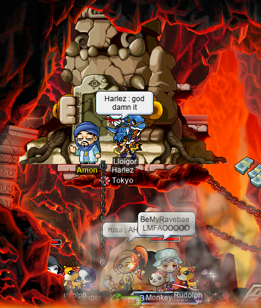

# rangifer’s diary: pt. lxxxi

## A guide to vicloc

As readers of this diary will know, I’ve been involved in a certain gameplay style of MapleStory referred to as “vicloc” (a\.k\.a. “viclock”, “Victoria-Island-locked”). I have two of my own vicloc characters on MapleLegends — **d33r**, a vicloc [clericlet](https://oddjobs.codeberg.page/guides/introduction-to-odd-jobs/#magelet); and **d34r**, a vicloc [dagger spearwoman](https://oddjobs.codeberg.page/guides/introduction-to-odd-jobs/#dagger-warrior) — who are part of the **Victoria** guild, a member guild of the **Suboptimal** alliance that is dedicated to vicloc.

There are a number of vicloc-related resources at <https://codeberg.org/Victoria/resources>, and I recently worked to start &amp; complete the _guide_ associated with this repository, which you can find at:

[**A guide to vicloc**](https://codeberg.org/Victoria/resources/src/branch/master/guide.md)

You can also find a lossy (as the forums cannot support some of the text and some of the formatting) version of this guide on the MapleLegends forums: <https://forum.maplelegends.com/index.php?threads/a-guide-to-vicloc.44893/>

## Odd-jobbed new year’s photoshoot, 2022

To celebrate the new year (albeit slightly late), I put together a very similar event to the one that we did during MapleLegends’s [X-mas/new year’s](https://en.wikipedia.org/wiki/Christmas_and_holiday_season) event last year. Regrettably, I forgot to include this in the previous diary entry. In any case, you can view the 31 images that I took during the photoshoot below:

**<https://codeberg.org/deer/gists/src/branch/master/odd-jobbed-new-years-photoshoot-2022>**

## Victoria-Island-locked

Speaking of vicloc, I did some grinding at [Wraith](https://maplelegends.com/lib/monster?id=4230102)s — yes, _BIG_ napkins, not smol napkins! — for the first time on my vicloc [clericlet](https://oddjobs.codeberg.page/guides/introduction-to-odd-jobs/#magelet) **d33r**. Big napkins are pretty strong, but d33r is strong enough now to take them on. I was joined by fellow clericlet (but outlander) **AppleBasket** (**LawdHeComin**) at [Line 2 \<Area 3\>](https://maplelegends.com/lib/map?id=103000202):

Vicloc…

While we were duoing Wraiths together, I found some very valuable vicloc items!! A [Mighty Bullet](https://maplelegends.com/lib/use?id=2330002) (the most powerful bullet in all of vicloc):

And the legendary [Red Whip](https://maplelegends.com/lib/equip?id=1302013)!:

Later, I was joined by a vicloc non-odd cleric by the name of **Lanius** (**xXCrookXx**, **Lvl1Crook**, **Level1Crook**). Lanius’s [Heal](https://maplelegends.com/lib/skill?id=2301002) wasn’t so high-level at the time, so we teamed up to take on [Line 1 \<Area 2\>](https://maplelegends.com/lib/map?id=103000103) together, with Lanius focusing on the [Stirges](https://maplelegends.com/lib/monster?id=2300100) (annoying bats that like to fly around willy-nilly, unaffected by Heal…):

While we were there, d33r levelled up to level 57~!:

Later on, when Lanius had a much higher level of Heal, we decided to duo Big Napkins together. But we wanted the _real_ Big Napkin map, which means [B3 \<Subway Depot\>](https://maplelegends.com/lib/map?id=103000909). The trouble is, getting to this map requires doing the entire B3 JQ… The B3 JQ is the third of the Kerning City JQs, and is required to complete “[Shumi’s Lost Sack of Money](https://bbb.hidden-street.net/quest/victoria-island/shumis-lost-sack-of-money)”. Unfortunately, this JQ is actually pretty difficult… but we went for it anyways:

After Lanius levelled up, we took a break and hoe’d for the rest of the time left (you can only stay in the map for about &ap;98 minutes before you get kicked out). Unfortunately, no Red Whips were found on this day…

Meanwhile, on my vicloc [dagger spearwoman](https://oddjobs.codeberg.page/guides/introduction-to-odd-jobs/#dagger-warrior) **d34r**, I was doing some [APQ](https://maplelegends.com/lib/map?id=670010100)ing. For some reason, this involved new names for my &amp; **xXCrookXx**’s buff macros:

Now that I’m jr barlog \[sic\], xXCrookXx has an excuse for his habit of randomly basic-attacking me…

During one APQ with [STRginner](https://oddjobs.codeberg.page/guides/introduction-to-odd-jobs/#permabeginner-outland) extraordinaire **Taima** (**deerhunter**, **Tacgnol**, **Numidium**, **Boymoder**, **Hanyou**, **Nyanners**, **pilk**), one of our party members disconnected partway through [the first stage](https://maplelegends.com/lib/map?id=670010200), thus leaving our APQ doomed to fail. [Stage 2](https://maplelegends.com/lib/map?id=670010300) absolutely requires a party of six, so we instead activated plan B…:

## rusa’s level 150 mini-party!!

As my [darksterity knight](https://oddjobs.codeberg.page/guides/introduction-to-odd-jobs/#dex-warrior) **rusa** has approached the big level 150(!!), I decided — partly at the behest of the folks whom I surveyed about whether or not it’s a good idea — to hold a level 150 mini-party for her. The mini-party that I planned was pretty simple: level up at the [West Domain of Perion](https://maplelegends.com/lib/map?id=102030000), and then have a game of 21 trivia questions on a particularly relevant theme. I had modest prizes lined up for the top three contestants in the game of trivia. You can watch an edited video of the mini-party on the **Oddjobs** YouTube channel:

(<https://www.youtube.com/watch?v=2Wdtmu0D5H4>)

As mentioned in the video, I chose the West Domain of Perion as the location of the mini-party for a very specific reason: this map is the closest Perion map to [Kerning City](https://maplelegends.com/lib/map?id=103000000) — indeed, this map has a portal to the [Construction Site North of Kerning City](https://maplelegends.com/lib/map?id=102040000). Going further around the rim of the island of Victoria takes you to [Lith Harbor](https://maplelegends.com/lib/map?id=104000000) and then [Henesys](https://maplelegends.com/lib/map?id=100000000). There’s thus a sense in which [DEX warriors](https://oddjobs.codeberg.page/guides/introduction-to-odd-jobs/#dex-warrior) (and LUK warriors) are “western warriors”; although they are ultimately from [Perion](https://maplelegends.com/lib/map?id=102000000) (due to being warriors), their affinities lie with the thieves of Kerning City and, more distantly, the archers of Henesys.

Also, when writing the trivia questions for my mini-party, I wanted to write more interesting questions than the usual trivia questions based on rote memorisation — trivia questions that exploit, rather than eschew, the fact that we’re connected to the internet (and thus the [WWW](https://en.wikipedia.org/wiki/World_Wide_Web)) the entire time anyways. I made the slight mistake of not making it extremely clear at the outset that this was intentional, which caused some initial confusion. In any case, I’ve reproduced all 21 questions here (although not in the order that I gave them at the mini-party; I [shuffled](https://en.wikipedia.org/wiki/Fisher%E2%80%93Yates_shuffle) them for that purpose):

21 questions

1. **Q:** [The prime factorisation](https://en.wikipedia.org/wiki/Fundamental_theorem_of_arithmetic) of 150 is?

   **A:** 2 × 3 × 52.
2. **Q:** What is the smallest &#x1d458; for which 150 is &#x1d458;-[smooth](https://en.wikipedia.org/wiki/Smooth_number)?

   **A:** 5.
3. **Q:** The sum of 150’s proper [divisors](https://en.wikipedia.org/wiki/Divisor) is?

   **A:** 1 + 2 + 3 + 5 + 6 + 10 + 15 + 25 + 30 + 50 + 75 = 222.
4. **Q:** 150 DEX grants a warrior how much WACC?

   **A:** 150 × 0\.8 = 120.
5. **Q:** 150 DEX grants a warrior how much AVOID?

   **A:** 150 × 0\.25 = 37\.5.
6. **Q:** Which of NPC [Miki](https://maplelegends.com/lib/npc?id=9201060)’s %-based potions don't stack to 150 per slot?

   **A:** [Ginseng Root](https://maplelegends.com/lib/use?id=2002022) &amp; [Ginger Ale](https://maplelegends.com/lib/use?id=2002023) (both stack up to 100 per slot). [Mapleade](https://maplelegends.com/lib/use?id=2022195)s stack up to 150 per slot, believe it or not.
7. **Q:** 150 is often cited as the maximum number of [people](https://en.wikipedia.org/wiki/Person) with whom a single [human](https://en.wikipedia.org/wiki/Human) can maintain stable relationships. In this context, 150 is known as?

   **A:** [Dunbar’s number](https://en.wikipedia.org/wiki/Dunbar%27s_number).
8. **Q:** 150 [CE](https://en.wikipedia.org/wiki/Common_Era) was how many years ago?

   **A:** 2022 − 150 = 1872.
9. **Q:** 150 [BCE](https://en.wikipedia.org/wiki/Common_Era) was how many years ago?

   **A:** 150 + 2022 − 1 = 2171. There is no [year 0](https://en.wikipedia.org/wiki/Year_zero).
10. **Q:** What is the [least residue](https://en.wikipedia.org/wiki/Modular_arithmetic#Residue_systems) of [31337](https://en.wikipedia.org/wiki/Leet), [modulo](https://en.wikipedia.org/wiki/Modular_arithmetic) 150?

    **A:** 137.
11. **Q:** What is the name of the [Unicode](https://en.wikipedia.org/wiki/Unicode) character with a [codepoint](https://en.wikipedia.org/wiki/Code_point) value of 150 ([decimal](https://en.wikipedia.org/wiki/Decimal))?

    **A:** [Start of guarded area](https://unicode.org/charts/PDF/U0080.pdf#search=0096) (“start of protected area” is also acceptable).
12. **Q:** What is the name of the Unicode character with a codepoint value of 150 ([hexadecimal](https://en.wikipedia.org/wiki/Hexadecimal))?

    **A:** [Latin capital letter O](https://en.wikipedia.org/wiki/Latin_script) with [double acute](https://en.wikipedia.org/wiki/Double_acute_accent).
13. **Q:** What sequence of two Unicode codepoints becomes the single codepoint U+0150 (hexadecimal) [after normalisation](https://en.wikipedia.org/wiki/Unicode_equivalence)?

    **A:** U+004f (Latin capital letter O), U+030b (combining double acute accent).
14. **Q:** How is the number 150 spoken in [English](https://en.wikipedia.org/wiki/English_language)?

    **A:** One hundred and fifty (“one hundred fifty” is also acceptable).
15. **Q:** How is the number 150 spoken in [Spanish](https://en.wikipedia.org/wiki/Spanish_language)?

    **A:** Ciento cinquenta.
16. **Q:** How is the number 150 spoken in [Malay](https://en.wikipedia.org/wiki/Malay_language)?

    **A:** Seratus lima puluh (“satu ratus lima puluh” is also acceptable).
17. **Q:** What is the ([Greek](https://en.wikipedia.org/wiki/Greek_language)-derived) English name for a 150-sided [polygon](https://en.wikipedia.org/wiki/Polygon)?

    **A:** Hectopentacontagon (also acceptable: “hecatontapentacontagon”, “hectopentecontagon”, “hecatontapentecontagon”, etc.).
18. **Q:** An interval of 150 [semitones](https://en.wikipedia.org/wiki/Semitone) (in [12-TET](https://en.wikipedia.org/wiki/12_equal_temperament)) is [octave-equivalent](https://en.wikipedia.org/wiki/Octave#Equivalence) to which non-[compound interval][compound-interval]?

    **A:** [Tritone](https://en.wikipedia.org/wiki/Tritone) (also acceptable: “augmented fourth”, “diminished fifth”, “doubly augmented third”, etc.).
19. **Q:** A musical interval of 150 [cents][cent] is commonly referred to as?

    **A:** [Neutral second](https://en.wikipedia.org/wiki/Neutral_interval#Second).
20. **Q:** What is the amount of EXP necessary to advance from level 1 to level 150?

    **A:** 2&numsp;681&numsp;167&numsp;427.
21. **Q:** An interval of 150 [savarts](https://en.wikipedia.org/wiki/Savart) is most closely approximated by what named interval?

    **A:** Tritone (also acceptable: “augmented fourth”, “diminished fifth”, “doubly augmented third”, etc.).

Although they weren’t able to make it to the mini-party, **Cortical** came through on their promise to award a [CFA30](https://maplelegends.com/lib/use?id=2044705) to the first odd-jobber to (legitimately) achieve level 150…:

The whole CFA30 thing was kind of a joke, but hey, I’ll take it! I donated it to **Boymoder** (**Taima**, **deerhunter**, **Tacgnol**, **Numidium**, **Hanyou**, **pilk**), who failed it on a [Skanda](https://maplelegends.com/lib/equip?id=1472055) :\[ Oh well…

[compound-interval]: https://en.wikipedia.org/wiki/Interval_(music)#Compound_intervals
[cent]: https://en.wikipedia.org/wiki/Cent_(music)

## The adventures of cervine, the world’s stupidest I/L archmage

In the previous diary entry, my I/L [magelet](https://oddjobs.codeberg.page/guides/introduction-to-odd-jobs/#magelet) **cervine** [advanced to the honourable rank of archmagelet](https://www.youtube.com/watch?v=2dLmk0ERy0g). In this entry, we find her back at the ol’ [CDs](https://maplelegends.com/lib/map?id=742010203), using her long-hoarded [Valentine’s Day basket](https://maplelegends.com/lib/use?id=2020024) from last year’s [St. Valentine’s Day](https://en.wikipedia.org/wiki/Valentine%27s_Day) event, along with INTlaw **Lvl1Crook** (**xXCrookXx**, **Macer**, **Lanius**, **Level1Crook**) and hermit **trishaa**:

The adventures of cervine

My [Blizzard](https://maplelegends.com/lib/skill?id=2221007) took up so much room that, in order to share the map, trishaa and Lvl1Crook each took half of the bottom row… During this basket-grinding session, cervine hit level 121~!:

Later, I wanted to do some more of cervine’s fourth-job quests…

In order to unlock [Ice Demon](https://maplelegends.com/lib/skill?id=2221003), I had to get a [Frozen Book of Ice](https://maplelegends.com/lib/etc?id=4161016) from [Blue Kentaurus](https://maplelegends.com/lib/monster?id=8140103)es. Thankfully, I already had one (I’ve had it for so long that I don’t even remember where I got it), so I gave it to [Gritto](https://maplelegends.com/lib/npc?id=2081200), who ate it. To find a replacement, I had to go around and talk to a bunch of NPCs (including [Jeff](https://maplelegends.com/lib/npc?id=2030000)), asking how exactly to make another legendary artefact such as the Frozen Book of Ice. I found out that there is an [Ancient Icy Stone](https://maplelegends.com/lib/npc?id=2030014) amongst the El Nath Mountains, which can only be shattered by the strongest hammer in all the land. But, some powder from this ancient ice would suffice to make a nice (but perhaps imprecise) replacement for the book that Gritto ate. So I talked to [Vogen](https://maplelegends.com/lib/npc?id=2020000), hoping that he would know something about hammers. Fortunately for me, he did, but he needed some materials to make such an [Orihalcon Hammer](https://maplelegends.com/lib/etc?id=4031450):

- A [Moon Rock](https://maplelegends.com/lib/etc?id=4011007),
- two [Orihalcon Plate](https://maplelegends.com/lib/etc?id=4011005)s,
- and 30 [Ice Piece](https://maplelegends.com/lib/etc?id=4000150)s (from [GPW](https://maplelegends.com/lib/monster?id=8143000)s).

I returned to Vogen with the aforementioned items, and Vogen followed through and crafted an [Orihalcon](https://en.wikipedia.org/wiki/Orichalcum) Hammer for me. Hammer in hand, I headed back to see Jeff again at [Ice Valley II](https://maplelegends.com/lib/map?id=211040200). And Jeff led me to a secret special-sauce map called [Ice Valley](https://maplelegends.com/lib/map?id=921100100) (notice the lack of numerals in the name)…:

…Within which, I quickly stumbled upon the Ancient Icy Stone of legend:

So, I took a whack at it:

With a bag of [Ancient Ice Powder](https://maplelegends.com/lib/use?id=2280011) now in my palms, I suddenly felt the urge to foolishly repeat the same mistake that Gritto made. So I gobbled up the powder:

I have to say, it was delicious. And gave me [brain freeze](https://en.wikipedia.org/wiki/Cold-stimulus_headache). But was also scrumptious. Oh, and it made me learn a new skill??:

Powerful stuff.

Finally, my last remaining quest was for [Ifrit](https://maplelegends.com/lib/skill?id=2221005), the I/L summon (which deals fire damage). Although it may seem strange that the ice/lightning summon deals fire damage, [Alcaster](https://maplelegends.com/lib/npc?id=2020005) explains the significance of this to us:

Now that I’ve learned the second-job I/L skills, the third-job I/L skills, as well as Blizzard, [CL](https://maplelegends.com/lib/skill?id=2221006), and Ice Demon, it would seem that I’ve mastered all that there is to possibly learn about the magic of ice &amp; lightning. So what else is there to learn? Alcaster casually suggests that I “just” have a “[\[C\]opernican](https://en.wikipedia.org/wiki/Nicolaus_Copernicus) revolution”. Now, I reckon that having a Copernican-style revolution is more easily said than done — but I’ll give it my best shot.

Actually, Alcaster seemed to have something specific in mind, as he immediately sent me off on a quest to gather some ingredients for an experiment that he wanted to perform. So I headed to [Leafre](https://maplelegends.com/lib/map?id=240000000) to collect [Kentaurus’s Flame](https://maplelegends.com/lib/etc?id=4000232)s from [Red Kentaurus](https://maplelegends.com/lib/monster?id=8140102)es:

And to collect some [Small Flaming Feather](https://maplelegends.com/lib/etc?id=4000240)s from [Blood Harp](https://maplelegends.com/lib/monster?id=8140002)s:

Note that Small Flaming Feathers do not drop _nearly_ as often as [Blood Harp’s Crown](https://maplelegends.com/lib/etc?id=4000239)s, the other “leftover” ETC that Blood Harps drop.

And finally, I headed to [a secret spa in Japan](https://maplelegends.com/lib/map?id=801000210) to hunt for [Firebomb Flame](https://maplelegends.com/lib/etc?id=4000081)s from [Firebomb](https://maplelegends.com/lib/monster?id=5100002)s:

I took these ingredients back to Alcaster, who promptly failed the experiment that he wanted to try. Having now run out of ideas, Alcaster referred me to [Hughes the Fuse](https://maplelegends.com/lib/npc?id=2012017) of the [Orbis Tower](https://maplelegends.com/lib/map?id=200082301), who had his own experiment in mind. Again, I needed to collect the ingredients, but this time they seemed to mostly be metals:

- Ten [Orihalcon Plate](https://maplelegends.com/lib/etc?id=4011005)s,
- five [Adamantium Plate](https://maplelegends.com/lib/etc?id=4011003)s,
- five [Mithril Plate](https://maplelegends.com/lib/etc?id=4011002)s,
- and a [Soul Pouch](https://maplelegends.com/lib/etc?id=4031468).

However, the only person who knew how to make a Soul Pouch was, again, Alcaster. So Alcaster needed ingredients, as well:

- 50 [Free Spirit](https://maplelegends.com/lib/etc?id=4000144)s (from [MST](https://maplelegends.com/lib/monster?id=6230500)s),
- 30 [Binding Bridles](https://maplelegends.com/lib/etc?id=4000148) (from [MDT](https://maplelegends.com/lib/monster?id=7130300)s),
- 50 [Evil Spirit](https://maplelegends.com/lib/etc?id=4000146)s (from [Dark Klock](https://maplelegends.com/lib/monster?id=8140300)s),
- and 30 [Summoning Rock](https://maplelegends.com/lib/etc?id=4006001)s.

So I painstakingly farmed up some Free Spirits myself. MSTs only spawn at [FPoT1](https://maplelegends.com/lib/map?id=220070000), where they make up only about ⅓ of the map’s population. Yet, MSTs are immune to ice and strong against lightning, whereas the other species on the map ([Soul Teddy](https://maplelegends.com/lib/monster?id=6230400)) is strong against both ice and lightning. So I was F5’ing the whole time…:

Eventually, I did get 50 Free Spirits, so I moved on to [FPoT2](https://maplelegends.com/lib/map?id=220070100), which has a similar situation with Dark Klocks only making up about ⅓ of the map’s population. Thankfully, however, both [Klock](https://maplelegends.com/lib/monster?id=8140200)s and Dark Klocks are neutral against ice and lightning. Along the way, I found a Klock card:

…And the 50 Evil Spirits that I needed:

After some running around, I got Hughes all of the ingredients that he needed for his experiment. Thankfully, Hughes’s experiment _was_ successful, so I returned to Alcaster with the good news. However, Alcaster said that there was still one thing missing to complete this new summoning magic: a [Fire Soul Rock](https://maplelegends.com/lib/etc?id=4031469). Unfortunately, this special rock only drops from [Elemental Thanatos](https://maplelegends.com/lib/monster?id=9300086)es, so I had to figure out how to find some of those. Only [Flo](https://maplelegends.com/lib/npc?id=2041023), at the [Path of Time](https://maplelegends.com/lib/map?id=220050300), knew how to go to this otherworldly elemental plane where the Elemental Thanatoses reside. Flo would take me there, but only if I had [an invitation](https://maplelegends.com/lib/etc?id=4031473). So I harassed some [Gatekeeper](https://maplelegends.com/lib/monster?id=8160000)s, seeking an invitation:

And lo, there it was; the [Gatekeeper’s Invitation](https://carsonmcwhirter.bandcamp.com/track/gatekeepers-invitation):

With the invitation in hand, I went to Flo. But actually, I needed just one more thing before Flo would allow me into the elemental plane: another archmage to accompany me. So I enlisted the company of **Tacgnol** (**Taima**, **deerhunter**, **Boymoder**, **Numidium**, **Hanyou**, **pilk**), the F/P [archgishlet](https://oddjobs.codeberg.page/guides/introduction-to-odd-jobs/#gish). And we ventured into this unknown realm…:

Here, we were made to fight twin Elemental Thanatoses:

Although they may look like identical twins, these two are not totally identical. I easily killed one of them, but I couldn’t seem to deal any damage at all (other than “**1**”s) to the other — not even with [Magic Claw](https://maplelegends.com/lib/skill?id=2001005)! So Tacgnol had a go at it, thwacking it with [her staff](https://maplelegends.com/lib/equip?id=1382045):

And with that one also dead, the Fire Soul Rock dropped before me:

And, finally, Alcaster showed me how to put it all together to learn Ifrit:

Unfortunately, actually putting SP into Ifrit requires having level ≥5 Ice Demon, so I’ve no real access to it yet! But soon, hopefully!!

## A new robe

I recently made an equipment upgrade to a very important equipment item that I use across several of my characters: my STR robe. This upgrade has a slight story behind it. Someone by the name of **Stonedaf** [smega](https://maplelegends.com/lib/cash?id=5072000)’d that they were selling a [female bathrobe](https://maplelegends.com/lib/equip?id=1051098) scrolled for STR. Unfortunately, I wasn’t online at the time, but **Lv1Crook** sent me a screenshot of the smega. So, I buddied them on one or two of my characters that I was playing frequently at the time, and was frequently typing `/find Stonedaf` to try to find them. I never found any trace of them, and eventually gave up.

Fast-forward some months, and as I was doing [KPQ](https://maplelegends.com/lib/map?id=103000800) on my [DEX page](https://oddjobs.codeberg.page/guides/introduction-to-odd-jobs/#dex-warrior) KPQ/[SPQ](https://maplelegends.com/lib/map?id=990000000) mule **kinds**, I saw a smega from Stonedaf looking for offers on that same robe! I wasn’t sure what to offer on it, so I did some rough calculations based on the most recent [OwlRepo](https://owlrepo.com/items) p25 values at the time, in combination with [scroll\_strategist\_cli](https://codeberg.org/deer/scroll_strategist_cli), and found that at current market prices, it would take roughly &ap;114[M](https://en.wikipedia.org/wiki/Mega-) mesos ([on average](https://en.wikipedia.org/wiki/Expected_value)) to produce an item of this quality. This might seem like an obnoxiously high price for a STR bathrobe — an item that has no real use to non-odd characters beyond a low level — but makes sense, given the price of scrolls for overalls for STR, and given that the robe necessarily starts with 0 STR clean. Not wanting to bid so high right out of the gate, I decided to throw out a bid of 80M and see what happens…

Stonedaf was thrilled by the offer, at which point I immediately realised my mistake: looking only at the cost _to produce_ such an item is unfortunately grossly misleading when trying to appraise it. Such items are speciality items that are not really worth much _per se_, even though they cost a lot to make. Female STR robes, in particular, have no real market whatsoever — male equivalents are not super popular either, but I’ve been able to find several of them with a single [owl](https://maplelegends.com/lib/cash?id=5230000) on multiple separate occasions.

In any case, Stonedaf was pleased to see that someone really wanted to robe, and agreed to sell it to me right then and there. In the trade window, they explained to me that they had made the robe themselves, that it had a long history, that they had been trying to sell it for a long time, and that they had just recently come back to the game after a hiatus. When I said that I had been on the lookout for any female STR robes for a long time, they assured me that the robe would serve me well.

## Suboptimal bossing

And now, back to our [regularly scheduled bossing activities](https://codeberg.org/deer/gists/src/branch/master/what-s-next-for-oddjobs/odd-job-initiative/runs.md)…

I had the pleasure of killing some [BF](https://maplelegends.com/lib/monster?id=9400575)s with not just **Level1Crook** (**Lvl1Crook**, **xXCrookXx**, **Macer**, **Lanius**), but also [STRginner](https://oddjobs.codeberg.page/guides/introduction-to-odd-jobs/#permabeginner-outland) **Taima** (**Tacgnol**, **Numidium**, **deerhunter**)! I took my [woodsmaster](https://oddjobs.codeberg.page/guides/introduction-to-odd-jobs/#woodswoman) **capreolina** so that I could help to pin BF from a distance, using [Hurricane](https://maplelegends.com/lib/skill?id=3121004) and/or [Strafe](https://maplelegends.com/lib/skill?id=3111006):

Suboptimal bossing

There were surprisingly few deaths from poor Taima, who had to face up toe-to-toe\* with Bigfoot the entire time!

And with a similar crew (although with me on my [darksterity knight](https://oddjobs.codeberg.page/guides/introduction-to-odd-jobs/#dex-warrior) **rusa** this time), we did some more Rāvaṇas!:

Wowee! A coin pouch~!

And we even fought the [Pepper Lattice](https://maplelegends.com/lib/monster?id=8500001); but this time, accompanied by dark knight **DarkCookie** (**SolidState**, **LightCookie**)! Now that I didn’t have to provide [HB](https://maplelegends.com/lib/skill?id=1301007), I took capreolina this time:

On a different occasion, Level1Crook &amp; I went hunting for [Headless Horsemans](https://maplelegends.com/lib/monster?id=9400549), with me as my [daggermit](https://oddjobs.codeberg.page/odd-jobs.html#dagger-assassin) **alces**:

We had a particularly crowded BFing party with not just me (capreolina) and Level1Crook, but also **trishaa**, **Bipp** (**Cassandro**, **Copo**, **Fino**, **Sommer**, **Celim**), and **shadowban**/**2sus4u** (**uayua**, **tb303**):

…During which, we had a bit of a [toe](https://maplelegends.com/lib/etc?id=4032013) moment:

And, finally, on a separate occasion, we were joined by 2sus4u once again for a few trio BFs:

So long, &amp; thx 4 all the toes (&amp; EXP)!

Footnotes for “Suboptimal bossing”

\*Pun intended.

## A few Masteria quests, with alces the daggermit

I did some quests in and around [New Leaf City](https://maplelegends.com/lib/map?id=600000000) (in Masteria) on my [daggermit](https://oddjobs.codeberg.page/odd-jobs.html#dagger-assassin) **alces**. The first order of business was actually [Featherweights](https://bbb.hidden-street.net/quest/masteria/featherweights), a completely useless quest if it weren’t for the fact that it’s a prequest for [Urban Warrior](https://bbb.hidden-street.net/quest/masteria/urban-warrior). This meant hunting for [Boomer Core](https://maplelegends.com/lib/etc?id=4000391)s at [Jungle Valley](https://maplelegends.com/lib/map?id=600010300):

During which, I stumbled across an [Urban Fungus](https://maplelegends.com/lib/monster?id=9400539) card or two:

And also, I had to kill like 200 [Gryphon](https://maplelegends.com/lib/monster?id=9400544)s, for this quest, and for [Cleaning Up the Streets](https://bbb.hidden-street.net/quest/masteria/cleaning-up-the-streets) at the same time:

Needless to say, daggers are not the most effective means of slaying Gryphons. Then again, it’s kind of a massive pain in the ass no matter how you do it.

I also went ahead and started the [Subani’s Legacy](https://bbb.hidden-street.net/quest/masteria/subanis-legacy) questline, which meant — among other things — slaying some [Fire Tusk](https://maplelegends.com/lib/monster?id=9400542)s:

While I was in Big Ben, I killed some [Wolf Spider](https://maplelegends.com/lib/monster?id=9400545)s for [Urban Jungle](https://bbb.hidden-street.net/quest/masteria/urban-jungle):

…And hunted some [Electrophant](https://maplelegends.com/lib/monster?id=9400543)s for their [Hyper Glyph](https://maplelegends.com/lib/etc?id=4031680)s:

To wrap up Subani’s Legacy, I hunted for [the pieces of the MesoGears map](https://maplelegends.com/lib/etc?id=4031681) from [I\.AM\.ROBOT](https://maplelegends.com/lib/monster?id=9400546)s:

…During which, I found not an I\.AM\.ROBOT card, but rather, an Electrophant card…:

And there it is: Subani’s Legacy! Now gimme those newly-buffed [MesoGears Ring](https://maplelegends.com/lib/use?id=2022238)s…

## Getting better at Jiaoceng

In the previous diary entry, I talked about my first experiences of running [Jiaoceng (武林妖僧)](https://maplelegends.com/lib/monster?id=9600025) for the first time. Again, for anyone not familiar, the salient feature of JC as a boss is the tight time limit: 10 minutes or less, no exceptions. However, for those capable of defeating JC within the time limit, you may be rewarded with EXP, card(s), and/or some valuable loot (including the occasional Mysterious Pouch 1). Given that one of the main perks is EXP, the need for [HS](https://maplelegends.com/lib/skill?id=2311003) naturally arises. So, **xBowtjuhNL** wanted to help me get my pure [STR bishop](https://oddjobs.codeberg.page/guides/introduction-to-odd-jobs/#str-mage) **cervid** through the JC prequests so that she could provide HS for our runs. Because cervid is level \<135, she’s not capable of leeching any of the EXP from [the clone](https://maplelegends.com/lib/monster?id=9600026)s, much less JC itself. This would, in principle, make things pretty easy.

So we headed to [1-2 F](https://maplelegends.com/lib/map?id=702070100) and [3-4 F](https://maplelegends.com/lib/map?id=702070200) of the Sutra Depository to kill some metallic monks:

武林妖僧

The first time that I tried running JC on my [darksterity knight](https://oddjobs.codeberg.page/guides/introduction-to-odd-jobs/#dex-warrior) **rusa**, with cervid there for HS, was a bit of a failure…

cervid fell victim to pet autopot failure, caused by getting 1/1’d near the beginning of the fight. So I did the trick of binding [Ginseng Root](https://maplelegends.com/lib/use?id=2002022) to both auto HP _and_ auto MP, and that has actually worked quite well since then.

Now that xBowtjuhNL, **Harlez** (**VigiI**), and I have really gotten the hang of JCing, I’ve noticed that JC seems to be fairly generous with the cards:

While I was training [just outside of JC’s lair](https://maplelegends.com/lib/map?id=702070400) with Harlez, I finally finished one of the hardest card sets in the game: [Golden Giant](https://maplelegends.com/lib/monster?id=9600021)!!:

And that wasn’t all; the JCs that we did immediately after…

Got me to 5/5 on both JC and its clones! That’s three tough sets completed, in one session!!

And, finally, here’s rusa in her INT pj’s, hitting level 151 :P

## Pee queues

I did a lot of [KPQ](https://maplelegends.com/lib/map?id=103000800)ing on my [DEX page](https://oddjobs.codeberg.page/guides/introduction-to-odd-jobs/#dex-warrior) KPQ/[SPQ](https://maplelegends.com/lib/map?id=990000000) mule **kinds**, during which, I decided to occasionally take it easy on the whole “carrying” thing, letting my party members build character by doing things themselves…

Peek yous

(Pictured above: **deerhunter** (**Taima**, **Tacgnol**, **Numidium**, **Boymoder**, **Hanyou**, **pilk**), the vicloc [woodswoman](https://oddjobs.codeberg.page/guides/introduction-to-odd-jobs/#woodswoman); and **Macer** (**Level1Crook**, **Lvl1Crook**, **xXCrookXx**, **Lanius**), the vicloc [gish](https://oddjobs.codeberg.page/guides/introduction-to-odd-jobs/#gish) cleric.)

I also did some KPQing with [vicloc page](https://codeberg.org/Victoria/resources/src/branch/master/guide.md#page) **Mootage** (**Mootsama**, **Mootmage**). You can see in the image below that I’ve gone back to [pop](https://maplelegends.com/lib/skill?id=1001004)ping the [King Slime (PC)](https://maplelegends.com/lib/monster?id=9300003)\* myself…:

I also came across a wild occurrence of staff-whacker **Aphasia** (**Cortical**, **Medulla**, **GishGallop**, **SussyBaka**, **CokeZeroPill**), who is a noob:

And, who also suggested that we try getting a [Pass](https://maplelegends.com/lib/etc?id=4001008) from every party member during [the first stage](https://maplelegends.com/lib/map?id=103000800), so that we could actually clear the PQ without dealing damage to King Slime at all. Normally, the first stage asks for everyone, _except for the leader_, to collect [Coupon](https://maplelegends.com/lib/etc?id=4001007)s from the [Ligator (PC)](https://maplelegends.com/lib/monster?id=9300001)s\*, and then to turn in the appropriate number of Coupons in exchange for a Pass. The leader can then only proceed by giving the NPC `n` − 1 Passes, where `n` is the size of the party. But there is a well-known trick, often used when someone gets the “STR required to take first-job advancement to warrior” question (thus requiring the collection of 35 Coupons, more than any other question): you can pass the party leader to another person, and have the old party leader collect Coupons instead. The old party leader usually has a different question (as the question is randomly selected for each party member), thus decreasing the overall number of Coupons that need to be collected. If this is possible, then it seems like you could collect “all” `n` − 1 Passes, but then before clearing the stage, you pass the party leader position, and have the old leader collect &amp; turn in Coupons themselves, thus bringing the total number of Passes up to `n`.

We tried it, and this does work — you get `n` Passes total. Of course, that didn’t necessarily mean that we could get to the next stage with an extra Pass. It could be that the NPC checks that you have _at least_ `n` − 1 Passes, and then confiscates _all_ of the Passes that you have before making the stage clear. But, as it turns out, this is not how it works; it does take `n` − 1 of your Passes, no matter what. So when we got to [the final stage](https://maplelegends.com/lib/map?id=103000804), Aphasia was excited to see that the Passes from this final stage do stack (read: share the same inventory slot) with the ones from the first stage (i\.e. they have the same item ID). And this was how we achieved the “good” ending of KPQ, where we peacefully left King Slime alive &amp; unharmed:

In another session, I did some KPQs in a party consisting of me, deerhunter, and a few random folks. This resulted in some confusion when the random folks insisted on referring to deerhunter as simply “deer”. Here, they rolled to see who gets the King Slime’s loot, and then **magepig** announces that “deer\[hunter is the winner of the roll\]”:

While I was writing the vicloc guide, I wanted to get some more concrete numbers on how much EXP one gets from a single run of [HPQ](https://maplelegends.com/lib/map?id=910010000) — along with similar numbers for the various other vicloc PQs. I considered running three clients to do an HPQ or two by myself, but when I mentioned it in alliance chat, **uayua** (**2sus4u**, **tb303**, **shadowban**) and deerhunter came to the rescue. So, I ran an HPQ with them on my [permarogue](https://oddjobs.codeberg.page/guides/introduction-to-odd-jobs/#permarogue) **panolia**:

In other PQs, I did some [EPQ](https://maplelegends.com/lib/map?id=300030100)ing on my [DEX brawler](https://oddjobs.codeberg.page/guides/introduction-to-odd-jobs/#dex-brawler) EPQ/[LPQ](https://maplelegends.com/lib/map?id=221024500) mule **sorts**. Here, you can see me, **Furca** (**Gruzz**) the clawslinger, and **Numidium** the [STR cleric](https://oddjobs.codeberg.page/guides/introduction-to-odd-jobs/#str-mage), all attacking [BBRG (Big Bad Rock Guy)](https://maplelegends.com/lib/monster?id=9300182) with an… _unusual_ selection of weaponry:

During these EPQs, I decided to try — for the first time — actually [throwing hands](https://maplelegends.com/lib/skill?id=5001001) at this BBRG, instead of standing back and letting my [pew pew](https://maplelegends.com/lib/skill?id=5001003) do the talking:

This worked well enough. However, it was certainly slower, and furthermore, was a good bit more dangerous and potion-intensive…

Footnotes for “Pee queues”

\*What does “PC” even stand for? **P**arty **C**uest?? And for that matter, “(JP)” [is used](https://maplelegends.com/lib/monster?filter=1&order=1&sort=1&search=jp) for the [LMPQ](https://bbb.hidden-street.net/party-quest/ludibrium-maze) monsters (see, for example, the familiar [Tauromacis(JP)](https://maplelegends.com/lib/monster?id=9400218)) for seemingly the same purpose: to distinguish PQ-bound versions of the monster from other versions. But what does JP stand for??? [Japan](https://en.wikipedia.org/wiki/Japan)???? **J**ust **P**arty????? What about the “GL” of the [APQ](https://maplelegends.com/lib/map?id=670010100) monsters like [Curse Eye GL](https://maplelegends.com/lib/monster?id=9400524)?????? **G**ood **L**uck??????? Good luck figuring it out!

## Killing Galloperas, with capreolina

Along with getting EXP from the occasional [Bigtoe](https://maplelegends.com/lib/monster?id=9400575), [Papa Lettuce](https://maplelegends.com/lib/monster?id=8500001), and [Rav](https://maplelegends.com/lib/monster?id=9420014), I’ve been doing a little [Gallopera](https://maplelegends.com/lib/monster?id=9420540)-slaying on my [woodsmaster](https://oddjobs.codeberg.page/guides/introduction-to-odd-jobs/#woodswoman) **capreolina**. After levelling up to 131 just after a double Paper Lattice kill…

…I went to finally grind out another long-hoarded [Valentine’s basket](https://maplelegends.com/lib/use?id=2020024) with sniper **Level1Crook** (**xXCrookXx**, **Macer**, **Lanius**, **Lvl1Crook**):

By the end of it, I was at roughly &ap;93\.5% EXP, so I came back to Gallos later — this time, alone — to grind out the last &ap;6\.5%. As it turned out, this took a li’l while — it takes me upwards of \>7 hours of pure grind to churn out a full level at solo Gallos. In any case, I pushed through to level 132, INT pj’s &amp; all~:

Now that I hit level 132, my [Hurricane](https://maplelegends.com/lib/skill?id=3121004) got to level 7, meaning that I could now try passing [Hurricane 20](https://maplelegends.com/lib/use?id=2290060)s (although I wouldn’t strictly _need_ to do so for another two levels). Luckily, Hurricane 20s drop from [Petrifighter](https://maplelegends.com/lib/monster?id=9420517)s (“Petris”), and are thus worthless. I snagged two for 50[k](https://en.wikipedia.org/wiki/Kilo-) mesos each and passed the second one:

Cool! Unfortunately, as I said, I won’t actually be able to go above level 10 Hurricane for another two levels (level ≥134); this means that [Strafe](https://maplelegends.com/lib/skill?id=3111006) remains my primary means of dealing sustained single-target DPM with a bow until then.

## rusa vs. even moar bosses

I killed quite a few [Black Crow](https://maplelegends.com/lib/monster?id=9400014)s on my [darksterity knight](https://oddjobs.codeberg.page/guides/introduction-to-odd-jobs/#dex-warrior) **rusa**, thanks to shadower **Harlez** (**VigiI**) diligently hunting for them at [Encounter with the Buddha](https://maplelegends.com/lib/map?id=800020130). Here I am, with Harlez and I/L archmage **Gruzz** (**Furca**), taking on this goofy-looking guy:

rusa vs. the world

Yeahh… it’s a little tough actually _seeing_ anything, what with all the fog/mist in the map, the [Dreamy Ghost](https://maplelegends.com/lib/monster?id=9400013)s (“Himes”), and the flashy skill effects…

I had the privilege of doing two [sleepytime tree](https://maplelegends.com/lib/monster?id=9420521) runs with MM **xBowtjuhNL** and BM **Odyssea**, as well as fellow DK **DrakeSworD**, during which sleepytime tree got _extra_ sleepy for some reason. Because the tree stopped even so much as _attempting_ to harass us, we were forced to `@gm` for help turning comatime tree into sleepytime tree. So we were paid a visit by GM **Nightzy**:

xBowtjuhNL was right. It won’t drop anything, anyways.

Later, I did a pair of [Targa](https://maplelegends.com/lib/monster?id=9420544) runs with Harlez, xBowtjuhNL, NL **OverEasy**, and helm buyer I/L archmage **Mater**, who joined us for the fight:

I’m still very much at that point where [the third body of Targa](https://maplelegends.com/lib/monster?id=9420544) (and even [the third body of Scarlion](https://maplelegends.com/lib/monster?id=9420549)) are a sweatfest for me, as rusa. Keeping my [zerk](https://maplelegends.com/lib/skill?id=1320006)ing consistent is nervewracking, made even worse by Targa’s (and to a lesser extent, Scarlion’s) insistence on moving around willy-nilly and casting control-reversal debuffs. But with more levels and more MAXHP, hopefully it will get a bit more relaxing!!

After partially scrolling one of the helms that he looted, Mater decided to give up the last helm that was remaining on the ground. I won the roll and looted it, only to find that it was [an INT helm](https://maplelegends.com/lib/equip?id=1003023), and a 19 INT one at that…:

R\.I\.P.

In other Crow news, Harlez &amp; I were so incredibly fortunate as to find a [Stonetooth Sword](https://maplelegends.com/lib/equip?id=1402037)‽:

The stats weren’t amazing (100 WATK, which is one below average), but still an epic find.

Also lurking amongst the area bosses of Japan is [Female Boss](https://maplelegends.com/lib/monster?id=9400121) (perhaps better known as “Anego”\*). Now, I’ve never so much as attempted to fight this boss, nor any of the bosses in the “hideout” region of [Showa Town](https://maplelegends.com/lib/map?id=801000000). Anego is incredibly tough: although she is “only” level 130, she has 75[M](https://en.wikipedia.org/wiki/Mega-) HP, 3k WDEF, and is capable of slapping those who come too close for up to &ap;19k damage!! Yikes!!! Needless to say, I wasn’t going to be zerking against Anego… but at least her KB is only 1k, so I can still knock back consistently :P

In any case, I had honestly never even been to the hideout in my entire Maple career. I never got nearly powerful enough to believe that I could survive a jaunt in such a place (even the [Extra D](https://maplelegends.com/lib/monster?id=9400103)s, and so on, were quite scary to me at one point…), so this was my first experience seeing the interior:

I met up with Harlez and xBowtjuhNL, and we fought this Anego to the death:

As it turns out, perhaps the main thrust of fighting Anego is obtaining [her comb](https://maplelegends.com/lib/etc?id=4000138) (although she does also drop [wand 30%](https://maplelegends.com/lib/use?id=2043705)s and cards, which is nice, I guess) — this special comb is actually worth quite a bit, as it can be used to summon [Bodyguard A](https://maplelegends.com/lib/monster?id=9400112)†.

I also did some [Zak](https://maplelegends.com/lib/monster?id=8800002)king on rusa — Zak and [JC](https://maplelegends.com/lib/monster?id=9600025) are probably my favourite two bosses that I’ve fought thus far. During one such Zak run with some members of the **Funk** guild (including xBowtjuhNL, shadower **Soblet**, and of course I/L archmage **Nightz**), xBowtjuhNL and I were the only ones during the arms stage that were up on the platforms and attacking the highest-positioned arms — everyone else was cleaving the arms from the bottom-centre of Zak’s body. So naturally, it was a race between me and xBowtjuhNL (**Ramon**) to see who could kill their arms first. [With a little help from my friends](https://en.wikipedia.org/wiki/With_a_Little_Help_from_My_Friends), I managed to win B)…

Later (alongside NL **BeMyRavebae**, Harlez, and others), I sold non-AFK [zhelm](https://maplelegends.com/lib/equip?id=1002357)s to fighter **Sohda**, who immediately recognised me, as they are also known as [STRginner](https://oddjobs.codeberg.page/guides/introduction-to-odd-jobs/#permabeginner-outland) **Duhm**! Sohda looted two helms that were unfortunately quite under average, but had quite a resurgence of luck, as the final helm turned out to be 17/17/x/y!:

In another run with a similar crew (although this time, joined by bishop **Screed**), we had the misfortune of xBowtjuhNL’s client [process] crashing at the beginning of the run :(

One of our NLs took this as a sign that they were not going to be finishing the run in time for their obligations, as we were now missing xBowtjuhNL’s damage, as well as the immense additional damage afforded to the NLs — and to a lesser extent, myself &amp; Harlez — by [SE](https://maplelegends.com/lib/skill?id=3221002). So here we were, desperately trying to finish as a quartet. BeMyRavebae even bought an [Onyx Apple](https://maplelegends.com/lib/use?id=2022179) (the one (1) that I happened to have in my inventory) from me during the run…:

Then, things took an even worse turn, as Zakum grew wings and flew up to the top-left corner of the map without warning!:

One `@gm` [ticket-filing](https://en.wikipedia.org/wiki/Issue_tracking_system) later, and GM **Oolong** came to the rescue, repositioning Zak to… well, _almost_ its original position:

Unfortunately, after Oolong left, Zak was back on its old shit, this time suddenly breaking by stopping all attacks…

In the end, this run was just botched — we got our arms EXP, and that was it.

In even more Japanese area boss news, though, Harlez &amp; I managed to find **_another_** 100 WATK Stonetooth Sword‽‽:

Now that we have two, we each get one! I have something special in mind for mine…

And along the hallways of the Ninja Castle, we found some [Kacchuu Musha](https://maplelegends.com/lib/monster?id=9400405)s (perhaps better known as “Samu”s‡), who gave us their tasty [fragment](https://maplelegends.com/lib/etc?id=4000342)s:

And, slowly but surely, I fill up my Black Crow card set :P

At yet another pair of Zakum runs, I had the pleasure of running with I/L archmage extraordinaire **Edann**:

[OPQ](https://maplelegends.com/lib/map?id=200080101) really was good times!! And, on an unrelated note, it’s humbling to see Edann casually hitting upwards of 130k–140k+ lines with [Blizzard](https://maplelegends.com/lib/skill?id=2221007) on Zak arms o\_o

And finally, during the second of these two runs, I levelled up to level 152 at the end~!:

:3

Footnotes for “rusa vs. even moar bosses”

\*This name is the [rōmaji](https://en.wikipedia.org/wiki/Romanization_of_Japanese) of the [Japanese](https://en.wikipedia.org/wiki/Japanese_language) [姉御](https://en.wikipedia.org/wiki/Kanji), from 姉 — a neutral term meaning “elder sister” — and 御, here used as a [suffix](https://en.wikipedia.org/wiki/Suffix) with an [honorific](https://en.wikipedia.org/wiki/Japanese_honorifics) sense. The intended sense is “boss’s wife”.

†I only just then learned that “Bodyguard A” was what people meant when they say _BGA_ in [smega](https://maplelegends.com/lib/cash?id=5072000)s…

‡The name (or nickname?) _Samu_ is, as far as I can tell, a [clipping] of the [Japanese](https://en.wikipedia.org/wiki/Japanese_language) [侍](https://en.wikipedia.org/wiki/Kanji) ([rōmaji](https://en.wikipedia.org/wiki/Romanization_of_Japanese): [_samurai_](https://en.wikipedia.org/wiki/Samurai)), derived from the fact that Kacchuu Musha is an [undead](https://en.wikipedia.org/wiki/Undead) samurai. Thus, in Japanese, this would presumably(?) be [さむ](https://en.wikipedia.org/wiki/Hiragana) (in [katakana](https://en.wikipedia.org/wiki/Katakana)： サム； pronounced [/samɯ/](https://en.wikipedia.org/wiki/Help:IPA/Japanese)). This (particularly サム) could also, for example, be used to [phonetically approximate](https://en.wikipedia.org/wiki/Transcription_into_Japanese) e\.g. an [English](https://en.wikipedia.org/wiki/English_language) name like [Uncle Sam](https://en.wikipedia.org/wiki/Uncle_Sam)： アンクル・サム． So _Samu_ may also be further shortened to simply _Sam_.

[process]: https://en.wikipedia.org/wiki/Process_(computing)
[clipping]: https://en.wikipedia.org/wiki/Clipping_(morphology)

## (…cnvpstdf…)

cnvpstdf

