# rangifer’s diary: pt. lxxxii

## rusa continues the endless card-hunting journey…

As I’ve mentioned before, these days, I am often hesitant to card-hunt. I got [T10](https://maplelegends.com/lib/equip?id=1119012) on my [woodsmaster](https://oddjobs.codeberg.page/guides/introduction-to-odd-jobs/#woodswoman) **capreolina**, and then kinda realised that I “have to”\* do the same thing all over again on my other characters, like my [darksterity knight](https://oddjobs.codeberg.page/guides/introduction-to-odd-jobs/#dex-warrior) **rusa**, my I/L [archmagelet](https://oddjobs.codeberg.page/guides/introduction-to-odd-jobs/#magelet) **cervine**, my [daggermit](https://oddjobs.codeberg.page/odd-jobs.html#dagger-assassin) **alces**, my pure [STR bishop](https://oddjobs.codeberg.page/guides/introduction-to-odd-jobs/#str-mage) **cervid**, …

Sheesh. But since I have special things in mind for rusa, I can make this less overwhelming by concentrating most or all of my card-hunting efforts towards her. So I headed to the [Orbis Tower](https://maplelegends.com/lib/map?id=200082100) to finish up the remaining sets there. First up was [Jr. Pepe](https://maplelegends.com/lib/monster?id=5400000)s:


And then [Scuba Pepe](https://maplelegends.com/lib/map?id=200082300)s, just because their best map is technically part of Orbis Tower ([Orbis Tower\<B2\>](https://maplelegends.com/lib/map?id=200082300)). Note that Scuba Pepes also spawn in small numbers at [Ocean I\.C.](https://maplelegends.com/lib/map?id=230010000), so I will probably get one or two excess cards once I come back to hunt Upper Aqua Road cards:


With the Orbis Tower all cleared, I headed [Aquarium](https://maplelegends.com/lib/map?id=230000000) → [KFT](https://maplelegends.com/lib/map?id=222000000) → [Ludi](https://maplelegends.com/lib/map?id=220000000) for the [Eos Tower](https://maplelegends.com/lib/map?id=220000400) cards. If you’re wondering how I chart out my card-hunting path, I make heavy use of **Nimbus**’s “[Card Hunting Guide: Get your Tier 10 Ring ASAP](https://forum.maplelegends.com/index.php?threads/card-hunting-guide-get-your-tier-10-ring-asap.32458/)”. I find that simply following the order that Nimbus has the regions listed (with more deviation as the list goes on &amp; the cards get harder to farm) helps me to organise my journey, instead of excessively worrying about all of the details ­— most of which are unimportant — myself. So, first up are the [Chirppies](https://maplelegends.com/lib/monster?id=3230307) on [the 92nd floor](https://maplelegends.com/lib/map?id=221023600):


Thankfully for rusa, she has [rawr](https://maplelegends.com/lib/skill?id=1311006) to help her farm these outdoor areas with lots of little shits flying around.

Then, of course, the easiest card set in the game: the [Trixter](https://maplelegends.com/lib/monster?id=2230103)…


…And their still very easy cousins, the [Green Trixter](https://maplelegends.com/lib/monster?id=2230104)s:


On [the 60th floor](https://maplelegends.com/lib/map?id=221022700), I did the [Helly](https://maplelegends.com/lib/monster?id=3210206)† set:


Aaaand that’s all for now :)

<details>
<summary>Footnotes for “rusa continues the endless card-hunting journey…”</summary>

\*Not actually, but, you know… The temptation…

†Not to be confused with [**Helly**](https://en.wikipedia.org/wiki/Eduard_Helly).

</details>

## Big boss

It is time… for the obligatory Bossing™ section(s)! I’ve been doing some more of those chunky bosses on my [darksterity knight](https://oddjobs.codeberg.page/guides/introduction-to-odd-jobs/#dex-warrior) **rusa**, including — but not limited to — [Scarlion (Scar)](https://maplelegends.com/lib/monster?id=9420549):

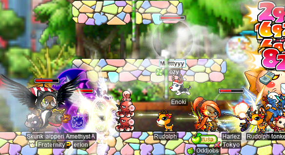

The Scar run that you see pictured above was the result of **Harlez** (**VigiI**) hosting and recruiting three randoms: buccaneer **Matttyyy**, corsair **Snaipperi**, and bowmaster **QuantumA**. And it’s a good thing that I didn’t die in either run, because we had no bishop!! Phewf!!!

Also hosted by Harlez were some [Zakum](https://maplelegends.com/lib/monster?id=8800002) runs. Here’s one set of runs that we did with marksman **Rainsford** (**Pinch**), bishop **SiriusPlaque** (**SmallMight**), shadower **SNES**, and nightlord **Brokeen**:

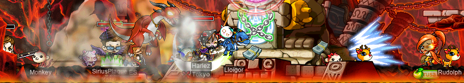

In the second run, Rainsford also played on their (level 200[‼](https://en.wikipedia.org/wiki/Double_factorial)) nightlord **Pinch** to help with attacking.

We also did a very interesting pair of Zakum runs as the following team:

- Me as rusa, my darksterity knight;
- Harlez, shadower;
- SNES, shadower;
- **Sagie**, shadower of **GangGang**;
- **5nortin5peed**, axe hero;
- and **Kiripo**, bishop (who was level 129 at the time).

As you may have noticed, this team is conspicuously lacking “range” of any kind. Furthermore, essentially all of us would be considered “cleave”, with the exception of Kiripo (unless you count [Genesis](https://maplelegends.com/lib/skill?id=2321008) during arms stage to be cleave :)). But we still killed Zak from start to finish in about half an hour, because who needs range??:


[SE](https://maplelegends.com/lib/skill?id=3221002)??? Never heard of it:

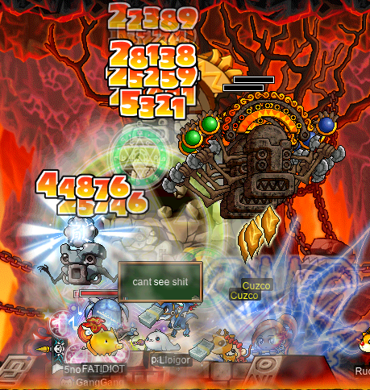

I’ve also never _seen_ it, because we are all standing directly on top of Zakum and [smoke](https://maplelegends.com/lib/skill?id=4221006)’d half the time, so I really can’t see anything other than flashing lights and crumbling rock:

 cant see shit")

Fun times. Oh, and I finished my Zakum card set!!:


I also did a little impromptu single [Krexel](https://maplelegends.com/lib/monster?id=9420521)\* with **xBowtjuhNL**, **Odyssea**, **DrakeSworD**, and first-time Krexeller **Egrofan**:

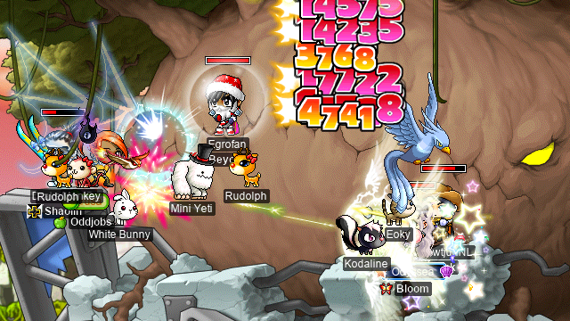

And, finally, I did some of that [Jiaoceng (JC)](https://maplelegends.com/lib/monster?id=9600025) with xBowtjuhNL and Harlez:


We did at least four runs that I can remember, but unfortunately, our very last one was spoiled by running out of time. But hey, it happens.

<details>
<summary>Footnotes for “Big boss”</summary>

\*I’m fond of stealing **LawdHeComin**’s (**AppleBasket**) term for Krexel: _naptime tree_.

</details>

## Smol boss

I also did some less chonky bosses, again mostly on my [darksterity knight](https://oddjobs.codeberg.page/guides/introduction-to-odd-jobs/#dex-warrior) **rusa** (gotta get that [HB](https://maplelegends.com/lib/skill?id=1301007)!). **Harlez** (**VigiI**) &amp; I went on the hunt for some [Sam](https://maplelegends.com/lib/monster?id=9400405)s again:

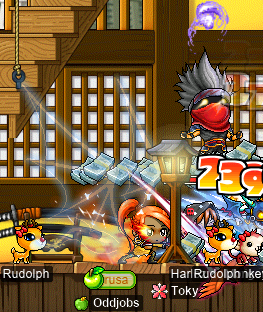

We even managed to pull an [Eye INT 30%](https://maplelegends.com/lib/use?id=2040208) from one of ’em! Score!!

On my [woodsmaster](https://oddjobs.codeberg.page/guides/introduction-to-odd-jobs/#woodswoman) **capreolina**, I did some [Rāvaṇa](https://maplelegends.com/lib/monster?id=9420014) with Harlez and dark knight **DarkCookie** (**SolidState**, **LightCookie**, **Autoimmune**):

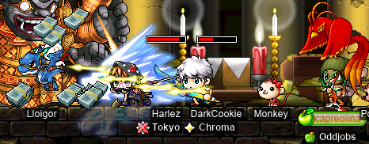

…As well as the usual [Pap](https://maplelegends.com/lib/monster?id=8500001)ping afterwards:

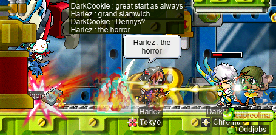

The horror, indeed.

I got Harlez, myself (as rusa), and sniper **Level1Crook** (**Lvl1Crook**, **xXCrookXx**, **Macer**, **Lanius**) together in a party to do some of our own Ravapapping. Level1Crook had the idea to covertly eat an [Onyx Apple](https://maplelegends.com/lib/use?id=2022179) at the beginning of the fight, so that he could pretend, to Harlez, that his Onyx Apple damage was just his normal ([Cider](https://maplelegends.com/lib/use?id=2022002) or whatever) damage. Then, when Harlez commented on it, he would just act casual and say something like “yeah, too bad I never really play this character anymore…”. I even had capreolina [SE](https://maplelegends.com/lib/skill?id=3121002) us on the way in, to ensure juicy &amp; flashy crits. Unfortunately, it didn’t go as planned…:

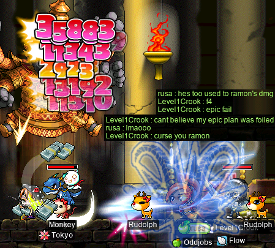

(**xBowtjuhNL** is **Ramon**.)

After that, we decided to go for some [Platyplatpus](https://en.wikipedia.org/wiki/Platypus):

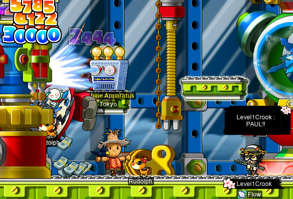

(It’s hard to see Harlez in the image above, although you can see the **Tokyo** guild tag. They’re just behind the [Machine Apparatus](https://maplelegends.com/lib/npc?id=2041025), an amazingly-named NPC that presumably does… nothing. It’s just a machine… apparatus… device… appliance. Thing. You know.)

And, we even convinced Level1Crook to come to Lower Aqua Road and kill some [Pianus](https://maplelegends.com/lib/monster?id=8520000) with us:

")

I’m thrilled to say that rusa is now at the point where I can pretty effortlessly fight (and [zerk](https://maplelegends.com/lib/skill?id=1320006) the whole time, of course) Pianus ([(R)](https://maplelegends.com/lib/monster?id=8510000) and/or [(L)](https://maplelegends.com/lib/monster?id=8520000)) without any real fear, even with someone like Level1Crook attacking the [Bloody Boom](https://maplelegends.com/lib/monster?id=8510100)s at will. Unfortunately for Level1Crook, out Pianus fights used quite a few of their [Safety Charm](https://maplelegends.com/lib/cash?id=5130000)s… getting dispelled by Pianus (R) can be a real pain!

## Suboptimal boss

I promise that this is the final bossing section (of this diary entry…)! And the most important one: bossing with the **Suboptimal** alliance!!

[STRginner](https://oddjobs.codeberg.page/guides/introduction-to-odd-jobs/#permabeginner-outland) **Taima** (**pilk**, **Tacgnol**, **Boymoder**, **Hanyou**, **deerhunter**), sniper **Level1Crook** (**Lvl1Crook**, **xXCrookXx**, **Macer**, **Lanius**), and I (as my [darksterity knight](https://oddjobs.codeberg.page/guides/introduction-to-odd-jobs/#dex-warrior) **rusa**) got together to do our weekly bossing, and were joined by F/P archmage **2sus4u** (**uayua**, **shadowban**, **tb303**) for some [Ravvanner](https://maplelegends.com/lib/monster?id=9420014)s~!:


Although we were unfortunately not joined by 2sus4u for the [Paper Lettuce](https://maplelegends.com/lib/monster?id=8500001) runs that we did, that was maybe a good thing, considering that the three of us (myself included, as you can see) were on [the verge of sleep](https://en.wikipedia.org/wiki/Microsleep) and/or the verge of losing [sanity](https://en.wikipedia.org/wiki/Sanity):


Don’t worry, I only [D](https://en.wikipedia.org/wiki/Deer)[SoD](https://en.wikipedia.org/wiki/Blue_screen_of_death)’d for like six [seconds](https://en.wikipedia.org/wiki/Second)…

And, here’s a screenshot from the same fight, during the chaotic moments of [the second body](https://maplelegends.com/lib/monster?id=8500002):


We also did a lot of [BF](https://maplelegends.com/lib/monster?id=9400575)’ing (bigfooting? bigfeeting? [bogfotting](https://en.wikipedia.org/wiki/Indo-European_ablaut)?), including some easier ones, like this BF that Level1Crook &amp; I (as my [woodsmaster](https://oddjobs.codeberg.page/guides/introduction-to-odd-jobs/#woodswoman) **capreolina**) duoed at [FP](https://maplelegends.com/lib/map?id=610010005):

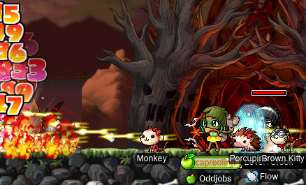

However, not all of the BFs that we killed were so easy. In fact, this one was particularly excruciating:

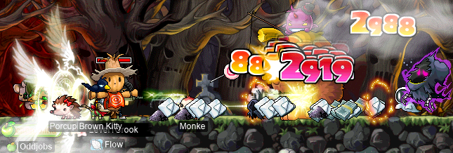

The screenshot above was taken at [Evil Rising](https://maplelegends.com/lib/map?id=610010012), a map that — in addition to being much smaller than the other maps that BF spawns in (with the exception of the somewhat similar [The Evil Dead](https://maplelegends.com/lib/map?id=610010013)\*) — has [Elderwraith](https://maplelegends.com/lib/monster?id=9400580)s and [Jr. Wraith](https://maplelegends.com/lib/monster?id=3230101)s floating all over. Now, Jr. Wraiths are something that we can deal with normally — Jr. Napkins also spawn along the five [TP](https://maplelegends.com/lib/map?id=610010100) maps. Elderwraiths, on the other hand, are chunky: 51[k](https://en.wikipedia.org/wiki/Kilo-) HP and 940 WDEF is no joke. We died a _lot_ of times just attempting to maintain a pin, and after a lot of struggling over the course of probably an hour or so, we did manage to kill this BF in Evil Rising. Now _that’s_ some hard-earned BF EXP!!

On another BF-hunting expedition, we were joined again by 2sus4u, and capre hit level 133~!:

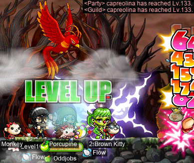

Wowee~ Just one more level until I can swap [Hurricane](https://maplelegends.com/lib/skill?id=3121004) and [Strafe](https://maplelegends.com/lib/skill?id=3111006) on my keybindings!

Getting capre to level 133 actually seemed to have a significant impact on the ability of Level1Crook &amp; I to maintain a pin on that pesky Evil Rising BF. What also helped was that we developed a strategy where I consistently hold Hurricane to pin BF to the left wall, as Level1Crook takes care of anything that might be coming at us from the right side of the map, as necessary:

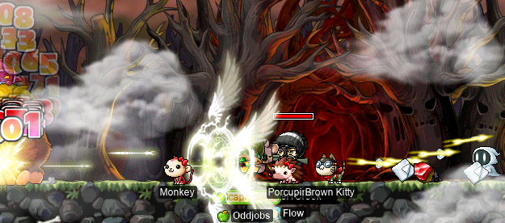

Get rekt, Evil Rising!!!

<details>
<summary>Footnotes for “Suboptimal boss”</summary>

\*Not to be confused with [_The Evil Dead_](https://en.wikipedia.org/wiki/The_Evil_Dead).

</details>

## GM BOOF

That’s right, GM BUFF!!! I duoed some GM buffs, as my [darksterity knight](https://oddjobs.codeberg.page/guides/introduction-to-odd-jobs/#dex-warrior) **rusa**, at þᵉ olde [ſeuende flore of þᵉ ſutram Depoſytorie](https://maplelegends.com/lib/map?id=702070400) with shadower **Harlez** (**VigiI**):

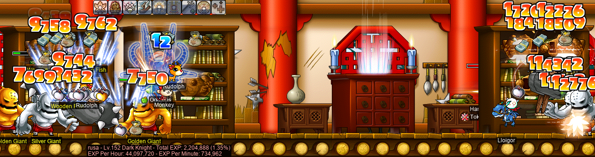

As always when duoing 7F with [HS](https://maplelegends.com/lib/skill?id=2311003), the numbers are bonkers: 44\.1[M](https://en.wikipedia.org/wiki/Mega-) EPH?? Of course, now that rusa is level 153…:


:3

…44\.1M EPH isn’t even that much anymore. A single level is over 172\.8M EXP! Yikes!!

I also caught the GM boofs on some other characters, including my [vicloc](https://codeberg.org/Victoria/resources/src/branch/master/guide.md) [dagger spearwoman](https://oddjobs.codeberg.page/guides/introduction-to-odd-jobs/#dagger-warrior) **d34r**. So I did some training at [TfoG](https://maplelegends.com/lib/map?id=105040306)…

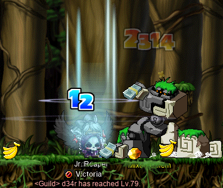

Level 79~! Hehe~&#x7e;

Oh, and don’t forget my vicloc [clericlet](https://oddjobs.codeberg.page/guides/introduction-to-odd-jobs/#magelet) **d33r**! In the previous diary entry, I trained at [B3 \<Subway Depot\>](https://maplelegends.com/lib/map?id=103000909) for the first time, with vicloc cleric **Lanius** (**Level1Crook**, **Lvl1Crook**, **xXCrookXx**, **Macer**). Of course, B3 \<Subway Depot\> may be a wonderful training spot, but it has a catch: you gotta do the entire JQ first. I internally debated whether or not I should even bother attempting the JQ _while on GM buffs_, and decided to not be a coward and just do it:

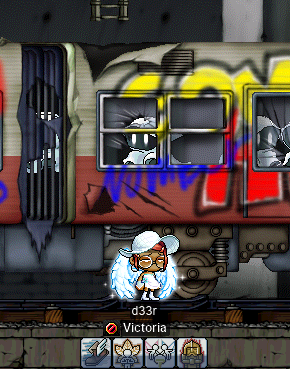

Well, only took me like half an hour or so to do the JQ. That’s not bad, I guess. I’m just glad that I had _any_ buff left by the time that I got to the subway depot!

And there it is, level 58 :)

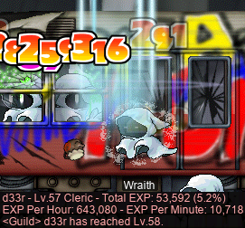

## SiriusPlaque’s level 200 party!

I had the great honour of attending the level 200(!!!) party of bishop **SiriusPlaque** (**SmallMight**), someone whom I originally met at [MPQ](https://maplelegends.com/lib/map?id=261000021) (where he gifted me the [Toy of 101](https://maplelegends.com/lib/equip?id=1402038) that I used for so long), and continued to meet along my journey: at [OPQ](https://maplelegends.com/lib/map?id=200080101), at boss runs (like the [Zakum](https://maplelegends.com/lib/monster?id=8800002) run discussed above!), helping me get an [HTP](https://maplelegends.com/lib/equip?id=1122000) for my [darksterity knight](https://oddjobs.codeberg.page/guides/introduction-to-odd-jobs/#dex-warrior) **rusa**, and even as a reader of this diary! :3

Believe it or not, SiriusPlaque has done hardly any grinding: the way to fourth job was paved almost entirely with quests and PQs, and I take it that the way to level 200 has been a whole lot of bossing, and not so much [5–6F](https://maplelegends.com/lib/map?id=702070300)! As such, it was only appropriate for the level 200 party to be quest-themed, for one of the most dedicated questers of MapleLegends.

First was a little game, where he stripped nakey, and then proceeded to slowly re-clothe himself, one equipment item at a time. Not so much a game of [strip poker](https://en.wikipedia.org/wiki/Strip_game) bizarrely in reverse, rather, the actual object of this game was to divine the name of the NPC that gave him the equipment item in question.


The first player to whisper a correct answer to him would win one [Onyx Apple](https://maplelegends.com/lib/use?id=2022179)! This proved to be a more frustrating game than you might imagine; you can perhaps imagine my frustration when he equipped an equipment item from a quest that I’d done multiple times over, and yet I still had no idea what the NPC name was… But that’s okay! Just like the game that I played for [rusa’s level 150 party](https://www.youtube.com/watch?v=2Wdtmu0D5H4) (q\.v. the previous diary entry), part of the fun is exploiting already-acquired knowledge _in tandem with_ the power of the [WWW](https://en.wikipedia.org/wiki/World_Wide_Web).

I did manage to win just one of the rounds, on a particularly tough equipment item ([Electric Guitar Necklace](https://maplelegends.com/lib/equip?id=1122008)):


[Jer–ry](https://maplelegends.com/lib/npc?id=9330055)! Jer–ry! Jer–ry! You can see that although I did specify “jerry yan”, SiriusPlaque (incorrectly, or loosely) refers to him as “JERRY”, which is actually the name of [the potion shop NPC in Magatia](https://maplelegends.com/lib/npc?id=2110001). Of course, they could be the same person… with a clever disguise…! I did actually get the answer here by consulting pt. lxx of this diary (although Jerry Yan is mentioned by name &amp; image in pt. xxxv), thanks to SiriusPlaque’s hint.

The other equipment items that were part of the game included:

- [Muey Thai String](https://maplelegends.com/lib/equip?id=1002554); awarded by [Jit](https://maplelegends.com/lib/npc?id=9250004). This was deemed too difficult, so it was only used for the example round, before the actual game started. The actual hat used during the game was:
- [Bone Helm](https://maplelegends.com/lib/equip?id=1002006); awarded by [Alfonse Green](https://maplelegends.com/lib/npc?id=2012020).
- [Blue Crystal Earring](https://maplelegends.com/lib/equip?id=1032037); awarded by [Chai](https://maplelegends.com/lib/npc?id=9250012).
- [Pig Illustrated](https://maplelegends.com/lib/equip?id=1322031); awarded by [Utah](https://maplelegends.com/lib/npc?id=1012107).
- [Mechanical Glove](https://maplelegends.com/lib/equip?id=1082222); awarded by [Keeny](https://maplelegends.com/lib/npc?id=2111005).
- [Blue Sauna Robe](https://maplelegends.com/lib/equip?id=1050018); awarded by [Mr. Wetbottom](https://maplelegends.com/lib/npc?id=1061003).
- [Red Musketeer Cape](https://maplelegends.com/lib/equip?id=1102048); awarded by [Muse](https://maplelegends.com/lib/npc?id=2060006).
- [Fonla’s Slippers](https://maplelegends.com/lib/equip?id=1072275); awarded by [Ponlaa](https://maplelegends.com/lib/npc?id=9250000).

(Hopefully, I didn’t forget any…)

With the fun quest equip game over, it was time for SiriusPlaque to Beat MapleStory™ by finally returning [Arwen’s Glass Shoes back to her](https://bbb.hidden-street.net/quest/victoria-island/arwen-and-the-glass-shoes)…


Grats again on the big 2–0–0!!! And grats on being able to finally complete those last two quests: for [Echo of Hero](https://maplelegends.com/lib/skill?id=1005) and [Red Draco](https://maplelegends.com/lib/equip?id=1902002), respectively :)

## (…cnvpstdf…)

<details>
<summary>cnvpstdf</summary>


</details>

---

<details>
<summary>(aperçuspécialnedévoilepas!!!)</summary>

![\[inconnue\]](inconnue.webp "\[inconnue\]")

```text
UklGRiACAABXRUJQVlA4TBQCAAAvMkADAA/juJEkRcrHkP+WLu9ALhwYwbRtJEGG03+TD//Zhj3TtpEEGR48+v0XeMs27Of/DQ7P/5/eRxFEQJVaRii1JbzUQBSiWoRARD0IhFE/BKJHEGcRHJtBaCkGgosQ1UAC6hEcW0MQQhABWoIRgARUEAoiiIAKgRUQwFgfhPglcARU/ANCKUvxCXAUKCDYtq20gVQh7i6k7u6K1Vt+qHs7/1nEkxG8d39E/xW2bdsk3ZN3WEQHu0NMslpp0sEeJDCkc/sWmfbNavSsTbENSPQliBS6Wti8MW2e0s8P93Y6ZNyPIFzsZtk/Ny3bIYX1k4jC+uZRIqLSZouwcZCIBBQ6OKIIT+ilg0ipKSjtr08oYyumLZ1p3U5F7ePRGqdGjk9TUZyOGUiryy1JWT+eVStmtGw70bKlG3J6wnbci5mgi2sXsaqbxpULMGKS0zGX03An59pAMdn+UnDeBS4vxELIo+mEphhenkQXAr4f8vDGtzyRN2TCEDJueLdxZnw/eK1IhBY340YLJeKhha14K4QEpLYmWiuApGYISWvqmSBa0sT4NK2peQGj0YWQe/UBMrS7LdXoeKmhTTe2+M4XT//j2pKqhLLJp2z9WbYREk/ZzPsTkZRJBtXlX0jREvXnLU1Rl778p/7z5X4Aj//cR9t27vEN75DoPvuUwIffC8jEXRF3/PPI+IMv+Rn8y2AG45kJ
```

</details>
