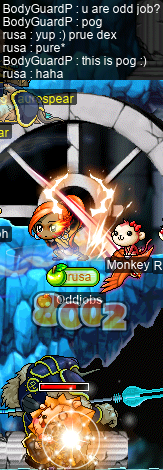
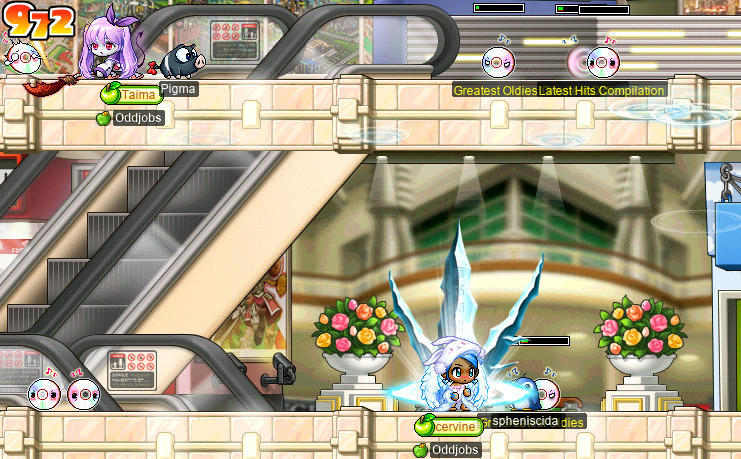

# rangifer’s diary: pt. lxxxiii

It’s time… for the [St. Valentine’s Day](https://en.wikipedia.org/wiki/Valentine%27s_Day)/[Lunar New Year](https://en.wikipedia.org/wiki/Lunar_New_Year) event!!

## Comparing DEX warriors

As I’ve played on my [darksterity knight](https://oddjobs.codeberg.page/guides/introduction-to-odd-jobs/#dex-warrior) **rusa**, I’ve ran into numerous people inquiring about my build, what a “DEX warrior” is exactly, how it compares to an ordinary STR warrior, and so on. And some of these people have even been interested in making a DEX warrior themselves, but don’t know where to start.

Fundamentally, the meaning of “DEX warrior” is as simple as it sounds: a warrior whose base stats look something like 35/𝑥/4/4. But knowing the bare definition doesn’t tell you how DEX warriors compare to their non-odd counterparts, and doesn’t tell you how the three main warrior paths (fighter/crusader/hero, page/white knight/paladin, spear(wo)man/dragon knight/dark knight) compare to each other when made to be pure DEX. Some of the basic characteristics of DEX warriors are already explained by [the “DEX warrior” entry in the _Introduction To Odd Jobs_](https://oddjobs.codeberg.page/guides/introduction-to-odd-jobs/#dex-warrior):

- Incredibly high accuracy (WACC).
- Very stable damage output.
- Low damage output in comparison to their non-odd counterparts.
- Much more AVOID than their non-odd counterparts.
- Easily capable of wielding the [Stonetooth Sword](https://maplelegends.com/lib/equip?id=1402037) and other similar equipment items.
- Unusual equipment choices.

To this list of attributes, I would also add that DEX warriors are ancient enough, as a job, that I would consider them — in my own mind, at least — to be a “classic” odd job.

When it comes to the nitty-gritty details of DPM calculation, though, I usually just use my knowledge of MapleStory damage calculation to give a simplified overview:

- I (as rusa, a DEX DK) do something like 3–4 times less damage than a perfectly ordinary DK of the same level, depending on the WDEF of my foe(s), minor differences in gear, etc.
- The situation for DEX DKs in particular is less optimistic than it is for DEX crusaders/heroes and DEX white knights/paladins. This is largely due to two factors:
    - DKs rely more heavily on their PSM\* than heroes and paladins do. [Spear Crusher](https://maplelegends.com/lib/skill?id=1311001) and [Dragon Fury: Polearm](https://maplelegends.com/lib/skill?id=1311004) always have a PSM of 5\.0. On the other hand, heroes and pallies never achieve such a high PSM:

      | type  | handedness | [𝐄](https://en.wikipedia.org/wiki/Expected_value)\[PSM\]† |
      | :---- | ---------: | --------------------------------------------------------: |
      | sword |          1 |                                                     4\.00 |
      | sword |          2 |                                                     4\.60 |
      | BW    |          1 |                                                     3\.92 |
      | BW    |          2 |                                                     4\.24 |
      | axe   |          1 |                                                     3\.92 |
      | axe   |          2 |                                                     4\.24 |

      This situation intensifies quite a bit during fourth job, as the DK’s [Beholder](https://maplelegends.com/lib/skill?id=1321007) passively grants them extra mastery, and thus they have 80% mastery, instead of the hero’s/paladin’s 60%.

      The issue with relying on a large PSM is obvious: DEX warriors are defined by their reliance on their secondary stat, not on their primary stat! So the DEX DK suffers comparatively more from their class being designed around the assumption of warriors being pure — or almost pure — STR.
    - DKs rely much more heavily on post-WDEF damage modifiers than heroes and paladins do. During third job, the DK gets fancy new attacks (Crusher, Fury) with big damage multis (510% and 250%, respectively), while saders and WKs are stuck with the same old [Power Strike](https://maplelegends.com/lib/skill?id=1001004) (260%) and [Slash Blast](https://maplelegends.com/lib/skill?id=1001005) (130%). The source of the sader’s and WK’s new third-job damage is pre-WDEF multipliers: [Combo Attack](https://maplelegends.com/lib/skill?id=1111002), and elemental charges (e\.g. [Fire Charge](https://maplelegends.com/lib/skill?id=1211003)), respectively. The story in fourth job is similar: although heroes and pallies do finally get their fancy new attacks (and DKs get no more), heroes still rely on augmenting their pre-WDEF multipliers with [ACA](https://maplelegends.com/lib/skill?id=1120003), and pallies get [Holy Charge](https://maplelegends.com/lib/skill?id=1221003) (in addition to their other charges) and the holy wildcard known as [Heaven’s Hammer](https://maplelegends.com/lib/skill?id=1221011). Meanwhile, the DK essentially just gets [Berserk](https://maplelegends.com/lib/skill?id=1320006), which is bizarrely an _aftermodifier_ (meaning it’s not just post-WDEF, but also post-damage-multi), not a pre-WDEF modifier like you would expect based on how (A)CA and elemental charges work.

      Because pre-WDEF multipliers are factored in before WDEF is even taken into account, they effectively act like multipliers that act _directly on your raw damage range_. Although this is a powerful mechanism in general, it’s _especially_ important for a job like DEX warrior, because having a small raw damage range is the barrier to them dealing Big Damage™. It may not seem like much (if I had to guess, most MapleStory players are probably oblivious to WDEF, or are at least unaware of how exactly it impacts their damage numbers), but for those with small raw damage ranges, the WDEF of their foe(s) matters quite a bit, and it wastes considerable chunks of their damage output.

I’ve gone into some detail to actually _justify_ the assertions that I’m making with my “simplified overview”. The actual important assertions here are that rusa does about 3–4 times less damage than a non-odd DK of the same level, and that DEX DKs are clearly “the worst” in terms of sheer DPM, when compared to DEX heroes and DEX pallies — due in large part to considerations that are specific to DEX warriors.

This is some nice theory and all that, but I want to see the results! Show me the juicy numbers!! In a vain attempt to sate our (read: my) insatiable desire for “big number go boom!”, I want to use rusa as a theoretical model by which we can estimate how much sustained single-target DPM DEX warriors are capable of. But first, the usual disclaimer:

&#x26a0;&#xfe0f;&nbsp;**BEGIN DISCLAIMER**&nbsp;&#x26a0;&#xfe0f;

The figures discussed here relate _only_ to theoretical, sustained, single-target DPM. Needless to say, this is _not at all_ the same thing as evaluating each job as a whole. Entire topics of consideration, and untold amounts of nuance, have been discarded here in favour of a streamlined &amp; simplistic theoretical comparison. Also, this comparison only considers mature fourth-jobbed characters.

&#x26a0;&#xfe0f;&nbsp;**END DISCLAIMER**&nbsp;&#x26a0;&#xfe0f;

With that out of the way, we need to get into the weeds about rusa’s exact build, in order to make her into a theoretical model. To make things easy and fairly realistic, I’m going to be using rusa’s exact equipment at the time of writing (including event equipment), and her exact character level at the time of writing.

Footnotes for “Comparing DEX warriors”

\***P**rimary **S**tat **M**ultiplier. This is the [coefficient](https://en.wikipedia.org/wiki/Coefficient) by which your primary stat (in our case, this is always STR, but in general, it could be another stat) is directly multiplied, for the purpose of damage calculation. This is effectively the only thing that distinguishes primary stats from secondary stats; your “SSM” (**S**econdary **S**tat **M**ultiplier) is always [unity](https://en.wikipedia.org/wiki/1), so we don’t actually need a name for it at all.

†This expectation assumes that the [attack animates](https://forum.maplelegends.com/index.php?threads/attack-animation-probabilities.36648/) like a basic-attack. This is a detail that doesn’t matter for now; suffice it to say that you can’t actually do better than 4\.60 here.

### The original model (rusa, the DEX DK version)

#### AP (base)

- **STR:** 35.
- **DEX:** 762.
- **INT:** 4.
- **LUK:** 4.

#### Equipment

Irrelevant stats are not listed.

- **Head:** [Ravana Helmet](https://maplelegends.com/lib/equip?id=1003068).
    - **STR:** 20.
    - **DEX:** 28.
- **Face:** [Rudolph’s Red Nose](https://maplelegends.com/lib/equip?id=1012015).
    - **WATK:** 1.
- **Eye:** [Spectrum Goggles](https://maplelegends.com/lib/equip?id=1022082).
    - **STR:** 3.
- **Ear:** [Glittering Altaire Earrings](https://maplelegends.com/lib/equip?id=1032061).
    - **STR:** 2.
    - **DEX:** 8.
- **Mantle:** [Crimsonheart Cloak](https://maplelegends.com/lib/equip?id=1102205).
    - **STR:** 19.
    - **DEX:** 5.
- **Frame:** [Bathrobe for Women](https://maplelegends.com/lib/equip?id=1051098).
    - **STR:** 22.
- **Neck:** [Horntail Necklace](https://maplelegends.com/lib/equip?id=1122000).
    - **STR:** 23.
    - **DEX:** 21.
- **Neck (NX):** Burning Snowflake Pendant.
    - **STR:** 8.
    - **DEX:** 6.
- **Dominant arm:** [Sky Ski](https://maplelegends.com/lib/equip?id=1432018).
    - **WATK:** 119.
    - **STR:** 12.
- **Hand:** [Yellow Marker](https://maplelegends.com/lib/equip?id=1082179).
    - **WATK:** 14.
- **Foot:** [Green Christmas Sock](https://maplelegends.com/lib/equip?id=1072428).
    - **STR:** 5.
    - **DEX:** 5.
- **Finger 0:** [Ellin Savior’s Ring](https://maplelegends.com/lib/equip?id=1119001).
    - **STR:** 1.
    - **DEX:** 1.
- **Finger 1:** [Ring of Passion](https://maplelegends.com/lib/equip?id=1112962).
    - **STR:** 3.
    - **DEX:** 3.
- **Finger 2:** [Zombie Army Ring](https://maplelegends.com/lib/equip?id=1112920).
    - **STR:** 4.
    - **DEX:** 4.
- **Finger 3:** [Monster Book Ring \<Tier 3\>](https://maplelegends.com/lib/equip?id=1119005).
    - **STR:** 3.
    - **DEX:** 3.

Relevant stats after equipment:

- **WATK:** 134.
- **STR:** 160 (35+125).
- **DEX:** 846 (762+84).

### The other models (rusa, the DEX hero and DEXadin versions)

For obvious reasons, most of the skeletal model can stay the same for the hero and paladin versions, with one notable exception: what the model is holding. These models will not be using Sky Skis, but instead will be split out into five models:

- **Hero 0:**
    - [Stonetooth Sword](https://maplelegends.com/lib/equip?id=1402037).
        - **WATK:** 126.
        - **STR:** 12.
- **Hero 1:**
    - [Lunch box (Lv 120)](https://maplelegends.com/lib/equip?id=1302101).
        - **WATK:** 134.
        - **STR:** 12.
    - [Maple Shield](https://maplelegends.com/lib/equip?id=1092030).
        - **WATK:** 18.
        - **STR:** 9.
- **Paladin 0:**
    - Stonetooth Sword.
        - **WATK:** 126.
        - **STR:** 12.
- **Paladin 1:**
    - Lunch box (Lv 120).
        - **WATK:** 134.
        - **STR:** 12.
    - Maple Shield.
        - **WATK:** 18.
        - **STR:** 9.
- **Paladin 2:**
    - [Duck tube](https://maplelegends.com/lib/equip?id=1322064).
        - **WATK:** 115.
        - **STR:** 12.
    - Maple Shield.
        - **WATK:** 18.
        - **STR:** 9.

Obviously, our six models (including the DK) are not all equally realistic. In particular, Hero 1 and Paladin 1 are using Lunch boxes, which technically exist in MapleLegends, but have not been available for a very long time, and are untradeable (and OoaK). But I want to see what these builds would look like if Lunch boxes were A Real Thing™, and I’ve constrained all weapons to be scrolled identically.

Axes are not represented, as the only two reasonable options are [Maple Steel Axe](https://maplelegends.com/lib/equip?id=1312032) and [Maple Demon Axe](https://maplelegends.com/lib/equip?id=1412027), which are both level 64.

The shield that I actually have in-game is a 15 WATK, 8 STR [Stolen Fence](https://maplelegends.com/lib/equip?id=1092003), but I figured that it’s more fair to make the shields beefier, to match the weapons.

### Skills

#### DK

The DK will be spamming maxed [Spear Crusher](https://maplelegends.com/lib/skill?id=1311001) while [Spear Booster](https://maplelegends.com/lib/skill?id=1301004) and maxed [Berserk](https://maplelegends.com/lib/skill?id=1320006) are active. They will have maxed [Spear Mastery](https://maplelegends.com/lib/skill?id=1300000) and maxed [Beholder](https://maplelegends.com/lib/skill?id=1321007).

#### Hero

The hero will be spamming maxed [Brandish](https://maplelegends.com/lib/skill?id=1121008) while maxed [ACA](https://maplelegends.com/lib/skill?id=1120003) is active with a combo counter of ten (ten orbs). They will have [Sword Booster](https://maplelegends.com/lib/skill?id=1101004) active. They will have maxed [Sword Mastery](https://maplelegends.com/lib/skill?id=1100000).

#### Paladin

The paladin will mostly be spamming maxed [Blast](https://maplelegends.com/lib/skill?id=1221009) while their elemental charge of choice is active (and maxed). Whenever [Heaven’s Hammer](https://maplelegends.com/lib/skill?id=1221011) (which we assume that they have maxed as well) is off cooldown, they will use it.\* They have the relevant booster ([sword](https://maplelegends.com/lib/skill?id=1201004) or [BW](https://maplelegends.com/lib/skill?id=1201005)) active, and the relevant mastery ([sword](https://maplelegends.com/lib/skill?id=1200000) or [BW](https://maplelegends.com/lib/skill?id=1200001)) maxed.

Footnotes for “Paladin”

\*This will later turn out to not actually be true; see “Heaven’s Hammer” below.

### Buffs

Besides the buffs that these models are already casting upon themselves naturally, we’ll consider a few different combinations of external buffs:

- [MW](https://maplelegends.com/lib/skill?id=1121000)10 &amp; [Cider](https://maplelegends.com/lib/use?id=2022002).
- MW10 &amp; Cider &amp; [SI](https://maplelegends.com/lib/skill?id=5121009).
- MW10 &amp; Cider &amp; [SE](https://maplelegends.com/lib/skill?id=3121002).
- MW10 &amp; [Onyx Apple](https://maplelegends.com/lib/use?id=2022179).

### Enemy models

The enemies are all assumed to be the same level as the [PC](https://en.wikipedia.org/wiki/Player_character)s, but differ in their WDEF values and in their elemental interactions.

The differences in elemental interactions only matters for the paladin models. For simplicity, we only consider two possibilities:

- The paladin is using [Holy Charge](https://maplelegends.com/lib/skill?id=1221003) (or [Divine Charge](https://maplelegends.com/lib/skill?id=1221004), respectively) against an enemy that is neutral to all elements.
- The paladin is using [Fire Charge](https://maplelegends.com/lib/skill?id=1211003) (or [Flame Charge](https://maplelegends.com/lib/skill?id=1211004), respectively) against an enemy that is weak to fire.

We consider the following possibilities for WDEF values:

- 0 WDEF ([Orange Mushroom](https://maplelegends.com/lib/monster?id=1210102)).
- 1&numsp;150 WDEF ([Ravana](https://maplelegends.com/lib/monster?id=9420014), halfway between the [second](https://maplelegends.com/lib/monster?id=8800001) and [third](https://maplelegends.com/lib/monster?id=8800002) bodies of Zakum, etc.).
- 3&numsp;000 WDEF ([Anego](https://maplelegends.com/lib/monster?id=9400121), etc.).

There are certainly monsters (including bosses, which is mostly what we’re after here) with WDEF values in excess of 3&numsp;000; for example, [Kacchuu Musha](https://maplelegends.com/lib/monster?id=9400405) has 3&numsp;200, [Bodyguard A](https://maplelegends.com/lib/monster?id=9400112) has 3&numsp;600, [The Boss](https://maplelegends.com/lib/monster?id=9400300) has 5&numsp;000, etc. But we’re not going to go that far for the purpose of this analysis.

### The calculations

As you can see, although I’ve kept things relatively simple and streamlined so far, this is going to be _a lot_ of numbers. Even with something as simplistic and one-dimensional as this, there is still a lot of nuance left over. But hopefully, we can find some trends in the data that can further simplify things. But first… we need the data.

I’ll be using [my damage calculator](https://oddjobs.codeberg.page/dmg-calc/) to help crunch this veritable mountain of numbers.

#### Heaven’s Hammer

First, we must address the elephant in the room: [HH](https://maplelegends.com/lib/skill?id=1221011). HH makes things slightly more complicated here for two reasons:

1. Because of HH, the paladin models are the only models that don’t just spam one skill over and over. This makes the damage calculation slightly more delicate.
2. HH is, bizarrely, the only attacking skill in the game (that I know of) that doesn’t do any damage calculation on the [client side](https://en.wikipedia.org/wiki/Client%E2%80%93server_model) (or at the very least, doesn’t show it visually). This means that it’s up to the server to do whatever it wants, and historically, no one seems to agree in the slightest about how HH should deal damage. The skill description suggests that its damage should scale up with skill level, culminating at 900% damage at max level. Thus, it may be a perfectly ordinary skill that happens to have a damage multiplier of 900%, a cooldown, and no client-side damage calculation.

   However, this is not how MapleLegends has interpreted it, and ML has itself made numerous changes to HH over the years. I will be using _the current (at the time of writing) MapleLegends version of HH_, which deals exactly 50[k](https://en.wikipedia.org/wiki/Kilo-) to bosses, and has a cooldown of 15 seconds at max level. I won’t be considering the amount of damage that it deals to non-boss monsters, as this is a theoretical comparison of _sustained_ single-target DPM.

Blast has an attack [period](https://en.wikipedia.org/wiki/Frequency#Period_versus_frequency) of 690 [ms](https://en.wikipedia.org/wiki/Millisecond) with a speed 3 weapon, and 630 ms with a speed 2 weapon. As a result, a paladin who spams Blast with the exception of using HH any time that it’s not on cooldown will be Blasting 22 times in a row after each HH when using a speed 3 weapon, and 24 times in a row when using a speed 2 weapon.

But after doing some Scientific Research™ (a\.k\.a. asking Linny how tf paladins work), it seems that the attack period of HH is about double the attack period of Blasting with a speed 3 weapon. This would put the attack period of (ML’s version of) HH at around &ap;1&numsp;380 ms, and as it turns out, this means that 50k damage is not enough damage for the DEXadin to justify using HH against a single target (yes, even as a DEX warrior). So actually, our paladin models will simply be spamming Blast…

This should serve as yet another reminder of how limited this kind of analysis is.

#### The DK

| buffs                     |        WDEF |                   DPM |
| :------------------------ | ----------: | --------------------: |
| MW10 &amp; Cider          |           0 | 1&numsp;597&numsp;356 |
| MW10 &amp; Cider &amp; SI |           0 | 1&numsp;834&numsp;002 |
| MW10 &amp; Cider &amp; SE |           0 | 1&numsp;794&numsp;689 |
| MW10 &amp; Onyx Apple     |           0 | 2&numsp;427&numsp;202 |
| MW10 &amp; Cider          | 1&numsp;150 | 1&numsp;181&numsp;130 |
| MW10 &amp; Cider &amp; SI | 1&numsp;150 | 1&numsp;356&numsp;113 |
| MW10 &amp; Cider &amp; SE | 1&numsp;150 | 1&numsp;327&numsp;047 |
| MW10 &amp; Onyx Apple     | 1&numsp;150 | 2&numsp;010&numsp;976 |
| MW10 &amp; Cider          | 3&numsp;000 |         511&numsp;550 |
| MW10 &amp; Cider &amp; SI | 3&numsp;000 |         587&numsp;335 |
| MW10 &amp; Cider &amp; SE | 3&numsp;000 |         574&numsp;753 |
| MW10 &amp; Onyx Apple     | 3&numsp;000 | 1&numsp;341&numsp;395 |

Wow, what a difference WDEF makes! The difference between a Cider and an Onyx Apple seems to be considerably less than the difference between 0 WDEF and 3k WDEF!

#### Hero 0 (Stonetooth)

| buffs                     |        WDEF |                   DPM |
| :------------------------ | ----------: | --------------------: |
| MW10 &amp; Rage           |           0 | 3&numsp;070&numsp;151 |
| MW10 &amp; Rage &amp; SI  |           0 | 3&numsp;362&numsp;546 |
| MW10 &amp; Rage &amp; SE  |           0 | 3&numsp;318&numsp;132 |
| MW10 &amp; Onyx Apple     |           0 | 4&numsp;595&numsp;735 |
| MW10 &amp; Rage           | 1&numsp;150 | 2&numsp;784&numsp;151 |
| MW10 &amp; Rage &amp; SI  | 1&numsp;150 | 3&numsp;049&numsp;308 |
| MW10 &amp; Rage &amp; SE  | 1&numsp;150 | 3&numsp;009&numsp;032 |
| MW10 &amp; Onyx Apple     | 1&numsp;150 | 4&numsp;309&numsp;735 |
| MW10 &amp; Rage           | 3&numsp;000 | 2&numsp;324&numsp;064 |
| MW10 &amp; Rage &amp; SI  | 3&numsp;000 | 2&numsp;545&numsp;403 |
| MW10 &amp; Rage &amp; SE  | 3&numsp;000 | 2&numsp;511&numsp;784 |
| MW10 &amp; Onyx Apple     | 3&numsp;000 | 3&numsp;849&numsp;648 |

We can see how much of a difference pre-WDEF multipliers make already: the hero is suffering quite a bit less from WDEF increases.

#### Hero 1 (Lunch box)

| buffs                     |        WDEF |                   DPM |
| :------------------------ | ----------: | --------------------: |
| MW10 &amp; Rage           |           0 | 3&numsp;780&numsp;263 |
| MW10 &amp; Rage &amp; SI  |           0 | 3&numsp;780&numsp;263 |
| MW10 &amp; Rage &amp; SE  |           0 | 4&numsp;085&numsp;599 |
| MW10 &amp; Onyx Apple     |           0 | 5&numsp;397&numsp;528 |
| MW10 &amp; Rage           | 1&numsp;150 | 3&numsp;467&numsp;024 |
| MW10 &amp; Rage &amp; SI  | 1&numsp;150 | 3&numsp;467&numsp;024 |
| MW10 &amp; Rage &amp; SE  | 1&numsp;150 | 3&numsp;747&numsp;061 |
| MW10 &amp; Onyx Apple     | 1&numsp;150 | 5&numsp;084&numsp;290 |
| MW10 &amp; Rage           | 3&numsp;000 | 2&numsp;963&numsp;120 |
| MW10 &amp; Rage &amp; SI  | 3&numsp;000 | 2&numsp;963&numsp;120 |
| MW10 &amp; Rage &amp; SE  | 3&numsp;000 | 3&numsp;202&numsp;456 |
| MW10 &amp; Onyx Apple     | 3&numsp;000 | 4&numsp;580&numsp;385 |

#### Paladin 0 (Stonetooth)

In the “charge” column, “holy” means using [Holy Charge](https://maplelegends.com/lib/skill?id=1221003) (or [Divine Charge](https://maplelegends.com/lib/skill?id=1221004), respectively) against an enemy that is neutral to all elements, and “fire” means  using [Fire Charge](https://maplelegends.com/lib/skill?id=1211003) (or [Flame Charge](https://maplelegends.com/lib/skill?id=1211004), respectively) against an enemy that is weak to fire.

| buffs                     |        WDEF | charge |                   DPM |
| :------------------------ | ----------: | :----- | --------------------: |
| MW10 &amp; Cider          |           0 | holy   | 3&numsp;242&numsp;847 |
| MW10 &amp; Cider &amp; SI |           0 | holy   | 3&numsp;551&numsp;690 |
| MW10 &amp; Cider &amp; SE |           0 | holy   | 3&numsp;356&numsp;348 |
| MW10 &amp; Onyx Apple     |           0 | holy   | 4&numsp;854&numsp;221 |
| MW10 &amp; Cider          | 1&numsp;150 | holy   | 2&numsp;912&numsp;847 |
| MW10 &amp; Cider &amp; SI | 1&numsp;150 | holy   | 3&numsp;190&numsp;261 |
| MW10 &amp; Cider &amp; SE | 1&numsp;150 | holy   | 3&numsp;014&numsp;798 |
| MW10 &amp; Onyx Apple     | 1&numsp;150 | holy   | 4&numsp;524&numsp;221 |
| MW10 &amp; Cider          | 3&numsp;000 | holy   | 2&numsp;381&numsp;977 |
| MW10 &amp; Cider &amp; SI | 3&numsp;000 | holy   | 2&numsp;608&numsp;832 |
| MW10 &amp; Cider &amp; SE | 3&numsp;000 | holy   | 2&numsp;465&numsp;348 |
| MW10 &amp; Onyx Apple     | 3&numsp;000 | holy   | 3&numsp;993&numsp;352 |
| MW10 &amp; Cider          |           0 | fire   | 5&numsp;873&numsp;040 |
| MW10 &amp; Cider &amp; SI |           0 | fire   | 6&numsp;432&numsp;377 |
| MW10 &amp; Cider &amp; SE |           0 | fire   | 6&numsp;078&numsp;598 |
| MW10 &amp; Onyx Apple     |           0 | fire   | 8&numsp;791&numsp;342 |
| MW10 &amp; Cider          | 1&numsp;150 | fire   | 5&numsp;543&numsp;040 |
| MW10 &amp; Cider &amp; SI | 1&numsp;150 | fire   | 6&numsp;070&numsp;948 |
| MW10 &amp; Cider &amp; SE | 1&numsp;150 | fire   | 5&numsp;737&numsp;048 |
| MW10 &amp; Onyx Apple     | 1&numsp;150 | fire   | 8&numsp;461&numsp;342 |
| MW10 &amp; Cider          | 3&numsp;000 | fire   | 5&numsp;012&numsp;170 |
| MW10 &amp; Cider &amp; SI | 3&numsp;000 | fire   | 5&numsp;489&numsp;520 |
| MW10 &amp; Cider &amp; SE | 3&numsp;000 | fire   | 5&numsp;187&numsp;598 |
| MW10 &amp; Onyx Apple     | 3&numsp;000 | fire   | 7&numsp;930&numsp;472 |

Oh my… Elemental weakness is a real huge deal…

#### Paladin 1 (Lunch box)

| buffs                     |        WDEF | charge |                    DPM |
| :------------------------ | ----------: | :----- | ---------------------: |
| MW10 &amp; Cider          |           0 | holy   |  3&numsp;991&numsp;472 |
| MW10 &amp; Cider &amp; SI |           0 | holy   |  3&numsp;991&numsp;472 |
| MW10 &amp; Cider &amp; SE |           0 | holy   |  4&numsp;131&numsp;175 |
| MW10 &amp; Onyx Apple     |           0 | holy   |  5&numsp;699&numsp;074 |
| MW10 &amp; Cider          | 1&numsp;150 | holy   |  3&numsp;630&numsp;044 |
| MW10 &amp; Cider &amp; SI | 1&numsp;150 | holy   |  3&numsp;630&numsp;044 |
| MW10 &amp; Cider &amp; SE | 1&numsp;150 | holy   |  3&numsp;757&numsp;097 |
| MW10 &amp; Onyx Apple     | 1&numsp;150 | holy   |  5&numsp;337&numsp;646 |
| MW10 &amp; Cider          | 3&numsp;000 | holy   |  3&numsp;048&numsp;615 |
| MW10 &amp; Cider &amp; SI | 3&numsp;000 | holy   |  3&numsp;048&numsp;615 |
| MW10 &amp; Cider &amp; SE | 3&numsp;000 | holy   |  3&numsp;155&numsp;318 |
| MW10 &amp; Onyx Apple     | 3&numsp;000 | holy   |  4&numsp;756&numsp;217 |
| MW10 &amp; Cider          |           0 | fire   |  7&numsp;227&numsp;568 |
| MW10 &amp; Cider &amp; SI |           0 | fire   |  7&numsp;227&numsp;568 |
| MW10 &amp; Cider &amp; SE |           0 | fire   |  7&numsp;480&numsp;534 |
| MW10 &amp; Onyx Apple     |           0 | fire   | 10&numsp;319&numsp;596 |
| MW10 &amp; Cider          | 1&numsp;150 | fire   |  6&numsp;866&numsp;139 |
| MW10 &amp; Cider &amp; SI | 1&numsp;150 | fire   |  6&numsp;866&numsp;139 |
| MW10 &amp; Cider &amp; SE | 1&numsp;150 | fire   |  7&numsp;106&numsp;456 |
| MW10 &amp; Onyx Apple     | 1&numsp;150 | fire   |  9&numsp;958&numsp;167 |
| MW10 &amp; Cider          | 3&numsp;000 | fire   |  6&numsp;284&numsp;711 |
| MW10 &amp; Cider &amp; SI | 3&numsp;000 | fire   |  6&numsp;284&numsp;711 |
| MW10 &amp; Cider &amp; SE | 3&numsp;000 | fire   |  6&numsp;504&numsp;677 |
| MW10 &amp; Onyx Apple     | 3&numsp;000 | fire   |  9&numsp;376&numsp;739 |

_Sheeesh!_ Our lunchbox pally managed to break the 10[M](https://en.wikipedia.org/wiki/Mega-) EPM threshold with an apple and a fire-weak opponent with low WDEF…!

#### Paladin 2 (Duck tube)

| buffs                     |        WDEF | charge |                   DPM |
| :------------------------ | ----------: | :----- | --------------------: |
| MW10 &amp; Cider          |           0 | holy   | 3&numsp;214&numsp;951 |
| MW10 &amp; Cider &amp; SI |           0 | holy   | 3&numsp;521&numsp;137 |
| MW10 &amp; Cider &amp; SE |           0 | holy   | 3&numsp;327&numsp;476 |
| MW10 &amp; Onyx Apple     |           0 | holy   | 4&numsp;745&numsp;901 |
| MW10 &amp; Cider          | 1&numsp;150 | holy   | 2&numsp;884&numsp;951 |
| MW10 &amp; Cider &amp; SI | 1&numsp;150 | holy   | 3&numsp;159&numsp;708 |
| MW10 &amp; Cider &amp; SE | 1&numsp;150 | holy   | 2&numsp;985&numsp;926 |
| MW10 &amp; Onyx Apple     | 1&numsp;150 | holy   | 4&numsp;415&numsp;901 |
| MW10 &amp; Cider          | 3&numsp;000 | holy   | 2&numsp;354&numsp;081 |
| MW10 &amp; Cider &amp; SI | 3&numsp;000 | holy   | 2&numsp;578&numsp;280 |
| MW10 &amp; Cider &amp; SE | 3&numsp;000 | holy   | 2&numsp;436&numsp;476 |
| MW10 &amp; Onyx Apple     | 3&numsp;000 | holy   | 3&numsp;885&numsp;031 |
| MW10 &amp; Cider          |           0 | fire   | 5&numsp;773&numsp;846 |
| MW10 &amp; Cider &amp; SI |           0 | fire   | 6&numsp;323&numsp;736 |
| MW10 &amp; Cider &amp; SE |           0 | fire   | 5&numsp;975&numsp;932 |
| MW10 &amp; Onyx Apple     |           0 | fire   | 8&numsp;523&numsp;317 |
| MW10 &amp; Cider          | 1&numsp;150 | fire   | 5&numsp;443&numsp;846 |
| MW10 &amp; Cider &amp; SI | 1&numsp;150 | fire   | 5&numsp;962&numsp;308 |
| MW10 &amp; Cider &amp; SE | 1&numsp;150 | fire   | 5&numsp;634&numsp;382 |
| MW10 &amp; Onyx Apple     | 1&numsp;150 | fire   | 8&numsp;193&numsp;317 |
| MW10 &amp; Cider          | 3&numsp;000 | fire   | 4&numsp;912&numsp;976 |
| MW10 &amp; Cider &amp; SI | 3&numsp;000 | fire   | 5&numsp;380&numsp;879 |
| MW10 &amp; Cider &amp; SE | 3&numsp;000 | fire   | 5&numsp;084&numsp;932 |
| MW10 &amp; Onyx Apple     | 3&numsp;000 | fire   | 7&numsp;662&numsp;448 |

### What did we learn?

I forgot to subtract 100 from the WDEF values (due to [Threaten](https://maplelegends.com/lib/skill?id=1201006)) in the calculations for the paladin models. Oops. Arguably, the way that I did it here is reasonable insofar as it doesn’t make the assumption that the heroes and DKs will never benefit from Threaten; obviously, this assumption could be violated if they happen to be partying with a page/WK/pally. But really, I just forgot, and can’t be arsed to fix it. The paladin already looks the strongest in this analysis anyways, so factoring Threaten in would only make them eclipse the other models even more!

The Lunch box is clearly completely broken (in a good way), so it makes sense that it’s a fantasy weapon here. Its sole real weakness is that it’s the only weapon considered here that does not benefit _at all_ from SI. With a Lunch box, you really can have it all: more damage, and a place to put your lunch so that you can picnic on the battlefield.

The Duck tube is — perhaps surprisingly — ­very strong. In this analysis, it does trail behind the Stonetooth Sword, but only barely; and the Duck tube can make up for this by being cheaper to make (although that is somewhat offset by the price of a good WATK shield). Given this price advantage, and given the defensive superiority of the Duck tube (it comes with AVOID and lets you wear a shield), the Duck tube is perhaps the most practical choice for DEXadins (duckadins?). Do note, however, that the Stonetooth has a slight advantage with larger WATK buffs, as the Duck tube is mostly relying on higher WATK (due to the WATK shield) to compete with the Stonetooth. When comparing Cider to Onyx Apple in this analysis, the relative improvement of Onyx Apple over Cider is about &ap;1\.47% or so higher for Paladin 0 (Stonetooth) than it is for Paladin 2 (Duck tube).

Elemental weaknesses are very powerful for paladins, and probably even more ridiculously powerful for DEXadins. Against a foe that is weak to their elemental charge, the DEXadin’s pre-WDEF damage range is _so_ large that the usual effect — wherein the DEX warrior is constantly fighting to get as much of their damage range “peeking out” above their foe’s WDEF as possible — all but disappears.

As expected, the DK model suffers horribly from WDEF, in a way that the other models simply do not. As noted above, the difference between a Cider and an Onyx Apple seems to be considerably less than the difference between 0 WDEF and 3k WDEF.

Also as expected (due to the same effect existing with non-odd fourth job warriors as well), the DK model benefits the most from SE, and also benefits the most from SI. The large benefit from SE is because the DK’s attacks most closely fit the pattern that benefits from SE the most: lots of lines, each with smaller damage multipliers (as opposed to fewer lines, each with larger damage multipliers). And as for SI, the DK model is the only one using a speed ≥6 weapon. The ≥6 threshold is significant because 2 is the smallest (read: fastest) possible speed value, and both booster and SI each subtract 2 from weapon speed values (and they stack with each other). For example, when comparing the DK model with Hero 0 (Stonetooth), the hero’s DPM increases by a factor of &ap;1\.095 due to SI, whereas the DK’s DPM increases by a factor of &ap;1\.148 under the same circumstances.

With respect to what this analysis is measuring (viz. theoretical sustained single-target DPM), the winners are clear: the paladin emerges victorious (even more so when taking into account elementally weak enemies), the hero comes in a respectably close second, and the DK is just painfully bad in comparison. Note that even talking still in terms of sustained DPM, the “single-target” specifier is very important; the attacks used here hit up to three monsters at once (whence “cleave”), with the exception of the paladin’s attack (Blast), which only hits up to one monster at a time. When cleaving, the hero looks even more favourable (benefiting from Brandish hitting up to three monsters at once), and the Paladin’s HH (benefiting from hitting up to 15 monsters at once, and from ignoring the DEXadin’s wonky stats) would become relevant (not to mention [Charged Blow](https://maplelegends.com/lib/skill?id=1211002)).

When it comes to purely focusing on shredding a single target as quickly as possible, most conventional MapleLegends players reach for nightlord or corsair. The results calculated here suggest that DEXadin is an extremely strong contender for this same position in the odd-jobbed world.

### A personal note

I just want to be clear that, even though DKs come in dead last in this analysis, my intent is in no way to complain about my own DEX warrior (**rusa**), who is a DK. The single-target DPM of DEX DKs is still considerable, and this is not really their speciality anyways; DKs benefit from many powerful things that the other warrior paths do not.

## Hunting for roses

One big part of the Valentine’s Day/Lunar New Year event (moreso the “Valentine’s Day” aspect) is hunting for roses to get the awesome [Ring of Passion](https://maplelegends.com/lib/equip?id=1112962). For each ring, you need one of each of the rose colours:

- [Yellow Valentine Rose](https://maplelegends.com/lib/equip?id=1442047).
- [Red Valentine Rose](https://maplelegends.com/lib/equip?id=1442048).
- [White Valentine Rose](https://maplelegends.com/lib/equip?id=1442050).
- [Blue Valentine Rose](https://maplelegends.com/lib/equip?id=1442049).

Each one of these roses has its own set of monster species that it drops from, but it’s designed so that each rose is dropped by at least one monster species that exists on Maple Island; that way, basically anyone can farm all four colours (with some slight exceptions like [campers](https://oddjobs.codeberg.page/guides/introduction-to-odd-jobs/#camper), and possibly some exotic region-locked characters). So I started hunting…

Hunting for roses…!

On my [vicloc](https://codeberg.org/Victoria/resources) characters, I decided to farm White Valentine Roses at [WKA](https://maplelegends.com/lib/map?id=105090301). Although the map is named for its [Wild Kargo](https://maplelegends.com/lib/monster?id=6230100) population (and it is the best map to hunt Wild Kargos, in my opinion), its [Cold Eye](https://maplelegends.com/lib/monster?id=4230100) population is notable for being very dense and quick to respawn. Because Cold Eyes drop White Valentine Roses, and because WKA generally gives pretty good EPH to endgame viclockers, it seemed like the right place to farm. However, it was probably around about &ap;5(!) or so hours of grinding WKA before I found my first white rose. Thankfully, the second one didn’t come _too_ much later, but still. I was starting to really lose faith that Cold Eyes even dropped roses at all… By the end of it, I had a full 5/5 set of Wild Kargo cards (the most difficult set in Victoria Island, in my opinion (not counting [Ergoth](https://maplelegends.com/lib/monster?id=9300028))), and around &ap;600 or so [Wild Kargo Eye](https://maplelegends.com/lib/etc?id=4000027)s.

Outland, I benefited from having a few roses left over from last year’s V-day event. Nevertheless, I went on a rosehunting crusade on my [darksterity knight](https://oddjobs.codeberg.page/guides/introduction-to-odd-jobs/#dex-warrior) **rusa**, turning it into an opportunity to do some card-hunting at the same time. As you can see in the image above, I went and did the [Straw Target Dummy](https://maplelegends.com/lib/monster?id=5120503) set (and got a yellow rose or two along the way), the [Krip](https://maplelegends.com/lib/monster?id=3000006) and [Mask Fish](https://maplelegends.com/lib/monster?id=3230104) sets (and got a red rose or two along the way), the [Jr. Lioner](https://maplelegends.com/lib/monster?id=3210201) set (and got a yellow rose along the way), the [Red Kentaurus](https://maplelegends.com/lib/monster?id=8140102) set (and got no roses along the way…), and the [Reinforced Mithril Mutae](https://maplelegends.com/lib/monster?id=5110300) set (and also got no roses along the way…). Once the game decided to stop giving me roses entirely, I gave up.

## Raffles on raffles on raffles

As with basically any event, the V-day/LNY event also features a good ol’ raffle. However, this raffle is a little different from most other raffles: rather than using event points to raffle, you must complete a random quest that is assigned to you, each time that you do the raffle. The quest is then gated by a 20-hour cooldown, but is otherwise rather permissive; any level ≥30 character can obtain such a quest. This is a really cool design, in my opinion (at least, when compared to most raffles), but has the downside of sometimes assigning impossible tasks:

Doing a new random quest every day is pretty fun, but as far as I know, there’s no such thing as [Cheap Amplifier](https://maplelegends.com/lib/monster?id=9410028)s on Victoria Island! Indeed, as of yet (and I have checked every single day), my vicloc [dagger spearwoman](https://oddjobs.codeberg.page/guides/introduction-to-odd-jobs/#dagger-warrior) **d34r** has not gotten _any_ raffle quests that are possible to complete. On my other vicloc character, my vicloc [clericlet](https://oddjobs.codeberg.page/guides/introduction-to-odd-jobs/#magelet) **d33r**, the results have been more mixed; although _usually_ I get something impossible, I occasionally will be assigned to kill 100 [Fire Boar](https://maplelegends.com/lib/monster?id=3210100)s, at which point I can [Teleport](https://maplelegends.com/lib/skill?id=2301001) my giddy self to [tBLIII](https://maplelegends.com/lib/map?id=106000120) and kill me some Fire Boars.

On my [Maple Islander](https://oddjobs.codeberg.page/guides/introduction-to-odd-jobs/#islander) **ozotoceros**, I originally had no luck, as the raffle worked the same way on-island as off-island, and would thus always assign impossible tasks. However, thanks to a suggestion post on the MapleLegends forums by **Snuggles**, the Maple Island raffle was later changed to be different from the off-island raffle, so that it always gives possible tasks to Maple Islanders.

Here’s another collage, but this time of me doing some raffle quests!:

To be doing raffles, for great justice!

For one of the raffle quests that I did on my [darksterity knight](https://oddjobs.codeberg.page/guides/introduction-to-odd-jobs/#dex-warrior) **rusa**, I had to kill 100 [Memory Monk](https://maplelegends.com/lib/monster?id=8200001)s. As it happened, my [STRginner](https://oddjobs.codeberg.page/guides/introduction-to-odd-jobs/#permabeginner-outland) friend (and Maple wife) **Taima** (**pilk**, **Nyanners**, **Boymoder**, **Hanyou**, **Tacgnol**) also got the same task, so we went to [ML1](https://maplelegends.com/lib/map?id=270010100) to do it together! Unfortunately, there is another caveat to the quests given for this event’s raffle…:

In addition to the fact that it’s unlikely for you to randomly get the same quest as your friend does, _even if you do_, you can’t really do the quest “together”; the kill credit is in no way shared between party members. This makes the raffle quests rather “SoloStory”-style, which is great for those who like questing alone, but those who like questing with friends will have to look elsewhere.

While we were at ML1, I was fortunate enough to turn up a Memory Monk card. I decided to give the card to Taima, especially considering that I don’t much want to card-hunt in [ToT](https://maplelegends.com/lib/map?id=270000100) anyways:

As it turned out, I was _so_ fortunate as to produce five entire Memory Monk cards in the time that it took for both of us to finish our quests! So much for ToT being a difficult card-hunting region!! And congratulations to Taima on the Memory Monk card set completion :P

The first or second raffle that I actually managed to complete on d33r awarded me with a few magical Prestigious Coins:

As it turns out, this is the first Mysterious Coin Pouch 1 that I’ve opened (out of many MCP1s that I’ve opened) that actually gave more than one coin! Vicloc luck FTW!! Unfortunately, the coins are borderline useless in vicloc, so I handed them off to an outlander.

Also amongst the raffle prizes were some new year’s tiger body parts, like this body (which is, contrary to what the name “New Year’s Tiger Body” suggests, not an overall; it’s a hat):

Fabulous.

And I’ve already come away from the raffle with two chairs, including this stylish Princess No Chair~:

### LF\>Nintos

One day, when I went to do a raffle on my I/L [archmagelet](https://oddjobs.codeberg.page/guides/introduction-to-odd-jobs/#magelet) **cervine**, I got a task to kill 100 [Ninto](https://maplelegends.com/lib/monster?id=9400403)s. Now, I don’t know my way around [Ninja Castle](https://maplelegends.com/lib/map?id=800040100) all that well, so I tried using [Hidden Street’s mapping of the castle](https://global.hidden-street.net/map/world-tour/ninja-castle) to guide myself to the map with the most Nintos. In so doing, I ended up unexpectedly running into a jump quest (JQ) that was standing in my way!:

LF&gt;sexy ninjas

Now, I may be rubbish at JQs, but I was on a mission! To kill sexy ninjas!! Lemme in!!!

Ow.

Okay, eventually, I did finally get past that part. It’s pretty hard, and I’m not entirely sure how I beat it, other than by blindly running through it. Thankfully, this JQ has checkpoint thingies, so when I failed numerous times at the next section…:

…I didn’t have to start completely from scratch. This next part was so difficult that I was really about to give up. So I looked to YouTube&trade; for guidance. And guidance is exactly what I found: “[MapleStory &ndash; Ninja Castle Jump Quest](https://www.youtube.com/watch?v=JQibi8MSScU)”. This video depicts GMS IGN **Sylvananna** completing the entire JQ in roughly &ap;38(!) seconds. Although I’m not exactly capable of doing the JQ _quite_ that quickly, watching how Sylvananna does it helped me _immensely_ to complete the JQ myself. With that, I was able to bypass the ninja star/blowgun hell, and proceed to the third and final section of the JQ:

After copping Sylvananna’s style some more (at least, to the greatest extent that I was capable of…), I managed to bypass this last section as well, and finish this dreaded JQ!!!:

Not gonna lie, I was pretty proud of myself at that point. And it felt good to be rewarded with…

Huh? Who is this guy? He wants a [Kacchuu Musha Fragment](https://maplelegends.com/lib/etc?id=4000342)? I’m afraid I don’t have any of those…

Oh well. Back to killing Nintos in [the Kacchuu Musha map](https://maplelegends.com/lib/map?id=800040208), I guess. -\_-

## Viclocked

Meanwhile, on Victoria Island, [vicloc](https://codeberg.org/Victoria/resources) I/L mage **Vicloc** (**Schiller**, **Cassandro**, **Copo**, **Bipp**, **Gets**, **Fino**, **Sommer**, **Celim**) asked my vicloc [clericlet](https://oddjobs.codeberg.page/guides/introduction-to-odd-jobs/#magelet) **d33r** about some wand and staff scrolls. I had some scrolls that I had no use for, so I traded them to Vicloc. In exchange, I got a rare and valuable triplet of [Rice Puff](https://maplelegends.com/lib/use?id=2022781)s!:

Meanwhile, on Victoria Island…

I also had the pleasure of doing a [Chocolate Basket](https://maplelegends.com/lib/use?id=2020024) grind with vicloc assassin **pilk** (**Taima**, **Boymoder**, **deerhunter**, **Naganohara**, **Hanyou**, **Nyanners**, **Tacgnol**), also on d33r, where we decided to head to [L2A1](https://maplelegends.com/lib/map?id=103000200) to do some Jr. [Wraith](https://maplelegends.com/lib/monster?id=3230101)/[Necki](https://maplelegends.com/lib/monster?id=2130103) grind:

I was getting quite good EPH on d33r, but for pilk, it was even more profitable: she levelled not once, not twice, but thrice in the duration of a simple basket (60 minutes)!!

After this excellent grind sesh, we decided that pilk deserves a claw upgrade in the meantime before she hits level 40 and can use the [Adamantium Avarice](https://maplelegends.com/lib/equip?id=1472016)s that Jr. Napkins drop. So I helped her out with a few materials, and she was able to craft the almighty [Meba](https://maplelegends.com/lib/equip?id=1472007)!:

That’s a huge step up from the [Garnier](https://maplelegends.com/lib/equip?id=1472000), especially when considering the speed category difference!\*

Thanks to my rose-hunting efforts on Victoria Island, my vicloc [dagger spearwoman](https://oddjobs.codeberg.page/guides/introduction-to-odd-jobs/#dagger-warrior) **d34r** now has all four ring slots filled!!:

I never thought that would ever happen, but there it is: a [Monster Book Ring \<Tier 2\>](https://maplelegends.com/lib/equip?id=1119004), a [Moonstone Wedding Ring](https://maplelegends.com/lib/equip?id=1112803), a [Zombie Army Ring](https://maplelegends.com/lib/equip?id=1112920), and a [Ring of Passion](https://maplelegends.com/lib/equip?id=1112962)!

And d33r gets a Ring of Passion as well, of course:

Among the few raffles here &amp; there that I’ve been able to do on d33r, I won a special pair of untradeable earrings~:

2 INT and 1 LUK clean! Very nice. Once everyone agreed that this was vicloc-legal, I began scrolling it with [Earring INT 60%](https://maplelegends.com/lib/use?id=2040301)s. So far, I’ve passed two slots and failed one slot, so we shall see how the final two slots turn out once I can get my hands on some more scrolls! If I can pass at least one of the two remaining slots, these earrings would already be better than my current [Leaf Earrings](https://maplelegends.com/lib/equip?id=1032025) in terms of TMA. And the LUK certainly helps too!

I’ve also been doing a little bit of grinding on d34r. On the first day of the event, I did some [FoG](https://maplelegends.com/lib/map?id=105040306) grinding with bandit **chwis** (**Christopher**, **Chr1s**, **Reikan**, **Statless**) of the **Funk** guild:

And later, while soloing a Chocolate Basket at FoG, d34r became the first viclocker to achieve the big level 80~!!!:

d34r is a big girl now!! I did a quick `@epm 5`, and found that I was capable of achieving nearly 1\.1[M](https://en.wikipedia.org/wiki/Mega-)(!) EPH while soloing FoG on basket:

This meant that I was capable of achieving over 1\.7M(!!) EPH while duoing FoG with vicloc bandit (and my vicloc husband) **xXCrookXx** (**Macer**, **Lanius**, **Lvl1Crook**, **Level1Crook**):

During this session, I temporarily lost track of my EXP bar, and levelled in the middle of chatting in alliance chat…:

And later, while farming for [Lip Lock Key](https://maplelegends.com/lib/etc?id=4031593)s at [PWF1](https://maplelegends.com/lib/map?id=670000100), I sneezed:

d33r had her first encounter with [ZMM](https://maplelegends.com/lib/monster?id=6300005), where I found out that it was possible to simply [Heal](https://maplelegends.com/lib/skill?id=2301002) her to death!:

And later, while killing ZMMs on d34r, I found another [Hwabi](https://maplelegends.com/lib/use?id=2070007)!:

And, while hunting [jrog](https://maplelegends.com/lib/monster?id=8130100)s, I encountered my old [frenemy](https://en.wikipedia.org/wiki/Frenemy), the [Golden River](https://maplelegends.com/lib/equip?id=1332019)…:

Of course, it was below-average WATK. Just to mock me!! &#x1F624;

Footnotes for “Viclocked”

\*It appears to be a little-known fact that the Garnier actually blows ass. The Garnier is the only claw in MapleStory that has a speed category in excess of 4 (speed 4 is referred to in-game as “fast”, although speed 5 also has the same name, so the names are not that useful), as it has a speed category of 6 (speed 6 is referred to in-game as “normal”)! Technically, the [Neva](https://maplelegends.com/lib/equip?id=1472064) is speed 5, but it doesn’t exist in MapleLegends, and it’s still faster than the Garnier anyways (5 \< 6). Most claws have a speed of 4, which means that they already hit the speed cap (2) with just [Claw Booster](https://maplelegends.com/lib/skill?id=4101003) active. Some claws are even speed 3, like the Meba, and the Mapleversary claws (levels [35](https://maplelegends.com/lib/equip?id=1472030), [43](https://maplelegends.com/lib/equip?id=1472032), and [64](https://maplelegends.com/lib/equip?id=1472055)), but this only matters for boosterless claw-users like sindits and [permarogues](https://oddjobs.codeberg.page/guides/introduction-to-odd-jobs/#permarogue). Meanwhile, the claw that is just 5 levels higher than the Garnier, the [Steel Titans](https://maplelegends.com/lib/equip?id=1472001) (and other Titans, like the [Gold Titans](https://maplelegends.com/lib/equip?id=1472003)), is speed 4, which puts it not one, but _two entire speed categories faster than the Garnier_. This is considerable, especially for non-vicloc claw-users, who will have easy access to Steel Titans that can be purchased from NPCs (in [Ludi](https://maplelegends.com/lib/npc?id=2041002), [Mu Lung](https://maplelegends.com/lib/npc?id=2090001), [Herb Town](https://maplelegends.com/lib/npc?id=2093000), [Ariant](https://maplelegends.com/lib/npc?id=2100002), [NLC](https://maplelegends.com/lib/npc?id=9201059), [Orbis](https://maplelegends.com/lib/npc?id=2012003), [Singapore](https://maplelegends.com/lib/npc?id=9270019), and [Malaysia](https://maplelegends.com/lib/npc?id=9270055)) just like the Garnier can be. So, next time that you’re thinking of scrolling a pog Garnier for low-level thieves, try a Titans instead!

## Meanwhile, on Maple Island…

I’ve also been doing some event stuff on my [Maple Islander](https://oddjobs.codeberg.page/guides/introduction-to-odd-jobs/#islander), **ozotoceros**. I took this opportunity to farm a full set of roses:

And I did a [Chocolate Basket](https://maplelegends.com/lib/use?id=2020024) duo grind at [DF](https://maplelegends.com/lib/map?id=1000002) with LUKlander **Schiller** (**Vicloc**, **Cassandro**, **Copo**, **Bipp**, **Gets**, **Fino**, **Sommer**, **Celim**):

During which, Schiller hit the big level 30~!:

Also, look at that `@epm` test! 97\.4[k](https://en.wikipedia.org/wiki/Kilo-) EPH!! Pretty wild stuff. This was enough to propel ozotoceros the rest of the way to level 42~!:

And, I accidentally squandered my first set of Valentine’s ETCs that I farmed, by turning it in for a Love Letter (instead of for a Chocolate Basket) -\_-

On the raffling side of things, my raffles have unfortunately been quite poor. So far, the only item that I’ve managed to raffle (after many raffles) that has remotely any use on-island is a single [CSS20](https://maplelegends.com/lib/use?id=2049003). Now, that’s a pretty good item, and I look forward to trading it with another islander in exchange for something that I have a use for, but I admit to being a bit tired of getting [Ssiws Cheese](https://maplelegends.com/lib/use?id=2022273)s, [New Year Lunchbox](https://maplelegends.com/lib/use?id=2022045)es, [Lunar New Year Merchant](https://maplelegends.com/lib/cash?id=5030035)s, [Teleport Coke](https://maplelegends.com/lib/cash?id=5040001)s, etc. But hey — at least some of that stuff can be usefully transferred to viclockers!

## Suboptimal BOSSINGGGGG

This is the section where I kill lots of big bad bosses as my [woodsmaster](https://oddjobs.codeberg.page/guides/introduction-to-odd-jobs/#woodswoman) **capreolina**, alongside other members of the **Suboptimal** alliance! Starting with killing [Boyfriend](https://maplelegends.com/lib/monster?id=9400575) alongside sniper **Level1Crook** (**Lvl1Crook**, **xXCrookXx**, **Macer**, **Lanius**, **Sangatsu**, **Ichigatsu**) and F/P archmage **2sus4u** (**uayua**, **shadowban**, **tb303**, **deucer**)!:

I’ve been getting pretty good at pinning BF with [Hurricane](https://maplelegends.com/lib/skill?id=3121004), so our BF runs ain’t too shabby now. And I do love me a good [Boyfriend Toe](https://maplelegends.com/lib/etc?id=4032013).

We fought [Rāvaṇa](https://maplelegends.com/lib/monster?id=9420014) as well, with 2sus4u pinning Rav to the left-hand side, and with me and Level1Crook compulsively [vomiting](https://maplelegends.com/lib/cash?id=5160000):

I did some more Ravving later, but this time with Level1Crook, [STRginner](https://oddjobs.codeberg.page/guides/introduction-to-odd-jobs/#permabeginner-outland) **Taima** (**pilk**, **Hanyou**, **Boymoder**, **Nyanners**, **Tacgnol**, **deerhunter**), and STRginner **Cortical** (**SussyBaka**, **CokeZeroPill**, **GishGallop**, **Medulla**, **xXcorticalXx**, **moonchild47**):

R\.I\.P. [Qwerty](https://en.wikipedia.org/wiki/QWERTY)cal. What a noob.

And, finally, I did some more BFs that were surely terrifying for Taima, our squishy [close-ranged](https://maplelegends.com/lib/equip?id=1442068) combatant…:

Now you see why consistently pinning is so important!

## Love letters~

One interesting feature of this [V-day](https://en.wikipedia.org/wiki/Valentine's_Day) event is the introduction of Love Letters (a\.k\.a. “simp letters”). Love Letters can be crafted through a repeatable quest that asks for the same set of four ETCs that the [Chocolate Basket](https://maplelegends.com/lib/use?id=2020024) quest asks for. Each Love Letter is a USE item with an expiry, tagged as being “made with love” by the IGN who completed the quest. The item cannot be dropped, but can be `/trade`’d, and the [PC](https://en.wikipedia.org/wiki/Player_character) who uses the letter is awarded with a cash item (also with expiry, and tagged with the same IGN as the letter that it originated from) resembling a red, heart-shaped box of chocolates. Each one of these boxes of chocolates that a PC has in their inventory contributes to an animation of red hearts above their head; each box produces another floating red heart. The hearts actually work a bit like [tally marks](https://en.wikipedia.org/wiki/Tally_marks) (but counting in tens, instead of the usual fives): for every ten boxes, you get a single _large_ heart, and the excess 0&#x301c;9 boxes show up as the corresponding number of _small_ hearts.

In any case, I accidentally used a set of V-day ETCs not just on my [Maple Islander](https://oddjobs.codeberg.page/guides/introduction-to-odd-jobs/#islander) **ozotoceros**, but also on my [vicloc](https://codeberg.org/Victoria/resources) [dagger spearwoman](https://oddjobs.codeberg.page/guides/introduction-to-odd-jobs/#dagger-warrior) **d34r**. So I found someone to give the letter to:

And I got a Love Letter back! How sweet.

Later, I got another Love Letter from Crook, but this time, on his sniper **Level1Crook** (who is a noob, as can be seen in the image below):

So, yeah. This letter was actually made with _my_ ETCs. SMH.

And, finally, I got a letter from **xBowtjuhNL**, just as we were about to go in and do a [Zak](https://maplelegends.com/lib/monster?id=8800002) run!:

&lt;3

## Chillaxing

I helped outland [staff-whacker](https://oddjobs.codeberg.page/guides/introduction-to-odd-jobs/#subspecies-4) **Aphasia** (**Cortical**, **Medulla**) and [vicloc](https://codeberg.org/Victoria/resources) assassin **pilk** (**deerhunter**, **Taima**) with some [KPQ](https://maplelegends.com/lib/map?id=103000800) runs, on my KPQ/[SPQ](https://maplelegends.com/lib/map?id=990000000) mule [DEX page](https://oddjobs.codeberg.page/guides/introduction-to-odd-jobs/#dex-warrior) **kinds**:

It seems that the [King Slime](https://maplelegends.com/lib/monster?id=9300003) is allergic to pickle milk.

And, I helped up-and-coming paladin **BodyGuardP** with their [Rush](https://maplelegends.com/lib/skill?id=1221007) skill quest, on my [darksterity knight](https://oddjobs.codeberg.page/guides/introduction-to-odd-jobs/#dex-warrior) **rusa**. They were excited to learn that I was an odd-jobbed warrior:

And, also on rusa, I ran into the [OPQ](https://maplelegends.com/lib/map?id=200080101) mule of a priest (now bishop) with whom I had done some [Heal](https://maplelegends.com/lib/skill?id=2301002)–[rawr](https://maplelegends.com/lib/skill?id=1311006) training at [CDs](https://maplelegends.com/lib/map?id=742010203) and at [Dreamy Ghosts](https://maplelegends.com/lib/map?id=800020130)~:

## Grinderino

I’ve been trying to use this event — which hands out [Chocolate Basket](https://maplelegends.com/lib/use?id=2020024)s — as a good opportunity to do some grinding on my I/L [archmagelet](https://oddjobs.codeberg.page/guides/introduction-to-odd-jobs/#magelet) **cervine**. The [HS](https://maplelegends.com/lib/skill?id=2311003) is obviously incredibly convenient, the +100 AVOID from GM Bless is a powerful boon, and of course, [HB](https://maplelegends.com/lib/skill?id=1301007) makes it _so_ much easier for me to cast [Blizzard](https://maplelegends.com/lib/skill?id=2221007). As a magelet who has access to not only a mage ultimate like Blizzard, but also to [Element Amplification](https://maplelegends.com/lib/skill?id=2210001), the naturally impoverished MAXMP pool of magelets becomes a serious barrier to using my full skillset.

When I was nearing level 120 on cervine, I claimed that once I hit level 120 and got my fourth-job skills, I would never come back to [CDs](https://maplelegends.com/lib/map?id=742010203) ever again! And I meant it!! Unfortunately, I seem to have lied!!! Now that I have Blizzard, my main skill appears to be “killing CDs _even faster_”, as I can barely one-shot the damn CDs, even with the almighty Blizzard. So I headed back to the dreaded Taiwanese shopping mall hell, to join [STRginner](https://oddjobs.codeberg.page/guides/introduction-to-odd-jobs/#permabeginner-outland) **Taima** (**pilk**, **deerhunter**) and INTlaw **Lvl1Crook** (**Level1Crook**, **xXCrookXx**) in, ironically, the crusade against my favourite physical form of music distribution:

During which, I was met with further confirmation that I do, in fact, have noob MAXMP…:

&#x1f614;

I also did some basket grinding at CDs with [dagger sader](https://oddjobs.codeberg.page/guides/introduction-to-odd-jobs/#dagger-warrior) **Medulla** (**Cortical**, **Aphasia**). At the end of one of these sessions, after Medulla had already died and lost their basket buffs (R\.I\.P. noob), I hit level 123~!:

(`/"t_SI.kIn bVt/` is the [X-SAMPA](https://en.wikipedia.org/wiki/X-SAMPA) encoding of [/ˈt͡ʃɪ.kɪn bʌt/](https://en.wikipedia.org/wiki/Help:IPA/English), which is the pronunciation of the [English](https://en.wikipedia.org/wiki/English_language) phrase _chicken butt_.)

And, after the end of another basket grind with Medulla where they died again and lost their basket buffs, my [daggermit](https://oddjobs.codeberg.page/odd-jobs.html#dagger-assassin) **alces** hit da level 107&#x7e;&#x7e;&#x7e;&#x7e;&#x7e;&#x7e;&#x7e;&#x7e;

&#x1f929;

This was actually my first time training at CDs on alces — usually, I train [at KMs](https://maplelegends.com/lib/map?id=742010100). CDs unfortunately have much shorter hitboxes, and their incredible ability to proliferate (killing a [Greatest Oldies](https://maplelegends.com/lib/monster?id=9410031) spawns _three_ [Latest Hits Compilation](https://maplelegends.com/lib/monster?id=9410030)s) without retaining aggro makes CDs much more difficult to farm than KMs, for those who are stuck with single-target attacks.

However, now that [SW](https://maplelegends.com/lib/skill?id=4111003) is fixed, I actually have something that allows me to deal with CDs! And it’s honestly pretty frickin’ kewl; I took some video of alces training at CDs, to show it off:

[**A daggermit training at CDs (Star Avenue South Section)** \[YouTube\]](https://www.youtube.com/watch?v=dm5CmFoRtfM)

## woosers

This section documents the various things that I’ve done as my [darksterity knight](https://oddjobs.codeberg.page/guides/introduction-to-odd-jobs/#dex-warrior) **rusa** in preparation for the ultimate challenge\*: [Horntail](https://maplelegends.com/lib/monster?id=8810003)!!!

For starters, I was already nearly level 154, so I finished off level 153 with my INT pyjamas on, desperately [Power Striking](https://maplelegends.com/lib/skill?id=1001004) the [7F](https://maplelegends.com/lib/map?id=702070400) monks to death with agonising sluggishness… until I finally ding’d:

woosa~

And, I got my [T3 ring](https://maplelegends.com/lib/equip?id=1119005)!:

As the planned date for killing Horntail loomed in the near future, I started to get a bit antsy about my goofed-up Mapling schedule leaving me with no one to train/boss with. So I started much more deliberately seeking out anyone who could duo [Chocolate Basket](https://maplelegends.com/lib/use?id=2020024)s with me at 7F. I did one with paladin **Tenuto**:

And one with a hero by the name of **MrBit**, who had an [SI](https://maplelegends.com/lib/skill?id=5121009) mule in the [FM](https://maplelegends.com/lib/map?id=910000000). Although I’m not terribly good at getting the 7F monks off of my back so that I can warp to the FM, the +100 AVOID from GM Bless, plus the naturally somewhat high AVOID associated with being a DEX warrior, was enough to make it work:

And I think &ap;50\.8M EPH is just about the highest EPH I’ve ever clocked!!

On the bossing side of things, I joined a random [Krexel](https://maplelegends.com/lib/monster?id=9420521) party that had an archer and a buccaneer, so I was treated with both [SE](https://maplelegends.com/lib/skill?id=3221002) and SI. I took this as an opportunity to do some `@dpm` tests…

This first `@dpm 5` test was done versus [the left eye](https://maplelegends.com/lib/monster?id=9420521):

And this second `@dpm 5` test, versus [the right eye](https://maplelegends.com/lib/monster?id=9420522):

These are both with [MW](https://maplelegends.com/lib/skill?id=2321000)20 and [Cider](https://maplelegends.com/lib/use?id=2022002), but with no [Echo](https://maplelegends.com/lib/skill?id=1005). The discrepancy in damage ranges is due to MW20 expiring towards the end of my first test.

And I joined a random [Zakum](https://maplelegends.com/lib/monster?id=8800002) party, as well. Throughout almost the entirety of one of the runs, nightlords **NLKapach** and **pureluksinz**, and bishop **3minem**, were engrossed in a discussion about scrolling claws:

And at long last, while training with **Harlez** (**VigiI**) at 7F, rusa hit the big 155~!!:

Now I am Technically Qualified™ to fight the Horned Tail! But let’s not stop there…

I did some [Jiaoceng](https://maplelegends.com/lib/monster?id=9600025)ing with Harlez and **xBowtjuhNL**:

I think that, out of the bosses that I’ve fought so far, Jiaoceng and Zakum are my personal favourites. Both feel compelling: Zakum’s four stages and many mechanics make for a dynamic fight that justifies many support skills ([Heal](https://maplelegends.com/lib/skill?id=2301002), [Dispel](https://maplelegends.com/lib/skill?id=2311001), [Smokescreen](https://maplelegends.com/lib/skill?id=4221006), [Holy Shield](https://maplelegends.com/lib/skill?id=2321005), [Armour Crash](https://maplelegends.com/lib/skill?id=1111007), etc.), and Jiaoceng feels fast-paced with the tight timer (10 minutes or less to finish the fight), in addition to placing serious emphasis on both single-target DPM and multi-target DPM (cleave). And both are pretty rewarding, in terms of both EXP and items/mesos. Compare this to something like Krexel, which is more or less a glorified sack of EXP that you mindlessly whale on until it pops and gives you EXP, or until you fall asleep — whichever comes first.

In any case, I did some more 7Fing with whoever I could find, which happened to be a buccaneer by the name of **Egrofan** in this case:

I’m very used to taking the left-hand side when duoing 7F. The map is asymmetrical, and the left-hand side has a higher proportion of [Wooden Fish](https://maplelegends.com/lib/monster?id=9600018) to Giants ([Silver](https://maplelegends.com/lib/monster?id=9600022) and/or [Golden](https://maplelegends.com/lib/monster?id=9600021)), in addition to just generally having somewhat fewer monster spawns. This makes the left side easier to efficiently eliminate for me, as my damage is somewhat lower than most, as a result of being STRless, and my [Dragon Fury](https://maplelegends.com/lib/skill?id=1311004) is capable of hitting many of the monsters at once due to its relatively generous hitbox. I’ve gotten pretty adept at positioning myself around the bookshelves to maximise the number of monsters that I’m hitting at once. But Egrofan wanted to take the left side, so that’s why you see me struggling to do the right-hand side in the image above. :P

And I levelled up to 156 during another trio JC with Harlez and xBowtjuhNL, thus surpassing my goal for my first HT!:

We also did some quartet JCs with bishop **SweetJesus** (f\.k\.a. **ItsPav**)…:

…Although the second run ended in disaster when Harlez got disconnected as we were entering the fight. ;~;

I also did some [Pianus](https://maplelegends.com/lib/monster?id=8510000) hunting with Harlez:

And I’ve started collecting the Pianus card set!:

And finally, here’s a screenshot from one of the Zakum runs that I did with Harlez, bishop **OmegaBS**, and shadower **Bipp** (**Schiller**, **Celim**, **Cassandro**, **Copo**, **Vicloc**, **Gets**, **Fino**, **Sommer**, **LvXV**), where we all decided to show off our [Zakum Chair](https://maplelegends.com/lib/setup?id=3010127)s:

Footnotes for “woosers”

\*At least, “ultimate challenge” in the context of version 62 of GMS — never mind the fact that MapleLegends has added [Neo Tokyo](https://maplelegends.com/lib/map?id=802000200) and [Pink Bean](https://maplelegends.com/lib/monster?id=8820001)…

### My very first Horntail runs!!!!!

**xBowtjuhNL** planned/organised &amp; hosted an [HT](https://maplelegends.com/lib/monster?id=8810003) run to be my first HT! We invited basically anyone who I know and who was capable of HTing, and in the end, we were joined by **Harlez** (**VigiI**), **Melokie** (**Skateboard**, **Alrightyo**), **SmallMight** (**SiriusPlaque**), **Soblet**, and others!

This really was my first-ever HT, not just rusa’s first. I never really expected to get so far on, frankly, any of my characters — far enough to fight the almighty boss of fourth job land (a\.k\.a. Leafre)!! So I was pretty nervous, as you’d expect, but I think it went pretty well overall. You can watch edited footage of this first run on the **Oddjobs** YouTube channel:

[**rusa’s first Horntail!!!** \[YouTube\]](https://www.youtube.com/watch?v=PcQET2N8YpY)

Of course, as you may have expected, I did die… Here’s a (rather low-quality) screenshot that xBowtjuhNL took of my death (which can also be seen in the above video):

But that was my only death! At least, in the first run :P All in all, I actually did _four_ runs (two on Saturday and two on Sunday), and I died once in each of the first three.  But I did level up during my second run:

But not without the death, of course…:

My fourth run — the only one of the four where I didn’t die at all — probably resulted in my survival for two reasons. One was that, after looking back through some video footage, I figured out what was likely killing me every time. I was told to prepare for a maximum damage per hit of about &ap;8k (due to having maxed [Achilles](https://maplelegends.com/lib/skill?id=1320005)), but as it turns out, [the left head](https://maplelegends.com/lib/monster?id=8810002) hits me for more like &ap;12\.5k. When I [Rush](https://maplelegends.com/lib/skill?id=1321003) the left &amp; mid heads to get into position to cleave both of them at once…:

…There’s a chance (depending on what, I have no idea) that instead of stopping at the edge of the foothold like normal, I get yeeted off and likely hit the left head on the way down. This kills the rusa (sometimes). So I have to make sure to have \>12\.5k HP when Rushing this platform, and then I can damage myself after positioning, if necessary to engage [Berserk](https://maplelegends.com/lib/skill?id=1320006). The other reason was that I was having some pretty serious client issues where I was hovering around probably like &ap;8 [frames per second](https://en.wikipedia.org/wiki/Frame_rate) throughout most of the run. This meant that I had to be pretty cautious anyways, as it’s already rather difficult to navigate around HT even with 60 FPS.

The next day, when I went to help **2sus4u** (**uayua**, **shadowban**, **tb303**) with a [Ravana](https://maplelegends.com/lib/monster?id=9420014) kill for her raffle quest, we were joined by corsair **milton** of **Funk**, who also responded to 2sus4u’s [smega](https://maplelegends.com/lib/cash?id=5072000):

Great… Now I’m “the rusa who died”…… -\_-

In any case, I was very grateful to have folks who actually wanted to HT with my stinky DEX DK! And HTing was a lot of fun!! Chaotic, but fun!! So thanks to everyone who signed up, and to xBowtjuhNL &amp; Harlez, for organising/hosting!!! \<3

## (…cnvpstdf…)

cnvpstdf

