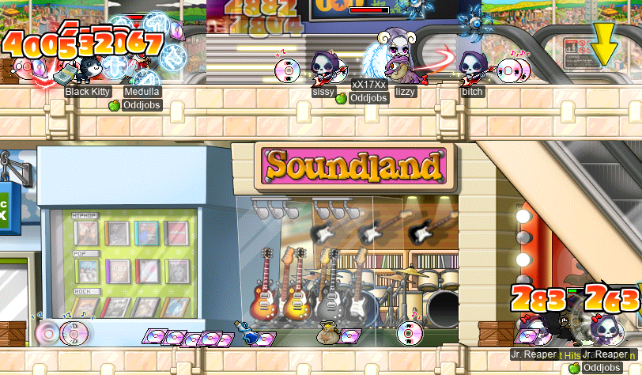

# rangifer’s diary: pt. lxxxiv

It’s time… for the second half of the [St. Valentine’s Day](https://en.wikipedia.org/wiki/Valentine%27s_Day)/[Lunar New Year](https://en.wikipedia.org/wiki/Lunar_New_Year) event!!

## Riff-raff(le)

It is now time for the second — and final — stretch of raffling for this event. You can see my previous raffles, and some comments on the raffling system itself, in the previous diary entry.

A journal of riff-raff(le)

And after all that &amp; more, I came away with this nifty Cherry Blossom Chair, amongst other things:

In the previous diary entry, I lamented that, despite raffling every single day on my [islander](https://oddjobs.codeberg.page/guides/introduction-to-odd-jobs/#islander) **ozotoceros**, I had yet to raffle anything of note besides a [CSS20](https://maplelegends.com/lib/use?id=2049003) that I could maybe use to barter with other islanders. Fortunately for me, my luck turned around! I got the Cherry Blossom Chair on island as well!!:

And what’s more, I got some epic [Lunar Gloves](https://maplelegends.com/lib/equip?id=1082174)!!!:

These Lunar Gloves are essentially perfect, for my purposes. The STR/INT/WDEF don’t really matter for my build, so a “perfect” Lunar Glove for me is any that has 2 DEX and 2 LUK. Lo and behold!!

## <i>MI</i> stands for “Maple Island”

Speaking of ozotoceros, I did some Maple Island grinding! Here, you can see me trioing a [basket](https://maplelegends.com/lib/use?id=2020024) with fellow islanders **jung1e** (**Plucks**, **Koph**) and **Kimberly** (**Gumby**, **nodeathrun**, **MADlSON**):

And I duoed two baskets with **Contagion** (**Without**) [at Pigs](https://maplelegends.com/lib/map?id=1000006), as well!:

While I was there, ozotoceros hit level 43~!:

And I raffled this goofy (but ultimately useless) hat:

I exchanged some Maple Island Love Letters with jung1e!:

…And got an even more special gift from jung1e: a (+2) [White Gomushin](https://maplelegends.com/lib/equip?id=1072004)!!!

 Gomushin!!!")

I’ve been trying to pass ≥2 scrolls on the same Gomushin for… well, for as long as ozotoceros has existed, pretty much. Unfortunately, (+1) seemed to be the best I could do for a long while. So this is a huge upgrade!!

Speaking of upgrades, I found an even better [White Valentine Rose](https://maplelegends.com/lib/equip?id=1442050). It was one less than perfect WATK, so jung1e traded it with me in exchange for his spare perfect one!:

And finally, again in the spirit of love and Valentine’s Day, I gave a Love Letter to a random stranger who happened to be passing through [Amherst](https://maplelegends.com/lib/map?id=1010000):

This was actually just after the event had ended. I happened to have the quest in progress, and spent a set of V-day ETCs to get this letter which appeared to have no expiry. Unfortunately, it turns out that an item whose expiry is in the past (i\.e. an expired item that has not had the chance to actually be deleted from the game world) _appears_ to have no expiry, but will simply disappear as soon as you renegotiate with the login server (e\.g. going in and out of the Cash Shop, CCing, relogging, etc.). So I don’t think that they had the heart effect for very long x)

## Vicloc: The second coming

Meanwhile, on a somewhat larger island by the name of “Victoria”, my [vicloc](https://codeberg.org/Victoria/resources) [clericlet](https://oddjobs.codeberg.page/guides/introduction-to-odd-jobs/#magelet) **d33r** levelled up while doing a raffle quest at [tBLIII](https://maplelegends.com/lib/map?id=106000120)!:

Vicloc makes a comeback

And with that, d33r was invited to her very first Fitness event. For those not already aware, Fitness is the name of a certain JQ that is often used as the setting for GM-hosted events. In MapleLegends, a Fitness event generally consists of doing this JQ within a certain time limit — 20 minutes, or something like that. Those who complete the JQ within the time limit are awarded with the mystical [Scroll of Secrets](https://maplelegends.com/lib/etc?id=4031019), which can be turned in via special quests in either [Kerning City](https://maplelegends.com/lib/map?id=103000000) or [Ludibrium](https://maplelegends.com/lib/map?id=220000000), in exchange for a random prize. The top three fastest finishers also get some game cash (special NX that can be used to gift Cash Shop items to other characters), and those who do not finish within the time limit get nothing. I’ve tried the Fitness challenge before, even on vicloc (viz. on my vicloc [dagger spearwoman](https://oddjobs.codeberg.page/guides/introduction-to-odd-jobs/#dagger-warrior) **d34r**), but I’ve never been able to actually complete it within the time limit.

But I figured, you know, gotta learn how to do it at some point, right? I mean, not really. But I do want that juicy Scroll of Secrets!! So I gave it a go…:

WOWEE I actually finished it for the first time!! I was so proud of myself that, when there was another Fitness event not too much later, I took d33r again and finished that one within the time limit as well!!! Well, let’s see what my first Fitness Scroll of Secrets gives me…:

Ooooh~ A [Top LUK 30%](https://maplelegends.com/lib/use?id=2040411)…! Very nifty, and very special. Can’t get something like this anywhere else on Victoria Island. Oh, and my other SoS left me with a [Shoe JUMP 60%](https://maplelegends.com/lib/use?id=2040704). Although Shoe JUMP 60%s aren’t necessarily special in vicloc (they [occur naturally](https://codeberg.org/Victoria/resources/src/branch/master/scrolls.md#for-shoes)), they are still pretty dang rare, and very valuable. Score!

In other vicloc news, we’ve actually had a recent influx of new viclockers, thanks to the efforts of **jung1e** (**Koph**, **Plucks**) in recruiting Maple Islanders to come try out vicloc! Here I am on d34r, walking back to [Henesys](https://maplelegends.com/lib/map?id=100000000) from the [Henesys Pig Farm](https://maplelegends.com/lib/map?id=100020100), with vicloc [permabeginners](https://oddjobs.codeberg.page/guides/introduction-to-odd-jobs/#permabeginner-outland) **Reikan** (**Christopher**, **wulas**) and Koph:

I helped these two out with forming a [KPQ](https://maplelegends.com/lib/map?id=103000800) party, on my [SPQ](https://maplelegends.com/lib/map?id=990000000)/KPQ [DEX page](https://oddjobs.codeberg.page/guides/introduction-to-odd-jobs/#dex-warrior) mule **kinds**:

And I watched them hit some of the stuff in [the final stage](https://maplelegends.com/lib/map?id=103000804)…

A noble effort to slay the monarch of all slimes.

And, I joined vicloc [woodswoman](https://oddjobs.codeberg.page/guides/introduction-to-odd-jobs/#woodswoman) **deerhunter** (**Taima**, **pilk**, **Tacgnol**, **Hanyou**, **Boymoder**, **Nyanners**, **Naganohara**) in hell (a\.k\.a. [tBLI](https://maplelegends.com/lib/map?id=106000101)) for some [Fire Boar](https://maplelegends.com/lib/monster?id=3210100) slaying in the name of raffles…

…And in the name of love \<3

The lovey-dovey spirit of Valentine’s Day has really gotten to d33r, to the point that she even temporarily transformed into a lovestruck [grizzly bear](https://en.wikipedia.org/wiki/Grizzly_bear)!:

Vicloc I/L [gish](https://oddjobs.codeberg.page/guides/introduction-to-odd-jobs/#gish) **VigiI** (**Harlez**) managed to raffle a random cat chair thingy, as well as a [CSS3](https://maplelegends.com/lib/use?id=2049001)\*. I took interest when they tried to sell the raffle rewards to other viclockers, and we came to an agreement in which I would take both the chair and the scroll, and in return, VigiI would get a set of some of my most powerful gish-friendly gear:

Unfortunately for me, the CSS3 failed (I used it on my [Tangy Earrings](https://maplelegends.com/lib/equip?id=1032114)). But the chair is really nifty, as I didn’t manage to raffle any chairs for my viclockers during this event!

In other news, I finally found a goddamn [Shield STR 60%](https://maplelegends.com/lib/use?id=2040931). It only took me like two or three weeks of hunting [Faust](https://maplelegends.com/lib/monster?id=5220002) every day!!!

And, in the moment of truth, it passed. An upgrade already!:

Hopefully I can finish it up nicely! Or, at least, quickly… &#x1f612;

I did some more partly-vicloc KPQs on kinds, but this time with vicloc [STRginner](https://oddjobs.codeberg.page/guides/introduction-to-odd-jobs/#permabeginner-outland) **illadvised** (**Permanovice**, **Bellicose**, **Battlesage**, **Dreamscapes**, **Paean**, **Hanger**)! And also with fellow KPQ mule **Ichigatsu** (**xXCrookXx**, **Macer**, **Lanius**, **Lvl1Crook**, **Level1Crook**)~

I got an [Echo](https://maplelegends.com/lib/skill?id=1005) on d33r, and decided to take the opportunity to use a [basket](https://maplelegends.com/lib/use?id=2020024) all by my lonesome. I considered going to somewhere a bit easier to get to, like [L1A4](https://maplelegends.com/lib/map?id=103000105), or something like that. But ultimately, I decided to brave the [B3 JQ](https://maplelegends.com/lib/map?id=103000906) in pursuit of the ultimate training map for me to solo: [B3 \<Subway Depot\>](https://maplelegends.com/lib/map?id=103000909). So, I let the suffering commence:

And thankfully, I finished with an entire half of the Echo left!!:

A quick `@epm 4` test, and I revealed how truly powerful a solo basket in B3 is for d33r:

Oh, but it gets better. I was invited to grind even moar [Wraith](https://maplelegends.com/lib/monster?id=4230102)s, but this time at [L1A4](https://maplelegends.com/lib/map?id=103000105) with fellow vicloc cleric Lanius. When I got there, [Shade](https://maplelegends.com/lib/monster?id=5090000) was up, so I took the opportunity to finish d33r’s Shade set!:

With the set done, I headed to Lanius’s channel to do some duo basket grind:

Indeed, the population of Victoria Islanders has seen quite the bump…:

While I was duoing a basket there at L1A4 with Lanius, I did some `@epm` tests…

1\.2M EPH?? What in the got damn hell??? I thought getting 1\.05M EPH when solo basketing at [TfoG](https://maplelegends.com/lib/map?id=105040306) on d34r was pretty good. But 1\.2M EPH at level 60???? Oh, speaking of level 60…:

YAY d33r breaks into the level 60s!! :3 I never thought I’d see the day…

Speaking of solo basket EPH at TfoG on d34r, someone in the guild gave me the idea of having someone to give leech to whilst you basket, in order to activate the [HS](https://maplelegends.com/lib/skill?id=2311003). This other character in the party doesn’t have to actually do anything — their mere presence in the party, in the same map, in EXP leech level range, is enough to activate the HS. So I tried it out myself…

My [OPQ](https://maplelegends.com/lib/map?id=200080101)/[LMPQ](https://maplelegends.com/lib/map?id=220000000) mule **sets** fit the bill: she’s in level range to leech at TfoG (viz. level ≥54), but she’s just a mule (and isn’t even odd), so I have no issue with giving her leeched EXP.

")

Yep. That’s higher EPH, alright. Imagine being a perfectly normal outlander assassin with no base INT, accepting _TfoG_ leech from an _odd-jobbed viclocker!_ Pitoyable&nbsp;!!

Also on d34r, I managed to find a few specimens of the rare &amp; endangered species known as [Faust](https://maplelegends.com/lib/monster?id=5220002). And I let illadvised have a go at it:

An impressive showing for a beginner of illadvised’s level, but unfortunately not enough to slay the beast, so I had to do that myself.

Also with illadvised, I duoed a basket on d33r at [L2A1](https://maplelegends.com/lib/map?id=103000200):

This was decent EXP for d33r still, although she shreds [Jr. Napkin](https://maplelegends.com/lib/monster?id=3230101)s pretty hard at this point. And it was a good opportunity for illadvised to get five Jr. Napkin cards!

With illadvised’s other off-island permabeginner, Permanovice, I duoed TfoG on d34r:

Now this is the real juicy EPH for d34r. And with that, she hit level 83~!:

(That should be “buttocks”, not “[burrocks](https://en.wikipedia.org/wiki/Typographical_error)” lol)

Vicloc assassin **bak2monke** (**Babbi**) decided to put together a **Victoria** guild photoshoot at [A Hill West of Henesys](https://maplelegends.com/lib/map?id=104030000):

After we got sick of taking photos, we started vomiting uncontrollably (as one does):

And later, I visited **wulas** and **Plucks** (the gunslinger and hunter of Reikan and Koph, respectively) and illadvised at [Monke Forest](https://maplelegends.com/lib/map?id=100040103), the favourite training spot of ranged viclockers everywhere:

And did something I haven’t done in a long time: some [Jrog](https://maplelegends.com/lib/monster?id=8130100) huntin’…

Jrog is stingy, as usual.

And, finally, bak2monke was so kind as to gift to me the two(!) [Shield STR 60%](https://maplelegends.com/lib/use?id=2040931)s that they found on their own Faust-hunting journey!!:

And I passed _both_ of them?!?!?!?!?!? YEAAAAAAAAAAAAAAAAAAAAAAAAAAAAAAAAAAAAAAAAAAAAAAAAAAAAAAAAAAAAAAAA~ (Time to fail the rest of the slots in the next few months…)

Footnotes for “Vicloc: The second coming”

\*Not to be confused with [CSS 3](https://en.wikipedia.org/wiki/CSS#CSS_3).

## Suboptimal bossers

I tried to do some [Papu](https://maplelegends.com/lib/monster?id=8500001) runs with **Flow** members **Level1Crook** (**Lvl1Crook**, **xXCrookXx**, **Lanius**, **Ichigatsu**, **Macer**) the sniper and **2sus4u** (**uayua**, **shadowban**, **tb303**, **deucer**) the F/P archmage, on my [woodsmaster](https://oddjobs.codeberg.page/guides/introduction-to-odd-jobs/#woodswoman) **capreolina**. After our first run was thwarted by some technical issues (see “Technical difficulties” below), our second run was also scuffed, but for a different reason. You see, after we put the [piece of crack](https://maplelegends.com/lib/etc?id=4031179) into the finicky hole that it belongs in, Level1Crook thought that it would be funny to jump into the [Time Sphere](https://maplelegends.com/lib/monster?id=8500000) (Papulatus’s “0th body”)…

> balls are great
>
> &nbsp;&nbsp;&nbsp;&nbsp;&nbsp;&nbsp;&nbsp;&nbsp;—&nbsp;**Level1Crook**, 2022

Indeed, as it turns out, the Time Sphere is level 100 and has a whopping 980 WATK! In any case, 2sus4u and I were able to salvage this run — albeit more slowly than it would have gone, had Level1Crook neglected to yeet himself into a violently turbulent and luminescent orb of pure time energy.

We also killed some [Rāvaṇa](https://maplelegends.com/lib/monster?id=9420014), in which we were joined by [STRginner](https://oddjobs.codeberg.page/guides/introduction-to-odd-jobs/#permabeginner-outland) **Cortical** (**Medulla**, **SussyBaka**, **CokeZeroPill**, **xXcorticalXx**, **GishGallop**):

And in which, capre hit level 134~!:

Just one more level before I can start griefing [Zak](https://maplelegends.com/lib/monster?id=8800002) runs \>:D! But I’ve already got my [Hurricane](https://maplelegends.com/lib/skill?id=3121004) to the level where I can finally swap it with [Strafe](https://maplelegends.com/lib/skill?id=3111006) on my keybindings ^^

## A little SPQing with GangGang

If you thought that all that my [OPQ](https://maplelegends.com/lib/map?id=200080101)/[LMPQ](https://maplelegends.com/lib/map?id=220000000) mule **sets** was good for is activating HS and accepting small quantities of leech from [odd-jobbed](https://oddjobs.codeberg.page/guides/introduction-to-odd-jobs/) [viclockers](https://codeberg.org/Victoria/resources), think again! Because she’s **GangGang**’s official mascot (Red told me so!) and regular [SPQ](https://maplelegends.com/lib/map?id=990000000) participant!!

So I did a few SPQs with GG, during which, I did the leftmost JQ in that one room where you have to place the [giant red spear](https://maplelegends.com/lib/etc?id=4001025)s in stage 2 for the first time:

As it turns out, I didn’t actually need to complete it — **Bellicose** (**illadvised**, **Permanovice**, **Battlesage**, **Paean**, **Hanger**) had already done it. But it was good to try it for the first time, and learn that it’s actually incredibly easy…

As usual, I was on [shoes](https://maplelegends.com/lib/etc?id=4001032) JQ duty:

And I — also for the first time — actually entered [the bossfight map](https://maplelegends.com/lib/map?id=990000900) the “normal” way (to be distinguished from the “coward” way, where you simply sit up in the top balcony)…

I kinda just stood there and watched, as my not-quite-two-thousand MAXHP was not going to withstand any serious attacks from these guys. But, you know, it’s still slightly more brave… right? In any case, these folks are some real pros who took out Ergoth in a matter of seconds. Fun times!

## Horned Tail

In the previous entry of this diary, my [darksterity knight](https://oddjobs.codeberg.page/guides/introduction-to-odd-jobs/#dex-warrior) **rusa** did her first Horntail run! And not only that, she did a total of four runs!! It was a heck of a lot of fun, although I did die once per run in the first three runs.

However, since those first three deaths, I’ve actually managed to consistently survive in Horntail (sort of — we’ll see what I mean by this down below)! And I’ve got a number of additional HT runs under my belt now. One of the biggest keys to stopping dying was that I had video recording of my deaths, so I was able to go back and see what killed me. I’ve already explained the phenomenon in the previous diary entry, so I won’t repeat it here.

As I was hunting for some [Tough Dragon Skin](https://maplelegends.com/lib/etc?id=4001077)s at [Leviathan’s Canyon](https://maplelegends.com/lib/map?id=240040401), I just so happened to run into a real live [Levi](https://maplelegends.com/lib/monster?id=8220003)! So I soloed it!!:

Hornytail

You may remember that rusa has soloed Levi before, in the context of Boss (Rush) PQ, which is documented in [<i>rusa solos BPQ (but not the last stage)</i> \[YouTube\]](https://www.youtube.com/watch?v=mLUgdPFxYYw). But this time was much easier — rusa has grown a whole lot since then!

In any case, with some [Dragon Elixir](https://maplelegends.com/lib/use?id=2210003)s on hand, I went to do a pair of HT runs with **xBowtjuhNL**, **Sagie**, **Harlez** (**VigiI**), **Flamous**, **LunaS2**, and others~!:

These runs went pretty well, although the corsair who you see pictured above (**BAZ00KA999**, a\.k\.a. **5nortin5peed**) — who was our non-AFK [HTP](https://maplelegends.com/lib/equip?id=1122000) buyer — unfortunately died too many times to make it through the run and loot some HTPs.

Besides these perfectly normal HT runs, I also joined some… less reputable runs, for funsies~

### Pepega run \#1

At the time, the MapleLegends servers were having a pretty rough time of it, as a result of their [dedicated host](https://en.wikipedia.org/wiki/Dedicated_hosting_service)’s suffering (see “Technical difficulties” below). In the midst of all this, it was looking like a pretty dumb idea to do much of anything in MapleLegends that might seriously punish disconnecting from the server, and/or that might suffer significantly from [lag] spikes. So, you know, a lot (but not all) of the usual stuff that Maplers do. And this of course includes HT!

With all of this going on, a level 200 bishop by the name of **helloooo** decided to host an HT run _anyways_. She sent out some [smega](https://maplelegends.com/lib/cash?id=5072000)s advertising a “d/clegends pepega HT run” that was looking for any and all participants. Harlez, xBowtjuhNL, and I all agreed to join, and after a while, we had assembled a crew for a rather inadvisable HT run:

In the image above, it should be noted that in addition to helloooo, we had yet another level 200 bishop by the name of **Kiaraaa**, and even a third bishop by the name of **xBrett** (**Bretticuss**). This rather powerful trio of bishops became relevant when, after not too long of fighting HT itself (the main body fight, after the two preheads), we accidentally triggered mass sed!

For those not familiar with HT mechanics, <i>sed</i> is the common abbreviation of “seduce”, a debuff that forces its victim to relinquish all control of their character (including the ability to eat potions/food — yes, even pet autopot) for its duration, instead blindly walking left, right, or jumping in place. Seduce is a normal occurrence throughout all stages of HT (even the preheads), but is usually limited to only one victim at a time; and that victim is always the live (as in “not dead”) [PC](https://en.wikipedia.org/wiki/Player_character) who least recently entered the map. This allows an HT expedition to carefully enter each map in an intentional order, so that the first PC to enter becomes the so-called <i>sed mule</i>, as their primary job is to survive being regularly seduced (usually — but not always — this is a shadower, as they are relatively sturdy, but also have extremely high dodge chances against incoming attacks). However, two of HT’s body parts (viz. its [left arm](https://maplelegends.com/lib/monster?id=8810005) and its [right arm](https://maplelegends.com/lib/monster?id=8810006)) are capable of seducing just about _everyone_\* on the map in unison; this is the so-called <i>mass sed</i> (sometimes simply <i>mass</i>). However, each arm is only capable of casting mass sed if its remaining HP is less than 30% of its MAXHP (viz. its HP is \<69[M](https://en.wikipedia.org/wiki/Mega-)). So, the typical strategy is to simply avoid damaging the arms too much until all three heads (and the [legs](https://maplelegends.com/lib/monster?id=8810008) and [tail](https://maplelegends.com/lib/monster?id=8810009)) are dead, so that mass sed poses almost no threat to the HTers’ lives.

When you have a powerful bishop trio spamming [Genesis](https://maplelegends.com/lib/skill?id=2321008), though, you might accidentally bring the arms’ HP down a bit prematurely…

Oopsies! You can see in the image above that **JoeWick** specifically calls out the right arm as being the one that cast mass sed. This is significant, as each of HT’s arms is only capable of casting its evil dragon magic when there are one or more PCs within its half of the map (the left half, or right half, respectively). So if the right arm was the one that cast mass sed, the obvious thing to do is to have everyone stay on the left half of the map, and get as much work done there as possible. All the while, also taking care to damage the left arm as little as possible, as it would likely be close to \<30% HP as well, if it’s not there already. Plus, if we know that one arm is capable of casting mass sed, then we can look for its little purple-glowy middle finger wagging animation to know when it’s about to mass sed again.

Uh oh. It seemed that we were having trouble determining which one (or both) of the arms was in HP range to mass sed!

After several un-[Resurrect](https://maplelegends.com/lib/skill?id=2321006)able deaths, we managed to simply kill the right arm entirely, so that we could stay on the right half of the map without fear of mass sed. Unfortunately, with the right arm, [wings](https://maplelegends.com/lib/monster?id=8810007), and [right head](https://maplelegends.com/lib/monster?id=8810004) dead, I had nothing to attack without crossing to the left side!

I later learned (in a future HT) that it’s possible (albeit frustratingly difficult and finicky) to attack the [mid head](https://maplelegends.com/lib/monster?id=8810003) from the right side of the map as a DK. For some reason, [Rush](https://maplelegends.com/lib/skill?id=1321003)ing to the leftmost edge of the platform by Rushing the right head (assuming that it’s alive) only seems to work about 10% of the time to get you in position to hit the mid head with [Crusher](https://maplelegends.com/lib/skill?id=1311001). This defied my intuition that Rush _seems_ to always take you as far as possible before stopping short, in any cases where stopping short is necessary due to the foothold that you’re on terminating (or due to some other obstacle, like a wall). Indeed, it’s possible to position yourself _even further to the left_ on that platform by carefully tapping the left arrow key while in mid-air a few times until you can actually connect with the mid head via Crusher.

In any case, after all was said and done in this scuffed pepega HT run, here were the drops:

Eh, not terrible. An MCP, a [Genesis 30](https://maplelegends.com/lib/use?id=2290049), a [chair](https://maplelegends.com/lib/setup?id=3010128), and a decent number of equips :P

With all of that said, this HT run was easily my favourite HT run that I’ve done so far. Perhaps I’m biased by the fact that I didn’t die, but the thrill of accidentally running into mass sed, and having to deal with it amongst all of the chaos, was super fun LOL

[lag]: https://en.wikipedia.org/wiki/Lag_(video_games)

Footnotes for “Pepega run #1”

\*I think that, in actuality, only the ten (or fewer, if a total of \<10 PCs are in the map) live PCs who least recently entered the map are mass sed targets. So that’s not necessarily _everyone_ (e\.g. a 12-Mapler run in which everyone is still alive), although it is everyone in many cases. Any HT experts should feel free to correct me on this one.

### Pepega run \#2

After the thrill of the first pepega HT run (keep in mind that these are only single runs, not pairs of runs), helloooo organised a sequel the next day. This run was actually basically a normal HT! Despite having helloooo’s extremely powerful Genesis aided by the [Meteor Shower](https://maplelegends.com/lib/skill?id=2121007) of level one-hundred-and-seventy-something F/P archmage **MaoMaoTheCat** and the Genesis of **sukker**, we didn’t trigger mass sed early, and the run went as you would expect:

Notice the blue glowing maple leaves on top of each of our heads in the image above. This is actually the buff-receiving animation for [the Horntail buff](https://maplelegends.com/lib/use?id=2022108) (`Horntail Squad : Victory`)!

Although I didn’t get this visual bug myself, sukker reported a screenshot of this strange-looking afterimage of a dead Horntail:

As we later found out, MaoMaoTheCat forgot to switch from their [Elemental Wand 6](https://maplelegends.com/lib/equip?id=1372040) to their [Elemental Wand 5](https://maplelegends.com/lib/equip?id=1372039) when transitioning from preheads to the full-body fight, so that may have been why mass sed didn’t trigger early…

### Pepega run \#3

That’s right; there was a sequel to the sequel. For pepega HT run \#3, MaoMaoTheCat remembered to switch wands this time, and lo and behold, the mass seduces came forth…

R\.I\.P. Flamous :(

We were again having a really hard time deciding where to go, or even what arm was casting mass sed, so in search of something to smack, I asked for a decision:

Not helpful. SMH

As the mass seduces continued, more tombstones rained from the skies…:

At this point, only three of us were left standing: me, Harlez, and another shadower by the name of **LoveShuffle**. So we abandoned our original two-party structure and formed a single party of three:

At this point, it was looking like we could _maybe_ make it if all three of us could stay alive and kill the arms, thus allowing us to [Onyx Apple](https://maplelegends.com/lib/use?id=2022179) to victory. But it was all over for me when I got 1/1’d right after being seduced…

And now you see why I said “sort of” above, when I claimed that I’ve actually managed to consistently survive in Horntail since those first three deaths…

LoveShuffle died as well, leaving Harlez to solo HT all by their lonesome…:

I felt kinda bad for LoveShuffle and paladin **LordJudge**, as this was only LoveShuffle’s second HT run ever, and it was LordJudge’s first!! Don’t take this as an example of how HT runs usually go!!! LOOL

After a few minutes of watching Harlez valiantly take on Horntail one-on-one, one too many seduce-dispel combos finished Harlez off:

And then there were none.

## The will of the hero

After so many HTs, I realised that I had neglected to even get the [Hero’s Will](https://maplelegends.com/lib/skill?id=1321010) skill, a key skill for seduced HTers in dire need of a get-out-of-jail-free card! I’d never done the questline for this skill before (I never had the occasion to), so I headed to [Carta’s Cave](https://maplelegends.com/lib/map?id=230040001) in search of a clue. [Carta](https://maplelegends.com/lib/npc?id=2060100) told me that if I were strong enough, I could bring to her [Miniature Pianus](https://maplelegends.com/lib/etc?id=4000175)es, and in exchange for each one, I could enter a warped dimension for about five minutes. In that dimension, the monsters that I killed would drop [Pieces of Courage](https://maplelegends.com/lib/etc?id=4031472). 40 of these pieces would be sufficient courage to bestow the will of the hero. I already had some Miniature Pianuses, so I took a look inside of this “[Warped Dimension](https://maplelegends.com/lib/map?id=923000000)”:

The monsters in here aren’t actually too scary; they’re pretty much just run-of-the-mill Deep Aqua Road monsters like [Gobies](https://maplelegends.com/lib/monster?id=9300097), [Bone Fish](https://maplelegends.com/lib/monster?id=9300098), and [Shark](https://maplelegends.com/lib/monster?id=9300099)s:

The first time that I went in, I managed to get 27 of the 40 pieces. So another try was sufficient to finish the 40 pieces that I needed:

Okay, so, it looks like I can’t just start shoving all 40 pieces into my mouth and somehow get the will of the hero. Instead, I had to retrieve something called a [Ragged Wristband](https://maplelegends.com/lib/etc?id=4031464), which drops from our old friend [Griffey](https://maplelegends.com/lib/monster?id=8180001):

With this, Carta was able to forge me a [Firm Hand](https://maplelegends.com/lib/use?id=2280002):

Now, I could shove this giant blue fist into my mouth, and _then_ I’d finally have the will of the hero! Cool!!

With the questline all done and another levelup under rusa’s belt, I spent an SP on Hero’s Will. Somewhat confusingly, the skill description strongly implies that Hero’s Will is capable of dispelling one or more debuffs _in addition to_ seduce. But testing it in a [Zak](https://maplelegends.com/lib/monster?id=8800002) run revealed this to be simply misleading. I was hoping that I could perhaps use it to occasionally dispel a stun. But it seems that stuns (and slows, for that matter) are totally undispellable! A whole lot of good the will of the hero and a giant pile of [ACP](https://maplelegends.com/lib/use?id=2022178)s have done, then!!

## Ground

Empowered by [the basket](https://maplelegends.com/lib/use?id=2020024), I did some [7F](https://maplelegends.com/lib/map?id=702070400) grinding on my [darksterity knight](https://oddjobs.codeberg.page/guides/introduction-to-odd-jobs/#dex-warrior) **rusa**, duoing with shadower **Harlez** (**VigiI**). Along the way, I hit a levelup or two whilst grinding…:

Including the big level 160~!!!:

And, over [at CDs](https://maplelegends.com/lib/map?id=742010203), I duoed some baskets with [dagger sader](https://oddjobs.codeberg.page/guides/introduction-to-odd-jobs/#dagger-warrior) **Medulla** (**Cortical**, **SussyBaka**, **CokeZeroPill**, **GishGallop**) on my I/L [archmagelet](https://oddjobs.codeberg.page/guides/introduction-to-odd-jobs/#magelet) **cervine**, which got me another levelup to 124~!:

I tried a quick `@epm 5` while I was there, and found that this setup really is pretty damn strong:

I may have sworn never to come back to CDs once I hit level 120, but I’ll be damned if those compact discs don’t give me that sweet, sweet EXP…

And also at CDs with Medulla — but this time as my [daggermit](https://oddjobs.codeberg.page/odd-jobs.html#dagger-assassin) **alces**, and additionally accompanied by [permarogue](https://oddjobs.codeberg.page/guides/introduction-to-odd-jobs/#permarogue) extraordinaire **xX17Xx**(!) (**drainer**, **breakcore**, **partyrock**, **attackattack**, **strainer**) — I utterly destroyed even _moar_ compact discs:

Crunch crunch!

## Technical difficulties

**NOTE:** This section should be read with the fact that I am running MapleLegends through [Wine][wine] in mind.

A lot of the MapleLegends gameplay featured in this diary entry has been plagued by technical difficulties. I mentioned above that the MapleLegends servers have been having a rough time of it, as a result of their [dedicated host](https://en.wikipedia.org/wiki/Dedicated_hosting_service) intermittently failing and seemingly randomly dropping [connections](https://en.wikipedia.org/wiki/Connection-oriented_communication).

In addition to this causing a whole lot of turmoil, I also struggled with some pretty severe [frame](https://en.wikipedia.org/wiki/Film_frame) dropping (read: low [frame rate](https://en.wikipedia.org/wiki/Frame_rate)) during one of the HT runs that I did. Someone suggested that the MapleLegends [client]’s [sound engine][mixing] has performance bugs that could cause this kind of thing, and **Harlez**/**VigiI** told me that **Kimmy** herself proclaimed the deletion of `Sound_DX8.dll` to be a safe way to resolve audio engine bugs. So I tried it myself, and the game didn’t immediately crash or anything, so it seemed like it might work…? I made sure to put the volume of background music (BGM) and sound effects (SFX) as low as possible, and then “MUTE” each one by ticking both corresponding checkboxes in the “SYSTEM OPTIONS” menu in-game.

Then, when attempting a [CWKPQ](https://maplelegends.com/lib/map?id=610030010) with **xBowtjuhNL**, **Harlez** (**VigiI**), and others, my client mysteriously shut down during the [Test of Agility](https://maplelegends.com/lib/map?id=610030300) stage… Normally, my client is extremely stable, and I almost never actually crash — at most, the server might drop my connection :P So we tried again, and the same thing happened again (and someone else also got disconnected in one way or another during the next stage, so that PQ was abortive as well). Harlez noted that both times, I got disconnected as soon as the [Mage Sigil](https://maplelegends.com/lib/monster?id=6109007) was activated, so they prompted me to send in a [ticket](https://en.wikipedia.org/wiki/Issue_tracking_system) via `@gm` asking to have the bug reproduced. I couldn’t find any [logs][log] in my MapleLegends installation [directory], nor in the `"Crash Logs"/` subdirectory, so I really had nothing to work with.

To my delight, a GM did respond to my ticket. GM **Nightzy** (**Nightz**) asked me a few questions about the issue, and then jailed me to try and reproduce the bug:

I’d never been jailed before, so I had no idea that the jail was in Ellin Forest LOL

As you can see, Nightzy spawned a Mage Sigil to give it a test, and then used [Ice Strike](https://maplelegends.com/lib/skill?id=2211002) in an attempt to activate the sigil. Unfortunately, this didn’t actually work, as it seems that the relevant PQ [scripts](https://en.wikipedia.org/wiki/Scripting_language) need to be running in order for the sigils to operate as intended.

As I mentioned in “Suboptimal bossers” above, the first [Papu](https://maplelegends.com/lib/monster?id=8500001) run that I did with **Level1Crook** and **2sus4u** failed. The actual reason for this failure was that, when the [Time Sphere](https://maplelegends.com/lib/monster?id=8500000) was spawned, no one attacked it. So I stepped up and started [Hurricaning](https://maplelegends.com/lib/skill?id=3121004) it, and _as soon as_ the first arrow hit the Time Sphere, my client closed in just the same manner that it did back in CWKPQ when the Mage Sigil was activated. For the second Papu run, I restored my `Sound_DX8.dll`, and lo and behold, no crashes.

I now keep the `Sound_DX8.dll` intact, but also keep BGM and SFX muted and on the lowest volume. So far, this works decently well, although it’s always hard to tell if, or when, I will get degraded performance.

[client]: https://en.wikipedia.org/wiki/Client_(computing)
[mixing]: https://en.wikipedia.org/wiki/Audio_mixing_(recorded_music)
[log]: https://en.wikipedia.org/wiki/Logging_(software)
[directory]: https://en.wikipedia.org/wiki/Directory_(computing)
[wine]: https://en.wikipedia.org/wiki/Wine_(software)

## Embossed

As usual, I did a handful of bosserinoes on my [darksterity knight](https://oddjobs.codeberg.page/guides/introduction-to-odd-jobs/#dex-warrior) **rusa**. One [Jiaoceng](https://maplelegends.com/lib/monster?id=9600025) run that I did with shadower **Harlez** (**VigiI**) and marksman **xBowtjuhNL** went south as we found ourselves losing DPM to some technical issues. As a result, Harlez started [Meso Exploding](https://maplelegends.com/lib/skill?id=4211006):

Unfortunately, although the exploded mesos were certainly a good DPM boost, they also compounded the client-side issues that xBowtjuhNL was having, so he told Harlez to stop. In the end, this was a failed JC. :\[

On the bright side, we _also_ did several successful JCs, including this one with nightlord **illadeIph**:

As mentioned above in “Technical difficulties”, I had tried to CWKPQ to no avail, due to technical issues. On the bright side though, I _also_ did a successful CWKPQ! Here I am, soloing the warrior room of the [Hall of Mastery](https://maplelegends.com/lib/map?id=610030010):

Cool!! Admittedly, the warrior room is really not very difficult — it’s just killing some monsters with no JQ nor puzzle aspects, and [the monster](https://maplelegends.com/lib/monster?id=9400582)s aren’t _really_ that tough. But still, I proved my power and laid claim to the [Master Sword](https://maplelegends.com/lib/etc?id=4001259)!! Hah!!!

Here’s a screenshot from the preliminary bit of the CWKPQ boss fight, where a bunch of really tough (but not-so-boss) monsters are spawned in a big mob and we have to dispatch of all of them:

And, here is what most of CWKPQ looks like from a cleaver’s perspective:

For anyone not already familiar with the CWKPQ boss fight, the three bosses that you see pictured (not actually, as they are covered up by the edge of the map and a flurry of skill effects) above have some nasty tricks up their sleeves that make them essentially impossible to fight unless you meet at least one of the following criteria:

- You have [Holy Shield](https://maplelegends.com/lib/skill?id=2321005) (HS) and/or [Smokescreen](https://maplelegends.com/lib/skill?id=4221006) (Smoke) active on you.
- You are hugging the bosses against the wall of the map.

The former of these is not sustainable, as HS and Smoke both have significant cooldowns. And the latter is simply not possible for ranged characters. As a result, ranged characters who try to fight the “cleave bosses” will find themselves perpetually stunned, sealed, shoved backwards, and to make things worse, hit for sometimes rather large amounts of damage. So this is why this boss trio is for “cleave” only. While fighting in this way, I did a `@dpm 5` test:

194\.6[M](https://en.wikipedia.org/wiki/Mega-) DPH! Not bad for a poopy odd-jobber!!

And, at the end of it all, I got the chance to loot a [MoN](https://maplelegends.com/lib/equip?id=1122059):

And it was pretty good! The highlight is that it has 5 WATK, and in addition, it has 4 STR, 6 DEX, and a rather unfortunate 290 MAXHP. I tested my damage range when swapping between this 5 WATK MoN and my [HTP](https://maplelegends.com/lib/equip?id=1122000), and as expected, both the minimum and maximum of my damage range suffer significantly when using the MoN. But still, it’s nice to at least have one :P

Oh, and here’s a screenshot from another one of those not-so-failed JCs — this time, featuring [bishop](https://maplelegends.com/lib/skill?id=2321007) **Balake**:

After killing some [Pianus](https://maplelegends.com/lib/monster?id=8510000)es with Harlez, we went to check [Seruf](https://maplelegends.com/lib/monster?id=4220000) real quick, as rusa was still 0/5 on that card set. I didn’t find any Serufs, and Harlez found only one, but boy was it a good one!:

My first Seruf card _and_ a [Seruf chair](https://maplelegends.com/lib/setup?id=3010142)?? Score!!

In pt. lxxxii of this diary, I talked about a pair of [Zak](https://maplelegends.com/lib/monster?id=8800002) runs that I did where we had absolutely no range of any kind, and were all huddled on the middle of Zak’s body the entire time in Smoke. Well, I did another quite similar pair of Zak runs again…

This run featured me as a darksterity knight, shadower Harlez, shadower **MoistLips** (**SafeSex**), DK **dildil**, hero **Hidesake**, and bishop **Warum**. Not an amazing team for killing Zakum’s top-right arm, but otherwise fantastic!

I also did some fun Zaks with shadower **Sagie**, bishop **Flamous** (whom I knew from HT runs), Harlez, and xBowtjuhNL:

During one of which, rusa hit level 161~!:

:3

## rusa &times; Harlez

On the way from [KFT](https://maplelegends.com/lib/map?id=222000000) to [Ludi](https://maplelegends.com/lib/map?id=220000000), **Harlez** (**VigiI**) surprised me with an engagement proposal!!!:

rusa &times; Harlez

As usual, I was too surprised by the proposal to remember to take a screenshot of the actual prompt that pops up. But anyways, I said yes!!!

On the weekend, we planned to do our wedding (a premium wedding, of course!) in the cathedral. And I was very pleased to see how many people turned up!:

Among the attendees was GM **Nightzy** (**Nightz**), so we were treated with a casual mass down-sed…

This was at Nightzy’s request to “kneel before” the bride and groom, but it ended up sed’ing everyone on the map, so Harlez &amp; I were seduced too…

As the wedding commenced, we were honoured to have [Bob](https://maplelegends.com/lib/monster?id=9400551) as our ringbearer:

And as always, the main feature of the wedding was the wedding vows (note that **Nyanners** is also **Taima**):

:')

NOW KITHH~

And, more importantly, [VOM](https://en.wikipedia.org/wiki/Vomiting)~

At this point, Harlez surprised me with an [Aluminum Bat](https://maplelegends.com/lib/equip?id=1402029)… And some [Massage Oil](https://maplelegends.com/lib/use?id=2022102)……

The Massage Oil was even specially made by Nightzy! A collector’s item!!

In addition to the lewd gifts, Harlez also gave me a bunch of cool dark scrolls!:

At the wedding cake photo op stage, Nightzy spawned the customary marriage [Cow](https://maplelegends.com/lib/monster?id=9600006) for us at the top of the cake. And then someone killed her for absolutely no reason???:

Yeah, for future reference, **no cow murder allowed at my weddings**!! Hello?? Thank you!!!

And then Nightzy forced us all to eat cake…

For the wedding rewards from our [Onyx Chests for Bride and Groom](https://maplelegends.com/lib/etc?id=4031424), we both got level 50 [ducc toob](https://maplelegends.com/lib/equip?id=1322063)s! So **Joyce** (**ducklings**) was at least there in spirit :')

As a result of one of the congratulatory [smega](https://maplelegends.com/lib/cash?id=5072000)s that were sent out, I met with IGN **Deer**… Who is of no relation to me and has held the IGN since some time in 2017…

We sat and chatted, but they refused to reveal to me what their main character’s IGN is, although they claim Deer to be “just an alt”.

After the wedding, I used some of my event points to put together a [Valentine’s Day](https://en.wikipedia.org/wiki/Valentine%27s_Day) look for rusa:

Not bad AHAHAH I can’t figure out if I look cute or look like a goob in this outfit. In any case, the main downside is the fur [boa](https://en.wikipedia.org/wiki/Feather_boa) that the dress features. You can’t see it in the image above, as rusa is standing still and holding a [PSB](https://maplelegends.com/lib/equip?id=1442057). But it’s pretty tacky.

One important thing about this marriage is that Harlez had actually never done [APQ](https://maplelegends.com/lib/map?id=670010100) in their entire Maple career! So of course I had to show him how fun APQ is!! Here’s rusa in [stage 1](https://maplelegends.com/lib/map?id=670010200) of her first APQ:

And here we are, in Harley’s first-ever APQ, breakin’ down the gates of [stage 5](https://maplelegends.com/lib/map?id=670010600):

Anyone’s first APQ is a bit confusing at first — just like any PQ, really — but hopefully we will get the opportunity to APQ more in the future ^^

\<3

## Failed duo Zak attempt

As mentioned in “Technical difficulties” above, the MapleLegends server was shitting itself quite a bit at some points. During one of these self-soiling episodes, **xBowtjuhNL** was still bored and wanted something to do, so he asked me if I’d agree to try duo [Zak](https://maplelegends.com/lib/monster?id=8800000) on my [darksterity knight](https://oddjobs.codeberg.page/guides/introduction-to-odd-jobs/#dex-warrior) **rusa**. We figured that we could maybe kill the arms and call it good, or whatever. And if we get disconnected by the server… well… we tried, at least.

The hard part, though, was actually getting the &geq;6 [signs](https://en.wikipedia.org/wiki/Signature) necessary to even enter [Zakum’s Altar](https://maplelegends.com/lib/map?id=280030000). I had to conjure up not just rusa, but also four(!) of my other characters to come sign, including my pure [STR bishop](https://oddjobs.codeberg.page/guides/introduction-to-odd-jobs/#str-mage) **cervid** to [door](https://maplelegends.com/lib/skill?id=2311002) everyone. In the image below, you can see almost all six signatories, including my I/L [archmagelet](https://oddjobs.codeberg.page/guides/introduction-to-odd-jobs/#magelet) **cervine** and my [permarogue](https://oddjobs.codeberg.page/guides/introduction-to-odd-jobs/#permarogue) **panolia** (not pictured is my [woodsmaster](https://oddjobs.codeberg.page/guides/introduction-to-odd-jobs/#woodswoman) **capreolina**, as she is on the same account as cervine, so I had to relog for that sign):

We had an apparently good start, attacking the bottom-right arms (as they are the ones that cast WDEF buffs, and we have no way to dispel such buffs), but it wasn’t too long before we had some serious lag spikes, and then we both got disconnected by the server…:

We did try again one more time (as Zak can be attempted a maximum of twice daily), but it went similarly. &#x1f614; Oh well… Maybe next time…

## (…cnvpstdf…)

cnvpstdf

