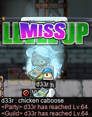
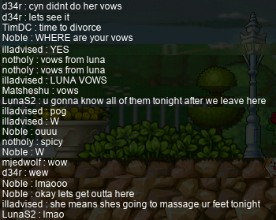
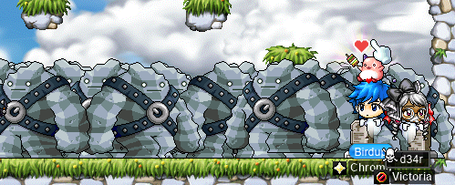
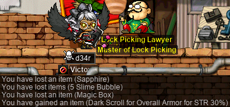

# rangifer’s diary: pt. lxxxv

## <b>Suboptimal</b> as a community

For those unaware, <b>Suboptimal</b> is the name of an in-game alliance that I lead, which is currently composed of the following five guilds:

- [<b>Oddjobs</b>](https://oddjobs.codeberg.page/) (open to all [odd-jobbers](https://oddjobs.codeberg.page/guides/introduction-to-odd-jobs/) who don’t leech),
- <b>Flow</b> (open to anyone, but focused on [outland permabeginners](https://oddjobs.codeberg.page/guides/introduction-to-odd-jobs/#permabeginner-outland)),
- <b>Southperry</b> (open to all [islanders](https://oddjobs.codeberg.page/guides/introduction-to-odd-jobs/#islander) and all [campers](https://oddjobs.codeberg.page/guides/introduction-to-odd-jobs/#camper)),
- <b>Newbology</b> (open to all islanders and all campers),
- and <b>Victoria</b> (open to all [viclockers](https://codeberg.org/Victoria/resources/src/branch/master/rules.md)).

It’s a pretty cool alliance, if you ask me ;), but you’ll notice that the alliance is already full — five is the maximum number of guilds that can occupy a single alliance together. I had a discussion about this, in alliance chat, with <b>Red</b> (<b>Permanovice</b>, <b>Battlesage</b>, <b>illadvised</b>, <b>Dreamscapes</b>, <b>Hanger</b>) and <b>jung1e</b> (<b>Plucks</b>). Naturally, even as a full alliance of five whole guilds, Suboptimal tends to be pretty sparse. Most people do not opt for playing MapleStory in unusual ways (notice that this statement is more than a little bit tautological), and of those who do, some will treat it — in one way or another — as a kind of “vacation”, away from their “main” character(s). So it would actually make sense for us to go beyond the limit, and add even more guilds to Suboptimal; having so many guilds in a single alliance chat might sound [spam](https://en.wiktionary.org/wiki/spam#Verb)my, but for an alliance like Suboptimal, a better word might be “cozy”, or “inclusive”. We floated the idea of actually making a suggestion thread on the MapleLegends forums to allow some mechanism for increasing the alliance size cap beyond five — it already starts at only two anyways, and you have to purchase expansions with mesos. But we knew it to be unlikely that such a change would be made to the game, so we considered some other approaches to this general problem of uniting “people who play MapleLegends weirdly”.

This general problem of uniting may sound familiar to those who are already familiar with the [Odd Job Initiative](https://codeberg.org/deer/gists/src/branch/master/what-s-next-for-oddjobs/odd-job-initiative/README.md), something that I have talked about in previous diary entries. And indeed, all of this falls under the purview of the Odd Job Initiative.

One possible option is to try to cram more “guilds” into a single alliance chat by creating “superguilds” that subsume two or more other, smaller guilds. In the process of subsumption of these virtual guilds under a single superguild, each one must naturally sublate its identity, including the distinctions of who belongs to which virtual guild, the name of the guild, the emblem, etc., in favour of some compromise. Furthermore, in the case that the virtual guild started its life as a real guild, the transformation from a guild into a virtual guild means losing members — in many cases, _lots_ of members, some of whom may be inactive or may be taking a temporary break from the game. These rather extreme compromises make superguilds possible, but generally distasteful for most people.

On the other hand, the internet obviously exists well outside of just the game (viz. MapleLegends) itself. In this vein, the two platforms that Maplers (at least those who play MapleLegends and similar servers) are actually familiar with, and that they are willing to use, are [Discord](https://sneak.berlin/20200220/discord-is-not-an-acceptable-choice-for-free-software-projects/)™ and [forums](https://en.wikipedia.org/wiki/Internet_forum) (in our case, the [MapleLegends forum](https://forum.maplelegends.com/) in particular). I already had previously proposed the idea of a Suboptimal–<b>Dream</b> meta-alliance (which includes the five guilds of Suboptimal, in addition to <b>GangGang</b> and <b>Chroma</b> of the Dream alliance; we share a headquarters in channel 6 of [FM 9](https://maplelegends.com/lib/map?id=910000009)) Discord™ server. So I floated that idea, along with the idea of simply a Suboptimal Discord™ megaserver.

Of course, for such a server to exist, it would need an emblem…! And alliance emblems don’t exist in-game (only guild emblems), so we were free to come up with whatever. While brainstorming ideas, I suggested a snail (like an ordinary [Blue Snail](https://maplelegends.com/lib/monster?id=100101), for example), but with [Mano](https://maplelegends.com/lib/monster?id=2220000)’s [Rainbow-coloured Snail Shell](https://maplelegends.com/lib/use?id=2210006) as its shell. **Slime** (**OmokTeacher**, **Thinks**, **Ginner**, **Slimu**), the talented pixel artist that he is, put together just that!:


There it is! The emblem of Suboptimal!! Why a rainbow snail, you ask? Well, the rainbow snail reminds me that opening the door to oddball ways of playing MapleStory has a wonderful and profound effect: it makes things more colourful. When playing MapleStory conventionally, the premise is essentially this: pick one of the dozen or so different jobs, and be the best version of that job that you can be. While this is certainly fantastic on its own, opening the door to other styles of play makes things unboundedly more colourful. Also, we are all [LGBTQIA+](https://en.wikipedia.org/wiki/LGBT). Maybe. Just kidding, you don’t have to be LGBTQIA+ to be a Suboptimal member. We accept straights too :)

In any case, we now have a Suboptimal Discord™ server dedicated to all manner of oddball styles of play, and if you’re already in the Oddjobs, Flow, or Victoria Discord™ servers, you already got an invite. I’m considering opening this server, in an appropriate way, to non-oddball players (including other members of our meta-alliance, and possibly also those who may simply be curious), but that decision has yet to be made. If you’re interested in joining, feel free to drop a DM and/or friend request by me on Discord™ `@deer#1028`. \<3

With all of that said, I always feel that there must be more work to be done in this space. What exactly the next step is, however, I do not know.

## Raffling… still‽

So, the [Valentine’s Day](https://en.wikipedia.org/wiki/Valentine's_Day)/[Lunar New Year](https://en.wikipedia.org/wiki/Lunar_New_Year) (LNY) event of 2022 has ended. Or has it…?

As it turns out, if you started a raffle quest before the event ended, the quest persists until you complete it — even though the event is already over. So I took the opportunity to do just a few more raffles…


And I got a few Prestigious Coins out of it! Not bad at all!! And, due to the raffle quest of my [daggermit](https://oddjobs.codeberg.page/odd-jobs.html#dagger-assassin) <b>alces</b>, it was the first time that I ever fought [Yeti and Coketump](https://maplelegends.com/lib/monster?id=9500147)s. But as we shall see, it will not be the last…

## 메이플 아일랜드

Over on Maple Island, I had the good fortune to duo some [Dangerous Forest](https://maplelegends.com/lib/map?id=1000002) (DF) with [islander](https://oddjobs.codeberg.page/guides/introduction-to-odd-jobs/#islander) extraordinaire (and leader of <b>Newbology</b>) <b>jung1e</b> (<b>Plucks</b>), on my islander <b>ozotoceros</b>, while on GM buffs! jung1e was kind enough to let me have the bottom layer (which is full of juicy [Orange Mushroom](https://maplelegends.com/lib/monster?id=1210102)s), so I tried a quick &amp; dirty `@epm` test:


90\.8k EPH o\_o Spicy!!

And, he was also kind enough to gift me a spare cat mug random chair! So now I have two of the LNY 2022 event chairs on ozo!!:


At the end of our training session, ozo hit level 44 :D


And finally, I was honoured to, uhm, do the honours of levelling up both jung1e and <b>1sme</b> (<b>Ismezin</b>) with a single [Pig](https://maplelegends.com/lib/monster?id=1210100)!!:


Grats again to these two epic islanders :3

## Suboptimal vs. the world

As always, I did some nifty bosserinoes with the <b>Suboptimal</b> krew. While I was hunting for [Tough Dragon Skin](https://maplelegends.com/lib/etc?id=4001077)s on my [darksterity knight](https://oddjobs.codeberg.page/guides/introduction-to-odd-jobs/#dex-warrior) <b>rusa</b>, I came across a [Levi](https://maplelegends.com/lib/monster?id=8220003)! So I asked in ally chat if anyone wanted to kill Levi, and [daggermit](https://oddjobs.codeberg.page/odd-jobs.html#dagger-assassin) <b>Keppet</b> responded to my call:


In total, we killed two Levis, but the first one dropped [a chair](https://maplelegends.com/lib/setup?id=3010047)!!:


And I won the roll, so rusa now has a snazzy (and rather adorable, I might say) dragon chair!:


During another [scheduled event](https://codeberg.org/deer/gists/src/branch/master/what-s-next-for-oddjobs/odd-job-initiative/runs.md), <b>Level1Crook</b> (<b>Lvl1Crook</b>, <b>xXCrookXx</b>, <b>Macer</b>, <b>Lanius</b>) and I were unfortunately the only ones in attendance. But we didn’t let that stop us from killing some [Rav](https://maplelegends.com/lib/monster?id=9420014)s:


And some [Papal Atlas](https://maplelegends.com/lib/monster?id=8500001)es, too! Level1Crook dared me to touch the [spicy ball](https://maplelegends.com/lib/monster?id=8500000), so I did:


Ow. But I did survive…:


And here’s a nice action shot of us killing [clockless Paper Lattice](https://maplelegends.com/lib/monster?id=8500002):


## The meteoric rise of one “d33r”

As I showed in a previous entry of this diary, my [vicloc](https://codeberg.org/Victoria/resources) [clericlet](https://oddjobs.codeberg.page/guides/introduction-to-odd-jobs/#magelet) <b>d33r</b> managed to raffle a really nice pair of [Tangy Earrings](https://maplelegends.com/lib/equip?id=1032114), with 2 INT and 1 LUK clean! Naturally, these earrings were my next target for my adventures in vicloc gear upgrading. [Ear INT 60%](https://maplelegends.com/lib/use?id=2040301)s are a bit difficult to come by, but I did manage to find enough additional ones to finish off the earrings. I also tried (and failed) a [CSS3](https://maplelegends.com/lib/use?id=2049001). In the end, these earrings totally failed, passing only 40% of the slots (much less than the advertised “60%” pass rate of the scrolls that I used…), meaning that my (+3) [salad earrings](https://maplelegends.com/lib/equip?id=1032025) are still superior by a 1 TMA margin \>\.\<

<details>
<summary>d33r here!</summary>


In any case, it was high time for d33r to do something other than napkin slaying. With some more levels under my belt, I was now qualified to do some more quests, including [John’s Last Present](https://bbb.hidden-street.net/quest/victoria-island/johns-last-present), a\.k\.a. the third [Sleepywood](https://maplelegends.com/lib/map?id=105040300) JQ (encompassing steps [5](https://maplelegends.com/lib/map?id=105040314), [6](https://maplelegends.com/lib/map?id=105040315), and [7](https://maplelegends.com/lib/map?id=105040316) of The Deep Forest of Patience). So I gave it a shot…:


As you can see, pain &amp; suffering ensued… <b>2sus4u</b> (<b>uayua</b>, <b>shadowban</b>, <b>tb303</b>) [smega](https://maplelegends.com/lib/cash?id=5072000)’d on my behalf, to try to get some help:


In the end, no one came to my aid, but I did eventually muscle my way past the final stage:


Phewf.

While I was in the Sleepywood dungeon, I decided to check on our old friend [ZMM](https://maplelegends.com/lib/monster?id=6300005), which d33r is capable of killing due to its undead nature:


As you can see, d33r will stop at _nothing_ to get to the Victorian area bosses that she rightly controls, even slaying outlanders who stand in her way! Be warned!!

In search of more quests to do, I went to complete [Mrs. Ming Ming’s Second Worry](https://bbb.hidden-street.net/quest/victoria-island/mrs-ming-mings-second-worry). I already had most of the ETC items, with the exception of a few dozen [Octopus Leg](https://maplelegends.com/lib/etc?id=4000006)s. So I set out to slay some [Octopus](https://maplelegends.com/lib/monster?id=1120100)es\*:


And, lo &amp; behold, the [Ribboned Pig Headband](https://maplelegends.com/lib/equip?id=1002441) of legend~:


Speaking of legend, I went to the [Perion Weapon Store](https://maplelegends.com/lib/map?id=102000001) to greet the return of the legendary Victorian crossbowman of yore, <b>Thinks</b> (<b>OmokTeacher</b>, <b>Ginner</b>, <b>Slimu</b>):


We were admiring the suit of armour that this shop has shackled to the wall, and I noted that it looks kinda like [Blue Dragon Armor](https://maplelegends.com/lib/equip?id=1052075)…? Spoopy.

Thinks wanted to do some grinding, so we agreed to do the B3 JQ together to get to the [B3 \<Subway Depot\>](https://maplelegends.com/lib/map?id=103000909), where all the [Sr. Napkin](https://maplelegends.com/lib/monster?id=4230102)s are at:


Now, I’ve done this JQ a few times before, but I’m really no good at it. So Thinks, JQ master that his is, taught me some tips &amp; tricks:


By the end of it…


…we were able to do a bit of duo grinding, during which, d33r hit level 61~!:


Later on, I decided that it’s really about time for d33r to get her [T1 ring](https://maplelegends.com/lib/equip?id=1119003). I still had some uncompleted sets in the red tab, so I went to some low-level areas like [Right Around Lith Harbor](https://maplelegends.com/lib/map?id=104000100), [Sweet Fork Cake](https://maplelegends.com/lib/equip?id=1472088) in hand, to hunt for cards:


I also did some hunting at the [Mushroom Garden](https://maplelegends.com/lib/map?id=104030001)…


…Where I unexpectedly ran into a [Red Valentine Rose](https://maplelegends.com/lib/equip?id=1442048) dropping from one of the [Red Snail](https://maplelegends.com/lib/monster?id=130101)s there! I thought the event was over!!


In any case, I stayed there just long enough to finish my [Orange Mushroom](https://maplelegends.com/lib/monster?id=1210102) card set:


And then, I headed to [West Rocky Mountain I](https://maplelegends.com/lib/map?id=102020000) to hunt for one extra Red Snail card:


Whew… finally…


I paused my card-hunting journey for a bit to do some duo grinding, again in the B3 \<Subway Depot\>, with vicloc [STRginner](https://oddjobs.codeberg.page/guides/introduction-to-odd-jobs/#permabeginner-outland) <b>illadvised</b> (<b>Permanovice</b>, <b>Dreamscapes</b>, <b>Battlesage</b>). We agreed to race each other in the JQ, but with Think’s coaching to help me, I beat illadvised by a few minutes:


Once we were both finished, it was time to use my [basket](https://maplelegends.com/lib/use?id=2020024). See if you can find anything missing in the image below…:


Some minutes had gone by, and our `@epm` tests were rather disappointing. As illadvised started to apologise, I noticed what was missing…:


&#x1f614; It seems that we were both clinically braindead for nearly 15 minutes…

With some five or ten minutes left on my basket, illadvised accidentally bit it:


I tried to [resurrect](https://maplelegends.com/lib/skill?id=2321006) illadvised by screaming at the top of my lungs, but it didn’t work :\[

Well, now it was time to finish off that T1 ring… so I headed to the [Henesys Pig Farm](https://maplelegends.com/lib/map?id=100020100):


And there it is — a T1 ring for d33r, at long last!:


With the ring now on my finger, I set out to do even mOar questing. I headed to Ellinia to visit [Ronnie](https://maplelegends.com/lib/npc?id=1061004) at [The Tree Tunnel At the Forest Up North](https://maplelegends.com/lib/map?id=101020001), who tasked me with bringing some materials to [build a new house](https://bbb.hidden-street.net/quest/victoria-island/ronnie-the-fairies-building-a-new-house-magician-only) (note that this quest is **mage-only** and level ≥55). The first two batches of materials aren’t too difficult to farm, with the most powerful monster that you have to fight being a [Curse Eye](https://maplelegends.com/lib/monster?id=3230100). And in any case, I already had almost all of the ETC items for the first two batches, aside from yet more Octopus Legs:


However, after that point, it gets a bit tougher. I had to farm some [Croco Skin](https://maplelegends.com/lib/etc?id=4000033)s by hand, which took a while…:


And I needed [Drake Skull](https://maplelegends.com/lib/etc?id=4000014)s as well — considering that none of the monsters that drop skulls are undead, and that the weakest one is the [Copper Drake](https://maplelegends.com/lib/monster?id=4130100), I opted to head to [Dangerous Valley II](https://maplelegends.com/lib/map?id=106000002) on my vicloc [dagger spearwoman](https://oddjobs.codeberg.page/guides/introduction-to-odd-jobs/#dagger-warrior) <b>d34r</b> to collect the skulls:


Luckily for me, I already had all of the ETC items necessary for the final and most difficult batch, which includes 50 [Tauromacis Horn](https://maplelegends.com/lib/etc?id=4000028)s(!), and 50 [Medicines With Weird Vibes](https://maplelegends.com/lib/etc?id=4000036) that d33r had already collected herself:


The rewards are honestly not very good, especially for someone like d33r who doesn’t even have the INT to wear magician shoes, but it was a bit of fun anyways.

With that questline done, I started on [Muirhat](https://maplelegends.com/lib/npc?id=1092007)’s questline, which had me killing some [Stone Golem](https://maplelegends.com/lib/monster?id=5130101)s:


I’m not exactly amazingly efficient at killing these things, but I eventually got all 80 kills:


Woo hoo! Level 82~!!

The next task was to kill 100(!) [Dark Stone Golem](https://maplelegends.com/lib/monster?id=5130102)s, so I set to work on that…:


As I was about halfway through the 100-kill slog, STRginner <b>uayua</b> (<b>2sus4u</b>, <b>shadowban</b>, <b>tb303</b>) came to my aid, helping me do the rest of the kills in a party!:


With those 100 kills finished, naturally we moved on to 100 [Mixed Golem](https://maplelegends.com/lib/monster?id=5150000) kills. Although I imagine that most people probably go to [FoG](https://maplelegends.com/lib/map?id=105040306) for this quest, we instead went to [Golem’s Temple IV](https://maplelegends.com/lib/map?id=106010106), as it’s more manageable; the only monsters other than the ones that we want are harmless [Blue Mushrooms](https://maplelegends.com/lib/monster?id=2220100) and the occasional [Fairy](https://maplelegends.com/lib/monster?id=3000004):


With these 100 kills done, uayua and I were now at the same point within the questline. So we went to do the next quest together, as well: to kill [Skeleton Soldier](https://maplelegends.com/lib/monster?id=5150001)s and [Officer Skeleton](https://maplelegends.com/lib/monster?id=6230602)s. Although these are even more powerful, they are _also_ undead, so d33r had no issue killing them:


And with that quest finished, d33r was unfortunately too low level to continue the questline. But hopefully she shall eventually attain level 70 and complete the whole questline!

Back at [L1A4](https://maplelegends.com/lib/map?id=103000105), d33r did some duo grinding with fellow vicloc cleric <b>Lanius</b> (<b>Level1Crook</b>, <b>Lvl1Crook</b>, <b>xXCrookXx</b>, <b>Macer</b>), and hit level 63~!:


And later, d33r did some _trio_ grinding with cleric [gish](https://oddjobs.codeberg.page/guides/introduction-to-odd-jobs/#gish) <b>CokeZeroPill</b> (<b>SussyBaka</b>, <b>Cortical</b>, <b>xXcorticalXx</b>, <b>GishGallop</b>, <b>Medulla</b>) and vicloc hunter <b>Plucks</b> (<b>jung1e</b>):


During which, d33r hit the big level 64~!!:



Time to finally put on that [Maple Wisdom Sta](https://maplelegends.com/lib/equip?id=1382039)— Wait… no… &#x1f62d;

</details>

<details>
<summary>Footnotes for “The meteoric rise of one ‘d33r’”</summary>

\*[Anglophones](https://en.wikipedia.org/wiki/English_language) love to get twisted up about how to pluralise <i>octopus</i>. One of the two most prevalent plural forms is <i>octopi</i> [/ˈɒkt\.ə\.paɪ/](https://en.wikipedia.org/wiki/International_Phonetic_Alphabet). However, this is a [hypercorrection](https://en.wikipedia.org/wiki/Hypercorrection) based on the misconception that <i>octopus</i> comes from a [Latin](https://en.wikipedia.org/wiki/Latin) [second declension](https://en.wikipedia.org/wiki/Latin_declension) noun <i>octōpūs</i>, when in actuality, the word <i>octōpūs</i> only exists in Latin as a [New Latin](https://en.wikipedia.org/wiki/New_Latin) word in third declension, whose [nominative](https://en.wikipedia.org/wiki/Nominative_case) plural is <i>octōpodēs</i> (<i>\*octōpi</i> is thus not a word at all). This New Latin pluralisation reflects the pluralisation in [Ancient Greek](https://en.wikipedia.org/wiki/Ancient_Greek), which is the actual origin of the English word <i>octopus</i> (Ancient Greek: <i>ὀκτώπους</i>). This New Latin word, and its Ancient Greek origins, naturally produced an alternative way of pluralising the English word <i>octopus</i>: <i>octopodes</i> /ˌɒkˈtɒ\.pə\.diːz/. Although it would seem that this form is thus the “most correct” way of pluralising <i>octopus</i>, in actuality its use is quite rare (many Anglophones would likely find it to be exotic-sounding), and some English dictionaries do not even list it. The alternative is to regularise the word according to [English norms of pluralisation](https://en.wikipedia.org/wiki/English_plurals#Regular_plurals) (which happens naturally with most words of foreign origin anyways), which gets us <i>octopuses</i> /ˈɒkt\.əˌpʊ\.sɪz/, the form that I use here.

</details>

## Cyn &times; Noble

I attended the wedding of <b>LunaS2</b> (<b>Cyn</b>) and <b>NobIe</b> (<b>Cexy</b>, <b>xNoble</b>, <b>CtrlNoble</b>, <b>Amaging</b>, <b>1122</b>), where we got some moving (but definitely [Platonic](https://en.wikipedia.org/wiki/Platonic_love)…!) vows from NobIe:

")

The analogy with [PB&amp;J](https://en.wikipedia.org/wiki/Peanut_butter_and_jelly_sandwich) is humorous, but appropriate. [Who](https://en.wikipedia.org/wiki/Peanut_allergy) doesn’t like a good PB&amp;J, the holy &amp; immortal sandwich of kings?

And we also got some… perhaps [less Platonic](https://en.wikipedia.org/wiki/Human_sexuality) “vows” from Cyn, after some prodding…:



o\.o"

Grats again on the power marriage, you two :\]

## Sweetest nut hath sourest (g)rind

Over at [everyone’s favourite library packed with hammer-wielding bodybuilder monks](https://maplelegends.com/lib/map?id=702070400), I helped my marksman friend <b>xBowtjuhNL</b> level up, on my [darksterity knight](https://oddjobs.codeberg.page/guides/introduction-to-odd-jobs/#dex-warrior) <b>rusa</b>:


Ramon likes to emphasise just how much he hates 7F, but he was so close to levelling, that it was the most reasonable option at the time…


And there it is! Level 172~!! o\_o Big numbers!!

I did also two or three grind sessions [at Galloperas](https://maplelegends.com/lib/map?id=551030100) (Gallos) on my [woodsmaster](https://oddjobs.codeberg.page/guides/introduction-to-odd-jobs/#woodswoman) <b>capreolina</b>, duoing with sniper <b>Level1Crook</b> (<b>Lanius</b>, <b>Lvl1Crook</b>, <b>xXCrookXx</b>, <b>Macer</b>):


Inching closer to the big level 135 :\]

And finally, I was delighted to be joined by <b>NZPally</b> (<b>NZIslander</b>, <b>LoveIslander</b>, <b>NZFire</b>) at 7F, again on my darksterity knight rusa, after beggin— I mean, _politely asking_ in the <b>Suboptimal</b> Discord™ server if anyone wanted to 7F with me so that I could use my hoarded GM buffs :)


Ty again for the party! ^^

## <i>Moloch horridus</i>

That’s right; it’s time for more [horny lizard](https://maplelegends.com/lib/monster?id=8810003) fighting, on my [darksterity knight](https://oddjobs.codeberg.page/guides/introduction-to-odd-jobs/#dex-warrior) <b>rusa</b>!

I did one such HT run in which we sold [HTP](https://maplelegends.com/lib/equip?id=1122000) to a baby buccaneer by the name of <b>BuccBeak</b>:

<details>
<summary>Horned tail</summary>


Unfortunately for us, the run didn’t quite go as expected. Here’s another screenshot from the same run, wherein you may notice the distinct lack of bishops. As it happens, this is _not_ the result of me [cropping][crop] the screenshot…:


You can see <b>SmallMight</b>’s (<b>SiriusPlaque</b>, <b>NobleFantasm</b>) [Armour Crash](https://maplelegends.com/lib/skill?id=1111007) at the bottom of the image, as there are no bishops to [Dispel](https://maplelegends.com/lib/skill?id=2311001) the HT heads’ WDEF buff. This is pretty important, as the WDEF buff cuts our collective DPM down by a factor of &ap;2 or so.

And worse yet, our other dark knight (<b>Lance</b>) also bit it ;~;


<b>Soblet</b>, who had been bravely performing sed target duties _without_ any bishops, got unlucky with a combination of debuffs and bit it as well :\[


This meant that someone else became the new sed target. Hmmm… I wonder who came into the map second…


Ah, well, that’s not too bad. Heroes make decent sed targets, I suppose.

As we were desperately trying to kill the last remaining head — the middle head — I wasn’t so sure that I could actually hit it from the right-hand side of the map. Without a right head to [Rush](https://maplelegends.com/lib/skill?id=1321003) into, it seemed unlikely that I would be able to reach; and even with the right head alive, Rushing seemed to only work 10%&#x301c;15% of the time. <b>Jayem</b> told me that it should be possible to get into position, if I really carefully tap the left [arrow key](https://en.wikipedia.org/wiki/Arrow_keys) while in mid-air to precisely adjust my position on the platform. After some trial and error, I was able to finagle my way to the exact sub-[pixel](https://en.wikipedia.org/wiki/Pixel)(!) position necessary to reach with mid head with my [Crusher](https://maplelegends.com/lib/skill?id=1311001):


And finally, after all that, we may have lost our bishops and our sed target, but at least we got a [MW20](https://maplelegends.com/lib/use?id=2290096)!:


Oh, and I also got a [Horntail Chair](https://maplelegends.com/lib/setup?id=3010128)!:


Unfortunately, BuccBeak disappeared at some point during the run — he didn’t die, but must have disconnected at some point.

In a later run, we tried selling HTP to BuccBeak again:


In this run, we were blessed by GM <b>Nightzy</b>’s (<b>Nightz</b>) witchy <b>Funk</b> buffs:


This run went a bit better, but we still managed to trigger mass sed before the mid head was down LOL:

")

But, in the end, all was well, and BuccBeak got his HTP. And rusa hit level 162~!:


During another run, we once again failed to stop attacking the arms in time to avoid triggering mass sed while head(s) were still up. In this case, I unfortunately got sealed immediately before getting a surprise mass seduce (the first mass sed of the run), so I died as a result of not being able to use [Hero’s Will](https://maplelegends.com/lib/skill?id=1321010)…


Here’s another [mass] from the same run, while mid head is still up and kickin’:


This run was true suffering. Not only were we getting massed while the mid head was still alive, but the mid head absolutely _**refused**_ to die. Constant weapon cancel after weapon cancel after weapon cancel after weapon cancel after…… Someone complained that we should get two MW20s for our efforts, to which <b>CDNLP</b> replied “fuck that, we better get three”. With great displeasure, we looked upon the drops after we finally slew this stubborn HT, to find no MW20s at all:


Oh well, at least we got an MCP… And at least rusa hit level 163~!:


_W h e w ._ Looks like rusa is now Technically Qualified™ do some Neo Tokyo stuff…? In any case, she finally surpassed the 800 base DEX mark!:


Now that I’ve got a few HTs under my belt, I’d like to talk a little bit about how I approach HT, from the perspective of a poopy DK.

The preheads are, of course, pretty straightforward: you kinda just stand there and attack. For the preheads, I use a pretty typical pet autopot setup: I have [plum onigiri](https://maplelegends.com/lib/use?id=2022007) on both my autoHP and my autoMP, have my autoHP threshold at 35%, and have my autoMP threshold at around &ap;5%. The autoMP is mostly there for 1/1 attacks; I often manually use [Sorcerer Elixir](https://maplelegends.com/lib/use?id=2002024)s when my MP is getting low.

Once we get to the main body, though, I have to completely redo my autopot setup. At the moment, my MAXHP with [HB](https://maplelegends.com/lib/skill?id=1301007) is “only” about &ap;27\.8[k](https://en.wikipedia.org/wiki/Kilo-) or so, so I’ve been sticking with the following setup: [Ginseng Root](https://maplelegends.com/lib/use?id=2002022)s on autoHP at a threshold of 30%, and Sorcerer Elixirs on autoMP at a threshold of &ap;5%. As you can see, this is likely to result in overhealing; in the worst case, my HP gets just barely low enough to pass the threshold, and my pet heals me to about &ap;70% HP. This is well above the [zerk](https://maplelegends.com/lib/skill?id=1320006) threshold of 55%, so you will often see me [rawr](https://maplelegends.com/lib/skill?id=1311006)ing to get my HP back down. Once I get to 30k MAXHP with HB (or very close to 30k, e\.g. 29\.8k), I might try doing this same thing but with the autoHP threshold at 25% instead. If any DKs are reading this, please let me know your experience with zerking in HT!

At the beginning of the main body fight, all of the body parts are alive (duh), and most attackers will be hitting the [legs](https://maplelegends.com/lib/monster?id=8810008). However, I can’t cleave the legs (the legs are just a single target), so I generally prefer to attack the [left head](https://maplelegends.com/lib/monster?id=8810002) and [mid head](https://maplelegends.com/lib/monster?id=8810003) at this point, since it’s fairly easy to hit both at the same time with Crusher. If both of these heads are weapon cancelled (which seems to happen a lot, especially when HT first spawns), or I just need to rebuff everyone, I drop down to the bottom and attack the legs for a bit. I only move back up to the heads if they are both “up” (i\.e., not weapon cancelled). When attacking the left &amp; mid heads, I have to be careful to only Rush rightwards if my current HP exceeds &ap;12\.5k or so. I usually look for ≥13k to ensure that I don’t die by Rush inexplicably yeeting me into the air and causing me to touch the deadly left head.

Once the legs are killed, most attackers are now attacking the [tail](https://maplelegends.com/lib/monster?id=8810009). The tail has notoriously high WATK (it probably deals &ap;25k touch damage or so to most [PC](https://en.wikipedia.org/wiki/Player_character)s), so rather than getting up close and personal with the tail so that I can melee attack it, I continue attacking the left &amp; mid heads. Most warriors (even paladins and heroes) will do the same. The main difference is that now, when both heads are weapon cancelled, I don’t attack the legs (as they are dead) — I attack the [wings](https://maplelegends.com/lib/monster?id=8810007). Of course, it’s a bit difficult to hit the wings without also hitting the [left arm](https://maplelegends.com/lib/monster?id=8810005) here, but it’s not a big deal yet, as no one has attacked either arm at this point. I do like to stand on the rightmost edge of the higher platform (instead of the lower one, which is also further to the right), in order to avoid attacking the arms more, while still hitting wings consistently.

Once the tail dies, not that much changes, except that things get more crowded for me, as everyone comes up to attack the left &amp; mid heads with me.

Once the left head goes down, things suddenly get a lot less dangerous for me, as I can no longer die by touching the left head! And, at this point, everyone crosses to the right-hand half of the map to attack from there. Now I’m trying to cleave the mid head and [right head](https://maplelegends.com/lib/monster?id=8810004) at the same time, which is honestly excruciatingly difficult as a DK. It’s certainly possible; I always strive to cleave both heads, but the length of platform that allows this to happen is actually only one (1) pixel wide (possibly less than one pixel, I can’t be sure)! So if Rush doesn’t miraculously get me there, I have to very carefully scooch my way leftwards, subpixel by subpixel, until I can confirm that my attacks are hitting the mid head. And then, five seconds later, I get knocked off of the platform and have to start all over!! &#x1f621; The confirmation that I am actually hitting the mid head usually comes in the form of the Crusher hit-marker; as a result, HTing with one or more other DKs makes this significantly more difficult! How am I supposed to tell if I’m hitting‽‽ And again, if both the mid &amp; right heads are weapon cancelled, I can attack the wings.

Once the wings are down, I usually try to take it easy on the arms. As you can see, I find myself in a lot of HTs where we accidentally trigger mass sed before all of the heads are down… F3… Once mass sed is finally triggered, I know to look for the purple glowing middle-finger wiggle animation to determine when a mass sed could be cast. Even with all of the heads down, the falling rocks on either side (bottom left or bottom right) of the map can actually be surprisingly deadly — because I’m zerked, I have to be very wary of getting seduced while at low HP and dying to the rocks. Usually, a single plum onigiri is enough to get my HP high enough to survive sed without Willing, as long as the heads are all down. I also know how to spot the mid head’s dispel animation, which helps throughout much of the fight — especially if the arms start mass seducing while the mid head is still up…

</details>

[crop]: https://en.wikipedia.org/wiki/Cropping_(image)
[mass]: https://en.wikipedia.org/wiki/Mass_(liturgy)

## Moar viclockin’

Oh, you thought that the saga of <b>d33r</b> was going to be the only [vicloc](https://codeberg.org/Victoria/resources) content in this diary entry? Think again!

I sold five [GFA60](https://maplelegends.com/lib/use?id=2040804)s to vicloc [STRginner](https://oddjobs.codeberg.page/guides/introduction-to-odd-jobs/#permabeginner-outland) <b>illadvised</b> (<b>Permanovice</b>, <b>Dreamscapes</b>, <b>Battlesage</b>, <b>Hanger</b>) in exchange for an outland [Ear INT 30%](https://maplelegends.com/lib/use?id=2040305) for me to sell on my FM mule :\] And you’ll never guess what happened…


10 WATK, 1 STR [gloves](https://maplelegends.com/lib/equip?id=1082146) on the first try??? Holy moly!!! To celebrate, illa came up with a new look, based off of their outland STRginner Permanovice…:


Like two peas in a pod.

I later [accidentally committed manslaughter](https://en.wikipedia.org/wiki/Manslaughter#Involuntary) on my vicloc [dagger spearwoman](https://oddjobs.codeberg.page/guides/introduction-to-odd-jobs/#dagger-warrior) <b>d34r</b>…


I SWEAR I JUST KILLED ONE (1) [JR. BOOGER](https://maplelegends.com/lib/monster?id=3230301)! That’s it!! Please don’t banish me to the [L Forest](https://maplelegends.com/lib/map?id=103020000) ;~;

Also on d34r, I attended a GM event by the name of “Bomberman”:


The idea is pretty simple: there’s a few small platforms that you can stand on to avoid dying to the golems at the bottom of the map, and a GM goes around, placing bombs on those platforms at will, designed to blow up and knock you off of the platforms. There are a lot of people, so it can be difficult to keep track of where you are, and where the bombs are. Once enough people have been eliminated and only &ap;5 or so remain, the GM often goes invisible to make the game more difficult. In the first round, I managed to be the fourth-to-last one standing. I didn’t get hit by any bombs, I am just bad at MapleStory and missed a jump from one platform to an adjacent one:


Unfortunately not good enough for a prize! You have to be the last one standing! So in the next round… I did the exact same thing:


Fourth place again, and again because I simply could not make a simple jump u\_u Someone in the sea of gravestones even asked “who just jumped off” when I fell… &#x1f633;

In the third (and final) round, I managed to make it to second place, but was not able to best my opponent. This time, I did actually get knocked off by a bomb (thank god):



So, no victories. But hey! At least I’m consistent!! And I still got a [Scroll of Secrets](https://maplelegends.com/lib/etc?id=4031019)~:



[OA STR 30%](https://maplelegends.com/lib/use?id=2040533)!!! That’s easily one of the best possible rewards from turning in the SoS, considering:

- It’s a 30% scroll, which is obviously very powerful on its own, but even more incredibly powerful because vicloc doesn’t naturally have 30% scrolls other than the cape 30%s that drop in the [APQ bonus stage](https://maplelegends.com/lib/map?id=670010800)!
- It’s a scroll for STR for overalls, _none_ of which (10%, 30%, 60%, 70%, 100%, etc.) occur naturally in vicloc!
- Scrolling overalls for STR is very powerful for many vicloc jobs, from warriors, to archers, to pirates, to bandits, etc.!

So, we shall see the fate of this blessed scroll in the future… I can’t wait to see it blow something up!

Also on d34r, I was fortunate enough to duo part of a [basket](https://maplelegends.com/lib/use?id=2020024) with vicloc crossbowman <b>Thinks</b> (<b>Slime</b>, <b>OmokTeacher</b>, <b>Ginner</b>, <b>Slimu</b>) at ye olde [FoG](https://maplelegends.com/lib/map?id=105040306):


And finally, I did a lot of standing around and waiting for [big undead monke guy](https://maplelegends.com/lib/monster?id=5220002) to spawn, in an attempt to finish d34r’s shield. So far, it’s essentially perfect! As a [Silver Ancient Shield](https://maplelegends.com/lib/equip?id=1092016) that started with 3 DEX clean, I have now passed four [Shield STR 60%](https://maplelegends.com/lib/use?id=2040931)s on the first four slots!! Just need three more of those pesky scrolls!!!

This is the message that is broadcast to all [PC](https://en.wikipedia.org/wiki/Player_character)s that are in the map when Faust spawns:


I’ve always thought it was a bit strange that Faust appears amidst the “blue” fog. The surroundings are all very Ellinia; green everywhere, plus some brown for the wooden log platforms. There’s really no blue to be seen anywhere, not even on Faust itself. But, it wasn’t until very recently that I realised the probable reason why the message says “blue” in this context. [It’s common in many languages to have a single term that encompasses what is referred to in English as two separate colours: <i>blue</i> and <i>green</i>](https://en.wikipedia.org/wiki/Blue%E2%80%93green_distinction_in_language). English has no real [colour term](https://en.wikipedia.org/wiki/Color_term) like this (other than [smashing](https://en.wikipedia.org/wiki/Portmanteau) the two words together to get <i>grue</i> or <i>bleen</i>), but [Korean](https://en.wikipedia.org/wiki/Korean_language) has such a term: 파랗다 (<i>parata</i>). This term is ultimately [from](https://en.wikipedia.org/wiki/Etymology) 풀 (<i>pul</i>), meaning “grass”. Another term from this root is 푸르다 (<i>pureuda</i>), which means “blue” or “green”, depending on the context (and can also be used figuratively).

## Deer 2

The owner of IGN <b>Deer</b> came back and found me, seemingly just to taunt me…


As it turned out, she was having some pretty serious issues with getting a stable connection to the MapleLegends servers, so she just kept D/Cing. :\[ But she was around long enough for me to notice that she was a [permabeginner](https://oddjobs.codeberg.page/guides/introduction-to-odd-jobs/#permabeginner-outland), so I invited her to join <b>Oddjobs</b>:


Great… Now people are _REALLY_ gonna think that IGN Deer is me!!

In any case, Deer showed off her [Omok](https://en.wikipedia.org/wiki/Gomoku#Omok) skills in a [livestreamed](https://en.wikipedia.org/wiki/Livestreaming) Omok match against the <b>OmokTeacher</b> (<b>Slime</b>, <b>Thinks</b>, <b>Ginner</b>) himself:


As it turned out, even while quite rusty on Omok due to not having played it in a long time, Deer was very strong!! I don’t know anything about Omok, but OmokTeacher said that she’s very strong, so I believe him.

I later found out that, indeed, I didn’t know Deer before learning that she was the owner of said IGN. The IGNs of her main characters are <b>Japansy</b> and <b>Japanties</b>… But don’t be fooled — ­I am _**not**_ IGN Deer!! I offered to purchase the IGN (after <b>Red</b> informed me that this is, in fact, not considered RWT), but they said that they didn’t really want to sell. So you can now see her in the Oddjobs and <b>Suboptimal</b> Discord™ servers as “Deer v\.2”…

## Hittin’ big bad guys with a stick

It is time for our regularly-scheduled boss-beating with our resident [darksterity knight](https://oddjobs.codeberg.page/guides/introduction-to-odd-jobs/#dex-warrior) <b>rusa</b>…!

I did a pair of [Zak](https://maplelegends.com/lib/monster?id=8800002) runs with freshly level 135 shadower <b>Bulgoki</b>, as well as <b>Harlez</b> and <b>xBowtjuhNL</b>. That’s four members of the [MPQ](https://maplelegends.com/lib/map?id=261000021) krew in one Zak! :P


And, during a [JC](https://maplelegends.com/lib/monster?id=9600025) run while rusa was level 161, I tried to do a clean `@dpm 5` to check out my damage:


Heyo, 180\.8[M](https://en.wikipedia.org/wiki/Mega-) EPH ain’t half bad for [SE](https://maplelegends.com/lib/skill?id=3221002), [Echo](https://maplelegends.com/lib/skill?id=1005), [MW](https://maplelegends.com/lib/skill?id=1321000)9, and a [Cider](https://maplelegends.com/lib/use?id=2022002)! Once the [clone](https://maplelegends.com/lib/monster?id=9600026)s start rolling out, my DPM really goes up ^^

## Meet tara

Oh boy… That’s right, deer went and made _yet another_ peepee poopoo garbo odd-jobbed character to add to her collection \>.\<

<details>
<summary>Meet tara!</summary>

Or did I?? Meet <b>rangifer</b>’s lil sis, <b>tarandus</b>!!


RANGIFER IS DEAD! LONG LIVE RANGIFER!!

Or rather, long live tara! I like calling her <i>tara</i> because `tara` is a [prefix](https://en.wikipedia.org/wiki/Substring#Prefix) of `tarandus`, and also I think that [<i>Tara</i>][Tara] is a pretty name. Her name was easy to come up with (at least, after I decided that I didn’t want to reuse <i>rangifer</i>), as <i>rangifer</i> is a [monotypic](https://en.wikipedia.org/wiki/Monotypic_taxon) [genus](https://en.wikipedia.org/wiki/Genus), that is, it contains only one [species](https://en.wikipedia.org/wiki/Species): [<i>Rangifer tarandus</i>](https://en.wikipedia.org/wiki/Reindeer).

You probably already guessed that tara is a [pugilist](https://oddjobs.codeberg.page/guides/introduction-to-odd-jobs/#pugilist)! However, she is _not_ a carbon copy of her big sis rangifer. Here’s an overview of some of the differences:

- tara has a different subjob: she’s a **shield** pugilist! I debated between shield pugilist (for its extra damage) and shieldless pugilist (for its, in my opinion, superior aesthetics :P), but ultimately decided that using a shield would be worth it in the long run.
- tara is a lil washy…! For better or worse, brawlers/marauders/buccaneers have considerably less MAXHP than their warrior counterparts, despite often having to get even closer &amp; more personal to their enemies to pull off several of the moves in their arsenal.

  That being said, I’m not a big fan of deeply washing characters; I need my characters to be fully functional (or almost fully functional) starting at level 1 onwards, because the low levels are the best part of the game! So I’ve decided on simply 40 base INT, to be washed out down to 4 base INT whenever I feel like it (currently, the level that I would theoretically expect to wash out at is &ap;120 or so — we’ll see if I even get that far!).

  Due to the whole washing thing, I have to put INT pyjamas on every time I level, which generally means equipping a weapon! \>w\< So what I’ve been doing is putting on my washing sticc and simply [Three Snails](https://maplelegends.com/lib/skill?id=1000)ing my way to victory, instead of trying to [SSK](https://maplelegends.com/lib/skill?id=5001002) or anything like that. :P

  Honestly, my end goal would really just be the ability to — at max HP — touch [Zakum’s third body](https://maplelegends.com/lib/monster?id=8800002) and (consistently!) live to tell the tale. Anything beyond that is [“just gravy”](https://idioms.thefreedictionary.com/rest+is+gravy)!
- I made sure to plan tara’s build — particularly SP build — entirely in advance, before even creating the character. This was an issue with rangifer, as I had issues with SP allocation that couldn’t be reversed by SP resets (as SP resets allow you to reset SP from a lower job to a higher job, but **not** vice versa — yes, you read that correctly…).
- tara’s “route” (i\.e. way of levelling up and playing the game, which stuff in the game you do, &amp; all that) is, in many ways, drastically different from that of rangifer. Whereas on rangifer, I did lots and lots of juicy PQs, tara is much less PQ-focused. Instead, tara is on a mission to do quests. All of the quests. Well, almost. I’m not a quest completionist, as quest completion counts really mean nothing to me. However, if I _can_ finish a quest, and I don’t already know that the quest is a pain in the ass that I don’t wanna do, then I do it. That’s it; those are the criteria. As a result, this means that I will be skipping very few quests, relatively speaking. I have already skipped at least some: I left Maple Island at level 7 (with several unfinished quests) for washing purposes. I already know that I will _almost_ certainly be skipping [The Record of Goddess Minerva](https://global.hidden-street.net/quest/el-nath-mt-aquaroad/the-record-of-goddess-minerva). I absolutely love [OPQ](https://bbb.hidden-street.net/party-quest/orbis), but god damn that quest…

  So far, _all_ of tara’s EXP has been from questing. I even skipped over my beloved [KPQ](https://bbb.hidden-street.net/party-quest/kerning-city) entirely!! I intend on persisting with this path of quests-only until it becomes prohibitive. Or until I feel like it. <del>You don’t know me. I can do whatever I want.</del>
- I made a new outfit for tara, based on rangifer’s old outfit. I’ve retained the hairstyle and face, but changed the hair colour and eye colour, changed the colour of the [touque](https://en.wikipedia.org/wiki/Knit_cap), and changed the rest of the outfit to match. I decided to go with bare feet for tara (unlike rangifer, who wore military boots), so that _all_ of my limbs are fleshy weapons of mass destruction!!

Anyways, here’s a little résumé of what tara has been up to so far!:


Given how much I adore KPQ, you might reasonably wonder if my experience has suffered as a result of skipping it. In this case, I actually enjoyed skipping KPQ very much! It allowed me to continue questing, and thus to do a lot more quests than I normally (“normally” meaning: still sating my PQ appetite) would be able to at lower levels.

As part of my questing journey, I’m doing all of the [Coke™ Town](https://maplelegends.com/lib/map?id=219000000) quests.


Before making tara, I had never done _any_ of these quests, so I figured that I owe it to myself to at least explore this isolated region of the MapleLegends world (as Coke™ Town is not an event map in MapleLegends, it’s a permanent addition). Unfortunately, Coke™ Town kinda sux. There’s no better way to say it; everyone who I’ve asked about it who has actually done the quests says it kinda sux too. The quest rewards are modest at best, and the actual end reward (kinda the “whole point” of doing the Coke™ Town questline) — the [Cokeplay™ Shield](https://maplelegends.com/lib/equip?id=1092035) — [is completely broken](https://forum.maplelegends.com/index.php?posts/167298/), and thus unattainable in-game.

But that’s not the only broken part of Coke™ Town! Most of the maps have broken monster spawns :)


These quests take a long time not because they are “difficult” <i>per se</i>, but moreso because you have to wait three weeks for a single [Coke Snail](https://maplelegends.com/lib/monster?id=9500144) to respawn.

I’ve done about half a dozen of the quests now, including [Polar Bear Lolo’s ladder to the sky 1](https://www.hidden-street.net/ems/quest-story/%EB%B6%81%EA%B7%B9%EA%B3%B0-%EB%A1%9C%EB%A1%9C%EC%9D%98-%ED%95%98%EB%8A%98%EB%A1%9C-%EA%B0%80%EB%8A%94-%EC%82%AC%EB%8B%A4%EB%A6%AC-1), which requires collecting ETC items from the [Coketump Lites™](https://maplelegends.com/lib/monster?id=9500154) that you see below:


…And from ordinary [Coketumps™](https://maplelegends.com/lib/monster?id=9500153) as well. These are both found in the bizarrely-named [Coke™ Ski Camp B1648](https://maplelegends.com/lib/map?id=219010300), which thankfully appears to have spawns that aren’t buggy.

One case of buggy spawns that is really more humorous than anything is [Small Alley](https://maplelegends.com/lib/map?id=219020001), which has almost all of its spawns concentrated on a single small floating platform that takes up probably like &ap;3% or so of the map’s total surface area:


I fell off of this tiny-ass platform countless times trying to kill these damn seals… In any case, we should see more of tara doing Coke™ Town quests in the next installation of <i>Questing With tara</i>™!

tara is level \>35 now, so she _could_ [LPQ](https://bbb.hidden-street.net/party-quest/ludibrium). However, LPQ has no quest tie-ins, and I don’t really need [the glasses](https://bbb.hidden-street.net/eq/eye-accessory/broken-glasses) (I prefer a nice pair of [specs](https://maplelegends.com/lib/equip?id=1022082) myself!), so it’s actually rather unlikely that I will do any LPQ.

If you’re curious about the planned-out SP build that I mentioned above, I’ve copy &amp; pasted it here:

<details>
<summary>tara’s SP build</summary>

### 0th job

| level | SP                          |
| ----: | :-------------------------- |
|   2–4 | +1 Three Snails \[**MAX**\] |
|   5–7 | +1 Recovery \[**MAX**\]     |

### 1st job

| level | SP                               |
| ----: | :------------------------------- |
|    10 | +1 SSK \[1\]                     |
| 11–16 | +3 SSK \[19\]                    |
|    17 | +2 BT \[2\], +1 SSK \[**MAX**\]  |
| 18–23 | +3 BT \[**MAX**\]                |
| 24–26 | +3 Dash \[9\]                    |
|    27 | +2 FF \[2\], +1 Dash \[**MAX**\] |
| 28–30 | +3 FF \[11\]                     |

Final:

- **BT: 20**
- FF: 11
- **SSK: 20**
- Double Shot: 0
- **Dash: 10**

### 2nd job

| level | SP                                           |
| ----: | :------------------------------------------- |
|    30 | +1 Imp MAXHP \[1\]                           |
| 31–33 | +3 Imp MAXHP \[**MAX**\]                     |
|    34 | +1 CSB \[1\], +1 Barrel \[1\], +1 BSB \[1\]  |
|    35 | +2 FF \[13\], +1 DUC \[1\]                   |
| 36–37 | +3 FF \[19\]                                 |
|    38 | +2 DUC \[3\], +1 FF \[**MAX**\]              |
| 39–43 | +3 DUC \[18\]                                |
|    44 | +2 DUC \[**MAX**\], +1 CSB \[2\]             |
| 45–50 | +3 CSB \[**MAX**\]                           |
| 51–56 | +3 BSB \[19\]                                |
|    57 | +2 Barrel \[3\], +1 BSB \[**MAX**\]          |
| 58–59 | +3 Barrel \[9\]                              |
|    60 | +2 Mastery \[2\], +1 Barrel \[**MAX**\]      |
|    61 | +3 Mastery \[5\]                             |
| 62–67 | +3 Booster \[18\]                            |
|    68 | +2 Booster \[**MAX**\], +1 MP Recovery \[1\] |
| 69–70 | +3 MP Recovery \[7\]                         |

Final:

- **BT: 20**
- **FF: 20**
- **SSK: 20**
- Double Shot: 0
- **Dash: 10**
- **Imp MAXHP: 10**
- Mastery: 5
- **BSB: 20**
- **DUC: 20**
- **CSB: 20**
- MP Recovery: 7
- **Booster: 20**
- **Barrel: 10**

### 3rd job

|   level | SP                                                           |
| ------: | :----------------------------------------------------------- |
|      70 | +1 Trans \[1\]                                               |
|      71 | +2 Blast \[2\], +1 Charge \[1\]                              |
|   72–80 | +3 Blast \[29\]                                              |
|      81 | +2 Charge \[3\], +1 Blast \[**MAX**\]                        |
|   82–93 | +3 Charge \[39\]                                             |
|      94 | +1 Charge \[**MAX**\], +1 Drain \[1\], +1 Stun Mastery \[1\] |
|  95–100 | +3 Stun Mastery \[19\]                                       |
|     101 | +2 Drain \[3\], +1 Stun Mastery \[**MAX**\]                  |
| 102–106 | +3 Drain \[18\]                                              |
|     107 | +2 Drain \[**MAX**\], +1 Trans \[2\]                         |
| 108–113 | +3 Trans \[**MAX**\]                                         |
|     114 | +3 MP Recovery \[**MAX**\]                                   |
| 115–120 | +3 Wave \[18\]                                               |

Final:

- **BT: 20**
- **FF: 20**
- **SSK: 20**
- Double Shot: 0
- **Dash: 10**
- **Imp MAXHP: 10**
- Mastery: 5
- **BSB: 20**
- **DUC: 20**
- **CSB: 20**
- **MP Recovery: 10**
- **Booster: 20**
- **Barrel: 10**
- **Stun Mastery: 20**
- **Charge: 40**
- **Blast: 30**
- **Drain: 20**
- **Trans: 20**
- Wave: 18

### 4th job

I really have no idea about the 4th job stuff. This build — which only goes up to level 150… if I somehow(‽) surpass level 150, I’ll just have to figure it out as I go LOL — is based on <b>iPippy</b>’s [<i>A Buccaneer’s Field Guide (2021 Update+Pink Bean)</i>](https://forum.maplelegends.com/index.php?threads/a-buccaneers-field-guide-2021-update-pink-bean.34735/). It seems fine (I like the idea of prioritising Demo over DStrike), but I may consider moving TL to be maxed even sooner? Maybe that’s sacrificing too much fighting ability early on, but I have learned the true strength of TL, and it is mighty.

|   level | SP                                         |
| ------: | :----------------------------------------- |
|     120 | +1 SI \[1\], +1 DStrike \[1\], +1 TL \[1\] |
|     121 | +2 SI \[3\], +1 Barrage \[1\]              |
| 122–123 | +3 SI \[9\]                                |
|     124 | +2 SI \[11\], +1 STrans \[1\]              |
| 125–134 | +3 Demo \[**MAX**\]                        |
| 135–140 | +3 STrans \[19\]                           |
|     141 | +2 TL \[3\], +1 STrans \[**MAX**\]         |
| 142–150 | +3 TL \[**MAX**\]                          |

</details>

</details>

[Tara]: https://en.wikipedia.org/wiki/Tara_(given_name)

## <i>rusa, the darksterity knight</i>

During a [Zak](https://maplelegends.com/lib/monster?id=8800002) run that I did with <b>xBowtjuhNL</b>, <b>Harlez</b> (<b>VigiI</b>), <b>LunaS2</b>, and others, we got on the topic of [drawing](https://en.wikipedia.org/wiki/Drawing) MapleStory characters:


Indeed, Ramon had never showed me the drawing of my [darksterity knight](https://oddjobs.codeberg.page/guides/introduction-to-odd-jobs/#dex-warrior) <b>rusa</b> before! As it happened, Ramon and Harley asked an artist to make a portrait of rusa for [her level 120 party](https://www.youtube.com/watch?v=mcilYstZgYU), to which they agreed. Unfortunately, the artist mysteriously disappeared before actually producing any such portrait, so Harley and Ramon were left on their own. As a result, Ramon gave it an attempt himself. Lemme see it!!

<details>
<summary>A portrait of rusa, by Ramon (xBowtjuhNL)</summary>

")

</details>

That’s definitely my girl rusa! Her weapon may be missing, but perhaps she can use her cranial [pool noodle](https://en.wikipedia.org/wiki/Pool_noodle) to bludgeon her enemies.

I was inspired by this portrait to try my hand at my own portrait of rusa. You may remember that I have done a different MapleStory portrait before, in pt. xxxi of this diary — particularly, a portrait of my pure [STR bishop](https://oddjobs.codeberg.page/guides/introduction-to-odd-jobs/#str-mage) <b>cervid</b> (you can find the full portrait [here](../030/cervid-portrait.png)). So I fired up [Krita](https://krita.org/) once again, and started hackin’ away at it.

One of the things that I focused on when drawing is emphasising the hand-drawn. Although I am using Krita — a piece of digital art software — for drawing, essentially everything that you see is the direct result of hand-drawn brush strokes. Of course, I use a lot of [smoothing](https://en.wikipedia.org/wiki/Smoothing) to iron out the really shitty inputs. You have to realise that I am inputting my brush strokes by operating a crappy [bargain-bin](https://en.wikipedia.org/wiki/Bargain_bin) computer [mouse](https://en.wikipedia.org/wiki/Computer_mouse) with my [hooves](https://en.wikipedia.org/wiki/Hoof), so input smoothing is a must. At least in Krita, with the default settings, this smoothing doesn’t just work “magically”. It actually affects how your [cursor] moves on-screen, in real time, as the inputs come in. So I got really used to having my cursor feel like it’s stuck in a pool of [molasses](https://en.wikipedia.org/wiki/Molasses). Nevertheless, not absolutely everything is the result of hand-drawn brush strokes. In particular, the glowy effect on the [Beholder](https://maplelegends.com/lib/skill?id=1321007) and on the [rawr](https://maplelegends.com/lib/skill?id=1311006) are done by copying the brush strokes to a new layer, and then applying [Gaussian blur](https://en.wikipedia.org/wiki/Gaussian_blur), keeping the blurred version behind (i\.e. on a lower layer than) the hand-drawn version.

One change that I made during the drawing process was related to rusa’s facial expression. I wanted to make her [irises][iris] (and [pupils](https://en.wikipedia.org/wiki/Pupil)) into flames, to match the general “flaming bird lady” theme that she has due to the flaming cape, the flaming eye accessory, and her generally fiery-orange colour scheme. I was a little afraid that doing this might make her look evil (LOL), and my fear was somewhat vindicated at first. I tried changing her right eyebrow and mouth shape to look friendlier, which helped only a little bit. Then <b>Lv1Crook</b> suggested that her eyes are just too big for her irises, making her gaze look cold and distant. So I set out to lower the amount of visible [sclera](https://en.wikipedia.org/wiki/Sclera) by simply inflating the iris/pupil region. At first, I upscaled the irises and painstakingly redrew all of the brush strokes by hand (including the outer round part, and all of the flame layers!). Then I realised that I had gone too far in the other direction, and now her irises were **too** large. Thankfully, my poor aching wrists were spared by the magical [Hermite interpolation](https://en.wikipedia.org/wiki/Hermite_interpolation) downscaling filter that Krita provides. By using this filter to downscale the iris somewhat, the brush strokes didn’t lose any quality nor did they accrue any noticeable artefacts. Hooray!

I drew rusa’s [birb](https://en.wikipedia.org/wiki/Bird) (her weapon) based on a reference image of rusa walking forwards (as that is what she is doing in the portrait). For some reason, the animation of this NX weapon when its user walks forwards is missing legs. My poor birby guy has no leg. I felt bad for my legless friend, so I decided to draw legs for my guy anyways. Because the flying animation of the actual NX weapon has no legs, I needed actual reference images of real birbs IRL. After I finished drawing everything except for the legs, I posted the sketch in the <b>Suboptimal</b> Discord™ server and asked if any expert ornithologists could identify my birby guy for me, because I actually had no idea what species they might be. <b>jung1e</b>/<b>Plucks</b> offered an image of an owl that looked kind of like my guy. This owl was an [eastern screech owl](https://en.wikipedia.org/wiki/Eastern_screech_owl) (<i>Megascops asio</i>). These [true owls](https://en.wikipedia.org/wiki/True_owl) (<i>Strigidae</i>) are members of the [genus](https://en.wikipedia.org/wiki/Genus) of [screech owls](https://en.wikipedia.org/wiki/Screech_owl), and are common throughout a large swathe of [North America](https://en.wikipedia.org/wiki/North_America), particularly the eastern half of the [U\.S.](https://en.wikipedia.org/wiki/United_States), the northeastern reaches of [Mexico](https://en.wikipedia.org/wiki/Mexico), and the southeastern reaches of [Canada](https://en.wikipedia.org/wiki/Canada). Never mind the fact that the NX weapon is actually called “Hunting **Hawk**”… Unlike the closely-related [western screech owl](https://en.wikipedia.org/wiki/Western_screech_owl) — which occupies most of the regions of North America that its eastern portion does not — the western screech owl comes in multiple distinct [morphs][polymorphism]. The main two morphs are the <i>red</i> (or <i>rufous</i>) morph, and the <i>grey</i> morph. Although the two morphs are just morphs of the same exact [species](https://en.wikipedia.org/wiki/Species), they can look considerably different to the eye. But they are both adorable. My guy looks more like the red morph, so I used the red eastern screech owl as my owl of choice. Reference images were actually a bit difficult to find, as most photographs of owls depict owls at rest, meaning that you typically cannot see their legs. [Searching](https://en.wikipedia.org/wiki/Search_engine) for terms like “eastern screech owl flying” yielded some decent (albeit disappointingly low-[resolution](https://en.wikipedia.org/wiki/Image_resolution)) results that I used to get a basic idea of the leg/foot anatomy. My first draft has some not-so-well-defined noodle knees, and <b>LawdHeComin</b>/<b>AppleBasket</b> suggested that I make the knees more sharply angled and well-defined, which helped.

The colouration of the Beholder is a bit… interesting, in the original in-game [sprites][sprite]. The colouration of the original makes use of actual shades of grey (where all [three colour components](https://en.wikipedia.org/wiki/RGB_color_model) are exactly equal), including black ([`#000000`](https://en.wikipedia.org/wiki/Web_colors)) and dark grey (`#333333`), but also dark shades of indigo &amp; purple, and light shades of blue. I tried to remain faithful to the original design for the most part, which gives it kind of a unique look that mashes together the high-resolution &amp; relatively high [colour depth](https://en.wikipedia.org/wiki/Color_depth) of the portrait’s medium, with the distinct low-colour-depth &amp; [pixel art](https://en.wikipedia.org/wiki/Pixel_art) aesthetic of MapleStory.

Also keep in mind that the final product **has [transparency]**. Some of the pixels are fully transparent (`#00000000`), while some others have [alpha](https://en.wikipedia.org/wiki/Alpha_compositing) values strictly between 0 and 1, making them partially (but not fully) transparent. This is intentional, as I want the subject of the portrait to stand on its own, and I also want to leave open the possibility of any number of different backgrounds. The only real downside is that the image _may look significantly different_ depending on what colour of background you happen to be viewing it on.

As always, the three images below (including the animated one) are licenced to anyone under the terms of the [Creative Commons Attribution-ShareAlike 4\.0 International](https://creativecommons.org/licenses/by-sa/4.0/) licence, or any higher version of the same licence (`CC-BY-SA-4.0-or-later`).

<details>
<summary><i>rusa, the darksterity knight</i></summary>


</details>

For reasons that are yet unknown to me, I could not resist moshing\* this portrait to create a “[glitch art](https://en.wikipedia.org/wiki/Glitch_art)”-style version. In the past, I’ve done a bit of imagebending myself, mostly by opening [JPEG](https://en.wikipedia.org/wiki/JPEG) files in a [hex editor](https://en.wikipedia.org/wiki/Hex_editor) (like e\.g. [Okteta](https://apps.kde.org/okteta/)) and simply going wild. Although this does sometimes break the JPEG (as you’d expect), JPEGs seem to be surprisingly resilient to [bit](https://en.wikipedia.org/wiki/Bit)-flips &amp; the like (unlike [PNG](https://en.wikipedia.org/wiki/Portable_Network_Graphics)s which, in my experience, break nearly instantly if you start flipping bits).

I considered doing something similar here, but I wanted to try my hand at moshing a [lossless](https://en.wikipedia.org/wiki/Lossless_compression) image format. The obvious choice is just [BMP](https://en.wikipedia.org/wiki/BMP_file_format) or something similarly simple, where the actual image data is stored naïvely: raw, uncompressed, pixel data — in our case, [RGBA](https://en.wikipedia.org/wiki/RGBA_color_model) data with one [byte](https://en.wikipedia.org/wiki/Byte) per channel.

Then, I just needed a way to mosh the data! Now that the data is uncompressed, I can’t just flip a few bits and expect interesting-looking cascading visual effects to pop out of it. So I tried my hand at writing a very simple and very naïve [computer program](https://en.wikipedia.org/wiki/Computer_program) that rearranges the data in the file at [random](https://en.wikipedia.org/wiki/Randomness). After a just few iterations of the code, I ended up with a pretty compact little [command] that is nearly useless in general, but good enough for the exact purpose that I had in mind. I tried running it a few times to get some results to look at, and in the end, I chose this one as “the coolest”:

<details>
<summary><i>r�sa, th� darkst�rity �night</i></summary>


</details>

You can find the source code of the program in [src/main\.rs](./src/main.rs), but it’s so short that I can just copy &amp; paste it here:

<details>
<summary>The program used to produce <i>r�sa, th� darkst�rity �night</i></summary>

```rust
use rand::Rng;
use std::{
    env,
    error::Error,
    fs::{self, File},
    io::Write,
};

fn main() -> Result<(), Box<dyn Error>> {
    let filename = env::args()
        .nth(1)
        .ok_or("need input filename as first argument")?;
    let output_filename = env::args()
        .nth(2)
        .ok_or("need output filename as second argument")?;
    let mut bytes = fs::read(&filename)?;
    let mut rng = rand::thread_rng();

    for _ in 0..4 {
        let start_pos = rng.gen_range(0..bytes.len());
        let region_size = rng.gen_range(1..bytes.len() / 137);

        let region: Vec<_> = bytes
            .drain(start_pos..(start_pos + region_size).min(bytes.len()))
            .collect();
        let new_start_pos = rng.gen_range(0..bytes.len());
        bytes.splice(new_start_pos..new_start_pos, region);
    }

    let mut output_file = File::create(&output_filename)?;
    output_file.write_all(&bytes)?;

    Ok(())
}
```

</details>

I also put together a little [animated GIF](https://en.wikipedia.org/wiki/GIF#Animated_GIF) — actually, not an animated GIF at all, but rather an animated [WebP](https://en.wikipedia.org/wiki/WebP)! — to show the progression of rusa’s portrait as I was drawing it. The frames here are just bitmaps that I saved at no particular interval while in the process of drawing; basically, any time it occurred to me to save my progress separately as a bitmap, I did so. So there’s not a straightforward sense of time (it’s not a true [time-lapse](https://en.wikipedia.org/wiki/Time-lapse_photography)), but still it might be neat to look at:

<details>
<summary><i>Drawing “rusa, the darksterity knight”</i></summary>


</details>

<details>
<summary>Footnotes for “<i>rusa, the darksterity knight</i>”</summary>

\*This use of <i>mosh</i> is distinct from the use meaning “dancing violently to music in a tightly-packed group of people”, although its [etymology](https://en.wikipedia.org/wiki/Etymology) is probably the same. Both uses are (again, probably) simple alterations of <i>mash</i> “to reduce to a soft pulpy state by beating or pressure”. Compare the similarly obscure etymology of <i>munge</i> (also sometimes <i>mung</i>) “to transform data in an undefined or unexplained manner; to make repeated changes to a file or data which individually may be reversible, yet which ultimately result in an unintentional irreversible destruction of large portions of the original data; to data-wrangle”, which ostensibly arose in the 1970s or 1980s among computer groups at [MIT](https://en.wikipedia.org/wiki/Massachusetts_Institute_of_Technology), but which has no satisfactory etymology. The use of <i>mosh</i> here is from <i>datamosh</i> (often found in its [nominal](https://en.wikipedia.org/wiki/Nominalization) form <i>datamoshing</i>), which is typically used to apply specifically to moshing **video** data to produce glitchy video.

</details>

[cursor]: https://en.wikipedia.org/wiki/Cursor_(user_interface)
[iris]: https://en.wikipedia.org/wiki/Iris_(anatomy)
[polymorphism]: https://en.wikipedia.org/wiki/Polymorphism_(biology)
[sprite]: https://en.wikipedia.org/wiki/Sprite_(computer_graphics)
[transparency]: https://en.wikipedia.org/wiki/Transparency_(graphic)
[command]: https://en.wikipedia.org/wiki/Command_(computing)

## (…cnvpstdf…)

<details>
<summary>cnvpstdf</summary>


</details>
