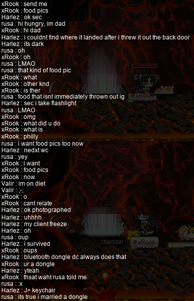
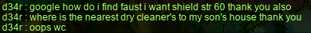

# rangifer’s diary: pt. lxxxvi

## Victorious Island

To date, I have never been a victim of accidentally getting stucc in [the APQ entrance](https://maplelegends.com/lib/map?id=670010100)…! Well, until now, on my [vicloc](https://codeberg.org/Victoria/resources) [dagger spearwoman](https://oddjobs.codeberg.page/guides/introduction-to-odd-jobs/#dagger-warrior) <b>d34r</b> \>w\<

Victorious Island

Talk to [Amos](https://maplelegends.com/lib/npc?id=9201043) one too many times, and poof! Sticked!! Eventually, <b>HolyJuice</b> and I were able to put together an APQ party and get on with it, but still… ’Twas embarrassing…

Meanwhile, on my vicloc [clericlet](https://oddjobs.codeberg.page/guides/introduction-to-odd-jobs/#magelet) <b>d33r</b>, I joined a very special Fitness event! It was very special because it was the actual worst possible Fitness event. With the addition of [invincible Stirges](https://maplelegends.com/lib/monster?id=9100002) to each map, it became effectively impossible to know where your character was, due to all of the people falling down, due to the Stirges’ extreme bullying:

A participant by the name of <b>GenjiDeflect</b> aptly summed up the experience:

Eventually, the GM who hosted the event took mercy upon us and killed all of the Stirges. It was after this point that people started actually finishing the event at all:

I’ve no clue how <b>Holidays</b> managed to do this Fitness in only 11:20, but I also wouldn’t be too surprised if <b>Winterein</b> was the last person to finish… So, no [SoS](https://maplelegends.com/lib/etc?id=4031019) after all of that effort \>.\<

In other news, I did some sadgrinding at [FoG](https://maplelegends.com/lib/map?id=105040306) on <b>d34r</b>… And hit da big level 84~!:

My [OPQ](https://maplelegends.com/lib/map?id=200080101) mule <b>sets</b> is really enjoying the free leech :\]

Oh, yes — another GM event. But this time: Ola Ola! I had never done Ola Ola before (that I can remember), but I had <b>Harlez</b> (<b>VigiI</b>) on voice chat explaining to me how it works and trying to give hints. Ola Ola is largely a game of luck. It proceeds in a series of stages, each one larger than the last. Each stage is a JQ map (so no mobility funny business; everyone is stuck at 100% SPEED &amp; 100% JUMP), and furthermore, does not allow jumping. The only things that you can do are walking left &amp; right, and climbing ladders that you are directly beneath/above. Walking left versus walking right, and choosing to climb one ladder rather than another, constitutes choices made to navigate this labyrinth; at the top of each stage is a row of many portals, but only one of those portals leads to the next stage! The rest only lead to the bottom of the current stage, forcing you to start the stage over.

As a result, because the labyrinth is to a great degree randomly determined, Ola Ola ends up being largely a game of luck, as I mentioned before. However, some strategy can be employed: collusion helps in solving the maze more quickly, as getting hints from your fellow conspirators (e\.g. “the second-from-the-left portal in stage 2 is fake”) helps narrow down the possibilities. Furthermore, you can use `/find` to try to track fellow competitors and check whether or not the portal that they just went in is fake.

As you can see, Harlez actually managed to place in the top three, and claim a game cash prize! I was not so fortunate, but with info from him, I finished not so far behind. So I still got an SoS!:

Meh.

d33r also did some **HOT VICTORIA ISLAND QUESTING**, including the [King Clang](https://maplelegends.com/lib/monster?id=5220000) questline. The first three quests just ask for 50 kills of each of the main three [Florina Beach](https://maplelegends.com/lib/map?id=110000000) species: [Lorang](https://maplelegends.com/lib/monster?id=3230102), [Clang](https://maplelegends.com/lib/monster?id=4230104), and [Tortie](https://maplelegends.com/lib/monster?id=4130101). Sounds easy, right? Well, maybe not so easy for a vicloc clericlet…

I donned some physical attacking gear and my trusty [Sweet Fork Cake](https://maplelegends.com/lib/equip?id=1472088), so that I could throw [Ilbi](https://maplelegends.com/lib/use?id=2070006)s at these annoyingly sturdy little crustaceans (and reptiles):

Along the way, I even managed to get one card! Impressive, considering how long it takes me to kill just one of these little shits:

Eventually, after many stars thrown (and a fair number of [Magic Claw](https://maplelegends.com/lib/skill?id=2001005)s slashed), I finished the requisite 150 kills…!:

Now it was time for the big finale: actually killing the King Clang. I fully expected this fight to be miserable for d33r, but with a [Wizard Potion](https://maplelegends.com/lib/use?id=2002003) or two, it wasn’t so bad!:

Get absolutely REKT, King Clang!! \>:)))))

As usual, I did _even moar_ APQing on d34r… Including with hermit <b>trishaa</b> (<b>MatchaLattes</b>)! We did one such PQ where everyone was crying about having no “attackers”, so I politely informed them that anyone can be an attacker! Just press the attack button!! So we killed the [Grog](https://maplelegends.com/lib/monster?id=9400514) anyways:

In another run with trishaa, we were being led by <b>Timbaland</b>, who guessed (incorrectly) during [the second stage](https://maplelegends.com/lib/map?id=670010300) that the combination would be `131` (read: `[1, 3, 1]`), and sent out a map effect to pre-celebrate:

Ouf.

When vicloc I/L mage <b>Vicloc</b> (<b>Cassandro</b>, <b>Copo</b>, <b>Celim</b>, <b>Sommer</b>, <b>Fino</b>, <b>Gets</b>, <b>Schiller</b>) went to [Someone Else’s House](https://maplelegends.com/lib/map?id=100000005) to farm some [Fairy](https://maplelegends.com/lib/monster?id=3000002) cards, he was surprised to see a [Mushmom](https://maplelegends.com/lib/monster?id=6130101) actually spawn! He called me to come help kill it, so I got a sweet MM kill out of it B)

…Plus a few more that I found when scanning the other channels :P

d33r continued her **EPIC VICLOC QUESTING** journey by doing the next quest in [Muirhat](https://maplelegends.com/lib/npc?id=1092007)’s questline: [Eliminate the Drakes](https://maplelegends.com/lib/quest?id=2202)! I knew that this one was going to be super difficult for d33r, so I waited until I got GM buffs to do this one…:

And again, to my surprise, I actually managed to produce a card, even at the rate that I was killing these things o\_o

This quest only requires 50 [Ice Drake](https://maplelegends.com/lib/monster?id=6230600) and 50 [Drake](https://maplelegends.com/lib/monster?id=5130100) kills, but it took up the first 45 or 50 minutes of my GM buff! Still, the EXP is joocy~

Yay!!! :3

And finally, I have a very special announcement to make. After quite literally _months_ of obsessively checking for [Faust](https://maplelegends.com/lib/monster?id=5220002)s every day, I have _finally_ accumulated enough to finish d34r’s shield! And what’s more — it’s perfect!!!!!!!!:

F55555555555555555555555 I AM THE MOST EPICEST @@@@@@@@@@@@@@@@@@@@@@@@@@@@@@@@@@@@@@@@@@@@@@@@@@@@@@@@@

The shield pictured above now stands as my single favourite item in all of MapleStory.

## rusa busca tarjetas

I may not be the fastest card-hunter in all the land, but the card-hunting never stops with me until all of my characters have a [T10 ring](https://maplelegends.com/lib/equip?id=1119012)!! In other words, roughly the year 2200!!!! And so, my [darksterity knight](https://oddjobs.codeberg.page/guides/introduction-to-odd-jobs/#dex-warrior) <b>rusa</b> is back at the [Eos Tower](https://maplelegends.com/lib/map?id=220000400) once again, to hunt some more clockwork critters.

I started by finishing up the classic [Ratz](https://maplelegends.com/lib/monster?id=3110102):

…And [Black Ratz](https://maplelegends.com/lib/monster?id=3210205) sets:

Then, I headed a bit further up the tower to [the sixth floor](https://maplelegends.com/lib/map?id=221020500), to hunt the [Tweeter](https://maplelegends.com/lib/monster?id=3230308)\* set as well:

Normally, hunting these cards from flying monsters can be pretty damn annoying. But I allowed myself to spend a few [Honster](https://maplelegends.com/lib/use?id=2002021)s here and there so that I could [rawr](https://maplelegends.com/lib/skill?id=1311006) my way to victory. :\]

I headed [two floors up](https://maplelegends.com/lib/map?id=221020700) to enter the [Hidden Tower](https://maplelegends.com/lib/map?id=221020701) and fight some oversized LEGO™ golems for their sets. Not pictured: the [King Block Golem](https://maplelegends.com/lib/monster?id=4230110) set:

While I was there finishing the [Block Golem](https://maplelegends.com/lib/monster?id=4230109) and King Block Golem sets, I ended up with one [Rombot](https://maplelegends.com/lib/monster?id=4130103) card, as well…:

But the Rombot will not fool me this time! I learned my lesson last time, on my [woodsmaster](https://oddjobs.codeberg.page/guides/introduction-to-odd-jobs/#woodswoman) <b>capreolina</b>!! rusa will remain at 1/5 Rombot cards forever!!!

Yet further up the Eos Tower, on [the 22nd floor](https://maplelegends.com/lib/map?id=221021200), I hunted the rather exotic [King Bloctopus](https://maplelegends.com/lib/monster?id=3230103) for its set:

[Three floors further up](https://maplelegends.com/lib/map?id=221021500), I hunted the [Planey](https://maplelegends.com/lib/monster?id=3230304) set as well:

And, while I was at it, I went further up to [the 41st floor](https://maplelegends.com/lib/map?id=221021700) to finish the [Bloctopus](https://maplelegends.com/lib/monster?id=3230302) set that I started when hunting the King Bloctopus set:

And finally, I stopped my Eos Tower card-hunting journey — for now! — at [the 58th floor](https://maplelegends.com/lib/map?id=221022500), hunting all five [Propelly](https://maplelegends.com/lib/monster?id=3230303) cards in this godforsaken map where you cannot actually see anything:

It was only on the fifth card that one actually dropped in a place that I could screenshot! F3

Footnotes for “rusa busca tarjetas”

\*Not to be confused with [Twitter](https://en.wikipedia.org/wiki/Twitter)™.

## Woodsmastering

I did a lot of woodsmastering in the Crimson woods on my [woodsmaster](https://oddjobs.codeberg.page/guides/introduction-to-odd-jobs/#woodswoman) <b>capreolina</b>, hunting such creatures of the forest as the [Headless Horseman](https://maplelegends.com/lib/monster?id=9400549) and, especially, [Bigfoot](https://maplelegends.com/lib/monster?id=9400575) (a\.k\.a. BF, a\.k\.a. Boyfriend).

Here, we can see capre in the middle of clearing all eight channels of [The Evil Dead](https://maplelegends.com/lib/map?id=610010013) — all of which had live HHs — with F/P archmage <b>2sus4u</b> (<b>uayua</b>, <b>shadowban</b>, <b>tb303</b>), and sniper <b>Level1Crook</b> (<b>Lvl1Crook</b>, <b>xXCrookXx</b>, <b>Macer</b>):

At our level, a single HH doesn’t offer much. But clearing eight of them in quick succession ain’t half bad EXP!

After a while, and after some grinding [at Gallos](https://maplelegends.com/lib/map?id=551030100), capreolina finally hit the big level 135~!!!:

LET’S GET IT @@@@@@@@@@@@@@@@@@@@ IT’S TIME TO GRIEF SOME [ZAK](https://maplelegends.com/lib/monster?id=8800002)/[KREX](https://maplelegends.com/lib/monster?id=9420521)/[SCAR](https://maplelegends.com/lib/monster?id=9420549)/[TAR](https://maplelegends.com/lib/monster?id=9420544) runs!!!!! :P

I did some duo BFs with 2sus4u, and tried out a quick &amp; dirty `@dpm 5` test:

Alright, 66\.3[M](https://en.wikipedia.org/wiki/Mega-) DPH, not bad. At that rate, I could solo a BF in just half an hour! ;\]

And I did some [Rāvaṇa](https://maplelegends.com/lib/monster?id=9420014)ing/[Pepper Latticing](https://maplelegends.com/lib/monster?id=8500001) with pog shadower <b>Harlez</b> (<b>VigiI</b>) for _even moar_ EXPs:

Back at the Crimsonwood Forest, I had some [toe](https://maplelegends.com/lib/etc?id=4032013)ments with Level1Crook…:

…And got to fight BF with hermit <b>trishaa</b> (<b>MatchaLattes</b>) for the first time!:

We tried BFing at The Evil Dead…

Yeah, this is pretty typical in setting up for an Evil Dead BF kill. After some [Safety Charm](https://maplelegends.com/lib/cash?id=5130000)s later, we did manage to get a stable pin. As you can see in the image below, Level1Crook’s duty is to keep the [Elderwraith](https://maplelegends.com/lib/monster?id=9400580)s at bay, maintaining the integrity of our pin:

:3

## le Temple du Temps

Meanwhile, my [darksterity knight](https://oddjobs.codeberg.page/guides/introduction-to-odd-jobs/#dex-warrior) <b>rusa</b> has only just started the [Temple of Time](https://maplelegends.com/lib/map?id=270000100) questline. Eventually (and I do mean _eventually_…), rusa may one day fight [the pink legume](https://maplelegends.com/lib/monster?id=8820001)… but not if I don’t even have the ToT quests done!!

So I was assisted by shadower <b>Harlez</b> (<b>VigiI</b>) in completing these quests; first, I had to finish up the [Memory Monk](https://maplelegends.com/lib/monster?id=8200001) kills that I didn’t already have from the previous event’s raffling system:

With those 999 kills done, we headed to [ML2](https://maplelegends.com/lib/map?id=270010200) for 999 [Memory Monk Trainee](https://maplelegends.com/lib/monster?id=8200002) kills!:

And with those 999 kills done, I will be moving on to [ML3](https://maplelegends.com/lib/map?id=270010300) to fight [gassy armour guys](https://maplelegends.com/lib/monster?id=8200003) next time!

Along the way, I’ve so far gotten one [free card set](https://maplelegends.com/lib/monster?id=8200000), which is nifty! Hopefully we will see rusa getting further along in this questline in the future……

## Empy queue

I did a handful of [MPQ](https://maplelegends.com/lib/map?id=261000021)s on my F/P MPQ mule <b>potpan</b>, mostly to help out [STRginner](https://oddjobs.codeberg.page/guides/introduction-to-odd-jobs/#permabeginner-outland) <b>uayua</b> (<b>2sus4u</b>, <b>shadowban</b>, <b>tb303</b>), although I did some MPQs still after they had to leave:

I must say, although I don’t regret making potpan what she is (a non-odd F/P mage), I do just feel like a [fart](https://maplelegends.com/lib/skill?id=2111003) machine sometimes…

Oh, well. potpan is the only F/P I’ve ever played, so it’s nice to at least get some taste for the class!

We were joined in our MPQventures by hermit <b>ChestPoop</b>, who you can see in the image below, in which I actually got to fight [Angy Fanky](https://maplelegends.com/lib/monster?id=9300140) instead of just protecting [Romeo](https://maplelegends.com/lib/monster?id=9300138)/[Juliet](https://maplelegends.com/lib/monster?id=9300137):

Good luck to uayua on getting [that pendant](https://maplelegends.com/lib/equip?id=1122010)! It really is a huge deal for permabeginners!!

## Crashing JoeWick’s level 200 party

I crashed the level 200 party of a certain <b>JoeWick</b>, now level 200 corsair, whom I only knew from doing a [Horntail](https://maplelegends.com/lib/monster?id=8810003) run or two with, at the request of my Moople spouse <b>Harlez</b> (<b>VigiI</b>)…

Unbeknownst to me, this was a _costume_ party. You can see above that <b>Wyman</b> is dressed as some kind of English detective, <b>hotdogbao</b> is dressed as a blue-haired version of JoeWick, <b>Troop</b> is dressed as a [postwar](https://en.wikipedia.org/wiki/Post-war) footsoldier, <b>Cerealb4milk</b> is dressed as a JoeWick clone, <b>Propeller</b> is dressed as a Mesoranger, and <b>iRBG</b> (<b>SmallMight</b>, <b>SiriusPlaque</b>) is dressed as [Ruth Bader Ginsburg](https://en.wikipedia.org/wiki/Ruth_Bader_Ginsburg). There were also a number of other costumes not caught in the screenshot above. Unfortunately for me, I came dressed as some kind of ridiculous version of [Mary Poppins](https://en.wikipedia.org/wiki/Mary_Poppins) or something, so I didn’t participate in the costume contest :P

## トウキョウ（未来）

Now that my [darksterity knight](https://oddjobs.codeberg.page/guides/introduction-to-odd-jobs/#dex-warrior) <b>rusa</b> is high enough level to get EXP from some of the Neo Tokyo (NT)\* bosses, I have started making progress through the questline! In a previous entry, I was assisted by I/L archmage <b>Gruzz</b> (<b>Furca</b>) in doing the first batch of quests in [2100 Odaiba](https://maplelegends.com/lib/map?id=802000200). These are the [Bergamot](https://maplelegends.com/lib/monster?id=9400263)† prequests, so by the time I was done, I had nothing left to do — I was not yet prepared to fight a boss as strong as Berga! However, that has now changed… So I joined forces with shadowers <b>Sagie</b> and <b>Harlez</b> (<b>VigiI</b>) to fight this big bad Japanese robot!:

トウキョウ（未来）

To summon the beast, one must first kill this annoying flying robot thingy:

And there it is, in all of its ugly glory!!:

Berga has three bodies; as it transitions from one body to the next, it loses some part of its structure. From body one to body two, it loses its [rotary autocannon](https://en.wikipedia.org/wiki/Rotary_cannon). From body two to body three, it loses its [laser weapon](https://en.wikipedia.org/wiki/Laser_weapon). Although this suggests that its third body may be the weakest, it doesn’t quite pan out that way. Although the first body is definitely the “strongest” in terms of how much punishment it can take, the first body also doesn’t try that hard to kill you (although it definitely still can kill you…). The real punishment comes with the third and final body, where Berga loses its laser weaponry, but gains a new cannon on the front of its body that hits quite hard (&ap;14[k](https://en.wikipedia.org/wiki/Kilo-) damage to an unarmed &amp; unarmoured target) and stuns. What’s worse, you now have no choice but to dodge the missiles that Berga has been shooting this whole time, because not only do they hit harder now (&ap;12k damage to an unarmed &amp; unarmoured target), but they seduce you!!! The seduce appears to always be a jump sed (forcing the victim to jump repeatedly and do nothing else, not even eat potions/food!), and thus tends to cause [PC](https://en.wikipedia.org/wiki/Player_character)s to jump at the top-left corner of the map. This is because the attack _also_ knocks back, thus naturally imparting a leftward [momentum](https://en.wikipedia.org/wiki/Momentum) on the victim, and because the bottom of the map (where you can actually attack Berga) is actually water, so a few jumps yeets you high up into the air:

Of course, the knockback from the attack can be thwarted by [Power Stance](https://maplelegends.com/lib/skill?id=1321002), which causes the seduce victim to remain in range of Berga’s attacks while they are seduced. Worse is if you get seduced and stunned at the same time…

So, needless to say, I died.

Owie.

We tried again, aided by corsair <b>danicuwu</b> and buccaneer <b>KaLin</b>:

…Aaaand I still died:

As you can see, I died while in the middle of [Smokescreen](https://maplelegends.com/lib/skill?id=4221006). Obviously, this should not be possible, as Berga cannot damage reflect (DR; although we will see a certain boss that can DR later on…). Rather, this is just a result of Berga cheating and sometimes instakilling players for no reason. What’re ya gonna do. &#x1f937;&#x1f3fD;&#x200d;&#x2640;&#xfe0f;

In any case, for the next run, I decided to keep eating the [Onyx Apple](https://maplelegends.com/lib/use?id=2022179)s that Harlez gave me so that I could pretend to almost be like a normal DK… And I took a look at my raw damage range:

That’s a crisp 3k&#x301c;4k range right there! Holy moly!!

And with that, I finally survived a Berga run… &#x1f60c;

Next time, I got the distinct privilege of dying to the same bug again, but this time alongside Sagie:

However, that one clear I got was enough to continue the questline! So I started on the NTPQ prequests at [2095 Park](https://maplelegends.com/lib/map?id=802000300). While I was there, I finished the very easy [Prototype Lord](https://maplelegends.com/lib/monster?id=9400255)‡ card set!:

And, after a while of grinding here (and some help from Harlez, Sagie, and danicuwu), I managed to nab the [Twisted Radar](https://maplelegends.com/lib/etc?id=4032158) that I needed!:

Now it was time to try the aforementioned NTPQ (Neo Tokyo Party Quest). I had heard about “NTPQ” many times in the past, and always wondered what it was really like. <b>SmallMight</b> (<b>SiriusPlaque</b>) told me that it’s “like [PPQ](https://maplelegends.com/lib/map?id=251010404), but for grown-ups”, so I was kinda excited to see it. As it turns out, it’s more like a cross between [HPQ](https://maplelegends.com/lib/map?id=910010000) (without the planting seeds stage) and [ENPQ](https://maplelegends.com/lib/map?id=921100300). It takes place in this strangely pristine and cheery-looking children’s park that has been rather rudely invaded by giant terrifying flying robots with high-tech guns, wherein you must protect [Dida](https://maplelegends.com/lib/monster?id=9400261) &amp; [Marr](https://maplelegends.com/lib/npc?id=9120030), two small children who are understandably upset by the sudden robot invasion.

This amounts to a neverending swarm of high-powered robots that you have to hack your way through until you finally collect all ten of the [Energy Transmitter](https://maplelegends.com/lib/etc?id=4032192)s that drop from the [Maverick B](https://maplelegends.com/lib/monster?id=9400258)s here:

With all ten transmitters, you can turn them into Dida to clear the PQ:

Besides giving some nifty [coin](https://maplelegends.com/lib/etc?id=4032181)s, and giving me a nifty card set or two(!), finishing NTPQ for the first time unlocks the next area of the NT questline: [Akihabara](https://maplelegends.com/lib/map?id=802000500) ([秋葉原](https://en.wikipedia.org/wiki/Akihabara)).

Akihabara means access to [Iruwata](https://maplelegends.com/lib/monster?id=9400260)s⸸, the monster that drops [SSB](https://maplelegends.com/lib/equip?id=1442046)s!!! But really, I just need their [laser gun](https://maplelegends.com/lib/etc?id=4032161)s and one of their [transmitter](https://maplelegends.com/lib/etc?id=4032180)s. [The NT guide on the MapleLegends forums](https://forum.maplelegends.com/index.php?threads/neo-tokyo-guide.25729/) says that this quest item (the “Eruwater Transmitter”) is actually quite easy to get, and that I should have it before even getting the 300 laser guns…

While I was there hunting Iruwatas with Harlez and Sagie, we found out that a certain spot in the map is a tad bit buggy, trapping PCs who get too close:

The only way to get out is to change channels, or use the [FM](https://maplelegends.com/lib/map?id=910000000) button, etc. And its prey is not limited to PCs; pets can get stuck too! As my poor [Monkey](https://maplelegends.com/lib/cash?id=5000011) found out the hard way…

R\.I\.P. Monkey, 2021–2022 &#x1f614;

As it turned out, I did not get so lucky with the Iruwata Transmitter. I had well over 300 Iruwata Laser Guns before I finally found the damn thing! Luckily for me, Sagie stayed and kept helping me farm even after Harlez had to sleep!:

On the way back to the Akihabara command centre, I noticed something about [the 2102 Akihabara map](https://maplelegends.com/lib/map?id=802000400)…:

Oh, it is an MRT car that I know all too well. This is the same exact MRT car found in [B3 \<Subway Depot\>](https://maplelegends.com/lib/map?id=103000909), [B2 \<Subway Depot\>](https://maplelegends.com/lib/map?id=103000905), and [B1 \<Subway Depot\>](https://maplelegends.com/lib/map?id=103000902) — the former two being my [vicloc](https://codeberg.org/Victoria/resources) [clericlet](https://oddjobs.codeberg.page/guides/introduction-to-odd-jobs/#magelet) <b>d33r</b>’s favourite places to train :')

In any case, this marked the end of the [Dunas](https://maplelegends.com/lib/monster?id=9400270)¶ prequests. <del>Dunas prequests? More like DONE-ASS PREQUESTS!!!</del>

So I joined a party with Sagie, Harlez, and corsair <b>ToasTea</b> to take on Dunas for the first time!:

Here’s a pretty good shot of what a Dunas fight looks like:

Dunas’s main gimmick is that they’re capable of DRing (damage reflecting). Nominally, this ability does what it says on the tin: if you attack a monster that is DR’d, you don’t damage the monster, but rather get the damage that you _would_ have done to the monster reflected back at yourself. This kills the PC. We will later see why this isn’t an accurate characterisation of DR, but for now it’s good enough. You do get some warning: when Dunas casts DR, they appear to merely be weapon-cancelled at first: all physical attacks deal damage lines that are either “<b>1</b>”s or “<b>MISS</b>”es, but the actual damage _reflection_ isn’t active for another &ap;1 second or so. Without this grace period, DR would certainly be unfair; besides the obvious [reaction time](https://en.wikipedia.org/wiki/Mental_chronometry) necessary, it still remains that many attacking animations in the game commit the PC to attacking long after the player has actually given [input](https://en.wikipedia.org/wiki/Input_device). In any case, what this effectively amounts to is: “if you start seeing ‘1’s, stop attacking”.

While I was doing my first Dunas run, I was on [voice chat](https://en.wikipedia.org/wiki/Voice_over_IP) with my other three party members. ToasTea instructed me that the purple circular “pop” animation (which ends in a kind of purple crescent, with the crescent’s opening facing upwards) is something that Dunas always does immediately before DRing. This turns out to be correct. However, ToasTea also added that Dunas DRs after every fifth “pop” animation (even counting the pink — i\.e. not purple — ones). This turns out to be not so correct…:

In the end, we actually all died. Well, except for Harlez. So we got to watch Harlez solo the rest of Dunas on a [live stream](https://en.wikipedia.org/wiki/Livestreaming):

Eventually, Harlez successfully finished the solo Dunas run! And got the chair!!!!!:

Grats!!

Still, this wasn’t enough to get me a Dunas clear, so we tried again later, but this time as a duo with just me and Harlez:

And I died again. So we went for round two. But it didn’t work out…

There is this weird visual bug where, every time that Dunas does a purple “pop” animation, I see a “<b>1</b>” damage number, _even if it’s not actually DRing at all_. This turned out to be _super_ confusing and must be some weird [client](https://en.wikipedia.org/wiki/Client%E2%80%93server_model)-side thing, because other people don’t report seeing it. In any case, I eventually got used to it and learned to spot DRs more accurately in spite of this dumb bug.

So, on another day, we tried again!

But it didn’t work out… and Harlez had to go to sleep…

But you will notice something: Dunas is already down to like &ap;30% HP, right? And I’ve still got three hours left on the clock, right?? So I can just solo it, right???

One major mistake that I made was bringing very few [ACP](https://maplelegends.com/lib/use?id=2022178)s with me. I forgot to restock, but I probably would have had enough ACPs between me &amp; Harlez (assuming that Harlez had some extras) to finish the run, if we had been duoing the whole time. Alas, while soloing Dunas I very quickly ran out of ACPs and had no way to dispel Darkness when Dunas cast it on me…:

At first, I was not very good at soloing Dunas. I still didn’t quite understand all of Dunas’s animations and how their spells work, so I effectively wasted a lot of DPS by doing other things that aren’t attacking. The first thing that I learned was that the bottom-left corner of the map is essentially a safe spot. This came in handy when I had to take a trip to [the little Maplers’ room](https://en.wikipedia.org/wiki/Bathroom). Furthermore, you can usually go a bit to the right without getting so close as to be attacked by Dunas, depending on Dunas’s behaviour at the moment — this can shave off a few fractions of a [second](https://en.wikipedia.org/wiki/Second) here and there. So usually, when Dunas was DR’d (or I was Darkness’d lol), I would go towards the bottom left and rebuff there. Then I can sit in my mount until I’m ready to attack, and use the mount’s jump to yeet myself out of the water (yes, the bottom of the map is water) and directly onto the platform that Dunas occupies.

I later learned to avoid getting Darkness’d altogether; when Dunas does their annoying “teleport” thing, you have to be either horizontally further left than, or further right than, the horizontal positions that Dunas starts and ends at when teleporting. Otherwise you get Darkness. Also, for some reason, Dunas is weirdly invincible (or maybe its hitbox is just somewhere else) about half of the time that it teleports. The other half of the time, their hitbox actually follows their visual position as you’d expect. I also learned how to hug Dunas to get invincibility frames and dodge some of Dunas’s other nasty tricks, like the stun-and-knockback, and the dispel. When I did get dispelled, I learned to only re-cast three of my buffs (which is like half of the buffs I that would normally re-cast): [HB](https://maplelegends.com/lib/skill?id=1301007), [Spear Booster](https://maplelegends.com/lib/skill?id=1301004), and [Power Stance](https://maplelegends.com/lib/skill?id=1321002). Notably, I did **not** re-cast [MW](https://maplelegends.com/lib/skill?id=1321000), as its cast time is too lengthy to justify. I am basically forfeiting like two attacks just to cast MW (so that it can get DP’d later…).

I also learned that DR appears **not** to work as naïvely explained. As far as I can tell, when attacking a DR’d Dunas, _it does not matter what attacking skill (or non-skill) you use_. In particular, it was tempting to me to try to probe Dunas for being DR’d by basic-attacking it. I learned that my basic-attacks against Dunas tend to deal (with ordinary buffs like [Cider](https://maplelegends.com/lib/use?id=2022002), MW, etc.) roughly &ap;4k at absolute best, meaning that I could easily test Dunas for DR status by giving them a little poke (you could also consider crouch-poking), with very little repercussion if Dunas does happen to be DR’d. It might seem like a weird thing to do, but the fact is that Dunas _waits a really long time_ to actually show the DR icon above their head, so if you’ve just seen a purple “pop” animation, and you haven’t attacked recently, it can be really concerning not to know whether or not Dunas is currently DR’d. The “haven’t attacked recently” part may also seem strange, but fighting Dunas just really sucks hard if you are a melee attacker. I mean, it blows. So when fighting in a party of only melee attackers (like me &amp; Harlez duoing, or me soloing…), it’s not uncommon to have significant periods of time where no one attacks Dunas, even when they aren’t DR’d! But this turns out to be the wrong idea; as far as I can tell, the amount of damage that you take for striking a DR’d Dunas appears to only depend on your raw damage range and some bespoke formula, or something like that. Maybe it’s like, [uniformly](https://en.wikipedia.org/wiki/Discrete_uniform_distribution) selecting a value from within your raw damage range, and then multiplying it by some constant? I don’t know. The point is that, unlike what you would naïvely expect, using weaker attacks does **not** appear to save you when it comes to Dunas’s DR.

In any case, I learned all of these things too slowly, and I took too few ACPs with me. I am confident that with better preparation, I would have killed Dunas myself. In the end, I had even used two or three [Onyx Apple](https://maplelegends.com/lib/use?id=2022179)s, but still to no avail. It was starting to look pretty close for time, as it was hard for me to gauge how long it might take me to kill the rest of Dunas at the now-accelerated rate due to my improved strategy.

And then, it did not matter. Because I accidentally killed myself.

Pictured above: My soul physically leaving my body after 3\.5 hours of largely continuous Dunas-fighting. I will never recover. &#x1faa6;

Although my soul may no longer inhabit my body, I still trudged on, another day, to fight Dunas alongside Harlez and corsair <b>Dabulator</b>:

Now that we had a ranged attacker in our party, I did my fair share of “fake pinning” (Dunas has a KB of **50k**(!!) so actually pinning it is more for like, paladins and stuff…) by [Rush](https://maplelegends.com/lib/skill?id=1321003)ing Dunas into the left side of their platform:

And finally, at long last, a Dunas clear!!:

Clearing Dunas unlocks the [Nibelung](https://maplelegends.com/lib/monster?id=9400272)※ prequests, which consists of hunting an apparently very rare quest drop — the [Portable Laser Guidance](https://maplelegends.com/lib/etc?id=4032164) (PLG) — from [Mavericks Y](https://maplelegends.com/lib/monster?id=9400257). The new area associated with Nibelung is [2102 Old Fox Flagship Deck](https://maplelegends.com/lib/map?id=802000600):

On this map, we can see [a more mature Dida](https://maplelegends.com/lib/npc?id=9120033), some &ap;7 years later, but still the same Dida that we saw at [2095 Park](https://maplelegends.com/lib/map?id=802000300) and NTPQ:

Speaking of NTPQ, it was time to go _back_ 7 years to do that PQ some more, until I can get a PLG \>.\< Below, you can see me NTPQing with Harlez and paladin <b>ItzLeo</b>:

After that, I did just one or two more NTPQs with Harlez, and managed to get the elusive PLG!!!:

I guess it’s time to fight the ol’ Nib now… Tune in next time for more NTing!!!

Footnotes for “トウキョウ（未来）”

\*Talking about Neo Tokyo is a bit confusing because of how many names and different versions there are associated with it. “Neo Tokyo” is also referred to as simply “NT” (not to be confused with [the Windows™ kernel](https://en.wikipedia.org/wiki/Windows_NT)), as well as “Tokyo (Future)”; the [Japanese](https://en.wikipedia.org/wiki/Japanese_language) name for it is トウキョウ（未来） or 東京（未来） ([rōmaji](https://en.wikipedia.org/wiki/Romanization_of_Japanese): <i>Tōkyō (mirai)</i>, [lit.](https://en.wikipedia.org/wiki/Literal_translation) “Tokyo (future)”). To make things more confusing, many of the names used internally in NT (e\.g. monster names) have been inconsistently [romanised](https://en.wikipedia.org/wiki/Romanization) by implementations like [E](https://en.wikipedia.org/wiki/Europe)MS and Maple[SEA](https://en.wikipedia.org/wiki/Southeast_Asia) which needed to romanise the originally Japanese names. To make things even _more_ confusing, NT was implemented in several MapleStory versions (notably including [J](https://en.wikipedia.org/wiki/Japan)MS, MapleSEA, and EMS), but was **not** implemented in [G](https://en.wikipedia.org/wiki/Globe)MS. Instead, GMS got a watered-down version of NT called [Neo City](https://maplestory.fandom.com/wiki/Neo_City), which retained almost all of the substance of NT (maps, monsters, NPCs, reactors, etc.), but was designed for lower-level characters, and notably was not part of Japan ([Zipangu](https://en.wikipedia.org/wiki/Names_of_Japan#Jipangu)) at all! Instead, Neo City (note that it is just “a city” instead of specifically [Tokyo](https://en.wikipedia.org/wiki/Tokyo)) was part of the Minar Forest (read: Leafre &amp; its associated Dragon Nest region). To make things _even even more_ confusing, NT (&amp; Neo City) has been removed from all current versions of MapleStory (although JMS is supposedly getting it back soon), making information difficult to find. To make things _even even even more_ confusing, in recent versions of MapleStory, there is a different high-level area of Zipangu simply called “[Tokyo](https://maplestory.fandom.com/wiki/Category:Tokyo)”, which is supposed to be the present-day version of NT. To make things _even even even even more_ confusing, I don’t actually know which version developmentally came first: the JMS one, or the [K](https://en.wikipedia.org/wiki/South_Korea)MS one. Because NT is obviously in Japan, it’s tempting to think of all of the names as being “originally” Japanese (and that is what I’m going to do here), but it’s _also_ possible that the KMS version instead came first, and used names of [Korean](https://en.wikipedia.org/wiki/Korean_language) origin(??) sometimes? Or always? I don’t know, I’m so confused at this point.

†Japanese lacks the [voiced labiodental fricative](https://en.wikipedia.org/wiki/Voiced_labiodental_fricative) ([IPA](https://en.wikipedia.org/wiki/International_Phonetic_Alphabet): ⟨v⟩, e\.g. the first [segment] of the [English](https://en.wikipedia.org/wiki/English_language) <i>vest</i>), which is unsurprising, as this [phone] is crosslinguistically somewhat rare. However, Japanese most definitely possesses the [voiced bilabial plosive](https://en.wikipedia.org/wiki/Voiced_bilabial_plosive) (IPA: ⟨b⟩, e\.g. the first segment of the English <i>best</i>), and uses this [phoneme](https://en.wikipedia.org/wiki/Phoneme) to approximate /v/ in [loanwords](https://en.wikipedia.org/wiki/Loanword) and [transliterations](https://en.wikipedia.org/wiki/Transliteration). As a result, some [minimal pairs](https://en.wikipedia.org/wiki/Minimal_pair) that rely on a contrast between /v/ and /b/ in another language (e\.g. English <i>vest</i>&#x29f8;<i>best</i>) will be indistinguishable when imported into Japanese. As a result, implementations have been very inconsistent with naming this boss: both ⟨Bergamot⟩ and ⟨Vergamot⟩ can be seen. For the aforementioned reasons, ⟨Bergamot⟩ would seem to be the more “correct” spelling, so that is the one that I use here. So maybe something like ベラガモ (rōmaji: <i>beragamo</i>; /be&#x31e;&#x27e;agamo&#x31e;/) in [katakana](https://en.wikipedia.org/wiki/Katakana)…? I’ve no clue. (Consider also ベーガモ.) However, this assumes a [French pronunciation](https://en.wikipedia.org/wiki/French_orthography); if we’re talking about [the fruit (<i>Citrus bergamia</i>)](https://en.wikipedia.org/wiki/Bergamot_orange), then the ⟨t⟩ is not “silent”…! So [벨가뫁](https://en.wikipedia.org/wiki/Hangul) ([RR](https://en.wikipedia.org/wiki/Revised_Romanization_of_Korean): <i>belgamot</i>; /peɭkɐmot&#x31a;/) maybe? LMAOOO

‡MapleSEA [localised](https://en.wikipedia.org/wiki/Internationalization_and_localization) the name of this monster species as ⟨Protoroad⟩, but other implementations give the English name as ⟨Prototype Lord⟩, the term that I use here. MapleLegends historically used ⟨Protoroad⟩, as its NT implementation is based on that of MapleSEA.

⸸Again, MapleSEA [romanised](https://en.wikipedia.org/wiki/Romanization) this monster species name as ⟨Eruwater⟩, but other implementations disagree, instead calling it ⟨Iruvata⟩. One concerning aspect of the MapleSEA romanisation is the word-final ⟨r⟩; as far as I know, /&#x27e;/ cannot [phonotactically](https://en.wikipedia.org/wiki/Phonotactics) end a [syllable](https://en.wikipedia.org/wiki/Syllable) in Japanese. Given that both romanisations have the same number of vowels, the word-final ⟨r⟩ in ⟨Eruwater⟩ is probably just confusing an ordinary vowel with an [r-coloured vowel](https://en.wikipedia.org/wiki/R-colored_vowel), or something like that. On the other hand, the ⟨Iruvata⟩ romanisation confusingly uses a ⟨v⟩. The original (if written in katakana) is thus probably イルワタ (rōmaji: <i>iruwata</i>; /i&#x27e;uwata/), which is what I use here.

¶Ah, finally a romanisation that we can all agree on. The original is presumably, if written in katakana, ヅナス (rōmaji: <i>dunasu</i>; /d&#x361;zunasu&#x306;/). Also, while we’re talking about Dunas, I don’t know what [gender](https://en.wikipedia.org/wiki/Gender) Dunas is supposed to be (or not be), but they a real cutie pie. Just sayin’. &#x1f633;

※So I really have no idea what is going on here. I will be using ⟨Nibelung⟩, but other implementations (including MapleLegends in the past, and also present, to some extent) use ⟨Nibergen⟩. The only way that I can seem to plausibly explain this is that ⟨Nibergen⟩ really was some “[beta](https://en.wikipedia.org/wiki/Software_release_life_cycle#Beta)” name (as suggested [here](https://forum.maplelegends.com/index.php?threads/christmas-2021-patch-notes.43817/)) that was used before the game was fully localised &amp; released (i\.e. prior to the gamma release). So ⟨Nibergen⟩ was idiosyncratically adopted into MapleSEA, but **not** into other implementations, because during the development process, it was decided that the name should be changed to reflect the [German](https://en.wikipedia.org/wiki/German_language) <i>[Nibelung](https://en.wikipedia.org/wiki/Nibelung)</i>! I don’t know enough about [Germanic mythology](https://en.wikipedia.org/wiki/Germanic_mythology) to comment on _why_ Neckson may have chosen to name this futuristic Japanese spaceship after “[\[a\] member of a supernatural underground race that guarded treasures and gold searched for and eventually seized by Siegfried](https://en.wiktionary.org/wiki/Nibelung#English)” (<i>Siegfried</i> being the hero of [the epic poem](https://en.wikipedia.org/wiki/Nibelungenlied)), but there you have it. If we keep trying to reverse-engineer some katakana out of this (surely inadvisable, as this name is probably German!), we’d get something like ニーベルン (rōmaji: <i>nīberun</i>; /ni&#x2d0;be&#x31e;&#x27e;uŋ/). For ⟨Nibergen⟩, maybe something like ニベーゲン (rōmaji: <i>nibēgen</i>; /nibe&#x31e;&#x2d0;ge&#x31e;n/)?? More like 니벨겐 lololol… I give up. &#x1fae0;

[segment]: https://en.wikipedia.org/wiki/Segment_(linguistics)
[phone]: https://en.wikipedia.org/wiki/Phone_(phonetics)

## 紅葉狩

Meanwhile, on Maple Island, I did some duo [DF](https://maplelegends.com/lib/map?id=1000002) with fellow [islander](https://oddjobs.codeberg.page/guides/introduction-to-odd-jobs/#islander) <b>jung1e</b> (<b>Plucks</b>) on my islander <b>ozotoceros</b> and her trusty caribou sidekick, <b>bezoarticus</b>:

After a few GM buffs/[basket](https://maplelegends.com/lib/use?id=2020024)s, ozo hit the big level 45~!!:

Oh hello there, [Wonky](https://maplelegends.com/lib/npc?id=9000133). Fancy seeing you here… Thanks for the free EXP!! I’m afraid I won’t be going to the [Time Control Room](https://maplelegends.com/lib/map?id=222020400), though…

While I was there, I tested out the brand-new “Friendship Shirt” with jung1e, who gifted me one:

Why does it show a glowing red [pentagram](https://en.wikipedia.org/wiki/Pentagram)? Who knows! But in any case, we also got a fancy friendship _ring_ that shows big ol’ crossed swords above our heads as well:

Two friendship effects at once. Cool…!

## `Scarlion.tar.ga`

On my [darksterity knight](https://oddjobs.codeberg.page/guides/introduction-to-odd-jobs/#dex-warrior) <b>rusa</b>, I also did some [Scarlion](https://maplelegends.com/lib/monster?id=9420549)/[Targa](https://maplelegends.com/lib/monster?id=9420544) runs with marksman <b>xBowtjuhNL</b> and shadower <b>Harlez</b> (<b>VigiI</b>). Below, you can see us struggling to hit Targa’s godforsaken hitbox as it inexorably hops forward:

During such a Targa run, Harlez had an unfortunately-timed [keyboard](https://en.wikipedia.org/wiki/Computer_keyboard) malfunction, and had to go find a new keyboard in the middle of combat. Although we tried to take good care of them (and the helm buyer, at the same time!) while they were AFK and/or unable to control their [PC](https://en.wikipedia.org/wiki/Player_character), it was only so long before the inevitable:

Luckily, our buyer was a low-level bishop who had level one [Resurrection](https://maplelegends.com/lib/skill?id=2321006), so we still made it through the run just fine &#x1f60a;

During a Scarga (fighting Scarlion &amp; Targa at the same time!) run with nightlord <b>DexlessLinh</b> and hero <b>MadScythe</b>, xBowtjuhNL fell asleep IRL…

Luckily, he eventually woke up, and we were only missing [SE](https://maplelegends.com/lib/skill?id=3221002) for like three minutes! And, lo &amp; behold, an array of helmets for our buyer, and a Mysterious Coin Pouch for us!:

Unfortunately for Harlez, buyers have a bad habit of accidentally stealing the Targa cards… &#x1f612;

## The ballad of the level one crook

In the “Woodsmastering” section above, I went over some of the Crimsonwood Forest hunting that I did with sniper <b>Level1Crook</b> (<b>Lvl1Crook</b>, <b>xXCrookXx</b>, <b>Macer</b>, <b>Lanius</b>). It was during this hunting that the fabled day finally came for our intrepid level one crook: the opportunity to level up to a level 120 crook!!!!!:

You know what that means: it’s time to go from an honourable sniper to the almighty marksman! I — along with F/P archmage <b>2sus4u</b> (<b>uayua</b>, <b>shadowban</b>, <b>tb303</b>) — helped Level1Crook with killing the [Manon](https://maplelegends.com/lib/monster?id=8180000) necessary for job advancement:

And, after doing some fourth-job quests on his own, Level120Crook was prepared to [SE](https://maplelegends.com/lib/skill?id=3221002) and [Snipe](https://maplelegends.com/lib/skill?id=3221007) alllll up in some bosses!:

Faster [Rav](https://maplelegends.com/lib/monster?id=9420014)/[Pap](https://maplelegends.com/lib/monster?id=8500001) runs! Cool!! :3 Grats again~!

## <i>R. tarandus</i>

I also did a lil bit more questin’ on my [shield pugilist](https://oddjobs.codeberg.page/guides/introduction-to-odd-jobs/#pugilist) <b>tarandus</b>. As I went over in the previous diary entry, tara is doing the [Coke™ Town](https://maplelegends.com/lib/map?id=219000000) questline, so I went back over to [Small Alley](https://maplelegends.com/lib/map?id=219020001) for some [seal](https://maplelegends.com/lib/monster?id=9500146)-smackin’ fun…:

With enough ETCs collected from these two Coke™-flavoured seal species, I had actually finished all Coke™ Town quests that were available to me at that point. So I will have to shelf Coke™ Town for now.

My next plan was to tackle some more Victoria Island quests, but I decided to avoid those for now, so that I would have something cool to do with [vicloc](https://codeberg.org/Victoria/resources) I/L [gish](https://oddjobs.codeberg.page/guides/introduction-to-odd-jobs/#gish) <b>VigiI</b> (<b>Harlez</b>). Instead, I took a look at some _nominally_ Victoria Island quests (i\.e. quests that show up under the “Victoria Island” tab in the quest journal) that are actually not vicloc-completable.

For example, I did [The Large Pearl](https://bbb.hidden-street.net/quest/victoria-island/the-large-pearl), which is vicloc-uncompletable as a result of having [Sea Firefly](https://bbb.hidden-street.net/quest/victoria-island/sea-firefly) as a pre-requisite; Sea Firefly requires travelling to the [Aquarium](https://maplelegends.com/lib/map?id=230000000). But really, this quest is just… smaccin’ some [oyster](https://en.wikipedia.org/wiki/Pinctada):

So, with that quest done, I set out to start every vicloc-uncompletable quest that _starts_ in Victoria Island, and then take the fateful ship ride from [Ellinia](https://maplelegends.com/lib/map?id=101000000) to [Orbis](https://maplelegends.com/lib/map?id=200000000). With all of those quests accepted, the first order of business was [Find the Maple History Book](https://bbb.hidden-street.net/quest/victoria-island/find-the-maple-history-book), so I started breaking random cargo below deck in this airship flight, looking for [the first volume of <i>Maple History</i>](https://maplelegends.com/lib/etc?id=4031157)…

When I landed in Orbis, I immediately got distracted and started doing random Orbis quests. These low-level Orbis quests really want you to punch a lot of smol kitties and take [their horn](https://maplelegends.com/lib/etc?id=4000073)s!:

Tune in next time for the following episode of <i>Questing With tara</i>™, in which I probably punch even more miniature kittens in the face!

## <i>Siricidae</i>

Oh, you’d better bet it is time for mooooooooooooooooooooooooooooooooooooooooar hornytailing!! With your host: <b>rusa</b> the [darksterity knight](https://oddjobs.codeberg.page/guides/introduction-to-odd-jobs/#dex-warrior)!!! (Actually <b>xBowtjuhNL</b> was the host for most or all of these runs lol :) tyyy~)

We sold an AFK [HTP](https://maplelegends.com/lib/equip?id=1122000) to <b>Nyotaimori</b>. During the first prehead, our sed shadower <b>Sagie</b> accidentally took a wrong turn and ended up next to the buyer \>w\<

The horned tail of legend

It was alright though, we had enough [Resurrection](https://maplelegends.com/lib/skill?id=2321006)s :P In fact, I levelled to this prehead!!:

Level 164, woo hoo! :3

And we were blessed by the skillbook gods! Horntail drops are very much a feast-or-famine affair, and this one was a feast, with a [MW20](https://maplelegends.com/lib/use?id=2290096) and a [Gen30](https://maplelegends.com/lib/use?id=2290049)!!!:

During another run, our regular (read: not sed) bishop <b>idoybh2</b>, whose first-ever HT run was our previous run, got a sudden “promotion” when sed bishop <b>Flamous</b>’s client unexpectedly crashed:

Apparently, the skillbook gods once again gazed with pity upon our suffering, as we got not a MW20, but a MW40‽‽‽:

F5

And, not to continue picking on Sagie (I love her, I swear), but she did die again as the sed target LMFAO

Two rather strange places to die, I must say. But it seems that Horntail simply requires blood sacrifice in order to give up its hoard:

WTF??? AGAIN?????? &#x1f911;&#x1f911;&#x1f911;

I did a quick &amp; dirty lil `@dpm 10` while hopped up on [Energizer](https://maplelegends.com/lib/use?id=2022345), [MW20](https://maplelegends.com/lib/skill?id=2321000), [SE](https://maplelegends.com/lib/skill?id=3221002), and [SI](https://maplelegends.com/lib/skill?id=5121009), and cleaving from the left side:

Not bad for a pretty optimal situation, I guess :P

And not too long after, I hit level 165~!:

Unfortunately, the [middle head](https://maplelegends.com/lib/monster?id=8810003) of this HT was giving us a real hard time, seemingly perma-weapon-cancelling while it had very little health…

&#x1f634;

I mean, I will give HT some credit: if you’re low on HP and don’t wanna die, repeatedly weapon cancelling is a pretty damn good strategy.

But lo &amp; behold, we were once again(!) rewarded with feast!!:

On another day, we also sold a non-AFK HTP to buccaneer <b>oatmetal</b> of the <b>Chroma</b> guild. Although you can see nothing but a sliver of her HP bar in this image, you can see that she’s in our ranged party so that I can keep her [HB](https://maplelegends.com/lib/skill?id=1301007)’d most of the time:

This run turned out nicely, which is always extra nice when you have a buyer LMFAO. It is rather embarrassing to have buyers watching your scuffed run, or worse, dying/disconnecting because you scuffed too hard &#x1f926;&#x1f3fd;&#x200d;&#x2640;&#xfe0f;

In the next run, buccaneer <b>Yescando</b> was a little too excited to enter the second prehead map, and accidentally found himself as the sed target (instead of shadower <b>Harlez</b> (<b>VigiI</b>), the intended sed target)…:

Luckily, buccaneers ain’t too shabby at being sed targets themselves, and they even get [their own version of Dark Sight](https://maplelegends.com/lib/skill?id=5101007)! Plus, getting sed during preheads isn’t too difficult :P

Oh, and did I mention that we got MW20 _AGAIN AGAIN AGAIN_???:

I also helped xBowtjuhNL sell some [HTPQ](https://maplelegends.com/lib/map?id=240050300)! Always good for a quick buck if you have a buyer and are already caved\* :P

We sold yet another AFK HTP service, this time to bishop <b>MiguelQc</b>:

Extremely unexpectedly, upon killing the first prehead, the buyer went into the second prehead map, walked to the left, and jumped down, thus triggering the second prehead to spawn:

Deeply unfortunately for everybody involved, **not everyone in the expedition had entered the map by that point**, including <b>dee</b> (IGN <b>sukker</b>, a bishop) — so the run was kind of botched, as a result. Bizarrely, the buyer immediately left the map by “crystalling out” (asking the [Crystal of Roots](https://maplelegends.com/lib/npc?id=2083002) to send you out to safety) without saying anything, and was unresponsive for some time. This turned out to be very confusing, as we couldn’t be certain whether or not they were intentionally griefing! And if it was an honest mistake, why did they immediately leave without making any communication? Because we were only planning on doing one run anyways, we left this botched run before even advancing to [Horntail’s Cave](https://maplelegends.com/lib/map?id=240060200).

In the end, it seemed that it was indeed an honest mistake, and the lack of communication was probably due to a combination of embarrassment and a lack of command over [English](https://en.wikipedia.org/wiki/English_language). We managed to negotiate another run with the buyer, which went much more smoothly! And I even levelled!!:

:D

I’ve been doing a lot of Horntail lately, and in lieu of an explanation for this, here are a few reasons why:

- xBowtjuhNL is addicted to HT (LOL), so I get the chance to run reasonably often by signing up for the <b>Funk</b> (xBowtjuhNL’s guild, as led by <b>Palladino</b>) HT runs.
- Signing up for HT runs means that I don’t have to figure out what to do when I log into MapleLegends :\]
- HT is really fun. There’s a lot of coordination and teamwork that has to go into a run — particularly a scuffed one! And although each run does take quite a while and can be tiring, at least you aren’t just doing the same thing for the entire run. Horntail’s multi-part nature means that you have to be attentive and move around a lot, mixing up your strategies to fit the circumstances. Plus, if you get 10 or 12 people together to do a difficult boss, there’s bound to be some chat &amp; voice chat shenanigans c:
- HT is pretty nice EXP (I was getting &ap;10% EXP per run at level 165), and when the splits are good, they are _real_ good. As seen above :P
- HT is offensively strong enough that [HB](https://maplelegends.com/lib/skill?id=1301007) becomes a very serious asset. The effects of HP washing are often decried as devaluing skills like HB that form (or _would_ form, as the case may be…) a core part of job identity &amp; party composition. So as a spear(wo)man/DK, it’s nice to do something where people are fighting over you :P

Footnotes for “<i>Siricidae</i>”

\*I’ve noticed people using <i>cave</i> to mean something like “to enter the Cave of Life”, particularly in “caved”, meaning that the [PC](https://en.wikipedia.org/wiki/Player_character) in question is already inside of the CoL.

## Seed ubble euch ayyy peak you

During one of the HT runs shown above, I was recruited (on my [darksterity knight](https://oddjobs.codeberg.page/guides/introduction-to-odd-jobs/#dex-warrior) <b>rusa</b>) to [CWKPQ](https://maplelegends.com/lib/map?id=610030600) by buccaneer <b>Bucannon</b> of the <b>Chroma</b> guild. I couldn’t say “no” to that, so I headed to Masteria after leaving the CoL to embark on a CWKventure.

The third stage ([The Test of Agility](https://maplelegends.com/lib/map?id=610030300); it feels like the first stage, as the first two stages are not much at all) of CWKPQ consists of a kind of maze with the various archetype sigils (warrior, mage, archer, thief, pirate) at fixed positions throughout the maze. Each sigil must be activated by someone of an appropriate job (e\.g. a buccaneer could activate the pirate sigil, but couldn’t activate any others), and once all five are active, the stage is cleared. The twist is that this maze is guarded by giant pillars that, if a [PC](https://en.wikipedia.org/wiki/Player_character) gets too close, deal enough damage to kill the PC unless they are at full HP. Furthermore, activating sigils also activates motors that drive these deadly pillars to move, making the maze increasingly dangerous. Knowledgeable players who coordinate their actions can avoid making the pillars unnecessarily dangerous/annoying by strategically activating sigils.

However, I’ve… never actually gotten the chance to really participate in this stage. I was always a little frustrated by this, as I do love PQs, and so I like to learn well how they work and how to do them myself. This particular CWKPQ run was the first time that I got to at least fulfil my duty as a warrior! Namely, walking to the right and hitting the warrior sigil…

Necksawn really seems to believe that warriors are somehow naturally incompetent in comparison to those playing other jobs… If this first stage wasn’t evidence enough, here is rusa soloing the warrior room in about 10% of the time that it takes a very powerful non-odd archer to solo the archer room:

I guess I can’t really complain about the warrior room. If it were much more difficult, I wouldn’t make a very good CWKPQ warrior… &#x1f605;

CWKPQ is pretty cool; I like the visuals, and I enjoy being able to play a few CWKPQs from time to time. Admittedly, the music is kind of terrible (don’t @ me), but my _real_ gripe with CWKPQ is with its gameplay structure.

It’s clear that, to a great degree, CWKPQ is fashioned in the image of the “classic PQs” like [LPQ](https://maplelegends.com/lib/map?id=221024500), [OPQ](https://maplelegends.com/lib/map?id=200080101), etc. The first five stages make this evident, with their classic PQ design oriented around jump questing, team coordination, and job-based specialities that attempt to give every job a role. Heck, [The Test of Unity](https://maplelegends.com/lib/map?id=610030500) map is basically just a ripoff of [Tower of Goddess \
](https://maplelegends.com/lib/map?id=920010100)! The sixth and final stage is the boss fight, as is customary for the final stage of a PQ. And after that, you get an [SPQ](https://maplelegends.com/lib/map?id=990000000)/LPQ/OPQ/[APQ](https://maplelegends.com/lib/map?id=670010100)-style bonus stage. So CWKPQ is basically just “OPQ for grownups”, right?

Well, not exactly. The way that this actually pans out is that you spend a relatively trivial amount of time on the first five stages, and then the rest of the time is spent slamming bosses into the wall like a rather violent broken record for 45 minutes.

The boss fight isn’t bad; the fact that there are _five_ bosses — again one for each archetype, to fit the theme of the PQ — is pretty cool and makes it significantly less one-dimensional than e\.g. [the OPQ boss fight](https://maplelegends.com/lib/monster?id=9300039). Each one of the five bosses has its own strengths, weaknesses, and special abilities. But the strength of the OPQ boss fight is that _it’s not the focal point of OPQ as a whole_ — not even close! Heck, even _the boss fight stage alone_ is only like 60% boss fight; the rest is killing &amp; replanting [these guys](https://maplelegends.com/lib/monster?id=9300048) until you find [the dark one](https://maplelegends.com/lib/monster?id=9300049) and the “fake” pot that doesn’t accept [seed](https://maplelegends.com/lib/etc?id=4001053)s. OPQ takes each &amp; every one of the rooms of the Tower of Goddess _seriously_, testing the party who dares to challenge it in a way that is comprehensive, full of variety, but also balanced &amp; judicious. On the other hand, CWKPQ inherits this formula from OPQ (&amp; LPQ, etc., etc.), but turns it on its head: the boss fight of CWKPQ is so inflated that even a party with extremely high damage output will still spend more time in the boss fight than in _all of the other stages combined_. It’s no mistake that during the 2021 Mapleversary event in MapleLegends, the MapleLegends staff decided to place CWKPQ in the group of bosses rather than the group of PQs, in spite of the obvious irony that results.

None of this is necessarily “bad” <i>per se</i>, but because this thing is called “CWK**_PQ_**”, it does leave something to be desired. CWKPQ gives the players a taste of what “OPQ for grownups” _could_ look like, but — perhaps regrettably — never actually lets us have it.

With that said, here is a quick &amp; dirty `@dpm 10` test that I did while cleaving in this boss stage while on an [Onyx Apple](https://maplelegends.com/lib/use?id=2022179):

_Y E E T_ ~ Big fatty 318\.1[M](https://en.wikipedia.org/wiki/Mega-) DPH F55555

Unfortunately, I am a noob, so some of the people killing the ranged bosses (read: the bosses that aren’t on the floor) had to come and split some of the three cleave bosses (read: the bosses that are on the floor) with us. Here’s a screenshot of us killing [the archer boss](https://maplelegends.com/lib/monster?id=9400592), but unusually against the left wall (instead of the right), because the ranged folks took this one for themselves:

Indeed, this guy sucks. Have fun being permastunned, ranged attackers!

## Chaos theory

And finally, for those of you who saw all of the [MW20](https://maplelegends.com/lib/use?id=2290096) &amp; MW40 screenshots above (in “<i>Siricidae</i>”) and are wondering “what in the damn hell is deer going to do with all of that filthy Horntail lucre?”…

Oh yes. That _is_ a [Chaos Scroll](https://maplelegends.com/lib/use?id=2049100). Don’t believe me? I’m about to use the first CS that I’ve ever used in my entire MapleStory career.

But first, I need a worthy subject. A cape of the highest calibre: a [Pink Gaia Cape](https://maplelegends.com/lib/equip?id=1102084), with 4 WATK and all 5 slots remaining. Well… turns out that part’s real expensive too. So, uhm, here goes nothing, I guess…

F4. &#x1f4b8; Well, it could be worse. At least it didn’t lose any WATK!

Welp, it’s time to ragescroll my [darksterity knight](https://oddjobs.codeberg.page/guides/introduction-to-odd-jobs/#dex-warrior) <b>rusa</b> a new [overall](https://maplelegends.com/lib/equip?id=1051015)!:

Oh, it actually worked. Well hot damn, that’s an extra 3 STR — and some healthy WDEF/MDEF, to boot!! Too bad I can’t get [that 10 SPEED](https://maplelegends.com/lib/equip?id=1051098) back… I always held out on scrolling rusa a Fitted Mail, despite the fact that she has had the STR necessary to wear it for a while now. I figured that it wasn’t worth the pain &amp; mesos, because it’s an item that I can only use on one character, as opposed to a STR bathrobe that I can share between many characters. But now, rusa is really trying to squeeze every last bit out of her gear, and it seems that the next logical avenue is upgrading her overall. So a 25 STR Fitted Mail is a good start, but we strive for better!

Now that I’m calm again, it’s time to unnerve myself once more, and CS the cape again! Because I got one from [Gachapon](https://maplelegends.com/lib/npc?id=9100100)!!

WOWIEEEEE~ That’s a mighty fine cape right there if I do say so myself. :\]

Now that I had some real success with my CSventures, I started double thinking my strategy of “CS until it has \<4 WATK and/or 0 slots”. <b>Jexxler</b> (<b>Duhm</b>) suggested trying to trade up, by offering my cape in combination with some of my own mesos, in exchange for a cape with more WATK (maybe a 0 slot cape with ≥9 WATK, or something like that). So that is exactly what I tried. I got two offers, and after some consulting with People Who Know Things About Mesos™, I determined that I was being ripped off… So I gave up LOL

You know what, fuck it. I will finish it myself. Half the point of using a CS anyways was to prove that I ain’t no coward!!! F5555555555555555

WAAAH… &#x1f62d; I will CS… again…… when I have the strength~ &#x1faa6;

## (…cnvpstdf…)

cnvpstdf

