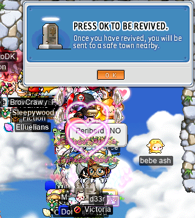
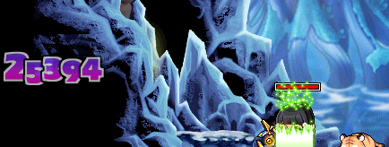
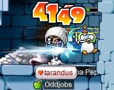
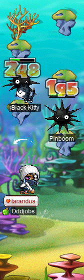
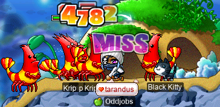
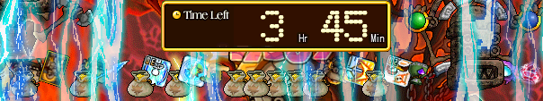
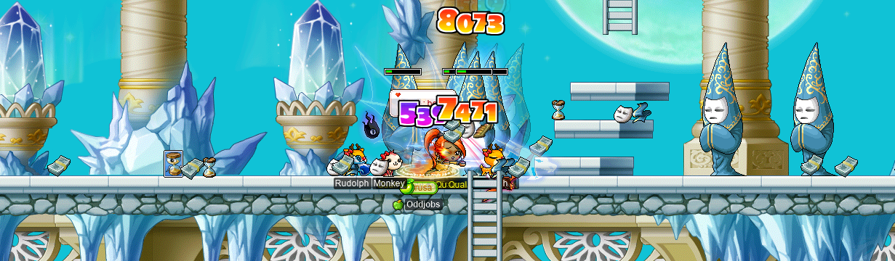

# rangifer’s diary: pt. lxxxvii

## Русская рулетка

I got the chance to participate in a GM event that I’d never seen before: [Russian roulette](https://en.wikipedia.org/wiki/Russian_roulette)! The event is, well, basically what it sounds like. There are a handful of platforms, and the game proceeds in a series of rounds. For each round, a platform is selected at random, and all [PC](https://en.wikipedia.org/wiki/Player_character)s on that platform are killed — representing that platform being the “loaded chamber” of the “gun”. This event takes place on the same map as the very different Bomberman event, which I have shown in a previous diary entry. I attended this particular event on my [vicloc](https://codeberg.org/Victoria/resources) [clericlet](https://oddjobs.codeberg.page/guides/introduction-to-odd-jobs/#magelet) <b>d33r</b>:

As you can see, we’ve all been stunned, so that we cannot change our minds about what platform we want, after a losing platform has already been picked… But in between rounds, players are allowed to move freely, in case they want to choose a different platform than the one that they are already on.

Choosing a winner is simple: whoever is last standing wins. Once the group starts to thin out, the GM(s) who are administrating the game can choose to eliminate platforms at will, so that players cannot pick those platforms at all. This allows the game to accelerate towards the end, where eventually there are only two platforms to choose from, and ultimately just one player is left standing.

Although I just mentioned that players are allowed to move freely in between rounds, you might reasonably wonder whether or not this can possibly confer an advantage. The answer, of course, is “no” (and still “no”, even if we phrase the question in terms of **dis**advantage). The only way that such an advantage is even possible (as far as I can tell) would be if MapleLegends’s implementation of the `@roll` command were implemented naïvely enough as to be non[uniform](https://en.wikipedia.org/wiki/Discrete_uniform_distribution). You _could_ try to argue that it would suffice if the [PRNG](https://en.wikipedia.org/wiki/Pseudorandom_number_generator) that the implementation uses merely fails a (reasonably insensitive) [next-bit test](https://en.wikipedia.org/wiki/Next-bit_test) (regardless of whether or not the ultimate output is uniform [w\.r\.t.](https://en.wiktionary.org/wiki/w.r.t.) this less-than-perfect [entropy] source), but I’m just going to call such a strategy impractical. The PRNG would almost certainly be shared in a way that makes introspection into its [state] — which would allow some level of nontrivial prediction about the next value(s) that it’s going to produce — practically impossible. See, for example, [`java.lang.Math.random()`][javarandom], which persistently shares a single PRNG instance across all [threads][thread] in [the runtime](https://en.wikipedia.org/wiki/Java_virtual_machine), using it to provide the result of any call to said function. Any time that `Math.random()` is called — whether it’s because someone somewhere else in a map that you are unaware of used the `@roll` command, or any(!) number of other possible things (`@roll` is very unlikely to be the only use of this PRNG within the server’s codebase) — you would be missing unknown lengths and unknown positions of [substrings](https://en.wikipedia.org/wiki/Substring) of the PRNG’s [bit](https://en.wikipedia.org/wiki/Bit)wise output. So, I expect such a strategy to have negligible impact at best. On the other hand, if the output of `@roll` is improperly [distributed](https://en.wikipedia.org/wiki/Probability_distribution) (read: nonuniform), then knowing something about the true distribution (other than the obvious fact that it reasonably approximates a discrete uniform distribution) could confer an actual (although still likely very slight) advantage. However, _even then_, the most reasonable strategy would involve never moving in between rounds! — although it would at least be true that such movements, in general, have the possibility of conferring (dis)advantage.

Unfortunately for us, there appears (as far as I can tell — please _do_ [email](https://codeberg.org/deer/deer/src/branch/master/README.md) me your sophisticated hypothetical attacks on this game of roulette that require in-depth knowledge of [numerical analysis](https://en.wikipedia.org/wiki/Numerical_analysis) so that I can fail to understand them) to be no such practical exploits. [OpenJDK](https://en.wikipedia.org/wiki/OpenJDK)’s standard, default implementation of a PRNG appears to be an [LCG](https://en.wikipedia.org/wiki/Linear_congruential_generator) with a [modulus](https://en.wikipedia.org/wiki/Modular_arithmetic) of 248 (i\.e. 48-bit arithmetic), a [multiplier](https://en.wikipedia.org/wiki/Multiplication) of 5DEECE66D16 (25&numsp;214&numsp;903&numsp;91710), an [increment](https://en.wikipedia.org/wiki/Addition) of 1110, and an output that takes only the [most significant](https://en.wikipedia.org/wiki/Bit_numbering#Bit_significance_and_indexing) 32 bits of the result (which largely eliminates the issue that LCGs have with the less-significant bits having rather small [periods](https://en.wikipedia.org/wiki/Periodic_function)). Although obviously LCGs are totally unsuitable for [_cryptographic_](https://en.wikipedia.org/wiki/Cryptography) purposes (please, for the love of god, use a widely-accepted [CSPRNG](https://en.wikipedia.org/wiki/Cryptographically-secure_pseudorandom_number_generator) in such a case!), this is a pretty good LCG algorithm from what I can tell. [POSIX](https://en.wikipedia.org/wiki/POSIX) uses it too. And OpenJDK’s API for generating random numbers appears to be well-designed enough to prevent programmers from making those dumb old mistakes, e\.g. using [`rand()`](https://en.cppreference.com/w/c/numeric/random/rand) as `rand() % n` to get a “random” integer in \[0,&nbsp;`n`)…

So really, this game consists of picking a platform (any platform will do) and AFKing until you die (or conversely, until you win!). There’s no other strategy that wins more often, so fuck it. Definitely my least favourite GM event that I’ve participated in, but it is what it is.

Anyways, I died.

To be more clear, I died not once, not twice, but thrice. Once for each game of roulette played! At least I got a [SoS](https://maplelegends.com/lib/etc?id=4031019) out of it!!

[entropy]: https://en.wikipedia.org/wiki/Entropy_(information_theory)
[state]: https://en.wikipedia.org/wiki/State_(computer_science)
[javarandom]: https://docs.oracle.com/en/java/javase/17/docs/api/java.base/java/lang/Math.html#random()
[thread]: https://en.wikipedia.org/wiki/Thread_(computing)

## Maple Warrior level twenty

Any readers who are familiar with playing a dark knight (that is, the fourth job warrior class that comes after dragon knight) will know that dark knights don’t really have that many skills. They definitely have skills, but, you know, they aren’t super important. They are basically permanently third job. Which is really cool if you ask me, and the main attraction is obviously [Berserk](https://maplelegends.com/lib/skill?id=1320006), which allows the dark knight to deal two(!) times as much damage, provided that they <del>kill themselves</del> carefully balance the bright red bar at the bottom of their screen. Personally, I’m a huge fan of [Achilles](https://maplelegends.com/lib/skill?id=1320005) for its passive defence (which notably “stacks” with everything else in the game and works on a multiplicative basis instead of a subtractive one), but it’s not really the first thing that most people think of; it’s not unique to dark knights (all fourth-job warrior classes get access to it), and as a passive ability with no readily apparent effects from the third person viewpoint, it doesn’t often come to mind. So, now that my [darksterity knight](https://oddjobs.codeberg.page/guides/introduction-to-odd-jobs/#dex-warrior) <b>rusa</b> has maxed zerk, Achilles, [Beholder](https://maplelegends.com/lib/skill?id=1321007), and [Aura of the Beholder](https://maplelegends.com/lib/skill?id=1320008), and has a point in [Rush](https://maplelegends.com/lib/skill?id=1321003) and [Hero’s Will](https://maplelegends.com/lib/skill?id=1321010)… Well… I think we all know what time it is.

[Maple Warrior](https://maplelegends.com/lib/skill?id=1321000) time!! And not just any Maple Warrior, but the _**twentieth level**_ of it. Of course, obtaining [the book](https://maplelegends.com/lib/use?id=2290096) to take MW beyond level ten is no small feat. The only source of such “MW20” books is — you guessed it — the [horned tail](https://maplelegends.com/lib/monster?id=8810018). As Maple Warrior is generally very useful (all fourth-job classes have access to it, and the buff benefits anyone), and killing Horntail is a difficult task in itself, is time-consuming, and only rarely yields any actual MW20 books, these books are highly prized. An individual MW20 book costs so much that it’s very common for players to bypass purchasing the books altogether, in favour of purchasing a MW20 “100% service”, effectively lifting all [economic risk](https://en.wikipedia.org/wiki/Risk#Economic_risk) off of the buyer and placing it onto the seller. In exchange, the seller charges more than the [expected](https://en.wikipedia.org/wiki/Expected_value) cost, at current market prices, to deliver the service of “I will keep giving you MW20 books until you pass one”. As you’d intuitively expect, this expected cost (assuming that the market price of a single book is 𝑏) is 𝑏&#x29f8;𝑝 (as the expected value of a [geometric distribution](https://en.wikipedia.org/wiki/Geometric_distribution) is 1&#x29f8;𝑝). In the case of MW20, 𝑝&nbsp;=&nbsp;0\.7.

I really kinda thought that I would end up using individual books until I passed one. I’ve seen other people have their Maple careers destroyed in this way, by failing one too many MW20 books. It is a sad thing: to pay your life savings only to pray that you don’t merely lose it all. Hence, the existence of MW20 services. But I had a lot of mesos lying around because I’m a compulsive hoarder (my brain is perpetually in poor person mode, where any expenditure that I make is surrounded by irrational fear that I may actually need that money later — yes, even though it’s just a videogame -\_-), and I came to realise that I just need to _start spending_ at some point. On average, buying individual books _is_ cheaper than buying a 100% service, so fuck it :P

But [STRginner](https://oddjobs.codeberg.page/guides/introduction-to-odd-jobs/#permabeginner-outland) <b>Cortical</b> (<b>GishGallop</b>, <b>Medulla</b>, <b>Subcortical</b>, <b>SussyBaka</b>, <b>CokeZeroPill</b>) has had a dream of selling MW20 100% service for a while now, and only recently saved up the money to buy a few books when the market prices took a dip. I was aware of the market dipping, as I was in the habit of doing HT runs myself and profiting from the occasional MW20 drop, so I figured that it was a good time to buy MW20 book(s) or MW20 100% service for myself. Thus, it was only natural for me to be the one to help fulfil Cort’s dream:

Congrats Cort :\] And congrats to me for now having MW20!! :D

## Poverty dragon

Speaking of [MW20](https://maplelegends.com/lib/use?id=2290096), it’s time for the obligatory “[horny lizard](https://maplelegends.com/lib/monster?id=8810003) time, with <b>rusa</b>” :\]

One such HT run that I did had not two, but _three_ mages. We had on our side <b>Baboom</b> of the <b>Funk</b> guild, a fire/poison archmage. At one point, two of our mages died simultaneously, but thankfully, one of them was Baboom, so we still had a live bishop (<b>Pebbytan</b>) to [Resurrect](https://maplelegends.com/lib/skill?id=2321006) them :P

&#x26a0;&#xfe0f; CAUTION: horned reptiles within &#x26a0;&#xfe0f;

With two bishops and a F/P archmage, you might reasonably be worried about triggering mass seduce early. Well… As prophesied…

GG indeed. Thankfully, we were able to identify which arm was in mass seduce range, and finish the run without too many additional issues :P

After that run, I was recruited by marksman <b>xBowtjuhNL</b> to help sell HTPQ (Horntail Party Quest) services to a neophyte bishop by the name of <b>micaheldum</b>, who needed [Life Roots](https://maplelegends.com/lib/etc?id=4031461) for their [Genesis](https://maplelegends.com/lib/skill?id=2321008) quest. Unfortunately for everyone involved, this particular HTPQ run was somehow bugged. Typically, it only takes around &ap;2 [minutes](https://en.wikipedia.org/wiki/Minute) (or less) to farm a Life Roots out of the [Skelegon](https://maplelegends.com/lib/monster?id=9300076)s in the [Cave of Light](https://maplelegends.com/lib/map?id=240050300), thus achieving the goal of going into HTPQ in the first place. However, even after grinding in this map as a party of about three [PC](https://en.wikipedia.org/wiki/Player_character)s for upwards of 15 minutes, there were no Life Roots to be found. It’s tempting to think that something was done wrong; maybe micaheldum wasn’t actually on the appropriate quest to make the Life Roots drop (as Life Roots is a quest-only item). But I made pretty damn sure (including confirming the exact text displayed by micaheldum’s Quest Helper) that we didn’t do anything wrong, so we tried `@gm`ing in the desperate hope of having this bugged HTPQ fixed for us. Unfortunately, this was done to no avail, so we ultimately had to leave, and hope that our buyer would find another seller that was capable of not bugging the damn PQ!!:

Readers who have played MapleLegends before may recall a certain MapleTip: “Bad luck is not a bug”. So you might reasonably wonder if perhaps this HTPQ was not bugged at all, and we merely had extremely poor luck. We can sensibly ask the question: _how_ unlucky would you have to be to get a failed HTPQ of this kind? We can model Life Roots drops using a simple [Poisson\* distribution](https://en.wikipedia.org/wiki/Poisson_distribution); we know that the [mean](https://en.wikipedia.org/wiki/Expected_value) time taken to produce a single Life Roots drop is roughly two minutes, and we can very reasonably assume (assuming that the MapleLegends server doesn’t have some horrible [bug](https://en.wikipedia.org/wiki/Software_bug) in their monster drop implementation) that item drops are [independent][indep] events — i\.e., one item drop does not influence how long it will take for the next item drop to occur.

We’ll say that we only spent about 15 minutes farming Skelegons. The [parameter](https://en.wikipedia.org/wiki/Statistical_parameter) λ of our Poisson distribution is the mean number of drops produced in such a 15-minute interval. Because we estimate the mean time to produce one drop to be about 2 minutes, λ&nbsp;=&nbsp;15&#x29f8;2&nbsp;=&nbsp;7\.5. The Poisson distribution describes [how likely](https://en.wikipedia.org/wiki/Probability) it is for the number of drops that occur during some 15-minute interval to be a given value 𝑘 (𝑘&nbsp;[&in;][element]&nbsp;[ℕ](https://en.wikipedia.org/wiki/Natural_number)). In the case of a failure, obviously 𝑘&nbsp;=&nbsp;0 (no Life Roots are dropped at all). The [PMF](https://en.wikipedia.org/wiki/Probability_mass_function) of a Poisson distribution as described here is λ𝑘&it;[𝖾][e]&minus;λ&#x29f8;(𝑘[!](https://en.wikipedia.org/wiki/Factorial)). So, for our particular case, we have λ𝑘&it;𝖾&minus;λ&#x29f8;(𝑘!)&nbsp;=&nbsp;7\.50&it;𝖾&minus;7\.5&#x29f8;(0!)&nbsp;=&nbsp;𝖾&minus;7\.5&nbsp;&ap;&nbsp;0\.05531%&nbsp;&ap;&nbsp;1&#x29f8;1808. It is left to the reader to decide whether “one in two thousand” seems like enough for an `@gm` :\]

In any case, during another HT run, woosa hit level 167~! :3

Missing out on having [HS](https://maplelegends.com/lib/skill?id=2311003) when an HT body part dies always makes me a lil sad, but hey — I still levelled up :P

I also got my first taste of being a sed target! Shadower <b>Harlez</b> (<b>VigiI</b>) let me go into the second prehead map first so that I could try it out:

It went pretty well, although being a sed target during preheads is really not very difficult. I did have one incident where I accidentally touched the head; but I didn’t die, thanks to Pebbytan’s expert sed bish skills:

I hope that in the future, I might have the privilege of trying out the sed target role for real! I’ll have to try my hand at making some high-AVOID gear, like a [Sauna Robe](https://maplelegends.com/lib/equip?id=1051017) and some [Yellow Strap Shoes](https://maplelegends.com/lib/equip?id=1072261)!!

I also experienced an unnaturally cleave-heavy HT run, wherein HT got down nearly as low as ⅓ of its total HP, _without any of the three heads dying!!_

O\_O;

I also did a pair of HT runs with bishop <b>beegoratto</b>, who brought some [Christmastime](https://en.wikipedia.org/wiki/Christmas_and_holiday_season) letters to entertain us with:

Apparently, Horntail was rather offended by the holiday season graffiti, and took it out on poor Pebbytan — our only other bishop — by disconnecting her from the run :\[ Now it was up to beegoratto to take care of the Dark Wyverns — amongst many other bishop duties, including switching between parties to provide/receive buffs — with far less assistance:

(“BB” in this context refers to the [Big Bang](https://maplelegends.com/lib/skill?id=2321001) skill, which can be used by HT bishops to effectively one-shot Wyverns as they spawn, by using [Genesis](https://maplelegends.com/lib/skill?id=2321008) immediately after BB goes off.)

Although being a solo bishop in a two-party HT run is certainly gruelling and stressful, we were able to make it through the rest of the run relatively smoothly!

We also sold a [Horntail Necklace](https://maplelegends.com/lib/equip?id=1122000) (HTP) to a bishop by the name of <b>FinalHealth</b>. Although this might seem perfectly normal, the catch was that FinalHealth is level 200~! She originally came to us trying to buy an AFK run, but we convinced her that an AFK run surely must not be necessary for a character of two hundred levels:

Indeed, FinalHealth was simply unfamiliar with Horntail! We had to explain some of the basic mechanics involved, like the fact that HT can dispel (DP), and that the Dark Wyverns that spawn are capable of doing the same thing via their ranged attacks. Several of the other runners were confused as to how a level 200 bishop had simply never gone anywhere near HT, although I was less surprised, myself. Give enough leech, and you eventually hit level 200, right? Leeching oneself (and/or others) at [5–6 F](https://maplelegends.com/lib/map?id=702070300) is quite typical — particularly as a mage duo, as I understand it. And that’s no small quantity of EPH for the one(s) giving the leech! Of course, that doesn’t _quite_ explain how they’ve never gone near HT on any of their _other_ character(s) either, but it’s plausible that they just didn’t want to participate in such activities until reaching a very high level (presumably via leech) — or that they are just not interested at all! After all, many MapleStory players ­— perhaps understandably, given the structure of the game — are really there for the grinding!

In any case, I died.

Oops. This is my first time dying by touching [the right head](https://maplelegends.com/lib/monster?id=8810004), and this death really was my fault. An unfortunately-timed Weakness debuff prevented me from jumping when I thought that I would be able to, causing my left [arrow key](https://en.wikipedia.org/wiki/Arrow_keys) presses to push me further to the left than I expected…

And, finally, I did another HT run that got… well… a little bit scuffed. Just a little.

Ouf, that’s two deaths right there. But it’s okay, right? We have two bishops and two buccaneers; that’s the potential for _six_ [Resurrection](https://maplelegends.com/lib/skill?id=2321006)s in rapid succession!

As it turned out, these were indeed last words, in some sense. We seemed to have lost both of our bishops at once…

We seriously considered [crystal](https://maplelegends.com/lib/npc?id=2083002)ling out after finishing off [the left head](https://maplelegends.com/lib/monster?id=8810002), but we estimated that it would be possible to at least finish the run and get _some_ EXP (albeit without the benefit of HS, of course &#x1f615;) and the loot.

And then markswoman <b>bweee</b> died…

And then dark knight <b>Erick</b> died…

At this point, I think a buccaneer(?) had disconnected, and we were down to like seven characters remaining \>w\< Some number of [Onyx Apple](https://maplelegends.com/lib/use?id=2022179)s later, though (including two that I sold during the fight to a nightlord in my party), and we were at least able to clear the damn thing! For no impressive drops… Oh well.

And then, in the next run, we were similarly unlucky! We lost a bishop &amp; a buccaneer again!! :\[

Not so great runs that day…

Later on in the run, nightlord <b>MeandU</b> had a poopmergency:

They survived the poopmergency (thanks to Pebbytan’s [Heal](https://maplelegends.com/lib/skill?id=2301002)ing), but shortly after coming back from the [little Maplers’ room](https://en.wikipedia.org/wiki/Bathroom), they got disconnected :\[ Eventually, we got to the point where we actually merged both parties into a single six-Mapler party:

This only lasted as long as it took for Pebbytan’s Resurrection to come off of its cooldown so that she could resurrect <b>SmallMight</b> (<b>SiriusPlaque</b>), at which point we split back into a party of three and a party of four. Again, after much struggling and Onyx Appling, we were eventually able to finish this cursed HT run and get our meagre drops :P

Footnotes for “Poverty dragon”

\*/[pwasɔ&#x303;](https://en.wikipedia.org/wiki/International_Phonetic_Alphabet)/. Roughly(!) like “[pwah-song](https://en.wikipedia.org/wiki/Pronunciation_respelling_for_English)” in [English](https://en.wikipedia.org/wiki/English_language).

[indep]: https://en.wikipedia.org/wiki/Independence_(probability_theory)
[e]: https://en.wikipedia.org/wiki/E_(mathematical_constant)
[element]: https://en.wikipedia.org/wiki/Element_(mathematics)

## Caribou

It’s time for another installation of <i>Questing With tara</i>™!!!! With your host, my shield [pugilist](https://oddjobs.codeberg.page/guides/introduction-to-odd-jobs/#pugilist) <b>tarandus</b> :\]

As foretold, I had to do some more [smol kitty](https://maplelegends.com/lib/monster?id=3210201) punching, including punching for the purpose of farming [Silk Feather](https://maplelegends.com/lib/etc?id=4031524)s…

taratara

…For [The Sakura Garden](https://bbb.hidden-street.net/quest/world-tour/the-sakura-garden). Plus, I had to kill even more kittycats for [Orbis In Danger](https://bbb.hidden-street.net/quest/el-nath-mt-aquaroad/orbis-in-danger). Also as part of Orbis In Danger, I had to collect some [Cloud Piece](https://maplelegends.com/lib/etc?id=4001063)s from the pixies that inhabit the [Cloud Park](https://maplelegends.com/lib/map?id=200010000). I found out the hard way that most pixies are pretty tough opponents for a level 36 tara. So I farmed them from [Star Pixie](https://maplelegends.com/lib/monster?id=3230200)s, the weakest of the pixie species:

While farming the Cloud Pieces, was getting really close to hitting level 37, so I needed to put on my intelligent pyjamas. Unfortunately, none of the [Orbis](https://maplelegends.com/lib/map?id=200000000) monsters are really very trivial to kill ([Jr. Sentinel](https://maplelegends.com/lib/monster?id=5200000)s are probably the weakest), so I took a trip to Japan to find monsters that I was capable of killing with [Three Snails](https://maplelegends.com/lib/skill?id=1000):

I also [collected some magic ingredients for Huckle](https://bbb.hidden-street.net/quest/el-nath-mt-aquaroad/collecting-huckles-magic-ingredients), which meant killing three of the four sentinel species in the [Orbis Tower](https://maplelegends.com/lib/map?id=200080200): [Ice Sentinel](https://maplelegends.com/lib/monster?id=5200001)s…

[Fire Sentinel](https://maplelegends.com/lib/monster?id=5200002)s…

And the aforementioned Jr. Sentinels…

For [Hughes’ Hobby](https://bbb.hidden-street.net/quest/el-nath-mt-aquaroad/hughes-hobby), I needed just a handful of [Toy Baby Seal](https://maplelegends.com/lib/etc?id=4000154)s, so I took a quick trip to [Ocean I\.C](https://maplelegends.com/lib/map?id=230010000) to make punching bags out of some petite seals:

Hughes’ desire for beating the shit out of adorable sea creatures is insatiable, so for [Hughes’ Weird Invention](https://bbb.hidden-street.net/quest/el-nath-mt-aquaroad/hughes-weird-invention), I needed some 50 [Snorkle](https://maplelegends.com/lib/etc?id=4000153)s \[<i>sic</i>\]. For this, I headed to [floor B2 of the Orbis Tower](https://maplelegends.com/lib/map?id=200082300) to hunt me some [Scuba Pepe](https://maplelegends.com/lib/monster?id=3210450)s:

And, again, for [Hughes’ Research Material](https://bbb.hidden-street.net/quest/el-nath-mt-aquaroad/hughes-research-material), I needed some [Seal Skin](https://maplelegends.com/lib/etc?id=4000155)s and some [Seal Teeth](https://maplelegends.com/lib/etc?id=4000156), so I went to [Forked Road: West Sea](https://maplelegends.com/lib/map?id=230010400) to kill some [Freezer](https://maplelegends.com/lib/monster?id=4230124)s\* and [Sparker](https://maplelegends.com/lib/monster?id=4230123)s:

With the [Oxygen Tank](https://maplelegends.com/lib/equip?id=1102061) in my backpack, I did the first of the [Food-Hunting for Moppie](https://bbb.hidden-street.net/quest/el-nath-mt-aquaroad/food-hunting-for-moppie) quests, and hit level 38~!:

Of course, the first part of said questline only requires you to collect 100 [Jr. Pepe’s Fish](https://maplelegends.com/lib/etc?id=4000088). This is 100&#x29f8;750, because the questline requires 600 in total, in addition to 100 for [Maya’s Concern](https://bbb.hidden-street.net/quest/victoria-island/mayas-concern) and 50 for [Master Sergeant Fox’s Secret](https://bbb.hidden-street.net/quest/el-nath-mt-aquaroad/master-sergeant-foxs-secret)! So I was stuck on [the first floor of the Orbis Tower](https://maplelegends.com/lib/map?id=200082100) for a while…

Heyo, 291[k](https://en.wikipedia.org/wiki/Kilo-) EPH at level 38 is actually really good!! I won’t complain :P

With that kind of EPH, I had to put on the ol’ smartypants and find some Jr. Sentinels to throw some [Red Snail Shell](https://maplelegends.com/lib/etc?id=4000016)s at…

:3

For [The View of the Ocean](https://bbb.hidden-street.net/quest/el-nath-mt-aquaroad/the-view-of-the-ocean), I had to hunt 100 very special [Snow Crystal](https://maplelegends.com/lib/etc?id=4031311)s so that [Alcaster](https://maplelegends.com/lib/npc?id=2020005) could forge me a [Snow Crystal Sphere](https://maplelegends.com/lib/etc?id=4031312). These crystals are only dropped by [Leatties](https://maplelegends.com/lib/monster?id=5300000):

I then moved on to some more Aqua-Road-oriented quests, including [Kenta’s Research](https://bbb.hidden-street.net/quest/el-nath-mt-aquaroad/kentas-research). Kenta’s Research is a questline that proceeds in the form of three quests; in turn, each quest requires three distinct [DNA](https://en.wikipedia.org/wiki/DNA) samples. Each of the nine DNA samples is dropped from a distinct monster species, starting with [Cico](https://maplelegends.com/lib/monster?id=2230106) &amp; [Seacle](https://maplelegends.com/lib/monster?id=2230105) (both [hippocampee](https://en.wikipedia.org/wiki/Seahorse))…

And the crowd favourite [Pinboom](https://maplelegends.com/lib/monster?id=2230108)s…

The second quest in the line then asks for some DNA from [Bubble Fish](https://maplelegends.com/lib/monster?id=2230109)…

[Flower Fish](https://maplelegends.com/lib/monster?id=2230200)…

And [Mask Fish](https://maplelegends.com/lib/monster?id=3230104)…

While I was killing Mask Fish at [The Seaweed Tower](https://maplelegends.com/lib/map?id=230020100), I collected a score of [Shrimp Meat](https://maplelegends.com/lib/etc?id=4000166)s from the [Krip](https://maplelegends.com/lib/monster?id=3000006)s there as well, for use in [Tae Gong’s Love for His Wife](https://bbb.hidden-street.net/quest/ludus-lake/tae-gongs-love-for-his-wife):

And, I stumbled upon a [Seruf](https://maplelegends.com/lib/monster?id=4220000) while I was there :P

Take that, you oversized [oyster](https://en.wikipedia.org/wiki/Oyster)!!!

Footnotes for “Caribou”

\*Not to be confused with [Freezer](https://maplelegends.com/lib/monster?id=9420501), nor with [Freezer](https://maplelegends.com/lib/monster?id=9300090).

## 19521 Chaos

In the previous diary entry, I had a hell of a wild ride trying to [CS](https://maplelegends.com/lib/use?id=2049100) myself a [cape](https://maplelegends.com/lib/equip?id=1102084). With the determination to finish what I started, I bought CS _service_ from none other than [STRginner](https://oddjobs.codeberg.page/guides/introduction-to-odd-jobs/#permabeginner-outland) <b>uayua</b> (<b>shadowban</b>, <b>tb303</b>)! Because of the way that CSs (and [WS](https://maplelegends.com/lib/use?id=2340000)s) are currently implemented in MapleLegends, it makes sense to sell these scrolls as a service (unless you actually plan on using them yourself), if you’re lucky enough to get them from [Gachapon](https://maplelegends.com/lib/npc?id=9100100) or similar. The scrolls themselves are untradeable, so selling them directly is not an option. On the other hand, you could use the [Prestige Shop](https://maplelegends.com/lib/npc?id=9135000) to trade one CS/WS in for a [MCP5](https://maplelegends.com/lib/use?id=2029204). But the [expected](https://en.wikipedia.org/wiki/Expected_value) number of [pCoin](https://maplelegends.com/lib/etc?id=4001736)s that a MCP5 contains is only 90, whereas making a CS/WS yourself would cost 100 pCoins and an additional 10[M](https://en.wikipedia.org/wiki/Mega-) mesos! As a result, you can effectively sell the scroll itself as a service (only as a service because, again, CSs/WSs are untradeable) for somewhat more than 90 pCoins — because the MCP5 is only worth 90 pCoins, selling service for \>90 pCoins represents a better deal for the seller. If the price of a service is, furthermore, ≤100 pCoins, it represents a better deal for the buyer as well, because it would “normally” cost 100 pCoins + 10M mesos for the buyer if they did things the “normal” way. This straightforward economic situation makes scams more likely, or puts additional technological burden on the process of selling CSs/WSs due to the necessity of [livestreaming](https://en.wikipedia.org/wiki/Livestreaming) video of the scroll usage in order to give reasonable proof of good faith. Somewhat ironically, this additional technological burden makes the CS/WS mechanics somewhat more pay-to-win (P2W), but oh well.

uayua tried to sell the service to me for 90 pCoins. She insisted that this was still a win for her, as it means that I am effectively couching the [economic risk](https://en.wikipedia.org/wiki/Risk#Economic_risk) of her opening the MCP5 herself and possibly getting \<90 pCoins as a result. But I didn’t want her to just break even, and furthermore, she could sell the MCP5 herself (without opening it) and break even (albeit in terms of mesos, rather than pCoins) that way too. So I took the price that she was trying to sell service for in the [FM](https://maplelegends.com/lib/map?id=910000000): 92 pCoins.

Aaaaand it failed :\]\]\]\]\]\]

Oh, well. R\.I\.P. my cape dreams… At least uayua has 92 pCoins to work with now :P

## A modest collection of compact discs, with your host, <b>alces</b>

I’ve begun training [at CDs](https://maplelegends.com/lib/map?id=742010203) on my [daggermit](https://oddjobs.codeberg.page/odd-jobs.html#dagger-assassin) <b>alces</b>, alongside fellow CDs prisoner <b>Lvl1Crook</b> (<b>Level1Crook</b>, <b>xXCrookXx</b>, <b>Macer</b>, <b>Lanius</b>, <b>Sangatsu</b>, <b>Ichigatsu</b>, <b>SuperLuck</b>) the INTlaw:

You can see what alces looks like when training on CDs [in this video](https://www.youtube.com/watch?v=dm5CmFoRtfM); it’s a little awkward, but [Shadow Web](https://maplelegends.com/lib/skill?id=4111003) helps a lot. The benefit is that I can train with Lvl1Crook, who unfortunately cannot jump over [Kid Mannequin](https://maplelegends.com/lib/monster?id=9410032)s due to their tall hitboxes. Hopefully, in the future, after many soul-crushing hours of CD grind, we can escape CDs together!!

Well, alces probably won’t ever truly grow out of KMs/CDs, unless maybe she gets really good gear and a whole lot of SP in [Venomous Star](https://maplelegends.com/lib/skill?id=4120005) (which works with any weapon, despite its name &amp; in-game description)… Then maybe she could [7 F](https://maplelegends.com/lib/map?id=702070400)…? LOLLL

## The Zakkening

You already know who it is: everyone’s favourite [Qur’anic hell tree](https://en.wikipedia.org/wiki/Zaqqum) / crumbly stone [Mayan](https://en.wikipedia.org/wiki/Maya_civilization) monument hybrid, [Zakum](https://maplelegends.com/lib/monster?id=8800002)~

I did a pair of Zakum runs with a rather unusual party composition on my [darksterity knight](https://oddjobs.codeberg.page/guides/introduction-to-odd-jobs/#dex-warrior) <b>rusa</b>; we had two bishops!

Zakkin’ hard

As you can see, one of the bishops (<b>idoybh2</b>) came over to my lonely side of the Zakum body where I usually hide, cowering from the deadly [Heal](https://maplelegends.com/lib/skill?id=2301002)s of the party’s bishop. But because we already had a bishop (<b>Pebbytan</b>) on the left side, idoybh2 was free to pamper me as my own personal bishop :P It’s pretty nice. Used a lot fewer [ACP](https://maplelegends.com/lib/use?id=2022178)s and got stunned a lot less!

More importantly, however, my [woodsmaster](https://oddjobs.codeberg.page/guides/introduction-to-odd-jobs/#woodswoman) <b>capreolina</b> got to do her very first Zakum runs!!! :D

Oh yeah, you know I had to bust out my [PSB](https://maplelegends.com/lib/equip?id=1442057) (and STR [bathrobe](https://maplelegends.com/lib/equip?id=1051098)) for the arms stage.

On the second run, I even did a quick `@dpm 5` test to see how I was doing with my PSB and [birdie](https://maplelegends.com/lib/skill?id=3121006):

And another test — this time `@dpm 15` — during the body stage while using [my bow](https://maplelegends.com/lib/equip?id=1452045) to [Hurricane](https://maplelegends.com/lib/skill?id=3121004):

I got the [Zakum Chair](https://maplelegends.com/lib/setup?id=3010127)!!:

Looking good. B)

In another run, we found out that [Speed Infusion](https://maplelegends.com/lib/skill?id=5121009) (SI) is epic, even for bowmasters (BMs)!:

During another run with buccaneer <b>Buccon</b> (who also has a woodsman, by the name of <b>Buwwon</b>!), I died during the arms stage. &#x1f926;&#x1f3fd;&#x200d;&#x2640;&#xfe0f; Despite the fact that I had [Ginger Ale](https://maplelegends.com/lib/use?id=2002023)s (heals 75% HP &amp; 75% MP) bound to both my pet autoHP and autoMP, at an HP threshold of 65%(!), I was nevertheless getting multiple autopot fails per minute. One such autopot fail was quickly noticed by me, and I immediately pressed [<kbd>Shift</kbd>](https://en.wikipedia.org/wiki/Shift_key) (to which I had [Honster](https://maplelegends.com/lib/use?id=2002021)s bound, each of which heals 60% HP) at least thrice, before I ended up [croaking](https://en.wikipedia.org/wiki/Death) anyways :\[ Thankfully, bishop <b>Alectra</b> was able to [Resurrect](https://maplelegends.com/lib/skill?id=2321006) me, so I finished the run :\]

And finishing the run meant level [137](https://en.wikipedia.org/wiki/Fine-structure_constant) for capre!!:

I also did one run where I tried using my bow during the arms stage:

Again, even with a bow, the lack of [Power Stance](https://maplelegends.com/lib/skill?id=1321002) is annoying, especially for an archer with basically no AVOID like capre &#x1f644;

Now that capre was level 137, she finally had level ≥20 Hurricane, so I tried another `@dpm 15` test during the body fight:

Better!!

And finally, I had some fun Zak runs as rusa, in which we did incredibly chaotic — but speedy — _two-party_ (12-Mapler) runs:

Ever finished a Zakum run in 15 minutes flat? I have!

:\]

## L’édifice chronologique

Picking up where I left off, within the previous diary entry, in the [Temple of Time](https://maplelegends.com/lib/map?id=270000100) (ToT), I did some [Memory Guardian](https://maplelegends.com/lib/monster?id=8200003) slaying on my [darksterity knight](https://oddjobs.codeberg.page/guides/introduction-to-odd-jobs/#dex-warrior) <b>rusa</b>. I was accompanied &amp; assisted by shadower <b>Harlez</b> (<b>VigiI</b>)!:

Harlez noticed that the party member indicators that show up on the in-game world map have special behaviour for married couples!:

The map that Harlez is in shows up with a pink\* heart &#x2764; icon above the arrow. Cute :'\]

With a thousand of those Memory Guardians slain, we moved on to [Chief Memory Guardians](https://maplelegends.com/lib/monster?id=8200004):

Somehow, I actually managed to get a full card set out of these damn things:

And now, to cap off this region of ToT, a boss fight with [our giant flying whale friend](https://maplelegends.com/lib/monster?id=8220004):

Somewhat bizarrely, Dodo has the ability to teleport [PC](https://en.wikipedia.org/wiki/Player_character)s back to the previous map ([Resting Spot of Memory 4](https://maplelegends.com/lib/map?id=270010410)), similarly to [Franken Lloyd](https://maplelegends.com/lib/monster?id=9300140) o\.o

With that, it was time to transition to the next region of ToT, which meant going back to Victoria Island and talking to my first job instructor, [D-Dubs](https://maplelegends.com/lib/npc?id=1022000)&dagger;:

Now I could go to the icy parts of ToT, and fight the blue [Qualm Monk](https://maplelegends.com/lib/monster?id=8200005)s!:

Later, I came back to ToT on my own and solo’d the 999 [Qualm Monk Trainee](https://maplelegends.com/lib/monster?id=8200006) quest~:

Footnotes for «&nbsp;L’édifice chronologique&nbsp;»

\*I was going to use the Pink Heart [emoji](https://en.wikipedia.org/wiki/Emoji) (**potentially** [U](https://en.wikipedia.org/wiki/Unicode)+1fa77) here, but it’s currently only a proposal and won’t be subject to approval (or, less likely, **dis**approval) until later this year ([2022](https://en.wikipedia.org/wiki/2022)). Would be a bit unfortunate to try to use it here, only to lack actual [user agent](https://en.wikipedia.org/wiki/User_agent) support for a while, and possibly have to go back &amp; change it when the draft is potentially not approved…

&dagger;<i>Dances With Balrog</i> → <i>DWB</i> → “Dee Double-you Bee” → <i>D-Dubs</i>.

## Gently embossed

If you thought that this diary entry was all done with bossing, I’ve some bossy news for you…

I had the pleasure of clearing a bunch of [Pianus](https://maplelegends.com/lib/monster?id=8510000)es (Piani? Pianoi? :\]) with shadower <b>Harlez</b> (<b>VigiI</b>), on my [darksterity knight](https://oddjobs.codeberg.page/guides/introduction-to-odd-jobs/#dex-warrior) <b>rusa</b>:

Plus, I did some [Jiaoceng](https://maplelegends.com/lib/monster?id=9600025)s (JCs)! Here’s one that I trioed with Harlez and bowmaster <b>kwychan</b> (<b>helloooo</b>):

And another, with Harlez and markswoman <b>bweee</b>!:

When a plan to do [CWKPQ](https://maplelegends.com/lib/map?id=610030600) fell through, I did a few casual [Boyfriend](https://maplelegends.com/lib/monster?id=9400575) murders with Harlez, during which, we both levelled up at the same time!!:

_WHEW_ that is the **big 190**, holy moly guacamole. Alright, fine. I won’t [smega](https://maplelegends.com/lib/cash?id=5072000)… This time. :P

And, now that rusa hit level 168, she finally has that sweet, sweet 30[k](https://en.wikipedia.org/wiki/Kilo-) MAXHP (with [HB](https://maplelegends.com/lib/skill?id=1301007)) F55555555:

&#x1f60c; Feels good. Now my [zerk](https://maplelegends.com/lib/skill?id=1320006) threshold will be 16&numsp;500 forevermore, instead of changing every time I level up or change gear!! :D

And, finally, equipped with my new shiny 30k MAXHP, I set out to help Harlez, marksman <b>xBowtjuhNL</b>, hero <b>Mightyboosh</b>, and corsair <b>Dabulator</b> with a pair of [Berga](https://maplelegends.com/lib/monster?id=9400263) runs:

I’ve gotten a bit better at surviving Berga runs, although I admit that I continue to be mildly terrified by Berga — particularly [the third body](https://maplelegends.com/lib/monster?id=9400265), for obvious reasons. I’ve found out that it does help to dodge the big front laser(?) burst-of-red-light attack during the third body fight, even though people seem to mostly ignore it. Dodging it appears to be pretty easy and only require crouching for a very short amount of time, and a successful dodge means that you definitely won’t get stunned, stun seduced, nor hit by the attack’s damage. It seems that the attack is a bit selective (just because you fail to dodge it does not mean that it will even target you at all), so that probably is why so many people choose to ignore it.

In any case, one of the neat things about Neo Tokyo (NT) bosses is that they can give some juicy and interesting drops, in addition to their EXP. Check it out…:

Oh. Well, you know, you win some, you lose some… &#x1f926;&#x1f3fd;&#x200d;&#x2640;&#xfe0f;

## (…cnvpstdf…)

cnvpstdf

![\[Mysterious Coin Pouch 1\] Bandai obtained 2 Prestigious Coins.](bandai-obtained-2-prestigious-coins.webp "\[Mysterious Coin Pouch 1\] Bandai obtained 2 Prestigious Coins.")

