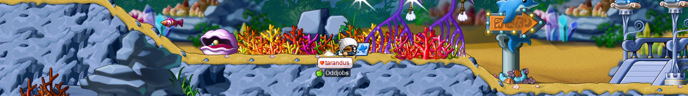
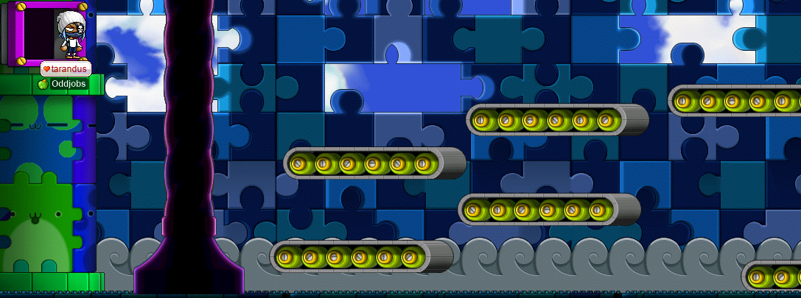
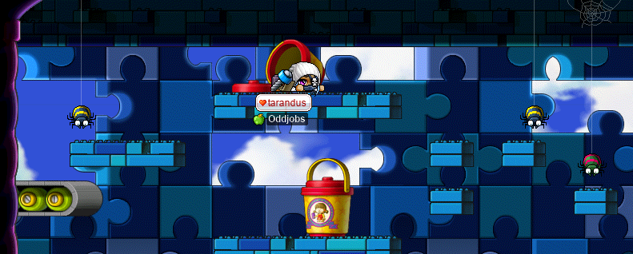
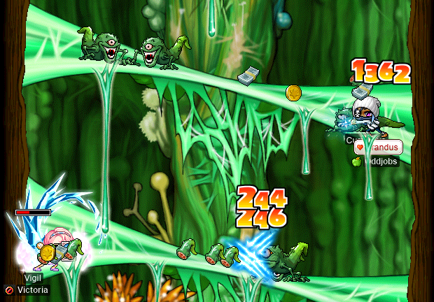
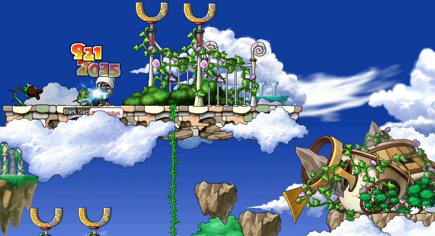
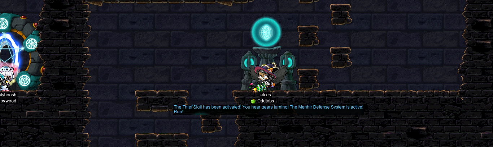
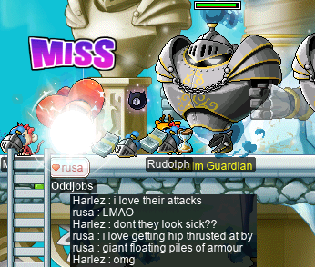
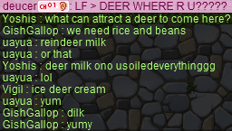

# rangifer’s diary: pt. lxxxviii

## bulletindown

Have you ever wondered how I post my diary entries to the MapleLegends forum? After all, my diary is written in [Markdown](https://en.wikipedia.org/wiki/Markdown), a format not accepted by the MapleLegends forum’s software ([XenForo](https://en.wikipedia.org/wiki/XenForo)).

The simple answer is: I don’t, really! When I _do_ post my diary entries to the MapleLegends forum, I am always posting a crippled version, with many things (some more visible than others) removed. This is largely due to technical limitations of the XenForo software used by the MapleLegends forum. As a result, readers who want to read the full version of a given entry are obliged to retrieve it from [Codeberg](https://codeberg.org/deer/rangifer_diary) (or from [the GitHub mirror](https://github.com/capreolina/rangifer_diary)); both Codeberg and GitHub natively offer [HTML](https://en.wikipedia.org/wiki/HTML) renderings of the Markdown content in their web interfaces, and/or you can even [clone](https://git-scm.com/docs/git-clone)\* the content and render it yourself!&dagger;

That being said, I do of course post some approximations of my diary entries on the MapleLegends forum, and I most certainly am _not_ doing the Markdown → [BBCode](https://en.wikipedia.org/wiki/BBCode) conversion by hand every single time! So, meet bulletindown:

**<https://codeberg.org/deer/bulletindown>** ([mirror](https://github.com/capreolina/bulletindown))

bulletindown is the handy-dandy tool that I use to massage giant balls of Markdown into horrible BBCode monstrosities that (hopefully) will be accepted by the MapleLegends forum! Of course, it’s not quite so simple as “just throwing bulletindown at it”, but bulletindown really makes things feasible by cutting out a huge amount of work. Maybe, in a future diary entry, I will talk in depth about what goes into the diary-entry-production process :P

You may notice that perhaps the most “fun” feature of bulletindown is the `-e`/`--encoding-warnings` [flag](https://en.wikipedia.org/wiki/Command-line_interface#Command-line_option), which causes bulletindown to [emit][stderr] warnings any time that the output contains [characters][char] that aren’t valid [UCS-2](https://en.wikipedia.org/wiki/Universal_Coded_Character_Set) characters (basically, any codepoints of [U](https://en.wikipedia.org/wiki/Unicode)+fffe or greater). I added this feature because XenForo (at least, the version utilised by the MapleLegends forum) systematically and silently discards(!) these characters, leading to broken output that has mysteriously missing text! If you look back through my posts on the MapleLegends forum, you will see that many are plagued by this [bug](https://en.wikipedia.org/wiki/Software_bug)… A simple example of a character that is affected by this bug is U+1f614 “PENSIVE FACE”: 😔. Incidentally, this is an accurate representation of my face every time that the MapleLegends forum botches another one of my diary entries.

Note that bulletindown was written by me _for my own personal use_, and I just decided recently that I may as well [open-source](https://en.wikipedia.org/wiki/Free_software) it, in case someone else can benefit from it. As a result, it is **not** designed to be super-duper robust; in particular, if you try to give it input that contains HTML with [block-level elements](https://developer.mozilla.org/docs/Web/HTML/Block-level_elements), expect it to baulk at you (and possibly even produce undesirable output) unless you format that input very properly.

As always, bulletindown is 100% [free software](https://en.wikipedia.org/wiki/Free_software).&ddagger;

<details>
<summary>Footnotes for “bulletindown”</summary>

\*Because the single repository contains all of my diary entries and their content (including images!), it’s fairly hefty. If you’re strapped for bandwidth/space, though, you needn’t worry. There are ways to sparsely clone only the director(y/ies) that you want: see [\[1\]](https://stackoverflow.com/questions/600079/how-do-i-clone-a-subdirectory-only-of-a-git-repository), [\[2\]](https://stackoverflow.com/questions/2466735/how-to-sparsely-checkout-only-one-single-file-from-a-git-repository/). If you _do_ end up doing a full `git clone` though, you get the advantage of effortlessly updating with a single `git pull`.

&dagger;[Pandoc](https://pandoc.org/) is the usual suspect here, although of course there are _plenty_ of other options out there.

&ddagger;Unlike a certain forum software that I know of… 🤕

</details>

[char]: https://en.wikipedia.org/wiki/Character_(computing)
[stderr]: https://en.wikipedia.org/wiki/Standard_streams#Standard_error_(stderr)

## &#x25ce;

I was going through some of the items on my rather overflowing <b>Suboptimal</b> “cache” mule <b>Superoptimal</b>, and wound up accidentally scrolling an unusually glowy [level 55 polearm](https://maplelegends.com/lib/equip?id=1442066)…:


To my great satisfaction, this board is ever so slightly superior to the “pog Bullseye Board” owned by [STRginner](https://oddjobs.codeberg.page/guides/introduction-to-odd-jobs/#permabeginner-outland) <b>Cortical</b> (<b>GishGallop</b>, <b>CokeZeroPill</b>, <b>SussyBaka</b>, <b>Medulla</b>) :P

As always, Superoptimal’s items are part of the Suboptimal alliance cache, which may be taken from, donated to, and/or borrowed from by any members of the alliance.

## Kompakt disx

As dedicated readers of my diary will already be familiar, one thing that I have learned in my time writing MapleStory diaries is simple: [the CDs](https://maplelegends.com/lib/map?id=742010203) never end. You would think that the CDs would finally be vanquished one day, but you would also be wrong. Oh, so, so wrong.

I did some CD grinding on my [daggermit](https://oddjobs.codeberg.page/odd-jobs.html#dagger-assassin) <b>alces</b>\* with INTlaw <b>Lvl1Crook</b> (<b>Level1Crook</b>, <b>xXCrookXx</b>, <b>SuperLuck</b>)…:


During which, alces hit level 108~!!:


That’s right; one level closer to [flame decal Khanjar](https://maplelegends.com/lib/equip?id=1092049) and [accidentally F2ing](https://maplelegends.com/lib/skill?id=4120002)!!

And, I also happened to have a [Chocolate Basket](https://maplelegends.com/lib/use?id=2020024) on my I/L [archmagelet](https://oddjobs.codeberg.page/guides/introduction-to-odd-jobs/#magelet) <b>cervine</b>, so, you know…


The curse of assuming that I’m always in a party with everyone all the time strikes again!! Luckily, Lvl1Crook caught this one for me rather early on!!!

If you’re wondering why cervine is still hanging around at CDs after all these years, consider the fact that my level 10 [Blizzard](https://maplelegends.com/lib/skill?id=2221007) costs enough MP per cast that I can hardly even use it, and even still, I only just barely one-shot the CDs… Thankfully, this time I was equipped with the [HB](https://maplelegends.com/lib/skill?id=1301007) from my Chocolate Basket:


Nearly 14\.3M EPH really ain’t nothin’ to sneeze at, although admittedly, this was under rather ideal conditions.

In any case, it was during this session that cervine hit level 125 :D


Bird but!!! It is now, at level 125, that I have finally decided what to spend cervine’s SP on. It’s a little strategy that I like to call “fuck everything else, [CL](https://maplelegends.com/lib/skill?id=2221006) 4 lyfe”. Bzzzt. &#x1f329;&#xfe0f;

<details>
<summary>Footnotes for “Kompakt disx”</summary>

\*How exactly _is_ [alces](https://en.wikipedia.org/wiki/Moose)’s name pronounced? Please do leave for me your opinions, by [email](mailto:capreolinaⒶprotonmail⋅ch), by [issue](https://codeberg.org/deer/rangifer_diary/issues), and/or by [pigeon post](https://en.wikipedia.org/wiki/Pigeon_post).

</details>

## Chief amongst them were

I did a few boss-’em-ups with SUBOPTIMAL GANG, including this pair of [Peppered Ladles](https://maplelegends.com/lib/monster?id=8500001) runs that I did on my [darksterity knight](https://oddjobs.codeberg.page/guides/introduction-to-odd-jobs/#dex-warrior) <b>rusa</b>:


As you can see above, Level1Crook is employing the sacred “ah shit fuckfuckfuck it’s flying right at me” technique, passed down from generation to generation, which has saved countless lives from being snuffed out by the [Papulatus 2nd body](https://maplelegends.com/lib/monster?id=8500002)’s fearsome touch attacks. In this case, though, it’s not actually totally necessary; my [HB](https://maplelegends.com/lib/skill?id=1301007) is sufficient to allow Level1Crook to survive a single touch attack from full HP.

Oh, and I did some [Lat](https://maplelegends.com/lib/monster?id=9420513)ting with [STRginners](https://oddjobs.codeberg.page/guides/introduction-to-odd-jobs/#permabeginner-outland) <b>Cortical</b> (<b>GishGallop</b>) and <b>uayua</b> (<b>shadowban</b>, <b>tb303</b>, <b>deucer</b>), on my pure [STR bishop](https://oddjobs.codeberg.page/guides/introduction-to-odd-jobs/#str-mage) <b>cervid</b>:


In order to keep everyone alive, I had rusa tag along as an HB mule. Plus, I had one [Resurrection](https://maplelegends.com/lib/skill?id=2321006) in my pocket in case it came in handy…


Yep, it happens. Lat is brutal and takes no prisoners, preferring instead to overwhelm his enemies by throwing entire [ships](https://en.wikipedia.org/wiki/Destroyer)(!) at them. Unfortunately, what’s not pictured here is me previously using my Resurrection, so poor uayua had to sit out this run :/ On the bright side, she did make it through the other one, and both runs were driven to completion :\]

On rusa, I also did a pair of &#x7e;\*spicy\*&#x7e; [JC](https://maplelegends.com/lib/monster?id=9600025)s alongside heroine <b>LunaS2</b>, bishop <b>Pebbytan</b>, and marksman <b>xBowtjuhNL</b>, hot off the heels of a pair of [Horned Tail](https://maplelegends.com/lib/monster?id=8810003) runs:


As you can see, the timer isn’t terrible, but also isn’t looking amazing at this point; during this first run, xBowtjuhNL used a handful of [stopper](https://maplelegends.com/lib/use?id=2022245)s to make sure that we pulled through. Our second run, however, was rather speedy thanks to LunaS2 using an [apple](https://maplelegends.com/lib/use?id=2022179) o\_o!

I also fought [this big-nosed bastard](https://maplelegends.com/lib/monster?id=9400014) over in [Buddha territory](https://maplelegends.com/lib/map?id=800020130), alongside shadower extraordinaire <b>Harlez</b> (<b>VigiI</b>):


Unfortunately, no [Stoneteeth](https://maplelegends.com/lib/equip?id=1402037)… But, on the other hand, I _did_ get a [shoe SPEED 70%](https://maplelegends.com/lib/use?id=2040716) — and it _PASSED_ @@@@@@@@@@@@@@@@@@@@@@@@@@@@@@@@@@@@@@@@@

We also went [comb](https://maplelegends.com/lib/etc?id=4000138) browsing, this time with me on my [woodsmaster](https://oddjobs.codeberg.page/guides/introduction-to-odd-jobs/#woodswoman) <b>capreolina</b>:


[Female Boss](https://maplelegends.com/lib/monster?id=9400121) — perhaps better known as <i>Anego</i> \[姉御\] — can only barely be seen in the image above, owing to a bunch of numbers and skill effects strewn all over the place. The ostensive mechanical design of Anego is that she has a very low knockback threshold (a mere 1[k](https://en.wikipedia.org/wiki/Kilo-)) and relatively underpowered long-ranged attacks, thus making her an easy target for ranged attackers. On the other hand, getting too close to her is going to sting quite a bit; not only are her touch attacks rather powerful at around &ap;11\.5k damage per touch (against a typical [PC](https://en.wikipedia.org/wiki/Player_character)), but her short-ranged physical “slap” attack is absolutely devastating, at around &ap;**19k** damage per slap (again, against a typical PC)!!

Unfortunately for our ranged attacker, however, Anego is one quick-ass motherfucker on her feet. And, her long-ranged [pistol](https://en.wikipedia.org/wiki/Pistol) attacks — while not typically fatal — still hurt (upwards of &ap;5k damage, depending on MDEF), and more importantly, go a long way towards jostling the cowardly ranged attacker’s position. With the rest of the [Leaders B](https://maplelegends.com/lib/monster?id=9400111), [Leaders A](https://maplelegends.com/lib/monster?id=9400110), and [Extras D](https://maplelegends.com/lib/monster?id=9400103) running wild (and often taking hits on Anego’s behalf), I personally found it rather difficult to keep the nimble Anego at bay…


Once we finally got Anego down to rather low HP, it was time to discover a fun [race condition](https://en.wikipedia.org/wiki/Race_condition) whereby it’s possible for a game [client](https://en.wikipedia.org/wiki/Client%E2%80%93server_model) to register incoming damage from a monster attack _before_ receiving &amp; processing [packets](https://en.wikipedia.org/wiki/Network_packet) from the server that would indicate the presence of [Smokescreen](https://maplelegends.com/lib/skill?id=4221006), despite the Smokescreen having been set off several seconds before the client even attempted to enter the map…


Oh, well.

Speaking of Japanese baddies that I can’t get too close to lest they murder me, I also helped Harlez with a [Kacchuu Musha](https://maplelegends.com/lib/monster?id=9400405) \[甲冑武者\]…


This time around, I probably only died zero (or so…) times :\] You can see in the image above that I’m standing roughly on the missing floorboard; it seems that this missing floorboard is an intentional(?) visual cue for where you more or less need to stand — assuming that the Musha is pinned to the right-hand boundary of the map — to hit Kacchuu Musha from range, without being close enough to get lightning’d into oblivion.

## tara taran’ it up

And now, back to our regularly scheduled questing with [pugilist](https://oddjobs.codeberg.page/guides/introduction-to-odd-jobs/#pugilist) <b>tarandus</b>!!

I started by wrapping up the third &amp; final leg of [Kenta’s Research](https://bbb.hidden-street.net/quest/el-nath-mt-aquaroad/kentas-research), hunting for DNA samples from [Sparker](https://maplelegends.com/lib/monster?id=4230123)s…

<details>
<summary>taran’ it up</summary>



…[Freezer](https://maplelegends.com/lib/monster?id=4230124)s…


…And, of course, Poopers. Actually, the game itself seems to disagree on what these aquatic creatures are called, between [Poop**er**’s DNA Sample](https://maplelegends.com/lib/etc?id=4031265) and [Poop**a**](https://maplelegends.com/lib/monster?id=4230200). Apparently, this confused me _so_ much that I simply confused Poopers with [Poison Pooper](https://maplelegends.com/lib/monster?id=4230201)s…:


I… I hesitate to admit exactly how long I was farming Poison Poopers before I realised that the reason my quest item wasn’t dropping had more to do with the monster species that I was farming than with my luck…


Yeah, okay, I killed like half a dozen Poopers and it dropped. Go figure. &#x1f644;

---

<details>
<summary>Sᴏᴍɴᴏʟᴇɴᴛ ɪɴᴛᴇʀᴍɪꜱꜱɪᴏɴ</summary>


<!-- markdownlint-disable no-inline-html -->

40 levels<br />
40 winks<br />
[20](https://en.wikipedia.org/wiki/Exponential_decay)-by-four more, methinks.

10 [coupon](https://maplelegends.com/lib/etc?id=4031242)s<br />
[10 CLOSENESS<br />
5 papers<br />
5 clos’d chests](https://bbb.hidden-street.net/quest/el-nath-mt-aquaroad/kentas-advice).

<!-- markdownlint-enable no-inline-html -->


</details>

---

I hiked the El Nath Mountains [in search of members of the Alpha Platoon](https://bbb.hidden-street.net/quest/el-nath-mt-aquaroad/alpha-platoons-network-of-communication), a military platoon who — whilst they were on a mysterious mission — suffered an aeroboat (not to be confused with [airboat](https://en.wikipedia.org/wiki/Airboat), which is just a [watercraft](https://en.wikipedia.org/wiki/Watercraft); aeroboats are literally magical flying boat-like vessels, e\.g. the boat that flies between Ellinia &amp; Orbis) failure that left their members scattered across the El Nath mountain range, in unknown conditions. Thankfully, it seems that all or most of their platoon [parachuted](https://en.wikipedia.org/wiki/Parachute) their way to a safe landing, but it was up to me to find them.

On my way to find [Sergeant Bravo](https://maplelegends.com/lib/npc?id=2030001), I narrowly escaped the wrath of the [Snow Witch](https://maplelegends.com/lib/monster?id=6090001):

")

While I was in the Cloud Park looking for [Corporal Easy](https://maplelegends.com/lib/npc?id=2030002), I took the opportunity to kill some pixies to get started on [The Chaos Behind Alfonse Green and the Nependeath Juice](https://bbb.hidden-street.net/quest/el-nath-mt-aquaroad/the-chaos-behind-alfonse-green-and-the-nependeath-juice):


And, finally, for my hard work, I was rewarded by [Master Sergeant Fox](https://maplelegends.com/lib/npc?id=2020003) with a [Shoe JUMP 60%](https://maplelegends.com/lib/use?id=2040704)!:


I found out that the [Dolphin Taxi Coupon](https://maplelegends.com/lib/etc?id=4031242)s from Kenta’s Research are automatically used any time that you use the [Dolphin](https://maplelegends.com/lib/npc?id=2060009) taxi service to warp to [The Sharp Unknown](https://maplelegends.com/lib/map?id=230030200), which is a feature that I use a lot:


The funny part about the coupons is that you get exactly ten from completing the quest, but they are untradeable and cannot be replenished — the quest isn’t repeatable, and there’s no way to buy more coupons. Furthermore, without any coupons, this taxi service costs 1k mesos, so getting ten coupons from the quest completion is actually just… 10k mesos’ worth of coupons. Thanx, Nekksyn.

After using one of my &#x2728;sacred&#x2728; Dolphin Taxi Coupons to head to The Sharp Unknown, I was now at [KFT](https://maplelegends.com/lib/map?id=222000000), where I could start quests like [Brotherly Love](https://bbb.hidden-street.net/quest/ludus-lake/brotherly-love), which is basically just “walk back &amp; forth across the KFT map a couple times”. Plus, there was [Kong Ji’s Request](https://bbb.hidden-street.net/quest/ludus-lake/kong-jis-request), which required me to farm [Artemisia](https://maplelegends.com/lib/etc?id=4031231) from around the village:


Plus, I briefly headed back to the eastern regions of Aqua Road in search of [Slippery Oil](https://maplelegends.com/lib/etc?id=4031269) from [Cico](https://maplelegends.com/lib/monster?id=2230106)s for “[The Kids That Became the Sun and the Moon](https://bbb.hidden-street.net/quest/ludus-lake/the-kids-that-became-the-sun-and-the-moon)”. The Kids That Became the Sun and the Moon tells a kind of [origin myth](https://en.wikipedia.org/wiki/Origin_myth) of how the [Sun](https://en.wikipedia.org/wiki/Sun) and the [Moon](https://en.wikipedia.org/wiki/Moon) came to be. Well… not quite, actually. In the story itself, the Sun already exists, but whatever. This story is the story of [Haenim](https://maplelegends.com/lib/npc?id=2071008) \[해님\] and his sister; his sister is not named in-game, but her name is presumably <i>Dalnim</i>\* \[달님\]. 해님 [literally](https://en.wikipedia.org/wiki/Literal_translation) means “Mr. Sun”; thus, 달님 “Ms. Moon”. One day, their mother went to the market, as she does every day, to sell [rice cakes](https://en.wikipedia.org/wiki/Rice_cake) — but she never came back. Instead, a few days later, a [tiger](https://en.wikipedia.org/wiki/Tiger) came to their house, dressed in their mother’s clothing, asking to be let inside. Fortunately for Haenim, he noticed that the hand reaching for the door was not that of his mother, but was the furry paw of a tiger. Terrified of the tiger, Haenim &amp; Dalnim tried to stall the tiger for as long as possible, by asking them endless questions before letting them inside. Eventually, the tiger realised that they were being stalled. But, by this point, so many hours had passed that the tiger grew fatigued and left — but not before giving up on their disguise, and promising to come back later to eat Haenim &amp; Dalnim for dinner! Mortally terrified, Haenim &amp; Dalnim understandably had troubles with their own attempts to sleep, but eventually passed out. While asleep, Haenim &amp; Dalnim were visited in their dreams by a deity that provided them with a plan to save their own lives. But for the plan to work, they would need a lot of [Tough Rope](https://maplelegends.com/lib/etc?id=4031268) and some Slippery Oil.

Whilst hunting for oil, tara hit level 41 :\]


And for the rope, I would have to kill [Hodori](https://maplelegends.com/lib/monster?id=5100003)s, which proved to be somewhat difficult due to being nine levels below them (Hodoris are level 50), and due to their not-insignificant AVOID of 28…


In any case, I did eventually collect the 20 Tough Ropes and the Slippery Oil that Haenim &amp; Dalnim needed for their escape. With the rope, the siblings climbed all the way into the sky, and with the oil, they left the rope behind them slick, so that the tiger could not follow them. Having escaped all the way into the sky, Haenim &amp; Dalnim became the Sun &amp; the Moon, respectively.

<details>
<summary>「해와 달이 된 오누이」</summary>

- [“Sister Sun and Brother Moon” in the <i>Encyclopedia of Korean Folk Culture</i>](https://folkency.nfm.go.kr/en/topic/detail/6006) ([archived](https://web.archive.org/web/20210504071753/https://folkency.nfm.go.kr/en/topic/detail/6006))
- [Korean Wikipedia article on the folktale](https://ko.wikipedia.org/wiki/%ED%95%B4%EC%99%80_%EB%8B%AC%EC%9D%B4_%EB%90%9C_%EC%98%A4%EB%88%84%EC%9D%B4)
- [Namu Wiki article on the folktale](https://namu.wiki/w/%ED%95%B4%EC%99%80%20%EB%8B%AC%EC%9D%B4%20%EB%90%9C%20%EC%98%A4%EB%88%84%EC%9D%B4) ([archived](https://web.archive.org/web/20220626053656/https://namu.wiki/w/%ED%95%B4%EC%99%80%20%EB%8B%AC%EC%9D%B4%20%EB%90%9C%20%EC%98%A4%EB%88%84%EC%9D%B4))
- \[&#x26a0;&#xfe0f;&nbsp;**WARNING:** raw [HTTP](https://en.wikipedia.org/wiki/Hypertext_Transfer_Protocol)&nbsp;&#x26a0;&#xfe0f;\] [Retelling of the folktale by <b>UNESCO</b> <b>Asia-Pacific Centre of Education for International Understanding</b>](http://asianfolktales.unescoapceiu.org/folktales/read/korea_2.htm) ([archived](https://web.archive.org/web/20210929081654/http://asianfolktales.unescoapceiu.org/folktales/read/korea_2.htm))
- [Retelling of the folktale by <b>mannam impact</b>](https://mannamimpact.wordpress.com/2012/11/07/the-sun-the-moon-a-korean-myth/) ([archived](https://web.archive.org/web/20210520194302/https://mannamimpact.wordpress.com/2012/11/07/the-sun-the-moon-a-korean-myth/))

</details>

I also killed some [Moon Bunnies](https://maplelegends.com/lib/monster?id=4230300), hunting for the [Swallow’s Lost Seed](https://maplelegends.com/lib/etc?id=4031241) for [The Lost Seed](https://bbb.hidden-street.net/quest/ludus-lake/the-lost-seed) quest. This quest leads into one of two followup quests: [Opening Nolbu’s Gourd](https://bbb.hidden-street.net/quest/ludus-lake/opening-nolbus-gourd) or [Opening Hongbu’s Gourd](https://bbb.hidden-street.net/quest/ludus-lake/opening-hongbus-gourd). These quests are mutually exclusive, but I always do [Nolbu](https://maplelegends.com/lib/npc?id=2071002)’s quest because he is closer to the [Swallow](https://maplelegends.com/lib/npc?id=2071006), and the quest rewards aren’t meaningfully different :P

If you plant the seed on Nolbu’s roof, [this bulb](https://maplelegends.com/lib/monster?id=9500400) pops out:


It has 10k HP, and once you defeat it, out comes a scroll:


Apparently, this scroll is a legal document indicating that the possessor of the scroll has the legal right to all of Nolbu’s belongings. I hardly see how legally overbearing gourd papers are remotely enforceable, but it was at least enough to scare Nolbu into giving me some [Brown Double Boots](https://maplelegends.com/lib/equip?id=1072303)…

I headed to [the second floor of the Helios Tower](https://maplelegends.com/lib/map?id=222020100) to hunt [Retz](https://maplelegends.com/lib/monster?id=3210208)es for [Mr. Shim’s Request](https://bbb.hidden-street.net/quest/ludus-lake/mr-shims-request):


I noticed that these rice-filled [gunny sacks](https://en.wikipedia.org/wiki/Gunny_sack) were called “[State-held Rice](https://maplelegends.com/lib/etc?id=4031279)”, and I began to vaguely wonder what Necksawn were trying to represent here. Obviously, [Korean Folk Town](https://maplelegends.com/lib/map?id=222000000) is intended to represent [rural](https://en.wikipedia.org/wiki/Rural_area) [Korea](https://en.wikipedia.org/wiki/Korea) — at least, some fairytale version of it from an ambiguous time period. So I wondered about the significance of this item’s name, and of its description, which is as follows:

> A sack full of state-held rice. These sacks feature stamps of approval from the government.

Looking at the name and description from the KMS version, the item’s name is 정부미 ⟨<i>jeongbumi</i>⟩\* “government rice”&dagger;, and the description is as follows:

> 정부미가 들어 있는 쌀포대이다. 쌀포대에는 정부에서 품질을 증명한다는 도장이 찍혀 있다.
>
> ⟨<i>Jeongbumiga deureo inneun ssalpodaeida. Ssalpodaeeneun jeongbueseo pumjireul jeungmyeonghandaneun dojangi jjikyeo itda.</i>⟩
>
> It’s a rice sack containing government rice. The rice sack is stamped with a seal indicating that the government certifies its quality.

Searching the [WWW](https://en.wikipedia.org/wiki/World_Wide_Web) for 정부미, the [Korean Wikipedia](https://ko.wikipedia.org/) has an article on the subject: [정부미 (대한민국)][jeongbumi]. I don’t know Korean, so I can’t read it, but I used a machine translation to write an English version below:

<details>
<summary>Government rice (Republic of Korea)</summary>

<b>Government rice</b> (정부미 ⟨<i>jeongbumi</i>⟩; 政府米) is [rice](https://en.wikipedia.org/wiki/Rice) provided by the [Ministry of Agriculture, Food, &amp; Rural Affairs][mafra] (MAFRA) of the [Republic of Korea](https://en.wikipedia.org/wiki/Government_of_South_Korea) to [welfare](https://en.wikipedia.org/wiki/Welfare) recipients, [disaster relief](https://en.wikipedia.org/wiki/Emergency_management), and national/public facilities. It is also referred to as <b>government grain</b> (<b>정부양곡</b> ⟨<i>jeongbuyanggok</i>⟩) or <b><i>narami</i></b> (<b>나라미</b>). Government rice is [state property](https://en.wikipedia.org/wiki/State_ownership) of the South Korean government, and [commercial sale](https://en.wikipedia.org/wiki/Business) of it is prohibited by [law](https://en.wikipedia.org/wiki/Law).

The government of the Republic of Korea provides government rice, free of charge, to welfare recipients, i\.e. Korean citizens of the lowest [income bracket](https://en.wikipedia.org/wiki/Income_bracket). It also provides government rice — again, free of charge — for the purpose of disaster relief due to national emergencies, as well as for the purpose of supplying national/public facilities and [military bases](https://en.wikipedia.org/wiki/Military_base). MAFRA is obliged by the Grain Management Act (양곡관리법 ⟨<i>Yanggokgwallibeop</i>⟩) and the Agricultural Products Management Act (농산물관리법에 ⟨<i>Nongsanmulgwallibeobe</i>⟩) to provide basic subsistence for all of the aforementioned recipients.

The sale of government rice for commercial purposes is entirely prohibited by the Grain Management Act, the Agricultural Products Management Act, and the Administrative Act (행정법 ⟨<i>Haengjeongbeop</i>⟩).

Basically, government rice is white rice that is provided by the government, and it is mainly sourced from farm-owned rice, stockpiled rice, and rice that was grown in the previous year.

<b>Objectives</b>

- This programme should provide a basic food supply for those of low income, the poor, elderly citizens who live alone, and [child-headed families](https://simple.wikipedia.org/wiki/Child-headed_family).
- Citizens wishing to be recipients must apply at the [city (시 ⟨<i>si</i>⟩)](https://en.wikipedia.org/wiki/Cities_of_South_Korea)/[county (군 ⟨<i>gun</i>⟩)](https://en.wikipedia.org/wiki/List_of_counties_in_South_Korea)/[district (구 ⟨<i>gu</i>⟩)][gu] offices, and at the [town (읍 ⟨<i>eup</i>⟩)](https://en.wikipedia.org/wiki/List_of_towns_in_South_Korea)/[township (면 ⟨<i>myeon</i>⟩)](https://en.wikipedia.org/wiki/List_of_townships_in_South_Korea)/[neighbourhood (동 ⟨<i>dong</i>⟩)][dong] offices. Those of low income, the poor, elderly citizens who live alone, and child-headed families are given priority/preference over others.
- Citizens who wish to apply must explain to the administration their circumstances and their reasons for applying, and must declare how many people will be recipients.
- Citizens who wish to apply are given priority when it is difficult to buy ordinary rice sold on the market, due to difficult family circumstances and/or [poverty](https://en.wikipedia.org/wiki/Poverty), or because they cannot make a living due to difficulties in their livelihood.
- According to the Grain Management Act, government rice is prohibited from general distribution in the market, and must not be taken out of the country without the approval &amp; permission of MAFRA.
- In the case of disaster relief efforts, due to [natural disasters](https://en.wikipedia.org/wiki/Natural_disaster) and/or [wartime events](https://en.wikipedia.org/wiki/War) within the country, it is possible to urgently supply victims with government rice, given MAFRA’s approval.
- Government rice may also be distributed for the purpose of supplying national/public facilities, and supplying [soldiers](https://en.wikipedia.org/wiki/Soldier) of South Korean military bases.

</details>

Okay, well, I guess that makes sense. Well, it would make _more_ sense if the point of the quest was to help feed someone(s). But here is a snippet of the actual quest dialogue:

> [Mr. Shim](https://maplelegends.com/lib/npc?id=2071009): Yes. I also went to the market a while ago, and I heard of this new item called the ‘Reading Glasses’. The merchant told me this item is for everyone who has grown old and whose eye sight is slowly declining, struggling to see what’s right in front. I mean, this item is just perfect for me! After finding out the price, though, I was devastated.
>
> > [PC](https://en.wikipedia.org/wiki/Player_character): How much was it?
>
> Mr. Shim: I don’t know why it’s so expensive… I mean, <b>300 State-held Rices</b>? Our family has been struggling to put food on the table, so that price tag is definitely too overwhelming.

Maybe I’m reading this too literally, but this quest seems to portray the State-held Rices as a kind of [currency](https://en.wikipedia.org/wiki/Currency), or at least as a typical [medium of exchange](https://en.wikipedia.org/wiki/Medium_of_exchange), or token for [barter](https://en.wikipedia.org/wiki/Barter). 정부미, <i>stricto sensu</i>, is illegal to trade commercially — not to say that that necessarily _stops_ people, but, you know… that still makes things less plausible. Never mind the fact that [Retz](https://maplelegends.com/lib/monster?id=3210208)es are inexplicably a good source of State-held Rice??

Whatever. It seems likely that this quest’s premise was just a bit of sloppy (if you can call it that) work on Necksawn’s part, as usual. That being said, it’s worth noting some of the historical background here. Now, I’m not exactly qualified to give an “Economics of the Korean Peninsula 101” lecture, but here’s a bit of background that I was able to glean from the WWW.

Much like with the case of [China](https://en.wikipedia.org/wiki/China), tracing back the history of the Korean Peninsula gets you a picture of multiple states and even multiple cultures, as exemplified by the [Three Kingdoms era](https://en.wikipedia.org/wiki/Three_Kingdoms_of_Korea), the [Northern and Southern States period](https://en.wikipedia.org/wiki/Northern_and_Southern_States_period), and the [Later Three Kingdoms period](https://en.wikipedia.org/wiki/Later_Three_Kingdoms). But by the early-to-mid 10th century, the Korean Peninsula came to be ruled by dynasties, including the five-century-long(!) [Joseon](https://en.wikipedia.org/wiki/Joseon) dynastic kingdom, notable for beginning the establishment of the Korean culture &amp; identity that persists into the present day, for inventing [Hangul](https://en.wikipedia.org/wiki/Hangul) (created in 1443 by [Sejong the Great](https://en.wikipedia.org/wiki/Sejong_the_Great)), among many other things.

It’s hard to casually find details of Korean [economies](https://en.wikipedia.org/wiki/Economy) that are pre-[capitalist](https://en.wikipedia.org/wiki/Capitalism), as Korea was not given much attention in this respect until the [miracle on the Han River](https://en.wikipedia.org/wiki/Miracle_on_the_Han_River) (in the aftermath of the [Korean War](https://en.wikipedia.org/wiki/Korean_War) of 1950–1953). And this economic period for [South Korea (controlled by the Republic of Korea, or ROK)](https://en.wikipedia.org/wiki/South_Korea) is certainly not called a “miracle” for no reason! However, as noted by &ddagger;:

> The term “miracle”, however, actually fails to do justice to the complexity of the story by implying that South Korea’s growth was somehow contrary to reason or extraneous to history. Nothing, of course, could be further from the truth. Growth was stimulated and conditioned by a number of international, social, political, and cultural factors — all deeply grounded in Korean history.

One thing that might surprise the reader is that, for the first six(!) or so decades of the 20th century, the southern part of the Korean Peninsula was considered to be more “economically backwards” than its northern counterpart — leaving the south seemingly doomed to be the economic basket case of [East Asia](https://en.wikipedia.org/wiki/East_Asia) for the foreseeable future. During the [Japanese rule/annexation of Korea](https://en.wikipedia.org/wiki/Korea_under_Japanese_rule), the northern regions became significantly more [industrialised](https://en.wikipedia.org/wiki/Industrialisation), leaving the southern parts to be the rice bowl.⸸

With the aftermath of the Korean War resulting in the seemingly permanent division between [North](https://en.wikipedia.org/wiki/North_Korea) and South, much recovery &amp; reconstruction was necessary in the wake of, you know, Japanese occupation followed by three years of extremely deadly(!) internecine warfare. Note that, although I use the word “internecine” here — somewhat implying that it was a [civil war](https://en.wikipedia.org/wiki/Civil_war) — I really mean internecine in the sense of “mutually destructive”; the Korean War was very much a part of the [Cold War](https://en.wikipedia.org/wiki/Cold_War). The [PRC](https://en.wikipedia.org/wiki/China) sent many reinforcements and troops to aid North Korea (and [the USSR lent considerable assistance as well](https://en.wikipedia.org/wiki/Soviet_Union_in_the_Korean_War)), and the [United States](https://en.wikipedia.org/wiki/United_States) did similar for South Korea, making it effectively a [proxy war](https://en.wikipedia.org/wiki/Proxy_war). Later, the rule of [Park Chung-hee](https://en.wikipedia.org/wiki/Park_Chung-hee) (1961–1979) saw the establishment of [chaebols](https://en.wikipedia.org/wiki/Chaebol) and many of the other economic staples of the South Korea that we know today. [Eventually (1987), South Korea democratised](https://en.wikipedia.org/wiki/June_Democratic_Struggle) and took on its modern form.

On the other hand, in the &ap;8 years or so following the end of the Korean War, [North Korea (now the DPRK)](https://en.wikipedia.org/wiki/North_Korea) still had greater [economic growth](https://en.wikipedia.org/wiki/Economic_growth) than South Korea, despite suffering greater losses as a result of the U\.S\.A. &amp; [UNC](https://en.wikipedia.org/wiki/United_Nations_Command)’s [extremely aggressive bombings](https://en.wikipedia.org/wiki/Strategic_bombing) and [scorched-earth](https://en.wikipedia.org/wiki/Scorched_earth) policies.¶ Nevertheless, the effect of these wartime policies was deep-seated and long-lasting:

> The [American](https://en.wikipedia.org/wiki/United_States) command dismissed [British](https://en.wikipedia.org/wiki/United_Kingdom) concerns that mass bombardment would turn world opinion against them, insisting that air attacks were accurate and civilian casualties limited. [Russian](https://en.wikipedia.org/wiki/Russian_Soviet_Federative_Socialist_Republic) accusations of indiscriminate attacks on civilian targets did not register with the Americans at all. But for the North Koreans, living in fear of [B-29](https://en.wikipedia.org/wiki/Boeing_B-29_Superfortress) attacks for nearly three years, including the possibility of [atomic bombs](https://en.wikipedia.org/wiki/Nuclear_weapon), the American air war left a deep and lasting impression. The DPRK government never forgot the lesson of North Korea’s vulnerability to American air attack, and for half a century after the [Armistice](https://en.wikipedia.org/wiki/Korean_Armistice_Agreement) continued to strengthen anti-aircraft defences, build underground installations, and eventually develop nuclear weapons to ensure that North Korea would not find itself in such a position again. The long-term psychological effect of the war on the whole of North Korean society cannot be overestimated. The war against the United States, more than any other single factor, gave North Koreans a collective sense of anxiety and fear of outside threats that would continue long after the war’s end.¶

With this in mind, and with the political backing &amp; alliance with the PRC and the USSR — both of which nominally adhered to some variation of [Stalinism](https://en.wikipedia.org/wiki/Marxism%E2%80%93Leninism), thus encouraging [state capitalism](https://en.wikipedia.org/wiki/State_capitalism) — it’s perhaps less than surprising that the DPRK continued to adhere to [<i>Juche</i>](https://en.wikipedia.org/wiki/Juche) \[주체사상\] (purportedly a variation on Stalinism), as a justification of something like an [autarkic](https://en.wikipedia.org/wiki/Autarky) [dictatorship](https://en.wikipedia.org/wiki/Dictatorship), and all that (not to imply that the ROK didn’t also “enjoy” its fair share of dictatorship in the years after the Korean War… [it](https://en.wikipedia.org/wiki/Syngman_Rhee) [did](https://en.wikipedia.org/wiki/Park_Chung-hee)). You know the drill. As it turns out, this is not a recipe for worldwide economic success.

Okay, I’ve gone too far. What was I talking about again? Oh yeah, [states][state] and their rices. One thing that I find striking about the history of Korea is that the kingdoms and peoples of the Korean Peninsula were, for most of Korean history, oriented much more towards their Chinese neighbours than their Japanese ones.&ddagger; Korean folks often thought of Japan as just being generally culturally inferior, and they were understandably very upset by the [Imjin War][imjin]&ddagger; (1592–1598; note that the [Ming](https://en.wikipedia.org/wiki/Ming_dynasty) supported the Joseon in this war), which was started by Japan invading Korea — not once, but twice — with the hopes of conquering it. It wasn’t until Some Stuff Happened™※ during the 20th century that many Koreans (specifically elites, businessmen, professionals — i\.e. the upper [class](https://en.wikipedia.org/wiki/Social_class)☟) learned to speak [Japanese](https://en.wikipedia.org/wiki/Japanese_language)☟, and South Korea’s socioeconomic development started to be modelled on Japan’s — with the aid of _lots_ of foreign investment from Japan, of course!&ddagger;

If we instead look to the economic history of China…⁂ (emphasis mine)

> At [this time](https://en.wikipedia.org/wiki/Ming_dynasty), as in much of the region’s history, [peasants](https://en.wikipedia.org/wiki/Peasant) were not just [farmers](https://en.wikipedia.org/wiki/Farmer): they farmed but also produced [handicraft](https://en.wikipedia.org/wiki/Handicraft) items, in particular [silk](https://en.wikipedia.org/wiki/Silk) or [cotton](https://en.wikipedia.org/wiki/Cotton) cloth. And the Ming state, as with earlier ruling dynasties, encouraged this dual production by requiring [tax](https://en.wikipedia.org/wiki/Tax) payments [in grain, cloth and labor](https://en.wikipedia.org/wiki/In_kind).
>
> \[…\]
>
> In fact, from the mid-13th until the 19th century, the [urban](https://en.wikipedia.org/wiki/Urban_area) population actually shrank relative to the rural population.
>
> \[…\]
>
> In the rural-urban continuum **common to mainland East Asia**, numerous villages would surround a market town (市 ⟨<i>shì</i>⟩). On market days, peasants, merchants and gentry would go to these towns which, by the Ming and [Qing](https://en.wikipedia.org/wiki/Qing_dynasty), had become linked to the global economy. Larger administrative and intermediate marketing towns (鎮 ⟨<i>zhèn</i>⟩) developed alongside Ming commercialization. A sharp rural-urban divide would emerge only in the 20th century, largely a result of socialist-era policies.
>
> As production grew in the late-imperial period, so did rural [surplus](https://en.wikipedia.org/wiki/Excess_supply) and regional and empire-wide trade. This developed into a Ming [commercial](https://en.wikipedia.org/wiki/Commerce) revolution that brought increased inequality in rural landownership. With commercialization, the tax system became too complex to maintain, and the state shifted to tax payment in [silver](https://en.wikipedia.org/wiki/Silver) instead of [in kind](https://en.wikipedia.org/wiki/In_kind).
>
> \[…\]
>
> Peasant household patriarchy was mainly concerned with the control of household labor, and the economic logic of these household production units aimed at satisfying household [subsistence](https://en.wikipedia.org/wiki/Subsistence_agriculture). As labor could not be [laid off](https://en.wikipedia.org/wiki/Layoff) from the household, the tendency was to keep adding labor inputs until consumption was met, even as the [marginal productivity](https://en.wikipedia.org/wiki/Marginal_product) of those inputs continued to drop. Under these conditions peasant rationality “was the rationality of survival, not of profit maximization.”❦⁂

(emphasis mine)

Now, we’re talking about the Ming and Qing dynasties here, which is like 1368–1912 [CE](https://en.wikipedia.org/wiki/Common_Era); a _huge_ date range! But also, certainly pre-capitalist, and hopefully representative enough of pre-industrial mainland East Asian economies for our purposes. The main takeaways here are:

- Subsistence farming.
- Paying taxes in kind (rather than with something that is a “true currency”).
- Agricultural (and other peasant product) surpluses that aren’t eaten up by the above-mentioned taxes can be taken to the nearest market (鎮) in exchange for other [goods](https://en.wikipedia.org/wiki/Goods) (e\.g. [eyeglasses](https://en.wikipedia.org/wiki/Glasses)).

What does all of this have to do with State-held Rice?? What does this have to do with Mr. Shim??? How much EXP am I going to get from this???? Well, another looser — but hopefully somewhat more sensical — interpretation is that these gunny sacks of government-approved rice _could be used to pay taxes_ here in our fairytale rural Korean folk town. Thus, farming for rice of this kind, and then trading it for some other good (e\.g. eyeglasses), would be a reasonable way for someone like Mr. Shim to get a pair of eyeglasses. The government may not accept a pair of eyeglasses as a tax payment, but a bunch of rice just might do the trick.

Anyways, three hundred State-held Rices was enough to push tara into the 42nd level!:


I then headed up the Helios Tower to [Ludibrium](https://maplelegends.com/lib/map?id=220000000), for some more Loodi quests. I talked to [Olson the Toy Soldier](https://maplelegends.com/lib/npc?id=2040002) for the [Dollhouse](https://bbb.hidden-street.net/quest/ludus-lake/dollhouse) quest, and he took me to [Doll’s House](https://maplelegends.com/lib/map?id=922000010), a very tall map full of ([Green](https://maplelegends.com/lib/monster?id=9100006)) [Super Trickster](https://maplelegends.com/lib/monster?id=9100005)s (Super Tri**cks**ters, _not_ Super Tri**x**ters!) and plastic dollhouses:


My task is then to find the “real” dollhouse, and break it open to retrieve a [Pendulum](https://maplelegends.com/lib/etc?id=4031094). Luckily for me, the real dollhouse is the one that you see at the top of the image above. The fake dollhouses look very similar to the real one, but the handles on top of the fake ones look more flat. You can see that the middle of the handle is embossed, and on the fake dollhouses, the embossed region has flat-looking sides instead of looking round all the way around.

For [Cleaning Up the Inner Parts of Eos Tower](https://bbb.hidden-street.net/quest/ludus-lake/cleaning-up-the-inner-parts-of-eos-tower), [Marcel](https://maplelegends.com/lib/npc?id=2041004) had me slaying [Black Ratz](https://maplelegends.com/lib/monster?id=3210205)es…


And slaying [Trixter](https://maplelegends.com/lib/monster?id=2230103)s…


I collected some [Worn-Out Goggle](https://maplelegends.com/lib/etc?id=4000123)s and some [Propeller](https://maplelegends.com/lib/etc?id=4000103)s for [The Lost Guard](https://bbb.hidden-street.net/quest/ludus-lake/the-lost-guard) quest, which is just a repeatable quest that you can do for [Eos Rock Scroll](https://maplelegends.com/lib/etc?id=4001020)s:


Oh, right. And there’s [that quest](https://bbb.hidden-street.net/quest/ludus-lake/rightful-donation-culture) from [Tigun the Advisor](https://maplelegends.com/lib/npc?id=2041022) which has you donating a single [Sapphire](https://maplelegends.com/lib/etc?id=4021005) to him so that… he can donate it to a monarch…?


> Our king is such a generous person that this donation will surely be used to help those in need. I can guarantee you that.

Sounds like [bootlicking](https://en.wiktionary.org/wiki/bootlicker) to me F3…

I also did another one of Tigun’s quests, hunting some [Green Trixter](https://maplelegends.com/lib/monster?id=2230104)s for [Spider’s Out at Eos Tower](https://bc.hidden-street.net/quest/ludus-lake/spiders-out-at-eos-tower):


The sequel to the Dollhouse quest is [A Delivery to a Lost Time](https://bbb.hidden-street.net/quest/ludus-lake/a-delivery-to-a-lost-time), which had me killing [Tick-Tock](https://maplelegends.com/lib/monster?id=4230113)s in search of the [All-purpose Clock Spring](https://maplelegends.com/lib/etc?id=4031098):


While I was there along the Path of Time, I hunted some [Chronos](https://maplelegends.com/lib/monster?id=3230306)es for the [Maple History Book III](https://maplelegends.com/lib/etc?id=4031159), and for their [Cog](https://maplelegends.com/lib/etc?id=4000115)s for [Rocky’s Parts](https://bbb.hidden-street.net/quest/ludus-lake/rockys-parts), [Assembling a Toy](https://bbb.hidden-street.net/quest/ludus-lake/assembling-a-toy), [Assembling the Alarm Clock](https://bbb.hidden-street.net/quest/ludus-lake/assembling-the-alarm-clock) — and later, [Today’s Schedule](https://bbb.hidden-street.net/quest/ludus-lake/todays-schedule):


While I was killing Chronoses, I was blessed with a 2(!) INT [Mystic Shield](https://maplelegends.com/lib/equip?id=1092021)!:


Continuing the A Delivery to a Lost Time questline, I did [The Clocktower Headache](https://bbb.hidden-street.net/quest/ludus-lake/the-clocktower-headache), which had me punching wee lil [Tick](https://maplelegends.com/lib/monster?id=3210207)s in their tiny lil clockfaces:


I needed some &ap;220 or so [Cheap Batteries](https://maplelegends.com/lib/etc?id=4000111) for [The Clock Worker’s Batteries](https://bbb.hidden-street.net/quest/ludus-lake/the-clock-workers-batteries) and Assembling a Toy (plus some [Mechanical Heart](https://maplelegends.com/lib/etc?id=4000112)s from [Master Robo](https://maplelegends.com/lib/monster?id=4230112)s), so I went to the Toy Factory region of the Ludi clocktower to kick some shiny metal [Robo](https://maplelegends.com/lib/monster?id=4230111) butt:


While I was beating up toy robots, I hit level 43~!:


Also in the Toy Factory region, I went to see [Mac the Mechanic](https://maplelegends.com/lib/npc?id=2041020) for the [Mac the Mechanic’s Maintenance Manual](https://bbb.hidden-street.net/quest/ludus-lake/mac-the-mechanics-maintenance-manual) (nice alliteration &#x1f44d;) quest, which sent me to a place called the “[Secret Factory](https://maplelegends.com/lib/map?id=922000020)” o\_o:


Breaking the boxes spawns special [Toy Trojan](https://maplelegends.com/lib/monster?id=3230305)s, and defeating these Trojans yields the [Maintenance Manual](https://maplelegends.com/lib/etc?id=4031130) that Mac the Mechanic was missing:


Continuing Marcel’s quests, I did [Cleaning Up the Outer Parts of Eos Tower](https://bbb.hidden-street.net/quest/ludus-lake/cleaning-up-the-outer-parts-of-eos-tower) by slaying some [Propellies](https://maplelegends.com/lib/monster?id=3230303) and [Tweeter](https://maplelegends.com/lib/monster?id=3230308)s:


It was at this point that I was joined by assassin <b>SuperLuck</b> (<b>Level1Crook</b>, <b>Lvl1Crook</b>, <b>xXCrookXx</b>)! We farmed [Mateon](https://maplelegends.com/lib/monster?id=4230119)s at [Off-Limits](https://maplelegends.com/lib/map?id=221030000):


And when I say that we “farmed Mateons”, I mean that we farmed a _lot_ of Mateons. Like, _a lot_ a lot. The “[The Antidote](https://bbb.hidden-street.net/quest/ludus-lake/the-antidote)” questline, from [Rice the Medic](https://maplelegends.com/lib/npc?id=2050010), has you collect **1&#x202f;500** (yes, 1\.5k) [Mateon’s Tentacle](https://maplelegends.com/lib/etc?id=4000120)s.

We were briefly joined in our efforts to slay All Of The Mateons&trade; by an I/L magician by the name of <b>bluedreamy</b>:


This questline is so damn long, and requires killing so many damn Mateons, that I levelled not once, but twice:


The level 45 one I unfortunately had to do myself, with a lot of [Three Snail](https://maplelegends.com/lib/skill?id=1000)ing and sweat and tears…

Now that I have collected 1\.5k(!) Mateon’s Tentacles, it is time to receive THE ULTIMATE PRIZE from Rice the Medic:


Thx, Rice. ’Preciate it. &#x1f610;

Since I was now in the [Omega Sector](https://maplelegends.com/lib/map?id=221000000), I took the opportunity to do some Omega quests, including [Dr. Kim’s Comments](https://bbb.hidden-street.net/quest/ludus-lake/dr-kims-comments), which had me hunting for [space burger](https://maplelegends.com/lib/etc?id=4000117)s from [Barnard Gray](https://maplelegends.com/lib/monster?id=4230116)s, and [Eliminating Grays](https://bbb.hidden-street.net/quest/ludus-lake/eliminating-grays), which — as the name implies — was having me murder those same Grays. It was at this time that I found out that [pride](https://en.wikipedia.org/wiki/LGBT_pride) month is indeed celebrated in the Omega Sector:


&#x1f3f3;&#xfe0f;&#x200d;&#x1f308;\\&#x1f47d;/&#x1f3f3;&#xfe0f;&#x200d;&#x26a7;&#xfe0f;

I headed over to the [Boswell Field II](https://maplelegends.com/lib/map?id=221030200) to kill some [Plateon](https://maplelegends.com/lib/monster?id=4230120)s for [Eliminating Plateon](https://bbb.hidden-street.net/quest/ludus-lake/eliminating-plateon):


And then 200 _moar_ Plateons, plus 150 [Mecateon’s Laser Gun](https://maplelegends.com/lib/etc?id=4000122)s from [Mecateon](https://maplelegends.com/lib/monster?id=4230121)s, for [Eliminating Plateon and Mecateon](https://bbb.hidden-street.net/quest/ludus-lake/eliminating-plateon-and-mecateon):


For [Trading with Alien Gray](https://bbb.hidden-street.net/quest/ludus-lake/trading-with-alien-gray), I headed over to the Omega Sector’s [Silo](https://maplelegends.com/lib/map?id=221000200), where I started breaking random shit to find [Secret Document](https://maplelegends.com/lib/etc?id=4031116)s&trade;:


This was enough to propel me to level 46~!:


While I was there in the Silo, I talked to [Chury](https://maplelegends.com/lib/npc?id=2050005), who sent me on a mission to determine [Where is Dogon’s HQ?](https://bbb.hidden-street.net/quest/ludus-lake/where-is-dogons-hq)

Well, I found it. The [Entrance to Dogon’s HQ](https://maplelegends.com/lib/map?id=221040401) is tucked away in [Kulan Field V](https://maplelegends.com/lib/map?id=221040400), and I made my way to [Dogon’s HQ](https://maplelegends.com/lib/map?id=221040402) proper:


As is well-known, the best way to secure your super-secret HQ from intruders is to make it float in the sky, and then require anyone who wants to get up there to teleport around a bunch of little grassy platforms until they make their way up. Effectively, the HQ is protected by a [password](https://en.wikipedia.org/wiki/Password) consisting of a [string] of eight [trits](https://en.wikipedia.org/wiki/Ternary_numeral_system), which is — in and of itself — [𝗅𝗈𝗀](https://en.wikipedia.org/wiki/Logarithm)<sub>2</sub>(3<sup>8</sup>)&nbsp;&ap;&nbsp;12\.68 [bits](https://en.wikipedia.org/wiki/Bit) of [information](https://en.wikipedia.org/wiki/Information_theory) (more specifically, [entropy]). This is somewhat comparable to (albeit less than) the amount of entropy in a (randomly &amp; [uniformly](https://en.wikipedia.org/wiki/Discrete_uniform_distribution) selected) four-[decimal](https://en.wikipedia.org/wiki/Decimal)-digit [PIN](https://en.wikipedia.org/wiki/Personal_identification_number), which would be 𝗅𝗈𝗀<sub>2</sub>(10<sup>4</sup>)&nbsp;&ap;&nbsp;13\.29 bits. Compare this to a MapleLegends account password: I think(?) that MapleLegends passwords allow all — and only — [printable ASCII characters](https://en.wikipedia.org/wiki/ASCII#Printable_characters), which means that each [character][char] has [7e](https://en.wikipedia.org/wiki/Tilde)<sub>[16](https://en.wikipedia.org/wiki/Hexadecimal)</sub>&nbsp;&minus;&nbsp;[20][space]<sub>16</sub>&nbsp;+&nbsp;[1](https://en.wikipedia.org/wiki/Off-by-one_error)&nbsp;=&nbsp;95 possibilities. Assuming that every password is of maximum length (which is 12, for MapleLegends passwords), and assuming that passwords are selected uniformly, this is 𝗅𝗈𝗀<sub>2</sub>(95<sup>12</sup>)&nbsp;&ap;&nbsp;78\.84 bits of entropy in a single password, which makes 12\.68 bits look super weaksauce. And that’s saying something, considering that 78\.84 bits is not really _amazing_ for a password (I would usually shoot for ≥96 bits◊); but, you know, we do the best with what Necksawn’s old game client allows us, I guess. Good enough.

If you didn’t know the password to Dogon’s HQ (which can be found [on Hidden Street](https://bbb.hidden-street.net/map/mini-map/hidden-street-dogons-hq), but we’ll ignore that for now), though, [brute-forcing](https://en.wikipedia.org/wiki/Brute-force_attack) it is not even as difficult as you might fear, given the bare “12\.68 bits of entropy” figure. [On average](https://en.wikipedia.org/wiki/Expected_value), brute-forcing such a string of eight trits would take (3<sup>8</sup>&nbsp;+&nbsp;1)&nbsp;&div;&nbsp;2&nbsp;=&nbsp;3&#x202f;281 attempts, which seems like kinda a lot, since we gotta actually move our [PC](https://en.wikipedia.org/wiki/Player_character) around and stuff! But the actual way that brute-forcing works is **not** by guessing an entire string at a time. Instead, we guess the first trit, and _immediately know whether or not it’s correct_; then, if it _is_ correct, we can guess the next trit; and so on. Getting a trit incorrect means starting over from the first one, which does slow things down a bit, but overall this is a rather swift process. In fact, it’s not all that difficult to calculate the [expected](https://en.wikipedia.org/wiki/Expected_value) number of trit-attempts (a trit-attempt involves using a single portal; it may or may not be a guess, because you may or may not already know the value of that trit) necessary to brute-force the password of Dogon’s HQ, given no information to start with…

It’s obvious that we expect to take two “_guesses_” to go beyond a given trit: we could get it right the first time (one guess), or we could get it right the second time, or we could get it right on our third and final try; the [midpoint](https://en.wikipedia.org/wiki/Midpoint) of 1 and 3 is (1&nbsp;+&nbsp;3)&nbsp;&div;&nbsp;2&nbsp;=&nbsp;2. If we already know the first (𝑛&nbsp;&minus;&nbsp;1) trits, then it would seem that guessing the 𝑛th trit takes, on average, 2&it;𝑛 trit-attempts; this is because each guess requires 𝑛 trit-attempts, as you have to re-input the first (𝑛&nbsp;&minus;&nbsp;1) already-known trits before making your actual guess. But actually, we don’t even need 2&it;𝑛 trit-attempts! Once we’ve successfully guessed the value of an unknown trit, we are _immediately_ allowed to guess the value of the next trit by only expending a single trit-attempt. This gives us a head-start of (𝑛&nbsp;&minus;&nbsp;1) trit-attempts, meaning that we actually only need 2&it;𝑛&nbsp;&minus;&nbsp;(𝑛&nbsp;&minus;&nbsp;1)&nbsp;=&nbsp;𝑛&nbsp;+&nbsp;1 trit-attempts, on average, to go beyond the 𝑛th trit.

We want to go beyond the 8th trit, as this exactly represents successfully entering the password. Note that we don’t just want to _know_ the password, we want to _enter_ it; it’s possible to incorrectly guess the final trit twice, and thus know the entire password without having entered it yet. To calculate the expected number of trit-attempts required to get to this point, we have to perform a [summation](https://en.wikipedia.org/wiki/Summation)⧆ of the expected number of trit-attempts required for going beyond each of the 8 trits: &#x2211;(𝑛&nbsp;+&nbsp;1), for 𝑛&nbsp;&#x2254;&nbsp;1 up to 𝑛&nbsp;&#x2254;&nbsp;8. This summation looks a lot like a [triangular number](https://en.wikipedia.org/wiki/Triangular_number), except that we are skipping 1; we have &#x2211;𝑛, for 𝑛&nbsp;&#x2254;&nbsp;2 up to 𝑛&nbsp;&#x2254;&nbsp;9. Because we aren’t starting at 1, this is sometimes called a [trapezoidal number](https://en.wikipedia.org/wiki/Polite_number#Trapezoidal_numbers), which can be expressed as the difference between two triangular numbers. In particular, if 𝑇<sub>𝑛</sub> is the 𝑛th triangular number, then:

𝑖&nbsp;+&nbsp;(𝑖&nbsp;+&nbsp;1)&nbsp;+&nbsp;&#x22ef;&nbsp;+&nbsp;(𝑗&nbsp;&minus;&nbsp;1)&nbsp;+&nbsp;𝑗 = 𝑇<sub>𝑗</sub>&nbsp;&minus;&nbsp;𝑇<sub>𝑖&minus;1</sub>.

In our particular case, 𝑖&nbsp;=&nbsp;2 and 𝑗&nbsp;=&nbsp;9, so we have:

𝑇<sub>9</sub>&nbsp;&minus;&nbsp;𝑇<sub>1</sub> = ½&nbsp;&sdot;&nbsp;9&it;(9&nbsp;+&nbsp;1)&nbsp;&minus;&nbsp;½&nbsp;&sdot;&nbsp;1&it;(1&nbsp;+&nbsp;1) = 45&nbsp;&minus;&nbsp;1 = 44.

Or, you know, you can open up a [Python](https://www.python.org/) [REPL](https://en.wikipedia.org/wiki/Read%E2%80%93eval%E2%80%93print_loop) and enter `sum(range(2, 10))`, and get the same result. Whatever works.

As you can see, 44 is _a lot_ more optimistic than the expected 3&#x202f;281 full-password attempts that would be required if this were a conventional password input. An expectation of 44 “attempts” — if we pretend like these are the “attempts” of a conventional password input, which they aren’t — equates to &#x2728;*effectively*&#x2728; 𝗅𝗈𝗀<sub>2</sub>(44&nbsp;&sdot;&nbsp;2&nbsp;&minus;&nbsp;1)&nbsp;&ap;&nbsp;6\.44 bits of “““entropy”””. Sad. Whoever this “Dogon” guy is needs a visit from a [cybersecurity](https://en.wikipedia.org/wiki/Computer_security) expert or something…

Needless to say, I cracked the password, and stole Dogon’s precious secrets:


Both [Eliminating Chief Gray](https://bbb.hidden-street.net/quest/ludus-lake/eliminating-chief-gray) and [Chief Gray’s Sign](https://bbb.hidden-street.net/quest/ludus-lake/chief-grays-sign) would have me beating up the elderly [Roswell](https://en.wikipedia.org/wiki/Roswell_incident) aliens of the population, so I went to find myself some mustachioed [Chief Gray](https://maplelegends.com/lib/monster?id=4240000)s…:


And, lo &amp; behold, the [Chief Gray’s Sign](https://maplelegends.com/lib/etc?id=4000125)s and [Note](https://maplelegends.com/lib/etc?id=4031102)s that I sought:


Now that I had killed a bunch of Chief Grays, I was tasked with [The History of Zeta Leticulan](https://bbb.hidden-street.net/quest/ludus-lake/the-history-of-zeta-leticulan) (see also: [ζ Reticuli](https://en.wikipedia.org/wiki/Zeta_Reticuli), [ζ Reticuli in fiction](https://en.wikipedia.org/wiki/Stars_and_planetary_systems_in_fiction#Zeta_Reticuli)), which had me collecting these weirdly giant [cell]-looking thingies from the Grays of the Kulan Field:

")

Gross. I’ll take four of them.

For [The Effort to Make-Up](https://bbb.hidden-street.net/quest/ludus-lake/the-effort-to-make-up), [Yellow Mesoranger](https://maplelegends.com/lib/npc?id=2041011) had me slaying 120 of the [Ultra Gray](https://maplelegends.com/lib/monster?id=4230118)s, for which I headed to [KFV](https://maplelegends.com/lib/map?id=221040400):


[The Revolutionary Plan for Constructing Defensive Walls](https://bbb.hidden-street.net/quest/ludus-lake/the-revolutionary-plan-for-constructing-defensive-walls) is, unusually, a timed quest. From the moment that you accept the quest, you have 30 [minutes](https://en.wikipedia.org/wiki/Minute) to turn it in, after which the quest is failed and must be restarted if you want to complete it. What is particularly strange about this timed quest is that it asks for only one thing, and that one thing is a handful of _completely ordinary ETC items_. [Yellow Toy Block](https://maplelegends.com/lib/etc?id=4000101)s are not quest items; they are frequently dropped by ordinary [Block Golem](https://maplelegends.com/lib/monster?id=4230109)s as their usual leftover ETC drop. Thus, it’s very likely that the PC will simply instantly finish the quest, having already gathered ≥20 Yellow Toy Blocks beforehand. I decided to do it the apparently intended way, though:


And… yeah. I could have done it easily, even if the time limit were only 10 minutes. No biggie.

For [General Maestro](https://maplelegends.com/lib/npc?id=2050008)’s quests, I had to kill some [Drumming Bunnies](https://maplelegends.com/lib/monster?id=3230400) for their [Dull Crystal](https://maplelegends.com/lib/etc?id=4031135)s. The first quest in the questline, [The Ore of Dark Crystal](https://bbb.hidden-street.net/quest/ludus-lake/the-ore-of-dark-crystal), simply asks for 20 of them:


As I was already quite far up the Eos Tower in search of Drumming Bunnies, I [headed back](https://maplelegends.com/lib/use?id=2030000) to Ludibrium. In the Toy Factory region, I talked to [Assistant Cheng](https://maplelegends.com/lib/npc?id=2040003) for [The Missing Mechanical Parts](https://bbb.hidden-street.net/quest/ludus-lake/the-missing-mechanical-parts) quest. This quest is perhaps better known as simply “the Ludi JQ”:



&#x1f61e; Oh boy… Unfortunately, I am not known for my JQ prowess. But, I tried it anyways:



As it turns out, this JQ is, regrettably, beyond my skill level. Rather than spending days trying to do it anyways, I decided to move on to more interesting and less infuriating bits of the Toy Factory…

For [Assembling the Alarm Clock](https://bbb.hidden-street.net/quest/ludus-lake/assembling-the-alarm-clock), I needed a pair of [Special Batteries](https://maplelegends.com/lib/etc?id=4031115), which are quest items that can only be obtained from [Master Robo](https://maplelegends.com/lib/monster?id=4230112)s:


For my efforts, I was awarded 50 [Fat Sausage](https://maplelegends.com/lib/use?id=2020008)s. Yummy.

Oh, and we can’t forget [Nemi](https://maplelegends.com/lib/npc?id=2041005)’s quests, can we? These quests are actually quite low level (28), but I forgot to go out to the [Ludibrium Village](https://maplelegends.com/lib/map?id=220000300) to find her. [Nemi’s First Ingredient](https://bbb.hidden-street.net/quest/ludus-lake/nemis-first-ingredient) had me killing [Ratz](https://maplelegends.com/lib/monster?id=3110102) for their [Savory Cheese](https://maplelegends.com/lib/etc?id=4031129)s:


One of the Nemi quests, [Nemi’s Lunchbox Delivery](https://bbb.hidden-street.net/quest/ludus-lake/nemis-lunchbox-delivery), had me delivering [lunch](https://maplelegends.com/lib/use?id=2020021) to Nemi’s father, [Manager Karl](https://maplelegends.com/lib/npc?id=2040015), who — as his title implies — occupies a [managerial](https://en.wikipedia.org/wiki/Management) position at the Toy Factory. This seemingly innocuous delivery quest leads to another quest by the name of [Just Another Day At Work](https://bbb.hidden-street.net/quest/ludus-lake/just-another-day-at-work):

> We had 10 Roly-Poly workers working at the factory. Those guys are hard workers, but right now, they have been sent abroad to fix Eos Tower. I’m sure they’re working on the tower even as we speak.
>
> I’m just curious as to whether they work hard even without me watching over them. That is why… can you visit those guys and take a picture of each and every one of them through the camera that I’m giving you? It will be nice to have you visit them in order.

Equipped with [Manager Karl’s Camera](https://maplelegends.com/lib/etc?id=4031078), my task was then to photograph each &amp; every one of the Roly-Poly NPCs (yes, all ten of them), in order, so that… their manager will know that they’re working hard? It’s not at all clear to me that this will have the simple effect that Karl apparently wants. Even if I were somehow able to take surprise candid photographs of the Roly-Proleys✤, a single photograph is just not a lot of information in this context; a single snapshot seems fairly likely to be misleading, or at least to be less than useful.

But I suppose that’s kind of beside the point, isn’t it? Karl notes that, ordinarily, the Roly-Proleys would be working at the Toy Factory, allowing Karl the benefit of “watching over them”. The Roly-Proley’s work environment is conditioned on this level of [discipline](https://en.wikipedia.org/wiki/Discipline_and_Punish) (note that «&nbsp;discipline&nbsp;» in the context of said book is [translated](https://en.wikipedia.org/wiki/Translation) from the [French](https://en.wikipedia.org/wiki/French_language) <i>surveiller</i> “to monitor; to survey; to \[keep\] watch \[over\]”, [cognate](https://en.wikipedia.org/wiki/Cognate) with the [English](https://en.wikipedia.org/wiki/English_language) <i>surveil</i>), and so Karl intends to produce — or rather, instil — this kind of discipline to the extent possible, given his technological limitations and his inability to personally visit his workers. The content, <i>per se</i>, of the photographs that I take is immaterial; it suffices for Karl to merely see that I have brought the ten photographs back to him, to know that I’ve done what he requested. The effect on the Roly-Proleys need only be [social-psychological](https://en.wikipedia.org/wiki/Social_psychology)…

Now, in the year 2022, workplace surveillance (also referred to in English as <i>employee monitoring</i>) is not only extremely common, but also enjoys much more advanced technological penetration. Techniques that may already have been familiar even to turn-of-the-millennium workers include routine [drug testing](https://en.wikipedia.org/wiki/Drug_test), [email](https://en.wikipedia.org/wiki/Email) snooping/surveillance, and [CCTV](https://en.wikipedia.org/wiki/Closed-circuit_television).➿ Other common techniques now include [keylogging](https://en.wikipedia.org/wiki/Keystroke_logging), [webcam](https://en.wikipedia.org/wiki/Webcam) snooping, and “algorithmic surveillance” systems that aggregate huge quantities of detail about employee behaviour &amp; performance, and shove them through [machine learning](https://en.wikipedia.org/wiki/Machine_learning) software to generate predictions of future job performance and identify places where more efficiency can be squeezed out (the tendency here is generally to labour _intensification_, which is **not** to be confused with labour _productivity_; the result is — again, generally — an increase in _absolute_ surplus-value☛). Even [bioinformative](https://en.wikipedia.org/wiki/Biological_data) devices such as [Alphabet](https://en.wikipedia.org/wiki/Alphabet_Inc.)’s [fitbit](https://en.wikipedia.org/wiki/Fitbit)&trade;➿, or [RFID microchip implants][implant]&#x270d;, are now used for workplace surveillance. From 2020 onwards, the [COVID-19 pandemic](https://en.wikipedia.org/wiki/COVID-19_pandemic) has seen a clear increase in [remote work (WFH)](https://en.wikipedia.org/wiki/Remote_work) prevalence, and along with that, a clear increase in computational employee monitoring:&#x2744;

> The surveillance of employees working remotely during the pandemic has intensified, with the accelerated deployment of keystroke, webcam, desktop and email monitoring in mainland [Europe](https://en.wikipedia.org/wiki/Europe), the [UK](https://en.wikipedia.org/wiki/United_Kingdom), and the [US](https://en.wikipedia.org/wiki/United_States), according to her report based on an analysis of 398 articles.
>
> \[…\]
>
> The study from the [Joint Research Councils](https://en.wikipedia.org/wiki/Joint_Research_Centre) warns that excessive monitoring has negative [psycho-social](https://en.wikipedia.org/wiki/Psychosocial) consequences including increased [labour resistance](https://en.wikipedia.org/wiki/Refusal_of_work), stress and [turnover] propensity, along with decreased [job satisfaction](https://en.wikipedia.org/wiki/Job_satisfaction) and organisational commitment.&#x2744;

In cases where employment is more gig-like (i\.e. “[independent contractor](https://en.wikipedia.org/wiki/Employment#Independent_contractor)”, [gig work](https://en.wikipedia.org/wiki/Gig_worker), [temp work](https://en.wikipedia.org/wiki/Temporary_work), “[crowdwork](https://en.wikipedia.org/wiki/Amazon_Mechanical_Turk)”, etc.) — and thus, workers have sparse, if any, legal protection — the computerisation of workplace surveillance can even extend to automated [wage deductions](https://en.wikipedia.org/wiki/Wage_theft) and/or [dismissal].&#x303d;&#x2744;

All of this would seem to make Manager Karl’s Camera look quaint — almost cute. The cheery dialogue, [toy block](https://en.wikipedia.org/wiki/Construction_set) aesthetic, and seemingly harmless workplace photography surreptitiously conceal a kind of «&nbsp;discipline&nbsp;» that underlies, <i>dans l’horreur</i>, the everyday reality of workers since at least as far back as the early [20th century](https://en.wikipedia.org/wiki/20th_century). “Just Another Day At Work”, indeed.

What was I talking about again? Oh yeah, I also had some more blocky golems to dismantle, for another Marcel quest by the name of [Eos Tower Threatened!](https://bbb.hidden-street.net/quest/ludus-lake/eos-tower-threatened), plus a Just Another Day At Work follow-up quest called [Fixing Eos Tower](https://bbb.hidden-street.net/quest/ludus-lake/fixing-eos-tower):


Oh, and one last quest for our guy Marcel: [Peace at Eos Tower](https://bbb.hidden-street.net/quest/ludus-lake/peace-at-eos-tower), which simply asks to kill a single [Rombot](https://maplelegends.com/lib/monster?id=4130103):


Somewhat amusingly, Marcel has this to say about Rombot:

> The monster you’re facing is the leader of the Block Golems, Rombot. Astonishingly powerful, it is considered incomparable to other Golems. I strongly suggest you take on it with your party or guild.

Describing Rombot as “\[a\]stonishingly powerful” and suggesting that the player should take on the Rombot alongside their guild might seem laughable; Rombot has a measly 11k HP, mediocre WDEF/MDEF, a level of 47 (_somewhat_ high, given that the quest is level 40, but really not very impressive in general), and not-so-fearsome WATK/MATK. I doubt that one could take an amount of damage from a single Rombot attack in excess of &ap;300 or so, although maybe its magical attacks are stronger than its base 185 MATK would imply. With all of that being said, this _is_ Ludibrium that we’re talking about. It’s likely that, given the state of the game at the time that this quest was designed, Rombot _really was astonishingly powerful!_ It also suggests that area bosses (read: bosses that spawn in ordinary maps, like non-boss monsters — albeit usually on a timer) were not originally intended to be cute little treasure chests that anyone can quickly pop open, the subjects of “camping” behaviours by players as a result of their winner-take-all timer mechanism prizing the player’s ability to simply “have time”, nothing better to do, and a way to (secretly!) keep track of respawn times, above all else. Rombot, like many other early area bosses (e\.g. [Mushmom](https://maplelegends.com/lib/monster?id=6130101), [Jr. Balrog](https://maplelegends.com/lib/monster?id=8130100), etc.), was supposed to live up to the name: it was a _boss_.

Now that I was near the bottom of the Eos Tower, I returned to the Omega Sector and turned in the first General Maestro quest, which elevated me to the level of 47:


If you thought that my Mateon-slaying days were over already, think again. [Korin’s Memory](https://bbb.hidden-street.net/quest/ludus-lake/korins-memory) (again, another low-level quest that I forgot to do because it’s in the Ludi Village) would have me killing even _moar_ Mateons, this time in search of the lost memories of our amnesiac friend [Korin](https://maplelegends.com/lib/npc?id=2041015). Korin’s story appears at first like a typical [MIB](https://en.wikipedia.org/wiki/Men_in_black) encounter: ten months(!) of missing memories, being interrogated by mysterious men in black suits, and all that jazz. Although, at first, it seems suspiciously like the MIB may have been wholly or partly responsible for Korin’s distressing amnesia — after all, part of the “MIB” trope is that MIB are government agents who are tasked with covering up the existence of [UFOs](https://en.wikipedia.org/wiki/Unidentified_flying_object), [extraterrestrial life](https://en.wikipedia.org/wiki/Extraterrestrial_life), etc. — [Agent Marco](https://maplelegends.com/lib/npc?id=2050012) seems cooperative, and correctly identifies Mateons as those possessing the missing [pieces of Korin’s memory](https://maplelegends.com/lib/etc?id=4031090):


With five of these pieces, Marco is able to reconstruct [Korin’s Memory](https://maplelegends.com/lib/etc?id=4031091) (which just so happens to look exactly like an [Aquamarine](https://maplelegends.com/lib/etc?id=4021002)…), and returning the gem to Korin restores her rather traumatic [alien abduction](https://en.wikipedia.org/wiki/Alien_abduction) memories.

I also did some [Retrieving the Robotic Parts](https://bbb.hidden-street.net/quest/ludus-lake/retrieving-the-robotic-parts) at [Dr. Kim](https://maplelegends.com/lib/npc?id=2050001)’s behest:


And, continuing General Maestro’s questline, [Where’s the Power of Origin?](https://bbb.hidden-street.net/quest/ludus-lake/wheres-the-power-of-origin) had me looking for [Gray’s Document](https://maplelegends.com/lib/etc?id=4031136), hopefully a hint that may help to reveal the power source — or rather, _former_ power source, as the crystals are now dull and lifeless — of the Dull Crystals that I collected earlier:


Dr. Kim also [had me doin’ some good ol’ fashioned alien slayin’](https://bbb.hidden-street.net/quest/ludus-lake/eliminating-aliens), but this time, slaying the fearsome [MT-09](https://maplelegends.com/lib/monster?id=5120100)s, which can only be found at the somewhat oddly-named “[Defeat Monsters](https://maplelegends.com/lib/map?id=221030601)”:


These things are actually pretty tuff, but I only had to kill five of them, so it wasn’t an incredible chore.

To cap off General Maestro’s questline, I was tasked with [Terminating the Dark Force](https://bbb.hidden-street.net/quest/ludus-lake/terminating-the-dark-force), which had me killing even more Drumming Bunnies for their Dull Crystals, but _also_ for their [Dark Crystal Ore](https://maplelegends.com/lib/etc?id=4004004)s! But that’s not all — another Roly-Proley questline, including both [The Drumming Bunny](https://bbb.hidden-street.net/quest/ludus-lake/the-drumming-bunny) and [Eliminating the Drumming Bunny](https://bbb.hidden-street.net/quest/ludus-lake/eliminating-the-drumming-bunny), would have me collecting not 50, not 100, but **1&#x202f;100** [Toy Drum](https://maplelegends.com/lib/etc?id=4000127)s!! It’s those Mateon Tentacles all over again…

So, needless to say, I was at the [Drummer Bunny’s Lair](https://maplelegends.com/lib/map?id=221023401) minidungeon for quite a while… I did a little `@epm` test while I was there, and also ended up with some neato equipment drops like [Panlid](https://maplelegends.com/lib/equip?id=1092008)s (both of which are perfect clean!) and an [Aluminium Baseball Bat](https://maplelegends.com/lib/equip?id=1402010):


After personally seeing to the utter destruction of countless pink bunnies and their [marching bass drums](https://en.wikipedia.org/wiki/Bass_drum#In_marching_bands), I did eventually get the approximately &ap;7\.3 gazillion ETC items that I sought…

I was motivated to revisit the Ludi JQ by <b>Slime</b> (<b>OmokTeacher</b>, <b>DamagePer</b>, <b>Thinks</b>, <b>JumpQuest</b>), known JQ master who graciously offered to help me out with completing this terrible quest. At first, we found out that once you complete the quest, you can no longer gain entry into the JQ, so he had to relog to another character by the IGN of DamagePer. Unfortunately for both of us, however, it turns out that this JQ map is instanced on a per-[PC](https://en.wikipedia.org/wiki/Player_character) basis. We even tried entering as a party…:


…But to no avail. Game indeed sux. There is at least some excuse for this behaviour: the JQ is completed by having all ten [Machine Parts](https://maplelegends.com/lib/etc?id=4031092) in one’s inventory, but only ten are dropped throughout the JQ, and the Machine Parts are untradeable (and destroyed upon leaving the JQ map). So, if more than one PC were allowed into the JQ map at once, then the JQ would instantly be failed for _all_ PCs as soon as two (or more) PCs each had \>0 Machine Parts in their inventories. Of course, in our case, this was fine; DamagePer wouldn’t be looting any Machine Parts, so it would work out normally. Unfortunately, however, we had no way to explain this to the game…

Anywho, turning in my 1\.1k Toy Drums brought me up to level 48:


And, I did another Roly-Proley quest by the name of [Roly-Poly 6’s Tool](https://bbb.hidden-street.net/quest/ludus-lake/roly-poly-6s-tool), which had me killing [Bloctopus](https://maplelegends.com/lib/monster?id=3230302)es in search of a missing [Screwdriver](https://maplelegends.com/lib/etc?id=4031089):


And, while I was in the habit of slaying bloctos, I did yet another Roly-Proley quest called [Helping Fix Eos Tower](https://bbb.hidden-street.net/quest/ludus-lake/helping-fix-eos-tower), which had me killing [King Bloctopus](https://maplelegends.com/lib/monster?id=3230103)es on [the 22nd floor](https://maplelegends.com/lib/map?id=221021200):


After so long in Ludus Lake, I took a trip back to þᵉ olde Victoria Island, to do some questing with [vicloc](https://codeberg.org/Victoria/resources) I/L [gish](https://oddjobs.codeberg.page/guides/introduction-to-odd-jobs/#gish) <b>VigiI</b> (<b>Harlez</b>)! We both needed [Curse Eye Tail](https://maplelegends.com/lib/etc?id=4000013)s for quests like [Strange Dish](https://bbb.hidden-street.net/quest/victoria-island/strange-dish) and [Mr. Wetbottom’s Secret Book](https://bbb.hidden-street.net/quest/victoria-island/mr-wetbottoms-secret-book), plus upwards of 1k [Curse Eye](https://maplelegends.com/lib/monster?id=3230100) kills for the [POLLUTED! ⧼2 – Curse Eye⧽](https://bbb.hidden-street.net/quest/victoria-island/polluted-2-curse-eye) questline, so we headed to [Tree Dungeon, Forest Up North IX](https://maplelegends.com/lib/map?id=101020010) to grind some green monocular reptilian bozos:



After the slaying of countless bipedal lizards, I turned in my Curse Eye quests, and hit level 49~!:


While I was at Victoria Island, I tried to tie up some loose ends with my quests, including getting the one [Maple History Book](https://bbb.hidden-street.net/quest/victoria-island/find-the-maple-history-book) that I forgot: [Maple History Book II](https://maplelegends.com/lib/etc?id=4031158) (ironically, the easiest one to get…):


And, I went to [Pet-Walking Road](https://maplelegends.com/lib/map?id=100000202) to obtain [Follow the Lead](https://maplelegends.com/lib/skill?id=8), which I may want to use quite soon:


Plus some other stuff, e\.g. [giving 100 Cogs to Betty](https://bbb.hidden-street.net/quest/ludus-lake/todays-schedule).

By way of [Nautilus Harbour](https://maplelegends.com/lib/map?id=120000000), I went to Aqua Road to do [Hughes’ New Research](https://bbb.hidden-street.net/quest/el-nath-mt-aquaroad/hughes-new-research), which meant farming some [Pooper Egg](https://maplelegends.com/lib/etc?id=4000158)s:


I went on up to Orbis and started wandering around in search of those wooden crates that are inexplicably scattered around the town, trying to find [Empty Potion Bottle](https://maplelegends.com/lib/etc?id=4031198)s for [To the New World](https://bbb.hidden-street.net/quest/victoria-island/to-the-new-world):


As I was wandering around Orbis, I was reminded of the signs that you can see scattered around Orbis, as well as around the [Ellinia Station](https://maplelegends.com/lib/map?id=101000300) (whose flights lead to Orbis).

Orbis appears to be modelled on… [Greece](https://en.wikipedia.org/wiki/Greece)(?), albeit from an ambiguous time period, attempting to evoke “[Ancient Greece](https://en.wikipedia.org/wiki/Ancient_Greece)” whilst remaining cartoonish and fantasy-like:

- Numerous stylised references are made to [ancient Greek architectural orders](https://en.wikipedia.org/wiki/Ancient_Greek_architecture).
- [Rectilinear](https://en.wikipedia.org/wiki/Rectilinear_polygon) [meanders][meander] \[Μαίανδρος, the Ancient Greek term for the [Büyük Menderes River](https://en.wikipedia.org/wiki/B%C3%BCy%C3%BCk_Menderes_River)\], which are characteristic of Greek art from the early [Geometric Period](https://en.wikipedia.org/wiki/Geometric_art) onwards, can easily be found in the art of Orbis. See, for example, in the “tara vs. Dark Nependeaths” image below.
- There are lots of references to the ancient Greek myth of [Icarus \[Ἴκαρος\]](https://en.wikipedia.org/wiki/Icarus), particularly through the use of feathered wings. The wings also presumably represent one of the main tropes of Orbis, viz. that it is a magically flying city. (Of course, Icarus also shows up [in Kerning City](https://maplelegends.com/lib/npc?id=1052106).)
- [OPQ](https://maplelegends.com/lib/map?id=200080101) (Orbis Party Quest) is, of course, based around [Minerva the Goddess](https://maplelegends.com/lib/npc?id=2013002) (basically everything in OPQ has “Goddess” somewhere in its name). Although [Minerva](https://en.wikipedia.org/wiki/Minerva) is part of [Roman mythology](https://en.wikipedia.org/wiki/Roman_mythology), she is a straightforward adaptation of [Athena](https://en.wikipedia.org/wiki/Athena) \[Ἀθηνᾶ\] (also known by the [epithet](https://en.wikipedia.org/wiki/Epithet) <i>Pallas Athena</i> \[Παλλάς Ἀθηνᾶ\]), easily one of the most important figures of [Ancient Greek mythology](https://en.wikipedia.org/wiki/Greek_mythology).
- OPQ, and several other places in Orbis e\.g. [Statue](https://maplelegends.com/lib/npc?id=2030005) (known for bestowing the [Echo of Hero](https://maplelegends.com/lib/skill?id=1005) upon PCs who achieve the 200th level), feature sculptures in a [Hellenistic](https://en.wikipedia.org/wiki/Hellenistic_art) or even [Ancient Greek style](https://en.wikipedia.org/wiki/Ancient_Greek_sculpture).
- And, of course, there’s [Greek letters](https://en.wikipedia.org/wiki/Greek_alphabet) strewn all over the place.

I mentioned the “To the New World” quest; this quest is, as its name implies, intended to be the “linking” (if you will) quest between Victoria Island and Ossyria, in much the same way that [MapleStory Basic Knowledge](https://bbb.hidden-street.net/quest/world-tour/maplestory-basic-knowledge) links newly [Lith Harbour](https://maplelegends.com/lib/map?id=104000000)’d players to [Japan](https://maplelegends.com/lib/map?id=800000000). This quest would have been an important part of the addition of Orbis/Ossyria to MapleStory (as you may remember, Ossyria originally did not exist in MapleStory), and it begins by asking the PC to transport [Tears of Kelvelos](https://maplelegends.com/lib/etc?id=4031197) from [Ellinia](https://maplelegends.com/lib/map?id=101000000) to [Kriel the Fairy](https://maplelegends.com/lib/npc?id=2012011) (who resides in the [Orbis Department Store](https://maplelegends.com/lib/map?id=200000002)). I wondered if there is, perhaps, some significance to the name «&nbsp;Kelvelos&nbsp;» — the name doesn’t immediately ring a bell, at least not to me. After a few fruitless [WWW](https://en.wikipedia.org/wiki/World_Wide_Web) searches, I came across a [doctoral](https://en.wikipedia.org/wiki/Doctorate) [thesis](https://en.wikipedia.org/wiki/Thesis) on the subject of elementary education during the [Hellenistic](https://en.wikipedia.org/wiki/Hellenistic_period) &amp; [Roman](https://en.wikipedia.org/wiki/Greece_in_the_Roman_era) Greek periods♆, which contains the following passage (the original is in [Italian](https://en.wikipedia.org/wiki/Italian_language)):

> Un altro suono problematico era, com’è noto, il <i>rho</i>, che tendeva ad essere confuso con il <i>lambda</i>, e il labdacismo o lallazione (τραυλότης in greco) costituiva un frequente difetto di pronuncia: Demostene, Alcibiade e Aristotele erano tra i personaggi noti per aver avuto questo difetto di pronuncia, spesso attribuito a una non accurata educazione in età scolare. Un cospicuo numero di vocaboli nei nostri elenchi contengono <i>lambda</i> e <i>rho</i> separati da poche lettere, come ad es. Βέλλερος, Η&#x314;ρακλη&#x342;ς, Λέανδρος, Πάτροκλος, Πολύκτωρ, Ρ&#x314;ωμύλος, Φέρεκλος, Φάληρος, Χαρικλη&#x342;ς, Χρέμυλος. Α proposito di quest’ultimo termine, l’errore ortografico Χλεμυλος, come anche Κελβελος al precedente foglio, dimostra che nel IV sec. d\.C. questo problema di pronuncia continuava ad essere comune.♆
>
> Another problematic [sound](https://en.wikipedia.org/wiki/Phoneme) was, as is well-known, the <i>[rho](https://en.wikipedia.org/wiki/Rho)</i>, which tended to be confused with the <i>[lambda](https://en.wikipedia.org/wiki/Lambda)</i>, and the [lambdacism](https://en.wiktionary.org/wiki/lambdacism) or [lallation](https://en.wiktionary.org/wiki/lallation) ([τραυλότης](https://en.wiktionary.org/wiki/%CF%84%CF%81%CE%B1%CF%85%CE%BB%CF%8C%CF%82) ⟨<i>traulótēs</i>⟩⚵ in \[Ancient\] Greek) constituted a frequent defect of [pronunciation](https://en.wikipedia.org/wiki/Pronunciation): [Demosthenes](https://en.wikipedia.org/wiki/Demosthenes) \[Δημοσθένης\], [Alcibiades](https://en.wikipedia.org/wiki/Alcibiades) \[Ἀλκιβιάδης\], and [Aristotle](https://en.wikipedia.org/wiki/Aristotle) \[Ἀριστοτέλης\] were among the well-known figures known to have had this defect of pronunciation, often attributed to careless school-age education. A large number of words in our lists contain <i>lambda</i> and <i>rho</i> separated by a few letters, e\.g. [Βέλλερος](https://en.wikipedia.org/wiki/Bellerophon#Etymology) ⟨<i>Bélleros</i>⟩, [Η&#x314;ρακλη&#x342;ς](https://en.wikipedia.org/wiki/Heracles) ⟨<i>Hēraklēs</i>⟩, [Λέανδρος](https://en.wikipedia.org/wiki/Hero_and_Leander) ⟨<i>Léandros</i>⟩, [Πάτροκλος](https://en.wikipedia.org/wiki/Patroclus) ⟨<i>Pátroklos</i>⟩, [Πολύκτωρ](https://en.wikipedia.org/wiki/Polyctor) ⟨<i>Polýktōr</i>⟩, [Ρ&#x314;ωμύλος](https://en.wikipedia.org/wiki/Romulus) ⟨<i>Rhōmýlos</i>⟩, [Φέρεκλος](https://en.wikipedia.org/wiki/Phereclus) ⟨<i>Phéreklos</i>⟩, [Φάληρος](https://en.wikipedia.org/wiki/Phalerus) ⟨<i>Phálēros</i>⟩, [Χαρικλη&#x342;ς](https://en.wikipedia.org/wiki/Charicles) ⟨<i>Chariklēs</i>⟩, [Χρέμυλος][plutus] ⟨<i>Chrémylos</i>⟩. The purpose of listing this latter term, and its erroneous [spelling](https://en.wikipedia.org/wiki/Spelling) Χλεμυλος ⟨<i>Chlemylos</i>⟩, as well as \[the erroneous spelling\] **Κελβελος ⟨<i>Kelbelos</i>⟩** on the previous page, is to show that in the [4th century A\.D.](https://en.wikipedia.org/wiki/4th_century), this pronunciation issue continued to be common.

(emphasis mine)

The erroneous spelling «&nbsp;Κελβελος&nbsp;» ⟨<i>Kelbelos</i>⟩, as mentioned in the quotation above, is a misspelling of Κέρβερος ⟨<i>Kérberos</i>⟩, commonly referred to in English as “[Cerberus](https://en.wikipedia.org/wiki/Cerberus)” (or as the “hound of [Hades](https://en.wikipedia.org/wiki/Hades)”). [Modern Greek](https://en.wikipedia.org/wiki/Modern_Greek) would [romanise](https://en.wikipedia.org/wiki/Romanization_of_Greek) this as ⟨<i>Kérveros</i>⟩, and pronounce it as [/ˈke&#x31e;ɾve&#x31e;ɾo&#x31e;s&#x320;/](https://en.wikipedia.org/wiki/International_Phonetic_Alphabet). Although this is already considerably different from how <i>Cerberus</i> is pronounced in English — /ˈsɝbəɹəs/ — Necksawn took the liberty of deviating even further (apparently forgetting what order the ‘r’s and ‘b’s occur in…), getting us ([Jr.](https://maplelegends.com/lib/monster?id=4230108)) <i>[Cerebes](https://maplelegends.com/lib/monster?id=7130001)</i>, which is probably(??) pronounced /ˈsɛɹəbiːz/? /ˈsɛɹəbɛs/?? /ˈsɛɹəbəs/, I guess…? I don’t know, my brain hurts.

Anyways, the Tears of Kelvelos are, apparently, the tears of the hound of Hades, as spoken by someone with a lallation…

Don’t get it twisted, though. There’s definitely some [Ancient Roman](https://en.wikipedia.org/wiki/Ancient_Rome) shit going on here, too. <i>Orbis</i> itself is totally [Latin](https://en.wikipedia.org/wiki/Latin) in origin (meaning “circle, ring; circular motion; disc; the Earth, the world, the globe”), and has nothing to do with Greek. Neither ορμπις ⟨<i>ormpis</i>⟩ nor ορβις ⟨<i>orvis</i>⟩ mean anything. That brings us to the signage that I was talking about:


Wat.

«&nbsp;ορβισ στατιον&nbsp;», you say? I’m going to ignore the fact that it should be «&nbsp;ορβις στατιον&nbsp;», because whatever. In any case, that’s ⟨<i>orvis station</i>⟩, but… English is certainly misleading us here. That’s actually /o&#x31e;ɾvis&#x320; ˈs&#x320;tɐtio&#x31e;n/, which is a big ol’ “wat?” as far as I’m concerned. For reference, the English <i>station</i> is pronounced /ˈsteɪʃən/. That’s /ʃ/, **not** /ti/!! Wizet PLZ!!!

Ok, obviously you’re just supposed to pronounce it in English, and this is just a (shitty) [transliteration](https://en.wikipedia.org/wiki/Transliteration) of English text into the Standard Modern Greek alphabet — barely more than a [simple substitution cipher](https://en.wikipedia.org/wiki/Substitution_cipher). In this particular case, we have:

| ciphertext    | Greek romanisation | Greek pronunciation                          | plaintext     | English pronunciation |
| :------------ | :----------------- | :------------------------------------------- | :------------ | :-------------------- |
| ορβισ στατιον | orvis station      | /o&#x31e;ɾvis&#x320; ˈs&#x320;tɐtio&#x31e;n/ | orbis station | /ˈɔːɹbɪs ˈsteɪʃən/    |


| ciphertext | Greek romanisation | Greek pronunciation | plaintext | English pronunciation |
| :--------- | :----------------- | :------------------ | :-------- | :-------------------- |
| ΓΥΙΛΔ      | GUILD              | /ɣilð/              | GUILD     | /ɡɪld/                |


Okay, this one legitimately confuses me. Is that really «&nbsp;ςΙΧΤΟΡΙΑ&nbsp;»?? Not only is ‘ς’ the only lowercase letter in the bunch, but ‘ς’ _only occurs word-finally?_ Hello?? Okay, I don’t know how else to read it, so…

| ciphertext | Greek romanisation | Greek pronunciation       | plaintext     | English pronunciation |
| :--------- | :----------------- | :------------------------ | :------------ | :-------------------- |
| ςΙΧΤΟΡΙΑ   | sICHTORIA          | /s&#x320;ixˈto&#x31e;ɾiɐ/ | sICHTORIA(??) | lmfao.                |

If we’re generous and assume that the plaintext was supposed to be «&nbsp;VICTORIA&nbsp;» (I donno what else it would be):

| ciphertext | Greek romanisation | Greek pronunciation | plaintext | English pronunciation |
| :--------- | :----------------- | :------------------ | :-------- | :-------------------- |
| ΒΙΚΤΟΡΙΑ   | VIKTORIA           | /vikˈto&#x31e;ɾiɐ/  | VICTORIA  | /vɪkˈtɔːɹiə/          |

All better.


| ciphertext | Greek romanisation | Greek pronunciation                    | plaintext  | English pronunciation    |
| :--------- | :----------------- | :------------------------------------- | :--------- | :----------------------- |
| ΠΛΑΤΦΟΡΜ   | PLATFORM           | /plɐtfo&#x31e;ɾm/                      | PLATFORM   | /ˈplætfɔː(ɹ)m/           |
| ΗΕΝΕΣΙΣ    | ĒENESIS            | /ˈie&#x31e;ne&#x31e;s&#x320;is&#x320;/ | HENESYS    | /ˈhɛnəsɪs/? You tell me. |
| ΠΕΡΙΟΝ     | PERION             | /ˈpe&#x31e;ɾio&#x31e;n/                | PERION     | /ˈpɛɹiːɒn/? :)           |
| ΕΛΛΙΝΙΑ    | ELLINIA            | /e&#x31e;ˈliniɐ/                       | ELLINIA    | /ɛˈlɪniə/                |
| ΚΥΝΝΙΒΓ    | KYNNIVG            | /kinivɣ/(??)                           | KERNING(?) | /ˈkɜː(ɹ)nɪŋ/             |

Doing pretty well here. “Henesys” is tough when you realise that Modern Greek has no such thing as /h/, but I think that they made a reasonable choice. On the other hand, the “Kerning”(?) one is questionable at best. I’m really not sure what’s going on there; I guess they got tired and gave up. I would maybe do something like…

| ciphertext | Greek romanisation | Greek pronunciation | plaintext | English pronunciation |
| :--------- | :----------------- | :------------------ | :-------- | :-------------------- |
| ΚΕΡΝΙΓΓ    | KERNING            | /ke&#x31e;ɾniŋg/    | KERNING   | /ˈkɜː(ɹ)nɪŋ/          |

…What was I doing again? Oh right, Orbis.

I needed to collect some items from [Nependeath](https://maplelegends.com/lib/monster?id=4230105)s and [Dark Nependeath](https://maplelegends.com/lib/monster?id=4130102)s for To the New World, as well as for [The Chaos \[χάος\] Behind Alfonse Green and the Nependeath Juice](https://bbb.hidden-street.net/quest/el-nath-mt-aquaroad/the-chaos-behind-alfonse-green-and-the-nependeath-juice), so I headed to a &#x2728;hidden street&#x2728; by the name of [Disposed Flower Garden](https://maplelegends.com/lib/map?id=200040001) to do some flower vanquishing:


Fighting these is honestly kinda annoying because they can’t move, and are planted _just_ far enough away from one another that it’s impossible for me to hit more than one of them at the same time. &#x1f644; Luckily, these flowers only have 2\.1k or 2\.7k HP, so it’s not incredibly painful.

If you thought that I was done talking about Greek, though, I must inform you — for better or for worse — that you would be wrong. “Nependeath” is, ultimately, from the Ancient Greek νηπενθές ⟨<i>nēpenthés</i>⟩, which is from νη- ⟨<i>nē-</i>⟩ “not, no; negation of; without” + πένθος ⟨<i>pénthos</i>⟩ “grief, sorrow, misery”. Plus, you know, the English word <i>death</i> (which is [Germanic](https://en.wikipedia.org/wiki/Germanic_languages) in origin, from [\*<i>dauþuz</i>](https://en.wiktionary.org/wiki/Reconstruction:Proto-Germanic/dau%C3%BEuz)). Νηπενθές is mentioned by [Homer](https://en.wikipedia.org/wiki/Homer) \[Ὅμηρος\] in the classic [Odyssey](https://en.wikipedia.org/wiki/Odyssey) \[Ὀδύσσεια\]; I’ve reproduced four versions of the relevant passage (from book IV) here:

<!-- markdownlint-disable no-inline-html -->

> ἔνθ᾽ αὖτ᾽ ἄλλ᾽ ἐνόησ᾽ Ἑλένη Διὸς ἐκγεγαυῖα:<br />
> αὐτίκ᾽ ἄρ᾽ εἰς οἶνον βάλε φάρμακον, ἔνθεν ἔπινον,<br />
> **νηπενθές** τ᾽ ἄχολόν τε, κακῶν ἐπίληθον ἁπάντων.
>
> ⟨<i>énth aũt áll enóēs Helénē Diòs ekgegauĩa:<br />
> autík ár eis oĩnon bále phármakon, énthen épinon,<br />
> **nēpenthés** t ácholón te, kako&#x304;&#x342;n epílēthon hapántōn</i>⟩
>
> Then [Jove](https://en.wikipedia.org/wiki/Zeus)’s daughter [Helen](https://en.wikipedia.org/wiki/Helen_of_Troy) bethought her of another matter.<br />
> She drugged the [wine](https://en.wikipedia.org/wiki/Wine) with an herb<br />
> that banishes all care, sorrow, and ill humour.
>
> But Jove-born Helen otherwise, meantime,<br />
> employ’d, into the wine of which they drank<br />
> a drug infused, antidote to the pains of grief and anger, a most potent charm for ills of ev’ry name.

<!-- markdownlint-enable no-inline-html -->

(emphasis mine)

The first version is the original, the second version is a romanised version of the first, the third version is [an English translation due to Samuel Butler][butler] (1900), and the fourth version is [an English translation due to William Cowper][cowper] (1791).

It should be noted that Homer depicts this drug as being somewhat exotic; it was given to Helen by an [Egyptian](https://en.wikipedia.org/wiki/Egypt) woman, and Homer notes that this particular people of Egypt are all [physicians](https://en.wikipedia.org/wiki/Physician), sons &amp; daughters of [Paieon][paean] \[Παιήων\], the physician of the gods. English speakers will notice the term φάρμακον ⟨<i>phármakon</i>⟩, which does indeed mean what it sounds like: “drug”. Apparently, in the [19th century](https://en.wikipedia.org/wiki/19th_century), it was widely believed that νηπενθές referred to [<i>C. sativa</i>](https://en.wikipedia.org/wiki/Cannabis_sativa), a\.k\.a. the 420 plant. So basically, Helen was out here putting weed in everyone’s wine so that they could get [cross-faded](https://doi.org/10.26828%2Fcannabis.2018.02.006). &#x1f918;&#x1f3fd;

In 1737, [Carl Linnaeus](https://en.wikipedia.org/wiki/Carl_Linnaeus) referenced this passage by naming a [genus](https://en.wikipedia.org/wiki/Genus) of [carnivorous plants](https://en.wikipedia.org/wiki/Carnivorous_plant) “[<i>Nepenthes</i>](https://en.wikipedia.org/wiki/Nepenthes)”. Kind of a weird name to call a bunch of carnivorous plants, but Linnaeus explains:

> If this is not Helen’s <i>Nepenthes</i>, it certainly will be for all [botanists](https://en.wikipedia.org/wiki/Botany). What botanist would not be filled with admiration if, after a long journey, he should find this wonderful [plant](https://en.wikipedia.org/wiki/Plant). In his astonishment past ills would be forgotten when beholding this admirable work of [the Creator](https://en.wikipedia.org/wiki/God)!

As you can see, Carl was _really_ excited about carnivorous plants.

<i>Nepenthes</i> are found mostly across [Southeast Asia](https://en.wikipedia.org/wiki/Southeast_Asia), including [Indonesia](https://en.wikipedia.org/wiki/Indonesia), [Malaysia](https://en.wikipedia.org/wiki/Malaysia), and the [Philippines](https://en.wikipedia.org/wiki/Philippines). They can also be found in the southern [Chinese](https://en.wikipedia.org/wiki/China) provinces/regions of [Hǎinán](https://en.wikipedia.org/wiki/Hainan) \[海南\], [Guǎngxī](https://en.wikipedia.org/wiki/Guangxi) \[广西\], and [Guǎngdōng](https://en.wikipedia.org/wiki/Guangdong) \[广东\] (and [Hong Kong](https://en.wikipedia.org/wiki/Hong_Kong) \[香港\] — not sure about [Macau](https://en.wikipedia.org/wiki/Macau) \[澳門\]), as well as [Śrī Laṅkā](https://en.wikipedia.org/wiki/Sri_Lanka) \[ශ්‍රී ලංකාව\], the [Australian](https://en.wikipedia.org/wiki/Australia) state of [Queensland](https://en.wikipedia.org/wiki/Queensland), [New Caledonia](https://en.wikipedia.org/wiki/New_Caledonia), [Seychelles](https://en.wikipedia.org/wiki/Seychelles), and even the eastern regions of [Madagascar](https://en.wikipedia.org/wiki/Madagascar) \[<i>Madagasikara</i>\].

Also, you can find them in Orbis:



</details>

<details>
<summary>Footnotes for “tara taran’ it up”</summary>

\*All [Korean romanisations](https://en.wikipedia.org/wiki/Romanization_of_Korean) here use [Revised Romanisation (RR)](https://en.wikipedia.org/wiki/Revised_Romanization_of_Korean).

&dagger;Although [정부](https://en.wiktionary.org/wiki/%EC%A0%95%EB%B6%80#Korean) ⟨<i>jeongbu</i>⟩ straightforwardly means “government”, [machine translations](https://en.wikipedia.org/wiki/Machine_translation) tend to translate 미 ⟨<i>mi</i>⟩ — erroneously, in this context — as “beauty” ([its usual meaning](https://en.wiktionary.org/wiki/%EB%AF%B8#Noun_2)). This is because 미 (and also 정부, for that matter) is used here as a [Sino-Korean](https://en.wikipedia.org/wiki/Sino-Korean_vocabulary) term; the [hanja](https://en.wikipedia.org/wiki/Hanja) form is [米](https://en.wiktionary.org/wiki/%E7%B1%B3#Korean) ⟨<i>mi</i>⟩, which is from the [Sinitic](https://en.wikipedia.org/wiki/Sinitic_languages) word written in the same way ([pinyin](https://en.wikipedia.org/wiki/Pinyin): <i>mǐ</i>), meaning “rice”.

&ddagger;Carter J. Eckert, Ki-baik Lee, Young Ick Lew, Michael Robinson, &amp; Edward W. Wagner; <i>Korea Old and New: A History</i>; Ilchokak Publishers; 1990.

⸸Marcus Noland; “The Korean Economy: Past, Present, and Future: An Interview with Marcus Noland”; Education About Asia, vol. 18:3; 2013.

¶Charles K. Armstrong; “The Destruction and Reconstruction of North Korea, 1950–1960”; The Asia-Pacific Journal, vol. 7; 2009.

※Don’t ask me. It’s still controversial. A lot of the Stuff That Happened™ was… how do I say this delicately… _not good_.

❦Philip Huang; <i>The Peasant Family and Rural Development in the Yangzi Delta, 1350–1988</i>; Stanford University Press; 1990.

⁂Chuǎng \[闯\]; “Sorghum &amp; Steel: The Socialist Developmental Regime and the Forging of China”; Chuǎng, iss. 1 (<i>Dead Generations</i>); 2016.

☟Keep in mind that the Korean Peninsula was a colony of (i\.e. was annexed by) Japan at this point, so _Japanese_ elites largely controlled/dominated the urban sector of the economy, and almost all native Koreans who lived in urban areas (which would be nearly &ap;20% of Koreans at this point) [worked for wages](https://en.wikipedia.org/wiki/Proletariat) in [factories](https://en.wikipedia.org/wiki/Factory). Eckert et al.&ddagger; use the phrase “political safety valve” to describe the process whereby the Japanese allowed a small number of Koreans to hold [white-collar](https://en.wikipedia.org/wiki/White-collar_worker)/elite positions within the economy, which meant being highly educated, including education in the Japanese language (amongst other things).

◊Speaking of which, **[PSA](https://en.wikipedia.org/wiki/Public_service_announcement):** Use a [password manager](https://en.wikipedia.org/wiki/Password_manager), for the love of all that is holy!! I personally recommend [Bitwarden](https://bitwarden.com/) (it is [FLOSS](https://en.wikipedia.org/wiki/Free_software)), but you know, just use one. Please. You’d better believe that I’m not memorising a hundred 24-character-long [randomly](https://en.wikipedia.org/wiki/Cryptographically_secure_pseudorandom_number_generator)-generated passwords, and you shouldn’t have to, either…!

⧆Note that we are only allowed to do a simple summation here because expectation is a [linear](https://en.wikipedia.org/wiki/Linear_map) operator.

✤Please forgive me. ’Twas too easy.

➿Alex Rosenblat, Tamara Kneese, &amp; danah boyd; <i>Workplace Surveillance</i>; Data &amp; Society Research Institute; Oct. 2014; <https://www.datasociety.net/pubs/fow/WorkplaceSurveillance.pdf> ([archived](https://web.archive.org/web/20220404105650/https://www.datasociety.net/pubs/fow/WorkplaceSurveillance.pdf)).

☛Deepankar Basu, Cameron Haas, &amp; Athanasios Moraitis; “What is the Impact of an Intensification of Labour on the Rate and Form of Exploitation?”; <i>Economics Department Working Paper Series</i>, no. 298; Feb. 2021; <https://doi.org/10.7275/21613819>.

&#x270d;Padraig Belton; “How does it feel to be watched at work all the time?”; BBC News (Business); Apr. 2019; <https://www.bbc.com/news/business-47879798> ([archived](https://web.archive.org/web/20220523222118/https://www.bbc.com/news/business-47879798)).

&#x2744;Lindsay Clark; “Workplace surveillance booming during pandemic, destroying trust in employers”; The Register; Nov. 2021; <https://www.theregister.com/2021/11/12/workplace_monitoring_report/> ([archived](https://web.archive.org/web/20220524141627/https://www.theregister.com/2021/11/12/workplace_monitoring_report/)).

&#x303d;Katyanna Quach; “Amazon delivery staff ‘denied bonus’ pay by AI cameras misjudging their driving”; The Register; Sep. 2021; <https://www.theregister.com/2021/09/27/in_brief_ai/> ([archived](https://web.archive.org/web/20220524092529/https://www.theregister.com/2021/09/27/in_brief_ai/)).

♆Lucia Degiovanni; <i>Leggere, scrivere e far di conto: L’istruzione elementare nell’età ellenistico-romana</i>; doctoral thesis, Università degli Studi di Bergamo; Mar. 2016; <https://dx.doi.org/10.13122/degiovanni-lucia_phd2016-03-04> ([archived](https://web.archive.org/web/20220614144114/https://aisberg.unibg.it/retrieve/handle/10446/61873/89476/Degiovanni_Tesi_Dottorato.pdf))

⚵All [Greek romanisations](https://en.wikipedia.org/wiki/Romanization_of_Greek) here use [ALA-LC romanisation](https://en.wikipedia.org/wiki/ALA-LC_romanization). The text quoted from ♆ is all [Ancient Greek](https://en.wikipedia.org/wiki/Ancient_Greek) (or close enough), so Ancient Greek standards are used there.

</details>

[jeongbumi]: https://ko.wikipedia.org/wiki/%EC%A0%95%EB%B6%80%EB%AF%B8_(%EB%8C%80%ED%95%9C%EB%AF%BC%EA%B5%AD)
[mafra]: https://en.wikipedia.org/wiki/Ministry_of_Agriculture,_Food_and_Rural_Affairs_(South_Korea)
[gu]: https://en.wikipedia.org/wiki/Gu_(administrative_division)
[dong]: https://en.wikipedia.org/wiki/Dong_(administrative_division)
[state]: https://en.wikipedia.org/wiki/State_(polity)
[imjin]: https://en.wikipedia.org/wiki/Japanese_invasions_of_Korea_(1592%E2%80%931598)
[string]: https://en.wikipedia.org/wiki/String_(computer_science)
[entropy]: https://en.wikipedia.org/wiki/Entropy_(information_theory)
[char]: https://en.wikipedia.org/wiki/Character_(computing)
[space]: https://en.wikipedia.org/wiki/Space_(punctuation)
[cell]: https://en.wikipedia.org/wiki/Cell_(biology)
[implant]: https://en.wikipedia.org/wiki/Microchip_implant_(animal)
[turnover]: https://en.wikipedia.org/wiki/Turnover_(employment)
[dismissal]: https://en.wikipedia.org/wiki/Dismissal_(employment)
[meander]: https://en.wikipedia.org/wiki/Meander_(art)
[plutus]: https://en.wikipedia.org/wiki/Plutus_(play)
[butler]: https://en.wikisource.org/wiki/The_Odyssey_(Butler)
[cowper]: https://en.wikisource.org/wiki/The_Iliad_and_Odyssey_of_Homer_(Cowper)/Volume_2
[paean]: https://en.wikipedia.org/wiki/Paean_(god)

## Carmine timber donjon

I noticed marksman <b>xBowtjuhNL</b> asking in buddy chat if anyone could help with a thief sign for [CWKPQ](https://maplelegends.com/lib/map?id=610030600), so I offered to sign on my [daggermit](https://oddjobs.codeberg.page/odd-jobs.html#dagger-assassin) <b>alces</b>. After all, the only requirement for such a thing is being level ≥90 and being a thief, so alces easily fits the bill :P

As it turned out, I was able to help with more than just signing. At first, I asked if I could be allowed to loot a [MoN](https://maplelegends.com/lib/equip?id=1122059), as alces has been approaching level 110 without a MoN yet — although she would only be using it for about ten levels, as I prefer a [Horntail Necklace](https://maplelegends.com/lib/equip?id=1122000), and her [Horus’ Eye](https://maplelegends.com/lib/equip?id=1122010) is moderately defensively superior to a MoN. No one else really needed a MoN, so they agreed to let me loot. Since I would have to go inside of the PQ anyways to be able to loot a MoN, I ended up helping with the moving pillars stage\*:



This was my first time _actually_ doing this stage. Previously, I would “do” this stage when CWKPQing on my [darksterity knight](https://oddjobs.codeberg.page/guides/introduction-to-odd-jobs/#dex-warrior) <b>rusa</b>, but because rusa is a warrior, this more or less consisted of walking a few paces to the right and activating the [Warrior Sigil](https://maplelegends.com/lib/monster?id=6109000). This time, I actually had to do some jumping around and finding the [Thief Sigil](https://maplelegends.com/lib/monster?id=6109003), as you can see above. Of course, activating a Thief Sigil requires using one of the following skills:

- [Band of Thieves](https://maplelegends.com/lib/skill?id=4211004) (BoT)
- [Meso Explosion](https://maplelegends.com/lib/skill?id=4211006) (ME; MX)
- [Chakra](https://maplelegends.com/lib/skill?id=4211001)
- [Avenger](https://maplelegends.com/lib/skill?id=4111005)
- [Shadow Partner](https://maplelegends.com/lib/skill?id=4111002)

The first three are right out the window, as they are only available to chief bandits (CBs) and shadowers, but alces is a hermit. I do have Avenger, but only because it’s a pre-requisite for [Flash Jump](https://maplelegends.com/lib/skill?id=4111006) (FJ); I can’t actually use it, as it’s unusable with a dagger equipped. So, thankfully, I had some [Summoning Rock](https://maplelegends.com/lib/etc?id=4006001)s with me, plus a single (1) vanity skillpoint in Shadow Partner for shits &amp; gigs…

I also helped do the Thief Sigil in the fire–[bat](https://maplelegends.com/lib/monster?id=9400595) stage:


And, the coolest part was being the one to do [the thief room](https://maplelegends.com/lib/map?id=610030530)!:


Of course, I’d never been in this room before in my life! You may have noticed that alces has been holding a [Christmas Tree](https://maplelegends.com/lib/equip?id=1332032); this is because I didn’t expect that I’d be fighting anything, so I didn’t bother transferring alces’s gear to her. So the X-mas tree was the only dagger I had on-hand that I could actually equip :P

I did actually need the tree, as the floating horned eyeball thingy that you see above must be basic-attacked until it disappears. These floating eyeballs are reactors that can only be broken with melee basic-attacks, and there’s a few of them scattered across the thief room; clearing the stage consists in clearing the map of all eyeballs. You can see that there are a bunch of [Master Guardian](https://maplelegends.com/lib/monster?id=9400594)s all over the map, but you don’t have to kill them or anything. As far as I can tell, they are mostly there to allow CBs and shadowers to clear the room; the main difficulty of the room is that you need special mobility skills to get close enough to the eyeballs to hit ’em:


I’m using FJ here because it’s the only way for me to make this jump, even with max SPEED &amp; max JUMP; a CB/shadower would have to use [Assaulter](https://maplelegends.com/lib/skill?id=4211002) on a nearby Master Guardian to make their way up.

After getting briefly confused by a floating eyeball that I couldn’t see (it was covered up by a crowd of Master Guardians), I proved my power and demonstrated my status as a master thief :\]


With the [Primal Claw](https://maplelegends.com/lib/etc?id=4001256) in hand, I went back to restore the claw to its rightful owner:


And I did get to loot MoNs! I was satisfied to walk away with a 4 WATK MoN, to be used in a level or two :\]

For xBowtjuhNL’s second CWKPQ run, he needed a cleaver to fill in, so I joined him on rusa:


As usual, because I am stinky cleave (P U!!), some of the ranged folks came over to help us with the cleave bosses…


<details>
<summary>Footnotes for “Carmine timber donjon”</summary>

\*I’m tempted to call it “the first stage”, because it _basically_ is, but it’s technically not, so calling it “the first stage” is unfortunately too confusing.

</details>

## 시&#xac04;의 신전

I’ve been continuing along the [Temple of Time](https://maplelegends.com/lib/map?id=270000100) (ToT) questline on my [darksterity knight](https://oddjobs.codeberg.page/guides/introduction-to-odd-jobs/#dex-warrior) <b>rusa</b>! Assisted by pog shadower &amp; Maple husband <b>Harlez</b> (<b>VigiI</b>), I started with the 999 [Qualm Guardian](https://maplelegends.com/lib/monster?id=8200007) kill quest:



Indeed, Qualm Guardians seem to really enjoy a good hip-thrust or two.

By the time I had accumulated 999 kills, I was so close to levelling up that completing the quest pushed me over the line!:


Big yert for level 169~! Level 169 is actually a significant milestone, as it’s the lowest level at which you can get EXP normally from level 174 bosses like [Dunas](https://maplelegends.com/lib/monster?id=9400270) and [Nameless Magic Monster](https://maplelegends.com/lib/monster?id=9400266) (NMM; Nameless). So, it looks like I’ll be doing more Neo Tokyo (NT) in the future :P

Next up was 999 [Chief Qualm Guardian](https://maplelegends.com/lib/monster?id=8200008)s:


Chief Qualm Guardians are notable for their ability to offensively shoot these cone-shaped, slow-moving, metal projectiles:


It’s kinda funny to watch them, as they look super heavy, but move quite slowly (it takes maybe an entire [second](https://en.wikipedia.org/wiki/Second) for one to traverse a distance equal to its own length), and always in a completely straight line.

With those 999 kills out of the way, it was time to face another ToT boss: [Lilynouch](https://maplelegends.com/lib/monster?id=8220005)! Besides looking really cool — basically like the giant icy [unicorn](https://en.wikipedia.org/wiki/Unicorn) version of a [knight ♞][knight] in [chess](https://en.wikipedia.org/wiki/Chess) — Lilynouch would seem a bit scary due to its ability to use damage reflection (DR):


However, although Lilynouch _does_ DR, it’s not actually that scary. Lilynouch appears to be designed — like almost all of ToT, with the exception of [Pink Bean](https://maplelegends.com/lib/monster?id=8820001) (PB; not to be confused with [PB](https://en.wikipedia.org/wiki/Peanut_butter)) — with þᵉ olde MapleStory (read: washing isn’t a Real Thing That You Can Actually Do&trade;… unless you’re a [whale](https://gaming.stackexchange.com/q/341706), I guess) in mind. So for each time that you hit a DR’d Lilynouch, you only take like 2[k](https://en.wikipedia.org/wiki/Kilo-) damage, or something like that. This is potentially life-threatening for an unwashed ranged/thief character of this level ([this quest](https://bbb.hidden-street.net/quest/temple-of-time/the-one-who-walks-down-the-road-of-regrets-5) is level 120), but not an issue for our intrepid darksterity knight.

I also really like Lilynouch’s name, so I wondered if perhaps it meant anything. As far as I can tell, it… probably doesn’t, but it’s worth noting that <i>nouch</i> is indeed [an English word](https://en.wiktionary.org/wiki/nouch), albeit an obsolete one. The more common form of the word appears to be <i>ouche</i>, but <i>nouch</i> is somewhat more etymological, as <i>ouche</i> is a [rebracketing](https://en.wikipedia.org/wiki/Rebracketing) of <i>a nouche</i> → <i>an ouche</i> (the term is of [Germanic](https://en.wikipedia.org/wiki/Germanic_languages) origin). [Wiktionary defines <i>ouche</i>](https://en.wiktionary.org/wiki/ouche#English) as:

> A brooch or clasp for fastening a piece of clothing together, especially when valuable or set with jewels.

So it’s possible that the <i>-nouch</i> in <i>Lilynouch</i> is in reference to the chained headpiece that it wears, which appears to be made of [gold](https://en.wikipedia.org/wiki/Gold) (and painted with something of a dark blue colour). And of course, <i>lily</i> just means “flower, particularly of the [genus](https://en.wikipedia.org/wiki/Genus) [<i>Lilium</i>](https://en.wikipedia.org/wiki/Lilium)”, ultimately of [Egyptian](https://en.wikipedia.org/wiki/Egyptian_language) origin (q\.v. [ϩⲗⲏⲣⲓ](https://en.wiktionary.org/wiki/%CF%A9%E2%B2%97%E2%B2%8F%E2%B2%A3%E2%B2%93#Coptic) ⟨<i>hlēri</i>⟩ “flower”).

With Lilynouch vanquished, I had a meeting with [Sorcerer](https://maplelegends.com/lib/npc?id=2140002), who sold me a single (1) potion for the rather steep price of one million mes0rz. Confident that “you get what you pay for”, I quaffed it immediately:


Never trust a sorcerer.

On the bright side, I could now enter the [Road to Oblivion](https://maplelegends.com/lib/map?id=270030100) (RtO), a region that I’ve never actually been to before in my Maple career! I made it far enough to get to the [Road of Regrets](https://maplelegends.com/lib/map?id=270020100) (RoR) when I was doing the ToT quests on my pure [STR bishop](https://oddjobs.codeberg.page/guides/introduction-to-odd-jobs/#str-mage) <b>cervid</b>, but this is my first time in the lava zone of ToT:


<!-- markdownlint-disable no-inline-html -->

999 [Oblivion Monk](https://maplelegends.com/lib/monster?id=8200009)s on the Road<br />
999 Monks of Oblivion<br />
Take one down, loot all its stuff<br />
998 Oblivion Monks on the Road………

<!-- markdownlint-enable no-inline-html -->

[knight]: https://en.wikipedia.org/wiki/Knight_(chess)

## Nuptials

I was thrilled to attend not one, but _two_ beautiful oddball weddings recently.

The first was a marriage between [vicloc](https://codeberg.org/Victoria/resources) [STRginner](https://oddjobs.codeberg.page/guides/introduction-to-odd-jobs/#permabeginner-outland) <b>illadvised</b> (<b>Permanovice</b>, <b>Battlesage</b>, <b>Dreamscapes</b>) and [vicloc gunslinger](https://codeberg.org/Victoria/resources/src/branch/master/guide.md#gunslinger) <b>Kewpew</b> (<b>kookiechan</b>, <b>kookietann</b>, <b>kurisuwu</b>). As always, their wedding was full of loving, but also highly questionable, vows…:


Once illadvised had said their piece, it was time for Kewpew’s vows…


They tried for a “vows v2\.0”, with limited success…:


On another day, I very nearly missed an important wedding between two <b>Oddjobs</b> members, STRginner <b>uayua</b> and I/L [gish](https://oddjobs.codeberg.page/guides/introduction-to-odd-jobs/#gish) <b>GishGallop</b>:



As you’d expect, the above screenshot was not taken by me (it is due to <b>VigiI</b>/<b>Harlez</b>), as I was offline at the time. Thankfully, I did make it online in time to attend the wedding:


Definitely the most “_vroom vroom_” wedding that I’ve ever attended.

And, once again with the questionable vows…


For better or for worse, it seems that this marriage has some questionable dynamics right out of the gate:


In any case, congrats again to both couples :P

## La reine des rennes, sans rênes

I’ve been doing some more [Zak](https://maplelegends.com/lib/monster?id=8800002)kin’ on my [woodsmaster](https://oddjobs.codeberg.page/guides/introduction-to-odd-jobs/#woodswoman) <b>capreolina</b>…

<details>
<summary>Reina del bosque</summary>


(Not pictured: me. But you can see my three pets, and my obnoxiously large [Hurricane](https://maplelegends.com/lib/skill?id=3121004) animation.)

As always, Zakum (particularly the arms stage) is a great place to get confused reactions from my fellow Maplers:


For reasons that are still not entirely clear to me, I ended up being the host of a pair of Zak runs:


This was definitely my first time hosting Zak, and probably my first time hosting any boss, tbh… I can’t say that I really enjoy it; it kinda just makes the whole experience more nervewracking. But hey, I guess someone’s gotta do it. &#x1f937;&#x1f3fd;&#x200d;&#x2640;&#xfe0f;

Along the way, I went out into the [icy fields of El Nath](https://maplelegends.com/lib/map?id=211040101) to level myself up to level 138 :P


I figured that I gotta at least try [Krecksell](https://maplelegends.com/lib/monster?id=9420522) at some point, so I headed to [Singapore](https://maplelegends.com/lib/map?id=540000000) and started killing [Berserkie](https://maplelegends.com/lib/monster?id=9420514)s &amp; [Veetron](https://maplelegends.com/lib/monster?id=9420515)s:


Unfortunately, this also meant coming up against my old nemesis: the treacherous [French](https://en.wikipedia.org/wiki/French_language) cars known only as [Montrecer](https://maplelegends.com/lib/monster?id=9420518)s…:


Thankfully, I had the assistance of <b>Harlez</b> (<b>VigiI</b>), which made it a lot faster, and thus meant less time being stun-locked by these godforsaken ramshackle automobiles.

At [Ulu Estate II](https://maplelegends.com/lib/map?id=541020200), we collected some [Slygie Tail](https://maplelegends.com/lib/etc?id=4000431)s:


For these Krecks prequests, I also had to farm [at Petris](https://maplelegends.com/lib/map?id=541020500) (Ulu City Centre). As usual, I was mostly just trying not to die. I can’t go wasting even more [Safety Charm](https://maplelegends.com/lib/cash?id=5130000)s on this blasted map…


These fellas are real chunky. Who knew that massive slabs of concrete would take so many hits to destroy?

Speaking of chunky, we wrapped up the Krex prequests by heading to [Destroyed Park II](https://maplelegends.com/lib/map?id=541020610) to kill some [Duku](https://maplelegends.com/lib/monster?id=9420519)s (a\.k\.a. baby krexies!):


Very shortly afterwards, I found myself in the middle of my first-ever Krex run on this character, alongside Harlez, paladin <b>ItzLeo</b>, fellow bowmaster <b>Flai</b>, and corsair <b>Alik</b>:


Oops. As it turns out, not only do Krex’s magical attacks two-shot me from full HP, but binding [Ginger Ale](https://maplelegends.com/lib/use?id=2002023)s to both my auto HP and auto MP and then cranking up my auto HP threshold to 75% isn’t enough to stop constant autopot failures! Fun!!

Krex is kind of a big dumb tree, so unless you’re very squishy like me, it’s unlikely that you die while fighting Krex, assuming that you have some idea of what you’re doing (pro tip: don’t touch the eyes!). With that being said, on another day, Krex decided to prove me wrong on this particular point, by killing two of my party members:


As a result, the second eye of this run ended up being almost entirely duo’d by me and nightlord <b>Johannes</b>. It was pretty brutal, but by the end of it, we found ourselves rewarded:


Wait, what? I’m level 139 now‽ But I even checked my EXP to make sure I wouldn’t lev— Oh, right. Dead party members take no EXP. Well, I may have levelled without literally any of my INT gear, but at least the pouch had eight [pCoins](https://maplelegends.com/lib/etc?id=4001736) in it!

Speaking of miscalculating my EXP, I thought that I wasn’t going to level up from the arms stage of this Zak run…


Ok, well, at least I had like half of my INT pyjamas on this time. Better than nothing, I guess. And hey: level 140~!! :D

One of the great joys of not wearing a [zhelm](https://maplelegends.com/lib/equip?id=1002357) (besides the fact that you don’t smacc yr cranium into solid rock every time that you get hit) is that you can loot a zhelm to sell at an NPC shop for 500[k](https://en.wikipedia.org/wiki/Kilo-) mesos, just about every time you do a Zak run! Unless you have a buyer, but then you get even more money anyways. This one in particular, I had to take a screenshot of before I NPC’s it:


It feels kinda bad to NPC such a thing of beauty, but my head is rock-free forevermore, tyvm!

</details>

## Victoria Island (not to be confused with the island of Tasmania, which merely happens to be off the coast of Victoria)

Over on Victoria Island, on my [vicloc](https://codeberg.org/Victoria/resources) [dagger spearwoman](https://oddjobs.codeberg.page/guides/introduction-to-odd-jobs/#dagger-warrior) <b>d34r</b>, I did a very cozy [APQ](https://maplelegends.com/lib/map?id=670010100) with a party consisting entirely of <b>DreamOptimal</b> members: <b>Dream</b> members <b>Sagie</b> (<b>Movements</b>), <b>GuildMaster</b> (<b>Robb</b>, <b>Guilded</b>, <b>Rubb</b>, <b>Alliantie</b>), and <b>Nimkish</b> (<b>TerakadoTsuu</b>), and <b>Suboptimal</b> members <b>xXCrookXx</b> (<b>Lvl1Crook</b>, <b>Level1Crook</b>, <b>SuperLuck</b>) and… me. Oh, and <b>Andrinor</b>, who is in <b>Galaxy</b>… just ignore that. He was personally invited by Sagie, so he can be an honorary DreamOptimal member. :\]


In another APQ — specifically, vicloc [STRginner](https://oddjobs.codeberg.page/guides/introduction-to-odd-jobs/#permabeginner-outland) <b>illadvised</b>’s first APQ — I actually levelled up! To level 85~!!:


I’m trying to remember whether or not this is the first time that I’ve levelled up inside of APQ… &#x1f914;

During [the boss fight](https://maplelegends.com/lib/map?id=670010700), we found out that illadvised straight-up doesn’t have enough HP to survive even a single magic attack from [Grog’s third body](https://maplelegends.com/lib/monster?id=9400514) :X


Luckily we had a [bishop](https://maplelegends.com/lib/skill?id=2321006) in our party, so illadvised’s first APQ was not ruined. &#x1f60c;

I tried to help illadvised with [A Spell That Seals Up a Critical Danger II](https://bbb.hidden-street.net/quest/victoria-island/a-spell-that-seals-up-a-critical-danger), which is notoriously difficult for its level (level 50). The truly brutal part is hunting for 18 [Tauromacis’s Spirit Rock](https://maplelegends.com/lib/etc?id=4031214) and 18 [Taurospear’s Spirit Rock](https://maplelegends.com/lib/etc?id=4031215), from [Tauromacis](https://maplelegends.com/lib/monster?id=7130100) and [Taurospears](https://maplelegends.com/lib/monster?id=7130101), respectively. We headed to [SEIV](https://maplelegends.com/lib/map?id=105090800) and tried farming these rather elusive marbles:


illadvised ended up dying…


…once or twice… And it was just overall quite slow, so we decided that this really _was not_ a quest for level 50-something characters — certainly not level 50-something vicloc permabeginners…

One day, though :\]

Oh, and I’ve tried commissioning artwork of some of my characters, including d34r!!

I reached out to <b>Baboom</b> (<b>bebelina</b>) — whose thread on the MapleLegends forum you can find [here](https://forum.maplelegends.com/index.php?threads/babooms-art-shop-3.45140/) — for a commission of d34r, and she was very quick to respond! In the end, she said that she didn’t feel quite confident enough in her skills to finish the drawing, which is understandable given how visually complicated d34r’s look is. She was, however, kind enough to give me the progress that she did make (just the [line art](https://en.wikipedia.org/wiki/Line_art)) for free, as consolation!:

<details>
<summary>d34r lineart, by <b>Baboom</b></summary>


</details>

And I have to say, the lineart already looks great!! It’s definitely not how I would picture/portray d34r, but that’s the magic of commissioning someone else to do it :P I do get some [Tinker Bell](https://en.wikipedia.org/wiki/Tinker_Bell) vibes, and this d34r is certainly more lithe than I would imagine. She really is adorable, though. It’s unfortunate to not be able to have the completed work, but I must thank Baboom again for letting me have the lineart!! \<3

## Neuromancien

It is time for some more [En Tee](https://maplelegends.com/lib/map?id=802000101)ing with ya girl <b>rusa</b> the [darksterity knight](https://oddjobs.codeberg.page/guides/introduction-to-odd-jobs/#dex-warrior)! :\]

I helped out marksman <b>xBowtjuhNL</b> with a [Berga](https://maplelegends.com/lib/monster?id=9400265) run, which is pretty crucial, as I believe that he still needed [HB](https://maplelegends.com/lib/skill?id=1301007) to survive the third body:


And I didn’t even die! Wow! Cool!

I did trio Berga alongside nightlord <b>CoffeeSan</b> (<b>Starbaacks</b>) and bowmaster <b>OliverQueen</b>:


As you can see, CoffeeSan’s bishop, Starbaacks, is busy impersonating a [Red Snail](https://maplelegends.com/lib/monster?id=130101) in the bottom-left corner of the map. This goofy-looking tactic is actually relatively common, as it allows players to effectively AFK, freeing them up to control another character. If you’re not as short as a snail, the narrow yellowish laser that Berga shoots will damage you and dispel your buffs, so it’s difficult to keep ≥2 [PC](https://en.wikipedia.org/wiki/Player_character)s alive at the same time if you’re just one player. Thus, it is common (for better or for worse lol) to see high-level players farming little ol’ [Mano](https://maplelegends.com/lib/monster?id=2220000) for his [Rainbow-coloured Snail Shell](https://maplelegends.com/lib/use?id=2210006)s.

Unfortunately, partway through the run, CoffeeSan bit it :\[


And then, a few minutes later, so did Starbaacks ;o;


So, the rest of the run was down to just OliverQueen and I…


It took a while, but we did eventually make it:


The loot looks really unimpressive, but we were at least somewhat relieved to find out that the 60% scroll is a [ShFMA60](https://maplelegends.com/lib/use?id=2040919), which is worth a pretty penny!

For our second run, even more disaster struck, when Starbaacks got glitched. Apparently, sometimes Berga does this bug where players appear dead in the sense of “0 HP” (their HP bar is completely black), but they… don’t actually die? They are just zombies or something? Anywho, <b>Nightzy</b> (<b>Nightz</b>) came to our rescue:


Wow. Somehow, I still haven’t died to Berga even onc—


Ahh. There we go. &#x1f60c;

I also did a few [Nibelungen](https://maplelegends.com/lib/monster?id=9400273), including this one, where a single [Silver Coin](https://maplelegends.com/lib/etc?id=4032181) somehow got stuck in the very top-left corner of the map…


<b>Karn</b> tried to rescue it, but to no avail. Gubi, coin…

And, finally, I had the privilege of doing my first-ever [Nameless Magic Monster](https://maplelegends.com/lib/monster?id=9400266) (NMM; Nameless) run!!

NMM is a simple boss fight, in some ways. It only has one body, the map is basically flat, and you can bully it around with skills like [Rush](https://maplelegends.com/lib/skill?id=1321003) and [CSB](https://maplelegends.com/lib/skill?id=5101004). However, if you want to bully it by KB’ing it with damage, you’re (probably) gonna have a bad time. This big chonker’s got a KB threshold of a whopping **50k**! So those who can actually consistently KB a monster with such a high threshold are prized here; particularly, [paladins](https://maplelegends.com/lib/skill?id=1221009).

Keeping NMM under tight control might not seem that important, until you realise that NMM has One Weird Trick&trade; up its sleeve: a ranged attack that can deal as much as **19k(!) damage** in a single attack. Yes, nineteen. Thousand. Yes, really. This attack _is_ ranged, but its reach is short enough that you can dodge it by simply being far enough away when the attack itself actually executes. Now you can see why keeping NMM stationary is such a big deal.

Of course, as a purely melee attacker, I have no real choice but to let NMM claw me right in the mug with 19k godforsaken damage. Well, not quite 19k, actually; [Achilles](https://maplelegends.com/lib/skill?id=1320005) takes it down to a cool &ap;16k or so, which means that there is actually a very narrow HP range (which is like 300 or 400 HP wide) within which I can take a hit from the big claw attack, but I am also still [zerk](https://maplelegends.com/lib/skill?id=1320006)ing. Of course, in general, I have to always be watching out for NMM telegraphing its big claw attack, so that I can pot up once or twice if necessary to survive. With someone pinning NMM in place, however, it’s actually surprisingly infrequent that I take any damage at all, making the fight somewhat less nervewracking than it sounds:


Oh yes, and I should also mention that the NMM fight appears to take place in [Kamuna](https://maplelegends.com/lib/map?id=802000101) itself! Kinda neato.

NMM is kinda the “last” Neo Tokyo boss; the final quest of NT part 1 is simply called [Asia](https://maplelegends.com/lib/quest?id=4698) (not to be confused with the NPC who gives this quest, who is also known as [Asia](https://maplelegends.com/lib/npc?id=9120025)), and requires the PC to defeat a single NMM:


Notice that I said “NT _part 1_”, though! Apparently, this thing has multiple parts, and the folx on MapleLegends staff are working on the second part :o I can’t wait to repeatedly die to even _more_ bosses! Wowee!!

## Makin’ maple treacle

Over on Maple Island, I did a lil bit o’ grindin’ on my [islander](https://oddjobs.codeberg.page/guides/introduction-to-odd-jobs/#islander) <b>ozotoceros</b>. Along the way, I happened across another [Top WDEF 10%](https://maplelegends.com/lib/use?id=2040402) from the [Stump](https://maplelegends.com/lib/monster?id=130100)s in the [Dangerous Forest](https://maplelegends.com/lib/map?id=1000002), and I decided it was time to scroll my (+1) 6-slot perfect [Red-Striped T-Shirt](https://maplelegends.com/lib/equip?id=1041012)…


O boy, that is a _very_ stronk shirt indeed. Passing three out of seven 10% scrolls is _tuff_. Landing three **or more** out of seven [trials][experiment] has a [probability](https://en.wikipedia.org/wiki/Probability) of only around &ap;2\.569%!!\* Plus, it’s my very first purple (or yellow) glowing item on the island!!! :3

<details>
<summary>Footnotes for “Makin’ maple treacle”</summary>

\*See [binomial cumulative distribution function](https://en.wikipedia.org/wiki/Binomial_distribution#Cumulative_distribution_function). In a [Python](https://www.python.org/) (version ≥[3\.8](https://docs.python.org/3/whatsnew/3.8.html)) [REPL](https://en.wikipedia.org/wiki/Read%E2%80%93eval%E2%80%93print_loop):

```python
>>> from math import comb
>>> binom_cdf = lambda k, n, p: sum(comb(n, i) * p**i * (1 - p)**(n - i) for i in range(0, k + 1))
>>> 1 - binom_cdf(2, 7, 0.1)
0.025691499999999756
```

</details>

[experiment]: https://en.wikipedia.org/wiki/Experiment_(probability_theory)

## Lézard terrible

It’s time for some good ol’ [Hornytail](https://maplelegends.com/lib/monster?id=8810003)in’, with my [darksterity knight](https://oddjobs.codeberg.page/guides/introduction-to-odd-jobs/#dex-warrior) <b>rusa</b>~! &#x1f409;&#x1f98e;&#x1f432;

I’ve previously shown a screenshot or two of Horntail’s heads just not fkn dying because we out here cleaving too hard, but this one just really impressed me:

<details>
<summary>Lézard terrible</summary>


Horntail has 11\.5% HP left (yes, I counted the [pixels](https://en.wikipedia.org/wiki/Pixel)), and there’s still _two_ heads alive? Hello?? Someone help???

In more tragic news, I did one HT run that was particularly unfortunate for our poor bishops. First, <b>idoybh2</b> died not too long after <b>Pebbytan</b> had already used her [Resurrection](https://maplelegends.com/lib/skill?id=2321006), so we had no way to bring him back :/


And then, at the least likely moment, when the only body part left alive was the [right arm](https://maplelegends.com/lib/monster?id=8810006), Pebbytan died as well D:


;o; It just happens sometimes. Certainly not the first time that I’ve seen HT “just kill” someone with full HP who is in a relatively safe spot — I’ve even been victim to it once myself.

In another run, I tried my hand at a full `@dpm 45` test!:


For this test, I had [MW](https://maplelegends.com/lib/skill?id=1321000)20, [Echo](https://maplelegends.com/lib/skill?id=1005)◑, [The Breath of Nine Spirit](https://maplelegends.com/lib/use?id=2022109)◑, [Rage](https://maplelegends.com/lib/skill?id=1101006)◑, [SE](https://maplelegends.com/lib/skill?id=3221002)◑, and [SI](https://maplelegends.com/lib/skill?id=5121009). I even [posted](https://forum.maplelegends.com/index.php?threads/ht-dpm45-flex-thread.28721/page-9#post-311199) to the “HT DPM45 Flex Thread” :P

(◑Partial buff; I only had this buff for _some_ of the duration of the `@dpm 45` test.)

I even got the chance to sell an _AFK_ [Horntail Necklace](https://maplelegends.com/lib/equip?id=1122000) service to a bowmaster by the name of <b>CutiePewPew</b>:


Before I was actually in the business of running HT myself, I always thought it was rather implausible to sell a truly AFK service for something like HT. As it turns out, anything is possible if you have enough [buccaneers](https://maplelegends.com/lib/skill?id=5121010) LMFAO

While doing some more HT, I had a chat with <b>Celo</b> (<b>CelosPunch</b>, <b>CeloRox</b>) about DEX DKs and [Pink Bean](https://maplelegends.com/lib/monster?id=8820001) :P


Hmm, mayhaps there will be some Pink Bean flicking in my future… &#x1f914;

</details>

## (…cnvpstdf…)

<details>
<summary>cnvpstdf</summary>


![HBD Crooky :\]](hbd-crook.webp "HBD Crooky :\]")


</details>
