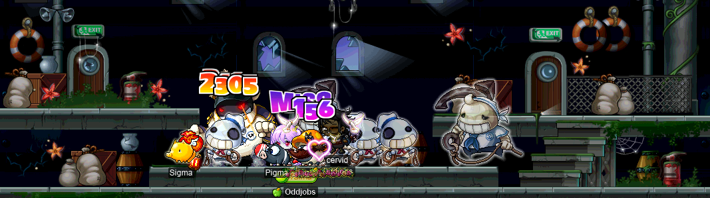
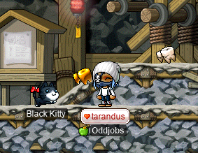

# rangifer’s diary: pt. lxxxix

## <i>roll, or die trying</i>

<b>Slime</b> (<b>OmokTeacher</b>, <b>Thinks</b>) posted in the <b>Suboptimal</b> Discord&trade; server about a game jam by the name of [GMTK Game Jam 2022](https://itch.io/jam/gmtk-jam-2022) that was about to be held on two weeks or so, asking if anyone wanted to collaborate on an entry into the jam! For those not familiar with the concept of a “game jam”, the basic idea is that a theme is presented, and participants in the game jam are tasked with making a game _from scratch_, inspired by said theme, over the course of the event (which has a strict time limit). You can [read more about game jams on Wikipedia](https://en.wikipedia.org/wiki/Game_jam). This particular game jam is all about making _videogames_ that are playable on a [PC](https://en.wikipedia.org/wiki/Personal_computer) with nothing more than a typical [keyboard](https://en.wikipedia.org/wiki/Computer_keyboard) and [computer mouse](https://en.wikipedia.org/wiki/Computer_mouse). Like MapleStory! But, you know, something that you can actually make over the course of just &lt;50 hours :P This jam was advertised has having a 48-hour duration, but it was extended to 50 hours with the caveat that any late entries (even late by just one second!) could not be retroactively accepted.

Creating an entire videogame from scratch in &lt;50 hours is no mean feat! Of course, what exactly “scratch” means here must be defined by the game jam itself. For example, is it okay to reuse existing [software libraries][lib]? Surely at least _some_ libraries must be acceptable to reuse, whether it be a game engine (e\.g. [Godot](https://godotengine.org/)\*, [Pygame](https://www.pygame.org/), [Irrlicht](https://en.wikipedia.org/wiki/Irrlicht_Engine)&dagger;, [LÖVE](https://love2d.org/)&ddagger;, [Panda3D](https://www.panda3d.org/), etc.), cross-platform libraries for interfacing with multimedia hardware (e\.g. [GLFW](https://en.wikipedia.org/wiki/GLFW), [SDL](https://en.wikipedia.org/wiki/Simple_DirectMedia_Layer), [SFML](https://en.wikipedia.org/wiki/Simple_and_Fast_Multimedia_Library), etc.), the [standard library](https://en.wikipedia.org/wiki/Standard_library) of the language that you’re using (e\.g. [glibc](https://en.wikipedia.org/wiki/Glibc), [musl](https://en.wikipedia.org/wiki/Musl), the [Python standard library](https://docs.python.org/3/library/), etc.), the [language](https://en.wikipedia.org/wiki/Programming_language) implementation itself (including not just [translators][translator], but also [runtime libraries](https://en.wikipedia.org/wiki/Runtime_library), e\.g. [`crt0`](https://en.wikipedia.org/wiki/Crt0), an [HTML5](https://en.wikipedia.org/wiki/HTML5)/[CSS3](https://en.wikipedia.org/wiki/CSS#CSS_3)/[ECMAScript](https://en.wikipedia.org/wiki/ECMAScript) runtime as provided by a [web browser](https://en.wikipedia.org/wiki/Web_browser), etc.), the [OS](https://en.wikipedia.org/wiki/Operating_system) itself(!), [firmware](https://en.wikipedia.org/wiki/Firmware)(!!), or what have you. So, this game jam only requires that your [application](https://en.wikipedia.org/wiki/Application_software) logic be created from scratch, allowing the reuse of game engines like those listed previously, plus any libraries/software that the game engines depend on. Plus, of course, any assets (images, audio, etc.) would have to be created from scratch as well.

Although I didn’t have any experience making games myself, I thought that this might be an interesting &amp; fun challenge to participate in, so I agreed to join Slime’s team. We were also joined by <b>Tab</b> (<b>Outside</b>) and <b>Monc</b>, putting our team size at four. Although my main speciality is more in the realm of audio (particularly music), it turned out that I was the only one on our team familiar with computer programming, so it was going to be my job to write all of the code!

Due to my lack of experience with making videogames, the first order of business was to prepare for the game jam by familiarising myself with a game engine that I could use for the jam. There are a _lot_ of game engines out there (no, really, I was overwhelmed), and I very seriously considered using a number of them, including Godot (as mentioned above). However, I decided that using a highly robust, mature, and fully-featured (“all batteries included”) game engine with [GUI](https://en.wikipedia.org/wiki/Graphical_user_interface) tooling, etc. — like Godot — was going to be too much for me to handle. Because I wasn’t used to this kind of tooling, I instead wanted a [development](https://en.wikipedia.org/wiki/Software_development) experience similar to what I’m more used to, where the “engine” would merely be a software library that exposes an [API](https://en.wikipedia.org/wiki/API) in the language that I’m using, just like any other library. Then, the application could just be a few files’ worth of code in my language of choice, paired with the assets provided by my teammates. These days, I’ve been using [Rust](https://www.rust-lang.org/) for a lot of stuff, and it seemed like a fitting language for the task, so I set out to look for a library (“crate”) in Rust that could fulfil the role of “game engine”. I was _very_ close to choosing [macroquad](https://github.com/not-fl3/macroquad/), as it takes a very simple &amp; elegant approach to its API and to its underlying cross-platform implementation. However, I ended up choosing [Bevy](https://bevyengine.org/), partly because it looked like it had a larger community and workforce behind it, and partly for stupid reasons like “[ECS](https://en.wikipedia.org/wiki/Entity_component_system)? What is _that_?? I need to know!!”. :\]

[The result of my attempts to learn how to use Bevy can be found here](https://subop.github.io/bevy_test/). It’s just a little game demo that you can run in your browser, which is controlled exclusively by moving the mouse (no buttons/keys required). In the course of adding audio to this demo (particularly [SFX](https://en.wikipedia.org/wiki/Sound_effect)), I uncovered some… unfortunate performance characteristics of running Bevy applications in the browser, which I _could not fix_ for the life of me. So don’t be surprised if it’s a bit choppy sometimes when you run it \>.\< You can find the code for this demo [here](https://codeberg.org/subopt/bevy_test). I used [bevy\_rapier2d](https://crates.io/crates/bevy_rapier2d) to provide a [physics engine](https://en.wikipedia.org/wiki/Physics_engine) (who doesn’t like physics??). In the end, I also tried manually decoding [Ogg](https://en.wikipedia.org/wiki/Ogg) [Vorbis](https://en.wikipedia.org/wiki/Vorbis) into uncompressed [WAVE](https://en.wikipedia.org/wiki/WAV) (in-[memory](https://en.wikipedia.org/wiki/Random-access_memory)) using [lewton](https://crates.io/crates/lewton) (Vorbis decoding) and [hound](https://crates.io/crates/hound) (WAVE encoding), in a failed attempt to alleviate the performance problems. &#x1f62d; On the bright side, Slime was kind enough to provide some assets to me in the form of wooden crate &amp; metal crate [sprites][sprite] so that I could get used to incorporating images into the game, as well as a really neat sparks animation for when the metal crate hits stuff!

Because part of the demo was learning how to incorporate audio (including not just SFX, but also music), I wrote a little musical piece for the purpose of this dumb little demo LOL: [bevy\_test\.ogg](https://codeberg.org/subopt/bevy_test/raw/branch/master/assets/bevy_test.ogg). This piece features the somewhat unlikely sextet⸸ of a [steel-string acoustic guitar](https://en.wikipedia.org/wiki/Steel-string_acoustic_guitar), a [synthesizer](https://en.wikipedia.org/wiki/Synthesizer), a [celesta](https://en.wikipedia.org/wiki/Celesta), a [violoncello](https://en.wikipedia.org/wiki/Cello), a [bass clarinet](https://en.wikipedia.org/wiki/Bass_clarinet), and a [drumkit](https://en.wikipedia.org/wiki/Drum_kit).

In any case, even if Bevy had weird performance issues in the browser, I didn’t really have time to reconsider my game engine choice at this point. So when the time came, I buckled down for a two-day-long grind…

The theme was announced at the beginning of the jam: “roll of the dice”. That’s it. The point is that there are a lot of possible ways to interpret the theme: on the more figurative side, dice are commonly associated with gambling and randomness; on the more literal side, literally incorporating dice into the game is a real possibility as well. Slime gave some suggestions along the more literal side, suggesting perhaps something like a [platformer](https://en.wikipedia.org/wiki/Platform_game) or [puzzle](https://en.wikipedia.org/wiki/Puzzle) game in which the player controls a die (or set of dice). I came along a few hours later (I need my beauty sleep SMH don’t @ me) and suggested something along [2D](https://en.wikipedia.org/wiki/Two-dimensional_Euclidean_space) platformer lines, in which the [PC](https://en.wikipedia.org/wiki/Player_character) is a die, and they can roll away from, or towards, the camera to change the only side of their die that is visible (assuming an [orthogonal projection][op]). Then, we can change how the player interacts with the world based on which side is facing the camera.

Because no other suggestions were forthcoming, and this was the most concrete idea that we had so far, I didn’t have much choice but to start making a demo based on this idea; the clock was already ticking (or rather, had been ticking for five hours or so). Long story short, after _over 40 hours_ of straight-up grinding (basically just eating, sleeping, and writing code — emphasis on the latter lmfao), with artistic input from Slime (images/animations), Tab (SFX), and Monc (music), the result was a game that we called **<i>roll, or die trying</i>** (this was a working title that I came up with, but I couldn’t get anyone to suggest another title so it just stuck LMAO).

You can play the game (in the exact unfinished state that it was submitted to the game jam) **[here, on itch\.io](https://cervid.itch.io/roll-or-die-trying)**. The code &amp; assets can be found [here](https://codeberg.org/subopt/gmtk_game_jam_2022). We submitted a bit early because I was pretty much about to pass tf out, and in any case, 50 hours is just not enough to make this kind of game from scratch in a relatively “finished” state. For example, side six (the side of the die with six [pips][pip] showing) is completely unimplemented, among many other fun bugs and generally poor designs that were forced by the time constraints.

That being said, I’m incredibly proud of what we were able to do, from nothing other than a relatively lightweight game engine, and some &ap;41 hours or so in real time. A surprisingly (even — or especially — to me) large amount of the game is implemented, Tab’s sound effects fit the game very nicely (and make side four of the die quite special), Monc’s music gave it the kind of BGM that it needed (Monc asked about possibly adding an intro and/or outro to the music, but I insisted that it would actually be desirable to _not_ have these structural features), and Slime’s visual art is stunning and gives the game much of its appeal. If you’re able to try out the game yourself, I hope you enjoy!!

Footnotes for “<i>roll, or die trying</i>”

\*/ˈɡɒdoʊ/.

&dagger;/ˈɪʁlɪçt/.

&ddagger;/ˈløːvə/. Also known as “Love2D”.

⸸Think [Pierrot ensemble](https://en.wikipedia.org/wiki/Pierrot_ensemble), except completely different.

[lib]: https://en.wikipedia.org/wiki/Library_(computing)
[translator]: https://en.wikipedia.org/wiki/Translator_(computing)
[sprite]: https://en.wikipedia.org/wiki/Sprite_(computer_graphics)
[op]: https://en.wikipedia.org/wiki/Projection_(linear_algebra)#Orthogonal_projection
[pip]: https://en.wikipedia.org/wiki/Pip_(counting)

## Sixty nine? More like… uhh… _schmixty mine_… am I right…?

Anyone in the <b>Suboptimal</b>&ndash;<b>Dream</b> meta-alliance (a\.k\.a. Subdream, a\.k\.a. Dreamoptimal) is already aware of this, but just in case any readers of my diary are wondering what happened to FM 6-9 (channel 6, [free market room 9](https://maplelegends.com/lib/map?id=910000009)), I’m reproducing an announcement that I made in several Discord&trade; servers here:

The original announcement

> hey yawl, i’ve got some important news about **THE FATE OF {6-9}**!! 😮
>
> some of you may (or may not) have noticed some… interesting shops popping up around 6-9, channel 6 FM room 9, our HQ &amp; the HQ of the Dream&ndash;Suboptimal meta-alliance. i’ve certainly seen the shops myself (they’ve been there for a while now), but i wasn’t sure how many were just Dream members, or perhaps innocent maplers destined to set up their personal scroll shops in the haha funny sex number FM. heck, some of their IGNs even have haha funny sex number in them — well, maybe not “haha funny” considering that the IGNs are `Wifebeater69` and `HitMeDaddy69`, but we don’t talk about that 🙄
>
> the point is that this person (persons?) has been aggressively setting up about eight or so shops close to the 6-9 portal, patiently waiting until all of the Dream/Suboptimal folx are asleep or otherwise AFK to reset their shops. some of the Dream folx have been observing this, and have tried multiple times to politely ask our intrepid free-marketeer to ease up a bit, only to get aggressive dismissals.
>
> all of that is a bunch of goofy talking words amounting to the simple announcement that **Dream have moved their HQ to FM 4-2 (channel 4, [FM room 2](https://maplelegends.com/lib/map?id=910000002))**. this also coincides with a planned alliance between Dream and a guild by the name of <b>Nimbus</b> (whose HQ is in the same channel, at 4-22), although i cannot speak on this alliance-to-be, as i lack any knowledge of the details.
>
> what does this mean for Suboptimal? well, as sad as it may be, this means that we’ll also have to relinquish our precious 6-9 to the `Wifebeater69`s and the `ligmaballz`s of MapleLegends. the meta-alliance remains intact, and **Suboptimal’s HQ is now located at 4-2 (channel 4, FM room 2)** as well. surprise changes are never fun, but let’s look at the pros &amp; the cons:
>
> **pros**
>
> - no more stinky FM sweatlords
> - FM room 2 is Henesys-themed instead of Loodi-themed
> - when Kimmy cuts the number of channels in half, we won’t have to move
> - the Subdream meta-alliance lives on
> - 42 might not be haha funny sex number, but it is the answer to the ultimate question of life, the universe, & everything, or something like that. that’s cool i guess
>
> **cons**
>
> - we all have to get used to logging in to channel 4 instead of channel 6 now
> - no more haha funny sex number
> - we let the stinky FM sweatlords win

**[TL;DR](https://en.wiktionary.org/wiki/tl;dr): The Suboptimal&ndash;Dream HQ is now located at 4-2 (channel 4, [FM room 2](https://maplelegends.com/lib/map?id=910000002))**.

## Þ&#x364; byſhop vvades in-to battel

I’ve been doing some fun [Capt. Latanica](https://maplelegends.com/lib/monster?id=9420513) runs on my pure [STR bishop](https://oddjobs.codeberg.page/guides/introduction-to-odd-jobs/#str-mage) <b>cervid</b>, alongside fellow <kbd>Ctrl</kbd>-presser (and my Maple wife), [STRginner](https://oddjobs.codeberg.page/guides/introduction-to-odd-jobs/#permabeginner-outland) <b>Taima</b>:

The bishop wades into battle

As my time permits, I’ve been striving to saturate (i\.e. run twice per day) the ability to do Capt. Lat runs, with Taima. However, it hasn’t just been Taima &amp; I. On two of our runs, we were joined by [swashbuckler](https://oddjobs.codeberg.page/guides/introduction-to-odd-jobs/#swashbuckler) extraordinaire <b>Yoshis</b> (<b>Furbs</b>):

It’s really cool to see someone playing swashbuckler, a favourite odd job of mine, and Yoshis has been doing a great job of it — already on her way to a [T10 ring](https://maplelegends.com/lib/equip?id=1119012) and level 100 as we speak!!

We also did a pair of runs with INTlaw <b>Lvl1Crook</b> (<b>Level1Crook</b>, <b>Sangatsu</b>, <b>xXCrookXx</b>), who was impressed by our damage :P

It’s been a long time that I’ve wanted to do [Zakum](https://maplelegends.com/lib/monster?id=8800002) on this character. The main thing that attracted me to STR mages — particularly, STR clerics/priests/bishops — so long ago was a kind of “best of both worlds” scenario. In the past (not on MapleLegends, but on a different server that may or may not still exist…?), I tried playing clerics/priests at least once or twice, convinced that their skillset was one of my favourite, if not my single favourite, in the game. I really wanted to be able to “support” my parties, even if I had only a dim idea of what I would actually be doing, so the cleric/priest/bishop route seemed like the obvious pick. Unfortunately, by observing &amp; emulating the best practices of other players of the same classes, I found myself getting burnt out very quickly, bored to tears by spamming [Heal](https://maplelegends.com/lib/skill?id=2301002) in [GS2](https://maplelegends.com/lib/map?id=541010010) or whatever. I wanted to use Heal to support my party, not to roleplay as a undead-grinding [bot](https://en.wikipedia.org/wiki/Video_game_bot)! Plus, what about my other skills??

After getting frustrated by my initial impressions of clerics &amp; priests, I soon realised that I could make use of age-old character builds to combine my love of the priest skillset with my love of playing [permabeginners](https://oddjobs.codeberg.page/guides/introduction-to-odd-jobs/#permabeginner-outland)! It would become the best of both worlds, retaining the interesting parts of the cleric/priest/bishop skillset, whilst seamlessly integrating the simple joy of bopping my enemies on the head.

Well, Zakum represents a genuine exercise of the bishop skillset; I have paid close attention to the bishops in the Zakum runs that I’ve done on my [darksterity knight](https://oddjobs.codeberg.page/guides/introduction-to-odd-jobs/#dex-warrior) <b>rusa</b> and my [woodsmaster](https://oddjobs.codeberg.page/guides/introduction-to-odd-jobs/#woodswoman) <b>capreolina</b>, and I have really wanted to try it myself. Unfortunately, Zakum is level 140, so the usual minimum level for Zakum runners tends to be 135, as that is the lowest level that you can be whilst still getting EXP normally (lower level characters will have their EXP leeched from them by their level ≥135 party members). But getting to level 135 is proving difficult for cervid; in honesty, I don’t really feel like grinding 12 straight hours of [CDs](https://maplelegends.com/lib/map?id=742010203) for every level.

But who cares? I don’t need to be level ≥135!! I can do whatever tf I want!!! I don’t need fkn EXP!!!! Try &amp; fkn stop me!!!!!

So, I did Zak anyways.

This shit is a real workout, let me tell you. Here, you can see me DHing (DH = “dispel head”, i\.e. get rid of the buffs on Zak’s body that are cast by the arms):

Besides being on the lookout for buffs that you can [Dispel](https://maplelegends.com/lib/skill?id=2311001) during arms stage, there’s also the attacking (for which I gotta get nice &amp; cozy right next to Zakum), the keeping [HS](https://maplelegends.com/lib/skill?id=2311003) up during the entire arms stage (more easily said than done, considering its puny area of effect, short duration, and seemingly unending animation time), keeping other buffs up (that’s like five or six more buffs), [HSh](https://maplelegends.com/lib/skill?id=2321005)ing when appropriate (again, more easily said than done, as it has a cooldown, and is used more efficiently when Zakum is not weapon-cancelled and the stun pillars are just about to land on your party members’ heads), Healing yourself &amp; your party members, Dispelling your party members _as soon as_ they get Seal’d (regardless of whether or not you yourself get Seal’d), trying to dodge stun pillars whenever HSh is inactive, and also not fkn dying?? &#x1f630;

Well, I made it through my first run! And got a card for it!!:

Here I am, attacking Zak’s body:

And here I am, dying on Zak’s body…:

-\_- I couldn’t figure out where my character was… &#x1f62c; I can tank a hit from Zak’s body (even third body), but I was not expecting to be taking quite so much damage at this point in time &#x1f605;

Oh well, still fun! And now that I have taken the road of Zakum, it is time to say goodbye to an old friend…

I use my fancy [Scar hat](https://maplelegends.com/lib/equip?id=1003026) now, so the only economical thing for me to do is to NPC this old zhelm so that I can loot zhelms and NPC them when I do Zakum runs (they sell for 0\.5[M](https://en.wikipedia.org/wiki/Mega-) mesos a pop). Rest in peace, my epic 13 STR (lol) zhelm that I worked so hard for… &#x1faa6;

Oh, and it looks like it’s time to give up [MR](https://maplelegends.com/lib/skill?id=2321002) (for now) in favour of HSh. To that end, I used a whole pile of [fourth-job SP reset](https://maplelegends.com/lib/cash?id=5050004)s, and passed an [HSh20 book](https://maplelegends.com/lib/use?id=2290034) (worthless on the market)…

…and an [HSh30 book](https://maplelegends.com/lib/use?id=2290035) (not so worthless, I think I paid like 25M mesos for a single book)…

…Thankfully, I passed the HSh30 on the first try. _WHEW_ (s/o to our ʟᴏʀᴅ &amp; saviour Uwu Jweswus, and <b>uayua</b>, for helping me out on this one).

## Grounden

I’ve been tryna _get my grind on_, on my [daggermit](https://oddjobs.codeberg.page/odd-jobs.html#dagger-assassin) <b>alces</b>. Level 120 won’t achieve itself, you know. I did some [CD](https://maplelegends.com/lib/map?id=742010203) grindin’ alongside INTlaw <b>Lvl1Crook</b> (<b>Level1Crook</b>, <b>Sangatsu</b>, <b>xXCrookXx</b>) and [STRginner](https://oddjobs.codeberg.page/guides/introduction-to-odd-jobs/#permabeginner-outland) <b>Taima</b>:

After Lvl1Crook had to leave, Taima &amp; I continued grinding for a while, at least until Taima was almost ready to level! For the actual levelling, we headed to Masteria in search of [Headless Horsemen](https://maplelegends.com/lib/monster?id=9400549)…:

Upon defeating one of which, Taima hit level 124~!!!:

Grats again :3

Hopefully, I can get some more grind in… in the future…! I’m comin’ for that [MoN](https://maplelegends.com/lib/equip?id=1122059)…

## A marble, statues, &amp; marble statues

Speaking of grind, it’s time to get back on that [ToT](https://maplelegends.com/lib/map?id=270000100) quest grind with my [darksterity knight](https://oddjobs.codeberg.page/guides/introduction-to-odd-jobs/#dex-warrior) <b>rusa</b>~

This is the part where I kill 999 (nine hundred &amp; ninety-nine) of each of various Temple of Time species. Are you ready? R— ready? Okay, let’s do it.

First up this time was 999 [Oblivion Monk Trainees](https://maplelegends.com/lib/monster?id=8200010), which is kinda like killing 999 [Oblivion Monk](https://maplelegends.com/lib/monster?id=8200009)s, except that you feel extra bad because you have to kill the little baby ones too:

Then, 999 [Oblivion Guardian](https://maplelegends.com/lib/monster?id=8200011)s, for whose elimination I feel no remorse, because they are just floating metal armour:

Then, 999 [Chief Oblivion Guardian](https://maplelegends.com/lib/monster?id=8200012)s, which are kinda the same thing, except more annoying, because they have more HP, and [RtO4](https://maplelegends.com/lib/map?id=270030400) spawns a few Oblivion Guardians (which I don’t need at this point), as well:

I felt bad for killing these ones because I learned that I, too, am a Chief Oblivion Guardian:

I really am a monster.

In any case, this was enough to propel rusa to the big level 170~!!:

&#x1f929;

Now, my task was to fight the final area boss of le temple du Temps: [Lyka](https://maplelegends.com/lib/monster?id=8220006)! If the name sounds [Slavic](https://en.wikipedia.org/wiki/Slavic_languages) to you, you might be thinking of [Лайка](https://en.wikipedia.org/wiki/Laika) ⟨<i>Lajka</i>⟩&dagger;, the [Soviet space dog](https://en.wikipedia.org/wiki/Soviet_space_dogs) who became the first [animal](https://en.wikipedia.org/wiki/Animal) to fly into [orbit around the Earth](https://en.wikipedia.org/wiki/Earth%27s_orbit), aboard [Спутник-2](https://en.wikipedia.org/wiki/Sputnik_2) ⟨<i>Sputnik-2</i>⟩ on 1957-11-03. But ⟨<i>Lyka</i>⟩ [would be](https://en.wikipedia.org/wiki/Transliteration) Лыка (or, in [Ukrainian](https://en.wikipedia.org/wiki/Ukrainian_language), Лика), not Лайка. (917) Лика, or (917) Lyka, is the name of [an asteroid](https://en.wikipedia.org/wiki/917_Lyka) in the [Asteroid belt](https://en.wikipedia.org/wiki/Asteroid_belt), named after a woman named Лика. More interpretations mostly get you words related to [bast](https://en.wikipedia.org/wiki/Bast_fibre), like [Polish](https://en.wikipedia.org/wiki/Polish_language), [Upper Sorbian](https://en.wikipedia.org/wiki/Upper_Sorbian_language), &amp; [Lower Sorbian](https://en.wikipedia.org/wiki/Lower_Sorbian_language) <i>łyka</i> “bast”, [Slovak](https://en.wikipedia.org/wiki/Slovak_language) <i>lyka</i> “[phloem](https://en.wikipedia.org/wiki/Phloem); bast”, [Russian](https://en.wikipedia.org/wiki/Russian_language) лы́ка ⟨<i>lýka</i>⟩ “bast; rope made of bast”, [Czech](https://en.wikipedia.org/wiki/Czech_language) <i>lýka</i> “phloem; bast”, all ultimately from [Proto-Slavic](https://en.wikipedia.org/wiki/Proto-Slavic_language) \*<i>lỳko</i> “bast”. There’s also Polish <i>łyka</i>, which, apart from meaning “bast”, can also be the third-[person](https://en.wikipedia.org/wiki/Grammatical_person) [singular](https://en.wikipedia.org/wiki/Grammatical_number) present [tense](https://en.wikipedia.org/wiki/Grammatical_tense) of <i>łykać</i> “to swallow; to eat/drink quickly; to easily absorb \[information\]”, apparently from Proto-Slavic \*<i>lykati</i>, and ultimately [PIE](https://en.wikipedia.org/wiki/Proto-Indo-European_language) \*<i>(s)leug-</i> or \*<i>(s)lug-</i>, which is also the source of [Dutch](https://en.wikipedia.org/wiki/Dutch_language) <i>slokken</i> “to swallow/gulp gluttonously” and thus <i>slok</i> “a gulp”, and probably also dialectal [English](https://en.wikipedia.org/wiki/English_language) <i>slock</i> “a gulp”. Nothing that looks particularly related to our bullish <del>friend</del> enemy here…

In any case, it was tough even finding a Lyka. I scanned the channels… AFK’d some… scanned the channels again… and so on, until I did finally find one. The fight took roughly 17 minutes and 40 seconds from start to finish, which I’m just going to consider impressive (just let me have this one) because I had never fought Lyka before and I didn’t even know it left-jump seds you? I didn’t die tho! Pretty good, right‽

(Apologies for the poor quality of the image above; it’s actually cropped out of a frame from video that I took of the fight.)

After I declared victory and ran off with [Lyka’s horn](https://maplelegends.com/lib/etc?id=4000462), [Temple Keeper](https://maplelegends.com/lib/npc?id=2140000) once again patted me on the back and told me to do something else. So I tried. Now that I had made my way through nearly the entire temple, I found myself (mistakenly, it seems) in the [Broken Corridor](https://maplelegends.com/lib/map?id=270040000):

What I _really_ needed to do was talk with the [Record Keeper](https://maplelegends.com/lib/npc?id=2140003), who is, naturally enough, an old man with a [prehensile](https://en.wikipedia.org/wiki/Prehensility) beard:

And now for one final quest, to collect ten [Smiley Mask](https://maplelegends.com/lib/etc?id=4000446)s, ten [Neutral Mask](https://maplelegends.com/lib/etc?id=4000451)s, ten [Frowny Mask](https://maplelegends.com/lib/etc?id=4000456)s, a [Whale’s Helmet](https://maplelegends.com/lib/etc?id=4000460) (from [Dodo](https://maplelegends.com/lib/monster?id=8220004)), a [Knight’s Mask](https://maplelegends.com/lib/etc?id=4000461) (from [Lilynouch](https://maplelegends.com/lib/monster?id=8220005)), and a [Guardian’s Horn](https://maplelegends.com/lib/etc?id=4000462) (which I had just got from Lyka), for “[Barrier](https://bbb.hidden-street.net/quest/temple-of-time/barrier)”. I went and collected the masks, and hunted down another Lilynouch (as the one that I killed for the corresponding quest didn’t drop any items whatsoever…), and lo &amp; behold, the [Marble of Chaos](https://maplelegends.com/lib/etc?id=4032002)!:

Time for this marble to sit in my inventory, gathering dust forever &#x1f60a;

Footnotes for “A marble, statues, &amp; marble statues”

&dagger;More commonly [romanised](https://en.wikipedia.org/wiki/Romanization) as ⟨<i>Laika</i>⟩, transliterations here instead use [Scientific transliteration](https://en.wikipedia.org/wiki/Scientific_transliteration_of_Cyrillic).

## Πρός τὸν Ι&#x313;&#x301;καρον

Speaking of rusa, I have set out to create a set of AVOID gear for her so that she can make good use of the AVOID that she naturally gets from being pure DEX. Amongst other things, I hope that this can be useful for playing the role of sed target during [Horntail](https://maplelegends.com/lib/monster?id=8810003) runs.

In particular, the equipment items that I need to get my hands on are some [Yellow Strap Shoes](https://maplelegends.com/lib/equip?id=1072261) scrolled for AVOID, a [Sauna Robe](https://maplelegends.com/lib/equip?id=1051017) scrolled for LUK, and an [Icarus Cape (1)](https://maplelegends.com/lib/equip?id=1102054) scrolled for LUK (plus a helmet, but we’re not gonna get into that). Anything else, I can provide from the equipment that I have already at my disposal.

As for the YSS, I managed to find a good (21 AVOID) pre-scrolled pair for sale at a good price:

For Icarus

As for the Sauna Robe, I did [the Sauna Robe questline](https://bbb.hidden-street.net/quest/victoria-island/mr-wetbottoms-secret-book) nine (9) times over, and started scrolling the results. I had a pretty spectacularly bad time trying to get [30%](https://maplelegends.com/lib/use?id=2040521)s to pass, booming and just generally ruining almost every single one. I even bought one or two more Sauna Robes on the FM to try to continue my Sauna-Robe-ruining addiction. I need another (+0) Sauna Robe with 9 slots for my collection!! But, okay, I kept scrolling and did manage to turn one of my own Sauna Robes into a pretty decent 21 LUK (32\.5 tAVOID) one :P

That just leaves the Icarus Cape (1). Unfortunately for me, Icarus Capes (1) don’t exist. At least, not on the market. So I was going to have to make my own. Icarus Capes are awarded by [Icarus and the Flying Pill](https://bbb.hidden-street.net/quest/victoria-island/icarus-and-the-flying-pill), which is the final quest in a questline that starts with [I’m Bored](https://bbb.hidden-street.net/quest/victoria-island/im-bored) (and [I Need Help On My Homework!](https://bbb.hidden-street.net/quest/victoria-island/i-need-help-on-my-homework)). None of the quests in this line are repeatable, so for each completion, _I would need to do it on a new character that hadn’t already completed the questline_. Furthermore, the requirements for each completion of the questline are as follows:

- A level ≥42 character,
- 10 [Slime Bubble](https://maplelegends.com/lib/etc?id=4000010)s,
- 70 [Squishy Liquid](https://maplelegends.com/lib/etc?id=4000004)s,
- 70 [Tree Branch](https://maplelegends.com/lib/etc?id=4000003)es,
- 50 [Stirge Wing](https://maplelegends.com/lib/etc?id=4000042)s,
- 50 [Stiff Feather](https://maplelegends.com/lib/etc?id=4003004)s,
- 10 [Processed Wood](https://maplelegends.com/lib/etc?id=4003001)s,
- 100 [Tablecloth](https://maplelegends.com/lib/etc?id=4000035)s,
- 50 [Medicines With Weird Vibes](https://maplelegends.com/lib/etc?id=4000036),
- 10 [Alligator Skin Pouch](https://maplelegends.com/lib/etc?id=4031164)es&#x2728;,
- and 20 [Witchgrass Leaves](https://maplelegends.com/lib/etc?id=4031165)&#x2728;.

The items marked with a “&#x2728;” are quest-only, i\.e. I cannot collect them beforehand and cannot trade them, and thus must collect them on each character as that character completes the questline.

This is a pretty tall order, especially considering that I only have a ⅓ chance of getting the item that I want upon completing the questline! Or do I?? [You’d _think_](https://en.wikipedia.org/wiki/Discrete_uniform_distribution) that it would be ⅓, considering that there are exactly three possibilities: Icarus Cape (1), [Icarus Cape (2)](https://maplelegends.com/lib/equip?id=1102055), and [Icarus Cape (3)](https://maplelegends.com/lib/equip?id=1102056). But, as Icarus would have it, my _actual_ chances were considerably slimmer than ⅓.

In any case, I was going to need a lot of ETCs. Including those Medicines With Weird Vibes. So I hopped on to my [vicloc](https://codeberg.org/Victoria/resources) [clericlet](https://oddjobs.codeberg.page/guides/introduction-to-odd-jobs/#magelet) <b>d33r</b> to farm some of those (and some Tablecloths as well):

Oh, nice!! Once step closer to the big 70, I guess LOL

I was able to accumulate most of the ETCs from my various characters, and from farming the ([Jr.](https://maplelegends.com/lib/monster?id=3230101)) [Wraith](https://maplelegends.com/lib/monster?id=4230102) ETCs on d33r. But I still needed more Stirge Wings and Stiff Feathers in particular. In the end, I was actually able to get away with just using the Stirge Wings that I could find by [owl](https://maplelegends.com/lib/cash?id=5230000)ing. I owled for Stiff Feathers as well, and used some of those (the rest were egregiously expensive), but I was mostly doing this to offset the number of stiffies that I drained from my vicloc storage mule’s inventory (which were farmed by my [islander](https://oddjobs.codeberg.page/guides/introduction-to-odd-jobs/#islander), <b>ozotoceros</b>).

Of course, then I had to farm the Alligator Skin Pouches and Witchgrass Leaves…

While farming Witchgrass Leaves in [The Swamp of Despair I](https://maplelegends.com/lib/map?id=107000000), I found that this map has one or two rather… _unusual_ spawnpoints:

The above image shows me spawning into the map. Yes, there is actually a spawn point just deadass in the middle of the air. Somewhat comically, there are no footholds anywhere near its direct underside, so if you just so happen to spawn there (the spawn points are chosen at random), you fall down almost the entire height of the map(!) before finally (and painfully) hitting the floor.

Hunting for Witchgrass Leaves is definitely the worst part. Obviously, it’s not very difficult, but they are annoying to find and break (there are often a bunch of [gator](https://maplelegends.com/lib/monster?id=3110100)s in the way, and for some reason, Witchgrass can only be struck from the right-hand side), and the droprate for the grass is annoyingly low.

Having finished the questline on rusa, I moved on to my I/L [archmagelet](https://oddjobs.codeberg.page/guides/introduction-to-odd-jobs/#magelet) <b>cervine</b>…

…And my [pugilist](https://oddjobs.codeberg.page/guides/introduction-to-odd-jobs/#pugilist) <b>tarandus</b>…

…And my [permarogue](https://oddjobs.codeberg.page/guides/introduction-to-odd-jobs/#permarogue) <b>panolia</b>…

…And my [besinner](https://oddjobs.codeberg.page/guides/introduction-to-odd-jobs/#permabeginner-outland) <b>hashishi</b>…

…And in the end, I did this questline a few times. Not one time, not two times, not three times, but **thirteen (13) times**. That is 5&#x202f;720 ETC items, including 130 Alligator Skin Pouches and 260 (please kill me) Witchgrass Leaves.

You’ll be delighted to know that I got zero Icarus Capes (1) within the first ten completions. 0&#x29f8;10. I really was about to cry — how could Kimmy do this to me? For reference, the probability of failing all trials out of a series of ten [trials][trial], with a success probability of ⅓, is [one in 310](https://en.wikipedia.org/wiki/Binomial_distribution)&nbsp;=&nbsp;one in 59&#x202f;049. One in fifty-nine thousand. AAAAAAAAAAAAAAAAAAAAAAAAAAAAAAAAAAAAAA

It’s okay, though; my luck picked up. Within those last three attempts, I had two successes, and walked away with two Icarus Capes (1) of my very own. That’s an overall success rate of 2&nbsp;&div;&nbsp;13&nbsp;=&nbsp;one in 6\.5&nbsp;&ap;&nbsp;15\.38%. That’s worse than half of the [expected](https://en.wikipedia.org/wiki/Expected_value) success rate \>.\< In the end, I got:

| item            | count |
| :-------------- | ----: |
| Icarus Cape (1) |     2 |
| Icarus Cape (2) |     8 |
| Icarus Cape (3) |     3 |

I [boomed](https://maplelegends.com/lib/use?id=2041040) one of ’em (lol), and with the other one, I made this fairly nice specimen:

 with 8 LUK")

I’ll take it! Full-AVOID rusa is shaping up nicely!!

[trial]: https://en.wikipedia.org/wiki/Experiment_(probability_theory)

## Afforestation

Although I didn’t do very much [Zak](https://maplelegends.com/lib/monster?id=8800002)king or [Krex](https://maplelegends.com/lib/monster?id=9420522)ing on my [woodsmaster](https://oddjobs.codeberg.page/guides/introduction-to-odd-jobs/#woodswoman) <b>capreolina</b> of late, I did still do a lil bossin’, including some [Female Boss](https://maplelegends.com/lib/monster?id=9400121)es (姉御) with shadower extraordinaire <b>Harlez</b> (<b>VigiI</b>):

And, [Purple Ladles](https://maplelegends.com/lib/monster?id=8500001) with marksman <b>Level1Crook</b> (<b>Lvl1Crook</b>, <b>Sangatsu</b>, <b>xXCrookXx</b>) and nightlord (they grow up so fast &#x1f972;) <b>trishaa</b> (<b>MatchaLattes</b>):

O…… R\.I\.P. Level1Crook, level 1 marksman 2021&ndash;2022. &#x1faa6;&#x1f614;

Luckily, I had my pure [STR bishop](https://oddjobs.codeberg.page/guides/introduction-to-odd-jobs/#str-mage) <b>cervid</b> tagging along, so I was able to spare a [Resurrection](https://maplelegends.com/lib/skill?id=2321006).

Here’s a [second body](https://maplelegends.com/lib/monster?id=8500002) screenshot, chaotic as ever, with Level1Crook ducking for dear life (no more Resurrections to save ya now!!):

After those two Pumpkin Let Us runs, we tried our hands at some [Rāvaṇa](https://maplelegends.com/lib/monster?id=9420014) runs. This time, we were going to need [HB](https://maplelegends.com/lib/skill?id=1301007), so I came along as my [darksterity knight](https://oddjobs.codeberg.page/guides/introduction-to-odd-jobs/#dex-warrior) <b>rusa</b>, instead:

And, finally, another Female Boss kill or two was enough to get capre to level 141~!:

## The saga of the Red Sign

[Red Sign](https://maplelegends.com/lib/npc?id=2040034)?? You know what that means: it’s time for some [LPQ](https://maplelegends.com/lib/map?id=221024500)!!

I hopped onto my [DEX brawler](https://oddjobs.codeberg.page/guides/introduction-to-odd-jobs/#dex-brawler) LPQ mule <b>sorts</b> to join fellow LPQ mule, I/L magician <b>Sangatsu</b> (<b>Level1Crook</b>, <b>Lvl1Crook</b>, <b>xXCrookXx</b>), in ridding the 101st floor of the Eos Tower of its [freakish whale clock](https://maplelegends.com/lib/monster?id=9300012) infestation.

We assembled a party, and I unsuccessfully attempted to <del>murder all of them</del> offer them some delicious [candy](https://maplelegends.com/lib/etc?id=4010004):

As usual, [stage 8](https://maplelegends.com/lib/map?id=922010800) was a hoot:

Why are LPQers so horny? Beside what you see in the image above, I feel like I’ve been hit on far more often in LPQ than anywhere else in the Maple world, and I have yet to figure out why…

In any case, it wasn’t long before our ragtag band of LPQers suffered the obligatory Alishar death:

On another occasion, I responded to a [smega](https://maplelegends.com/lib/cash?id=5072000) from [<b>PERC10</b>](https://www.webmd.com/drugs/2/drug-7277/percocet-oral/details) looking for someone who could do [the thief portal](https://maplelegends.com/lib/map?id=922010506):

We didn’t have very many Alishar deaths, but we did have <b>LiLBenzene</b>, who claimed to be a rapper who only raps about [organic chemistry](https://en.wikipedia.org/wiki/Organic_chemistry):

Good times.

## Τάρανδος

And now, for our regularly scheduled <i>Questing With tara</i>&trade;! As always, with your host, <b>tarandus</b> the [pugilist](https://oddjobs.codeberg.page/guides/introduction-to-odd-jobs/#pugilist).

The first order of business is just finishing what I started with the damn ([Dark](https://maplelegends.com/lib/monster?id=4130102)) [Nependeaths](https://maplelegends.com/lib/monster?id=4230105) in the [Disposed Flower Garden](https://maplelegends.com/lib/map?id=200040001):

parandros

Yeah, unfortunately I couldn’t really get this strategy to work, so I caved and started fighting normally again. After like 500 [carnivorous plant](https://en.wikipedia.org/wiki/Carnivorous_plant) kills or something, I went to Aqua Road to meet up with [Richard the Sailor](https://maplelegends.com/lib/npc?id=9201038) again, because I found out the hard way that [his letter](https://maplelegends.com/lib/etc?id=4031567) expires! After just 24 hours!! What the hecc?? And furthermore, he won’t give me a replacement??? Rood AF:

&#x1f644; Oh well, maybe I can figure out a way to still do this quest…

In any case, I realised that I was now level 49 and still had yet to do even a single quest in all of the Nihal\* Desert (including both [Ariant](https://maplelegends.com/lib/map?id=260000000) and [Magatia](https://maplelegends.com/lib/map?id=261000000)), so I took the ship from [Orbis](https://maplelegends.com/lib/map?id=200000000) to Ariant and started punching some [round bunnies](https://maplelegends.com/lib/monster?id=2100101) in the hot desert sun:

I had to hunt some [Bellamoa](https://maplelegends.com/lib/monster?id=2100105)s, so I made my way to the super secret Bellamoa-only map…

Oh. Well, that’s not so secret anymore, is it? The overhaul to the Nihal Desert maps is not exactly “new” anymore, but I am still so used to the original pre-Big-Bang version that I continue to be confused, and to wonder why all of the maps are inexplicably outsized…

In any case, [the Bellamoa map](https://maplelegends.com/lib/map?id=260010300) is as effective as ever:

And then, time to punch some [Cacti](https://maplelegends.com/lib/monster?id=2100103) (owie, my hands :\[&nbsp;):

My hands now thoroughly riddled with cactus [spines](https://en.wikipedia.org/wiki/Thorns,_spines,_and_prickles#Spines), I still had [baby cacti](https://maplelegends.com/lib/monster?id=2100102) to kill…

Who knew that cacti wore diapers?

And, that was enough to propel tarandus to to big level 50~!!:

As previously discussed, tarandus is a bit of a germophobe, so she has to wash constantly. And, as is well known, washing just isn’t as effective if you don’t have your smort pj’s on nice &amp; cozy. And the cosiest pj of them all is the giant full-head helmet made of rock that is the [Zakum Helmet](https://maplelegends.com/lib/equip?id=1002357). Now that I’ve hit level 50, ’tis time to acquire such a stony skull prison:

Part I of the Zakum prequests is easily done. Solo’d it in like… two minutes (don’t ask me for proof, just trust):

Part II? _Also_ easily done. Did the JQ in like… two minutes (again, don’t ask me for proof, just trust — I promise that I didn’t take any crying breaks in the process):

Part III?? Child’s play. I can just buy the [gold teef](https://maplelegends.com/lib/etc?id=4000082)s on the Free Mar— a quarter million mesos each??

Just gotta get these [Miner Zombie](https://maplelegends.com/lib/monster?id=5130108)s to cough up their gold teefs…

Ok, so, in the end, I decided to buy like 8 of the 30 that I needed on the Free Market, because tara was about to level up and I didn’t want to waste my EXP, alright? Sue me.

Anyhow, now I just gotta find someone who will sell me a non-AFK zhelm run…

Oh dear. Well, no use surviving the [Zakum](https://maplelegends.com/lib/monster?id=8800002) run if it doesn’t drop any helmets!! That being said, I did notice that, with [Melting Cheese](https://maplelegends.com/lib/use?id=2020012) bound to my autoHP and my autoHP threshold set to 95%, I never had any autopot failures… Maybe I can dual-client! Time to host Zak!!

I don’t really like hosting, but I’m tryna get tara that helm, so I asked my party nicely if I could loot the zhelms on my “noob character”:

I’m controlling my [darksterity knight](https://oddjobs.codeberg.page/guides/introduction-to-odd-jobs/#dex-warrior) <b>rusa</b> here on the right-hand side, but you can see tara peeking out from the left-hand extreme of the map.

Well, I did succeed in getting tara a helmet. _A_ helmet…

This is… well, honestly it’s pretty spectacularly bad. The 17 STR (the maximum possible STR) makes it look almost worth something, but the DEX and INT being their minimum values (13), the WDEF and MDEF being their minimum values (140), and the WACC being its minimum value (18; as I’m sure you’ll remember, pugilists are more WACC-starved than their non-odd counterparts), kinda ruins it. Do I just accept my fate?

Apparently, no, I am too greedy for that…

This pair of runs went a bit south (although of course we still cleared both) when we had some deaths…

Oh boy. I mean, I get that a leech dispenser has no use for [Resurrection](https://maplelegends.com/lib/skill?id=2321006), but… not even _1_ SP? _One??_ It’s fine, I guess. Just don’t die?

Oh dear. Well, now we’re missing our bowmaster _and_ our nightlord…

In any case, I did end up with a… _decent_ (basically just completely average overall, which was still lightyears better than the other ten or so helms that I had looted previously) helm, so I decided to suck it up and just scroll the damn thing so that I could get the full benefit right away:

&#x1f62d; FML &#x1f62d;

Well, water ya gonna dew? It’s time to move on. To the Ellin Forest! Nihal Desert can wait, I’ve got a ring to acquire!!

Just these first few quests (nothing more than fighting a couple of [Mossy Snail](https://maplelegends.com/lib/monster?id=4250000)s and talking to some NPCs) were enough to get tara to 51:

Then it was time to kill some [Tree Rod](https://maplelegends.com/lib/monster?id=4250001)s in [Western Region of Mossy Tree Forest 2](https://maplelegends.com/lib/map?id=300010200) for [Shadrion](https://maplelegends.com/lib/npc?id=2132003) (&amp; for [Tess](https://maplelegends.com/lib/npc?id=2131007)):

Wait a sec… Shadrion? What is going on? I think I’m seeing double…

[Fata Shadriona][fata-morgana] aside, I had some more Ellin Forest critters to exterminate. Including [Mossy Mushroom](https://maplelegends.com/lib/monster?id=5250000)s (whose [leftover](https://maplelegends.com/lib/etc?id=4000437)s are used for the questline IIRC, but you end up with a bunch of them anyways, so I never pay attention):

[Stone Bug](https://maplelegends.com/lib/monster?id=5250001)s (and their [Rubble](https://maplelegends.com/lib/etc?id=4000439))…

[Primitive Boar](https://maplelegends.com/lib/monster?id=5250002)s (not to be confused with [Violent Primitive Boar](https://maplelegends.com/lib/monster?id=5250003)s! Yike!)…

And now tara was level 52~!:

Oh, right. And then the part where you gotta collect a bunch of ETCs from all over the Maple world. Well, I already had like half of them, so it’s tara’s duty to farm up the rest, including some [Firebomb Flame](https://maplelegends.com/lib/etc?id=4000081)s in [everyone’s favourite hellish spa](https://maplelegends.com/lib/map?id=801000210):

…Going back to the Nihal Desert again anyways, for the [Hardened Pieces of Steel](https://maplelegends.com/lib/etc?id=4000358):

On my way back to Ludus Lake from Nihal, I passed through Victoria Island, so I figured that I may as well wrap [this one](https://www.hidden-street.net/gms/quest/find-the-maple-history-book-2) up and get my [Chief Stan Hat](https://maplelegends.com/lib/equip?id=1002436):

Aaaand there it is! The [Ellin Savior’s Ring](https://maplelegends.com/lib/equip?id=1119001)!!:

Since I was already in Ludus Lake anyways, I took the time to do a quest that I had been putting off, in anticipation of getting a zhelm — which I now had:

As anyone familiar with [KFT](https://maplelegends.com/lib/map?id=222000000) already knows, there are three repeatable quests available from three different NPCs in KFT:

- [Chil Nam’s Buckwheat Paste](https://bbb.hidden-street.net/quest/ludus-lake/chil-nams-buckwheat-paste)
- [Chil Sung’s Roasted Pork](https://bbb.hidden-street.net/quest/ludus-lake/chil-sungs-roasted-pork)
- [Kong Ji’s Rice Wine](https://bbb.hidden-street.net/quest/ludus-lake/kong-jis-rice-wine)

Each one of these quests takes a trivial number of leftover ETCs (from [Hodori](https://maplelegends.com/lib/monster?id=5100003)s, [Moon Bunnies](https://maplelegends.com/lib/monster?id=4230300), and [Samiho](https://maplelegends.com/lib/monster?id=5100004)es, respectively) in exchange for special potions ([Buckwheat paste](https://maplelegends.com/lib/use?id=2022051), [Roasted pork](https://maplelegends.com/lib/use?id=2022050), and [Rice Wine](https://maplelegends.com/lib/use?id=2022052), respectively) that can be used to appease and/or summon King Goblins ([Green](https://maplelegends.com/lib/monster?id=7130402), [Yellow](https://maplelegends.com/lib/monster?id=7130400), and [Blue](https://maplelegends.com/lib/monster?id=7130401), respectively) — or, you can eat them to heal HP and/or MP, but… don’t do that.

The problem is that all of these three repeatable quests have prequests ([Brotherly Love](https://bbb.hidden-street.net/quest/ludus-lake/brotherly-love), Brotherly Love, and [Kong Ji’s Request](https://bbb.hidden-street.net/quest/ludus-lake/kong-jis-request), respectively), which are all level 37 quests. One of the two — Brotherly Love — is completely trivial, requiring nothing from the player other than walking back and forth across the KFT map a few times and talking to some NPCs. Kong Ji’s Request, however, is much more substantial, having not only a prequest of its own ([Tae Gong’s Love for His Wife](https://bbb.hidden-street.net/quest/ludus-lake/tae-gongs-love-for-his-wife)), but also requiring the player to hunt [Blin](https://maplelegends.com/lib/monster?id=6130201)s! Blins are **level 60** (keep in mind that the quest is level 37) and have **38 AVOID**, meaning that a [PC](https://en.wikipedia.org/wiki/Player_character) at the level of the quest would need [2&nbsp;&sdot;&nbsp;((1\.84&nbsp;+&nbsp;0\.07&nbsp;&sdot;&nbsp;(60&nbsp;&minus;&nbsp;37))&nbsp;&sdot;&nbsp;38)](https://ayumilovemaple.wordpress.com/2009/09/06/maplestory-formula-compilation/) = **262\.2 WACC** (or more) to hit Blins 100% of the time!! Yikers!!!

You can see in the image above that even now, at level 52 &amp; with a zhelm, tara still sometimes misses the damn things. But finding a [Steel Hoe](https://maplelegends.com/lib/etc?id=4031222) wasn’t too difficult.

I then headed to Victoria Island to tie up some loose ends there, without really doing many of the Victoria-Island-exclusive quests. For [The Chaos Behind Alfonse Green and the Nependeath Juice](https://bbb.hidden-street.net/quest/el-nath-mt-aquaroad/the-chaos-behind-alfonse-green-and-the-nependeath-juice), I talked to [Estelle](https://maplelegends.com/lib/npc?id=1032105) and asked how to make [Sweet Syrup](https://maplelegends.com/lib/etc?id=4031201), and she said that I needed 60 [Lupin’s Banana](https://maplelegends.com/lib/etc?id=4000029)s, ten [Pig’s Head](https://maplelegends.com/lib/etc?id=4000017)s, and, naturally, 30 [Saps of Ancient Tree](https://maplelegends.com/lib/use?id=2012002). Needing that many Saps is… unfortunate, so I decided to just buy like 21 of them on the FM (more expensive than you might think…) and hunt the bananas myself:

I also hunted [Sakura Cellion](https://maplelegends.com/lib/monster?id=9400509)s…

…for their [Cherry Blossom Seed](https://maplelegends.com/lib/etc?id=4031523)s:

…for [The Sakura Garden](https://bbb.hidden-street.net/quest/world-tour/the-sakura-garden). This led me to The Sakura Garden 2, which would require going to [Ludibrium](https://maplelegends.com/lib/map?id=220000000) to fight [Pink Teddies](https://maplelegends.com/lib/monster?id=3110101).

As I had already gotten my Chief Stan Hat earlier, it was time to do [Jay’s Curiosity](https://bbb.hidden-street.net/quest/victoria-island/jays-curiosity) (a\.k\.a. “the [Bob](https://maplelegends.com/lib/monster?id=9400551) quest”). If you’ve never done this quest before, you should know that Bob is a level 2 monster with 777(!) HP that spawns exclusively in a Deep Sleepywood map called [Drake’s Meal Table](https://maplelegends.com/lib/map?id=105090300), on a half-hour respawn timer. Bob looks completely identical to a [Snail](https://maplelegends.com/lib/monster?id=100100) (a\.k\.a. “Green Snail”; basically the weakest monster in the game), except that he can jump! Quite impressively high, too! Bob is — according to the Maple History Books, at least — the first creature ever to inhabit the Maple World, from [back before Maple Island, Victoria Island, and Ossyria were separate continents](https://en.wikipedia.org/wiki/Pangaea). [Jay](https://maplelegends.com/lib/npc?id=1012109) wants to know who this “Bob Snale” person is, unaware that he is actually a green snail (rather than a human or [humanoid](https://en.wikipedia.org/wiki/Humanoid)). So I set out to the dungeons of Sleepywood, where Jay said that Bob was most recently spotted:

If you’re wondering why I’m crying, it’s because I already know what I must do: slay Bob.

&#x1f616; I’M SORrY, OKAY?? But h—he’s not really dead, right? I just scared him into his shell. Yeah, that’s it. Take a good look at [Bob’s Snail Shell](https://maplelegends.com/lib/etc?id=4031447)!!

[The Rememberer](https://maplelegends.com/lib/npc?id=1061011) is really gonna want to see this, too. He remembers everything, and collects every monster in the Maple world!…

What the fuck?!? He stole Bob from me! And stole five of my fame!! F55555

Luckily for me, it seems that Bob really _did_ just hide in his shell, because at some point, he took leave of The Rememberer (I would too — clearly The Rememberer is a bully!!) and headed back to his usual stomping ground of Drake’s Meal Table. So I set out to find Bob agai—

JOGHALIURHBGESRAGAOWRIHJWRJIHadwsgf how did I level. I wasn’t paying attention! I forgot to put on my cozy smort pj’s!! -\_- Game sux.

Well, at least I found Bob. Lord 4give me 4 what I am about 2 do… again…

Oh. He didn’t drop his shell. I guess I will find another Bob…?

Still no shell. I am just a Bob murderer. I really am a monster…

Ok, ok, that one _did_ drop a shell. We’re all g. Time to complete this godforsaken questline…

I noticed when completing this quest (I guess I never noticed this before) that the quest abruptly ends, indicating that there are further quests in the questline, but as far as I know, there are not:

>> **[PC](https://en.wikipedia.org/wiki/Player_character):** I wish I could but he’s not coming out from his shell. At least not when I am around…
>
> **Jay:** I think it’s because he is still frightened and scared that you might try to kill him. Hmm… I might be able to help you with that. I’ve seen a place around here that looked just like [Snail Hunting Ground I](https://maplelegends.com/lib/map?id=40000) of Maple Island. He’s known to be born from that place and he might feel safer to come out if he’s there.
>
> **Jay:** Just talk to me one more time. Let me look for the directions.

…And that’s it. &#x1f937;&#x1f3fd;&#x200d;&#x2640;&#xfe0f; Mysterious. I wish this questline had been finished! It would (probably) be cool!!

Anyways, now with my eye again towards The Chaos Behind Alfonse Green and the Nependeath Juice, I needed 20 [Coconut](https://maplelegends.com/lib/etc?id=4000136)s. So I headed to [Florina Beach](https://maplelegends.com/lib/map?id=110000000):

I’m not really a fan of the [Special Taste of Florina Beach](https://bbb.hidden-street.net/quest/victoria-island/special-taste-of-florina-beach) questline, but since I was going to Florina Beach anyways, you know, I may as well get it over with…

I still have yet to finish the questline, because boy, that is a lot of Coconuts to whacc, and a lot of crabby bois to smacc…

Footnotes for “Τάρανδος”

\*Possibly from [Farsi](https://en.wikipedia.org/wiki/Persian_language) &#x61c;&#x646;&#x647;&#x627;&#x644;&lrm; ⟨<i>nehāl</i>⟩ /[nehɒːl](https://en.wikipedia.org/wiki/International_Phonetic_Alphabet)/ “seedling, sapling, shoot”. <i>Nihal</i> — which may be one of a variety of different [romanisations](https://en.wikipedia.org/wiki/Romanization) e\.g. <i>Nehal</i>, <i>Nehaal</i>, <i>Nihaal</i>, <i>Nahal</i>, <i>Nahaal</i>, etc. — appears to be a (relatively) common [given name](https://en.wikipedia.org/wiki/Given_name) in parts of [India](https://en.wikipedia.org/wiki/India), [Sri Lanka](https://en.wikipedia.org/wiki/Sri_Lanka), [Turkey](https://en.wikipedia.org/wiki/Turkey), and [Egypt](https://en.wikipedia.org/wiki/Egypt). Several internet sources claim that, apart from the Farsi origin meaning “seedling”, there is a separate (but very similarly pronounced &amp; written) [Arabic](https://en.wikipedia.org/wiki/Arabic) origin meaning “joyous; exalted”, which might(?) be &#x61c;&#x646;&#x64a;&#x647;&#x627;&#x644;&lrm; ⟨<i>nīhāl</i>⟩ /niːhaːl/, but I can’t seem to find any good evidence that this even means anything in Arabic (other than being a given name). Some sources claim that the [Hindu](https://en.wikipedia.org/wiki/Hindus) usage of the name is from [Hindi](https://en.wikipedia.org/wiki/Hindi) निहाल ⟨<i>nihāl</i>⟩ /nɪɦaːl/, but this appears(?) to be [borrowed](https://en.wikipedia.org/wiki/Loanword) from the [(distantly) related](https://en.wikipedia.org/wiki/Indo-Iranian_languages) Farsi.

[fata-morgana]: https://en.wikipedia.org/wiki/Fata_Morgana_(mirage)

## Horntail et plūs ultra

Horntail and beyond

I did a handful of [Hornytail](https://maplelegends.com/lib/monster?id=8810003) runs on my [darksterity knight](https://oddjobs.codeberg.page/guides/introduction-to-odd-jobs/#dex-warrior) <b>rusa</b>, including this pair of runs hosted by marksman <b>xBowtjuhNL</b> and also joined by bowmaster <b>OliverQueen</b>, nightlord <b>illadeIph</b>, shadower <b>Soblet</b>, et al.:

Here’s one where I had [MW](https://maplelegends.com/lib/skill?id=5221000)30(!) courtesy of corsair <b>Celo</b>, plus [The Breath of Nine Spirit](https://maplelegends.com/lib/use?id=2022109) (a\.k\.a. “HT buff”; +25 WATK, +200 WDEF, +200 MDEF), [Echo of Hero](https://maplelegends.com/lib/skill?id=1005), and a [Victoria’s Amorian Basket](https://maplelegends.com/lib/use?id=2022181)!:

That kinda range with 373 AVOID… _Whew~_

I was joined, in another pair of xBowtjuhNL’s HT runs, by <b>MainSan</b>, an I/L archmage who was not quite high level enough for HT yet (level &ap;145 at the time), but was just a bit bored and in search of something — anything — to do. Unfortunately, changing keyboards &amp; computers from his usual setup proved fatal:

…A number of times…:

(We only had one buyer, a non-AFK [HTP](https://maplelegends.com/lib/equip?id=1122000) buyer, hence the joke.)

But it worked out. We had a ton of [Res](https://maplelegends.com/lib/skill?id=2321006) anyways, and the run was perfectly successful.

Over in Neo Tokyo, I did a pair of [Berga](https://maplelegends.com/lib/monster?id=9400265) runs with buccaneer <b>Yescando</b>\*, nightlord <b>illadeIph</b>, buccaneer <b>morningkaren</b>, and bowmaster <b>Aruna</b> (who also graciously brought [HS](https://maplelegends.com/lib/skill?id=2311003), and without even using [Mano shell](https://maplelegends.com/lib/use?id=2210006)s!):

Notice that everyone here (except for Yescando &amp; I) is in <b>Solar</b>, the alliance that is home to both the <b>Caffeine</b> and <b>Ours</b> guilds. I would later be invited to my first HT run with this alliance, after being recruited by host morningkaren:

Oups! It happens. Sometimes the call of the [tail](https://maplelegends.com/lib/monster?id=8810009) is too strong. We only lost our sed target and one of our bishops… but we’ve got another bishop!!

Later, the call of… _something_ was too strong, and [Horntail’s right head](https://maplelegends.com/lib/monster?id=8810004) peaced tf out for good:

“??”, indeed. At least we got the chance to kill it before it mysteriously vanished.

Oh, and mayhaps some moar Berga…? This time, with some of the folx from the krew that I had just HT’d with, xBowtjuhNL, bishop <b>Pebbytan</b>, OliverQueen, and hero <b>LunaS2</b>:

Drops plz!!!

Oh. Well, sometimes you just get poverty. It happens.

Later, I was invited by xBowtjuhNL to [CWKPQ](https://maplelegends.com/lib/map?id=610030600):

After some time recruiting, we were able to pull together a ragtag band of adventurers capable of defeating… whatever the hell is going on in this image:

I decided to try my hand at some `@dpm 10` tests. First, with an [Onyx Apple](https://maplelegends.com/lib/use?id=2022179) (ooo… spicy&dagger;…):

6\.37[M](https://en.wikipedia.org/wiki/Mega-) DPM! Not bad!!

And again, with just some [Rage](https://maplelegends.com/lib/skill?id=1101006) (grrr… &#x1f621; raaarrr…):

3\.3M, I’ll take it! I think that’s a personal best.

Oh, and in one of the runs, I got to try fighting the mage boss ([Margana](https://maplelegends.com/lib/monster?id=9400590)) for the first time:

I didn’t really get to see much of what was going on, but hey — beats being glued to the far bottom-right corner of the map for the entire time.

Footnotes for “Horntail et plūs ultra”

\*This is rendered as /jɛs kʰæn duː/ ([ENG](https://en.wikipedia.org/wiki/English_language) <i>yes can do</i>), not \*/jesˈkando/ ([SPA](https://en.wikipedia.org/wiki/Spanish_language) \*<i>yescando</i>).

&dagger;I know what you’re thinking: “An Onyx Apple? ‘Spicy’? Ah, you must mean in the figurative sense of ‘vigorous; stimulating’”. Wrong. Onyx Apples are actually quite spicy, measuring in at about &ap;100 k[SHU](https://en.wikipedia.org/wiki/Scoville_scale). Eating an Onyx Apple is like biting into a brittle, glassy [chile](https://en.wikipedia.org/wiki/Chili_pepper) that tastes like [aluminium foil](https://en.wikipedia.org/wiki/Aluminium_foil) and sets your mouth on fire. They are truly awful, but I’ll be damned if they don’t make me do twice as much damage.

## Níkē Island

I did some [KPQ](https://maplelegends.com/lib/map?id=103000800)ing, on my [DEX page](https://oddjobs.codeberg.page/guides/introduction-to-odd-jobs/#dex-warrior) KPQ/[SPQ](https://maplelegends.com/lib/map?id=990000000) mule <b>kinds</b>, alongside allies <b>Eleftheria</b>, an I/L magician of <b>Victoria</b>; and <b>Dargos</b>, a [dagger fighter](https://oddjobs.codeberg.page/guides/introduction-to-odd-jobs/#dagger-warrior) of <b>Oddjobs</b>:

Although they are of course well beyond KPQ level now, it’s still a ton of fun to be able to do alliance PQs!

And, also on Vic Island, I hopped onto my [vicloc](https://codeberg.org/Victoria/resources) [clericlet](https://oddjobs.codeberg.page/guides/introduction-to-odd-jobs/#magelet) <b>d33r</b> to help out vicloc [STRginner](https://oddjobs.codeberg.page/guides/introduction-to-odd-jobs/#permabeginner-outland) <b>illadvised</b> with their card-hunting journey on the way to the big [T2 ring](https://maplelegends.com/lib/equip?id=1119004) — the biggest and most powerful ring of them all! So I went to [RTIII](https://maplelegends.com/lib/map?id=101030107), where we were farming [Mummydog](https://maplelegends.com/lib/monster?id=4230126) cards alongside F/P [archgish](https://oddjobs.codeberg.page/guides/introduction-to-odd-jobs/#gish) <b>LawdHeComin</b>:

With that set polished off, we moved to [Camp 2](https://maplelegends.com/lib/map?id=101030111) to farm Skeleton cards — both [Soldier](https://maplelegends.com/lib/monster?id=5150001) and [Officer](https://maplelegends.com/lib/monster?id=6230602):

Being able to do this made me quite happy that I’ve been able to essentially fulfil my dream that I had when I made d33r — to at least be able to roam the island of Victoria and [Heal](https://maplelegends.com/lib/skill?id=2301002) to death its various undeads — even though, as readers of this diary may remember, it looked for a while like this dream was impractical to achieve. Plus, I really like the “Excavation Site” region of [Perion](https://maplelegends.com/lib/map?id=102000000), even if its apparent main purpose is to house SPQ. In the future, I plan on revisiting the Excavation Site for fun and profit.

## (…cnvpstdf…)

cnvpstdf

